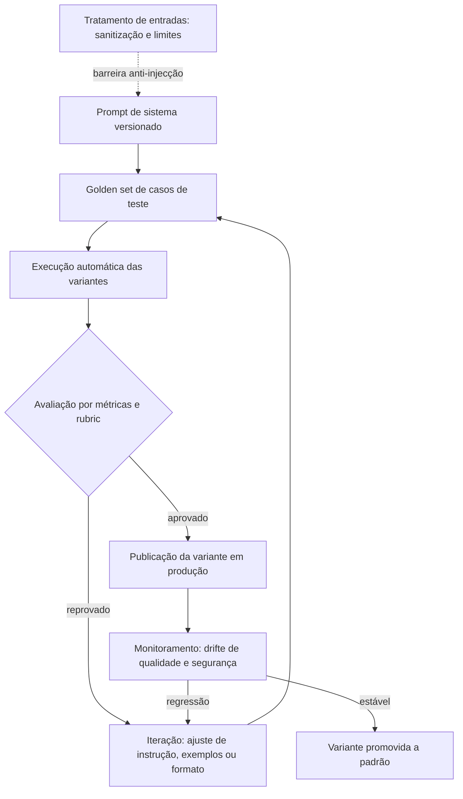

# Capítulo 11: Prompts de sistema: a constituição silenciosa do agente

## 1. Introdução

No capítulo anterior, você aprendeu a escrever prompts deliberados — e reconheceu o ponto exato em que a técnica para de escalar [4]. Agora chegou a hora de tratar o prompt como o que ele é em produção: um artefato versionado, testado e governado, com o mesmo rigor que o código [5]. Este capítulo mostra o salto do prompt solto para o prompt de sistema — a constituição silenciosa que define o comportamento do agente [1].

Este capítulo tem três objetivos. Primeiro, entender o papel do prompt de sistema e por que ele é o ponto de controle mais barato do sistema [1]. Segundo, dominar as técnicas de produção: versionamento, teste e avaliação de mudanças [9]. Terceiro, conhecer os limites — injecão de prompt, alucinação e o custo do contexto — que transformam a engenharia de prompt em engenharia de sistemas [16][19].

## 2. Explica

### 2.1 O prompt de sistema como contrato de comportamento

O prompt de sistema é o texto que define quem o modelo é e como ele deve se comportar em todas as interações [1]. Diferente do prompt de usuário, ele é estável, pertence à equipe e é versionado junto com o código [1]. Na prática, é a primeira camada de governança: regras de tom, limites de ação e formato de saída vivem aqui [2]. A documentação dos provedores é explícita sobre isso: o prompt de sistema é o lugar para instruções persistentes, e o prompt de usuário, para o conteúdo da conversa [1][5].

### 2.2 Sistemas, não mensagens

Os agentes eficazes não são prompts grandes — são sistemas com prompt [2]. A arquitetura recomendada separa o modelo do harness: o modelo fornece o raciocínio, e o código decide o fluxo, as ferramentas e os critérios de parada [2]. É por isso que a engenharia de contexto se tornou a disciplina-irmã da engenharia de prompt: o que entra na janela determina o que o modelo pode fazer bem [3].

### 2.3 O desenho do prompt guiado pelo formato

Os guias de design dos provedores convergem em um conjunto de princípios: instruções específicas, formato de saída estruturado, poucos exemplos de alta qualidade e a divisão clara entre instrução e conteúdo [4][6]. Um prompt bem desenhado prevê a saída — o modelo devolve o formato que o sistema espera, e o custo de integração despenca [4].

### 2.4 Few-shot e o poder dos exemplos

Exemplos de alta qualidade são o atalho mais confiável: modelos few-shot superam modelos zero-shot em praticamente todas as tarefas de raciocínio [8]. A teoria por trás disso é a emergência: capacidades que não existem em modelos pequenos aparecem em modelos grandes quando a escala aumenta [7]. Na prática, o few-shot é a técnica de maior retorno — três exemplos bons valem mais do que três parágrafos de instrução [8].

### 2.5 Versionamento: o prompt como código

Em produção, o prompt vira código: versionado, revisado e associado a um artefato de configuração [9]. A prática de versionamento separa o prompt da aplicação: uma mudança de prompt não deve exigir deploy de código, e uma mudança de código não deve alterar o prompt silenciosamente [10]. Ferramentas de experimentação permitem comparar variantes em produção sem caos: tráfego real dividido entre versões, com medição objetiva [11].

### 2.6 Avaliação: o teste do prompt

A avaliação sistemática é o que transforma opinião em engenharia [12]. O padrão envolve um conjunto fixo de casos (golden set), critérios de sucesso e a execução automática das variantes sobre o mesmo conjunto [13]. Sem avaliação, cada ajuste de prompt é uma aposta; com ela, é uma hipótese testável [12].

### 2.7 Os limites que não se resolvem com prompt

Há limites que nenhum prompt resolve: a injecão de prompt — quando uma entrada maliciosa reescreve as instruções — precisa de controle de dados, não de texto [16]. As alucinações são um risco do modelo, mitigadas com ferramentas e verificação, não com súplicas [19]. E o contexto mal curado degrada o desempenho independentemente da qualidade do prompt [17]. Reconhecer esses limites é o que separa o profissional maduro do entusiasta [3].

## 3. Ilustra

### 3.1 A analogia do manual de operações da fábrica

Pense em uma fábrica: o manual de operações (o prompt de sistema) define as regras — uniforme, protocolo, limites de segurança — e é revisado por engenharia antes de qualquer mudança [1]. Os operários (os modelos) seguem o manual, mas cada um interpreta à sua maneira; por isso o manual é testado com os mesmos operários antes de virar padrão [12]. Se alguém pendurar um cartaz falso na porta (injecão de prompt), o manual perde o controle — e a resposta não é escrever melhor o manual, é trancar a porta [16].



### 3.2 O manual que nunca muda sem aviso

A beleza do desenho é o ciclo: toda mudança de prompt passa pelo mesmo portão de avaliação que o código [9]. É isso que torna o sistema previsível — e é exatamente o que a engenharia de prompt perde quando trata o prompt como um chat privado [10].

## 4. Técnica

### 4.1 Um prompt de sistema versionado

O exemplo abaixo mostra um prompt de sistema tratado como artefato: instruções claras, limites explícitos e formato de saída previsto [1][6]:

```python
SISTEMA = '''Você é um assistente de suporte de uma loja virtual.

Regras:
- Responda apenas sobre pedidos, envios e devoluções.
- Se a pergunta estiver fora do escopo, diga que não pode responder.
- Nunca invente códigos de rastreio; informe quando não souber.
- Responda em português, em até 80 palavras.

Formato de saída:
{"resposta": "texto", "confianca": 0.0 a 1.0}
'''
```

Cada regra existe para proteger um comportamento observável — e cada uma pode virar um caso do golden set [13].

### 4.2 Um harness de avaliação de variantes

O trecho abaixo executa duas variantes de prompt sobre o mesmo conjunto de casos e compara os resultados [12]:

```python
def avaliar(prompt_variante, casos):
    acertos = 0
    for caso in casos:
        resposta = invocar_modelo(prompt_variante, caso["pergunta"])
        if caso["esperado"] in resposta:
            acertos += 1
    return round(acertos / len(casos), 3)


resultado_atual = avaliar(SISTEMA, casos_de_teste)
resultado_proposta = avaliar(SISTEMA_PROPOSTO, casos_de_teste)
print("atual:", resultado_atual, "| proposta:", resultado_proposta)
```

Se a proposta não vencer no golden set, ela não vai para produção — um critério objetivo que dispensa discussão [12].

### 4.3 Proteção contra injecão de prompt

A proteção começa fora do prompt: tratar dados do usuário como dados, não como instruções [16]:

```python
def montar_mensagem_usuario(texto: str) -> str:
    # Conteúdo do usuário é dado, nunca instrução: delimitado e sem formatação especial
    return f"[conteudo do usuario]\n{texto}\n[/conteudo]\n"


def resposta_valida(resposta: dict) -> bool:
    return "resposta" in resposta and 0.0 <= resposta.get("confianca", -1) <= 1.0
```

A validação da saída completa o ciclo: mesmo que a entrada tente escapar, a estrutura de resposta esperada é conferida antes de seguir [16].

## 5. Aplica

### 5.1 Onde isso vive no mundo real

Na prática, o fluxo de produção de prompts aparece em qualquer sistema com IA sério: o prompt de sistema vive em um repositório, muda via pull request, é avaliado contra um golden set e é monitorado em produção [9][10]. A indústria documentou esse caminho nos guias oficiais e nas ferramentas de experimentação [4][11]. E a fronteira da disciplina já migrou: o que diferencia as equipes não é escrever bem, é medir bem [13].

### 5.2 O erro comum do iniciante

O erro clássico é iterar o prompt no console do fornecedor e copiar a versão final para o código — sem registro, sem teste, sem revisão [10]. O segundo erro é acreditar que mais instruções resolvem problemas de contexto: o modelo executa melhor com uma janela curada do que com um manual gigante [17]. O caminho profissional é o ciclo deste capítulo: versionar, avaliar, medir e proteger [9][16].

## 6. Conclusão

O prompt de sistema é a constituição do agente — e, como toda constituição, precisa de versão, teste e limite [1][2]. Você aprendeu a tratar o prompt como código, a avaliá-lo com golden sets e a reconhecer os problemas que ele não resolve [12][16]. Nos próximos livros, essa disciplina se integra ao contexto, às skills e aos hooks — o prompt bem governado é a fundação sobre a qual a pilha inteira se apoia [3].


## 7. Referências

[1] ANTHROPIC. System prompts (documentação Claude). Disponível em: https://docs.anthropic.com/claude/docs/system-prompts. Acesso em: 5 ago. 2026.
[2] ANTHROPIC. Building Effective AI Agents. Disponível em: https://www.anthropic.com/engineering/building-effective-agents. Acesso em: 5 ago. 2026.
[3] ANTHROPIC. Effective context engineering for AI agents. Disponível em: https://www.anthropic.com/engineering/effective-context-engineering-for-ai-agents. Acesso em: 5 ago. 2026.
[4] GOOGLE CLOUD. Generative AI Prompt Design Guide. Disponível em: https://cloud.google.com/vertex-ai/generative-ai/docs/learn/prompts/prompt-design. Acesso em: 5 ago. 2026.
[5] OPENAI. Best practices for prompt engineering with the OpenAI API. Disponível em: https://help.openai.com/en/articles/6654000-best-practices-for-prompt-engineering-with-openai-api. Acesso em: 5 ago. 2026.
[6] OPENAI. Prompt engineering. Disponível em: https://developers.openai.com/api/docs/guides/prompt-engineering. Acesso em: 5 ago. 2026.
[7] WEI, Jason; et al. Emergent Abilities of Large Language Models. 2022. Disponível em: https://arxiv.org/abs/2206.07682. Acesso em: 5 ago. 2026.
[8] BROWN, Tom B.; et al. Language Models are Few-Shot Learners. 2020. Disponível em: https://arxiv.org/abs/2005.14165. Acesso em: 5 ago. 2026.
[9] BRAINTRUST. What is prompt versioning? Best practices for iteration without breaking production. Disponível em: https://www.braintrust.dev/articles/what-is-prompt-versioning. Acesso em: 5 ago. 2026.
[10] PAN, Tian. Prompt Versioning in Production: The Engineering Discipline Teams Learn the Hard Way. Disponível em: https://tianpan.co/blog/2026-04-09-prompt-versioning-production-llm. Acesso em: 5 ago. 2026.
[11] GROWTHBOOK. How to test multiple prompts in production (without chaos). Disponível em: https://www.growthbook.io/insights/how-test-multiple-prompts-production-without-chaos. Acesso em: 5 ago. 2026.
[12] LANGCHAIN. Evaluating LLM Systems: Metrics and Best Practices. Disponível em: https://blog.langchain.dev/evaluating-llm-platforms/. Acesso em: 5 ago. 2026.
[13] CHANG, Yupeng; et al. A Survey on Evaluation of Large Language Models. 2023. Disponível em: https://arxiv.org/abs/2307.03109. Acesso em: 5 ago. 2026.
[14] OPENAI. Function Calling Guide. Disponível em: https://developers.openai.com/api/docs/guides/function-calling. Acesso em: 5 ago. 2026.
[15] ANTHROPIC. Claude Cookbook: Tool Use. Disponível em: https://platform.claude.com/cookbook/tool-use. Acesso em: 5 ago. 2026.
[16] OWASP. Prompt Injection: OWASP Top 10 for LLM Applications. Disponível em: https://owasp.org/www-project-top-10-for-large-language-model-applications/. Acesso em: 5 ago. 2026.
[17] WANG, Xuezhi; et al. Self-Consistency Improves Chain of Thought Reasoning in Language Models. 2022. Disponível em: https://arxiv.org/abs/2203.11171. Acesso em: 5 ago. 2026.
[18] WENG, Lilian. LLM-Powered Autonomous Agents. Disponível em: https://lilianweng.github.io/posts/2023-06-23-agent/. Acesso em: 5 ago. 2026.
[19] WENG, Lilian. Extrinsic Hallucinations in LLMs. Disponível em: https://lilianweng.github.io/posts/2024-07-07-hallucination/. Acesso em: 5 ago. 2026.
[20] TESTING LIBRARY. Guiding Principles. Disponível em: https://testing-library.com/docs/guiding-principles/. Acesso em: 5 ago. 2026.
