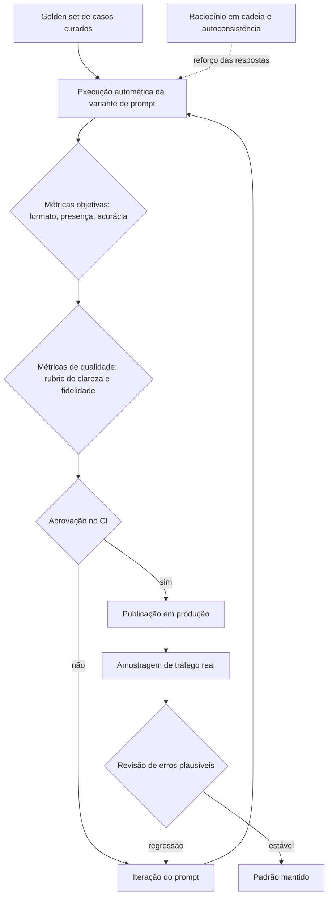

# Capítulo 12: Avaliação de prompts: transformando respostas em métricas

## 1. Introdução

No capítulo anterior, você tratou o prompt como código: versionado, testado e protegido [5]. Este capítulo aprofunda a parte mais importante desse ciclo — a medição. Avaliar respostas de um modelo é diferente de avaliar código: o código falha ou passa, e a resposta do modelo pode ser plausível porém errada [17]. A disciplina de avaliação é o que transforma essa diferença de engenharia de artefato em engenharia de confiança [1].

Este capítulo tem três objetivos. Primeiro, dominar a anatomia de uma avaliação: casos, métricas e critérios [1]. Segundo, aprender as técnicas de medição — do golden set ao julgamento por rubric — e quando usar cada uma [2][6]. Terceiro, conectar a avaliação ao ciclo de desenvolvimento: CI de prompts, monitoramento em produção e a ponte para a engenharia de evals que você verá no Livro 10 [15].

## 2. Explica

### 2.1 O golden set como base da medição

Toda avaliação começa com um conjunto fixo de casos: perguntas com respostas esperadas, escolhidas para representar o uso real [1]. O golden set é o termômetro da mudança — qualquer ajuste de prompt é medido contra ele [1]. A regra de ouro: casos de sucesso, casos de borda e casos de erro explícitos, em proporções realistas [2].

### 2.2 Métricas objetivas e o julgamento por rubric

Há dois níveis de medição. O primeiro é objetivo: acurácia em tarefas com resposta única, taxa de formato válido, presença de elementos obrigatórios [1]. O segundo é o julgamento por rubric: critérios explícitos de qualidade — clareza, fidelidade, tom — pontuados de forma consistente [2]. A pesquisa em avaliação de modelos consolida esse desenho: métricas de tarefa e métricas de qualidade caminham juntas [2].

### 2.3 O erro plausível: a falha que não falha

O maior desafio da avaliação de IA é a resposta plausível porém errada [17]. Um teste que verifica apenas se a resposta "existe" não captura isso; é preciso verificar o conteúdo [17]. A técnica mais forte é o raciocínio em cadeia: pedir que o modelo explicite os passos antes da resposta, o que permite conferir o caminho e não só o destino [6]. A autoconsistência melhora ainda mais: amostrar várias respostas e escolher a mais consensual [8].

### 2.4 Amostragem e o custo da avaliação

Avaliar tudo custa caro; avaliar a amostra certa é engenharia [3]. Ferramentas de experimentação dividem o tráfego real entre variantes e medem desfechos — taxa de erro, tempo de resposta, satisfação [3]. O desenho correto isola a variável: só o prompt muda, todo o resto permanece [3]. Sem esse cuidado, qualquer diferença medida pode ser ruído, não efeito [3].

### 2.5 Da avaliação ao CI: o portão de release

A avaliação só vale se bloquear: a variante de prompt entra no fluxo de integração contínua e o golden set roda a cada mudança, exatamente como os testes de código [15]. O modelo mental é o mesmo da pirâmide de testes: avaliações rápidas e baratas no ciclo curto, avaliações caras e completas antes do release [15]. É a ponte que liga a engenharia de prompt à engenharia de evals do Livro 10 [1].

### 2.6 Monitoramento em produção: o drift

O golden set mede o passado; o drift mede o presente [11]. Em produção, o modelo responde a perguntas que o conjunto de testes nunca viu, e o mundo muda — novas perguntas, novas falhas [11]. O monitoramento contínuo com amostragem e revisão periódica captura a degradação antes que ela vire incidente [11]. A combinação completa: golden set no CI, amostragem em produção e revisão humana periódica dos erros [1][3].

## 3. Ilustra

### 3.1 A analogia do provador de vinhos da fábrica

Pense na linha de produção de uma fábrica de vinhos: o provador (o golden set) avalia cada lote contra um padrão fixo antes de engarrafar [1]. Mas o provador não prova a garrafa que o consumidor abrirá em casa — por isso a fábrica também amostra lotes já expedidos e acompanha devoluções [11]. O provador garante o padrão; a amostragem garante a realidade. Um sem o outro é falsa confiança [1].



### 3.2 O provador que também aprende

O desenho fecha o ciclo: cada erro plausível encontrado em produção vira um caso novo no golden set [1]. A avaliação melhora com o tempo — e o sistema fica mais confiável a cada iteração, em vez de estagnar [2].

## 4. Técnica

### 4.1 Um avaliador com métricas objetivas

O exemplo abaixo mede formato válido e presença de elementos obrigatórios — a camada barata e rápida da avaliação [1]:

```python
def avaliar_formato(resposta: str, obrigatorios: list[str]) -> dict:
    resultado = {"formato_valido": False, "faltando": []}
    try:
        dados = json.loads(resposta)
        resultado["formato_valido"] = True
    except json.JSONDecodeError:
        return resultado
    faltando = [campo for campo in obrigatorios if campo not in dados]
    resultado["faltando"] = faltando
    return resultado


print(avaliar_formato('{"resposta": "ok", "confianca": 0.9}', ["resposta", "confianca"]))
```

A saída estruturada transforma a checagem de qualidade em um teste determinístico — o mesmo espírito dos testes de código [1][15].

### 4.2 Raciocínio em cadeia com validação de passos

O trecho abaixo pede raciocínio explícito e valida o passo intermediário antes de aceitar a resposta final [6]:

```python
def resolver_com_verificacao(pergunta: str) -> dict:
    saida = invocar_modelo(
        pergunta,
        instrucao="Explique os passos e só então responda no formato JSON.",
    )
    passos = saida["passos"]
    resposta_final = saida["resposta"]
    conferencia = invocar_modelo(
        f"Os passos abaixo estão corretos para a pergunta?\n{passos}",
        instrucao="Responda sim ou não em JSON.",
    )
    return {"resposta": resposta_final, "passos_validados": conferencia["sim"]}
```

A verificação em dois tempos — raciocinar primeiro, conferir depois — captura o erro plausível que a resposta única esconderia [6][8].

### 4.3 O portão de CI para prompts

Para fechar o ciclo, um comando que roda o golden set e falha se a variante não atingir o piso [15]:

```python
def portao_de_release(variante, casos, piso: float = 0.9) -> bool:
    indice = avaliar_variante(variante, casos)
    if indice < piso:
        raise SystemExit(f"variante reprovada: {indice} abaixo do piso {piso}")
    print(f"variante aprovada: {indice}")
    return True
```

No pipeline de CI, essa função é um passo como qualquer outro — e o release de prompts fica tão seguro quanto o release de código [15].

## 5. Aplica

### 5.1 Onde isso vive no mundo real

Na prática, o ciclo de avaliação aparece em sistemas de IA maduros: o golden set vive no repositório, o CI roda a avaliação a cada mudança de prompt e o monitoramento amostra o tráfego real [1][15]. O mercado de 2026 reconheceu essa necessidade — ferramentas de observabilidade e experimentação de prompts são categoria própria [11]. E a disciplina se conecta à série: o que você faz aqui manualmente, o Livro 10 fará com evals automatizadas e revisão entre harnesses [1].

### 5.2 O erro comum do iniciante

O erro clássico é avaliar a resposta "no olho": achar que duas respostas boas provam que a mudança é boa [1]. O segundo erro é um golden set pequeno e viciado — casos que só testam o que o prompt já faz bem [2]. O caminho profissional: casos representativos, métricas objetivas primeiro, rubric depois, e o portão de CI decidindo por você [15].

## 6. Conclusão

Avaliar é a diferença entre acreditar e saber [1]. Você aprendeu a montar um golden set, a medir com métricas e rubrics, a capturar o erro plausível com raciocínio em cadeia e a travar o release no CI [1][6][15]. Essa base de medição é exatamente o que a engenharia de evals aprofunda no Livro 10 — e é o que torna cada camada da pilha verificável em vez de esperançosa [2].


## 7. Referências

[1] LANGCHAIN. Evaluating LLM Systems: Metrics and Best Practices. Disponível em: https://blog.langchain.dev/evaluating-llm-platforms/. Acesso em: 5 ago. 2026.
[2] CHANG, Yupeng; et al. A Survey on Evaluation of Large Language Models. 2023. Disponível em: https://arxiv.org/abs/2307.03109. Acesso em: 5 ago. 2026.
[3] GROWTHBOOK. How to test multiple prompts in production (without chaos). Disponível em: https://www.growthbook.io/insights/how-test-multiple-prompts-production-without-chaos. Acesso em: 5 ago. 2026.
[4] BRAINTRUST. What is prompt versioning? Best practices for iteration without breaking production. Disponível em: https://www.braintrust.dev/articles/what-is-prompt-versioning. Acesso em: 5 ago. 2026.
[5] PAN, Tian. Prompt Versioning in Production: The Engineering Discipline Teams Learn the Hard Way. Disponível em: https://tianpan.co/blog/2026-04-09-prompt-versioning-production-llm. Acesso em: 5 ago. 2026.
[6] WEI, Jason; et al. Chain-of-Thought Prompting Elicits Reasoning in Large Language Models. 2022. Disponível em: https://arxiv.org/abs/2201.11903. Acesso em: 5 ago. 2026.
[7] KOJIMA, Takeshi; et al. Large Language Models are Zero-Shot Reasoners. 2022. Disponível em: https://arxiv.org/abs/2205.11916. Acesso em: 5 ago. 2026.
[8] WANG, Xuezhi; et al. Self-Consistency Improves Chain of Thought Reasoning in Language Models. 2022. Disponível em: https://arxiv.org/abs/2203.11171. Acesso em: 5 ago. 2026.
[9] BROWN, Tom B.; et al. Language Models are Few-Shot Learners. 2020. Disponível em: https://arxiv.org/abs/2005.14165. Acesso em: 5 ago. 2026.
[10] WEI, Jason; et al. Emergent Abilities of Large Language Models. 2022. Disponível em: https://arxiv.org/abs/2206.07682. Acesso em: 5 ago. 2026.
[11] SITEPOINT. Vibe Coding 2026: The Complete Guide to AI-First Development. Disponível em: https://www.sitepoint.com/vibe-coding-2026-complete-guide/. Acesso em: 5 ago. 2026.
[12] KARPATHY, Andrej. Software 3.0: Software in the Age of AI. Disponível em: https://www.latent.space/p/s3. Acesso em: 5 ago. 2026.
[13] CHROMA. Context Rot: How Increasing Input Tokens Impacts LLM Performance. Disponível em: https://www.trychroma.com/research/context-rot. Acesso em: 5 ago. 2026.
[14] ANTHROPIC. Effective context engineering for AI agents. Disponível em: https://www.anthropic.com/engineering/effective-context-engineering-for-ai-agents. Acesso em: 5 ago. 2026.
[15] FOWLER, Martin. Continuous Integration. Disponível em: https://martinfowler.com/articles/continuousIntegration.html. Acesso em: 5 ago. 2026.
[16] OWASP. Prompt Injection: OWASP Top 10 for LLM Applications. Disponível em: https://owasp.org/www-project-top-10-for-large-language-model-applications/. Acesso em: 5 ago. 2026.
[17] WENG, Lilian. LLM-Powered Autonomous Agents. Disponível em: https://lilianweng.github.io/posts/2023-06-23-agent/. Acesso em: 5 ago. 2026.
[18] WENG, Lilian. Extrinsic Hallucinations in LLMs. Disponível em: https://lilianweng.github.io/posts/2024-07-07-hallucination/. Acesso em: 5 ago. 2026.
[19] ANTHROPIC. Building Effective AI Agents. Disponível em: https://www.anthropic.com/engineering/building-effective-agents. Acesso em: 5 ago. 2026.
[20] TESTING LIBRARY. Guiding Principles. Disponível em: https://testing-library.com/docs/guiding-principles/. Acesso em: 5 ago. 2026.
