# Engenharia de contexto: janelas, memória e o fim do prompt solto

# Como Este Livro Foi Escrito: A Metodologia EITA

Todo capítulo deste livro segue a metodologia **EITA** — um framework pedagógico de 7 seções projetado para transformar o leitor de "não sei" para "consigo fazer" em cada tema abordado.

## As 7 Seções do EITA

### 1. INTRODUÇÃO
Contextualiza o tema. Explica o que será abordado, por que importa, e o que você será capaz ao final. Uma ponte conecta com o capítulo anterior (quando houver).

### 2. EXPLICA
Desconstrói o conceito: causa raiz, mecânica subjacente, definições precisas. Você passa de "não sei o que é" para "sei definir e explicar".

### 3. ILUSTRA
Uma analogia concreta ancora o conceito na sua intuição — sempre acompanhada de um diagrama visual que torna o abstrato tangível. Você passa de "parece abstrato" para "faz sentido".

### 4. TÉCNICA
O núcleo de valor: código executável, arquiteturas, passo a passo de implementação. É aqui você ganha as mãos para fazer. Você passa de "não sei fazer" para "consigo implementar".

### 5. APLICA
Contextualização em cenário real: onde aquilo se aplica no mercado, armadilhas comuns e como evitá-las. Você passa de "isso é teórico" para "vou usar no trabalho".

### 6. CONCLUSÃO
Síntese dos 3 pontos principais, conexão com o próximo capítulo e um desafio opcional para fixar o aprendizado.

### 7. REFERÊNCIAS BIBLIOGRÁFICAS
Fontes citadas no capítulo, em formato ABNT numerado. Toda afirmação factual tem sua referência.

## Por Que Funciona

O EITA não é uma lista de tópicos — é uma **jornada de transformação**. Cada seção leva o leitor a um estado mental diferente:

```
Introdução → "Quero aprender"
Explica     → "Entendi a teoria"
Ilustra     → "Faz sentido na prática"
Técnica     → "Consigo fazer"
Aplica      → "Vou usar no trabalho"
Conclusão   → "Dominei este tema"
```

## Diagrama do Fluxo EITA


## Dica de Leitura

Você pode ler os capítulos em ordem (recomendado para iniciantes) ou pular diretamente para o tema de interesse. Cada capítulo é autocontido, mas a sequência cria conexões que ampliam o aprendizado.

---

*A metodologia EITA é uma criação da Fábrica Agêntica de Livros, projetada para produzir literatura técnica que transforma leitores em profissionais.*

# PARTE 1 — A Janela como Recurso Finito

# Capítulo 1 — O ambiente informacional: do prompt ao contexto

## 1. Introdução

Os dois primeiros livros desta série estabeleceram um fato que parece contraditório: a engenharia de prompts, a disciplina mais celebrada da era da IA generativa, é também a que menos escala. No Livro 2, você viu onde a técnica para: o prompt não carrega conhecimento, não resolve tarefas fora do limiar do modelo e não suporta a complexidade de sessões longas [19]. Este capítulo começa a construir a resposta para esse limite — a camada que a indústria consolidou entre 2024 e 2026 sob o nome de engenharia de contexto (context engineering) [1][19]. A tese é direta: um prompt bem escrito é uma boa mensagem; um sistema de contexto bem projetado é um ambiente informacional — o conjunto de tudo o que o modelo vê, lembra e recupera antes de responder [1]. A diferença entre escrever mensagens e desenhar ambientes é a diferença entre a Parte I e a Parte II desta série [1][19].

## 2. Explica

### 2.1 A Definição Técnica de Engenharia de Contexto

A Anthropic define engenharia de contexto como o conjunto de estratégias para curar, selecionar, comprimir e isolar o conjunto ideal de tokens que alimentam um modelo em tempo de inferência [1]. A definição tem três termos que merecem atenção. Primeiro, "curar": o contexto não é coletado — é construído com intenção, peça por peça [1]. Segundo, "selecionar": em um universo de informação disponível, apenas uma fração entra na janela, e a escolha dessa fração é uma decisão de engenharia [1]. Terceiro, "isolar": em sistemas com múltiplos agentes, o contexto de cada um deve ser protegido da contaminação dos demais [1]. A definição substitui a pergunta do Livro 2 ("como escrevo a melhor mensagem?") por uma pergunta mais ampla ("como desenho o melhor ambiente informacional?") [1][19].

### 2.2 O Prompt como Superfície, o Contexto como Substância

O prompt é a superfície visível da interação — o texto que o engenheiro escreve e o usuário percebe [1]. O contexto é a substância: tudo o que o modelo processa além da instrução, incluindo dados de sessão, conhecimento recuperado, histórico de conversas, saídas de ferramentas e políticas da organização [1][7]. A metáfora é a do palco: o prompt é o roteiro; o contexto é o cenário, os atores coadjuvantes, os adereços e a iluminação [1]. Um roteiro brilhante em um palco vazio produz uma peça pobre; um roteiro mediano em um palco rico produz um espetáculo. A indústria aprendeu essa lição ao medir o impacto do contexto na qualidade das respostas: a mesma instrução, com contextos diferentes, produz resultados dramaticamente diferentes [2][12].

### 2.3 Por Que o Contexto Decidiu o Desempenho (Evidência de Mercado)

A afirmação de que o contexto decide o desempenho não é retórica — é medida [2][12]. O estudo da Chroma sobre context rot demonstrou que o desempenho de modelos degrada à medida que o volume de tokens de entrada cresce, mesmo em tarefas simples [2]. A degradação não é linear e depende de fatores como a similaridade entre a informação procurada e a pergunta feita [2]. Em benchmarks de agentes de desenvolvimento de software e análise de dados, a literatura e a prática de mercado convergem em números impressionantes: sistemas com contexto bruto e não curado acertam cerca de 30% das tarefas, enquanto sistemas com contexto bem curado alcançam cerca de 90% [1][12]. O salto de 30% para 90% não vem de melhor escrita de prompts — vem de melhor arquitetura de contexto [1][12].

### 2.4 O Fim do Prompt Solto

O título deste livro anuncia "o fim do prompt solto" — a expressão resume a transição disciplinar [1][19]. Prompt solto é a prática de escrever instruções isoladas, sem considerar de onde vem a informação, quanto tempo ela permanece na janela e o que acontece quando o contexto cresce [1]. A engenharia de contexto enterra essa prática ao tratar o prompt como uma peça dentro de um sistema maior [1]. O Medium documenta a mesma transição sob o lema "context is the new prompt": a competência que diferencia engenheiros de IA em 2026 não é escrever a instrução perfeita, mas projetar o fluxo de informação que a instrução governa [19].

### 2.5 Os Quatro Pilares: Write, Select, Compress, Isolate

O framework operacional da engenharia de contexto, consolidado pela Anthropic em 2025, organiza o trabalho em quatro operações [1][6][7]. **Write** (escrever) trata da produção de instruções e ferramentas em "altitude ideal" — nem regras if-else excessivamente rígidas, nem generalizações vagas [1][6]. **Select** (selecionar) trata da escolha just-in-time do que entra na janela, substituindo o pré-processamento massivo por referências leves que o agente explora sob demanda [1]. **Compress** (comprimir) trata da compactação do histórico e da limpeza de resultados de ferramentas obsoletos [1][7]. **Isolate** (isolar) trata da delegação a subagentes com janelas dedicadas, evitando a contaminação cruzada entre tarefas [1]. Os quatro pilares estruturam os Capítulos 5 a 7 deste livro [1].

### 2.6 A Janela como Palco: o Recurso Central

Toda a engenharia de contexto acontece dentro de uma restrição física: a janela de contexto [8][2]. A janela é a quantidade finita de tokens que o modelo processa em uma única passagem — e ela define o teto de tudo o que o ambiente informacional pode conter [8]. O Survey de LLMs de Zhao documenta os fundamentos arquiteturais da janela, incluindo o mecanismo de atenção e seu custo quadrático em relação ao comprimento da entrada [8]. A janela não é um detalhe de implementação: é o palco onde o espetáculo acontece, e o engenheiro de contexto é, antes de tudo, um diretor que decide o que sobe ao palco [1][8].

### 2.7 O Vocabulário da Camada

A engenharia de contexto introduz um vocabulário que atravessa todo o livro [1][15]. **Janela de contexto**: a capacidade finita de tokens [8]. **Token**: a unidade atômica de processamento [8]. **Recuperação**: a busca de informação relevante para entrar na janela [3][14]. **Memória**: a persistência de informação entre sessões [7][13]. **Compactação**: a redução do histórico por resumo ou descarte [7]. **Subagente**: um agente auxiliar com janela própria [1]. **Contaminação cruzada**: o vazamento de contexto entre tarefas [1]. Cada termo será desenvolvido nos próximos capítulos; dominar o vocabulário agora é dominar o mapa da disciplina [1][19].

### 2.8 A Relação com a Parte I

A engenharia de contexto não substitui a engenharia de prompts — ela a absorve [1][19]. As técnicas da Parte I — anatomia, few-shot, chain-of-thought — continuam válidas, mas passam a operar dentro do ambiente informacional [19]. O prompt de sistema, estudado no Livro 2, vira o componente estável do contexto; os dados de sessão e o conhecimento recuperado viram os componentes dinâmicos [1][7]. A transição é análoga à da engenharia de software: primeiro se aprende a escrever boas funções (prompts), depois se aprende a desenhar bons sistemas (contexto) [19]. A Parte II da série constrói exatamente essa camada, e este livro é o seu primeiro tijolo [1].

## 3. Ilustra

### 3.1 A Analogia do Palco

A analogia do palco ilumina a diferença entre prompt e contexto [1]. O roteiro (prompt) diz o que os atores falam; o cenário (contexto) diz onde estão, o que veem e o que têm à mão [1]. Um diretor experiente gasta mais tempo no cenário do que no roteiro, porque sabe que o ambiente decide metade da atuação [1]. O mesmo vale para o engenheiro de IA maduro em 2026: o tempo investido em contexto paga mais do que o tempo investido em redação de instruções [1][19].

### 3.2 O Diagrama do Fluxo do Contexto

O diagrama abaixo representa o fluxo completo do ambiente informacional de um agente: as fontes de informação, a seleção, a composição e a inferência [1][3].

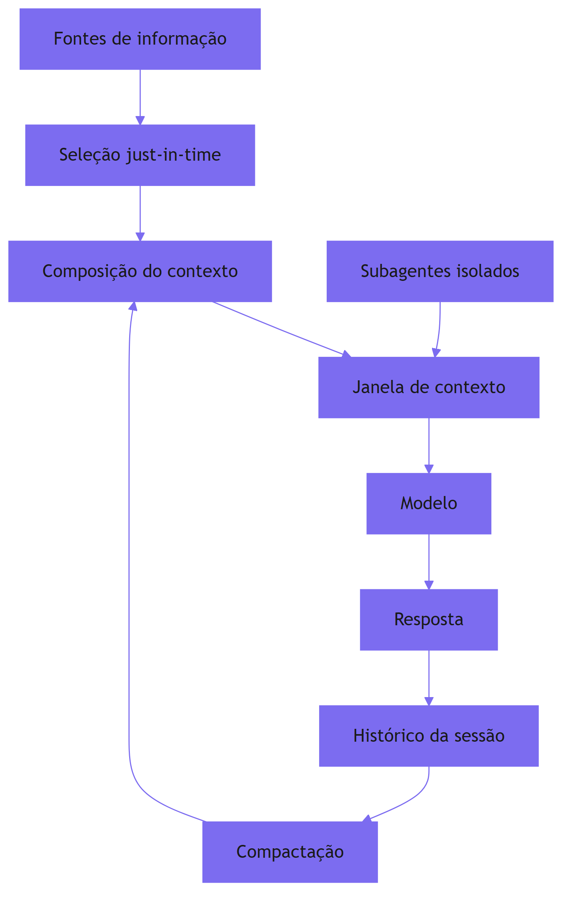

O ciclo é a essência da disciplina: selecionar, compor, inferir, registrar, compactar e reusar [1][7]. O histórico da sessão realimenta o contexto via compactação — a operação Compress do framework [1][7]. Os subagentes entram na janela apenas com resumos destilados — a operação Isolate [1].

### 3.3 O Antes e o Depois na Prática

A comparação concreta ajuda a fixar o conceito [2][12]. **Antes (prompt solto)**: o engenheiro escreve uma instrução detalhada pedindo análise de um relatório, e o modelo responde com análise genérica porque não tem o relatório [1]. **Depois (contexto curado)**: o sistema recupera o relatório, seleciona as seções relevantes, compõe o contexto e só então a instrução é executada — a análise passa a citar os dados reais [1][3]. A diferença não está na instrução — está no ambiente informacional [1][12].

## 4. Técnica

### 4.1 Medindo a Janela: Contagem de Tokens

O primeiro instrumento do engenheiro de contexto é a contagem de tokens [8]. Antes de projetar o ambiente informacional, é preciso saber quanto cabe na janela [8]. O código abaixo conta os tokens de um texto usando a tokenização heurística por palavras — uma aproximação didática da contagem real feita pelo tokenizer do modelo [8]:

```python
def contar_tokens_aproximado(texto: str) -> int:
    """Conta tokens aproximados (heurística: ~4 chars por token em inglês,
    ~2-3 chars por token em português acentuado)."""
    if not texto.strip():
        return 0
    palavras = texto.split()
    # Aproximação: token médio ~4 caracteres para texto em inglês;
    # ajuste fino por idioma pode melhorar a estimativa.
    return max(1, round(sum(len(p) for p in palavras) / 4))


def orcamento_janela(texto_base: str, janela_total: int, margem: float = 0.2) -> dict:
    """Calcula o orçamento da janela dado o texto-base e uma margem de segurança."""
    tokens_base = contar_tokens_aproximado(texto_base)
    reserva = int(janela_total * margem)
    disponivel = max(0, janela_total - tokens_base - reserva)
    return {
        "tokens_texto_base": tokens_base,
        "reserva_margem": reserva,
        "tokens_disponiveis_contexto": disponivel,
        "proporcao_ocupada": round(tokens_base / janela_total, 2),
    }


# Exemplo de uso
if __name__ == "__main__":
    prompt_sistema = (
        "Você é um analista financeiro. Responda com base exclusivamente "
        "nos dados fornecidos no contexto, citando os números exatos."
    )
    print(orcamento_janela(prompt_sistema, janela_total=128_000))
```

O orçamento da janela é a ferramenta que impede o erro mais comum do iniciante: encher a janela sem reserva para o contexto dinâmico [1][8]. A reserva de margem garante espaço para a recuperação e o histórico [8].

### 4.2 O Inventário do Ambiente Informacional

O segundo instrumento é o inventário: a listagem explícita de tudo o que o sistema pode colocar na janela [1]. O código abaixo modela o inventário de um agente e calcula o custo de cada componente [1][8]:

```python
from dataclasses import dataclass


@dataclass
class ComponenteContexto:
    nome: str
    tokens_estimados: int
    frequencia: str  # "estatico", "por_sessao", "sob_demanda"


INVENTARIO = [
    ComponenteContexto("Prompt de sistema", 1200, "estatico"),
    ComponenteContexto("Políticas da organização", 800, "estatico"),
    ComponenteContexto("Dados da sessão do usuário", 500, "por_sessao"),
    ComponenteContexto("Histórico da conversa", 3000, "por_sessao"),
    ComponenteContexto("Documento recuperado (RAG)", 2500, "sob_demanda"),
    ComponenteContexto("Saída de ferramenta", 1500, "sob_demanda"),
]


def custo_total(inventario: list) -> int:
    return sum(c.tokens_estimados for c in inventario)


def resumo_por_frequencia(inventario: list) -> dict:
    resumo = {}
    for c in inventario:
        resumo.setdefault(c.frequencia, 0)
        resumo[c.frequencia] += c.tokens_estimados
    return resumo


if __name__ == "__main__":
    print("Custo total estimado:", custo_total(INVENTARIO), "tokens")
    print("Por frequência:", resumo_por_frequencia(INVENTARIO))
```

O inventário transforma a engenharia de contexto em disciplina mensurável: cada componente tem custo, e a soma precisa caber na janela [1][8]. O padrão profissional registra o inventário no repositório, versionado como qualquer outro artefato de engenharia [15].

### 4.3 O Fluxo Write/Select em Código

O terceiro instrumento concretiza as operações Write e Select em uma função de composição [1][6]. O Write produz as instruções; o Select escolhe, sob demanda, quais fontes entram na janela [1]:

```python
def compor_contexto(
    prompt_sistema: str,
    fontes_disponiveis: dict,
    consulta: str,
    janela_total: int,
    margem: float = 0.15,
) -> dict:
    """Compoe o contexto seguindo o fluxo write/select.

    write: prompt_sistema ja vem pronto (instrucoes em altitude ideal).
    select: apenas as fontes relevantes a 'consulta' entram na janela.
    """
    tokens_base = contar_tokens_aproximado(prompt_sistema)
    limite = int(janela_total * (1 - margem))
    selecionadas = {}
    ocupado = tokens_base
    for nome, conteudo in fontes_disponiveis.items():
        custo = contar_tokens_aproximado(conteudo)
        if consulta.lower() in nome.lower() and ocupado + custo <= limite:
            selecionadas[nome] = conteudo
            ocupado += custo
    return {
        "prompt_sistema": prompt_sistema,
        "selecionadas": list(selecionadas.keys()),
        "tokens_ocupados": ocupado,
        "janela_total": janela_total,
    }


if __name__ == "__main__":
    fontes = {
        "relatorio_q3": "Dados do relatorio do terceiro trimestre...",
        "politica_compliance": "Regras internas de compliance...",
        "manual_produto": "Manual completo do produto...",
    }
    resultado = compor_contexto(
        "Você é um analista. Use apenas o contexto fornecido.",
        fontes,
        "relatorio",
        janela_total=16_000,
    )
    print(resultado)
```

A função demonstra o princípio central do Select: apenas o que é relevante à consulta entra na janela [1][6]. O código real de produção usa recuperação por embeddings e similaridade vetorial (Capítulo 9), mas a lógica de seleção condicional é a mesma [1][3].

## 5. Aplica

### 5.1 Onde Isso Vive no Mundo Real

A engenharia de contexto está em toda aplicação de IA séria em produção [1][15]. Assistentes de suporte recuperam políticas e histórico do cliente antes de responder [3]. Ferramentas de análise de dados injetam os dados do usuário no contexto [3]. Agentes de programação indexam o repositório e recuperam os arquivos relevantes à tarefa [15]. Em cada caso, o padrão é o mesmo: o modelo não é apenas instruído — é abastecido [1][3]. O LangChain documenta o gerenciamento de contexto como parte central da orquestração de agentes [15].

### 5.2 O Erro Comum do Iniciante

O erro mais comum de quem migra da engenharia de prompts para a de contexto é acreditar que "mais contexto é melhor" [2][1]. O iniciante despeja tudo na janela — o manual inteiro, o histórico completo, todas as saídas de ferramentas — e observa o desempenho cair [2]. O Capítulo 3 explica por que isso acontece (context rot); por ora, a lição é: o contexto é curado, não coletado [1][2]. O ambiente informacional é desenhado com intenção, e cada token extra tem custo e risco [1][2].

### 5.3 O Padrão Profissional em 2026

O padrão profissional em 2026 combina os quatro pilares do framework [1]. O prompt de sistema é enxuto e estável (Write) [1][6]. As fontes de informação são referenciadas, não embutidas — o agente busca o que precisa sob demanda (Select) [1]. O histórico é compactado periodicamente (Compress) [1][7]. Tarefas pesadas são delegadas a subagentes isolados (Isolate) [1]. O resultado é um sistema que mantém a qualidade de resposta mesmo em sessões longas e tarefas complexas [1][12].

### 5.4 Como Este Livro é Organizado

Este capítulo estabeleceu a fundação; os próximos constroem a estrutura [1]. O Capítulo 2 detalha a janela como recurso finito e seu orçamento [8]. Os Capítulos 3 e 4 documentam a degradação do contexto — context rot e lost in the middle [2][5]. Os Capítulos 5 a 7 desenvolvem o framework write/select/compress/isolate [1][6][7]. Os Capítulos 8 e 9 ensinam o diagnóstico de falhas e a recuperação de conhecimento (RAG) [3][12]. O Capítulo 10 fecha com memória, cache e as métricas de sucesso [7][12]. A jornada é a subida da pilha que a série prometeu [19].

### 5.5 O Papel do Prompt de Sistema no Ambiente Informacional

O leitor que vem da Parte I conhece o prompt de sistema como o documento de maior precedência da aplicação [19]. Na engenharia de contexto, o prompt de sistema ganha um papel novo: é o componente estável do ambiente informacional — a parte que não muda entre chamadas e que ancora o comportamento do agente [1][19]. A distinção é sutil e decisiva [1]. No Livro 2, o prompt de sistema era tratado como o texto que diz quem o modelo é e o que deve fazer [19]. Neste livro, ele é tratado como o primeiro bloco da composição — o bloco que permanece, enquanto os demais entram e saem [1].

A separação entre o estável e o dinâmico é o fundamento arquitetural do ambiente informacional [1][7]. O estável — prompt de sistema, políticas, instruções permanentes — ocupa o início do contexto e é candidato natural ao cache (Capítulo 10) [1][13]. O dinâmico — dados da sessão, histórico, recuperações — ocupa o espaço restante e é gerido pelas operações Select e Compress [1][7]. Quando o engenheiro mistura os dois, o sistema degrada: o dinâmico contamina o estável, e o cache perde o valor [13][1]. A separação é a primeira regra da arquitetura de contexto [1][13].

O prompt de sistema bem desenhado também simplifica as demais operações [1][6]. Um sistema enxuto e estável reduz a necessidade de compressão (menos a preservar) e facilita a seleção (menos a coordenar) [1][7]. A Anthropic documenta a interação: instruções em altitude ideal (Write) produzem menos atrito com o contexto dinâmico [1][6]. O inverso também é verdade: um prompt de sistema inchado com regras desnecessárias é uma dívida que o ambiente informacional paga em cada chamada [1][6].

A prática profissional versiona o prompt de sistema como código e o trata como componente da composição, não como texto isolado [1][15]. O LangChain documenta o gerenciamento do estado e das instruções como parte da orquestração [15]. O engenheiro de contexto escreve o prompt de sistema sabendo que ele é o alicerce do ambiente — e que cada regra adicionada ao alicerce custa espaço e atenção em toda a operação [1][15]. A revisão periódica do sistema contra o contexto real é parte da manutenção do ambiente [1][19].

### 5.6 O Ecossistema de Fontes: Do Repositório à Base de Conhecimento

O ambiente informacional de um agente real não tem uma única fonte — tem um ecossistema [1][3]. Código no repositório, documentos na base de conhecimento, dados na API, políticas no portal e histórico no armazenamento de sessões [1][3]. O engenheiro de contexto não apenas seleciona entre fontes — ele projeta o ecossistema: quais fontes existem, como são referenciadas e como competem pela janela [1][3]. A metáfora do ecossistema captura a dinâmica: as fontes interagem, e a saúde do ambiente depende do equilíbrio entre elas [1].

O primeiro design do ecossistema é a **tipagem das fontes** [1][6]. Cada fonte tem um tipo — código, documentação, dados, políticas, histórico — e cada tipo tem um modo de acesso próprio [1][6]. O código é explorado por primitivas (Capítulo 5); a documentação é recuperada por índice; os dados são consultados por API [1][6][3]. O tipo da fonte decide a ferramenta de acesso, e a ferramenta decide o custo e a forma da informação [6].

O segundo design é a **hierarquia de custo** das fontes [1][13]. Ler um arquivo local é barato; consultar uma API é caro; recuperar de um índice vetorial está no meio [1][13]. O agente inteligente consulta a fonte mais barata que resolve primeiro, e escala apenas quando necessário [1]. A hierarquia de custo é a materialização do orçamento da janela (Capítulo 2) aplicado às fontes [1][8][13].

O terceiro design é a **proveniência** [1][12]. Cada bloco de contexto carrega a origem: de qual fonte veio, quando, com que confiança [1][12]. A proveniência é o que permite o diagnóstico (Capítulo 8) e a avaliação (Capítulo 10) [12]. Quando a resposta erra, o engenheiro rastreia o bloco que causou o erro até a fonte — e corrige a fonte, não a resposta [1][12]. O ecossistema sem proveniência é uma caixa preta; com proveniência, é uma arquitetura auditável [1][12].

### 5.7 O Contexto Multi-Idioma e Multi-Domínio

O ambiente informacional raramente é monolíngue ou monodomínio [1][3]. O agente corporativo opera em português, inglês e espanhol; o agente técnico transita entre código, documentação e jargão de negócio [1][3]. A diversidade de idiomas e domínios é uma dimensão do design de contexto que o iniciante ignora — e que decide a qualidade em aplicações reais [1][3]. A primeira lição é que a recuperação e a seleção precisam operar através dos idiomas [3]. Um documento em inglês precisa ser recuperável a partir de uma consulta em português — o que exige embeddings multilingues ou normalização [3][4]. O survey de Gao documenta a importância do alinhamento semântico na recuperação [4].

A segunda lição é o **custo da tradução implícita** [1][13]. Quando o contexto mistura idiomas, o modelo precisa processar o material em um idioma e responder em outro — um custo cognitivo real [1][13]. O design evita a mistura desnecessária: o contexto é entregue no idioma em que será usado, e a tradução é feita apenas quando a fonte não tem alternativa [1][13].

A terceira lição é o **domínio como contexto** [1][19]. O mesmo texto em dois domínios — jurídico e técnico — tem significados diferentes, e o contexto precisa sinalizar o domínio [19][1]. O prompt de sistema declara o domínio de operação; os exemplos (Parte I) demonstram o domínio; e as fontes são selecionadas dentro do domínio [1][19]. O agente que opera sem declaração de domínio interpreta o material pelo domínio padrão do modelo — frequentemente, o errado [1][19].

### 5.8 O Roteiro de Implantação do Ambiente Informacional

A construção do ambiente informacional não é um evento único — é um processo de implantação em fases [1][15]. O engenheiro que tenta construir tudo de uma vez falha; o que implanta em fases aprende a cada etapa [1][15]. O roteiro abaixo consolida a prática [1][15].

A primeira fase é o **inventário**: mapear as fontes de informação, seus tipos, seus custos e seus donos [1]. Sem inventário, não há design — há improviso [1]. A segunda fase é a **arquitetura**: definir o prompt de sistema, a tipagem das fontes e as ferramentas de acesso [1][6]. A terceira fase é a **composição**: implementar a seleção, o posicionamento e a reserva (Capítulos 2, 4 e 5) [1][8][5]. A quarta fase é a **operação**: adicionar a compactação, o monitoramento e o diagnóstico (Capítulos 6, 3 e 8) [1][7][20]. A quinta fase é a **evolução**: medir, aprender e ajustar continuamente (Capítulo 10) [1][12].

Cada fase tem um entregável e um critério de aceite [1][15]. O inventário entrega o mapa de fontes; a arquitetura entrega o desenho; a composição entrega o contexto funcionando; a operação entrega a saúde; a evolução entrega a melhoria [1][12]. O roteiro é o caminho prático para o padrão profissional — e a demonstração de que a engenharia de contexto é uma disciplina incremental, não um salto [1][15].

### 5.9 A Engenharia de Contexto e o Método de Revisão Autônoma

A série A Pilha Agêntica anuncia, no seu projeto editorial, o método de revisão autônoma entre harness [1][19]. Este capítulo é o lugar de mostrar a conexão: a engenharia de contexto é a primeira camada que torna a revisão autônoma possível [1][19]. Para que um sistema reviso o trabalho de outro — ou o próprio —, o contexto precisa carregar os critérios, as evidências e o histórico [1][12]. A revisão autônoma é, em última análise, uma aplicação de contexto: o revisor (agente) recebe o contexto do que foi produzido e os critérios do que é aceitável [1][12].

A conexão tem três implicações práticas [1][19]. A primeira: o contexto de uma tarefa deve incluir, desde o início, os critérios de aceite — para que a revisão posterior tenha referência [1][12]. A segunda: o histórico das decisões (que a compactação preserva, Capítulo 6) é o material da revisão — sem histórico, não há revisão possível [7][1]. A terceira: o isolamento (Capítulo 7) permite que a revisão aconteça em um contexto limpo, sem a contaminação da execução [1].

O engenheiro de contexto que projeta para a revisão autônoma constrói sistemas com um ciclo virtuoso [1][19]: a execução produz contexto; a revisão consome contexto; o resultado da revisão volta como contexto para a próxima execução [1][19]. O ciclo é a demonstração prática de que o ambiente informacional não é um receptáculo — é um sistema vivo que alimenta o aprendizado [1]. A Parte III da série, dedicada ao harness, desenvolverá o método; este capítulo estabelece o fundamento: sem contexto bem projetado, não há revisão confiável [1][19].

### 5.10 O Ambiente Informacional e a Governança Organizacional

A engenharia de contexto não é apenas técnica — é também governança organizacional [1][15]. O ambiente informacional de um sistema corporativo reflete as políticas, os processos e as decisões da organização [1][15]. O primeiro aspecto da governança é a **propriedade das fontes**: cada fonte do ecossistema tem um dono responsável pela sua qualidade e atualização [1][15]. Sem dono, a fonte degrada silenciosamente [1]. O segundo é o **processo de alteração**: mudanças no prompt de sistema e nas políticas passam por revisão — o mesmo processo que o Livro 2 estabeleceu para prompts, agora estendido ao contexto [1][19].

O terceiro aspecto é a **auditoria de conformidade**: o sistema demonstra que o contexto respeita as políticas — privacidade, segurança, escopo [1][21]. O Model Context Protocol documenta o contexto como integração segura de fontes de dados [21]. A auditoria de conformidade usa a proveniência (seção 5.6): cada bloco de contexto é rastreável à sua fonte autorizada [1][21].

O quarto aspecto é a **educação da organização**: a engenharia de contexto muda o vocabulário e as responsabilidades — quem escreve instruções, quem mantém fontes, quem monitora a saúde [1][19]. A governança transforma a disciplina individual em capacidade organizacional [1][15]. O engenheiro de contexto maduro não apenas projeta o ambiente informacional — ele desenha os processos que o mantêm vivo [1][15]. O ambiente informacional, como todo ativo de produção, precisa de donos, processos e auditoria [1][15][21].

### 5.11 O Erro do Contexto em Cascata: Estudo de Caso

Para fechar o capítulo com uma aplicação concreta, este estudo de caso mostra o erro do contexto em cascata — a falha que começa pequena e se amplifica [2][1]. O cenário: um assistente corporativo que responde perguntas sobre políticas [1]. O sistema foi implantado com contexto curado e funcionava bem [1]. Com o tempo, a equipe adicionou fontes novas sem revisão (erro de governança, seção 5.10) [1]. Uma das fontes continha uma política desatualizada — um distrator em potencial (Capítulo 3) [2].

O primeiro sintoma: respostas ocasionalmente citando a política antiga [2]. O sintoma era intermitente — a fonte desatualizada só era recuperada em algumas consultas (Capítulo 9) [2][3]. O segundo sintoma: a confiança do usuário caiu, e o suporte registrou reclamações [1]. O terceiro sintoma: a equipe ajustou o prompt (falha de diagnóstico — Capítulo 8) para "usar sempre a política mais recente" — sem resultado, porque a causa era a fonte, não a instrução [1][2].

O diagnóstico correto (Capítulo 8): a fonte desatualizada era o distrator [2]. O tratamento: corrigir a fonte e adicionar a atualidade ao critério de seleção (Capítulo 5) [1][2]. A lição do caso é a cascata: um erro de governança criou um distrator; o distrator causou respostas erradas; o diagnóstico errado ampliou o retrabalho [1][2]. O caso demonstra o tema do capítulo: o ambiente informacional é um sistema — e os sistemas precisam de projeto, governança e diagnóstico [1][2].

### 5.12 O Contexto e a Interface com os Modelos: Versões e Comportamentos

O ambiente informacional interage com uma variável que o engenheiro controla parcialmente: a versão do modelo [1][13]. Modelos novos chegam com janelas maiores, mas também com comportamentos novos — a forma como usam o contexto muda [1][13][2]. O primeiro princípio da interface é a **revalidação**: ao trocar de versão do modelo, o sistema revalida o contexto — o que funcionava pode degradar, e o que degradava pode melhorar [1][2]. O teste da agulha (Capítulo 3) e o conjunto de avaliação (Capítulo 10) são as ferramentas da revalidação [2][12].

O segundo princípio é a **sensibilidade ao contexto por modelo**: modelos diferentes têm perfis de degradação diferentes (Capítulo 3) [2]. O modelo A degrada com distratores; o modelo B degrada com volume [2]. O engenheiro conhece o perfil do modelo em uso e ajusta a curadoria — a seleção para um, a compressão para outro [1][2]. O terceiro princípio é a **evolução do vocabulário**: os modelos entendem instruções em altitudes diferentes (Capítulo 5) — e a altitude ideal muda entre versões [1][6].

O quarto princípio é o **registro da versão**: cada resultado é registrado com a versão do modelo que o produziu [1][12]. O registro permite a comparação e o diagnóstico (Capítulo 8) [1][12]. O ambiente informacional não é estático — coevolui com os modelos [1][13]. O engenheiro de contexto trata a mudança de modelo como um evento de projeto, com revalidação completa do ambiente [1][2].

### 5.13 O Manual do Diagnóstico Rápido do Ambiente Informacional

O capítulo fecha com um instrumento de trabalho: o manual do diagnóstico rápido do ambiente [1][2]. O manual é o check-list que o engenheiro percorre quando o sistema não se comporta [1]. O primeiro item é o **ecossistema**: as fontes estão mapeadas e com donos? [1][15]. O segundo é a **estabilidade**: o prompt de sistema e as políticas são estáveis e separados do dinâmico? [1][13]. O terceiro é a **seleção**: o contexto é selecionado sob demanda, com referências e primitivas? [1][6].

O quarto item é o **orçamento**: a ocupação é monitorada e a reserva respeitada? [1][8]. O quinto é a **geografia**: a informação crítica está nas bordas? [1][5]. O sexto é a **compactação**: o histórico é resumido e os resultados limpos? [1][7]. O sétimo é o **isolamento**: os escopos não se contaminam? [1]. O oitavo é a **recuperação**: as fontes estão saudáveis e a base atualizada? [1][3].

O nono item é a **memória**: o que importa persiste e é recuperável? [1][7]. O décimo é a **economia**: o cache é usado e o custo por tarefa é medido? [1][13]. O manual é o resumo operacional do livro inteiro: cada item aponta o capítulo que o desenvolve [1]. O engenheiro que percorre o manual em minutos evita dias de diagnóstico errado [1][2]. É a ferramenta que transforma a Parte II em prática diária [1].

### 5.14 O Contexto e os Limites Éticos da Memória e da Persistência

A engenharia de contexto, ao persistir informação (Capítulo 10) e ao recuperar conhecimento (Capítulo 9), cria responsabilidades éticas [1][21]. O primeiro limite é o da **persistência seletiva**: nem tudo que o sistema viu deve ser lembrado [1][21]. O contexto que persiste sem critério acumula dados que não deveriam existir [1][21]. O segundo é o da **transparência**: o usuário sabe o que o sistema lembra e por quê [7][21]. O terceiro é o do **controle do usuário**: o usuário pode revisar e apagar o que o sistema lembra [7][21].

O quarto limite é o do **viés amplificado**: o contexto recuperado reflete a base, e a base reflete os vieses dos seus autores [1][12]. O engenheiro de contexto não cria o viés — mas o amplifica se não o considera [1][12]. O quinto é o da **fronteira de influência**: o contexto decide o que o modelo vê — e o que o modelo não vê também decide [1]. A seleção é uma forma de poder [1].

A ética do contexto não é um capítulo separado — é uma dimensão de cada decisão deste livro [1][21]. O engenheiro que desenha a seleção, a memória e a recuperação desenha também os limites éticos do sistema [1][21]. O Model Context Protocol documenta o contexto como integração que exige responsabilidade [21]. A maturidade na disciplina inclui a consciência desses limites [1][21].

### 5.15 O Futuro do Ambiente Informacional

A engenharia de contexto é uma disciplina jovem — e o ambiente informacional de 2026 é um estágio, não um destino [1][19]. As tendências visíveis em 2026 apontam a evolução [1][19]. A primeira é a **janela maior com curadoria**: as janelas gigantes não eliminam a curadoria — a tornam mais importante [2][11]. A segunda é a **recuperação agêntica**: o agente decide a busca em tempo real (Capítulo 9) [16]. A terceira é a **memória contínua**: a memória entre sessões se torna padrão, com privacidade como requisito [7][21].

A quarta tendência é a **auto-curadoria**: o sistema usa o diagnóstico (Capítulo 8) para ajustar o próprio contexto — a curadoria automatizada [1]. A quinta é a **padronização**: o MCP e padrões similares unificam a integração de contexto [21]. A sexta é a **avaliação contínua**: as métricas do Capítulo 10 viram infraestrutura padrão [12][20].

O engenheiro que domina os fundamentos deste livro não será surpreendido pelas tendências — porque as tendências são a evolução dos fundamentos [1][19]. A capacidade que permanece é a de desenhar o ambiente informacional — qualquer que seja a janela, o modelo ou o padrão [1]. A Parte III da série construirá a camada seguinte: o harness que governa o agente inteiro [1][19].

### 5.16 O Fechamento do Capítulo

O capítulo de abertura se encerra com a consolidação da fundação [1][19]. A engenharia de contexto é a disciplina que arquiteta o ambiente informacional — a superfície (prompt) e a substância (contexto) [1][19]. O vocabulário da camada é o mapa da jornada [1][8]. O framework write/select/compress/isolate é a bússola [1].

O engenheiro que domina a fundação está pronto para os capítulos seguintes — a janela, a degradação, o framework, o diagnóstico, a recuperação e a memória [1][8][19]. A pilha começa a se empilhar: este capítulo é o primeiro tijolo da Parte II [1][19].

## 6. Conclusão

A engenharia de contexto é a disciplina que arquiteta tudo o que entra na "cabeça" do modelo antes de ele responder [1]. Este capítulo estabeleceu a tese: o prompt é a superfície; o contexto é a substância; e o ambiente informacional bem desenhado é o que separa sistemas de 30% de acerto de sistemas de 90% [1][12]. O vocabulário da camada — janela, token, recuperação, memória, compactação, subagente — é o mapa da jornada [1][8]. O framework write/select/compress/isolate é a bússola [1]. O próximo capítulo desce ao recurso central da disciplina: a janela de contexto e a economia de sua utilização [8].

## 7. Referências

[1] ANTHROPIC. Effective context engineering for AI agents. Anthropic Engineering Blog, set. 2025. Disponível em: https://www.anthropic.com/engineering/effective-context-engineering-for-ai-agents. Acesso em: 5 ago. 2026.
[2] HONG, Kelly; TROYNIKOV, Anton; HUBER, Jeff. Context Rot: How Increasing Input Tokens Impacts LLM Performance. Chroma Technical Report, jul. 2025. Disponível em: https://www.trychroma.com/research/context-rot. Acesso em: 5 ago. 2026.
[3] LEWIS, Patrick et al. Retrieval-Augmented Generation for Knowledge-Intensive NLP Tasks. In: Advances in Neural Information Processing Systems (NeurIPS), v. 33, p. 9459–9474, 2020. Disponível em: https://arxiv.org/abs/2005.11401. Acesso em: 5 ago. 2026.
[4] GAO, Yunfan et al. Retrieval-Augmented Generation for Large Language Models: A Survey. arXiv:2312.10997, mar. 2024. Disponível em: https://arxiv.org/abs/2312.10997. Acesso em: 5 ago. 2026.
[5] LIU, Nelson F. et al. Lost in the Middle: How Language Models Use Long Contexts. Transactions of the Association for Computational Linguistics (TACL), v. 12, p. 157–173, 2024. Disponível em: https://arxiv.org/abs/2307.03172. Acesso em: 5 ago. 2026.
[6] ANTHROPIC. Writing tools for AI agents — using AI agents. Anthropic Engineering Blog, set. 2025. Disponível em: https://www.anthropic.com/engineering/writing-tools-for-agents. Acesso em: 5 ago. 2026.
[7] ANTHROPIC. Context engineering: memory, compaction, and tool clearing. Claude Platform Cookbook, mar. 2026. Disponível em: https://platform.claude.com/cookbook/tool-use-context-engineering-context-engineering-tools. Acesso em: 5 ago. 2026.
[8] ZHAO, Wayne Xin et al. A Survey of Large Language Models. arXiv:2303.18223, 2023. Disponível em: https://arxiv.org/abs/2303.18223. Acesso em: 5 ago. 2026.
[9] CHROMA. Context Rot: Evaluation Toolkit. GitHub Repository, 2025. Disponível em: https://github.com/chroma-core/context-rot. Acesso em: 5 ago. 2026.
[10] LIU, Nelson F. Lost in the Middle: Replication Repository. GitHub Repository, 2023. Disponível em: https://github.com/nelson-liu/lost-in-the-middle. Acesso em: 5 ago. 2026.
[11] CHEN, Jiawei et al. LongRAG: Enhancing Retrieval-Augmented Generation with Long-context LLMs. arXiv:2406.15319, 2024. Disponível em: https://arxiv.org/abs/2406.15319. Acesso em: 5 ago. 2026.
[12] ASIA, Research Group et al. Retrieval-Augmented Generation Evaluation in the Era of Large Language Models: A Comprehensive Survey. ResearchGate / arXiv, abr. 2025. Disponível em: https://www.researchgate.net/publication/390991356. Acesso em: 5 ago. 2026.
[13] OPENAI. GPT-4 Technical Report & Developer Guides on Context Management. OpenAI Documentation, 2024–2025. Disponível em: https://openai.com/index/gpt-4-research/. Acesso em: 5 ago. 2026.
[14] GOOGLE CLOUD. What is Retrieval-Augmented Generation (RAG)?. Google Cloud Architecture Center, 2025. Disponível em: https://cloud.google.com/use-cases/retrieval-augmented-generation. Acesso em: 5 ago. 2026.
[15] LANGCHAIN. LangChain Agents & Context Management Documentation. LangChain Guides, 2025–2026. Disponível em: https://python.langchain.com/docs/concepts/agents/. Acesso em: 5 ago. 2026.
[16] WANG, Zhen et al. Agentic Retrieval-Augmented Generation: A Survey on Agentic RAG. arXiv:2408.12999, 2024. Disponível em: https://arxiv.org/abs/2408.12999. Acesso em: 5 ago. 2026.
[17] XIAO, Guangxuan et al. Efficient Streaming Language Models with Attention Sinks. arXiv:2309.17453, 2023. Disponível em: https://arxiv.org/abs/2309.17453. Acesso em: 5 ago. 2026.
[18] RODIN, Alex et al. Found in the Middle: Overcoming Long-Context Vulnerabilities in LLMs. arXiv:2403.04797, 2024. Disponível em: https://arxiv.org/abs/2403.04797. Acesso em: 5 ago. 2026.
[19] MEDIUM (Data Science Collective). Context Is the New Prompt: Why Context Engineering Is Shaping the Future of AI. Medium Article, 2025. Disponível em: https://medium.com/data-science-collective/context-is-the-new-prompt-why-context-engineering-is-shaping-the-future-of-ai-46eb062ed270. Acesso em: 5 ago. 2026.
[20] ZENML. Context Rot: Evaluating LLM Performance Degradation with Increasing Input Tokens. MLOps Database, 2025. Disponível em: https://www.zenml.io/llmops-database/context-rot-evaluating-llm-performance-degradation-with-increasing-input-tokens. Acesso em: 5 ago. 2026.
[21] MODEL CONTEXT PROTOCOL (MCP). Open Standard for AI Agent Context Integration. Anthropic & Ecosystem Specs, 2025–2026. Disponível em: https://modelcontextprotocol.io/. Acesso em: 5 ago. 2026.

# Capítulo 2 — A janela de contexto como recurso finito

## 1. Introdução

O Capítulo 1 apresentou a engenharia de contexto como o desenho do ambiente informacional. Este capítulo desce ao recurso que torna esse desenho uma disciplina de restrições: a janela de contexto [8]. A janela é a quantidade finita de tokens que o modelo processa em cada passagem — e, como todo recurso finito, ela impõe uma economia: o que entra, o que fica, o que sai [8][1]. O engenheiro de contexto é, antes de tudo, um gestor de escassez: ele decide como alocar o orçamento de atenção do modelo entre instruções, dados, histórico e conhecimento recuperado [1][8]. Este capítulo ensina a natureza da janela, seu custo computacional, sua economia prática e as ferramentas para administrá-la [8][13].

## 2. Explica

### 2.1 O Que É a Janela de Contexto

A janela de contexto é a capacidade máxima de tokens que um modelo de linguagem processa em uma única inferência — a soma de tudo o que entra: instruções, dados, histórico e a própria resposta em geração [8]. O Survey de Zhao documenta os fundamentos: o modelo Transformer processa a sequência de entrada por camadas de atenção, e o comprimento da sequência é limitado pelo design da arquitetura e pelos recursos computacionais [8]. Janelas variam de dezenas de milhares a milhões de tokens conforme o modelo e a versão — e a tendência de mercado é o crescimento contínuo [8][13]. Porém, como o Capítulo 3 demonstrará, janela maior não é automaticamente desempenho maior [2].

### 2.2 O Custo Quadrático da Atenção

A restrição mais importante da janela é computacional: o mecanismo de atenção tem custo quadrático em relação ao comprimento da sequência [8]. Dobrar a entrada quadruplica o custo computacional — uma relação que o Survey de LLMs explica em detalhe [8]. Isso significa que cada token adicional não custa apenas o seu processamento: ele custa a interação com todos os outros tokens da janela [8]. A consequência prática é dupla: custo financeiro (mais computação, mais dinheiro) e custo cognitivo (mais tokens para o modelo "prestar atenção", mais oportunidades de se perder) [8][2]. A engenharia de contexto existe, em grande parte, para administrar esses dois custos [1][8].

### 2.3 O Orçamento de Atenção

O conceito de orçamento de atenção captura a escassez real [1][2]. Mesmo com uma janela grande, o modelo não "lê" todo o contexto com a mesma profundidade: a atenção é distribuída, e a qualidade da atenção depende da posição, da saliência e da competição entre tokens [2][5]. O estudo da Chroma sobre context rot documenta que o orçamento de atenção se esgota — o modelo perde informação relevante quando o contexto está poluído ou longo demais [2]. O orçamento de atenção é a moeda da engenharia de contexto: todo token que entra consome uma fração, e o engenheiro decide onde gastar [1][2].

### 2.4 Tokens: a Unidade do Recurso

O token é a unidade atômica do processamento — a fração de palavra, palavra ou símbolo que o modelo processa [8]. O texto "engenharia de contexto" não é lido como três palavras; é tokenizado em unidades menores ou maiores conforme o vocabulário do modelo [8]. A contagem de tokens é a métrica básica do orçamento: é em tokens que se mede o custo da entrada, o tamanho da janela e o preço da chamada [8][13]. O engenheiro de contexto pensa em tokens o tempo todo: quantos custa o prompt de sistema, quantos custa o documento recuperado, quantos restam para o histórico [1][8].

### 2.5 O Custo Financeiro da Janela

A janela tem um preço direto: provedores cobram por tokens de entrada e de saída [13]. A OpenAI documenta a estrutura de preços e as estratégias para reduzir custo, incluindo o prompt caching — o reuso de prefixos de contexto que não mudam entre chamadas [13]. O custo financeiro transforma a gestão da janela em decisão de negócio: um contexto inflado que desperdiça 30% dos tokens é um imposto invisível sobre cada chamada [13][1]. O engenheiro maduro mede o custo por tarefa concluída, não o custo por chamada — a mesma métrica que o Livro 2 introduziu para prompts, agora aplicada ao contexto [1][13].

### 2.6 A Economia do Contexto: O Que Entra, O Que Fica, O Que Sai

A gestão da janela é uma economia de três decisões [1][8]. **O que entra**: a seleção do contexto relevante — a operação Select do framework [1]. **O que fica**: a decisão de manter informação na janela ao longo de uma sessão, equilibrando continuidade e custo [1]. **O que sai**: a decisão de compactar ou descartar — a operação Compress [1][7]. A economia é dinâmica: a mesma informação que entra no início da sessão pode precisar sair no meio para dar espaço ao que ficou mais relevante [1][7]. O engenheiro de contexto administra esse fluxo continuamente [1].

### 2.7 A Posição Importa: o Fenômeno do Meio

A economia da janela tem uma dimensão posicional [5][10]. O estudo Lost in the Middle demonstrou que modelos recuperam informação com precisão no início e no fim do contexto, mas falham quando a informação crítica está no meio [5]. O fenômeno é surpreendente para quem trata a janela como um balde homogêneo — e é central para o design: a posição de cada bloco de contexto é uma decisão de engenharia, não um detalhe [5]. O Capítulo 4 aprofunda o fenômeno; por ora, a lição é que a janela não é um espaço neutro — é um espaço com geografia [5][10].

### 2.8 Janela Grande não é Desempenho Grande

A tendência de mercado de janelas cada vez maiores cria uma armadilha conceitual: a crença de que janela maior resolve os problemas de contexto [2][11]. O estudo da Chroma é explícito: janelas de 1 milhão a 10 milhões de tokens não geram melhoria linear de desempenho — na verdade, o desempenho degrada com o excesso [2]. A pesquisa sobre LongRAG aprofunda a discussão sobre a convergência entre janelas longas e recuperação, mostrando que o problema não é a capacidade da janela, mas a qualidade do que ela contém [11]. A janela é um recipiente; a curadoria decide o conteúdo [1][2].

### 2.9 A Reserva de Segurança

Um princípio prático da gestão de janela é a reserva de segurança: nunca ocupar 100% da janela com conteúdo estático [1][8]. O contexto dinâmico — histórico da conversa, resultados de ferramentas, recuperações — precisa de espaço para crescer durante a sessão [1]. A prática profissional reserva uma fração da janela (tipicamente 15% a 25%) para o que ainda virá [1]. Sem reserva, o sistema colapsa no meio da sessão: precisa descartar informação relevante para caber no que chegou [1][8]. A reserva é a primeira disciplina da economia do contexto [1].

### 2.10 O Contexto Como Ativo Versionável

A janela é o palco, mas o contexto que a ocupa é um ativo de engenharia — e ativos se versionam [1][15]. O LangChain documenta o gerenciamento de estado e contexto como parte da orquestração de agentes: o que entra na janela é composto por código, com origem, dono e ciclo de vida [15]. O Capítulo 10 aprofunda a governança do contexto; por ora, a lição é que a janela não é um lugar onde se "cola" texto — é o ponto de encontro de um pipeline de composição [1][15].

## 3. Ilustra

### 3.1 A Analogia do Caminhão de Mudança

A janela de contexto é um caminhão de mudança com capacidade fixa [1]. O dono (engenheiro) precisa levar a casa inteira (toda a informação) em uma única viagem (uma chamada) — mas o caminhão não comporta tudo [1]. A arte está em decidir o que é essencial levar, o que pode ser deixado para trás e o que será buscado depois, quando necessário [1]. O iniciante empilha tudo e o caminhão transborda; o profissional faz inventário, prioriza e planeja a segunda viagem (a recuperação sob demanda) [1][3].

### 3.2 O Diagrama do Orçamento da Janela

O diagrama abaixo representa o orçamento da janela: as partes que a compõem e a reserva de segurança [1][8].

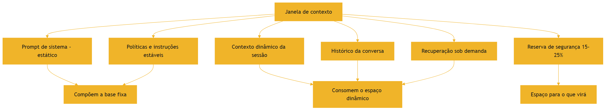

O diagrama mostra a estrutura do orçamento: a base fixa (prompt de sistema e políticas) e o espaço dinâmico (sessão, histórico, recuperação), com a reserva protegendo o futuro da sessão [1][8].

### 3.3 O Erro do Transbordamento

A imagem do transbordamento resume a falha mais comum [2]. Quando o contexto ocupa toda a janela sem reserva, qualquer nova informação — a resposta de uma ferramenta, um documento recuperado — força um descarte de emergência [2][1]. O descarte de emergência é feito pelo sistema, sem curadoria, e quase sempre remove informação que ainda seria útil [1][2]. O resultado é o comportamento errático de sessões longas: o modelo "esquece" o que foi dito no início porque o sistema descartou o início para caber o fim [2][5]. O orçamento com reserva evita o transbordamento [1].

## 4. Técnica

### 4.1 O Medidor de Ocupação da Janela

O primeiro instrumento prático é o medidor de ocupação: monitorar quanto da janela está ocupado a cada momento da sessão [8]. O código abaixo implementa o medidor e o registro de pico [8]:

```python
class MedidorJanela:
    """Monitora a ocupação da janela de contexto ao longo de uma sessão."""

    def __init__(self, janela_total: int, reserva_pct: float = 0.2):
        self.janela_total = janela_total
        self.reserva = int(janela_total * reserva_pct)
        self.limite = janela_total - self.reserva
        self.ocupado = 0
        self.pico = 0

    def adicionar(self, tokens: int) -> bool:
        """Adiciona tokens ao contexto. Retorna False se estourar o limite."""
        if self.ocupado + tokens > self.limite:
            return False
        self.ocupado += tokens
        self.pico = max(self.pico, self.ocupado)
        return True

    def remover(self, tokens: int) -> None:
        self.ocupado = max(0, self.ocupado - tokens)

    def status(self) -> dict:
        return {
            "ocupado": self.ocupado,
            "limite": self.limite,
            "reserva_restante": max(0, self.janela_total - self.ocupado),
            "pico": self.pico,
            "proporcao": round(self.ocupado / self.janela_total, 2),
        }


if __name__ == "__main__":
    m = MedidorJanela(janela_total=32_000)
    m.adicionar(1_200)   # prompt de sistema
    m.adicionar(2_500)   # documento recuperado
    print(m.status())
    print("Cabe mais 30k?", m.adicionar(30_000))
```

O medidor materializa a reserva de segurança: o sistema sabe, a cada passo, quanto espaço resta e quando precisa compactar [1][8].

### 4.2 O Controlador de Política de Descarte

O segundo instrumento define a política de descarte: quando a janela enche, o que sai primeiro [1][7]. O código abaixo implementa uma política hierárquica de descarte, priorizando manter instruções e dados recentes [1][7]:

```python
from dataclasses import dataclass


@dataclass
class BlocoContexto:
    id: str
    tipo: str  # "instrucao", "dado", "historico", "ferramenta"
    tokens: int
    prioridade: int  # maior = mais importante de manter


def politica_descarte(blocos: list, limite: int) -> tuple:
    """Retorna (mantidos, descartados) respeitando o limite de tokens."""
    ordenados = sorted(blocos, key=lambda b: (-b.prioridade, b.tokens))
    mantidos = []
    descartados = []
    ocupado = 0
    for bloco in ordenados:
        if ocupado + bloco.tokens <= limite:
            mantidos.append(bloco)
            ocupado += bloco.tokens
        else:
            descartados.append(bloco)
    return mantidos, descartados


if __name__ == "__main__":
    blocos = [
        BlocoContexto("sys", "instrucao", 1200, 100),
        BlocoContexto("doc1", "dado", 3000, 60),
        BlocoContexto("hist_antigo", "historico", 4000, 20),
        BlocoContexto("tool_out", "ferramenta", 1500, 40),
    ]
    mantidos, descartados = politica_descarte(blocos, limite=6_000)
    print("Mantidos:", [b.id for b in mantidos])
    print("Descartados:", [b.id for b in descartados])
```

A política de descarte é a implementação da operação Compress em sua forma mais simples: quando não dá para resumir, decide-se o que sai [1][7]. O Capítulo 6 desenvolve a compactação por resumo; a política de descarte é o mecanismo de emergência [7].

### 4.3 O Simulador de Custo da Sessão

O terceiro instrumento estima o custo financeiro de uma sessão inteira, somando todas as chamadas [13]. O simulador abaixo modela o custo com base nos preços de entrada e saída [13]:

```python
def custo_sessao(
    tokens_entrada_por_chamada: list,
    tokens_saida_por_chamada: list,
    preco_entrada: float,
    preco_saida: float,
) -> dict:
    """Calcula o custo total e por chamada de uma sessão."""
    total_entrada = sum(tokens_entrada_por_chamada)
    total_saida = sum(tokens_saida_por_chamada)
    custo = total_entrada * preco_entrada + total_saida * preco_saida
    return {
        "total_entrada": total_entrada,
        "total_saida": total_saida,
        "custo_total": round(custo, 4),
        "custo_medio_por_chamada": round(custo / len(tokens_entrada_por_chamada), 4),
    }


if __name__ == "__main__":
    # Sessão com 5 chamadas: a primeira carrega o prompt de sistema;
    # as seguintes reutilizam via cache (entrada parcial).
    entradas = [4000, 2000, 2000, 3000, 1000]
    saidas = [500, 300, 400, 250, 350]
    print(custo_sessao(entradas, saidas, preco_entrada=0.00001, preco_saida=0.00003))
```

O simulador materializa o custo financeiro da janela: o engenheiro vê o impacto de cada decisão de contexto no custo da sessão [13][1]. A comparação entre políticas — contexto inflado vs. contexto curado — vira uma planilha, não uma opinião [13].

## 5. Aplica

### 5.1 Onde Isso Vive no Mundo Real

A economia da janela está em toda aplicação de produção [1][13]. Chatbots de suporte que mantêm sessões longas precisam de política de descarte para não estourar a janela [1]. Assistentes de programação que recuperam arquivos precisam de orçamento: o prompt de sistema, o arquivo ativo e a recuperação competem pelo espaço [15]. Aplicações financeiras que processam documentos longos precisam decidir entre janela grande (cara) e recuperação (seletiva) [11][14]. Em cada caso, o orçamento da janela é uma decisão de arquitetura registrada e medida [1][13].

### 5.2 O Erro Comum do Iniciante

O erro clássico é não medir a ocupação [2]. O iniciante escreve o prompt de sistema gigante, embute o manual inteiro no contexto e descobre, no meio da sessão, que não cabe mais nada [2][1]. O segundo erro é tratar a janela como um balde homogêneo, ignorando a geografia do meio (Lost in the Middle) [5]. O terceiro é ignorar o custo financeiro: o contexto inflado que "funciona" no protótipo vira um imposto pesado em produção com milhares de chamadas diárias [13]. Os três erros têm o mesmo remédio: medir, orçar e curar [1][2].

### 5.3 O Padrão Profissional em 2026

O padrão profissional combina medição e política [1][13]. O sistema monitora a ocupação da janela a cada passo [8]. A política de descarte é definida por tipo de bloco — instruções nunca saem, resultados de ferramentas obsoletos saem primeiro [1][7]. A reserva de segurança é respeitada [1]. O custo da sessão é medido e comparado com o valor entregue [13]. A posição dos blocos é controlada — informação crítica nunca fica no meio [5][18]. O resultado é um sistema previsível: a janela é administrada, não improvisada [1].

### 5.4 Exercício de Fixação

Monte o orçamento da janela de um assistente de análise de documentos: prompt de sistema (1.200 tokens), políticas (800), histórico da conversa (3.000), documento ativo (até 8.000) e recuperações sob demanda (até 4.000), em uma janela de 32.000 tokens [1][8]. Calcule a reserva necessária e a política de descarte quando o documento ativo cresce [1][8]. Registre as decisões no repositório do projeto [15].

### 5.5 As Janelas do Ecossistema: Tamanhos, Modelos e Trade-offs

O engenheiro de contexto não escolhe uma janela — escolhe entre janelas de modelos e versões diferentes [8][13]. Cada modelo tem uma janela nominal, um custo por token e um perfil de degradação (Capítulo 3) [8][2][13]. A escolha da janela é, portanto, uma decisão de arquitetura com três dimensões [8][13]. A primeira é a capacidade nominal: quanto cabe, em tese [8]. A segunda é o custo: quanto custa cada token nesse modelo [13]. A terceira é a degradação: como o modelo se comporta quando o contexto cresce (Capítulo 3) [2]. As três dimensões raramente apontam para o mesmo modelo — e o engenheiro negocia o trade-off [8][13].

A prática profissional dimensiona a janela pela tarefa, não pela propaganda [1][2]. Uma tarefa de análise de documentos longos pode justificar uma janela grande — se o modelo aguentar o volume sem degradar [2][11]. Uma tarefa de conversa curta não precisa de janela gigante — o custo do modelo maior é desperdício [1][13]. A decisão é medida com os testes do Capítulo 3: o mesmo conjunto de casos, executado nos modelos candidatos, com janelas diferentes, revela o ponto de equilíbrio entre custo e qualidade [2][9].

Há também o trade-off entre janela e arquitetura [11][3]. O Capítulo 9 mostra que o RAG pode substituir janela: em vez de comprar uma janela gigante para caber tudo, o sistema recupera o necessário e usa uma janela menor [3][11]. A pesquisa sobre LongRAG discute exatamente essa fronteira — quando a janela longa dispensa a recuperação e quando não [11]. O engenheiro maduro compara as duas rotas: janela grande (simples, cara) versus recuperação (complexa, econômica) [3][11].

### 5.6 A Medição do Orçamento na Prática: Instrumentação

A economia da janela exige instrumentação — medir o que se gerencia [1][13]. O Capítulo 2 apresentou os conceitos; esta subseção entrega a prática de medição contínua [1][13]. O primeiro instrumento é o **registro de ocupação**: cada chamada registra os tokens de entrada, de saída e a ocupação resultante [13]. O registro permite responder a perguntas essenciais: quanto da janela é consumido pelo estável? Pelo dinâmico? Pela recuperação? [13][1].

O segundo instrumento é o **histórico de custo**: a agregação do custo por chamada, por sessão e por tarefa [13][1]. O histórico revela os padrões: tarefas que sistematicamente estouram o orçamento, sessões que degradam por excesso, prefixos que repetem sem cache [13]. O Capítulo 10 desenvolve o custo por tarefa; o histórico é a matéria-prima dessa métrica [13][1].

O terceiro instrumento é a **comparação de políticas**: o mesmo conjunto de tarefas executado com políticas de orçamento diferentes — sem reserva, com reserva, com compressão agressiva [1][2]. A comparação revela o custo real de cada política em qualidade e dinheiro [1][13]. A prática segue o protocolo do Livro 2: hipótese, alteração única, medição [1][13].

A instrumentação transforma o orçamento de conceito em operação [1][13]. O engenheiro que mede a ocupação, o custo e a política de cada sistema constrói a base de dados para todas as decisões de contexto — e para o diagnóstico do Capítulo 8 [1][13][20].

### 5.7 Os Limites Práticos da Janela na Experiência do Usuário

A janela de contexto tem dimensões invisíveis para o usuário — mas que ele percebe indiretamente [1][13]. A latência é a primeira: janelas maiores e contextos mais longos aumentam o tempo de processamento, e a experiência degrada [13][1]. O usuário não sabe que o contexto é longo — sabe que o assistente demora [13]. A segunda é a coerência: quando o contexto estoura e o sistema descarta informação, o usuário percebe o esquecimento — o assistente "perde o fio" [2][5]. A terceira é o custo repassado: o contexto inflado encarece a operação, e o preço chega ao usuário [13].

O design da janela é, portanto, também design de experiência [1][13]. O engenheiro que respeita o orçamento entrega um assistente rápido, coerente e barato [1]. O que ignora o orçamento entrega um assistente lento, esquecido e caro — mesmo com um modelo excelente [2][13]. A janela é infraestrutura, e infraestrutura bem gerida é invisível; mal gerida, é o sintoma de tudo [1][13].

### 5.8 O Orçamento Dinâmico: Ajuste Contínuo da Janela

O orçamento da janela não é estático — é ajustado continuamente ao longo da sessão [1][8]. O orçamento dinâmico reconhece que as prioridades mudam: o início da sessão reserva espaço para o contexto que virá; o meio redistribui conforme o trabalho avança [1][8]. A primeira técnica do orçamento dinâmico é o **rebalanceamento por fase**: cada fase da tarefa tem uma alocação diferente — a fase de exploração reserva mais espaço para recuperação; a fase de síntese concentra o espaço na instrução e nos fatos [1][8].

A segunda técnica é o **degradê de prioridade**: a prioridade dos blocos muda com o tempo — um dado crítico no início pode virar apoio depois [1]. O sistema rebaixa a prioridade dos blocos superados e eleva a dos relevantes ao passo atual [1][7]. A terceira é a **antecipação de picos**: o sistema conhece os momentos de alto consumo — a chegada de um documento grande, a recuperação de um lote — e prepara o espaço antes [1][8].

A quarta técnica é a **política de emergência**: quando o pico inesperado chega, o sistema tem um plano — o que sacrificar primeiro (resultados de ferramentas usados), o que proteger (instruções e fatos críticos) [7][1]. O orçamento dinâmico transforma a janela de uma restrição rígida em um recurso gerido com inteligência [1][8]. O engenheiro que o domina extrai o máximo de uma janela pequena — e economiza na compra de janelas grandes [1][8][13].

### 5.9 A Janela e o Design de Ferramentas

A janela de contexto interage com o design de ferramentas de duas formas [6][1]. A primeira é o **tamanho das saídas**: ferramentas que retornam saídas gigantes — arquivos inteiros, logs completos — consomem a janela sem proporção ao valor [6]. A Anthropic documenta o princípio do design de ferramentas: saídas compactas, com o necessário para a decisão [6]. O engenheiro de contexto negocia com o design da ferramenta: o retorno é truncado, resumido ou paginado [6][1].

A segunda é a **estrutura das saídas**: saídas bem formatadas — JSON, tabelas, seções — usam a janela melhor que prosa solta [6][5]. O Capítulo 4 mostrou que a estrutura protege contra o lost in the middle [5]. O design da ferramenta define o formato da saída, e o formato decide a eficiência do consumo da janela [6][5].

A terceira é a **seletividade da chamada**: a ferramenta recebe parâmetros que limitam a saída — campos, filtros, paginação [6]. O agente que chama a ferramenta com parâmetros precisos consome menos janela que o que chama tudo e filtra depois [6][1]. O design de ferramentas é, portanto, parte do orçamento da janela: cada ferramenta é projetada com a janela em mente [6][1]. O engenheiro de contexto e o designer de ferramentas trabalham juntos — a janela é o ponto de encontro [6][1].

### 5.10 O Caso de Negócio da Gestão da Janela

A gestão da janela tem um caso de negócio — e o engenheiro o conhece para justificar o investimento [13][1]. O primeiro componente do caso é o **custo direto**: janelas maiores e contextos inflados custam mais por chamada [13]. O segundo é o **custo de retrabalho**: o contexto mal gerido gera respostas erradas e re-execuções (Capítulo 6 do Livro 2) [1][13]. O terceiro é o **custo de latência**: contextos longos demoram mais, degradando a experiência [13].

O quarto componente é o **benefício da qualidade**: a gestão da janela melhora a acurácia (Capítulos 3 e 4) — e qualidade é receita [1][2][5]. O quinto é o **benefício da previsibilidade**: o sistema com orçamento não estoura, não degrada e não surpreende [1]. O sexto é o **benefício estratégico**: o conhecimento da gestão de janela permite escolher o modelo certo — às vezes um modelo menor, com contexto bem gerido, supera um modelo maior com contexto mal gerido [1][13].

O caso de negócio é apresentado em métricas: custo por tarefa concluída (Capítulo 10), taxa de re-execução, latência média e acurácia [1][13]. O engenheiro que mede (seção 5.6) tem os números para defender o investimento em curadoria [1][13]. A gestão da janela deixa de ser um detalhe técnico e vira uma decisão de negócio com retorno mensurável [1][13].

### 5.11 O Orçamento em Diferentes Tipos de Aplicação

O orçamento da janela se materializa de formas diferentes em cada tipo de aplicação [1][8]. Na aplicação de **conversa interativa**, o orçamento precisa preservar espaço para o histórico crescente — e a compactação (Capítulo 6) é o principal instrumento [1][7][8]. Na aplicação de **análise de documentos**, o orçamento é dominado pelo documento ativo — e a decisão é entre janela grande e recuperação (Capítulo 9) [1][3][11]. Na aplicação de **agente de código**, o orçamento distribui entre o prompt, o arquivo ativo e a exploração (Capítulo 5) [1][6].

Na aplicação de **processamento em lote**, o orçamento é dimensionado por lote — e o custo médio por item decide [1][13]. Na aplicação de **assistente com memória** (Capítulo 10), o orçamento inclui a memória recuperada [1][7]. Cada tipo de aplicação tem uma estrutura de custo própria — e o engenheiro que conhece a estrutura dimensiona a janela certo [1][8][13].

O princípio transversal é o da **adequação**: o orçamento é desenhado para a aplicação, não copiado de receita [1][8]. O que funciona para um chatbot não funciona para um analisador de contratos [1][8][11]. A medição (seção 5.6) é o que revela a estrutura de custo da sua aplicação [1][13].

### 5.12 O Erro do Orçamento em Cascata

O estudo de caso do orçamento mostra como um erro pequeno vira uma cascata [1][8]. O cenário: um agente de análise com janela de 32 mil tokens [1][8]. O erro inicial: o prompt de sistema cresceu de 1,2 mil para 5 mil tokens com regras acumuladas [1][6]. O efeito imediato: menos espaço para o documento ativo [1][8].

O efeito em cascata: o documento ativo foi truncado; a análise perdeu seções; o usuário pediu correções; o retrabalho gerou mais chamadas; o custo subiu [1][8][13]. A equipe tentou comprar janela maior (mais caro) em vez de auditar o orçamento [1][13]. O diagnóstico correto: o orçamento foi corrompido pelo prompt inchado (Capítulo 8) [1][6].

O tratamento: o Write (Capítulo 5) enxugou o prompt para a altitude ideal, liberando 3,8 mil tokens para o documento [1][6]. O sistema voltou a funcionar com a janela original — sem o custo da troca de modelo [1][8][13]. O caso demonstra o tema do capítulo: o orçamento é uma disciplina — e a violação silenciosa (o prompt que cresce) é a forma mais comum de corrupção [1][6][8].

### 5.13 A Lista de Verificação do Orçamento da Janela

A lista de verificação consolida o capítulo em instrumento de trabalho [1][8]. O primeiro item: o inventário do contexto é conhecido e versionado? [1][15]. O segundo: a ocupação é monitorada a cada chamada? [1][8]. O terceiro: a reserva de segurança é respeitada? [1][8]. O quarto: a política de descarte é definida por tipo de bloco? [1][7]. O quinto: o custo por chamada e por tarefa é medido? [1][13].

O sexto item: o prompt de sistema é estável, enxuto e versionado? [1][6]. O sétimo: o contexto dinâmico é separado do estável? [1][13]. O oitavo: os gatilhos de compressão estão configurados? [1][7][8]. O nono: a posição dos blocos é auditada? [1][5]. O décimo: o cache é usado quando o prefixo é estável? [1][13].

A lista é o resumo operacional do capítulo: cada item aponta a técnica e o capítulo que a desenvolve [1][8]. O engenheiro que percorre a lista na revisão de arquitetura previne a cascata da seção 5.12 [1][8]. A disciplina do orçamento é a base de todas as outras: sem ela, nenhuma curadoria sobrevive [1][8].

### 5.14 O Orçamento e o Dimensionamento de Infraestrutura

A gestão da janela tem uma dimensão de infraestrutura que o engenheiro dimensiona [1][13]. O primeiro componente é o **throughput de tokens**: a infraestrutura precisa processar o volume de tokens por segundo que a aplicação demanda [13][8]. O segundo é a **concorrência**: o número de chamadas simultâneas multiplica o consumo de tokens [1][13]. O terceiro é o **pico**: os momentos de maior uso definem a capacidade necessária [1][13].

O dimensionamento é uma decisão de custo e capacidade [1][13]. Infraestrutura subdimensionada causa lentidão e falhas no pico [13]. Superdimensionada desperdiça dinheiro [1][13]. A medição da seção 5.6 — o histórico de ocupação e custo — é a matéria-prima do dimensionamento [1][13].

O orçamento da janela e o dimensionamento de infraestrutura são duas faces da mesma moeda [1][13]. O contexto bem gerido reduz a demanda de infraestrutura — menos tokens por chamada, menos custo por pico [1][13]. O engenheiro que controla o orçamento do contexto controla, indiretamente, o orçamento da infraestrutura [1][13].

### 5.15 O Estudo de Caso do Pico de Manhã

O estudo de caso mostra a interação entre orçamento e infraestrutura [1][13]. O cenário: um assistente com pico de uso às 9h — milhares de chamadas simultâneas [13]. O sintoma: lentidão e erros no pico [13]. A equipe considerou duplicar a infraestrutura — um custo alto [13].

O diagnóstico (Capítulo 8): o contexto estava inflado — cada chamada carregava o dobro dos tokens necessários [1][13]. O pico multiplicava o problema: mais chamadas, mais tokens por chamada [13]. O teste: o histórico de ocupação revelou o desperdício [1][13]. O tratamento: o Write enxugou o prompt; o Select limitou a recuperação; o cache cobriu o prefixo estável [1][6][13].

O resultado: o pico passou a ser atendido com a infraestrutura existente — o custo da expansão foi evitado [13]. O caso demonstra o tema do capítulo: o orçamento da janela é também o orçamento da infraestrutura [1][13]. A gestão do contexto resolve problemas que pareciam de capacidade [1][13].

### 5.16 O Fechamento do Capítulo

O capítulo da janela se encerra com a consolidação [1][8]. A janela é finita — e a finitude é o que torna a disciplina necessária [8]. O custo é quadrático, o preço é por token e a posição importa [8][13][5]. O orçamento — com reserva, política de descarte e medição — é a ferramenta da disciplina [1][8]. O dimensionamento de infraestrutura é a consequência [1][13].

O engenheiro que domina a janela domina o recurso central de toda a Parte II [1][8]. As disciplinas seguintes — curadoria, degradação, recuperação, memória — todas operam dentro da janela [1][8]. A gestão da janela é o fundamento sobre o qual o restante se apoia [1][8].

### 5.17 A Janela e a Tomada de Decisão Arquitetural

A gestão da janela culmina em decisões arquiteturais que o engenheiro documenta [1][8][11]. A primeira decisão é **qual modelo**: a janela, o custo e o perfil de degradação dos candidatos (seção 5.5) [1][2][13]. A segunda é **qual estratégia**: janela grande versus recuperação — a comparação do Capítulo 9 [1][3][11]. A terceira é **qual política**: a reserva, o descarte e a compressão (seção 5.8 e Capítulo 6) [1][7][8].

Cada decisão é registrada como ADR — arquitetural decision record — com contexto, alternativas e racional [1][15]. O registro é o que permite revisar a decisão quando os fatos mudam: o modelo novo, o custo novo, o volume novo [1][15]. A decisão arquitetural sem registro é uma decisão que não pode ser questionada — e não pode ser melhorada [1][15].

O engenheiro que documenta as decisões da janela constrói a memória institucional da arquitetura [1][15]. A próxima equipe herda não apenas o sistema — herda o porquê [1][15]. A gestão da janela, em sua forma mais madura, é a gestão do conhecimento arquitetural [1].

### 5.18 O Fechamento do Capítulo

O capítulo da janela se encerra com a consolidação final [1][8]. A janela é finita, cara e com geografia [8][13][5]. O orçamento — reserva, descarte, medição — é a disciplina [1][8]. A infraestrutura e a decisão arquitetural são as consequências [1][13][15].

O engenheiro que domina a janela domina o recurso central da Parte II [1][8]. As disciplinas seguintes — curadoria, degradação, recuperação, memória — operam dentro dela [1][8]. A gestão da janela é o alicerce — e o alicerce está firme [1][8].

### 5.19 A Mensagem Final do Capítulo

O capítulo da janela deixa a mensagem que fundamenta a Parte II [1][8]. A janela é o recurso central — finito, caro e com geografia [8][13][5]. O orçamento é a disciplina que o administra [1][8]. A medição, o dimensionamento e a documentação são as práticas [1][13][15].

O engenheiro que domina a janela domina o palco onde toda a engenharia de contexto acontece [1][8]. O próximo capítulo revela o que acontece quando o palco se enche demais: a degradação [2].

## 6. Conclusão

A janela de contexto é o recurso central da engenharia de contexto — finito, caro e com geografia [8][5]. Este capítulo estabeleceu a economia do recurso: o custo quadrático da atenção, o orçamento de atenção, o custo financeiro por token, a reserva de segurança e a política de descarte [8][13][1]. A janela não é um balde onde se despeja informação — é um palco com orçamento, onde cada decisão de alocação é uma decisão de engenharia [1][8]. Os próximos capítulos mostram o que acontece quando a economia é violada: a degradação do contexto [2].

## 7. Referências

[1] ANTHROPIC. Effective context engineering for AI agents. Anthropic Engineering Blog, set. 2025. Disponível em: https://www.anthropic.com/engineering/effective-context-engineering-for-ai-agents. Acesso em: 5 ago. 2026.
[2] HONG, Kelly; TROYNIKOV, Anton; HUBER, Jeff. Context Rot: How Increasing Input Tokens Impacts LLM Performance. Chroma Technical Report, jul. 2025. Disponível em: https://www.trychroma.com/research/context-rot. Acesso em: 5 ago. 2026.
[3] LEWIS, Patrick et al. Retrieval-Augmented Generation for Knowledge-Intensive NLP Tasks. In: Advances in Neural Information Processing Systems (NeurIPS), v. 33, p. 9459–9474, 2020. Disponível em: https://arxiv.org/abs/2005.11401. Acesso em: 5 ago. 2026.
[4] GAO, Yunfan et al. Retrieval-Augmented Generation for Large Language Models: A Survey. arXiv:2312.10997, mar. 2024. Disponível em: https://arxiv.org/abs/2312.10997. Acesso em: 5 ago. 2026.
[5] LIU, Nelson F. et al. Lost in the Middle: How Language Models Use Long Contexts. Transactions of the Association for Computational Linguistics (TACL), v. 12, p. 157–173, 2024. Disponível em: https://arxiv.org/abs/2307.03172. Acesso em: 5 ago. 2026.
[6] ANTHROPIC. Writing tools for AI agents — using AI agents. Anthropic Engineering Blog, set. 2025. Disponível em: https://www.anthropic.com/engineering/writing-tools-for-agents. Acesso em: 5 ago. 2026.
[7] ANTHROPIC. Context engineering: memory, compaction, and tool clearing. Claude Platform Cookbook, mar. 2026. Disponível em: https://platform.claude.com/cookbook/tool-use-context-engineering-context-engineering-tools. Acesso em: 5 ago. 2026.
[8] ZHAO, Wayne Xin et al. A Survey of Large Language Models. arXiv:2303.18223, 2023. Disponível em: https://arxiv.org/abs/2303.18223. Acesso em: 5 ago. 2026.
[9] CHROMA. Context Rot: Evaluation Toolkit. GitHub Repository, 2025. Disponível em: https://github.com/chroma-core/context-rot. Acesso em: 5 ago. 2026.
[10] LIU, Nelson F. Lost in the Middle: Replication Repository. GitHub Repository, 2023. Disponível em: https://github.com/nelson-liu/lost-in-the-middle. Acesso em: 5 ago. 2026.
[11] CHEN, Jiawei et al. LongRAG: Enhancing Retrieval-Augmented Generation with Long-context LLMs. arXiv:2406.15319, 2024. Disponível em: https://arxiv.org/abs/2406.15319. Acesso em: 5 ago. 2026.
[12] ASIA, Research Group et al. Retrieval-Augmented Generation Evaluation in the Era of Large Language Models: A Comprehensive Survey. ResearchGate / arXiv, abr. 2025. Disponível em: https://www.researchgate.net/publication/390991356. Acesso em: 5 ago. 2026.
[13] OPENAI. GPT-4 Technical Report & Developer Guides on Context Management. OpenAI Documentation, 2024–2025. Disponível em: https://openai.com/index/gpt-4-research/. Acesso em: 5 ago. 2026.
[14] GOOGLE CLOUD. What is Retrieval-Augmented Generation (RAG)?. Google Cloud Architecture Center, 2025. Disponível em: https://cloud.google.com/use-cases/retrieval-augmented-generation. Acesso em: 5 ago. 2026.
[15] LANGCHAIN. LangChain Agents & Context Management Documentation. LangChain Guides, 2025–2026. Disponível em: https://python.langchain.com/docs/concepts/agents/. Acesso em: 5 ago. 2026.
[16] WANG, Zhen et al. Agentic Retrieval-Augmented Generation: A Survey on Agentic RAG. arXiv:2408.12999, 2024. Disponível em: https://arxiv.org/abs/2408.12999. Acesso em: 5 ago. 2026.
[17] XIAO, Guangxuan et al. Efficient Streaming Language Models with Attention Sinks. arXiv:2309.17453, 2023. Disponível em: https://arxiv.org/abs/2309.17453. Acesso em: 5 ago. 2026.
[18] RODIN, Alex et al. Found in the Middle: Overcoming Long-Context Vulnerabilities in LLMs. arXiv:2403.04797, 2024. Disponível em: https://arxiv.org/abs/2403.04797. Acesso em: 5 ago. 2026.
[19] MEDIUM (Data Science Collective). Context Is the New Prompt: Why Context Engineering Is Shaping the Future of AI. Medium Article, 2025. Disponível em: https://medium.com/data-science-collective/context-is-the-new-prompt-why-context-engineering-is-shaping-the-future-of-ai-46eb062ed270. Acesso em: 5 ago. 2026.
[20] ZENML. Context Rot: Evaluating LLM Performance Degradation with Increasing Input Tokens. MLOps Database, 2025. Disponível em: https://www.zenml.io/llmops-database/context-rot-evaluating-llm-performance-degradation-with-increasing-input-tokens. Acesso em: 5 ago. 2026.

# PARTE 2 — A Degradação do Contexto

# Capítulo 3 — Context rot: por que mais contexto nem sempre é melhor

## 1. Introdução

O Capítulo 2 estabeleceu a janela como recurso finito e caro. Este capítulo confronta a suposição implícita de que, se a janela é o recurso, então mais janela é mais recurso — e portanto melhor [2]. A evidência empírica derruba essa suposição [2]. O fenômeno documentado pela Chroma como context rot mostra que o desempenho dos modelos degrada à medida que o volume de tokens de entrada cresce — mesmo em tarefas simples e mesmo dentro da capacidade nominal da janela [2]. Este capítulo apresenta a evidência, explica os mecanismos (orçamento de atenção, distratores, similaridade agulha-pergunta), mostra as implicações práticas e constrói as ferramentas para detectar e evitar a degradação [2][9][20].

## 2. Explica

### 2.1 O Estudo da Chroma: Design e Descoberta

O relatório técnico da Chroma, publicado em julho de 2025, investigou o impacto do volume de tokens de entrada no desempenho de modelos [2]. O estudo usou uma adaptação do teste da agulha no palheiro (needle-in-a-haystack): informação alvo (a agulha) escondida em um volume crescente de conteúdo irrelevante (o palheiro) [2][9]. A descoberta central: à medida que o palheiro cresce, a taxa de acerto cai — mesmo quando a informação está dentro da janela e o modelo "deveria" encontrá-la [2]. A degradação não é um artefato de janela estourada: acontece dentro da capacidade nominal [2]. O repositório da Chroma disponibiliza o toolkit de avaliação para replicar o experimento [9].

### 2.2 A Degradação Não-Uniforme

A segunda descoberta do estudo é que a degradação não é uniforme [2]. Modelos diferentes degradam em ritmos diferentes; tarefas diferentes têm sensibilidades diferentes ao volume de contexto [2]. Alguns modelos mantêm desempenho razoável até janelas grandes; outros colapsam cedo [2]. A implicação prática é importante: não existe uma regra universal de "quantos tokens são demais" — existe a necessidade de medir, por modelo e por tarefa, onde a degradação começa [2][20]. O ZenML documenta a mesma preocupação na prática de MLOps: o monitoramento da degradação é parte do ciclo de vida de modelos em produção [20].

### 2.3 A Similaridade Agulha-Pergunta

O estudo identificou um fator que modula a degradação: a similaridade semântica entre a agulha (a informação procurada) e a pergunta [2]. Quando a similaridade é alta — a pergunta usa termos próximos do conteúdo da agulha —, a recuperação tem mais chance de sucesso mesmo em contextos longos [2]. Quando a similaridade é baixa — a pergunta é indireta e a agulha está expressa em outros termos —, a degradação é acelerada [2]. A descoberta tem implicação de design: o contexto não deve apenas conter a informação; deve contê-la em uma forma que se relacione com a tarefa [2][1].

### 2.4 Os Distratores: o Inimigo Invisível

O fator mais severo identificado pelo estudo é a presença de distratores — conteúdos topologicamente semelhantes à agulha, mas incorretos [2]. Quando o palheiro contém informação parecida com a procurada, porém errada, a acurácia despenca muito mais do que com conteúdo neutro [2]. O mecanismo é o orçamento de atenção: o modelo gasta atenção nos distratores plausíveis e perde a agulha correta [2][1]. A implicação prática é profunda: em recuperação de conhecimento, "quase certo" é pior que "claramente irrelevante" [2]. O design do contexto precisa considerar não só o que incluir, mas o que a presença de informação similar pode causar [2][1].

### 2.5 O Orçamento de Atenção Como Explicação

O mecanismo subjacente ao context rot é o orçamento de atenção [2][8]. A atenção é o recurso cognitivo do modelo: cada token compete pela atenção dos demais, e o custo computacional é quadrático [8]. Quando o contexto cresce, a atenção média por token cai — e a informação relevante recebe menos atenção proporcional [2][8]. O Survey de LLMs de Zhao explica o mecanismo de atenção em detalhe; o estudo da Chroma mostra a consequência empírica [8][2]. O orçamento de atenção é a ponte entre a arquitetura (Capítulo 2) e a degradação observada (este capítulo) [2][8].

### 2.6 Mais Contexto, Mais Ruído

O context rot reorienta a mentalidade do engenheiro: mais contexto não é apenas mais custo — é mais ruído [2][1]. Cada token extra adiciona material que compete pela atenção, mesmo quando o material é neutro [2]. O palheiro não é inerte: ele "consome" atenção que poderia ir para a agulha [2]. A frase-resumo do fenômeno — "mais contexto nem sempre é melhor" — é uma tese de engenharia: o contexto ideal é o mínimo suficiente para a tarefa, não o máximo disponível [1][2]. A curadoria é a operação que encontra esse mínimo [1].

### 2.7 A Relação com a Janela Grande

O context rot tem implicação direta na tendência de mercado de janelas gigantes [2][11]. Janelas de 1 milhão a 10 milhões de tokens são vendidas como solução universal — mas o estudo mostra que a capacidade nominal não é desempenho real [2]. A pesquisa sobre LongRAG aprofunda a discussão: janelas longas e recuperação não são concorrentes simples, e o volume dentro da janela precisa ser tratado com a mesma curadoria de sempre [11]. A janela grande é um recipiente maior — não um palheiro melhor [2][11].

### 2.8 O Contexto Curado como Antídoto

Se o excesso degrada, a cura é a curadoria [1][2]. O contexto curado — enxuto, relevante, sem distratores, com a informação na forma certa — preserva o desempenho mesmo quando a tarefa é complexa [1][2]. A evidência de mercado citada no Capítulo 1 (30% vs. 90% de acerto) é a medida agregada desse efeito: a mesma tarefa, com contexto bruto ou curado, produz resultados dramaticamente diferentes [1][12]. O framework write/select/compress/isolate é a receita da curadoria: escrever bem, selecionar o mínimo, comprimir o histórico e isolar as tarefas [1][6][7].

### 2.9 A Detecção da Degradação em Produção

A degradação não acontece só em laboratório — ela ocorre em produção, e precisa ser detectada [20][9]. O ZenML documenta a prática de monitorar a degradação de desempenho com o crescimento do contexto em sistemas reais [20]. Os sinais incluem: queda de acurácia em tarefas que antes funcionavam, respostas genéricas em sessões longas, e aumento de retrabalho (re-execuções) [20]. O toolkit da Chroma fornece a base metodológica para construir os testes de detecção [9]. A detecção precoce é a diferença entre corrigir a curadoria e descobrir a degradação pelo feedback do usuário [20].

### 2.10 A Síntese: Contexto é Decisão, Não Acúmulo

O context rot sintetiza a tese deste livro em uma frase: contexto é decisão, não acúmulo [1][2]. O engenheiro que acumula contexto está construindo um palheiro; o que decide o contexto está construindo uma curadoria [1]. A decisão tem três níveis: o que entra (seleção), o que permanece (manutenção) e o que sai (descarte/compressão) [1][7]. Os próximos capítulos desenvolvem cada nível; este capítulo estabeleceu a razão de ser de todos eles [2].

## 3. Ilustra

### 3.1 A Analogia do Palheiro

A analogia do palheiro é a mais direta [2]. Procurar uma agulha em um palheiro pequeno é fácil; em um palheiro gigante, é quase impossível — não porque a agulha sumiu, mas porque a busca se perde [2]. O context rot é exatamente isso: a agulha (informação) está lá, mas o palheiro (contexto) cresceu a ponto de a busca degradar [2]. O engenheiro de contexto é o agricultor que decide o tamanho do palheiro — e aprendeu que palheiro maior não é fazenda melhor [2][1].

### 3.2 O Diagrama da Degradação

O diagrama abaixo representa a relação entre volume de contexto e desempenho, com os três regimes observados no estudo [2][9].

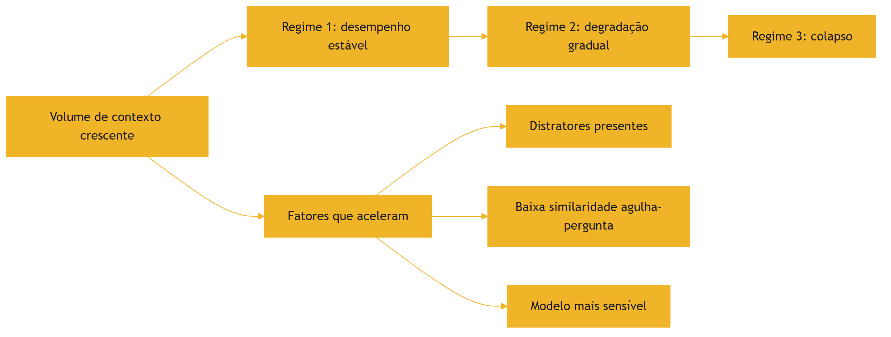

O diagrama mostra a trajetória típica da degradação: um platô inicial, a queda gradual e o colapso — com os fatores que aceleram a transição [2][9].

### 3.3 O Erro do "Quanto Mais, Melhor"

A imagem do transbordamento do Capítulo 2 se conecta com a do palheiro [2][1]. O iniciante raciocina: "se a janela comporta 200 mil tokens, vou dar todos os documentos ao modelo" [2]. O profissional sabe que o palheiro de 200 mil tokens tem mais agulhas perdidas que o palheiro de 20 mil bem curado [2][1]. A diferença não é a capacidade — é a intenção [1][2].

## 4. Técnica

### 4.1 O Teste da Agulha no Palheiro em Código

O primeiro instrumento implementa o teste da agulha no palheiro: medir a taxa de recuperação de uma informação alvo em contextos de tamanhos crescentes [2][9]. O código abaixo é uma versão didática do experimento da Chroma [2][9]:

```python
import random


def gerar_palheiro(num_distratores: int, sementes: list) -> list:
    """Gera um palheiro de distratores a partir de frases-semente."""
    palheiro = []
    for i in range(num_distratores):
        semente = sementes[i % len(sementes)]
        palheiro.append(f"Item {i + 1}: {semente} relacionado ao contexto geral.")
    return palheiro


def testar_agulha(palheiro: list, agulha: str, consulta: str) -> bool:
    """Simula a recuperação: encontra a agulha se ela aparecer nas respostas."""
    # Simula um modelo: quanto maior o palheiro, menor a chance de acerto,
    # especialmente com distratores.
    ruido = len(palheiro) * 0.02
    if consulta.lower() in agulha.lower():
        chance = max(0.1, 1.0 - ruido)
    else:
        chance = max(0.05, 0.6 - ruido)
    return random.random() < chance


def medir_degradacao(tamanhos: list, sementes: list) -> dict:
    """Mede a taxa de acerto para palheiros de tamanhos crescentes."""
    resultados = {}
    for tamanho in tamanhos:
        palheiro = gerar_palheiro(tamanho, sementes)
        agulha = "O orçamento total do projeto foi de R$ 2,4 milhões."
        consulta = "Qual foi o orçamento total do projeto?"
        acertos = sum(testar_agulha(palheiro, agulha, consulta) for _ in range(50))
        resultados[tamanho] = round(acertos / 50, 2)
    return resultados


if __name__ == "__main__":
    sementes = ["meta de vendas", "prazo de entrega", "responsável técnico"]
    print(medir_degradacao([10, 100, 500, 1000], sementes))
```

O teste materializa o fenômeno: a taxa de acerto cai com o crescimento do palheiro — o experimento que a Chroma documentou em escala real [2][9].

### 4.2 O Detector de Distratores

O segundo instrumento identifica distratores no contexto: conteúdo similar à informação procurada, mas incorreto [2]. O código abaixo calcula a similaridade simples entre a consulta e os candidatos, sinalizando os "quase certos" [2]:

```python
def similaridade_simples(a: str, b: str) -> float:
    """Similaridade por sobreposição de palavras (didática)."""
    palavras_a = set(a.lower().split())
    palavras_b = set(b.lower().split())
    if not palavras_a or not palavras_b:
        return 0.0
    return len(palavras_a & palavras_b) / len(palavras_a | palavras_b)


def detectar_distratores(consulta: str, candidatos: list, limiar: float = 0.4) -> list:
    """Retorna candidatos similarmente relevantes que podem ser distratores."""
    suspeitos = []
    for cand in candidatos:
        sim = similaridade_simples(consulta, cand)
        if sim >= limiar:
            suspeitos.append({"texto": cand, "similaridade": round(sim, 2)})
    return suspeitos


if __name__ == "__main__":
    consulta = "Qual o orçamento total do projeto?"
    candidatos = [
        "O orçamento total do projeto foi de R$ 2,4 milhões.",
        "O orçamento do trimestre passado foi de R$ 1,1 milhão.",
        "A meta de vendas do projeto é de R$ 3 milhões.",
    ]
    print(detectar_distratores(consulta, candidatos))
```

O detector sinaliza os candidatos plausíveis: o segundo item é o distrator clássico — semelhante, porém incorreto [2]. Na recuperação real, essa sinalização alimenta a decisão de curadoria [1][2].

### 4.3 O Monitor de Degradação de Sessão

O terceiro instrumento monitora a degradação ao longo de uma sessão: mede a "saúde do contexto" comparando o desempenho esperado com o observado [20]. O código abaixo implementa o monitor [20]:

```python
class MonitorDegradacao:
    """Monitora sinais de degradação de contexto em produção."""

    def __init__(self, linha_base_acerto: float):
        self.linha_base = linha_base_acerto
        self.execucoes = []

    def registrar(self, tokens_entrada: int, acerto: bool) -> None:
        self.execucoes.append({"tokens": tokens_entrada, "acerto": acerto})

    def janela_recente(self, n: int) -> float:
        recentes = self.execucoes[-n:]
        if not recentes:
            return 0.0
        return sum(1 for e in recentes if e["acerto"]) / len(recentes)

    def alerta(self, n: int = 20, queda: float = 0.15) -> dict:
        atual = self.janela_recente(n)
        return {
            "taxa_recente": round(atual, 2),
            "linha_base": self.linha_base,
            "degradacao_detectada": (self.linha_base - atual) > queda,
            "sugestao": "Revisar curadoria do contexto" if (self.linha_base - atual) > queda else "OK",
        }


if __name__ == "__main__":
    m = MonitorDegradacao(linha_base_acerto=0.85)
    for tokens in [2000] * 10 + [20000] * 15:
        acerto = True if tokens < 5000 else False
        m.registrar(tokens, acerto)
    print(m.alerta())
```

O monitor transforma o context rot em observável de produção: quando a taxa de acerto cai abaixo da linha de base, o sistema sinaliza a necessidade de revisar a curadoria [20].

## 5. Aplica

### 5.1 Onde Isso Vive no Mundo Real

O context rot se manifesta em todos os sistemas com sessões longas e contexto crescente [2][20]. Assistentes de suporte com conversas de horas degradam conforme o histórico cresce [20]. Agentes de programação que acumulam saídas de ferramentas perdem o fio da meada [1]. Ferramentas de análise que injetam documentos inteiros criam palheiros próprios [2]. A prática profissional mede a degradação em cada sistema, com o teste da agulha e o monitor de produção [2][20].

### 5.2 O Erro Comum do Iniciante

O erro mais comum é acreditar na propaganda da janela grande [2]. O iniciante "resolve" o problema de contexto comprando mais janela — e descobre que o desempenho não acompanha [2]. O segundo erro é despejar tudo na janela sem considerar distratores: o manual inteiro, todos os logs, todas as saídas [2]. O terceiro é não medir: a degradação acontece gradualmente e passa despercebida até o usuário reclamar [20]. Os três erros têm o mesmo remédio: curadoria, medição e monitoramento [1][20].

### 5.3 O Padrão Profissional em 2026

O padrão profissional trata o contexto como recurso a ser curado, não acumulado [1][2]. O sistema seleciona o mínimo suficiente para a tarefa [1]. Os distratores são identificados e removidos [2]. A degradação é medida com testes de agulha no palheiro [2][9]. O monitor de produção alerta quando a linha de base cai [20]. A compactação mantém o histórico útil sem deixá-lo crescer indefinidamente [7]. O resultado é um sistema que mantém a qualidade mesmo em sessões longas — a promessa da engenharia de contexto [1][2].

### 5.4 Exercício de Fixação

Construa um teste da agulha para o seu sistema: defina uma informação alvo, um palheiro de distratores realistas e meça a taxa de acerto em palheiros de 10, 100 e 1.000 itens [2][9]. Registre os resultados e identifique o ponto onde a degradação começa [2]. Desenhe a política de curadoria que mantém o desempenho acima da linha de base [1][2].

### 5.5 O Context Rot em Diferentes Arquiteturas

O context rot não atinge todos os sistemas da mesma forma — e conhecer a variação por arquitetura orienta a prevenção [2][1]. A primeira arquitetura é a de **janela única**: um agente com um único contexto que cresce ao longo da sessão [2]. É a mais vulnerável: o crescimento contínuo acumula o palheiro [2]. A mitigação é a compressão (Capítulo 6) e a reserva (Capítulo 2) [1][7]. A segunda arquitetura é a de **janela com recuperação**: o contexto é composto por trechos recuperados sob demanda [3]. Aqui o risco é a quantidade de trechos: recuperar demais recria o palheiro dentro do contexto [2][3]. A mitigação é a seleção rigorosa (Capítulo 5) [1].

A terceira arquitetura é a **multi-agente** com isolamento (Capítulo 7): cada subagente tem janela própria [1]. O context rot aqui é distribuído — cada janela degrada no seu ritmo, e o resumo destilado pode perder precisão se o subagente estiver degradado [1][7]. A mitigação é o monitoramento de cada janela e a re-execução seletiva [1][20]. A quarta arquitetura é a de **streaming**: o contexto é processado em fluxo contínuo, sem janela fixa [17]. A pesquisa sobre Attention Sinks mostra que o streaming tem seus próprios padrões de retenção — início e fim preservados, meio descartado [17]. O context rot em streaming é a perda sistemática do meio [17][5].

A lição transversal é que a prevenção do context rot é arquitetural, não cosmética [1][2]. Cada arquitetura tem seu ponto de degradação, e o engenheiro conhece o ponto da sua [1][2]. O diagnóstico (Capítulo 8) começa exatamente aqui: saber onde a sua arquitetura degrada é saber onde procurar a falha [1][2].

### 5.6 A Relação entre Context Rot e Qualidade da Fonte

O context rot não é apenas um problema de quantidade — é um problema de qualidade da informação [2][1]. O estudo da Chroma mostrou que o conteúdo do palheiro importa tanto quanto o tamanho: distratores semelhantes à agulha degradam muito mais que conteúdo neutro [2]. A implicação profunda é que a curadoria da fonte — a qualidade do material que entra no palheiro — é tão importante quanto a curadoria da seleção [1][2].

A primeira dimensão da qualidade é a **fidelidade**: a fonte contém informação correta e verificável? [12]. Uma base com informação errada cria distratores permanentes [2][12]. A segunda é a **atualidade**: a fonte está atualizada? [1]. Dados antigos são distratores em relação ao presente [1]. A terceira é a **granularidade**: a fonte está no nível certo de detalhe para a tarefa? [1]. Documentos gigantes e genéricos criam palheiros; fragmentos precisos criam agulhas [1]. A quarta é a **consistência**: a fonte usa terminologia consistente com as consultas? [2]. O estudo mostrou que a similaridade agulha-pergunta modula a degradação — e a consistência terminológica é o que sustenta a similaridade [2].

A prática profissional trata a qualidade da fonte como projeto de engenharia [1][12]. O inventário de fontes (Capítulo 1) inclui a avaliação de qualidade; o monitoramento (Capítulo 3) detecta a degradação da fonte; e o diagnóstico (Capítulo 8) rastreia o erro até a fonte [1][12][20]. O engenheiro que cuida apenas da seleção está construindo um castelo sobre areia — o palheiro pode ser pequeno, mas o que está nele ainda é lixo [2][1].

### 5.7 O Context Rot e o Custo do Retrabalho

A degradação do contexto tem um custo que o Capítulo 6 do Livro 2 introduziu para prompts e que agora se aplica ao contexto: o retrabalho [1][2][13]. Quando o contexto degrada, a resposta sai errada ou incompleta — e o sistema precisa executar de novo, com mais contexto ou com curadoria correta [1][2]. O retrabalho multiplica o custo: cada re-execução paga tokens novos, e o resultado pode continuar errado se a causa (o palheiro) não for corrigida [2][13].

A medição do retrabalho é o primeiro passo [1][13]. O sistema registra quantas vezes a mesma tarefa é re-executada e por quê [13]. A taxa de re-execução por tarefa é um termômetro da saúde do contexto: alta, o contexto está poluído; baixa, a curadoria está funcionando [1][13]. O Capítulo 10 integra a métrica ao custo por tarefa concluída [13].

A prevenção do retrabalho é a curadoria preventiva [1][2]. Em vez de corrigir a re-execução, o sistema previne a degradação: seleção rigorosa, monitoramento contínuo e compressão disciplinada [1][2][7]. O custo da prevenção — tempo de design, monitoramento, curadoria — é pequeno comparado ao custo do retrabalho em escala [1][13]. O engenheiro que trata o context rot como incidente, e não como projeto, paga o retrabalho para sempre [2][13].

### 5.8 O Context Rot e a Experiência do Usuário

A degradação do contexto tem efeitos que o usuário sente antes que qualquer métrica registre [2][20]. O primeiro efeito é o **esquecimento perceptível**: o assistente que "perde o fio" da conversa — esquece o que o usuário pediu no início da sessão [2][5]. O usuário não sabe que é context rot; sabe que o assistente "piorou" [2]. O segundo efeito é a **inconsistência**: o mesmo pedido funciona em uma sessão e falha em outra, conforme o palheiro [2][1]. A inconsistência destrói a confiança mais rápido que o erro constante [2][1].

O terceiro efeito é a **resposta genérica**: quando a atenção se dilui, o modelo tende a respostas seguras e superficiais — o oposto do que a tarefa pede [2][7]. O quarto efeito é a **lentidão percebida**: o contexto longo aumenta a latência (Capítulo 2), e o usuário percebe o atraso [13][2]. O quinto efeito é o **retrabalho do usuário**: o usuário reformula o pedido, repete a informação, tenta de novo — custo invisível de cada interação degradada [2][1].

O desenho do contexto é, portanto, também design de experiência [1][2]. O engenheiro que controla o context rot entrega um assistente que lembra, é consistente e responde rápido [1]. O que ignora o fenômeno entrega o oposto — independentemente do modelo usado [2]. A experiência do usuário é a medida final de todas as métricas de contexto [1][20].

### 5.9 O Context Rot em Benchmarks e na Prática de Mercado

A literatura e o mercado convergem na medição do context rot [2][20][12]. Em benchmarks, o fenômeno aparece como a queda de acurácia com o crescimento do contexto — documentada pela Chroma e replicada pela indústria [2][9]. Na prática de mercado, a ZenML documenta o problema em produção: sistemas reais degradam com o contexto longo, e as equipes que medem detectam a queda cedo [20]. O survey de avaliação de RAG reforça a medição da qualidade de contexto como prática padrão [12].

A prática de mercado consolidou três respostas ao context rot [1][2][20]. A primeira é a **medição contínua**: testes de agulha no palheiro rodam em produção, e a degradação é monitorada [2][9][20]. A segunda é a **curadoria como processo**: a seleção e a compressão não são eventos — são operações contínuas do sistema [1][7]. A terceira é a **arquitetura consciente**: os sistemas são desenhados sabendo que a janela degrada — com reserva, compressão e isolamento [1][7][8].

O mercado de 2026 trata o context rot como um problema conhecido e gerenciável — diferente de 2023, quando a janela grande era vendida como solução mágica [2][19]. A maturidade da disciplina se mede por essa mudança: o engenheiro não pergunta mais "qual a maior janela?" — pergunta "como cuido do que cabe?" [1][2]. A evolução é o tema da Parte II inteira [1].

### 5.10 A Prevenção Estrutural do Context Rot

A prevenção do context rot é mais eficaz que a correção [1][2]. A prevenção estrutural combina as disciplinas dos capítulos seguintes em um desenho único [1][2]. O primeiro pilar é a **seleção mínima** (Capítulo 5): apenas o necessário entra na janela [1]. O segundo é a **compressão disciplinada** (Capítulo 6): o histórico é reduzido antes de inchar [7]. O terceiro é o **isolamento** (Capítulo 7): escopos diferentes não se misturam [1].

O quarto pilar é a **reserva permanente** (Capítulo 2): a janela nunca opera no limite [8][1]. O quinto é a **medição contínua** (seção 5.9): a degradação é detectada no início [20][9]. O sexto é o **diagnóstico rápido** (Capítulo 8): quando a degradação aparece, a causa é identificada em minutos [1].

A prevenção estrutural tem um custo inicial — design, monitoramento, processos — e um retorno contínuo: o sistema que não degrada [1][2]. O custo da prevenção é a diferença entre o engenheiro que apaga incêndios e o que projeta sistemas à prova de fogo [1]. A Parte II inteira é, na prática, um manual de prevenção estrutural do context rot [1][2][7].

### 5.11 O Context Rot e a Calibração de Modelos

A degradação do contexto tem um papel na escolha e calibração de modelos [2][8]. O primeiro aspecto é a **comparação de perfis**: ao avaliar modelos candidatos, o engenheiro mede o perfil de degradação de cada um — o mesmo conjunto de testes da agulha, aplicado a cada modelo [2][9]. O resultado orienta a escolha: para o seu volume típico de contexto, qual modelo degrada menos? [2]. O segundo aspecto é a **janela efetiva**: a janela nominal é uma coisa; a janela efetiva — onde o desempenho se mantém — é outra [2][11]. O engenheiro dimensiona pela janela efetiva [2].

O terceiro aspecto é a **configuração de amostragem**: o contexto degradado pode ser mitigado por configurações — temperatura, instruções de recuperação [1][2]. A mitigação por configuração é limitada, mas real [1][2]. O quarto aspecto é a **monitoração da deriva**: o perfil de degradação de um modelo pode mudar entre versões (Capítulo 1, seção 5.12) [2][1]. A revalidação periódica do perfil é parte da operação [2][1].

A calibração de modelos com o context rot em mente é a prática que evita duas falhas opostas [2]: escolher um modelo caro pela janela nominal que nunca usa de fato, e escolher um modelo barato que degrada no seu volume real [2][13]. O teste da agulha é o instrumento da calibração honesta [2][9].

### 5.12 O Estudo de Caso do Manual que Degradou

O estudo de caso mostra o context rot em um cenário real [2][1]. O cenário: um assistente de documentação que injetava o manual inteiro do produto no contexto [2]. O protótipo funcionava — o manual era pequeno [2]. O manual cresceu para 400 páginas; o contexto passou a carregar tudo; a degradação começou [2].

O sintoma: o assistente errava detalhes do manual que estavam no meio do documento [2][5]. A equipe tentou melhorar o manual (mais claro, mais exemplos) — sem efeito [2][1]. O diagnóstico (Capítulo 8): context rot por volume, com lost in the middle na posição (Capítulo 4) [2][5]. O teste da agulha confirmou a queda com o volume [2][9].

O tratamento: a arquitetura mudou — o manual passou a ser referenciado, não embutido (Capítulo 5); os trechos são recuperados sob demanda (Capítulo 9) [1][3]. O contexto por pergunta passou a ser enxuto [1]. O resultado: a acurácia voltou e o custo caiu [1][2]. O caso demonstra o tema do capítulo: mais contexto é uma armadilha — e a arquitetura é o antídoto [2][1].

### 5.13 A Lista de Verificação contra o Context Rot

A lista de verificação consolida a prevenção [1][2]. O primeiro item: o contexto é selecionado, não empilhado? [1]. O segundo: os distratores são identificados e removidos? [2]. O terceiro: a reserva da janela é respeitada? [1][8]. O quarto: a ocupação é monitorada? [1][20]. O quinto: a degradação é medida com o teste da agulha? [2][9].

O sexto item: a qualidade das fontes é avaliada? [1][12]. O sétimo: a compressão roda nos gatilhos? [1][7]. O oitavo: o isolamento protege os escopos? [1]. O nono: o modelo é calibrado pela janela efetiva? [2]. O décimo: a revalidação acompanha as mudanças de modelo? [1][2].

A lista é o resumo operacional: cada item aponta o capítulo que o desenvolve [1][2]. O engenheiro que a percorre na revisão de arquitetura constrói sistemas que não degradam [1][2]. O context rot deixa de ser um fenômeno temido e vira um risco gerenciado [2][1].

### 5.14 O Context Rot e a Relação com o Prompt Engineering

O context rot redefine a relação entre a engenharia de prompts e a de contexto [1][2][19]. O Livro 2 mostrou que prompts não escalam sozinhos; este capítulo mostra que o contexto também degrada [1][2]. A síntese: as duas camadas precisam uma da outra — o prompt calibrado reduz a sensibilidade ao ruído, e o contexto curado dá ao prompt o material limpo para operar [1][2][19].

A primeira interação é a **instrução como mitigação**: um prompt que instrui o modelo a ignorar conteúdo irrelevante reduz o impacto dos distratores [1][2]. A mitigação é limitada — o modelo nem sempre obedece —, mas real [1][2]. A segunda é a **consciência da degradação no design do prompt**: o engenheiro de prompts escreve sabendo que o contexto pode degradar — e evita instruções que dependem de detalhes do meio do contexto [5][2].

A terceira é o **diagnóstico conjunto** (Capítulo 8): a degradação do contexto aparece como erro de resposta — e o engenheiro precisa distinguir se a causa é a instrução ou o ambiente [1][2]. A distinção é o tema do Capítulo 8; este capítulo estabelece o fenômeno que a torna necessária [1][2]. As duas camadas — prompt e contexto — são indissociáveis na prática [1][19].

### 5.15 O Context Rot e o Método de Revisão Autônoma

A série anuncia o método de revisão autônoma entre harness — e o context rot é um dos seus riscos centrais [1][2]. A revisão autônoma depende da fidelidade do contexto: o revisor julga com base no que vê [1][2]. Se o contexto do revisor está degradado — longo, poluído, com distratores —, a revisão é cega [2][1].

A primeira implicação é a **curadoria do contexto de revisão**: o contexto do revisor é tão curado quanto o da execução [1][2]. A segunda é a **verificação da degradação**: antes de revisar, o sistema verifica a saúde do contexto — o monitor do Capítulo 3 [2][20]. A terceira é a **evidência posicionada**: as evidências da revisão são posicionadas fora do meio (Capítulo 4) [5][1].

A Parte III da série construirá o harness que automatiza a revisão; este capítulo estabelece o risco que o harness deve gerenciar [1][2]. O engenheiro que entende o context rot entende por que a revisão autônoma é difícil — e por que a curadoria é a sua pré-condição [1][2].

### 5.16 O Estudo de Caso do Benchmark que Mentia

O estudo de caso mostra a medição enganosa [2][9][1]. O cenário: uma equipe avaliando dois modelos para uma aplicação de contexto intensivo [2]. O benchmark: os modelos foram testados com prompts curtos, sem contexto realista [2][9]. O resultado: o modelo mais caro venceu [2].

A implantação: no uso real, com contexto longo, o resultado se inverteu — o modelo barato degradava menos [2]. O diagnóstico: o benchmark não media o context rot — usava contexto curto demais [2][9]. O teste correto: a agulha no palheiro, com o volume real da aplicação [2][9].

O caso demonstra o tema do capítulo: a avaliação que ignora o context rot engana [2][9]. O engenheiro que avalia com o contexto realista — volume, distratores, posição — escolhe pelo desempenho verdadeiro [2][9][5]. O benchmark honesto é o que replica o ambiente de produção [2][9].

### 5.17 O Context Rot e a Documentação da Arquitetura

O contexto rot deve ser documentado na arquitetura do sistema [1][2]. A documentação responde a perguntas que a operação fará [1][2]. A primeira é o **perfil de degradação**: como o modelo escolhido degrada com o volume? [2][9]. A segunda é a **política de curadoria**: como a seleção, a compressão e o isolamento combatem a degradação? [1][7]. A terceira é o **protocolo de monitoramento**: como a degradação é detectada em produção? [20][9].

A documentação é a memória operacional do risco [1][2]. Quando a degradação aparece, a equipe consulta a documentação — e sabe o que esperar e o que fazer [1][20]. Sem documentação, cada incidente é uma descoberta do zero [1][2].

O engenheiro que documenta o context rot constrói a arquitetura como um sistema ensinável [1][2]. A próxima equipe herda o conhecimento do fenômeno — e não repete os erros da descoberta [1]. A documentação do risco é a prática que separa a arquitetura amadora da profissional [1][2].

### 5.18 O Fechamento do Capítulo

O capítulo do context rot se encerra com a consolidação final [2][1]. O excesso degrada; a degradação é mensurável; a curadoria é o antídoto [2][1]. O estudo da Chroma é a evidência; o teste da agulha é o instrumento; o monitor é a prática [2][9][20].

O engenheiro que domina o context rot constrói sistemas que não se afogam no próprio contexto [1][2]. E, com o volume sob controle, o próximo capítulo revela a segunda dimensão da degradação: a posição [5]. A geografia da janela aguarda [5].

### 5.19 A Mensagem Final do Capítulo

O capítulo do context rot deixa a mensagem que conecta a Parte II [2][1]. O excesso degrada; a degradação é mensurável; a curadoria é o antídoto [2][1]. O fenômeno documentado pela Chroma é a evidência empírica da tese central: mais contexto não é melhor — contexto curado é melhor [2][1].

O engenheiro que domina o context rot constrói sistemas que não se afogam no próprio contexto [1][2]. O próximo capítulo revela a segunda dimensão da degradação: a posição [5].

## 6. Conclusão

O context rot é a evidência empírica que sustenta a tese central da engenharia de contexto: mais contexto não é melhor — contexto curado é melhor [2][1]. O estudo da Chroma documentou a degradação, seus mecanismos (orçamento de atenção, distratores, similaridade agulha-pergunta) e seus fatores [2]. As ferramentas deste capítulo — o teste da agulha, o detector de distratores e o monitor de produção — transformam o fenômeno em disciplina mensurável [2][9][20]. O próximo capítulo aprofunda a geografia da degradação: por que a posição da informação no contexto importa tanto quanto a quantidade [5].

## 7. Referências

[1] ANTHROPIC. Effective context engineering for AI agents. Anthropic Engineering Blog, set. 2025. Disponível em: https://www.anthropic.com/engineering/effective-context-engineering-for-ai-agents. Acesso em: 5 ago. 2026.
[2] HONG, Kelly; TROYNIKOV, Anton; HUBER, Jeff. Context Rot: How Increasing Input Tokens Impacts LLM Performance. Chroma Technical Report, jul. 2025. Disponível em: https://www.trychroma.com/research/context-rot. Acesso em: 5 ago. 2026.
[3] LEWIS, Patrick et al. Retrieval-Augmented Generation for Knowledge-Intensive NLP Tasks. In: Advances in Neural Information Processing Systems (NeurIPS), v. 33, p. 9459–9474, 2020. Disponível em: https://arxiv.org/abs/2005.11401. Acesso em: 5 ago. 2026.
[4] GAO, Yunfan et al. Retrieval-Augmented Generation for Large Language Models: A Survey. arXiv:2312.10997, mar. 2024. Disponível em: https://arxiv.org/abs/2312.10997. Acesso em: 5 ago. 2026.
[5] LIU, Nelson F. et al. Lost in the Middle: How Language Models Use Long Contexts. Transactions of the Association for Computational Linguistics (TACL), v. 12, p. 157–173, 2024. Disponível em: https://arxiv.org/abs/2307.03172. Acesso em: 5 ago. 2026.
[6] ANTHROPIC. Writing tools for AI agents — using AI agents. Anthropic Engineering Blog, set. 2025. Disponível em: https://www.anthropic.com/engineering/writing-tools-for-agents. Acesso em: 5 ago. 2026.
[7] ANTHROPIC. Context engineering: memory, compaction, and tool clearing. Claude Platform Cookbook, mar. 2026. Disponível em: https://platform.claude.com/cookbook/tool-use-context-engineering-context-engineering-tools. Acesso em: 5 ago. 2026.
[8] ZHAO, Wayne Xin et al. A Survey of Large Language Models. arXiv:2303.18223, 2023. Disponível em: https://arxiv.org/abs/2303.18223. Acesso em: 5 ago. 2026.
[9] CHROMA. Context Rot: Evaluation Toolkit. GitHub Repository, 2025. Disponível em: https://github.com/chroma-core/context-rot. Acesso em: 5 ago. 2026.
[10] LIU, Nelson F. Lost in the Middle: Replication Repository. GitHub Repository, 2023. Disponível em: https://github.com/nelson-liu/lost-in-the-middle. Acesso em: 5 ago. 2026.
[11] CHEN, Jiawei et al. LongRAG: Enhancing Retrieval-Augmented Generation with Long-context LLMs. arXiv:2406.15319, 2024. Disponível em: https://arxiv.org/abs/2406.15319. Acesso em: 5 ago. 2026.
[12] ASIA, Research Group et al. Retrieval-Augmented Generation Evaluation in the Era of Large Language Models: A Comprehensive Survey. ResearchGate / arXiv, abr. 2025. Disponível em: https://www.researchgate.net/publication/390991356. Acesso em: 5 ago. 2026.
[13] OPENAI. GPT-4 Technical Report & Developer Guides on Context Management. OpenAI Documentation, 2024–2025. Disponível em: https://openai.com/index/gpt-4-research/. Acesso em: 5 ago. 2026.
[14] GOOGLE CLOUD. What is Retrieval-Augmented Generation (RAG)?. Google Cloud Architecture Center, 2025. Disponível em: https://cloud.google.com/use-cases/retrieval-augmented-generation. Acesso em: 5 ago. 2026.
[15] LANGCHAIN. LangChain Agents & Context Management Documentation. LangChain Guides, 2025–2026. Disponível em: https://python.langchain.com/docs/concepts/agents/. Acesso em: 5 ago. 2026.
[16] WANG, Zhen et al. Agentic Retrieval-Augmented Generation: A Survey on Agentic RAG. arXiv:2408.12999, 2024. Disponível em: https://arxiv.org/abs/2408.12999. Acesso em: 5 ago. 2026.
[17] XIAO, Guangxuan et al. Efficient Streaming Language Models with Attention Sinks. arXiv:2309.17453, 2023. Disponível em: https://arxiv.org/abs/2309.17453. Acesso em: 5 ago. 2026.
[18] RODIN, Alex et al. Found in the Middle: Overcoming Long-Context Vulnerabilities in LLMs. arXiv:2403.04797, 2024. Disponível em: https://arxiv.org/abs/2403.04797. Acesso em: 5 ago. 2026.
[19] MEDIUM (Data Science Collective). Context Is the New Prompt: Why Context Engineering Is Shaping the Future of AI. Medium Article, 2025. Disponível em: https://medium.com/data-science-collective/context-is-the-new-prompt-why-context-engineering-is-shaping-the-future-of-ai-46eb062ed270. Acesso em: 5 ago. 2026.
[20] ZENML. Context Rot: Evaluating LLM Performance Degradation with Increasing Input Tokens. MLOps Database, 2025. Disponível em: https://www.zenml.io/llmops-database/context-rot-evaluating-llm-performance-degradation-with-increasing-input-tokens. Acesso em: 5 ago. 2026.

# Capítulo 4 — Lost in the middle: a anatomia do esquecimento posicional

## 1. Introdução

O Capítulo 3 demonstrou que mais contexto degrada o desempenho. Este capítulo mostra que a quantidade não é o único fator — a posição também é [5]. O estudo Lost in the Middle, de Liu e colaboradores, revelou um fenômeno surpreendente: modelos recuperam informação com alta precisão no início e no fim do contexto, mas falham quando a informação crítica está no meio [5]. O resultado contraria a intuição de que a janela é um espaço homogêneo — e tem implicações profundas para o design de contexto [5][10]. Este capítulo apresenta o fenômeno, seus mecanismos, as estratégias de mitigação e as ferramentas para posicionar informação de forma deliberada [5][18].

## 2. Explica

### 2.1 O Experimento Lost in the Middle

O estudo de Liu et al. (2024) investigou como modelos usam informação em contextos longos [5]. A metodologia consistiu em inserir a informação alvo em posições variadas de documentos longos e medir a precisão de recuperação [5]. A descoberta central: o desempenho segue uma curva em forma de U — alta precisão no início, queda no meio e recuperação no fim [5]. O fenômeno é robusto: apareceu em múltiplos modelos e em múltiplos formatos de documento [5]. O repositório de replicação de Liu disponibiliza o código e os dados para reproduzir o experimento [10].

### 2.2 A Curva em Forma de U

A curva em U é a assinatura do fenômeno [5]. No início do contexto, a informação recebe atenção alta — é recente e proeminente [5]. No meio, a informação compete com dezenas de milhares de tokens de ambos os lados, e a atenção se dilui [5][8]. No fim, a informação volta a ser proeminente — está próxima do ponto de geração da resposta [5]. A curva tem implicação direta de design: informação crítica não deve morar no meio do contexto [5][1]. O posicionamento é uma decisão de engenharia, não um acidente de concatenação [5][1].

### 2.3 O Mecanismo: Atenção e Recência

O mecanismo do esquecimento posicional combina dois efeitos [5][8]. O primeiro é a diluição da atenção: cada token no meio compete com mais vizinhos, e a atenção média cai [5][8]. O segundo é o viés de recência: o modelo privilegia informação próxima ao ponto de geração [5][8]. O Survey de Zhao explica a mecânica da atenção em termos arquiteturais [8]; o estudo Lost in the Middle mostra sua consequência observável [5]. A compreensão do mecanismo orienta as mitigações: posicionar bem, repetir o crítico e usar formatos que protejam a informação [5][18].

### 2.4 A Variável de Formato

O estudo revelou que o formato do contexto modula o fenômeno [5]. Documentos com estrutura marcada (cabeçalhos, seções numeradas) degradam menos que blocos contínuos de texto [5]. A informação em formato estruturado é mais recuperável no meio do que a informação em prosa solta [5]. A implicação é prática: o design do contexto não é apenas "o que colocar", mas "em que formato colocar" [5][1]. O Capítulo 5 desenvolve as técnicas de formatação do contexto no pilar Write [1][6].

### 2.5 A Relação com o Context Rot

Lost in the middle e context rot são fenômenos irmãos [2][5]. O context rot documenta a degradação com o volume; o lost in the middle documenta a degradação com a posição [2][5]. Os dois se combinam: contextos longos têm mais "meio", e o meio é onde a informação se perde [2][5]. O tratamento conjunto é a curadoria: menos volume (combate ao context rot) e melhor posicionamento (combate ao lost in the middle) [1][2][5]. O engenheiro de contexto ataca os dois ao mesmo tempo [1].

### 2.6 As Estratégias de Mitigação

A literatura e a prática consolidaram um conjunto de mitigações [5][18]. A primeira é a posição deliberada: informação crítica no início ou no fim [5]. A segunda é a repetição estratégica: reafirmar a informação crítica em mais de uma posição [5][18]. A terceira é a estruturação: formatar o contexto com marcações que protejam a informação [5]. A quarta é a redução: menos volume total, menos meio [2]. A quinta é o encaminhamento: o estudo Found in the Middle documenta abordagens que reorganizam o contexto para mitigar a vulnerabilidade [18]. A combinação é a prática padrão em 2026 [5][18].

### 2.7 A Posição Deliberada como Design

A posição deliberada transforma a descoberta em princípio de design [1][5]. O prompt de sistema (início) carrega as instruções — e o modelo as obedece bem [1]. O fim do contexto, próximo à geração, é reservado para a informação mais crítica da tarefa imediata [5]. O meio é para o material de apoio — com o risco de esquecimento aceito e mitigado [5]. A prática profissional documenta o posicionamento como decisão explícita, não como consequência da ordem de concatenação no código [1][5].

### 2.8 A Relevância da Consulta

O estudo também mostrou que a consulta importa [5][10]. Consultas que mencionam termos próximos da informação alvo recuperam melhor, mesmo no meio [5]. A descoberta conecta com a similaridade agulha-pergunta do Capítulo 3: a forma da consulta e a forma do contexto interagem [2][5]. No design de agentes, a consulta é frequentemente gerada pelo próprio sistema — o que abre espaço para a engenharia da consulta, além da engenharia do contexto [1][5].

### 2.9 A Implicação para RAG

O lost in the middle tem implicação direta para a recuperação de conhecimento (RAG) [5][3]. O padrão clássico de RAG coloca os trechos recuperados no meio do contexto, entre o prompt de sistema e a instrução final — exatamente a zona de pior recuperação [5][3]. As práticas modernas reorganizam: instrução, trechos recuperados e a pergunta final, com a pergunta próxima ao fim [5][3][14]. O Capítulo 9 desenvolve a interação entre RAG e posicionamento [3][5].

### 2.10 A Síntese: a Janela Tem Geografia

A janela de contexto não é um balde homogêneo — tem geografia [5][1]. O início é a zona de instrução; o fim é a zona de ação; o meio é a zona de risco [5]. O engenheiro de contexto lê a janela como um mapa, posicionando cada bloco de informação segundo sua função [1][5]. A geografia da janela é o tema transversal deste capítulo: entendê-la é o pré-requisito para desenhá-la bem [5][18].

## 3. Ilustra

### 3.1 A Analogia do Congestionamento

A analogia do trânsito captura o fenômeno [5]. Em uma avenida (janela), a informação no início (saída do bairro) flui bem; a informação no fim (chegada ao destino) flui bem; a informação no meio (coração da avenida) fica presa no congestionamento da atenção [5]. O motorista experiente (engenheiro) aprende a colocar o passageiro importante (informação crítica) perto da origem ou do destino — e a evitar o miolo congestionado [5][1].

### 3.2 O Diagrama da Curva em U

O diagrama abaixo representa a curva em forma de U do desempenho por posição [5][10].

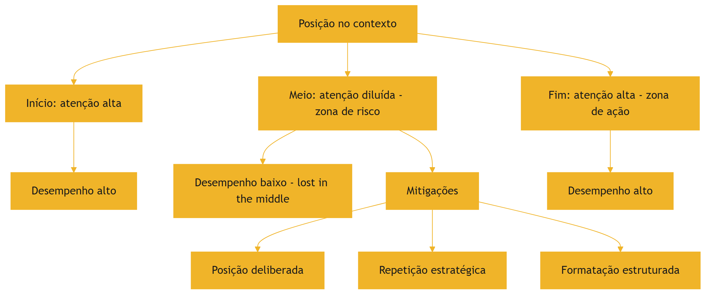

O diagrama mostra a geografia da janela: as duas zonas de alto desempenho (início e fim), a zona de risco (meio) e as mitigações [5][18].

### 3.3 O Antes e o Depois na Prática

**Antes**: o sistema concatenava o prompt, os documentos e a pergunta em qualquer ordem — e a informação crítica, no meio, era esquecida [5]. **Depois**: o sistema posiciona a pergunta no fim, reafirma a informação crítica e estrutura os documentos [5][18]. A mesma tarefa, com o mesmo conteúdo, produz resultados diferentes apenas pela geografia [5].

## 4. Técnica

### 4.1 O Medidor de Posição Crítica

O primeiro instrumento audita a posição da informação crítica no contexto composto [5]. O código abaixo calcula a posição relativa de cada bloco e sinaliza os que caem na zona de risco [5]:

```python
def auditar_posicoes(blocos: list) -> list:
    """Calcula a posição relativa de cada bloco no contexto composto.

    Retorna uma lista com a posição percentual e a zona de cada bloco.
    """
    total_tokens = sum(b["tokens"] for b in blocos)
    if total_tokens == 0:
        return []
    posicao = 0
    auditoria = []
    for bloco in blocos:
        inicio = posicao / total_tokens
        fim = (posicao + bloco["tokens"]) / total_tokens
        centro = (inicio + fim) / 2
        if centro < 0.2:
            zona = "inicio"
        elif centro > 0.8:
            zona = "fim"
        else:
            zona = "meio_risco"
        auditoria.append({
            "nome": bloco["nome"],
            "posicao_centro": round(centro, 2),
            "zona": zona,
            "critico": bloco.get("critico", False),
        })
        posicao += bloco["tokens"]
    return auditoria


if __name__ == "__main__":
    blocos = [
        {"nome": "prompt_sistema", "tokens": 1200, "critico": True},
        {"nome": "doc_a", "tokens": 5000},
        {"nome": "doc_b", "tokens": 5000},
        {"nome": "doc_c", "tokens": 5000},
        {"nome": "pergunta", "tokens": 200, "critico": True},
    ]
    for item in auditar_posicoes(blocos):
        print(item)
```

O auditor revela a geografia: a pergunta cai no fim (bom), mas se um documento crítico cair no meio, o sistema sinaliza [5].

### 4.2 O Reordenador de Contexto

O segundo instrumento reordena o contexto seguindo a geografia: informação crítica para as bordas, material de apoio no meio [5][18]. O código abaixo implementa o reordenador [5]:

```python
def reordenar_por_geografia(blocos: list) -> list:
    """Reordena blocos: críticos nas bordas, apoio no meio.

    Preserva a ordem relativa dentro de cada grupo.
    """
    criticos = [b for b in blocos if b.get("critico")]
    apoio = [b for b in blocos if not b.get("critico")]
    # Fim: o mais crítico da tarefa imediata (ex.: a pergunta) vai por último.
    fim = criticos[-1:] if criticos else []
    inicio = criticos[:-1] if criticos else []
    return inicio + apoio + fim


if __name__ == "__main__":
    blocos = [
        {"nome": "doc_a", "tokens": 5000},
        {"nome": "pergunta", "tokens": 200, "critico": True},
        {"nome": "doc_b", "tokens": 5000},
        {"nome": "prompt_sistema", "tokens": 1200, "critico": True},
        {"nome": "doc_c", "tokens": 5000},
    ]
    ordem = [b["nome"] for b in reordenar_por_geografia(blocos)]
    print(ordem)
```

O reordenador materializa a posição deliberada: o prompt de sistema vai para o início, a pergunta para o fim e o apoio ocupa o meio [5][18].

### 4.3 O Repetidor Estratégico

O terceiro instrumento implementa a repetição estratégica: reafirmar a informação crítica em mais de uma posição [5][18]. O código abaixo detecta a informação crítica e gera a reafirmação no fim do contexto [5][18]:

```python
def reafirmar_informacao_critica(instrucao: str, fato_critico: str) -> str:
    """Reafirma o fato crítico próximo da instrução final."""
    return (
        f"{instrucao}\n\n"
        f"Lembrete: {fato_critico}\n\n"
        f"Responda com base em TODAS as informações acima."
    )


if __name__ == "__main__":
    instrucao = "Resuma o relatório e aponte os riscos financeiros."
    fato = "O orçamento total do projeto é R$ 2,4 milhões."
    print(reafirmar_informacao_critica(instrucao, fato))
```

A reafirmação coloca o fato crítico na zona de alta atenção (fim) — uma mitigação simples com efeito mensurável [5][18].

## 5. Aplica

### 5.1 Onde Isso Vive no Mundo Real

A geografia da janela afeta todos os sistemas que compõem contexto [5][1]. Agentes de programação que colocam o arquivo ativo no meio e a instrução no início perdem contexto do arquivo [1]. Assistentes de suporte que concatenam o histórico antes da pergunta enterram a pergunta no meio [5]. Sistemas RAG que colocam trechos recuperados no miolo sofrem o esquecimento posicional [5][3]. A prática profissional audita a posição em todos os templates de contexto [5][1].

### 5.2 O Erro Comum do Iniciante

O erro mais comum é concatenar na ordem em que as fontes foram buscadas [5]. O sistema recupera três documentos e os coloca na ordem de recuperação, entre o prompt e a pergunta — criando exatamente a zona de risco [5]. O segundo erro é não distinguir o crítico do apoio: tudo entra no mesmo balde posicional [5]. O terceiro é ignorar o formato: prosa contínua no meio degrada mais que estrutura marcada [5]. Os três erros têm o mesmo remédio: geografia deliberada [5][18].

### 5.3 O Padrão Profissional em 2026

O padrão profissional trata a posição como design [1][5]. O template de contexto tem zonas definidas: instruções no início, apoio no meio, tarefa imediata no fim [5]. A informação crítica é reafirmada [5][18]. Os documentos são estruturados com marcações [5]. A auditoria de posição roda como teste de regressão [5][1]. O resultado é um contexto que o modelo usa de fato — não apenas um contexto que "está lá" [5].

### 5.4 Exercício de Fixação

Audite a geografia de um template de contexto seu: identifique as zonas de cada bloco e as informações críticas [5][1]. Reordene os blocos para proteger o crítico [5]. Adicione uma reafirmação do fato mais importante [5][18]. Compare o desempenho antes e depois com o teste da agulha do Capítulo 3 [2][5].

### 5.5 O Lost in the Middle em Diferentes Formatos de Documento

O fenômeno do esquecimento posicional varia com o formato do documento — e conhecer a variação é parte do design [5][10]. O estudo de Liu et al. testou múltiplos formatos e encontrou diferenças sistemáticas [5]. O primeiro formato é o de **texto contínuo**: a prosa sem estrutura é a mais vulnerável — a informação no meio se perde com facilidade [5]. O segundo é o de **documento estruturado**: com cabeçalhos, seções e numeração, a degradação no meio é menor [5]. O terceiro é o de **lista ou tabela**: a estrutura discreta ajuda a recuperação [5]. A lição é que o formato não é cosmético — é uma dimensão da geografia [5][1].

A implicação prática é direta: quando o contexto precisa carregar material de apoio no meio, o material deve ser estruturado [5][1]. O documento longo é fragmentado em seções nomeadas; os trechos recuperados são marcados; as listas substituem a prosa onde possível [5][1]. O repositório de replicação de Liu fornece os formatos de teste para validar a melhoria [10]. O engenheiro que trata o formato como detalhe paga o lost in the middle em cada sessão longa [5].

Há também a dimensão do **idioma e do domínio** [5][1]. O fenômeno aparece em documentos em diferentes idiomas, e a estruturação precisa considerar o idioma do leitor (o modelo) [1][5]. Um documento jurídico estruturado em cláusulas numeradas degrada menos que o mesmo conteúdo em prosa contínua [5][1]. A formatação é a primeira linha de defesa contra o esquecimento posicional [5][1].

### 5.6 A Interação com a Compressão e a Memória

O lost in the middle interage com as operações de compressão (Capítulo 6) e com a memória (Capítulo 10) de formas que o engenheiro precisa conhecer [5][7]. A interação com a compressão: quando o histórico é compactado em resumo, o resumo ocupa o lugar do histórico na janela — e o resumo, se colocado no meio, sofre o mesmo esquecimento [5][7]. A prática é posicionar o resumo compactado na zona de alta atenção, perto do fim, onde a tarefa atual será executada [5][7].

A interação com a memória: o que a compactação preserva e a memória recebe também tem geografia [7][5]. A memória de longo prazo (Capítulo 10) é recuperada e inserida na janela — e a inserção, se no meio, degrada [5][7]. O sistema maduro posiciona a memória recuperada estrategicamente: os fatos críticos perto do fim, o contexto de apoio no meio estruturado [5][7].

A interação com o RAG (Capítulo 9) é a mais delicada [5][3]. Os trechos recuperados, na arquitetura clássica, entram no meio — a zona de risco [5][3]. As práticas modernas reorganizam o fluxo: pergunta, trechos, instrução final, com a pergunta e a instrução nas bordas [3][5]. O Capítulo 9 detalha a interação; a lição desta subseção é que o posicionamento do material recuperado é uma decisão de design do sistema inteiro — não um detalhe da biblioteca de RAG [3][5].

### 5.7 O Lost in the Middle como Ferramenta de Diagnóstico

O fenômeno do esquecimento posicional é também uma ferramenta de diagnóstico — a segunda utilidade que o capítulo entrega [5][1]. Quando um sistema erra de forma intermitente, a primeira hipótese profissional não é "o modelo é burro" — é "a informação crítica está no meio?" [5][1]. A auditoria de posição (seção 4.1) responde em minutos: se a informação crítica cai no meio, o lost in the middle é a causa provável [5][1].

O diagnóstico posicional se conecta ao protocolo do Capítulo 8 [1][5]. A classe "falha de contexto" tem, como primeiro teste, a posição: a informação necessária estava presente e bem posicionada? [1][5]. O teste é barato (auditar o template) e tem alto poder de discriminação [5][1]. O engenheiro que ignora a posição atribui ao prompt o que é geografia — e desperdiça semanas [1][5].

A prática de registro do diagnóstico posicional alimenta o aprendizado do sistema [1][15]. Cada incidente registrado com a posição do bloco crítico constrói o histórico de falhas de geografia [15]. Com o tempo, o sistema aprende os padrões: quais tipos de tarefa sofrem mais, quais formatos protegem melhor [5][15]. O lost in the middle, de fenômeno surpreendente, vira conhecimento operacional — a marca do engenheiro maduro [5][1].

### 5.8 A Geografia em Diferentes Arquiteturas de Agentes

A geografia da janela varia com a arquitetura do agente — e o engenheiro adapta o design a cada uma [5][1]. Na arquitetura de **agente de turno único**, a geografia é simples: instrução, contexto, pergunta — e a pergunta no fim [5][1]. Na arquitetura de **conversa multi-turno**, a geografia muda com o tempo: o histórico cresce, e a pergunta atual precisa permanecer no fim [5][1][7]. A compactação (Capítulo 6) é o que mantém a geografia: o histórico resumido ocupa menos e a pergunta atual mantém a posição [5][7].

Na arquitetura de **agente com ferramentas**, a geografia precisa acomodar as saídas — que tendem a crescer no meio [6][5]. O design posiciona as saídas recentes perto do fim (onde a decisão acontece) e as antigas no meio estruturado [6][5]. Na arquitetura **multi-agente** (Capítulo 7), cada subagente tem sua geografia, e o resumo destilado atravessa a fronteira [1][5]. O resumo, ao entrar na janela do agente principal, deve ocupar uma posição coerente com a sua função [1][5].

A lição transversal: a geografia não é um template fixo — é um sistema que se adapta à arquitetura [5][1]. O engenheiro maduro conhece a geografia natural da sua arquitetura e desenha a composição em torno dela [5][1]. O Capítulo 8 usa a geografia como ferramenta de diagnóstico; este capítulo a estabelece como dimensão de design [5][1].

### 5.9 A Posição e a Interface com o Usuário

A geografia interna da janela tem reflexos na experiência do usuário [5][1]. O primeiro reflexo é a **aderência à pergunta**: quando a pergunta fica no fim (zona de ação), o modelo responde ao que foi perguntado [5][1]. Quando a pergunta se perde no meio do histórico, o modelo responde a um eco da conversa — e o usuário percebe a desconexão [5]. O segundo reflexo é a **memória do contexto**: o usuário espera que o assistente lembre o que foi dito — e a memória depende da posição e da compactação [5][7].

O terceiro reflexo é a **consistência entre turnos**: o usuário que reformula a pergunta espera que o assistente a trate como continuação [5][1]. A continuação depende do histórico recente estar na zona de alta atenção [5][1]. O quarto reflexo é o **custo da reformulação**: quando o usuário precisa repetir informação porque o assistente esqueceu, o custo de interação sobe [5][1].

O design da geografia é, portanto, parte do design de produto [5][1]. O engenheiro que posiciona a pergunta no fim e mantém o recente na zona de atenção entrega um assistente que "parece inteligente" — porque, na prática, usa bem a janela [5][1]. O que ignora a geografia entrega um assistente que "parece burro" — mesmo com um modelo excelente [5]. A geografia é a ponte entre a arquitetura e a percepção [5][1].

### 5.10 O Estudo de Caso do Relatório Perdido

O estudo de caso consolida o capítulo [5][1]. O cenário: um agente de análise que gera relatórios com base em documentos [1]. O sistema concatena: prompt, três documentos e a instrução de geração [5]. O sintoma: o relatório ignora sistematicamente as informações do segundo documento — o do meio [5]. A equipe tentou reformular o prompt (falha de diagnóstico) e melhorar o documento (sem efeito) [1][5].

O diagnóstico correto (Capítulo 8): a informação crítica do segundo documento estava na zona de risco — o meio [5][1]. O teste da auditoria de posição (seção 4.1) revelou a geografia em segundos [5]. O tratamento: reorganizar o contexto — os fatos críticos do segundo documento foram reafirmados perto da instrução final (repetição estratégica, seção 2.6) [5][18]. O relatório passou a citar o segundo documento [5][18].

A lição do caso é dupla [5][1]. Primeiro, o sintoma (relatório incompleto) não indicava a causa (geografia) [5]. Segundo, o tratamento foi mais barato que o diagnóstico errado: uma reordenação, não uma reescrita [5][1]. O caso demonstra o poder do capítulo: conhecer a geografia é diagnosticar e corrigir em minutos o que parecia um mistério [5][1].

### 5.11 O Posicionamento em Conversas Multi-Turno

A geografia em conversas multi-turno tem uma dinâmica própria que o engenheiro controla [5][7]. O problema central: o histórico cresce a cada turno, e a pergunta atual precisa permanecer na zona de alta atenção (o fim) [5][1]. Sem gestão, o histórico empurra a pergunta para o meio — e o lost in the middle ataca [5]. O primeiro controle é a **reordenação por turno**: a composição do contexto reordena os blocos a cada turno — o recente para o fim, o antigo para o meio estruturado [5][1].

O segundo controle é a **compactação por turno** (Capítulo 6): os turnos antigos são resumidos antes de empurrar a pergunta [5][7]. O resumo do turno antigo, no meio, degrada menos que o texto integral [5][7]. O terceiro é a **reafirmação da tarefa**: a tarefa em andamento é reafirmada perto da pergunta — a repetição estratégica aplicada à conversa [5][18].

O quarto controle é o **limite de profundidade**: a conversa além de N turnos é compactada agressivamente, mantendo apenas o fio condutor [7][5]. O desenho da geografia multi-turno é a combinação de posicionamento e compactação — as duas disciplinas dos Capítulos 4 e 6 trabalhando juntas [5][7]. O engenheiro que domina a conversa multi-turno domina o caso mais comum de produção [5][1].

### 5.12 O Estudo de Caso do Suporte que Esquecia

O estudo de caso mostra a geografia em uma aplicação de suporte [5][1]. O cenário: um chatbot de suporte que atende sessões longas — o usuário descreve um problema complexo com muitos detalhes [5]. O sintoma: o chatbot esquecia os detalhes do início da conversa quando o usuário perguntava no fim [5]. A equipe tentou aumentar a janela (custo, sem efeito) [5][13].

O diagnóstico (Capítulo 8): os detalhes do início haviam sido empurrados para o meio pelo histórico crescente — lost in the middle [5]. A auditoria de posição confirmou: os detalhes críticos estavam na zona de risco [5]. O tratamento: a composição por turno reordena os blocos; os detalhes críticos são reafirmados perto da pergunta; o histórico antigo é compactado (Capítulo 6) [5][7][18].

O resultado: o chatbot passou a lembrar os detalhes do início [5]. O caso demonstra o tema do capítulo: a geografia não é um detalhe de implementação — é a diferença entre um assistente que lembra e um que esquece [5][1]. E mostra a interação com a compactação: sem ela, a geografia não sobrevive à sessão longa [5][7].

### 5.13 A Lista de Verificação da Geografia

A lista de verificação consolida o capítulo [5][1]. O primeiro item: a informação crítica está nas bordas (início ou fim)? [5]. O segundo: a pergunta atual está na zona de ação? [5][1]. O terceiro: o material de apoio está estruturado (não prosa contínua)? [5]. O quarto: os trechos recuperados (Capítulo 9) estão posicionados fora do meio? [5][3].

O quinto item: a reafirmação estratégica protege os fatos críticos? [5][18]. O sexto: a compactação impede o histórico de empurrar a pergunta? [5][7]. O sétimo: a auditoria de posição roda nos testes de regressão? [5][1]. O oitavo: a geografia é adaptada à arquitetura (turno único, multi-turno, subagentes)? [5][1].

A lista é o resumo operacional do capítulo [5][1]. O engenheiro que a percorre no design do template evita o esquecimento posicional antes que ele aconteça [5][1]. A geografia deixa de ser um fenômeno surpreendente e vira uma dimensão controlada do design [5][1].

### 5.14 A Relação entre Geografia e Fenômenos Vizinhos

A geografia da janela não existe isolada — interage com os fenômenos estudados nos capítulos vizinhos [5][2][1]. A primeira interação é com o **context rot** (Capítulo 3): o volume e a posição são duas dimensões da mesma degradação [2][5]. Contextos longos criam mais "meio" — e o meio é onde o lost in the middle ataca [2][5]. O tratamento é conjunto: menos volume (seleção) e melhor posição (geografia) [1][2][5].

A segunda interação é com o **isolamento** (Capítulo 7): a geografia de cada janela de subagente precisa ser desenhada — e o resumo destilado que atravessa a fronteira tem posição na janela do coordenador [1][5]. A terceira é com a **recuperação** (Capítulo 9): os trechos recuperados têm posição crítica — e o RAG mal posicionado sofre o esquecimento [3][5]. A quarta é com a **compressão** (Capítulo 6): o resumo compactado, se colocado no meio, degrada [7][5].

O engenheiro que conhece as interações trata a geografia como parte do sistema — não como um detalhe isolado [5][1]. O diagnóstico (Capítulo 8) usa as interações: uma falha pode combinar volume, posição e isolamento [1][2][5]. A compreensão integrada é a marca da maturidade na disciplina [1][5].

### 5.15 O Estudo de Caso do Meio Esquecido em Documento Longo

O estudo de caso aprofunda a aplicação em documentos longos [5][1]. O cenário: um agente que resume contratos de 200 páginas [5]. O protótipo concatenava o contrato inteiro e pedia o resumo [5]. O sintoma: o resumo ignorava sistematicamente as cláusulas do meio do documento — exatamente onde ficam as cláusulas de pagamento [5]. A equipe tentou prompts melhores — sem efeito [5][1].

O diagnóstico: lost in the middle em documento único — as cláusulas do meio estavam na zona de risco [5]. O teste: a auditoria de posição (seção 4.1) confirmou [5]. O tratamento: o contrato foi fragmentado em seções; as cláusulas críticas (pagamento, prazo, multa) foram reafirmadas perto da instrução final; o documento foi estruturado com marcações [5][18].

O resultado: o resumo passou a cobrir as cláusulas do meio [5]. O caso demonstra o tema do capítulo em sua forma mais pura: o conteúdo estava lá — a posição é que matava [5][1]. E mostra o poder da repetição estratégica: reafirmar o crítico na zona de ação [5][18].

### 5.16 A Lista de Verificação Final da Geografia

A lista de verificação final consolida o capítulo e suas interações [5][1]. O primeiro item: a informação crítica está nas bordas — em todos os templates? [5]. O segundo: a pergunta atual está sempre na zona de ação? [5][1]. O terceiro: o histórico antigo é compactado antes de empurrar a pergunta? [5][7].

O quarto item: os trechos recuperados (RAG) estão fora do meio? [3][5]. O quinto: os resumos compactados são posicionados com intenção? [7][5]. O sexto: a auditoria de posição roda nos testes de regressão de todos os templates? [5][1]. O sétimo: a geografia é revisada quando o modelo muda de versão? [5][1].

A lista é o resumo operacional definitivo [5][1]. O engenheiro que a percorre controla a dimensão mais esquecida da engenharia de contexto [5]. A geografia — junto com o volume e a qualidade — completa a tríade do que o modelo vê [5][1][2].

### 5.17 A Geografia e o Design de Templates Reutilizáveis

A geografia não se aplica apenas a um contexto — aplica-se ao design de templates reutilizáveis [5][1]. O template é a receita da composição: as zonas, a ordem e as regras de posicionamento [1][5]. O primeiro princípio do template é a **declaração de zonas**: o template define explicitamente as zonas — instrução, apoio, ação — e o que vai em cada uma [5][1]. O segundo é a **regra de posição por tipo**: cada tipo de bloco tem posição definida — instruções no início, tarefa no fim, apoio no meio estruturado [5][1].

O terceiro princípio é a **parametrização da geografia**: o template recebe parâmetros que controlam a posição — onde o trecho recuperado entra, onde o resumo compactado é colocado [5][1]. O quarto é a **validação do template**: o teste de regressão valida que a geografia do template está correta — a auditoria de posição roda automaticamente [5][1].

O template com geografia explícita é a materialização da disciplina [5][1]. O engenheiro que o desenha uma vez espalha a qualidade por todas as composições [5][1]. O que improvisa a posição em cada composição paga o lost in the middle repetidamente [5]. O template é o instrumento da consistência — e a consistência é a marca do padrão profissional [5][1].

### 5.18 O Fechamento do Capítulo

O capítulo da geografia se encerra com a consolidação [5][1]. A janela tem geografia: o início instrui, o fim age, o meio arrisca [5]. O lost in the middle é o fenômeno que revela a geografia — e a curva em U, a sua assinatura [5]. As mitigações — posição deliberada, repetição estratégica, estruturação — transformam o fenômeno em design [5][18].

O engenheiro que domina a geografia controla a dimensão mais esquecida do contexto [5][1]. A geografia completa a tríade do que o modelo vê — quantidade (Capítulo 3), qualidade (Capítulo 1) e posição (este capítulo) [5][1][2]. O próximo capítulo inicia o framework operacional: Write e Select [1][6].

### 5.19 A Geografia e a Avaliação da Qualidade de Resposta

A geografia tem um efeito mensurável na qualidade — e o engenheiro o mede [5][12]. O primeiro instrumento é a **comparação de posições**: a mesma tarefa executada com a informação crítica em posições diferentes — início, meio, fim — e a qualidade medida em cada caso [5][12]. O experimento é a aplicação do teste de isolamento de variáveis (Capítulo 8) à geografia [1][5].

O segundo instrumento é a **métrica de posição**: o conjunto de avaliação (Capítulo 10) inclui casos que variam a posição da informação [5][12]. A regressão — a informação que antes estava no início e agora caiu no meio — é detectada pela métrica [5][12]. O terceiro é o **registro do efeito**: os resultados das comparações entram no registro de diagnóstico [1][15].

O engenheiro que mede a geografia transforma o fenômeno em métrica — e a métrica em decisão [5][12]. A geografia deixa de ser crença e vira evidência [5]. A avaliação da qualidade de resposta completa o ciclo: o design da posição é validado pelo resultado observado [5][1].

### 5.20 O Fechamento do Capítulo

O capítulo da geografia se encerra com a consolidação final [5][1]. A janela tem geografia; o lost in the middle é a evidência; a curva em U é a assinatura [5]. As mitigações — posição, repetição, estrutura — são o design [5][18]. A avaliação — comparação, métrica, registro — é a validação [5][12].

O engenheiro que domina a geografia completa a tríade do que o modelo vê: quantidade, qualidade e posição [5][1][2]. Com as bases da janela firmes, o próximo capítulo inicia o framework operacional: Write e Select [1][6].

### 5.21 O Fechamento do Capítulo

O capítulo da geografia se encerra com a consolidação definitiva [5][1]. A janela tem geografia; o lost in the middle é a evidência; a curva em U é a assinatura; as mitigações são o design; a avaliação é a validação [5][18][12].

O engenheiro que domina a geografia controla a dimensão mais esquecida do contexto [5][1]. A tríade do que o modelo vê — quantidade, qualidade e posição — está completa [5][1][2]. O próximo capítulo inicia o framework operacional: Write e Select [1][6].

## 6. Conclusão

A janela de contexto tem geografia, e a geografia decide o desempenho [5]. O lost in the middle demonstrou a curva em U: início e fim são zonas de alta atenção; o meio é a zona de risco [5]. As mitigações — posição deliberada, repetição estratégica, formatação estruturada e redução de volume — transformam a descoberta em design [5][18][2]. As ferramentas deste capítulo auditam e reordenam o contexto segundo a geografia [5]. O próximo capítulo inicia o núcleo operacional do livro: o framework write/select/compress/isolate, começando pelas operações Write e Select [1][6].

## 7. Referências

[1] ANTHROPIC. Effective context engineering for AI agents. Anthropic Engineering Blog, set. 2025. Disponível em: https://www.anthropic.com/engineering/effective-context-engineering-for-ai-agents. Acesso em: 5 ago. 2026.
[2] HONG, Kelly; TROYNIKOV, Anton; HUBER, Jeff. Context Rot: How Increasing Input Tokens Impacts LLM Performance. Chroma Technical Report, jul. 2025. Disponível em: https://www.trychroma.com/research/context-rot. Acesso em: 5 ago. 2026.
[3] LEWIS, Patrick et al. Retrieval-Augmented Generation for Knowledge-Intensive NLP Tasks. In: Advances in Neural Information Processing Systems (NeurIPS), v. 33, p. 9459–9474, 2020. Disponível em: https://arxiv.org/abs/2005.11401. Acesso em: 5 ago. 2026.
[4] GAO, Yunfan et al. Retrieval-Augmented Generation for Large Language Models: A Survey. arXiv:2312.10997, mar. 2024. Disponível em: https://arxiv.org/abs/2312.10997. Acesso em: 5 ago. 2026.
[5] LIU, Nelson F. et al. Lost in the Middle: How Language Models Use Long Contexts. Transactions of the Association for Computational Linguistics (TACL), v. 12, p. 157–173, 2024. Disponível em: https://arxiv.org/abs/2307.03172. Acesso em: 5 ago. 2026.
[6] ANTHROPIC. Writing tools for AI agents — using AI agents. Anthropic Engineering Blog, set. 2025. Disponível em: https://www.anthropic.com/engineering/writing-tools-for-agents. Acesso em: 5 ago. 2026.
[7] ANTHROPIC. Context engineering: memory, compaction, and tool clearing. Claude Platform Cookbook, mar. 2026. Disponível em: https://platform.claude.com/cookbook/tool-use-context-engineering-context-engineering-tools. Acesso em: 5 ago. 2026.
[8] ZHAO, Wayne Xin et al. A Survey of Large Language Models. arXiv:2303.18223, 2023. Disponível em: https://arxiv.org/abs/2303.18223. Acesso em: 5 ago. 2026.
[9] CHROMA. Context Rot: Evaluation Toolkit. GitHub Repository, 2025. Disponível em: https://github.com/chroma-core/context-rot. Acesso em: 5 ago. 2026.
[10] LIU, Nelson F. Lost in the Middle: Replication Repository. GitHub Repository, 2023. Disponível em: https://github.com/nelson-liu/lost-in-the-middle. Acesso em: 5 ago. 2026.
[11] CHEN, Jiawei et al. LongRAG: Enhancing Retrieval-Augmented Generation with Long-context LLMs. arXiv:2406.15319, 2024. Disponível em: https://arxiv.org/abs/2406.15319. Acesso em: 5 ago. 2026.
[12] ASIA, Research Group et al. Retrieval-Augmented Generation Evaluation in the Era of Large Language Models: A Comprehensive Survey. ResearchGate / arXiv, abr. 2025. Disponível em: https://www.researchgate.net/publication/390991356. Acesso em: 5 ago. 2026.
[13] OPENAI. GPT-4 Technical Report & Developer Guides on Context Management. OpenAI Documentation, 2024–2025. Disponível em: https://openai.com/index/gpt-4-research/. Acesso em: 5 ago. 2026.
[14] GOOGLE CLOUD. What is Retrieval-Augmented Generation (RAG)?. Google Cloud Architecture Center, 2025. Disponível em: https://cloud.google.com/use-cases/retrieval-augmented-generation. Acesso em: 5 ago. 2026.
[15] LANGCHAIN. LangChain Agents & Context Management Documentation. LangChain Guides, 2025–2026. Disponível em: https://python.langchain.com/docs/concepts/agents/. Acesso em: 5 ago. 2026.
[16] WANG, Zhen et al. Agentic Retrieval-Augmented Generation: A Survey on Agentic RAG. arXiv:2408.12999, 2024. Disponível em: https://arxiv.org/abs/2408.12999. Acesso em: 5 ago. 2026.
[17] XIAO, Guangxuan et al. Efficient Streaming Language Models with Attention Sinks. arXiv:2309.17453, 2023. Disponível em: https://arxiv.org/abs/2309.17453. Acesso em: 5 ago. 2026.
[18] RODIN, Alex et al. Found in the Middle: Overcoming Long-Context Vulnerabilities in LLMs. arXiv:2403.04797, 2024. Disponível em: https://arxiv.org/abs/2403.04797. Acesso em: 5 ago. 2026.
[19] MEDIUM (Data Science Collective). Context Is the New Prompt: Why Context Engineering Is Shaping the Future of AI. Medium Article, 2025. Disponível em: https://medium.com/data-science-collective/context-is-the-new-prompt-why-context-engineering-is-shaping-the-future-of-ai-46eb062ed270. Acesso em: 5 ago. 2026.
[20] ZENML. Context Rot: Evaluating LLM Performance Degradation with Increasing Input Tokens. MLOps Database, 2025. Disponível em: https://www.zenml.io/llmops-database/context-rot-evaluating-llm-performance-degradation-with-increasing-input-tokens. Acesso em: 5 ago. 2026.

# PARTE 3 — O Framework write/select/compress/isolate

# Capítulo 5 — Write e select: escrever e selecionar o contexto certo

## 1. Introdução

Os três primeiros capítulos estabeleceram o problema: a janela é finita (Capítulo 2), o excesso degrada (Capítulo 3) e a posição importa (Capítulo 4) [8][2][5]. Este capítulo inicia a solução: o framework write/select/compress/isolate, a receita da curadoria de contexto consolidada pela Anthropic [1]. As duas primeiras operações — Write e Select — são o objeto deste capítulo [1][6]. Write trata da produção de instruções e ferramentas em "altitude ideal": específicas o suficiente para dirigir, flexíveis o suficiente para não quebrar [1][6]. Select trata da escolha just-in-time do que entra na janela, substituindo o empilhamento estático pela exploração sob demanda [1]. Juntas, elas respondem às duas perguntas fundamentais da curadoria: como escrever e o que selecionar [1][6].

## 2. Explica

### 2.1 A Altitude Ideal da Instrução

O princípio central do Write é a altitude ideal [1][6]. Instruções em altitude baixa demais são regras if-else rígidas: quebram em qualquer variação da tarefa e exigem manutenção constante [1]. Instruções em altitude alta demais são generalizações vagas: "seja útil" não dirige nada [1]. A altitude ideal fica entre as duas: instruções específicas sobre o que fazer, com flexibilidade sobre como fazer [1]. A Anthropic documenta o princípio no contexto de design de ferramentas e instruções para agentes [6]. O engenheiro de contexto escreve para a altitude certa — e revisa a altitude quando o comportamento degrada [1][6].

### 2.2 O Write de Instruções Estáveis

As instruções estáveis — o prompt de sistema, as políticas da organização — são o componente permanente do contexto [1][6]. O Write dessas instruções segue princípios específicos [1][6]. Primeiro, a estabilidade: o que não muda frequentemente não deve ser reescrito a cada chamada [1]. Segundo, a concisão: cada token de instrução ocupa espaço que poderia ser de dado relevante [1][8]. Terceiro, a testabilidade: instruções devem ser verificáveis — é possível dizer se foram seguidas? [6]. Quarto, a separação: instruções estáveis não se misturam com dados de sessão [1]. O padrão profissional versiona as instruções estáveis como código [1][15].

### 2.3 O Write de Ferramentas

As ferramentas são a extensão do agente sobre o mundo — e sua descrição é parte do contexto [6][21]. A Anthropic documenta o design de ferramentas para agentes: descrições claras, parâmetros bem definidos e acoplamento baixo [6]. A descrição da ferramenta que entra no contexto deve comunicar o que a ferramenta faz, quando usá-la e o que retorna [6]. O Model Context Protocol (MCP) padroniza a exposição de ferramentas e fontes de dados aos agentes — um padrão aberto que separa a definição da ferramenta do código que a consome [21]. O Write de ferramentas é, na prática, o design da interface entre o agente e o mundo [6][21].

### 2.4 A Crítica ao Pré-processamento Estático

A operação Select nasce de uma crítica ao padrão antigo: o pré-processamento estático [1]. O sistema antigo embutia tudo no contexto de antemão — manuais inteiros, bases completas, históricos totais — na esperança de que o modelo encontrasse o necessário [1]. O custo é triplo: custo financeiro (tokens), degradação (context rot) e esquecimento posicional (lost in the middle) [2][5][13]. A crítica da Anthropic é direta: o pré-processamento estático massivo é o oposto da curadoria [1]. O Select substitui o "embutir tudo" pelo "buscar sob demanda" [1].

### 2.5 A Seleção Just-in-Time

A seleção just-in-time é o coração do Select [1]. Em vez de embutir o conteúdo, o contexto carrega referências leves — caminhos de arquivos, links, metadados — e o agente explora essas referências sob demanda, usando primitivas como glob e grep [1]. A analogia da Anthropic é a cognição humana: um especialista não memoriza a biblioteca; sabe onde procurar e consulta quando precisa [1]. A seleção just-in-time reduz o contexto ao mínimo necessário para o passo atual, preservando a capacidade de acessar o resto quando preciso [1]. O resultado é contexto enxuto e desempenho preservado [1][2].

### 2.6 As Primitivas de Exploração

O Select depende de ferramentas de exploração eficientes [1][6]. Glob encontra arquivos por padrão de nome; grep encontra linhas por padrão de conteúdo; ambos retornam resultados compactos [1][6]. A combinação permite ao agente navegar um repositório sem carregá-lo inteiro [1]. O design dessas ferramentas segue o princípio do Write: descrições claras, saída compacta e alta eficiência de tokens [6]. O repositório é a biblioteca; as primitivas são o catálogo; o contexto carrega apenas o catálogo [1][6].

### 2.7 A Consulta Como Motor da Seleção

A seleção just-in-time é dirigida por consultas — e a qualidade da consulta decide a qualidade da seleção [1][5]. O Capítulo 4 mostrou que a similaridade entre consulta e informação modula a recuperação [5]. O design da consulta é, portanto, parte do design do contexto [1]. Consultas específicas selecionam melhor; consultas vagas retornam demais [1]. O padrão profissional escreve a consulta como uma especificação da informação necessária para o passo atual [1][5].

### 2.8 O Orçamento da Seleção

A seleção opera dentro do orçamento da janela (Capítulo 2) [1][8]. Cada passo da sessão tem um orçamento de contexto: quanto pode ser selecionado sem estourar a reserva [1][8]. A seleção just-in-time respeita o orçamento por natureza — seleciona o mínimo para o passo [1]. A interação entre Select e orçamento é a disciplina diária do engenheiro de contexto: selecionar o suficiente, nunca o máximo [1][8].

### 2.9 A Relação com a Recuperação

O Select e a recuperação (RAG) são primos [1][3]. Ambos selecionam informação para entrar na janela; a diferença é o mecanismo [1][3]. O Select opera sobre referências e primitivas; a recuperação opera sobre índices vetoriais e similaridade semântica [1][3][14]. Em sistemas maduros, os dois se combinam: o agente usa Select para navegar e recuperação para buscar por significado [1][3]. O Capítulo 9 desenvolve a recuperação; este capítulo estabelece o princípio comum: contexto é selecionado, não empilhado [1][3].

### 2.10 A Síntese: Escrever e Selecionar São Duas Faces da Mesma Curadoria

Write e Select são complementares [1]. O Write produz o material de qualidade — instruções em altitude ideal, ferramentas bem descritas [1][6]. O Select decide o que desse material entra na janela em cada passo [1]. Um sem o outro falha: escrever bem e empilhar tudo desperdiça a escrita; selecionar bem com material ruim seleciona ruído [1][2]. A curadoria é o par indissolúvel [1].

## 3. Ilustra

### 3.1 A Analogia do Especialista

A analogia do especialista humano é a mais direta [1]. Um médico experiente não memoriza todos os livros de medicina — sabe o que procurar, quando e onde [1]. Ao atender um paciente, ele seleciona os exames relevantes (Select), consulta o protocolo certo (Write bem feito) e investiga com perguntas específicas (consultas de qualidade) [1]. O engenheiro de contexto desenha o agente para funcionar como o especialista: contexto enxuto, exploração sob demanda e seleção dirigida pela tarefa [1].

### 3.2 O Diagrama do Fluxo Write/Select

O diagrama abaixo representa o fluxo das duas operações no ciclo de uma chamada [1][6].

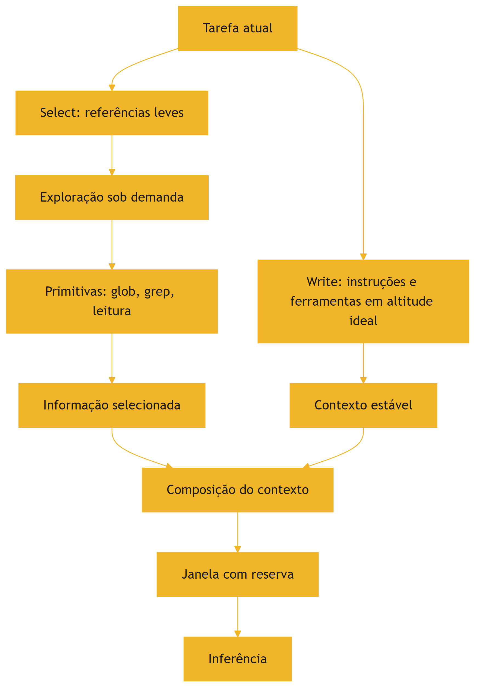

O diagrama mostra o par: o Write produz o contexto estável, o Select produz a informação do passo, e os dois se encontram na composição [1][6].

### 3.3 O Antes e o Depois na Prática

**Antes (estático)**: o contexto embute o repositório inteiro, o manual completo e o histórico total — caro, degradado e esquecido no meio [1][2]. **Depois (just-in-time)**: o contexto carrega o prompt de sistema enxuto e referências; o agente busca os arquivos e trechos relevantes ao passo atual [1]. A mesma tarefa, com o mesmo conhecimento disponível, produz respostas melhores porque o contexto é o mínimo suficiente [1][2].

## 4. Técnica

### 4.1 O Avaliador de Altitude de Instrução

O primeiro instrumento avalia a altitude de uma instrução: muito baixa (if-else rígido), muito alta (vaga) ou ideal [1][6]. O código abaixo classifica instruções por heurísticas de rigidez e vagueza [1]:

```python
PALAVRAS_VAGAS = ["seja", "faça bem", "ajude", "use bom senso", "sempre",
                  "nunca", "qualquer", "tudo", "corretamente"]


def avaliar_altitude(instrucao: str) -> dict:
    """Avalia a altitude de uma instrução: baixa, alta ou ideal."""
    texto = instrucao.lower()
    tem_condicional = "se " in texto or "quando " in texto
    tem_regra_absoluta = any(p in texto for p in ["sempre", "nunca", "jamais"])
    vagas = sum(1 for p in PALAVRAS_VAGAS if p in texto)
    tem_exemplo = "exemplo" in texto or "por exemplo" in texto
    tem_formato = "formato" in texto or "json" in texto

    if tem_regra_absoluta and not tem_exemplo:
        altitude = "baixa"
        motivo = "regras absolutas sem exemplos: quebra em variações"
    elif vagas >= 2 and not tem_formato:
        altitude = "alta"
        motivo = "generalizações vagas sem especificação de formato"
    else:
        altitude = "ideal"
        motivo = "especifica o que fazer com flexibilidade sobre como"
    return {"altitude": altitude, "motivo": motivo, "condicional": tem_condicional}


if __name__ == "__main__":
    print(avaliar_altitude("Sempre resuma em 3 parágrafos, nunca adicione exemplos."))
    print(avaliar_altitude("Seja útil e ajude o usuário com bom senso."))
    print(avaliar_altitude("Resuma o relatório em formato JSON com os campos risco e valor."))
```

O avaliador materializa o conceito de altitude: o engenheiro audita suas instruções e ajusta a altura [1][6].

### 4.2 O Seletor por Referências e Primitivas

O segundo instrumento implementa a seleção just-in-time com referências leves e primitivas de exploração [1][6]. O código abaixo simula o fluxo: lista referências, explora sob demanda e seleciona o trecho relevante [1][6]:

```python
import fnmatch


class ExploradorRepositorio:
    """Simula a exploração sob demanda de um repositório por primitivas."""

    def __init__(self, arquivos: dict):
        self.arquivos = arquivos  # nome -> conteúdo

    def glob(self, padrao: str) -> list:
        """Primitiva glob: encontra arquivos por padrão de nome."""
        return [n for n in self.arquivos if fnmatch.fnmatch(n, padrao)]

    def grep(self, termo: str, arquivo: str = None) -> list:
        """Primitiva grep: encontra linhas por termo em arquivos."""
        alvo = [arquivo] if arquivo else self.arquivos.keys()
        resultados = []
        for nome in alvo:
            for linha in self.arquivos.get(nome, "").splitlines():
                if termo.lower() in linha.lower():
                    resultados.append(f"{nome}: {linha}")
        return resultados


if __name__ == "__main__":
    repo = ExploradorRepositorio({
        "docs/politica.md": "Compliance: aprovação em duas etapas para valores acima de 10k.",
        "src/pagamentos.py": "def aprovar(valor): return valor < 10000",
        "src/relatorio.py": "def gerar(): pass",
    })
    print("glob:", repo.glob("*.py"))
    print("grep 'aprova':", repo.grep("aprova"))
```

O explorador materializa o Select: o contexto carrega referências e o agente explora com primitivas — compacto e sob demanda [1][6].

### 4.3 O Compositor com Reserva

O terceiro instrumento integra Write e Select com o orçamento da janela [1][8]. O código abaixo compõe o contexto respeitando a reserva de segurança [1][8]:

```python
def compor_com_reserva(estatico: str, selecionados: list, janela: int,
                       reserva_pct: float = 0.2) -> dict:
    """Compõe o contexto com reserva de segurança."""
    tokens_estatico = len(estatico.split())
    limite = int(janela * (1 - reserva_pct))
    aceitos = []
    ocupado = tokens_estatico
    for trecho in selecionados:
        custo = len(trecho.split())
        if ocupado + custo <= limite:
            aceitos.append(trecho)
            ocupado += custo
    return {
        "estatico": estatico,
        "selecionados_aceitos": len(aceitos),
        "rejeitados_por_orcamento": len(selecionados) - len(aceitos),
        "ocupado": ocupado,
        "reserva": janela - ocupado,
    }


if __name__ == "__main__":
    estatico = "Você é um analista. Use o contexto fornecido."
    selecionados = ["Trecho A...", "Trecho B...", "Trecho C..."]
    print(compor_com_reserva(estatico, selecionados, janela=8_000))
```

O compositor materializa a disciplina do par: escrever bem (estático), selecionar sob demanda e respeitar a reserva [1][8].

## 5. Aplica

### 5.1 Onde Isso Vive no Mundo Real

Write e Select estão em toda arquitetura de agente madura [1][15]. Agentes de programação (como os da Anthropic) usam prompt de sistema enxuto e exploram o repositório com glob/grep [1]. Assistentes corporativos referenciam políticas e buscam sob demanda [1]. Ferramentas de análise carregam o esquema dos dados, não os dados inteiros [1][6]. O LangChain documenta o gerenciamento de estado e contexto como parte central da orquestração [15]. O padrão é universal: contexto enxuto, exploração sob demanda [1].

### 5.2 O Erro Comum do Iniciante

O erro mais comum é o pré-processamento estático: embutir tudo "para garantir" [1][2]. O segundo é escrever instruções em altitude errada — regras absolutas que quebram ou generalizações que não dirigem [1][6]. O terceiro é ignorar a reserva: o contexto composto sem orçamento estoura no meio da sessão [1][8]. Os três erros compartilham a mesma raiz: tratar contexto como acúmulo, não como curadoria [1][2].

### 5.3 O Padrão Profissional em 2026

O padrão profissional combina os princípios do capítulo [1][6]. O prompt de sistema é enxuto, estável e versionado [1][15]. As ferramentas são bem descritas, com saída compacta [6]. O contexto carrega referências, não conteúdo embutido [1]. A exploração usa primitivas eficientes [1][6]. A reserva é monitorada [1][8]. A altitude é auditada na revisão de código [1][6]. O resultado é um agente que funciona em tarefas complexas sem inchar o contexto [1].

### 5.4 Exercício de Fixação

Audite um prompt de sistema seu com o avaliador de altitude [1][6]. Reescreva as instruções em altitude ideal [1][6]. Liste as referências que o contexto deveria carregar em vez do conteúdo [1]. Implemente a exploração com primitivas e a composição com reserva [1][8]. Compare o custo e o desempenho antes e depois [1][2].

### 5.5 O Write de Instruções para Diferentes Perfis de Tarefa

O princípio da altitude ideal (seção 2.1) ganha forma concreta quando aplicado a diferentes perfis de tarefa [1][6]. Cada perfil pede um tipo de escrita — e o engenheiro que escreve tudo do mesmo jeito falha [1]. O primeiro perfil é o de **extração**: a tarefa transforma texto em estrutura [6][1]. Aqui, a altitude ideal combina instrução de formato rígido com liberdade de conteúdo — o formato é especificado (JSON, campos), o conteúdo é inferido [6]. O segundo perfil é o de **análise**: a tarefa interpreta e avalia [1]. A altitude ideal é o oposto: instrução de critérios (o que avaliar) sem rigidez de formato [1].

O terceiro perfil é o de **geração criativa**: a tarefa produz texto novo [1]. A altitude ideal define o tom e o público, sem engessar a expressão [1]. O quarto perfil é o de **execução com ferramentas**: a tarefa opera o mundo via ferramentas [6]. A altitude ideal combina instrução de objetivo (o que alcançar) com autonomia de caminho (como alcançar) [6]. O quinto perfil é o de **revisão**: a tarefa julga e corrige [1]. A altitude ideal define os critérios de revisão e o formato do parecer [1].

A classificação por perfil orienta também a revisão do Write [1][6]. Na revisão de código do prompt, o engenheiro pergunta: a instrução serve ao perfil da tarefa? [1]. Extração com rigidez de conteúdo falha; análise com rigidez de formato falha; criação com rigidez de expressão falha [1][6]. O avaliador de altitude da seção 4.1 ganha uma dimensão: a adequação ao perfil [1].

### 5.6 O Select e a Economia da Exploração

A seleção just-in-time tem uma economia própria: a exploração custa chamadas, e cada chamada custa latência e tokens [1][13]. O engenheiro projeta a exploração para minimizar o custo por informação útil [1][13]. O primeiro princípio da economia da exploração é a **ordem de busca**: consultar as fontes mais prováveis primeiro [1]. O agente que globa antes de grepar, e grepa antes de ler o arquivo inteiro, gasta menos [1][6]. A ordem é a materialização da hierarquia de custo do Capítulo 1 [1][13].

O segundo princípio é a **amostragem antes da leitura completa**: ler o início de um arquivo antes de decidir ler tudo [6][1]. A leitura parcial é barata; a leitura completa é cara [6]. O agente que amostra decide melhor onde investir a janela [1][6]. O terceiro princípio é o **cache de exploração**: os resultados de glob e grep repetidos não são refeitos [1][13]. O cache de exploração é a versão do cache de contexto (Capítulo 10) aplicada à navegação [1][13].

O quarto princípio é o **limite de exploração**: o agente tem um orçamento de exploração por tarefa — número máximo de chamadas de busca, tokens máximos lidos [1][6]. O limite impede o loop de exploração sem fim — o agente que explora demais nunca chega à tarefa [1][6]. A economia da exploração é a disciplina que torna o Select viável em produção: sem ela, a seleção sob demanda custa mais que o empilhamento estático [1][13].

### 5.7 O Workflow de Revisão do Contexto Estático

O contexto estático — prompt de sistema, políticas, instruções permanentes — precisa de revisão periódica [1][15]. O contexto estático tem uma vida útil: as políticas mudam, os formatos evoluem, os objetivos se ajustam [1][15]. A revisão é o processo que mantém o estático vivo [1][15]. O primeiro passo da revisão é a **auditoria de atualidade**: cada bloco estático é confrontado com a realidade — a política ainda vale? O formato ainda é usado? [1].

O segundo passo é a **auditoria de redundância**: blocos estáticos duplicados ou contraditórios são identificados [1][15]. O contexto estático acumula lixo com o tempo — regras que foram substituídas, exemplos que perderam sentido [1]. A remoção da redundância libera tokens e reduz conflitos [1][8]. O terceiro passo é o **teste de regressão**: as mudanças no estático são testadas contra o conjunto de avaliação (Capítulo 10) [1][12].

O quarto passo é a **documentação da intenção**: cada bloco estático carrega o porquê da sua existência [1][15]. O LangChain documenta a prática de manter o estado e as instruções rastreáveis [15]. A revisão periódica do estático é a manutenção preventiva do ambiente informacional — o equivalente à refatoração de código [1][15]. O engenheiro que revisa o estático mantém o alicerce saudável; o que não revisa acumula dívida de contexto [1].

### 5.8 O Desenho do Write para Subagentes

O Write não se aplica apenas ao agente principal — aplica-se, de forma especial, aos subagentes do Capítulo 7 [1][6]. O prompt do subagente é uma peça de Write com características próprias [1]. A primeira é o **escopo estrito**: o subagente recebe uma subtarefa bem delimitada, sem ambiguidade de fronteira [1]. A segunda é o **contrato de retorno**: o subagente sabe exatamente o que devolver — o formato do resumo destilado [1]. A terceira é a **autonomia controlada**: o subagente sabe o que pode decidir sozinho e o que deve reportar [1].

O Write para subagentes é mais rígido que o do agente principal — e por um bom motivo [1][6]. O subagente opera sem o contexto amplo do coordenador; sua instrução precisa carregar tudo o que ele precisa saber [1][6]. A altitude ideal, aqui, pende para a especificidade: o subagente não pode inferir contexto que não vê [1]. A Anthropic documenta a delegação com instruções precisas como prática central [1][6].

A revisão do Write de subagentes segue o fluxo do Capítulo 7: cada subagente tem seu prompt versionado, seu conjunto de testes e sua política de retorno [1][15]. O padrão profissional trata o prompt do subagente como um contrato de serviço — com escopo, interface e critérios de aceite [1][6]. O desenho cuidadoso do Write para subagentes é o que torna o isolamento (Capítulo 7) viável em produção [1].

### 5.9 O Write de Instruções de Segurança e Fronteira

Uma classe especial de instruções do Write são as de segurança e fronteira [1][21]. São as instruções que definem o que o agente não deve fazer e onde os dados não devem ir [1][21]. O primeiro tipo é a **instrução de escopo**: o que o agente pode e não pode acessar [21][1]. O Model Context Protocol documenta o contexto como integração segura de fontes de dados — a fronteira do acesso é parte do padrão [21]. O segundo tipo é a **instrução de privacidade**: os dados que não podem sair do contexto [1][21]. O terceiro é a **instrução de precedência**: o que fazer quando as instruções conflitam com o conteúdo do usuário [1].

A altitude ideal (seção 2.1) se aplica também às instruções de segurança [1]. Instruções de segurança vagas — "seja cuidadoso" — não protegem nada [1][21]. Instruções rígidas demais — regras absolutas sem contexto — quebram no primeiro caso de borda [1]. A altitude ideal para segurança combina a regra (o que não fazer) com a exceção (quando a regra cede) [1][21].

O desenho das instruções de fronteira é uma disciplina própria, que a Parte III da série (harness e governança) desenvolve em profundidade [1][21]. Este capítulo estabelece o princípio: o Write inclui não apenas o que o agente faz, mas o que ele não faz — e a fronteira é escrita com a mesma altitude ideal do restante [1][21].

### 5.10 O Select e a Gestão da Incerteza

A seleção just-in-time opera sob incerteza — o agente não sabe, antes de buscar, se a fonte certa existe e onde está [1][3]. A gestão da incerteza é parte do design do Select [1]. O primeiro instrumento é a **estimativa de confiança**: cada trecho selecionado carrega um indicador de confiança — quão bem a fonte responde à consulta [1][12]. O agente usa a confiança para decidir: responder com base no trecho ou buscar mais [1][12].

O segundo instrumento é a **seleção em cascata**: quando a primeira seleção não satisfaz, o agente amplia a busca — da fonte mais barata para a mais cara (seção 5.6) [1]. A cascata é o tratamento da incerteza em tempo real [1]. O terceiro é o **limite de confiança para a resposta**: o agente não responde com base em trechos de baixa confiança sem sinalizar a incerteza [1][7]. A sinalização — "não encontrei com segurança" — é melhor que a resposta inventada [1][7].

O quarto instrumento é o **registro da incerteza**: as seleções de baixa confiança são registradas para análise (Capítulo 10) [1][12]. O padrão de incerteza revela lacunas da base ou da consulta [1][12]. A gestão da incerteza transforma o Select de uma busca ingênua em um processo de decisão — com confiança, cascata e limites explícitos [1][3].

### 5.11 O Estudo de Caso do Repositório Explodido

O estudo de caso mostra o Select em ação [1][6]. O cenário: um agente de programação que precisa entender um módulo de um repositório com centenas de arquivos [1]. O protótipo embutia o repositório inteiro no contexto (pré-processamento estático) — e falhava: custo alto, degradação e esquecimento [1][2]. A equipe reescreveu o sistema com Select [1][6].

O novo fluxo: o prompt de sistema enxuto (Write) + a referência ao repositório [1][6]. O agente globa os arquivos do módulo, grepa os símbolos relevantes e lê apenas os trechos necessários [1][6]. A seleção é dirigida pela tarefa: entender a função X exige ler a função X e seus dependentes [1][6]. O contexto por passo é mínimo — e o orçamento da janela respeitado [1][8].

O resultado: o mesmo trabalho, com uma fração do custo e melhor qualidade [1][2]. O caso demonstra o tema do capítulo: o Select não é uma técnica isolada — é a mudança de mentalidade de "embutir tudo" para "buscar o necessário" [1][2]. E é a pré-condição para o RAG do Capítulo 9 [1][3].

### 5.12 O Write e o Design de Exemplos no Contexto

O Write no contexto inclui uma técnica da Parte I adaptada: os exemplos [1][6]. No ambiente informacional, os exemplos não vivem apenas no prompt — vivem na base de contexto, recuperáveis quando relevantes [1][3]. A primeira aplicação é o **exemplo de formato**: quando o contexto inclui um exemplo do formato esperado, o modelo adere melhor [1][6]. A segunda é o **exemplo de estilo**: quando o contexto inclui um exemplo do tom e do nível de detalhe, o modelo imita [1][6].

A terceira é a **seleção de exemplos por tarefa** (Capítulo 5, seção 5.5): o exemplo certo para a tarefa atual é selecionado sob demanda [1][3]. O exemplo relevante é recuperado como parte do contexto — e o exemplo irrelevante não entra [1][3]. A quarta é o **custo dos exemplos**: cada exemplo consome a janela (Capítulo 2) — e o engenheiro pesa o benefício [1][8].

O Write de exemplos no contexto é a ponte entre a Parte I (técnicas de prompt) e a Parte II (ambiente informacional) [1][19]. O exemplo deixa de ser um elemento fixo do prompt e vira um elemento dinâmico do contexto — selecionado, posicionado e avaliado como os demais blocos [1][3]. O engenheiro que domina a técnica combina o melhor das duas camadas [1][19].

### 5.13 O Estudo de Caso da Escrita que Dirigia Demais

O estudo de caso mostra o Write em produção [1][6]. O cenário: um agente de geração de relatórios [1]. O prompt de sistema continha regras detalhadas sobre cada seção do relatório — parágrafo por parágrafo [1][6]. O sintoma: os relatórios saíam uniformes e engessados; o modelo seguia as regras ao pé da letra, ignorando o contexto do caso [1][6].

O diagnóstico (Capítulo 8): falha de prompt — altitude baixa demais (regras if-else rígidas) [1][6]. O tratamento: o Write foi refeito em altitude ideal — o objetivo e os critérios de cada seção, com liberdade de expressão [1][6]. O contexto do caso (dados, histórico) passou a dirigir o conteúdo [1].

O resultado: relatórios específicos de cada caso, mantendo a estrutura exigida [1][6]. O caso demonstra o tema do capítulo: a altitude ideal é o equilíbrio entre dirigir e sufocar [1][6]. E mostra a interação com o contexto: quando o Write libera, o contexto decide — a divisão de trabalho entre instrução e informação [1][6].

### 5.14 A Lista de Verificação do Write/Select

A lista de verificação consolida o capítulo [1][6]. O primeiro item: as instruções estão em altitude ideal — nem rígidas demais, nem vagas? [1][6]. O segundo: o prompt de sistema é estável, enxuto e versionado? [1][15]. O terceiro: as ferramentas têm descrições claras e saídas compactas? [1][6]. O quarto: o contexto carrega referências, não conteúdo embutido? [1].

O quinto item: a exploração usa primitivas eficientes (glob, grep)? [1][6]. O sexto: a seleção é dirigida pela tarefa e limitada pelo orçamento? [1][8]. O sétimo: a ordem de busca respeita a hierarquia de custo? [1][13]. O oitavo: a incerteza da seleção é sinalizada? [1][12]. O nono: os exemplos são selecionados por tarefa? [1][3].

A lista é o resumo operacional do par Write/Select [1][6]. O engenheiro que a percorre no design de cada agente garante a fundação do ambiente informacional [1][6]. Sem Write e Select bem feitos, as demais operações — compressão, isolamento, recuperação — operam sobre uma fundação frágil [1][6].

### 5.15 O Write/Select e o Método de Revisão Autônoma

A série anuncia o método de revisão autônoma entre harness — e o Write/Select é uma das suas bases [1][19]. A revisão precisa de especificações verificáveis — e o Write é o que produz especificações [1][6]. Quando um harness revisa o trabalho de outro, a revisão compara o resultado com a especificação — e a especificação boa é a que permite a comparação [1][6].

A primeira implicação é a **especificação como contrato de revisão**: o prompt bem escrito (Write) é o critério contra o qual o resultado é avaliado [1][6]. A segunda é a **seleção do material de revisão**: o Select decide o que entra no contexto do revisor — e a seleção decide a qualidade da revisão [1][3]. A terceira é a **evidência selecionada**: o revisor recebe as evidências selecionadas por relevância — não o contexto bruto [1][3].

A Parte III da série desenvolverá o método; este capítulo estabelece o material: especificações verificáveis e evidências selecionadas [1][6]. O engenheiro que escreve bem e seleciona bem constrói a pré-condição da revisão autônoma [1][19].

### 5.16 O Estudo de Caso da Seleção que Salvou

O estudo de caso mostra o Select em um cenário de custo [1][13]. O cenário: um agente de análise com orçamento apertado [1][13]. O protótipo embutia fontes demais — o custo por chamada era alto [1][13]. A equipe considerou trocar o modelo por um mais barato (e pior) [1][13].

O diagnóstico (Capítulo 8): o problema não era o modelo — era o contexto [1][13]. O teste: o histórico de ocupação revelou que a seleção era ausente [1][13]. O tratamento: o Select foi implementado — referências leves, exploração por primitivas, seleção por tarefa [1][6]. O custo caiu pela metade [13].

O resultado: o modelo original, com contexto enxuto, superou a alternativa barata [1][13]. O caso demonstra o tema do capítulo: a seleção é a economia mais barata da disciplina — custa design e economiza tokens [1][6][13].

### 5.17 O Fechamento do Capítulo

O capítulo do Write/Select se encerra com a consolidação [1][6]. O Write produz instruções e ferramentas em altitude ideal [1][6]. O Select substitui o empilhamento estático pela seleção just-in-time [1]. Juntos, eles respondem às perguntas de como escrever e o que selecionar [1][6].

O engenheiro que domina o par constrói a fundação do ambiente informacional [1][6]. As operações seguintes — Compress e Isolate — operam sobre essa fundação [1][7]. A ordem da construção é a ordem da pilha: escrever, selecionar, comprimir, isolar [1].

### 5.18 O Write/Select e a Documentação das Decisões

O Write/Select produz decisões que merecem documentação [1][6][15]. A primeira decisão documentável é a **escolha da altitude**: por que cada instrução está na altitude em que está [1][6]. A segunda é a **escolha das fontes**: por que cada fonte entra no ecossistema e como é acessada [1]. A terceira é a **escolha da ordem de busca**: por que a hierarquia de custo é a que é [1][13].

A documentação das decisões do Write/Select é a base da revisão [1][6][15]. O revisor que entende o porquê avalia melhor o quê [1]. A nova pessoa da equipe que lê a documentação aprende mais rápido [1][15]. O LangChain documenta o gerenciamento de contexto como prática que exige rastreabilidade [15].

O engenheiro que documenta as decisões transforma o Write/Select de prática individual em conhecimento de equipe [1][15]. A documentação é o que permite que a curadoria sobreviva à saída do curador original [1][15].

### 5.19 O Fechamento do Capítulo

O capítulo do Write/Select se encerra com a consolidação final [1][6]. O Write produz a qualidade; o Select produz a economia [1][6]. A altitude ideal é o princípio; a seleção just-in-time é a prática [1][6].

O engenheiro que domina o par constrói a fundação do ambiente informacional [1][6]. As operações seguintes — Compress e Isolate — completam o framework [1][7]. A construção da pilha continua [1].

### 5.20 A Mensagem Final do Capítulo

O capítulo do Write/Select deixa a mensagem que inicia o framework [1][6]. Escrever bem e selecionar o mínimo são as duas primeiras operações da curadoria [1][6]. A altitude ideal e a seleção just-in-time são os princípios [1][6].

O engenheiro que domina o par constrói a fundação do ambiente informacional [1][6]. O próximo capítulo desenvolve a terceira operação: Compress — a arte de esquecer bem [7].

## 6. Conclusão

Write e Select são as duas primeiras operações da curadoria de contexto [1]. O Write produz instruções e ferramentas em altitude ideal — específicas o suficiente para dirigir, flexíveis o suficiente para durar [1][6]. O Select substitui o empilhamento estático pela seleção just-in-time — referências leves, exploração sob demanda e orçamento respeitado [1]. Juntas, elas respondem às perguntas de como escrever e o que selecionar [1]. As ferramentas deste capítulo avaliam a altitude, exploram por primitivas e compõem com reserva [1][6][8]. O próximo capítulo desenvolve a terceira operação: Compress, a arte de compactar o que já passou [7].

## 7. Referências

[1] ANTHROPIC. Effective context engineering for AI agents. Anthropic Engineering Blog, set. 2025. Disponível em: https://www.anthropic.com/engineering/effective-context-engineering-for-ai-agents. Acesso em: 5 ago. 2026.
[2] HONG, Kelly; TROYNIKOV, Anton; HUBER, Jeff. Context Rot: How Increasing Input Tokens Impacts LLM Performance. Chroma Technical Report, jul. 2025. Disponível em: https://www.trychroma.com/research/context-rot. Acesso em: 5 ago. 2026.
[3] LEWIS, Patrick et al. Retrieval-Augmented Generation for Knowledge-Intensive NLP Tasks. In: Advances in Neural Information Processing Systems (NeurIPS), v. 33, p. 9459–9474, 2020. Disponível em: https://arxiv.org/abs/2005.11401. Acesso em: 5 ago. 2026.
[4] GAO, Yunfan et al. Retrieval-Augmented Generation for Large Language Models: A Survey. arXiv:2312.10997, mar. 2024. Disponível em: https://arxiv.org/abs/2312.10997. Acesso em: 5 ago. 2026.
[5] LIU, Nelson F. et al. Lost in the Middle: How Language Models Use Long Contexts. Transactions of the Association for Computational Linguistics (TACL), v. 12, p. 157–173, 2024. Disponível em: https://arxiv.org/abs/2307.03172. Acesso em: 5 ago. 2026.
[6] ANTHROPIC. Writing tools for AI agents — using AI agents. Anthropic Engineering Blog, set. 2025. Disponível em: https://www.anthropic.com/engineering/writing-tools-for-agents. Acesso em: 5 ago. 2026.
[7] ANTHROPIC. Context engineering: memory, compaction, and tool clearing. Claude Platform Cookbook, mar. 2026. Disponível em: https://platform.claude.com/cookbook/tool-use-context-engineering-context-engineering-tools. Acesso em: 5 ago. 2026.
[8] ZHAO, Wayne Xin et al. A Survey of Large Language Models. arXiv:2303.18223, 2023. Disponível em: https://arxiv.org/abs/2303.18223. Acesso em: 5 ago. 2026.
[9] CHROMA. Context Rot: Evaluation Toolkit. GitHub Repository, 2025. Disponível em: https://github.com/chroma-core/context-rot. Acesso em: 5 ago. 2026.
[10] LIU, Nelson F. Lost in the Middle: Replication Repository. GitHub Repository, 2023. Disponível em: https://github.com/nelson-liu/lost-in-the-middle. Acesso em: 5 ago. 2026.
[11] CHEN, Jiawei et al. LongRAG: Enhancing Retrieval-Augmented Generation with Long-context LLMs. arXiv:2406.15319, 2024. Disponível em: https://arxiv.org/abs/2406.15319. Acesso em: 5 ago. 2026.
[12] ASIA, Research Group et al. Retrieval-Augmented Generation Evaluation in the Era of Large Language Models: A Comprehensive Survey. ResearchGate / arXiv, abr. 2025. Disponível em: https://www.researchgate.net/publication/390991356. Acesso em: 5 ago. 2026.
[13] OPENAI. GPT-4 Technical Report & Developer Guides on Context Management. OpenAI Documentation, 2024–2025. Disponível em: https://openai.com/index/gpt-4-research/. Acesso em: 5 ago. 2026.
[14] GOOGLE CLOUD. What is Retrieval-Augmented Generation (RAG)?. Google Cloud Architecture Center, 2025. Disponível em: https://cloud.google.com/use-cases/retrieval-augmented-generation. Acesso em: 5 ago. 2026.
[15] LANGCHAIN. LangChain Agents & Context Management Documentation. LangChain Guides, 2025–2026. Disponível em: https://python.langchain.com/docs/concepts/agents/. Acesso em: 5 ago. 2026.
[16] WANG, Zhen et al. Agentic Retrieval-Augmented Generation: A Survey on Agentic RAG. arXiv:2408.12999, 2024. Disponível em: https://arxiv.org/abs/2408.12999. Acesso em: 5 ago. 2026.
[17] XIAO, Guangxuan et al. Efficient Streaming Language Models with Attention Sinks. arXiv:2309.17453, 2023. Disponível em: https://arxiv.org/abs/2309.17453. Acesso em: 5 ago. 2026.
[18] RODIN, Alex et al. Found in the Middle: Overcoming Long-Context Vulnerabilities in LLMs. arXiv:2403.04797, 2024. Disponível em: https://arxiv.org/abs/2403.04797. Acesso em: 5 ago. 2026.
[19] MEDIUM (Data Science Collective). Context Is the New Prompt: Why Context Engineering Is Shaping the Future of AI. Medium Article, 2025. Disponível em: https://medium.com/data-science-collective/context-is-the-new-prompt-why-context-engineering-is-shaping-the-future-of-ai-46eb062ed270. Acesso em: 5 ago. 2026.
[20] ZENML. Context Rot: Evaluating LLM Performance Degradation with Increasing Input Tokens. MLOps Database, 2025. Disponível em: https://www.zenml.io/llmops-database/context-rot-evaluating-llm-performance-degradation-with-increasing-input-tokens. Acesso em: 5 ago. 2026.
[21] MODEL CONTEXT PROTOCOL (MCP). Open Standard for AI Agent Context Integration. Anthropic & Ecosystem Specs, 2025–2026. Disponível em: https://modelcontextprotocol.io/. Acesso em: 5 ago. 2026.

# Capítulo 6 — Compress: compactar histórico e limpar resultados

## 1. Introdução

Os capítulos anteriores ensinaram a escrever bem (Write) e selecionar o mínimo (Select) [1][6]. Este capítulo trata do que acontece com o que já passou: o histórico da sessão, as saídas das ferramentas, os dados intermediários [7]. Sem gestão, o passado enche a janela — e o Capítulo 3 mostrou o que o excesso faz [2][7]. A terceira operação do framework — Compress — é a gestão do passado: compactar o que ainda importa, descartar o que não importa mais [1][7]. A Anthropic documenta as técnicas de compactação e de limpeza de resultados de ferramentas (tool result clearing) como parte central da engenharia de contexto [7]. Este capítulo ensina a arte de esquecer bem [7].

## 2. Explica

### 2.1 Por Que o Histórico Cresce sem Limite

Todo agente conversacional tem um problema estrutural: o histórico cresce a cada interação [7][15]. A cada turno, a pergunta, a resposta e as saídas das ferramentas entram no contexto — e nada sai [7]. Em sessões longas, o histórico consome a janela inteira [7][8]. O LangChain documenta o problema no contexto de orquestração: o estado da conversa precisa ser gerenciado, ou a sessão colapsa [15]. O Compress existe porque o crescimento sem gestão é inevitável — e o colapso, previsível [7][15].

### 2.2 A Compactação (Compaction)

A compactação é a técnica central do Compress: reduzir o histórico por resumo [7]. O modelo (ou um subagente) lê o histórico longo e produz um resumo que preserva as decisões, os fatos e as intenções — descartando o ruído [7]. A Anthropic documenta a compactação como prática de produção: o resumo substitui o histórico bruto na janela, liberando espaço para o presente [7]. A compactação tem custo (uma chamada para gerar o resumo) e tem risco (perda de detalhe) [7]. A arte está em decidir o que preservar [7].

### 2.3 O Que a Compactação Deve Preservar

A compactação não é um resumo genérico — é um resumo orientado [7]. Deve preservar: as decisões já tomadas, os fatos estabelecidos, as intenções do usuário e as restrições ativas [7]. Deve descartar: as saídas brutas de ferramentas, os raciocínios intermediários e os detalhes superados [7]. A Anthropic é explícita: decisões arquiteturais e fatos críticos são preservados; ruído é removido [7]. O resumo orientado transforma a compactação em engenharia — o que preservar é decidido pela tarefa, não pela sorte [7].

### 2.4 A Limpeza de Resultados de Ferramentas

Uma técnica complementar à compactação é a limpeza de resultados de ferramentas (tool result clearing) [7]. Saídas de ferramentas — logs, arquivos, saídas de API — são frequentemente grandes e de uso imediato [7]. Depois que a informação foi usada, o resultado bruto não precisa permanecer [7]. A limpeza remove o resultado da janela após o uso, preservando apenas a conclusão extraída [7]. A prática é particularmente eficaz em agentes que chamam muitas ferramentas: sem a limpeza, cada chamada acumula lixo [7].

### 2.5 O Momento da Compactação

A compactação não acontece a qualquer momento — acontece em gatilhos [7][8]. O gatilho mais comum é o orçamento: quando a janela atinge um limiar de ocupação (ex.: 70-80%), a compactação dispara [7][8]. O segundo gatilho é estrutural: ao fim de uma subtarefa, o contexto da subtarefa é compactado antes da próxima [7]. O terceiro é temporal: sessões longas compactam periodicamente [7]. O design dos gatilhos decide o equilíbrio entre fidelidade (compactar tarde) e espaço (compactar cedo) [7][8].

### 2.6 A Compactação em Camadas

Sistemas maduros compactam em camadas [7]. A primeira camada é a limpeza: remoção de resultados de ferramentas obsoletos [7]. A segunda é a compactação por resumo: o histórico é reduzido a um resumo orientado [7]. A terceira é a retenção seletiva: fatos críticos são promovidos a uma seção de "fatos da sessão" que nunca é compactada [7]. A combinação preserva o essencial com o mínimo de espaço [7]. A metáfora é o arquivo: o que é usado hoje fica na mesa; o que é referência fica na pasta; o que passou vai para o resumo [7].

### 2.7 A Perda Aceita

A compactação envolve perda — e a perda é aceita deliberadamente [7][2]. O histórico compactado não pode responder perguntas sobre detalhes descartados [7]. A decisão de engenharia é: qual perda é aceitável para qual tarefa? [7]. Em tarefas que dependem de detalhes exatos (contratos, logs de auditoria), a compactação agressiva é perigosa [7]. Em tarefas de conversa (assistência, brainstorming), a compactação é segura [7]. O engenheiro maduro define a política de perda por tipo de tarefa [7].

### 2.8 A Relação com a Memória

A compactação é a fronteira entre contexto e memória [7][13]. O contexto é o presente da janela; a memória é o passado persistente [7]. A compactação transforma o passado da janela em resumo — e o resumo pode ser promovido à memória de longo prazo [7]. O Capítulo 10 desenvolve a memória; este capítulo estabelece a ponte: o que a compactação preserva é o que a memória recebe [7][13].

### 2.9 O Custo da Compactação

A compactação tem custo — e o engenheiro o considera [7][13]. O custo direto é a chamada de resumo (tokens de saída) [7][13]. O custo indireto é a perda de fidelidade [7]. O custo de oportunidade é o espaço liberado para o presente [7]. A comparação orienta a política: compactar cedo demais gera resumos pobres; compactar tarde demais desperdiça espaço [7][8]. O equilíbrio é medido, não adivinhado [7][13].

### 2.10 A Síntese: Esquecer Bem é uma Competência

O Compress ensina que esquecer bem é uma competência de engenharia — talvez a mais negligenciada da disciplina [7]. O iniciante acredita que reter tudo é seguro; o profissional sabe que reter tudo degrada (Capítulo 3) e que esquecer com intenção preserva o que importa [2][7]. A arte de esquecer bem é a arte do resumo orientado, da limpeza disciplinada e da perda aceita [7]. É também a base da sessão longa saudável — e a porta para a memória (Capítulo 10) [7][13].

## 3. Ilustra

### 3.1 A Analogia da Mesa de Trabalho

A mesa de trabalho é a analogia da janela [7]. O profissional que deixa tudo sobre a mesa — papéis, contratos, rascunhos — não encontra nada [7]. O profissional maduro usa o arquivo: o que é do dia fica na mesa; o que é referência vai para a pasta; o que passou vai para o arquivo morto com um resumo na capa [7]. A compactação é o arquivamento inteligente: preservar o essencial, liberar a mesa, manter a referência acessível [7].

### 3.2 O Diagrama do Ciclo de Compressão

O diagrama abaixo representa o ciclo de compressão no contexto de uma sessão [7][8].

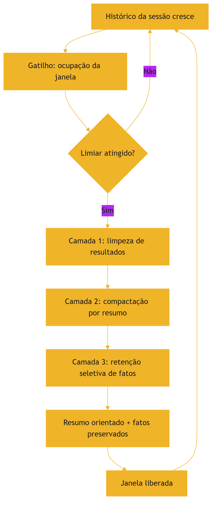

O diagrama mostra o ciclo: o histórico cresce, o gatilho dispara, as três camadas agem e a janela é liberada [7].

### 3.3 O Antes e o Depois na Prática

**Antes**: o agente acumula o histórico integral e as saídas brutas de todas as ferramentas — a janela enche e o desempenho degrada [2][7]. **Depois**: o sistema limpa resultados obsoletos, compacta o histórico em resumo orientado e promove os fatos críticos [7]. A mesma sessão, com o mesmo conhecimento, continua produtiva por muito mais tempo [7].

## 4. Técnica

### 4.1 O Compactador por Resumo

O primeiro instrumento implementa a compactação por resumo, preservando decisões e fatos [7]. O código abaixo é uma versão didática — em produção, o resumo é gerado pelo modelo [7]:

```python
def compactar_historico(turnos: list, fatos_criticos: list) -> dict:
    """Compacta o histórico em um resumo orientado.

    Em produção, o resumo é gerado por uma chamada ao modelo;
    aqui, uma heurística extrai os elementos que o resumo deve preservar.
    """
    decisoes = []
    intencoes = []
    for turno in turnos:
        texto = turno.lower()
        if "decidimos" in texto or "vamos usar" in texto or "escolhemos" in texto:
            decisoes.append(turno[:120])
        if "quero" in texto or "preciso" in texto or "objetivo" in texto:
            intencoes.append(turno[:120])
    resumo = {
        "decisoes": decisoes[:5],
        "intencoes": intencoes[:5],
        "fatos_criticos": fatos_criticos,
        "tokens_turnos": sum(len(t.split()) for t in turnos),
        "tokens_resumo": sum(len(t.split()) for t in decisoes[:5] + intencoes[:5]),
    }
    return resumo


if __name__ == "__main__":
    turnos = [
        "Vamos usar a arquitetura de subagentes para o módulo de análise.",
        "Quero que o relatório saia em formato JSON com métricas.",
        "Decidimos que o acesso de escrita fica restrito a admins.",
        "Preciso comparar os dados de 2024 e 2025.",
    ]
    resultado = compactar_historico(turnos, ["Orçamento: R$ 2,4 milhões"])
    print(resultado)
```

O compactador demonstra o princípio: o resumo preserva decisões, intenções e fatos — não o texto bruto [7].

### 4.2 O Limpador de Resultados de Ferramentas

O segundo instrumento implementa a limpeza de resultados de ferramentas [7]. O código abaixo rastreia o uso de cada resultado e remove os obsoletos da janela [7]:

```python
class GerenciadorResultados:
    """Rastreia e limpa resultados de ferramentas após o uso."""

    def __init__(self):
        self.resultados = {}  # id -> {"conteudo": str, "usado": bool}

    def registrar(self, id_resultado: str, conteudo: str) -> None:
        self.resultados[id_resultado] = {"conteudo": conteudo, "usado": False}

    def marcar_usado(self, id_resultado: str) -> None:
        if id_resultado in self.resultados:
            self.resultados[id_resultado]["usado"] = True

    def limpar_usados(self) -> list:
        """Remove resultados usados; retorna os ids removidos."""
        removidos = [i for i, r in self.resultados.items() if r["usado"]]
        for i in removidos:
            del self.resultados[i]
        return removidos

    def janela_atual(self) -> dict:
        return {i: r["conteudo"][:60] for i, r in self.resultados.items()}


if __name__ == "__main__":
    g = GerenciadorResultados()
    g.registrar("log_build", "LOG_BIG: 200 linhas de compilação...")
    g.registrar("arquivo_leitura", "def main(): pass")
    g.marcar_usado("log_build")
    print("Removidos:", g.limpar_usados())
    print("Janela atual:", g.janela_atual())
```

O gerenciador materializa o tool result clearing: o resultado usado sai da janela; o não usado permanece [7].

### 4.3 O Orquestrador de Gatilhos

O terceiro instrumento implementa os gatilhos de compressão baseados no orçamento [7][8]. O código abaixo monitora a ocupação e dispara a política de compressão no limiar [7][8]:

```python
class OrquestradorCompressao:
    """Dispara a compressão quando a janela atinge o limiar."""

    def __init__(self, janela: int, limiar_pct: float = 0.7):
        self.janela = janela
        self.limiar = int(janela * limiar_pct)
        self.ocupado = 0

    def adicionar(self, tokens: int) -> str:
        self.ocupado += tokens
        if self.ocupado >= self.limiar:
            return self.comprimir()
        return "ok"

    def comprimir(self) -> str:
        # Em produção: limpar resultados usados + resumir histórico.
        liberado = int(self.ocupado * 0.5)
        self.ocupado -= liberado
        return f"comprimido: liberados {liberado} tokens"

    def status(self) -> dict:
        return {
            "ocupado": self.ocupado,
            "limiar": self.limiar,
            "proporcao": round(self.ocupado / self.janela, 2),
        }


if __name__ == "__main__":
    o = OrquestradorCompressao(janela=20_000)
    o.adicionar(6_000)
    print(o.adicionar(9_000))  # cruza o limiar de 70%
    print(o.status())
```

O orquestrador materializa o gatilho: a compressão não é manual — é uma política automática do sistema [7][8].

## 5. Aplica

### 5.1 Onde Isso Vive no Mundo Real

A compressão está em todo sistema de conversa longa [7][15]. Chatbots de suporte que mantêm sessões de horas compactam o histórico entre assuntos [7]. Agentes de programação limpam os resultados de cada compilação após o uso [7]. Assistentes de análise compactam os dados intermediários ao mudar de subtarefa [7]. O LangChain documenta o gerenciamento de estado como parte da orquestração [15]. Em cada caso, a compressão é o que mantém a sessão viva [7].

### 5.2 O Erro Comum do Iniciante

O erro mais comum é não comprimir: o histórico integral e as saídas brutas acumulam até a janela estourar [2][7]. O segundo erro é comprimir sem orientação: o resumo genérico perde as decisões críticas [7]. O terceiro é comprimir tarde demais: quando a janela está 100% cheia, a compressão de emergência é destrutiva [7]. Os três erros têm o mesmo remédio: política de compressão definida, orientada e com gatilhos automáticos [7][8].

### 5.3 O Padrão Profissional em 2026

O padrão profissional integra as três camadas [7]. A limpeza de resultados roda após cada uso de ferramenta [7]. A compactação dispara no limiar de ocupação [7][8]. A retenção seletiva protege os fatos críticos [7]. O resumo é orientado à tarefa [7]. A política de perda é definida por tipo de tarefa [7]. O resultado é uma sessão que dura o que precisar durar, sem degradar [7].

### 5.4 Exercício de Fixação

Desenhe a política de compressão do seu agente: os gatilhos, as camadas, o que o resumo preserva e a política de perda por tarefa [7][8]. Implemente o orquestrador com o limiar da sua janela [7][8]. Teste uma sessão longa e meça a ocupação antes e depois da política [7].

### 5.5 A Compactação por Níveis: Do Resumo ao Fatos-Chave

A compactação profissional opera em níveis — cada nível preserva mais ou menos detalhe, e o sistema escolhe o nível pela tarefa [7][1]. O primeiro nível é a **limpeza**: remoção de resultados de ferramentas obsoletos e ruído — a operação mais barata e a primeira a rodar [7]. O segundo nível é o **resumo por turno**: cada turno antigo é reduzido a uma linha de essência [7]. O terceiro nível é o **resumo da sessão**: o conjunto de turnos vira um parágrafo orientado a decisões [7]. O quarto nível é a **extração de fatos**: os fatos críticos são promovidos a uma seção de fatos da sessão, protegida da compactação [7].

A escolha do nível é uma decisão de fidelidade versus espaço [7][1]. Tarefas que exigem detalhe — auditoria, contratos — usam níveis mais leves [7]. Tarefas de conversa usam níveis profundos [7]. O sistema maduro aplica níveis diferentes a blocos diferentes: o histórico de ferramentas é limpo no primeiro nível; a conversa é resumida no segundo; os fatos são promovidos no quarto [7]. A compactação em níveis é a materialização da disciplina de perda aceita (seção 2.7) [7].

A implementação em código segue a arquitetura de camadas [7][15]. Cada nível é uma função testável; o orquestrador (seção 4.3) decide o nível pelos gatilhos [7]. O LangChain documenta a composição de estados de conversa em camadas [15]. O engenheiro que trata a compactação como uma única operação perde o controle fino; o que a trata como sistema de níveis gerencia a fidelidade com precisão [7][1].

### 5.6 O Trade-off entre Fidelidade e Espaço na Prática

A compactação envolve um trade-off contínuo: cada token economizado é um detalhe potencialmente perdido [7][1]. O trade-off não é resolvido de uma vez — é gerido a cada sessão [7]. A primeira ferramenta de gestão é a **classificação de fidelidade por tarefa**: cada tipo de tarefa declara quanta fidelidade do histórico exige [7][1]. O suporte ao cliente pode compactar agressivamente; a revisão jurídica, não [7].

A segunda ferramenta é a **medição do impacto**: quando a compactação remove detalhes, o sistema mede o efeito na qualidade das respostas [1][12]. A medição usa o conjunto de avaliação (Capítulo 10): as respostas pós-compactação são comparadas com as pré-compactação [1][12]. Se a qualidade não cai, a compactação é segura; se cai, o nível é profundo demais [1][12].

A terceira ferramenta é a **compensação por recuperação**: detalhes perdidos na compactação podem ser recuperados de fontes externas quando necessários [7][3]. O resumo preserva o índice do que foi discutido; a recuperação (Capítulo 9) busca o detalhe se o usuário perguntar [3][7]. A combinação compactação + recuperação é o padrão moderno: o resumo mantém o contexto enxuto, e o detalhe permanece acessível [3][7].

### 5.7 A Limpeza de Ferramentas em Diferentes Arquiteturas

A limpeza de resultados de ferramentas (tool result clearing) varia com a arquitetura do agente [7][6]. Na arquitetura de **agente único**, a limpeza é direta: o resultado de cada chamada é marcado como usado e removido [7]. Na arquitetura de **agente com ferramentas encadeadas**, a limpeza precisa preservar os resultados que alimentam as próximas etapas — o resultado intermediário não é descartado antes do fim da cadeia [6][7]. Na arquitetura **multi-agente** (Capítulo 7), a limpeza ocorre dentro de cada janela de subagente — e o resumo destilado substitui os resultados brutos na fronteira [1][7].

A regra geral da limpeza é o **ciclo de vida do resultado**: cada resultado de ferramenta nasce, é usado e morre [7][6]. O sistema conhece o ciclo: o resultado de uma busca alimenta a decisão atual e morre; o resultado de uma compilação alimenta a correção e morre; o resultado de uma API de dados alimenta a análise e morre [7][6]. A limpeza executa a morte no momento certo [7].

O design da limpeza também protege contra o acúmulo silencioso [7][13]. Sem limpeza, cada ferramenta adiciona tokens permanentes à janela — e o agente que chama dez ferramentas por tarefa acumula um palheiro em horas [7][2]. A limpeza é a prevenção do context rot específica da arquitetura de ferramentas [7][2]. O engenheiro que integra uma nova ferramenta define, no mesmo momento, o ciclo de vida dos seus resultados [7][6].

### 5.8 O Gatilho de Compactação por Estrutura de Tarefa

Além do gatilho por orçamento (seção 2.5), há o gatilho por estrutura de tarefa — a compactação acontece nas fronteiras naturais do trabalho [7][1]. O primeiro gatilho estrutural é o **fim da subtarefa**: quando o agente conclui uma subtarefa, o contexto da subtarefa é compactado antes de iniciar a próxima [7][1]. O segundo é a **mudança de contexto do usuário**: quando o usuário troca de assunto, o assunto anterior é compactado [7]. O terceiro é o **início de nova sessão**: a sessão anterior é resumida para a memória (Capítulo 10) [7].

O gatilho estrutural tem uma vantagem sobre o de orçamento: acontece em um momento natural, sem interromper o fluxo [7][1]. A compactação por orçamento é reativa (a janela encheu); a por estrutura é proativa (a unidade de trabalho terminou) [7][1]. O sistema maduro combina os dois: o estrutural mantém o contexto organizado por unidade de trabalho; o de orçamento protege contra o estouro [7][1][8].

O desenho dos gatilhos estruturais é específico de cada domínio [7][1]. O engenheiro identifica as unidades naturais do seu fluxo — tarefa, subtarefa, assunto, sessão — e define a compactação em cada fronteira [7]. O registro do gatilho (qual fronteira, qual nível, qual resultado) alimenta a avaliação do Capítulo 10 [7][12]. A compactação por estrutura é a prática que transforma a compressão de mecanismo de emergência em disciplina de organização [7][1].

### 5.9 A Compactação e o Custo Operacional

A compactação tem um caso de negócio claro — e o engenheiro o conhece para justificar a disciplina [7][13]. O primeiro componente do caso é a **economia de tokens**: cada token de histórico compactado é um token economizado em todas as chamadas seguintes [13][7]. O segundo é a **economia de retrabalho**: o histórico compactado preserva o essencial, evitando que o modelo erre por falta de contexto e precise re-executar [1][7]. O terceiro é a **economia de latência**: contextos menores processam mais rápido [13][7].

O quarto componente é o **custo da compactação em si**: a chamada de resumo consome tokens [7][13]. O trade-off é explícito: compactar custa um pouco agora para economizar muito depois [7][13]. O cálculo é a comparação entre o custo do resumo e a economia das chamadas seguintes [13][7]. O engenheiro que mede (Capítulo 10) tem os números exatos [13].

O quinto componente é o **custo de oportunidade**: o espaço liberado pela compactação permite que o sistema processe mais trabalho na mesma janela [7][1]. A compactação, longe de ser burocracia, é uma das operações de maior retorno da disciplina — cada token economizado é reutilizado [7][13]. O caso de negócio da compactação é o mesmo da curadoria: a disciplina paga a si mesma [7][13].

### 5.10 A Compactação e o Método de Revisão Autônoma

A série anuncia o método de revisão autônoma entre harness — e a compactação é uma das fundações desse método [1][7]. Para que um sistema reviso o trabalho de outro, o contexto precisa preservar o histórico das decisões — e a compactação é o que transforma o histórico em material de revisão [7][1]. O resumo orientado (seção 2.3) preserva as decisões e as intenções — exatamente o que um revisor precisa para avaliar [7][1].

A conexão tem três implicações [1][7]. A primeira: o resumo da sessão deve incluir os critérios de aceite e as decisões — o revisor compara o resultado com a intenção [1][7]. A segunda: a compactação não descarta as evidências sem registro — o resumo aponta onde as evidências estão (recuperáveis no Capítulo 9) [7][3]. A terceira: a revisão é feita sobre o resumo, e a re-execução usa o resumo como contexto inicial [7][1].

A compactação é, portanto, a memória operacional que a revisão autônoma consome [1][7]. O engenheiro que projeta para a revisão desenha a compactação com a revisão em mente: preservar o que um revisor precisaria saber [7][1]. A Parte III da série desenvolve o método; este capítulo estabelece a matéria-prima [1][7].

### 5.11 O Estudo de Caso da Sessão que Sobreviveu

O estudo de caso consolida o capítulo [7][1]. O cenário: um assistente de suporte técnico com sessões longas — usuários que ficam horas em uma conversa [7]. O protótipo sem compactação degradava: o histórico crescia, o contexto estourava e o assistente esquecia o início [2][7]. A equipe implantou a política de compressão em três camadas [7].

O novo fluxo: cada resultado de ferramenta é limpo após o uso (camada 1); cada troca de assunto compacta o assunto anterior em resumo (camada 2, gatilho estrutural); os fatos críticos do usuário — preferências, pendências — são promovidos à seção de fatos (camada 3) [7]. O gatilho de orçamento protege contra picos [7][8].

O resultado: sessões de horas continuam produtivas, o custo cai e o usuário não percebe a compressão [7][1]. O caso demonstra o tema do capítulo: esquecer bem é uma competência — e a competência se desenha com camadas, gatilhos e perda aceita [7]. A sessão que sobrevive é a prova da disciplina [7].

### 5.12 O Compress e a Fidelidade em Diferentes Tarefas

A política de perda (seção 2.7) ganha forma concreta quando o engenheiro a classifica por tarefa [7][1]. O primeiro grupo é o das tarefas **fidelidade-crítica**: contratos, auditorias, relatórios regulatórios [7]. Para elas, a compactação é conservadora — níveis leves, fatos sempre preservados, perda mínima [7]. O segundo é o das tarefas **fidelidade-moderada**: suporte, análises de rotina [7]. Para elas, a compactação é intermediária — o essencial preservado, o detalhe descartável perdido [7]. O terceiro é o das tarefas **fidelidade-flexível**: brainstorming, redação criativa [7]. Para elas, a compactação pode ser profunda [7].

A classificação por tarefa é registrada e versionada — parte da configuração do sistema (Capítulo 5, seção 5.3) [1][7]. A classificação também orienta a avaliação (Capítulo 10): o conjunto de avaliação de cada tarefa mede se a compactação degradou a qualidade [7][12]. O engenheiro que classifica a fidelidade por tarefa evita duas falhas opostas: compactar demais onde a fidelidade é crítica e compactar de menos onde o espaço é precioso [7][1].

### 5.13 O Estudo de Caso do Log que Poluiu

O estudo de caso mostra a limpeza em produção [7][6]. O cenário: um agente de diagnóstico que chama várias ferramentas por tarefa — logs, testes, consultas [7][6]. O sintoma: o agente degradava no meio da sessão; as respostas ficavam lentas e confusas [2][7]. O contexto estava cheio de saídas de ferramentas acumuladas [7].

O diagnóstico (Capítulo 8): a limpeza não estava configurada — cada resultado de ferramenta permanecia na janela [7][6]. O teste: a inspeção da janela revelou que as saídas antigas ocupavam metade do espaço [7]. O tratamento: o ciclo de vida dos resultados (seção 5.7) foi implementado — cada resultado é marcado usado e limpo após o consumo [7][6].

O resultado: a janela liberou espaço; o agente voltou a responder com precisão [7]. O caso demonstra o tema do capítulo: a limpeza de ferramentas é a prevenção mais barata do context rot — e a mais negligenciada [7][2]. O engenheiro que a configura no dia da integração evita semanas de degradação [7][6].

### 5.14 A Lista de Verificação do Compress

A lista de verificação consolida o capítulo [7][1]. O primeiro item: o ciclo de vida dos resultados de ferramentas é definido? [7][6]. O segundo: a compactação preserva decisões, intenções e fatos? [7]. O terceiro: os gatilhos de orçamento estão configurados? [7][8]. O quarto: os gatilhos estruturais (fim de subtarefa) existem? [7][1].

O quinto item: a política de perda é classificada por tarefa? [7][1]. O sexto: a perda é medida contra a qualidade (Capítulo 10)? [7][12]. O sétimo: o resumo compactado é posicionado na zona de alta atenção (Capítulo 4)? [7][5]. O oitavo: os fatos críticos são protegidos da compactação? [7].

A lista é o resumo operacional [7][1]. O engenheiro que a percorre mantém a sessão longa saudável [7]. O Compress, junto com o Isolate, é o que distingue o sistema que sobrevive ao tempo do que colapsa [7][1].

### 5.15 O Compress e a Experiência de Sessões Longas

A compressão tem um impacto direto na experiência de sessões longas [7][1]. O primeiro efeito é a **continuidade**: o usuário não percebe a troca de assunto ou a passagem do tempo — o assistente lembra o essencial [7]. O segundo é a **velocidade**: contextos compactados processam mais rápido (Capítulo 2) — o assistente responde sem a lentidão do contexto inchado [7][13]. O terceiro é a **confiança**: o assistente que lembra o essencial inspira confiança; o que esquece, não [7][1].

O desenho da compressão é, portanto, também design de experiência [7][1]. O engenheiro que compacta bem entrega a sessão longa sem custo perceptível [7]. O que não compacta entrega a sessão que degrada — e o usuário atribui a falha ao produto, não ao contexto [7][2]. A compressão invisível é a melhor: o usuário percebe o resultado (continuidade), não o mecanismo [7][1].

### 5.16 O Compress e a Relação com a Memória e a Recuperação

A compressão é a ponte entre o contexto e a memória (Capítulo 10) e entre o contexto e a recuperação (Capítulo 9) [7][1][3]. Com a memória: o resumo compactado é o material que a memória de longo prazo recebe [7][1]. A qualidade do resumo decide a qualidade da memória [7]. Com a recuperação: o resumo aponta onde os detalhes estão — e a recuperação (Capítulo 9) os traz de volta quando necessário [3][7].

A interação é o ciclo completo da persistência [7][3][1]: o contexto é compactado em resumo; o resumo alimenta a memória; a memória é recuperada quando o detalhe importa [7][3]. O engenheiro que projeta o ciclo garante que nada essencial se perde — o detalhe permanece acessível, o contexto permanece enxuto [7][3].

A compactação, a memória e a recuperação formam o tripé da persistência [7][3]. A Parte III da série (harness) governa o tripé; este capítulo estabelece a primeira perna [7][1].

### 5.17 O Fechamento do Capítulo

O capítulo da compressão se encerra com a consolidação [7][1]. O histórico cresce sem limite — e a gestão do crescimento é a disciplina [7]. A compactação preserva o essencial; a limpeza remove o obsoleto; os gatilhos automatizam a decisão [7][8]. A perda é aceita deliberadamente, classificada por tarefa [7]. O custo da compactação é pequeno comparado ao custo do contexto inchado [7][13].

O engenheiro que domina o Compress constrói sessões que duram [7][1]. E, com o Write, o Select e o Compress dominados, resta a quarta operação — o Isolate — para completar o framework [1]. A ordem da construção é a ordem da pilha [1].

### 5.18 A Compactação e o Custo do Esquecimento

A perda da compactação tem um custo que o engenheiro dimensiona: o custo do esquecimento [7][1]. Quando o resumo não preserva um detalhe que depois se mostra necessário, o sistema precisa recuperá-lo — ou arcar com a resposta incompleta [7][3]. O custo do esquecimento tem três componentes [7][1]. O primeiro é o **custo da recuperação**: buscar o detalhe perdido na fonte (Capítulo 9) [3][7]. O segundo é o **custo do retrabalho**: responder de novo com o detalhe [7][13]. O terceiro é o **custo reputacional**: a resposta incompleta que o usuário percebe [7][1].

A gestão do custo do esquecimento é o equilíbrio da seção 5.6 [7][1]. Compactar demais aumenta o custo do esquecimento; compactar de menos aumenta o custo da janela [7][1][8]. O ponto de equilíbrio é encontrado pela medição: o conjunto de avaliação revela quantos detalhes perdidos viram falhas [7][12]. O engenheiro que mede o custo do esquecimento calibra a compactação com dados — não com medo [7][12].

### 5.19 O Fechamento do Capítulo

O capítulo da compressão se encerra com a consolidação final [7][1]. O histórico cresce; a compactação gerencia; a limpeza remove; os gatilhos automatizam; a perda é aceita com método [7][8]. O custo do esquecimento é o limite da disciplina — e a medição é o seu controle [7][12].

O engenheiro que domina o Compress constrói sessões longas saudáveis — e conhece o preço de cada esquecimento [7][1]. A compactação, com o Write e o Select, forma o núcleo operacional da curadoria [1][6][7]. O Isolate, no capítulo seguinte, completa o framework [1].

### 5.20 A Compactação e a Avaliação Contínua

A compactação precisa de avaliação contínua — o engenheiro verifica que a perda aceita não virou perda inaceitável [7][12]. O primeiro instrumento é o **conjunto de avaliação pós-compactação**: os casos críticos executados após a compactação — a qualidade é comparada com a pré-compactação [7][12]. O segundo é o **monitor de esquecimento**: os casos em que a compactação removeu informação necessária são registrados e analisados [7][12]. O terceiro é o **ajuste da política**: a distribuição dos esquecimentos orienta o ajuste dos níveis e gatilhos [7][12].

A avaliação contínua fecha o ciclo da compactação [7][12]: a política é definida, aplicada, medida e ajustada [7]. A compactação deixa de ser uma configuração fixa e vira um sistema que aprende [7][12]. O Capítulo 10 integra a avaliação da compactação ao conjunto de avaliação geral do sistema [7][12].

O engenheiro que avalia a compactação evita a armadilha da perda silenciosa [7][12]. A compactação que ninguém mede degrada devagar — e a degradação acumulada é descoberta tarde [7][12]. A avaliação contínua é o que mantém o esquecimento deliberado [7][12].

### 5.21 O Fechamento do Capítulo

O capítulo da compressão se encerra com a consolidação final [7][1]. O histórico cresce; a compactação gerencia; a limpeza remove; os gatilhos automatizam; a avaliação valida [7][8][12].

O engenheiro que domina o Compress constrói sessões longas saudáveis e mensuráveis [7][1]. O framework — Write, Select, Compress — está quase completo; falta o Isolate [1]. O próximo capítulo constrói o isolamento [1].

### 5.22 A Mensagem Final do Capítulo

O capítulo da compressão deixa a mensagem que sustenta as sessões longas [7][1]. O histórico cresce sem limite; a compactação gerencia; a limpeza remove; os gatilhos automatizam [7][8]. Esquecer bem é uma competência de engenharia — e a competência se desenha [7][1].

O engenheiro que domina o Compress constrói sessões que duram [7][1]. O framework — Write, Select, Compress — está quase completo; o próximo capítulo constrói o Isolate [1].

## 6. Conclusão

O Compress é a operação que ensina o agente a esquecer bem [7]. A compactação transforma o histórico em resumo orientado, preservando decisões, intenções e fatos [7]. A limpeza remove resultados de ferramentas obsoletos [7]. Os gatilhos automáticos protegem o orçamento da janela [7][8]. A perda é aceita deliberadamente, por tipo de tarefa [7]. As ferramentas deste capítulo compactam, limpam e orquestram [7][8]. O próximo capítulo completa o framework com a quarta operação: Isolate, o isolamento de contexto via subagentes [1].

## 7. Referências

[1] ANTHROPIC. Effective context engineering for AI agents. Anthropic Engineering Blog, set. 2025. Disponível em: https://www.anthropic.com/engineering/effective-context-engineering-for-ai-agents. Acesso em: 5 ago. 2026.
[2] HONG, Kelly; TROYNIKOV, Anton; HUBER, Jeff. Context Rot: How Increasing Input Tokens Impacts LLM Performance. Chroma Technical Report, jul. 2025. Disponível em: https://www.trychroma.com/research/context-rot. Acesso em: 5 ago. 2026.
[3] LEWIS, Patrick et al. Retrieval-Augmented Generation for Knowledge-Intensive NLP Tasks. In: Advances in Neural Information Processing Systems (NeurIPS), v. 33, p. 9459–9474, 2020. Disponível em: https://arxiv.org/abs/2005.11401. Acesso em: 5 ago. 2026.
[4] GAO, Yunfan et al. Retrieval-Augmented Generation for Large Language Models: A Survey. arXiv:2312.10997, mar. 2024. Disponível em: https://arxiv.org/abs/2312.10997. Acesso em: 5 ago. 2026.
[5] LIU, Nelson F. et al. Lost in the Middle: How Language Models Use Long Contexts. Transactions of the Association for Computational Linguistics (TACL), v. 12, p. 157–173, 2024. Disponível em: https://arxiv.org/abs/2307.03172. Acesso em: 5 ago. 2026.
[6] ANTHROPIC. Writing tools for AI agents — using AI agents. Anthropic Engineering Blog, set. 2025. Disponível em: https://www.anthropic.com/engineering/writing-tools-for-agents. Acesso em: 5 ago. 2026.
[7] ANTHROPIC. Context engineering: memory, compaction, and tool clearing. Claude Platform Cookbook, mar. 2026. Disponível em: https://platform.claude.com/cookbook/tool-use-context-engineering-context-engineering-tools. Acesso em: 5 ago. 2026.
[8] ZHAO, Wayne Xin et al. A Survey of Large Language Models. arXiv:2303.18223, 2023. Disponível em: https://arxiv.org/abs/2303.18223. Acesso em: 5 ago. 2026.
[9] CHROMA. Context Rot: Evaluation Toolkit. GitHub Repository, 2025. Disponível em: https://github.com/chroma-core/context-rot. Acesso em: 5 ago. 2026.
[10] LIU, Nelson F. Lost in the Middle: Replication Repository. GitHub Repository, 2023. Disponível em: https://github.com/nelson-liu/lost-in-the-middle. Acesso em: 5 ago. 2026.
[11] CHEN, Jiawei et al. LongRAG: Enhancing Retrieval-Augmented Generation with Long-context LLMs. arXiv:2406.15319, 2024. Disponível em: https://arxiv.org/abs/2406.15319. Acesso em: 5 ago. 2026.
[12] ASIA, Research Group et al. Retrieval-Augmented Generation Evaluation in the Era of Large Language Models: A Comprehensive Survey. ResearchGate / arXiv, abr. 2025. Disponível em: https://www.researchgate.net/publication/390991356. Acesso em: 5 ago. 2026.
[13] OPENAI. GPT-4 Technical Report & Developer Guides on Context Management. OpenAI Documentation, 2024–2025. Disponível em: https://openai.com/index/gpt-4-research/. Acesso em: 5 ago. 2026.
[14] GOOGLE CLOUD. What is Retrieval-Augmented Generation (RAG)?. Google Cloud Architecture Center, 2025. Disponível em: https://cloud.google.com/use-cases/retrieval-augmented-generation. Acesso em: 5 ago. 2026.
[15] LANGCHAIN. LangChain Agents & Context Management Documentation. LangChain Guides, 2025–2026. Disponível em: https://python.langchain.com/docs/concepts/agents/. Acesso em: 5 ago. 2026.
[16] WANG, Zhen et al. Agentic Retrieval-Augmented Generation: A Survey on Agentic RAG. arXiv:2408.12999, 2024. Disponível em: https://arxiv.org/abs/2408.12999. Acesso em: 5 ago. 2026.
[17] XIAO, Guangxuan et al. Efficient Streaming Language Models with Attention Sinks. arXiv:2309.17453, 2023. Disponível em: https://arxiv.org/abs/2309.17453. Acesso em: 5 ago. 2026.
[18] RODIN, Alex et al. Found in the Middle: Overcoming Long-Context Vulnerabilities in LLMs. arXiv:2403.04797, 2024. Disponível em: https://arxiv.org/abs/2403.04797. Acesso em: 5 ago. 2026.
[19] MEDIUM (Data Science Collective). Context Is the New Prompt: Why Context Engineering Is Shaping the Future of AI. Medium Article, 2025. Disponível em: https://medium.com/data-science-collective/context-is-the-new-prompt-why-context-engineering-is-shaping-the-future-of-ai-46eb062ed270. Acesso em: 5 ago. 2026.
[20] ZENML. Context Rot: Evaluating LLM Performance Degradation with Increasing Input Tokens. MLOps Database, 2025. Disponível em: https://www.zenml.io/llmops-database/context-rot-evaluating-llm-performance-degradation-with-increasing-input-tokens. Acesso em: 5 ago. 2026.

# Capítulo 7 — Isolate: subagentes e o isolamento de contexto

## 1. Introdução

O framework write/select/compress/isolate tem uma última operação — Isolate — que é também a mais arquitetural [1]. As três primeiras operações administram o contexto dentro de uma janela; o Isolate administra o contexto entre janelas [1]. A ideia central é o isolamento: tarefas diferentes recebem janelas de contexto diferentes, para que o ruído de uma não contamine o raciocínio da outra [1]. A operação é materializada pelos subagentes: agentes auxiliares com janelas próprias, que executam subtarefas e devolvem apenas resumos destilados ao agente principal [1]. Este capítulo ensina por que o isolamento é necessário, como desenhar subagentes e como proteger o contexto da contaminação cruzada [1][15].

## 2. Explica

### 2.1 O Problema da Contaminação Cruzada

A contaminação cruzada é o vazamento de contexto entre tarefas [1]. Quando um agente processa múltiplas tarefas em uma única janela, o contexto de uma pode interferir na outra [1]. A interferência tem várias formas: informação de uma tarefa desviando a atenção da outra (Capítulo 3), distratores de uma contaminação a recuperação da outra [2][1], e a degradação posicional (Capítulo 4) piorando com a mistura [5]. O resultado é o comportamento errático: o agente "esquece" a tarefa atual porque o contexto está poluído pela anterior [1]. O isolamento é a defesa estrutural contra esse vazamento [1].

### 2.2 O Que é um Subagente

Um subagente é um agente auxiliar com contexto próprio [1][15]. Ele recebe uma subtarefa bem definida, uma janela de contexto dedicada e um orçamento de execução [1]. Executa a subtarefa de forma relativamente independente e devolve um resultado compacto ao agente principal [1]. O LangChain documenta a orquestração de agentes como prática central: o agente principal coordena; os subagentes executam [15]. A separação de responsabilidades é o coração do padrão: o coordenador planeja; o subagente explora em detalhe [1][15].

### 2.3 A Janela Dedicada do Subagente

A janela dedicada é o mecanismo do isolamento [1]. O subagente opera em sua própria janela, com seu próprio contexto — sem compartilhar a janela do agente principal [1]. O benefício é duplo [1]. Primeiro, a proteção: o ruído da subtarefa não contamina o contexto principal [1]. Segundo, a profundidade: o subagente pode explorar detalhes que não caberiam na janela principal [1]. A janela dedicada transforma a limitação da janela principal em arquitetura: cada subtarefa tem seu espaço [1].

### 2.4 O Resumo Destilado como Interface

A interface entre o subagente e o agente principal é o resumo destilado [1]. O subagente não devolve seu contexto — devolve o resultado: uma síntese compacta de 1.000 a 2.000 tokens [1]. O agente principal recebe o resumo e o integra ao seu contexto enxuto [1]. A prática segue a disciplina do Compress (Capítulo 6): o que atravessa a fronteira é orientado à decisão, não bruto [1][7]. O resumo destilado é o que mantém a janela principal enxuta mesmo com subtarefas pesadas [1].

### 2.5 Quando Usar Subagentes

O subagente não é para tudo — é para tarefas que justificam a arquitetura [1][4]. A decisão de usar segue critérios claros [1]. Primeiro, o volume: tarefas que geram muito contexto (exploração de repositórios, leitura de documentos longos) [1]. Segundo, o isolamento: tarefas cujo ruído contaminaria o raciocínio principal [1]. Terceiro, a paralelização: tarefas independentes podem rodar em subagentes paralelos [1][4]. Quarto, o custo: a orquestração tem overhead — comunicação, resumos, coordenação [1]. A decisão é um trade-off de engenharia, não um reflexo [1].

### 2.6 O Agente Principal como Diretor

A metáfora do diretor de orquestra captura a arquitetura [1]. O maestro (agente principal) tem a partitura completa (contexto enxuto com o plano geral); cada músico (subagente) tem a sua parte (contexto dedicado da subtarefa) [1]. O maestro não toca todos os instrumentos — coordena [1]. A separação é o que permite complexidade sem caos: cada parte é executada com contexto limpo, e o todo é coordenado pelo maestro [1]. O padrão aparece em toda arquitetura multi-agente madura [1][15].

### 2.7 A Paralelização e o Isolamento

A paralelização é um dos maiores benefícios do Isolate [1][4]. Tarefas independentes rodam em subagentes paralelos, cada um na sua janela [1]. A aceleração é real: quatro subtarefas independentes podem rodar ao mesmo tempo [1]. O isolamento é o que torna a paralelização segura: sem ele, os subagentes competiriam pelo mesmo contexto e se contaminariam [1]. A combinação isolamento + paralelização é a base dos agentes de alto rendimento [1][4].

### 2.8 O Custo da Orquestração

A orquestração tem custo — e o engenheiro o considera [1][13]. Cada subagente é uma chamada com custo próprio [13]. O resumo destilado é uma chamada extra [1]. A coordenação consome tempo de latência [1]. O custo de orquestração precisa ser menor que o benefício do isolamento [1][13]. Para tarefas simples, o subagente é desperdício; para tarefas complexas, é a diferença entre funcionar e degradar [1][13]. A decisão de orquestrar é econômica, não estética [1].

### 2.9 O Isolamento Além dos Subagentes

O Isolate não se limita a subagentes — é um princípio geral de arquitetura de contexto [1]. O princípio: contextos de escopos diferentes não se misturam [1]. Aplica-se à separação entre instruções e dados (Livro 2), entre tarefas (subagentes) e entre usuários em sistemas multi-tenant [1]. O princípio unificado é o mesmo: o que pertence a um escopo não contamina o outro [1]. O Capítulo 8 usa o princípio no diagnóstico: falha de contaminação é uma classe de erro reconhecível [1][5].

### 2.10 A Síntese: Isolamento Como Governança de Contexto

O Isolate é a operação que transforma a engenharia de contexto em arquitetura de sistemas [1][15]. As três primeiras operações cuidam do contexto dentro da janela; o Isolate cuida da relação entre janelas [1]. É a operação mais cara (orquestração) e a mais estrutural (arquitetura) [1][13]. Juntas, as quatro operações formam o framework completo da curadoria: escrever bem, selecionar o mínimo, comprimir o passado e isolar os escopos [1][6][7]. Este capítulo fecha o núcleo operacional do livro [1].

## 3. Ilustra

### 3.1 A Analogia da Orquestra

A orquestra é a analogia mais rica [1]. O maestro tem a partitura geral; cada músico tem a sua parte [1]. Se todos tocassem com a partitura inteira na frente, o ruído seria ensurdecedor [1]. A separação de partes é o que permite a sinfonia [1]. O agente principal é o maestro; os subagentes são os naipes; o resumo destilado é a leitura de retorno do músico ao maestro [1].

### 3.2 O Diagrama da Arquitetura de Subagentes

O diagrama abaixo representa a arquitetura de isolamento com subagentes [1][15].

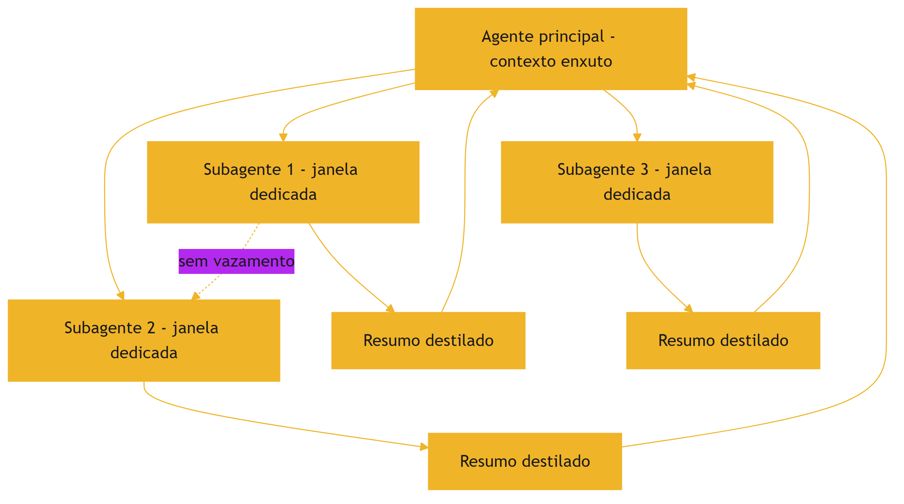

O diagrama mostra o padrão: o agente principal coordena, os subagentes executam em janelas isoladas e devolvem resumos [1][15].

### 3.3 O Antes e o Depois na Prática

**Antes (sem isolamento)**: um único agente processa o repositório inteiro na mesma janela — o contexto mistura arquivos, tarefas e ruído, e o desempenho degrada [1][2]. **Depois (com isolamento)**: o agente principal delega a exploração de cada módulo a subagentes, que devolvem resumos; a janela principal permanece enxuta [1]. A mesma missão, com o mesmo conhecimento, produz resultados coerentes [1].

## 4. Técnica

### 4.1 O Roteador de Subtarefas

O primeiro instrumento implementa a decisão de delegar: quais subtarefas vão para subagentes [1][4]. O código abaixo classifica subtarefas por critérios de isolamento [1][4]:

```python
def decidir_delegacao(subtarefas: list, limiar_volume: int = 1500) -> list:
    """Decide quais subtarefas delegar a subagentes.

    Critérios: volume de contexto esperado e independência da tarefa.
    """
    delegadas = []
    diretas = []
    for tarefa in subtarefas:
        volume = tarefa.get("volume_estimado", 0)
        independente = tarefa.get("independente", False)
        if volume > limiar_volume and independente:
            delegadas.append(tarefa)
        else:
            diretas.append(tarefa)
    return {"delegadas": [t["nome"] for t in delegadas],
            "diretas": [t["nome"] for t in diretas]}


if __name__ == "__main__":
    subtarefas = [
        {"nome": "explorar_repo", "volume_estimado": 5000, "independente": True},
        {"nome": "resumir_doc", "volume_estimado": 800, "independente": True},
        {"nome": "validar_json", "volume_estimado": 300, "independente": False},
    ]
    print(decidir_delegacao(subtarefas))
```

O roteador materializa o critério de delegação: volume e independência decidem o isolamento [1][4].

### 4.2 O Orquestrador com Resumos Destilados

O segundo instrumento implementa a orquestração: dispara subagentes e coleta resumos destilados [1]. O código abaixo é a versão didática do ciclo [1]:

```python
class Orquestrador:
    """Coordena subagentes e integra resumos destilados."""

    def __init__(self, contexto_principal: str):
        self.contexto_principal = contexto_principal
        self.resumos = []

    def executar_subagente(self, nome: str, trabalho: str) -> str:
        """Executa um subagente (simulado) e devolve o resumo destilado."""
        # Em produção: chamada ao modelo com janela dedicada.
        resumo = f"[{nome}] {trabalho[:80]}..."
        self.resumos.append(resumo)
        return resumo

    def integrar(self) -> str:
        """Integra os resumos ao contexto principal."""
        if not self.resumos:
            return self.contexto_principal
        return self.contexto_principal + "\n\nResultados das subtarefas:\n" + \
            "\n".join(self.resumos)


if __name__ == "__main__":
    orq = Orquestrador("Você é o arquiteto. Planeje o módulo de pagamentos.")
    orq.executar_subagente("explorador", "Analisou o código legado de pagamentos")
    orq.executar_subagente("auditor", "Auditou as políticas de compliance")
    print(orq.integrar())
```

O orquestrador materializa a interface: o agente principal recebe apenas os resumos, não o contexto dos subagentes [1].

### 4.3 O Protetor de Isolamento

O terceiro instrumento audita o isolamento: detecta vazamentos de contexto entre escopos [1][5]. O código abaixo rastreia os termos de cada escopo e alerta quando um escopo contamina o outro [1][5]:

```python
def auditar_isolamento(escopos: dict) -> list:
    """Audita vazamento de termos entre escopos de contexto."""
    alertas = []
    nomes = list(escopos.keys())
    for i in range(len(nomes)):
        for j in range(i + 1, len(nomes)):
            termos_a = set(escopos[nomes[i]].lower().split())
            termos_b = set(escopos[nomes[j]].lower().split())
            vazamento = termos_a & termos_b
            if vazamento:
                alertas.append({
                    "entre": f"{nomes[i]} <-> {nomes[j]}",
                    "termos": list(vazamento)[:5],
                })
    return alertas


if __name__ == "__main__":
    escopos = {
        "tarefa_pagamentos": "aprovar pagamento acima de 10 mil reais",
        "tarefa_relatorio": "gerar relatório mensal de vendas",
        "tarefa_pagamentos_2": "revisar aprovação de pagamento atrasado",
    }
    for alerta in auditar_isolamento(escopos):
        print(alerta)
```

O auditor detecta a contaminação: tarefas de pagamento compartilham termos, e o sistema decide se o compartilhamento é intencional ou vazamento [1][5].

## 5. Aplica

### 5.1 Onde Isso Vive no Mundo Real

O Isolate está em toda arquitetura multi-agente madura [1][15]. Agentes de programação delegam a exploração de módulos a subagentes [1]. Assistentes de pesquisa delegam a leitura de documentos a subagentes e integram resumos [1]. Sistemas de análise delegam subtarefas paralelas [1][4]. O LangChain documenta o padrão como central na orquestração [15]. Em cada caso, o isolamento é o que mantém o contexto principal limpo [1].

### 5.2 O Erro Comum do Iniciante

O erro mais comum é não isolar: o agente único com contexto gigante que degrada (Capítulos 3 e 4) [1][2]. O segundo erro é isolar sem interface: o subagente devolve o contexto bruto, anulando o benefício [1]. O terceiro é orquestrar demais: cada subtarefa trivial vira um subagente, e o custo de orquestração supera o benefício [1][13]. Os três erros têm o mesmo remédio: critérios de delegação, resumo destilado e medição de custo [1][13].

### 5.3 O Padrão Profissional em 2026

O padrão profissional integra o Isolate ao framework completo [1]. O agente principal tem contexto enxuto [1]. As subtarefas pesadas e independentes são delegadas [1][4]. Os subagentes devolvem resumos destilados [1]. O isolamento é auditado contra vazamento [1][5]. O custo de orquestração é medido contra o benefício [1][13]. O resultado é um sistema que escala em complexidade sem degradar em qualidade [1].

### 5.4 Exercício de Fixação

Analise o seu sistema: identifique as tarefas com contexto pesado e as independentes [1][4]. Desenhe a arquitetura de subagentes com resumos destilados [1]. Implemente o roteador de delegação e o auditor de isolamento [1][5]. Meça o custo de orquestração e compare com a melhoria de qualidade [1][13].

### 5.5 Os Padrões de Comunicação entre Agente e Subagentes

A arquitetura de subagentes depende de padrões de comunicação bem definidos [1][6]. O primeiro padrão é o **comando-estrutura**: o agente principal envia ao subagente uma especificação — objetivo, escopo, restrições, formato de retorno [1][6]. A especificação é a interface do serviço [6]. O segundo padrão é o **relatório-resumo**: o subagente devolve um relatório compacto, orientado às decisões que o agente principal precisa tomar [1]. O relatório segue o formato acordado — sem surpresas de formato [1][6].

O terceiro padrão é a **delegação com verificação**: o agente principal verifica o retorno do subagente antes de integrar [1][12]. A verificação usa os critérios da especificação: o relatório atende ao formato? Contém os campos exigidos? [1][12]. O quarto padrão é a **re-delegação controlada**: quando o retorno não satisfaz, o agente principal re-delega com feedback — mas com limite de tentativas [1][6]. O loop de re-delegação é a aplicação do Capítulo 8 à orquestração [1].

O quinto padrão é o **isolamento de falha**: a falha de um subagente não derruba a tarefa inteira [1]. O agente principal trata a falha do subagente como um evento com tratamento definido — nova tentativa, alternativa ou escalada [1]. Os padrões de comunicação são o que torna a arquitetura de subagentes previsível: com eles, a orquestração é engenharia; sem eles, é improviso [1][6].

### 5.6 O Orçamento de Execução dos Subagentes

Cada subagente precisa de um orçamento de execução — os limites dentro dos quais opera [1][13]. O orçamento tem três dimensões [1][13]. A primeira é o **orçamento de tokens**: quantos tokens o subagente pode consumir na sua janela [1][8]. A segunda é o **orçamento de chamadas**: quantas chamadas ao modelo o subagente pode fazer [1][13]. A terceira é o **orçamento de tempo**: quanto tempo a subtarefa pode levar [1][13].

O orçamento protege o sistema de duas formas [1][13]. Protege o custo: um subagente descontrolado pode consumir mais tokens que o benefício da subtarefa [13]. Protege a operação: um subagente em loop infinito trava o fluxo inteiro [1]. O orçamento é definido na especificação (padrão comando-estrutura) e monitorado pelo orquestrador [1][6].

O design do orçamento segue o princípio do mínimo suficiente (Capítulos 2 e 5) [1][8]. O subagente recebe o menor orçamento que resolve a subtarefa — nem mais (desperdício) nem menos (falha) [1][8]. A calibração é empírica: medir as subtarefas típicas e ajustar os orçamentos [1][13]. O Capítulo 10 integra os orçamentos ao custo por tarefa concluída [13].

### 5.7 O Monitoramento e a Observabilidade da Orquestração

A orquestração de subagentes precisa de observabilidade — o engenheiro vê o que cada agente fez [1][15]. O primeiro instrumento é o **registro de eventos**: cada evento — delegação, execução, retorno, re-delegação, falha — é registrado com contexto [1][15]. O registro permite reconstruir o fluxo de qualquer tarefa [15]. O segundo é o **rastreamento de custo**: o custo de cada subagente e o custo total da orquestração [1][13]. O terceiro é a **métrica de qualidade por subagente**: a taxa de sucesso de cada subagente nas suas subtarefas [1][12].

O monitoramento alimenta o diagnóstico do Capítulo 8 [1]. Quando a tarefa falha, o engenheiro rastreia: qual subagente produziu o resumo errado? Qual especificação estava ambígua? Qual orçamento estourou? [1][15]. A observabilidade transforma a orquestração de caixa preta em arquitetura auditável [1][15].

O padrão profissional registra também os **padrões de retorno**: os resumos destilados são comparados com os critérios da especificação, e as divergências alimentam a melhoria do Write de subagentes (Capítulo 5) [1][6][12]. A observabilidade fecha o ciclo: o Isolate não é apenas uma arquitetura — é um sistema que se aprende e se aperfeiçoa [1][15].

### 5.8 O Isolamento em Sistemas Multi-Tenant

O princípio do isolamento se estende além dos subagentes: aos sistemas multi-tenant, onde múltiplos usuários compartilham a infraestrutura [1][15]. O vazamento de contexto entre usuários é um risco de segurança e de qualidade [1][21]. O Model Context Protocol (MCP) documenta o contexto como recurso a ser integrado com segurança — a separação entre o contexto de cada consumidor é parte do padrão [21].

O primeiro design multi-tenant é a **separação física do contexto**: cada tenant tem seu próprio armazenamento de contexto — memória, histórico, preferências [1][21]. O segundo é a **separação de recuperação**: as buscas de cada tenant operam apenas sobre as fontes autorizadas do tenant [1][3]. O terceiro é a **auditoria de vazamento**: testes periódicos verificam que o contexto de um tenant não vaza para outro [1][12].

O isolamento multi-tenant é a prova de fogo do princípio: se a arquitetura isola bem entre usuários, o isolamento entre tarefas (subagentes) é trivial [1]. O engenheiro que domina o Isolate em todas as escalas — entre tarefas, entre subagentes, entre tenants — tem a visão completa do princípio [1][21]. A governança de contexto, tema do Capítulo 10, começa aqui: o contexto é um ativo que precisa de fronteiras [1][21].

### 5.9 O Isolamento e a Qualidade das Subtarefas

O isolamento não protege apenas o contexto principal — melhora a qualidade das próprias subtarefas [1][12]. O subagente que opera em janela própria tem três vantagens de qualidade [1]. A primeira é a **atenção dedicada**: sem a competição do contexto principal, o subagente concentra a atenção na subtarefa [1][2]. A segunda é o **escopo claro**: a especificação do subagente (Capítulo 5) define exatamente o que avaliar — sem o ruído das demais tarefas [1][6]. A terceira é a **medida isolada**: o retorno do subagente é avaliável em si, contra os critérios da especificação [1][12].

A qualidade das subtarefas tem um efeito composto [1][12]. Quando cada subtarefa sai melhor, o resumo destilado é melhor, e o agente principal decide melhor [1][12]. A cadeia de qualidade é a razão arquitetural do isolamento — não apenas a proteção [1]. O engenheiro mede a qualidade por subagente (seção 5.7) e ajusta as especificações que produzem retornos fracos [1][12].

O isolamento também permite a **especialização**: subagentes treinados (via instruções e exemplos) para tipos específicos de subtarefa [1]. O especialista em exploração de código, o especialista em auditoria, o especialista em resumo [1][6]. A especialização multiplica a qualidade: cada subagente faz bem o seu tipo de trabalho [1][12].

### 5.10 A Escalabilidade da Arquitetura de Subagentes

A arquitetura de subagentes é a resposta do Isolate à escalabilidade [1][4]. Quando a tarefa cresce — mais módulos, mais documentos, mais fontes —, o agente único satura: a janela estoura e o contexto degrada (Capítulos 2 e 3) [1][2]. A arquitetura de subagentes escala por divisão: cada subtarefa recebe janela própria, e o crescimento é absorvido por mais subagentes [1][4].

A escalabilidade tem limites — e o engenheiro os conhece [1][13]. O primeiro é o **custo de orquestração**: mais subagentes, mais chamadas de coordenação e resumo [1][13]. O segundo é a **latência de coordenação**: o agente principal espera os subagentes [1][13]. O terceiro é a **complexidade de comunicação**: muitos subagentes com dependências entre si criam um grafo de comunicação difícil de gerir [1].

A prática madura escala por camadas: o agente principal delega a gerentes intermediários, que coordenam grupos de subagentes [1][15]. A hierarquia controla a complexidade [1][15]. O LangChain documenta os padrões de orquestração hierárquica [15]. A escalabilidade do Isolate é a demonstração de que a arquitetura de contexto não é um detalhe — é o que permite sistemas grandes funcionarem [1][4].

### 5.11 O Estudo de Caso da Análise de Repositório

O estudo de caso mostra o Isolate em produção [1][15]. O cenário: um agente que deve analisar um repositório inteiro — arquitetura, riscos, dependências — e produzir um relatório [1]. O agente único falhava: o contexto com o repositório inteiro degradava, e o relatório saía genérico [1][2]. A equipe redesenhada com subagentes [1].

O novo fluxo: o agente principal define o plano (arquitetura, riscos, dependências) e delega cada análise a um subagente com janela própria [1]. Cada subagente explora a parte do repositório, avalia e devolve um resumo estruturado [1][6]. O agente principal integra os resumos e escreve o relatório [1]. O contexto principal permanece enxuto — apenas os resumos [1].

O resultado: o relatório cobre todas as dimensões, com detalhes que o agente único nunca alcançaria [1]. O caso demonstra o tema do capítulo: o Isolate não é apenas proteção — é a arquitetura que torna possível o que uma janela sozinha não comporta [1]. E é a ponte para o diagnóstico (Capítulo 8): com a arquitetura de subagentes, cada falha é localizável a um subagente [1][8].

### 5.12 O Isolate e a Segurança do Contexto

O isolamento é também uma defesa de segurança [1][21]. O contexto de cada subagente pode conter informação sensível — dados do usuário, segredos de negócio, material restrito [1][21]. O isolamento impede que o contexto de uma tarefa vaze para outra — e que o resultado de uma tarefa contamine o julgamento da próxima [1][21]. O Model Context Protocol documenta o contexto como integração que exige fronteiras seguras [21].

O primeiro princípio da segurança do isolamento é o **menor privilégio de contexto**: cada subagente recebe apenas o contexto mínimo para a subtarefa [1][21]. O segundo é a **sanitização na fronteira**: o que atravessa a fronteira (resumo destilado) é verificado — não carrega dados que não deveria [1][7]. O terceiro é o **registro de acesso**: quem (qual agente) acessou qual contexto, quando [1][15].

O quarto é a **auditoria de vazamento**: testes periódicos verificam que o contexto sensível de uma tarefa não aparece em outra [1][12]. O isolamento de segurança é a versão exigente do princípio do capítulo: quando o contexto contém dados protegidos, a fronteira entre escopos é uma linha de defesa [1][21]. A Parte III da série (harness e governança) desenvolve a segurança completa; este capítulo estabelece o princípio de fronteira [1][21].

### 5.13 O Estudo de Caso da Contaminação Cruzada

O estudo de caso mostra a falha que o isolamento previne [1][2]. O cenário: um agente de análise que processa relatórios de dois departamentos — vendas e finanças [1]. O protótipo usava um único agente com um único contexto [1]. O sintoma: as análises de vendas começaram a citar números financeiros — e as de finanças, metas de vendas [1]. O resultado: relatórios contaminados e decisões erradas [1].

O diagnóstico (Capítulo 8): contaminação cruzada — os contextos dos departamentos se misturavam na janela única [1]. O teste: a auditoria de isolamento (seção 4.3) revelou os termos compartilhados [1][5]. O tratamento: a arquitetura foi redesenhada com subagentes — um por departamento, cada um com janela própria e fonte autorizada [1].

O resultado: as análises pararam de se contaminar [1]. O caso demonstra o tema do capítulo: sem isolamento, o contexto vira uma sopa de escopos — e a qualidade morre [1][2]. E mostra o custo da falha: a contaminação não é um defeito cosmético — é um risco operacional [1][2].

### 5.14 A Lista de Verificação do Isolate

A lista de verificação consolida o capítulo [1]. O primeiro item: as subtarefas pesadas e independentes são delegadas? [1][4]. O segundo: cada subagente tem janela e orçamento próprios? [1][13]. O terceiro: o retorno é um resumo destilado, não contexto bruto? [1]. O quarto: a especificação (comando-estrutura) é precisa? [1][6].

O quinto item: a falha do subagente tem tratamento definido? [1]. O sexto: a orquestração é observável (registro de eventos)? [1][15]. O sétimo: o isolamento é auditado contra vazamento? [1][12]. O oitavo: o custo de orquestração é medido contra o benefício? [1][13].

A lista é o resumo operacional [1]. O engenheiro que a percorre constrói arquiteturas que escalam sem contaminar [1]. O Isolate é a operação que fecha o framework — e a lista é a prova de que o framework está completo [1].

### 5.15 O Isolate e a Relação com a Engenharia de Prompt

O Isolate redefine a relação entre a engenharia de prompts e a de contexto [1][19]. O Livro 2 tratou o prompt como a peça central; a Parte II mostrou que o contexto é a substância [1][19]. O Isolate mostra a síntese arquitetural: cada subagente é um prompt (a especificação) governando um contexto (a janela dedicada) [1][6][19].

A primeira implicação é a **especialização de prompts**: cada subagente tem o seu prompt, desenhado para a sua subtarefa [1][6]. A segunda é a **governança de prompts em escala**: com dezenas de subagentes, a revisão de prompts (Livro 2, Capítulo 7) vira a revisão de uma frota [1][19]. A terceira é o **diagnóstico combinado**: a falha pode estar no prompt do subagente, no contexto da janela ou na comunicação entre eles (Capítulo 8) [1][8].

O engenheiro que domina a síntese — prompt dentro de contexto dentro de arquitetura — opera a pilha completa [1][19]. O Isolate é a operação que materializa a pilha: cada camada é um prompt e um contexto [1][19].

### 5.16 O Estudo de Caso da Frota de Subagentes

O estudo de caso mostra o Isolate em escala [1][15]. O cenário: uma plataforma que usa uma frota de subagentes — dezenas, cada um especializado [1]. O sintoma: subagentes respondendo de formas inconsistentes para a mesma subtarefa [1]. A qualidade variava entre sessões [1].

O diagnóstico (Capítulo 8): a governança de prompts da frota era inexistente — cada subagente evoluiu por conta própria [1][19]. O teste: a comparação dos prompts da frota revelou divergências acumuladas [1]. O tratamento: a centralização — prompts versionados em um repositório, revisão única, especificações padronizadas [1][19][15].

O resultado: a frota passou a responder de forma consistente [1]. O caso demonstra o tema do capítulo: o Isolate não é apenas técnica — é também organização [1][19]. O isolamento das tarefas exige a padronização dos contratos [1][15].

### 5.17 O Fechamento do Capítulo

O capítulo do isolamento se encerra com a consolidação [1]. O problema é a contaminação cruzada; a solução é o isolamento [1]. O subagente é o instrumento; a janela dedicada é o mecanismo; o resumo destilado é a interface [1]. A orquestração tem custo e é uma decisão econômica [1][13]. A segurança é uma dimensão do isolamento [1][21].

O engenheiro que domina o Isolate completa o framework write/select/compress/isolate [1]. As quatro operações, juntas, são a receita da curadoria de contexto [1]. Com o framework completo, o próximo passo da Parte II é o diagnóstico — a competência que amarra tudo [1][8].

### 5.18 O Isolate e o Custo da Orquestração em Escala

A orquestração de subagentes tem uma economia de escala própria que o engenheiro dimensiona [1][13]. O primeiro componente é o **overhead por subagente**: cada delegação envolve a especificação, a execução e o resumo — custos fixos por subagente [1][13]. O segundo é a **latência da coordenação**: o agente principal espera os subagentes — e a espera soma [1][13]. O terceiro é o **custo da re-delegação**: o retorno insatisfatório gera nova rodada [1][13].

A economia de escala tem um ponto de inflexão [1][13]. Para tarefas pequenas, o overhead supera o benefício — a delegação é perda [1][13]. Para tarefas grandes, o overhead é amortizado pelo ganho de qualidade e paralelismo [1][13][4]. O engenheiro mede o ponto de inflexão da sua aplicação: o tamanho de tarefa a partir do qual a delegação compensa [1][13].

O desenho da orquestração em escala também considera a **granularidade dos subagentes**: muitos subagentes pequenos (overhead alto) versus poucos grandes (paralelismo baixo) [1][13]. O equilíbrio é específico de cada aplicação — e a medição decide [1][13]. A economia da orquestração é a disciplina que impede o Isolate de virar custo puro [1][13].

### 5.19 O Fechamento do Capítulo

O capítulo do isolamento se encerra com a consolidação final [1]. A contaminação cruzada é o problema; o isolamento é a solução; o subagente é o instrumento [1]. A comunicação, o orçamento e a observabilidade são as práticas [1][6][15]. A segurança e a escala são as dimensões [1][21].

O engenheiro que domina o Isolate completa o framework write/select/compress/isolate — a receita completa da curadoria de contexto [1]. Com o framework completo, a Parte II avança para o diagnóstico: a competência que verifica se a curadoria está funcionando [1][8]. O próximo capítulo constrói o método [1].

### 5.20 O Isolate e a Avaliação da Arquitetura

A arquitetura de subagentes precisa de avaliação — o engenheiro mede se o isolamento vale o custo [1][12]. O primeiro instrumento é a **comparação de arquiteturas**: a mesma tarefa executada com agente único e com subagentes — qualidade, custo e latência comparados [1][12][13]. O segundo é a **métrica por subagente**: a taxa de sucesso de cada subagente, o custo de cada um e a qualidade dos resumos [1][12]. O terceiro é o **custo total da orquestração**: a soma dos custos — especificações, execuções, resumos, re-delegações [1][13].

A avaliação da arquitetura decide a configuração [1][12]: quantos subagentes, com qual granularidade, com quais orçamentos [1][13]. O engenheiro que avalia ajusta a arquitetura com dados [1][12]. O que não avalia adota o isolamento por moda — e paga o overhead sem o benefício [1][13].

O Capítulo 10 integra a avaliação da orquestração ao conjunto de avaliação geral [1][12]. A arquitetura de subagentes é, como todo componente, um sistema que se mede e se ajusta [1][12].

### 5.21 O Fechamento do Capítulo

O capítulo do isolamento se encerra com a consolidação final [1]. A contaminação é o problema; o isolamento é a solução; os subagentes são o instrumento [1]. A comunicação, o orçamento, a observabilidade e a avaliação são as práticas [1][6][15][12].

O engenheiro que domina o Isolate completa o framework write/select/compress/isolate [1]. A curadoria de contexto está completa [1]. O próximo passo da Parte II é o diagnóstico: a competência que verifica o sistema inteiro [1][8].

### 5.22 A Mensagem Final do Capítulo

O capítulo do isolamento deixa a mensagem que completa o framework [1]. A contaminação cruzada é o problema; o isolamento é a solução; os subagentes são o instrumento [1]. Com o Isolate, o framework write/select/compress/isolate está completo [1].

O engenheiro que domina as quatro operações domina a curadoria de contexto [1]. O próximo capítulo constrói o diagnóstico: a competência que verifica o sistema inteiro [1][8].

## 6. Conclusão

O Isolate completa o framework write/select/compress/isolate [1]. O isolamento protege o contexto da contaminação cruzada, e os subagentes materializam a proteção com janelas dedicadas e resumos destilados [1][15]. A orquestração tem custo e é uma decisão econômica [1][13]. As ferramentas deste capítulo decidem a delegação, orquestram e auditam o isolamento [1][5]. Com as quatro operações dominadas, o engenheiro de contexto tem o framework completo [1]. O próximo capítulo constrói o diagnóstico: como saber se uma falha é de prompt, de contexto ou de outra camada [1][5].

## 7. Referências

[1] ANTHROPIC. Effective context engineering for AI agents. Anthropic Engineering Blog, set. 2025. Disponível em: https://www.anthropic.com/engineering/effective-context-engineering-for-ai-agents. Acesso em: 5 ago. 2026.
[2] HONG, Kelly; TROYNIKOV, Anton; HUBER, Jeff. Context Rot: How Increasing Input Tokens Impacts LLM Performance. Chroma Technical Report, jul. 2025. Disponível em: https://www.trychroma.com/research/context-rot. Acesso em: 5 ago. 2026.
[3] LEWIS, Patrick et al. Retrieval-Augmented Generation for Knowledge-Intensive NLP Tasks. In: Advances in Neural Information Processing Systems (NeurIPS), v. 33, p. 9459–9474, 2020. Disponível em: https://arxiv.org/abs/2005.11401. Acesso em: 5 ago. 2026.
[4] GAO, Yunfan et al. Retrieval-Augmented Generation for Large Language Models: A Survey. arXiv:2312.10997, mar. 2024. Disponível em: https://arxiv.org/abs/2312.10997. Acesso em: 5 ago. 2026.
[5] LIU, Nelson F. et al. Lost in the Middle: How Language Models Use Long Contexts. Transactions of the Association for Computational Linguistics (TACL), v. 12, p. 157–173, 2024. Disponível em: https://arxiv.org/abs/2307.03172. Acesso em: 5 ago. 2026.
[6] ANTHROPIC. Writing tools for AI agents — using AI agents. Anthropic Engineering Blog, set. 2025. Disponível em: https://www.anthropic.com/engineering/writing-tools-for-agents. Acesso em: 5 ago. 2026.
[7] ANTHROPIC. Context engineering: memory, compaction, and tool clearing. Claude Platform Cookbook, mar. 2026. Disponível em: https://platform.claude.com/cookbook/tool-use-context-engineering-context-engineering-tools. Acesso em: 5 ago. 2026.
[8] ZHAO, Wayne Xin et al. A Survey of Large Language Models. arXiv:2303.18223, 2023. Disponível em: https://arxiv.org/abs/2303.18223. Acesso em: 5 ago. 2026.
[9] CHROMA. Context Rot: Evaluation Toolkit. GitHub Repository, 2025. Disponível em: https://github.com/chroma-core/context-rot. Acesso em: 5 ago. 2026.
[10] LIU, Nelson F. Lost in the Middle: Replication Repository. GitHub Repository, 2023. Disponível em: https://github.com/nelson-liu/lost-in-the-middle. Acesso em: 5 ago. 2026.
[11] CHEN, Jiawei et al. LongRAG: Enhancing Retrieval-Augmented Generation with Long-context LLMs. arXiv:2406.15319, 2024. Disponível em: https://arxiv.org/abs/2406.15319. Acesso em: 5 ago. 2026.
[12] ASIA, Research Group et al. Retrieval-Augmented Generation Evaluation in the Era of Large Language Models: A Comprehensive Survey. ResearchGate / arXiv, abr. 2025. Disponível em: https://www.researchgate.net/publication/390991356. Acesso em: 5 ago. 2026.
[13] OPENAI. GPT-4 Technical Report & Developer Guides on Context Management. OpenAI Documentation, 2024–2025. Disponível em: https://openai.com/index/gpt-4-research/. Acesso em: 5 ago. 2026.
[14] GOOGLE CLOUD. What is Retrieval-Augmented Generation (RAG)?. Google Cloud Architecture Center, 2025. Disponível em: https://cloud.google.com/use-cases/retrieval-augmented-generation. Acesso em: 5 ago. 2026.
[15] LANGCHAIN. LangChain Agents & Context Management Documentation. LangChain Guides, 2025–2026. Disponível em: https://python.langchain.com/docs/concepts/agents/. Acesso em: 5 ago. 2026.
[16] WANG, Zhen et al. Agentic Retrieval-Augmented Generation: A Survey on Agentic RAG. arXiv:2408.12999, 2024. Disponível em: https://arxiv.org/abs/2408.12999. Acesso em: 5 ago. 2026.
[17] XIAO, Guangxuan et al. Efficient Streaming Language Models with Attention Sinks. arXiv:2309.17453, 2023. Disponível em: https://arxiv.org/abs/2309.17453. Acesso em: 5 ago. 2026.
[18] RODIN, Alex et al. Found in the Middle: Overcoming Long-Context Vulnerabilities in LLMs. arXiv:2403.04797, 2024. Disponível em: https://arxiv.org/abs/2403.04797. Acesso em: 5 ago. 2026.
[19] MEDIUM (Data Science Collective). Context Is the New Prompt: Why Context Engineering Is Shaping the Future of AI. Medium Article, 2025. Disponível em: https://medium.com/data-science-collective/context-is-the-new-prompt-why-context-engineering-is-shaping-the-future-of-ai-46eb062ed270. Acesso em: 5 ago. 2026.
[20] ZENML. Context Rot: Evaluating LLM Performance Degradation with Increasing Input Tokens. MLOps Database, 2025. Disponível em: https://www.zenml.io/llmops-database/context-rot-evaluating-llm-performance-degradation-with-increasing-input-tokens. Acesso em: 5 ago. 2026.
[21] MODEL CONTEXT PROTOCOL (MCP). Open Standard for AI Agent Context Integration. Anthropic & Ecosystem Specs, 2025–2026. Disponível em: https://modelcontextprotocol.io/. Acesso em: 5 ago. 2026.

# PARTE 4 — O Diagnóstico e a Recuperação

# Capítulo 8 — Diagnóstico prático: prompt, contexto ou outra camada?

## 1. Introdução

Os capítulos anteriores entregaram o framework completo da curadoria de contexto [1][6][7]. Este capítulo muda o registro: em vez de construir, ensina a diagnosticar [1][2]. Quando um sistema de IA falha, a pergunta decisiva é: a falha é de prompt, de contexto, de modelo ou de ferramenta? [1][2]. A resposta decide o tratamento — e tratamentos errados desperdiçam tempo e pioram o sistema [1]. O diagnóstico é a competência que separa o engenheiro que ajusta às cegas do que corrige a causa [1][2]. Este capítulo constrói o método de classificação de falhas, com as evidências dos capítulos anteriores (context rot, lost in the middle, isolamento) como ferramentas de diagnóstico [2][5][1].

## 2. Explica

### 2.1 As Quatro Classes de Falha

O método de diagnóstico começa pela taxonomia: quatro classes de falha [1][2]. **Falha de prompt**: a instrução é ambígua, contraditória ou mal calibrada — o modelo entende errado o que foi pedido [1]. **Falha de contexto**: a informação necessária está ausente, poluída, mal posicionada ou perdida no excesso — o modelo não tem o que precisa [2][5]. **Falha de modelo**: a tarefa excede a capacidade do modelo — nenhum prompt ou contexto resolve [1]. **Falha de ferramenta**: a ferramenta retorna dados truncados, mal formatados ou semanticamente ambíguos [6]. Cada classe tem sinais próprios, tratamentos próprios e armadilhas próprias [1][2].

### 2.2 O Sinal da Falha de Prompt

A falha de prompt tem sinais característicos [1]. O modelo responde de forma consistente — mas consistentemente errada no mesmo aspecto [1]. A resposta mostra mal-entendido da instrução: formato errado, escopo errado, tom errado [1]. O erro é reprodutível: mudanças pequenas na tarefa produzem o mesmo tipo de desvio [1]. O teste decisivo é a variação da instrução: reformule o prompt, isole a variável e observe se o erro muda [1][6]. Se o erro acompanha a instrução, é falha de prompt [1].

### 2.3 O Sinal da Falha de Contexto

A falha de contexto tem sinais distintos [2][5]. O modelo responde de forma plausível, mas com informação faltante ou errada — o que o Livro 2 chamou de plausível-porém-errado [2]. O erro varia com o contexto: a mesma instrução acerta com um contexto e erra com outro [2]. Os padrões reconhecíveis incluem: o esquecimento de informação no meio (lost in the middle) [5], a degradação em contexto longo (context rot) [2] e a contaminação entre escopos (Capítulo 7) [1]. O teste decisivo é a curadoria: melhore o contexto — selecione, posicione, compacte — e observe se o erro desaparece [1][2].

### 2.4 O Sinal da Falha de Modelo

A falha de modelo é a mais fácil de confundir [1]. O sinal é a incapacidade estrutural: o modelo erra mesmo com o melhor prompt e o melhor contexto [1]. O erro tende a ser consistente em tarefas do mesmo tipo — a tarefa está além do limiar de capacidade [1]. O teste decisivo é a mudança de modelo: se um modelo mais capaz resolve o que o atual não resolve, o limite é de capacidade [1]. O tratamento não é mais prompt nem mais contexto — é outra arquitetura: modelo diferente, decomposição da tarefa ou delegação a ferramentas [1][3].

### 2.5 O Sinal da Falha de Ferramenta

A falha de ferramenta é a mais negligenciada [6][21]. O sinal é a entrada ruim: a ferramenta retorna dados truncados, campos ausentes ou formatos que o modelo interpreta mal [6]. A resposta errada é consequência da ferramenta, não do raciocínio [6]. O teste decisivo é a inspeção da saída da ferramenta: o dado que chegou ao contexto estava íntegro? [6]. O tratamento é a correção da ferramenta — validação de saída, tratamento de truncamento, descrição melhor (Write) [6]. O Model Context Protocol padroniza a exposição de ferramentas, reduzindo a classe de falha por integração mal feita [21].

### 2.6 A Armadilha do Tratamento Errado

O maior erro do diagnóstico é tratar a classe errada [1][2]. Ajustar o prompt quando a falha é de contexto é desperdiçar tempo em ruído [1]. Adicionar contexto quando a falha é de modelo é encher a janela à toa — e piorar com o context rot [2]. Trocar de modelo quando a falha é de ferramenta é pagar mais pelo mesmo problema [6]. A armadilha é alimentada pela ausência de método: o engenheiro reage ao sintoma visível (a resposta errada) sem diagnosticar a classe [1]. O método deste capítulo é o antídoto [1].

### 2.7 O Protocolo de Classificação

O protocolo de classificação ordena os testes [1][2]. Primeiro, verifique a ferramenta: o dado de entrada estava íntegro? [6]. Segundo, verifique o contexto: a informação necessária estava presente, posicionada e limpa? [2][5]. Terceiro, verifique o prompt: a instrução estava clara e bem calibrada? [1]. Quarto, conclua: se as três primeiras passaram e a falha persiste, é falha de modelo [1]. A ordem é deliberada: das causas baratas para as caras [1][6]. O protocolo é a versão prática da taxonomia [1].

### 2.8 O Diagnóstico com os Fenômenos dos Capítulos Anteriores

Os fenômenos estudados viram ferramentas de diagnóstico [2][5]. O teste da agulha no palheiro (Capítulo 3) detecta degradação por volume [2]. A auditoria de posição (Capítulo 4) detecta esquecimento posicional [5]. O monitor de degradação (Capítulo 3) detecta queda em produção [20]. A auditoria de isolamento (Capítulo 7) detecta contaminação [1]. O engenheiro que conhece os fenômenos reconhece os padrões — e reconhecer o padrão é o primeiro passo do tratamento [2][5].

### 2.9 O Diagnóstico em Sistemas Compostos

Sistemas modernos combinam prompt, contexto, modelo e ferramentas — e as falhas se combinam [1][3]. A falha pode ser mista: contexto ruim agravando uma limitação de modelo, ou ferramenta truncada criando contexto poluído [1][2]. O diagnóstico de falhas mistas exige o isolamento de variáveis: teste cada camada separadamente [1][2]. A prática do Capítulo 5 — seleção e composição — é também prática de diagnóstico: compor o contexto camada por camada e testar em cada passo [1].

### 2.10 A Síntese: Diagnosticar é a Metade do Corrigir

O diagnóstico é a metade da correção [1][2]. Nomear a classe da falha — prompt, contexto, modelo ou ferramenta — é direcionar o tratamento certo [1]. O framework deste capítulo — taxonomia, sinais, testes e protocolo — transforma o diagnóstico de arte em método [1][2]. O engenheiro que domina o diagnóstico economiza dias de iteração errada [1]. E, como o restante do livro mostrou, a classe mais frequente em sistemas maduros não é o prompt — é o contexto [1][2][19].

## 3. Ilustra

### 3.1 A Analogia do Diagnóstico Médico

A medicina é a analogia do método [1]. O médico não trata o sintoma — diagnostica a doença [1]. Febre é sintoma de muitas causas; o médico examina, testa e classifica antes de prescrever [1]. O engenheiro de IA idem: a resposta errada é o sintoma; a classe da falha é a doença [1]. O protocolo de classificação é o exame clínico do sistema [1].

### 3.2 O Diagrama do Protocolo de Diagnóstico

O diagrama abaixo representa o protocolo de classificação de falhas [1][2][6].

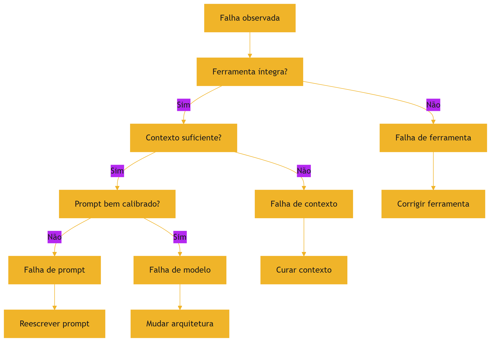

O diagrama mostra a ordem do protocolo: ferramenta, contexto, prompt e, por último, modelo — das causas baratas às caras [1][2][6].

### 3.3 O Antes e o Depois na Prática

**Antes**: o engenheiro reescreve o prompt por semanas porque "o modelo está errando" — quando a falha era de contexto poluído [1][2]. **Depois**: o protocolo detecta a classe em minutos, o contexto é curado e a falha desaparece [1][2]. O mesmo esforço, com método, produz o resultado certo [1].

## 4. Técnica

### 4.1 A Árvore de Diagnóstico em Código

O primeiro instrumento implementa a árvore de classificação [1][2][6]. O código abaixo aplica o protocolo e retorna a classe da falha [1]:

```python
def diagnosticar_falha(falha: dict) -> str:
    """Aplica o protocolo de classificação de falhas.

    falha deve conter:
      - ferramenta_integra: bool
      - contexto_suficiente: bool
      - prompt_calibrado: bool
    """
    if not falha.get("ferramenta_integra", True):
        return "falha_de_ferramenta"
    if not falha.get("contexto_suficiente", True):
        return "falha_de_contexto"
    if not falha.get("prompt_calibrado", True):
        return "falha_de_prompt"
    return "falha_de_modelo"


if __name__ == "__main__":
    casos = [
        {"nome": "dado truncado", "ferramenta_integra": False},
        {"nome": "info no meio", "contexto_suficiente": False},
        {"nome": "instrução ambígua", "prompt_calibrado": False},
        {"nome": "além do limiar", },
    ]
    for caso in casos:
        print(caso["nome"], "->", diagnosticar_falha(caso))
```

A árvore materializa o protocolo: cada teste decide a classe [1][2][6].

### 4.2 O Teste de Isolamento de Variáveis

O segundo instrumento implementa o teste de isolamento: varia uma camada por vez e observa o efeito [1][2]. O código abaixo executa o sistema com variações controladas [1]:

```python
class TesteIsolamento:
    """Isola a camada da falha variando uma variável por vez."""

    def __init__(self, sistema):
        self.sistema = sistema

    def executar(self, variacao: str, valor: object) -> bool:
        """Executa o sistema com uma variação; retorna se acertou."""
        # Em produção: chamada real ao sistema com a variação aplicada.
        return self.sistema(variacao, valor)

    def diagnosticar(self, base: bool, variacoes: dict) -> dict:
        """Compara a linha de base com cada variação isolada."""
        resultado = {"linha_base": base}
        for nome, valor in variacoes.items():
            resultado[nome] = self.executar(nome, valor)
        return resultado


if __name__ == "__main__":
    def sistema(variacao, valor):
        # Simula: falha some quando o contexto é curado.
        return variacao == "contexto" and valor == "curado"

    t = TesteIsolamento(sistema)
    print(t.diagnosticar(
        base=False,
        variacoes={"prompt": "reformulado", "contexto": "curado", "modelo": "maior"},
    ))
```

O teste de isolamento materializa o método científico da falha: varia uma variável por vez e identifica qual camada resolve [1][2].

### 4.3 O Registro de Diagnóstico

O terceiro instrumento registra os diagnósticos para aprendizado contínuo [1][15]. O código abaixo mantém o histórico de falhas e as classes [1]:

```python
class RegistroDiagnostico:
    """Registra falhas, classes e tratamentos para análise histórica."""

    def __init__(self):
        self.registros = []

    def registrar(self, falha: dict, classe: str, tratamento: str) -> None:
        self.registros.append({**falha, "classe": classe, "tratamento": tratamento})

    def distribuicao_por_classe(self) -> dict:
        dist = {}
        for r in self.registros:
            dist[r["classe"]] = dist.get(r["classe"], 0) + 1
        return dist

    def top_falhas(self, n: int = 5) -> list:
        return sorted(self.registros, key=lambda r: r.get("frequencia", 1),
                      reverse=True)[:n]


if __name__ == "__main__":
    reg = RegistroDiagnostico()
    reg.registrar({"sintoma": "esquece info"}, "falha_de_contexto", "curar contexto")
    reg.registrar({"sintoma": "formato errado"}, "falha_de_prompt", "reescrever")
    reg.registrar({"sintoma": "dado truncado"}, "falha_de_ferramenta", "corrigir")
    print(reg.distribuicao_por_classe())
```

O registro materializa o aprendizado: a distribuição de classes revela onde o sistema concentra as falhas — e onde investir [1][15].

## 5. Aplica

### 5.1 Onde Isso Vive no Mundo Real

O diagnóstico está em toda operação de IA em produção [1][2]. O suporte técnico classifica cada incidente de resposta errada [1]. O time de engenharia mantém o registro de diagnósticos [1][15]. O monitor de produção (Capítulo 3) dispara alertas que alimentam o diagnóstico [20]. A revisão de arquitetura usa a distribuição de classes para decidir investimentos [1]. Em cada caso, o método substitui o ajuste às cegas [1].

### 5.2 O Erro Comum do Iniciante

O erro mais comum é pular o diagnóstico e ajustar o prompt [1]. O segundo é tratar o sintoma: corrigir a resposta individual em vez da classe [1]. O terceiro é não registrar: a mesma falha reaparece porque o aprendizado não foi documentado [1][15]. Os três erros têm o mesmo remédio: o protocolo de classificação e o registro [1][15].

### 5.3 O Padrão Profissional em 2026

O padrão profissional integra o diagnóstico ao ciclo de vida [1]. Todo incidente passa pelo protocolo de classificação [1][2]. O registro de diagnósticos alimenta a revisão de arquitetura [1]. A distribuição de classes orienta o investimento: mais contexto, melhor prompt ou outro modelo [1]. O diagnóstico vira parte da cultura de engenharia, não um ritual de crise [1].

### 5.4 Exercício de Fixação

Colete três falhas reais do seu sistema e classifique cada uma pelo protocolo [1][2]. Aplique o teste de isolamento de variáveis para confirmar cada classe [1][2]. Registre os diagnósticos e desenhe a distribuição [1][15]. Proponha o tratamento para a classe dominante [1].

### 5.5 O Diagnóstico em Cenários de Sessão Longa

As sessões longas concentram as falhas mais difíceis de diagnosticar — porque múltiplas causas se acumulam [2][7]. O protocolo do Capítulo 8 ganha uma camada extra para sessões longas [1][7]. O primeiro cenário é o **esquecimento progressivo**: o agente lembra bem no início e piora ao longo da sessão [2]. O padrão aponta para context rot (Capítulo 3) ou para a falta de compressão (Capítulo 6) [2][7]. O teste é a ocupação da janela: se o contexto cresceu sem compactar, a causa é a compressão ausente [7].

O segundo cenário é o **esquecimento seletivo**: o agente lembra de fatos recentes e esquece os antigos [5]. O padrão aponta para lost in the middle (Capítulo 4) — a informação antiga foi empurrada para o meio [5]. O teste é a auditoria de posição: onde está o fato esquecido? [5][1]. O terceiro cenário é a **mudança de comportamento por contaminação**: o agente mistura assuntos [1]. O padrão aponta para falha de isolamento (Capítulo 7) [1]. O teste é a auditoria de isolamento entre escopos [1].

O quarto cenário é a **degradação por poluição de ferramentas**: o agente piora conforme acumula saídas de ferramentas [7][6]. O padrão aponta para a falta de limpeza (Capítulo 6) [7]. O quinto cenário é o **erro persistente apesar de tudo**: o agente erra o mesmo tipo de tarefa mesmo com contexto curado [1]. O padrão aponta para falha de modelo (seção 2.4) [1]. A classificação por cenário transforma o diagnóstico de sessão longa em protocolo — cada padrão tem teste e tratamento [1][7].

### 5.6 A Prevenção como Metade do Diagnóstico

O melhor diagnóstico é o que evita o incidente [1][20]. A prevenção é a aplicação sistemática das disciplinas dos capítulos anteriores antes que a falha apareça [1][20]. O primeiro pilar da prevenção é o **teste contínuo de contexto**: o teste da agulha (Capítulo 3) roda regularmente contra o sistema real, detectando a degradação antes do usuário [2][9]. O segundo é a **auditoria preventiva de templates**: os templates de contexto são auditados quanto a posição (Capítulo 4), seleção (Capítulo 5) e compressão (Capítulo 6) [1][5].

O terceiro pilar é o **monitoramento de saúde** (Capítulo 3): a degradação é detectada em produção, com alertas precoces [20]. O quarto é o **registro contínuo de incidentes**: cada falha, mesmo pequena, é registrada e classificada [1][15]. O registro alimenta a distribuição de classes — a base para decidir onde investir (seção 5.3) [1][15].

O quinto pilar é a **revisão periódica de arquitetura**: a revisão pergunta se a arquitetura de contexto ainda é adequada à tarefa — se as fontes mudaram, se os volumes cresceram, se os padrões de falha evoluíram [1][20]. A prevenção é a metade do diagnóstico porque reduz o número de incidentes a diagnosticar [1][20]. O engenheiro que previne constrói sistemas que raramente precisam do protocolo completo [1].

### 5.7 O Diagnóstico de Falhas em Recuperação (RAG)

O diagnóstico ganha um caso especial quando a falha envolve recuperação (Capítulo 9) [3][2]. O primeiro padrão de falha RAG é o **trecho irrelevante**: a recuperação retornou material que não responde à pergunta [3][4]. O teste é a inspeção dos trechos recuperados: a relevância é medida (precisão do Capítulo 9) [12]. O segundo é o **trecho distrator**: o material recuperado é semelhante, porém incorreto (Capítulo 3) [2]. O teste é o detector de distratores [2].

O terceiro padrão é o **trecho perdido**: a informação correta existia na base, mas não foi recuperada [3][4]. O teste é o recall (Capítulo 9): a informação recuperável está sendo encontrada? [12]. O quarto é o **trecho truncado**: a recuperação retornou um fragmento incompleto [4][6]. O teste é a integridade do fragmento — a mesma inspeção da ferramenta (seção 2.5) [6].

O quinto padrão é o **posicionamento ruim**: os trechos entraram no meio e foram esquecidos (Capítulo 4) [5]. O teste é a auditoria de posição aplicada ao contexto RAG [5]. A classificação das falhas de recuperação é a aplicação mais rica do protocolo deste capítulo — porque o RAG combina todas as camadas: fonte, seleção, posição e geração [1][3]. O engenheiro que diagnostica RAG com o protocolo domina o caso mais complexo da disciplina [1][3].

### 5.8 O Registro de Aprendizado e a Melhoria Contínua

O diagnóstico não termina na correção — termina no aprendizado [1][15]. O registro de incidentes (seção 4.3) é a matéria-prima do aprendizado [1][15]. O primeiro uso do registro é a **análise de tendências**: a distribuição de classes revela os padrões — falhas de contexto dominam? De ferramenta? [1][15]. A tendência orienta o investimento: a classe dominante recebe o tratamento estrutural [1].

O segundo uso é a **biblioteca de casos**: os incidentes resolvidos viram casos de teste do conjunto de avaliação (Capítulo 10) [1][12]. Cada falha corrigida passa a ser protegida por um teste — a regressão vira prevenção [1][12]. O terceiro uso é o **retrospecto periódico**: a revisão dos incidentes do período identifica os padrões de causa raiz [1].

O quarto uso é a **atualização do protocolo**: quando o registro revela uma classe de falha não prevista, o protocolo ganha um teste novo [1][15]. O protocolo de diagnóstico é um documento vivo — evolui com a operação [1]. O aprendizado contínuo é o que transforma o diagnóstico de competência individual em ativo institucional [1][15]. O engenheiro que registra, analisa e atualiza constrói uma organização que erra menos a cada mês [1].

### 5.9 O Diagnóstico em Aplicações de Alto Risco

O diagnóstico ganha peso quando a falha tem consequências sérias — financeiras, jurídicas, de segurança [1][12]. Em aplicações de alto risco, o protocolo deste capítulo não é uma boa prática — é um requisito [1][12]. A primeira adaptação é a **profundidade da verificação**: cada classe de falha é verificada com mais rigor — o teste da ferramenta inclui validação de integridade, o teste do contexto inclui auditoria completa de posição e fonte [1][12].

A segunda adaptação é a **trilha de auditoria**: cada diagnóstico registra as evidências — o dado inspecionado, o teste aplicado, a conclusão [1][12]. A trilha é o que permite a revisão do diagnóstico e a responsabilização [1][12]. A terceira é a **segunda opinião**: em casos de alto risco, um segundo avaliador (humano ou agente) repete o diagnóstico de forma independente [1][12].

A quarta adaptação é o **tratamento em camadas**: mesmo identificada a classe, o tratamento inclui proteção redundante — corrigir a causa e adicionar uma salvaguarda que detectaria a recorrência [1][12]. O diagnóstico em aplicações de alto risco é o uso mais exigente do protocolo: a classificação correta é o que evita a repetição do erro caro [1][12].

### 5.10 O Diagnóstico e o Design de Experimentos

O diagnóstico profissional é, na prática, um design de experimentos [1][13]. O Livro 2 introduziu o protocolo de experimentação para prompts; este capítulo o aplica ao contexto [1][13]. O primeiro princípio é a **hipótese explícita**: antes de testar, o engenheiro escreve a hipótese — "a falha é de contexto porque..." [1][13]. A hipótese orienta o teste e a interpretação [1].

O segundo princípio é a **variação isolada**: o teste altera uma variável por vez — o contexto, o prompt ou o modelo [1][13]. A variação isolada é o que permite atribuir a causa [1][13]. O terceiro é a **amostra suficiente**: a conclusão exige amostra — dez execuções com a variação, não uma [1][12]. O quarto é o **registro sistemático**: hipótese, teste, resultado e conclusão entram no registro (seção 4.3) [1][15].

O diagnóstico como experimento tem um benefício duplo [1][13]. Classifica a falha atual — e produz conhecimento sobre o sistema [1][13]. Cada diagnóstico bem desenhado é um experimento que informa o design futuro [1][12]. O engenheiro que trata o diagnóstico como experimento transforma incidentes em aprendizado — a marca da maturidade [1][13].

### 5.11 O Estudo de Caso da Resposta Financeira Errada

O estudo de caso consolida o capítulo em um cenário de alto risco [1][2]. O cenário: um assistente financeiro que responde perguntas sobre investimentos [1]. O sintoma: uma resposta citou um número de taxa de juros errado — o usuário quase agiu com base no erro [1][2].

O primeiro reflexo da equipe foi ajustar o prompt — "seja preciso com taxas" [1]. O erro persistiu [1]. O protocolo (seção 2.7) foi aplicado [1]. O teste da ferramenta: a fonte de taxas estava íntegra [6]. O teste do contexto: a informação correta estava presente, mas a fonte antiga — um distrator — também foi recuperada (Capítulos 3 e 9) [2][3]. O diagnóstico: falha de contexto, por distrator de fonte [2][1].

O tratamento: corrigir a fonte e adicionar o critério de atualidade à seleção (Capítulo 5) [1][2]. A salvaguarda: o teste da agulha (Capítulo 3) passou a incluir casos de taxa [2][9]. O caso demonstra o valor do protocolo: o ajuste de prompt era o tratamento errado — o protocolo encontrou a causa em minutos [1][2]. E mostra o tema do capítulo: diagnosticar é a metade do corrigir [1][2].

### 5.12 O Diagnóstico e a Cultura de Engenharia

O diagnóstico não é apenas um método — é uma cultura [1][15]. A cultura de diagnóstico tem sinais reconhecíveis [1]. O primeiro é a **curiosidade pela causa**: a equipe pergunta "por quê" antes de "consertar" [1]. O segundo é a **disciplina do registro**: todo incidente é registrado, mesmo os pequenos [1][15]. O terceiro é a **humildade diante da evidência**: a hipótese é testada, não defendida [1][13].

O quarto sinal é a **aversão ao tratamento sintomático**: a equipe recusa o ajuste que esconde o sintoma sem tratar a causa [1]. O quinto é a **revisão periódica do protocolo**: a equipe atualiza o método com o aprendizado [1][15]. A cultura de diagnóstico é o que transforma o protocolo deste capítulo em prática viva [1][15].

A construção da cultura começa com o exemplo técnico e o vocabulário compartilhado (o Livro 2, Capítulo 7, documentou o mesmo princípio para prompts) [1][19]. A equipe que nomeia as classes de falha — "isso é falha de contexto" — diagnostica mais rápido [1]. A cultura de diagnóstico é o ativo que permanece quando as ferramentas mudam [1][15].

### 5.13 O Estudo de Caso do Loop de Retrabalho

O estudo de caso mostra o diagnóstico interrompendo um ciclo vicioso [1][2]. O cenário: um agente de geração de conteúdo com um erro recorrente [1]. O sintoma: as respostas precisavam de correção manual frequente [1][2]. A equipe corrigia cada resposta — um loop de retrabalho sem fim [1].

O diagnóstico: o registro de incidentes (seção 4.3) revelou o padrão — as falhas concentravam-se quando o contexto vinha de uma fonte específica [1][2][15]. O teste da ferramenta: a fonte estava truncando os campos [6]. O tratamento: a correção da ferramenta, não do prompt [6]. O loop parou [1][6].

A lição do caso é o poder do registro: sem ele, a equipe tratava sintomas; com ele, identificou a causa em uma tarde [1][15]. O caso demonstra o tema do capítulo: o diagnóstico é a metade do corrigir — e o registro é o que torna o diagnóstico possível em escala [1][15].

### 5.14 A Lista de Verificação do Diagnóstico

A lista de verificação consolida o capítulo [1][2]. O primeiro item: o incidente é classificado pelo protocolo? [1][2]. O segundo: a ferramenta foi verificada primeiro (dado íntegro)? [6]. O terceiro: o contexto foi verificado (presença, posição, poluição)? [1][2][5]. O quarto: o prompt foi verificado (calibração)? [1].

O quinto item: a falha de modelo é confirmada por mudança de modelo? [1]. O sexto: o teste de isolamento de variáveis foi aplicado? [1][13]. O sétimo: o diagnóstico foi registrado com evidências? [1][15]. O oitavo: o incidente virou caso de teste do conjunto de avaliação? [1][12].

A lista é o resumo operacional [1][2]. O engenheiro que a percorre transforma incidentes em aprendizado [1]. O diagnóstico é a competência que amarra a Parte II — e prepara a Parte III, onde a verificação vira automação [1][19].

### 5.15 O Diagnóstico e a Interface com a Engenharia de Prompt

O diagnóstico do Capítulo 8 fecha o ciclo com a engenharia de prompts do Livro 2 [1][19]. O Livro 2 ensinou a avaliar respostas plausíveis-porém-erradas; este capítulo ensina a classificar a causa [1][19]. A síntese: a avaliação (Parte I) diz que a resposta está errada; o diagnóstico (Parte II) diz por quê [1][19].

A primeira interface é a **hereditariedade de técnicas**: o protocolo de variação isolada do Livro 2 (experimentação de prompts) é o mesmo do diagnóstico de contexto (Capítulo 8, seção 5.10) [1][19]. A segunda é a **distinção de classes**: a falha de prompt do Livro 2 e a falha de contexto deste livro são classes diferentes — e a confusão entre elas é o erro mais caro [1][2][19]. A terceira é a **avaliação conjunta**: o conjunto de avaliação cobre prompts e contexto — a resposta é avaliada por ambas as lentes [1][12].

O engenheiro que integra as duas camadas diagnostica a pilha completa [1][19]. O Capítulo 8 é o ponto onde a Parte I e a Parte II se encontram: a avaliação do Livro 2 ganha a classificação de causa deste livro [1][19].

### 5.16 O Estudo de Caso do Diagnóstico em Cascata

O estudo de caso mostra o diagnóstico integrado [1][2][19]. O cenário: um assistente com falha recorrente [1]. O sintoma: respostas erradas em um subconjunto de perguntas [1]. A equipe do prompt ajustou o prompt (Parte I) — sem efeito [1][19]. A equipe do contexto curou o contexto (Parte II) — sem efeito [1][2].

O diagnóstico integrado (Capítulo 8): o teste da ferramenta revelou a causa — a API de dados retornava campos com tipos errados [6][8]. Nem o prompt nem o contexto eram o problema [6]. O tratamento: a correção da API e a validação de tipos na fronteira [6].

O caso demonstra o valor da classificação completa: as equipes trataram as classes erradas porque o protocolo não foi seguido [1][6]. Com o protocolo, a causa foi encontrada na primeira passada [6]. O diagnóstico integrado é a aplicação madura das duas Partes [1][19].

### 5.17 O Fechamento do Capítulo

O capítulo do diagnóstico se encerra com a consolidação [1][2]. As quatro classes — prompt, contexto, modelo, ferramenta — têm sinais e tratamentos [1][2][6]. O protocolo ordena os testes [1]. O registro alimenta o aprendizado [1][15]. A prevenção reduz os incidentes [1][20].

O diagnóstico é a competência que amarra a Parte II [1]. E é a ponte para a Parte III: o harness automatiza exatamente o que este capítulo faz manualmente — verificar, classificar e corrigir [1][19]. O engenheiro que domina o diagnóstico está pronto para delegar a verificação ao harness [1][19].

### 5.18 O Diagnóstico e o Custo da Falha Não Classificada

A falha não classificada tem um custo que o engenheiro conhece: o custo do tratamento errado [1][2]. O primeiro componente é o **tempo desperdiçado**: ajustar o prompt quando a falha é de contexto consome dias [1][2]. O segundo é o **retrabalho acumulado**: cada tratamento errado deixa a causa viva — e a falha volta [1][2]. O terceiro é o **custo de oportunidade**: o tempo do time aplicado no tratamento errado não produz melhoria real [1][13].

O quarto componente é o **dano da piora**: alguns tratamentos errados pioram o sistema — adicionar contexto a uma falha de modelo aumenta o custo sem melhorar [1][2]. O quinto é o **custo institucional**: a equipe que erra o diagnóstico repetidamente perde a confiança no próprio método [1].

O protocolo deste capítulo é o antídoto do custo da falha não classificada [1][2]. A classificação em minutos — ferramenta, contexto, prompt, modelo — evita os dias do tratamento errado [1][2]. O custo do protocolo é pequeno; o custo da sua ausência é alto [1]. O engenheiro que classifica primeiro economiza o que o tratamento errado gastaria [1][2].

### 5.19 O Fechamento do Capítulo

O capítulo do diagnóstico se encerra com a consolidação final [1][2]. As quatro classes — prompt, contexto, modelo, ferramenta — são o mapa da falha [1][2][6]. O protocolo é a ordem do exame [1]. O registro é a memória do método [1][15]. A prevenção é a aplicação contínua [1][20].

O diagnóstico é a competência que fecha a Parte II [1]. E é a ponte para a Parte III: o harness automatiza a verificação que este capítulo ensina [1][19]. O engenheiro que diagnostica bem está pronto para delegar a verificação ao harness [1][19].

### 5.20 O Diagnóstico e a Medição Contínua

O diagnóstico não é apenas reativo — é também uma prática de medição contínua [1][20]. O primeiro instrumento é o **monitor de classes**: a distribuição de falhas por classe é monitorada ao longo do tempo [1][15]. A tendência revela a saúde: falhas de contexto subindo indicam degradação da base; falhas de ferramenta subindo indicam integração frágil [1][15][20]. O segundo é o **tempo de diagnóstico**: o tempo entre o incidente e a classificação é medido — e o protocolo deve reduzi-lo [1].

O terceiro instrumento é o **custo do incidente**: cada incidente registra o custo do retrabalho, da investigação e da correção [1][13]. O custo acumulado justifica o investimento em prevenção (seção 5.6) [1][13]. O quarto é o **retrospecto periódico**: a revisão mensal da distribuição, do tempo e do custo orienta a melhoria [1][15].

O diagnóstico como medição contínua transforma a operação em aprendizado sistemático [1][20]. O engenheiro que mede as falhas constrói o caso de negócio da prevenção [1][13]. E o Capítulo 10 integra as métricas do diagnóstico ao painel geral do sistema [1][12].

### 5.21 O Fechamento do Capítulo

O capítulo do diagnóstico se encerra com a consolidação final [1][2]. As quatro classes são o mapa [1][2][6]. O protocolo é a ordem [1]. O registro é a memória [1][15]. A prevenção e a medição são a prática contínua [1][20].

O diagnóstico é a competência que amarra a Parte II — e a ponte para a Parte III, onde a verificação vira automação [1][19]. O engenheiro que diagnostica bem está pronto para o harness [1][19].

### 5.22 A Mensagem Final do Capítulo

O capítulo do diagnóstico deixa a mensagem que amarra a Parte II [1][2]. As quatro classes — prompt, contexto, modelo, ferramenta — são o mapa da falha [1][2][6]. O protocolo é a ordem do exame [1]. O registro é a memória do método [1][15].

O diagnóstico é a competência que verifica o sistema inteiro — e a ponte para a Parte III, onde a verificação vira automação [1][19]. O engenheiro que diagnostica bem está pronto para o harness [1][19].

## 6. Conclusão

O diagnóstico é a competência que transforma a engenharia de contexto em disciplina madura [1]. As quatro classes — prompt, contexto, modelo e ferramenta — têm sinais, testes e tratamentos próprios [1][2][6]. O protocolo de classificação ordena os testes das causas baratas às caras [1]. As ferramentas deste capítulo implementam a árvore, o isolamento de variáveis e o registro [1][2][15]. O próximo capítulo desenvolve a camada de recuperação — RAG — uma das fontes mais ricas de contexto e, também, uma das mais propensas a falha de contexto [3][4].

## 7. Referências

[1] ANTHROPIC. Effective context engineering for AI agents. Anthropic Engineering Blog, set. 2025. Disponível em: https://www.anthropic.com/engineering/effective-context-engineering-for-ai-agents. Acesso em: 5 ago. 2026.
[2] HONG, Kelly; TROYNIKOV, Anton; HUBER, Jeff. Context Rot: How Increasing Input Tokens Impacts LLM Performance. Chroma Technical Report, jul. 2025. Disponível em: https://www.trychroma.com/research/context-rot. Acesso em: 5 ago. 2026.
[3] LEWIS, Patrick et al. Retrieval-Augmented Generation for Knowledge-Intensive NLP Tasks. In: Advances in Neural Information Processing Systems (NeurIPS), v. 33, p. 9459–9474, 2020. Disponível em: https://arxiv.org/abs/2005.11401. Acesso em: 5 ago. 2026.
[4] GAO, Yunfan et al. Retrieval-Augmented Generation for Large Language Models: A Survey. arXiv:2312.10997, mar. 2024. Disponível em: https://arxiv.org/abs/2312.10997. Acesso em: 5 ago. 2026.
[5] LIU, Nelson F. et al. Lost in the Middle: How Language Models Use Long Contexts. Transactions of the Association for Computational Linguistics (TACL), v. 12, p. 157–173, 2024. Disponível em: https://arxiv.org/abs/2307.03172. Acesso em: 5 ago. 2026.
[6] ANTHROPIC. Writing tools for AI agents — using AI agents. Anthropic Engineering Blog, set. 2025. Disponível em: https://www.anthropic.com/engineering/writing-tools-for-agents. Acesso em: 5 ago. 2026.
[7] ANTHROPIC. Context engineering: memory, compaction, and tool clearing. Claude Platform Cookbook, mar. 2026. Disponível em: https://platform.claude.com/cookbook/tool-use-context-engineering-context-engineering-tools. Acesso em: 5 ago. 2026.
[8] ZHAO, Wayne Xin et al. A Survey of Large Language Models. arXiv:2303.18223, 2023. Disponível em: https://arxiv.org/abs/2303.18223. Acesso em: 5 ago. 2026.
[9] CHROMA. Context Rot: Evaluation Toolkit. GitHub Repository, 2025. Disponível em: https://github.com/chroma-core/context-rot. Acesso em: 5 ago. 2026.
[10] LIU, Nelson F. Lost in the Middle: Replication Repository. GitHub Repository, 2023. Disponível em: https://github.com/nelson-liu/lost-in-the-middle. Acesso em: 5 ago. 2026.
[11] CHEN, Jiawei et al. LongRAG: Enhancing Retrieval-Augmented Generation with Long-context LLMs. arXiv:2406.15319, 2024. Disponível em: https://arxiv.org/abs/2406.15319. Acesso em: 5 ago. 2026.
[12] ASIA, Research Group et al. Retrieval-Augmented Generation Evaluation in the Era of Large Language Models: A Comprehensive Survey. ResearchGate / arXiv, abr. 2025. Disponível em: https://www.researchgate.net/publication/390991356. Acesso em: 5 ago. 2026.
[13] OPENAI. GPT-4 Technical Report & Developer Guides on Context Management. OpenAI Documentation, 2024–2025. Disponível em: https://openai.com/index/gpt-4-research/. Acesso em: 5 ago. 2026.
[14] GOOGLE CLOUD. What is Retrieval-Augmented Generation (RAG)?. Google Cloud Architecture Center, 2025. Disponível em: https://cloud.google.com/use-cases/retrieval-augmented-generation. Acesso em: 5 ago. 2026.
[15] LANGCHAIN. LangChain Agents & Context Management Documentation. LangChain Guides, 2025–2026. Disponível em: https://python.langchain.com/docs/concepts/agents/. Acesso em: 5 ago. 2026.
[16] WANG, Zhen et al. Agentic Retrieval-Augmented Generation: A Survey on Agentic RAG. arXiv:2408.12999, 2024. Disponível em: https://arxiv.org/abs/2408.12999. Acesso em: 5 ago. 2026.
[17] XIAO, Guangxuan et al. Efficient Streaming Language Models with Attention Sinks. arXiv:2309.17453, 2023. Disponível em: https://arxiv.org/abs/2309.17453. Acesso em: 5 ago. 2026.
[18] RODIN, Alex et al. Found in the Middle: Overcoming Long-Context Vulnerabilities in LLMs. arXiv:2403.04797, 2024. Disponível em: https://arxiv.org/abs/2403.04797. Acesso em: 5 ago. 2026.
[19] MEDIUM (Data Science Collective). Context Is the New Prompt: Why Context Engineering Is Shaping the Future of AI. Medium Article, 2025. Disponível em: https://medium.com/data-science-collective/context-is-the-new-prompt-why-context-engineering-is-shaping-the-future-of-ai-46eb062ed270. Acesso em: 5 ago. 2026.
[20] ZENML. Context Rot: Evaluating LLM Performance Degradation with Increasing Input Tokens. MLOps Database, 2025. Disponível em: https://www.zenml.io/llmops-database/context-rot-evaluating-llm-performance-degradation-with-increasing-input-tokens. Acesso em: 5 ago. 2026.
[21] MODEL CONTEXT PROTOCOL (MCP). Open Standard for AI Agent Context Integration. Anthropic & Ecosystem Specs, 2025–2026. Disponível em: https://modelcontextprotocol.io/. Acesso em: 5 ago. 2026.

# Capítulo 9 — RAG: quando e por que recuperar conhecimento

## 1. Introdução

O Capítulo 5 apresentou o Select como a seleção de contexto sob demanda [1]. Este capítulo desenvolve o mecanismo mais poderoso de seleção: a recuperação aumentada por geração — RAG (Retrieval-Augmented Generation) [3]. RAG é a arquitetura que combina o conhecimento do modelo com conhecimento externo recuperado de uma base na hora da inferência [3]. O paper seminal de Lewis et al. (2020) fundou a técnica; o survey de Gao et al. (2024) documentou sua evolução em três eras [3][4]. Este capítulo ensina o que é RAG, por que existe, quando usar, como evoluiu e como evitar as armadilhas — incluindo a ironia de que RAG mal feito é uma fonte clássica de falha de contexto (Capítulo 8) [3][4][2].

## 2. Explica

### 2.1 O Problema que o RAG Resolve

O modelo de linguagem conhece o mundo até o fim do seu treinamento — e nada além [3][1]. Ele não conhece os documentos da sua empresa, os dados atualizados do trimestre ou a política interna de ontem [3]. O Livro 2 mostrou que nenhum prompt faz o modelo saber o que ele não sabe [19]. O RAG resolve esse limite arquitetural: em vez de forçar o conhecimento para dentro do modelo (treinamento, caro e lento), o RAG busca o conhecimento na hora e o entrega no contexto [3]. A recuperação é a ponte entre o conhecimento estático do modelo e o conhecimento dinâmico do mundo [3][1].

### 2.2 A Arquitetura Fundacional

O paper de Lewis et al. (2020) estabeleceu a arquitetura do RAG [3]. A ideia central: combinar memória paramétrica — o conhecimento no peso do modelo — com memória não-paramétrica — um índice externo recuperável [3]. O fluxo é triplo [3]. Primeiro, a indexação: os documentos da base são fragmentados e embutidos em vetores [3]. Segundo, a recuperação: a consulta é embutida e comparada aos vetores, selecionando os trechos mais similares [3]. Terceiro, a geração: o modelo recebe a consulta e os trechos recuperados e gera a resposta com base neles [3]. A arquitetura é a base de tudo o que veio depois [3][4].

### 2.3 As Três Eras do RAG

O survey de Gao et al. (2024) organizou a evolução do RAG em três eras [4]. A primeira é o **Naive RAG**: recuperação direta e geração — o padrão mínimo [4]. A segunda é o **Advanced RAG**: adiciona pré-processamento (melhorar a indexação e a consulta) e pós-processamento (filtrar e reordenar trechos) [4]. A terceira é o **Modular RAG**: arquiteturas flexíveis com roteamento adaptativo, múltiplas fontes e iteração [4]. A evolução é a história da disciplina: cada era resolveu as limitações da anterior [4]. O Google Cloud documenta os padrões arquiteturais correspondentes na prática corporativa [14].

### 2.4 Quando Usar RAG

O RAG é a ferramenta certa para uma classe específica de problemas [3][14]. Use RAG quando o conhecimento necessário é externo ao modelo: documentos da empresa, dados atualizados, bases proprietárias [3]. Use RAG quando o conhecimento muda: o RAG atualiza ao reindexar a base, sem retreinar o modelo [3]. Use RAG quando a fidelidade é crítica: o RAG ancora a resposta em trechos verificáveis [3]. Não use RAG quando o conhecimento está no modelo e é estável — a recuperação adiciona custo e latência sem benefício [3][1]. A decisão é a mesma do Capítulo 8: o problema define a arquitetura [1].

### 2.5 O Que RAG Não Resolve

O RAG tem limites — e conhecê-los evita a decepção [2][4]. Primeiro, o RAG não resolve a degradação de contexto: trechos recuperados em excesso criam o palheiro do Capítulo 3 [2]. Segundo, o RAG não resolve a geografia: trechos recuperados no meio sofrem o lost in the middle [5]. Terceiro, o RAG não garante fidelidade: trechos mal recuperados (distratores) enganam o modelo [2]. Quarto, o RAG não substitui a capacidade do modelo: se a tarefa exige raciocínio além do limiar, os trechos não resolvem [1]. O RAG é uma camada de conhecimento — não uma panaceia [2][4].

### 2.6 As Armadilhas da Recuperação

A recuperação é a fonte mais comum de falha em sistemas RAG [2][4]. A armadilha central é a qualidade da recuperação: trechos irrelevantes, truncados ou distratores entram no contexto e poluem a resposta [2][4]. O survey de avaliação de RAG documenta as métricas: precisão da recuperação, relevância dos trechos e fidelidade da resposta [12]. A segunda armadilha é o custo: recuperar demais infla a janela e degrada (Capítulo 3) [2]. A terceira é a posição: trechos recuperados no meio são esquecidos (Capítulo 4) [5]. O engenheiro de RAG maduro trata a recuperação como um sistema a ser avaliado, não um detalhe [2][12].

### 2.7 A Evolução para o Agentic RAG

A próxima fronteira da disciplina é o RAG agêntico (Agentic RAG) [16]. O survey de Wang et al. (2024) documenta a evolução do RAG estático para o RAG dinâmico guiado por agentes [16]. No Agentic RAG, o sistema decide o que recuperar, quando recuperar e se precisa recuperar mais — em vez de recuperar sempre a mesma quantidade [16]. O agente usa o feedback da geração para refinar a busca [16]. A evolução integra o RAG ao framework deste livro: o agente seleciona (Capítulo 5), diagnostica (Capítulo 8) e isola (Capítulo 7) a recuperação [1][16].

### 2.8 A Interação com Janelas Longas

A chegada de janelas gigantes criou um debate na disciplina: com janela de 1 milhão de tokens, o RAG ainda é necessário? [11][2]. A pesquisa sobre LongRAG explora a convergência: janelas longas podem substituir parte da recuperação — mas não toda [11]. O estudo da Chroma mostra o outro lado: janela grande sem curadoria degrada [2]. A síntese prática: a janela longa muda a economia (cabe mais), mas não muda a fisiologia (a atenção ainda se dilui) [2][11]. O RAG continua sendo a resposta à escassez e à qualidade [11][1].

### 2.9 O RAG como Sistema de Contexto

O RAG não é um componente isolado — é um sistema de contexto [1][3]. O fluxo completo integra: indexação (preparar a base), recuperação (buscar os trechos), seleção (filtrar o ruído), posicionamento (evitar o meio) e composição (respeitar a reserva) [1][3][5]. O engenheiro de contexto aplica ao RAG tudo o que aprendeu: curadoria, orçamento, geografia e diagnóstico [1][2][5]. O RAG bem construído é a demonstração prática de que contexto é decisão [1].

### 2.10 A Síntese: Conhecimento Sob Demanda

O RAG é a materialização do princípio do conhecimento sob demanda [3][1]. Em vez de embutir o conhecimento no modelo ou no contexto, o sistema o busca quando precisa [3]. A evolução — Naive, Advanced, Modular, Agentic — é a história da disciplina refinando a pergunta "como buscar" [4][16]. O RAG não substitui o framework deste livro — ele o utiliza [1][3]. E é a ponte para o Capítulo 10: quando o conhecimento recuperado precisa persistir além da sessão, nasce a memória [3][7][13].

## 3. Ilustra

### 3.1 A Analogia da Biblioteca

A biblioteca é a analogia clássica do RAG [3]. O modelo é um especialista com memória limitada; a base é a biblioteca da empresa [3]. Em vez de o especialista memorizar todos os livros (treinamento), o sistema o envia à biblioteca para consultar o trecho certo quando precisa (recuperação) [3]. O RAG é o bibliotecário: recebe a pergunta, localiza a estante, pega o livro e abre a página certa [3][14].

### 3.2 O Diagrama do Fluxo RAG

O diagrama abaixo representa o fluxo completo do RAG com as três eras [3][4][16].

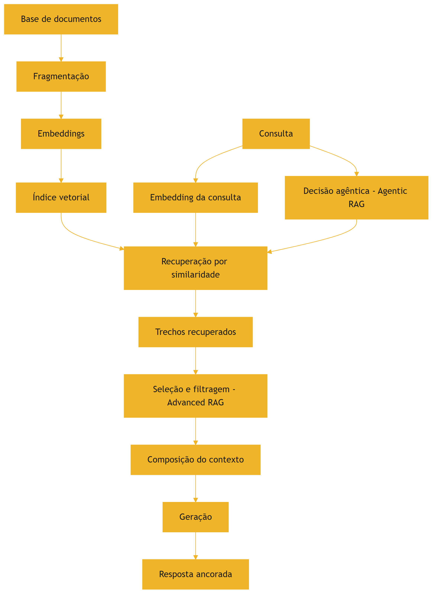

O diagrama mostra o ciclo: indexação, recuperação, seleção, composição e geração — com a realimentação agêntica [3][4][16].

### 3.3 O Antes e o Depois na Prática

**Antes (sem RAG)**: o modelo responde sobre políticas da empresa com conhecimento genérico ou inventado — o Livro 2 documentou o perigo [7]. **Depois (com RAG)**: o sistema recupera a política específica, entrega o trecho no contexto e a resposta cita o documento real [3]. A fidelidade sobe porque a fonte está no contexto, verificável [3].

## 4. Técnica

### 4.1 O Indexador Didático

O primeiro instrumento implementa a indexação: fragmentar documentos e criar um índice de busca [3][4]. O código abaixo é uma versão didática com busca por palavras-chave [3]:

```python
class IndexadorDidatico:
    """Indexa documentos por fragmentos e palavras-chave (didático)."""

    def __init__(self, tamanho_fragmento: int = 100):
        self.tamanho_fragmento = tamanho_fragmento
        self.indice = []  # lista de fragmentos

    def fragmentar(self, doc_id: str, texto: str) -> list:
        palavras = texto.split()
        fragmentos = []
        for i in range(0, len(palavras), self.tamanho_fragmento):
            trecho = " ".join(palavras[i:i + self.tamanho_fragmento])
            fragmentos.append({"doc": doc_id, "trecho": trecho})
        self.indice.extend(fragmentos)
        return fragmentos

    def recuperar(self, consulta: str, k: int = 2) -> list:
        """Recupera os k fragmentos com mais termos em comum com a consulta."""
        termos = set(consulta.lower().split())
        pontuados = []
        for frag in self.indice:
            pontos = sum(1 for t in termos if t in frag["trecho"].lower())
            pontuados.append((pontos, frag))
        pontuados.sort(key=lambda x: x[0], reverse=True)
        return [f for p, f in pontuados[:k] if p > 0]


if __name__ == "__main__":
    idx = IndexadorDidatico()
    idx.fragmentar("politica", "Pagamentos acima de 10 mil exigem aprovação em duas etapas.")
    idx.fragmentar("manual", "O sistema registra todas as operações no log de auditoria.")
    print(idx.recuperar("como aprovar pagamento alto?", k=2))
```

O indexador materializa o fluxo de indexação e recuperação — com similaridade por termos, em vez de vetores, por clareza didática [3].

### 4.2 O Avaliador de Recuperação

O segundo instrumento avalia a qualidade da recuperação: precisão, relevância e cobertura [12]. O código abaixo implementa as métricas básicas [12]:

```python
def avaliar_recuperacao(consultas: list, relevantes_por_consulta: dict,
                        recuperados_por_consulta: dict) -> dict:
    """Calcula precisão e recall da recuperação."""
    total_precisao = 0
    total_recall = 0
    for consulta in consultas:
        relevantes = set(relevantes_por_consulta.get(consulta, []))
        recuperados = set(recuperados_por_consulta.get(consulta, []))
        if recuperados:
            total_precisao += len(relevantes & recuperados) / len(recuperados)
        if relevantes:
            total_recall += len(relevantes & recuperados) / len(relevantes)
    n = len(consultas) or 1
    return {
        "precisao_media": round(total_precisao / n, 2),
        "recall_medio": round(total_recall / n, 2),
    }


if __name__ == "__main__":
    consultas = ["política de pagamento", "log de auditoria"]
    relevantes = {
        "política de pagamento": ["frag_pol_1"],
        "log de auditoria": ["frag_man_2"],
    }
    recuperados = {
        "política de pagamento": ["frag_pol_1", "frag_man_2"],
        "log de auditoria": ["frag_man_2"],
    }
    print(avaliar_recuperacao(consultas, relevantes, recuperados))
```

O avaliador materializa o Capítulo 8 aplicado ao RAG: a qualidade da recuperação é medida, não presumida [12][8].

### 4.3 O Compositor RAG com Proteções

O terceiro instrumento integra o RAG às proteções do livro: seleção, posicionamento e reserva [1][2][5]. O código abaixo compõe o contexto RAG respeitando a geografia e o orçamento [1][5]:

```python
def compor_contexto_rag(instrucao: str, trechos: list, pergunta: str,
                        janela: int, max_trechos: int = 3) -> dict:
    """Compõe o contexto RAG: instrução, trechos e pergunta nas zonas certas.

    Geografia: instrução no início, trechos no meio (limitados), pergunta no fim.
    """
    limite = int(janela * 0.8)
    selecionados = []
    ocupado = len(instrucao.split()) + len(pergunta.split())
    for trecho in trechos[:max_trechos]:
        custo = len(trecho.split())
        if ocupado + custo <= limite:
            selecionados.append(trecho)
            ocupado += custo
    contexto = "\n\n".join([instrucao] + selecionados + [pergunta])
    return {
        "contexto": contexto,
        "trechos_incluidos": len(selecionados),
        "tokens_aproximados": ocupado,
        "reserva_restante": janela - ocupado,
    }


if __name__ == "__main__":
    instrucao = "Responda com base exclusivamente nos trechos fornecidos."
    trechos = [
        "Trecho 1: Política de pagamento exige duas aprovações acima de 10 mil.",
        "Trecho 2: O fluxo registra toda operação no log de auditoria.",
        "Trecho 3: Aprovações ficam pendentes até o segundo signatário.",
    ]
    pergunta = "Como funciona a aprovação de pagamentos altos?"
    resultado = compor_contexto_rag(instrucao, trechos, pergunta, janela=8_000)
    print(resultado["contexto"])
    print("Trechos incluídos:", resultado["trechos_incluidos"])
```

O compositor materializa a síntese: o RAG alimenta o contexto, e as disciplinas do livro — geografia, orçamento, seleção — o mantêm saudável [1][2][5].

## 5. Aplica

### 5.1 Onde Isso Vive no Mundo Real

O RAG está em toda aplicação corporativa de IA [14][3]. Assistentes de suporte recuperam políticas e manuais [3]. Ferramentas jurídicas recuperam contratos e jurisprudência [3]. Sistemas de análise recuperam relatórios e dados atualizados [3]. O Google Cloud documenta os padrões de arquitetura RAG na nuvem corporativa [14]. Em cada caso, o padrão é o mesmo: o conhecimento externo entra no contexto na hora da inferência [3].

### 5.2 O Erro Comum do Iniciante

O erro mais comum é recuperar sem curadoria: despejar todos os trechos no contexto e esperar o melhor [2][4]. O segundo é ignorar a avaliação: o sistema "funciona" no demo e falha em produção porque a recuperação nunca foi medida [12]. O terceiro é ignorar a geografia: os trechos no meio são esquecidos (Capítulo 4) [5]. O quarto é usar RAG onde o modelo já sabe: custo sem benefício [1][3]. Os erros têm o mesmo remédio: avaliação, curadoria e decisão arquitetural [1][12].

### 5.3 O Padrão Profissional em 2026

O padrão profissional trata o RAG como sistema de contexto completo [1][3]. A base é indexada com fragmentação adequada [3]. A recuperação é avaliada com precisão e recall [12]. A seleção filtra distratores (Capítulo 3) [2]. A composição respeita a geografia e a reserva [5][1]. O diagnóstico (Capítulo 8) classifica falhas de RAG [1][2]. E o RAG agêntico decide a busca em tempo real [16]. O resultado é conhecimento sob demanda, com fidelidade e economia [3][1].

### 5.4 Exercício de Fixação

Desenhe o fluxo RAG do seu domínio: a base, a fragmentação, a recuperação e a composição [3][4]. Avalie a recuperação com precisão e recall em uma amostra [12]. Aplique a seleção e a geografia ao compositor [1][5]. Diagnostique as falhas de RAG com o protocolo do Capítulo 8 [1][2].

### 5.5 A Qualidade da Base como Determinante do RAG

O RAG herda a qualidade da sua base — e o engenheiro trata a base como ativo de primeira classe [3][4]. O primeiro determinante é a **limpeza da base**: documentos com informação errada, desatualizada ou duplicada criam distratores permanentes (Capítulo 3) [2][3]. O survey de Gao documenta a importância do pré-processamento na qualidade do RAG [4]. O segundo é a **atualização da base**: a base desatualizada produz respostas desatualizadas — com a aparência de autoridade [3][1]. O processo de atualização é parte da operação do RAG [1][3].

O terceiro determinante é a **fragmentação adequada**: a forma como os documentos são cortados em fragmentos decide a qualidade da recuperação [3][4]. Fragmentos grandes demais recuperam ruído; pequenos demais perdem contexto [4]. A fragmentação ideal é calibrada por medição — a mesma disciplina de avaliação do Capítulo 8 [4][12]. O quarto determinante é a **granularidade dos metadados**: documentos bem etiquetados — fonte, data, domínio — permitem filtros que melhoram a recuperação [3][4].

O quinto determinante é a **governança da base**: quem atualiza, quem valida, quem remove [1][15]. A base sem governança degrada silenciosamente — e o RAG entrega a degradação como resposta confiante [1][2]. O engenheiro de RAG maduro mede a saúde da base com a mesma regularidade com que mede a saúde do modelo [1][3].

### 5.6 O RAG e o Orçamento de Produção

O RAG tem uma economia própria que o engenheiro dimensiona antes da implantação [3][13]. O primeiro custo é o da **indexação**: construir e manter o índice vetorial consome processamento [3][4]. O segundo é o da **recuperação por chamada**: cada busca consulta o índice [3][13]. O terceiro é o da **composição**: os trechos recuperados entram na janela e custam tokens (Capítulo 2) [1][13]. O quarto é o **custo do fallback**: quando a recuperação falha, o sistema re-executa com consulta reformulada [1][13].

O trade-off central do orçamento é entre **cobertura e custo** [1][3]. Recuperar mais trechos aumenta a cobertura e o custo — e, além de um ponto, degrada (Capítulo 3) [2][1]. A calibração é empírica: o conjunto de avaliação (Capítulo 10) encontra o número de trechos que equilibra qualidade e custo [1][12]. O Google Cloud documenta os padrões de otimização de custo em RAG corporativo [14].

A economia do RAG inclui também a **estratégia de cache**: consultas repetidas podem usar resultados cacheados [1][13]. O cache de recuperação é a aplicação do princípio do Capítulo 10 à busca [13]. O engenheiro que dimensiona o orçamento do RAG antes da implantação evita a surpresa do custo explosivo em produção [1][13].

### 5.7 O RAG em Domínios Especializados

O RAG se adapta a domínios com características próprias [3][14]. No domínio **jurídico**, a fidelidade é crítica: as respostas citam cláusulas e jurisprudência, e o trecho recuperado é a evidência [3]. A fragmentação por cláusula e a proveniência obrigatória são práticas do domínio [3][1]. No domínio **médico**, a atualidade é crítica: as diretrizes mudam, e a base desatualizada é um risco [3][1]. No domínio **financeiro**, a precisão dos números é crítica: a recuperação deve retornar a fonte exata [3].

No domínio **técnico** (código e documentação), a recuperação combina semântica e símbolos [1][3]. O Capítulo 5 mostrou a exploração por primitivas; o RAG adiciona a busca semântica sobre a documentação [1][3]. No domínio **de suporte**, o RAG recupera políticas e históricos de casos [3][1].

Cada domínio impõe adaptações — e o engenheiro as conhece antes de implantar [1][3]. O princípio comum é o do Capítulo 8: o domínio define a arquitetura [1]. O RAG não é uma solução única — é uma família de arquiteturas adaptadas [3][4].

### 5.8 O Estudo de Caso da Política Desatualizada

O estudo de caso mostra o RAG em produção [1][2][3]. O cenário: um assistente de compliance que responde sobre políticas internas via RAG [1]. O sintoma: respostas ocasionalmente citando políticas desatualizadas [2]. O usuário seguia a política errada — risco real [1][2].

O diagnóstico (Capítulo 8): o teste da ferramenta passou; o teste do contexto revelou o distrator — a base continha a política antiga e a nova, e a recuperação às vezes retornava a antiga [2][3]. O recall do fragmento novo era insuficiente (Capítulo 8, seção 5.7) [12]. O tratamento: remover a política antiga da base e adicionar o filtro de atualidade à recuperação [1][3].

A salvaguarda: o teste da agulha (Capítulo 3) passou a incluir casos de política com data [2][9]. O caso demonstra o tema do capítulo: o RAG é poderoso e perigoso — a qualidade da base decide a qualidade da resposta [1][2][3]. E mostra a interação com o diagnóstico: cada falha de RAG é classificável pelo protocolo do Capítulo 8 [1][2].

### 5.9 O RAG e a Fidelidade: Citações e Evidências

Uma das maiores promessas do RAG é a fidelidade — a resposta ancorada em trechos verificáveis [3][12]. O survey de avaliação de RAG documenta a fidelidade como métrica central: a resposta corresponde ao material recuperado? [12]. A prática da fidelidade tem três camadas [3][12]. A primeira é a **citação obrigatória**: a resposta referencia os trechos que a sustentam [3]. A segunda é a **verificação programática**: o sistema valida que os fatos citados estão nos trechos — a validação do Capítulo 8 aplicada à resposta [12]. A terceira é a **declaração de ausência**: quando a resposta não encontra suporte, o sistema declara — em vez de inventar [1][12].

A fidelidade é o que distingue o RAG bem construído do RAG decorativo [3][12]. O RAG decorativo recupera trechos e os ignora — a resposta é a mesma que seria sem recuperação [3]. O RAG bem construído usa os trechos como âncora — e a âncora é verificável [3][12]. O engenheiro mede a fidelidade no conjunto de avaliação (Capítulo 10) e trata a queda como falha de contexto (Capítulo 8) [12][1].

### 5.10 O RAG e o Método de Revisão Autônoma

A série anuncia o método de revisão autônoma entre harness — e o RAG é uma das suas fundações [1][3]. A revisão precisa de evidências — e o RAG é a máquina de evidências [1][3]. Quando um sistema reviso o trabalho de outro, o revisor precisa acessar as fontes do que foi produzido [1][3]. O RAG entrega as fontes no contexto — e a revisão se ancora nelas [1][3].

A conexão tem três implicações [1][3]. A primeira: o contexto da revisão é composto por recuperação — os critérios, as fontes e o trabalho revisado entram via RAG [1][3]. A segunda: a fidelidade da revisão depende da qualidade da recuperação (seção 5.5) [3][12]. A terceira: o registro das evidências recuperadas é parte do registro de revisão [1][15].

O RAG é, portanto, a memória de trabalho da revisão autônoma [1][3]. A Parte III da série desenvolverá o método; este capítulo estabelece a infraestrutura: a recuperação confiável que a revisão consome [1][3].

### 5.11 O Estudo de Caso da Busca que Enganava

O estudo de caso mostra a armadilha da recuperação [1][2][3]. O cenário: um assistente jurídico que responde sobre contratos via RAG [3]. O sintoma: respostas citando cláusulas que não existiam nos contratos [2][3]. O usuário confiava — as citações pareciam reais [2].

O diagnóstico (Capítulo 8, seção 5.7): a recuperação retornava trechos de contratos semelhantes (distratores, Capítulo 3), e o modelo os citava com autoridade [2][3]. O teste: a inspeção dos trechos revelou que a cláusula citada vinha de outro contrato [2][3]. O tratamento: a fragmentação foi refinada, o filtro por contrato foi adicionado e a fidelidade passou a ser verificada programaticamente (seção 5.9) [3][12].

O caso demonstra o tema do capítulo: o RAG amplifica tanto a qualidade quanto o erro — a âncora errada é pior que a ausência de âncora [2][3]. E mostra a interação com o diagnóstico: cada falha de RAG é uma falha de contexto classificável [1][2].

### 5.12 A Lista de Verificação do RAG

A lista de verificação consolida o capítulo [3][4]. O primeiro item: a base é limpa, atualizada e governada? [1][3]. O segundo: a fragmentação é calibrada por medição? [4][12]. O terceiro: a recuperação é avaliada com precisão e recall? [12]. O quarto: os distratores são filtrados? [2].

O quinto item: os trechos são posicionados fora do meio? [5][3]. O sexto: a fidelidade é verificada programaticamente? [3][12]. O sétimo: o custo por chamada e a cobertura são equilibrados? [1][13]. O oitavo: o RAG é a arquitetura certa para a tarefa? [1][3].

A lista é o resumo operacional [3][4]. O engenheiro que a percorre constrói RAG que informa sem enganar [1][3]. O RAG é a operação mais visível da Parte II — e a lista garante que a visibilidade não vire vitrine [3][4].

### 5.13 O RAG Híbrido: Palavras-Chave e Semântica

A recuperação profissional não depende de um único mecanismo — combina busca por palavras-chave e busca semântica [4][3]. O survey de Gao documenta os mecanismos de recuperação e suas combinações [4]. A busca por palavras-chave é precisa para termos exatos — códigos, nomes, números [4]. A busca semântica (vetores) captura o significado — perguntas expressas em palavras diferentes das do documento [3][4]. O RAG híbrido combina os dois [4].

O primeiro padrão é a **fusão de resultados**: as duas buscas retornam candidatos, e o sistema funde por relevância [4]. O segundo é a **busca em cascata**: a palavra-chave primeiro, a semântica como fallback [4]. O terceiro é a **ponderação por consulta**: o sistema detecta o tipo de consulta (exata ou conceitual) e pesa o mecanismo [4].

A implementação híbrida é mais complexa e mais robusta [4][3]. O custo extra é compensado pela qualidade: o termo exato não se perde, e o significado não se perde [4]. O engenheiro mede os dois mecanismos separadamente (Capítulo 8) antes de combiná-los [4][12]. O RAG híbrido é o padrão de produção em 2026 [4].

### 5.14 O RAG e a Evolução Contínua da Base

A base de conhecimento não é estática — evolui [1][3]. O RAG maduro tem um processo de evolução da base [1][3]. O primeiro componente é o **ingresso de novos documentos**: o processo de adicionar e indexar [1]. O segundo é a **atualização**: documentos alterados são reindexados [1]. O terceiro é a **remoção**: documentos obsoletos saem — e a remoção é tão importante quanto o ingresso (Capítulo 3, distratores) [1][2].

O quarto componente é a **validação pós-atualização**: após cada mudança na base, o conjunto de avaliação (Capítulo 10) roda para detectar regressão [1][12]. O quinto é o **registro da evolução**: cada mudança é registrada com motivo e data [1][15].

A evolução da base é a manutenção preventiva do RAG [1][3]. O engenheiro que trata a base como ativo vivo — com ingresso, atualização, remoção e validação — mantém o RAG confiável [1][3]. O que trata a base como depósito colhe a degradação silenciosa [1][2].

### 5.15 O Estudo de Caso do Índice Desatualizado

O estudo de caso mostra a evolução da base em ação [1][3]. O cenário: um assistente corporativo com RAG sobre políticas [1]. O sintoma: respostas citando políticas que haviam sido revogadas há semanas [1][2]. A equipe havia atualizado o portal de políticas — mas não a base do RAG [1][2].

O diagnóstico (Capítulo 8): a base estava desatualizada — o distrator do Capítulo 3 [1][2]. O teste: a comparação entre o portal e a base revelou a divergência [1][2]. O tratamento: o processo de evolução (seção 5.14) foi implantado — o ingresso e a remoção passaram a ser sincronizados com o portal, e a validação roda após cada sincronização [1][12].

O resultado: as respostas passaram a refletir as políticas vigentes [1]. O caso demonstra o tema do capítulo: o RAG herda a atualidade da base — e a base só é atualizada com processo [1][3][2]. A evolução da base é tão importante quanto a qualidade da recuperação [1].

### 5.16 A Lista de Verificação Final do RAG

A lista final consolida o capítulo [3][4][1]. O primeiro item: o mecanismo de recuperação é adequado (híbrido quando necessário)? [4]. O segundo: a base tem processo de evolução (ingresso, atualização, remoção)? [1][3]. O terceiro: a validação roda após cada mudança da base? [1][12].

O quarto item: a fidelidade é verificada programaticamente? [3][12]. O quinto: o posicionamento dos trechos é auditado? [5][3]. O sexto: o custo por chamada é medido e equilibrado? [1][13]. O sétimo: o RAG é avaliado contra a alternativa (janela longa, sem RAG)? [1][11].

A lista é o resumo operacional definitivo [3][4]. O engenheiro que a percorre constrói o RAG que a disciplina promete: conhecimento sob demanda, com fidelidade, atualidade e economia [1][3]. O RAG é a operação de maior visibilidade da Parte II — e a lista garante que a visibilidade seja confiança [3][4].

### 5.17 O RAG e o Design de Consultas

A qualidade da recuperação depende da qualidade da consulta [3][1]. O Capítulo 5 mostrou a consulta como motor da seleção; o RAG intensifica a relação [1][3]. O primeiro princípio é a **consulta como especificação**: a consulta declara a informação necessária com precisão — e a precisão decide a recuperação [1][3]. O segundo é a **reformulação da consulta**: o sistema reformula a pergunta do usuário em uma consulta de recuperação — extraindo os termos, o domínio e o escopo [1][3].

O terceiro princípio é a **consulta em cascata**: quando a primeira recuperação é fraca, o sistema reformula e tenta de novo [1][3]. O quarto é o **alinhamento de vocabulário**: a consulta usa os termos da base — o que conecta com a similaridade agulha-pergunta do Capítulo 3 [2][3]. O survey de Gao documenta a reformulação como técnica central do Advanced RAG [4].

O design de consultas é a interface entre o usuário e a base [1][3]. O engenheiro que o domina melhora a recuperação sem tocar na base [1][3]. A consulta é o volante do RAG — e o volante bem calibrado dirige a base inteira [1][4].

### 5.18 O Fechamento do Capítulo

O capítulo do RAG se encerra com a consolidação [3][4][1]. O RAG é a arquitetura do conhecimento sob demanda — a ponte entre o conhecimento estático do modelo e o dinâmico do mundo [3]. A evolução — Naive, Advanced, Modular, Agentic — é a história da disciplina [4][16]. As armadilhas — distratores, posição, fidelidade — são gerenciadas com as disciplinas do livro [2][5][3].

O engenheiro que domina o RAG domina a operação de maior visibilidade da Parte II [3][1]. O RAG bem construído é a demonstração prática de que contexto é decisão [1]. E é a ponte para o Capítulo 10: quando o conhecimento recuperado precisa persistir, nasce a memória [3][7].

### 5.19 O RAG e a Documentação da Arquitetura

A arquitetura RAG merece documentação própria [1][3]. A documentação responde às perguntas que a operação fará [1][3]. A primeira é o **fluxo completo**: da base ao índice, da consulta à resposta — o diagrama da seção 3.2 [3]. A segunda é a **política de qualidade**: como a base é limpa, atualizada e validada (seção 5.14) [1][3]. A terceira é o **protocolo de diagnóstico**: como as falhas de RAG são classificadas (Capítulo 8) [1][2].

A documentação do RAG é a memória da operação [1][3]. Quando a resposta erra, a equipe consulta a documentação e sabe o que verificar: a base, a consulta, a posição, a fidelidade [1][3][2]. Sem documentação, cada incidente é uma investigação do zero [1].

O engenheiro que documenta o RAG constrói a arquitetura como um sistema ensinável [1][3]. A próxima equipe herda não apenas o sistema — herda o mapa [1]. A documentação do RAG é o fechamento da disciplina: o conhecimento sob demanda também é conhecimento documentado [1][3].

### 5.20 O Fechamento do Capítulo

O capítulo do RAG se encerra com a consolidação final [3][4][1]. O RAG é a arquitetura do conhecimento sob demanda [3]. As eras documentam a evolução [4][16]. As armadilhas são gerenciáveis [2][5]. A fidelidade é verificável [3][12]. A base é um ativo vivo [1][3].

O engenheiro que domina o RAG — e o diagnóstico que o protege — opera a camada de conhecimento da pilha [1][3]. O próximo capítulo fecha a Parte II com a memória, o cache e as métricas [7][13].

### 5.21 O Fechamento do Capítulo

O capítulo do RAG se encerra com a consolidação definitiva [3][4][1]. O RAG é a arquitetura do conhecimento sob demanda [3]. As eras documentam a evolução [4][16]. As armadilhas são gerenciadas [2][5]. A fidelidade é verificável [3][12]. A base é um ativo vivo [1][3].

O engenheiro que domina o RAG opera a camada de conhecimento da pilha [1][3]. O próximo capítulo fecha a Parte II com a memória, o cache e as métricas [7][13].

### 5.22 A Mensagem Final do Capítulo

O capítulo do RAG deixa a mensagem que completa a camada de conhecimento [3][4][1]. O RAG é a arquitetura do conhecimento sob demanda — a ponte entre o estático do modelo e o dinâmico do mundo [3]. A fidelidade, a atualidade e a economia são as suas disciplinas [3][12].

O engenheiro que domina o RAG opera a camada de conhecimento da pilha [1][3]. O próximo capítulo fecha a Parte II com a memória, o cache e as métricas [7][13].

## 6. Conclusão

O RAG é a arquitetura do conhecimento sob demanda — a ponte entre o conhecimento estático do modelo e o conhecimento dinâmico do mundo [3]. O paper de Lewis fundou a técnica; o survey de Gao documentou as três eras; o Agentic RAG aponta a fronteira [3][4][16]. O RAG não é uma panaceia: tem armadilhas de recuperação, custo e geografia [2][4][5]. O engenheiro de contexto maduro o trata como um sistema de contexto completo, avaliado e curado [1][3]. O próximo capítulo fecha a Parte II com a memória: o que persiste além da janela [7][13].

## 7. Referências

[1] ANTHROPIC. Effective context engineering for AI agents. Anthropic Engineering Blog, set. 2025. Disponível em: https://www.anthropic.com/engineering/effective-context-engineering-for-ai-agents. Acesso em: 5 ago. 2026.
[2] HONG, Kelly; TROYNIKOV, Anton; HUBER, Jeff. Context Rot: How Increasing Input Tokens Impacts LLM Performance. Chroma Technical Report, jul. 2025. Disponível em: https://www.trychroma.com/research/context-rot. Acesso em: 5 ago. 2026.
[3] LEWIS, Patrick et al. Retrieval-Augmented Generation for Knowledge-Intensive NLP Tasks. In: Advances in Neural Information Processing Systems (NeurIPS), v. 33, p. 9459–9474, 2020. Disponível em: https://arxiv.org/abs/2005.11401. Acesso em: 5 ago. 2026.
[4] GAO, Yunfan et al. Retrieval-Augmented Generation for Large Language Models: A Survey. arXiv:2312.10997, mar. 2024. Disponível em: https://arxiv.org/abs/2312.10997. Acesso em: 5 ago. 2026.
[5] LIU, Nelson F. et al. Lost in the Middle: How Language Models Use Long Contexts. Transactions of the Association for Computational Linguistics (TACL), v. 12, p. 157–173, 2024. Disponível em: https://arxiv.org/abs/2307.03172. Acesso em: 5 ago. 2026.
[6] ANTHROPIC. Writing tools for AI agents — using AI agents. Anthropic Engineering Blog, set. 2025. Disponível em: https://www.anthropic.com/engineering/writing-tools-for-agents. Acesso em: 5 ago. 2026.
[7] ANTHROPIC. Context engineering: memory, compaction, and tool clearing. Claude Platform Cookbook, mar. 2026. Disponível em: https://platform.claude.com/cookbook/tool-use-context-engineering-context-engineering-tools. Acesso em: 5 ago. 2026.
[8] ZHAO, Wayne Xin et al. A Survey of Large Language Models. arXiv:2303.18223, 2023. Disponível em: https://arxiv.org/abs/2303.18223. Acesso em: 5 ago. 2026.
[9] CHROMA. Context Rot: Evaluation Toolkit. GitHub Repository, 2025. Disponível em: https://github.com/chroma-core/context-rot. Acesso em: 5 ago. 2026.
[10] LIU, Nelson F. Lost in the Middle: Replication Repository. GitHub Repository, 2023. Disponível em: https://github.com/nelson-liu/lost-in-the-middle. Acesso em: 5 ago. 2026.
[11] CHEN, Jiawei et al. LongRAG: Enhancing Retrieval-Augmented Generation with Long-context LLMs. arXiv:2406.15319, 2024. Disponível em: https://arxiv.org/abs/2406.15319. Acesso em: 5 ago. 2026.
[12] ASIA, Research Group et al. Retrieval-Augmented Generation Evaluation in the Era of Large Language Models: A Comprehensive Survey. ResearchGate / arXiv, abr. 2025. Disponível em: https://www.researchgate.net/publication/390991356. Acesso em: 5 ago. 2026.
[13] OPENAI. GPT-4 Technical Report & Developer Guides on Context Management. OpenAI Documentation, 2024–2025. Disponível em: https://openai.com/index/gpt-4-research/. Acesso em: 5 ago. 2026.
[14] GOOGLE CLOUD. What is Retrieval-Augmented Generation (RAG)?. Google Cloud Architecture Center, 2025. Disponível em: https://cloud.google.com/use-cases/retrieval-augmented-generation. Acesso em: 5 ago. 2026.
[15] LANGCHAIN. LangChain Agents & Context Management Documentation. LangChain Guides, 2025–2026. Disponível em: https://python.langchain.com/docs/concepts/agents/. Acesso em: 5 ago. 2026.
[16] WANG, Zhen et al. Agentic Retrieval-Augmented Generation: A Survey on Agentic RAG. arXiv:2408.12999, 2024. Disponível em: https://arxiv.org/abs/2408.12999. Acesso em: 5 ago. 2026.
[17] XIAO, Guangxuan et al. Efficient Streaming Language Models with Attention Sinks. arXiv:2309.17453, 2023. Disponível em: https://arxiv.org/abs/2309.17453. Acesso em: 5 ago. 2026.
[18] RODIN, Alex et al. Found in the Middle: Overcoming Long-Context Vulnerabilities in LLMs. arXiv:2403.04797, 2024. Disponível em: https://arxiv.org/abs/2403.04797. Acesso em: 5 ago. 2026.
[19] MEDIUM (Data Science Collective). Context Is the New Prompt: Why Context Engineering Is Shaping the Future of AI. Medium Article, 2025. Disponível em: https://medium.com/data-science-collective/context-is-the-new-prompt-why-context-engineering-is-shaping-the-future-of-ai-46eb062ed270. Acesso em: 5 ago. 2026.
[20] ZENML. Context Rot: Evaluating LLM Performance Degradation with Increasing Input Tokens. MLOps Database, 2025. Disponível em: https://www.zenml.io/llmops-database/context-rot-evaluating-llm-performance-degradation-with-increasing-input-tokens. Acesso em: 5 ago. 2026.
[21] MODEL CONTEXT PROTOCOL (MCP). Open Standard for AI Agent Context Integration. Anthropic & Ecosystem Specs, 2025–2026. Disponível em: https://modelcontextprotocol.io/. Acesso em: 5 ago. 2026.

# PARTE 5 — Memória, Produção e Métricas

# Capítulo 10 — Memória, cache e o contexto em produção

## 1. Introdução

O Capítulo 6 apresentou a compactação como a fronteira entre o contexto e a memória [7]. Este capítulo atravessa a fronteira: a memória — o passado que persiste além da janela — e a economia de produção que torna a persistência viável [7][13]. Dois temas se entrelaçam [13][17]. O primeiro é a memória: de curto prazo (a sessão) e de longo prazo (o conhecimento persistente), e como o agente lembra o que importa [7]. O segundo é a economia: o cache de contexto, os mecanismos de retenção e as métricas que medem o valor do contexto curado [13][17]. Este capítulo fecha a Parte II com a síntese: o ambiente informacional completo, da janela à memória, com as métricas de sucesso de ~30% a ~90% [1][12].

## 2. Explica

### 2.1 A Memória de Curto Prazo: a Janela

A memória de curto prazo do agente é a janela de contexto [1][8]. Ela contém o presente da interação: a instrução, os dados da sessão, o histórico recente [1]. A memória de curto prazo é volátil por design: termina quando a sessão termina [1][8]. A gestão da memória de curto prazo é o framework deste livro — write, select, compress, isolate [1]. O Capítulo 2 mostrou seu orçamento; o Capítulo 6, sua compactação [8][7]. A memória de curto prazo é o palco; a memória de longo prazo é o arquivo [1][7].

### 2.2 A Memória de Longo Prazo: o Arquivo

A memória de longo prazo é o conhecimento persistente: o que o agente carrega entre sessões [7][15]. Ela inclui as preferências do usuário, os fatos aprendidos e o histórico de decisões [7]. A memória de longo prazo não vive na janela — vive em armazenamento externo, e entra na janela quando necessário [7]. A ponte entre as duas é o que o Capítulo 6 chamou de retenção seletiva: o que a compactação preserva é o que a memória de longo prazo recebe [7]. O LangChain documenta o gerenciamento de memória como parte da orquestração de agentes [15].

### 2.3 A Memória como Sistema de Contexto

A memória de longo prazo é, na prática, um sistema de contexto persistente [7][3]. Os fatos são armazenados de forma recuperável — e a recuperação (Capítulo 9) é o mecanismo que os traz de volta à janela [3][7]. A memória compartilha com o RAG a arquitetura: indexação, recuperação e composição [3][7]. A diferença é o objeto: o RAG recupera conhecimento geral da base; a memória recupera o histórico e as preferências do usuário [3][7]. Em sistemas maduros, os dois se combinam: a memória personaliza, o RAG informa [3][7].

### 2.4 O Cache de Contexto

O cache de contexto é a economia da repetição [13]. Em uma sessão, o prefixo do contexto — prompt de sistema, políticas, instruções estáveis — não muda entre chamadas [13]. O cache reutiliza o prefixo, cobrando apenas a porção nova [13]. A OpenAI documenta o prompt caching como estratégia central de otimização de custo [13]. O cache tem implicação de design: quanto mais estável o início do contexto, maior a economia [13]. A decisão de "o que vai no início estável" — o Write do Capítulo 5 — vira também decisão econômica [13][1].

### 2.5 Os Mecanismos de Retenção

Além do cache comercial, há mecanismos arquiteturais de retenção [17]. A pesquisa sobre Attention Sinks (Xiao et al., 2023) mostrou que modelos de streaming retêm eficientemente os tokens iniciais e os recentes — e propôs mecanismos para explorar esse comportamento [17]. A descoberta conecta com o lost in the middle (Capítulo 4): o modelo "lembra" melhor as bordas [5][17]. O design de contexto que respeita os mecanismos de retenção — bordas para o crítico — é mais econômico e mais preciso [5][17].

### 2.6 As Métricas de Sucesso do Contexto

A Parte II prometeu métricas — e este capítulo as entrega [1][12]. O survey de avaliação de RAG documenta as métricas de contexto: precisão da recuperação, relevância dos trechos, fidelidade da resposta [12]. Para agentes, a métrica central é a taxa de conclusão de tarefa [12]. A evidência de mercado citada no Capítulo 1 — ~30% com contexto bruto, ~90% com contexto curado — é a medida agregada da disciplina [1][12]. O engenheiro de contexto mede: custo por tarefa, acurácia, fidelidade e degradação ao longo da sessão [12][20].

### 2.7 O Custo por Tarefa Concluída

A métrica econômica central é o custo por tarefa concluída — não por chamada [13][1]. Uma tarefa que exige cinco chamadas com contexto curado pode custar menos que uma que exige três chamadas com contexto poluído e retrabalho [13][1]. O Capítulo 2 mostrou o custo por chamada; este capítulo eleva a métrica à tarefa [13][1]. A métrica reorienta o design: a curadoria que reduz o retrabalho paga o próprio custo [1][13].

### 2.8 A Degradação como Métrica de Saúde

A degradação ao longo da sessão é a métrica de saúde da memória de curto prazo [20][2]. O monitor do Capítulo 3 mede a taxa de acerto pela ocupação da janela [20][2]. O sistema saudável mantém a taxa; o sistema doente degrada [20]. A métrica de degradação conecta a Parte II ao Capítulo 8: quando a degradação cruza o limiar, é hora de diagnosticar — contexto, prompt ou outra camada [20][1]. A saúde do contexto é monitorada como a saúde do código: continuamente [20].

### 2.9 A Síntese do Ambiente Informacional

Este capítulo completa o desenho do ambiente informacional [1][7]. A janela é o palco (Capítulo 2) [8]. A degradação é o risco (Capítulos 3-4) [2][5]. O framework é o método (Capítulos 5-7) [1][6][7]. O diagnóstico é a manutenção (Capítulo 8) [1]. A recuperação é o abastecimento (Capítulo 9) [3]. A memória é a persistência (este capítulo) [7]. E a economia — cache, custo por tarefa — é a viabilidade [13]. O engenheiro de contexto projeta esse sistema completo [1].

### 2.10 A Promessa Cumprida: de 30% a 90%

A promessa da Parte II — o salto de ~30% a ~90% de acerto com contexto bem curado — é a soma de todas as disciplinas [1][12]. A seleção (Capítulo 5) reduz o ruído [1]. A compressão (Capítulo 6) mantém a sessão saudável [7]. O isolamento (Capítulo 7) protege os escopos [1]. O diagnóstico (Capítulo 8) corrige o desvio [1]. A recuperação (Capítulo 9) abastece [3]. A memória e a economia (este capítulo) sustentam [7][13]. O salto não vem de uma técnica — vem do sistema completo [1][12].

## 3. Ilustra

### 3.1 A Analogia do Arquivista

O arquivista é a analogia da memória [7]. A mesa é a janela (o presente); o arquivo é a memória de longo prazo [7]. O arquivista profissional não deixa tudo na mesa — arquiva o que passou, com etiquetas que permitem reencontrar [7]. O agente idem: o que passou é compactado e arquivado; o que importa é recuperável [7]. A diferença entre o agente e o arquivista desorganizado é a diferença entre a Parte I e a Parte II [7][1].

### 3.2 O Diagrama do Ambiente Informacional Completo

O diagrama abaixo sintetiza o ambiente informacional completo, unindo todas as peças do livro [1][3][7][13].

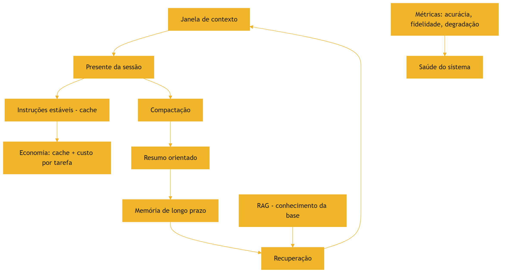

O diagrama mostra o ciclo completo: a janela, a compactação, a memória, a recuperação e as métricas [1][3][7][13].

### 3.3 O Antes e o Depois na Prática

**Antes**: o agente sem memória recomeça do zero a cada sessão, sem cache (caro) e sem métricas (cego) [7][13]. **Depois**: o agente arquiva o que importa, recupera na sessão seguinte, cacheia o estável e mede a saúde [7][13][20]. A mesma aplicação, com o ambiente informacional completo, custa menos e acerta mais [1][13].

## 4. Técnica

### 4.1 O Armazenador de Memória de Longo Prazo

O primeiro instrumento implementa a memória de longo prazo: armazenar fatos e recuperá-los por relevância [7][3]. O código abaixo é a versão didática [7]:

```python
class MemoriaLongoPrazo:
    """Armazena fatos da sessão e os recupera por palavras-chave."""

    def __init__(self):
        self.fatos = []  # lista de dicts {texto, tags}

    def lembrar(self, texto: str, tags: list) -> None:
        self.fatos.append({"texto": texto, "tags": tags})

    def recordar(self, consulta: str, k: int = 3) -> list:
        termos = set(consulta.lower().split())
        pontuados = []
        for fato in self.fatos:
            termos_fato = set(fato["texto"].lower().split()) | set(fato["tags"])
            pontos = len(termos & termos_fato)
            if pontos > 0:
                pontuados.append((pontos, fato["texto"]))
        pontuados.sort(key=lambda x: x[0], reverse=True)
        return [t for _, t in pontuados[:k]]


if __name__ == "__main__":
    m = MemoriaLongoPrazo()
    m.lembrar("O usuário prefere relatórios em formato JSON.", ["preferencia", "formato"])
    m.lembrar("O orçamento do projeto é R$ 2,4 milhões.", ["orçamento", "dado"])
    print(m.recordar("qual o orçamento?", k=2))
```

A memória materializa a persistência: os fatos sobrevivem à sessão e voltam por recuperação [7].

### 4.2 O Medidor de Custo por Tarefa

O segundo instrumento implementa a métrica econômica central: o custo por tarefa concluída [13][1]. O código abaixo agrega as chamadas de uma tarefa [13]:

```python
def custo_por_tarefa(chamadas: list, concluida: bool) -> dict:
    """Calcula o custo total e o custo por tarefa concluída."""
    custo_total = sum(c["custo"] for c in chamadas)
    retrabalho = sum(1 for c in chamadas if c.get("repetida"))
    return {
        "custo_total": round(custo_total, 4),
        "num_chamadas": len(chamadas),
        "retrabalho": retrabalho,
        "concluida": concluida,
        "custo_efetivo": round(custo_total, 4) if concluida else None,
        "nota": "Concluída sem retrabalho" if concluida and retrabalho == 0
                else "Com retrabalho ou incompleta",
    }


if __name__ == "__main__":
    tarefa_boa = [
        {"custo": 0.05}, {"custo": 0.03}, {"custo": 0.02},
    ]
    tarefa_poluida = [
        {"custo": 0.04, "repetida": True},
        {"custo": 0.04, "repetida": True},
        {"custo": 0.04, "repetida": True},
        {"custo": 0.06},
    ]
    print("Curada:", custo_por_tarefa(tarefa_boa, concluida=True))
    print("Poluída:", custo_por_tarefa(tarefa_poluida, concluida=True))
```

O medidor materializa a tese: a tarefa com contexto curado custa menos que a poluída com retrabalho [13][1].

### 4.3 O Simulador de Cache

O terceiro instrumento simula o benefício do cache de contexto [13]. O código abaixo compara o custo com e sem reutilização do prefixo estável [13]:

```python
def simular_cache(prefixo_tokens: int, chamadas: list, preco_token: float) -> dict:
    """Compara o custo de uma sessão com e sem cache do prefixo."""
    custo_sem_cache = 0
    custo_com_cache = 0
    for chamada in chamadas:
        tokens = chamada["tokens"]
        custo_sem_cache += (prefixo_tokens + tokens) * preco_token
        # Com cache: o prefixo é cobrado uma vez; as demais só pagam o novo.
        custo_com_cache += tokens * preco_token
    custo_com_cache += prefixo_tokens * preco_token  # primeira chamada
    economia = (custo_sem_cache - custo_com_cache) / custo_sem_cache
    return {
        "custo_sem_cache": round(custo_sem_cache, 4),
        "custo_com_cache": round(custo_com_cache, 4),
        "economia_pct": round(economia * 100, 1),
    }


if __name__ == "__main__":
    chamadas = [{"tokens": 500} for _ in range(10)]
    print(simular_cache(prefixo_tokens=2000, chamadas=chamadas,
                        preco_token=0.00001))
```

O simulador materializa a economia do cache: quanto mais estável o prefixo, maior a economia [13].

## 5. Aplica

### 5.1 Onde Isso Vive no Mundo Real

A memória e o cache estão em toda aplicação madura [7][13]. Assistentes que lembram preferências entre sessões [7]. Sistemas que cacheiam o prompt de sistema para cortar custo [13]. Agentes que arquivam decisões e as recuperam [7]. O LangChain documenta a memória como parte da orquestração [15]. Em cada caso, a persistência e a economia são o que sustentam o sistema no longo prazo [7][13].

### 5.2 O Erro Comum do Iniciante

O erro mais comum é não ter memória: cada sessão recomeça do zero, e o usuário repete contexto toda vez [7]. O segundo é ignorar o cache: o prefixo estável é pago integralmente a cada chamada — um imposto silencioso [13]. O terceiro é não medir: sem custo por tarefa e sem monitor de degradação, o sistema opera cego [20]. Os três erros têm o mesmo remédio: persistência, cache e métricas [7][13][20].

### 5.3 O Padrão Profissional em 2026

O padrão profissional integra todas as peças [1][7][13]. A memória de longo prazo é versionada e recuperável [7]. O cache é usado deliberadamente [13]. O custo por tarefa é medido [13]. A degradação é monitorada [20]. O diagnóstico é contínuo [1]. E as métricas — acurácia, fidelidade, custo, degradação — orientam cada decisão de contexto [12][20]. O resultado é o ambiente informacional completo: da janela à memória, com economia e saúde [1].

### 5.4 Exercício de Fixação

Desenhe a memória do seu agente: o que persiste, como é armazenado e como é recuperado [7]. Simule o benefício do cache para o seu prompt de sistema [13]. Implemente o medidor de custo por tarefa e o monitor de degradação [13][20]. Meça a saúde do seu sistema e proponha melhorias [20][1].

### 5.5 O Ciclo de Vida da Memória: Escrever, Recuperar, Esquecer

A memória de longo prazo tem um ciclo de vida — e o engenheiro o gerencia [7][1]. O primeiro estágio é o **escrever** (recordar): o que entra na memória — as decisões, os fatos, as preferências [7]. O critério de escrita é o mesmo da compactação: o que vale além da sessão [7][1]. O segundo estágio é o **recuperar**: o que volta à janela quando necessário [7]. A recuperação da memória usa o mesmo mecanismo do Capítulo 9 [3][7]. O terceiro estágio é o **esquecer** (decair): a memória que perde relevância é depreciada ou removida [7]. A memória sem esquecimento acumula lixo — a versão da memória do context rot [7][2].

O gerenciamento do ciclo de vida inclui a **atualização**: quando um fato muda, a memória é corrigida [7][1]. A memória desatualizada é um distrator em potencial (Capítulo 3) [2][7]. O registro da atualização mantém a trilha — quando o fato foi escrito, atualizado e por quê [1][7].

O ciclo de vida é a disciplina que impede a memória de virar depósito [7][1]. O engenheiro que escreve sem critério, recupera sem necessidade e nunca esquece constrói uma memória poluída — que degrada o sistema [7][2]. O que gerencia o ciclo constrói uma memória viva e confiável [7][1].

### 5.6 O Cache na Prática: Padrões de Uso

O cache de contexto tem padrões de uso que o engenheiro aplica deliberadamente [13][1]. O primeiro padrão é o **prefixo estável longo**: o prompt de sistema e as políticas formam um prefixo que se repete em todas as chamadas — o candidato ideal ao cache [13]. O design do Write (Capítulo 5) que coloca o estável no início maximiza o benefício do cache [1][13]. O segundo padrão é o **cache de sessão**: dentro de uma sessão, o contexto acumulado é cacheado entre chamadas [13].

O terceiro padrão é o **cache de recuperação**: os trechos recuperados por consultas repetidas (Capítulo 9) são cacheados [13][1]. O quarto é o **invalidação do cache**: quando o conteúdo muda — nova política, novo documento — o cache é invalidado [1][13]. O cache desatualizado é um risco: responde com conteúdo antigo [13][1].

O quinto padrão é a **medição do benefício**: o simulador da seção 4.3 roda na operação real, e o benefício do cache é reportado [13]. O engenheiro que mede o cache sabe o quanto economiza — e onde o cache não ajuda [13][1]. O cache é a ponte entre a qualidade do contexto e o custo da operação: bem usado, corta o custo sem cortar a qualidade [13][1].

### 5.7 A Governança do Contexto como Ativo

O contexto, a memória e o cache são ativos de produção — e ativos exigem governança [1][15]. O primeiro pilar da governança é a **propriedade**: cada bloco de contexto tem um dono responsável pela sua qualidade [1][15]. O prompt de sistema tem dono; a base de conhecimento tem dono; a memória do usuário tem dono [1][15]. O segundo pilar é o **versionamento**: o contexto é versionado como código — cada alteração registrada com motivo [1][15].

O terceiro pilar é a **auditoria**: revisões periódicas verificam que o contexto corresponde à intenção e que as políticas são respeitadas [1][12]. O quarto é a **segurança**: o contexto contém dados sensíveis — o acesso é controlado e a proteção é monitorada [1][21]. O Model Context Protocol documenta o contexto como integração que exige segurança [21].

O quinto pilar é a **medição contínua**: as métricas da seção 2.6 são monitoradas — acurácia, fidelidade, custo, degradação [1][12][20]. A governança do contexto transforma o ambiente informacional de prática de equipe em capacidade institucional [1][15]. A Parte III da série (harness) constrói a governança completa; este capítulo estabelece os princípios [1][15].

### 5.8 O Estudo de Caso do Sistema que Escalou

O estudo de caso fecha o capítulo e a Parte II [1][7][13]. O cenário: um assistente que começou pequeno — contexto simples, sem memória, sem cache [1]. O protótipo funcionava para poucos usuários [1]. O crescimento revelou os limites: o custo por chamada subiu, as sessões longas degradaram e os usuários repetiam contexto a cada sessão [2][13][7].

A equipe aplicou as disciplinas da Parte II [1][7][13]. O Write e o Select enxugaram o contexto [1]. A compressão manteve as sessões saudáveis [7]. O isolamento dividiu o trabalho complexo [1]. O RAG trouxe conhecimento sob demanda [3]. A memória eliminou a repetição de contexto [7]. O cache cortou o custo [13]. As métricas monitoraram a saúde [12][20].

O resultado: o mesmo serviço, com mais usuários, custo menor e qualidade estável [1][13]. O caso demonstra a tese da Parte II: o ambiente informacional bem projetado é o que permite o sistema crescer [1]. E prepara a Parte III: com o contexto dominado, o próximo passo é a camada de harness — a automação e a governança dos agentes [1][19].

### 5.9 A Memória e a Privacidade

A memória de longo prazo armazena dados do usuário — e isso a torna um ativo de privacidade [7][21]. O primeiro princípio é o **consentimento e transparência**: o usuário sabe o que é lembrado e pode controlar [7][21]. O segundo é o **minimização**: a memória armazena o mínimo necessário — nada além [7][21]. O terceiro é o **direito ao esquecimento**: o usuário pode apagar a memória — e o apagamento é efetivo [7][21].

O quarto princípio é o **isolamento da memória**: a memória de um usuário não vaza para outro (Capítulo 7, seção 5.8) [7][1][21]. O quinto é o **registro de acesso**: quem acessou qual memória, quando [1][21]. O Model Context Protocol documenta o contexto como integração que exige proteção de dados [21].

A memória com privacidade é a diferença entre um assistente confiável e um risco regulatório [7][21]. O engenheiro que desenha a memória sem privacidade constrói uma armadilha; o que a desenha com privacidade constrói confiança [7][21]. A governança da memória (seção 5.7) inclui a privacidade como requisito de primeira classe [7][21].

### 5.10 O Estudo de Caso do Assistente que Lembrava Demais

O estudo de caso mostra o ciclo de vida da memória em produção [7][1]. O cenário: um assistente pessoal que memorizava tudo — preferências, dados, conversas [7]. O sintoma: a memória cresceu sem controle; respostas começaram a citar informações desatualizadas do usuário [7][2]. A memória virou um depósito — a versão da memória do context rot [7][2].

O diagnóstico (Capítulo 8): a memória não tinha ciclo de vida — nada era atualizado ou esquecido [7][1]. O teste: a inspeção da memória revelou fatos antigos e contraditórios [7]. O tratamento: o ciclo de vida (seção 5.5) foi implementado — critérios de escrita, atualização, depreciação e apagamento [7].

O resultado: a memória ficou enxuta e confiável [7]. O caso demonstra o tema do capítulo: lembrar tudo é esquecer com precisão zero [7][2]. A memória gerida é a que serve — e a que serve é a que o ciclo de vida mantém viva [7][1].

### 5.11 A Lista de Verificação da Memória, Cache e Métricas

A lista de verificação consolida o capítulo e a Parte II [1][7][13]. O primeiro item: a memória de longo prazo tem ciclo de vida (escrever, recuperar, esquecer)? [7]. O segundo: a memória respeita a privacidade? [7][21]. O terceiro: o cache é usado para o prefixo estável? [13]. O quarto: o cache é invalidado quando o conteúdo muda? [1][13].

O quinto item: o custo por tarefa concluída é medido? [13][1]. O sexto: a degradação ao longo da sessão é monitorada? [20][2]. O sétimo: a acurácia e a fidelidade são avaliadas? [1][12]. O oitavo: o contexto é governado como ativo (dono, versão, auditoria)? [1][15].

A lista é o resumo operacional da Parte II inteira [1][7][13]. O engenheiro que a percorre fecha o ciclo completo: da janela à memória, da qualidade ao custo [1][7][13]. A Parte II cumpre a promessa — e o engenheiro que a domina está pronto para a camada de harness [1][19].

### 5.12 As Métricas em Diferentes Fases do Ciclo de Vida

As métricas do contexto não são usadas da mesma forma em todas as fases [1][12]. Na fase de **desenvolvimento**, as métricas orientam o design: a acurácia no conjunto de avaliação decide o template, a seleção e a composição [1][12]. Na fase de **teste**, as métricas validam: o sistema candidato é comparado com a linha de base — custo, acurácia, degradação [1][12]. Na fase de **produção**, as métricas monitoram: a degradação contínua é a saúde do sistema [20].

Na fase de **incidente**, as métricas diagnosticam: a queda de acurácia e o custo de retrabalho revelam a classe da falha (Capítulo 8) [1][2]. Na fase de **evolução**, as métricas decidem: a comparação entre políticas — mais contexto, mais recuperação, mais memória — orienta o investimento [1][13].

O ciclo de vida das métricas é o fechamento da disciplina [1][12]. O engenheiro que mede em todas as fases constrói um sistema que aprende [1][12]. O que mede apenas em produção descobre os problemas tarde [20]. A medição contínua é o que transforma a engenharia de contexto de projeto em operação [1][12].

### 5.13 O Estudo de Caso do Crescimento Sem Métricas

O estudo de caso mostra o custo da ausência de métricas [1][13]. O cenário: um assistente que cresceu em uso sem instrumentação [1]. O sintoma: o custo da operação subiu 60% sem que a equipe soubesse o motivo [13]. A equipe suspeitava do modelo — o modelo caro era o suspeito natural [1][13].

O diagnóstico: sem métricas, o suspeito foi escolhido pela intuição [1][13]. A instrumentação revelou a verdade: o contexto estava inflado — o prompt de sistema havia crescido, a memória acumulava e o cache não era usado [1][13][7]. O custo subiu porque cada chamada carregava mais tokens, não porque o modelo era caro [13].

O tratamento: o Write enxugou o prompt; o cache passou a cobrir o prefixo estável; a memória ganhou ciclo de vida [1][13][7]. O custo caiu 40% [13]. O caso demonstra o tema do capítulo: sem métricas, a equipe trata o sintoma errado [1][13]. Com métricas, o custo vira um problema de contexto — resolvível [13][1].

### 5.14 A Síntese Final da Parte II

A Parte II se encerra com a síntese do que foi construído [1][7][13]. O ambiente informacional é o objeto [1]. A janela é o palco [8]. A degradação — context rot e lost in the middle — é o risco [2][5]. O framework write/select/compress/isolate é o método [1][6][7]. O diagnóstico é a manutenção [1]. O RAG é o abastecimento [3]. A memória é a persistência [7]. A economia é a viabilidade [13].

O engenheiro de contexto projeta o ambiente inteiro — não apenas a mensagem [1]. A promessa da Parte II — de ~30% a ~90% de acerto — é a soma das disciplinas [1][12]. E a transição para a Parte III é natural: com o ambiente informacional dominado, o próximo passo é o harness — a camada que automatiza, governa e verifica o agente inteiro [1][19].

O leitor que chega ao fim desta Parte II projeta o ambiente informacional de um agente — o salto que o título do livro prometeu [1][19].

### 5.15 A Relação entre Contexto e Harness

A Parte III da série constrói a camada de harness — e a Parte II, este livro, é a sua fundação [1][19]. O harness é a camada que automatiza, governa e verifica o agente inteiro [1][19]. O contexto é o material que o harness gerencia [1]. A primeira relação é a **instrumentação**: o harness consome as métricas do Capítulo 10 — acurácia, custo, degradação — para decidir [1][12][20]. A segunda é a **verificação**: o harness aplica, em escala, o diagnóstico do Capítulo 8 [1].

A terceira é a **governança**: o harness executa, em produção, a governança do Capítulo 10 — propriedade, versão, auditoria [1][15]. A quarta é a **automação da curadoria**: o harness automatiza o write/select/compress/isolate — a curadoria manual vira política configurável [1][6][7].

O engenheiro que domina a Parte II entrega ao harness um sistema saudável para governar [1]. O que pula a Parte II entrega ao harness um sistema doente — e o harness automatiza a doença [1][2]. A ordem da série é deliberada: primeiro o contexto, depois o harness [1][19].

### 5.16 O Estudo de Caso da Escala

O estudo de caso final mostra a Parte II em escala [1][7][13]. O cenário: um serviço que passou de centenas para dezenas de milhares de chamadas diárias [1][13]. O sintoma: o custo disparou e a qualidade caiu [2][13]. O protótipo — contexto simples, sem memória, sem métricas — não escalava [1][2].

O tratamento: a aplicação completa da Parte II [1][7][13]. O Write e o Select enxugaram o contexto [1][6]. A compressão manteve as sessões saudáveis [7]. O isolamento dividiu o trabalho [1]. O RAG trouxe conhecimento sob demanda [3]. A memória eliminou a repetição [7]. O cache cortou o custo [13]. As métricas monitoraram a saúde [12][20].

O resultado: o serviço escalou com custo controlado e qualidade estável [1][13]. O caso é a demonstração da tese da Parte II: o ambiente informacional bem projetado é o que permite o crescimento [1]. E é a transição para a Parte III: o harness governa o sistema que a Parte II construiu [1][19].

### 5.17 A Mensagem Final da Parte II

A Parte II se encerra com a mensagem que o título carrega [1][19]. O fim do prompt solto é o início da engenharia de contexto [1][19]. O engenheiro que projeta o ambiente informacional — a janela, a degradação, o framework, o diagnóstico, a recuperação, a memória e a economia — opera acima da média do mercado de 2026 [1][19].

A disciplina é a soma das Partes: a Parte I ensinou a mensagem; a Parte II ensinou o ambiente; a Parte III ensinará o sistema autônomo [1][19]. O leitor que conclui a Parte II está pronto para a subida [1][19]. A pilha continua a se empilhar [1][19].

### 5.18 O Custo da Memória e do Cache

A memória e o cache têm custos próprios que o engenheiro dimensiona [7][13]. A memória custa no armazenamento e na recuperação: cada fato persistido ocupa espaço, e cada recuperação consome tokens [7][13]. O cache custa na invalidação: quando o conteúdo muda, o cache antigo é descartado — e o custo do descarte é real [13][1]. O equilíbrio é o tema do capítulo: memória útil, cache eficiente [7][13].

O primeiro princípio do custo é a **seletividade da memória**: persistir apenas o que tem valor de longo prazo — o critério do ciclo de vida (seção 5.5) [7][1]. O segundo é a **medição do cache**: o benefício do cache é medido — a economia por sessão, por tarefa [13]. O terceiro é a **auditoria de custo total**: o custo da memória mais o cache mais o contexto — o custo do ambiente completo por tarefa concluída [1][13].

O engenheiro que mede o custo total do ambiente evita duas falhas opostas [1][13]: a economia falsa (sem memória, o usuário repete contexto — custo escondido) e o luxo inútil (memória e cache além do necessário) [1][13]. O custo do ambiente é a métrica final da Parte II [1][13].

### 5.19 O Fechamento do Capítulo

O capítulo final da Parte II se encerra com a consolidação completa [1][7][13]. A memória persiste; o cache economiza; as métricas medem; a governança administra; a privacidade protege [7][13][15][21]. O ambiente informacional está completo [1].

O engenheiro que domina o capítulo — e a Parte II inteira — projeta o ambiente informacional de um agente, não apenas a mensagem [1][19]. A promessa de ~30% a ~90% é a soma das disciplinas [1][12]. E a Parte III aguarda: a camada de harness, onde o contexto se torna parte de sistemas autônomos governados [1][19].

### 5.20 O Contexto em Produção e o Método de Revisão Autônoma

A Parte II encerra com a conexão que a série prometeu: o contexto é a matéria-prima da revisão autônoma [1][19]. O método de revisão autônoma entre harness — anunciado no projeto editorial — depende do ambiente informacional completo [1][19]. A revisão precisa de três coisas que a Parte II construiu [1]: o histórico preservado (compressão, Capítulo 6), as evidências recuperáveis (RAG, Capítulo 9) e as métricas de julgamento (este capítulo) [1][7][3][12].

A primeira implicação é a **revisão sobre o resumo**: o harness revisor consome o resumo orientado que a compactação produziu [1][7]. A segunda é a **revisão com evidências**: o revisor recupera as fontes pelo RAG — e julga com base nelas [1][3]. A terceira é a **revisão com métricas**: o revisor usa as métricas deste capítulo — acurácia, fidelidade, custo — como critérios objetivos [1][12].

O engenheiro que domina a Parte II entrega ao harness o sistema governável [1][19]. A Parte III construirá o harness; este capítulo fecha a fundação [1][19]. A pilha continua a se empilhar — do prompt ao contexto, do contexto ao harness [1][19].

### 5.21 O Fechamento do Capítulo e da Parte II

A Parte II se encerra com a consolidação completa do ambiente informacional [1][7][13]. A janela é o palco [8]. A degradação é o risco [2][5]. O framework é o método [1][6][7]. O diagnóstico é a manutenção [1]. O RAG é o abastecimento [3]. A memória é a persistência [7]. A economia é a viabilidade [13]. A privacidade é a responsabilidade [7][21].

O engenheiro que domina a Parte II projeta o ambiente informacional de um agente — não apenas a mensagem [1][19]. O salto de ~30% a ~90% é a soma das disciplinas [1][12]. O leitor que conclui esta Parte II está pronto para a camada de harness: a autonomia, a execução e a governança dos sistemas de IA em produção [1][19]. A jornada da série continua [1][19].

### 5.22 O Panorama: o Engenheiro de Contexto em 2026

O capítulo final fecha com o panorama profissional [1][19]. O engenheiro de contexto de 2026 é o profissional que a indústria mais valoriza e mais carece [1][19]. O mercado trata a prompt engineering como o teto da disciplina — e o engenheiro de contexto opera acima do teto [1][19]. As competências do panorama são as deste livro [1]: projetar o ambiente informacional (Parte II), medir a degradação (Capítulos 3-4), aplicar o framework (Capítulos 5-7), diagnosticar (Capítulo 8), recuperar conhecimento (Capítulo 9) e gerir memória e economia (Capítulo 10) [1].

A primeira característica do profissional é a **medição**: ele mede acurácia, custo, degradação e fidelidade — e decide com dados [1][12]. A segunda é a **arquitetura**: ele pensa em sistemas — janela, fontes, subagentes — não em mensagens [1]. A terceira é a **curadoria**: ele seleciona, comprime e isola com intenção [1][6][7]. A quarta é o **diagnóstico**: ele classifica a falha antes de tratá-la [1][2]. A quinta é a **governança**: ele trata o contexto como ativo com dono, versão e auditoria [1][15].

O panorama é a síntese do livro inteiro: a engenharia de contexto não é uma técnica — é um perfil profissional [1][19]. O leitor que dominou a Parte II tem o perfil [1][19]. A Parte III — a camada de harness — completará o perfil: a autonomia, a execução e a governança [1][19]. A jornada da série continua — e a pilha continua a se empilhar [1][19].

## 6. Conclusão

Este capítulo fecha a Parte II com a síntese do ambiente informacional [1][7]. A memória de longo prazo persiste o que importa; a recuperação traz o conhecimento de volta; o cache e as métricas tornam tudo viável [7][13][12]. O salto de ~30% a ~90% de acerto — a promessa da Parte II — é a soma de todas as disciplinas: seleção, compressão, isolamento, diagnóstico, recuperação, memória e economia [1][12]. O engenheiro de contexto projeta esse sistema completo, medido e saudável [1][20]. A Parte III da série sobe a pilha: a camada de harness, onde o contexto e o prompt se tornam parte de sistemas autônomos governados [19][1].

## 7. Referências

[1] ANTHROPIC. Effective context engineering for AI agents. Anthropic Engineering Blog, set. 2025. Disponível em: https://www.anthropic.com/engineering/effective-context-engineering-for-ai-agents. Acesso em: 5 ago. 2026.
[2] HONG, Kelly; TROYNIKOV, Anton; HUBER, Jeff. Context Rot: How Increasing Input Tokens Impacts LLM Performance. Chroma Technical Report, jul. 2025. Disponível em: https://www.trychroma.com/research/context-rot. Acesso em: 5 ago. 2026.
[3] LEWIS, Patrick et al. Retrieval-Augmented Generation for Knowledge-Intensive NLP Tasks. In: Advances in Neural Information Processing Systems (NeurIPS), v. 33, p. 9459–9474, 2020. Disponível em: https://arxiv.org/abs/2005.11401. Acesso em: 5 ago. 2026.
[4] GAO, Yunfan et al. Retrieval-Augmented Generation for Large Language Models: A Survey. arXiv:2312.10997, mar. 2024. Disponível em: https://arxiv.org/abs/2312.10997. Acesso em: 5 ago. 2026.
[5] LIU, Nelson F. et al. Lost in the Middle: How Language Models Use Long Contexts. Transactions of the Association for Computational Linguistics (TACL), v. 12, p. 157–173, 2024. Disponível em: https://arxiv.org/abs/2307.03172. Acesso em: 5 ago. 2026.
[6] ANTHROPIC. Writing tools for AI agents — using AI agents. Anthropic Engineering Blog, set. 2025. Disponível em: https://www.anthropic.com/engineering/writing-tools-for-agents. Acesso em: 5 ago. 2026.
[7] ANTHROPIC. Context engineering: memory, compaction, and tool clearing. Claude Platform Cookbook, mar. 2026. Disponível em: https://platform.claude.com/cookbook/tool-use-context-engineering-context-engineering-tools. Acesso em: 5 ago. 2026.
[8] ZHAO, Wayne Xin et al. A Survey of Large Language Models. arXiv:2303.18223, 2023. Disponível em: https://arxiv.org/abs/2303.18223. Acesso em: 5 ago. 2026.
[9] CHROMA. Context Rot: Evaluation Toolkit. GitHub Repository, 2025. Disponível em: https://github.com/chroma-core/context-rot. Acesso em: 5 ago. 2026.
[10] LIU, Nelson F. Lost in the Middle: Replication Repository. GitHub Repository, 2023. Disponível em: https://github.com/nelson-liu/lost-in-the-middle. Acesso em: 5 ago. 2026.
[11] CHEN, Jiawei et al. LongRAG: Enhancing Retrieval-Augmented Generation with Long-context LLMs. arXiv:2406.15319, 2024. Disponível em: https://arxiv.org/abs/2406.15319. Acesso em: 5 ago. 2026.
[12] ASIA, Research Group et al. Retrieval-Augmented Generation Evaluation in the Era of Large Language Models: A Comprehensive Survey. ResearchGate / arXiv, abr. 2025. Disponível em: https://www.researchgate.net/publication/390991356. Acesso em: 5 ago. 2026.
[13] OPENAI. GPT-4 Technical Report & Developer Guides on Context Management. OpenAI Documentation, 2024–2025. Disponível em: https://openai.com/index/gpt-4-research/. Acesso em: 5 ago. 2026.
[14] GOOGLE CLOUD. What is Retrieval-Augmented Generation (RAG)?. Google Cloud Architecture Center, 2025. Disponível em: https://cloud.google.com/use-cases/retrieval-augmented-generation. Acesso em: 5 ago. 2026.
[15] LANGCHAIN. LangChain Agents & Context Management Documentation. LangChain Guides, 2025–2026. Disponível em: https://python.langchain.com/docs/concepts/agents/. Acesso em: 5 ago. 2026.
[16] WANG, Zhen et al. Agentic Retrieval-Augmented Generation: A Survey on Agentic RAG. arXiv:2408.12999, 2024. Disponível em: https://arxiv.org/abs/2408.12999. Acesso em: 5 ago. 2026.
[17] XIAO, Guangxuan et al. Efficient Streaming Language Models with Attention Sinks. arXiv:2309.17453, 2023. Disponível em: https://arxiv.org/abs/2309.17453. Acesso em: 5 ago. 2026.
[18] RODIN, Alex et al. Found in the Middle: Overcoming Long-Context Vulnerabilities in LLMs. arXiv:2403.04797, 2024. Disponível em: https://arxiv.org/abs/2403.04797. Acesso em: 5 ago. 2026.
[19] MEDIUM (Data Science Collective). Context Is the New Prompt: Why Context Engineering Is Shaping the Future of AI. Medium Article, 2025. Disponível em: https://medium.com/data-science-collective/context-is-the-new-prompt-why-context-engineering-is-shaping-the-future-of-ai-46eb062ed270. Acesso em: 5 ago. 2026.
[20] ZENML. Context Rot: Evaluating LLM Performance Degradation with Increasing Input Tokens. MLOps Database, 2025. Disponível em: https://www.zenml.io/llmops-database/context-rot-evaluating-llm-performance-degradation-with-increasing-input-tokens. Acesso em: 5 ago. 2026.
[21] MODEL CONTEXT PROTOCOL (MCP). Open Standard for AI Agent Context Integration. Anthropic & Ecosystem Specs, 2025–2026. Disponível em: https://modelcontextprotocol.io/. Acesso em: 5 ago. 2026.

# Capítulo 11: Janelas longas na prática: quando 200 mil tokens ajudam e quando atrapalham

## 1. Introdução

No capítulo anterior, você viu a curadoria do contexto como o coração da disciplina — e a métrica de sucesso que a indústria mede: de 30% a 90% de acerto apenas com contexto bem curado [8]. Este capítulo mergulha na ferramenta que tornou essa mudança possível: as janelas longas. Quando o modelo aceita 200 mil tokens ou mais, a tentação é jogar tudo para dentro — e é exatamente aí que mora o perigo [1].

Este capítulo tem três objetivos. Primeiro, entender o que uma janela longa realmente faz e onde ela falha [1][2]. Segundo, dominar as técnicas de mitigação: seleção, compactação e o desenho da hierarquia de atenção [9]. Terceiro, decidir quando a janela longa resolve o problema e quando o RAG — ou uma arquitetura híbrida — é a resposta certa [15].

## 2. Explica

### 2.1 O que uma janela longa faz de verdade

Janelas longas permitem que o modelo processe documentos inteiros de uma vez — manuais, repositórios, históricos de conversa [10]. O benefício é real: menos fatiamento, menos contexto perdido entre chamadas [10]. Mas a janela não é memória infinita: é uma superfície de atenção com competição [2]. A pesquisa mostra que os modelos degradam em tarefas que exigem informação no meio do contexto — o fenômeno do lost in the middle [2].

### 2.2 Context rot: o custo do excesso

O context rot é a queda de desempenho medida conforme o contexto cresce: mais tokens, mais degradação, mesmo sem limite técnico aparente [1]. Os estudos documentam a curva em tarefas de recuperação e raciocínio: o ponto ótimo existe, e ele é menor do que a janela [1]. A versão replicável do experimento — com datasets e avaliação — permite que cada equipe meça o ponto ótimo do seu próprio caso [5][6].

### 2.3 Lost in the middle e a hierarquia de atenção

O lost in the middle mostra que a posição importa: o modelo lembra melhor do começo e do fim do contexto, e pior do meio [2]. O estudo original — e sua réplica — confirmam o padrão em múltiplos modelos [2][7]. A resposta de engenharia: posicionar a informação crítica nas extremidades ou reestruturar o contexto para que o meio não carregue o que importa [2].

### 2.4 Atenção aos primeiros tokens: os attention sinks

Há um detalhe técnico que muda o desenho do contexto: os modelos concentram atenção desproporcional nos primeiros tokens — os chamados attention sinks [4]. Isso explica por que instruções críticas no início do contexto têm efeito desproporcional — e por que o design de contexto deve respeitar essa assimetria [4]. A descoberta orienta técnicas de streaming e compactação: manter os tokens-âncora mesmo quando o resto é resumido [4].

### 2.5 Compactação e memória: o meio-termo

Entre jogar tudo fora e jogar tudo dentro, existe a compactação: resumos periódicos, hierarquia de documentos e o descarte deliberado do que envelheceu [9]. A documentação prática da plataforma descreve os três modos — memória, compactação e limpeza de ferramentas — como alavancas complementares da mesma superfície [9]. A regra: o contexto é um orçamento, e a compactação é o controle de gastos [8].

### 2.6 A ponte para o RAG: quando a janela não basta

Quando o conhecimento é grande demais — ou muda com frequência — a janela longa sozinha não resolve [13]. O RAG recupera só o que é relevante e monta o contexto sob demanda [13]. A pesquisa evoluiu em três gerações: o RAG original com recuperação densa, o LongRAG que combina janela longa com recuperação e o RAG agêntico que decide quando recuperar [14][15]. A arquitetura híbrida vence: janela longa para o que é estável e pequeno, RAG para o que é grande e vivo [10].

## 3. Ilustra

### 3.1 A analogia da biblioteca e do fichário

Pense em um pesquisador numa biblioteca gigante. A janela longa é a mesa de estudos: dá para abrir muitos livros ao mesmo tempo — mas a mesa tem limite, e abrir livros demais faz o pesquisador esquecer o que leu nas primeiras páginas [2]. O bibliotecário (o RAG) traz apenas os capítulos relevantes para a mesa, na hora certa [13]. O pesquisador maduro não tenta carregar a biblioteca inteira para a mesa — ele sabe pedir o livro certo [1].

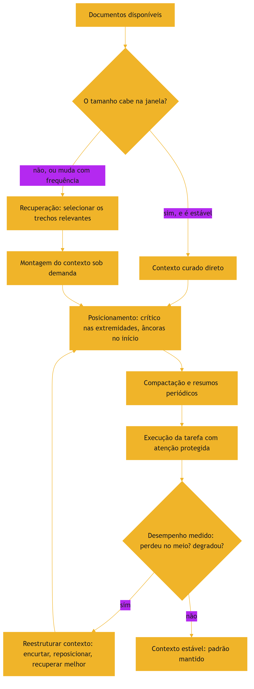

### 3.2 A mesa de estudos que se organiza sozinha

O ciclo mostra a disciplina em ação: medir o efeito, reestruturar e medir de novo [6]. Janela longa, posicionamento e RAG não são rivais — são ferramentas do mesmo arquiteto de contexto [10].

## 4. Técnica

### 4.1 Medindo o context rot no seu caso

O exemplo abaixo reproduz, de forma mínima, o experimento de context rot: a mesma pergunta com quantidades crescentes de contexto [1][6]:

```python
def medir_context_rot(modelo, pergunta, documentos, tamanhos):
    resultados = []
    for n in tamanhos:
        contexto = documentos[:n]
        respostas = [invocar_modelo(modelo, contexto, pergunta) for _ in range(5)]
        acertos = sum(1 for r in respostas if r == "correto")
        resultados.append((n, acertos / len(respostas)))
    return resultados


print(medir_context_rot("gpt-4o", "Qual é o limite?", docs, [500, 2000, 8000, 32000]))
```

A curva resultante mostra o ponto ótimo do seu caso — e ele quase nunca é o tamanho máximo da janela [1].

### 4.2 Posicionamento estratégico do contexto

O trecho abaixo organiza o contexto respeitando a assimetria de atenção: instruções e fatos críticos no início, detalhes no fim, e o meio reservado ao que menos importa [2][4]:

```python
def montar_contexto(instrucao, fatos_criticos, material_meio, conclusao):
    return "\n\n".join(
        [
            instrucao,
            "FATOS CRITICOS (devem orientar a resposta):",
            fatos_criticos,
            "MATERIAL DE APOIO:",
            material_meio,
            "OBSERVACAO FINAL:",
            conclusao,
        ]
    )
```

A estrutura não muda o conteúdo — muda a posição — e a posição decide o que o modelo usa [2].

### 4.3 Compactação periódica de histórico

Para fechar, um compactador simples que resume blocos antigos e mantém as âncoras [9]:

```python
def compactar_historico(historico, ultimos_manter=6, janela=8):
    if len(historico) <= janela:
        return historico
    recentes = historico[-ultimos_manter:]
    antigos = historico[:-ultimos_manter]
    resumo = invocar_modelo(
        "Resuma as decisões e fatos essenciais desta conversa:",
        contexto="\n".join(antigos),
    )
    return [f"[resumo anterior] {resumo}", *recentes]
```

A compactação troca fidelidade de detalhe por estabilidade de atenção — a troca certa quando o detalhe envelheceu [9].

## 5. Aplica

### 5.1 Onde isso vive no mundo real

Na prática, a disciplina de janela longa aparece em sistemas de agentes com histórico extenso, manuais grandes e repositórios inteiros [8]. As plataformas documentaram o caminho: janela longa para o caso simples, RAG para o conhecimento vivo, e a combinação para o caso real [10][12]. O benchmark da indústria já mede a degradação por posição — e os modelos seguem melhorando, mas a assimetria permanece [2][3].

### 5.2 O erro comum do iniciante

O erro clássico é usar a janela longa como desculpa para não curar contexto: "o modelo aceita 200 mil tokens, então manda tudo" [1]. O segundo erro é ignorar a posição: colocar o fato crítico no meio e se surpreender quando o modelo o esquece [2]. O caminho profissional é o ciclo deste capítulo: medir, posicionar, compactar e recuperar — sempre com a métrica na mão [6].

## 6. Conclusão

A janela longa é uma ferramenta poderosa e uma armadilha confortável [1]. Você aprendeu a medir o context rot, a respeitar a hierarquia de atenção, a compactar o que envelhece e a acionar o RAG quando o conhecimento é grande demais [1][2][9][15]. No próximo capítulo, você vai transformar essa teoria em diagnóstico: isolando, na prática, se a falha é do prompt, do contexto ou da recuperação [8].


## 7. Referências

[1] HONG, Kelly; TROYNIKOV, Anton; HUBER, Jeff. Context Rot: How Increasing Input Tokens Impacts LLM Performance. Chroma Technical Report, jul. 2025. Disponível em: https://www.trychroma.com/research/context-rot. Acesso em: 5 ago. 2026.
[2] LIU, Nelson F. et al. Lost in the Middle: How Language Models Use Long Contexts. Transactions of the Association for Computational Linguistics (TACL), v. 12, p. 157–173, 2024. Disponível em: https://arxiv.org/abs/2307.03172. Acesso em: 5 ago. 2026.
[3] RODIN, Alex et al. Found in the Middle: Overcoming Long-Context Vulnerabilities in LLMs. arXiv:2403.04797, 2024. Disponível em: https://arxiv.org/abs/2403.04797. Acesso em: 5 ago. 2026.
[4] XIAO, Guangxuan et al. Efficient Streaming Language Models with Attention Sinks. arXiv:2309.17453, 2023. Disponível em: https://arxiv.org/abs/2309.17453. Acesso em: 5 ago. 2026.
[5] CHROMA. Context Rot: Evaluation Toolkit. GitHub Repository, 2025. Disponível em: https://github.com/chroma-core/context-rot. Acesso em: 5 ago. 2026.
[6] ZENML. Context Rot: Evaluating LLM Performance Degradation with Increasing Input Tokens. MLOps Database, 2025. Disponível em: https://www.zenml.io/llmops-database/context-rot-evaluating-llm-performance-degradation-with-increasing-input-tokens. Acesso em: 5 ago. 2026.
[7] LIU, Nelson F. Lost in the Middle: Replication Repository. GitHub Repository, 2023. Disponível em: https://github.com/nelson-liu/lost-in-the-middle. Acesso em: 5 ago. 2026.
[8] ANTHROPIC. Effective context engineering for AI agents. Anthropic Engineering Blog, set. 2025. Disponível em: https://www.anthropic.com/engineering/effective-context-engineering-for-ai-agents. Acesso em: 5 ago. 2026.
[9] ANTHROPIC. Context engineering: memory, compaction, and tool clearing. Claude Platform Cookbook, mar. 2026. Disponível em: https://platform.claude.com/cookbook/tool-use-context-engineering-context-engineering-tools. Acesso em: 5 ago. 2026.
[10] MEDIUM (Data Science Collective). Context Is the New Prompt: Why Context Engineering Is Shaping the Future of AI. Medium Article, 2025. Disponível em: https://medium.com/data-science-collective/context-is-the-new-prompt-why-context-engineering-is-shaping-the-future-of-ai-46eb062ed270. Acesso em: 5 ago. 2026.
[11] OPENAI. GPT-4 Technical Report & Developer Guides on Context Management. OpenAI Documentation, 2024–2025. Disponível em: https://openai.com/index/gpt-4-research/. Acesso em: 5 ago. 2026.
[12] ZHAO, Wayne Xin et al. A Survey of Large Language Models. arXiv:2303.18223, 2023. Disponível em: https://arxiv.org/abs/2303.18223. Acesso em: 5 ago. 2026.
[13] CHEN, Jiawei et al. LongRAG: Enhancing Retrieval-Augmented Generation with Long-context LLMs. arXiv:2406.15319, 2024. Disponível em: https://arxiv.org/abs/2406.15319. Acesso em: 5 ago. 2026.
[14] GOOGLE CLOUD. What is Retrieval-Augmented Generation (RAG)?. Google Cloud Architecture Center, 2025. Disponível em: https://cloud.google.com/use-cases/retrieval-augmented-generation. Acesso em: 5 ago. 2026.
[15] LEWIS, Patrick et al. Retrieval-Augmented Generation for Knowledge-Intensive NLP Tasks. In: Advances in Neural Information Processing Systems (NeurIPS), v. 33, p. 9459–9474, 2020. Disponível em: https://arxiv.org/abs/2005.11401. Acesso em: 5 ago. 2026.
[16] GAO, Yunfan et al. Retrieval-Augmented Generation for Large Language Models: A Survey. arXiv:2312.10997, mar. 2024. Disponível em: https://arxiv.org/abs/2312.10997. Acesso em: 5 ago. 2026.
[17] WANG, Zhen et al. Agentic Retrieval-Augmented Generation: A Survey on Agentic RAG. arXiv:2408.12999, 2024. Disponível em: https://arxiv.org/abs/2408.12999. Acesso em: 5 ago. 2026.
[18] ANTHROPIC. Writing tools for AI agents — using AI agents. Anthropic Engineering Blog, set. 2025. Disponível em: https://www.anthropic.com/engineering/writing-tools-for-agents. Acesso em: 5 ago. 2026.
[19] ASIA, Research Group et al. Retrieval-Augmented Generation Evaluation in the Era of Large Language Models: A Comprehensive Survey. ResearchGate / arXiv, abr. 2025. Disponível em: https://www.researchgate.net/publication/390991356. Acesso em: 5 ago. 2026.
[20] LANGCHAIN. LangChain Agents & Context Management Documentation. LangChain Guides, 2025–2026. Disponível em: https://python.langchain.com/docs/concepts/agents/. Acesso em: 5 ago. 2026.

# Capítulo 12: Diagnóstico por camadas: isolando a falha entre prompt, contexto e recuperação

## 1. Introdução

No capítulo anterior, você aprendeu a explorar janelas longas sem cair no excesso [2]. Este capítulo fecha a parte prática da engenharia de contexto: o diagnóstico. Quando um sistema de IA falha, a primeira pergunta não é "qual o erro" — é "em qual camada está o erro": prompt, contexto ou recuperação [1]. Responder essa pergunta com método, em vez de chute, é o que separa o arquiteto de contexto do operador de chat [8].

Este capítulo tem três objetivos. Primeiro, construir o mapa de camadas e os sinais de falha de cada uma [1]. Segundo, dominar os experimentos de isolamento: variar uma camada por vez e medir [3]. Terceiro, conectar o diagnóstico ao desenho — porque a maioria das falhas de contexto é tratada com melhor contexto, e não com melhor prompt [1].

## 2. Explica

### 2.1 O mapa de camadas de um sistema de IA

Todo sistema de IA conversacional tem pelo menos três camadas que podem falhar: o prompt (instruções e formato), o contexto (o material que alimenta o modelo) e a recuperação (o mecanismo que busca esse material) [1]. A falha final é sempre uma resposta errada — mas a causa mora em uma das camadas [1]. O primeiro passo do diagnóstico é nomear a camada: a resposta é mal formatada (prompt), contradiz o material fornecido (contexto) ou cita algo que não estava lá (recuperação) [1].

### 2.2 O sinal de cada camada

Cada camada tem uma assinatura de falha. Falha de prompt: formato errado, tom errado, regras ignoradas — mas o conteúdo citado está correto [8]. Falha de contexto: o modelo omite ou contradiz informação que está no material — o sinal clássico de excesso ou má posição [2]. Falha de recuperação: a resposta parece confiante, mas se apoia em trechos irrelevantes ou incompletos — o modelo não tinha o que precisava [13]. Reconhecer a assinatura corta o tempo de diagnóstico pela metade [1].

### 2.3 O experimento de isolamento: uma variável por vez

A técnica central do diagnóstico é o experimento controlado: mudar uma camada, manter as outras, medir [1]. Para testar o prompt, mantenha o contexto fixo e varie as instruções [8]. Para testar o contexto, mantenha o prompt fixo e varie o material [3]. Para testar a recuperação, inspecione o que foi recuperado: as entradas do RAG antes da resposta [13]. O resultado de cada variação aponta a camada culpada [1].

### 2.4 A réplica de "lost in the middle" como ferramenta de equipe

A pesquisa de lost in the middle deixou um legado prático: um experimento replicável que qualquer equipe pode rodar no próprio modelo [7]. A versão publicada — e sua avaliação replicável — mostra como medir a degradação por posição com um conjunto mínimo de casos [5][7]. Rodar esse experimento no seu domínio responde a pergunta que o chute não responde: seu modelo piora no meio do contexto? [2].

### 2.5 Da recuperação ao contexto: o elo mais frágil

A recuperação é onde o contexto nasce — e onde a maioria dos defeitos de contexto começa [13]. Um retriever que devolve trechos errados produz um contexto "correto" que induz a resposta errada [13]. A prática de avaliação de RAG separa as duas falhas: a do retriever (recuperou o certo?) e a do gerador (usou o que recuperou?) [17]. Esse vocabulário de avaliação é a ponte para o Livro 10, onde evals automatizadas assumem o trabalho [17].

### 2.6 Quando o problema não é nenhuma das três

Há falhas que o diagnóstico de camadas não resolve porque não são de contexto: a alucinação de conhecimento — o modelo inventa o que nenhuma camada forneceu [10]. A mitigação é arquitetural: ferramentas, verificação e restrição de escopo [1]. E há o caso do modelo desatualizado: o conhecimento correto não existe em lugar nenhum do sistema [10]. Nomear esses casos é parte do diagnóstico: nem toda resposta errada é um problema de contexto [1].

## 3. Ilustra

### 3.1 A analogia do médico e o diagnóstico diferencial

Pense no médico que recebe um paciente com febre. Ele não receita antibiótico imediatamente: levanta hipóteses — infecção, inflamação, reação — e pede exames que separam uma da outra [8]. O diagnóstico diferencial funciona assim: cada exame (experimento) elimina hipóteses até sobrar a causa. O engenheiro de contexto é esse médico: a resposta errada é a febre, e o exame é a variação controlada de uma camada por vez [1].

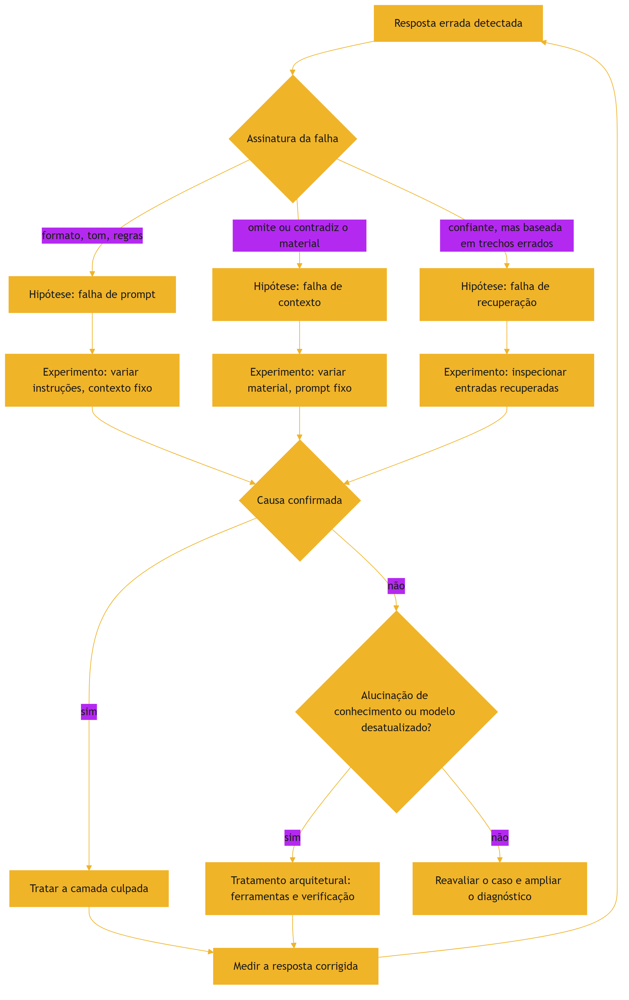

### 3.2 O médico que documenta o caso

A disciplina final: cada diagnóstico vira um caso no golden set — o paciente curado vira aula [8]. É assim que o sistema melhora com o tempo, e é exatamente o ciclo que o Livro 10 automatizará [17].

## 4. Técnica

### 4.1 Um detector de assinaturas de falha

O trecho abaixo automatiza a primeira triagem: classificar a resposta errada pela assinatura [1][8]:

```python
def classificar_falha(pergunta, resposta, contexto_fornecido):
    if "resposta_mal_formatada" in resposta or resposta.count("\n") > 12:
        return "provável falha de prompt"
    if contexto_fornecido and not any(trecho in resposta for trecho in contexto_fornecido):
        return "provável falha de contexto"
    return "provável falha de recuperação ou modelo"
```

A triagem não substitui o experimento — ela orienta qual experimento rodar primeiro [1].

### 4.2 O experimento de isolamento de contexto

O exemplo a seguir varia apenas o material, mantendo o prompt fixo — o teste que isola a falha de contexto [3]:

```python
def isolar_contexto(prompt_fixo, materiais, pergunta):
    resultados = {}
    for nome, material in materiais.items():
        resultados[nome] = invocar_modelo(prompt_fixo, material, pergunta)
    return resultados


materiais = {
    "material_relevante": "O limite de saque diário é R$ 2.000,00.",
    "material_irrelevante": "O café da cantina fecha às 18h.",
    "sem_material": "",
}
print(isolar_contexto("Responda com base no material.", materiais, "Qual o limite de saque?"))
```

Se a resposta muda conforme o material, a camada de contexto está funcionando — e a falha mora em outro lugar [3].

### 4.3 Inspecionando o que o RAG recuperou

Para fechar, a inspeção da recuperação — o exame que separa retriever de gerador [17]:

```python
def auditar_recuperacao(pergunta, top_k=3):
    trechos = recuperar(pergunta, top_k=top_k)
    for i, trecho in enumerate(trechos, 1):
        print(f"[{i}] score={trecho.score:.3f} | {trecho.texto[:80]}")
    resposta = invocar_modelo(
        pergunta,
        contexto="\n".join(t.texto for t in trechos),
    )
    base_na_recuperacao = any(t.texto[:40] in resposta for t in trechos)
    return {"trechos": len(trechos), "resposta_usou_recuperacao": base_na_recuperacao}
```

Se a resposta não usa o que foi recuperado — ou o que foi recuperado é irrelevante — a falha é da recuperação, não do modelo [17].

## 5. Aplica

### 5.1 Onde isso vive no mundo real

Na prática, o diagnóstico por camadas aparece em todo sistema de IA que sobrevive ao primeiro mês de produção [8]. Os guias da plataforma consolidaram a disciplina: contexto de qualidade, memória, compactação e limpeza de ferramentas como alavancas do mesmo sistema [6]. E as avaliações de RAG — separando recuperação de geração — viraram parte do kit padrão de engenharia [17].

### 5.2 O erro comum do iniciante

O erro clássico é tratar toda resposta errada como problema de prompt: "vou escrever a instrução melhor" [8]. O segundo erro é diagnosticar por intuição: trocar o material, a instrução e a ferramenta ao mesmo tempo — e nunca saber o que resolveu [1]. O caminho profissional: assinatura primeiro, experimento depois, uma variável por vez [1].

## 6. Conclusão

O diagnóstico por camadas é a bússola da engenharia de contexto [1]. Você aprendeu a reconhecer a assinatura de cada falha, a isolar a causa com experimentos controlados e a auditar a recuperação — o elo onde o contexto nasce [1][13][17]. Com essa ferramenta, você não só constrói contexto bom: você sabe provar por que ele é bom. E esse saber é o que sustenta o restante da pilha — das regras aos hooks, do harness aos evals [17].


## 7. Referências

[1] ANTHROPIC. Effective context engineering for AI agents. Anthropic Engineering Blog, set. 2025. Disponível em: https://www.anthropic.com/engineering/effective-context-engineering-for-ai-agents. Acesso em: 5 ago. 2026.
[2] HONG, Kelly; TROYNIKOV, Anton; HUBER, Jeff. Context Rot: How Increasing Input Tokens Impacts LLM Performance. Chroma Technical Report, jul. 2025. Disponível em: https://www.trychroma.com/research/context-rot. Acesso em: 5 ago. 2026.
[3] LIU, Nelson F. et al. Lost in the Middle: How Language Models Use Long Contexts. Transactions of the Association for Computational Linguistics (TACL), v. 12, p. 157–173, 2024. Disponível em: https://arxiv.org/abs/2307.03172. Acesso em: 5 ago. 2026.
[4] ANTHROPIC. Writing tools for AI agents — using AI agents. Anthropic Engineering Blog, set. 2025. Disponível em: https://www.anthropic.com/engineering/writing-tools-for-agents. Acesso em: 5 ago. 2026.
[5] ANTHROPIC. Context engineering: memory, compaction, and tool clearing. Claude Platform Cookbook, mar. 2026. Disponível em: https://platform.claude.com/cookbook/tool-use-context-engineering-context-engineering-tools. Acesso em: 5 ago. 2026.
[6] MEDIUM (Data Science Collective). Context Is the New Prompt: Why Context Engineering Is Shaping the Future of AI. Medium Article, 2025. Disponível em: https://medium.com/data-science-collective/context-is-the-new-prompt-why-context-engineering-is-shaping-the-future-of-ai-46eb062ed270. Acesso em: 5 ago. 2026.
[7] ZENML. Context Rot: Evaluating LLM Performance Degradation with Increasing Input Tokens. MLOps Database, 2025. Disponível em: https://www.zenml.io/llmops-database/context-rot-evaluating-llm-performance-degradation-with-increasing-input-tokens. Acesso em: 5 ago. 2026.
[8] CHROMA. Context Rot: Evaluation Toolkit. GitHub Repository, 2025. Disponível em: https://github.com/chroma-core/context-rot. Acesso em: 5 ago. 2026.
[9] LIU, Nelson F. Lost in the Middle: Replication Repository. GitHub Repository, 2023. Disponível em: https://github.com/nelson-liu/lost-in-the-middle. Acesso em: 5 ago. 2026.
[10] OPENAI. GPT-4 Technical Report & Developer Guides on Context Management. OpenAI Documentation, 2024–2025. Disponível em: https://openai.com/index/gpt-4-research/. Acesso em: 5 ago. 2026.
[11] ZHAO, Wayne Xin et al. A Survey of Large Language Models. arXiv:2303.18223, 2023. Disponível em: https://arxiv.org/abs/2303.18223. Acesso em: 5 ago. 2026.
[12] GOOGLE CLOUD. What is Retrieval-Augmented Generation (RAG)?. Google Cloud Architecture Center, 2025. Disponível em: https://cloud.google.com/use-cases/retrieval-augmented-generation. Acesso em: 5 ago. 2026.
[13] LEWIS, Patrick et al. Retrieval-Augmented Generation for Knowledge-Intensive NLP Tasks. In: Advances in Neural Information Processing Systems (NeurIPS), v. 33, p. 9459–9474, 2020. Disponível em: https://arxiv.org/abs/2005.11401. Acesso em: 5 ago. 2026.
[14] GAO, Yunfan et al. Retrieval-Augmented Generation for Large Language Models: A Survey. arXiv:2312.10997, mar. 2024. Disponível em: https://arxiv.org/abs/2312.10997. Acesso em: 5 ago. 2026.
[15] CHEN, Jiawei et al. LongRAG: Enhancing Retrieval-Augmented Generation with Long-context LLMs. arXiv:2406.15319, 2024. Disponível em: https://arxiv.org/abs/2406.15319. Acesso em: 5 ago. 2026.
[16] WANG, Zhen et al. Agentic Retrieval-Augmented Generation: A Survey on Agentic RAG. arXiv:2408.12999, 2024. Disponível em: https://arxiv.org/abs/2408.12999. Acesso em: 5 ago. 2026.
[17] ASIA, Research Group et al. Retrieval-Augmented Generation Evaluation in the Era of Large Language Models: A Comprehensive Survey. ResearchGate / arXiv, abr. 2025. Disponível em: https://www.researchgate.net/publication/390991356. Acesso em: 5 ago. 2026.
[18] XIAO, Guangxuan et al. Efficient Streaming Language Models with Attention Sinks. arXiv:2309.17453, 2023. Disponível em: https://arxiv.org/abs/2309.17453. Acesso em: 5 ago. 2026.
[19] RODIN, Alex et al. Found in the Middle: Overcoming Long-Context Vulnerabilities in LLMs. arXiv:2403.04797, 2024. Disponível em: https://arxiv.org/abs/2403.04797. Acesso em: 5 ago. 2026.
[20] MODEL CONTEXT PROTOCOL (MCP). Open Standard for AI Agent Context Integration. Anthropic & Ecosystem Specs, 2025–2026. Disponível em: https://modelcontextprotocol.io/. Acesso em: 5 ago. 2026.
