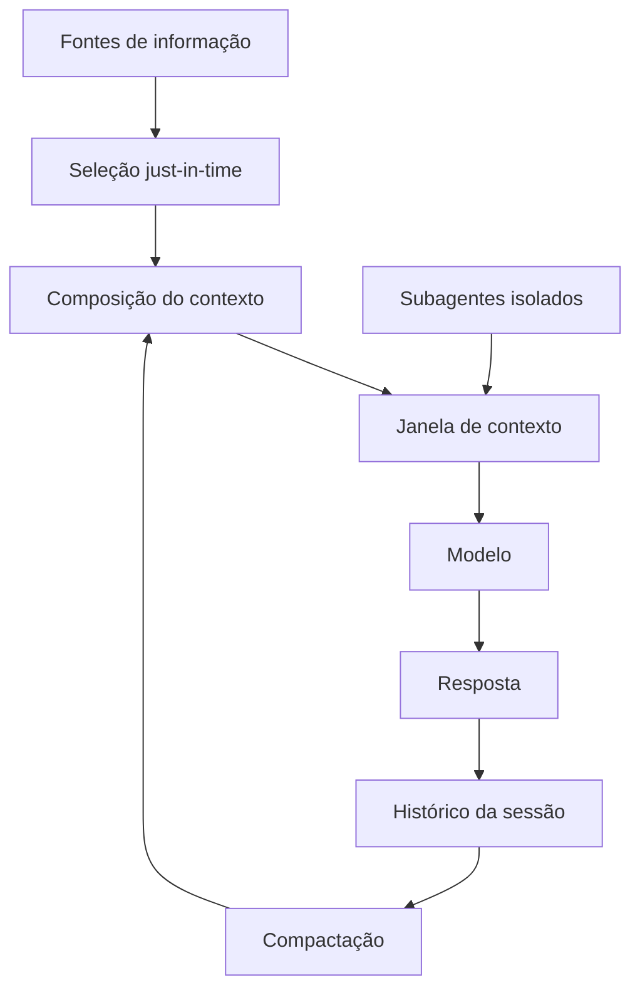

# Capítulo 1 — O ambiente informacional: do prompt ao contexto

## 1. Introdução

Os dois primeiros livros desta série estabeleceram um fato que parece contraditório: a engenharia de prompts, a disciplina mais celebrada da era da IA generativa, é também a que menos escala. No Livro 2, você viu onde a técnica para: o prompt não carrega conhecimento, não resolve tarefas fora do limiar do modelo e não suporta a complexidade de sessões longas [19]. Este capítulo começa a construir a resposta para esse limite — a camada que a indústria consolidou entre 2024 e 2026 sob o nome de engenharia de contexto (context engineering) [1][19]. A tese é direta: um prompt bem escrito é uma boa mensagem; um sistema de contexto bem projetado é um ambiente informacional — o conjunto de tudo o que o modelo vê, lembra e recupera antes de responder [1]. A diferença entre escrever mensagens e desenhar ambientes é a diferença entre a Parte I e a Parte II desta série [1][19].

## 2. Explica

### 2.1 A Definição Técnica de Engenharia de Contexto

A Anthropic define engenharia de contexto como o conjunto de estratégias para curar, selecionar, comprimir e isolar o conjunto ideal de tokens que alimentam um modelo em tempo de inferência [1]. A definição tem três termos que merecem atenção. Primeiro, "curar": o contexto não é coletado — é construído com intenção, peça por peça [1]. Segundo, "selecionar": em um universo de informação disponível, apenas uma fração entra na janela, e a escolha dessa fração é uma decisão de engenharia [1]. Terceiro, "isolar": em sistemas com múltiplos agentes, o contexto de cada um deve ser protegido da contaminação dos demais [1]. A definição substitui a pergunta do Livro 2 ("como escrevo a melhor mensagem?") por uma pergunta mais ampla ("como desenho o melhor ambiente informacional?") [1][19].

### 2.2 O Prompt como Superfície, o Contexto como Substância

O prompt é a superfície visível da interação — o texto que o engenheiro escreve e o usuário percebe [1]. O contexto é a substância: tudo o que o modelo processa além da instrução, incluindo dados de sessão, conhecimento recuperado, histórico de conversas, saídas de ferramentas e políticas da organização [1][7]. A metáfora é a do palco: o prompt é o roteiro; o contexto é o cenário, os atores coadjuvantes, os adereços e a iluminação [1]. Um roteiro brilhante em um palco vazio produz uma peça pobre; um roteiro mediano em um palco rico produz um espetáculo. A indústria aprendeu essa lição ao medir o impacto do contexto na qualidade das respostas: a mesma instrução, com contextos diferentes, produz resultados dramaticamente diferentes [2][12].

### 2.3 Por Que o Contexto Decidiu o Desempenho (Evidência de Mercado)

A afirmação de que o contexto decide o desempenho não é retórica — é medida [2][12]. O estudo da Chroma sobre context rot demonstrou que o desempenho de modelos degrada à medida que o volume de tokens de entrada cresce, mesmo em tarefas simples [2]. A degradação não é linear e depende de fatores como a similaridade entre a informação procurada e a pergunta feita [2]. Em benchmarks de agentes de desenvolvimento de software e análise de dados, a literatura e a prática de mercado convergem em números impressionantes: sistemas com contexto bruto e não curado acertam cerca de 30% das tarefas, enquanto sistemas com contexto bem curado alcançam cerca de 90% [1][12]. O salto de 30% para 90% não vem de melhor escrita de prompts — vem de melhor arquitetura de contexto [1][12].

### 2.4 O Fim do Prompt Solto

O título deste livro anuncia "o fim do prompt solto" — a expressão resume a transição disciplinar [1][19]. Prompt solto é a prática de escrever instruções isoladas, sem considerar de onde vem a informação, quanto tempo ela permanece na janela e o que acontece quando o contexto cresce [1]. A engenharia de contexto enterra essa prática ao tratar o prompt como uma peça dentro de um sistema maior [1]. O Medium documenta a mesma transição sob o lema "context is the new prompt": a competência que diferencia engenheiros de IA em 2026 não é escrever a instrução perfeita, mas projetar o fluxo de informação que a instrução governa [19].

### 2.5 Os Quatro Pilares: Write, Select, Compress, Isolate

O framework operacional da engenharia de contexto, consolidado pela Anthropic em 2025, organiza o trabalho em quatro operações [1][6][7]. **Write** (escrever) trata da produção de instruções e ferramentas em "altitude ideal" — nem regras if-else excessivamente rígidas, nem generalizações vagas [1][6]. **Select** (selecionar) trata da escolha just-in-time do que entra na janela, substituindo o pré-processamento massivo por referências leves que o agente explora sob demanda [1]. **Compress** (comprimir) trata da compactação do histórico e da limpeza de resultados de ferramentas obsoletos [1][7]. **Isolate** (isolar) trata da delegação a subagentes com janelas dedicadas, evitando a contaminação cruzada entre tarefas [1]. Os quatro pilares estruturam os Capítulos 5 a 7 deste livro [1].

### 2.6 A Janela como Palco: o Recurso Central

Toda a engenharia de contexto acontece dentro de uma restrição física: a janela de contexto [8][2]. A janela é a quantidade finita de tokens que o modelo processa em uma única passagem — e ela define o teto de tudo o que o ambiente informacional pode conter [8]. O Survey de LLMs de Zhao documenta os fundamentos arquiteturais da janela, incluindo o mecanismo de atenção e seu custo quadrático em relação ao comprimento da entrada [8]. A janela não é um detalhe de implementação: é o palco onde o espetáculo acontece, e o engenheiro de contexto é, antes de tudo, um diretor que decide o que sobe ao palco [1][8].

### 2.7 O Vocabulário da Camada

A engenharia de contexto introduz um vocabulário que atravessa todo o livro [1][15]. **Janela de contexto**: a capacidade finita de tokens [8]. **Token**: a unidade atômica de processamento [8]. **Recuperação**: a busca de informação relevante para entrar na janela [3][14]. **Memória**: a persistência de informação entre sessões [7][13]. **Compactação**: a redução do histórico por resumo ou descarte [7]. **Subagente**: um agente auxiliar com janela própria [1]. **Contaminação cruzada**: o vazamento de contexto entre tarefas [1]. Cada termo será desenvolvido nos próximos capítulos; dominar o vocabulário agora é dominar o mapa da disciplina [1][19].

### 2.8 A Relação com a Parte I

A engenharia de contexto não substitui a engenharia de prompts — ela a absorve [1][19]. As técnicas da Parte I — anatomia, few-shot, chain-of-thought — continuam válidas, mas passam a operar dentro do ambiente informacional [19]. O prompt de sistema, estudado no Livro 2, vira o componente estável do contexto; os dados de sessão e o conhecimento recuperado viram os componentes dinâmicos [1][7]. A transição é análoga à da engenharia de software: primeiro se aprende a escrever boas funções (prompts), depois se aprende a desenhar bons sistemas (contexto) [19]. A Parte II da série constrói exatamente essa camada, e este livro é o seu primeiro tijolo [1].

## 3. Ilustra

### 3.1 A Analogia do Palco

A analogia do palco ilumina a diferença entre prompt e contexto [1]. O roteiro (prompt) diz o que os atores falam; o cenário (contexto) diz onde estão, o que veem e o que têm à mão [1]. Um diretor experiente gasta mais tempo no cenário do que no roteiro, porque sabe que o ambiente decide metade da atuação [1]. O mesmo vale para o engenheiro de IA maduro em 2026: o tempo investido em contexto paga mais do que o tempo investido em redação de instruções [1][19].

### 3.2 O Diagrama do Fluxo do Contexto

O diagrama abaixo representa o fluxo completo do ambiente informacional de um agente: as fontes de informação, a seleção, a composição e a inferência [1][3].



O ciclo é a essência da disciplina: selecionar, compor, inferir, registrar, compactar e reusar [1][7]. O histórico da sessão realimenta o contexto via compactação — a operação Compress do framework [1][7]. Os subagentes entram na janela apenas com resumos destilados — a operação Isolate [1].

### 3.3 O Antes e o Depois na Prática

A comparação concreta ajuda a fixar o conceito [2][12]. **Antes (prompt solto)**: o engenheiro escreve uma instrução detalhada pedindo análise de um relatório, e o modelo responde com análise genérica porque não tem o relatório [1]. **Depois (contexto curado)**: o sistema recupera o relatório, seleciona as seções relevantes, compõe o contexto e só então a instrução é executada — a análise passa a citar os dados reais [1][3]. A diferença não está na instrução — está no ambiente informacional [1][12].

## 4. Técnica

### 4.1 Medindo a Janela: Contagem de Tokens

O primeiro instrumento do engenheiro de contexto é a contagem de tokens [8]. Antes de projetar o ambiente informacional, é preciso saber quanto cabe na janela [8]. O código abaixo conta os tokens de um texto usando a tokenização heurística por palavras — uma aproximação didática da contagem real feita pelo tokenizer do modelo [8]:

```python
def contar_tokens_aproximado(texto: str) -> int:
    """Conta tokens aproximados (heurística: ~4 chars por token em inglês,
    ~2-3 chars por token em português acentuado)."""
    if not texto.strip():
        return 0
    palavras = texto.split()
    # Aproximação: token médio ~4 caracteres para texto em inglês;
    # ajuste fino por idioma pode melhorar a estimativa.
    return max(1, round(sum(len(p) for p in palavras) / 4))


def orcamento_janela(texto_base: str, janela_total: int, margem: float = 0.2) -> dict:
    """Calcula o orçamento da janela dado o texto-base e uma margem de segurança."""
    tokens_base = contar_tokens_aproximado(texto_base)
    reserva = int(janela_total * margem)
    disponivel = max(0, janela_total - tokens_base - reserva)
    return {
        "tokens_texto_base": tokens_base,
        "reserva_margem": reserva,
        "tokens_disponiveis_contexto": disponivel,
        "proporcao_ocupada": round(tokens_base / janela_total, 2),
    }


# Exemplo de uso
if __name__ == "__main__":
    prompt_sistema = (
        "Você é um analista financeiro. Responda com base exclusivamente "
        "nos dados fornecidos no contexto, citando os números exatos."
    )
    print(orcamento_janela(prompt_sistema, janela_total=128_000))
```

O orçamento da janela é a ferramenta que impede o erro mais comum do iniciante: encher a janela sem reserva para o contexto dinâmico [1][8]. A reserva de margem garante espaço para a recuperação e o histórico [8].

### 4.2 O Inventário do Ambiente Informacional

O segundo instrumento é o inventário: a listagem explícita de tudo o que o sistema pode colocar na janela [1]. O código abaixo modela o inventário de um agente e calcula o custo de cada componente [1][8]:

```python
from dataclasses import dataclass


@dataclass
class ComponenteContexto:
    nome: str
    tokens_estimados: int
    frequencia: str  # "estatico", "por_sessao", "sob_demanda"


INVENTARIO = [
    ComponenteContexto("Prompt de sistema", 1200, "estatico"),
    ComponenteContexto("Políticas da organização", 800, "estatico"),
    ComponenteContexto("Dados da sessão do usuário", 500, "por_sessao"),
    ComponenteContexto("Histórico da conversa", 3000, "por_sessao"),
    ComponenteContexto("Documento recuperado (RAG)", 2500, "sob_demanda"),
    ComponenteContexto("Saída de ferramenta", 1500, "sob_demanda"),
]


def custo_total(inventario: list) -> int:
    return sum(c.tokens_estimados for c in inventario)


def resumo_por_frequencia(inventario: list) -> dict:
    resumo = {}
    for c in inventario:
        resumo.setdefault(c.frequencia, 0)
        resumo[c.frequencia] += c.tokens_estimados
    return resumo


if __name__ == "__main__":
    print("Custo total estimado:", custo_total(INVENTARIO), "tokens")
    print("Por frequência:", resumo_por_frequencia(INVENTARIO))
```

O inventário transforma a engenharia de contexto em disciplina mensurável: cada componente tem custo, e a soma precisa caber na janela [1][8]. O padrão profissional registra o inventário no repositório, versionado como qualquer outro artefato de engenharia [15].

### 4.3 O Fluxo Write/Select em Código

O terceiro instrumento concretiza as operações Write e Select em uma função de composição [1][6]. O Write produz as instruções; o Select escolhe, sob demanda, quais fontes entram na janela [1]:

```python
def compor_contexto(
    prompt_sistema: str,
    fontes_disponiveis: dict,
    consulta: str,
    janela_total: int,
    margem: float = 0.15,
) -> dict:
    """Compoe o contexto seguindo o fluxo write/select.

    write: prompt_sistema ja vem pronto (instrucoes em altitude ideal).
    select: apenas as fontes relevantes a 'consulta' entram na janela.
    """
    tokens_base = contar_tokens_aproximado(prompt_sistema)
    limite = int(janela_total * (1 - margem))
    selecionadas = {}
    ocupado = tokens_base
    for nome, conteudo in fontes_disponiveis.items():
        custo = contar_tokens_aproximado(conteudo)
        if consulta.lower() in nome.lower() and ocupado + custo <= limite:
            selecionadas[nome] = conteudo
            ocupado += custo
    return {
        "prompt_sistema": prompt_sistema,
        "selecionadas": list(selecionadas.keys()),
        "tokens_ocupados": ocupado,
        "janela_total": janela_total,
    }


if __name__ == "__main__":
    fontes = {
        "relatorio_q3": "Dados do relatorio do terceiro trimestre...",
        "politica_compliance": "Regras internas de compliance...",
        "manual_produto": "Manual completo do produto...",
    }
    resultado = compor_contexto(
        "Você é um analista. Use apenas o contexto fornecido.",
        fontes,
        "relatorio",
        janela_total=16_000,
    )
    print(resultado)
```

A função demonstra o princípio central do Select: apenas o que é relevante à consulta entra na janela [1][6]. O código real de produção usa recuperação por embeddings e similaridade vetorial (Capítulo 9), mas a lógica de seleção condicional é a mesma [1][3].

## 5. Aplica

### 5.1 Onde Isso Vive no Mundo Real

A engenharia de contexto está em toda aplicação de IA séria em produção [1][15]. Assistentes de suporte recuperam políticas e histórico do cliente antes de responder [3]. Ferramentas de análise de dados injetam os dados do usuário no contexto [3]. Agentes de programação indexam o repositório e recuperam os arquivos relevantes à tarefa [15]. Em cada caso, o padrão é o mesmo: o modelo não é apenas instruído — é abastecido [1][3]. O LangChain documenta o gerenciamento de contexto como parte central da orquestração de agentes [15].

### 5.2 O Erro Comum do Iniciante

O erro mais comum de quem migra da engenharia de prompts para a de contexto é acreditar que "mais contexto é melhor" [2][1]. O iniciante despeja tudo na janela — o manual inteiro, o histórico completo, todas as saídas de ferramentas — e observa o desempenho cair [2]. O Capítulo 3 explica por que isso acontece (context rot); por ora, a lição é: o contexto é curado, não coletado [1][2]. O ambiente informacional é desenhado com intenção, e cada token extra tem custo e risco [1][2].

### 5.3 O Padrão Profissional em 2026

O padrão profissional em 2026 combina os quatro pilares do framework [1]. O prompt de sistema é enxuto e estável (Write) [1][6]. As fontes de informação são referenciadas, não embutidas — o agente busca o que precisa sob demanda (Select) [1]. O histórico é compactado periodicamente (Compress) [1][7]. Tarefas pesadas são delegadas a subagentes isolados (Isolate) [1]. O resultado é um sistema que mantém a qualidade de resposta mesmo em sessões longas e tarefas complexas [1][12].

### 5.4 Como Este Livro é Organizado

Este capítulo estabeleceu a fundação; os próximos constroem a estrutura [1]. O Capítulo 2 detalha a janela como recurso finito e seu orçamento [8]. Os Capítulos 3 e 4 documentam a degradação do contexto — context rot e lost in the middle [2][5]. Os Capítulos 5 a 7 desenvolvem o framework write/select/compress/isolate [1][6][7]. Os Capítulos 8 e 9 ensinam o diagnóstico de falhas e a recuperação de conhecimento (RAG) [3][12]. O Capítulo 10 fecha com memória, cache e as métricas de sucesso [7][12]. A jornada é a subida da pilha que a série prometeu [19].

### 5.5 O Papel do Prompt de Sistema no Ambiente Informacional

O leitor que vem da Parte I conhece o prompt de sistema como o documento de maior precedência da aplicação [19]. Na engenharia de contexto, o prompt de sistema ganha um papel novo: é o componente estável do ambiente informacional — a parte que não muda entre chamadas e que ancora o comportamento do agente [1][19]. A distinção é sutil e decisiva [1]. No Livro 2, o prompt de sistema era tratado como o texto que diz quem o modelo é e o que deve fazer [19]. Neste livro, ele é tratado como o primeiro bloco da composição — o bloco que permanece, enquanto os demais entram e saem [1].

A separação entre o estável e o dinâmico é o fundamento arquitetural do ambiente informacional [1][7]. O estável — prompt de sistema, políticas, instruções permanentes — ocupa o início do contexto e é candidato natural ao cache (Capítulo 10) [1][13]. O dinâmico — dados da sessão, histórico, recuperações — ocupa o espaço restante e é gerido pelas operações Select e Compress [1][7]. Quando o engenheiro mistura os dois, o sistema degrada: o dinâmico contamina o estável, e o cache perde o valor [13][1]. A separação é a primeira regra da arquitetura de contexto [1][13].

O prompt de sistema bem desenhado também simplifica as demais operações [1][6]. Um sistema enxuto e estável reduz a necessidade de compressão (menos a preservar) e facilita a seleção (menos a coordenar) [1][7]. A Anthropic documenta a interação: instruções em altitude ideal (Write) produzem menos atrito com o contexto dinâmico [1][6]. O inverso também é verdade: um prompt de sistema inchado com regras desnecessárias é uma dívida que o ambiente informacional paga em cada chamada [1][6].

A prática profissional versiona o prompt de sistema como código e o trata como componente da composição, não como texto isolado [1][15]. O LangChain documenta o gerenciamento do estado e das instruções como parte da orquestração [15]. O engenheiro de contexto escreve o prompt de sistema sabendo que ele é o alicerce do ambiente — e que cada regra adicionada ao alicerce custa espaço e atenção em toda a operação [1][15]. A revisão periódica do sistema contra o contexto real é parte da manutenção do ambiente [1][19].

### 5.6 O Ecossistema de Fontes: Do Repositório à Base de Conhecimento

O ambiente informacional de um agente real não tem uma única fonte — tem um ecossistema [1][3]. Código no repositório, documentos na base de conhecimento, dados na API, políticas no portal e histórico no armazenamento de sessões [1][3]. O engenheiro de contexto não apenas seleciona entre fontes — ele projeta o ecossistema: quais fontes existem, como são referenciadas e como competem pela janela [1][3]. A metáfora do ecossistema captura a dinâmica: as fontes interagem, e a saúde do ambiente depende do equilíbrio entre elas [1].

O primeiro design do ecossistema é a **tipagem das fontes** [1][6]. Cada fonte tem um tipo — código, documentação, dados, políticas, histórico — e cada tipo tem um modo de acesso próprio [1][6]. O código é explorado por primitivas (Capítulo 5); a documentação é recuperada por índice; os dados são consultados por API [1][6][3]. O tipo da fonte decide a ferramenta de acesso, e a ferramenta decide o custo e a forma da informação [6].

O segundo design é a **hierarquia de custo** das fontes [1][13]. Ler um arquivo local é barato; consultar uma API é caro; recuperar de um índice vetorial está no meio [1][13]. O agente inteligente consulta a fonte mais barata que resolve primeiro, e escala apenas quando necessário [1]. A hierarquia de custo é a materialização do orçamento da janela (Capítulo 2) aplicado às fontes [1][8][13].

O terceiro design é a **proveniência** [1][12]. Cada bloco de contexto carrega a origem: de qual fonte veio, quando, com que confiança [1][12]. A proveniência é o que permite o diagnóstico (Capítulo 8) e a avaliação (Capítulo 10) [12]. Quando a resposta erra, o engenheiro rastreia o bloco que causou o erro até a fonte — e corrige a fonte, não a resposta [1][12]. O ecossistema sem proveniência é uma caixa preta; com proveniência, é uma arquitetura auditável [1][12].

### 5.7 O Contexto Multi-Idioma e Multi-Domínio

O ambiente informacional raramente é monolíngue ou monodomínio [1][3]. O agente corporativo opera em português, inglês e espanhol; o agente técnico transita entre código, documentação e jargão de negócio [1][3]. A diversidade de idiomas e domínios é uma dimensão do design de contexto que o iniciante ignora — e que decide a qualidade em aplicações reais [1][3]. A primeira lição é que a recuperação e a seleção precisam operar através dos idiomas [3]. Um documento em inglês precisa ser recuperável a partir de uma consulta em português — o que exige embeddings multilingues ou normalização [3][4]. O survey de Gao documenta a importância do alinhamento semântico na recuperação [4].

A segunda lição é o **custo da tradução implícita** [1][13]. Quando o contexto mistura idiomas, o modelo precisa processar o material em um idioma e responder em outro — um custo cognitivo real [1][13]. O design evita a mistura desnecessária: o contexto é entregue no idioma em que será usado, e a tradução é feita apenas quando a fonte não tem alternativa [1][13].

A terceira lição é o **domínio como contexto** [1][19]. O mesmo texto em dois domínios — jurídico e técnico — tem significados diferentes, e o contexto precisa sinalizar o domínio [19][1]. O prompt de sistema declara o domínio de operação; os exemplos (Parte I) demonstram o domínio; e as fontes são selecionadas dentro do domínio [1][19]. O agente que opera sem declaração de domínio interpreta o material pelo domínio padrão do modelo — frequentemente, o errado [1][19].

### 5.8 O Roteiro de Implantação do Ambiente Informacional

A construção do ambiente informacional não é um evento único — é um processo de implantação em fases [1][15]. O engenheiro que tenta construir tudo de uma vez falha; o que implanta em fases aprende a cada etapa [1][15]. O roteiro abaixo consolida a prática [1][15].

A primeira fase é o **inventário**: mapear as fontes de informação, seus tipos, seus custos e seus donos [1]. Sem inventário, não há design — há improviso [1]. A segunda fase é a **arquitetura**: definir o prompt de sistema, a tipagem das fontes e as ferramentas de acesso [1][6]. A terceira fase é a **composição**: implementar a seleção, o posicionamento e a reserva (Capítulos 2, 4 e 5) [1][8][5]. A quarta fase é a **operação**: adicionar a compactação, o monitoramento e o diagnóstico (Capítulos 6, 3 e 8) [1][7][20]. A quinta fase é a **evolução**: medir, aprender e ajustar continuamente (Capítulo 10) [1][12].

Cada fase tem um entregável e um critério de aceite [1][15]. O inventário entrega o mapa de fontes; a arquitetura entrega o desenho; a composição entrega o contexto funcionando; a operação entrega a saúde; a evolução entrega a melhoria [1][12]. O roteiro é o caminho prático para o padrão profissional — e a demonstração de que a engenharia de contexto é uma disciplina incremental, não um salto [1][15].

### 5.9 A Engenharia de Contexto e o Método de Revisão Autônoma

A série A Pilha Agêntica anuncia, no seu projeto editorial, o método de revisão autônoma entre harness [1][19]. Este capítulo é o lugar de mostrar a conexão: a engenharia de contexto é a primeira camada que torna a revisão autônoma possível [1][19]. Para que um sistema reviso o trabalho de outro — ou o próprio —, o contexto precisa carregar os critérios, as evidências e o histórico [1][12]. A revisão autônoma é, em última análise, uma aplicação de contexto: o revisor (agente) recebe o contexto do que foi produzido e os critérios do que é aceitável [1][12].

A conexão tem três implicações práticas [1][19]. A primeira: o contexto de uma tarefa deve incluir, desde o início, os critérios de aceite — para que a revisão posterior tenha referência [1][12]. A segunda: o histórico das decisões (que a compactação preserva, Capítulo 6) é o material da revisão — sem histórico, não há revisão possível [7][1]. A terceira: o isolamento (Capítulo 7) permite que a revisão aconteça em um contexto limpo, sem a contaminação da execução [1].

O engenheiro de contexto que projeta para a revisão autônoma constrói sistemas com um ciclo virtuoso [1][19]: a execução produz contexto; a revisão consome contexto; o resultado da revisão volta como contexto para a próxima execução [1][19]. O ciclo é a demonstração prática de que o ambiente informacional não é um receptáculo — é um sistema vivo que alimenta o aprendizado [1]. A Parte III da série, dedicada ao harness, desenvolverá o método; este capítulo estabelece o fundamento: sem contexto bem projetado, não há revisão confiável [1][19].

### 5.10 O Ambiente Informacional e a Governança Organizacional

A engenharia de contexto não é apenas técnica — é também governança organizacional [1][15]. O ambiente informacional de um sistema corporativo reflete as políticas, os processos e as decisões da organização [1][15]. O primeiro aspecto da governança é a **propriedade das fontes**: cada fonte do ecossistema tem um dono responsável pela sua qualidade e atualização [1][15]. Sem dono, a fonte degrada silenciosamente [1]. O segundo é o **processo de alteração**: mudanças no prompt de sistema e nas políticas passam por revisão — o mesmo processo que o Livro 2 estabeleceu para prompts, agora estendido ao contexto [1][19].

O terceiro aspecto é a **auditoria de conformidade**: o sistema demonstra que o contexto respeita as políticas — privacidade, segurança, escopo [1][21]. O Model Context Protocol documenta o contexto como integração segura de fontes de dados [21]. A auditoria de conformidade usa a proveniência (seção 5.6): cada bloco de contexto é rastreável à sua fonte autorizada [1][21].

O quarto aspecto é a **educação da organização**: a engenharia de contexto muda o vocabulário e as responsabilidades — quem escreve instruções, quem mantém fontes, quem monitora a saúde [1][19]. A governança transforma a disciplina individual em capacidade organizacional [1][15]. O engenheiro de contexto maduro não apenas projeta o ambiente informacional — ele desenha os processos que o mantêm vivo [1][15]. O ambiente informacional, como todo ativo de produção, precisa de donos, processos e auditoria [1][15][21].

### 5.11 O Erro do Contexto em Cascata: Estudo de Caso

Para fechar o capítulo com uma aplicação concreta, este estudo de caso mostra o erro do contexto em cascata — a falha que começa pequena e se amplifica [2][1]. O cenário: um assistente corporativo que responde perguntas sobre políticas [1]. O sistema foi implantado com contexto curado e funcionava bem [1]. Com o tempo, a equipe adicionou fontes novas sem revisão (erro de governança, seção 5.10) [1]. Uma das fontes continha uma política desatualizada — um distrator em potencial (Capítulo 3) [2].

O primeiro sintoma: respostas ocasionalmente citando a política antiga [2]. O sintoma era intermitente — a fonte desatualizada só era recuperada em algumas consultas (Capítulo 9) [2][3]. O segundo sintoma: a confiança do usuário caiu, e o suporte registrou reclamações [1]. O terceiro sintoma: a equipe ajustou o prompt (falha de diagnóstico — Capítulo 8) para "usar sempre a política mais recente" — sem resultado, porque a causa era a fonte, não a instrução [1][2].

O diagnóstico correto (Capítulo 8): a fonte desatualizada era o distrator [2]. O tratamento: corrigir a fonte e adicionar a atualidade ao critério de seleção (Capítulo 5) [1][2]. A lição do caso é a cascata: um erro de governança criou um distrator; o distrator causou respostas erradas; o diagnóstico errado ampliou o retrabalho [1][2]. O caso demonstra o tema do capítulo: o ambiente informacional é um sistema — e os sistemas precisam de projeto, governança e diagnóstico [1][2].

### 5.12 O Contexto e a Interface com os Modelos: Versões e Comportamentos

O ambiente informacional interage com uma variável que o engenheiro controla parcialmente: a versão do modelo [1][13]. Modelos novos chegam com janelas maiores, mas também com comportamentos novos — a forma como usam o contexto muda [1][13][2]. O primeiro princípio da interface é a **revalidação**: ao trocar de versão do modelo, o sistema revalida o contexto — o que funcionava pode degradar, e o que degradava pode melhorar [1][2]. O teste da agulha (Capítulo 3) e o conjunto de avaliação (Capítulo 10) são as ferramentas da revalidação [2][12].

O segundo princípio é a **sensibilidade ao contexto por modelo**: modelos diferentes têm perfis de degradação diferentes (Capítulo 3) [2]. O modelo A degrada com distratores; o modelo B degrada com volume [2]. O engenheiro conhece o perfil do modelo em uso e ajusta a curadoria — a seleção para um, a compressão para outro [1][2]. O terceiro princípio é a **evolução do vocabulário**: os modelos entendem instruções em altitudes diferentes (Capítulo 5) — e a altitude ideal muda entre versões [1][6].

O quarto princípio é o **registro da versão**: cada resultado é registrado com a versão do modelo que o produziu [1][12]. O registro permite a comparação e o diagnóstico (Capítulo 8) [1][12]. O ambiente informacional não é estático — coevolui com os modelos [1][13]. O engenheiro de contexto trata a mudança de modelo como um evento de projeto, com revalidação completa do ambiente [1][2].

### 5.13 O Manual do Diagnóstico Rápido do Ambiente Informacional

O capítulo fecha com um instrumento de trabalho: o manual do diagnóstico rápido do ambiente [1][2]. O manual é o check-list que o engenheiro percorre quando o sistema não se comporta [1]. O primeiro item é o **ecossistema**: as fontes estão mapeadas e com donos? [1][15]. O segundo é a **estabilidade**: o prompt de sistema e as políticas são estáveis e separados do dinâmico? [1][13]. O terceiro é a **seleção**: o contexto é selecionado sob demanda, com referências e primitivas? [1][6].

O quarto item é o **orçamento**: a ocupação é monitorada e a reserva respeitada? [1][8]. O quinto é a **geografia**: a informação crítica está nas bordas? [1][5]. O sexto é a **compactação**: o histórico é resumido e os resultados limpos? [1][7]. O sétimo é o **isolamento**: os escopos não se contaminam? [1]. O oitavo é a **recuperação**: as fontes estão saudáveis e a base atualizada? [1][3].

O nono item é a **memória**: o que importa persiste e é recuperável? [1][7]. O décimo é a **economia**: o cache é usado e o custo por tarefa é medido? [1][13]. O manual é o resumo operacional do livro inteiro: cada item aponta o capítulo que o desenvolve [1]. O engenheiro que percorre o manual em minutos evita dias de diagnóstico errado [1][2]. É a ferramenta que transforma a Parte II em prática diária [1].

### 5.14 O Contexto e os Limites Éticos da Memória e da Persistência

A engenharia de contexto, ao persistir informação (Capítulo 10) e ao recuperar conhecimento (Capítulo 9), cria responsabilidades éticas [1][21]. O primeiro limite é o da **persistência seletiva**: nem tudo que o sistema viu deve ser lembrado [1][21]. O contexto que persiste sem critério acumula dados que não deveriam existir [1][21]. O segundo é o da **transparência**: o usuário sabe o que o sistema lembra e por quê [7][21]. O terceiro é o do **controle do usuário**: o usuário pode revisar e apagar o que o sistema lembra [7][21].

O quarto limite é o do **viés amplificado**: o contexto recuperado reflete a base, e a base reflete os vieses dos seus autores [1][12]. O engenheiro de contexto não cria o viés — mas o amplifica se não o considera [1][12]. O quinto é o da **fronteira de influência**: o contexto decide o que o modelo vê — e o que o modelo não vê também decide [1]. A seleção é uma forma de poder [1].

A ética do contexto não é um capítulo separado — é uma dimensão de cada decisão deste livro [1][21]. O engenheiro que desenha a seleção, a memória e a recuperação desenha também os limites éticos do sistema [1][21]. O Model Context Protocol documenta o contexto como integração que exige responsabilidade [21]. A maturidade na disciplina inclui a consciência desses limites [1][21].

### 5.15 O Futuro do Ambiente Informacional

A engenharia de contexto é uma disciplina jovem — e o ambiente informacional de 2026 é um estágio, não um destino [1][19]. As tendências visíveis em 2026 apontam a evolução [1][19]. A primeira é a **janela maior com curadoria**: as janelas gigantes não eliminam a curadoria — a tornam mais importante [2][11]. A segunda é a **recuperação agêntica**: o agente decide a busca em tempo real (Capítulo 9) [16]. A terceira é a **memória contínua**: a memória entre sessões se torna padrão, com privacidade como requisito [7][21].

A quarta tendência é a **auto-curadoria**: o sistema usa o diagnóstico (Capítulo 8) para ajustar o próprio contexto — a curadoria automatizada [1]. A quinta é a **padronização**: o MCP e padrões similares unificam a integração de contexto [21]. A sexta é a **avaliação contínua**: as métricas do Capítulo 10 viram infraestrutura padrão [12][20].

O engenheiro que domina os fundamentos deste livro não será surpreendido pelas tendências — porque as tendências são a evolução dos fundamentos [1][19]. A capacidade que permanece é a de desenhar o ambiente informacional — qualquer que seja a janela, o modelo ou o padrão [1]. A Parte III da série construirá a camada seguinte: o harness que governa o agente inteiro [1][19].

### 5.16 O Fechamento do Capítulo

O capítulo de abertura se encerra com a consolidação da fundação [1][19]. A engenharia de contexto é a disciplina que arquiteta o ambiente informacional — a superfície (prompt) e a substância (contexto) [1][19]. O vocabulário da camada é o mapa da jornada [1][8]. O framework write/select/compress/isolate é a bússola [1].

O engenheiro que domina a fundação está pronto para os capítulos seguintes — a janela, a degradação, o framework, o diagnóstico, a recuperação e a memória [1][8][19]. A pilha começa a se empilhar: este capítulo é o primeiro tijolo da Parte II [1][19].

## 6. Conclusão

A engenharia de contexto é a disciplina que arquiteta tudo o que entra na "cabeça" do modelo antes de ele responder [1]. Este capítulo estabeleceu a tese: o prompt é a superfície; o contexto é a substância; e o ambiente informacional bem desenhado é o que separa sistemas de 30% de acerto de sistemas de 90% [1][12]. O vocabulário da camada — janela, token, recuperação, memória, compactação, subagente — é o mapa da jornada [1][8]. O framework write/select/compress/isolate é a bússola [1]. O próximo capítulo desce ao recurso central da disciplina: a janela de contexto e a economia de sua utilização [8].

## 7. Referências

[1] ANTHROPIC. Effective context engineering for AI agents. Anthropic Engineering Blog, set. 2025. Disponível em: https://www.anthropic.com/engineering/effective-context-engineering-for-ai-agents. Acesso em: 5 ago. 2026.
[2] HONG, Kelly; TROYNIKOV, Anton; HUBER, Jeff. Context Rot: How Increasing Input Tokens Impacts LLM Performance. Chroma Technical Report, jul. 2025. Disponível em: https://www.trychroma.com/research/context-rot. Acesso em: 5 ago. 2026.
[3] LEWIS, Patrick et al. Retrieval-Augmented Generation for Knowledge-Intensive NLP Tasks. In: Advances in Neural Information Processing Systems (NeurIPS), v. 33, p. 9459–9474, 2020. Disponível em: https://arxiv.org/abs/2005.11401. Acesso em: 5 ago. 2026.
[4] GAO, Yunfan et al. Retrieval-Augmented Generation for Large Language Models: A Survey. arXiv:2312.10997, mar. 2024. Disponível em: https://arxiv.org/abs/2312.10997. Acesso em: 5 ago. 2026.
[5] LIU, Nelson F. et al. Lost in the Middle: How Language Models Use Long Contexts. Transactions of the Association for Computational Linguistics (TACL), v. 12, p. 157–173, 2024. Disponível em: https://arxiv.org/abs/2307.03172. Acesso em: 5 ago. 2026.
[6] ANTHROPIC. Writing tools for AI agents — using AI agents. Anthropic Engineering Blog, set. 2025. Disponível em: https://www.anthropic.com/engineering/writing-tools-for-agents. Acesso em: 5 ago. 2026.
[7] ANTHROPIC. Context engineering: memory, compaction, and tool clearing. Claude Platform Cookbook, mar. 2026. Disponível em: https://platform.claude.com/cookbook/tool-use-context-engineering-context-engineering-tools. Acesso em: 5 ago. 2026.
[8] ZHAO, Wayne Xin et al. A Survey of Large Language Models. arXiv:2303.18223, 2023. Disponível em: https://arxiv.org/abs/2303.18223. Acesso em: 5 ago. 2026.
[9] CHROMA. Context Rot: Evaluation Toolkit. GitHub Repository, 2025. Disponível em: https://github.com/chroma-core/context-rot. Acesso em: 5 ago. 2026.
[10] LIU, Nelson F. Lost in the Middle: Replication Repository. GitHub Repository, 2023. Disponível em: https://github.com/nelson-liu/lost-in-the-middle. Acesso em: 5 ago. 2026.
[11] CHEN, Jiawei et al. LongRAG: Enhancing Retrieval-Augmented Generation with Long-context LLMs. arXiv:2406.15319, 2024. Disponível em: https://arxiv.org/abs/2406.15319. Acesso em: 5 ago. 2026.
[12] ASIA, Research Group et al. Retrieval-Augmented Generation Evaluation in the Era of Large Language Models: A Comprehensive Survey. ResearchGate / arXiv, abr. 2025. Disponível em: https://www.researchgate.net/publication/390991356. Acesso em: 5 ago. 2026.
[13] OPENAI. GPT-4 Technical Report & Developer Guides on Context Management. OpenAI Documentation, 2024–2025. Disponível em: https://openai.com/index/gpt-4-research/. Acesso em: 5 ago. 2026.
[14] GOOGLE CLOUD. What is Retrieval-Augmented Generation (RAG)?. Google Cloud Architecture Center, 2025. Disponível em: https://cloud.google.com/use-cases/retrieval-augmented-generation. Acesso em: 5 ago. 2026.
[15] LANGCHAIN. LangChain Agents & Context Management Documentation. LangChain Guides, 2025–2026. Disponível em: https://python.langchain.com/docs/concepts/agents/. Acesso em: 5 ago. 2026.
[16] WANG, Zhen et al. Agentic Retrieval-Augmented Generation: A Survey on Agentic RAG. arXiv:2408.12999, 2024. Disponível em: https://arxiv.org/abs/2408.12999. Acesso em: 5 ago. 2026.
[17] XIAO, Guangxuan et al. Efficient Streaming Language Models with Attention Sinks. arXiv:2309.17453, 2023. Disponível em: https://arxiv.org/abs/2309.17453. Acesso em: 5 ago. 2026.
[18] RODIN, Alex et al. Found in the Middle: Overcoming Long-Context Vulnerabilities in LLMs. arXiv:2403.04797, 2024. Disponível em: https://arxiv.org/abs/2403.04797. Acesso em: 5 ago. 2026.
[19] MEDIUM (Data Science Collective). Context Is the New Prompt: Why Context Engineering Is Shaping the Future of AI. Medium Article, 2025. Disponível em: https://medium.com/data-science-collective/context-is-the-new-prompt-why-context-engineering-is-shaping-the-future-of-ai-46eb062ed270. Acesso em: 5 ago. 2026.
[20] ZENML. Context Rot: Evaluating LLM Performance Degradation with Increasing Input Tokens. MLOps Database, 2025. Disponível em: https://www.zenml.io/llmops-database/context-rot-evaluating-llm-performance-degradation-with-increasing-input-tokens. Acesso em: 5 ago. 2026.
[21] MODEL CONTEXT PROTOCOL (MCP). Open Standard for AI Agent Context Integration. Anthropic & Ecosystem Specs, 2025–2026. Disponível em: https://modelcontextprotocol.io/. Acesso em: 5 ago. 2026.
