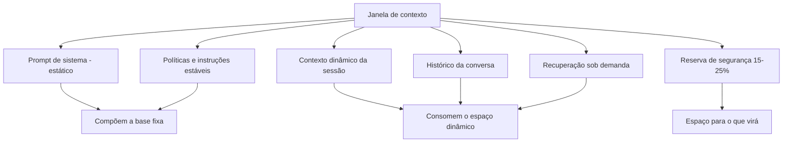

# Capítulo 2 — A janela de contexto como recurso finito

## 1. Introdução

O Capítulo 1 apresentou a engenharia de contexto como o desenho do ambiente informacional. Este capítulo desce ao recurso que torna esse desenho uma disciplina de restrições: a janela de contexto [8]. A janela é a quantidade finita de tokens que o modelo processa em cada passagem — e, como todo recurso finito, ela impõe uma economia: o que entra, o que fica, o que sai [8][1]. O engenheiro de contexto é, antes de tudo, um gestor de escassez: ele decide como alocar o orçamento de atenção do modelo entre instruções, dados, histórico e conhecimento recuperado [1][8]. Este capítulo ensina a natureza da janela, seu custo computacional, sua economia prática e as ferramentas para administrá-la [8][13].

## 2. Explica

### 2.1 O Que É a Janela de Contexto

A janela de contexto é a capacidade máxima de tokens que um modelo de linguagem processa em uma única inferência — a soma de tudo o que entra: instruções, dados, histórico e a própria resposta em geração [8]. O Survey de Zhao documenta os fundamentos: o modelo Transformer processa a sequência de entrada por camadas de atenção, e o comprimento da sequência é limitado pelo design da arquitetura e pelos recursos computacionais [8]. Janelas variam de dezenas de milhares a milhões de tokens conforme o modelo e a versão — e a tendência de mercado é o crescimento contínuo [8][13]. Porém, como o Capítulo 3 demonstrará, janela maior não é automaticamente desempenho maior [2].

### 2.2 O Custo Quadrático da Atenção

A restrição mais importante da janela é computacional: o mecanismo de atenção tem custo quadrático em relação ao comprimento da sequência [8]. Dobrar a entrada quadruplica o custo computacional — uma relação que o Survey de LLMs explica em detalhe [8]. Isso significa que cada token adicional não custa apenas o seu processamento: ele custa a interação com todos os outros tokens da janela [8]. A consequência prática é dupla: custo financeiro (mais computação, mais dinheiro) e custo cognitivo (mais tokens para o modelo "prestar atenção", mais oportunidades de se perder) [8][2]. A engenharia de contexto existe, em grande parte, para administrar esses dois custos [1][8].

### 2.3 O Orçamento de Atenção

O conceito de orçamento de atenção captura a escassez real [1][2]. Mesmo com uma janela grande, o modelo não "lê" todo o contexto com a mesma profundidade: a atenção é distribuída, e a qualidade da atenção depende da posição, da saliência e da competição entre tokens [2][5]. O estudo da Chroma sobre context rot documenta que o orçamento de atenção se esgota — o modelo perde informação relevante quando o contexto está poluído ou longo demais [2]. O orçamento de atenção é a moeda da engenharia de contexto: todo token que entra consome uma fração, e o engenheiro decide onde gastar [1][2].

### 2.4 Tokens: a Unidade do Recurso

O token é a unidade atômica do processamento — a fração de palavra, palavra ou símbolo que o modelo processa [8]. O texto "engenharia de contexto" não é lido como três palavras; é tokenizado em unidades menores ou maiores conforme o vocabulário do modelo [8]. A contagem de tokens é a métrica básica do orçamento: é em tokens que se mede o custo da entrada, o tamanho da janela e o preço da chamada [8][13]. O engenheiro de contexto pensa em tokens o tempo todo: quantos custa o prompt de sistema, quantos custa o documento recuperado, quantos restam para o histórico [1][8].

### 2.5 O Custo Financeiro da Janela

A janela tem um preço direto: provedores cobram por tokens de entrada e de saída [13]. A OpenAI documenta a estrutura de preços e as estratégias para reduzir custo, incluindo o prompt caching — o reuso de prefixos de contexto que não mudam entre chamadas [13]. O custo financeiro transforma a gestão da janela em decisão de negócio: um contexto inflado que desperdiça 30% dos tokens é um imposto invisível sobre cada chamada [13][1]. O engenheiro maduro mede o custo por tarefa concluída, não o custo por chamada — a mesma métrica que o Livro 2 introduziu para prompts, agora aplicada ao contexto [1][13].

### 2.6 A Economia do Contexto: O Que Entra, O Que Fica, O Que Sai

A gestão da janela é uma economia de três decisões [1][8]. **O que entra**: a seleção do contexto relevante — a operação Select do framework [1]. **O que fica**: a decisão de manter informação na janela ao longo de uma sessão, equilibrando continuidade e custo [1]. **O que sai**: a decisão de compactar ou descartar — a operação Compress [1][7]. A economia é dinâmica: a mesma informação que entra no início da sessão pode precisar sair no meio para dar espaço ao que ficou mais relevante [1][7]. O engenheiro de contexto administra esse fluxo continuamente [1].

### 2.7 A Posição Importa: o Fenômeno do Meio

A economia da janela tem uma dimensão posicional [5][10]. O estudo Lost in the Middle demonstrou que modelos recuperam informação com precisão no início e no fim do contexto, mas falham quando a informação crítica está no meio [5]. O fenômeno é surpreendente para quem trata a janela como um balde homogêneo — e é central para o design: a posição de cada bloco de contexto é uma decisão de engenharia, não um detalhe [5]. O Capítulo 4 aprofunda o fenômeno; por ora, a lição é que a janela não é um espaço neutro — é um espaço com geografia [5][10].

### 2.8 Janela Grande não é Desempenho Grande

A tendência de mercado de janelas cada vez maiores cria uma armadilha conceitual: a crença de que janela maior resolve os problemas de contexto [2][11]. O estudo da Chroma é explícito: janelas de 1 milhão a 10 milhões de tokens não geram melhoria linear de desempenho — na verdade, o desempenho degrada com o excesso [2]. A pesquisa sobre LongRAG aprofunda a discussão sobre a convergência entre janelas longas e recuperação, mostrando que o problema não é a capacidade da janela, mas a qualidade do que ela contém [11]. A janela é um recipiente; a curadoria decide o conteúdo [1][2].

### 2.9 A Reserva de Segurança

Um princípio prático da gestão de janela é a reserva de segurança: nunca ocupar 100% da janela com conteúdo estático [1][8]. O contexto dinâmico — histórico da conversa, resultados de ferramentas, recuperações — precisa de espaço para crescer durante a sessão [1]. A prática profissional reserva uma fração da janela (tipicamente 15% a 25%) para o que ainda virá [1]. Sem reserva, o sistema colapsa no meio da sessão: precisa descartar informação relevante para caber no que chegou [1][8]. A reserva é a primeira disciplina da economia do contexto [1].

### 2.10 O Contexto Como Ativo Versionável

A janela é o palco, mas o contexto que a ocupa é um ativo de engenharia — e ativos se versionam [1][15]. O LangChain documenta o gerenciamento de estado e contexto como parte da orquestração de agentes: o que entra na janela é composto por código, com origem, dono e ciclo de vida [15]. O Capítulo 10 aprofunda a governança do contexto; por ora, a lição é que a janela não é um lugar onde se "cola" texto — é o ponto de encontro de um pipeline de composição [1][15].

## 3. Ilustra

### 3.1 A Analogia do Caminhão de Mudança

A janela de contexto é um caminhão de mudança com capacidade fixa [1]. O dono (engenheiro) precisa levar a casa inteira (toda a informação) em uma única viagem (uma chamada) — mas o caminhão não comporta tudo [1]. A arte está em decidir o que é essencial levar, o que pode ser deixado para trás e o que será buscado depois, quando necessário [1]. O iniciante empilha tudo e o caminhão transborda; o profissional faz inventário, prioriza e planeja a segunda viagem (a recuperação sob demanda) [1][3].

### 3.2 O Diagrama do Orçamento da Janela

O diagrama abaixo representa o orçamento da janela: as partes que a compõem e a reserva de segurança [1][8].



O diagrama mostra a estrutura do orçamento: a base fixa (prompt de sistema e políticas) e o espaço dinâmico (sessão, histórico, recuperação), com a reserva protegendo o futuro da sessão [1][8].

### 3.3 O Erro do Transbordamento

A imagem do transbordamento resume a falha mais comum [2]. Quando o contexto ocupa toda a janela sem reserva, qualquer nova informação — a resposta de uma ferramenta, um documento recuperado — força um descarte de emergência [2][1]. O descarte de emergência é feito pelo sistema, sem curadoria, e quase sempre remove informação que ainda seria útil [1][2]. O resultado é o comportamento errático de sessões longas: o modelo "esquece" o que foi dito no início porque o sistema descartou o início para caber o fim [2][5]. O orçamento com reserva evita o transbordamento [1].

## 4. Técnica

### 4.1 O Medidor de Ocupação da Janela

O primeiro instrumento prático é o medidor de ocupação: monitorar quanto da janela está ocupado a cada momento da sessão [8]. O código abaixo implementa o medidor e o registro de pico [8]:

```python
class MedidorJanela:
    """Monitora a ocupação da janela de contexto ao longo de uma sessão."""

    def __init__(self, janela_total: int, reserva_pct: float = 0.2):
        self.janela_total = janela_total
        self.reserva = int(janela_total * reserva_pct)
        self.limite = janela_total - self.reserva
        self.ocupado = 0
        self.pico = 0

    def adicionar(self, tokens: int) -> bool:
        """Adiciona tokens ao contexto. Retorna False se estourar o limite."""
        if self.ocupado + tokens > self.limite:
            return False
        self.ocupado += tokens
        self.pico = max(self.pico, self.ocupado)
        return True

    def remover(self, tokens: int) -> None:
        self.ocupado = max(0, self.ocupado - tokens)

    def status(self) -> dict:
        return {
            "ocupado": self.ocupado,
            "limite": self.limite,
            "reserva_restante": max(0, self.janela_total - self.ocupado),
            "pico": self.pico,
            "proporcao": round(self.ocupado / self.janela_total, 2),
        }


if __name__ == "__main__":
    m = MedidorJanela(janela_total=32_000)
    m.adicionar(1_200)   # prompt de sistema
    m.adicionar(2_500)   # documento recuperado
    print(m.status())
    print("Cabe mais 30k?", m.adicionar(30_000))
```

O medidor materializa a reserva de segurança: o sistema sabe, a cada passo, quanto espaço resta e quando precisa compactar [1][8].

### 4.2 O Controlador de Política de Descarte

O segundo instrumento define a política de descarte: quando a janela enche, o que sai primeiro [1][7]. O código abaixo implementa uma política hierárquica de descarte, priorizando manter instruções e dados recentes [1][7]:

```python
from dataclasses import dataclass


@dataclass
class BlocoContexto:
    id: str
    tipo: str  # "instrucao", "dado", "historico", "ferramenta"
    tokens: int
    prioridade: int  # maior = mais importante de manter


def politica_descarte(blocos: list, limite: int) -> tuple:
    """Retorna (mantidos, descartados) respeitando o limite de tokens."""
    ordenados = sorted(blocos, key=lambda b: (-b.prioridade, b.tokens))
    mantidos = []
    descartados = []
    ocupado = 0
    for bloco in ordenados:
        if ocupado + bloco.tokens <= limite:
            mantidos.append(bloco)
            ocupado += bloco.tokens
        else:
            descartados.append(bloco)
    return mantidos, descartados


if __name__ == "__main__":
    blocos = [
        BlocoContexto("sys", "instrucao", 1200, 100),
        BlocoContexto("doc1", "dado", 3000, 60),
        BlocoContexto("hist_antigo", "historico", 4000, 20),
        BlocoContexto("tool_out", "ferramenta", 1500, 40),
    ]
    mantidos, descartados = politica_descarte(blocos, limite=6_000)
    print("Mantidos:", [b.id for b in mantidos])
    print("Descartados:", [b.id for b in descartados])
```

A política de descarte é a implementação da operação Compress em sua forma mais simples: quando não dá para resumir, decide-se o que sai [1][7]. O Capítulo 6 desenvolve a compactação por resumo; a política de descarte é o mecanismo de emergência [7].

### 4.3 O Simulador de Custo da Sessão

O terceiro instrumento estima o custo financeiro de uma sessão inteira, somando todas as chamadas [13]. O simulador abaixo modela o custo com base nos preços de entrada e saída [13]:

```python
def custo_sessao(
    tokens_entrada_por_chamada: list,
    tokens_saida_por_chamada: list,
    preco_entrada: float,
    preco_saida: float,
) -> dict:
    """Calcula o custo total e por chamada de uma sessão."""
    total_entrada = sum(tokens_entrada_por_chamada)
    total_saida = sum(tokens_saida_por_chamada)
    custo = total_entrada * preco_entrada + total_saida * preco_saida
    return {
        "total_entrada": total_entrada,
        "total_saida": total_saida,
        "custo_total": round(custo, 4),
        "custo_medio_por_chamada": round(custo / len(tokens_entrada_por_chamada), 4),
    }


if __name__ == "__main__":
    # Sessão com 5 chamadas: a primeira carrega o prompt de sistema;
    # as seguintes reutilizam via cache (entrada parcial).
    entradas = [4000, 2000, 2000, 3000, 1000]
    saidas = [500, 300, 400, 250, 350]
    print(custo_sessao(entradas, saidas, preco_entrada=0.00001, preco_saida=0.00003))
```

O simulador materializa o custo financeiro da janela: o engenheiro vê o impacto de cada decisão de contexto no custo da sessão [13][1]. A comparação entre políticas — contexto inflado vs. contexto curado — vira uma planilha, não uma opinião [13].

## 5. Aplica

### 5.1 Onde Isso Vive no Mundo Real

A economia da janela está em toda aplicação de produção [1][13]. Chatbots de suporte que mantêm sessões longas precisam de política de descarte para não estourar a janela [1]. Assistentes de programação que recuperam arquivos precisam de orçamento: o prompt de sistema, o arquivo ativo e a recuperação competem pelo espaço [15]. Aplicações financeiras que processam documentos longos precisam decidir entre janela grande (cara) e recuperação (seletiva) [11][14]. Em cada caso, o orçamento da janela é uma decisão de arquitetura registrada e medida [1][13].

### 5.2 O Erro Comum do Iniciante

O erro clássico é não medir a ocupação [2]. O iniciante escreve o prompt de sistema gigante, embute o manual inteiro no contexto e descobre, no meio da sessão, que não cabe mais nada [2][1]. O segundo erro é tratar a janela como um balde homogêneo, ignorando a geografia do meio (Lost in the Middle) [5]. O terceiro é ignorar o custo financeiro: o contexto inflado que "funciona" no protótipo vira um imposto pesado em produção com milhares de chamadas diárias [13]. Os três erros têm o mesmo remédio: medir, orçar e curar [1][2].

### 5.3 O Padrão Profissional em 2026

O padrão profissional combina medição e política [1][13]. O sistema monitora a ocupação da janela a cada passo [8]. A política de descarte é definida por tipo de bloco — instruções nunca saem, resultados de ferramentas obsoletos saem primeiro [1][7]. A reserva de segurança é respeitada [1]. O custo da sessão é medido e comparado com o valor entregue [13]. A posição dos blocos é controlada — informação crítica nunca fica no meio [5][18]. O resultado é um sistema previsível: a janela é administrada, não improvisada [1].

### 5.4 Exercício de Fixação

Monte o orçamento da janela de um assistente de análise de documentos: prompt de sistema (1.200 tokens), políticas (800), histórico da conversa (3.000), documento ativo (até 8.000) e recuperações sob demanda (até 4.000), em uma janela de 32.000 tokens [1][8]. Calcule a reserva necessária e a política de descarte quando o documento ativo cresce [1][8]. Registre as decisões no repositório do projeto [15].

### 5.5 As Janelas do Ecossistema: Tamanhos, Modelos e Trade-offs

O engenheiro de contexto não escolhe uma janela — escolhe entre janelas de modelos e versões diferentes [8][13]. Cada modelo tem uma janela nominal, um custo por token e um perfil de degradação (Capítulo 3) [8][2][13]. A escolha da janela é, portanto, uma decisão de arquitetura com três dimensões [8][13]. A primeira é a capacidade nominal: quanto cabe, em tese [8]. A segunda é o custo: quanto custa cada token nesse modelo [13]. A terceira é a degradação: como o modelo se comporta quando o contexto cresce (Capítulo 3) [2]. As três dimensões raramente apontam para o mesmo modelo — e o engenheiro negocia o trade-off [8][13].

A prática profissional dimensiona a janela pela tarefa, não pela propaganda [1][2]. Uma tarefa de análise de documentos longos pode justificar uma janela grande — se o modelo aguentar o volume sem degradar [2][11]. Uma tarefa de conversa curta não precisa de janela gigante — o custo do modelo maior é desperdício [1][13]. A decisão é medida com os testes do Capítulo 3: o mesmo conjunto de casos, executado nos modelos candidatos, com janelas diferentes, revela o ponto de equilíbrio entre custo e qualidade [2][9].

Há também o trade-off entre janela e arquitetura [11][3]. O Capítulo 9 mostra que o RAG pode substituir janela: em vez de comprar uma janela gigante para caber tudo, o sistema recupera o necessário e usa uma janela menor [3][11]. A pesquisa sobre LongRAG discute exatamente essa fronteira — quando a janela longa dispensa a recuperação e quando não [11]. O engenheiro maduro compara as duas rotas: janela grande (simples, cara) versus recuperação (complexa, econômica) [3][11].

### 5.6 A Medição do Orçamento na Prática: Instrumentação

A economia da janela exige instrumentação — medir o que se gerencia [1][13]. O Capítulo 2 apresentou os conceitos; esta subseção entrega a prática de medição contínua [1][13]. O primeiro instrumento é o **registro de ocupação**: cada chamada registra os tokens de entrada, de saída e a ocupação resultante [13]. O registro permite responder a perguntas essenciais: quanto da janela é consumido pelo estável? Pelo dinâmico? Pela recuperação? [13][1].

O segundo instrumento é o **histórico de custo**: a agregação do custo por chamada, por sessão e por tarefa [13][1]. O histórico revela os padrões: tarefas que sistematicamente estouram o orçamento, sessões que degradam por excesso, prefixos que repetem sem cache [13]. O Capítulo 10 desenvolve o custo por tarefa; o histórico é a matéria-prima dessa métrica [13][1].

O terceiro instrumento é a **comparação de políticas**: o mesmo conjunto de tarefas executado com políticas de orçamento diferentes — sem reserva, com reserva, com compressão agressiva [1][2]. A comparação revela o custo real de cada política em qualidade e dinheiro [1][13]. A prática segue o protocolo do Livro 2: hipótese, alteração única, medição [1][13].

A instrumentação transforma o orçamento de conceito em operação [1][13]. O engenheiro que mede a ocupação, o custo e a política de cada sistema constrói a base de dados para todas as decisões de contexto — e para o diagnóstico do Capítulo 8 [1][13][20].

### 5.7 Os Limites Práticos da Janela na Experiência do Usuário

A janela de contexto tem dimensões invisíveis para o usuário — mas que ele percebe indiretamente [1][13]. A latência é a primeira: janelas maiores e contextos mais longos aumentam o tempo de processamento, e a experiência degrada [13][1]. O usuário não sabe que o contexto é longo — sabe que o assistente demora [13]. A segunda é a coerência: quando o contexto estoura e o sistema descarta informação, o usuário percebe o esquecimento — o assistente "perde o fio" [2][5]. A terceira é o custo repassado: o contexto inflado encarece a operação, e o preço chega ao usuário [13].

O design da janela é, portanto, também design de experiência [1][13]. O engenheiro que respeita o orçamento entrega um assistente rápido, coerente e barato [1]. O que ignora o orçamento entrega um assistente lento, esquecido e caro — mesmo com um modelo excelente [2][13]. A janela é infraestrutura, e infraestrutura bem gerida é invisível; mal gerida, é o sintoma de tudo [1][13].

### 5.8 O Orçamento Dinâmico: Ajuste Contínuo da Janela

O orçamento da janela não é estático — é ajustado continuamente ao longo da sessão [1][8]. O orçamento dinâmico reconhece que as prioridades mudam: o início da sessão reserva espaço para o contexto que virá; o meio redistribui conforme o trabalho avança [1][8]. A primeira técnica do orçamento dinâmico é o **rebalanceamento por fase**: cada fase da tarefa tem uma alocação diferente — a fase de exploração reserva mais espaço para recuperação; a fase de síntese concentra o espaço na instrução e nos fatos [1][8].

A segunda técnica é o **degradê de prioridade**: a prioridade dos blocos muda com o tempo — um dado crítico no início pode virar apoio depois [1]. O sistema rebaixa a prioridade dos blocos superados e eleva a dos relevantes ao passo atual [1][7]. A terceira é a **antecipação de picos**: o sistema conhece os momentos de alto consumo — a chegada de um documento grande, a recuperação de um lote — e prepara o espaço antes [1][8].

A quarta técnica é a **política de emergência**: quando o pico inesperado chega, o sistema tem um plano — o que sacrificar primeiro (resultados de ferramentas usados), o que proteger (instruções e fatos críticos) [7][1]. O orçamento dinâmico transforma a janela de uma restrição rígida em um recurso gerido com inteligência [1][8]. O engenheiro que o domina extrai o máximo de uma janela pequena — e economiza na compra de janelas grandes [1][8][13].

### 5.9 A Janela e o Design de Ferramentas

A janela de contexto interage com o design de ferramentas de duas formas [6][1]. A primeira é o **tamanho das saídas**: ferramentas que retornam saídas gigantes — arquivos inteiros, logs completos — consomem a janela sem proporção ao valor [6]. A Anthropic documenta o princípio do design de ferramentas: saídas compactas, com o necessário para a decisão [6]. O engenheiro de contexto negocia com o design da ferramenta: o retorno é truncado, resumido ou paginado [6][1].

A segunda é a **estrutura das saídas**: saídas bem formatadas — JSON, tabelas, seções — usam a janela melhor que prosa solta [6][5]. O Capítulo 4 mostrou que a estrutura protege contra o lost in the middle [5]. O design da ferramenta define o formato da saída, e o formato decide a eficiência do consumo da janela [6][5].

A terceira é a **seletividade da chamada**: a ferramenta recebe parâmetros que limitam a saída — campos, filtros, paginação [6]. O agente que chama a ferramenta com parâmetros precisos consome menos janela que o que chama tudo e filtra depois [6][1]. O design de ferramentas é, portanto, parte do orçamento da janela: cada ferramenta é projetada com a janela em mente [6][1]. O engenheiro de contexto e o designer de ferramentas trabalham juntos — a janela é o ponto de encontro [6][1].

### 5.10 O Caso de Negócio da Gestão da Janela

A gestão da janela tem um caso de negócio — e o engenheiro o conhece para justificar o investimento [13][1]. O primeiro componente do caso é o **custo direto**: janelas maiores e contextos inflados custam mais por chamada [13]. O segundo é o **custo de retrabalho**: o contexto mal gerido gera respostas erradas e re-execuções (Capítulo 6 do Livro 2) [1][13]. O terceiro é o **custo de latência**: contextos longos demoram mais, degradando a experiência [13].

O quarto componente é o **benefício da qualidade**: a gestão da janela melhora a acurácia (Capítulos 3 e 4) — e qualidade é receita [1][2][5]. O quinto é o **benefício da previsibilidade**: o sistema com orçamento não estoura, não degrada e não surpreende [1]. O sexto é o **benefício estratégico**: o conhecimento da gestão de janela permite escolher o modelo certo — às vezes um modelo menor, com contexto bem gerido, supera um modelo maior com contexto mal gerido [1][13].

O caso de negócio é apresentado em métricas: custo por tarefa concluída (Capítulo 10), taxa de re-execução, latência média e acurácia [1][13]. O engenheiro que mede (seção 5.6) tem os números para defender o investimento em curadoria [1][13]. A gestão da janela deixa de ser um detalhe técnico e vira uma decisão de negócio com retorno mensurável [1][13].

### 5.11 O Orçamento em Diferentes Tipos de Aplicação

O orçamento da janela se materializa de formas diferentes em cada tipo de aplicação [1][8]. Na aplicação de **conversa interativa**, o orçamento precisa preservar espaço para o histórico crescente — e a compactação (Capítulo 6) é o principal instrumento [1][7][8]. Na aplicação de **análise de documentos**, o orçamento é dominado pelo documento ativo — e a decisão é entre janela grande e recuperação (Capítulo 9) [1][3][11]. Na aplicação de **agente de código**, o orçamento distribui entre o prompt, o arquivo ativo e a exploração (Capítulo 5) [1][6].

Na aplicação de **processamento em lote**, o orçamento é dimensionado por lote — e o custo médio por item decide [1][13]. Na aplicação de **assistente com memória** (Capítulo 10), o orçamento inclui a memória recuperada [1][7]. Cada tipo de aplicação tem uma estrutura de custo própria — e o engenheiro que conhece a estrutura dimensiona a janela certo [1][8][13].

O princípio transversal é o da **adequação**: o orçamento é desenhado para a aplicação, não copiado de receita [1][8]. O que funciona para um chatbot não funciona para um analisador de contratos [1][8][11]. A medição (seção 5.6) é o que revela a estrutura de custo da sua aplicação [1][13].

### 5.12 O Erro do Orçamento em Cascata

O estudo de caso do orçamento mostra como um erro pequeno vira uma cascata [1][8]. O cenário: um agente de análise com janela de 32 mil tokens [1][8]. O erro inicial: o prompt de sistema cresceu de 1,2 mil para 5 mil tokens com regras acumuladas [1][6]. O efeito imediato: menos espaço para o documento ativo [1][8].

O efeito em cascata: o documento ativo foi truncado; a análise perdeu seções; o usuário pediu correções; o retrabalho gerou mais chamadas; o custo subiu [1][8][13]. A equipe tentou comprar janela maior (mais caro) em vez de auditar o orçamento [1][13]. O diagnóstico correto: o orçamento foi corrompido pelo prompt inchado (Capítulo 8) [1][6].

O tratamento: o Write (Capítulo 5) enxugou o prompt para a altitude ideal, liberando 3,8 mil tokens para o documento [1][6]. O sistema voltou a funcionar com a janela original — sem o custo da troca de modelo [1][8][13]. O caso demonstra o tema do capítulo: o orçamento é uma disciplina — e a violação silenciosa (o prompt que cresce) é a forma mais comum de corrupção [1][6][8].

### 5.13 A Lista de Verificação do Orçamento da Janela

A lista de verificação consolida o capítulo em instrumento de trabalho [1][8]. O primeiro item: o inventário do contexto é conhecido e versionado? [1][15]. O segundo: a ocupação é monitorada a cada chamada? [1][8]. O terceiro: a reserva de segurança é respeitada? [1][8]. O quarto: a política de descarte é definida por tipo de bloco? [1][7]. O quinto: o custo por chamada e por tarefa é medido? [1][13].

O sexto item: o prompt de sistema é estável, enxuto e versionado? [1][6]. O sétimo: o contexto dinâmico é separado do estável? [1][13]. O oitavo: os gatilhos de compressão estão configurados? [1][7][8]. O nono: a posição dos blocos é auditada? [1][5]. O décimo: o cache é usado quando o prefixo é estável? [1][13].

A lista é o resumo operacional do capítulo: cada item aponta a técnica e o capítulo que a desenvolve [1][8]. O engenheiro que percorre a lista na revisão de arquitetura previne a cascata da seção 5.12 [1][8]. A disciplina do orçamento é a base de todas as outras: sem ela, nenhuma curadoria sobrevive [1][8].

### 5.14 O Orçamento e o Dimensionamento de Infraestrutura

A gestão da janela tem uma dimensão de infraestrutura que o engenheiro dimensiona [1][13]. O primeiro componente é o **throughput de tokens**: a infraestrutura precisa processar o volume de tokens por segundo que a aplicação demanda [13][8]. O segundo é a **concorrência**: o número de chamadas simultâneas multiplica o consumo de tokens [1][13]. O terceiro é o **pico**: os momentos de maior uso definem a capacidade necessária [1][13].

O dimensionamento é uma decisão de custo e capacidade [1][13]. Infraestrutura subdimensionada causa lentidão e falhas no pico [13]. Superdimensionada desperdiça dinheiro [1][13]. A medição da seção 5.6 — o histórico de ocupação e custo — é a matéria-prima do dimensionamento [1][13].

O orçamento da janela e o dimensionamento de infraestrutura são duas faces da mesma moeda [1][13]. O contexto bem gerido reduz a demanda de infraestrutura — menos tokens por chamada, menos custo por pico [1][13]. O engenheiro que controla o orçamento do contexto controla, indiretamente, o orçamento da infraestrutura [1][13].

### 5.15 O Estudo de Caso do Pico de Manhã

O estudo de caso mostra a interação entre orçamento e infraestrutura [1][13]. O cenário: um assistente com pico de uso às 9h — milhares de chamadas simultâneas [13]. O sintoma: lentidão e erros no pico [13]. A equipe considerou duplicar a infraestrutura — um custo alto [13].

O diagnóstico (Capítulo 8): o contexto estava inflado — cada chamada carregava o dobro dos tokens necessários [1][13]. O pico multiplicava o problema: mais chamadas, mais tokens por chamada [13]. O teste: o histórico de ocupação revelou o desperdício [1][13]. O tratamento: o Write enxugou o prompt; o Select limitou a recuperação; o cache cobriu o prefixo estável [1][6][13].

O resultado: o pico passou a ser atendido com a infraestrutura existente — o custo da expansão foi evitado [13]. O caso demonstra o tema do capítulo: o orçamento da janela é também o orçamento da infraestrutura [1][13]. A gestão do contexto resolve problemas que pareciam de capacidade [1][13].

### 5.16 O Fechamento do Capítulo

O capítulo da janela se encerra com a consolidação [1][8]. A janela é finita — e a finitude é o que torna a disciplina necessária [8]. O custo é quadrático, o preço é por token e a posição importa [8][13][5]. O orçamento — com reserva, política de descarte e medição — é a ferramenta da disciplina [1][8]. O dimensionamento de infraestrutura é a consequência [1][13].

O engenheiro que domina a janela domina o recurso central de toda a Parte II [1][8]. As disciplinas seguintes — curadoria, degradação, recuperação, memória — todas operam dentro da janela [1][8]. A gestão da janela é o fundamento sobre o qual o restante se apoia [1][8].

### 5.17 A Janela e a Tomada de Decisão Arquitetural

A gestão da janela culmina em decisões arquiteturais que o engenheiro documenta [1][8][11]. A primeira decisão é **qual modelo**: a janela, o custo e o perfil de degradação dos candidatos (seção 5.5) [1][2][13]. A segunda é **qual estratégia**: janela grande versus recuperação — a comparação do Capítulo 9 [1][3][11]. A terceira é **qual política**: a reserva, o descarte e a compressão (seção 5.8 e Capítulo 6) [1][7][8].

Cada decisão é registrada como ADR — arquitetural decision record — com contexto, alternativas e racional [1][15]. O registro é o que permite revisar a decisão quando os fatos mudam: o modelo novo, o custo novo, o volume novo [1][15]. A decisão arquitetural sem registro é uma decisão que não pode ser questionada — e não pode ser melhorada [1][15].

O engenheiro que documenta as decisões da janela constrói a memória institucional da arquitetura [1][15]. A próxima equipe herda não apenas o sistema — herda o porquê [1][15]. A gestão da janela, em sua forma mais madura, é a gestão do conhecimento arquitetural [1].

### 5.18 O Fechamento do Capítulo

O capítulo da janela se encerra com a consolidação final [1][8]. A janela é finita, cara e com geografia [8][13][5]. O orçamento — reserva, descarte, medição — é a disciplina [1][8]. A infraestrutura e a decisão arquitetural são as consequências [1][13][15].

O engenheiro que domina a janela domina o recurso central da Parte II [1][8]. As disciplinas seguintes — curadoria, degradação, recuperação, memória — operam dentro dela [1][8]. A gestão da janela é o alicerce — e o alicerce está firme [1][8].

### 5.19 A Mensagem Final do Capítulo

O capítulo da janela deixa a mensagem que fundamenta a Parte II [1][8]. A janela é o recurso central — finito, caro e com geografia [8][13][5]. O orçamento é a disciplina que o administra [1][8]. A medição, o dimensionamento e a documentação são as práticas [1][13][15].

O engenheiro que domina a janela domina o palco onde toda a engenharia de contexto acontece [1][8]. O próximo capítulo revela o que acontece quando o palco se enche demais: a degradação [2].

## 6. Conclusão

A janela de contexto é o recurso central da engenharia de contexto — finito, caro e com geografia [8][5]. Este capítulo estabeleceu a economia do recurso: o custo quadrático da atenção, o orçamento de atenção, o custo financeiro por token, a reserva de segurança e a política de descarte [8][13][1]. A janela não é um balde onde se despeja informação — é um palco com orçamento, onde cada decisão de alocação é uma decisão de engenharia [1][8]. Os próximos capítulos mostram o que acontece quando a economia é violada: a degradação do contexto [2].

## 7. Referências

[1] ANTHROPIC. Effective context engineering for AI agents. Anthropic Engineering Blog, set. 2025. Disponível em: https://www.anthropic.com/engineering/effective-context-engineering-for-ai-agents. Acesso em: 5 ago. 2026.
[2] HONG, Kelly; TROYNIKOV, Anton; HUBER, Jeff. Context Rot: How Increasing Input Tokens Impacts LLM Performance. Chroma Technical Report, jul. 2025. Disponível em: https://www.trychroma.com/research/context-rot. Acesso em: 5 ago. 2026.
[3] LEWIS, Patrick et al. Retrieval-Augmented Generation for Knowledge-Intensive NLP Tasks. In: Advances in Neural Information Processing Systems (NeurIPS), v. 33, p. 9459–9474, 2020. Disponível em: https://arxiv.org/abs/2005.11401. Acesso em: 5 ago. 2026.
[4] GAO, Yunfan et al. Retrieval-Augmented Generation for Large Language Models: A Survey. arXiv:2312.10997, mar. 2024. Disponível em: https://arxiv.org/abs/2312.10997. Acesso em: 5 ago. 2026.
[5] LIU, Nelson F. et al. Lost in the Middle: How Language Models Use Long Contexts. Transactions of the Association for Computational Linguistics (TACL), v. 12, p. 157–173, 2024. Disponível em: https://arxiv.org/abs/2307.03172. Acesso em: 5 ago. 2026.
[6] ANTHROPIC. Writing tools for AI agents — using AI agents. Anthropic Engineering Blog, set. 2025. Disponível em: https://www.anthropic.com/engineering/writing-tools-for-agents. Acesso em: 5 ago. 2026.
[7] ANTHROPIC. Context engineering: memory, compaction, and tool clearing. Claude Platform Cookbook, mar. 2026. Disponível em: https://platform.claude.com/cookbook/tool-use-context-engineering-context-engineering-tools. Acesso em: 5 ago. 2026.
[8] ZHAO, Wayne Xin et al. A Survey of Large Language Models. arXiv:2303.18223, 2023. Disponível em: https://arxiv.org/abs/2303.18223. Acesso em: 5 ago. 2026.
[9] CHROMA. Context Rot: Evaluation Toolkit. GitHub Repository, 2025. Disponível em: https://github.com/chroma-core/context-rot. Acesso em: 5 ago. 2026.
[10] LIU, Nelson F. Lost in the Middle: Replication Repository. GitHub Repository, 2023. Disponível em: https://github.com/nelson-liu/lost-in-the-middle. Acesso em: 5 ago. 2026.
[11] CHEN, Jiawei et al. LongRAG: Enhancing Retrieval-Augmented Generation with Long-context LLMs. arXiv:2406.15319, 2024. Disponível em: https://arxiv.org/abs/2406.15319. Acesso em: 5 ago. 2026.
[12] ASIA, Research Group et al. Retrieval-Augmented Generation Evaluation in the Era of Large Language Models: A Comprehensive Survey. ResearchGate / arXiv, abr. 2025. Disponível em: https://www.researchgate.net/publication/390991356. Acesso em: 5 ago. 2026.
[13] OPENAI. GPT-4 Technical Report & Developer Guides on Context Management. OpenAI Documentation, 2024–2025. Disponível em: https://openai.com/index/gpt-4-research/. Acesso em: 5 ago. 2026.
[14] GOOGLE CLOUD. What is Retrieval-Augmented Generation (RAG)?. Google Cloud Architecture Center, 2025. Disponível em: https://cloud.google.com/use-cases/retrieval-augmented-generation. Acesso em: 5 ago. 2026.
[15] LANGCHAIN. LangChain Agents & Context Management Documentation. LangChain Guides, 2025–2026. Disponível em: https://python.langchain.com/docs/concepts/agents/. Acesso em: 5 ago. 2026.
[16] WANG, Zhen et al. Agentic Retrieval-Augmented Generation: A Survey on Agentic RAG. arXiv:2408.12999, 2024. Disponível em: https://arxiv.org/abs/2408.12999. Acesso em: 5 ago. 2026.
[17] XIAO, Guangxuan et al. Efficient Streaming Language Models with Attention Sinks. arXiv:2309.17453, 2023. Disponível em: https://arxiv.org/abs/2309.17453. Acesso em: 5 ago. 2026.
[18] RODIN, Alex et al. Found in the Middle: Overcoming Long-Context Vulnerabilities in LLMs. arXiv:2403.04797, 2024. Disponível em: https://arxiv.org/abs/2403.04797. Acesso em: 5 ago. 2026.
[19] MEDIUM (Data Science Collective). Context Is the New Prompt: Why Context Engineering Is Shaping the Future of AI. Medium Article, 2025. Disponível em: https://medium.com/data-science-collective/context-is-the-new-prompt-why-context-engineering-is-shaping-the-future-of-ai-46eb062ed270. Acesso em: 5 ago. 2026.
[20] ZENML. Context Rot: Evaluating LLM Performance Degradation with Increasing Input Tokens. MLOps Database, 2025. Disponível em: https://www.zenml.io/llmops-database/context-rot-evaluating-llm-performance-degradation-with-increasing-input-tokens. Acesso em: 5 ago. 2026.
