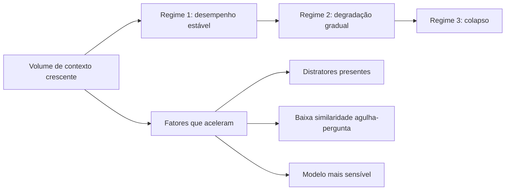

# Capítulo 3 — Context rot: por que mais contexto nem sempre é melhor

## 1. Introdução

O Capítulo 2 estabeleceu a janela como recurso finito e caro. Este capítulo confronta a suposição implícita de que, se a janela é o recurso, então mais janela é mais recurso — e portanto melhor [2]. A evidência empírica derruba essa suposição [2]. O fenômeno documentado pela Chroma como context rot mostra que o desempenho dos modelos degrada à medida que o volume de tokens de entrada cresce — mesmo em tarefas simples e mesmo dentro da capacidade nominal da janela [2]. Este capítulo apresenta a evidência, explica os mecanismos (orçamento de atenção, distratores, similaridade agulha-pergunta), mostra as implicações práticas e constrói as ferramentas para detectar e evitar a degradação [2][9][20].

## 2. Explica

### 2.1 O Estudo da Chroma: Design e Descoberta

O relatório técnico da Chroma, publicado em julho de 2025, investigou o impacto do volume de tokens de entrada no desempenho de modelos [2]. O estudo usou uma adaptação do teste da agulha no palheiro (needle-in-a-haystack): informação alvo (a agulha) escondida em um volume crescente de conteúdo irrelevante (o palheiro) [2][9]. A descoberta central: à medida que o palheiro cresce, a taxa de acerto cai — mesmo quando a informação está dentro da janela e o modelo "deveria" encontrá-la [2]. A degradação não é um artefato de janela estourada: acontece dentro da capacidade nominal [2]. O repositório da Chroma disponibiliza o toolkit de avaliação para replicar o experimento [9].

### 2.2 A Degradação Não-Uniforme

A segunda descoberta do estudo é que a degradação não é uniforme [2]. Modelos diferentes degradam em ritmos diferentes; tarefas diferentes têm sensibilidades diferentes ao volume de contexto [2]. Alguns modelos mantêm desempenho razoável até janelas grandes; outros colapsam cedo [2]. A implicação prática é importante: não existe uma regra universal de "quantos tokens são demais" — existe a necessidade de medir, por modelo e por tarefa, onde a degradação começa [2][20]. O ZenML documenta a mesma preocupação na prática de MLOps: o monitoramento da degradação é parte do ciclo de vida de modelos em produção [20].

### 2.3 A Similaridade Agulha-Pergunta

O estudo identificou um fator que modula a degradação: a similaridade semântica entre a agulha (a informação procurada) e a pergunta [2]. Quando a similaridade é alta — a pergunta usa termos próximos do conteúdo da agulha —, a recuperação tem mais chance de sucesso mesmo em contextos longos [2]. Quando a similaridade é baixa — a pergunta é indireta e a agulha está expressa em outros termos —, a degradação é acelerada [2]. A descoberta tem implicação de design: o contexto não deve apenas conter a informação; deve contê-la em uma forma que se relacione com a tarefa [2][1].

### 2.4 Os Distratores: o Inimigo Invisível

O fator mais severo identificado pelo estudo é a presença de distratores — conteúdos topologicamente semelhantes à agulha, mas incorretos [2]. Quando o palheiro contém informação parecida com a procurada, porém errada, a acurácia despenca muito mais do que com conteúdo neutro [2]. O mecanismo é o orçamento de atenção: o modelo gasta atenção nos distratores plausíveis e perde a agulha correta [2][1]. A implicação prática é profunda: em recuperação de conhecimento, "quase certo" é pior que "claramente irrelevante" [2]. O design do contexto precisa considerar não só o que incluir, mas o que a presença de informação similar pode causar [2][1].

### 2.5 O Orçamento de Atenção Como Explicação

O mecanismo subjacente ao context rot é o orçamento de atenção [2][8]. A atenção é o recurso cognitivo do modelo: cada token compete pela atenção dos demais, e o custo computacional é quadrático [8]. Quando o contexto cresce, a atenção média por token cai — e a informação relevante recebe menos atenção proporcional [2][8]. O Survey de LLMs de Zhao explica o mecanismo de atenção em detalhe; o estudo da Chroma mostra a consequência empírica [8][2]. O orçamento de atenção é a ponte entre a arquitetura (Capítulo 2) e a degradação observada (este capítulo) [2][8].

### 2.6 Mais Contexto, Mais Ruído

O context rot reorienta a mentalidade do engenheiro: mais contexto não é apenas mais custo — é mais ruído [2][1]. Cada token extra adiciona material que compete pela atenção, mesmo quando o material é neutro [2]. O palheiro não é inerte: ele "consome" atenção que poderia ir para a agulha [2]. A frase-resumo do fenômeno — "mais contexto nem sempre é melhor" — é uma tese de engenharia: o contexto ideal é o mínimo suficiente para a tarefa, não o máximo disponível [1][2]. A curadoria é a operação que encontra esse mínimo [1].

### 2.7 A Relação com a Janela Grande

O context rot tem implicação direta na tendência de mercado de janelas gigantes [2][11]. Janelas de 1 milhão a 10 milhões de tokens são vendidas como solução universal — mas o estudo mostra que a capacidade nominal não é desempenho real [2]. A pesquisa sobre LongRAG aprofunda a discussão: janelas longas e recuperação não são concorrentes simples, e o volume dentro da janela precisa ser tratado com a mesma curadoria de sempre [11]. A janela grande é um recipiente maior — não um palheiro melhor [2][11].

### 2.8 O Contexto Curado como Antídoto

Se o excesso degrada, a cura é a curadoria [1][2]. O contexto curado — enxuto, relevante, sem distratores, com a informação na forma certa — preserva o desempenho mesmo quando a tarefa é complexa [1][2]. A evidência de mercado citada no Capítulo 1 (30% vs. 90% de acerto) é a medida agregada desse efeito: a mesma tarefa, com contexto bruto ou curado, produz resultados dramaticamente diferentes [1][12]. O framework write/select/compress/isolate é a receita da curadoria: escrever bem, selecionar o mínimo, comprimir o histórico e isolar as tarefas [1][6][7].

### 2.9 A Detecção da Degradação em Produção

A degradação não acontece só em laboratório — ela ocorre em produção, e precisa ser detectada [20][9]. O ZenML documenta a prática de monitorar a degradação de desempenho com o crescimento do contexto em sistemas reais [20]. Os sinais incluem: queda de acurácia em tarefas que antes funcionavam, respostas genéricas em sessões longas, e aumento de retrabalho (re-execuções) [20]. O toolkit da Chroma fornece a base metodológica para construir os testes de detecção [9]. A detecção precoce é a diferença entre corrigir a curadoria e descobrir a degradação pelo feedback do usuário [20].

### 2.10 A Síntese: Contexto é Decisão, Não Acúmulo

O context rot sintetiza a tese deste livro em uma frase: contexto é decisão, não acúmulo [1][2]. O engenheiro que acumula contexto está construindo um palheiro; o que decide o contexto está construindo uma curadoria [1]. A decisão tem três níveis: o que entra (seleção), o que permanece (manutenção) e o que sai (descarte/compressão) [1][7]. Os próximos capítulos desenvolvem cada nível; este capítulo estabeleceu a razão de ser de todos eles [2].

## 3. Ilustra

### 3.1 A Analogia do Palheiro

A analogia do palheiro é a mais direta [2]. Procurar uma agulha em um palheiro pequeno é fácil; em um palheiro gigante, é quase impossível — não porque a agulha sumiu, mas porque a busca se perde [2]. O context rot é exatamente isso: a agulha (informação) está lá, mas o palheiro (contexto) cresceu a ponto de a busca degradar [2]. O engenheiro de contexto é o agricultor que decide o tamanho do palheiro — e aprendeu que palheiro maior não é fazenda melhor [2][1].

### 3.2 O Diagrama da Degradação

O diagrama abaixo representa a relação entre volume de contexto e desempenho, com os três regimes observados no estudo [2][9].



O diagrama mostra a trajetória típica da degradação: um platô inicial, a queda gradual e o colapso — com os fatores que aceleram a transição [2][9].

### 3.3 O Erro do "Quanto Mais, Melhor"

A imagem do transbordamento do Capítulo 2 se conecta com a do palheiro [2][1]. O iniciante raciocina: "se a janela comporta 200 mil tokens, vou dar todos os documentos ao modelo" [2]. O profissional sabe que o palheiro de 200 mil tokens tem mais agulhas perdidas que o palheiro de 20 mil bem curado [2][1]. A diferença não é a capacidade — é a intenção [1][2].

## 4. Técnica

### 4.1 O Teste da Agulha no Palheiro em Código

O primeiro instrumento implementa o teste da agulha no palheiro: medir a taxa de recuperação de uma informação alvo em contextos de tamanhos crescentes [2][9]. O código abaixo é uma versão didática do experimento da Chroma [2][9]:

```python
import random


def gerar_palheiro(num_distratores: int, sementes: list) -> list:
    """Gera um palheiro de distratores a partir de frases-semente."""
    palheiro = []
    for i in range(num_distratores):
        semente = sementes[i % len(sementes)]
        palheiro.append(f"Item {i + 1}: {semente} relacionado ao contexto geral.")
    return palheiro


def testar_agulha(palheiro: list, agulha: str, consulta: str) -> bool:
    """Simula a recuperação: encontra a agulha se ela aparecer nas respostas."""
    # Simula um modelo: quanto maior o palheiro, menor a chance de acerto,
    # especialmente com distratores.
    ruido = len(palheiro) * 0.02
    if consulta.lower() in agulha.lower():
        chance = max(0.1, 1.0 - ruido)
    else:
        chance = max(0.05, 0.6 - ruido)
    return random.random() < chance


def medir_degradacao(tamanhos: list, sementes: list) -> dict:
    """Mede a taxa de acerto para palheiros de tamanhos crescentes."""
    resultados = {}
    for tamanho in tamanhos:
        palheiro = gerar_palheiro(tamanho, sementes)
        agulha = "O orçamento total do projeto foi de R$ 2,4 milhões."
        consulta = "Qual foi o orçamento total do projeto?"
        acertos = sum(testar_agulha(palheiro, agulha, consulta) for _ in range(50))
        resultados[tamanho] = round(acertos / 50, 2)
    return resultados


if __name__ == "__main__":
    sementes = ["meta de vendas", "prazo de entrega", "responsável técnico"]
    print(medir_degradacao([10, 100, 500, 1000], sementes))
```

O teste materializa o fenômeno: a taxa de acerto cai com o crescimento do palheiro — o experimento que a Chroma documentou em escala real [2][9].

### 4.2 O Detector de Distratores

O segundo instrumento identifica distratores no contexto: conteúdo similar à informação procurada, mas incorreto [2]. O código abaixo calcula a similaridade simples entre a consulta e os candidatos, sinalizando os "quase certos" [2]:

```python
def similaridade_simples(a: str, b: str) -> float:
    """Similaridade por sobreposição de palavras (didática)."""
    palavras_a = set(a.lower().split())
    palavras_b = set(b.lower().split())
    if not palavras_a or not palavras_b:
        return 0.0
    return len(palavras_a & palavras_b) / len(palavras_a | palavras_b)


def detectar_distratores(consulta: str, candidatos: list, limiar: float = 0.4) -> list:
    """Retorna candidatos similarmente relevantes que podem ser distratores."""
    suspeitos = []
    for cand in candidatos:
        sim = similaridade_simples(consulta, cand)
        if sim >= limiar:
            suspeitos.append({"texto": cand, "similaridade": round(sim, 2)})
    return suspeitos


if __name__ == "__main__":
    consulta = "Qual o orçamento total do projeto?"
    candidatos = [
        "O orçamento total do projeto foi de R$ 2,4 milhões.",
        "O orçamento do trimestre passado foi de R$ 1,1 milhão.",
        "A meta de vendas do projeto é de R$ 3 milhões.",
    ]
    print(detectar_distratores(consulta, candidatos))
```

O detector sinaliza os candidatos plausíveis: o segundo item é o distrator clássico — semelhante, porém incorreto [2]. Na recuperação real, essa sinalização alimenta a decisão de curadoria [1][2].

### 4.3 O Monitor de Degradação de Sessão

O terceiro instrumento monitora a degradação ao longo de uma sessão: mede a "saúde do contexto" comparando o desempenho esperado com o observado [20]. O código abaixo implementa o monitor [20]:

```python
class MonitorDegradacao:
    """Monitora sinais de degradação de contexto em produção."""

    def __init__(self, linha_base_acerto: float):
        self.linha_base = linha_base_acerto
        self.execucoes = []

    def registrar(self, tokens_entrada: int, acerto: bool) -> None:
        self.execucoes.append({"tokens": tokens_entrada, "acerto": acerto})

    def janela_recente(self, n: int) -> float:
        recentes = self.execucoes[-n:]
        if not recentes:
            return 0.0
        return sum(1 for e in recentes if e["acerto"]) / len(recentes)

    def alerta(self, n: int = 20, queda: float = 0.15) -> dict:
        atual = self.janela_recente(n)
        return {
            "taxa_recente": round(atual, 2),
            "linha_base": self.linha_base,
            "degradacao_detectada": (self.linha_base - atual) > queda,
            "sugestao": "Revisar curadoria do contexto" if (self.linha_base - atual) > queda else "OK",
        }


if __name__ == "__main__":
    m = MonitorDegradacao(linha_base_acerto=0.85)
    for tokens in [2000] * 10 + [20000] * 15:
        acerto = True if tokens < 5000 else False
        m.registrar(tokens, acerto)
    print(m.alerta())
```

O monitor transforma o context rot em observável de produção: quando a taxa de acerto cai abaixo da linha de base, o sistema sinaliza a necessidade de revisar a curadoria [20].

## 5. Aplica

### 5.1 Onde Isso Vive no Mundo Real

O context rot se manifesta em todos os sistemas com sessões longas e contexto crescente [2][20]. Assistentes de suporte com conversas de horas degradam conforme o histórico cresce [20]. Agentes de programação que acumulam saídas de ferramentas perdem o fio da meada [1]. Ferramentas de análise que injetam documentos inteiros criam palheiros próprios [2]. A prática profissional mede a degradação em cada sistema, com o teste da agulha e o monitor de produção [2][20].

### 5.2 O Erro Comum do Iniciante

O erro mais comum é acreditar na propaganda da janela grande [2]. O iniciante "resolve" o problema de contexto comprando mais janela — e descobre que o desempenho não acompanha [2]. O segundo erro é despejar tudo na janela sem considerar distratores: o manual inteiro, todos os logs, todas as saídas [2]. O terceiro é não medir: a degradação acontece gradualmente e passa despercebida até o usuário reclamar [20]. Os três erros têm o mesmo remédio: curadoria, medição e monitoramento [1][20].

### 5.3 O Padrão Profissional em 2026

O padrão profissional trata o contexto como recurso a ser curado, não acumulado [1][2]. O sistema seleciona o mínimo suficiente para a tarefa [1]. Os distratores são identificados e removidos [2]. A degradação é medida com testes de agulha no palheiro [2][9]. O monitor de produção alerta quando a linha de base cai [20]. A compactação mantém o histórico útil sem deixá-lo crescer indefinidamente [7]. O resultado é um sistema que mantém a qualidade mesmo em sessões longas — a promessa da engenharia de contexto [1][2].

### 5.4 Exercício de Fixação

Construa um teste da agulha para o seu sistema: defina uma informação alvo, um palheiro de distratores realistas e meça a taxa de acerto em palheiros de 10, 100 e 1.000 itens [2][9]. Registre os resultados e identifique o ponto onde a degradação começa [2]. Desenhe a política de curadoria que mantém o desempenho acima da linha de base [1][2].

### 5.5 O Context Rot em Diferentes Arquiteturas

O context rot não atinge todos os sistemas da mesma forma — e conhecer a variação por arquitetura orienta a prevenção [2][1]. A primeira arquitetura é a de **janela única**: um agente com um único contexto que cresce ao longo da sessão [2]. É a mais vulnerável: o crescimento contínuo acumula o palheiro [2]. A mitigação é a compressão (Capítulo 6) e a reserva (Capítulo 2) [1][7]. A segunda arquitetura é a de **janela com recuperação**: o contexto é composto por trechos recuperados sob demanda [3]. Aqui o risco é a quantidade de trechos: recuperar demais recria o palheiro dentro do contexto [2][3]. A mitigação é a seleção rigorosa (Capítulo 5) [1].

A terceira arquitetura é a **multi-agente** com isolamento (Capítulo 7): cada subagente tem janela própria [1]. O context rot aqui é distribuído — cada janela degrada no seu ritmo, e o resumo destilado pode perder precisão se o subagente estiver degradado [1][7]. A mitigação é o monitoramento de cada janela e a re-execução seletiva [1][20]. A quarta arquitetura é a de **streaming**: o contexto é processado em fluxo contínuo, sem janela fixa [17]. A pesquisa sobre Attention Sinks mostra que o streaming tem seus próprios padrões de retenção — início e fim preservados, meio descartado [17]. O context rot em streaming é a perda sistemática do meio [17][5].

A lição transversal é que a prevenção do context rot é arquitetural, não cosmética [1][2]. Cada arquitetura tem seu ponto de degradação, e o engenheiro conhece o ponto da sua [1][2]. O diagnóstico (Capítulo 8) começa exatamente aqui: saber onde a sua arquitetura degrada é saber onde procurar a falha [1][2].

### 5.6 A Relação entre Context Rot e Qualidade da Fonte

O context rot não é apenas um problema de quantidade — é um problema de qualidade da informação [2][1]. O estudo da Chroma mostrou que o conteúdo do palheiro importa tanto quanto o tamanho: distratores semelhantes à agulha degradam muito mais que conteúdo neutro [2]. A implicação profunda é que a curadoria da fonte — a qualidade do material que entra no palheiro — é tão importante quanto a curadoria da seleção [1][2].

A primeira dimensão da qualidade é a **fidelidade**: a fonte contém informação correta e verificável? [12]. Uma base com informação errada cria distratores permanentes [2][12]. A segunda é a **atualidade**: a fonte está atualizada? [1]. Dados antigos são distratores em relação ao presente [1]. A terceira é a **granularidade**: a fonte está no nível certo de detalhe para a tarefa? [1]. Documentos gigantes e genéricos criam palheiros; fragmentos precisos criam agulhas [1]. A quarta é a **consistência**: a fonte usa terminologia consistente com as consultas? [2]. O estudo mostrou que a similaridade agulha-pergunta modula a degradação — e a consistência terminológica é o que sustenta a similaridade [2].

A prática profissional trata a qualidade da fonte como projeto de engenharia [1][12]. O inventário de fontes (Capítulo 1) inclui a avaliação de qualidade; o monitoramento (Capítulo 3) detecta a degradação da fonte; e o diagnóstico (Capítulo 8) rastreia o erro até a fonte [1][12][20]. O engenheiro que cuida apenas da seleção está construindo um castelo sobre areia — o palheiro pode ser pequeno, mas o que está nele ainda é lixo [2][1].

### 5.7 O Context Rot e o Custo do Retrabalho

A degradação do contexto tem um custo que o Capítulo 6 do Livro 2 introduziu para prompts e que agora se aplica ao contexto: o retrabalho [1][2][13]. Quando o contexto degrada, a resposta sai errada ou incompleta — e o sistema precisa executar de novo, com mais contexto ou com curadoria correta [1][2]. O retrabalho multiplica o custo: cada re-execução paga tokens novos, e o resultado pode continuar errado se a causa (o palheiro) não for corrigida [2][13].

A medição do retrabalho é o primeiro passo [1][13]. O sistema registra quantas vezes a mesma tarefa é re-executada e por quê [13]. A taxa de re-execução por tarefa é um termômetro da saúde do contexto: alta, o contexto está poluído; baixa, a curadoria está funcionando [1][13]. O Capítulo 10 integra a métrica ao custo por tarefa concluída [13].

A prevenção do retrabalho é a curadoria preventiva [1][2]. Em vez de corrigir a re-execução, o sistema previne a degradação: seleção rigorosa, monitoramento contínuo e compressão disciplinada [1][2][7]. O custo da prevenção — tempo de design, monitoramento, curadoria — é pequeno comparado ao custo do retrabalho em escala [1][13]. O engenheiro que trata o context rot como incidente, e não como projeto, paga o retrabalho para sempre [2][13].

### 5.8 O Context Rot e a Experiência do Usuário

A degradação do contexto tem efeitos que o usuário sente antes que qualquer métrica registre [2][20]. O primeiro efeito é o **esquecimento perceptível**: o assistente que "perde o fio" da conversa — esquece o que o usuário pediu no início da sessão [2][5]. O usuário não sabe que é context rot; sabe que o assistente "piorou" [2]. O segundo efeito é a **inconsistência**: o mesmo pedido funciona em uma sessão e falha em outra, conforme o palheiro [2][1]. A inconsistência destrói a confiança mais rápido que o erro constante [2][1].

O terceiro efeito é a **resposta genérica**: quando a atenção se dilui, o modelo tende a respostas seguras e superficiais — o oposto do que a tarefa pede [2][7]. O quarto efeito é a **lentidão percebida**: o contexto longo aumenta a latência (Capítulo 2), e o usuário percebe o atraso [13][2]. O quinto efeito é o **retrabalho do usuário**: o usuário reformula o pedido, repete a informação, tenta de novo — custo invisível de cada interação degradada [2][1].

O desenho do contexto é, portanto, também design de experiência [1][2]. O engenheiro que controla o context rot entrega um assistente que lembra, é consistente e responde rápido [1]. O que ignora o fenômeno entrega o oposto — independentemente do modelo usado [2]. A experiência do usuário é a medida final de todas as métricas de contexto [1][20].

### 5.9 O Context Rot em Benchmarks e na Prática de Mercado

A literatura e o mercado convergem na medição do context rot [2][20][12]. Em benchmarks, o fenômeno aparece como a queda de acurácia com o crescimento do contexto — documentada pela Chroma e replicada pela indústria [2][9]. Na prática de mercado, a ZenML documenta o problema em produção: sistemas reais degradam com o contexto longo, e as equipes que medem detectam a queda cedo [20]. O survey de avaliação de RAG reforça a medição da qualidade de contexto como prática padrão [12].

A prática de mercado consolidou três respostas ao context rot [1][2][20]. A primeira é a **medição contínua**: testes de agulha no palheiro rodam em produção, e a degradação é monitorada [2][9][20]. A segunda é a **curadoria como processo**: a seleção e a compressão não são eventos — são operações contínuas do sistema [1][7]. A terceira é a **arquitetura consciente**: os sistemas são desenhados sabendo que a janela degrada — com reserva, compressão e isolamento [1][7][8].

O mercado de 2026 trata o context rot como um problema conhecido e gerenciável — diferente de 2023, quando a janela grande era vendida como solução mágica [2][19]. A maturidade da disciplina se mede por essa mudança: o engenheiro não pergunta mais "qual a maior janela?" — pergunta "como cuido do que cabe?" [1][2]. A evolução é o tema da Parte II inteira [1].

### 5.10 A Prevenção Estrutural do Context Rot

A prevenção do context rot é mais eficaz que a correção [1][2]. A prevenção estrutural combina as disciplinas dos capítulos seguintes em um desenho único [1][2]. O primeiro pilar é a **seleção mínima** (Capítulo 5): apenas o necessário entra na janela [1]. O segundo é a **compressão disciplinada** (Capítulo 6): o histórico é reduzido antes de inchar [7]. O terceiro é o **isolamento** (Capítulo 7): escopos diferentes não se misturam [1].

O quarto pilar é a **reserva permanente** (Capítulo 2): a janela nunca opera no limite [8][1]. O quinto é a **medição contínua** (seção 5.9): a degradação é detectada no início [20][9]. O sexto é o **diagnóstico rápido** (Capítulo 8): quando a degradação aparece, a causa é identificada em minutos [1].

A prevenção estrutural tem um custo inicial — design, monitoramento, processos — e um retorno contínuo: o sistema que não degrada [1][2]. O custo da prevenção é a diferença entre o engenheiro que apaga incêndios e o que projeta sistemas à prova de fogo [1]. A Parte II inteira é, na prática, um manual de prevenção estrutural do context rot [1][2][7].

### 5.11 O Context Rot e a Calibração de Modelos

A degradação do contexto tem um papel na escolha e calibração de modelos [2][8]. O primeiro aspecto é a **comparação de perfis**: ao avaliar modelos candidatos, o engenheiro mede o perfil de degradação de cada um — o mesmo conjunto de testes da agulha, aplicado a cada modelo [2][9]. O resultado orienta a escolha: para o seu volume típico de contexto, qual modelo degrada menos? [2]. O segundo aspecto é a **janela efetiva**: a janela nominal é uma coisa; a janela efetiva — onde o desempenho se mantém — é outra [2][11]. O engenheiro dimensiona pela janela efetiva [2].

O terceiro aspecto é a **configuração de amostragem**: o contexto degradado pode ser mitigado por configurações — temperatura, instruções de recuperação [1][2]. A mitigação por configuração é limitada, mas real [1][2]. O quarto aspecto é a **monitoração da deriva**: o perfil de degradação de um modelo pode mudar entre versões (Capítulo 1, seção 5.12) [2][1]. A revalidação periódica do perfil é parte da operação [2][1].

A calibração de modelos com o context rot em mente é a prática que evita duas falhas opostas [2]: escolher um modelo caro pela janela nominal que nunca usa de fato, e escolher um modelo barato que degrada no seu volume real [2][13]. O teste da agulha é o instrumento da calibração honesta [2][9].

### 5.12 O Estudo de Caso do Manual que Degradou

O estudo de caso mostra o context rot em um cenário real [2][1]. O cenário: um assistente de documentação que injetava o manual inteiro do produto no contexto [2]. O protótipo funcionava — o manual era pequeno [2]. O manual cresceu para 400 páginas; o contexto passou a carregar tudo; a degradação começou [2].

O sintoma: o assistente errava detalhes do manual que estavam no meio do documento [2][5]. A equipe tentou melhorar o manual (mais claro, mais exemplos) — sem efeito [2][1]. O diagnóstico (Capítulo 8): context rot por volume, com lost in the middle na posição (Capítulo 4) [2][5]. O teste da agulha confirmou a queda com o volume [2][9].

O tratamento: a arquitetura mudou — o manual passou a ser referenciado, não embutido (Capítulo 5); os trechos são recuperados sob demanda (Capítulo 9) [1][3]. O contexto por pergunta passou a ser enxuto [1]. O resultado: a acurácia voltou e o custo caiu [1][2]. O caso demonstra o tema do capítulo: mais contexto é uma armadilha — e a arquitetura é o antídoto [2][1].

### 5.13 A Lista de Verificação contra o Context Rot

A lista de verificação consolida a prevenção [1][2]. O primeiro item: o contexto é selecionado, não empilhado? [1]. O segundo: os distratores são identificados e removidos? [2]. O terceiro: a reserva da janela é respeitada? [1][8]. O quarto: a ocupação é monitorada? [1][20]. O quinto: a degradação é medida com o teste da agulha? [2][9].

O sexto item: a qualidade das fontes é avaliada? [1][12]. O sétimo: a compressão roda nos gatilhos? [1][7]. O oitavo: o isolamento protege os escopos? [1]. O nono: o modelo é calibrado pela janela efetiva? [2]. O décimo: a revalidação acompanha as mudanças de modelo? [1][2].

A lista é o resumo operacional: cada item aponta o capítulo que o desenvolve [1][2]. O engenheiro que a percorre na revisão de arquitetura constrói sistemas que não degradam [1][2]. O context rot deixa de ser um fenômeno temido e vira um risco gerenciado [2][1].

### 5.14 O Context Rot e a Relação com o Prompt Engineering

O context rot redefine a relação entre a engenharia de prompts e a de contexto [1][2][19]. O Livro 2 mostrou que prompts não escalam sozinhos; este capítulo mostra que o contexto também degrada [1][2]. A síntese: as duas camadas precisam uma da outra — o prompt calibrado reduz a sensibilidade ao ruído, e o contexto curado dá ao prompt o material limpo para operar [1][2][19].

A primeira interação é a **instrução como mitigação**: um prompt que instrui o modelo a ignorar conteúdo irrelevante reduz o impacto dos distratores [1][2]. A mitigação é limitada — o modelo nem sempre obedece —, mas real [1][2]. A segunda é a **consciência da degradação no design do prompt**: o engenheiro de prompts escreve sabendo que o contexto pode degradar — e evita instruções que dependem de detalhes do meio do contexto [5][2].

A terceira é o **diagnóstico conjunto** (Capítulo 8): a degradação do contexto aparece como erro de resposta — e o engenheiro precisa distinguir se a causa é a instrução ou o ambiente [1][2]. A distinção é o tema do Capítulo 8; este capítulo estabelece o fenômeno que a torna necessária [1][2]. As duas camadas — prompt e contexto — são indissociáveis na prática [1][19].

### 5.15 O Context Rot e o Método de Revisão Autônoma

A série anuncia o método de revisão autônoma entre harness — e o context rot é um dos seus riscos centrais [1][2]. A revisão autônoma depende da fidelidade do contexto: o revisor julga com base no que vê [1][2]. Se o contexto do revisor está degradado — longo, poluído, com distratores —, a revisão é cega [2][1].

A primeira implicação é a **curadoria do contexto de revisão**: o contexto do revisor é tão curado quanto o da execução [1][2]. A segunda é a **verificação da degradação**: antes de revisar, o sistema verifica a saúde do contexto — o monitor do Capítulo 3 [2][20]. A terceira é a **evidência posicionada**: as evidências da revisão são posicionadas fora do meio (Capítulo 4) [5][1].

A Parte III da série construirá o harness que automatiza a revisão; este capítulo estabelece o risco que o harness deve gerenciar [1][2]. O engenheiro que entende o context rot entende por que a revisão autônoma é difícil — e por que a curadoria é a sua pré-condição [1][2].

### 5.16 O Estudo de Caso do Benchmark que Mentia

O estudo de caso mostra a medição enganosa [2][9][1]. O cenário: uma equipe avaliando dois modelos para uma aplicação de contexto intensivo [2]. O benchmark: os modelos foram testados com prompts curtos, sem contexto realista [2][9]. O resultado: o modelo mais caro venceu [2].

A implantação: no uso real, com contexto longo, o resultado se inverteu — o modelo barato degradava menos [2]. O diagnóstico: o benchmark não media o context rot — usava contexto curto demais [2][9]. O teste correto: a agulha no palheiro, com o volume real da aplicação [2][9].

O caso demonstra o tema do capítulo: a avaliação que ignora o context rot engana [2][9]. O engenheiro que avalia com o contexto realista — volume, distratores, posição — escolhe pelo desempenho verdadeiro [2][9][5]. O benchmark honesto é o que replica o ambiente de produção [2][9].

### 5.17 O Context Rot e a Documentação da Arquitetura

O contexto rot deve ser documentado na arquitetura do sistema [1][2]. A documentação responde a perguntas que a operação fará [1][2]. A primeira é o **perfil de degradação**: como o modelo escolhido degrada com o volume? [2][9]. A segunda é a **política de curadoria**: como a seleção, a compressão e o isolamento combatem a degradação? [1][7]. A terceira é o **protocolo de monitoramento**: como a degradação é detectada em produção? [20][9].

A documentação é a memória operacional do risco [1][2]. Quando a degradação aparece, a equipe consulta a documentação — e sabe o que esperar e o que fazer [1][20]. Sem documentação, cada incidente é uma descoberta do zero [1][2].

O engenheiro que documenta o context rot constrói a arquitetura como um sistema ensinável [1][2]. A próxima equipe herda o conhecimento do fenômeno — e não repete os erros da descoberta [1]. A documentação do risco é a prática que separa a arquitetura amadora da profissional [1][2].

### 5.18 O Fechamento do Capítulo

O capítulo do context rot se encerra com a consolidação final [2][1]. O excesso degrada; a degradação é mensurável; a curadoria é o antídoto [2][1]. O estudo da Chroma é a evidência; o teste da agulha é o instrumento; o monitor é a prática [2][9][20].

O engenheiro que domina o context rot constrói sistemas que não se afogam no próprio contexto [1][2]. E, com o volume sob controle, o próximo capítulo revela a segunda dimensão da degradação: a posição [5]. A geografia da janela aguarda [5].

### 5.19 A Mensagem Final do Capítulo

O capítulo do context rot deixa a mensagem que conecta a Parte II [2][1]. O excesso degrada; a degradação é mensurável; a curadoria é o antídoto [2][1]. O fenômeno documentado pela Chroma é a evidência empírica da tese central: mais contexto não é melhor — contexto curado é melhor [2][1].

O engenheiro que domina o context rot constrói sistemas que não se afogam no próprio contexto [1][2]. O próximo capítulo revela a segunda dimensão da degradação: a posição [5].

## 6. Conclusão

O context rot é a evidência empírica que sustenta a tese central da engenharia de contexto: mais contexto não é melhor — contexto curado é melhor [2][1]. O estudo da Chroma documentou a degradação, seus mecanismos (orçamento de atenção, distratores, similaridade agulha-pergunta) e seus fatores [2]. As ferramentas deste capítulo — o teste da agulha, o detector de distratores e o monitor de produção — transformam o fenômeno em disciplina mensurável [2][9][20]. O próximo capítulo aprofunda a geografia da degradação: por que a posição da informação no contexto importa tanto quanto a quantidade [5].

## 7. Referências

[1] ANTHROPIC. Effective context engineering for AI agents. Anthropic Engineering Blog, set. 2025. Disponível em: https://www.anthropic.com/engineering/effective-context-engineering-for-ai-agents. Acesso em: 5 ago. 2026.
[2] HONG, Kelly; TROYNIKOV, Anton; HUBER, Jeff. Context Rot: How Increasing Input Tokens Impacts LLM Performance. Chroma Technical Report, jul. 2025. Disponível em: https://www.trychroma.com/research/context-rot. Acesso em: 5 ago. 2026.
[3] LEWIS, Patrick et al. Retrieval-Augmented Generation for Knowledge-Intensive NLP Tasks. In: Advances in Neural Information Processing Systems (NeurIPS), v. 33, p. 9459–9474, 2020. Disponível em: https://arxiv.org/abs/2005.11401. Acesso em: 5 ago. 2026.
[4] GAO, Yunfan et al. Retrieval-Augmented Generation for Large Language Models: A Survey. arXiv:2312.10997, mar. 2024. Disponível em: https://arxiv.org/abs/2312.10997. Acesso em: 5 ago. 2026.
[5] LIU, Nelson F. et al. Lost in the Middle: How Language Models Use Long Contexts. Transactions of the Association for Computational Linguistics (TACL), v. 12, p. 157–173, 2024. Disponível em: https://arxiv.org/abs/2307.03172. Acesso em: 5 ago. 2026.
[6] ANTHROPIC. Writing tools for AI agents — using AI agents. Anthropic Engineering Blog, set. 2025. Disponível em: https://www.anthropic.com/engineering/writing-tools-for-agents. Acesso em: 5 ago. 2026.
[7] ANTHROPIC. Context engineering: memory, compaction, and tool clearing. Claude Platform Cookbook, mar. 2026. Disponível em: https://platform.claude.com/cookbook/tool-use-context-engineering-context-engineering-tools. Acesso em: 5 ago. 2026.
[8] ZHAO, Wayne Xin et al. A Survey of Large Language Models. arXiv:2303.18223, 2023. Disponível em: https://arxiv.org/abs/2303.18223. Acesso em: 5 ago. 2026.
[9] CHROMA. Context Rot: Evaluation Toolkit. GitHub Repository, 2025. Disponível em: https://github.com/chroma-core/context-rot. Acesso em: 5 ago. 2026.
[10] LIU, Nelson F. Lost in the Middle: Replication Repository. GitHub Repository, 2023. Disponível em: https://github.com/nelson-liu/lost-in-the-middle. Acesso em: 5 ago. 2026.
[11] CHEN, Jiawei et al. LongRAG: Enhancing Retrieval-Augmented Generation with Long-context LLMs. arXiv:2406.15319, 2024. Disponível em: https://arxiv.org/abs/2406.15319. Acesso em: 5 ago. 2026.
[12] ASIA, Research Group et al. Retrieval-Augmented Generation Evaluation in the Era of Large Language Models: A Comprehensive Survey. ResearchGate / arXiv, abr. 2025. Disponível em: https://www.researchgate.net/publication/390991356. Acesso em: 5 ago. 2026.
[13] OPENAI. GPT-4 Technical Report & Developer Guides on Context Management. OpenAI Documentation, 2024–2025. Disponível em: https://openai.com/index/gpt-4-research/. Acesso em: 5 ago. 2026.
[14] GOOGLE CLOUD. What is Retrieval-Augmented Generation (RAG)?. Google Cloud Architecture Center, 2025. Disponível em: https://cloud.google.com/use-cases/retrieval-augmented-generation. Acesso em: 5 ago. 2026.
[15] LANGCHAIN. LangChain Agents & Context Management Documentation. LangChain Guides, 2025–2026. Disponível em: https://python.langchain.com/docs/concepts/agents/. Acesso em: 5 ago. 2026.
[16] WANG, Zhen et al. Agentic Retrieval-Augmented Generation: A Survey on Agentic RAG. arXiv:2408.12999, 2024. Disponível em: https://arxiv.org/abs/2408.12999. Acesso em: 5 ago. 2026.
[17] XIAO, Guangxuan et al. Efficient Streaming Language Models with Attention Sinks. arXiv:2309.17453, 2023. Disponível em: https://arxiv.org/abs/2309.17453. Acesso em: 5 ago. 2026.
[18] RODIN, Alex et al. Found in the Middle: Overcoming Long-Context Vulnerabilities in LLMs. arXiv:2403.04797, 2024. Disponível em: https://arxiv.org/abs/2403.04797. Acesso em: 5 ago. 2026.
[19] MEDIUM (Data Science Collective). Context Is the New Prompt: Why Context Engineering Is Shaping the Future of AI. Medium Article, 2025. Disponível em: https://medium.com/data-science-collective/context-is-the-new-prompt-why-context-engineering-is-shaping-the-future-of-ai-46eb062ed270. Acesso em: 5 ago. 2026.
[20] ZENML. Context Rot: Evaluating LLM Performance Degradation with Increasing Input Tokens. MLOps Database, 2025. Disponível em: https://www.zenml.io/llmops-database/context-rot-evaluating-llm-performance-degradation-with-increasing-input-tokens. Acesso em: 5 ago. 2026.
