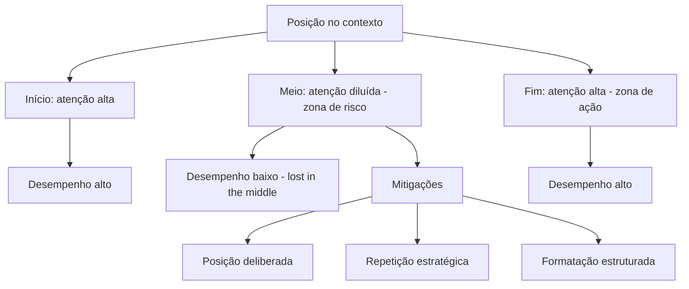

# Capítulo 4 — Lost in the middle: a anatomia do esquecimento posicional

## 1. Introdução

O Capítulo 3 demonstrou que mais contexto degrada o desempenho. Este capítulo mostra que a quantidade não é o único fator — a posição também é [5]. O estudo Lost in the Middle, de Liu e colaboradores, revelou um fenômeno surpreendente: modelos recuperam informação com alta precisão no início e no fim do contexto, mas falham quando a informação crítica está no meio [5]. O resultado contraria a intuição de que a janela é um espaço homogêneo — e tem implicações profundas para o design de contexto [5][10]. Este capítulo apresenta o fenômeno, seus mecanismos, as estratégias de mitigação e as ferramentas para posicionar informação de forma deliberada [5][18].

## 2. Explica

### 2.1 O Experimento Lost in the Middle

O estudo de Liu et al. (2024) investigou como modelos usam informação em contextos longos [5]. A metodologia consistiu em inserir a informação alvo em posições variadas de documentos longos e medir a precisão de recuperação [5]. A descoberta central: o desempenho segue uma curva em forma de U — alta precisão no início, queda no meio e recuperação no fim [5]. O fenômeno é robusto: apareceu em múltiplos modelos e em múltiplos formatos de documento [5]. O repositório de replicação de Liu disponibiliza o código e os dados para reproduzir o experimento [10].

### 2.2 A Curva em Forma de U

A curva em U é a assinatura do fenômeno [5]. No início do contexto, a informação recebe atenção alta — é recente e proeminente [5]. No meio, a informação compete com dezenas de milhares de tokens de ambos os lados, e a atenção se dilui [5][8]. No fim, a informação volta a ser proeminente — está próxima do ponto de geração da resposta [5]. A curva tem implicação direta de design: informação crítica não deve morar no meio do contexto [5][1]. O posicionamento é uma decisão de engenharia, não um acidente de concatenação [5][1].

### 2.3 O Mecanismo: Atenção e Recência

O mecanismo do esquecimento posicional combina dois efeitos [5][8]. O primeiro é a diluição da atenção: cada token no meio compete com mais vizinhos, e a atenção média cai [5][8]. O segundo é o viés de recência: o modelo privilegia informação próxima ao ponto de geração [5][8]. O Survey de Zhao explica a mecânica da atenção em termos arquiteturais [8]; o estudo Lost in the Middle mostra sua consequência observável [5]. A compreensão do mecanismo orienta as mitigações: posicionar bem, repetir o crítico e usar formatos que protejam a informação [5][18].

### 2.4 A Variável de Formato

O estudo revelou que o formato do contexto modula o fenômeno [5]. Documentos com estrutura marcada (cabeçalhos, seções numeradas) degradam menos que blocos contínuos de texto [5]. A informação em formato estruturado é mais recuperável no meio do que a informação em prosa solta [5]. A implicação é prática: o design do contexto não é apenas "o que colocar", mas "em que formato colocar" [5][1]. O Capítulo 5 desenvolve as técnicas de formatação do contexto no pilar Write [1][6].

### 2.5 A Relação com o Context Rot

Lost in the middle e context rot são fenômenos irmãos [2][5]. O context rot documenta a degradação com o volume; o lost in the middle documenta a degradação com a posição [2][5]. Os dois se combinam: contextos longos têm mais "meio", e o meio é onde a informação se perde [2][5]. O tratamento conjunto é a curadoria: menos volume (combate ao context rot) e melhor posicionamento (combate ao lost in the middle) [1][2][5]. O engenheiro de contexto ataca os dois ao mesmo tempo [1].

### 2.6 As Estratégias de Mitigação

A literatura e a prática consolidaram um conjunto de mitigações [5][18]. A primeira é a posição deliberada: informação crítica no início ou no fim [5]. A segunda é a repetição estratégica: reafirmar a informação crítica em mais de uma posição [5][18]. A terceira é a estruturação: formatar o contexto com marcações que protejam a informação [5]. A quarta é a redução: menos volume total, menos meio [2]. A quinta é o encaminhamento: o estudo Found in the Middle documenta abordagens que reorganizam o contexto para mitigar a vulnerabilidade [18]. A combinação é a prática padrão em 2026 [5][18].

### 2.7 A Posição Deliberada como Design

A posição deliberada transforma a descoberta em princípio de design [1][5]. O prompt de sistema (início) carrega as instruções — e o modelo as obedece bem [1]. O fim do contexto, próximo à geração, é reservado para a informação mais crítica da tarefa imediata [5]. O meio é para o material de apoio — com o risco de esquecimento aceito e mitigado [5]. A prática profissional documenta o posicionamento como decisão explícita, não como consequência da ordem de concatenação no código [1][5].

### 2.8 A Relevância da Consulta

O estudo também mostrou que a consulta importa [5][10]. Consultas que mencionam termos próximos da informação alvo recuperam melhor, mesmo no meio [5]. A descoberta conecta com a similaridade agulha-pergunta do Capítulo 3: a forma da consulta e a forma do contexto interagem [2][5]. No design de agentes, a consulta é frequentemente gerada pelo próprio sistema — o que abre espaço para a engenharia da consulta, além da engenharia do contexto [1][5].

### 2.9 A Implicação para RAG

O lost in the middle tem implicação direta para a recuperação de conhecimento (RAG) [5][3]. O padrão clássico de RAG coloca os trechos recuperados no meio do contexto, entre o prompt de sistema e a instrução final — exatamente a zona de pior recuperação [5][3]. As práticas modernas reorganizam: instrução, trechos recuperados e a pergunta final, com a pergunta próxima ao fim [5][3][14]. O Capítulo 9 desenvolve a interação entre RAG e posicionamento [3][5].

### 2.10 A Síntese: a Janela Tem Geografia

A janela de contexto não é um balde homogêneo — tem geografia [5][1]. O início é a zona de instrução; o fim é a zona de ação; o meio é a zona de risco [5]. O engenheiro de contexto lê a janela como um mapa, posicionando cada bloco de informação segundo sua função [1][5]. A geografia da janela é o tema transversal deste capítulo: entendê-la é o pré-requisito para desenhá-la bem [5][18].

## 3. Ilustra

### 3.1 A Analogia do Congestionamento

A analogia do trânsito captura o fenômeno [5]. Em uma avenida (janela), a informação no início (saída do bairro) flui bem; a informação no fim (chegada ao destino) flui bem; a informação no meio (coração da avenida) fica presa no congestionamento da atenção [5]. O motorista experiente (engenheiro) aprende a colocar o passageiro importante (informação crítica) perto da origem ou do destino — e a evitar o miolo congestionado [5][1].

### 3.2 O Diagrama da Curva em U

O diagrama abaixo representa a curva em forma de U do desempenho por posição [5][10].



O diagrama mostra a geografia da janela: as duas zonas de alto desempenho (início e fim), a zona de risco (meio) e as mitigações [5][18].

### 3.3 O Antes e o Depois na Prática

**Antes**: o sistema concatenava o prompt, os documentos e a pergunta em qualquer ordem — e a informação crítica, no meio, era esquecida [5]. **Depois**: o sistema posiciona a pergunta no fim, reafirma a informação crítica e estrutura os documentos [5][18]. A mesma tarefa, com o mesmo conteúdo, produz resultados diferentes apenas pela geografia [5].

## 4. Técnica

### 4.1 O Medidor de Posição Crítica

O primeiro instrumento audita a posição da informação crítica no contexto composto [5]. O código abaixo calcula a posição relativa de cada bloco e sinaliza os que caem na zona de risco [5]:

```python
def auditar_posicoes(blocos: list) -> list:
    """Calcula a posição relativa de cada bloco no contexto composto.

    Retorna uma lista com a posição percentual e a zona de cada bloco.
    """
    total_tokens = sum(b["tokens"] for b in blocos)
    if total_tokens == 0:
        return []
    posicao = 0
    auditoria = []
    for bloco in blocos:
        inicio = posicao / total_tokens
        fim = (posicao + bloco["tokens"]) / total_tokens
        centro = (inicio + fim) / 2
        if centro < 0.2:
            zona = "inicio"
        elif centro > 0.8:
            zona = "fim"
        else:
            zona = "meio_risco"
        auditoria.append({
            "nome": bloco["nome"],
            "posicao_centro": round(centro, 2),
            "zona": zona,
            "critico": bloco.get("critico", False),
        })
        posicao += bloco["tokens"]
    return auditoria


if __name__ == "__main__":
    blocos = [
        {"nome": "prompt_sistema", "tokens": 1200, "critico": True},
        {"nome": "doc_a", "tokens": 5000},
        {"nome": "doc_b", "tokens": 5000},
        {"nome": "doc_c", "tokens": 5000},
        {"nome": "pergunta", "tokens": 200, "critico": True},
    ]
    for item in auditar_posicoes(blocos):
        print(item)
```

O auditor revela a geografia: a pergunta cai no fim (bom), mas se um documento crítico cair no meio, o sistema sinaliza [5].

### 4.2 O Reordenador de Contexto

O segundo instrumento reordena o contexto seguindo a geografia: informação crítica para as bordas, material de apoio no meio [5][18]. O código abaixo implementa o reordenador [5]:

```python
def reordenar_por_geografia(blocos: list) -> list:
    """Reordena blocos: críticos nas bordas, apoio no meio.

    Preserva a ordem relativa dentro de cada grupo.
    """
    criticos = [b for b in blocos if b.get("critico")]
    apoio = [b for b in blocos if not b.get("critico")]
    # Fim: o mais crítico da tarefa imediata (ex.: a pergunta) vai por último.
    fim = criticos[-1:] if criticos else []
    inicio = criticos[:-1] if criticos else []
    return inicio + apoio + fim


if __name__ == "__main__":
    blocos = [
        {"nome": "doc_a", "tokens": 5000},
        {"nome": "pergunta", "tokens": 200, "critico": True},
        {"nome": "doc_b", "tokens": 5000},
        {"nome": "prompt_sistema", "tokens": 1200, "critico": True},
        {"nome": "doc_c", "tokens": 5000},
    ]
    ordem = [b["nome"] for b in reordenar_por_geografia(blocos)]
    print(ordem)
```

O reordenador materializa a posição deliberada: o prompt de sistema vai para o início, a pergunta para o fim e o apoio ocupa o meio [5][18].

### 4.3 O Repetidor Estratégico

O terceiro instrumento implementa a repetição estratégica: reafirmar a informação crítica em mais de uma posição [5][18]. O código abaixo detecta a informação crítica e gera a reafirmação no fim do contexto [5][18]:

```python
def reafirmar_informacao_critica(instrucao: str, fato_critico: str) -> str:
    """Reafirma o fato crítico próximo da instrução final."""
    return (
        f"{instrucao}\n\n"
        f"Lembrete: {fato_critico}\n\n"
        f"Responda com base em TODAS as informações acima."
    )


if __name__ == "__main__":
    instrucao = "Resuma o relatório e aponte os riscos financeiros."
    fato = "O orçamento total do projeto é R$ 2,4 milhões."
    print(reafirmar_informacao_critica(instrucao, fato))
```

A reafirmação coloca o fato crítico na zona de alta atenção (fim) — uma mitigação simples com efeito mensurável [5][18].

## 5. Aplica

### 5.1 Onde Isso Vive no Mundo Real

A geografia da janela afeta todos os sistemas que compõem contexto [5][1]. Agentes de programação que colocam o arquivo ativo no meio e a instrução no início perdem contexto do arquivo [1]. Assistentes de suporte que concatenam o histórico antes da pergunta enterram a pergunta no meio [5]. Sistemas RAG que colocam trechos recuperados no miolo sofrem o esquecimento posicional [5][3]. A prática profissional audita a posição em todos os templates de contexto [5][1].

### 5.2 O Erro Comum do Iniciante

O erro mais comum é concatenar na ordem em que as fontes foram buscadas [5]. O sistema recupera três documentos e os coloca na ordem de recuperação, entre o prompt e a pergunta — criando exatamente a zona de risco [5]. O segundo erro é não distinguir o crítico do apoio: tudo entra no mesmo balde posicional [5]. O terceiro é ignorar o formato: prosa contínua no meio degrada mais que estrutura marcada [5]. Os três erros têm o mesmo remédio: geografia deliberada [5][18].

### 5.3 O Padrão Profissional em 2026

O padrão profissional trata a posição como design [1][5]. O template de contexto tem zonas definidas: instruções no início, apoio no meio, tarefa imediata no fim [5]. A informação crítica é reafirmada [5][18]. Os documentos são estruturados com marcações [5]. A auditoria de posição roda como teste de regressão [5][1]. O resultado é um contexto que o modelo usa de fato — não apenas um contexto que "está lá" [5].

### 5.4 Exercício de Fixação

Audite a geografia de um template de contexto seu: identifique as zonas de cada bloco e as informações críticas [5][1]. Reordene os blocos para proteger o crítico [5]. Adicione uma reafirmação do fato mais importante [5][18]. Compare o desempenho antes e depois com o teste da agulha do Capítulo 3 [2][5].

### 5.5 O Lost in the Middle em Diferentes Formatos de Documento

O fenômeno do esquecimento posicional varia com o formato do documento — e conhecer a variação é parte do design [5][10]. O estudo de Liu et al. testou múltiplos formatos e encontrou diferenças sistemáticas [5]. O primeiro formato é o de **texto contínuo**: a prosa sem estrutura é a mais vulnerável — a informação no meio se perde com facilidade [5]. O segundo é o de **documento estruturado**: com cabeçalhos, seções e numeração, a degradação no meio é menor [5]. O terceiro é o de **lista ou tabela**: a estrutura discreta ajuda a recuperação [5]. A lição é que o formato não é cosmético — é uma dimensão da geografia [5][1].

A implicação prática é direta: quando o contexto precisa carregar material de apoio no meio, o material deve ser estruturado [5][1]. O documento longo é fragmentado em seções nomeadas; os trechos recuperados são marcados; as listas substituem a prosa onde possível [5][1]. O repositório de replicação de Liu fornece os formatos de teste para validar a melhoria [10]. O engenheiro que trata o formato como detalhe paga o lost in the middle em cada sessão longa [5].

Há também a dimensão do **idioma e do domínio** [5][1]. O fenômeno aparece em documentos em diferentes idiomas, e a estruturação precisa considerar o idioma do leitor (o modelo) [1][5]. Um documento jurídico estruturado em cláusulas numeradas degrada menos que o mesmo conteúdo em prosa contínua [5][1]. A formatação é a primeira linha de defesa contra o esquecimento posicional [5][1].

### 5.6 A Interação com a Compressão e a Memória

O lost in the middle interage com as operações de compressão (Capítulo 6) e com a memória (Capítulo 10) de formas que o engenheiro precisa conhecer [5][7]. A interação com a compressão: quando o histórico é compactado em resumo, o resumo ocupa o lugar do histórico na janela — e o resumo, se colocado no meio, sofre o mesmo esquecimento [5][7]. A prática é posicionar o resumo compactado na zona de alta atenção, perto do fim, onde a tarefa atual será executada [5][7].

A interação com a memória: o que a compactação preserva e a memória recebe também tem geografia [7][5]. A memória de longo prazo (Capítulo 10) é recuperada e inserida na janela — e a inserção, se no meio, degrada [5][7]. O sistema maduro posiciona a memória recuperada estrategicamente: os fatos críticos perto do fim, o contexto de apoio no meio estruturado [5][7].

A interação com o RAG (Capítulo 9) é a mais delicada [5][3]. Os trechos recuperados, na arquitetura clássica, entram no meio — a zona de risco [5][3]. As práticas modernas reorganizam o fluxo: pergunta, trechos, instrução final, com a pergunta e a instrução nas bordas [3][5]. O Capítulo 9 detalha a interação; a lição desta subseção é que o posicionamento do material recuperado é uma decisão de design do sistema inteiro — não um detalhe da biblioteca de RAG [3][5].

### 5.7 O Lost in the Middle como Ferramenta de Diagnóstico

O fenômeno do esquecimento posicional é também uma ferramenta de diagnóstico — a segunda utilidade que o capítulo entrega [5][1]. Quando um sistema erra de forma intermitente, a primeira hipótese profissional não é "o modelo é burro" — é "a informação crítica está no meio?" [5][1]. A auditoria de posição (seção 4.1) responde em minutos: se a informação crítica cai no meio, o lost in the middle é a causa provável [5][1].

O diagnóstico posicional se conecta ao protocolo do Capítulo 8 [1][5]. A classe "falha de contexto" tem, como primeiro teste, a posição: a informação necessária estava presente e bem posicionada? [1][5]. O teste é barato (auditar o template) e tem alto poder de discriminação [5][1]. O engenheiro que ignora a posição atribui ao prompt o que é geografia — e desperdiça semanas [1][5].

A prática de registro do diagnóstico posicional alimenta o aprendizado do sistema [1][15]. Cada incidente registrado com a posição do bloco crítico constrói o histórico de falhas de geografia [15]. Com o tempo, o sistema aprende os padrões: quais tipos de tarefa sofrem mais, quais formatos protegem melhor [5][15]. O lost in the middle, de fenômeno surpreendente, vira conhecimento operacional — a marca do engenheiro maduro [5][1].

### 5.8 A Geografia em Diferentes Arquiteturas de Agentes

A geografia da janela varia com a arquitetura do agente — e o engenheiro adapta o design a cada uma [5][1]. Na arquitetura de **agente de turno único**, a geografia é simples: instrução, contexto, pergunta — e a pergunta no fim [5][1]. Na arquitetura de **conversa multi-turno**, a geografia muda com o tempo: o histórico cresce, e a pergunta atual precisa permanecer no fim [5][1][7]. A compactação (Capítulo 6) é o que mantém a geografia: o histórico resumido ocupa menos e a pergunta atual mantém a posição [5][7].

Na arquitetura de **agente com ferramentas**, a geografia precisa acomodar as saídas — que tendem a crescer no meio [6][5]. O design posiciona as saídas recentes perto do fim (onde a decisão acontece) e as antigas no meio estruturado [6][5]. Na arquitetura **multi-agente** (Capítulo 7), cada subagente tem sua geografia, e o resumo destilado atravessa a fronteira [1][5]. O resumo, ao entrar na janela do agente principal, deve ocupar uma posição coerente com a sua função [1][5].

A lição transversal: a geografia não é um template fixo — é um sistema que se adapta à arquitetura [5][1]. O engenheiro maduro conhece a geografia natural da sua arquitetura e desenha a composição em torno dela [5][1]. O Capítulo 8 usa a geografia como ferramenta de diagnóstico; este capítulo a estabelece como dimensão de design [5][1].

### 5.9 A Posição e a Interface com o Usuário

A geografia interna da janela tem reflexos na experiência do usuário [5][1]. O primeiro reflexo é a **aderência à pergunta**: quando a pergunta fica no fim (zona de ação), o modelo responde ao que foi perguntado [5][1]. Quando a pergunta se perde no meio do histórico, o modelo responde a um eco da conversa — e o usuário percebe a desconexão [5]. O segundo reflexo é a **memória do contexto**: o usuário espera que o assistente lembre o que foi dito — e a memória depende da posição e da compactação [5][7].

O terceiro reflexo é a **consistência entre turnos**: o usuário que reformula a pergunta espera que o assistente a trate como continuação [5][1]. A continuação depende do histórico recente estar na zona de alta atenção [5][1]. O quarto reflexo é o **custo da reformulação**: quando o usuário precisa repetir informação porque o assistente esqueceu, o custo de interação sobe [5][1].

O design da geografia é, portanto, parte do design de produto [5][1]. O engenheiro que posiciona a pergunta no fim e mantém o recente na zona de atenção entrega um assistente que "parece inteligente" — porque, na prática, usa bem a janela [5][1]. O que ignora a geografia entrega um assistente que "parece burro" — mesmo com um modelo excelente [5]. A geografia é a ponte entre a arquitetura e a percepção [5][1].

### 5.10 O Estudo de Caso do Relatório Perdido

O estudo de caso consolida o capítulo [5][1]. O cenário: um agente de análise que gera relatórios com base em documentos [1]. O sistema concatena: prompt, três documentos e a instrução de geração [5]. O sintoma: o relatório ignora sistematicamente as informações do segundo documento — o do meio [5]. A equipe tentou reformular o prompt (falha de diagnóstico) e melhorar o documento (sem efeito) [1][5].

O diagnóstico correto (Capítulo 8): a informação crítica do segundo documento estava na zona de risco — o meio [5][1]. O teste da auditoria de posição (seção 4.1) revelou a geografia em segundos [5]. O tratamento: reorganizar o contexto — os fatos críticos do segundo documento foram reafirmados perto da instrução final (repetição estratégica, seção 2.6) [5][18]. O relatório passou a citar o segundo documento [5][18].

A lição do caso é dupla [5][1]. Primeiro, o sintoma (relatório incompleto) não indicava a causa (geografia) [5]. Segundo, o tratamento foi mais barato que o diagnóstico errado: uma reordenação, não uma reescrita [5][1]. O caso demonstra o poder do capítulo: conhecer a geografia é diagnosticar e corrigir em minutos o que parecia um mistério [5][1].

### 5.11 O Posicionamento em Conversas Multi-Turno

A geografia em conversas multi-turno tem uma dinâmica própria que o engenheiro controla [5][7]. O problema central: o histórico cresce a cada turno, e a pergunta atual precisa permanecer na zona de alta atenção (o fim) [5][1]. Sem gestão, o histórico empurra a pergunta para o meio — e o lost in the middle ataca [5]. O primeiro controle é a **reordenação por turno**: a composição do contexto reordena os blocos a cada turno — o recente para o fim, o antigo para o meio estruturado [5][1].

O segundo controle é a **compactação por turno** (Capítulo 6): os turnos antigos são resumidos antes de empurrar a pergunta [5][7]. O resumo do turno antigo, no meio, degrada menos que o texto integral [5][7]. O terceiro é a **reafirmação da tarefa**: a tarefa em andamento é reafirmada perto da pergunta — a repetição estratégica aplicada à conversa [5][18].

O quarto controle é o **limite de profundidade**: a conversa além de N turnos é compactada agressivamente, mantendo apenas o fio condutor [7][5]. O desenho da geografia multi-turno é a combinação de posicionamento e compactação — as duas disciplinas dos Capítulos 4 e 6 trabalhando juntas [5][7]. O engenheiro que domina a conversa multi-turno domina o caso mais comum de produção [5][1].

### 5.12 O Estudo de Caso do Suporte que Esquecia

O estudo de caso mostra a geografia em uma aplicação de suporte [5][1]. O cenário: um chatbot de suporte que atende sessões longas — o usuário descreve um problema complexo com muitos detalhes [5]. O sintoma: o chatbot esquecia os detalhes do início da conversa quando o usuário perguntava no fim [5]. A equipe tentou aumentar a janela (custo, sem efeito) [5][13].

O diagnóstico (Capítulo 8): os detalhes do início haviam sido empurrados para o meio pelo histórico crescente — lost in the middle [5]. A auditoria de posição confirmou: os detalhes críticos estavam na zona de risco [5]. O tratamento: a composição por turno reordena os blocos; os detalhes críticos são reafirmados perto da pergunta; o histórico antigo é compactado (Capítulo 6) [5][7][18].

O resultado: o chatbot passou a lembrar os detalhes do início [5]. O caso demonstra o tema do capítulo: a geografia não é um detalhe de implementação — é a diferença entre um assistente que lembra e um que esquece [5][1]. E mostra a interação com a compactação: sem ela, a geografia não sobrevive à sessão longa [5][7].

### 5.13 A Lista de Verificação da Geografia

A lista de verificação consolida o capítulo [5][1]. O primeiro item: a informação crítica está nas bordas (início ou fim)? [5]. O segundo: a pergunta atual está na zona de ação? [5][1]. O terceiro: o material de apoio está estruturado (não prosa contínua)? [5]. O quarto: os trechos recuperados (Capítulo 9) estão posicionados fora do meio? [5][3].

O quinto item: a reafirmação estratégica protege os fatos críticos? [5][18]. O sexto: a compactação impede o histórico de empurrar a pergunta? [5][7]. O sétimo: a auditoria de posição roda nos testes de regressão? [5][1]. O oitavo: a geografia é adaptada à arquitetura (turno único, multi-turno, subagentes)? [5][1].

A lista é o resumo operacional do capítulo [5][1]. O engenheiro que a percorre no design do template evita o esquecimento posicional antes que ele aconteça [5][1]. A geografia deixa de ser um fenômeno surpreendente e vira uma dimensão controlada do design [5][1].

### 5.14 A Relação entre Geografia e Fenômenos Vizinhos

A geografia da janela não existe isolada — interage com os fenômenos estudados nos capítulos vizinhos [5][2][1]. A primeira interação é com o **context rot** (Capítulo 3): o volume e a posição são duas dimensões da mesma degradação [2][5]. Contextos longos criam mais "meio" — e o meio é onde o lost in the middle ataca [2][5]. O tratamento é conjunto: menos volume (seleção) e melhor posição (geografia) [1][2][5].

A segunda interação é com o **isolamento** (Capítulo 7): a geografia de cada janela de subagente precisa ser desenhada — e o resumo destilado que atravessa a fronteira tem posição na janela do coordenador [1][5]. A terceira é com a **recuperação** (Capítulo 9): os trechos recuperados têm posição crítica — e o RAG mal posicionado sofre o esquecimento [3][5]. A quarta é com a **compressão** (Capítulo 6): o resumo compactado, se colocado no meio, degrada [7][5].

O engenheiro que conhece as interações trata a geografia como parte do sistema — não como um detalhe isolado [5][1]. O diagnóstico (Capítulo 8) usa as interações: uma falha pode combinar volume, posição e isolamento [1][2][5]. A compreensão integrada é a marca da maturidade na disciplina [1][5].

### 5.15 O Estudo de Caso do Meio Esquecido em Documento Longo

O estudo de caso aprofunda a aplicação em documentos longos [5][1]. O cenário: um agente que resume contratos de 200 páginas [5]. O protótipo concatenava o contrato inteiro e pedia o resumo [5]. O sintoma: o resumo ignorava sistematicamente as cláusulas do meio do documento — exatamente onde ficam as cláusulas de pagamento [5]. A equipe tentou prompts melhores — sem efeito [5][1].

O diagnóstico: lost in the middle em documento único — as cláusulas do meio estavam na zona de risco [5]. O teste: a auditoria de posição (seção 4.1) confirmou [5]. O tratamento: o contrato foi fragmentado em seções; as cláusulas críticas (pagamento, prazo, multa) foram reafirmadas perto da instrução final; o documento foi estruturado com marcações [5][18].

O resultado: o resumo passou a cobrir as cláusulas do meio [5]. O caso demonstra o tema do capítulo em sua forma mais pura: o conteúdo estava lá — a posição é que matava [5][1]. E mostra o poder da repetição estratégica: reafirmar o crítico na zona de ação [5][18].

### 5.16 A Lista de Verificação Final da Geografia

A lista de verificação final consolida o capítulo e suas interações [5][1]. O primeiro item: a informação crítica está nas bordas — em todos os templates? [5]. O segundo: a pergunta atual está sempre na zona de ação? [5][1]. O terceiro: o histórico antigo é compactado antes de empurrar a pergunta? [5][7].

O quarto item: os trechos recuperados (RAG) estão fora do meio? [3][5]. O quinto: os resumos compactados são posicionados com intenção? [7][5]. O sexto: a auditoria de posição roda nos testes de regressão de todos os templates? [5][1]. O sétimo: a geografia é revisada quando o modelo muda de versão? [5][1].

A lista é o resumo operacional definitivo [5][1]. O engenheiro que a percorre controla a dimensão mais esquecida da engenharia de contexto [5]. A geografia — junto com o volume e a qualidade — completa a tríade do que o modelo vê [5][1][2].

### 5.17 A Geografia e o Design de Templates Reutilizáveis

A geografia não se aplica apenas a um contexto — aplica-se ao design de templates reutilizáveis [5][1]. O template é a receita da composição: as zonas, a ordem e as regras de posicionamento [1][5]. O primeiro princípio do template é a **declaração de zonas**: o template define explicitamente as zonas — instrução, apoio, ação — e o que vai em cada uma [5][1]. O segundo é a **regra de posição por tipo**: cada tipo de bloco tem posição definida — instruções no início, tarefa no fim, apoio no meio estruturado [5][1].

O terceiro princípio é a **parametrização da geografia**: o template recebe parâmetros que controlam a posição — onde o trecho recuperado entra, onde o resumo compactado é colocado [5][1]. O quarto é a **validação do template**: o teste de regressão valida que a geografia do template está correta — a auditoria de posição roda automaticamente [5][1].

O template com geografia explícita é a materialização da disciplina [5][1]. O engenheiro que o desenha uma vez espalha a qualidade por todas as composições [5][1]. O que improvisa a posição em cada composição paga o lost in the middle repetidamente [5]. O template é o instrumento da consistência — e a consistência é a marca do padrão profissional [5][1].

### 5.18 O Fechamento do Capítulo

O capítulo da geografia se encerra com a consolidação [5][1]. A janela tem geografia: o início instrui, o fim age, o meio arrisca [5]. O lost in the middle é o fenômeno que revela a geografia — e a curva em U, a sua assinatura [5]. As mitigações — posição deliberada, repetição estratégica, estruturação — transformam o fenômeno em design [5][18].

O engenheiro que domina a geografia controla a dimensão mais esquecida do contexto [5][1]. A geografia completa a tríade do que o modelo vê — quantidade (Capítulo 3), qualidade (Capítulo 1) e posição (este capítulo) [5][1][2]. O próximo capítulo inicia o framework operacional: Write e Select [1][6].

### 5.19 A Geografia e a Avaliação da Qualidade de Resposta

A geografia tem um efeito mensurável na qualidade — e o engenheiro o mede [5][12]. O primeiro instrumento é a **comparação de posições**: a mesma tarefa executada com a informação crítica em posições diferentes — início, meio, fim — e a qualidade medida em cada caso [5][12]. O experimento é a aplicação do teste de isolamento de variáveis (Capítulo 8) à geografia [1][5].

O segundo instrumento é a **métrica de posição**: o conjunto de avaliação (Capítulo 10) inclui casos que variam a posição da informação [5][12]. A regressão — a informação que antes estava no início e agora caiu no meio — é detectada pela métrica [5][12]. O terceiro é o **registro do efeito**: os resultados das comparações entram no registro de diagnóstico [1][15].

O engenheiro que mede a geografia transforma o fenômeno em métrica — e a métrica em decisão [5][12]. A geografia deixa de ser crença e vira evidência [5]. A avaliação da qualidade de resposta completa o ciclo: o design da posição é validado pelo resultado observado [5][1].

### 5.20 O Fechamento do Capítulo

O capítulo da geografia se encerra com a consolidação final [5][1]. A janela tem geografia; o lost in the middle é a evidência; a curva em U é a assinatura [5]. As mitigações — posição, repetição, estrutura — são o design [5][18]. A avaliação — comparação, métrica, registro — é a validação [5][12].

O engenheiro que domina a geografia completa a tríade do que o modelo vê: quantidade, qualidade e posição [5][1][2]. Com as bases da janela firmes, o próximo capítulo inicia o framework operacional: Write e Select [1][6].

### 5.21 O Fechamento do Capítulo

O capítulo da geografia se encerra com a consolidação definitiva [5][1]. A janela tem geografia; o lost in the middle é a evidência; a curva em U é a assinatura; as mitigações são o design; a avaliação é a validação [5][18][12].

O engenheiro que domina a geografia controla a dimensão mais esquecida do contexto [5][1]. A tríade do que o modelo vê — quantidade, qualidade e posição — está completa [5][1][2]. O próximo capítulo inicia o framework operacional: Write e Select [1][6].

## 6. Conclusão

A janela de contexto tem geografia, e a geografia decide o desempenho [5]. O lost in the middle demonstrou a curva em U: início e fim são zonas de alta atenção; o meio é a zona de risco [5]. As mitigações — posição deliberada, repetição estratégica, formatação estruturada e redução de volume — transformam a descoberta em design [5][18][2]. As ferramentas deste capítulo auditam e reordenam o contexto segundo a geografia [5]. O próximo capítulo inicia o núcleo operacional do livro: o framework write/select/compress/isolate, começando pelas operações Write e Select [1][6].

## 7. Referências

[1] ANTHROPIC. Effective context engineering for AI agents. Anthropic Engineering Blog, set. 2025. Disponível em: https://www.anthropic.com/engineering/effective-context-engineering-for-ai-agents. Acesso em: 5 ago. 2026.
[2] HONG, Kelly; TROYNIKOV, Anton; HUBER, Jeff. Context Rot: How Increasing Input Tokens Impacts LLM Performance. Chroma Technical Report, jul. 2025. Disponível em: https://www.trychroma.com/research/context-rot. Acesso em: 5 ago. 2026.
[3] LEWIS, Patrick et al. Retrieval-Augmented Generation for Knowledge-Intensive NLP Tasks. In: Advances in Neural Information Processing Systems (NeurIPS), v. 33, p. 9459–9474, 2020. Disponível em: https://arxiv.org/abs/2005.11401. Acesso em: 5 ago. 2026.
[4] GAO, Yunfan et al. Retrieval-Augmented Generation for Large Language Models: A Survey. arXiv:2312.10997, mar. 2024. Disponível em: https://arxiv.org/abs/2312.10997. Acesso em: 5 ago. 2026.
[5] LIU, Nelson F. et al. Lost in the Middle: How Language Models Use Long Contexts. Transactions of the Association for Computational Linguistics (TACL), v. 12, p. 157–173, 2024. Disponível em: https://arxiv.org/abs/2307.03172. Acesso em: 5 ago. 2026.
[6] ANTHROPIC. Writing tools for AI agents — using AI agents. Anthropic Engineering Blog, set. 2025. Disponível em: https://www.anthropic.com/engineering/writing-tools-for-agents. Acesso em: 5 ago. 2026.
[7] ANTHROPIC. Context engineering: memory, compaction, and tool clearing. Claude Platform Cookbook, mar. 2026. Disponível em: https://platform.claude.com/cookbook/tool-use-context-engineering-context-engineering-tools. Acesso em: 5 ago. 2026.
[8] ZHAO, Wayne Xin et al. A Survey of Large Language Models. arXiv:2303.18223, 2023. Disponível em: https://arxiv.org/abs/2303.18223. Acesso em: 5 ago. 2026.
[9] CHROMA. Context Rot: Evaluation Toolkit. GitHub Repository, 2025. Disponível em: https://github.com/chroma-core/context-rot. Acesso em: 5 ago. 2026.
[10] LIU, Nelson F. Lost in the Middle: Replication Repository. GitHub Repository, 2023. Disponível em: https://github.com/nelson-liu/lost-in-the-middle. Acesso em: 5 ago. 2026.
[11] CHEN, Jiawei et al. LongRAG: Enhancing Retrieval-Augmented Generation with Long-context LLMs. arXiv:2406.15319, 2024. Disponível em: https://arxiv.org/abs/2406.15319. Acesso em: 5 ago. 2026.
[12] ASIA, Research Group et al. Retrieval-Augmented Generation Evaluation in the Era of Large Language Models: A Comprehensive Survey. ResearchGate / arXiv, abr. 2025. Disponível em: https://www.researchgate.net/publication/390991356. Acesso em: 5 ago. 2026.
[13] OPENAI. GPT-4 Technical Report & Developer Guides on Context Management. OpenAI Documentation, 2024–2025. Disponível em: https://openai.com/index/gpt-4-research/. Acesso em: 5 ago. 2026.
[14] GOOGLE CLOUD. What is Retrieval-Augmented Generation (RAG)?. Google Cloud Architecture Center, 2025. Disponível em: https://cloud.google.com/use-cases/retrieval-augmented-generation. Acesso em: 5 ago. 2026.
[15] LANGCHAIN. LangChain Agents & Context Management Documentation. LangChain Guides, 2025–2026. Disponível em: https://python.langchain.com/docs/concepts/agents/. Acesso em: 5 ago. 2026.
[16] WANG, Zhen et al. Agentic Retrieval-Augmented Generation: A Survey on Agentic RAG. arXiv:2408.12999, 2024. Disponível em: https://arxiv.org/abs/2408.12999. Acesso em: 5 ago. 2026.
[17] XIAO, Guangxuan et al. Efficient Streaming Language Models with Attention Sinks. arXiv:2309.17453, 2023. Disponível em: https://arxiv.org/abs/2309.17453. Acesso em: 5 ago. 2026.
[18] RODIN, Alex et al. Found in the Middle: Overcoming Long-Context Vulnerabilities in LLMs. arXiv:2403.04797, 2024. Disponível em: https://arxiv.org/abs/2403.04797. Acesso em: 5 ago. 2026.
[19] MEDIUM (Data Science Collective). Context Is the New Prompt: Why Context Engineering Is Shaping the Future of AI. Medium Article, 2025. Disponível em: https://medium.com/data-science-collective/context-is-the-new-prompt-why-context-engineering-is-shaping-the-future-of-ai-46eb062ed270. Acesso em: 5 ago. 2026.
[20] ZENML. Context Rot: Evaluating LLM Performance Degradation with Increasing Input Tokens. MLOps Database, 2025. Disponível em: https://www.zenml.io/llmops-database/context-rot-evaluating-llm-performance-degradation-with-increasing-input-tokens. Acesso em: 5 ago. 2026.
