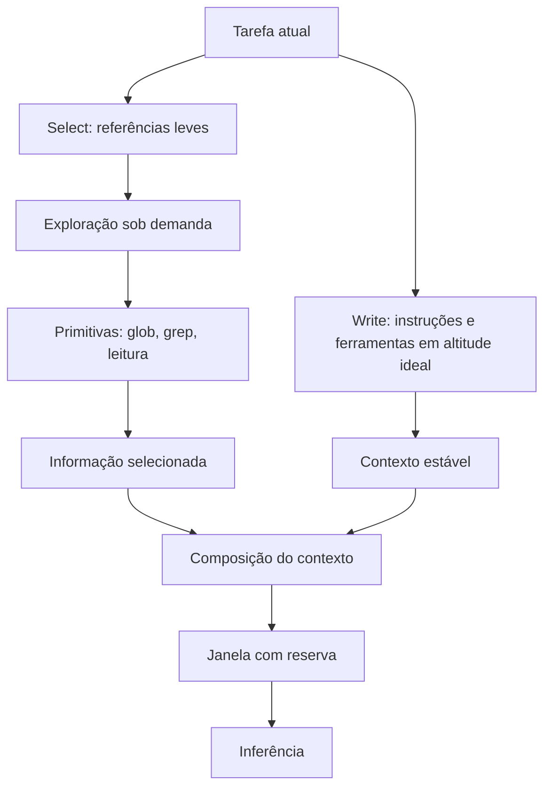

# Capítulo 5 — Write e select: escrever e selecionar o contexto certo

## 1. Introdução

Os três primeiros capítulos estabeleceram o problema: a janela é finita (Capítulo 2), o excesso degrada (Capítulo 3) e a posição importa (Capítulo 4) [8][2][5]. Este capítulo inicia a solução: o framework write/select/compress/isolate, a receita da curadoria de contexto consolidada pela Anthropic [1]. As duas primeiras operações — Write e Select — são o objeto deste capítulo [1][6]. Write trata da produção de instruções e ferramentas em "altitude ideal": específicas o suficiente para dirigir, flexíveis o suficiente para não quebrar [1][6]. Select trata da escolha just-in-time do que entra na janela, substituindo o empilhamento estático pela exploração sob demanda [1]. Juntas, elas respondem às duas perguntas fundamentais da curadoria: como escrever e o que selecionar [1][6].

## 2. Explica

### 2.1 A Altitude Ideal da Instrução

O princípio central do Write é a altitude ideal [1][6]. Instruções em altitude baixa demais são regras if-else rígidas: quebram em qualquer variação da tarefa e exigem manutenção constante [1]. Instruções em altitude alta demais são generalizações vagas: "seja útil" não dirige nada [1]. A altitude ideal fica entre as duas: instruções específicas sobre o que fazer, com flexibilidade sobre como fazer [1]. A Anthropic documenta o princípio no contexto de design de ferramentas e instruções para agentes [6]. O engenheiro de contexto escreve para a altitude certa — e revisa a altitude quando o comportamento degrada [1][6].

### 2.2 O Write de Instruções Estáveis

As instruções estáveis — o prompt de sistema, as políticas da organização — são o componente permanente do contexto [1][6]. O Write dessas instruções segue princípios específicos [1][6]. Primeiro, a estabilidade: o que não muda frequentemente não deve ser reescrito a cada chamada [1]. Segundo, a concisão: cada token de instrução ocupa espaço que poderia ser de dado relevante [1][8]. Terceiro, a testabilidade: instruções devem ser verificáveis — é possível dizer se foram seguidas? [6]. Quarto, a separação: instruções estáveis não se misturam com dados de sessão [1]. O padrão profissional versiona as instruções estáveis como código [1][15].

### 2.3 O Write de Ferramentas

As ferramentas são a extensão do agente sobre o mundo — e sua descrição é parte do contexto [6][21]. A Anthropic documenta o design de ferramentas para agentes: descrições claras, parâmetros bem definidos e acoplamento baixo [6]. A descrição da ferramenta que entra no contexto deve comunicar o que a ferramenta faz, quando usá-la e o que retorna [6]. O Model Context Protocol (MCP) padroniza a exposição de ferramentas e fontes de dados aos agentes — um padrão aberto que separa a definição da ferramenta do código que a consome [21]. O Write de ferramentas é, na prática, o design da interface entre o agente e o mundo [6][21].

### 2.4 A Crítica ao Pré-processamento Estático

A operação Select nasce de uma crítica ao padrão antigo: o pré-processamento estático [1]. O sistema antigo embutia tudo no contexto de antemão — manuais inteiros, bases completas, históricos totais — na esperança de que o modelo encontrasse o necessário [1]. O custo é triplo: custo financeiro (tokens), degradação (context rot) e esquecimento posicional (lost in the middle) [2][5][13]. A crítica da Anthropic é direta: o pré-processamento estático massivo é o oposto da curadoria [1]. O Select substitui o "embutir tudo" pelo "buscar sob demanda" [1].

### 2.5 A Seleção Just-in-Time

A seleção just-in-time é o coração do Select [1]. Em vez de embutir o conteúdo, o contexto carrega referências leves — caminhos de arquivos, links, metadados — e o agente explora essas referências sob demanda, usando primitivas como glob e grep [1]. A analogia da Anthropic é a cognição humana: um especialista não memoriza a biblioteca; sabe onde procurar e consulta quando precisa [1]. A seleção just-in-time reduz o contexto ao mínimo necessário para o passo atual, preservando a capacidade de acessar o resto quando preciso [1]. O resultado é contexto enxuto e desempenho preservado [1][2].

### 2.6 As Primitivas de Exploração

O Select depende de ferramentas de exploração eficientes [1][6]. Glob encontra arquivos por padrão de nome; grep encontra linhas por padrão de conteúdo; ambos retornam resultados compactos [1][6]. A combinação permite ao agente navegar um repositório sem carregá-lo inteiro [1]. O design dessas ferramentas segue o princípio do Write: descrições claras, saída compacta e alta eficiência de tokens [6]. O repositório é a biblioteca; as primitivas são o catálogo; o contexto carrega apenas o catálogo [1][6].

### 2.7 A Consulta Como Motor da Seleção

A seleção just-in-time é dirigida por consultas — e a qualidade da consulta decide a qualidade da seleção [1][5]. O Capítulo 4 mostrou que a similaridade entre consulta e informação modula a recuperação [5]. O design da consulta é, portanto, parte do design do contexto [1]. Consultas específicas selecionam melhor; consultas vagas retornam demais [1]. O padrão profissional escreve a consulta como uma especificação da informação necessária para o passo atual [1][5].

### 2.8 O Orçamento da Seleção

A seleção opera dentro do orçamento da janela (Capítulo 2) [1][8]. Cada passo da sessão tem um orçamento de contexto: quanto pode ser selecionado sem estourar a reserva [1][8]. A seleção just-in-time respeita o orçamento por natureza — seleciona o mínimo para o passo [1]. A interação entre Select e orçamento é a disciplina diária do engenheiro de contexto: selecionar o suficiente, nunca o máximo [1][8].

### 2.9 A Relação com a Recuperação

O Select e a recuperação (RAG) são primos [1][3]. Ambos selecionam informação para entrar na janela; a diferença é o mecanismo [1][3]. O Select opera sobre referências e primitivas; a recuperação opera sobre índices vetoriais e similaridade semântica [1][3][14]. Em sistemas maduros, os dois se combinam: o agente usa Select para navegar e recuperação para buscar por significado [1][3]. O Capítulo 9 desenvolve a recuperação; este capítulo estabelece o princípio comum: contexto é selecionado, não empilhado [1][3].

### 2.10 A Síntese: Escrever e Selecionar São Duas Faces da Mesma Curadoria

Write e Select são complementares [1]. O Write produz o material de qualidade — instruções em altitude ideal, ferramentas bem descritas [1][6]. O Select decide o que desse material entra na janela em cada passo [1]. Um sem o outro falha: escrever bem e empilhar tudo desperdiça a escrita; selecionar bem com material ruim seleciona ruído [1][2]. A curadoria é o par indissolúvel [1].

## 3. Ilustra

### 3.1 A Analogia do Especialista

A analogia do especialista humano é a mais direta [1]. Um médico experiente não memoriza todos os livros de medicina — sabe o que procurar, quando e onde [1]. Ao atender um paciente, ele seleciona os exames relevantes (Select), consulta o protocolo certo (Write bem feito) e investiga com perguntas específicas (consultas de qualidade) [1]. O engenheiro de contexto desenha o agente para funcionar como o especialista: contexto enxuto, exploração sob demanda e seleção dirigida pela tarefa [1].

### 3.2 O Diagrama do Fluxo Write/Select

O diagrama abaixo representa o fluxo das duas operações no ciclo de uma chamada [1][6].



O diagrama mostra o par: o Write produz o contexto estável, o Select produz a informação do passo, e os dois se encontram na composição [1][6].

### 3.3 O Antes e o Depois na Prática

**Antes (estático)**: o contexto embute o repositório inteiro, o manual completo e o histórico total — caro, degradado e esquecido no meio [1][2]. **Depois (just-in-time)**: o contexto carrega o prompt de sistema enxuto e referências; o agente busca os arquivos e trechos relevantes ao passo atual [1]. A mesma tarefa, com o mesmo conhecimento disponível, produz respostas melhores porque o contexto é o mínimo suficiente [1][2].

## 4. Técnica

### 4.1 O Avaliador de Altitude de Instrução

O primeiro instrumento avalia a altitude de uma instrução: muito baixa (if-else rígido), muito alta (vaga) ou ideal [1][6]. O código abaixo classifica instruções por heurísticas de rigidez e vagueza [1]:

```python
PALAVRAS_VAGAS = ["seja", "faça bem", "ajude", "use bom senso", "sempre",
                  "nunca", "qualquer", "tudo", "corretamente"]


def avaliar_altitude(instrucao: str) -> dict:
    """Avalia a altitude de uma instrução: baixa, alta ou ideal."""
    texto = instrucao.lower()
    tem_condicional = "se " in texto or "quando " in texto
    tem_regra_absoluta = any(p in texto for p in ["sempre", "nunca", "jamais"])
    vagas = sum(1 for p in PALAVRAS_VAGAS if p in texto)
    tem_exemplo = "exemplo" in texto or "por exemplo" in texto
    tem_formato = "formato" in texto or "json" in texto

    if tem_regra_absoluta and not tem_exemplo:
        altitude = "baixa"
        motivo = "regras absolutas sem exemplos: quebra em variações"
    elif vagas >= 2 and not tem_formato:
        altitude = "alta"
        motivo = "generalizações vagas sem especificação de formato"
    else:
        altitude = "ideal"
        motivo = "especifica o que fazer com flexibilidade sobre como"
    return {"altitude": altitude, "motivo": motivo, "condicional": tem_condicional}


if __name__ == "__main__":
    print(avaliar_altitude("Sempre resuma em 3 parágrafos, nunca adicione exemplos."))
    print(avaliar_altitude("Seja útil e ajude o usuário com bom senso."))
    print(avaliar_altitude("Resuma o relatório em formato JSON com os campos risco e valor."))
```

O avaliador materializa o conceito de altitude: o engenheiro audita suas instruções e ajusta a altura [1][6].

### 4.2 O Seletor por Referências e Primitivas

O segundo instrumento implementa a seleção just-in-time com referências leves e primitivas de exploração [1][6]. O código abaixo simula o fluxo: lista referências, explora sob demanda e seleciona o trecho relevante [1][6]:

```python
import fnmatch


class ExploradorRepositorio:
    """Simula a exploração sob demanda de um repositório por primitivas."""

    def __init__(self, arquivos: dict):
        self.arquivos = arquivos  # nome -> conteúdo

    def glob(self, padrao: str) -> list:
        """Primitiva glob: encontra arquivos por padrão de nome."""
        return [n for n in self.arquivos if fnmatch.fnmatch(n, padrao)]

    def grep(self, termo: str, arquivo: str = None) -> list:
        """Primitiva grep: encontra linhas por termo em arquivos."""
        alvo = [arquivo] if arquivo else self.arquivos.keys()
        resultados = []
        for nome in alvo:
            for linha in self.arquivos.get(nome, "").splitlines():
                if termo.lower() in linha.lower():
                    resultados.append(f"{nome}: {linha}")
        return resultados


if __name__ == "__main__":
    repo = ExploradorRepositorio({
        "docs/politica.md": "Compliance: aprovação em duas etapas para valores acima de 10k.",
        "src/pagamentos.py": "def aprovar(valor): return valor < 10000",
        "src/relatorio.py": "def gerar(): pass",
    })
    print("glob:", repo.glob("*.py"))
    print("grep 'aprova':", repo.grep("aprova"))
```

O explorador materializa o Select: o contexto carrega referências e o agente explora com primitivas — compacto e sob demanda [1][6].

### 4.3 O Compositor com Reserva

O terceiro instrumento integra Write e Select com o orçamento da janela [1][8]. O código abaixo compõe o contexto respeitando a reserva de segurança [1][8]:

```python
def compor_com_reserva(estatico: str, selecionados: list, janela: int,
                       reserva_pct: float = 0.2) -> dict:
    """Compõe o contexto com reserva de segurança."""
    tokens_estatico = len(estatico.split())
    limite = int(janela * (1 - reserva_pct))
    aceitos = []
    ocupado = tokens_estatico
    for trecho in selecionados:
        custo = len(trecho.split())
        if ocupado + custo <= limite:
            aceitos.append(trecho)
            ocupado += custo
    return {
        "estatico": estatico,
        "selecionados_aceitos": len(aceitos),
        "rejeitados_por_orcamento": len(selecionados) - len(aceitos),
        "ocupado": ocupado,
        "reserva": janela - ocupado,
    }


if __name__ == "__main__":
    estatico = "Você é um analista. Use o contexto fornecido."
    selecionados = ["Trecho A...", "Trecho B...", "Trecho C..."]
    print(compor_com_reserva(estatico, selecionados, janela=8_000))
```

O compositor materializa a disciplina do par: escrever bem (estático), selecionar sob demanda e respeitar a reserva [1][8].

## 5. Aplica

### 5.1 Onde Isso Vive no Mundo Real

Write e Select estão em toda arquitetura de agente madura [1][15]. Agentes de programação (como os da Anthropic) usam prompt de sistema enxuto e exploram o repositório com glob/grep [1]. Assistentes corporativos referenciam políticas e buscam sob demanda [1]. Ferramentas de análise carregam o esquema dos dados, não os dados inteiros [1][6]. O LangChain documenta o gerenciamento de estado e contexto como parte central da orquestração [15]. O padrão é universal: contexto enxuto, exploração sob demanda [1].

### 5.2 O Erro Comum do Iniciante

O erro mais comum é o pré-processamento estático: embutir tudo "para garantir" [1][2]. O segundo é escrever instruções em altitude errada — regras absolutas que quebram ou generalizações que não dirigem [1][6]. O terceiro é ignorar a reserva: o contexto composto sem orçamento estoura no meio da sessão [1][8]. Os três erros compartilham a mesma raiz: tratar contexto como acúmulo, não como curadoria [1][2].

### 5.3 O Padrão Profissional em 2026

O padrão profissional combina os princípios do capítulo [1][6]. O prompt de sistema é enxuto, estável e versionado [1][15]. As ferramentas são bem descritas, com saída compacta [6]. O contexto carrega referências, não conteúdo embutido [1]. A exploração usa primitivas eficientes [1][6]. A reserva é monitorada [1][8]. A altitude é auditada na revisão de código [1][6]. O resultado é um agente que funciona em tarefas complexas sem inchar o contexto [1].

### 5.4 Exercício de Fixação

Audite um prompt de sistema seu com o avaliador de altitude [1][6]. Reescreva as instruções em altitude ideal [1][6]. Liste as referências que o contexto deveria carregar em vez do conteúdo [1]. Implemente a exploração com primitivas e a composição com reserva [1][8]. Compare o custo e o desempenho antes e depois [1][2].

### 5.5 O Write de Instruções para Diferentes Perfis de Tarefa

O princípio da altitude ideal (seção 2.1) ganha forma concreta quando aplicado a diferentes perfis de tarefa [1][6]. Cada perfil pede um tipo de escrita — e o engenheiro que escreve tudo do mesmo jeito falha [1]. O primeiro perfil é o de **extração**: a tarefa transforma texto em estrutura [6][1]. Aqui, a altitude ideal combina instrução de formato rígido com liberdade de conteúdo — o formato é especificado (JSON, campos), o conteúdo é inferido [6]. O segundo perfil é o de **análise**: a tarefa interpreta e avalia [1]. A altitude ideal é o oposto: instrução de critérios (o que avaliar) sem rigidez de formato [1].

O terceiro perfil é o de **geração criativa**: a tarefa produz texto novo [1]. A altitude ideal define o tom e o público, sem engessar a expressão [1]. O quarto perfil é o de **execução com ferramentas**: a tarefa opera o mundo via ferramentas [6]. A altitude ideal combina instrução de objetivo (o que alcançar) com autonomia de caminho (como alcançar) [6]. O quinto perfil é o de **revisão**: a tarefa julga e corrige [1]. A altitude ideal define os critérios de revisão e o formato do parecer [1].

A classificação por perfil orienta também a revisão do Write [1][6]. Na revisão de código do prompt, o engenheiro pergunta: a instrução serve ao perfil da tarefa? [1]. Extração com rigidez de conteúdo falha; análise com rigidez de formato falha; criação com rigidez de expressão falha [1][6]. O avaliador de altitude da seção 4.1 ganha uma dimensão: a adequação ao perfil [1].

### 5.6 O Select e a Economia da Exploração

A seleção just-in-time tem uma economia própria: a exploração custa chamadas, e cada chamada custa latência e tokens [1][13]. O engenheiro projeta a exploração para minimizar o custo por informação útil [1][13]. O primeiro princípio da economia da exploração é a **ordem de busca**: consultar as fontes mais prováveis primeiro [1]. O agente que globa antes de grepar, e grepa antes de ler o arquivo inteiro, gasta menos [1][6]. A ordem é a materialização da hierarquia de custo do Capítulo 1 [1][13].

O segundo princípio é a **amostragem antes da leitura completa**: ler o início de um arquivo antes de decidir ler tudo [6][1]. A leitura parcial é barata; a leitura completa é cara [6]. O agente que amostra decide melhor onde investir a janela [1][6]. O terceiro princípio é o **cache de exploração**: os resultados de glob e grep repetidos não são refeitos [1][13]. O cache de exploração é a versão do cache de contexto (Capítulo 10) aplicada à navegação [1][13].

O quarto princípio é o **limite de exploração**: o agente tem um orçamento de exploração por tarefa — número máximo de chamadas de busca, tokens máximos lidos [1][6]. O limite impede o loop de exploração sem fim — o agente que explora demais nunca chega à tarefa [1][6]. A economia da exploração é a disciplina que torna o Select viável em produção: sem ela, a seleção sob demanda custa mais que o empilhamento estático [1][13].

### 5.7 O Workflow de Revisão do Contexto Estático

O contexto estático — prompt de sistema, políticas, instruções permanentes — precisa de revisão periódica [1][15]. O contexto estático tem uma vida útil: as políticas mudam, os formatos evoluem, os objetivos se ajustam [1][15]. A revisão é o processo que mantém o estático vivo [1][15]. O primeiro passo da revisão é a **auditoria de atualidade**: cada bloco estático é confrontado com a realidade — a política ainda vale? O formato ainda é usado? [1].

O segundo passo é a **auditoria de redundância**: blocos estáticos duplicados ou contraditórios são identificados [1][15]. O contexto estático acumula lixo com o tempo — regras que foram substituídas, exemplos que perderam sentido [1]. A remoção da redundância libera tokens e reduz conflitos [1][8]. O terceiro passo é o **teste de regressão**: as mudanças no estático são testadas contra o conjunto de avaliação (Capítulo 10) [1][12].

O quarto passo é a **documentação da intenção**: cada bloco estático carrega o porquê da sua existência [1][15]. O LangChain documenta a prática de manter o estado e as instruções rastreáveis [15]. A revisão periódica do estático é a manutenção preventiva do ambiente informacional — o equivalente à refatoração de código [1][15]. O engenheiro que revisa o estático mantém o alicerce saudável; o que não revisa acumula dívida de contexto [1].

### 5.8 O Desenho do Write para Subagentes

O Write não se aplica apenas ao agente principal — aplica-se, de forma especial, aos subagentes do Capítulo 7 [1][6]. O prompt do subagente é uma peça de Write com características próprias [1]. A primeira é o **escopo estrito**: o subagente recebe uma subtarefa bem delimitada, sem ambiguidade de fronteira [1]. A segunda é o **contrato de retorno**: o subagente sabe exatamente o que devolver — o formato do resumo destilado [1]. A terceira é a **autonomia controlada**: o subagente sabe o que pode decidir sozinho e o que deve reportar [1].

O Write para subagentes é mais rígido que o do agente principal — e por um bom motivo [1][6]. O subagente opera sem o contexto amplo do coordenador; sua instrução precisa carregar tudo o que ele precisa saber [1][6]. A altitude ideal, aqui, pende para a especificidade: o subagente não pode inferir contexto que não vê [1]. A Anthropic documenta a delegação com instruções precisas como prática central [1][6].

A revisão do Write de subagentes segue o fluxo do Capítulo 7: cada subagente tem seu prompt versionado, seu conjunto de testes e sua política de retorno [1][15]. O padrão profissional trata o prompt do subagente como um contrato de serviço — com escopo, interface e critérios de aceite [1][6]. O desenho cuidadoso do Write para subagentes é o que torna o isolamento (Capítulo 7) viável em produção [1].

### 5.9 O Write de Instruções de Segurança e Fronteira

Uma classe especial de instruções do Write são as de segurança e fronteira [1][21]. São as instruções que definem o que o agente não deve fazer e onde os dados não devem ir [1][21]. O primeiro tipo é a **instrução de escopo**: o que o agente pode e não pode acessar [21][1]. O Model Context Protocol documenta o contexto como integração segura de fontes de dados — a fronteira do acesso é parte do padrão [21]. O segundo tipo é a **instrução de privacidade**: os dados que não podem sair do contexto [1][21]. O terceiro é a **instrução de precedência**: o que fazer quando as instruções conflitam com o conteúdo do usuário [1].

A altitude ideal (seção 2.1) se aplica também às instruções de segurança [1]. Instruções de segurança vagas — "seja cuidadoso" — não protegem nada [1][21]. Instruções rígidas demais — regras absolutas sem contexto — quebram no primeiro caso de borda [1]. A altitude ideal para segurança combina a regra (o que não fazer) com a exceção (quando a regra cede) [1][21].

O desenho das instruções de fronteira é uma disciplina própria, que a Parte III da série (harness e governança) desenvolve em profundidade [1][21]. Este capítulo estabelece o princípio: o Write inclui não apenas o que o agente faz, mas o que ele não faz — e a fronteira é escrita com a mesma altitude ideal do restante [1][21].

### 5.10 O Select e a Gestão da Incerteza

A seleção just-in-time opera sob incerteza — o agente não sabe, antes de buscar, se a fonte certa existe e onde está [1][3]. A gestão da incerteza é parte do design do Select [1]. O primeiro instrumento é a **estimativa de confiança**: cada trecho selecionado carrega um indicador de confiança — quão bem a fonte responde à consulta [1][12]. O agente usa a confiança para decidir: responder com base no trecho ou buscar mais [1][12].

O segundo instrumento é a **seleção em cascata**: quando a primeira seleção não satisfaz, o agente amplia a busca — da fonte mais barata para a mais cara (seção 5.6) [1]. A cascata é o tratamento da incerteza em tempo real [1]. O terceiro é o **limite de confiança para a resposta**: o agente não responde com base em trechos de baixa confiança sem sinalizar a incerteza [1][7]. A sinalização — "não encontrei com segurança" — é melhor que a resposta inventada [1][7].

O quarto instrumento é o **registro da incerteza**: as seleções de baixa confiança são registradas para análise (Capítulo 10) [1][12]. O padrão de incerteza revela lacunas da base ou da consulta [1][12]. A gestão da incerteza transforma o Select de uma busca ingênua em um processo de decisão — com confiança, cascata e limites explícitos [1][3].

### 5.11 O Estudo de Caso do Repositório Explodido

O estudo de caso mostra o Select em ação [1][6]. O cenário: um agente de programação que precisa entender um módulo de um repositório com centenas de arquivos [1]. O protótipo embutia o repositório inteiro no contexto (pré-processamento estático) — e falhava: custo alto, degradação e esquecimento [1][2]. A equipe reescreveu o sistema com Select [1][6].

O novo fluxo: o prompt de sistema enxuto (Write) + a referência ao repositório [1][6]. O agente globa os arquivos do módulo, grepa os símbolos relevantes e lê apenas os trechos necessários [1][6]. A seleção é dirigida pela tarefa: entender a função X exige ler a função X e seus dependentes [1][6]. O contexto por passo é mínimo — e o orçamento da janela respeitado [1][8].

O resultado: o mesmo trabalho, com uma fração do custo e melhor qualidade [1][2]. O caso demonstra o tema do capítulo: o Select não é uma técnica isolada — é a mudança de mentalidade de "embutir tudo" para "buscar o necessário" [1][2]. E é a pré-condição para o RAG do Capítulo 9 [1][3].

### 5.12 O Write e o Design de Exemplos no Contexto

O Write no contexto inclui uma técnica da Parte I adaptada: os exemplos [1][6]. No ambiente informacional, os exemplos não vivem apenas no prompt — vivem na base de contexto, recuperáveis quando relevantes [1][3]. A primeira aplicação é o **exemplo de formato**: quando o contexto inclui um exemplo do formato esperado, o modelo adere melhor [1][6]. A segunda é o **exemplo de estilo**: quando o contexto inclui um exemplo do tom e do nível de detalhe, o modelo imita [1][6].

A terceira é a **seleção de exemplos por tarefa** (Capítulo 5, seção 5.5): o exemplo certo para a tarefa atual é selecionado sob demanda [1][3]. O exemplo relevante é recuperado como parte do contexto — e o exemplo irrelevante não entra [1][3]. A quarta é o **custo dos exemplos**: cada exemplo consome a janela (Capítulo 2) — e o engenheiro pesa o benefício [1][8].

O Write de exemplos no contexto é a ponte entre a Parte I (técnicas de prompt) e a Parte II (ambiente informacional) [1][19]. O exemplo deixa de ser um elemento fixo do prompt e vira um elemento dinâmico do contexto — selecionado, posicionado e avaliado como os demais blocos [1][3]. O engenheiro que domina a técnica combina o melhor das duas camadas [1][19].

### 5.13 O Estudo de Caso da Escrita que Dirigia Demais

O estudo de caso mostra o Write em produção [1][6]. O cenário: um agente de geração de relatórios [1]. O prompt de sistema continha regras detalhadas sobre cada seção do relatório — parágrafo por parágrafo [1][6]. O sintoma: os relatórios saíam uniformes e engessados; o modelo seguia as regras ao pé da letra, ignorando o contexto do caso [1][6].

O diagnóstico (Capítulo 8): falha de prompt — altitude baixa demais (regras if-else rígidas) [1][6]. O tratamento: o Write foi refeito em altitude ideal — o objetivo e os critérios de cada seção, com liberdade de expressão [1][6]. O contexto do caso (dados, histórico) passou a dirigir o conteúdo [1].

O resultado: relatórios específicos de cada caso, mantendo a estrutura exigida [1][6]. O caso demonstra o tema do capítulo: a altitude ideal é o equilíbrio entre dirigir e sufocar [1][6]. E mostra a interação com o contexto: quando o Write libera, o contexto decide — a divisão de trabalho entre instrução e informação [1][6].

### 5.14 A Lista de Verificação do Write/Select

A lista de verificação consolida o capítulo [1][6]. O primeiro item: as instruções estão em altitude ideal — nem rígidas demais, nem vagas? [1][6]. O segundo: o prompt de sistema é estável, enxuto e versionado? [1][15]. O terceiro: as ferramentas têm descrições claras e saídas compactas? [1][6]. O quarto: o contexto carrega referências, não conteúdo embutido? [1].

O quinto item: a exploração usa primitivas eficientes (glob, grep)? [1][6]. O sexto: a seleção é dirigida pela tarefa e limitada pelo orçamento? [1][8]. O sétimo: a ordem de busca respeita a hierarquia de custo? [1][13]. O oitavo: a incerteza da seleção é sinalizada? [1][12]. O nono: os exemplos são selecionados por tarefa? [1][3].

A lista é o resumo operacional do par Write/Select [1][6]. O engenheiro que a percorre no design de cada agente garante a fundação do ambiente informacional [1][6]. Sem Write e Select bem feitos, as demais operações — compressão, isolamento, recuperação — operam sobre uma fundação frágil [1][6].

### 5.15 O Write/Select e o Método de Revisão Autônoma

A série anuncia o método de revisão autônoma entre harness — e o Write/Select é uma das suas bases [1][19]. A revisão precisa de especificações verificáveis — e o Write é o que produz especificações [1][6]. Quando um harness revisa o trabalho de outro, a revisão compara o resultado com a especificação — e a especificação boa é a que permite a comparação [1][6].

A primeira implicação é a **especificação como contrato de revisão**: o prompt bem escrito (Write) é o critério contra o qual o resultado é avaliado [1][6]. A segunda é a **seleção do material de revisão**: o Select decide o que entra no contexto do revisor — e a seleção decide a qualidade da revisão [1][3]. A terceira é a **evidência selecionada**: o revisor recebe as evidências selecionadas por relevância — não o contexto bruto [1][3].

A Parte III da série desenvolverá o método; este capítulo estabelece o material: especificações verificáveis e evidências selecionadas [1][6]. O engenheiro que escreve bem e seleciona bem constrói a pré-condição da revisão autônoma [1][19].

### 5.16 O Estudo de Caso da Seleção que Salvou

O estudo de caso mostra o Select em um cenário de custo [1][13]. O cenário: um agente de análise com orçamento apertado [1][13]. O protótipo embutia fontes demais — o custo por chamada era alto [1][13]. A equipe considerou trocar o modelo por um mais barato (e pior) [1][13].

O diagnóstico (Capítulo 8): o problema não era o modelo — era o contexto [1][13]. O teste: o histórico de ocupação revelou que a seleção era ausente [1][13]. O tratamento: o Select foi implementado — referências leves, exploração por primitivas, seleção por tarefa [1][6]. O custo caiu pela metade [13].

O resultado: o modelo original, com contexto enxuto, superou a alternativa barata [1][13]. O caso demonstra o tema do capítulo: a seleção é a economia mais barata da disciplina — custa design e economiza tokens [1][6][13].

### 5.17 O Fechamento do Capítulo

O capítulo do Write/Select se encerra com a consolidação [1][6]. O Write produz instruções e ferramentas em altitude ideal [1][6]. O Select substitui o empilhamento estático pela seleção just-in-time [1]. Juntos, eles respondem às perguntas de como escrever e o que selecionar [1][6].

O engenheiro que domina o par constrói a fundação do ambiente informacional [1][6]. As operações seguintes — Compress e Isolate — operam sobre essa fundação [1][7]. A ordem da construção é a ordem da pilha: escrever, selecionar, comprimir, isolar [1].

### 5.18 O Write/Select e a Documentação das Decisões

O Write/Select produz decisões que merecem documentação [1][6][15]. A primeira decisão documentável é a **escolha da altitude**: por que cada instrução está na altitude em que está [1][6]. A segunda é a **escolha das fontes**: por que cada fonte entra no ecossistema e como é acessada [1]. A terceira é a **escolha da ordem de busca**: por que a hierarquia de custo é a que é [1][13].

A documentação das decisões do Write/Select é a base da revisão [1][6][15]. O revisor que entende o porquê avalia melhor o quê [1]. A nova pessoa da equipe que lê a documentação aprende mais rápido [1][15]. O LangChain documenta o gerenciamento de contexto como prática que exige rastreabilidade [15].

O engenheiro que documenta as decisões transforma o Write/Select de prática individual em conhecimento de equipe [1][15]. A documentação é o que permite que a curadoria sobreviva à saída do curador original [1][15].

### 5.19 O Fechamento do Capítulo

O capítulo do Write/Select se encerra com a consolidação final [1][6]. O Write produz a qualidade; o Select produz a economia [1][6]. A altitude ideal é o princípio; a seleção just-in-time é a prática [1][6].

O engenheiro que domina o par constrói a fundação do ambiente informacional [1][6]. As operações seguintes — Compress e Isolate — completam o framework [1][7]. A construção da pilha continua [1].

### 5.20 A Mensagem Final do Capítulo

O capítulo do Write/Select deixa a mensagem que inicia o framework [1][6]. Escrever bem e selecionar o mínimo são as duas primeiras operações da curadoria [1][6]. A altitude ideal e a seleção just-in-time são os princípios [1][6].

O engenheiro que domina o par constrói a fundação do ambiente informacional [1][6]. O próximo capítulo desenvolve a terceira operação: Compress — a arte de esquecer bem [7].

## 6. Conclusão

Write e Select são as duas primeiras operações da curadoria de contexto [1]. O Write produz instruções e ferramentas em altitude ideal — específicas o suficiente para dirigir, flexíveis o suficiente para durar [1][6]. O Select substitui o empilhamento estático pela seleção just-in-time — referências leves, exploração sob demanda e orçamento respeitado [1]. Juntas, elas respondem às perguntas de como escrever e o que selecionar [1]. As ferramentas deste capítulo avaliam a altitude, exploram por primitivas e compõem com reserva [1][6][8]. O próximo capítulo desenvolve a terceira operação: Compress, a arte de compactar o que já passou [7].

## 7. Referências

[1] ANTHROPIC. Effective context engineering for AI agents. Anthropic Engineering Blog, set. 2025. Disponível em: https://www.anthropic.com/engineering/effective-context-engineering-for-ai-agents. Acesso em: 5 ago. 2026.
[2] HONG, Kelly; TROYNIKOV, Anton; HUBER, Jeff. Context Rot: How Increasing Input Tokens Impacts LLM Performance. Chroma Technical Report, jul. 2025. Disponível em: https://www.trychroma.com/research/context-rot. Acesso em: 5 ago. 2026.
[3] LEWIS, Patrick et al. Retrieval-Augmented Generation for Knowledge-Intensive NLP Tasks. In: Advances in Neural Information Processing Systems (NeurIPS), v. 33, p. 9459–9474, 2020. Disponível em: https://arxiv.org/abs/2005.11401. Acesso em: 5 ago. 2026.
[4] GAO, Yunfan et al. Retrieval-Augmented Generation for Large Language Models: A Survey. arXiv:2312.10997, mar. 2024. Disponível em: https://arxiv.org/abs/2312.10997. Acesso em: 5 ago. 2026.
[5] LIU, Nelson F. et al. Lost in the Middle: How Language Models Use Long Contexts. Transactions of the Association for Computational Linguistics (TACL), v. 12, p. 157–173, 2024. Disponível em: https://arxiv.org/abs/2307.03172. Acesso em: 5 ago. 2026.
[6] ANTHROPIC. Writing tools for AI agents — using AI agents. Anthropic Engineering Blog, set. 2025. Disponível em: https://www.anthropic.com/engineering/writing-tools-for-agents. Acesso em: 5 ago. 2026.
[7] ANTHROPIC. Context engineering: memory, compaction, and tool clearing. Claude Platform Cookbook, mar. 2026. Disponível em: https://platform.claude.com/cookbook/tool-use-context-engineering-context-engineering-tools. Acesso em: 5 ago. 2026.
[8] ZHAO, Wayne Xin et al. A Survey of Large Language Models. arXiv:2303.18223, 2023. Disponível em: https://arxiv.org/abs/2303.18223. Acesso em: 5 ago. 2026.
[9] CHROMA. Context Rot: Evaluation Toolkit. GitHub Repository, 2025. Disponível em: https://github.com/chroma-core/context-rot. Acesso em: 5 ago. 2026.
[10] LIU, Nelson F. Lost in the Middle: Replication Repository. GitHub Repository, 2023. Disponível em: https://github.com/nelson-liu/lost-in-the-middle. Acesso em: 5 ago. 2026.
[11] CHEN, Jiawei et al. LongRAG: Enhancing Retrieval-Augmented Generation with Long-context LLMs. arXiv:2406.15319, 2024. Disponível em: https://arxiv.org/abs/2406.15319. Acesso em: 5 ago. 2026.
[12] ASIA, Research Group et al. Retrieval-Augmented Generation Evaluation in the Era of Large Language Models: A Comprehensive Survey. ResearchGate / arXiv, abr. 2025. Disponível em: https://www.researchgate.net/publication/390991356. Acesso em: 5 ago. 2026.
[13] OPENAI. GPT-4 Technical Report & Developer Guides on Context Management. OpenAI Documentation, 2024–2025. Disponível em: https://openai.com/index/gpt-4-research/. Acesso em: 5 ago. 2026.
[14] GOOGLE CLOUD. What is Retrieval-Augmented Generation (RAG)?. Google Cloud Architecture Center, 2025. Disponível em: https://cloud.google.com/use-cases/retrieval-augmented-generation. Acesso em: 5 ago. 2026.
[15] LANGCHAIN. LangChain Agents & Context Management Documentation. LangChain Guides, 2025–2026. Disponível em: https://python.langchain.com/docs/concepts/agents/. Acesso em: 5 ago. 2026.
[16] WANG, Zhen et al. Agentic Retrieval-Augmented Generation: A Survey on Agentic RAG. arXiv:2408.12999, 2024. Disponível em: https://arxiv.org/abs/2408.12999. Acesso em: 5 ago. 2026.
[17] XIAO, Guangxuan et al. Efficient Streaming Language Models with Attention Sinks. arXiv:2309.17453, 2023. Disponível em: https://arxiv.org/abs/2309.17453. Acesso em: 5 ago. 2026.
[18] RODIN, Alex et al. Found in the Middle: Overcoming Long-Context Vulnerabilities in LLMs. arXiv:2403.04797, 2024. Disponível em: https://arxiv.org/abs/2403.04797. Acesso em: 5 ago. 2026.
[19] MEDIUM (Data Science Collective). Context Is the New Prompt: Why Context Engineering Is Shaping the Future of AI. Medium Article, 2025. Disponível em: https://medium.com/data-science-collective/context-is-the-new-prompt-why-context-engineering-is-shaping-the-future-of-ai-46eb062ed270. Acesso em: 5 ago. 2026.
[20] ZENML. Context Rot: Evaluating LLM Performance Degradation with Increasing Input Tokens. MLOps Database, 2025. Disponível em: https://www.zenml.io/llmops-database/context-rot-evaluating-llm-performance-degradation-with-increasing-input-tokens. Acesso em: 5 ago. 2026.
[21] MODEL CONTEXT PROTOCOL (MCP). Open Standard for AI Agent Context Integration. Anthropic & Ecosystem Specs, 2025–2026. Disponível em: https://modelcontextprotocol.io/. Acesso em: 5 ago. 2026.
