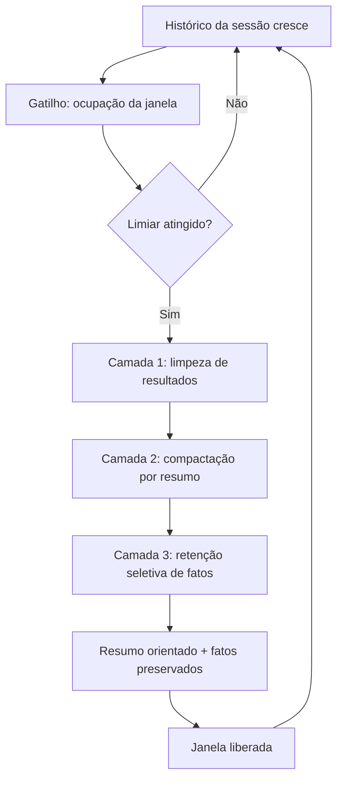

# Capítulo 6 — Compress: compactar histórico e limpar resultados

## 1. Introdução

Os capítulos anteriores ensinaram a escrever bem (Write) e selecionar o mínimo (Select) [1][6]. Este capítulo trata do que acontece com o que já passou: o histórico da sessão, as saídas das ferramentas, os dados intermediários [7]. Sem gestão, o passado enche a janela — e o Capítulo 3 mostrou o que o excesso faz [2][7]. A terceira operação do framework — Compress — é a gestão do passado: compactar o que ainda importa, descartar o que não importa mais [1][7]. A Anthropic documenta as técnicas de compactação e de limpeza de resultados de ferramentas (tool result clearing) como parte central da engenharia de contexto [7]. Este capítulo ensina a arte de esquecer bem [7].

## 2. Explica

### 2.1 Por Que o Histórico Cresce sem Limite

Todo agente conversacional tem um problema estrutural: o histórico cresce a cada interação [7][15]. A cada turno, a pergunta, a resposta e as saídas das ferramentas entram no contexto — e nada sai [7]. Em sessões longas, o histórico consome a janela inteira [7][8]. O LangChain documenta o problema no contexto de orquestração: o estado da conversa precisa ser gerenciado, ou a sessão colapsa [15]. O Compress existe porque o crescimento sem gestão é inevitável — e o colapso, previsível [7][15].

### 2.2 A Compactação (Compaction)

A compactação é a técnica central do Compress: reduzir o histórico por resumo [7]. O modelo (ou um subagente) lê o histórico longo e produz um resumo que preserva as decisões, os fatos e as intenções — descartando o ruído [7]. A Anthropic documenta a compactação como prática de produção: o resumo substitui o histórico bruto na janela, liberando espaço para o presente [7]. A compactação tem custo (uma chamada para gerar o resumo) e tem risco (perda de detalhe) [7]. A arte está em decidir o que preservar [7].

### 2.3 O Que a Compactação Deve Preservar

A compactação não é um resumo genérico — é um resumo orientado [7]. Deve preservar: as decisões já tomadas, os fatos estabelecidos, as intenções do usuário e as restrições ativas [7]. Deve descartar: as saídas brutas de ferramentas, os raciocínios intermediários e os detalhes superados [7]. A Anthropic é explícita: decisões arquiteturais e fatos críticos são preservados; ruído é removido [7]. O resumo orientado transforma a compactação em engenharia — o que preservar é decidido pela tarefa, não pela sorte [7].

### 2.4 A Limpeza de Resultados de Ferramentas

Uma técnica complementar à compactação é a limpeza de resultados de ferramentas (tool result clearing) [7]. Saídas de ferramentas — logs, arquivos, saídas de API — são frequentemente grandes e de uso imediato [7]. Depois que a informação foi usada, o resultado bruto não precisa permanecer [7]. A limpeza remove o resultado da janela após o uso, preservando apenas a conclusão extraída [7]. A prática é particularmente eficaz em agentes que chamam muitas ferramentas: sem a limpeza, cada chamada acumula lixo [7].

### 2.5 O Momento da Compactação

A compactação não acontece a qualquer momento — acontece em gatilhos [7][8]. O gatilho mais comum é o orçamento: quando a janela atinge um limiar de ocupação (ex.: 70-80%), a compactação dispara [7][8]. O segundo gatilho é estrutural: ao fim de uma subtarefa, o contexto da subtarefa é compactado antes da próxima [7]. O terceiro é temporal: sessões longas compactam periodicamente [7]. O design dos gatilhos decide o equilíbrio entre fidelidade (compactar tarde) e espaço (compactar cedo) [7][8].

### 2.6 A Compactação em Camadas

Sistemas maduros compactam em camadas [7]. A primeira camada é a limpeza: remoção de resultados de ferramentas obsoletos [7]. A segunda é a compactação por resumo: o histórico é reduzido a um resumo orientado [7]. A terceira é a retenção seletiva: fatos críticos são promovidos a uma seção de "fatos da sessão" que nunca é compactada [7]. A combinação preserva o essencial com o mínimo de espaço [7]. A metáfora é o arquivo: o que é usado hoje fica na mesa; o que é referência fica na pasta; o que passou vai para o resumo [7].

### 2.7 A Perda Aceita

A compactação envolve perda — e a perda é aceita deliberadamente [7][2]. O histórico compactado não pode responder perguntas sobre detalhes descartados [7]. A decisão de engenharia é: qual perda é aceitável para qual tarefa? [7]. Em tarefas que dependem de detalhes exatos (contratos, logs de auditoria), a compactação agressiva é perigosa [7]. Em tarefas de conversa (assistência, brainstorming), a compactação é segura [7]. O engenheiro maduro define a política de perda por tipo de tarefa [7].

### 2.8 A Relação com a Memória

A compactação é a fronteira entre contexto e memória [7][13]. O contexto é o presente da janela; a memória é o passado persistente [7]. A compactação transforma o passado da janela em resumo — e o resumo pode ser promovido à memória de longo prazo [7]. O Capítulo 10 desenvolve a memória; este capítulo estabelece a ponte: o que a compactação preserva é o que a memória recebe [7][13].

### 2.9 O Custo da Compactação

A compactação tem custo — e o engenheiro o considera [7][13]. O custo direto é a chamada de resumo (tokens de saída) [7][13]. O custo indireto é a perda de fidelidade [7]. O custo de oportunidade é o espaço liberado para o presente [7]. A comparação orienta a política: compactar cedo demais gera resumos pobres; compactar tarde demais desperdiça espaço [7][8]. O equilíbrio é medido, não adivinhado [7][13].

### 2.10 A Síntese: Esquecer Bem é uma Competência

O Compress ensina que esquecer bem é uma competência de engenharia — talvez a mais negligenciada da disciplina [7]. O iniciante acredita que reter tudo é seguro; o profissional sabe que reter tudo degrada (Capítulo 3) e que esquecer com intenção preserva o que importa [2][7]. A arte de esquecer bem é a arte do resumo orientado, da limpeza disciplinada e da perda aceita [7]. É também a base da sessão longa saudável — e a porta para a memória (Capítulo 10) [7][13].

## 3. Ilustra

### 3.1 A Analogia da Mesa de Trabalho

A mesa de trabalho é a analogia da janela [7]. O profissional que deixa tudo sobre a mesa — papéis, contratos, rascunhos — não encontra nada [7]. O profissional maduro usa o arquivo: o que é do dia fica na mesa; o que é referência vai para a pasta; o que passou vai para o arquivo morto com um resumo na capa [7]. A compactação é o arquivamento inteligente: preservar o essencial, liberar a mesa, manter a referência acessível [7].

### 3.2 O Diagrama do Ciclo de Compressão

O diagrama abaixo representa o ciclo de compressão no contexto de uma sessão [7][8].



O diagrama mostra o ciclo: o histórico cresce, o gatilho dispara, as três camadas agem e a janela é liberada [7].

### 3.3 O Antes e o Depois na Prática

**Antes**: o agente acumula o histórico integral e as saídas brutas de todas as ferramentas — a janela enche e o desempenho degrada [2][7]. **Depois**: o sistema limpa resultados obsoletos, compacta o histórico em resumo orientado e promove os fatos críticos [7]. A mesma sessão, com o mesmo conhecimento, continua produtiva por muito mais tempo [7].

## 4. Técnica

### 4.1 O Compactador por Resumo

O primeiro instrumento implementa a compactação por resumo, preservando decisões e fatos [7]. O código abaixo é uma versão didática — em produção, o resumo é gerado pelo modelo [7]:

```python
def compactar_historico(turnos: list, fatos_criticos: list) -> dict:
    """Compacta o histórico em um resumo orientado.

    Em produção, o resumo é gerado por uma chamada ao modelo;
    aqui, uma heurística extrai os elementos que o resumo deve preservar.
    """
    decisoes = []
    intencoes = []
    for turno in turnos:
        texto = turno.lower()
        if "decidimos" in texto or "vamos usar" in texto or "escolhemos" in texto:
            decisoes.append(turno[:120])
        if "quero" in texto or "preciso" in texto or "objetivo" in texto:
            intencoes.append(turno[:120])
    resumo = {
        "decisoes": decisoes[:5],
        "intencoes": intencoes[:5],
        "fatos_criticos": fatos_criticos,
        "tokens_turnos": sum(len(t.split()) for t in turnos),
        "tokens_resumo": sum(len(t.split()) for t in decisoes[:5] + intencoes[:5]),
    }
    return resumo


if __name__ == "__main__":
    turnos = [
        "Vamos usar a arquitetura de subagentes para o módulo de análise.",
        "Quero que o relatório saia em formato JSON com métricas.",
        "Decidimos que o acesso de escrita fica restrito a admins.",
        "Preciso comparar os dados de 2024 e 2025.",
    ]
    resultado = compactar_historico(turnos, ["Orçamento: R$ 2,4 milhões"])
    print(resultado)
```

O compactador demonstra o princípio: o resumo preserva decisões, intenções e fatos — não o texto bruto [7].

### 4.2 O Limpador de Resultados de Ferramentas

O segundo instrumento implementa a limpeza de resultados de ferramentas [7]. O código abaixo rastreia o uso de cada resultado e remove os obsoletos da janela [7]:

```python
class GerenciadorResultados:
    """Rastreia e limpa resultados de ferramentas após o uso."""

    def __init__(self):
        self.resultados = {}  # id -> {"conteudo": str, "usado": bool}

    def registrar(self, id_resultado: str, conteudo: str) -> None:
        self.resultados[id_resultado] = {"conteudo": conteudo, "usado": False}

    def marcar_usado(self, id_resultado: str) -> None:
        if id_resultado in self.resultados:
            self.resultados[id_resultado]["usado"] = True

    def limpar_usados(self) -> list:
        """Remove resultados usados; retorna os ids removidos."""
        removidos = [i for i, r in self.resultados.items() if r["usado"]]
        for i in removidos:
            del self.resultados[i]
        return removidos

    def janela_atual(self) -> dict:
        return {i: r["conteudo"][:60] for i, r in self.resultados.items()}


if __name__ == "__main__":
    g = GerenciadorResultados()
    g.registrar("log_build", "LOG_BIG: 200 linhas de compilação...")
    g.registrar("arquivo_leitura", "def main(): pass")
    g.marcar_usado("log_build")
    print("Removidos:", g.limpar_usados())
    print("Janela atual:", g.janela_atual())
```

O gerenciador materializa o tool result clearing: o resultado usado sai da janela; o não usado permanece [7].

### 4.3 O Orquestrador de Gatilhos

O terceiro instrumento implementa os gatilhos de compressão baseados no orçamento [7][8]. O código abaixo monitora a ocupação e dispara a política de compressão no limiar [7][8]:

```python
class OrquestradorCompressao:
    """Dispara a compressão quando a janela atinge o limiar."""

    def __init__(self, janela: int, limiar_pct: float = 0.7):
        self.janela = janela
        self.limiar = int(janela * limiar_pct)
        self.ocupado = 0

    def adicionar(self, tokens: int) -> str:
        self.ocupado += tokens
        if self.ocupado >= self.limiar:
            return self.comprimir()
        return "ok"

    def comprimir(self) -> str:
        # Em produção: limpar resultados usados + resumir histórico.
        liberado = int(self.ocupado * 0.5)
        self.ocupado -= liberado
        return f"comprimido: liberados {liberado} tokens"

    def status(self) -> dict:
        return {
            "ocupado": self.ocupado,
            "limiar": self.limiar,
            "proporcao": round(self.ocupado / self.janela, 2),
        }


if __name__ == "__main__":
    o = OrquestradorCompressao(janela=20_000)
    o.adicionar(6_000)
    print(o.adicionar(9_000))  # cruza o limiar de 70%
    print(o.status())
```

O orquestrador materializa o gatilho: a compressão não é manual — é uma política automática do sistema [7][8].

## 5. Aplica

### 5.1 Onde Isso Vive no Mundo Real

A compressão está em todo sistema de conversa longa [7][15]. Chatbots de suporte que mantêm sessões de horas compactam o histórico entre assuntos [7]. Agentes de programação limpam os resultados de cada compilação após o uso [7]. Assistentes de análise compactam os dados intermediários ao mudar de subtarefa [7]. O LangChain documenta o gerenciamento de estado como parte da orquestração [15]. Em cada caso, a compressão é o que mantém a sessão viva [7].

### 5.2 O Erro Comum do Iniciante

O erro mais comum é não comprimir: o histórico integral e as saídas brutas acumulam até a janela estourar [2][7]. O segundo erro é comprimir sem orientação: o resumo genérico perde as decisões críticas [7]. O terceiro é comprimir tarde demais: quando a janela está 100% cheia, a compressão de emergência é destrutiva [7]. Os três erros têm o mesmo remédio: política de compressão definida, orientada e com gatilhos automáticos [7][8].

### 5.3 O Padrão Profissional em 2026

O padrão profissional integra as três camadas [7]. A limpeza de resultados roda após cada uso de ferramenta [7]. A compactação dispara no limiar de ocupação [7][8]. A retenção seletiva protege os fatos críticos [7]. O resumo é orientado à tarefa [7]. A política de perda é definida por tipo de tarefa [7]. O resultado é uma sessão que dura o que precisar durar, sem degradar [7].

### 5.4 Exercício de Fixação

Desenhe a política de compressão do seu agente: os gatilhos, as camadas, o que o resumo preserva e a política de perda por tarefa [7][8]. Implemente o orquestrador com o limiar da sua janela [7][8]. Teste uma sessão longa e meça a ocupação antes e depois da política [7].

### 5.5 A Compactação por Níveis: Do Resumo ao Fatos-Chave

A compactação profissional opera em níveis — cada nível preserva mais ou menos detalhe, e o sistema escolhe o nível pela tarefa [7][1]. O primeiro nível é a **limpeza**: remoção de resultados de ferramentas obsoletos e ruído — a operação mais barata e a primeira a rodar [7]. O segundo nível é o **resumo por turno**: cada turno antigo é reduzido a uma linha de essência [7]. O terceiro nível é o **resumo da sessão**: o conjunto de turnos vira um parágrafo orientado a decisões [7]. O quarto nível é a **extração de fatos**: os fatos críticos são promovidos a uma seção de fatos da sessão, protegida da compactação [7].

A escolha do nível é uma decisão de fidelidade versus espaço [7][1]. Tarefas que exigem detalhe — auditoria, contratos — usam níveis mais leves [7]. Tarefas de conversa usam níveis profundos [7]. O sistema maduro aplica níveis diferentes a blocos diferentes: o histórico de ferramentas é limpo no primeiro nível; a conversa é resumida no segundo; os fatos são promovidos no quarto [7]. A compactação em níveis é a materialização da disciplina de perda aceita (seção 2.7) [7].

A implementação em código segue a arquitetura de camadas [7][15]. Cada nível é uma função testável; o orquestrador (seção 4.3) decide o nível pelos gatilhos [7]. O LangChain documenta a composição de estados de conversa em camadas [15]. O engenheiro que trata a compactação como uma única operação perde o controle fino; o que a trata como sistema de níveis gerencia a fidelidade com precisão [7][1].

### 5.6 O Trade-off entre Fidelidade e Espaço na Prática

A compactação envolve um trade-off contínuo: cada token economizado é um detalhe potencialmente perdido [7][1]. O trade-off não é resolvido de uma vez — é gerido a cada sessão [7]. A primeira ferramenta de gestão é a **classificação de fidelidade por tarefa**: cada tipo de tarefa declara quanta fidelidade do histórico exige [7][1]. O suporte ao cliente pode compactar agressivamente; a revisão jurídica, não [7].

A segunda ferramenta é a **medição do impacto**: quando a compactação remove detalhes, o sistema mede o efeito na qualidade das respostas [1][12]. A medição usa o conjunto de avaliação (Capítulo 10): as respostas pós-compactação são comparadas com as pré-compactação [1][12]. Se a qualidade não cai, a compactação é segura; se cai, o nível é profundo demais [1][12].

A terceira ferramenta é a **compensação por recuperação**: detalhes perdidos na compactação podem ser recuperados de fontes externas quando necessários [7][3]. O resumo preserva o índice do que foi discutido; a recuperação (Capítulo 9) busca o detalhe se o usuário perguntar [3][7]. A combinação compactação + recuperação é o padrão moderno: o resumo mantém o contexto enxuto, e o detalhe permanece acessível [3][7].

### 5.7 A Limpeza de Ferramentas em Diferentes Arquiteturas

A limpeza de resultados de ferramentas (tool result clearing) varia com a arquitetura do agente [7][6]. Na arquitetura de **agente único**, a limpeza é direta: o resultado de cada chamada é marcado como usado e removido [7]. Na arquitetura de **agente com ferramentas encadeadas**, a limpeza precisa preservar os resultados que alimentam as próximas etapas — o resultado intermediário não é descartado antes do fim da cadeia [6][7]. Na arquitetura **multi-agente** (Capítulo 7), a limpeza ocorre dentro de cada janela de subagente — e o resumo destilado substitui os resultados brutos na fronteira [1][7].

A regra geral da limpeza é o **ciclo de vida do resultado**: cada resultado de ferramenta nasce, é usado e morre [7][6]. O sistema conhece o ciclo: o resultado de uma busca alimenta a decisão atual e morre; o resultado de uma compilação alimenta a correção e morre; o resultado de uma API de dados alimenta a análise e morre [7][6]. A limpeza executa a morte no momento certo [7].

O design da limpeza também protege contra o acúmulo silencioso [7][13]. Sem limpeza, cada ferramenta adiciona tokens permanentes à janela — e o agente que chama dez ferramentas por tarefa acumula um palheiro em horas [7][2]. A limpeza é a prevenção do context rot específica da arquitetura de ferramentas [7][2]. O engenheiro que integra uma nova ferramenta define, no mesmo momento, o ciclo de vida dos seus resultados [7][6].

### 5.8 O Gatilho de Compactação por Estrutura de Tarefa

Além do gatilho por orçamento (seção 2.5), há o gatilho por estrutura de tarefa — a compactação acontece nas fronteiras naturais do trabalho [7][1]. O primeiro gatilho estrutural é o **fim da subtarefa**: quando o agente conclui uma subtarefa, o contexto da subtarefa é compactado antes de iniciar a próxima [7][1]. O segundo é a **mudança de contexto do usuário**: quando o usuário troca de assunto, o assunto anterior é compactado [7]. O terceiro é o **início de nova sessão**: a sessão anterior é resumida para a memória (Capítulo 10) [7].

O gatilho estrutural tem uma vantagem sobre o de orçamento: acontece em um momento natural, sem interromper o fluxo [7][1]. A compactação por orçamento é reativa (a janela encheu); a por estrutura é proativa (a unidade de trabalho terminou) [7][1]. O sistema maduro combina os dois: o estrutural mantém o contexto organizado por unidade de trabalho; o de orçamento protege contra o estouro [7][1][8].

O desenho dos gatilhos estruturais é específico de cada domínio [7][1]. O engenheiro identifica as unidades naturais do seu fluxo — tarefa, subtarefa, assunto, sessão — e define a compactação em cada fronteira [7]. O registro do gatilho (qual fronteira, qual nível, qual resultado) alimenta a avaliação do Capítulo 10 [7][12]. A compactação por estrutura é a prática que transforma a compressão de mecanismo de emergência em disciplina de organização [7][1].

### 5.9 A Compactação e o Custo Operacional

A compactação tem um caso de negócio claro — e o engenheiro o conhece para justificar a disciplina [7][13]. O primeiro componente do caso é a **economia de tokens**: cada token de histórico compactado é um token economizado em todas as chamadas seguintes [13][7]. O segundo é a **economia de retrabalho**: o histórico compactado preserva o essencial, evitando que o modelo erre por falta de contexto e precise re-executar [1][7]. O terceiro é a **economia de latência**: contextos menores processam mais rápido [13][7].

O quarto componente é o **custo da compactação em si**: a chamada de resumo consome tokens [7][13]. O trade-off é explícito: compactar custa um pouco agora para economizar muito depois [7][13]. O cálculo é a comparação entre o custo do resumo e a economia das chamadas seguintes [13][7]. O engenheiro que mede (Capítulo 10) tem os números exatos [13].

O quinto componente é o **custo de oportunidade**: o espaço liberado pela compactação permite que o sistema processe mais trabalho na mesma janela [7][1]. A compactação, longe de ser burocracia, é uma das operações de maior retorno da disciplina — cada token economizado é reutilizado [7][13]. O caso de negócio da compactação é o mesmo da curadoria: a disciplina paga a si mesma [7][13].

### 5.10 A Compactação e o Método de Revisão Autônoma

A série anuncia o método de revisão autônoma entre harness — e a compactação é uma das fundações desse método [1][7]. Para que um sistema reviso o trabalho de outro, o contexto precisa preservar o histórico das decisões — e a compactação é o que transforma o histórico em material de revisão [7][1]. O resumo orientado (seção 2.3) preserva as decisões e as intenções — exatamente o que um revisor precisa para avaliar [7][1].

A conexão tem três implicações [1][7]. A primeira: o resumo da sessão deve incluir os critérios de aceite e as decisões — o revisor compara o resultado com a intenção [1][7]. A segunda: a compactação não descarta as evidências sem registro — o resumo aponta onde as evidências estão (recuperáveis no Capítulo 9) [7][3]. A terceira: a revisão é feita sobre o resumo, e a re-execução usa o resumo como contexto inicial [7][1].

A compactação é, portanto, a memória operacional que a revisão autônoma consome [1][7]. O engenheiro que projeta para a revisão desenha a compactação com a revisão em mente: preservar o que um revisor precisaria saber [7][1]. A Parte III da série desenvolve o método; este capítulo estabelece a matéria-prima [1][7].

### 5.11 O Estudo de Caso da Sessão que Sobreviveu

O estudo de caso consolida o capítulo [7][1]. O cenário: um assistente de suporte técnico com sessões longas — usuários que ficam horas em uma conversa [7]. O protótipo sem compactação degradava: o histórico crescia, o contexto estourava e o assistente esquecia o início [2][7]. A equipe implantou a política de compressão em três camadas [7].

O novo fluxo: cada resultado de ferramenta é limpo após o uso (camada 1); cada troca de assunto compacta o assunto anterior em resumo (camada 2, gatilho estrutural); os fatos críticos do usuário — preferências, pendências — são promovidos à seção de fatos (camada 3) [7]. O gatilho de orçamento protege contra picos [7][8].

O resultado: sessões de horas continuam produtivas, o custo cai e o usuário não percebe a compressão [7][1]. O caso demonstra o tema do capítulo: esquecer bem é uma competência — e a competência se desenha com camadas, gatilhos e perda aceita [7]. A sessão que sobrevive é a prova da disciplina [7].

### 5.12 O Compress e a Fidelidade em Diferentes Tarefas

A política de perda (seção 2.7) ganha forma concreta quando o engenheiro a classifica por tarefa [7][1]. O primeiro grupo é o das tarefas **fidelidade-crítica**: contratos, auditorias, relatórios regulatórios [7]. Para elas, a compactação é conservadora — níveis leves, fatos sempre preservados, perda mínima [7]. O segundo é o das tarefas **fidelidade-moderada**: suporte, análises de rotina [7]. Para elas, a compactação é intermediária — o essencial preservado, o detalhe descartável perdido [7]. O terceiro é o das tarefas **fidelidade-flexível**: brainstorming, redação criativa [7]. Para elas, a compactação pode ser profunda [7].

A classificação por tarefa é registrada e versionada — parte da configuração do sistema (Capítulo 5, seção 5.3) [1][7]. A classificação também orienta a avaliação (Capítulo 10): o conjunto de avaliação de cada tarefa mede se a compactação degradou a qualidade [7][12]. O engenheiro que classifica a fidelidade por tarefa evita duas falhas opostas: compactar demais onde a fidelidade é crítica e compactar de menos onde o espaço é precioso [7][1].

### 5.13 O Estudo de Caso do Log que Poluiu

O estudo de caso mostra a limpeza em produção [7][6]. O cenário: um agente de diagnóstico que chama várias ferramentas por tarefa — logs, testes, consultas [7][6]. O sintoma: o agente degradava no meio da sessão; as respostas ficavam lentas e confusas [2][7]. O contexto estava cheio de saídas de ferramentas acumuladas [7].

O diagnóstico (Capítulo 8): a limpeza não estava configurada — cada resultado de ferramenta permanecia na janela [7][6]. O teste: a inspeção da janela revelou que as saídas antigas ocupavam metade do espaço [7]. O tratamento: o ciclo de vida dos resultados (seção 5.7) foi implementado — cada resultado é marcado usado e limpo após o consumo [7][6].

O resultado: a janela liberou espaço; o agente voltou a responder com precisão [7]. O caso demonstra o tema do capítulo: a limpeza de ferramentas é a prevenção mais barata do context rot — e a mais negligenciada [7][2]. O engenheiro que a configura no dia da integração evita semanas de degradação [7][6].

### 5.14 A Lista de Verificação do Compress

A lista de verificação consolida o capítulo [7][1]. O primeiro item: o ciclo de vida dos resultados de ferramentas é definido? [7][6]. O segundo: a compactação preserva decisões, intenções e fatos? [7]. O terceiro: os gatilhos de orçamento estão configurados? [7][8]. O quarto: os gatilhos estruturais (fim de subtarefa) existem? [7][1].

O quinto item: a política de perda é classificada por tarefa? [7][1]. O sexto: a perda é medida contra a qualidade (Capítulo 10)? [7][12]. O sétimo: o resumo compactado é posicionado na zona de alta atenção (Capítulo 4)? [7][5]. O oitavo: os fatos críticos são protegidos da compactação? [7].

A lista é o resumo operacional [7][1]. O engenheiro que a percorre mantém a sessão longa saudável [7]. O Compress, junto com o Isolate, é o que distingue o sistema que sobrevive ao tempo do que colapsa [7][1].

### 5.15 O Compress e a Experiência de Sessões Longas

A compressão tem um impacto direto na experiência de sessões longas [7][1]. O primeiro efeito é a **continuidade**: o usuário não percebe a troca de assunto ou a passagem do tempo — o assistente lembra o essencial [7]. O segundo é a **velocidade**: contextos compactados processam mais rápido (Capítulo 2) — o assistente responde sem a lentidão do contexto inchado [7][13]. O terceiro é a **confiança**: o assistente que lembra o essencial inspira confiança; o que esquece, não [7][1].

O desenho da compressão é, portanto, também design de experiência [7][1]. O engenheiro que compacta bem entrega a sessão longa sem custo perceptível [7]. O que não compacta entrega a sessão que degrada — e o usuário atribui a falha ao produto, não ao contexto [7][2]. A compressão invisível é a melhor: o usuário percebe o resultado (continuidade), não o mecanismo [7][1].

### 5.16 O Compress e a Relação com a Memória e a Recuperação

A compressão é a ponte entre o contexto e a memória (Capítulo 10) e entre o contexto e a recuperação (Capítulo 9) [7][1][3]. Com a memória: o resumo compactado é o material que a memória de longo prazo recebe [7][1]. A qualidade do resumo decide a qualidade da memória [7]. Com a recuperação: o resumo aponta onde os detalhes estão — e a recuperação (Capítulo 9) os traz de volta quando necessário [3][7].

A interação é o ciclo completo da persistência [7][3][1]: o contexto é compactado em resumo; o resumo alimenta a memória; a memória é recuperada quando o detalhe importa [7][3]. O engenheiro que projeta o ciclo garante que nada essencial se perde — o detalhe permanece acessível, o contexto permanece enxuto [7][3].

A compactação, a memória e a recuperação formam o tripé da persistência [7][3]. A Parte III da série (harness) governa o tripé; este capítulo estabelece a primeira perna [7][1].

### 5.17 O Fechamento do Capítulo

O capítulo da compressão se encerra com a consolidação [7][1]. O histórico cresce sem limite — e a gestão do crescimento é a disciplina [7]. A compactação preserva o essencial; a limpeza remove o obsoleto; os gatilhos automatizam a decisão [7][8]. A perda é aceita deliberadamente, classificada por tarefa [7]. O custo da compactação é pequeno comparado ao custo do contexto inchado [7][13].

O engenheiro que domina o Compress constrói sessões que duram [7][1]. E, com o Write, o Select e o Compress dominados, resta a quarta operação — o Isolate — para completar o framework [1]. A ordem da construção é a ordem da pilha [1].

### 5.18 A Compactação e o Custo do Esquecimento

A perda da compactação tem um custo que o engenheiro dimensiona: o custo do esquecimento [7][1]. Quando o resumo não preserva um detalhe que depois se mostra necessário, o sistema precisa recuperá-lo — ou arcar com a resposta incompleta [7][3]. O custo do esquecimento tem três componentes [7][1]. O primeiro é o **custo da recuperação**: buscar o detalhe perdido na fonte (Capítulo 9) [3][7]. O segundo é o **custo do retrabalho**: responder de novo com o detalhe [7][13]. O terceiro é o **custo reputacional**: a resposta incompleta que o usuário percebe [7][1].

A gestão do custo do esquecimento é o equilíbrio da seção 5.6 [7][1]. Compactar demais aumenta o custo do esquecimento; compactar de menos aumenta o custo da janela [7][1][8]. O ponto de equilíbrio é encontrado pela medição: o conjunto de avaliação revela quantos detalhes perdidos viram falhas [7][12]. O engenheiro que mede o custo do esquecimento calibra a compactação com dados — não com medo [7][12].

### 5.19 O Fechamento do Capítulo

O capítulo da compressão se encerra com a consolidação final [7][1]. O histórico cresce; a compactação gerencia; a limpeza remove; os gatilhos automatizam; a perda é aceita com método [7][8]. O custo do esquecimento é o limite da disciplina — e a medição é o seu controle [7][12].

O engenheiro que domina o Compress constrói sessões longas saudáveis — e conhece o preço de cada esquecimento [7][1]. A compactação, com o Write e o Select, forma o núcleo operacional da curadoria [1][6][7]. O Isolate, no capítulo seguinte, completa o framework [1].

### 5.20 A Compactação e a Avaliação Contínua

A compactação precisa de avaliação contínua — o engenheiro verifica que a perda aceita não virou perda inaceitável [7][12]. O primeiro instrumento é o **conjunto de avaliação pós-compactação**: os casos críticos executados após a compactação — a qualidade é comparada com a pré-compactação [7][12]. O segundo é o **monitor de esquecimento**: os casos em que a compactação removeu informação necessária são registrados e analisados [7][12]. O terceiro é o **ajuste da política**: a distribuição dos esquecimentos orienta o ajuste dos níveis e gatilhos [7][12].

A avaliação contínua fecha o ciclo da compactação [7][12]: a política é definida, aplicada, medida e ajustada [7]. A compactação deixa de ser uma configuração fixa e vira um sistema que aprende [7][12]. O Capítulo 10 integra a avaliação da compactação ao conjunto de avaliação geral do sistema [7][12].

O engenheiro que avalia a compactação evita a armadilha da perda silenciosa [7][12]. A compactação que ninguém mede degrada devagar — e a degradação acumulada é descoberta tarde [7][12]. A avaliação contínua é o que mantém o esquecimento deliberado [7][12].

### 5.21 O Fechamento do Capítulo

O capítulo da compressão se encerra com a consolidação final [7][1]. O histórico cresce; a compactação gerencia; a limpeza remove; os gatilhos automatizam; a avaliação valida [7][8][12].

O engenheiro que domina o Compress constrói sessões longas saudáveis e mensuráveis [7][1]. O framework — Write, Select, Compress — está quase completo; falta o Isolate [1]. O próximo capítulo constrói o isolamento [1].

### 5.22 A Mensagem Final do Capítulo

O capítulo da compressão deixa a mensagem que sustenta as sessões longas [7][1]. O histórico cresce sem limite; a compactação gerencia; a limpeza remove; os gatilhos automatizam [7][8]. Esquecer bem é uma competência de engenharia — e a competência se desenha [7][1].

O engenheiro que domina o Compress constrói sessões que duram [7][1]. O framework — Write, Select, Compress — está quase completo; o próximo capítulo constrói o Isolate [1].

## 6. Conclusão

O Compress é a operação que ensina o agente a esquecer bem [7]. A compactação transforma o histórico em resumo orientado, preservando decisões, intenções e fatos [7]. A limpeza remove resultados de ferramentas obsoletos [7]. Os gatilhos automáticos protegem o orçamento da janela [7][8]. A perda é aceita deliberadamente, por tipo de tarefa [7]. As ferramentas deste capítulo compactam, limpam e orquestram [7][8]. O próximo capítulo completa o framework com a quarta operação: Isolate, o isolamento de contexto via subagentes [1].

## 7. Referências

[1] ANTHROPIC. Effective context engineering for AI agents. Anthropic Engineering Blog, set. 2025. Disponível em: https://www.anthropic.com/engineering/effective-context-engineering-for-ai-agents. Acesso em: 5 ago. 2026.
[2] HONG, Kelly; TROYNIKOV, Anton; HUBER, Jeff. Context Rot: How Increasing Input Tokens Impacts LLM Performance. Chroma Technical Report, jul. 2025. Disponível em: https://www.trychroma.com/research/context-rot. Acesso em: 5 ago. 2026.
[3] LEWIS, Patrick et al. Retrieval-Augmented Generation for Knowledge-Intensive NLP Tasks. In: Advances in Neural Information Processing Systems (NeurIPS), v. 33, p. 9459–9474, 2020. Disponível em: https://arxiv.org/abs/2005.11401. Acesso em: 5 ago. 2026.
[4] GAO, Yunfan et al. Retrieval-Augmented Generation for Large Language Models: A Survey. arXiv:2312.10997, mar. 2024. Disponível em: https://arxiv.org/abs/2312.10997. Acesso em: 5 ago. 2026.
[5] LIU, Nelson F. et al. Lost in the Middle: How Language Models Use Long Contexts. Transactions of the Association for Computational Linguistics (TACL), v. 12, p. 157–173, 2024. Disponível em: https://arxiv.org/abs/2307.03172. Acesso em: 5 ago. 2026.
[6] ANTHROPIC. Writing tools for AI agents — using AI agents. Anthropic Engineering Blog, set. 2025. Disponível em: https://www.anthropic.com/engineering/writing-tools-for-agents. Acesso em: 5 ago. 2026.
[7] ANTHROPIC. Context engineering: memory, compaction, and tool clearing. Claude Platform Cookbook, mar. 2026. Disponível em: https://platform.claude.com/cookbook/tool-use-context-engineering-context-engineering-tools. Acesso em: 5 ago. 2026.
[8] ZHAO, Wayne Xin et al. A Survey of Large Language Models. arXiv:2303.18223, 2023. Disponível em: https://arxiv.org/abs/2303.18223. Acesso em: 5 ago. 2026.
[9] CHROMA. Context Rot: Evaluation Toolkit. GitHub Repository, 2025. Disponível em: https://github.com/chroma-core/context-rot. Acesso em: 5 ago. 2026.
[10] LIU, Nelson F. Lost in the Middle: Replication Repository. GitHub Repository, 2023. Disponível em: https://github.com/nelson-liu/lost-in-the-middle. Acesso em: 5 ago. 2026.
[11] CHEN, Jiawei et al. LongRAG: Enhancing Retrieval-Augmented Generation with Long-context LLMs. arXiv:2406.15319, 2024. Disponível em: https://arxiv.org/abs/2406.15319. Acesso em: 5 ago. 2026.
[12] ASIA, Research Group et al. Retrieval-Augmented Generation Evaluation in the Era of Large Language Models: A Comprehensive Survey. ResearchGate / arXiv, abr. 2025. Disponível em: https://www.researchgate.net/publication/390991356. Acesso em: 5 ago. 2026.
[13] OPENAI. GPT-4 Technical Report & Developer Guides on Context Management. OpenAI Documentation, 2024–2025. Disponível em: https://openai.com/index/gpt-4-research/. Acesso em: 5 ago. 2026.
[14] GOOGLE CLOUD. What is Retrieval-Augmented Generation (RAG)?. Google Cloud Architecture Center, 2025. Disponível em: https://cloud.google.com/use-cases/retrieval-augmented-generation. Acesso em: 5 ago. 2026.
[15] LANGCHAIN. LangChain Agents & Context Management Documentation. LangChain Guides, 2025–2026. Disponível em: https://python.langchain.com/docs/concepts/agents/. Acesso em: 5 ago. 2026.
[16] WANG, Zhen et al. Agentic Retrieval-Augmented Generation: A Survey on Agentic RAG. arXiv:2408.12999, 2024. Disponível em: https://arxiv.org/abs/2408.12999. Acesso em: 5 ago. 2026.
[17] XIAO, Guangxuan et al. Efficient Streaming Language Models with Attention Sinks. arXiv:2309.17453, 2023. Disponível em: https://arxiv.org/abs/2309.17453. Acesso em: 5 ago. 2026.
[18] RODIN, Alex et al. Found in the Middle: Overcoming Long-Context Vulnerabilities in LLMs. arXiv:2403.04797, 2024. Disponível em: https://arxiv.org/abs/2403.04797. Acesso em: 5 ago. 2026.
[19] MEDIUM (Data Science Collective). Context Is the New Prompt: Why Context Engineering Is Shaping the Future of AI. Medium Article, 2025. Disponível em: https://medium.com/data-science-collective/context-is-the-new-prompt-why-context-engineering-is-shaping-the-future-of-ai-46eb062ed270. Acesso em: 5 ago. 2026.
[20] ZENML. Context Rot: Evaluating LLM Performance Degradation with Increasing Input Tokens. MLOps Database, 2025. Disponível em: https://www.zenml.io/llmops-database/context-rot-evaluating-llm-performance-degradation-with-increasing-input-tokens. Acesso em: 5 ago. 2026.
