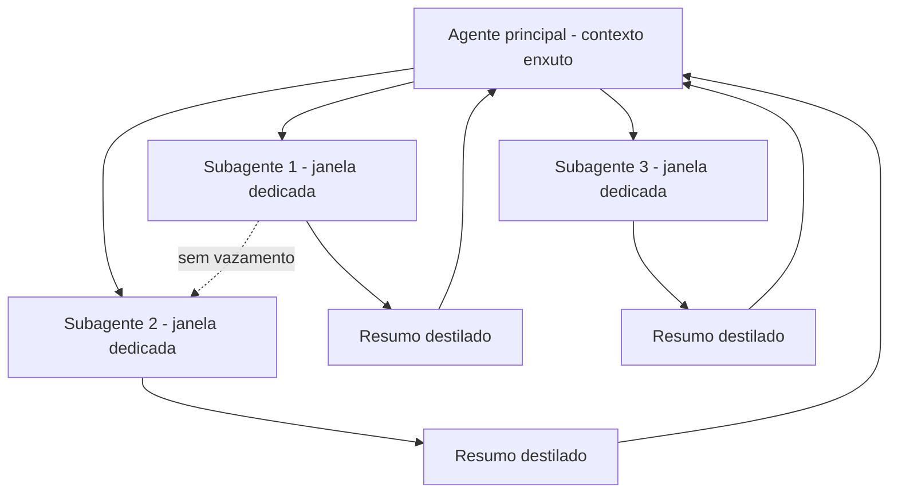

# Capítulo 7 — Isolate: subagentes e o isolamento de contexto

## 1. Introdução

O framework write/select/compress/isolate tem uma última operação — Isolate — que é também a mais arquitetural [1]. As três primeiras operações administram o contexto dentro de uma janela; o Isolate administra o contexto entre janelas [1]. A ideia central é o isolamento: tarefas diferentes recebem janelas de contexto diferentes, para que o ruído de uma não contamine o raciocínio da outra [1]. A operação é materializada pelos subagentes: agentes auxiliares com janelas próprias, que executam subtarefas e devolvem apenas resumos destilados ao agente principal [1]. Este capítulo ensina por que o isolamento é necessário, como desenhar subagentes e como proteger o contexto da contaminação cruzada [1][15].

## 2. Explica

### 2.1 O Problema da Contaminação Cruzada

A contaminação cruzada é o vazamento de contexto entre tarefas [1]. Quando um agente processa múltiplas tarefas em uma única janela, o contexto de uma pode interferir na outra [1]. A interferência tem várias formas: informação de uma tarefa desviando a atenção da outra (Capítulo 3), distratores de uma contaminação a recuperação da outra [2][1], e a degradação posicional (Capítulo 4) piorando com a mistura [5]. O resultado é o comportamento errático: o agente "esquece" a tarefa atual porque o contexto está poluído pela anterior [1]. O isolamento é a defesa estrutural contra esse vazamento [1].

### 2.2 O Que é um Subagente

Um subagente é um agente auxiliar com contexto próprio [1][15]. Ele recebe uma subtarefa bem definida, uma janela de contexto dedicada e um orçamento de execução [1]. Executa a subtarefa de forma relativamente independente e devolve um resultado compacto ao agente principal [1]. O LangChain documenta a orquestração de agentes como prática central: o agente principal coordena; os subagentes executam [15]. A separação de responsabilidades é o coração do padrão: o coordenador planeja; o subagente explora em detalhe [1][15].

### 2.3 A Janela Dedicada do Subagente

A janela dedicada é o mecanismo do isolamento [1]. O subagente opera em sua própria janela, com seu próprio contexto — sem compartilhar a janela do agente principal [1]. O benefício é duplo [1]. Primeiro, a proteção: o ruído da subtarefa não contamina o contexto principal [1]. Segundo, a profundidade: o subagente pode explorar detalhes que não caberiam na janela principal [1]. A janela dedicada transforma a limitação da janela principal em arquitetura: cada subtarefa tem seu espaço [1].

### 2.4 O Resumo Destilado como Interface

A interface entre o subagente e o agente principal é o resumo destilado [1]. O subagente não devolve seu contexto — devolve o resultado: uma síntese compacta de 1.000 a 2.000 tokens [1]. O agente principal recebe o resumo e o integra ao seu contexto enxuto [1]. A prática segue a disciplina do Compress (Capítulo 6): o que atravessa a fronteira é orientado à decisão, não bruto [1][7]. O resumo destilado é o que mantém a janela principal enxuta mesmo com subtarefas pesadas [1].

### 2.5 Quando Usar Subagentes

O subagente não é para tudo — é para tarefas que justificam a arquitetura [1][4]. A decisão de usar segue critérios claros [1]. Primeiro, o volume: tarefas que geram muito contexto (exploração de repositórios, leitura de documentos longos) [1]. Segundo, o isolamento: tarefas cujo ruído contaminaria o raciocínio principal [1]. Terceiro, a paralelização: tarefas independentes podem rodar em subagentes paralelos [1][4]. Quarto, o custo: a orquestração tem overhead — comunicação, resumos, coordenação [1]. A decisão é um trade-off de engenharia, não um reflexo [1].

### 2.6 O Agente Principal como Diretor

A metáfora do diretor de orquestra captura a arquitetura [1]. O maestro (agente principal) tem a partitura completa (contexto enxuto com o plano geral); cada músico (subagente) tem a sua parte (contexto dedicado da subtarefa) [1]. O maestro não toca todos os instrumentos — coordena [1]. A separação é o que permite complexidade sem caos: cada parte é executada com contexto limpo, e o todo é coordenado pelo maestro [1]. O padrão aparece em toda arquitetura multi-agente madura [1][15].

### 2.7 A Paralelização e o Isolamento

A paralelização é um dos maiores benefícios do Isolate [1][4]. Tarefas independentes rodam em subagentes paralelos, cada um na sua janela [1]. A aceleração é real: quatro subtarefas independentes podem rodar ao mesmo tempo [1]. O isolamento é o que torna a paralelização segura: sem ele, os subagentes competiriam pelo mesmo contexto e se contaminariam [1]. A combinação isolamento + paralelização é a base dos agentes de alto rendimento [1][4].

### 2.8 O Custo da Orquestração

A orquestração tem custo — e o engenheiro o considera [1][13]. Cada subagente é uma chamada com custo próprio [13]. O resumo destilado é uma chamada extra [1]. A coordenação consome tempo de latência [1]. O custo de orquestração precisa ser menor que o benefício do isolamento [1][13]. Para tarefas simples, o subagente é desperdício; para tarefas complexas, é a diferença entre funcionar e degradar [1][13]. A decisão de orquestrar é econômica, não estética [1].

### 2.9 O Isolamento Além dos Subagentes

O Isolate não se limita a subagentes — é um princípio geral de arquitetura de contexto [1]. O princípio: contextos de escopos diferentes não se misturam [1]. Aplica-se à separação entre instruções e dados (Livro 2), entre tarefas (subagentes) e entre usuários em sistemas multi-tenant [1]. O princípio unificado é o mesmo: o que pertence a um escopo não contamina o outro [1]. O Capítulo 8 usa o princípio no diagnóstico: falha de contaminação é uma classe de erro reconhecível [1][5].

### 2.10 A Síntese: Isolamento Como Governança de Contexto

O Isolate é a operação que transforma a engenharia de contexto em arquitetura de sistemas [1][15]. As três primeiras operações cuidam do contexto dentro da janela; o Isolate cuida da relação entre janelas [1]. É a operação mais cara (orquestração) e a mais estrutural (arquitetura) [1][13]. Juntas, as quatro operações formam o framework completo da curadoria: escrever bem, selecionar o mínimo, comprimir o passado e isolar os escopos [1][6][7]. Este capítulo fecha o núcleo operacional do livro [1].

## 3. Ilustra

### 3.1 A Analogia da Orquestra

A orquestra é a analogia mais rica [1]. O maestro tem a partitura geral; cada músico tem a sua parte [1]. Se todos tocassem com a partitura inteira na frente, o ruído seria ensurdecedor [1]. A separação de partes é o que permite a sinfonia [1]. O agente principal é o maestro; os subagentes são os naipes; o resumo destilado é a leitura de retorno do músico ao maestro [1].

### 3.2 O Diagrama da Arquitetura de Subagentes

O diagrama abaixo representa a arquitetura de isolamento com subagentes [1][15].



O diagrama mostra o padrão: o agente principal coordena, os subagentes executam em janelas isoladas e devolvem resumos [1][15].

### 3.3 O Antes e o Depois na Prática

**Antes (sem isolamento)**: um único agente processa o repositório inteiro na mesma janela — o contexto mistura arquivos, tarefas e ruído, e o desempenho degrada [1][2]. **Depois (com isolamento)**: o agente principal delega a exploração de cada módulo a subagentes, que devolvem resumos; a janela principal permanece enxuta [1]. A mesma missão, com o mesmo conhecimento, produz resultados coerentes [1].

## 4. Técnica

### 4.1 O Roteador de Subtarefas

O primeiro instrumento implementa a decisão de delegar: quais subtarefas vão para subagentes [1][4]. O código abaixo classifica subtarefas por critérios de isolamento [1][4]:

```python
def decidir_delegacao(subtarefas: list, limiar_volume: int = 1500) -> list:
    """Decide quais subtarefas delegar a subagentes.

    Critérios: volume de contexto esperado e independência da tarefa.
    """
    delegadas = []
    diretas = []
    for tarefa in subtarefas:
        volume = tarefa.get("volume_estimado", 0)
        independente = tarefa.get("independente", False)
        if volume > limiar_volume and independente:
            delegadas.append(tarefa)
        else:
            diretas.append(tarefa)
    return {"delegadas": [t["nome"] for t in delegadas],
            "diretas": [t["nome"] for t in diretas]}


if __name__ == "__main__":
    subtarefas = [
        {"nome": "explorar_repo", "volume_estimado": 5000, "independente": True},
        {"nome": "resumir_doc", "volume_estimado": 800, "independente": True},
        {"nome": "validar_json", "volume_estimado": 300, "independente": False},
    ]
    print(decidir_delegacao(subtarefas))
```

O roteador materializa o critério de delegação: volume e independência decidem o isolamento [1][4].

### 4.2 O Orquestrador com Resumos Destilados

O segundo instrumento implementa a orquestração: dispara subagentes e coleta resumos destilados [1]. O código abaixo é a versão didática do ciclo [1]:

```python
class Orquestrador:
    """Coordena subagentes e integra resumos destilados."""

    def __init__(self, contexto_principal: str):
        self.contexto_principal = contexto_principal
        self.resumos = []

    def executar_subagente(self, nome: str, trabalho: str) -> str:
        """Executa um subagente (simulado) e devolve o resumo destilado."""
        # Em produção: chamada ao modelo com janela dedicada.
        resumo = f"[{nome}] {trabalho[:80]}..."
        self.resumos.append(resumo)
        return resumo

    def integrar(self) -> str:
        """Integra os resumos ao contexto principal."""
        if not self.resumos:
            return self.contexto_principal
        return self.contexto_principal + "\n\nResultados das subtarefas:\n" + \
            "\n".join(self.resumos)


if __name__ == "__main__":
    orq = Orquestrador("Você é o arquiteto. Planeje o módulo de pagamentos.")
    orq.executar_subagente("explorador", "Analisou o código legado de pagamentos")
    orq.executar_subagente("auditor", "Auditou as políticas de compliance")
    print(orq.integrar())
```

O orquestrador materializa a interface: o agente principal recebe apenas os resumos, não o contexto dos subagentes [1].

### 4.3 O Protetor de Isolamento

O terceiro instrumento audita o isolamento: detecta vazamentos de contexto entre escopos [1][5]. O código abaixo rastreia os termos de cada escopo e alerta quando um escopo contamina o outro [1][5]:

```python
def auditar_isolamento(escopos: dict) -> list:
    """Audita vazamento de termos entre escopos de contexto."""
    alertas = []
    nomes = list(escopos.keys())
    for i in range(len(nomes)):
        for j in range(i + 1, len(nomes)):
            termos_a = set(escopos[nomes[i]].lower().split())
            termos_b = set(escopos[nomes[j]].lower().split())
            vazamento = termos_a & termos_b
            if vazamento:
                alertas.append({
                    "entre": f"{nomes[i]} <-> {nomes[j]}",
                    "termos": list(vazamento)[:5],
                })
    return alertas


if __name__ == "__main__":
    escopos = {
        "tarefa_pagamentos": "aprovar pagamento acima de 10 mil reais",
        "tarefa_relatorio": "gerar relatório mensal de vendas",
        "tarefa_pagamentos_2": "revisar aprovação de pagamento atrasado",
    }
    for alerta in auditar_isolamento(escopos):
        print(alerta)
```

O auditor detecta a contaminação: tarefas de pagamento compartilham termos, e o sistema decide se o compartilhamento é intencional ou vazamento [1][5].

## 5. Aplica

### 5.1 Onde Isso Vive no Mundo Real

O Isolate está em toda arquitetura multi-agente madura [1][15]. Agentes de programação delegam a exploração de módulos a subagentes [1]. Assistentes de pesquisa delegam a leitura de documentos a subagentes e integram resumos [1]. Sistemas de análise delegam subtarefas paralelas [1][4]. O LangChain documenta o padrão como central na orquestração [15]. Em cada caso, o isolamento é o que mantém o contexto principal limpo [1].

### 5.2 O Erro Comum do Iniciante

O erro mais comum é não isolar: o agente único com contexto gigante que degrada (Capítulos 3 e 4) [1][2]. O segundo erro é isolar sem interface: o subagente devolve o contexto bruto, anulando o benefício [1]. O terceiro é orquestrar demais: cada subtarefa trivial vira um subagente, e o custo de orquestração supera o benefício [1][13]. Os três erros têm o mesmo remédio: critérios de delegação, resumo destilado e medição de custo [1][13].

### 5.3 O Padrão Profissional em 2026

O padrão profissional integra o Isolate ao framework completo [1]. O agente principal tem contexto enxuto [1]. As subtarefas pesadas e independentes são delegadas [1][4]. Os subagentes devolvem resumos destilados [1]. O isolamento é auditado contra vazamento [1][5]. O custo de orquestração é medido contra o benefício [1][13]. O resultado é um sistema que escala em complexidade sem degradar em qualidade [1].

### 5.4 Exercício de Fixação

Analise o seu sistema: identifique as tarefas com contexto pesado e as independentes [1][4]. Desenhe a arquitetura de subagentes com resumos destilados [1]. Implemente o roteador de delegação e o auditor de isolamento [1][5]. Meça o custo de orquestração e compare com a melhoria de qualidade [1][13].

### 5.5 Os Padrões de Comunicação entre Agente e Subagentes

A arquitetura de subagentes depende de padrões de comunicação bem definidos [1][6]. O primeiro padrão é o **comando-estrutura**: o agente principal envia ao subagente uma especificação — objetivo, escopo, restrições, formato de retorno [1][6]. A especificação é a interface do serviço [6]. O segundo padrão é o **relatório-resumo**: o subagente devolve um relatório compacto, orientado às decisões que o agente principal precisa tomar [1]. O relatório segue o formato acordado — sem surpresas de formato [1][6].

O terceiro padrão é a **delegação com verificação**: o agente principal verifica o retorno do subagente antes de integrar [1][12]. A verificação usa os critérios da especificação: o relatório atende ao formato? Contém os campos exigidos? [1][12]. O quarto padrão é a **re-delegação controlada**: quando o retorno não satisfaz, o agente principal re-delega com feedback — mas com limite de tentativas [1][6]. O loop de re-delegação é a aplicação do Capítulo 8 à orquestração [1].

O quinto padrão é o **isolamento de falha**: a falha de um subagente não derruba a tarefa inteira [1]. O agente principal trata a falha do subagente como um evento com tratamento definido — nova tentativa, alternativa ou escalada [1]. Os padrões de comunicação são o que torna a arquitetura de subagentes previsível: com eles, a orquestração é engenharia; sem eles, é improviso [1][6].

### 5.6 O Orçamento de Execução dos Subagentes

Cada subagente precisa de um orçamento de execução — os limites dentro dos quais opera [1][13]. O orçamento tem três dimensões [1][13]. A primeira é o **orçamento de tokens**: quantos tokens o subagente pode consumir na sua janela [1][8]. A segunda é o **orçamento de chamadas**: quantas chamadas ao modelo o subagente pode fazer [1][13]. A terceira é o **orçamento de tempo**: quanto tempo a subtarefa pode levar [1][13].

O orçamento protege o sistema de duas formas [1][13]. Protege o custo: um subagente descontrolado pode consumir mais tokens que o benefício da subtarefa [13]. Protege a operação: um subagente em loop infinito trava o fluxo inteiro [1]. O orçamento é definido na especificação (padrão comando-estrutura) e monitorado pelo orquestrador [1][6].

O design do orçamento segue o princípio do mínimo suficiente (Capítulos 2 e 5) [1][8]. O subagente recebe o menor orçamento que resolve a subtarefa — nem mais (desperdício) nem menos (falha) [1][8]. A calibração é empírica: medir as subtarefas típicas e ajustar os orçamentos [1][13]. O Capítulo 10 integra os orçamentos ao custo por tarefa concluída [13].

### 5.7 O Monitoramento e a Observabilidade da Orquestração

A orquestração de subagentes precisa de observabilidade — o engenheiro vê o que cada agente fez [1][15]. O primeiro instrumento é o **registro de eventos**: cada evento — delegação, execução, retorno, re-delegação, falha — é registrado com contexto [1][15]. O registro permite reconstruir o fluxo de qualquer tarefa [15]. O segundo é o **rastreamento de custo**: o custo de cada subagente e o custo total da orquestração [1][13]. O terceiro é a **métrica de qualidade por subagente**: a taxa de sucesso de cada subagente nas suas subtarefas [1][12].

O monitoramento alimenta o diagnóstico do Capítulo 8 [1]. Quando a tarefa falha, o engenheiro rastreia: qual subagente produziu o resumo errado? Qual especificação estava ambígua? Qual orçamento estourou? [1][15]. A observabilidade transforma a orquestração de caixa preta em arquitetura auditável [1][15].

O padrão profissional registra também os **padrões de retorno**: os resumos destilados são comparados com os critérios da especificação, e as divergências alimentam a melhoria do Write de subagentes (Capítulo 5) [1][6][12]. A observabilidade fecha o ciclo: o Isolate não é apenas uma arquitetura — é um sistema que se aprende e se aperfeiçoa [1][15].

### 5.8 O Isolamento em Sistemas Multi-Tenant

O princípio do isolamento se estende além dos subagentes: aos sistemas multi-tenant, onde múltiplos usuários compartilham a infraestrutura [1][15]. O vazamento de contexto entre usuários é um risco de segurança e de qualidade [1][21]. O Model Context Protocol (MCP) documenta o contexto como recurso a ser integrado com segurança — a separação entre o contexto de cada consumidor é parte do padrão [21].

O primeiro design multi-tenant é a **separação física do contexto**: cada tenant tem seu próprio armazenamento de contexto — memória, histórico, preferências [1][21]. O segundo é a **separação de recuperação**: as buscas de cada tenant operam apenas sobre as fontes autorizadas do tenant [1][3]. O terceiro é a **auditoria de vazamento**: testes periódicos verificam que o contexto de um tenant não vaza para outro [1][12].

O isolamento multi-tenant é a prova de fogo do princípio: se a arquitetura isola bem entre usuários, o isolamento entre tarefas (subagentes) é trivial [1]. O engenheiro que domina o Isolate em todas as escalas — entre tarefas, entre subagentes, entre tenants — tem a visão completa do princípio [1][21]. A governança de contexto, tema do Capítulo 10, começa aqui: o contexto é um ativo que precisa de fronteiras [1][21].

### 5.9 O Isolamento e a Qualidade das Subtarefas

O isolamento não protege apenas o contexto principal — melhora a qualidade das próprias subtarefas [1][12]. O subagente que opera em janela própria tem três vantagens de qualidade [1]. A primeira é a **atenção dedicada**: sem a competição do contexto principal, o subagente concentra a atenção na subtarefa [1][2]. A segunda é o **escopo claro**: a especificação do subagente (Capítulo 5) define exatamente o que avaliar — sem o ruído das demais tarefas [1][6]. A terceira é a **medida isolada**: o retorno do subagente é avaliável em si, contra os critérios da especificação [1][12].

A qualidade das subtarefas tem um efeito composto [1][12]. Quando cada subtarefa sai melhor, o resumo destilado é melhor, e o agente principal decide melhor [1][12]. A cadeia de qualidade é a razão arquitetural do isolamento — não apenas a proteção [1]. O engenheiro mede a qualidade por subagente (seção 5.7) e ajusta as especificações que produzem retornos fracos [1][12].

O isolamento também permite a **especialização**: subagentes treinados (via instruções e exemplos) para tipos específicos de subtarefa [1]. O especialista em exploração de código, o especialista em auditoria, o especialista em resumo [1][6]. A especialização multiplica a qualidade: cada subagente faz bem o seu tipo de trabalho [1][12].

### 5.10 A Escalabilidade da Arquitetura de Subagentes

A arquitetura de subagentes é a resposta do Isolate à escalabilidade [1][4]. Quando a tarefa cresce — mais módulos, mais documentos, mais fontes —, o agente único satura: a janela estoura e o contexto degrada (Capítulos 2 e 3) [1][2]. A arquitetura de subagentes escala por divisão: cada subtarefa recebe janela própria, e o crescimento é absorvido por mais subagentes [1][4].

A escalabilidade tem limites — e o engenheiro os conhece [1][13]. O primeiro é o **custo de orquestração**: mais subagentes, mais chamadas de coordenação e resumo [1][13]. O segundo é a **latência de coordenação**: o agente principal espera os subagentes [1][13]. O terceiro é a **complexidade de comunicação**: muitos subagentes com dependências entre si criam um grafo de comunicação difícil de gerir [1].

A prática madura escala por camadas: o agente principal delega a gerentes intermediários, que coordenam grupos de subagentes [1][15]. A hierarquia controla a complexidade [1][15]. O LangChain documenta os padrões de orquestração hierárquica [15]. A escalabilidade do Isolate é a demonstração de que a arquitetura de contexto não é um detalhe — é o que permite sistemas grandes funcionarem [1][4].

### 5.11 O Estudo de Caso da Análise de Repositório

O estudo de caso mostra o Isolate em produção [1][15]. O cenário: um agente que deve analisar um repositório inteiro — arquitetura, riscos, dependências — e produzir um relatório [1]. O agente único falhava: o contexto com o repositório inteiro degradava, e o relatório saía genérico [1][2]. A equipe redesenhada com subagentes [1].

O novo fluxo: o agente principal define o plano (arquitetura, riscos, dependências) e delega cada análise a um subagente com janela própria [1]. Cada subagente explora a parte do repositório, avalia e devolve um resumo estruturado [1][6]. O agente principal integra os resumos e escreve o relatório [1]. O contexto principal permanece enxuto — apenas os resumos [1].

O resultado: o relatório cobre todas as dimensões, com detalhes que o agente único nunca alcançaria [1]. O caso demonstra o tema do capítulo: o Isolate não é apenas proteção — é a arquitetura que torna possível o que uma janela sozinha não comporta [1]. E é a ponte para o diagnóstico (Capítulo 8): com a arquitetura de subagentes, cada falha é localizável a um subagente [1][8].

### 5.12 O Isolate e a Segurança do Contexto

O isolamento é também uma defesa de segurança [1][21]. O contexto de cada subagente pode conter informação sensível — dados do usuário, segredos de negócio, material restrito [1][21]. O isolamento impede que o contexto de uma tarefa vaze para outra — e que o resultado de uma tarefa contamine o julgamento da próxima [1][21]. O Model Context Protocol documenta o contexto como integração que exige fronteiras seguras [21].

O primeiro princípio da segurança do isolamento é o **menor privilégio de contexto**: cada subagente recebe apenas o contexto mínimo para a subtarefa [1][21]. O segundo é a **sanitização na fronteira**: o que atravessa a fronteira (resumo destilado) é verificado — não carrega dados que não deveria [1][7]. O terceiro é o **registro de acesso**: quem (qual agente) acessou qual contexto, quando [1][15].

O quarto é a **auditoria de vazamento**: testes periódicos verificam que o contexto sensível de uma tarefa não aparece em outra [1][12]. O isolamento de segurança é a versão exigente do princípio do capítulo: quando o contexto contém dados protegidos, a fronteira entre escopos é uma linha de defesa [1][21]. A Parte III da série (harness e governança) desenvolve a segurança completa; este capítulo estabelece o princípio de fronteira [1][21].

### 5.13 O Estudo de Caso da Contaminação Cruzada

O estudo de caso mostra a falha que o isolamento previne [1][2]. O cenário: um agente de análise que processa relatórios de dois departamentos — vendas e finanças [1]. O protótipo usava um único agente com um único contexto [1]. O sintoma: as análises de vendas começaram a citar números financeiros — e as de finanças, metas de vendas [1]. O resultado: relatórios contaminados e decisões erradas [1].

O diagnóstico (Capítulo 8): contaminação cruzada — os contextos dos departamentos se misturavam na janela única [1]. O teste: a auditoria de isolamento (seção 4.3) revelou os termos compartilhados [1][5]. O tratamento: a arquitetura foi redesenhada com subagentes — um por departamento, cada um com janela própria e fonte autorizada [1].

O resultado: as análises pararam de se contaminar [1]. O caso demonstra o tema do capítulo: sem isolamento, o contexto vira uma sopa de escopos — e a qualidade morre [1][2]. E mostra o custo da falha: a contaminação não é um defeito cosmético — é um risco operacional [1][2].

### 5.14 A Lista de Verificação do Isolate

A lista de verificação consolida o capítulo [1]. O primeiro item: as subtarefas pesadas e independentes são delegadas? [1][4]. O segundo: cada subagente tem janela e orçamento próprios? [1][13]. O terceiro: o retorno é um resumo destilado, não contexto bruto? [1]. O quarto: a especificação (comando-estrutura) é precisa? [1][6].

O quinto item: a falha do subagente tem tratamento definido? [1]. O sexto: a orquestração é observável (registro de eventos)? [1][15]. O sétimo: o isolamento é auditado contra vazamento? [1][12]. O oitavo: o custo de orquestração é medido contra o benefício? [1][13].

A lista é o resumo operacional [1]. O engenheiro que a percorre constrói arquiteturas que escalam sem contaminar [1]. O Isolate é a operação que fecha o framework — e a lista é a prova de que o framework está completo [1].

### 5.15 O Isolate e a Relação com a Engenharia de Prompt

O Isolate redefine a relação entre a engenharia de prompts e a de contexto [1][19]. O Livro 2 tratou o prompt como a peça central; a Parte II mostrou que o contexto é a substância [1][19]. O Isolate mostra a síntese arquitetural: cada subagente é um prompt (a especificação) governando um contexto (a janela dedicada) [1][6][19].

A primeira implicação é a **especialização de prompts**: cada subagente tem o seu prompt, desenhado para a sua subtarefa [1][6]. A segunda é a **governança de prompts em escala**: com dezenas de subagentes, a revisão de prompts (Livro 2, Capítulo 7) vira a revisão de uma frota [1][19]. A terceira é o **diagnóstico combinado**: a falha pode estar no prompt do subagente, no contexto da janela ou na comunicação entre eles (Capítulo 8) [1][8].

O engenheiro que domina a síntese — prompt dentro de contexto dentro de arquitetura — opera a pilha completa [1][19]. O Isolate é a operação que materializa a pilha: cada camada é um prompt e um contexto [1][19].

### 5.16 O Estudo de Caso da Frota de Subagentes

O estudo de caso mostra o Isolate em escala [1][15]. O cenário: uma plataforma que usa uma frota de subagentes — dezenas, cada um especializado [1]. O sintoma: subagentes respondendo de formas inconsistentes para a mesma subtarefa [1]. A qualidade variava entre sessões [1].

O diagnóstico (Capítulo 8): a governança de prompts da frota era inexistente — cada subagente evoluiu por conta própria [1][19]. O teste: a comparação dos prompts da frota revelou divergências acumuladas [1]. O tratamento: a centralização — prompts versionados em um repositório, revisão única, especificações padronizadas [1][19][15].

O resultado: a frota passou a responder de forma consistente [1]. O caso demonstra o tema do capítulo: o Isolate não é apenas técnica — é também organização [1][19]. O isolamento das tarefas exige a padronização dos contratos [1][15].

### 5.17 O Fechamento do Capítulo

O capítulo do isolamento se encerra com a consolidação [1]. O problema é a contaminação cruzada; a solução é o isolamento [1]. O subagente é o instrumento; a janela dedicada é o mecanismo; o resumo destilado é a interface [1]. A orquestração tem custo e é uma decisão econômica [1][13]. A segurança é uma dimensão do isolamento [1][21].

O engenheiro que domina o Isolate completa o framework write/select/compress/isolate [1]. As quatro operações, juntas, são a receita da curadoria de contexto [1]. Com o framework completo, o próximo passo da Parte II é o diagnóstico — a competência que amarra tudo [1][8].

### 5.18 O Isolate e o Custo da Orquestração em Escala

A orquestração de subagentes tem uma economia de escala própria que o engenheiro dimensiona [1][13]. O primeiro componente é o **overhead por subagente**: cada delegação envolve a especificação, a execução e o resumo — custos fixos por subagente [1][13]. O segundo é a **latência da coordenação**: o agente principal espera os subagentes — e a espera soma [1][13]. O terceiro é o **custo da re-delegação**: o retorno insatisfatório gera nova rodada [1][13].

A economia de escala tem um ponto de inflexão [1][13]. Para tarefas pequenas, o overhead supera o benefício — a delegação é perda [1][13]. Para tarefas grandes, o overhead é amortizado pelo ganho de qualidade e paralelismo [1][13][4]. O engenheiro mede o ponto de inflexão da sua aplicação: o tamanho de tarefa a partir do qual a delegação compensa [1][13].

O desenho da orquestração em escala também considera a **granularidade dos subagentes**: muitos subagentes pequenos (overhead alto) versus poucos grandes (paralelismo baixo) [1][13]. O equilíbrio é específico de cada aplicação — e a medição decide [1][13]. A economia da orquestração é a disciplina que impede o Isolate de virar custo puro [1][13].

### 5.19 O Fechamento do Capítulo

O capítulo do isolamento se encerra com a consolidação final [1]. A contaminação cruzada é o problema; o isolamento é a solução; o subagente é o instrumento [1]. A comunicação, o orçamento e a observabilidade são as práticas [1][6][15]. A segurança e a escala são as dimensões [1][21].

O engenheiro que domina o Isolate completa o framework write/select/compress/isolate — a receita completa da curadoria de contexto [1]. Com o framework completo, a Parte II avança para o diagnóstico: a competência que verifica se a curadoria está funcionando [1][8]. O próximo capítulo constrói o método [1].

### 5.20 O Isolate e a Avaliação da Arquitetura

A arquitetura de subagentes precisa de avaliação — o engenheiro mede se o isolamento vale o custo [1][12]. O primeiro instrumento é a **comparação de arquiteturas**: a mesma tarefa executada com agente único e com subagentes — qualidade, custo e latência comparados [1][12][13]. O segundo é a **métrica por subagente**: a taxa de sucesso de cada subagente, o custo de cada um e a qualidade dos resumos [1][12]. O terceiro é o **custo total da orquestração**: a soma dos custos — especificações, execuções, resumos, re-delegações [1][13].

A avaliação da arquitetura decide a configuração [1][12]: quantos subagentes, com qual granularidade, com quais orçamentos [1][13]. O engenheiro que avalia ajusta a arquitetura com dados [1][12]. O que não avalia adota o isolamento por moda — e paga o overhead sem o benefício [1][13].

O Capítulo 10 integra a avaliação da orquestração ao conjunto de avaliação geral [1][12]. A arquitetura de subagentes é, como todo componente, um sistema que se mede e se ajusta [1][12].

### 5.21 O Fechamento do Capítulo

O capítulo do isolamento se encerra com a consolidação final [1]. A contaminação é o problema; o isolamento é a solução; os subagentes são o instrumento [1]. A comunicação, o orçamento, a observabilidade e a avaliação são as práticas [1][6][15][12].

O engenheiro que domina o Isolate completa o framework write/select/compress/isolate [1]. A curadoria de contexto está completa [1]. O próximo passo da Parte II é o diagnóstico: a competência que verifica o sistema inteiro [1][8].

### 5.22 A Mensagem Final do Capítulo

O capítulo do isolamento deixa a mensagem que completa o framework [1]. A contaminação cruzada é o problema; o isolamento é a solução; os subagentes são o instrumento [1]. Com o Isolate, o framework write/select/compress/isolate está completo [1].

O engenheiro que domina as quatro operações domina a curadoria de contexto [1]. O próximo capítulo constrói o diagnóstico: a competência que verifica o sistema inteiro [1][8].

## 6. Conclusão

O Isolate completa o framework write/select/compress/isolate [1]. O isolamento protege o contexto da contaminação cruzada, e os subagentes materializam a proteção com janelas dedicadas e resumos destilados [1][15]. A orquestração tem custo e é uma decisão econômica [1][13]. As ferramentas deste capítulo decidem a delegação, orquestram e auditam o isolamento [1][5]. Com as quatro operações dominadas, o engenheiro de contexto tem o framework completo [1]. O próximo capítulo constrói o diagnóstico: como saber se uma falha é de prompt, de contexto ou de outra camada [1][5].

## 7. Referências

[1] ANTHROPIC. Effective context engineering for AI agents. Anthropic Engineering Blog, set. 2025. Disponível em: https://www.anthropic.com/engineering/effective-context-engineering-for-ai-agents. Acesso em: 5 ago. 2026.
[2] HONG, Kelly; TROYNIKOV, Anton; HUBER, Jeff. Context Rot: How Increasing Input Tokens Impacts LLM Performance. Chroma Technical Report, jul. 2025. Disponível em: https://www.trychroma.com/research/context-rot. Acesso em: 5 ago. 2026.
[3] LEWIS, Patrick et al. Retrieval-Augmented Generation for Knowledge-Intensive NLP Tasks. In: Advances in Neural Information Processing Systems (NeurIPS), v. 33, p. 9459–9474, 2020. Disponível em: https://arxiv.org/abs/2005.11401. Acesso em: 5 ago. 2026.
[4] GAO, Yunfan et al. Retrieval-Augmented Generation for Large Language Models: A Survey. arXiv:2312.10997, mar. 2024. Disponível em: https://arxiv.org/abs/2312.10997. Acesso em: 5 ago. 2026.
[5] LIU, Nelson F. et al. Lost in the Middle: How Language Models Use Long Contexts. Transactions of the Association for Computational Linguistics (TACL), v. 12, p. 157–173, 2024. Disponível em: https://arxiv.org/abs/2307.03172. Acesso em: 5 ago. 2026.
[6] ANTHROPIC. Writing tools for AI agents — using AI agents. Anthropic Engineering Blog, set. 2025. Disponível em: https://www.anthropic.com/engineering/writing-tools-for-agents. Acesso em: 5 ago. 2026.
[7] ANTHROPIC. Context engineering: memory, compaction, and tool clearing. Claude Platform Cookbook, mar. 2026. Disponível em: https://platform.claude.com/cookbook/tool-use-context-engineering-context-engineering-tools. Acesso em: 5 ago. 2026.
[8] ZHAO, Wayne Xin et al. A Survey of Large Language Models. arXiv:2303.18223, 2023. Disponível em: https://arxiv.org/abs/2303.18223. Acesso em: 5 ago. 2026.
[9] CHROMA. Context Rot: Evaluation Toolkit. GitHub Repository, 2025. Disponível em: https://github.com/chroma-core/context-rot. Acesso em: 5 ago. 2026.
[10] LIU, Nelson F. Lost in the Middle: Replication Repository. GitHub Repository, 2023. Disponível em: https://github.com/nelson-liu/lost-in-the-middle. Acesso em: 5 ago. 2026.
[11] CHEN, Jiawei et al. LongRAG: Enhancing Retrieval-Augmented Generation with Long-context LLMs. arXiv:2406.15319, 2024. Disponível em: https://arxiv.org/abs/2406.15319. Acesso em: 5 ago. 2026.
[12] ASIA, Research Group et al. Retrieval-Augmented Generation Evaluation in the Era of Large Language Models: A Comprehensive Survey. ResearchGate / arXiv, abr. 2025. Disponível em: https://www.researchgate.net/publication/390991356. Acesso em: 5 ago. 2026.
[13] OPENAI. GPT-4 Technical Report & Developer Guides on Context Management. OpenAI Documentation, 2024–2025. Disponível em: https://openai.com/index/gpt-4-research/. Acesso em: 5 ago. 2026.
[14] GOOGLE CLOUD. What is Retrieval-Augmented Generation (RAG)?. Google Cloud Architecture Center, 2025. Disponível em: https://cloud.google.com/use-cases/retrieval-augmented-generation. Acesso em: 5 ago. 2026.
[15] LANGCHAIN. LangChain Agents & Context Management Documentation. LangChain Guides, 2025–2026. Disponível em: https://python.langchain.com/docs/concepts/agents/. Acesso em: 5 ago. 2026.
[16] WANG, Zhen et al. Agentic Retrieval-Augmented Generation: A Survey on Agentic RAG. arXiv:2408.12999, 2024. Disponível em: https://arxiv.org/abs/2408.12999. Acesso em: 5 ago. 2026.
[17] XIAO, Guangxuan et al. Efficient Streaming Language Models with Attention Sinks. arXiv:2309.17453, 2023. Disponível em: https://arxiv.org/abs/2309.17453. Acesso em: 5 ago. 2026.
[18] RODIN, Alex et al. Found in the Middle: Overcoming Long-Context Vulnerabilities in LLMs. arXiv:2403.04797, 2024. Disponível em: https://arxiv.org/abs/2403.04797. Acesso em: 5 ago. 2026.
[19] MEDIUM (Data Science Collective). Context Is the New Prompt: Why Context Engineering Is Shaping the Future of AI. Medium Article, 2025. Disponível em: https://medium.com/data-science-collective/context-is-the-new-prompt-why-context-engineering-is-shaping-the-future-of-ai-46eb062ed270. Acesso em: 5 ago. 2026.
[20] ZENML. Context Rot: Evaluating LLM Performance Degradation with Increasing Input Tokens. MLOps Database, 2025. Disponível em: https://www.zenml.io/llmops-database/context-rot-evaluating-llm-performance-degradation-with-increasing-input-tokens. Acesso em: 5 ago. 2026.
[21] MODEL CONTEXT PROTOCOL (MCP). Open Standard for AI Agent Context Integration. Anthropic & Ecosystem Specs, 2025–2026. Disponível em: https://modelcontextprotocol.io/. Acesso em: 5 ago. 2026.
