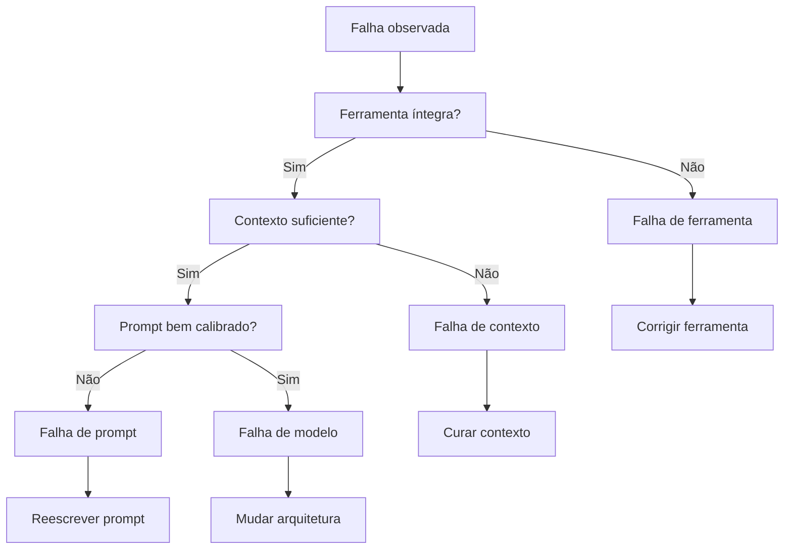

# Capítulo 8 — Diagnóstico prático: prompt, contexto ou outra camada?

## 1. Introdução

Os capítulos anteriores entregaram o framework completo da curadoria de contexto [1][6][7]. Este capítulo muda o registro: em vez de construir, ensina a diagnosticar [1][2]. Quando um sistema de IA falha, a pergunta decisiva é: a falha é de prompt, de contexto, de modelo ou de ferramenta? [1][2]. A resposta decide o tratamento — e tratamentos errados desperdiçam tempo e pioram o sistema [1]. O diagnóstico é a competência que separa o engenheiro que ajusta às cegas do que corrige a causa [1][2]. Este capítulo constrói o método de classificação de falhas, com as evidências dos capítulos anteriores (context rot, lost in the middle, isolamento) como ferramentas de diagnóstico [2][5][1].

## 2. Explica

### 2.1 As Quatro Classes de Falha

O método de diagnóstico começa pela taxonomia: quatro classes de falha [1][2]. **Falha de prompt**: a instrução é ambígua, contraditória ou mal calibrada — o modelo entende errado o que foi pedido [1]. **Falha de contexto**: a informação necessária está ausente, poluída, mal posicionada ou perdida no excesso — o modelo não tem o que precisa [2][5]. **Falha de modelo**: a tarefa excede a capacidade do modelo — nenhum prompt ou contexto resolve [1]. **Falha de ferramenta**: a ferramenta retorna dados truncados, mal formatados ou semanticamente ambíguos [6]. Cada classe tem sinais próprios, tratamentos próprios e armadilhas próprias [1][2].

### 2.2 O Sinal da Falha de Prompt

A falha de prompt tem sinais característicos [1]. O modelo responde de forma consistente — mas consistentemente errada no mesmo aspecto [1]. A resposta mostra mal-entendido da instrução: formato errado, escopo errado, tom errado [1]. O erro é reprodutível: mudanças pequenas na tarefa produzem o mesmo tipo de desvio [1]. O teste decisivo é a variação da instrução: reformule o prompt, isole a variável e observe se o erro muda [1][6]. Se o erro acompanha a instrução, é falha de prompt [1].

### 2.3 O Sinal da Falha de Contexto

A falha de contexto tem sinais distintos [2][5]. O modelo responde de forma plausível, mas com informação faltante ou errada — o que o Livro 2 chamou de plausível-porém-errado [2]. O erro varia com o contexto: a mesma instrução acerta com um contexto e erra com outro [2]. Os padrões reconhecíveis incluem: o esquecimento de informação no meio (lost in the middle) [5], a degradação em contexto longo (context rot) [2] e a contaminação entre escopos (Capítulo 7) [1]. O teste decisivo é a curadoria: melhore o contexto — selecione, posicione, compacte — e observe se o erro desaparece [1][2].

### 2.4 O Sinal da Falha de Modelo

A falha de modelo é a mais fácil de confundir [1]. O sinal é a incapacidade estrutural: o modelo erra mesmo com o melhor prompt e o melhor contexto [1]. O erro tende a ser consistente em tarefas do mesmo tipo — a tarefa está além do limiar de capacidade [1]. O teste decisivo é a mudança de modelo: se um modelo mais capaz resolve o que o atual não resolve, o limite é de capacidade [1]. O tratamento não é mais prompt nem mais contexto — é outra arquitetura: modelo diferente, decomposição da tarefa ou delegação a ferramentas [1][3].

### 2.5 O Sinal da Falha de Ferramenta

A falha de ferramenta é a mais negligenciada [6][21]. O sinal é a entrada ruim: a ferramenta retorna dados truncados, campos ausentes ou formatos que o modelo interpreta mal [6]. A resposta errada é consequência da ferramenta, não do raciocínio [6]. O teste decisivo é a inspeção da saída da ferramenta: o dado que chegou ao contexto estava íntegro? [6]. O tratamento é a correção da ferramenta — validação de saída, tratamento de truncamento, descrição melhor (Write) [6]. O Model Context Protocol padroniza a exposição de ferramentas, reduzindo a classe de falha por integração mal feita [21].

### 2.6 A Armadilha do Tratamento Errado

O maior erro do diagnóstico é tratar a classe errada [1][2]. Ajustar o prompt quando a falha é de contexto é desperdiçar tempo em ruído [1]. Adicionar contexto quando a falha é de modelo é encher a janela à toa — e piorar com o context rot [2]. Trocar de modelo quando a falha é de ferramenta é pagar mais pelo mesmo problema [6]. A armadilha é alimentada pela ausência de método: o engenheiro reage ao sintoma visível (a resposta errada) sem diagnosticar a classe [1]. O método deste capítulo é o antídoto [1].

### 2.7 O Protocolo de Classificação

O protocolo de classificação ordena os testes [1][2]. Primeiro, verifique a ferramenta: o dado de entrada estava íntegro? [6]. Segundo, verifique o contexto: a informação necessária estava presente, posicionada e limpa? [2][5]. Terceiro, verifique o prompt: a instrução estava clara e bem calibrada? [1]. Quarto, conclua: se as três primeiras passaram e a falha persiste, é falha de modelo [1]. A ordem é deliberada: das causas baratas para as caras [1][6]. O protocolo é a versão prática da taxonomia [1].

### 2.8 O Diagnóstico com os Fenômenos dos Capítulos Anteriores

Os fenômenos estudados viram ferramentas de diagnóstico [2][5]. O teste da agulha no palheiro (Capítulo 3) detecta degradação por volume [2]. A auditoria de posição (Capítulo 4) detecta esquecimento posicional [5]. O monitor de degradação (Capítulo 3) detecta queda em produção [20]. A auditoria de isolamento (Capítulo 7) detecta contaminação [1]. O engenheiro que conhece os fenômenos reconhece os padrões — e reconhecer o padrão é o primeiro passo do tratamento [2][5].

### 2.9 O Diagnóstico em Sistemas Compostos

Sistemas modernos combinam prompt, contexto, modelo e ferramentas — e as falhas se combinam [1][3]. A falha pode ser mista: contexto ruim agravando uma limitação de modelo, ou ferramenta truncada criando contexto poluído [1][2]. O diagnóstico de falhas mistas exige o isolamento de variáveis: teste cada camada separadamente [1][2]. A prática do Capítulo 5 — seleção e composição — é também prática de diagnóstico: compor o contexto camada por camada e testar em cada passo [1].

### 2.10 A Síntese: Diagnosticar é a Metade do Corrigir

O diagnóstico é a metade da correção [1][2]. Nomear a classe da falha — prompt, contexto, modelo ou ferramenta — é direcionar o tratamento certo [1]. O framework deste capítulo — taxonomia, sinais, testes e protocolo — transforma o diagnóstico de arte em método [1][2]. O engenheiro que domina o diagnóstico economiza dias de iteração errada [1]. E, como o restante do livro mostrou, a classe mais frequente em sistemas maduros não é o prompt — é o contexto [1][2][19].

## 3. Ilustra

### 3.1 A Analogia do Diagnóstico Médico

A medicina é a analogia do método [1]. O médico não trata o sintoma — diagnostica a doença [1]. Febre é sintoma de muitas causas; o médico examina, testa e classifica antes de prescrever [1]. O engenheiro de IA idem: a resposta errada é o sintoma; a classe da falha é a doença [1]. O protocolo de classificação é o exame clínico do sistema [1].

### 3.2 O Diagrama do Protocolo de Diagnóstico

O diagrama abaixo representa o protocolo de classificação de falhas [1][2][6].



O diagrama mostra a ordem do protocolo: ferramenta, contexto, prompt e, por último, modelo — das causas baratas às caras [1][2][6].

### 3.3 O Antes e o Depois na Prática

**Antes**: o engenheiro reescreve o prompt por semanas porque "o modelo está errando" — quando a falha era de contexto poluído [1][2]. **Depois**: o protocolo detecta a classe em minutos, o contexto é curado e a falha desaparece [1][2]. O mesmo esforço, com método, produz o resultado certo [1].

## 4. Técnica

### 4.1 A Árvore de Diagnóstico em Código

O primeiro instrumento implementa a árvore de classificação [1][2][6]. O código abaixo aplica o protocolo e retorna a classe da falha [1]:

```python
def diagnosticar_falha(falha: dict) -> str:
    """Aplica o protocolo de classificação de falhas.

    falha deve conter:
      - ferramenta_integra: bool
      - contexto_suficiente: bool
      - prompt_calibrado: bool
    """
    if not falha.get("ferramenta_integra", True):
        return "falha_de_ferramenta"
    if not falha.get("contexto_suficiente", True):
        return "falha_de_contexto"
    if not falha.get("prompt_calibrado", True):
        return "falha_de_prompt"
    return "falha_de_modelo"


if __name__ == "__main__":
    casos = [
        {"nome": "dado truncado", "ferramenta_integra": False},
        {"nome": "info no meio", "contexto_suficiente": False},
        {"nome": "instrução ambígua", "prompt_calibrado": False},
        {"nome": "além do limiar", },
    ]
    for caso in casos:
        print(caso["nome"], "->", diagnosticar_falha(caso))
```

A árvore materializa o protocolo: cada teste decide a classe [1][2][6].

### 4.2 O Teste de Isolamento de Variáveis

O segundo instrumento implementa o teste de isolamento: varia uma camada por vez e observa o efeito [1][2]. O código abaixo executa o sistema com variações controladas [1]:

```python
class TesteIsolamento:
    """Isola a camada da falha variando uma variável por vez."""

    def __init__(self, sistema):
        self.sistema = sistema

    def executar(self, variacao: str, valor: object) -> bool:
        """Executa o sistema com uma variação; retorna se acertou."""
        # Em produção: chamada real ao sistema com a variação aplicada.
        return self.sistema(variacao, valor)

    def diagnosticar(self, base: bool, variacoes: dict) -> dict:
        """Compara a linha de base com cada variação isolada."""
        resultado = {"linha_base": base}
        for nome, valor in variacoes.items():
            resultado[nome] = self.executar(nome, valor)
        return resultado


if __name__ == "__main__":
    def sistema(variacao, valor):
        # Simula: falha some quando o contexto é curado.
        return variacao == "contexto" and valor == "curado"

    t = TesteIsolamento(sistema)
    print(t.diagnosticar(
        base=False,
        variacoes={"prompt": "reformulado", "contexto": "curado", "modelo": "maior"},
    ))
```

O teste de isolamento materializa o método científico da falha: varia uma variável por vez e identifica qual camada resolve [1][2].

### 4.3 O Registro de Diagnóstico

O terceiro instrumento registra os diagnósticos para aprendizado contínuo [1][15]. O código abaixo mantém o histórico de falhas e as classes [1]:

```python
class RegistroDiagnostico:
    """Registra falhas, classes e tratamentos para análise histórica."""

    def __init__(self):
        self.registros = []

    def registrar(self, falha: dict, classe: str, tratamento: str) -> None:
        self.registros.append({**falha, "classe": classe, "tratamento": tratamento})

    def distribuicao_por_classe(self) -> dict:
        dist = {}
        for r in self.registros:
            dist[r["classe"]] = dist.get(r["classe"], 0) + 1
        return dist

    def top_falhas(self, n: int = 5) -> list:
        return sorted(self.registros, key=lambda r: r.get("frequencia", 1),
                      reverse=True)[:n]


if __name__ == "__main__":
    reg = RegistroDiagnostico()
    reg.registrar({"sintoma": "esquece info"}, "falha_de_contexto", "curar contexto")
    reg.registrar({"sintoma": "formato errado"}, "falha_de_prompt", "reescrever")
    reg.registrar({"sintoma": "dado truncado"}, "falha_de_ferramenta", "corrigir")
    print(reg.distribuicao_por_classe())
```

O registro materializa o aprendizado: a distribuição de classes revela onde o sistema concentra as falhas — e onde investir [1][15].

## 5. Aplica

### 5.1 Onde Isso Vive no Mundo Real

O diagnóstico está em toda operação de IA em produção [1][2]. O suporte técnico classifica cada incidente de resposta errada [1]. O time de engenharia mantém o registro de diagnósticos [1][15]. O monitor de produção (Capítulo 3) dispara alertas que alimentam o diagnóstico [20]. A revisão de arquitetura usa a distribuição de classes para decidir investimentos [1]. Em cada caso, o método substitui o ajuste às cegas [1].

### 5.2 O Erro Comum do Iniciante

O erro mais comum é pular o diagnóstico e ajustar o prompt [1]. O segundo é tratar o sintoma: corrigir a resposta individual em vez da classe [1]. O terceiro é não registrar: a mesma falha reaparece porque o aprendizado não foi documentado [1][15]. Os três erros têm o mesmo remédio: o protocolo de classificação e o registro [1][15].

### 5.3 O Padrão Profissional em 2026

O padrão profissional integra o diagnóstico ao ciclo de vida [1]. Todo incidente passa pelo protocolo de classificação [1][2]. O registro de diagnósticos alimenta a revisão de arquitetura [1]. A distribuição de classes orienta o investimento: mais contexto, melhor prompt ou outro modelo [1]. O diagnóstico vira parte da cultura de engenharia, não um ritual de crise [1].

### 5.4 Exercício de Fixação

Colete três falhas reais do seu sistema e classifique cada uma pelo protocolo [1][2]. Aplique o teste de isolamento de variáveis para confirmar cada classe [1][2]. Registre os diagnósticos e desenhe a distribuição [1][15]. Proponha o tratamento para a classe dominante [1].

### 5.5 O Diagnóstico em Cenários de Sessão Longa

As sessões longas concentram as falhas mais difíceis de diagnosticar — porque múltiplas causas se acumulam [2][7]. O protocolo do Capítulo 8 ganha uma camada extra para sessões longas [1][7]. O primeiro cenário é o **esquecimento progressivo**: o agente lembra bem no início e piora ao longo da sessão [2]. O padrão aponta para context rot (Capítulo 3) ou para a falta de compressão (Capítulo 6) [2][7]. O teste é a ocupação da janela: se o contexto cresceu sem compactar, a causa é a compressão ausente [7].

O segundo cenário é o **esquecimento seletivo**: o agente lembra de fatos recentes e esquece os antigos [5]. O padrão aponta para lost in the middle (Capítulo 4) — a informação antiga foi empurrada para o meio [5]. O teste é a auditoria de posição: onde está o fato esquecido? [5][1]. O terceiro cenário é a **mudança de comportamento por contaminação**: o agente mistura assuntos [1]. O padrão aponta para falha de isolamento (Capítulo 7) [1]. O teste é a auditoria de isolamento entre escopos [1].

O quarto cenário é a **degradação por poluição de ferramentas**: o agente piora conforme acumula saídas de ferramentas [7][6]. O padrão aponta para a falta de limpeza (Capítulo 6) [7]. O quinto cenário é o **erro persistente apesar de tudo**: o agente erra o mesmo tipo de tarefa mesmo com contexto curado [1]. O padrão aponta para falha de modelo (seção 2.4) [1]. A classificação por cenário transforma o diagnóstico de sessão longa em protocolo — cada padrão tem teste e tratamento [1][7].

### 5.6 A Prevenção como Metade do Diagnóstico

O melhor diagnóstico é o que evita o incidente [1][20]. A prevenção é a aplicação sistemática das disciplinas dos capítulos anteriores antes que a falha apareça [1][20]. O primeiro pilar da prevenção é o **teste contínuo de contexto**: o teste da agulha (Capítulo 3) roda regularmente contra o sistema real, detectando a degradação antes do usuário [2][9]. O segundo é a **auditoria preventiva de templates**: os templates de contexto são auditados quanto a posição (Capítulo 4), seleção (Capítulo 5) e compressão (Capítulo 6) [1][5].

O terceiro pilar é o **monitoramento de saúde** (Capítulo 3): a degradação é detectada em produção, com alertas precoces [20]. O quarto é o **registro contínuo de incidentes**: cada falha, mesmo pequena, é registrada e classificada [1][15]. O registro alimenta a distribuição de classes — a base para decidir onde investir (seção 5.3) [1][15].

O quinto pilar é a **revisão periódica de arquitetura**: a revisão pergunta se a arquitetura de contexto ainda é adequada à tarefa — se as fontes mudaram, se os volumes cresceram, se os padrões de falha evoluíram [1][20]. A prevenção é a metade do diagnóstico porque reduz o número de incidentes a diagnosticar [1][20]. O engenheiro que previne constrói sistemas que raramente precisam do protocolo completo [1].

### 5.7 O Diagnóstico de Falhas em Recuperação (RAG)

O diagnóstico ganha um caso especial quando a falha envolve recuperação (Capítulo 9) [3][2]. O primeiro padrão de falha RAG é o **trecho irrelevante**: a recuperação retornou material que não responde à pergunta [3][4]. O teste é a inspeção dos trechos recuperados: a relevância é medida (precisão do Capítulo 9) [12]. O segundo é o **trecho distrator**: o material recuperado é semelhante, porém incorreto (Capítulo 3) [2]. O teste é o detector de distratores [2].

O terceiro padrão é o **trecho perdido**: a informação correta existia na base, mas não foi recuperada [3][4]. O teste é o recall (Capítulo 9): a informação recuperável está sendo encontrada? [12]. O quarto é o **trecho truncado**: a recuperação retornou um fragmento incompleto [4][6]. O teste é a integridade do fragmento — a mesma inspeção da ferramenta (seção 2.5) [6].

O quinto padrão é o **posicionamento ruim**: os trechos entraram no meio e foram esquecidos (Capítulo 4) [5]. O teste é a auditoria de posição aplicada ao contexto RAG [5]. A classificação das falhas de recuperação é a aplicação mais rica do protocolo deste capítulo — porque o RAG combina todas as camadas: fonte, seleção, posição e geração [1][3]. O engenheiro que diagnostica RAG com o protocolo domina o caso mais complexo da disciplina [1][3].

### 5.8 O Registro de Aprendizado e a Melhoria Contínua

O diagnóstico não termina na correção — termina no aprendizado [1][15]. O registro de incidentes (seção 4.3) é a matéria-prima do aprendizado [1][15]. O primeiro uso do registro é a **análise de tendências**: a distribuição de classes revela os padrões — falhas de contexto dominam? De ferramenta? [1][15]. A tendência orienta o investimento: a classe dominante recebe o tratamento estrutural [1].

O segundo uso é a **biblioteca de casos**: os incidentes resolvidos viram casos de teste do conjunto de avaliação (Capítulo 10) [1][12]. Cada falha corrigida passa a ser protegida por um teste — a regressão vira prevenção [1][12]. O terceiro uso é o **retrospecto periódico**: a revisão dos incidentes do período identifica os padrões de causa raiz [1].

O quarto uso é a **atualização do protocolo**: quando o registro revela uma classe de falha não prevista, o protocolo ganha um teste novo [1][15]. O protocolo de diagnóstico é um documento vivo — evolui com a operação [1]. O aprendizado contínuo é o que transforma o diagnóstico de competência individual em ativo institucional [1][15]. O engenheiro que registra, analisa e atualiza constrói uma organização que erra menos a cada mês [1].

### 5.9 O Diagnóstico em Aplicações de Alto Risco

O diagnóstico ganha peso quando a falha tem consequências sérias — financeiras, jurídicas, de segurança [1][12]. Em aplicações de alto risco, o protocolo deste capítulo não é uma boa prática — é um requisito [1][12]. A primeira adaptação é a **profundidade da verificação**: cada classe de falha é verificada com mais rigor — o teste da ferramenta inclui validação de integridade, o teste do contexto inclui auditoria completa de posição e fonte [1][12].

A segunda adaptação é a **trilha de auditoria**: cada diagnóstico registra as evidências — o dado inspecionado, o teste aplicado, a conclusão [1][12]. A trilha é o que permite a revisão do diagnóstico e a responsabilização [1][12]. A terceira é a **segunda opinião**: em casos de alto risco, um segundo avaliador (humano ou agente) repete o diagnóstico de forma independente [1][12].

A quarta adaptação é o **tratamento em camadas**: mesmo identificada a classe, o tratamento inclui proteção redundante — corrigir a causa e adicionar uma salvaguarda que detectaria a recorrência [1][12]. O diagnóstico em aplicações de alto risco é o uso mais exigente do protocolo: a classificação correta é o que evita a repetição do erro caro [1][12].

### 5.10 O Diagnóstico e o Design de Experimentos

O diagnóstico profissional é, na prática, um design de experimentos [1][13]. O Livro 2 introduziu o protocolo de experimentação para prompts; este capítulo o aplica ao contexto [1][13]. O primeiro princípio é a **hipótese explícita**: antes de testar, o engenheiro escreve a hipótese — "a falha é de contexto porque..." [1][13]. A hipótese orienta o teste e a interpretação [1].

O segundo princípio é a **variação isolada**: o teste altera uma variável por vez — o contexto, o prompt ou o modelo [1][13]. A variação isolada é o que permite atribuir a causa [1][13]. O terceiro é a **amostra suficiente**: a conclusão exige amostra — dez execuções com a variação, não uma [1][12]. O quarto é o **registro sistemático**: hipótese, teste, resultado e conclusão entram no registro (seção 4.3) [1][15].

O diagnóstico como experimento tem um benefício duplo [1][13]. Classifica a falha atual — e produz conhecimento sobre o sistema [1][13]. Cada diagnóstico bem desenhado é um experimento que informa o design futuro [1][12]. O engenheiro que trata o diagnóstico como experimento transforma incidentes em aprendizado — a marca da maturidade [1][13].

### 5.11 O Estudo de Caso da Resposta Financeira Errada

O estudo de caso consolida o capítulo em um cenário de alto risco [1][2]. O cenário: um assistente financeiro que responde perguntas sobre investimentos [1]. O sintoma: uma resposta citou um número de taxa de juros errado — o usuário quase agiu com base no erro [1][2].

O primeiro reflexo da equipe foi ajustar o prompt — "seja preciso com taxas" [1]. O erro persistiu [1]. O protocolo (seção 2.7) foi aplicado [1]. O teste da ferramenta: a fonte de taxas estava íntegra [6]. O teste do contexto: a informação correta estava presente, mas a fonte antiga — um distrator — também foi recuperada (Capítulos 3 e 9) [2][3]. O diagnóstico: falha de contexto, por distrator de fonte [2][1].

O tratamento: corrigir a fonte e adicionar o critério de atualidade à seleção (Capítulo 5) [1][2]. A salvaguarda: o teste da agulha (Capítulo 3) passou a incluir casos de taxa [2][9]. O caso demonstra o valor do protocolo: o ajuste de prompt era o tratamento errado — o protocolo encontrou a causa em minutos [1][2]. E mostra o tema do capítulo: diagnosticar é a metade do corrigir [1][2].

### 5.12 O Diagnóstico e a Cultura de Engenharia

O diagnóstico não é apenas um método — é uma cultura [1][15]. A cultura de diagnóstico tem sinais reconhecíveis [1]. O primeiro é a **curiosidade pela causa**: a equipe pergunta "por quê" antes de "consertar" [1]. O segundo é a **disciplina do registro**: todo incidente é registrado, mesmo os pequenos [1][15]. O terceiro é a **humildade diante da evidência**: a hipótese é testada, não defendida [1][13].

O quarto sinal é a **aversão ao tratamento sintomático**: a equipe recusa o ajuste que esconde o sintoma sem tratar a causa [1]. O quinto é a **revisão periódica do protocolo**: a equipe atualiza o método com o aprendizado [1][15]. A cultura de diagnóstico é o que transforma o protocolo deste capítulo em prática viva [1][15].

A construção da cultura começa com o exemplo técnico e o vocabulário compartilhado (o Livro 2, Capítulo 7, documentou o mesmo princípio para prompts) [1][19]. A equipe que nomeia as classes de falha — "isso é falha de contexto" — diagnostica mais rápido [1]. A cultura de diagnóstico é o ativo que permanece quando as ferramentas mudam [1][15].

### 5.13 O Estudo de Caso do Loop de Retrabalho

O estudo de caso mostra o diagnóstico interrompendo um ciclo vicioso [1][2]. O cenário: um agente de geração de conteúdo com um erro recorrente [1]. O sintoma: as respostas precisavam de correção manual frequente [1][2]. A equipe corrigia cada resposta — um loop de retrabalho sem fim [1].

O diagnóstico: o registro de incidentes (seção 4.3) revelou o padrão — as falhas concentravam-se quando o contexto vinha de uma fonte específica [1][2][15]. O teste da ferramenta: a fonte estava truncando os campos [6]. O tratamento: a correção da ferramenta, não do prompt [6]. O loop parou [1][6].

A lição do caso é o poder do registro: sem ele, a equipe tratava sintomas; com ele, identificou a causa em uma tarde [1][15]. O caso demonstra o tema do capítulo: o diagnóstico é a metade do corrigir — e o registro é o que torna o diagnóstico possível em escala [1][15].

### 5.14 A Lista de Verificação do Diagnóstico

A lista de verificação consolida o capítulo [1][2]. O primeiro item: o incidente é classificado pelo protocolo? [1][2]. O segundo: a ferramenta foi verificada primeiro (dado íntegro)? [6]. O terceiro: o contexto foi verificado (presença, posição, poluição)? [1][2][5]. O quarto: o prompt foi verificado (calibração)? [1].

O quinto item: a falha de modelo é confirmada por mudança de modelo? [1]. O sexto: o teste de isolamento de variáveis foi aplicado? [1][13]. O sétimo: o diagnóstico foi registrado com evidências? [1][15]. O oitavo: o incidente virou caso de teste do conjunto de avaliação? [1][12].

A lista é o resumo operacional [1][2]. O engenheiro que a percorre transforma incidentes em aprendizado [1]. O diagnóstico é a competência que amarra a Parte II — e prepara a Parte III, onde a verificação vira automação [1][19].

### 5.15 O Diagnóstico e a Interface com a Engenharia de Prompt

O diagnóstico do Capítulo 8 fecha o ciclo com a engenharia de prompts do Livro 2 [1][19]. O Livro 2 ensinou a avaliar respostas plausíveis-porém-erradas; este capítulo ensina a classificar a causa [1][19]. A síntese: a avaliação (Parte I) diz que a resposta está errada; o diagnóstico (Parte II) diz por quê [1][19].

A primeira interface é a **hereditariedade de técnicas**: o protocolo de variação isolada do Livro 2 (experimentação de prompts) é o mesmo do diagnóstico de contexto (Capítulo 8, seção 5.10) [1][19]. A segunda é a **distinção de classes**: a falha de prompt do Livro 2 e a falha de contexto deste livro são classes diferentes — e a confusão entre elas é o erro mais caro [1][2][19]. A terceira é a **avaliação conjunta**: o conjunto de avaliação cobre prompts e contexto — a resposta é avaliada por ambas as lentes [1][12].

O engenheiro que integra as duas camadas diagnostica a pilha completa [1][19]. O Capítulo 8 é o ponto onde a Parte I e a Parte II se encontram: a avaliação do Livro 2 ganha a classificação de causa deste livro [1][19].

### 5.16 O Estudo de Caso do Diagnóstico em Cascata

O estudo de caso mostra o diagnóstico integrado [1][2][19]. O cenário: um assistente com falha recorrente [1]. O sintoma: respostas erradas em um subconjunto de perguntas [1]. A equipe do prompt ajustou o prompt (Parte I) — sem efeito [1][19]. A equipe do contexto curou o contexto (Parte II) — sem efeito [1][2].

O diagnóstico integrado (Capítulo 8): o teste da ferramenta revelou a causa — a API de dados retornava campos com tipos errados [6][8]. Nem o prompt nem o contexto eram o problema [6]. O tratamento: a correção da API e a validação de tipos na fronteira [6].

O caso demonstra o valor da classificação completa: as equipes trataram as classes erradas porque o protocolo não foi seguido [1][6]. Com o protocolo, a causa foi encontrada na primeira passada [6]. O diagnóstico integrado é a aplicação madura das duas Partes [1][19].

### 5.17 O Fechamento do Capítulo

O capítulo do diagnóstico se encerra com a consolidação [1][2]. As quatro classes — prompt, contexto, modelo, ferramenta — têm sinais e tratamentos [1][2][6]. O protocolo ordena os testes [1]. O registro alimenta o aprendizado [1][15]. A prevenção reduz os incidentes [1][20].

O diagnóstico é a competência que amarra a Parte II [1]. E é a ponte para a Parte III: o harness automatiza exatamente o que este capítulo faz manualmente — verificar, classificar e corrigir [1][19]. O engenheiro que domina o diagnóstico está pronto para delegar a verificação ao harness [1][19].

### 5.18 O Diagnóstico e o Custo da Falha Não Classificada

A falha não classificada tem um custo que o engenheiro conhece: o custo do tratamento errado [1][2]. O primeiro componente é o **tempo desperdiçado**: ajustar o prompt quando a falha é de contexto consome dias [1][2]. O segundo é o **retrabalho acumulado**: cada tratamento errado deixa a causa viva — e a falha volta [1][2]. O terceiro é o **custo de oportunidade**: o tempo do time aplicado no tratamento errado não produz melhoria real [1][13].

O quarto componente é o **dano da piora**: alguns tratamentos errados pioram o sistema — adicionar contexto a uma falha de modelo aumenta o custo sem melhorar [1][2]. O quinto é o **custo institucional**: a equipe que erra o diagnóstico repetidamente perde a confiança no próprio método [1].

O protocolo deste capítulo é o antídoto do custo da falha não classificada [1][2]. A classificação em minutos — ferramenta, contexto, prompt, modelo — evita os dias do tratamento errado [1][2]. O custo do protocolo é pequeno; o custo da sua ausência é alto [1]. O engenheiro que classifica primeiro economiza o que o tratamento errado gastaria [1][2].

### 5.19 O Fechamento do Capítulo

O capítulo do diagnóstico se encerra com a consolidação final [1][2]. As quatro classes — prompt, contexto, modelo, ferramenta — são o mapa da falha [1][2][6]. O protocolo é a ordem do exame [1]. O registro é a memória do método [1][15]. A prevenção é a aplicação contínua [1][20].

O diagnóstico é a competência que fecha a Parte II [1]. E é a ponte para a Parte III: o harness automatiza a verificação que este capítulo ensina [1][19]. O engenheiro que diagnostica bem está pronto para delegar a verificação ao harness [1][19].

### 5.20 O Diagnóstico e a Medição Contínua

O diagnóstico não é apenas reativo — é também uma prática de medição contínua [1][20]. O primeiro instrumento é o **monitor de classes**: a distribuição de falhas por classe é monitorada ao longo do tempo [1][15]. A tendência revela a saúde: falhas de contexto subindo indicam degradação da base; falhas de ferramenta subindo indicam integração frágil [1][15][20]. O segundo é o **tempo de diagnóstico**: o tempo entre o incidente e a classificação é medido — e o protocolo deve reduzi-lo [1].

O terceiro instrumento é o **custo do incidente**: cada incidente registra o custo do retrabalho, da investigação e da correção [1][13]. O custo acumulado justifica o investimento em prevenção (seção 5.6) [1][13]. O quarto é o **retrospecto periódico**: a revisão mensal da distribuição, do tempo e do custo orienta a melhoria [1][15].

O diagnóstico como medição contínua transforma a operação em aprendizado sistemático [1][20]. O engenheiro que mede as falhas constrói o caso de negócio da prevenção [1][13]. E o Capítulo 10 integra as métricas do diagnóstico ao painel geral do sistema [1][12].

### 5.21 O Fechamento do Capítulo

O capítulo do diagnóstico se encerra com a consolidação final [1][2]. As quatro classes são o mapa [1][2][6]. O protocolo é a ordem [1]. O registro é a memória [1][15]. A prevenção e a medição são a prática contínua [1][20].

O diagnóstico é a competência que amarra a Parte II — e a ponte para a Parte III, onde a verificação vira automação [1][19]. O engenheiro que diagnostica bem está pronto para o harness [1][19].

### 5.22 A Mensagem Final do Capítulo

O capítulo do diagnóstico deixa a mensagem que amarra a Parte II [1][2]. As quatro classes — prompt, contexto, modelo, ferramenta — são o mapa da falha [1][2][6]. O protocolo é a ordem do exame [1]. O registro é a memória do método [1][15].

O diagnóstico é a competência que verifica o sistema inteiro — e a ponte para a Parte III, onde a verificação vira automação [1][19]. O engenheiro que diagnostica bem está pronto para o harness [1][19].

## 6. Conclusão

O diagnóstico é a competência que transforma a engenharia de contexto em disciplina madura [1]. As quatro classes — prompt, contexto, modelo e ferramenta — têm sinais, testes e tratamentos próprios [1][2][6]. O protocolo de classificação ordena os testes das causas baratas às caras [1]. As ferramentas deste capítulo implementam a árvore, o isolamento de variáveis e o registro [1][2][15]. O próximo capítulo desenvolve a camada de recuperação — RAG — uma das fontes mais ricas de contexto e, também, uma das mais propensas a falha de contexto [3][4].

## 7. Referências

[1] ANTHROPIC. Effective context engineering for AI agents. Anthropic Engineering Blog, set. 2025. Disponível em: https://www.anthropic.com/engineering/effective-context-engineering-for-ai-agents. Acesso em: 5 ago. 2026.
[2] HONG, Kelly; TROYNIKOV, Anton; HUBER, Jeff. Context Rot: How Increasing Input Tokens Impacts LLM Performance. Chroma Technical Report, jul. 2025. Disponível em: https://www.trychroma.com/research/context-rot. Acesso em: 5 ago. 2026.
[3] LEWIS, Patrick et al. Retrieval-Augmented Generation for Knowledge-Intensive NLP Tasks. In: Advances in Neural Information Processing Systems (NeurIPS), v. 33, p. 9459–9474, 2020. Disponível em: https://arxiv.org/abs/2005.11401. Acesso em: 5 ago. 2026.
[4] GAO, Yunfan et al. Retrieval-Augmented Generation for Large Language Models: A Survey. arXiv:2312.10997, mar. 2024. Disponível em: https://arxiv.org/abs/2312.10997. Acesso em: 5 ago. 2026.
[5] LIU, Nelson F. et al. Lost in the Middle: How Language Models Use Long Contexts. Transactions of the Association for Computational Linguistics (TACL), v. 12, p. 157–173, 2024. Disponível em: https://arxiv.org/abs/2307.03172. Acesso em: 5 ago. 2026.
[6] ANTHROPIC. Writing tools for AI agents — using AI agents. Anthropic Engineering Blog, set. 2025. Disponível em: https://www.anthropic.com/engineering/writing-tools-for-agents. Acesso em: 5 ago. 2026.
[7] ANTHROPIC. Context engineering: memory, compaction, and tool clearing. Claude Platform Cookbook, mar. 2026. Disponível em: https://platform.claude.com/cookbook/tool-use-context-engineering-context-engineering-tools. Acesso em: 5 ago. 2026.
[8] ZHAO, Wayne Xin et al. A Survey of Large Language Models. arXiv:2303.18223, 2023. Disponível em: https://arxiv.org/abs/2303.18223. Acesso em: 5 ago. 2026.
[9] CHROMA. Context Rot: Evaluation Toolkit. GitHub Repository, 2025. Disponível em: https://github.com/chroma-core/context-rot. Acesso em: 5 ago. 2026.
[10] LIU, Nelson F. Lost in the Middle: Replication Repository. GitHub Repository, 2023. Disponível em: https://github.com/nelson-liu/lost-in-the-middle. Acesso em: 5 ago. 2026.
[11] CHEN, Jiawei et al. LongRAG: Enhancing Retrieval-Augmented Generation with Long-context LLMs. arXiv:2406.15319, 2024. Disponível em: https://arxiv.org/abs/2406.15319. Acesso em: 5 ago. 2026.
[12] ASIA, Research Group et al. Retrieval-Augmented Generation Evaluation in the Era of Large Language Models: A Comprehensive Survey. ResearchGate / arXiv, abr. 2025. Disponível em: https://www.researchgate.net/publication/390991356. Acesso em: 5 ago. 2026.
[13] OPENAI. GPT-4 Technical Report & Developer Guides on Context Management. OpenAI Documentation, 2024–2025. Disponível em: https://openai.com/index/gpt-4-research/. Acesso em: 5 ago. 2026.
[14] GOOGLE CLOUD. What is Retrieval-Augmented Generation (RAG)?. Google Cloud Architecture Center, 2025. Disponível em: https://cloud.google.com/use-cases/retrieval-augmented-generation. Acesso em: 5 ago. 2026.
[15] LANGCHAIN. LangChain Agents & Context Management Documentation. LangChain Guides, 2025–2026. Disponível em: https://python.langchain.com/docs/concepts/agents/. Acesso em: 5 ago. 2026.
[16] WANG, Zhen et al. Agentic Retrieval-Augmented Generation: A Survey on Agentic RAG. arXiv:2408.12999, 2024. Disponível em: https://arxiv.org/abs/2408.12999. Acesso em: 5 ago. 2026.
[17] XIAO, Guangxuan et al. Efficient Streaming Language Models with Attention Sinks. arXiv:2309.17453, 2023. Disponível em: https://arxiv.org/abs/2309.17453. Acesso em: 5 ago. 2026.
[18] RODIN, Alex et al. Found in the Middle: Overcoming Long-Context Vulnerabilities in LLMs. arXiv:2403.04797, 2024. Disponível em: https://arxiv.org/abs/2403.04797. Acesso em: 5 ago. 2026.
[19] MEDIUM (Data Science Collective). Context Is the New Prompt: Why Context Engineering Is Shaping the Future of AI. Medium Article, 2025. Disponível em: https://medium.com/data-science-collective/context-is-the-new-prompt-why-context-engineering-is-shaping-the-future-of-ai-46eb062ed270. Acesso em: 5 ago. 2026.
[20] ZENML. Context Rot: Evaluating LLM Performance Degradation with Increasing Input Tokens. MLOps Database, 2025. Disponível em: https://www.zenml.io/llmops-database/context-rot-evaluating-llm-performance-degradation-with-increasing-input-tokens. Acesso em: 5 ago. 2026.
[21] MODEL CONTEXT PROTOCOL (MCP). Open Standard for AI Agent Context Integration. Anthropic & Ecosystem Specs, 2025–2026. Disponível em: https://modelcontextprotocol.io/. Acesso em: 5 ago. 2026.
