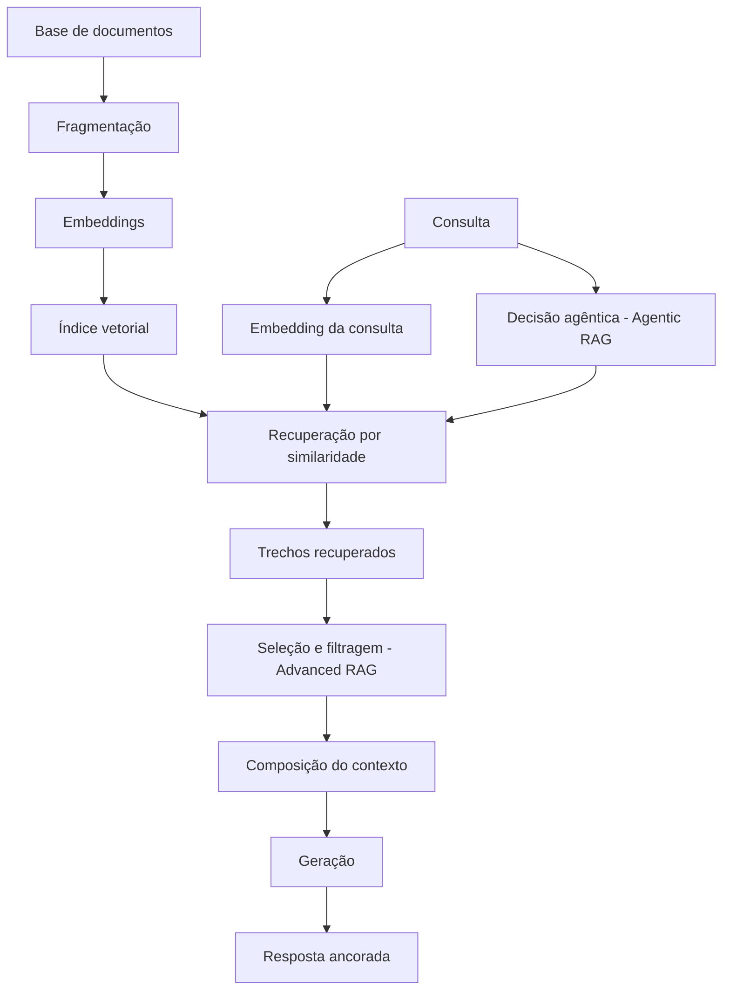

# Capítulo 9 — RAG: quando e por que recuperar conhecimento

## 1. Introdução

O Capítulo 5 apresentou o Select como a seleção de contexto sob demanda [1]. Este capítulo desenvolve o mecanismo mais poderoso de seleção: a recuperação aumentada por geração — RAG (Retrieval-Augmented Generation) [3]. RAG é a arquitetura que combina o conhecimento do modelo com conhecimento externo recuperado de uma base na hora da inferência [3]. O paper seminal de Lewis et al. (2020) fundou a técnica; o survey de Gao et al. (2024) documentou sua evolução em três eras [3][4]. Este capítulo ensina o que é RAG, por que existe, quando usar, como evoluiu e como evitar as armadilhas — incluindo a ironia de que RAG mal feito é uma fonte clássica de falha de contexto (Capítulo 8) [3][4][2].

## 2. Explica

### 2.1 O Problema que o RAG Resolve

O modelo de linguagem conhece o mundo até o fim do seu treinamento — e nada além [3][1]. Ele não conhece os documentos da sua empresa, os dados atualizados do trimestre ou a política interna de ontem [3]. O Livro 2 mostrou que nenhum prompt faz o modelo saber o que ele não sabe [19]. O RAG resolve esse limite arquitetural: em vez de forçar o conhecimento para dentro do modelo (treinamento, caro e lento), o RAG busca o conhecimento na hora e o entrega no contexto [3]. A recuperação é a ponte entre o conhecimento estático do modelo e o conhecimento dinâmico do mundo [3][1].

### 2.2 A Arquitetura Fundacional

O paper de Lewis et al. (2020) estabeleceu a arquitetura do RAG [3]. A ideia central: combinar memória paramétrica — o conhecimento no peso do modelo — com memória não-paramétrica — um índice externo recuperável [3]. O fluxo é triplo [3]. Primeiro, a indexação: os documentos da base são fragmentados e embutidos em vetores [3]. Segundo, a recuperação: a consulta é embutida e comparada aos vetores, selecionando os trechos mais similares [3]. Terceiro, a geração: o modelo recebe a consulta e os trechos recuperados e gera a resposta com base neles [3]. A arquitetura é a base de tudo o que veio depois [3][4].

### 2.3 As Três Eras do RAG

O survey de Gao et al. (2024) organizou a evolução do RAG em três eras [4]. A primeira é o **Naive RAG**: recuperação direta e geração — o padrão mínimo [4]. A segunda é o **Advanced RAG**: adiciona pré-processamento (melhorar a indexação e a consulta) e pós-processamento (filtrar e reordenar trechos) [4]. A terceira é o **Modular RAG**: arquiteturas flexíveis com roteamento adaptativo, múltiplas fontes e iteração [4]. A evolução é a história da disciplina: cada era resolveu as limitações da anterior [4]. O Google Cloud documenta os padrões arquiteturais correspondentes na prática corporativa [14].

### 2.4 Quando Usar RAG

O RAG é a ferramenta certa para uma classe específica de problemas [3][14]. Use RAG quando o conhecimento necessário é externo ao modelo: documentos da empresa, dados atualizados, bases proprietárias [3]. Use RAG quando o conhecimento muda: o RAG atualiza ao reindexar a base, sem retreinar o modelo [3]. Use RAG quando a fidelidade é crítica: o RAG ancora a resposta em trechos verificáveis [3]. Não use RAG quando o conhecimento está no modelo e é estável — a recuperação adiciona custo e latência sem benefício [3][1]. A decisão é a mesma do Capítulo 8: o problema define a arquitetura [1].

### 2.5 O Que RAG Não Resolve

O RAG tem limites — e conhecê-los evita a decepção [2][4]. Primeiro, o RAG não resolve a degradação de contexto: trechos recuperados em excesso criam o palheiro do Capítulo 3 [2]. Segundo, o RAG não resolve a geografia: trechos recuperados no meio sofrem o lost in the middle [5]. Terceiro, o RAG não garante fidelidade: trechos mal recuperados (distratores) enganam o modelo [2]. Quarto, o RAG não substitui a capacidade do modelo: se a tarefa exige raciocínio além do limiar, os trechos não resolvem [1]. O RAG é uma camada de conhecimento — não uma panaceia [2][4].

### 2.6 As Armadilhas da Recuperação

A recuperação é a fonte mais comum de falha em sistemas RAG [2][4]. A armadilha central é a qualidade da recuperação: trechos irrelevantes, truncados ou distratores entram no contexto e poluem a resposta [2][4]. O survey de avaliação de RAG documenta as métricas: precisão da recuperação, relevância dos trechos e fidelidade da resposta [12]. A segunda armadilha é o custo: recuperar demais infla a janela e degrada (Capítulo 3) [2]. A terceira é a posição: trechos recuperados no meio são esquecidos (Capítulo 4) [5]. O engenheiro de RAG maduro trata a recuperação como um sistema a ser avaliado, não um detalhe [2][12].

### 2.7 A Evolução para o Agentic RAG

A próxima fronteira da disciplina é o RAG agêntico (Agentic RAG) [16]. O survey de Wang et al. (2024) documenta a evolução do RAG estático para o RAG dinâmico guiado por agentes [16]. No Agentic RAG, o sistema decide o que recuperar, quando recuperar e se precisa recuperar mais — em vez de recuperar sempre a mesma quantidade [16]. O agente usa o feedback da geração para refinar a busca [16]. A evolução integra o RAG ao framework deste livro: o agente seleciona (Capítulo 5), diagnostica (Capítulo 8) e isola (Capítulo 7) a recuperação [1][16].

### 2.8 A Interação com Janelas Longas

A chegada de janelas gigantes criou um debate na disciplina: com janela de 1 milhão de tokens, o RAG ainda é necessário? [11][2]. A pesquisa sobre LongRAG explora a convergência: janelas longas podem substituir parte da recuperação — mas não toda [11]. O estudo da Chroma mostra o outro lado: janela grande sem curadoria degrada [2]. A síntese prática: a janela longa muda a economia (cabe mais), mas não muda a fisiologia (a atenção ainda se dilui) [2][11]. O RAG continua sendo a resposta à escassez e à qualidade [11][1].

### 2.9 O RAG como Sistema de Contexto

O RAG não é um componente isolado — é um sistema de contexto [1][3]. O fluxo completo integra: indexação (preparar a base), recuperação (buscar os trechos), seleção (filtrar o ruído), posicionamento (evitar o meio) e composição (respeitar a reserva) [1][3][5]. O engenheiro de contexto aplica ao RAG tudo o que aprendeu: curadoria, orçamento, geografia e diagnóstico [1][2][5]. O RAG bem construído é a demonstração prática de que contexto é decisão [1].

### 2.10 A Síntese: Conhecimento Sob Demanda

O RAG é a materialização do princípio do conhecimento sob demanda [3][1]. Em vez de embutir o conhecimento no modelo ou no contexto, o sistema o busca quando precisa [3]. A evolução — Naive, Advanced, Modular, Agentic — é a história da disciplina refinando a pergunta "como buscar" [4][16]. O RAG não substitui o framework deste livro — ele o utiliza [1][3]. E é a ponte para o Capítulo 10: quando o conhecimento recuperado precisa persistir além da sessão, nasce a memória [3][7][13].

## 3. Ilustra

### 3.1 A Analogia da Biblioteca

A biblioteca é a analogia clássica do RAG [3]. O modelo é um especialista com memória limitada; a base é a biblioteca da empresa [3]. Em vez de o especialista memorizar todos os livros (treinamento), o sistema o envia à biblioteca para consultar o trecho certo quando precisa (recuperação) [3]. O RAG é o bibliotecário: recebe a pergunta, localiza a estante, pega o livro e abre a página certa [3][14].

### 3.2 O Diagrama do Fluxo RAG

O diagrama abaixo representa o fluxo completo do RAG com as três eras [3][4][16].



O diagrama mostra o ciclo: indexação, recuperação, seleção, composição e geração — com a realimentação agêntica [3][4][16].

### 3.3 O Antes e o Depois na Prática

**Antes (sem RAG)**: o modelo responde sobre políticas da empresa com conhecimento genérico ou inventado — o Livro 2 documentou o perigo [7]. **Depois (com RAG)**: o sistema recupera a política específica, entrega o trecho no contexto e a resposta cita o documento real [3]. A fidelidade sobe porque a fonte está no contexto, verificável [3].

## 4. Técnica

### 4.1 O Indexador Didático

O primeiro instrumento implementa a indexação: fragmentar documentos e criar um índice de busca [3][4]. O código abaixo é uma versão didática com busca por palavras-chave [3]:

```python
class IndexadorDidatico:
    """Indexa documentos por fragmentos e palavras-chave (didático)."""

    def __init__(self, tamanho_fragmento: int = 100):
        self.tamanho_fragmento = tamanho_fragmento
        self.indice = []  # lista de fragmentos

    def fragmentar(self, doc_id: str, texto: str) -> list:
        palavras = texto.split()
        fragmentos = []
        for i in range(0, len(palavras), self.tamanho_fragmento):
            trecho = " ".join(palavras[i:i + self.tamanho_fragmento])
            fragmentos.append({"doc": doc_id, "trecho": trecho})
        self.indice.extend(fragmentos)
        return fragmentos

    def recuperar(self, consulta: str, k: int = 2) -> list:
        """Recupera os k fragmentos com mais termos em comum com a consulta."""
        termos = set(consulta.lower().split())
        pontuados = []
        for frag in self.indice:
            pontos = sum(1 for t in termos if t in frag["trecho"].lower())
            pontuados.append((pontos, frag))
        pontuados.sort(key=lambda x: x[0], reverse=True)
        return [f for p, f in pontuados[:k] if p > 0]


if __name__ == "__main__":
    idx = IndexadorDidatico()
    idx.fragmentar("politica", "Pagamentos acima de 10 mil exigem aprovação em duas etapas.")
    idx.fragmentar("manual", "O sistema registra todas as operações no log de auditoria.")
    print(idx.recuperar("como aprovar pagamento alto?", k=2))
```

O indexador materializa o fluxo de indexação e recuperação — com similaridade por termos, em vez de vetores, por clareza didática [3].

### 4.2 O Avaliador de Recuperação

O segundo instrumento avalia a qualidade da recuperação: precisão, relevância e cobertura [12]. O código abaixo implementa as métricas básicas [12]:

```python
def avaliar_recuperacao(consultas: list, relevantes_por_consulta: dict,
                        recuperados_por_consulta: dict) -> dict:
    """Calcula precisão e recall da recuperação."""
    total_precisao = 0
    total_recall = 0
    for consulta in consultas:
        relevantes = set(relevantes_por_consulta.get(consulta, []))
        recuperados = set(recuperados_por_consulta.get(consulta, []))
        if recuperados:
            total_precisao += len(relevantes & recuperados) / len(recuperados)
        if relevantes:
            total_recall += len(relevantes & recuperados) / len(relevantes)
    n = len(consultas) or 1
    return {
        "precisao_media": round(total_precisao / n, 2),
        "recall_medio": round(total_recall / n, 2),
    }


if __name__ == "__main__":
    consultas = ["política de pagamento", "log de auditoria"]
    relevantes = {
        "política de pagamento": ["frag_pol_1"],
        "log de auditoria": ["frag_man_2"],
    }
    recuperados = {
        "política de pagamento": ["frag_pol_1", "frag_man_2"],
        "log de auditoria": ["frag_man_2"],
    }
    print(avaliar_recuperacao(consultas, relevantes, recuperados))
```

O avaliador materializa o Capítulo 8 aplicado ao RAG: a qualidade da recuperação é medida, não presumida [12][8].

### 4.3 O Compositor RAG com Proteções

O terceiro instrumento integra o RAG às proteções do livro: seleção, posicionamento e reserva [1][2][5]. O código abaixo compõe o contexto RAG respeitando a geografia e o orçamento [1][5]:

```python
def compor_contexto_rag(instrucao: str, trechos: list, pergunta: str,
                        janela: int, max_trechos: int = 3) -> dict:
    """Compõe o contexto RAG: instrução, trechos e pergunta nas zonas certas.

    Geografia: instrução no início, trechos no meio (limitados), pergunta no fim.
    """
    limite = int(janela * 0.8)
    selecionados = []
    ocupado = len(instrucao.split()) + len(pergunta.split())
    for trecho in trechos[:max_trechos]:
        custo = len(trecho.split())
        if ocupado + custo <= limite:
            selecionados.append(trecho)
            ocupado += custo
    contexto = "\n\n".join([instrucao] + selecionados + [pergunta])
    return {
        "contexto": contexto,
        "trechos_incluidos": len(selecionados),
        "tokens_aproximados": ocupado,
        "reserva_restante": janela - ocupado,
    }


if __name__ == "__main__":
    instrucao = "Responda com base exclusivamente nos trechos fornecidos."
    trechos = [
        "Trecho 1: Política de pagamento exige duas aprovações acima de 10 mil.",
        "Trecho 2: O fluxo registra toda operação no log de auditoria.",
        "Trecho 3: Aprovações ficam pendentes até o segundo signatário.",
    ]
    pergunta = "Como funciona a aprovação de pagamentos altos?"
    resultado = compor_contexto_rag(instrucao, trechos, pergunta, janela=8_000)
    print(resultado["contexto"])
    print("Trechos incluídos:", resultado["trechos_incluidos"])
```

O compositor materializa a síntese: o RAG alimenta o contexto, e as disciplinas do livro — geografia, orçamento, seleção — o mantêm saudável [1][2][5].

## 5. Aplica

### 5.1 Onde Isso Vive no Mundo Real

O RAG está em toda aplicação corporativa de IA [14][3]. Assistentes de suporte recuperam políticas e manuais [3]. Ferramentas jurídicas recuperam contratos e jurisprudência [3]. Sistemas de análise recuperam relatórios e dados atualizados [3]. O Google Cloud documenta os padrões de arquitetura RAG na nuvem corporativa [14]. Em cada caso, o padrão é o mesmo: o conhecimento externo entra no contexto na hora da inferência [3].

### 5.2 O Erro Comum do Iniciante

O erro mais comum é recuperar sem curadoria: despejar todos os trechos no contexto e esperar o melhor [2][4]. O segundo é ignorar a avaliação: o sistema "funciona" no demo e falha em produção porque a recuperação nunca foi medida [12]. O terceiro é ignorar a geografia: os trechos no meio são esquecidos (Capítulo 4) [5]. O quarto é usar RAG onde o modelo já sabe: custo sem benefício [1][3]. Os erros têm o mesmo remédio: avaliação, curadoria e decisão arquitetural [1][12].

### 5.3 O Padrão Profissional em 2026

O padrão profissional trata o RAG como sistema de contexto completo [1][3]. A base é indexada com fragmentação adequada [3]. A recuperação é avaliada com precisão e recall [12]. A seleção filtra distratores (Capítulo 3) [2]. A composição respeita a geografia e a reserva [5][1]. O diagnóstico (Capítulo 8) classifica falhas de RAG [1][2]. E o RAG agêntico decide a busca em tempo real [16]. O resultado é conhecimento sob demanda, com fidelidade e economia [3][1].

### 5.4 Exercício de Fixação

Desenhe o fluxo RAG do seu domínio: a base, a fragmentação, a recuperação e a composição [3][4]. Avalie a recuperação com precisão e recall em uma amostra [12]. Aplique a seleção e a geografia ao compositor [1][5]. Diagnostique as falhas de RAG com o protocolo do Capítulo 8 [1][2].

### 5.5 A Qualidade da Base como Determinante do RAG

O RAG herda a qualidade da sua base — e o engenheiro trata a base como ativo de primeira classe [3][4]. O primeiro determinante é a **limpeza da base**: documentos com informação errada, desatualizada ou duplicada criam distratores permanentes (Capítulo 3) [2][3]. O survey de Gao documenta a importância do pré-processamento na qualidade do RAG [4]. O segundo é a **atualização da base**: a base desatualizada produz respostas desatualizadas — com a aparência de autoridade [3][1]. O processo de atualização é parte da operação do RAG [1][3].

O terceiro determinante é a **fragmentação adequada**: a forma como os documentos são cortados em fragmentos decide a qualidade da recuperação [3][4]. Fragmentos grandes demais recuperam ruído; pequenos demais perdem contexto [4]. A fragmentação ideal é calibrada por medição — a mesma disciplina de avaliação do Capítulo 8 [4][12]. O quarto determinante é a **granularidade dos metadados**: documentos bem etiquetados — fonte, data, domínio — permitem filtros que melhoram a recuperação [3][4].

O quinto determinante é a **governança da base**: quem atualiza, quem valida, quem remove [1][15]. A base sem governança degrada silenciosamente — e o RAG entrega a degradação como resposta confiante [1][2]. O engenheiro de RAG maduro mede a saúde da base com a mesma regularidade com que mede a saúde do modelo [1][3].

### 5.6 O RAG e o Orçamento de Produção

O RAG tem uma economia própria que o engenheiro dimensiona antes da implantação [3][13]. O primeiro custo é o da **indexação**: construir e manter o índice vetorial consome processamento [3][4]. O segundo é o da **recuperação por chamada**: cada busca consulta o índice [3][13]. O terceiro é o da **composição**: os trechos recuperados entram na janela e custam tokens (Capítulo 2) [1][13]. O quarto é o **custo do fallback**: quando a recuperação falha, o sistema re-executa com consulta reformulada [1][13].

O trade-off central do orçamento é entre **cobertura e custo** [1][3]. Recuperar mais trechos aumenta a cobertura e o custo — e, além de um ponto, degrada (Capítulo 3) [2][1]. A calibração é empírica: o conjunto de avaliação (Capítulo 10) encontra o número de trechos que equilibra qualidade e custo [1][12]. O Google Cloud documenta os padrões de otimização de custo em RAG corporativo [14].

A economia do RAG inclui também a **estratégia de cache**: consultas repetidas podem usar resultados cacheados [1][13]. O cache de recuperação é a aplicação do princípio do Capítulo 10 à busca [13]. O engenheiro que dimensiona o orçamento do RAG antes da implantação evita a surpresa do custo explosivo em produção [1][13].

### 5.7 O RAG em Domínios Especializados

O RAG se adapta a domínios com características próprias [3][14]. No domínio **jurídico**, a fidelidade é crítica: as respostas citam cláusulas e jurisprudência, e o trecho recuperado é a evidência [3]. A fragmentação por cláusula e a proveniência obrigatória são práticas do domínio [3][1]. No domínio **médico**, a atualidade é crítica: as diretrizes mudam, e a base desatualizada é um risco [3][1]. No domínio **financeiro**, a precisão dos números é crítica: a recuperação deve retornar a fonte exata [3].

No domínio **técnico** (código e documentação), a recuperação combina semântica e símbolos [1][3]. O Capítulo 5 mostrou a exploração por primitivas; o RAG adiciona a busca semântica sobre a documentação [1][3]. No domínio **de suporte**, o RAG recupera políticas e históricos de casos [3][1].

Cada domínio impõe adaptações — e o engenheiro as conhece antes de implantar [1][3]. O princípio comum é o do Capítulo 8: o domínio define a arquitetura [1]. O RAG não é uma solução única — é uma família de arquiteturas adaptadas [3][4].

### 5.8 O Estudo de Caso da Política Desatualizada

O estudo de caso mostra o RAG em produção [1][2][3]. O cenário: um assistente de compliance que responde sobre políticas internas via RAG [1]. O sintoma: respostas ocasionalmente citando políticas desatualizadas [2]. O usuário seguia a política errada — risco real [1][2].

O diagnóstico (Capítulo 8): o teste da ferramenta passou; o teste do contexto revelou o distrator — a base continha a política antiga e a nova, e a recuperação às vezes retornava a antiga [2][3]. O recall do fragmento novo era insuficiente (Capítulo 8, seção 5.7) [12]. O tratamento: remover a política antiga da base e adicionar o filtro de atualidade à recuperação [1][3].

A salvaguarda: o teste da agulha (Capítulo 3) passou a incluir casos de política com data [2][9]. O caso demonstra o tema do capítulo: o RAG é poderoso e perigoso — a qualidade da base decide a qualidade da resposta [1][2][3]. E mostra a interação com o diagnóstico: cada falha de RAG é classificável pelo protocolo do Capítulo 8 [1][2].

### 5.9 O RAG e a Fidelidade: Citações e Evidências

Uma das maiores promessas do RAG é a fidelidade — a resposta ancorada em trechos verificáveis [3][12]. O survey de avaliação de RAG documenta a fidelidade como métrica central: a resposta corresponde ao material recuperado? [12]. A prática da fidelidade tem três camadas [3][12]. A primeira é a **citação obrigatória**: a resposta referencia os trechos que a sustentam [3]. A segunda é a **verificação programática**: o sistema valida que os fatos citados estão nos trechos — a validação do Capítulo 8 aplicada à resposta [12]. A terceira é a **declaração de ausência**: quando a resposta não encontra suporte, o sistema declara — em vez de inventar [1][12].

A fidelidade é o que distingue o RAG bem construído do RAG decorativo [3][12]. O RAG decorativo recupera trechos e os ignora — a resposta é a mesma que seria sem recuperação [3]. O RAG bem construído usa os trechos como âncora — e a âncora é verificável [3][12]. O engenheiro mede a fidelidade no conjunto de avaliação (Capítulo 10) e trata a queda como falha de contexto (Capítulo 8) [12][1].

### 5.10 O RAG e o Método de Revisão Autônoma

A série anuncia o método de revisão autônoma entre harness — e o RAG é uma das suas fundações [1][3]. A revisão precisa de evidências — e o RAG é a máquina de evidências [1][3]. Quando um sistema reviso o trabalho de outro, o revisor precisa acessar as fontes do que foi produzido [1][3]. O RAG entrega as fontes no contexto — e a revisão se ancora nelas [1][3].

A conexão tem três implicações [1][3]. A primeira: o contexto da revisão é composto por recuperação — os critérios, as fontes e o trabalho revisado entram via RAG [1][3]. A segunda: a fidelidade da revisão depende da qualidade da recuperação (seção 5.5) [3][12]. A terceira: o registro das evidências recuperadas é parte do registro de revisão [1][15].

O RAG é, portanto, a memória de trabalho da revisão autônoma [1][3]. A Parte III da série desenvolverá o método; este capítulo estabelece a infraestrutura: a recuperação confiável que a revisão consome [1][3].

### 5.11 O Estudo de Caso da Busca que Enganava

O estudo de caso mostra a armadilha da recuperação [1][2][3]. O cenário: um assistente jurídico que responde sobre contratos via RAG [3]. O sintoma: respostas citando cláusulas que não existiam nos contratos [2][3]. O usuário confiava — as citações pareciam reais [2].

O diagnóstico (Capítulo 8, seção 5.7): a recuperação retornava trechos de contratos semelhantes (distratores, Capítulo 3), e o modelo os citava com autoridade [2][3]. O teste: a inspeção dos trechos revelou que a cláusula citada vinha de outro contrato [2][3]. O tratamento: a fragmentação foi refinada, o filtro por contrato foi adicionado e a fidelidade passou a ser verificada programaticamente (seção 5.9) [3][12].

O caso demonstra o tema do capítulo: o RAG amplifica tanto a qualidade quanto o erro — a âncora errada é pior que a ausência de âncora [2][3]. E mostra a interação com o diagnóstico: cada falha de RAG é uma falha de contexto classificável [1][2].

### 5.12 A Lista de Verificação do RAG

A lista de verificação consolida o capítulo [3][4]. O primeiro item: a base é limpa, atualizada e governada? [1][3]. O segundo: a fragmentação é calibrada por medição? [4][12]. O terceiro: a recuperação é avaliada com precisão e recall? [12]. O quarto: os distratores são filtrados? [2].

O quinto item: os trechos são posicionados fora do meio? [5][3]. O sexto: a fidelidade é verificada programaticamente? [3][12]. O sétimo: o custo por chamada e a cobertura são equilibrados? [1][13]. O oitavo: o RAG é a arquitetura certa para a tarefa? [1][3].

A lista é o resumo operacional [3][4]. O engenheiro que a percorre constrói RAG que informa sem enganar [1][3]. O RAG é a operação mais visível da Parte II — e a lista garante que a visibilidade não vire vitrine [3][4].

### 5.13 O RAG Híbrido: Palavras-Chave e Semântica

A recuperação profissional não depende de um único mecanismo — combina busca por palavras-chave e busca semântica [4][3]. O survey de Gao documenta os mecanismos de recuperação e suas combinações [4]. A busca por palavras-chave é precisa para termos exatos — códigos, nomes, números [4]. A busca semântica (vetores) captura o significado — perguntas expressas em palavras diferentes das do documento [3][4]. O RAG híbrido combina os dois [4].

O primeiro padrão é a **fusão de resultados**: as duas buscas retornam candidatos, e o sistema funde por relevância [4]. O segundo é a **busca em cascata**: a palavra-chave primeiro, a semântica como fallback [4]. O terceiro é a **ponderação por consulta**: o sistema detecta o tipo de consulta (exata ou conceitual) e pesa o mecanismo [4].

A implementação híbrida é mais complexa e mais robusta [4][3]. O custo extra é compensado pela qualidade: o termo exato não se perde, e o significado não se perde [4]. O engenheiro mede os dois mecanismos separadamente (Capítulo 8) antes de combiná-los [4][12]. O RAG híbrido é o padrão de produção em 2026 [4].

### 5.14 O RAG e a Evolução Contínua da Base

A base de conhecimento não é estática — evolui [1][3]. O RAG maduro tem um processo de evolução da base [1][3]. O primeiro componente é o **ingresso de novos documentos**: o processo de adicionar e indexar [1]. O segundo é a **atualização**: documentos alterados são reindexados [1]. O terceiro é a **remoção**: documentos obsoletos saem — e a remoção é tão importante quanto o ingresso (Capítulo 3, distratores) [1][2].

O quarto componente é a **validação pós-atualização**: após cada mudança na base, o conjunto de avaliação (Capítulo 10) roda para detectar regressão [1][12]. O quinto é o **registro da evolução**: cada mudança é registrada com motivo e data [1][15].

A evolução da base é a manutenção preventiva do RAG [1][3]. O engenheiro que trata a base como ativo vivo — com ingresso, atualização, remoção e validação — mantém o RAG confiável [1][3]. O que trata a base como depósito colhe a degradação silenciosa [1][2].

### 5.15 O Estudo de Caso do Índice Desatualizado

O estudo de caso mostra a evolução da base em ação [1][3]. O cenário: um assistente corporativo com RAG sobre políticas [1]. O sintoma: respostas citando políticas que haviam sido revogadas há semanas [1][2]. A equipe havia atualizado o portal de políticas — mas não a base do RAG [1][2].

O diagnóstico (Capítulo 8): a base estava desatualizada — o distrator do Capítulo 3 [1][2]. O teste: a comparação entre o portal e a base revelou a divergência [1][2]. O tratamento: o processo de evolução (seção 5.14) foi implantado — o ingresso e a remoção passaram a ser sincronizados com o portal, e a validação roda após cada sincronização [1][12].

O resultado: as respostas passaram a refletir as políticas vigentes [1]. O caso demonstra o tema do capítulo: o RAG herda a atualidade da base — e a base só é atualizada com processo [1][3][2]. A evolução da base é tão importante quanto a qualidade da recuperação [1].

### 5.16 A Lista de Verificação Final do RAG

A lista final consolida o capítulo [3][4][1]. O primeiro item: o mecanismo de recuperação é adequado (híbrido quando necessário)? [4]. O segundo: a base tem processo de evolução (ingresso, atualização, remoção)? [1][3]. O terceiro: a validação roda após cada mudança da base? [1][12].

O quarto item: a fidelidade é verificada programaticamente? [3][12]. O quinto: o posicionamento dos trechos é auditado? [5][3]. O sexto: o custo por chamada é medido e equilibrado? [1][13]. O sétimo: o RAG é avaliado contra a alternativa (janela longa, sem RAG)? [1][11].

A lista é o resumo operacional definitivo [3][4]. O engenheiro que a percorre constrói o RAG que a disciplina promete: conhecimento sob demanda, com fidelidade, atualidade e economia [1][3]. O RAG é a operação de maior visibilidade da Parte II — e a lista garante que a visibilidade seja confiança [3][4].

### 5.17 O RAG e o Design de Consultas

A qualidade da recuperação depende da qualidade da consulta [3][1]. O Capítulo 5 mostrou a consulta como motor da seleção; o RAG intensifica a relação [1][3]. O primeiro princípio é a **consulta como especificação**: a consulta declara a informação necessária com precisão — e a precisão decide a recuperação [1][3]. O segundo é a **reformulação da consulta**: o sistema reformula a pergunta do usuário em uma consulta de recuperação — extraindo os termos, o domínio e o escopo [1][3].

O terceiro princípio é a **consulta em cascata**: quando a primeira recuperação é fraca, o sistema reformula e tenta de novo [1][3]. O quarto é o **alinhamento de vocabulário**: a consulta usa os termos da base — o que conecta com a similaridade agulha-pergunta do Capítulo 3 [2][3]. O survey de Gao documenta a reformulação como técnica central do Advanced RAG [4].

O design de consultas é a interface entre o usuário e a base [1][3]. O engenheiro que o domina melhora a recuperação sem tocar na base [1][3]. A consulta é o volante do RAG — e o volante bem calibrado dirige a base inteira [1][4].

### 5.18 O Fechamento do Capítulo

O capítulo do RAG se encerra com a consolidação [3][4][1]. O RAG é a arquitetura do conhecimento sob demanda — a ponte entre o conhecimento estático do modelo e o dinâmico do mundo [3]. A evolução — Naive, Advanced, Modular, Agentic — é a história da disciplina [4][16]. As armadilhas — distratores, posição, fidelidade — são gerenciadas com as disciplinas do livro [2][5][3].

O engenheiro que domina o RAG domina a operação de maior visibilidade da Parte II [3][1]. O RAG bem construído é a demonstração prática de que contexto é decisão [1]. E é a ponte para o Capítulo 10: quando o conhecimento recuperado precisa persistir, nasce a memória [3][7].

### 5.19 O RAG e a Documentação da Arquitetura

A arquitetura RAG merece documentação própria [1][3]. A documentação responde às perguntas que a operação fará [1][3]. A primeira é o **fluxo completo**: da base ao índice, da consulta à resposta — o diagrama da seção 3.2 [3]. A segunda é a **política de qualidade**: como a base é limpa, atualizada e validada (seção 5.14) [1][3]. A terceira é o **protocolo de diagnóstico**: como as falhas de RAG são classificadas (Capítulo 8) [1][2].

A documentação do RAG é a memória da operação [1][3]. Quando a resposta erra, a equipe consulta a documentação e sabe o que verificar: a base, a consulta, a posição, a fidelidade [1][3][2]. Sem documentação, cada incidente é uma investigação do zero [1].

O engenheiro que documenta o RAG constrói a arquitetura como um sistema ensinável [1][3]. A próxima equipe herda não apenas o sistema — herda o mapa [1]. A documentação do RAG é o fechamento da disciplina: o conhecimento sob demanda também é conhecimento documentado [1][3].

### 5.20 O Fechamento do Capítulo

O capítulo do RAG se encerra com a consolidação final [3][4][1]. O RAG é a arquitetura do conhecimento sob demanda [3]. As eras documentam a evolução [4][16]. As armadilhas são gerenciáveis [2][5]. A fidelidade é verificável [3][12]. A base é um ativo vivo [1][3].

O engenheiro que domina o RAG — e o diagnóstico que o protege — opera a camada de conhecimento da pilha [1][3]. O próximo capítulo fecha a Parte II com a memória, o cache e as métricas [7][13].

### 5.21 O Fechamento do Capítulo

O capítulo do RAG se encerra com a consolidação definitiva [3][4][1]. O RAG é a arquitetura do conhecimento sob demanda [3]. As eras documentam a evolução [4][16]. As armadilhas são gerenciadas [2][5]. A fidelidade é verificável [3][12]. A base é um ativo vivo [1][3].

O engenheiro que domina o RAG opera a camada de conhecimento da pilha [1][3]. O próximo capítulo fecha a Parte II com a memória, o cache e as métricas [7][13].

### 5.22 A Mensagem Final do Capítulo

O capítulo do RAG deixa a mensagem que completa a camada de conhecimento [3][4][1]. O RAG é a arquitetura do conhecimento sob demanda — a ponte entre o estático do modelo e o dinâmico do mundo [3]. A fidelidade, a atualidade e a economia são as suas disciplinas [3][12].

O engenheiro que domina o RAG opera a camada de conhecimento da pilha [1][3]. O próximo capítulo fecha a Parte II com a memória, o cache e as métricas [7][13].

## 6. Conclusão

O RAG é a arquitetura do conhecimento sob demanda — a ponte entre o conhecimento estático do modelo e o conhecimento dinâmico do mundo [3]. O paper de Lewis fundou a técnica; o survey de Gao documentou as três eras; o Agentic RAG aponta a fronteira [3][4][16]. O RAG não é uma panaceia: tem armadilhas de recuperação, custo e geografia [2][4][5]. O engenheiro de contexto maduro o trata como um sistema de contexto completo, avaliado e curado [1][3]. O próximo capítulo fecha a Parte II com a memória: o que persiste além da janela [7][13].

## 7. Referências

[1] ANTHROPIC. Effective context engineering for AI agents. Anthropic Engineering Blog, set. 2025. Disponível em: https://www.anthropic.com/engineering/effective-context-engineering-for-ai-agents. Acesso em: 5 ago. 2026.
[2] HONG, Kelly; TROYNIKOV, Anton; HUBER, Jeff. Context Rot: How Increasing Input Tokens Impacts LLM Performance. Chroma Technical Report, jul. 2025. Disponível em: https://www.trychroma.com/research/context-rot. Acesso em: 5 ago. 2026.
[3] LEWIS, Patrick et al. Retrieval-Augmented Generation for Knowledge-Intensive NLP Tasks. In: Advances in Neural Information Processing Systems (NeurIPS), v. 33, p. 9459–9474, 2020. Disponível em: https://arxiv.org/abs/2005.11401. Acesso em: 5 ago. 2026.
[4] GAO, Yunfan et al. Retrieval-Augmented Generation for Large Language Models: A Survey. arXiv:2312.10997, mar. 2024. Disponível em: https://arxiv.org/abs/2312.10997. Acesso em: 5 ago. 2026.
[5] LIU, Nelson F. et al. Lost in the Middle: How Language Models Use Long Contexts. Transactions of the Association for Computational Linguistics (TACL), v. 12, p. 157–173, 2024. Disponível em: https://arxiv.org/abs/2307.03172. Acesso em: 5 ago. 2026.
[6] ANTHROPIC. Writing tools for AI agents — using AI agents. Anthropic Engineering Blog, set. 2025. Disponível em: https://www.anthropic.com/engineering/writing-tools-for-agents. Acesso em: 5 ago. 2026.
[7] ANTHROPIC. Context engineering: memory, compaction, and tool clearing. Claude Platform Cookbook, mar. 2026. Disponível em: https://platform.claude.com/cookbook/tool-use-context-engineering-context-engineering-tools. Acesso em: 5 ago. 2026.
[8] ZHAO, Wayne Xin et al. A Survey of Large Language Models. arXiv:2303.18223, 2023. Disponível em: https://arxiv.org/abs/2303.18223. Acesso em: 5 ago. 2026.
[9] CHROMA. Context Rot: Evaluation Toolkit. GitHub Repository, 2025. Disponível em: https://github.com/chroma-core/context-rot. Acesso em: 5 ago. 2026.
[10] LIU, Nelson F. Lost in the Middle: Replication Repository. GitHub Repository, 2023. Disponível em: https://github.com/nelson-liu/lost-in-the-middle. Acesso em: 5 ago. 2026.
[11] CHEN, Jiawei et al. LongRAG: Enhancing Retrieval-Augmented Generation with Long-context LLMs. arXiv:2406.15319, 2024. Disponível em: https://arxiv.org/abs/2406.15319. Acesso em: 5 ago. 2026.
[12] ASIA, Research Group et al. Retrieval-Augmented Generation Evaluation in the Era of Large Language Models: A Comprehensive Survey. ResearchGate / arXiv, abr. 2025. Disponível em: https://www.researchgate.net/publication/390991356. Acesso em: 5 ago. 2026.
[13] OPENAI. GPT-4 Technical Report & Developer Guides on Context Management. OpenAI Documentation, 2024–2025. Disponível em: https://openai.com/index/gpt-4-research/. Acesso em: 5 ago. 2026.
[14] GOOGLE CLOUD. What is Retrieval-Augmented Generation (RAG)?. Google Cloud Architecture Center, 2025. Disponível em: https://cloud.google.com/use-cases/retrieval-augmented-generation. Acesso em: 5 ago. 2026.
[15] LANGCHAIN. LangChain Agents & Context Management Documentation. LangChain Guides, 2025–2026. Disponível em: https://python.langchain.com/docs/concepts/agents/. Acesso em: 5 ago. 2026.
[16] WANG, Zhen et al. Agentic Retrieval-Augmented Generation: A Survey on Agentic RAG. arXiv:2408.12999, 2024. Disponível em: https://arxiv.org/abs/2408.12999. Acesso em: 5 ago. 2026.
[17] XIAO, Guangxuan et al. Efficient Streaming Language Models with Attention Sinks. arXiv:2309.17453, 2023. Disponível em: https://arxiv.org/abs/2309.17453. Acesso em: 5 ago. 2026.
[18] RODIN, Alex et al. Found in the Middle: Overcoming Long-Context Vulnerabilities in LLMs. arXiv:2403.04797, 2024. Disponível em: https://arxiv.org/abs/2403.04797. Acesso em: 5 ago. 2026.
[19] MEDIUM (Data Science Collective). Context Is the New Prompt: Why Context Engineering Is Shaping the Future of AI. Medium Article, 2025. Disponível em: https://medium.com/data-science-collective/context-is-the-new-prompt-why-context-engineering-is-shaping-the-future-of-ai-46eb062ed270. Acesso em: 5 ago. 2026.
[20] ZENML. Context Rot: Evaluating LLM Performance Degradation with Increasing Input Tokens. MLOps Database, 2025. Disponível em: https://www.zenml.io/llmops-database/context-rot-evaluating-llm-performance-degradation-with-increasing-input-tokens. Acesso em: 5 ago. 2026.
[21] MODEL CONTEXT PROTOCOL (MCP). Open Standard for AI Agent Context Integration. Anthropic & Ecosystem Specs, 2025–2026. Disponível em: https://modelcontextprotocol.io/. Acesso em: 5 ago. 2026.
