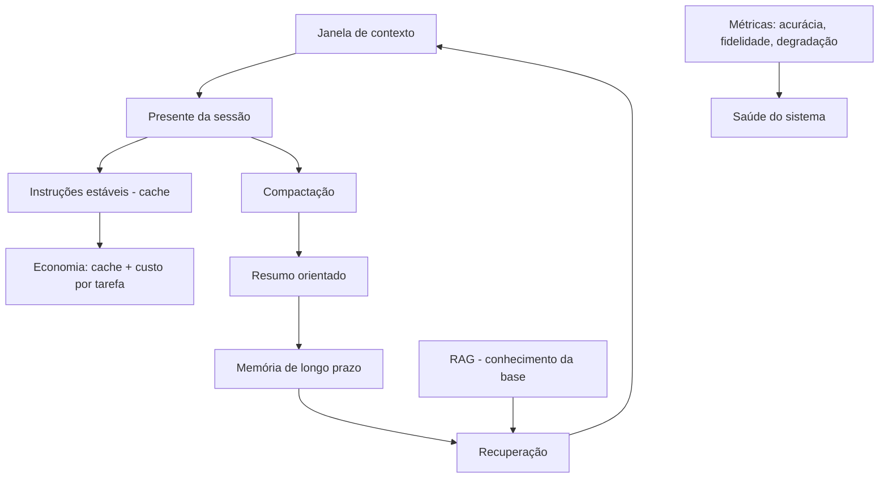

# Capítulo 10 — Memória, cache e o contexto em produção

## 1. Introdução

O Capítulo 6 apresentou a compactação como a fronteira entre o contexto e a memória [7]. Este capítulo atravessa a fronteira: a memória — o passado que persiste além da janela — e a economia de produção que torna a persistência viável [7][13]. Dois temas se entrelaçam [13][17]. O primeiro é a memória: de curto prazo (a sessão) e de longo prazo (o conhecimento persistente), e como o agente lembra o que importa [7]. O segundo é a economia: o cache de contexto, os mecanismos de retenção e as métricas que medem o valor do contexto curado [13][17]. Este capítulo fecha a Parte II com a síntese: o ambiente informacional completo, da janela à memória, com as métricas de sucesso de ~30% a ~90% [1][12].

## 2. Explica

### 2.1 A Memória de Curto Prazo: a Janela

A memória de curto prazo do agente é a janela de contexto [1][8]. Ela contém o presente da interação: a instrução, os dados da sessão, o histórico recente [1]. A memória de curto prazo é volátil por design: termina quando a sessão termina [1][8]. A gestão da memória de curto prazo é o framework deste livro — write, select, compress, isolate [1]. O Capítulo 2 mostrou seu orçamento; o Capítulo 6, sua compactação [8][7]. A memória de curto prazo é o palco; a memória de longo prazo é o arquivo [1][7].

### 2.2 A Memória de Longo Prazo: o Arquivo

A memória de longo prazo é o conhecimento persistente: o que o agente carrega entre sessões [7][15]. Ela inclui as preferências do usuário, os fatos aprendidos e o histórico de decisões [7]. A memória de longo prazo não vive na janela — vive em armazenamento externo, e entra na janela quando necessário [7]. A ponte entre as duas é o que o Capítulo 6 chamou de retenção seletiva: o que a compactação preserva é o que a memória de longo prazo recebe [7]. O LangChain documenta o gerenciamento de memória como parte da orquestração de agentes [15].

### 2.3 A Memória como Sistema de Contexto

A memória de longo prazo é, na prática, um sistema de contexto persistente [7][3]. Os fatos são armazenados de forma recuperável — e a recuperação (Capítulo 9) é o mecanismo que os traz de volta à janela [3][7]. A memória compartilha com o RAG a arquitetura: indexação, recuperação e composição [3][7]. A diferença é o objeto: o RAG recupera conhecimento geral da base; a memória recupera o histórico e as preferências do usuário [3][7]. Em sistemas maduros, os dois se combinam: a memória personaliza, o RAG informa [3][7].

### 2.4 O Cache de Contexto

O cache de contexto é a economia da repetição [13]. Em uma sessão, o prefixo do contexto — prompt de sistema, políticas, instruções estáveis — não muda entre chamadas [13]. O cache reutiliza o prefixo, cobrando apenas a porção nova [13]. A OpenAI documenta o prompt caching como estratégia central de otimização de custo [13]. O cache tem implicação de design: quanto mais estável o início do contexto, maior a economia [13]. A decisão de "o que vai no início estável" — o Write do Capítulo 5 — vira também decisão econômica [13][1].

### 2.5 Os Mecanismos de Retenção

Além do cache comercial, há mecanismos arquiteturais de retenção [17]. A pesquisa sobre Attention Sinks (Xiao et al., 2023) mostrou que modelos de streaming retêm eficientemente os tokens iniciais e os recentes — e propôs mecanismos para explorar esse comportamento [17]. A descoberta conecta com o lost in the middle (Capítulo 4): o modelo "lembra" melhor as bordas [5][17]. O design de contexto que respeita os mecanismos de retenção — bordas para o crítico — é mais econômico e mais preciso [5][17].

### 2.6 As Métricas de Sucesso do Contexto

A Parte II prometeu métricas — e este capítulo as entrega [1][12]. O survey de avaliação de RAG documenta as métricas de contexto: precisão da recuperação, relevância dos trechos, fidelidade da resposta [12]. Para agentes, a métrica central é a taxa de conclusão de tarefa [12]. A evidência de mercado citada no Capítulo 1 — ~30% com contexto bruto, ~90% com contexto curado — é a medida agregada da disciplina [1][12]. O engenheiro de contexto mede: custo por tarefa, acurácia, fidelidade e degradação ao longo da sessão [12][20].

### 2.7 O Custo por Tarefa Concluída

A métrica econômica central é o custo por tarefa concluída — não por chamada [13][1]. Uma tarefa que exige cinco chamadas com contexto curado pode custar menos que uma que exige três chamadas com contexto poluído e retrabalho [13][1]. O Capítulo 2 mostrou o custo por chamada; este capítulo eleva a métrica à tarefa [13][1]. A métrica reorienta o design: a curadoria que reduz o retrabalho paga o próprio custo [1][13].

### 2.8 A Degradação como Métrica de Saúde

A degradação ao longo da sessão é a métrica de saúde da memória de curto prazo [20][2]. O monitor do Capítulo 3 mede a taxa de acerto pela ocupação da janela [20][2]. O sistema saudável mantém a taxa; o sistema doente degrada [20]. A métrica de degradação conecta a Parte II ao Capítulo 8: quando a degradação cruza o limiar, é hora de diagnosticar — contexto, prompt ou outra camada [20][1]. A saúde do contexto é monitorada como a saúde do código: continuamente [20].

### 2.9 A Síntese do Ambiente Informacional

Este capítulo completa o desenho do ambiente informacional [1][7]. A janela é o palco (Capítulo 2) [8]. A degradação é o risco (Capítulos 3-4) [2][5]. O framework é o método (Capítulos 5-7) [1][6][7]. O diagnóstico é a manutenção (Capítulo 8) [1]. A recuperação é o abastecimento (Capítulo 9) [3]. A memória é a persistência (este capítulo) [7]. E a economia — cache, custo por tarefa — é a viabilidade [13]. O engenheiro de contexto projeta esse sistema completo [1].

### 2.10 A Promessa Cumprida: de 30% a 90%

A promessa da Parte II — o salto de ~30% a ~90% de acerto com contexto bem curado — é a soma de todas as disciplinas [1][12]. A seleção (Capítulo 5) reduz o ruído [1]. A compressão (Capítulo 6) mantém a sessão saudável [7]. O isolamento (Capítulo 7) protege os escopos [1]. O diagnóstico (Capítulo 8) corrige o desvio [1]. A recuperação (Capítulo 9) abastece [3]. A memória e a economia (este capítulo) sustentam [7][13]. O salto não vem de uma técnica — vem do sistema completo [1][12].

## 3. Ilustra

### 3.1 A Analogia do Arquivista

O arquivista é a analogia da memória [7]. A mesa é a janela (o presente); o arquivo é a memória de longo prazo [7]. O arquivista profissional não deixa tudo na mesa — arquiva o que passou, com etiquetas que permitem reencontrar [7]. O agente idem: o que passou é compactado e arquivado; o que importa é recuperável [7]. A diferença entre o agente e o arquivista desorganizado é a diferença entre a Parte I e a Parte II [7][1].

### 3.2 O Diagrama do Ambiente Informacional Completo

O diagrama abaixo sintetiza o ambiente informacional completo, unindo todas as peças do livro [1][3][7][13].



O diagrama mostra o ciclo completo: a janela, a compactação, a memória, a recuperação e as métricas [1][3][7][13].

### 3.3 O Antes e o Depois na Prática

**Antes**: o agente sem memória recomeça do zero a cada sessão, sem cache (caro) e sem métricas (cego) [7][13]. **Depois**: o agente arquiva o que importa, recupera na sessão seguinte, cacheia o estável e mede a saúde [7][13][20]. A mesma aplicação, com o ambiente informacional completo, custa menos e acerta mais [1][13].

## 4. Técnica

### 4.1 O Armazenador de Memória de Longo Prazo

O primeiro instrumento implementa a memória de longo prazo: armazenar fatos e recuperá-los por relevância [7][3]. O código abaixo é a versão didática [7]:

```python
class MemoriaLongoPrazo:
    """Armazena fatos da sessão e os recupera por palavras-chave."""

    def __init__(self):
        self.fatos = []  # lista de dicts {texto, tags}

    def lembrar(self, texto: str, tags: list) -> None:
        self.fatos.append({"texto": texto, "tags": tags})

    def recordar(self, consulta: str, k: int = 3) -> list:
        termos = set(consulta.lower().split())
        pontuados = []
        for fato in self.fatos:
            termos_fato = set(fato["texto"].lower().split()) | set(fato["tags"])
            pontos = len(termos & termos_fato)
            if pontos > 0:
                pontuados.append((pontos, fato["texto"]))
        pontuados.sort(key=lambda x: x[0], reverse=True)
        return [t for _, t in pontuados[:k]]


if __name__ == "__main__":
    m = MemoriaLongoPrazo()
    m.lembrar("O usuário prefere relatórios em formato JSON.", ["preferencia", "formato"])
    m.lembrar("O orçamento do projeto é R$ 2,4 milhões.", ["orçamento", "dado"])
    print(m.recordar("qual o orçamento?", k=2))
```

A memória materializa a persistência: os fatos sobrevivem à sessão e voltam por recuperação [7].

### 4.2 O Medidor de Custo por Tarefa

O segundo instrumento implementa a métrica econômica central: o custo por tarefa concluída [13][1]. O código abaixo agrega as chamadas de uma tarefa [13]:

```python
def custo_por_tarefa(chamadas: list, concluida: bool) -> dict:
    """Calcula o custo total e o custo por tarefa concluída."""
    custo_total = sum(c["custo"] for c in chamadas)
    retrabalho = sum(1 for c in chamadas if c.get("repetida"))
    return {
        "custo_total": round(custo_total, 4),
        "num_chamadas": len(chamadas),
        "retrabalho": retrabalho,
        "concluida": concluida,
        "custo_efetivo": round(custo_total, 4) if concluida else None,
        "nota": "Concluída sem retrabalho" if concluida and retrabalho == 0
                else "Com retrabalho ou incompleta",
    }


if __name__ == "__main__":
    tarefa_boa = [
        {"custo": 0.05}, {"custo": 0.03}, {"custo": 0.02},
    ]
    tarefa_poluida = [
        {"custo": 0.04, "repetida": True},
        {"custo": 0.04, "repetida": True},
        {"custo": 0.04, "repetida": True},
        {"custo": 0.06},
    ]
    print("Curada:", custo_por_tarefa(tarefa_boa, concluida=True))
    print("Poluída:", custo_por_tarefa(tarefa_poluida, concluida=True))
```

O medidor materializa a tese: a tarefa com contexto curado custa menos que a poluída com retrabalho [13][1].

### 4.3 O Simulador de Cache

O terceiro instrumento simula o benefício do cache de contexto [13]. O código abaixo compara o custo com e sem reutilização do prefixo estável [13]:

```python
def simular_cache(prefixo_tokens: int, chamadas: list, preco_token: float) -> dict:
    """Compara o custo de uma sessão com e sem cache do prefixo."""
    custo_sem_cache = 0
    custo_com_cache = 0
    for chamada in chamadas:
        tokens = chamada["tokens"]
        custo_sem_cache += (prefixo_tokens + tokens) * preco_token
        # Com cache: o prefixo é cobrado uma vez; as demais só pagam o novo.
        custo_com_cache += tokens * preco_token
    custo_com_cache += prefixo_tokens * preco_token  # primeira chamada
    economia = (custo_sem_cache - custo_com_cache) / custo_sem_cache
    return {
        "custo_sem_cache": round(custo_sem_cache, 4),
        "custo_com_cache": round(custo_com_cache, 4),
        "economia_pct": round(economia * 100, 1),
    }


if __name__ == "__main__":
    chamadas = [{"tokens": 500} for _ in range(10)]
    print(simular_cache(prefixo_tokens=2000, chamadas=chamadas,
                        preco_token=0.00001))
```

O simulador materializa a economia do cache: quanto mais estável o prefixo, maior a economia [13].

## 5. Aplica

### 5.1 Onde Isso Vive no Mundo Real

A memória e o cache estão em toda aplicação madura [7][13]. Assistentes que lembram preferências entre sessões [7]. Sistemas que cacheiam o prompt de sistema para cortar custo [13]. Agentes que arquivam decisões e as recuperam [7]. O LangChain documenta a memória como parte da orquestração [15]. Em cada caso, a persistência e a economia são o que sustentam o sistema no longo prazo [7][13].

### 5.2 O Erro Comum do Iniciante

O erro mais comum é não ter memória: cada sessão recomeça do zero, e o usuário repete contexto toda vez [7]. O segundo é ignorar o cache: o prefixo estável é pago integralmente a cada chamada — um imposto silencioso [13]. O terceiro é não medir: sem custo por tarefa e sem monitor de degradação, o sistema opera cego [20]. Os três erros têm o mesmo remédio: persistência, cache e métricas [7][13][20].

### 5.3 O Padrão Profissional em 2026

O padrão profissional integra todas as peças [1][7][13]. A memória de longo prazo é versionada e recuperável [7]. O cache é usado deliberadamente [13]. O custo por tarefa é medido [13]. A degradação é monitorada [20]. O diagnóstico é contínuo [1]. E as métricas — acurácia, fidelidade, custo, degradação — orientam cada decisão de contexto [12][20]. O resultado é o ambiente informacional completo: da janela à memória, com economia e saúde [1].

### 5.4 Exercício de Fixação

Desenhe a memória do seu agente: o que persiste, como é armazenado e como é recuperado [7]. Simule o benefício do cache para o seu prompt de sistema [13]. Implemente o medidor de custo por tarefa e o monitor de degradação [13][20]. Meça a saúde do seu sistema e proponha melhorias [20][1].

### 5.5 O Ciclo de Vida da Memória: Escrever, Recuperar, Esquecer

A memória de longo prazo tem um ciclo de vida — e o engenheiro o gerencia [7][1]. O primeiro estágio é o **escrever** (recordar): o que entra na memória — as decisões, os fatos, as preferências [7]. O critério de escrita é o mesmo da compactação: o que vale além da sessão [7][1]. O segundo estágio é o **recuperar**: o que volta à janela quando necessário [7]. A recuperação da memória usa o mesmo mecanismo do Capítulo 9 [3][7]. O terceiro estágio é o **esquecer** (decair): a memória que perde relevância é depreciada ou removida [7]. A memória sem esquecimento acumula lixo — a versão da memória do context rot [7][2].

O gerenciamento do ciclo de vida inclui a **atualização**: quando um fato muda, a memória é corrigida [7][1]. A memória desatualizada é um distrator em potencial (Capítulo 3) [2][7]. O registro da atualização mantém a trilha — quando o fato foi escrito, atualizado e por quê [1][7].

O ciclo de vida é a disciplina que impede a memória de virar depósito [7][1]. O engenheiro que escreve sem critério, recupera sem necessidade e nunca esquece constrói uma memória poluída — que degrada o sistema [7][2]. O que gerencia o ciclo constrói uma memória viva e confiável [7][1].

### 5.6 O Cache na Prática: Padrões de Uso

O cache de contexto tem padrões de uso que o engenheiro aplica deliberadamente [13][1]. O primeiro padrão é o **prefixo estável longo**: o prompt de sistema e as políticas formam um prefixo que se repete em todas as chamadas — o candidato ideal ao cache [13]. O design do Write (Capítulo 5) que coloca o estável no início maximiza o benefício do cache [1][13]. O segundo padrão é o **cache de sessão**: dentro de uma sessão, o contexto acumulado é cacheado entre chamadas [13].

O terceiro padrão é o **cache de recuperação**: os trechos recuperados por consultas repetidas (Capítulo 9) são cacheados [13][1]. O quarto é o **invalidação do cache**: quando o conteúdo muda — nova política, novo documento — o cache é invalidado [1][13]. O cache desatualizado é um risco: responde com conteúdo antigo [13][1].

O quinto padrão é a **medição do benefício**: o simulador da seção 4.3 roda na operação real, e o benefício do cache é reportado [13]. O engenheiro que mede o cache sabe o quanto economiza — e onde o cache não ajuda [13][1]. O cache é a ponte entre a qualidade do contexto e o custo da operação: bem usado, corta o custo sem cortar a qualidade [13][1].

### 5.7 A Governança do Contexto como Ativo

O contexto, a memória e o cache são ativos de produção — e ativos exigem governança [1][15]. O primeiro pilar da governança é a **propriedade**: cada bloco de contexto tem um dono responsável pela sua qualidade [1][15]. O prompt de sistema tem dono; a base de conhecimento tem dono; a memória do usuário tem dono [1][15]. O segundo pilar é o **versionamento**: o contexto é versionado como código — cada alteração registrada com motivo [1][15].

O terceiro pilar é a **auditoria**: revisões periódicas verificam que o contexto corresponde à intenção e que as políticas são respeitadas [1][12]. O quarto é a **segurança**: o contexto contém dados sensíveis — o acesso é controlado e a proteção é monitorada [1][21]. O Model Context Protocol documenta o contexto como integração que exige segurança [21].

O quinto pilar é a **medição contínua**: as métricas da seção 2.6 são monitoradas — acurácia, fidelidade, custo, degradação [1][12][20]. A governança do contexto transforma o ambiente informacional de prática de equipe em capacidade institucional [1][15]. A Parte III da série (harness) constrói a governança completa; este capítulo estabelece os princípios [1][15].

### 5.8 O Estudo de Caso do Sistema que Escalou

O estudo de caso fecha o capítulo e a Parte II [1][7][13]. O cenário: um assistente que começou pequeno — contexto simples, sem memória, sem cache [1]. O protótipo funcionava para poucos usuários [1]. O crescimento revelou os limites: o custo por chamada subiu, as sessões longas degradaram e os usuários repetiam contexto a cada sessão [2][13][7].

A equipe aplicou as disciplinas da Parte II [1][7][13]. O Write e o Select enxugaram o contexto [1]. A compressão manteve as sessões saudáveis [7]. O isolamento dividiu o trabalho complexo [1]. O RAG trouxe conhecimento sob demanda [3]. A memória eliminou a repetição de contexto [7]. O cache cortou o custo [13]. As métricas monitoraram a saúde [12][20].

O resultado: o mesmo serviço, com mais usuários, custo menor e qualidade estável [1][13]. O caso demonstra a tese da Parte II: o ambiente informacional bem projetado é o que permite o sistema crescer [1]. E prepara a Parte III: com o contexto dominado, o próximo passo é a camada de harness — a automação e a governança dos agentes [1][19].

### 5.9 A Memória e a Privacidade

A memória de longo prazo armazena dados do usuário — e isso a torna um ativo de privacidade [7][21]. O primeiro princípio é o **consentimento e transparência**: o usuário sabe o que é lembrado e pode controlar [7][21]. O segundo é o **minimização**: a memória armazena o mínimo necessário — nada além [7][21]. O terceiro é o **direito ao esquecimento**: o usuário pode apagar a memória — e o apagamento é efetivo [7][21].

O quarto princípio é o **isolamento da memória**: a memória de um usuário não vaza para outro (Capítulo 7, seção 5.8) [7][1][21]. O quinto é o **registro de acesso**: quem acessou qual memória, quando [1][21]. O Model Context Protocol documenta o contexto como integração que exige proteção de dados [21].

A memória com privacidade é a diferença entre um assistente confiável e um risco regulatório [7][21]. O engenheiro que desenha a memória sem privacidade constrói uma armadilha; o que a desenha com privacidade constrói confiança [7][21]. A governança da memória (seção 5.7) inclui a privacidade como requisito de primeira classe [7][21].

### 5.10 O Estudo de Caso do Assistente que Lembrava Demais

O estudo de caso mostra o ciclo de vida da memória em produção [7][1]. O cenário: um assistente pessoal que memorizava tudo — preferências, dados, conversas [7]. O sintoma: a memória cresceu sem controle; respostas começaram a citar informações desatualizadas do usuário [7][2]. A memória virou um depósito — a versão da memória do context rot [7][2].

O diagnóstico (Capítulo 8): a memória não tinha ciclo de vida — nada era atualizado ou esquecido [7][1]. O teste: a inspeção da memória revelou fatos antigos e contraditórios [7]. O tratamento: o ciclo de vida (seção 5.5) foi implementado — critérios de escrita, atualização, depreciação e apagamento [7].

O resultado: a memória ficou enxuta e confiável [7]. O caso demonstra o tema do capítulo: lembrar tudo é esquecer com precisão zero [7][2]. A memória gerida é a que serve — e a que serve é a que o ciclo de vida mantém viva [7][1].

### 5.11 A Lista de Verificação da Memória, Cache e Métricas

A lista de verificação consolida o capítulo e a Parte II [1][7][13]. O primeiro item: a memória de longo prazo tem ciclo de vida (escrever, recuperar, esquecer)? [7]. O segundo: a memória respeita a privacidade? [7][21]. O terceiro: o cache é usado para o prefixo estável? [13]. O quarto: o cache é invalidado quando o conteúdo muda? [1][13].

O quinto item: o custo por tarefa concluída é medido? [13][1]. O sexto: a degradação ao longo da sessão é monitorada? [20][2]. O sétimo: a acurácia e a fidelidade são avaliadas? [1][12]. O oitavo: o contexto é governado como ativo (dono, versão, auditoria)? [1][15].

A lista é o resumo operacional da Parte II inteira [1][7][13]. O engenheiro que a percorre fecha o ciclo completo: da janela à memória, da qualidade ao custo [1][7][13]. A Parte II cumpre a promessa — e o engenheiro que a domina está pronto para a camada de harness [1][19].

### 5.12 As Métricas em Diferentes Fases do Ciclo de Vida

As métricas do contexto não são usadas da mesma forma em todas as fases [1][12]. Na fase de **desenvolvimento**, as métricas orientam o design: a acurácia no conjunto de avaliação decide o template, a seleção e a composição [1][12]. Na fase de **teste**, as métricas validam: o sistema candidato é comparado com a linha de base — custo, acurácia, degradação [1][12]. Na fase de **produção**, as métricas monitoram: a degradação contínua é a saúde do sistema [20].

Na fase de **incidente**, as métricas diagnosticam: a queda de acurácia e o custo de retrabalho revelam a classe da falha (Capítulo 8) [1][2]. Na fase de **evolução**, as métricas decidem: a comparação entre políticas — mais contexto, mais recuperação, mais memória — orienta o investimento [1][13].

O ciclo de vida das métricas é o fechamento da disciplina [1][12]. O engenheiro que mede em todas as fases constrói um sistema que aprende [1][12]. O que mede apenas em produção descobre os problemas tarde [20]. A medição contínua é o que transforma a engenharia de contexto de projeto em operação [1][12].

### 5.13 O Estudo de Caso do Crescimento Sem Métricas

O estudo de caso mostra o custo da ausência de métricas [1][13]. O cenário: um assistente que cresceu em uso sem instrumentação [1]. O sintoma: o custo da operação subiu 60% sem que a equipe soubesse o motivo [13]. A equipe suspeitava do modelo — o modelo caro era o suspeito natural [1][13].

O diagnóstico: sem métricas, o suspeito foi escolhido pela intuição [1][13]. A instrumentação revelou a verdade: o contexto estava inflado — o prompt de sistema havia crescido, a memória acumulava e o cache não era usado [1][13][7]. O custo subiu porque cada chamada carregava mais tokens, não porque o modelo era caro [13].

O tratamento: o Write enxugou o prompt; o cache passou a cobrir o prefixo estável; a memória ganhou ciclo de vida [1][13][7]. O custo caiu 40% [13]. O caso demonstra o tema do capítulo: sem métricas, a equipe trata o sintoma errado [1][13]. Com métricas, o custo vira um problema de contexto — resolvível [13][1].

### 5.14 A Síntese Final da Parte II

A Parte II se encerra com a síntese do que foi construído [1][7][13]. O ambiente informacional é o objeto [1]. A janela é o palco [8]. A degradação — context rot e lost in the middle — é o risco [2][5]. O framework write/select/compress/isolate é o método [1][6][7]. O diagnóstico é a manutenção [1]. O RAG é o abastecimento [3]. A memória é a persistência [7]. A economia é a viabilidade [13].

O engenheiro de contexto projeta o ambiente inteiro — não apenas a mensagem [1]. A promessa da Parte II — de ~30% a ~90% de acerto — é a soma das disciplinas [1][12]. E a transição para a Parte III é natural: com o ambiente informacional dominado, o próximo passo é o harness — a camada que automatiza, governa e verifica o agente inteiro [1][19].

O leitor que chega ao fim desta Parte II projeta o ambiente informacional de um agente — o salto que o título do livro prometeu [1][19].

### 5.15 A Relação entre Contexto e Harness

A Parte III da série constrói a camada de harness — e a Parte II, este livro, é a sua fundação [1][19]. O harness é a camada que automatiza, governa e verifica o agente inteiro [1][19]. O contexto é o material que o harness gerencia [1]. A primeira relação é a **instrumentação**: o harness consome as métricas do Capítulo 10 — acurácia, custo, degradação — para decidir [1][12][20]. A segunda é a **verificação**: o harness aplica, em escala, o diagnóstico do Capítulo 8 [1].

A terceira é a **governança**: o harness executa, em produção, a governança do Capítulo 10 — propriedade, versão, auditoria [1][15]. A quarta é a **automação da curadoria**: o harness automatiza o write/select/compress/isolate — a curadoria manual vira política configurável [1][6][7].

O engenheiro que domina a Parte II entrega ao harness um sistema saudável para governar [1]. O que pula a Parte II entrega ao harness um sistema doente — e o harness automatiza a doença [1][2]. A ordem da série é deliberada: primeiro o contexto, depois o harness [1][19].

### 5.16 O Estudo de Caso da Escala

O estudo de caso final mostra a Parte II em escala [1][7][13]. O cenário: um serviço que passou de centenas para dezenas de milhares de chamadas diárias [1][13]. O sintoma: o custo disparou e a qualidade caiu [2][13]. O protótipo — contexto simples, sem memória, sem métricas — não escalava [1][2].

O tratamento: a aplicação completa da Parte II [1][7][13]. O Write e o Select enxugaram o contexto [1][6]. A compressão manteve as sessões saudáveis [7]. O isolamento dividiu o trabalho [1]. O RAG trouxe conhecimento sob demanda [3]. A memória eliminou a repetição [7]. O cache cortou o custo [13]. As métricas monitoraram a saúde [12][20].

O resultado: o serviço escalou com custo controlado e qualidade estável [1][13]. O caso é a demonstração da tese da Parte II: o ambiente informacional bem projetado é o que permite o crescimento [1]. E é a transição para a Parte III: o harness governa o sistema que a Parte II construiu [1][19].

### 5.17 A Mensagem Final da Parte II

A Parte II se encerra com a mensagem que o título carrega [1][19]. O fim do prompt solto é o início da engenharia de contexto [1][19]. O engenheiro que projeta o ambiente informacional — a janela, a degradação, o framework, o diagnóstico, a recuperação, a memória e a economia — opera acima da média do mercado de 2026 [1][19].

A disciplina é a soma das Partes: a Parte I ensinou a mensagem; a Parte II ensinou o ambiente; a Parte III ensinará o sistema autônomo [1][19]. O leitor que conclui a Parte II está pronto para a subida [1][19]. A pilha continua a se empilhar [1][19].

### 5.18 O Custo da Memória e do Cache

A memória e o cache têm custos próprios que o engenheiro dimensiona [7][13]. A memória custa no armazenamento e na recuperação: cada fato persistido ocupa espaço, e cada recuperação consome tokens [7][13]. O cache custa na invalidação: quando o conteúdo muda, o cache antigo é descartado — e o custo do descarte é real [13][1]. O equilíbrio é o tema do capítulo: memória útil, cache eficiente [7][13].

O primeiro princípio do custo é a **seletividade da memória**: persistir apenas o que tem valor de longo prazo — o critério do ciclo de vida (seção 5.5) [7][1]. O segundo é a **medição do cache**: o benefício do cache é medido — a economia por sessão, por tarefa [13]. O terceiro é a **auditoria de custo total**: o custo da memória mais o cache mais o contexto — o custo do ambiente completo por tarefa concluída [1][13].

O engenheiro que mede o custo total do ambiente evita duas falhas opostas [1][13]: a economia falsa (sem memória, o usuário repete contexto — custo escondido) e o luxo inútil (memória e cache além do necessário) [1][13]. O custo do ambiente é a métrica final da Parte II [1][13].

### 5.19 O Fechamento do Capítulo

O capítulo final da Parte II se encerra com a consolidação completa [1][7][13]. A memória persiste; o cache economiza; as métricas medem; a governança administra; a privacidade protege [7][13][15][21]. O ambiente informacional está completo [1].

O engenheiro que domina o capítulo — e a Parte II inteira — projeta o ambiente informacional de um agente, não apenas a mensagem [1][19]. A promessa de ~30% a ~90% é a soma das disciplinas [1][12]. E a Parte III aguarda: a camada de harness, onde o contexto se torna parte de sistemas autônomos governados [1][19].

### 5.20 O Contexto em Produção e o Método de Revisão Autônoma

A Parte II encerra com a conexão que a série prometeu: o contexto é a matéria-prima da revisão autônoma [1][19]. O método de revisão autônoma entre harness — anunciado no projeto editorial — depende do ambiente informacional completo [1][19]. A revisão precisa de três coisas que a Parte II construiu [1]: o histórico preservado (compressão, Capítulo 6), as evidências recuperáveis (RAG, Capítulo 9) e as métricas de julgamento (este capítulo) [1][7][3][12].

A primeira implicação é a **revisão sobre o resumo**: o harness revisor consome o resumo orientado que a compactação produziu [1][7]. A segunda é a **revisão com evidências**: o revisor recupera as fontes pelo RAG — e julga com base nelas [1][3]. A terceira é a **revisão com métricas**: o revisor usa as métricas deste capítulo — acurácia, fidelidade, custo — como critérios objetivos [1][12].

O engenheiro que domina a Parte II entrega ao harness o sistema governável [1][19]. A Parte III construirá o harness; este capítulo fecha a fundação [1][19]. A pilha continua a se empilhar — do prompt ao contexto, do contexto ao harness [1][19].

### 5.21 O Fechamento do Capítulo e da Parte II

A Parte II se encerra com a consolidação completa do ambiente informacional [1][7][13]. A janela é o palco [8]. A degradação é o risco [2][5]. O framework é o método [1][6][7]. O diagnóstico é a manutenção [1]. O RAG é o abastecimento [3]. A memória é a persistência [7]. A economia é a viabilidade [13]. A privacidade é a responsabilidade [7][21].

O engenheiro que domina a Parte II projeta o ambiente informacional de um agente — não apenas a mensagem [1][19]. O salto de ~30% a ~90% é a soma das disciplinas [1][12]. O leitor que conclui esta Parte II está pronto para a camada de harness: a autonomia, a execução e a governança dos sistemas de IA em produção [1][19]. A jornada da série continua [1][19].

### 5.22 O Panorama: o Engenheiro de Contexto em 2026

O capítulo final fecha com o panorama profissional [1][19]. O engenheiro de contexto de 2026 é o profissional que a indústria mais valoriza e mais carece [1][19]. O mercado trata a prompt engineering como o teto da disciplina — e o engenheiro de contexto opera acima do teto [1][19]. As competências do panorama são as deste livro [1]: projetar o ambiente informacional (Parte II), medir a degradação (Capítulos 3-4), aplicar o framework (Capítulos 5-7), diagnosticar (Capítulo 8), recuperar conhecimento (Capítulo 9) e gerir memória e economia (Capítulo 10) [1].

A primeira característica do profissional é a **medição**: ele mede acurácia, custo, degradação e fidelidade — e decide com dados [1][12]. A segunda é a **arquitetura**: ele pensa em sistemas — janela, fontes, subagentes — não em mensagens [1]. A terceira é a **curadoria**: ele seleciona, comprime e isola com intenção [1][6][7]. A quarta é o **diagnóstico**: ele classifica a falha antes de tratá-la [1][2]. A quinta é a **governança**: ele trata o contexto como ativo com dono, versão e auditoria [1][15].

O panorama é a síntese do livro inteiro: a engenharia de contexto não é uma técnica — é um perfil profissional [1][19]. O leitor que dominou a Parte II tem o perfil [1][19]. A Parte III — a camada de harness — completará o perfil: a autonomia, a execução e a governança [1][19]. A jornada da série continua — e a pilha continua a se empilhar [1][19].

## 6. Conclusão

Este capítulo fecha a Parte II com a síntese do ambiente informacional [1][7]. A memória de longo prazo persiste o que importa; a recuperação traz o conhecimento de volta; o cache e as métricas tornam tudo viável [7][13][12]. O salto de ~30% a ~90% de acerto — a promessa da Parte II — é a soma de todas as disciplinas: seleção, compressão, isolamento, diagnóstico, recuperação, memória e economia [1][12]. O engenheiro de contexto projeta esse sistema completo, medido e saudável [1][20]. A Parte III da série sobe a pilha: a camada de harness, onde o contexto e o prompt se tornam parte de sistemas autônomos governados [19][1].

## 7. Referências

[1] ANTHROPIC. Effective context engineering for AI agents. Anthropic Engineering Blog, set. 2025. Disponível em: https://www.anthropic.com/engineering/effective-context-engineering-for-ai-agents. Acesso em: 5 ago. 2026.
[2] HONG, Kelly; TROYNIKOV, Anton; HUBER, Jeff. Context Rot: How Increasing Input Tokens Impacts LLM Performance. Chroma Technical Report, jul. 2025. Disponível em: https://www.trychroma.com/research/context-rot. Acesso em: 5 ago. 2026.
[3] LEWIS, Patrick et al. Retrieval-Augmented Generation for Knowledge-Intensive NLP Tasks. In: Advances in Neural Information Processing Systems (NeurIPS), v. 33, p. 9459–9474, 2020. Disponível em: https://arxiv.org/abs/2005.11401. Acesso em: 5 ago. 2026.
[4] GAO, Yunfan et al. Retrieval-Augmented Generation for Large Language Models: A Survey. arXiv:2312.10997, mar. 2024. Disponível em: https://arxiv.org/abs/2312.10997. Acesso em: 5 ago. 2026.
[5] LIU, Nelson F. et al. Lost in the Middle: How Language Models Use Long Contexts. Transactions of the Association for Computational Linguistics (TACL), v. 12, p. 157–173, 2024. Disponível em: https://arxiv.org/abs/2307.03172. Acesso em: 5 ago. 2026.
[6] ANTHROPIC. Writing tools for AI agents — using AI agents. Anthropic Engineering Blog, set. 2025. Disponível em: https://www.anthropic.com/engineering/writing-tools-for-agents. Acesso em: 5 ago. 2026.
[7] ANTHROPIC. Context engineering: memory, compaction, and tool clearing. Claude Platform Cookbook, mar. 2026. Disponível em: https://platform.claude.com/cookbook/tool-use-context-engineering-context-engineering-tools. Acesso em: 5 ago. 2026.
[8] ZHAO, Wayne Xin et al. A Survey of Large Language Models. arXiv:2303.18223, 2023. Disponível em: https://arxiv.org/abs/2303.18223. Acesso em: 5 ago. 2026.
[9] CHROMA. Context Rot: Evaluation Toolkit. GitHub Repository, 2025. Disponível em: https://github.com/chroma-core/context-rot. Acesso em: 5 ago. 2026.
[10] LIU, Nelson F. Lost in the Middle: Replication Repository. GitHub Repository, 2023. Disponível em: https://github.com/nelson-liu/lost-in-the-middle. Acesso em: 5 ago. 2026.
[11] CHEN, Jiawei et al. LongRAG: Enhancing Retrieval-Augmented Generation with Long-context LLMs. arXiv:2406.15319, 2024. Disponível em: https://arxiv.org/abs/2406.15319. Acesso em: 5 ago. 2026.
[12] ASIA, Research Group et al. Retrieval-Augmented Generation Evaluation in the Era of Large Language Models: A Comprehensive Survey. ResearchGate / arXiv, abr. 2025. Disponível em: https://www.researchgate.net/publication/390991356. Acesso em: 5 ago. 2026.
[13] OPENAI. GPT-4 Technical Report & Developer Guides on Context Management. OpenAI Documentation, 2024–2025. Disponível em: https://openai.com/index/gpt-4-research/. Acesso em: 5 ago. 2026.
[14] GOOGLE CLOUD. What is Retrieval-Augmented Generation (RAG)?. Google Cloud Architecture Center, 2025. Disponível em: https://cloud.google.com/use-cases/retrieval-augmented-generation. Acesso em: 5 ago. 2026.
[15] LANGCHAIN. LangChain Agents & Context Management Documentation. LangChain Guides, 2025–2026. Disponível em: https://python.langchain.com/docs/concepts/agents/. Acesso em: 5 ago. 2026.
[16] WANG, Zhen et al. Agentic Retrieval-Augmented Generation: A Survey on Agentic RAG. arXiv:2408.12999, 2024. Disponível em: https://arxiv.org/abs/2408.12999. Acesso em: 5 ago. 2026.
[17] XIAO, Guangxuan et al. Efficient Streaming Language Models with Attention Sinks. arXiv:2309.17453, 2023. Disponível em: https://arxiv.org/abs/2309.17453. Acesso em: 5 ago. 2026.
[18] RODIN, Alex et al. Found in the Middle: Overcoming Long-Context Vulnerabilities in LLMs. arXiv:2403.04797, 2024. Disponível em: https://arxiv.org/abs/2403.04797. Acesso em: 5 ago. 2026.
[19] MEDIUM (Data Science Collective). Context Is the New Prompt: Why Context Engineering Is Shaping the Future of AI. Medium Article, 2025. Disponível em: https://medium.com/data-science-collective/context-is-the-new-prompt-why-context-engineering-is-shaping-the-future-of-ai-46eb062ed270. Acesso em: 5 ago. 2026.
[20] ZENML. Context Rot: Evaluating LLM Performance Degradation with Increasing Input Tokens. MLOps Database, 2025. Disponível em: https://www.zenml.io/llmops-database/context-rot-evaluating-llm-performance-degradation-with-increasing-input-tokens. Acesso em: 5 ago. 2026.
[21] MODEL CONTEXT PROTOCOL (MCP). Open Standard for AI Agent Context Integration. Anthropic & Ecosystem Specs, 2025–2026. Disponível em: https://modelcontextprotocol.io/. Acesso em: 5 ago. 2026.
