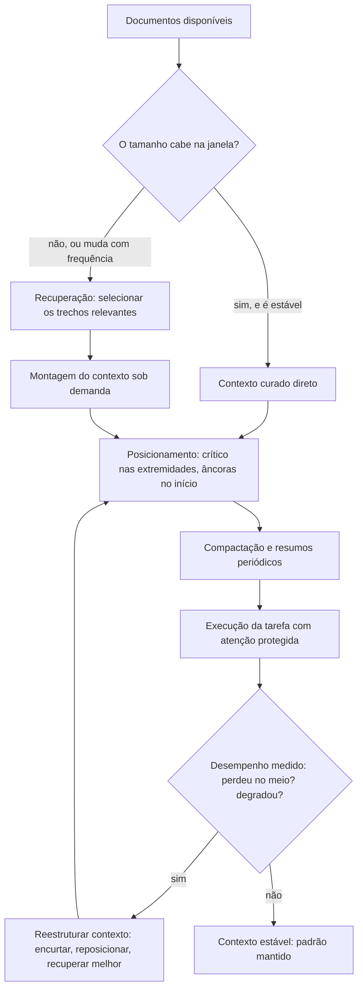

# Capítulo 11: Janelas longas na prática: quando 200 mil tokens ajudam e quando atrapalham

## 1. Introdução

No capítulo anterior, você viu a curadoria do contexto como o coração da disciplina — e a métrica de sucesso que a indústria mede: de 30% a 90% de acerto apenas com contexto bem curado [8]. Este capítulo mergulha na ferramenta que tornou essa mudança possível: as janelas longas. Quando o modelo aceita 200 mil tokens ou mais, a tentação é jogar tudo para dentro — e é exatamente aí que mora o perigo [1].

Este capítulo tem três objetivos. Primeiro, entender o que uma janela longa realmente faz e onde ela falha [1][2]. Segundo, dominar as técnicas de mitigação: seleção, compactação e o desenho da hierarquia de atenção [9]. Terceiro, decidir quando a janela longa resolve o problema e quando o RAG — ou uma arquitetura híbrida — é a resposta certa [15].

## 2. Explica

### 2.1 O que uma janela longa faz de verdade

Janelas longas permitem que o modelo processe documentos inteiros de uma vez — manuais, repositórios, históricos de conversa [10]. O benefício é real: menos fatiamento, menos contexto perdido entre chamadas [10]. Mas a janela não é memória infinita: é uma superfície de atenção com competição [2]. A pesquisa mostra que os modelos degradam em tarefas que exigem informação no meio do contexto — o fenômeno do lost in the middle [2].

### 2.2 Context rot: o custo do excesso

O context rot é a queda de desempenho medida conforme o contexto cresce: mais tokens, mais degradação, mesmo sem limite técnico aparente [1]. Os estudos documentam a curva em tarefas de recuperação e raciocínio: o ponto ótimo existe, e ele é menor do que a janela [1]. A versão replicável do experimento — com datasets e avaliação — permite que cada equipe meça o ponto ótimo do seu próprio caso [5][6].

### 2.3 Lost in the middle e a hierarquia de atenção

O lost in the middle mostra que a posição importa: o modelo lembra melhor do começo e do fim do contexto, e pior do meio [2]. O estudo original — e sua réplica — confirmam o padrão em múltiplos modelos [2][7]. A resposta de engenharia: posicionar a informação crítica nas extremidades ou reestruturar o contexto para que o meio não carregue o que importa [2].

### 2.4 Atenção aos primeiros tokens: os attention sinks

Há um detalhe técnico que muda o desenho do contexto: os modelos concentram atenção desproporcional nos primeiros tokens — os chamados attention sinks [4]. Isso explica por que instruções críticas no início do contexto têm efeito desproporcional — e por que o design de contexto deve respeitar essa assimetria [4]. A descoberta orienta técnicas de streaming e compactação: manter os tokens-âncora mesmo quando o resto é resumido [4].

### 2.5 Compactação e memória: o meio-termo

Entre jogar tudo fora e jogar tudo dentro, existe a compactação: resumos periódicos, hierarquia de documentos e o descarte deliberado do que envelheceu [9]. A documentação prática da plataforma descreve os três modos — memória, compactação e limpeza de ferramentas — como alavancas complementares da mesma superfície [9]. A regra: o contexto é um orçamento, e a compactação é o controle de gastos [8].

### 2.6 A ponte para o RAG: quando a janela não basta

Quando o conhecimento é grande demais — ou muda com frequência — a janela longa sozinha não resolve [13]. O RAG recupera só o que é relevante e monta o contexto sob demanda [13]. A pesquisa evoluiu em três gerações: o RAG original com recuperação densa, o LongRAG que combina janela longa com recuperação e o RAG agêntico que decide quando recuperar [14][15]. A arquitetura híbrida vence: janela longa para o que é estável e pequeno, RAG para o que é grande e vivo [10].

## 3. Ilustra

### 3.1 A analogia da biblioteca e do fichário

Pense em um pesquisador numa biblioteca gigante. A janela longa é a mesa de estudos: dá para abrir muitos livros ao mesmo tempo — mas a mesa tem limite, e abrir livros demais faz o pesquisador esquecer o que leu nas primeiras páginas [2]. O bibliotecário (o RAG) traz apenas os capítulos relevantes para a mesa, na hora certa [13]. O pesquisador maduro não tenta carregar a biblioteca inteira para a mesa — ele sabe pedir o livro certo [1].



### 3.2 A mesa de estudos que se organiza sozinha

O ciclo mostra a disciplina em ação: medir o efeito, reestruturar e medir de novo [6]. Janela longa, posicionamento e RAG não são rivais — são ferramentas do mesmo arquiteto de contexto [10].

## 4. Técnica

### 4.1 Medindo o context rot no seu caso

O exemplo abaixo reproduz, de forma mínima, o experimento de context rot: a mesma pergunta com quantidades crescentes de contexto [1][6]:

```python
def medir_context_rot(modelo, pergunta, documentos, tamanhos):
    resultados = []
    for n in tamanhos:
        contexto = documentos[:n]
        respostas = [invocar_modelo(modelo, contexto, pergunta) for _ in range(5)]
        acertos = sum(1 for r in respostas if r == "correto")
        resultados.append((n, acertos / len(respostas)))
    return resultados


print(medir_context_rot("gpt-4o", "Qual é o limite?", docs, [500, 2000, 8000, 32000]))
```

A curva resultante mostra o ponto ótimo do seu caso — e ele quase nunca é o tamanho máximo da janela [1].

### 4.2 Posicionamento estratégico do contexto

O trecho abaixo organiza o contexto respeitando a assimetria de atenção: instruções e fatos críticos no início, detalhes no fim, e o meio reservado ao que menos importa [2][4]:

```python
def montar_contexto(instrucao, fatos_criticos, material_meio, conclusao):
    return "\n\n".join(
        [
            instrucao,
            "FATOS CRITICOS (devem orientar a resposta):",
            fatos_criticos,
            "MATERIAL DE APOIO:",
            material_meio,
            "OBSERVACAO FINAL:",
            conclusao,
        ]
    )
```

A estrutura não muda o conteúdo — muda a posição — e a posição decide o que o modelo usa [2].

### 4.3 Compactação periódica de histórico

Para fechar, um compactador simples que resume blocos antigos e mantém as âncoras [9]:

```python
def compactar_historico(historico, ultimos_manter=6, janela=8):
    if len(historico) <= janela:
        return historico
    recentes = historico[-ultimos_manter:]
    antigos = historico[:-ultimos_manter]
    resumo = invocar_modelo(
        "Resuma as decisões e fatos essenciais desta conversa:",
        contexto="\n".join(antigos),
    )
    return [f"[resumo anterior] {resumo}", *recentes]
```

A compactação troca fidelidade de detalhe por estabilidade de atenção — a troca certa quando o detalhe envelheceu [9].

## 5. Aplica

### 5.1 Onde isso vive no mundo real

Na prática, a disciplina de janela longa aparece em sistemas de agentes com histórico extenso, manuais grandes e repositórios inteiros [8]. As plataformas documentaram o caminho: janela longa para o caso simples, RAG para o conhecimento vivo, e a combinação para o caso real [10][12]. O benchmark da indústria já mede a degradação por posição — e os modelos seguem melhorando, mas a assimetria permanece [2][3].

### 5.2 O erro comum do iniciante

O erro clássico é usar a janela longa como desculpa para não curar contexto: "o modelo aceita 200 mil tokens, então manda tudo" [1]. O segundo erro é ignorar a posição: colocar o fato crítico no meio e se surpreender quando o modelo o esquece [2]. O caminho profissional é o ciclo deste capítulo: medir, posicionar, compactar e recuperar — sempre com a métrica na mão [6].

## 6. Conclusão

A janela longa é uma ferramenta poderosa e uma armadilha confortável [1]. Você aprendeu a medir o context rot, a respeitar a hierarquia de atenção, a compactar o que envelhece e a acionar o RAG quando o conhecimento é grande demais [1][2][9][15]. No próximo capítulo, você vai transformar essa teoria em diagnóstico: isolando, na prática, se a falha é do prompt, do contexto ou da recuperação [8].


## 7. Referências

[1] HONG, Kelly; TROYNIKOV, Anton; HUBER, Jeff. Context Rot: How Increasing Input Tokens Impacts LLM Performance. Chroma Technical Report, jul. 2025. Disponível em: https://www.trychroma.com/research/context-rot. Acesso em: 5 ago. 2026.
[2] LIU, Nelson F. et al. Lost in the Middle: How Language Models Use Long Contexts. Transactions of the Association for Computational Linguistics (TACL), v. 12, p. 157–173, 2024. Disponível em: https://arxiv.org/abs/2307.03172. Acesso em: 5 ago. 2026.
[3] RODIN, Alex et al. Found in the Middle: Overcoming Long-Context Vulnerabilities in LLMs. arXiv:2403.04797, 2024. Disponível em: https://arxiv.org/abs/2403.04797. Acesso em: 5 ago. 2026.
[4] XIAO, Guangxuan et al. Efficient Streaming Language Models with Attention Sinks. arXiv:2309.17453, 2023. Disponível em: https://arxiv.org/abs/2309.17453. Acesso em: 5 ago. 2026.
[5] CHROMA. Context Rot: Evaluation Toolkit. GitHub Repository, 2025. Disponível em: https://github.com/chroma-core/context-rot. Acesso em: 5 ago. 2026.
[6] ZENML. Context Rot: Evaluating LLM Performance Degradation with Increasing Input Tokens. MLOps Database, 2025. Disponível em: https://www.zenml.io/llmops-database/context-rot-evaluating-llm-performance-degradation-with-increasing-input-tokens. Acesso em: 5 ago. 2026.
[7] LIU, Nelson F. Lost in the Middle: Replication Repository. GitHub Repository, 2023. Disponível em: https://github.com/nelson-liu/lost-in-the-middle. Acesso em: 5 ago. 2026.
[8] ANTHROPIC. Effective context engineering for AI agents. Anthropic Engineering Blog, set. 2025. Disponível em: https://www.anthropic.com/engineering/effective-context-engineering-for-ai-agents. Acesso em: 5 ago. 2026.
[9] ANTHROPIC. Context engineering: memory, compaction, and tool clearing. Claude Platform Cookbook, mar. 2026. Disponível em: https://platform.claude.com/cookbook/tool-use-context-engineering-context-engineering-tools. Acesso em: 5 ago. 2026.
[10] MEDIUM (Data Science Collective). Context Is the New Prompt: Why Context Engineering Is Shaping the Future of AI. Medium Article, 2025. Disponível em: https://medium.com/data-science-collective/context-is-the-new-prompt-why-context-engineering-is-shaping-the-future-of-ai-46eb062ed270. Acesso em: 5 ago. 2026.
[11] OPENAI. GPT-4 Technical Report & Developer Guides on Context Management. OpenAI Documentation, 2024–2025. Disponível em: https://openai.com/index/gpt-4-research/. Acesso em: 5 ago. 2026.
[12] ZHAO, Wayne Xin et al. A Survey of Large Language Models. arXiv:2303.18223, 2023. Disponível em: https://arxiv.org/abs/2303.18223. Acesso em: 5 ago. 2026.
[13] CHEN, Jiawei et al. LongRAG: Enhancing Retrieval-Augmented Generation with Long-context LLMs. arXiv:2406.15319, 2024. Disponível em: https://arxiv.org/abs/2406.15319. Acesso em: 5 ago. 2026.
[14] GOOGLE CLOUD. What is Retrieval-Augmented Generation (RAG)?. Google Cloud Architecture Center, 2025. Disponível em: https://cloud.google.com/use-cases/retrieval-augmented-generation. Acesso em: 5 ago. 2026.
[15] LEWIS, Patrick et al. Retrieval-Augmented Generation for Knowledge-Intensive NLP Tasks. In: Advances in Neural Information Processing Systems (NeurIPS), v. 33, p. 9459–9474, 2020. Disponível em: https://arxiv.org/abs/2005.11401. Acesso em: 5 ago. 2026.
[16] GAO, Yunfan et al. Retrieval-Augmented Generation for Large Language Models: A Survey. arXiv:2312.10997, mar. 2024. Disponível em: https://arxiv.org/abs/2312.10997. Acesso em: 5 ago. 2026.
[17] WANG, Zhen et al. Agentic Retrieval-Augmented Generation: A Survey on Agentic RAG. arXiv:2408.12999, 2024. Disponível em: https://arxiv.org/abs/2408.12999. Acesso em: 5 ago. 2026.
[18] ANTHROPIC. Writing tools for AI agents — using AI agents. Anthropic Engineering Blog, set. 2025. Disponível em: https://www.anthropic.com/engineering/writing-tools-for-agents. Acesso em: 5 ago. 2026.
[19] ASIA, Research Group et al. Retrieval-Augmented Generation Evaluation in the Era of Large Language Models: A Comprehensive Survey. ResearchGate / arXiv, abr. 2025. Disponível em: https://www.researchgate.net/publication/390991356. Acesso em: 5 ago. 2026.
[20] LANGCHAIN. LangChain Agents & Context Management Documentation. LangChain Guides, 2025–2026. Disponível em: https://python.langchain.com/docs/concepts/agents/. Acesso em: 5 ago. 2026.
