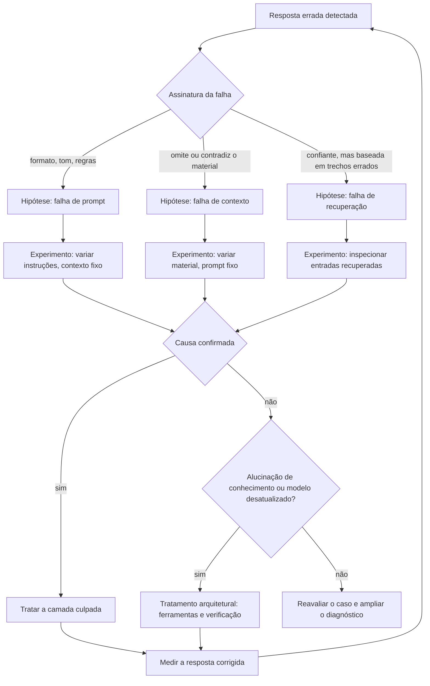

# Capítulo 12: Diagnóstico por camadas: isolando a falha entre prompt, contexto e recuperação

## 1. Introdução

No capítulo anterior, você aprendeu a explorar janelas longas sem cair no excesso [2]. Este capítulo fecha a parte prática da engenharia de contexto: o diagnóstico. Quando um sistema de IA falha, a primeira pergunta não é "qual o erro" — é "em qual camada está o erro": prompt, contexto ou recuperação [1]. Responder essa pergunta com método, em vez de chute, é o que separa o arquiteto de contexto do operador de chat [8].

Este capítulo tem três objetivos. Primeiro, construir o mapa de camadas e os sinais de falha de cada uma [1]. Segundo, dominar os experimentos de isolamento: variar uma camada por vez e medir [3]. Terceiro, conectar o diagnóstico ao desenho — porque a maioria das falhas de contexto é tratada com melhor contexto, e não com melhor prompt [1].

## 2. Explica

### 2.1 O mapa de camadas de um sistema de IA

Todo sistema de IA conversacional tem pelo menos três camadas que podem falhar: o prompt (instruções e formato), o contexto (o material que alimenta o modelo) e a recuperação (o mecanismo que busca esse material) [1]. A falha final é sempre uma resposta errada — mas a causa mora em uma das camadas [1]. O primeiro passo do diagnóstico é nomear a camada: a resposta é mal formatada (prompt), contradiz o material fornecido (contexto) ou cita algo que não estava lá (recuperação) [1].

### 2.2 O sinal de cada camada

Cada camada tem uma assinatura de falha. Falha de prompt: formato errado, tom errado, regras ignoradas — mas o conteúdo citado está correto [8]. Falha de contexto: o modelo omite ou contradiz informação que está no material — o sinal clássico de excesso ou má posição [2]. Falha de recuperação: a resposta parece confiante, mas se apoia em trechos irrelevantes ou incompletos — o modelo não tinha o que precisava [13]. Reconhecer a assinatura corta o tempo de diagnóstico pela metade [1].

### 2.3 O experimento de isolamento: uma variável por vez

A técnica central do diagnóstico é o experimento controlado: mudar uma camada, manter as outras, medir [1]. Para testar o prompt, mantenha o contexto fixo e varie as instruções [8]. Para testar o contexto, mantenha o prompt fixo e varie o material [3]. Para testar a recuperação, inspecione o que foi recuperado: as entradas do RAG antes da resposta [13]. O resultado de cada variação aponta a camada culpada [1].

### 2.4 A réplica de "lost in the middle" como ferramenta de equipe

A pesquisa de lost in the middle deixou um legado prático: um experimento replicável que qualquer equipe pode rodar no próprio modelo [7]. A versão publicada — e sua avaliação replicável — mostra como medir a degradação por posição com um conjunto mínimo de casos [5][7]. Rodar esse experimento no seu domínio responde a pergunta que o chute não responde: seu modelo piora no meio do contexto? [2].

### 2.5 Da recuperação ao contexto: o elo mais frágil

A recuperação é onde o contexto nasce — e onde a maioria dos defeitos de contexto começa [13]. Um retriever que devolve trechos errados produz um contexto "correto" que induz a resposta errada [13]. A prática de avaliação de RAG separa as duas falhas: a do retriever (recuperou o certo?) e a do gerador (usou o que recuperou?) [17]. Esse vocabulário de avaliação é a ponte para o Livro 10, onde evals automatizadas assumem o trabalho [17].

### 2.6 Quando o problema não é nenhuma das três

Há falhas que o diagnóstico de camadas não resolve porque não são de contexto: a alucinação de conhecimento — o modelo inventa o que nenhuma camada forneceu [10]. A mitigação é arquitetural: ferramentas, verificação e restrição de escopo [1]. E há o caso do modelo desatualizado: o conhecimento correto não existe em lugar nenhum do sistema [10]. Nomear esses casos é parte do diagnóstico: nem toda resposta errada é um problema de contexto [1].

## 3. Ilustra

### 3.1 A analogia do médico e o diagnóstico diferencial

Pense no médico que recebe um paciente com febre. Ele não receita antibiótico imediatamente: levanta hipóteses — infecção, inflamação, reação — e pede exames que separam uma da outra [8]. O diagnóstico diferencial funciona assim: cada exame (experimento) elimina hipóteses até sobrar a causa. O engenheiro de contexto é esse médico: a resposta errada é a febre, e o exame é a variação controlada de uma camada por vez [1].



### 3.2 O médico que documenta o caso

A disciplina final: cada diagnóstico vira um caso no golden set — o paciente curado vira aula [8]. É assim que o sistema melhora com o tempo, e é exatamente o ciclo que o Livro 10 automatizará [17].

## 4. Técnica

### 4.1 Um detector de assinaturas de falha

O trecho abaixo automatiza a primeira triagem: classificar a resposta errada pela assinatura [1][8]:

```python
def classificar_falha(pergunta, resposta, contexto_fornecido):
    if "resposta_mal_formatada" in resposta or resposta.count("\n") > 12:
        return "provável falha de prompt"
    if contexto_fornecido and not any(trecho in resposta for trecho in contexto_fornecido):
        return "provável falha de contexto"
    return "provável falha de recuperação ou modelo"
```

A triagem não substitui o experimento — ela orienta qual experimento rodar primeiro [1].

### 4.2 O experimento de isolamento de contexto

O exemplo a seguir varia apenas o material, mantendo o prompt fixo — o teste que isola a falha de contexto [3]:

```python
def isolar_contexto(prompt_fixo, materiais, pergunta):
    resultados = {}
    for nome, material in materiais.items():
        resultados[nome] = invocar_modelo(prompt_fixo, material, pergunta)
    return resultados


materiais = {
    "material_relevante": "O limite de saque diário é R$ 2.000,00.",
    "material_irrelevante": "O café da cantina fecha às 18h.",
    "sem_material": "",
}
print(isolar_contexto("Responda com base no material.", materiais, "Qual o limite de saque?"))
```

Se a resposta muda conforme o material, a camada de contexto está funcionando — e a falha mora em outro lugar [3].

### 4.3 Inspecionando o que o RAG recuperou

Para fechar, a inspeção da recuperação — o exame que separa retriever de gerador [17]:

```python
def auditar_recuperacao(pergunta, top_k=3):
    trechos = recuperar(pergunta, top_k=top_k)
    for i, trecho in enumerate(trechos, 1):
        print(f"[{i}] score={trecho.score:.3f} | {trecho.texto[:80]}")
    resposta = invocar_modelo(
        pergunta,
        contexto="\n".join(t.texto for t in trechos),
    )
    base_na_recuperacao = any(t.texto[:40] in resposta for t in trechos)
    return {"trechos": len(trechos), "resposta_usou_recuperacao": base_na_recuperacao}
```

Se a resposta não usa o que foi recuperado — ou o que foi recuperado é irrelevante — a falha é da recuperação, não do modelo [17].

## 5. Aplica

### 5.1 Onde isso vive no mundo real

Na prática, o diagnóstico por camadas aparece em todo sistema de IA que sobrevive ao primeiro mês de produção [8]. Os guias da plataforma consolidaram a disciplina: contexto de qualidade, memória, compactação e limpeza de ferramentas como alavancas do mesmo sistema [6]. E as avaliações de RAG — separando recuperação de geração — viraram parte do kit padrão de engenharia [17].

### 5.2 O erro comum do iniciante

O erro clássico é tratar toda resposta errada como problema de prompt: "vou escrever a instrução melhor" [8]. O segundo erro é diagnosticar por intuição: trocar o material, a instrução e a ferramenta ao mesmo tempo — e nunca saber o que resolveu [1]. O caminho profissional: assinatura primeiro, experimento depois, uma variável por vez [1].

## 6. Conclusão

O diagnóstico por camadas é a bússola da engenharia de contexto [1]. Você aprendeu a reconhecer a assinatura de cada falha, a isolar a causa com experimentos controlados e a auditar a recuperação — o elo onde o contexto nasce [1][13][17]. Com essa ferramenta, você não só constrói contexto bom: você sabe provar por que ele é bom. E esse saber é o que sustenta o restante da pilha — das regras aos hooks, do harness aos evals [17].


## 7. Referências

[1] ANTHROPIC. Effective context engineering for AI agents. Anthropic Engineering Blog, set. 2025. Disponível em: https://www.anthropic.com/engineering/effective-context-engineering-for-ai-agents. Acesso em: 5 ago. 2026.
[2] HONG, Kelly; TROYNIKOV, Anton; HUBER, Jeff. Context Rot: How Increasing Input Tokens Impacts LLM Performance. Chroma Technical Report, jul. 2025. Disponível em: https://www.trychroma.com/research/context-rot. Acesso em: 5 ago. 2026.
[3] LIU, Nelson F. et al. Lost in the Middle: How Language Models Use Long Contexts. Transactions of the Association for Computational Linguistics (TACL), v. 12, p. 157–173, 2024. Disponível em: https://arxiv.org/abs/2307.03172. Acesso em: 5 ago. 2026.
[4] ANTHROPIC. Writing tools for AI agents — using AI agents. Anthropic Engineering Blog, set. 2025. Disponível em: https://www.anthropic.com/engineering/writing-tools-for-agents. Acesso em: 5 ago. 2026.
[5] ANTHROPIC. Context engineering: memory, compaction, and tool clearing. Claude Platform Cookbook, mar. 2026. Disponível em: https://platform.claude.com/cookbook/tool-use-context-engineering-context-engineering-tools. Acesso em: 5 ago. 2026.
[6] MEDIUM (Data Science Collective). Context Is the New Prompt: Why Context Engineering Is Shaping the Future of AI. Medium Article, 2025. Disponível em: https://medium.com/data-science-collective/context-is-the-new-prompt-why-context-engineering-is-shaping-the-future-of-ai-46eb062ed270. Acesso em: 5 ago. 2026.
[7] ZENML. Context Rot: Evaluating LLM Performance Degradation with Increasing Input Tokens. MLOps Database, 2025. Disponível em: https://www.zenml.io/llmops-database/context-rot-evaluating-llm-performance-degradation-with-increasing-input-tokens. Acesso em: 5 ago. 2026.
[8] CHROMA. Context Rot: Evaluation Toolkit. GitHub Repository, 2025. Disponível em: https://github.com/chroma-core/context-rot. Acesso em: 5 ago. 2026.
[9] LIU, Nelson F. Lost in the Middle: Replication Repository. GitHub Repository, 2023. Disponível em: https://github.com/nelson-liu/lost-in-the-middle. Acesso em: 5 ago. 2026.
[10] OPENAI. GPT-4 Technical Report & Developer Guides on Context Management. OpenAI Documentation, 2024–2025. Disponível em: https://openai.com/index/gpt-4-research/. Acesso em: 5 ago. 2026.
[11] ZHAO, Wayne Xin et al. A Survey of Large Language Models. arXiv:2303.18223, 2023. Disponível em: https://arxiv.org/abs/2303.18223. Acesso em: 5 ago. 2026.
[12] GOOGLE CLOUD. What is Retrieval-Augmented Generation (RAG)?. Google Cloud Architecture Center, 2025. Disponível em: https://cloud.google.com/use-cases/retrieval-augmented-generation. Acesso em: 5 ago. 2026.
[13] LEWIS, Patrick et al. Retrieval-Augmented Generation for Knowledge-Intensive NLP Tasks. In: Advances in Neural Information Processing Systems (NeurIPS), v. 33, p. 9459–9474, 2020. Disponível em: https://arxiv.org/abs/2005.11401. Acesso em: 5 ago. 2026.
[14] GAO, Yunfan et al. Retrieval-Augmented Generation for Large Language Models: A Survey. arXiv:2312.10997, mar. 2024. Disponível em: https://arxiv.org/abs/2312.10997. Acesso em: 5 ago. 2026.
[15] CHEN, Jiawei et al. LongRAG: Enhancing Retrieval-Augmented Generation with Long-context LLMs. arXiv:2406.15319, 2024. Disponível em: https://arxiv.org/abs/2406.15319. Acesso em: 5 ago. 2026.
[16] WANG, Zhen et al. Agentic Retrieval-Augmented Generation: A Survey on Agentic RAG. arXiv:2408.12999, 2024. Disponível em: https://arxiv.org/abs/2408.12999. Acesso em: 5 ago. 2026.
[17] ASIA, Research Group et al. Retrieval-Augmented Generation Evaluation in the Era of Large Language Models: A Comprehensive Survey. ResearchGate / arXiv, abr. 2025. Disponível em: https://www.researchgate.net/publication/390991356. Acesso em: 5 ago. 2026.
[18] XIAO, Guangxuan et al. Efficient Streaming Language Models with Attention Sinks. arXiv:2309.17453, 2023. Disponível em: https://arxiv.org/abs/2309.17453. Acesso em: 5 ago. 2026.
[19] RODIN, Alex et al. Found in the Middle: Overcoming Long-Context Vulnerabilities in LLMs. arXiv:2403.04797, 2024. Disponível em: https://arxiv.org/abs/2403.04797. Acesso em: 5 ago. 2026.
[20] MODEL CONTEXT PROTOCOL (MCP). Open Standard for AI Agent Context Integration. Anthropic & Ecosystem Specs, 2025–2026. Disponível em: https://modelcontextprotocol.io/. Acesso em: 5 ago. 2026.
