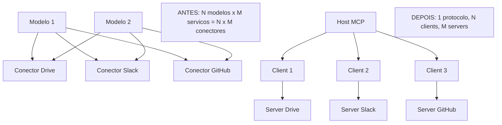

# Capítulo 1 — O agente isolado e a explosão dos conectores proprietários

## 1. Introdução

Os três primeiros livros desta série construíram, camada por camada, a pilha do desenvolvimento dirigido por IA: o fundamento de software e modelos de linguagem (Livro 1), a arte da comunicação direta com o modelo (Livro 2) e a disciplina de arquitetar todo o ambiente informacional que o modelo vê (Livro 3). Em cada etapa, um tema recorrente ganhou força: o agente que apenas conversa é limitado — o poder real surge quando o agente age [1][2]. Este capítulo abre a Parte II da série explorando o protocolo que transformou esse poder em padrão de fato: o Model Context Protocol (MCP) [1]. A tese é direta: entre 2024 e 2026, a indústria passou de um mundo de conectores proprietários e fragmentados — um para cada integração, um para cada ferramenta — para um padrão aberto que unifica a forma como agentes acessam dados e executam ações no mundo real [1][2]. A diferença entre um agente isolado e um agente conectado é a diferença entre um cérebro sem mãos e um profissional completo [1].

## 2. Explica

### 2.1 O Agente Isolado: Por Que Conversar Não Basta

Um agente de IA que apenas conversa — que recebe texto e devolve texto — opera dentro de uma fronteira estreita [1]. Ele pode raciocinar sobre dados que recebeu no contexto (Livro 3), mas não pode buscar dados novos, não pode executar ações e não pode verificar o mundo real [1]. A limitação é estrutural: o modelo de linguagem é um motor de inferência, não um motor de execução [1]. O agente isolado responde à pergunta \"como é o clima?\" com generalidades; o agente conectado consulta um serviço meteorológico e responde com a previsão real [11]. A diferença não está na qualidade do raciocínio — está no acesso [1][2]. Quando a Anthropic lançou o MCP em novembro de 2024, o anúncio deixou essa tese explícita: modelos poderosos são limitados pela fragmentação de integrações, e o MCP nasceu para dar a cada modelo uma ponte padrão para o mundo [1].

### 2.2 A Explosão dos Conectores Proprietários

Antes do MCP, cada integração de IA era um projeto artesanal [1]. Um assistente que precisava acessar o Google Drive, o Slack, o GitHub e um banco de dados exigia quatro conectores diferentes, cada um com sua própria API, seu próprio protocolo e sua própria manutenção [1]. O custo era triplo [1]. Primeiro, o custo de construção: cada conector era código novo, com autenticação, tratamento de erros e testes próprios [1]. Segundo, o custo de manutenção: quando a API de um serviço mudava, o conector quebrava silenciosamente [1]. Terceiro, o custo de escala: para cada novo modelo de IA, todas as integrações precisavam ser reconstruídas ou adaptadas [1]. A indústria reconheceu o problema como o \"N×M problem\": N modelos × M serviços exigiam N×M conectores — uma explosão combinatória insustentável [1][2].

### 2.3 A Proposta do MCP: Um Padrão Aberto

O MCP ataca o problema N×M com uma arquitetura clássica de padronização: um protocolo único entre o modelo (host) e os serviços (servers) [1][2]. Em vez de N×M conectores, o MCP exige um conector por serviço (o server) e um cliente padrão em cada host [2]. A analogia do anúncio original é precisa: o MCP é para os agentes de IA o que o USB-C é para periféricos de computador — um conector universal que substitui a sopa de cabos proprietários [1]. O protocolo foi lançado como padrão aberto, sob a organização modelcontextprotocol, com SDKs oficiais em TypeScript e Python [1][7][8]. A adoção foi rápida e profunda: em menos de dois anos, o registro oficial do MCP listava milhares de servidores públicos, e o ecossistema de diretórios como o PulseMCP cataloga dezenas de milhares [22][12].

### 2.4 O que Muda na Prática do Desenvolvedor

Para o desenvolvedor, o MCP muda a natureza do trabalho de integração [1][11]. Antes: escrever um conector específico para cada par modelo-serviço, com código de rede, autenticação e serialização [1]. Depois: construir um servidor MCP que expõe capacidades de forma padronizada — e qualquer host compatível pode consumi-lo [1][11]. O quickstart oficial demonstra o fluxo: um servidor de clima com duas ferramentas conectado a um host em minutos [11]. A mudança é análoga à que o HTTP trouxe para a web: antes do HTTP, cada serviço tinha seu protocolo; depois, o padrão universal tornou a integração um problema resolvido, não um projeto novo [1][2]. O desenvolvedor de IA de 2026 não escreve integrações artesanais — ele escreve servidores MCP e consome o ecossistema [1][22].

### 2.5 O MCP Dentro da Pilha Agêntica

A série A Pilha Agêntica organiza as disciplinas em camadas [1]. O MCP é a ponte entre a camada de contexto (Livro 3) e a camada de harness (Livros 6-9) [1][2]. O contexto do Livro 3 alimenta o modelo com o que ele precisa saber; o MCP alimenta o modelo com o que ele precisa acessar e executar [1][2]. A conexão é direta: as ferramentas que o Livro 3 tratava como componentes do ambiente informacional tornam-se, no Livro 4, servidores MCP com ciclo de vida, autenticação e segurança próprios [1][4]. O engenheiro que dominar a ponte MCP completa a transição iniciada no Livro 3: do prompt solto ao agente conectado [1][2].

### 2.6 O Vocabulário da Camada

O MCP introduz um vocabulário que atravessa todo o livro [2]. **Host**: a aplicação que hospeda o agente — como o Claude Desktop ou um IDE de IA [2]. **Client**: a conexão 1:1 entre o host e um servidor [2]. **Server**: o serviço que expõe capacidades — local ou remoto [2]. **Tool**: uma função executável que o modelo pode invocar [4]. **Resource**: um dado endereçado por URI que o host pode ler [5]. **Prompt**: um modelo de mensagem reutilizável que o servidor expõe [2]. **Transporte**: o mecanismo de comunicação — stdio ou HTTP [3]. **Primitiva**: os tipos fundamentais que um servidor expõe [2][4]. Cada termo será desenvolvido nos próximos capítulos; dominar o vocabulário agora é dominar o mapa da disciplina [2].

### 2.7 A Relação com o Context Engineering

O Livro 3 estabeleceu o framework write/select/compress/isolate [1][2]. O MCP não substitui esse framework — ele o instrumentaliza [1][2]. As ferramentas selecionadas sob demanda (Select) tornam-se tools MCP; as fontes referenciadas (Select e Write) tornam-se resources MCP; os modelos de mensagem tornam-se prompts MCP [1][2][4]. A distinção do Livro 3 entre o que o modelo vê e o que o modelo faz ganha, aqui, uma forma concreta: o contexto é o que entra na janela; as ferramentas MCP são o que o agente pode executar [1][2]. O engenheiro que dominar os dois livros projeta sistemas em que o ambiente informacional e a capacidade de ação cooperam [1][2].

### 2.8 O que Este Livro Vai Ensinar

Este livro está organizado em cinco partes que sobem a escada do MCP [1][2]. A Parte 1 (Capítulos 1-2) estabelece a fundação: o problema dos conectores e a arquitetura host/client/server [1][2]. A Parte 2 (Capítulos 3-4) desce aos transportes e às primitivas [3][4]. A Parte 3 (Capítulos 5-7) é prática: construir servidores em TypeScript e Python e consumir o ecossistema [7][8][22]. A Parte 4 (Capítulos 8-9) cobre a segurança — a disciplina que separa o profissional do amador [6][15]. A Parte 5 (Capítulo 10) sintetiza o MCP Engineering como disciplina [15][19]. Ao final, o leitor conecta agentes a sistemas reais — bancos de dados, APIs e ferramentas internas — com segurança [1][6].

## 3. Ilustra

### 3.1 A Analogia do USB-C

A analogia do USB-C, usada pela própria Anthropic no anúncio do MCP, é a porta de entrada conceitual [1]. Antes do USB-C, cada periférico exigia um cabo proprietário: impressoras com um conector, monitores com outro, celulares com um terceiro [1]. A padronização mudou a experiência: um cabo, qualquer porta, qualquer dispositivo [1]. O MCP faz o mesmo pelos agentes de IA [1]. Antes do MCP, cada integração exigia um conector proprietário; depois, um servidor padrão conversa com qualquer host [1][2]. A analogia funciona em profundidade: assim como o USB-C não elimina a eletrônica interna de cada dispositivo — apenas padroniza a interface —, o MCP não elimina a complexidade interna de cada serviço — apenas padroniza a conexão [1][2].

### 3.2 O Diagrama do Problema N×M

O diagrama abaixo representa a transição do problema N×M para a arquitetura MCP [1][2].



O primeiro bloco mostra o caos combinatório: dois modelos e três serviços exigem seis conectores [1]. O segundo bloco mostra a solução: um host com três clients conversando com três servers através de um protocolo único [2]. A economia não é apenas de código — é de manutenção, de segurança e de aprendizado [1][2].

### 3.3 O Antes e o Depois na Prática

A comparação concreta ajuda a fixar o conceito [1][11]. **Antes (conector proprietário)**: a equipe escreve um módulo que chama a API do GitHub, com autenticação própria, tratamento de erros e schema fixo; para adicionar o Slack, escreve outro módulo do zero [1]. **Depois (servidor MCP)**: a equipe implementa um servidor MCP que expõe ferramentas; o mesmo host que fala com o servidor do GitHub fala com o do Slack — sem mudança no cliente [1][11]. A diferença não está no esforço da primeira integração — está na economia de todas as seguintes [1][2].

## 4. Técnica

### 4.1 Anatomia de uma Conexão MCP: O Hello World do Protocolo

O primeiro instrumento do engenheiro MCP é entender a anatomia de uma conexão [2]. O protocolo usa JSON-RPC 2.0 como linguagem de mensagens [2]. Antes de qualquer ferramenta, o client e o server negociam capacidades [2]. O código abaixo demonstra a sequência de handshake em pseudocódigo estruturado — a base de toda implementação real [2]:

```python
def handshake_mcp(client, server):
    """Negocia a sessao MCP entre client e server (JSON-RPC 2.0)."""
    # 1. Client inicia a sessao anunciando suas capacidades
    initialize = {
        "jsonrpc": "2.0",
        "id": 1,
        "method": "initialize",
        "params": {
            "protocolVersion": "2025-11-25",
            "capabilities": {"tools": {}, "resources": {}, "prompts": {}},
            "clientInfo": {"name": "meu-host", "version": "1.0.0"},
        },
    }
    resposta = server.processar(initialize)
    # 2. Server responde com a versao de protocolo e suas capacidades
    protocolo_aceito = resposta["result"]["protocolVersion"]
    capacidades_server = resposta["result"]["capabilities"]
    # 3. Client confirma a inicializacao
    client.enviar({"jsonrpc": "2.0", "method": "notifications/initialized"})
    # 4. Sessao estabelecida: mensagens bidirecionais seguem o ciclo de vida
    return {
        "protocolo_aceito": protocolo_aceito,
        "capacidades_server": capacidades_server,
        "sessao": "estabelecida",
    }
```

O handshake é o ritual de entrada de toda conexão MCP [2]. A versão do protocolo é negociada (a especificação evoluiu de 2024-11-05 para 2025-11-25 e 2026-07-28) [2][3]. As capacidades definem o que cada lado oferece [2]. A sessão estabelecida é stateful: mensagens subsequentes operam dentro dela [2].

### 4.2 O Modelo de Mensagens JSON-RPC

O segundo instrumento é o modelo de mensagens [2]. Todo o tráfego MCP é JSON-RPC 2.0: requisições com id, notificações sem id e respostas com resultado ou erro [2]. O código abaixo modela o roteamento de mensagens — a espinha dorsal de um servidor [2]:

```python
class ServidorMCP:
    """Roteador de mensagens JSON-RPC 2.0 de um servidor MCP."""

    def __init__(self):
        self.ferramentas = {}
        self.recursos = {}
        self.prompts = {}

    def processar(self, mensagem: dict) -> dict:
        metodo = mensagem.get("method")
        if not metodo:
            return self._erro(mensagem.get("id"), -32600, "Requisição inválida")
        if metodo == "tools/list":
            return self._resposta(mensagem["id"], {"tools": list(self.ferramentas.values())})
        if metodo == "tools/call":
            return self._executar_ferramenta(mensagem["id"], mensagem["params"])
        if metodo == "resources/list":
            return self._resposta(mensagem["id"], {"resources": list(self.recursos.values())})
        if metodo == "prompts/list":
            return self._resposta(mensagem["id"], {"prompts": list(self.prompts.values())})
        return self._erro(mensagem.get("id"), -32601, "Método não encontrado")

    def _executar_ferramenta(self, id_msg, params):
        nome = params.get("name")
        if nome not in self.ferramentas:
            return self._erro(id_msg, -32602, f"Ferramenta desconhecida: {nome}")
        try:
            resultado = self.ferramentas[nome]["fn"](**params.get("arguments", {}))
            return self._resposta(id_msg, {"content": [{"type": "text", "text": str(resultado)}]})
        except Exception as exc:
            return self._erro(id_msg, -32603, f"Falha na execução: {exc}")

    def registrar_ferramenta(self, nome, descricao, fn):
        self.ferramentas[nome] = {"name": nome, "description": descricao, "fn": fn}

    @staticmethod
    def _resposta(id_msg, resultado):
        return {"jsonrpc": "2.0", "id": id_msg, "result": resultado}

    @staticmethod
    def _erro(id_msg, codigo, mensagem):
        return {"jsonrpc": "2.0", "id": id_msg, "error": {"code": codigo, "message": mensagem}}


# Exemplo de uso
if __name__ == "__main__":
    servidor = ServidorMCP()
    servidor.registrar_ferramenta("ola_mundo", "Sauda o usuário", lambda nome: f"Olá, {nome}!")
    print(servidor.processar({
        "jsonrpc": "2.0", "id": 2,
        "method": "tools/call",
        "params": {"name": "ola_mundo", "arguments": {"nome": "leitor"}},
    }))
```

O roteador demonstra os quatro métodos fundamentais de listagem e chamada [2][4][5]. Em produção, esse esqueleto é substituído pelos SDKs oficiais — mas entender o protocolo por baixo é o que diferencia quem usa de quem domina [7][8][2].

### 4.3 O Diagrama de Ciclo de Vida da Sessão

O terceiro instrumento concretiza o ciclo de vida em código [2]. Uma sessão MCP tem estados claros: inicialização, operação e encerramento [2]. O código abaixo modela a máquina de estados da sessão [2]:

```python
from enum import Enum


class EstadoSessao(Enum):
    INICIALIZANDO = "inicializando"
    ATIVO = "ativo"
    ENCERRANDO = "encerrando"
    ENCERRADO = "encerrado"


class SessaoMCP:
    """Máquina de estados de uma sessão MCP client-server."""

    def __init__(self, protocolo: str):
        self.protocolo = protocolo
        self.estado = EstadoSessao.INICIALIZANDO
        self.historico = []

    def inicializada(self):
        if self.estado != EstadoSessao.INICIALIZANDO:
            raise RuntimeError("Sessão não está inicializando")
        self.estado = EstadoSessao.ATIVO

    def registrar(self, metodo: str):
        if self.estado != EstadoSessao.ATIVO:
            raise RuntimeError("Sessão inativa")
        self.historico.append(metodo)

    def encerrar(self):
        if self.estado == EstadoSessao.ENCERRADO:
            raise RuntimeError("Sessão já encerrada")
        self.estado = EstadoSessao.ENCERRANDO
        self.estado = EstadoSessao.ENCERRADO

    def resumo(self) -> dict:
        return {
            "protocolo": self.protocolo,
            "estado": self.estado.value,
            "mensagens": len(self.historico),
            "metodos": sorted(set(self.historico)),
        }


if __name__ == "__main__":
    sessao = SessaoMCP("2025-11-25")
    sessao.inicializada()
    sessao.registrar("tools/list")
    sessao.registrar("tools/call")
    sessao.encerrar()
    print(sessao.resumo())
```

A máquina de estados impede o erro clássico do iniciante: usar a sessão antes da inicialização ou depois do encerramento [2]. A disciplina do ciclo de vida é a base do gerenciamento correto de conexões em produção [2][3].

## 5. Aplica

### 5.1 Onde Isso Vive no Mundo Real

A transição dos conectores proprietários para o MCP está em toda parte em 2026 [1][22]. Assistentes de desenvolvimento acessam repositórios e issue trackers via servers MCP [14]. Assistentes de dados consultam bancos e data warehouses via servers MCP [1][22]. Ferramentas de produtividade conectam-se a planilhas e documentos [1]. O registro oficial do MCP, mantido com apoio de Anthropic, GitHub e Microsoft, cataloga milhares de servidores públicos [12][14]. O PulseMCP ultrapassou a marca de dezenas de milhares de servidores listados [22]. A pergunta profissional deixou de ser \"como integrar?\" e passou a ser \"qual servidor usar e com que segurança?\" [6][22].

### 5.2 O Erro Comum do Iniciante

O erro mais comum de quem começa com MCP é tratar o protocolo como mais uma biblioteca de integração [1][2]. O iniciante conecta um servidor, chama uma ferramenta e considera o trabalho feito — sem entender a arquitetura, o ciclo de vida e a superfície de segurança [1][2]. Quando algo falha — uma sessão expira, um transporte muda, uma ferramenta não aparece —, ele não tem o mapa mental para diagnosticar [2]. A lição é a mesma do Livro 3: dominar o instrumento é diferente de entender o sistema [1][2]. O profissional aprende o protocolo por baixo (JSON-RPC, handshake, ciclo de vida) antes de usar os SDKs [2][7][8].

### 5.3 O Padrão Profissional em 2026

O padrão profissional em 2026 combina o protocolo com a disciplina [1][15]. O host é escolhido com critério — capacidade de gerenciar múltiplos clients e políticas de autorização [2]. Os servers são selecionados do registro oficial ou construídos com SDKs oficiais [12][7][8]. Cada conexão segue o princípio do menor privilégio: o server expõe apenas as ferramentas necessárias à tarefa [6][15]. As sessões são monitoradas, e o acesso é auditado [6][20]. O resultado é um sistema de agentes conectado ao mundo — mas com uma superfície de ataque desenhada, não acidental [6][15].

### 5.4 Como Este Livro é Organizado

Este capítulo estabeleceu a fundação; os próximos constroem a estrutura [2]. O Capítulo 2 detalha a arquitetura host/client/server e os papéis de cada componente [2]. Os Capítulos 3 e 4 documentam os transportes e as primitivas [3][4]. Os Capítulos 5 e 6 ensinam a construir servidores em TypeScript e Python [7][8]. O Capítulo 7 ensina a consumir o ecossistema com curadoria [22][12]. Os Capítulos 8 e 9 cobrem a segurança e os riscos documentados [6][15][16]. O Capítulo 10 sintetiza a disciplina de MCP Engineering [15][19]. A jornada é a subida da pilha que a série prometeu [1][2].

### 5.5 O Papel do Host na Arquitetura

O leitor que vem do Livro 3 conhece o ambiente informacional como o conjunto do que o modelo vê [1][2]. O MCP adiciona a dimensão do que o modelo faz — e o host é o orquestrador dessa dimensão [2]. O host gerencia múltiplos clients, cada um conectado a um server, e aplica políticas de autorização [2]. A escolha do host é uma decisão de arquitetura: um host robusto gerencia o ciclo de vida das conexões, isola falhas e registra o uso [2][6]. O engenheiro MCP trata o host como o sistema operacional do agente — a camada que governa os recursos de conexão [1][2].

A distinção entre host, client e server é a distinção entre o cérebro, os nervos e os órgãos [2]. O host decide (políticas, autorizações, coordenação); o client transporta (conexão 1:1 com um server); o server executa (ferramentas, recursos, dados) [2]. Misturar os papéis é o erro arquitetural clássico — e o Capítulo 2 aprofunda cada um [2].

### 5.6 O Ecossistema MCP: Do Registro ao Diretório

O ecossistema MCP em 2026 tem camadas bem definidas [12][22]. Na base, o registro oficial (registry.modelcontextprotocol.io) — o catálogo upstream mantido pela comunidade e apoiado por Anthropic, GitHub, Microsoft e PulseMCP [12][13]. Sobre ele, diretórios comunitários como PulseMCP, Glama e MCP.so que indexam, classificam e avaliam servidores [22]. No topo, os mantenedores — Anthropic, Google, AWS e GitHub publicam servers oficiais para seus serviços [14][22]. O engenheiro maduro usa o registro como fonte primária de verdade e os diretórios como camada de descoberta e avaliação [12][22]. A curadoria do ecossistema é parte da disciplina — e o Capítulo 7 detalha o processo [22].

### 5.7 O Custo da Integração: Antes e Depois do MCP

A adoção do MCP muda a economia da integração [1][2]. Antes, cada integração era um projeto com custo fixo alto: código, testes, manutenção [1]. Depois, a primeira integração tem custo de aprendizado do protocolo, e as seguintes têm custo marginal baixo — o host já fala o protocolo [1][2]. A mudança é a mesma que o HTTP trouxe para a web: a padronização transforma a integração de projeto em configuração [1][2]. O engenheiro que entende essa economia projeta sistemas que se conectam ao mundo com custo decrescente [1][2][22].

### 5.8 O Roteiro de Adoção do MCP

A adoção do MCP na organização não é um evento único — é um processo em fases [1][15]. A primeira fase é o **inventário**: mapear as integrações existentes e as novas necessidades [1]. A segunda é a **arquitetura**: escolher hosts e definir a topologia de servers [2][15]. A terceira é a **construção**: criar ou selecionar os servers (Capítulos 5-7) [7][22]. A quarta é a **segurança**: aplicar least-privilege, autenticação e auditoria (Capítulos 8-9) [6][15]. A quinta é a **operação**: monitorar, revisar e evoluir (Capítulo 10) [15][19]. Cada fase tem entregável e critério de aceite [15]. O roteiro é o caminho prático para o padrão profissional [1][15].

### 5.9 O MCP e a Revisão Autônoma

A série anuncia o método de revisão autônoma entre harness [1]. O MCP é uma das suas infraestruturas: a revisão autônoma precisa que o revisor acesse o que foi produzido e os critérios de aceite [1][2]. Com servers MCP, o revisor consulta repositórios, registros e bases de conhecimento de forma padronizada [1][2][14]. A conexão tem implicações práticas [1]. O contexto de uma tarefa deve incluir o acesso às fontes de verificação (Capítulo 3) [2]. O histórico das decisões, preservado pelo Compress do Livro 3, é consultável via recursos MCP [1][5]. O isolamento do Livro 3 permite revisões em contexto limpo — e o MCP fornece o acesso sem contaminar [1][2]. A revisão autônoma é, em última análise, uma aplicação de agentes conectados [1].

### 5.10 O MCP e a Governança Organizacional

O MCP, como toda infraestrutura de produção, exige governança [15][20]. O primeiro aspecto é a **propriedade dos servers**: cada server tem um dono responsável pela sua manutenção e segurança [15]. O segundo é o **processo de alteração**: mudanças nas ferramentas expostas passam por revisão [15]. O terceiro é a **auditoria de conformidade**: o uso das ferramentas é registrado e revisado [6][20]. O CIS Companhion Guide aplica os controles CIS v8.1 a implantações MCP — identidade, controle de acesso, logging e segurança de aplicação [20]. A governança transforma a disciplina individual em capacidade organizacional [15][20].

### 5.11 O Caso da Integração Não Revisada

Para fechar o capítulo com uma aplicação concreta, este estudo de caso mostra a integração não revisada — o erro que o MCP Engineering impede [6][16]. O cenário: uma equipe conecta um server MCP de um diretório comunitário para acessar dados de um serviço externo [22]. O server foi instalado sem revisão de código e com escopos amplos [6][22]. O primeiro sintoma: o agente passou a executar ações inesperadas — chamadas a APIs que a equipe não autorizou [16]. O segundo sintoma: os logs revelaram tentativas de acesso a recursos internos [16]. O terceiro sintoma: a equipe descobriu que o server continha instruções ocultas (tool poisoning — Capítulo 9) [16].

O diagnóstico correto: a integração não revisada era a porta de entrada [6][16]. O tratamento: remover o server, revisar o código de toda integração e aplicar least-privilege [6]. A lição do caso é a cascata: um atalho de conveniência criou uma superfície de ataque; a superfície causou comportamento inesperado; o diagnóstico tardio ampliou o dano [6][16]. O caso demonstra o tema do capítulo: o MCP padroniza a conexão, mas a disciplina de segurança decide a segurança [6][15].

### 5.12 O MCP e a Interface com os Modelos

O MCP interage com uma variável que o engenheiro controla parcialmente: o modelo de linguagem [1][2]. A interface é padronizada — qualquer modelo com um client MCP consome qualquer server [1][2]. O primeiro princípio da interface é a **neutralidade de modelo**: o server não sabe nem precisa saber qual modelo o consumirá [2]. O segundo é a **revalidação**: ao trocar de modelo, o comportamento das ferramentas pode mudar — o modelo usa a descrição da ferramenta para decidir quando chamá-la [2][4]. O terceiro é o **design das descrições**: descrições claras de ferramentas melhoram a taxa de uso correto [4][16]. A interface modelo-MCP é o ponto onde o Livro 2 (prompt engineering) encontra o Livro 4 [1][2][4].

### 5.13 O Manual do Diagnóstico Rápido da Integração MCP

O capítulo fecha com um instrumento de trabalho: o manual do diagnóstico rápido [2][6]. O primeiro item é o **handshake**: a sessão inicializa corretamente com a versão certa do protocolo? [2]. O segundo é a **listagem**: as ferramentas, recursos e prompts esperados aparecem? [2][4]. O terceiro é a **chamada**: as ferramentas executam e retornam no formato esperado? [4]. O quarto é o **ciclo de vida**: a sessão encerra e reconecta sem vazamento? [2][3].

O quinto item é o **escopo**: o server expõe apenas o necessário? [6]. O sexto é a **autenticação**: o acesso é autenticado com o mínimo de privilégio? [6]. O sétimo é a **auditoria**: o uso está registrado e revisável? [6][20]. O oitavo é a **proveniência**: o server é confiável e sua origem é conhecida? [12][22]. O manual é o resumo operacional do livro inteiro: cada item aponta o capítulo que o desenvolve [2]. O engenheiro que percorre o manual em minutos evita dias de diagnóstico errado [2][6].

### 5.14 O MCP e os Limites Éticos do Acesso

O MCP, ao dar ação ao agente, cria responsabilidades éticas [1][6]. O primeiro limite é o da **fronteira de ação**: nem tudo que o agente pode fazer deve fazer [6]. O segundo é o da **transparência**: o usuário sabe quais ferramentas o agente usa e para quê [6]. O terceiro é o do **consentimento**: ações sensíveis exigem autorização explícita [6]. O quarto é o da **auditoria**: o uso é registrado para responsabilização [6][20]. O quinto é o do **viés amplificado**: ferramentas mal desenhadas amplificam erros do modelo [16]. A ética do MCP não é um capítulo separado — é uma dimensão de cada decisão deste livro [1][6].

### 5.15 O Futuro do MCP

O MCP é um protocolo jovem — e o ecossistema de 2026 é um estágio, não um destino [1][22]. As tendências visíveis apontam a evolução [1]. A primeira é a **especificação estável**: a evolução de 2024-11-05 para 2026-07-28 consolidou o núcleo [2][3]. A segunda é o **registro maduro**: o catálogo oficial cresce e se organiza [12][14]. A terceira é a **segurança formalizada**: guias do CSA, CISA, NSA e CIS estabelecem o padrão de implantação [15][19][20][21]. A quarta é a **adoção governamental**: agências recomendam o MCP com controles específicos [19][21]. O engenheiro que domina os fundamentos não será surpreendido pelas tendências — porque as tendências são a evolução dos fundamentos [1][2].

### 5.16 O Fechamento do Capítulo

O capítulo de abertura se encerra com a consolidação da fundação [1][2]. O agente isolado é limitado; a explosão dos conectores proprietários era insustentável; e o MCP nasceu como o padrão aberto que unifica o acesso do agente ao mundo [1][2]. O vocabulário da camada — host, client, server, tool, resource, prompt, transporte, primitiva — é o mapa da jornada [2]. O próximo capítulo desce à arquitetura: os papéis e responsabilidades de cada componente da conexão [2].

### 5.17 O MCP e o Fluxo de Desenvolvimento do Agente

O MCP transforma o fluxo de desenvolvimento do agente — não apenas a integração final [1][2]. O ciclo de desenvolvimento muda em três pontos [1][2]. Primeiro, o **desenvolvimento orientado a capacidades**: em vez de escrever funções avulsas, o desenvolvedor projeta a superfície de tools, resources e prompts que o agente usará [2][4]. Segundo, o **teste com o host real**: o servidor é testado conectado a um host — não em isolamento —, porque a decisão do modelo depende da descrição que o host expõe [11][4]. Terceiro, a **iteração rápida**: o ciclo esqueleto-capacidade-teste (Capítulos 5-6) permite validar uma tool em minutos [7][8].

O fluxo de desenvolvimento orientado a capacidades tem implicações para a equipe [1][2][15]. O desenvolvedor de MCP não é apenas um integrador — é um designer de superfícies [4][6]. A revisão de código de uma tool é uma revisão de segurança [16][6]. O teste de uma tool é um teste de contrato — o schema declara o que a tool aceita, e o teste verifica [4][7]. A equipe que adota o fluxo desenvolve o agente e a sua superfície de ação juntos [2][15].

O engenheiro que domina o fluxo constrói agentes que evoluem: cada nova capacidade nasce com contrato, escopo e teste — e entra na superfície com revisão [4][6]. O fluxo é a materialização prática da disciplina que o Capítulo 10 sintetizará [6]. O MCP não é o destino do desenvolvimento — é a infraestrutura que o acelera [1][2].

### 5.18 O MCP e o Ecossistema de Ferramentas de Desenvolvimento

O MCP não vive isolado — vive dentro de um ecossistema de ferramentas de desenvolvimento que o adotaram como padrão [14][22]. Os IDEs de IA modernos suportam MCP nativamente [14]. As plataformas de orquestração de agentes expõem servers próprios [22]. As ferramentas de CI/CD começam a integrar MCP para automação de release [22]. O GitHub, como steward do registro, integrou a descoberta de servers ao fluxo de desenvolvimento [14].

A adoção pelos IDEs tem uma implicação central para o Capítulo 1 [14]. O desenvolvedor que escreve código com um IDE de IA já está consumindo MCP — mesmo sem perceber [14]. As tools de busca no repositório, de execução de testes e de revisão de código são servers MCP [14]. O entendimento do protocolo transforma o usuário passivo em operador consciente [2][14]. O engenheiro que entende o MCP diagnostica, estende e governa as ferramentas que usa diariamente [2][14][6].

O ecossistema de ferramentas é o que consolida o MCP como padrão de fato [1][14]. A adoção por ferramentas de desenvolvimento — não apenas por aplicações de chat — é o sinal de que o protocolo virou infraestrutura [14][22]. O engenheiro que domina o Capítulo 1 entende o que está por trás das ferramentas que usa [1][2][14].

### 5.19 O MCP e a Portabilidade do Conhecimento

O MCP introduz uma propriedade que o desenvolvedor de integrações aprecia: a portabilidade do conhecimento [1][2]. As habilidades de integração — entender contratos, desenhar superfícies, governar escopos — transferem-se entre servidores [2][4][6]. O desenvolvedor que domina um server de banco aplica o mesmo raciocínio a um server de repositório [2]. O conhecimento não fica preso a um serviço — fica preso ao protocolo [1][2].

A portabilidade tem implicações para a carreira [1][2]. O profissional que domina MCP Engineering (Capítulo 10) não é especialista de um fornecedor — é especialista do padrão [6][15]. O conhecimento do protocolo valoriza-se com o ecossistema [22]. O engenheiro que entende o Capítulo 1 investe em uma habilidade portável [1][2].

A portabilidade também tem implicações organizacionais [2][15]. As equipes que adotam MCP reduzem o custo de troca de serviços [2]. A migração de um servidor para outro não exige re-aprendizado — exige re-avaliação (Capítulo 7) [22][6]. A portabilidade é a economia do Capítulo 1 aplicada ao conhecimento [1][2].

### 5.20 O MCP e a Comunidade Open Source

O MCP é um projeto open source — e a comunidade é parte do seu sucesso [1][12]. O protocolo nasceu aberto e cresceu com contribuições [1]. O registro oficial é mantido pela comunidade com apoio institucional [12][13]. Os SDKs são open source [7][8]. A comunidade escreve servers, documenta padrões e reporta vulnerabilidades [22][16]. O engenheiro que participa da comunidade amplia o próprio domínio [12].

A participação na comunidade tem formas [12][22]. Primeiro, o **consumo responsável**: usar os servidores e reportar problemas [22]. Segundo, a **contribuição**: escrever servers e melhorar a documentação [7][8]. Terceiro, a **segurança coletiva**: reportar vulnerabilidades ao invés de explorá-las [6][16]. O engenheiro que participa ajuda a comunidade a amadurecer [12].

A comunidade é também a rede de aprendizado [12][22]. Os problemas que o engenheiro encontra provavelmente já foram discutidos [22]. As melhores práticas circulam nos diretórios e fóruns [22]. O engenheiro que domina o Capítulo 1 entra na comunidade como participante informado [1][12].

### 5.21 O MCP e a Economia de Tokens

O MCP interage com a economia de tokens — o custo da janela do Livro 3 [2][3]. As tools e os resources têm custo de contexto [2][3]. As descrições das tools ocupam tokens em cada sessão [4]. Os resultados das tools ocupam tokens em cada chamada [4][2]. O engenheiro MCP é um gestor de tokens [2][4].

A gestão de tokens no MCP tem práticas [2][4]. Primeiro, as **descrições enxutas**: descrições curtas e precisas economizam tokens [4]. Segundo, os **resultados truncados**: resultados longos são resumidos antes de entrar no contexto [4][2]. Terceiro, a **seleção de tools**: apenas as tools necessárias à tarefa são expostas na sessão [4][6]. O Livro 3 ensinou o write/select/compress; o MCP os aplica às tools [2][4].

A economia de tokens é uma dimensão profissional do Capítulo 1 [2][4]. O engenheiro que ignora o custo de contexto constrói sistemas lentos e caros [2][4]. O engenheiro que o gerencia constrói sistemas eficientes [2][4]. A economia de tokens conecta o Livro 4 ao Livro 3 — a pilha se empilha [2][4].

### 5.22 O MCP e a Documentação como Contrato

O MCP eleva a documentação à categoria de contrato [4][6]. A documentação do server — descrições, schemas, exemplos — é o que o modelo e os desenvolvedores consomem [4]. A documentação mal escrita degrada o uso [4]. A documentação bem escrita melhora o uso [4]. O engenheiro trata a documentação como parte do código [4][6].

A documentação como contrato tem princípios [4]. Primeiro, a **precisão**: a descrição diz exatamente o que a tool faz [4]. Segundo, a **atualidade**: a documentação acompanha o código [4]. Terceiro, a **segurança**: a documentação não esconde efeitos [4][6]. A revisão da documentação é parte da revisão de segurança (Capítulo 9) [16][6].

O engenheiro que documenta como contrato constrói servers que os modelos usam corretamente [4]. A documentação é a interface visível [4]. A qualidade da documentação é a qualidade da integração [4]. O MCP torna a documentação — há muito negligenciada — uma disciplina central [4][6].

### 5.23 O MCP e o Onboarding de Desenvolvedores

O MCP transforma o onboarding de novos desenvolvedores em sistemas de IA [1][2]. Antes do MCP, o novo desenvolvedor enfrentava um emaranhado de integrações proprietárias — cada uma com documentação e padrões próprios [1]. Com o MCP, o onboarding segue uma trilha única [1][2]. O novo desenvolvedor aprende o protocolo uma vez e o aplica a todas as integrações [2]. A curva de aprendizado é única, não multiplicada [1][2].

O onboarding tem implicações organizacionais [2][15]. A documentação do protocolo é uma única [2]. Os exemplos são transferíveis [2]. A comunidade oferece suporte [22]. O engenheiro que adota o MCP reduz o custo de entrada da equipe [1][2]. O onboarding padronizado é a economia do Capítulo 1 aplicada à equipe [1][2].

O engenheiro que domina o onboarding constrói equipes que produzem mais rápido [2][15]. O novo desenvolvedor passa menos tempo aprendendo integrações e mais tempo projetando capacidades [2][4]. O MCP é a infraestrutura do time produtivo [1][2].

### 5.24 O MCP e a Resiliência do Ecossistema

A resiliência do ecossistema MCP é uma propriedade emergente [1][12][22]. O ecossistema sobrevive à saída de mantenedores individuais [12]. O protocolo é aberto — ninguém o possui [1]. O registro é comunitário [12][13]. A resiliência tem implicações para o adotante [1][12]. A dependência de um único servidor é mitigada pelo ecossistema [22]. A migração entre servidores é facilitada pelo padrão [1][2].

A resiliência do ecossistema também tem limites [6][22]. A qualidade varia entre servidores [22]. A segurança exige avaliação individual [6][22]. O adotante não pode delegar a curadoria ao ecossistema [6]. O engenheiro que entende a resiliência adota com responsabilidade própria [6][22].

O engenheiro que domina o Capítulo 1 entende a natureza do ecossistema que adota [1][12]. O protocolo é a infraestrutura; a curadoria é do profissional [6]. A resiliência do ecossistema é a oportunidade — e a responsabilidade [1][6].

### 5.25 O MCP e o Posicionamento Profissional

O domínio do MCP posiciona o profissional no mercado de 2026 [1][22]. O MCP virou o padrão de fato da conexão de agentes [1]. As vagas de IA valorizam a competência [22]. O profissional que domina o protocolo — e a disciplina do Capítulo 10 — diferencia-se [1][6]. O posicionamento tem fundamentos [1][6]. O conhecimento da especificação [2]. A habilidade de construção [7][8]. A curadoria do ecossistema [22]. A segurança [6].

O posicionamento profissional se constrói com prática [1][6]. Os projetos reais demonstram [6]. A comunidade amplia [22]. A documentação pública comprova [6]. O engenheiro que constrói o portfólio de MCP posiciona-se para a liderança técnica [1][6].

O posicionamento é a culminância do Capítulo 1 [1][6]. O profissional que entende o porquê do MCP — e o quanto a disciplina avança — é o que o mercado procura [1][6]. O Livro 4 é o início desse posicionamento [1].

## 6. Conclusão

O MCP transformou a forma como agentes acessam o mundo real [1]. Este capítulo estabeleceu a tese: o agente isolado é um cérebro sem mãos; a explosão dos conectores proprietários era insustentável; e o padrão aberto do MCP unificou a integração [1][2]. O vocabulário da camada — host, client, server, tool, resource, prompt — é o mapa da jornada [2]. A economia da padronização — um protocolo em vez de N×M conectores — é a razão da adoção explosiva [1][2][22]. O próximo capítulo desce à arquitetura fundamental: os papéis do host, do client e do server na conexão [2].

## 7. Referências

[1] ANTHROPIC. Introducing the Model Context Protocol. Anthropic News, 25 nov. 2024. Disponível em: https://www.anthropic.com/news/model-context-protocol. Acesso em: 5 ago. 2026.
[2] MODEL CONTEXT PROTOCOL. Architecture. MCP Specification 2025-11-25, 25 nov. 2025. Disponível em: https://modelcontextprotocol.io/specification/2025-11-25/architecture. Acesso em: 5 ago. 2026.
[3] MODEL CONTEXT PROTOCOL. Basic Specification: Transports. MCP Specification 2025-11-25, 2025. Disponível em: https://modelcontextprotocol.io/specification/2025-11-25/basic/transports. Acesso em: 5 ago. 2026.
[4] MODEL CONTEXT PROTOCOL. Specification 2026-07-28: Server Tools. MCP Specification, 28 jul. 2026. Disponível em: https://modelcontextprotocol.io/specification/2026-07-28/server/tools. Acesso em: 5 ago. 2026.
[5] MODEL CONTEXT PROTOCOL. Specification 2026-07-28: Server Resources. MCP Specification, 28 jul. 2026. Disponível em: https://modelcontextprotocol.io/specification/2026-07-28/server/resources. Acesso em: 5 ago. 2026.
[6] MODEL CONTEXT PROTOCOL. Security Best Practices (Draft). MCP Specification. Disponível em: https://modelcontextprotocol.io/specification/draft/basic/security_best_practices. Acesso em: 5 ago. 2026.
[7] MODEL CONTEXT PROTOCOL. TypeScript SDK. GitHub Repository, 2026. Disponível em: https://github.com/modelcontextprotocol/typescript-sdk. Acesso em: 5 ago. 2026.
[8] MODEL CONTEXT PROTOCOL. Python SDK. GitHub Repository, 2026. Disponível em: https://github.com/modelcontextprotocol/python-sdk. Acesso em: 5 ago. 2026.
[9] MODEL CONTEXT PROTOCOL. TypeScript SDK Documentation. MCP SDK Portal, 2026. Disponível em: https://ts.sdk.modelcontextprotocol.io/. Acesso em: 5 ago. 2026.
[10] MODEL CONTEXT PROTOCOL. Python SDK Documentation. MCP SDK Portal, 2026. Disponível em: https://py.sdk.modelcontextprotocol.io/. Acesso em: 5 ago. 2026.
[11] MODEL CONTEXT PROTOCOL. Quickstart Guide. MCP Documentation. Disponível em: https://modelcontextprotocol.io/docs/quickstart/quickstart. Acesso em: 5 ago. 2026.
[12] MODEL CONTEXT PROTOCOL. MCP Registry Preview. Official MCP Blog, 8 set. 2025. Disponível em: https://blog.modelcontextprotocol.io/posts/2025-09-08-mcp-registry-preview/. Acesso em: 5 ago. 2026.
[13] MODEL CONTEXT PROTOCOL. Registry Repository. GitHub Repository, 2025–2026. Disponível em: https://github.com/modelcontextprotocol/registry. Acesso em: 5 ago. 2026.
[14] GITHUB. GitHub MCP Registry: the fastest way to discover AI tools. GitHub Changelog, 16 set. 2025. Disponível em: https://github.blog/changelog/2025-09-16-github-mcp-registry-the-fastest-way-to-discover-ai-tools/. Acesso em: 5 ago. 2026.
[15] CLOUD SECURITY ALLIANCE. Agentic MCP Security Best Practices Guide v1. CSA Labs, 27 mar. 2026. Disponível em: https://labs.cloudsecurityalliance.org/agentic/agentic-mcp-security-best-practices-v1/. Acesso em: 5 ago. 2026.
[16] INVARIANT LABS. MCP Security Notification: Tool Poisoning Attacks. Invariant Labs Blog, 1 abr. 2025. Disponível em: https://invariantlabs.ai/blog/mcp-security-notification-tool-poisoning-attacks. Acesso em: 5 ago. 2026.
[17] WILLISON, Simon. Model Context Protocol has prompt injection security problems. Simon Willison's Weblog, 9 abr. 2025. Disponível em: https://simonwillison.net/2025/Apr/9/mcp-prompt-injection/. Acesso em: 5 ago. 2026.
[18] WANG, Zhen et al. (Tsinghua University & Ant Group). Systematic Analysis of MCP Security (MCPLib). arXiv:2508.12538, 18 ago. 2025. Disponível em: https://arxiv.org/html/2508.12538v1. Acesso em: 5 ago. 2026.
[19] CISA. Guide to Secure Adoption of Agentic AI. CISA News, 1 mai. 2026. Disponível em: https://www.cisa.gov/news-events/news/cisa-us-and-international-partners-release-guide-secure-adoption-agentic-ai. Acesso em: 5 ago. 2026.
[20] CENTER FOR INTERNET SECURITY (CIS). Model Context Protocol (MCP) Companion Guide — CIS Controls v8.1. CIS White Papers, 20 abr. 2026. Disponível em: https://www.cisecurity.org/insights/white-papers/controls-v8-1-model-context-protocol-companion-guide. Acesso em: 5 ago. 2026.
[21] NATIONAL SECURITY AGENCY (NSA). Security Design Considerations for AI-Driven Automation Leveraging the Model Context Protocol. NSA Press Release, 20 mai. 2026. Disponível em: https://www.nsa.gov/Press-Room/Press-Releases-Statements/Press-Release-View/Article/4496698/. Acesso em: 5 ago. 2026.
[22] PULSEMCP. MCP Server Directory. PulseMCP, 2025–2026. Disponível em: https://www.pulsemcp.com/servers. Acesso em: 5 ago. 2026.
