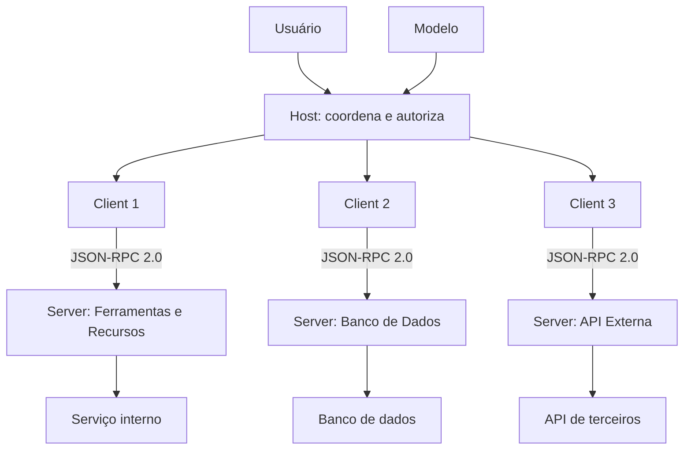

# Capítulo 2 — Arquitetura MCP: host, client e server

## 1. Introdução

O Capítulo 1 estabeleceu o porquê: agentes isolados são limitados, e o Model Context Protocol (MCP) nasceu como a ponte padrão para o mundo real [1][2]. Este capítulo desce ao como — a arquitetura fundamental que sustenta toda conexão MCP [2]. A tese é direta: o MCP organiza a conexão em três papéis — host, client e server — com responsabilidades estritamente separadas, e a separação é o que permite segurança, escalabilidade e manutenibilidade [2]. O Capítulo 1 introduziu o vocabulário; este capítulo desenvolve a anatomia [2]. O engenheiro que domina a arquitetura — quem decide, quem transporta e quem executa — entende por que o protocolo funciona e, mais importante, onde as coisas dão errado quando os papéis se misturam [2][6]. O anúncio original da Anthropic já apontava essa separação como o coração do design: o host coordena, o client conecta e o server executa [1][2].

## 2. Explica

### 2.1 O Host: O Orquestrador da Experiência

O host é a aplicação que hospeda o agente — o processo que o usuário vê e com o qual interage [2]. Exemplos concretos em 2026: o Claude Desktop, IDEs de IA, aplicações de chat corporativas e ferramentas de produtividade com assistentes [1][2]. O host tem três responsabilidades centrais [2]. Primeiro, **coordenação**: gerencia múltiplas instâncias de client, cada uma conectada a um server diferente [2]. Segundo, **autorização**: aplica as políticas de consentimento do usuário — o que cada server pode fazer e com que escopo [2][6]. Terceiro, **ciclo de vida**: inicia, mantém e encerra conexões [2]. O host é o sistema operacional do agente: decide, governa e coordena, mas não executa as ferramentas diretamente [2].

### 2.2 O Client: O Nervo da Conexão

O client é o componente que mantém uma conexão 1:1 com um server [2]. O host pode ter muitos clients — um por server [2]. O client tem responsabilidades precisas [2]. Primeiro, **isolamento**: cada client isola o contexto do seu server — um server não vê o que outro server conversa [2]. Segundo, **roteamento**: encaminha mensagens JSON-RPC 2.0 entre host e server, bidirecionalmente [2]. Terceiro, **sessão**: mantém o estado da sessão com o server [2]. A metáfora do nervo é precisa: o client transporta sinais sem interpretá-los — quem interpreta é o host [2]. O client não decide políticas; ele transporta mensagens sob as políticas que o host define [2].

### 2.3 O Server: O Executor de Capacidades

O server é o serviço que expõe capacidades — ferramentas, recursos e prompts — ao client [2][4][5]. O server pode ser local (um processo na mesma máquina, via stdio) ou remoto (um serviço HTTP acessível por rede) [2][3]. O server tem três responsabilidades [2]. Primeiro, **exposição**: declara o que oferece — tools, resources, prompts — de forma padronizada [2][4][5]. Segundo, **execução**: executa as ferramentas quando chamadas e retorna resultados no formato do protocolo [4]. Terceiro, **limite**: define o que não faz — o server é o ponto onde o controle de acesso e o escopo se materializam [6]. O server é o órgão do sistema: executa funções especializadas, mas não decide o que o sistema inteiro faz [2].

### 2.4 A Separação de Responsabilidades: O Design Central

A separação host/client/server é o design central do MCP [2]. A separação tem três benefícios [2]. Primeiro, **segurança**: o host controla autorização fora do alcance do server — o server não pode se autoautorizar [2][6]. Segundo, **escalabilidade**: um host com muitos clients pode conversar com muitos servers sem acoplamento — cada conexão é independente [2]. Terceiro, **manutenibilidade**: cada papel evolui separadamente — um server novo não exige mudança no host, e um host novo consome servers existentes [2]. A separação é a resposta concreta ao problema N×M do Capítulo 1 [1][2].

### 2.5 As Três Primitivas: Tools, Resources e Prompts

O server expõe capacidades através de três primitivas [2][4][5]. **Tools** são funções executáveis que o modelo invoca — consultar uma API, executar uma query, enviar uma mensagem [4]. **Resources** são dados endereçados por URI que o host lê — um documento, um schema de banco, um arquivo [5]. **Prompts** são modelos de mensagem reutilizáveis que o server expõe para estruturar interações [2]. A distinção operacional é fundamental [2][4][5]: tools são para o modelo agir; resources são para o host ler; prompts são para estruturar conversas [2]. O Capítulo 4 desenvolve cada primitiva em profundidade [4][5].

### 2.6 O Ciclo de Vida da Conexão

Uma conexão MCP tem um ciclo de vida formal [2]. O ciclo tem quatro fases [2]. **Inicialização**: o client envia `initialize`, negocia a versão do protocolo e as capacidades [2]. **Negociação**: o client e o server trocam capacidades e estabelecem a sessão [2]. **Operação**: mensagens fluem bidirecionalmente — chamadas de ferramentas, leituras de recursos, listagens de prompts [2][4]. **Encerramento**: a sessão termina de forma ordenada [2]. A disciplina do ciclo de vida impede conexões órfãs e sessões corrompidas [2][3].

### 2.7 O Fluxo de Autorização

A autorização atravessa toda a arquitetura [2][6]. Quando o modelo decide chamar uma ferramenta, o fluxo passa por camadas de controle [6]. O host verifica a política de consentimento — o usuário autorizou esta ferramenta? [2][6]. O client verifica a sessão — a conexão é válida e autenticada? [6]. O server verifica o escopo — a chamada respeita o menor privilégio? [6]. Cada camada pode negar [6]. O fluxo de autorização é o coração da segurança MCP — e o Capítulo 8 o desenvolve com profundidade [6][15].

### 2.8 O Modelo de Confiança em Três Fronteiras

A arquitetura MCP materializa três fronteiras de confiança — o modelo que o Cloud Security Alliance documentou [15]. A primeira fronteira é **LLM ↔ Client**: as descrições de ferramentas e instruções não verificadas [15][16]. A segunda é **Client ↔ Server**: autenticação, gerenciamento de sessão e confiança na execução [15]. A terceira é **Server ↔ Sistemas downstream**: acesso excessivo a sistemas de arquivos, bancos e APIs [15]. O engenheiro MCP trata cada fronteira como uma camada de defesa com controles próprios [15]. O entendimento das fronteiras é o que permite projetar segurança — e o Capítulo 9 detalha os ataques que exploram cada uma [15][16][17].

## 3. Ilustra

### 3.1 A Analogia do Sistema Nervoso

A analogia do sistema nervoso ilumina a arquitetura [2]. O host é o cérebro: decide, coordena e governa [2]. Os clients são os nervos: transportam sinais entre o cérebro e os órgãos [2]. Os servers são os órgãos: executam funções especializadas [2]. A analogia funciona em profundidade [2]. O cérebro não executa a digestão — o estômago executa, e o cérebro recebe o resultado [2]. Da mesma forma, o host não executa as ferramentas — o server executa, e o host recebe o resultado [2]. A separação é biológica: cada órgão é especializado, e o sistema inteiro depende da comunicação [2].

### 3.2 O Diagrama da Arquitetura em Camadas

O diagrama abaixo representa a arquitetura completa host/client/server com o fluxo de mensagens [2][4].



O diagrama mostra a topologia típica: um usuário e um modelo no topo, um host no centro, clients dedicados por conexão e servers especializados na base [2]. Cada fronteira do diagrama é uma fronteira de confiança [15]. A topologia é a resposta arquitetural ao problema N×M do Capítulo 1 [1][2].

### 3.3 O Antes e o Depois na Prática

A comparação concreta ajuda a fixar o conceito [1][2]. **Antes (acoplamento)**: a aplicação chamava diretamente as APIs de cada serviço, com lógica de autorização espalhada pelo código [1]. **Depois (separação)**: o host delega a autorização, o client transporta mensagens e cada server executa o seu domínio [2]. A diferença não está na funcionalidade — está na arquitetura: o sistema passa de um emaranhado de conexões diretas para uma topologia gerenciável [1][2].

## 4. Técnica

### 4.1 Modelando a Arquitetura em Código

O primeiro instrumento do engenheiro é modelar a arquitetura em código [2]. O código abaixo implementa os três papéis — host, client e server — de forma didática [2]:

```python
class Server:
    """O executor de capacidades: expõe tools e resources."""

    def __init__(self, nome: str):
        self.nome = nome
        self.ferramentas = {}
        self.recursos = {}

    def registrar_ferramenta(self, nome, fn, escopo):
        self.ferramentas[nome] = {"fn": fn, "escopo": escopo}

    def registrar_recurso(self, uri, conteudo):
        self.recursos[uri] = conteudo

    def chamar(self, ferramenta: str, argumentos: dict, autorizado: bool):
        if not autorizado:
            raise PermissionError(f"Ferramenta {ferramenta} não autorizada")
        if ferramenta not in self.ferramentas:
            raise KeyError(f"Ferramenta desconhecida: {ferramenta}")
        return self.ferramentas[ferramenta]["fn"](**argumentos)


class Client:
    """O nervo: conexão 1:1 com um server, transporta mensagens."""

    def __init__(self, nome: str, server: Server):
        self.nome = nome
        self.server = server
        self.sessao = None

    def conectar(self):
        self.sessao = {"estado": "ativa", "server": self.server.nome}

    def chamar_ferramenta(self, ferramenta, argumentos, autorizado=True):
        if not self.sessao:
            raise RuntimeError("Sem sessão ativa")
        return self.server.chamar(ferramenta, argumentos, autorizado)


class Host:
    """O cérebro: coordena clients e aplica políticas de autorização."""

    def __init__(self):
        self.clients = {}
        self.politicas = {}

    def adicionar_client(self, nome, server, politica):
        client = Client(nome, server)
        client.conectar()
        self.clients[nome] = client
        self.politicas[nome] = politica

    def executar(self, client_nome, ferramenta, argumentos):
        politica = self.politicas[client_nome]
        if ferramenta not in politica:
            raise PermissionError(f"{ferramenta} fora da política de {client_nome}")
        return self.clients[client_nome].chamar_ferramenta(ferramenta, argumentos)


# Exemplo de uso
if __name__ == "__main__":
    server_bd = Server("bd-prod")
    server_bd.registrar_ferramenta("consultar", lambda sql: f"resultado de {sql}", "leitura")
    host = Host()
    host.adicionar_client("app", server_bd, politica={"consultar"})
    print(host.executar("app", "consultar", {"sql": "SELECT * FROM clientes LIMIT 5"}))
```

O modelo demonstra a separação de papéis em código [2]. O host decide a política; o client transporta; o server executa [2]. A chamada não autorizada é bloqueada no host — o primeiro ponto de defesa [2][6].

### 4.2 O Handshake Completo em Pseudocódigo

O segundo instrumento é o handshake completo [2]. O código abaixo detalha a negociação de capacidades e versão [2]:

```python
def negociar_sessao(host, server):
    """Negocia a sessão MCP com troca de capacidades (JSON-RPC 2.0)."""
    # Client inicia
    requisicao_inicializacao = {
        "jsonrpc": "2.0",
        "id": 1,
        "method": "initialize",
        "params": {
            "protocolVersion": "2025-11-25",
            "capabilities": {"tools": {}, "resources": {}},
            "clientInfo": {"name": host, "version": "1.0.0"},
        },
    }
    # Server processa e responde com suas capacidades
    resposta = {
        "jsonrpc": "2.0",
        "id": 1,
        "result": {
            "protocolVersion": "2025-11-25",
            "capabilities": {"tools": {"listChanged": True}, "resources": {}},
            "serverInfo": {"name": server, "version": "1.0.0"},
        },
    }
    versao_negociada = resposta["result"]["protocolVersion"]
    capacidades = resposta["result"]["capabilities"]
    # Client confirma com notificação
    notificacao = {"jsonrpc": "2.0", "method": "notifications/initialized"}
    return {
        "versao_negociada": versao_negociada,
        "capacidades_server": capacidades,
        "notificacao_enviada": notificacao["method"],
        "sessao": "estabelecida",
    }
```

O handshake define o contrato da sessão: versão do protocolo e capacidades de cada lado [2]. A negociação é defensiva — client e server confirmam o que podem fazer antes de qualquer operação [2]. A versão negociada garante compatibilidade ao longo da evolução da especificação [2][3].

### 4.3 O Diagrama de Fluxo de Autorização

O terceiro instrumento concretiza o fluxo de autorização [6]. O código abaixo modela o pipeline de verificação em três camadas [6]:

```python
def fluxo_autorizacao(host, client, server, ferramenta, usuario):
    """Pipeline de autorização em três camadas: host, client e server."""
    # Camada 1: Host verifica consentimento do usuário
    if not host.consentiu(usuario, ferramenta):
        return {"permitido": False, "camada": "host", "motivo": "sem consentimento"}
    # Camada 2: Client verifica a sessão autenticada
    if not client.sessao_valida():
        return {"permitido": False, "camada": "client", "motivo": "sessão inválida"}
    # Camada 3: Server verifica escopo de menor privilégio
    if not server.escopo_permite(ferramenta):
        return {"permitido": False, "camada": "server", "motivo": "fora do escopo"}
    return {"permitido": True, "camada": "todas", "motivo": "autorizado"}


class Host:
    def consentiu(self, usuario, ferramenta):
        return True  # verificação de consentimento do usuário

    class Client:
        def sessao_valida(self):
            return True

    class Server:
        def escopo_permite(self, ferramenta):
            return True
```

O pipeline demonstra a defesa em profundidade: cada camada pode negar [6]. A autorização não é um ponto — é um caminho [6]. O engenheiro que entende o caminho sabe onde auditá-lo e onde reforçá-lo [6][20].

## 5. Aplica

### 5.1 Onde Isso Vive no Mundo Real

A arquitetura host/client/server está em toda aplicação MCP em produção [1][2]. O Claude Desktop é um host com múltiplos clients [1]. IDEs de IA são hosts que gerenciam servers de repositórios, issue trackers e bancos [14]. Aplicações corporativas usam hosts centralizados com servers internos [22]. O registro oficial cataloga servers para os mais variados domínios [12][14]. A arquitetura padronizada é o que permite que milhares de servers coexistam com dezenas de hosts [2][22].

### 5.2 O Erro Comum do Iniciante

O erro mais comum de quem começa é confundir os papéis [2]. O iniciante faz o host executar ferramentas diretamente — pulando o server — e mistura autorização com execução [2]. Quando o sistema precisa escalar ou ser auditado, a mistura cobra o preço [2][6]. Outro erro clássico: usar um único client para múltiplos servers — quebrando o isolamento 1:1 [2]. A lição é a mesma do Livro 3: a arquitetura não é burocracia — é a materialização das decisões de segurança e manutenibilidade [2][6].

### 5.3 O Padrão Profissional em 2026

O padrão profissional em 2026 respeita a arquitetura rigorosamente [2][15]. O host é escolhido com capacidade de gestão de múltiplos clients e políticas de autorização [2][6]. Cada server é isolado no seu próprio client [2]. O fluxo de autorização é auditado em cada camada [6][20]. As fronteiras de confiança são mapeadas e controladas [15]. O resultado é um sistema em que adicionar uma integração nova não aumenta a superfície de risco desproporcionalmente [6][15].

### 5.4 Como Este Livro é Organizado

Este capítulo estabeleceu a arquitetura; os próximos detalham os componentes [2]. O Capítulo 3 cobre os transportes — como client e server se comunicam fisicamente [3]. O Capítulo 4 detalha as primitivas — tools, resources e prompts [4][5]. Os Capítulos 5 e 6 ensinam a construir servers [7][8]. O Capítulo 7 ensina a consumir o ecossistema [22]. Os Capítulos 8 e 9 cobrem segurança e riscos [6][15][16]. O Capítulo 10 sintetiza a disciplina [15][19]. A arquitetura deste capítulo é o esqueleto de todo o livro [2].

### 5.5 O Papel do Client no Isolamento de Contexto

O leitor do Livro 3 conhece o isolamento como operação do framework write/select/compress/isolate [2]. No MCP, o client é a materialização do isolamento [2]. Cada client isola o contexto do seu server — o server A não vê as mensagens do server B [2]. O isolamento tem duas dimensões [2]. Primeiro, **privacidade**: dados trocados com um server não vazam para outro [2]. Segundo, **segurança**: uma comprometedora de um server não compromete os demais [15]. O engenheiro que respeita o isolamento 1:1 constrói sistemas em que a falha de um componente não é a falha do sistema [2][15].

A prática profissional reforça o isolamento com camadas adicionais [2][15]. Cada client mantém sua própria sessão e suas próprias credenciais [2][6]. O contexto compartilhado — o que o modelo vê de todos os servers — é composto pelo host, sob política explícita [2]. A composição explícita é a diferença entre um sistema que isola por design e um que expõe por acidente [2][15].

### 5.6 O Ecossistema de Hosts: Do Desktop ao Corporativo

O ecossistema de hosts em 2026 é diverso [1][22]. No nível pessoal, hosts de desktop como o Claude Desktop [1]. No nível de desenvolvimento, IDEs de IA com suporte nativo a MCP [14]. No nível corporativo, plataformas que hospedam agentes com servers internos [22]. A escolha do host é uma decisão de arquitetura com trade-offs [2]. Hosts de desktop priorizam simplicidade; hosts corporativos priorizam governança e auditoria [2][15]. O engenheiro maduro conhece o host em que opera — suas políticas, seus limites e suas extensões [2].

A migração entre hosts é um teste real da padronização [1][2]. Um server MCP bem construído funciona em qualquer host compatível — essa é a promessa do protocolo [1][2]. O engenheiro que constrói servers portáveis colhe o benefício: o mesmo server serve ao desktop, ao IDE e à plataforma corporativa [1][2][22].

### 5.7 O Custo da Arquitetura: Quando a Separação Vale a Pena

A separação host/client/server tem custo — e o engenheiro maduro sabe quando vale a pena [2]. Para uma integração única e simples, a arquitetura completa é excesso [2]. Para sistemas com múltiplas integrações, o custo se paga em manutenibilidade [2]. O ponto de inflexão chega com a terceira integração: a partir daí, a padronização economiza mais do que custa [1][2]. O engenheiro que entende a economia projeta na escala certa — nem subdimensiona (caos de conectores) nem superdimensiona (burocracia sem necessidade) [2].

### 5.8 O Roteiro de Implementação da Arquitetura

A implementação da arquitetura é um processo em fases [2]. A primeira fase é a **topologia**: definir quantos servers, quais domínios e onde vivem (local ou remoto) [2]. A segunda é a **política**: definir o que cada client pode chamar e com que escopo [2][6]. A terceira é a **conexão**: implementar clients e negociar sessões [2]. A quarta é a **operação**: monitorar o ciclo de vida e a saúde das conexões [2][3]. A quinta é a **evolução**: revisar a topologia contra as necessidades [2][15]. Cada fase tem entregável e critério de aceite [2].

### 5.9 A Arquitetura e a Revisão Autônoma

A revisão autônoma entre harness depende da arquitetura MCP [1][2]. O revisor consulta o que foi produzido via servers de repositórios e registros [2][14]. O acesso é padronizado — o revisor usa os mesmos servers que o executor [2]. A arquitetura permite revisão com contexto limpo: o revisor opera em um client isolado, sem contaminar a sessão de execução [2][15]. A revisão autônoma é, em última análise, uma aplicação da arquitetura host/client/server [1][2].

### 5.10 A Arquitetura e a Governança Organizacional

A arquitetura MCP materializa a governança organizacional [15][20]. A topologia documenta quais sistemas o agente pode alcançar [15]. As políticas do host materializam as regras de negócio [6][15]. O fluxo de autorização em três camadas é auditável [6][20]. O CIS Companhion Guide aplica os controles de identidade e acesso à arquitetura [20]. A governança transforma a arquitetura em capacidade organizacional auditável [15][20].

### 5.11 O Caso da Confusão de Papéis

Para fechar com uma aplicação concreta, este estudo de caso mostra a confusão de papéis — o erro arquitetural clássico [2]. O cenário: uma equipe conecta dois servers ao mesmo client, economizando configuração [2]. O primeiro sintoma: dados de um server aparecem nas respostas de outro — contaminação de contexto [2]. O segundo sintoma: uma ferramenta de um server passa a executar no contexto de outro — com escopos trocados [2][6]. O terceiro sintoma: a auditoria não consegue atribuir ações aos servers corretos [6][20].

O diagnóstico correto: a confusão de papéis quebrou o isolamento 1:1 [2]. O tratamento: separar os clients e revalidar as políticas [2][6]. A lição do caso é a cascata: um atalho de configuração criou contaminação; a contaminação causou execução fora de escopo; a auditoria falhou ao atribuir responsabilidade [2][6]. O caso demonstra o tema do capítulo: a arquitetura não é burocracia — é a materialização das decisões de segurança [2][6].

### 5.12 A Arquitetura e a Interface com os Modelos

A arquitetura interage com a diversidade de modelos [1][2]. O host pode operar com modelos diferentes — cada um com seu client [2]. A interface é padronizada: o modelo conversa com o host, não com os servers [2]. O primeiro princípio é a **neutralidade**: o server não sabe qual modelo o consome [2]. O segundo é a **revalidação**: ao trocar de modelo, o host revalida as descrições e o uso das ferramentas [2][4]. O terceiro é a **observabilidade**: o host registra qual modelo chamou qual ferramenta [6][20]. A interface modelo-arquitetura é o ponto onde o Livro 2 encontra o Livro 4 [1][2][4].

### 5.13 O Manual do Diagnóstico Rápido da Arquitetura

O capítulo fecha com o manual do diagnóstico rápido da arquitetura [2]. O primeiro item é a **topologia**: os papéis estão separados — host coordena, client transporta, server executa? [2]. O segundo é o **isolamento**: cada server tem seu client 1:1? [2]. O terceiro é a **política**: o host aplica consentimento e escopo? [6]. O quarto é a **sessão**: as conexões inicializam, operam e encerram corretamente? [2][3].

O quinto item é a **auditoria**: o fluxo de autorização é registrado em cada camada? [6][20]. O sexto é a **fronteira**: as três fronteiras de confiança estão mapeadas e controladas? [15]. O sétimo é a **proveniência**: cada ação é atribuível ao server que a executou? [6][20]. O manual é o resumo operacional da arquitetura: cada item aponta o capítulo que o desenvolve [2]. O engenheiro que percorre o manual em minutos evita dias de diagnóstico errado [2][6].

### 5.14 A Arquitetura e os Limites Éticos do Controle

A arquitetura host/client/server cria uma estrutura de controle com implicações éticas [2][6]. O host concentra autorização — e concentração de controle exige responsabilidade [2][6]. O primeiro limite é o da **transparência**: o usuário sabe quais servers o host conecta e por quê [6]. O segundo é o do **consentimento**: conexões novas exigem autorização explícita [6]. O terceiro é o da **auditoria**: o controle concentrado é auditado [6][20]. O quarto é o do **limite de escopo**: o host não autoriza o que não deve autorizar [6]. A ética da arquitetura é uma dimensão de cada decisão deste livro [2][6].

### 5.15 O Futuro da Arquitetura

A arquitetura host/client/server é estável, mas evolui [2][3]. A especificação de 2026-07-28 consolidou o núcleo [4]. As tendências visíveis apontam a evolução [2]. A primeira é a **centralização corporativa**: hosts corporativos com governança centralizada [15][20]. A segunda é a **federação**: múltiplos hosts conversando entre si [2]. A terceira é a **segurança formalizada**: as fronteiras de confiança viram controles auditados [15][19][21]. A quarta é a **adoção governamental**: agências exigem arquiteturas com controle de fronteiras [19][21]. O engenheiro que domina os fundamentos não será surpreendido pelas tendências [2].

### 5.16 O Fechamento do Capítulo

O capítulo se encerra com a consolidação da arquitetura [2]. O host coordena e autoriza; o client transporta e isola; o server executa e limita [2]. A separação de responsabilidades é o design central do MCP — a resposta arquitetural ao problema N×M [1][2]. As três primitivas — tools, resources e prompts — são as capacidades que os servers expõem [2][4][5]. As três fronteiras de confiança são o mapa da segurança [15]. O próximo capítulo desce à comunicação física: os transportes [3].

### 5.17 A Arquitetura e o Desenvolvimento Orientado a Serviços

A arquitetura host/client/server guarda uma semelhança profunda com o desenvolvimento orientado a serviços (SOA) — e a semelhança ilumina as melhores práticas [2]. No SOA, os serviços expõem contratos e os consumidores os invocam [2]. No MCP, os servers expõem primitivas e os hosts as consomem [2][4]. A lição do SOA se aplica: contratos estáveis, versões explícitas e independência de implantação [2]. O engenheiro que conhece o SOA encontra no MCP uma aplicação moderna do mesmo princípio [2].

A semelhança sugere práticas testadas [2][4]. Primeiro, o **versionamento de contratos**: mudanças nas primitivas são versionadas e comunicadas [4]. Segundo, a **independência de implantação**: cada server evolui sem coordenar com o host [2]. Terceiro, a **observabilidade**: a saúde de cada conexão é medida [3][20]. O engenheiro MCP maduro importa as lições do SOA — e evita os erros que o SOA ensinou, como a proliferação de contratos sem governança [2][6].

A comparação com o SOA também delimita a diferença [2][4]. No SOA, o consumidor é determinístico — um sistema de negócio [2]. No MCP, o consumidor é probabilístico — o modelo decide a chamada pela descrição [4]. A diferença adiciona a dimensão do Capítulo 4: a descrição é a interface, e a interface decide o comportamento [4]. O engenheiro que entende as duas arquiteturas projeta servers que o modelo usa corretamente [2][4].

### 5.18 A Arquitetura e o Isolamento de Falhas

A arquitetura host/client/server tem uma propriedade de engenharia valiosa: o isolamento de falhas [2][15]. Quando um server falha — um crash, um timeout, um erro —, a falha fica contida na sua conexão [2]. Os demais servers continuam operando [2]. O host detecta a falha, registra e reconecta [2][3]. A propriedade é a materialização do isolamento do Livro 3 aplicado à infraestrutura [2].

O isolamento de falhas tem implicações de projeto [2][15]. Primeiro, o **timeout por conexão**: cada client tem limites de tempo próprios [3]. Segundo, o **circuit breaker**: falhas repetidas abrem o circuito e param a chamada [2]. Terceiro, a **degradação graciosa**: a falha de um server reduz a funcionalidade, não derruba o sistema [2]. O engenheiro que projeta para o isolamento constrói sistemas que falham com dignidade [2][15].

O isolamento de falhas interage com a segurança do Capítulo 8 [2][6]. Uma falha de segurança em um server — uma tool comprometida — fica contida no seu client [2][6]. O host pode revogar a conexão sem derrubar as demais [6]. O isolamento é a defesa estrutural que complementa o menor privilégio [2][6]. O engenheiro que domina a arquitetura projeta falhas que não se propagam [2][6][15].

### 5.19 A Arquitetura e a Evolução da Topologia

A arquitetura MCP evolui com o sistema — e o engenheiro maduro gerencia a evolução da topologia [2]. A topologia inicial é simples: um host, um server [2]. O crescimento natural adiciona servers [2]. A maturidade exige revisão: a topologia espelha a organização [2][15]. O engenheiro trata a topologia como um ativo de arquitetura — documentado, revisado e evoluído [2][15].

A evolução da topologia tem fases previsíveis [2][15]. A fase inicial: servers diretos para as necessidades imediatas [2]. A fase de crescimento: servers para novos domínios, com políticas por conexão [2][6]. A fase de consolidação: revisão da topologia, remoção de servers redundantes e aplicação de governança [2][15]. A fase de maturidade: a topologia é um desenho explícito, não um acidente [2][15].

O engenheiro que domina a evolução da topologia constrói sistemas que crescem sem virar caos [2][15]. A revisão periódica da topologia é parte do MCP Engineering (Capítulo 10) [6][15]. A topologia documentada é a base do inventário do Capítulo 7 [6][22]. A evolução da arquitetura é a versão madura do problema N×M do Capítulo 1 [1][2].

### 5.20 O Host e a Experiência do Usuário

O host é a camada que o usuário sente [2]. A experiência do usuário no MCP é desenhada pelo host [2]. O host decide como as autorizações são apresentadas [2][6]. O host decide como os resultados das tools aparecem [2]. O host decide como as falhas são comunicadas [2][3]. O engenheiro que escolhe um host escolhe uma experiência [2].

A experiência do usuário tem princípios no MCP [2][6]. Primeiro, a **transparência**: o usuário vê o que o agente faz [6]. Segundo, o **consentimento**: as ações sensíveis pedem autorização clara [6]. Terceiro, a **recuperação**: as falhas são explicadas e resolvíveis [3]. O CIS Companhion Guide aplica os controles de conscientização do usuário [20]. O engenheiro que desenha a experiência do host constrói confiança [2][6].

A experiência do usuário interage com a segurança do Capítulo 8 [6]. A autorização apresentada ao usuário é a linha visível da defesa [6]. O usuário que entende o que aprova é parte do sistema de segurança [6][20]. O host que comunica bem transforma o usuário em guardião [2][6].

### 5.21 O Client e o Tratamento de Erros

O client é a camada que lida com os erros da conexão [2][3]. O tratamento de erros no client é uma disciplina [2][3]. Os erros têm classes [2][3]. Os erros de protocolo: mensagens malformadas [2]. Os erros de transporte: conexões perdidas [3]. Os erros de domínio: falhas nas tools [4]. O client distingue as classes e responde a cada uma [2][3].

O tratamento de erros tem práticas [2][3]. Primeiro, a **classificação**: o erro é identificado pela classe [2]. Segundo, a **recuperação**: o client reconecta ou informa [3]. Terceiro, a **observabilidade**: o erro é registrado [3][20]. O engenheiro que trata os erros com método constrói integrações resilientes [2][3].

O tratamento de erros é parte da arquitetura do Capítulo 2 [2][3]. O client é o nervo — e o nervo cuida da dor [2]. A resiliência da conexão é a resiliência do sistema [2][3]. O engenheiro que domina o tratamento de erros constrói o sistema que sobrevive [2][3].

### 5.22 A Arquitetura e a Padronização do Conhecimento

O MCP padroniza o conhecimento de integração — e a padronização é uma arquitetura [1][2]. O conhecimento de como conectar agentes a serviços deixou de ser tribal [1][2]. A padronização tem efeitos [1][2]. A documentação é uniforme [4]. As ferramentas são uniformes [7][8]. O aprendizado é transferível [1][2]. O engenheiro que conhece o MCP conhece a integração de qualquer serviço compatível [2].

A padronização do conhecimento é a razão da adoção [1][2]. As empresas adotam o MCP porque o conhecimento não se perde com a rotatividade [2]. As equipes adotam porque o onboarding é mais rápido [2]. O mercado adota porque o ecossistema cresce [22]. A padronização é a economia do Capítulo 1 aplicada ao conhecimento [1][2].

O engenheiro que domina a arquitetura é o profissional da padronização [1][2]. O conhecimento do protocolo é o conhecimento que atravessa serviços [1][2]. A arquitetura host/client/server é o vocabulário comum da indústria [2]. O engenheiro que fala esse vocabulário conversa com o mercado [1][2].

### 5.23 A Arquitetura e o Modelo de Dados da Sessão

A sessão MCP carrega um modelo de dados — e o modelo importa para a arquitetura [2][3]. O modelo de dados da sessão inclui o estado, o histórico e as capacidades [2]. A gestão do modelo de dados tem práticas [2][3]. Primeiro, a **persistência**: o estado da sessão é persistido quando necessário [3]. Segundo, a **limpeza**: as sessões órfãs são encerradas [2][3]. Terceiro, a **observabilidade**: o estado é mensurável [3][20]. O engenheiro que gerencia o modelo de dados constrói sessões confiáveis [2][3].

O modelo de dados da sessão interage com o contexto do Livro 3 [2][5]. A sessão carrega o histórico que o Compress gerencia [2][5]. Os resources atualizados alimentam a sessão [5]. O engenheiro que domina o modelo de dados conecta a arquitetura ao contexto [2][5].

O modelo de dados da sessão também tem implicações de segurança [2][6]. A sessão carrega estado autorizado [6]. A expiração protege a sessão órfã [6]. O engenheiro que protege o modelo de dados protege a sessão inteira [2][6].

### 5.24 A Arquitetura e o Gerenciamento de Múltiplos Servers

O host maduro gerencia múltiplos servers — e o gerenciamento é uma disciplina [2]. O gerenciamento tem aspectos [2]. Primeiro, a **descoberta**: o host conhece os servers disponíveis [2][22]. Segundo, a **orquestração**: o host roteia as tarefas ao server certo [2]. Terceiro, a **saúde**: o host monitora cada conexão [3][20]. O engenheiro que gerencia múltiplos servers constrói hosts capazes [2].

O gerenciamento de múltiplos servers tem práticas [2][15]. A topologia documentada (seção 5.19) é o mapa [2][15]. As políticas por conexão são a governança [6][15]. O inventário é o registro [6][15]. O engenheiro que gerencia com método evita o caos de dezenas de conexões [2][15].

O gerenciamento de múltiplos servers é a aplicação real da arquitetura do Capítulo 2 [2]. A separação host/client/server (seção 2.4) é o que torna o gerenciamento possível [2]. O engenheiro que domina o gerenciamento opera ecossistemas de servidores [2][15].

### 5.25 A Arquitetura e os Padrões de Deploy

A arquitetura host/client/server viabiliza padrões de deploy maduros [2][3]. O padrão do server local: o host lança o server como processo no dispositivo [3]. O padrão do server remoto: o server roda como serviço e atende muitos hosts [3]. O padrão híbrido: servidores locais para dados sensíveis e remotos para compartilhados [2][3]. O engenheiro que conhece os padrões escolhe a topologia de deploy certa [2][3].

Os padrões de deploy têm implicações de segurança [2][6]. O deploy remoto adiciona a camada OAuth [3][6]. O deploy local mantém a confiança do processo [3]. O engenheiro que alinha o padrão à política de segurança projeta deploys governados [2][6].

Os padrões de deploy são parte da decisão documentada do Capítulo 10 [2][6]. A topologia documentada orienta o deploy [2][15]. O engenheiro que domina os padrões constrói sistemas que implantam com previsibilidade [2][3].

## 6. Conclusão

A arquitetura host/client/server é o coração do MCP [2]. Este capítulo estabeleceu a anatomia: o host coordena e autoriza, o client transporta e isola, e o server executa e limita [2]. A separação de responsabilidades é o que permite segurança, escalabilidade e manutenibilidade [2]. As três primitivas — tools, resources e prompts — são as capacidades padronizadas [2][4][5]. As três fronteiras de confiança são o mapa da segurança [15]. O próximo capítulo desce à comunicação: os transportes stdio e Streamable HTTP [3].

## 7. Referências

[1] ANTHROPIC. Introducing the Model Context Protocol. Anthropic News, 25 nov. 2024. Disponível em: https://www.anthropic.com/news/model-context-protocol. Acesso em: 5 ago. 2026.
[2] MODEL CONTEXT PROTOCOL. Architecture. MCP Specification 2025-11-25, 25 nov. 2025. Disponível em: https://modelcontextprotocol.io/specification/2025-11-25/architecture. Acesso em: 5 ago. 2026.
[3] MODEL CONTEXT PROTOCOL. Basic Specification: Transports. MCP Specification 2025-11-25, 2025. Disponível em: https://modelcontextprotocol.io/specification/2025-11-25/basic/transports. Acesso em: 5 ago. 2026.
[4] MODEL CONTEXT PROTOCOL. Specification 2026-07-28: Server Tools. MCP Specification, 28 jul. 2026. Disponível em: https://modelcontextprotocol.io/specification/2026-07-28/server/tools. Acesso em: 5 ago. 2026.
[5] MODEL CONTEXT PROTOCOL. Specification 2026-07-28: Server Resources. MCP Specification, 28 jul. 2026. Disponível em: https://modelcontextprotocol.io/specification/2026-07-28/server/resources. Acesso em: 5 ago. 2026.
[6] MODEL CONTEXT PROTOCOL. Security Best Practices (Draft). MCP Specification. Disponível em: https://modelcontextprotocol.io/specification/draft/basic/security_best_practices. Acesso em: 5 ago. 2026.
[7] MODEL CONTEXT PROTOCOL. TypeScript SDK. GitHub Repository, 2026. Disponível em: https://github.com/modelcontextprotocol/typescript-sdk. Acesso em: 5 ago. 2026.
[8] MODEL CONTEXT PROTOCOL. Python SDK. GitHub Repository, 2026. Disponível em: https://github.com/modelcontextprotocol/python-sdk. Acesso em: 5 ago. 2026.
[9] MODEL CONTEXT PROTOCOL. TypeScript SDK Documentation. MCP SDK Portal, 2026. Disponível em: https://ts.sdk.modelcontextprotocol.io/. Acesso em: 5 ago. 2026.
[10] MODEL CONTEXT PROTOCOL. Python SDK Documentation. MCP SDK Portal, 2026. Disponível em: https://py.sdk.modelcontextprotocol.io/. Acesso em: 5 ago. 2026.
[11] MODEL CONTEXT PROTOCOL. Quickstart Guide. MCP Documentation. Disponível em: https://modelcontextprotocol.io/docs/quickstart/quickstart. Acesso em: 5 ago. 2026.
[12] MODEL CONTEXT PROTOCOL. MCP Registry Preview. Official MCP Blog, 8 set. 2025. Disponível em: https://blog.modelcontextprotocol.io/posts/2025-09-08-mcp-registry-preview/. Acesso em: 5 ago. 2026.
[13] MODEL CONTEXT PROTOCOL. Registry Repository. GitHub Repository, 2025–2026. Disponível em: https://github.com/modelcontextprotocol/registry. Acesso em: 5 ago. 2026.
[14] GITHUB. GitHub MCP Registry: the fastest way to discover AI tools. GitHub Changelog, 16 set. 2025. Disponível em: https://github.blog/changelog/2025-09-16-github-mcp-registry-the-fastest-way-to-discover-ai-tools/. Acesso em: 5 ago. 2026.
[15] CLOUD SECURITY ALLIANCE. Agentic MCP Security Best Practices Guide v1. CSA Labs, 27 mar. 2026. Disponível em: https://labs.cloudsecurityalliance.org/agentic/agentic-mcp-security-best-practices-v1/. Acesso em: 5 ago. 2026.
[16] INVARIANT LABS. MCP Security Notification: Tool Poisoning Attacks. Invariant Labs Blog, 1 abr. 2025. Disponível em: https://invariantlabs.ai/blog/mcp-security-notification-tool-poisoning-attacks. Acesso em: 5 ago. 2026.
[17] WILLISON, Simon. Model Context Protocol has prompt injection security problems. Simon Willison's Weblog, 9 abr. 2025. Disponível em: https://simonwillison.net/2025/Apr/9/mcp-prompt-injection/. Acesso em: 5 ago. 2026.
[18] WANG, Zhen et al. (Tsinghua University & Ant Group). Systematic Analysis of MCP Security (MCPLib). arXiv:2508.12538, 18 ago. 2025. Disponível em: https://arxiv.org/html/2508.12538v1. Acesso em: 5 ago. 2026.
[19] CISA. Guide to Secure Adoption of Agentic AI. CISA News, 1 mai. 2026. Disponível em: https://www.cisa.gov/news-events/news/cisa-us-and-international-partners-release-guide-secure-adoption-agentic-ai. Acesso em: 5 ago. 2026.
[20] CENTER FOR INTERNET SECURITY (CIS). Model Context Protocol (MCP) Companion Guide — CIS Controls v8.1. CIS White Papers, 20 abr. 2026. Disponível em: https://www.cisecurity.org/insights/white-papers/controls-v8-1-model-context-protocol-companion-guide. Acesso em: 5 ago. 2026.
[21] NATIONAL SECURITY AGENCY (NSA). Security Design Considerations for AI-Driven Automation Leveraging the Model Context Protocol. NSA Press Release, 20 mai. 2026. Disponível em: https://www.nsa.gov/Press-Room/Press-Releases-Statements/Press-Release-View/Article/4496698/. Acesso em: 5 ago. 2026.
[22] PULSEMCP. MCP Server Directory. PulseMCP, 2025–2026. Disponível em: https://www.pulsemcp.com/servers. Acesso em: 5 ago. 2026.
