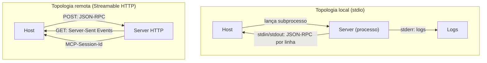

# Capítulo 3 — Transportes: do stdio ao Streamable HTTP

## 1. Introdução

O Capítulo 2 estabeleceu a arquitetura host/client/server — quem coordena, quem transporta e quem executa [2]. Este capítulo desce ao nível mais físico do protocolo: o transporte, o mecanismo que carrega as mensagens JSON-RPC entre client e server [2][3]. A tese é direta: o MCP suporta dois transportes principais — stdio para integrações locais e Streamable HTTP para integrações remotas — e a escolha entre eles decide características fundamentais do sistema: onde o server vive, como é autenticado, como escala e como falha [3]. O engenheiro que domina os transportes não apenas conecta servidores — ele escolhe a topologia certa para cada cenário [2][3]. A evolução da especificação documenta a maturidade: o transporte HTTP+SSE legado deu lugar ao Streamable HTTP a partir da versão 2024-11-05, com melhorias de sessão, resumibilidade e segurança [3].

## 2. Explica

### 2.1 O Que é um Transporte

O transporte é a camada de comunicação entre client e server [3]. O MCP define mensagens — JSON-RPC 2.0 — independentes do transporte [2][3]. A mesma mensagem pode viajar por canais diferentes: um pipe de processo (stdio) ou a rede HTTP [3]. A separação entre mensagem e transporte é um design clássico de protocolos [3]. O transport defines o formato das mensagens na linha, mas não o seu significado [3]. O significado é definido pela especificação do protocolo; o transporte é o canal [2][3]. O engenheiro MCP escolhe o transporte pela natureza da integração — local ou remota [3].

### 2.2 O Transporte stdio: O Canal Local

O transporte stdio é o padrão para integrações locais [3]. O client lança o server como um subprocesso na mesma máquina e se comunica pelo stdin (entrada padrão) e stdout (saída padrão) [3]. As mensagens são JSON-RPC 2.0 delimitadas por nova linha [3]. Os logs de diagnóstico vão para o stderr (saída de erro padrão) — separando o ruído da comunicação [3]. O stdio tem vantagens claras [3]. Primeiro, **simplicidade**: sem rede, sem portas, sem DNS — apenas um processo filho [3]. Segundo, **segurança por isolamento**: o server vive na máquina do host, com os privilégios locais [3]. Terceiro, **baixa latência**: sem overhead de rede [3]. O stdio é o transporte do quickstart oficial — o servidor de clima do tutorial roda localmente [11].

### 2.3 O Transporte Streamable HTTP: O Canal Remoto

O Streamable HTTP é o padrão para integrações remotas [3]. O server é um serviço HTTP acessível por rede [3]. O transporte tem duas operações fundamentais [3]. Primeiro, **POST**: o client envia mensagens JSON-RPC ao server [3]. Segundo, **GET**: o client abre um fluxo persistente de Server-Sent Events (SSE) para receber mensagens do server [3]. O Streamable HTTP substituiu o transporte legado HTTP+SSE na versão 2024-11-05 [3]. A evolução trouxe melhorias estruturais [3]: sessão explícita via header `MCP-Session-Id`, resumibilidade de eventos via `Last-Event-ID` e validação de `Origin` contra ataques de DNS rebinding [3]. O transporte remoto é o que permite servers compartilhados, escalados e governados centralmente [3].

### 2.4 As Diferenças Decisivas Entre os Transportes

A escolha entre stdio e Streamable HTTP é uma decisão de arquitetura com diferenças decisivas [3]. Primeiro, **localidade**: stdio exige o server na máquina do host; HTTP permite server em qualquer lugar da rede [3]. Segundo, **autenticação**: stdio confia no processo local; HTTP exige autenticação na camada de transporte — OAuth 2.1 e PKCE [6][3]. Terceiro, **escala**: stdio escala por processo; HTTP escala por serviço [3]. Quarto, **governança**: HTTP permite controle centralizado — um server atende muitos hosts [3]. Quinto, **falha**: stdio falha com o processo; HTTP introduz latência de rede e pontos de falha remotos [3]. O engenheiro maduro escolhe pelo cenário, não pela preferência [3].

### 2.5 O Ciclo de Vida da Sessão no HTTP

O Streamable HTTP introduz o conceito explícito de sessão [3]. O client inicia com uma requisição POST contendo a mensagem `initialize` [3]. O server responde e atribui um `MCP-Session-Id` [3]. As mensagens subsequentes carregam o id no header, mantendo o estado da sessão [3]. A sessão permite resumibilidade: se a conexão cai, o client retoma com `Last-Event-ID` [3]. A sessão explícita é a evolução sobre o transporte legado, que era stateless e mais frágil [3]. O gerenciamento de sessão é uma competência central do engenheiro de servers remotos [3].

### 2.6 A Segurança no Nível do Transporte

A segurança começa no transporte [3][6]. No stdio, a segurança é local: o host controla o processo e seus privilégios [3]. No HTTP, a segurança é de rede: autenticação, TLS, validação de origem [3][6]. O Streamable HTTP valida o header `Origin` para mitigar ataques de DNS rebinding — uma vulnerabilidade do transporte legado [3]. A autenticação remota usa OAuth 2.1 com PKCE, conforme o padrão de autorização do MCP [6]. O engenheiro que projeta servers remotos trata o transporte como a primeira camada de defesa [3][6].

### 2.7 A Evolução da Especificação de Transportes

A especificação de transportes evoluiu junto com o protocolo [3]. A versão 2024-11-05 estabeleceu o stdio e o HTTP+SSE [3]. A versão 2025-11-25 consolidou o Streamable HTTP como transporte remoto padrão [3]. A versão 2026-07-28 manteve o núcleo estável [3][4]. A evolução demonstra um princípio: transportes mudam, protocolo permanece [2][3]. O engenheiro que separa mentalmente mensagem de transporte absorve as mudanças sem retrabalho [3].

### 2.8 Transporte e Topologia: Local vs. Remoto na Prática

A escolha do transporte define a topologia do sistema [3]. A topologia **toda local**: host e servers na mesma máquina, tudo via stdio — ideal para desenvolvimento e ferramentas pessoais [3][11]. A topologia **híbrida**: servers locais para dados sensíveis e servers remotos para serviços compartilhados [3]. A topologia **toda remota**: servers centralizados acessados por muitos hosts — ideal para governança corporativa [3][15]. O Capítulo 7 retomará a topologia ao consumir o ecossistema [3][22].

## 3. Ilustra

### 3.1 A Analogia do Telefone e do Correio

A analogia dos canais de comunicação ilumina a diferença entre os transportes [3]. O stdio é como um telefone interno: uma linha dedicada entre dois pontos na mesma casa — rápida, simples e privada [3]. O Streamable HTTP é como o correio: mensagens que viajam por uma rede compartilhada, endereçadas e com controle de entrega [3]. A analogia funciona em profundidade [3]. O telefone interno não exige endereço — a linha é o endereço [3]. O correio exige endereço, verificação e registro [3]. Da mesma forma, o stdio não exige autenticação de rede; o HTTP exige [3][6].

### 3.2 O Diagrama dos Dois Transportes

O diagrama abaixo representa os dois transportes e seus fluxos [3].



O diagrama mostra a simetria funcional e a diferença física [3]. Os dois transportes carregam as mesmas mensagens JSON-RPC; o que muda é o canal [3]. A topologia local é um processo; a remota é um serviço [3]. A escolha do canal é a escolha da topologia [3].

### 3.3 O Antes e o Depois na Prática

A comparação concreta ajuda a fixar o conceito [3]. **Antes (HTTP+SSE legado)**: sessão implícita, reconexão frágil e vulnerabilidade a DNS rebinding [3]. **Depois (Streamable HTTP)**: sessão explícita via `MCP-Session-Id`, resumibilidade via `Last-Event-ID` e validação de `Origin` [3]. A diferença não está na funcionalidade — está na robustez e na segurança do canal remoto [3].

## 4. Técnica

### 4.1 O Cliente stdio em Código

O primeiro instrumento do engenheiro é o cliente stdio [3]. O código abaixo demonstra a comunicação com um server local via subprocesso [3]:

```python
import subprocess
import json


class ClientStdio:
    """Client MCP sobre o transporte stdio (subprocesso local)."""

    def __init__(self, comando: list):
        self.process = subprocess.Popen(
            comando,
            stdin=subprocess.PIPE,
            stdout=subprocess.PIPE,
            stderr=subprocess.PIPE,
            text=True,
        )
        self._id = 0

    def enviar(self, metodo: str, params: dict = None) -> dict:
        self._id += 1
        mensagem = {"jsonrpc": "2.0", "id": self._id, "method": metodo}
        if params:
            mensagem["params"] = params
        linha = json.dumps(mensagem)
        self.process.stdin.write(linha + "\n")
        self.process.stdin.flush()
        resposta = json.loads(self.process.stdout.readline())
        if "error" in resposta:
            raise RuntimeError(f"MCP error: {resposta['error']}")
        return resposta["result"]

    def iniciar(self):
        self.enviar("initialize", {
            "protocolVersion": "2025-11-25",
            "capabilities": {},
            "clientInfo": {"name": "client-stdio", "version": "1.0.0"},
        })
        self.process.stdin.write(json.dumps({
            "jsonrpc": "2.0", "method": "notifications/initialized",
        }) + "\n")
        self.process.stdin.flush()

    def listar_ferramentas(self):
        return self.enviar("tools/list")

    def encerrar(self):
        self.process.terminate()
        self.process.wait()
```

O cliente stdio demonstra o coração do transporte local: subprocesso, JSON-RPC por linha no stdin/stdout e logs separados no stderr [3]. O padrão de produção usa o SDK oficial, mas a mecânica subjacente é esta [3][8][10].

### 4.2 O Servidor Streamable HTTP em Pseudocódigo

O segundo instrumento é o servidor remoto [3]. O código abaixo modela o endpoint HTTP com sessão explícita [3]:

```python
import json
import uuid


class ServidorStreamableHTTP:
    """Servidor MCP sobre Streamable HTTP (POST + SSE + sessão)."""

    def __init__(self):
        self.sessoes = {}
        self.ferramentas = {}

    def handle_post(self, mensagem: dict, session_id: str | None) -> dict:
        """Processa uma mensagem JSON-RPC enviada por POST."""
        # Sessão explícita: cria se não existir
        if not session_id:
            session_id = uuid.uuid4().hex
            self.sessoes[session_id] = {"estado": "inicializando"}
        metodo = mensagem.get("method")
        if metodo == "initialize":
            self.sessoes[session_id]["estado"] = "ativo"
            return {
                "session_id": session_id,
                "result": {
                    "protocolVersion": "2025-11-25",
                    "capabilities": {"tools": {}},
                    "serverInfo": {"name": "server-http", "version": "1.0.0"},
                },
            }
        if metodo == "tools/list":
            return {"session_id": session_id,
                    "result": {"tools": list(self.ferramentas.values())}}
        return {"session_id": session_id,
                "error": {"code": -32601, "message": "Método não encontrado"}}

    def handle_get(self, session_id: str):
        """Abre o fluxo de Server-Sent Events para o cliente."""
        eventos = [f"event: message\ndata: {json.dumps({'ping': True})}\n\n"]
        return {"session_id": session_id, "stream": "".join(eventos)}
```

O servidor demonstra o coração do transporte remoto: POST para mensagens, GET para o fluxo SSE e sessão explícita via `MCP-Session-Id` [3]. A sessão explícita é a evolução sobre o transporte legado [3]. A validação de `Origin` e a autenticação OAuth seriam adicionadas na camada HTTP de produção [3][6].

### 4.3 O Diagrama de Escolha de Transporte

O terceiro instrumento concretiza a decisão de arquitetura [3]. O código abaixo implementa a árvore de decisão de transporte [3]:

```python
def escolher_transporte(server_local: bool, escala: bool, governanca: bool) -> str:
    """Decide o transporte com base em três critérios.

    server_local: o server vive na máquina do host?
    escala: o server precisa atender muitos hosts?
    governanca: o acesso precisa ser controlado centralmente?
    """
    if server_local and not escala:
        return "stdio"
    if escala or governanca:
        return "streamable-http"
    return "stdio"


def explicar_decisao(server_local: bool, escala: bool, governanca: bool) -> dict:
    transporte = escolher_transporte(server_local, escala, governanca)
    razoes = []
    if not server_local:
        razoes.append("server remoto exige HTTP")
    if escala:
        razoes.append("escala por serviço exige HTTP")
    if governanca:
        razoes.append("controle centralizado exige HTTP")
    if transporte == "stdio":
        razoes.append("integração local simples e segura")
    return {"transporte": transporte, "razoes": razoes}


if __name__ == "__main__":
    print(explicar_decisao(server_local=True, escala=False, governanca=False))
    print(explicar_decisao(server_local=False, escala=True, governanca=True))
```

A árvore de decisão captura a regra de ouro: local e simples → stdio; remoto, escalado ou governado → HTTP [3]. A decisão é reversível em arquiteturas bem separadas — mensagem independente do transporte [3].

## 5. Aplica

### 5.1 Onde Isso Vive no Mundo Real

Os transportes MCP estão em toda parte em 2026 [3][22]. Ferramentas de desenvolvimento usam stdio para servers locais de repositórios [14]. Plataformas corporativas usam Streamable HTTP para servers centralizados [22]. O registro oficial cataloga servers para ambos os transportes [12][14]. A nuvem hospeda servers remotos que atendem muitos hosts [3][22]. A escolha do transporte é uma das primeiras decisões de qualquer integração MCP [3].

### 5.2 O Erro Comum do Iniciante

O erro mais comum de quem começa é usar HTTP onde o stdio bastaria — ou o inverso [3]. O iniciante publica um server remoto para uma integração pessoal local, adicionando autenticação, rede e latência desnecessárias [3]. Ou conecta um server corporativo via stdio, perdendo governança e escala [3]. Outro erro clássico: ignorar a sessão no HTTP — tratando o transporte remoto como stateless [3]. A lição é a mesma dos capítulos anteriores: a escolha técnica errada cobra juros em produção [3].

### 5.3 O Padrão Profissional em 2026

O padrão profissional em 2026 escolhe transporte pelo cenário [3]. Desenvolvimento local: stdio — rápido e simples [3][11]. Serviços compartilhados: Streamable HTTP — com OAuth 2.1, sessão explícita e validação de origem [3][6]. Governança centralizada: HTTP com auditoria de acesso [3][15]. O engenheiro documenta a decisão — por que este transporte, com quais controles [3][6]. O resultado é um sistema em que cada integração usa o canal adequado [3].

### 5.4 Como Este Livro é Organizado

Este capítulo estabeleceu os transportes; os próximos constroem sobre eles [3]. O Capítulo 4 detalha as primitivas que os transportes carregam [4][5]. Os Capítulos 5 e 6 ensinam a construir servers — com stdio e HTTP [7][8]. O Capítulo 7 ensina a consumir o ecossistema remoto [22]. Os Capítulos 8 e 9 cobrem a segurança — fortemente ligada ao transporte [6][15][16]. O Capítulo 10 sintetiza a disciplina [15][19]. O transporte é o canal de toda a jornada [3].

### 5.5 O stdio e o Desenvolvimento Local

O leitor que desenvolve agentes localmente vive no mundo do stdio [3][11]. O fluxo de desenvolvimento é o do quickstart oficial: escrever o server, lançá-lo via subprocesso e iterar [11]. O stdio torna o ciclo rápido: sem rede, sem deploy, sem credenciais [3]. O padrão profissional adiciona disciplina ao desenvolvimento local [3]. Os logs vão ao stderr, separados do protocolo [3]. O server é testado como subprocesso nos testes de integração [3]. A saída do protocolo é validada contra a especificação [3]. O desenvolvimento local bem disciplinado é a base de servers que sobrevivem ao remoto [3].

A transição do local para o remoto é o teste da separação mensagem-transporte [3]. Um server bem escrito — com a lógica de negócio separada do canal — migra de stdio para HTTP com mudança mínima [3][8]. O engenheiro que escreve servers transport-aware desde o início colhe a migração simples [3].

### 5.6 O HTTP e a Governança Corporativa

O Streamable HTTP é o transporte da governança corporativa [3][15]. Servers remotos centralizados permitem controle de acesso, auditoria e escala [3][15]. A governança tem camadas [15]. Primeiro, **autenticação**: OAuth 2.1 com PKCE para conexões remotas [6]. Segundo, **autorização**: escopos mínimos por host [6][15]. Terceiro, **auditoria**: registro de acesso e uso [6][20]. Quarto, **isolamento**: fronteiras de confiança entre o server e os sistemas downstream [15]. O CIS Companhion Guide aplica os controles de rede e identidade ao transporte remoto [20]. A governança do transporte é parte da disciplina de MCP Engineering [15][19].

### 5.7 O Custo dos Transportes: Local vs. Remoto

A escolha do transporte tem custos diferentes [3]. O stdio custa pouco: um processo, sem infraestrutura [3]. O HTTP custa mais: serviço, TLS, autenticação, monitoramento [3][6]. O custo do HTTP se paga quando a escala ou a governança exigem [3]. O engenheiro que entende a economia projeta na escala certa [3]. Uma integração pessoal não justifica infraestrutura remota; uma integração corporativa não sobrevive sem ela [3][15].

### 5.8 O Roteiro de Implementação de Transportes

A implementação de transportes é um processo em fases [3]. A primeira fase é a **decisão**: escolher o transporte pelo cenário (árvore da seção 4.3) [3]. A segunda é a **implementação**: construir o canal com o SDK oficial [7][8][10]. A terceira é a **segurança**: autenticação e validação de origem no remoto [3][6]. A quarta é a **operação**: monitorar sessões e reconexões [3]. A quinta é a **evolução**: revisar a decisão quando o cenário muda [3]. Cada fase tem entregável e critério de aceite [3].

### 5.9 Os Transportes e a Revisão Autônoma

A revisão autônoma entre harness depende dos transportes [1][3]. O revisor consulta servers de repositórios — localmente via stdio no desenvolvimento, remotamente via HTTP em produção [3][14]. O acesso padronizado permite que o revisor use os mesmos servers que o executor [3]. A sessão explícita do HTTP permite auditoria — qual revisão consultou qual server [3][6]. Os transportes são a infraestrutura silenciosa da revisão autônoma [1][3].

### 5.10 Os Transportes e a Interface com a Rede

O transporte HTTP expõe o sistema à realidade da rede [3]. O primeiro princípio é a **tolerância**: o server remoto precisa tolerar latência, flutuação e quedas [3]. O segundo é a **resumibilidade**: a sessão com `Last-Event-ID` retoma sem perder eventos [3]. O terceiro é a **segurança de rede**: TLS, validação de origem e autenticação [3][6]. O quarto é a **observabilidade**: métricas de sessão, latência e erros [3][20]. O engenheiro que projeta servers remotos trata a rede como ambiente hostil [3][6].

### 5.11 O Caso da Migração Mal Planejada

Para fechar com uma aplicação concreta, este estudo de caso mostra a migração mal planejada de transporte [3]. O cenário: uma equipe publica um server local como serviço remoto para atender novos hosts — sem revisar autenticação e sessão [3]. O primeiro sintoma: hosts não conseguem manter sessões — reconexões constantes [3]. O segundo sintoma: falhas de autenticação intermitentes — o OAuth não foi configurado no novo canal [3][6]. O terceiro sintoma: a auditoria mostra acessos não autorizados — a validação de origem não foi ativada [3][6].

O diagnóstico correto: a migração ignorou as exigências do transporte remoto [3]. O tratamento: configurar OAuth 2.1, sessão explícita e validação de origem [3][6]. A lição do caso é a cascata: um atalho de publicação criou instabilidade; a instabilidade causou falhas de autenticação; a falta de validação expôs o acesso [3][6]. O caso demonstra o tema do capítulo: o transporte não é um detalhe — é a fronteira física do sistema [3][6].

### 5.12 Os Transportes e a Interface com os Modelos

Os transportes interagem com a diversidade de modelos [1][3]. O stdio serve ao desenvolvimento local com qualquer modelo [3]. O HTTP serve à produção com modelos e hosts variados [3]. O primeiro princípio é a **neutralidade**: o transporte não depende do modelo [3]. O segundo é a **compatibilidade**: hosts diferentes consomem o mesmo server pelo mesmo transporte [3]. O terceiro é a **observabilidade**: o transporte registra qual host consultou [6][20]. A interface transporte-modelo é transparente — e isso é um sinal de bom design de protocolo [3].

### 5.13 O Manual do Diagnóstico Rápido dos Transportes

O capítulo fecha com o manual do diagnóstico rápido dos transportes [3]. O primeiro item é a **escolha**: o transporte é adequado ao cenário (local vs. remoto)? [3]. O segundo é a **sessão**: o handshake inicializa e a sessão persiste? [3]. O terceiro é a **resumibilidade**: a reconexão retoma sem perda? [3]. O quarto é a **segurança**: autenticação, TLS e validação de origem no remoto? [3][6].

O quinto item é a **separação**: logs e protocolo não se misturam? [3]. O sexto é a **observabilidade**: métricas de latência e erro existem? [3][20]. O sétimo é a **auditoria**: o acesso é registrado? [6][20]. O oitavo é a **evolução**: a decisão é revisitada quando o cenário muda? [3]. O manual é o resumo operacional do transporte: cada item aponta o capítulo que o desenvolve [3]. O engenheiro que percorre o manual em minutos evita dias de depuração de rede [3].

### 5.14 Os Transportes e os Limites Éticos do Acesso Remoto

O transporte remoto cria implicações éticas [3][6]. O primeiro limite é o da **fronteira de dados**: servidores remotos movem dados pela rede — o engenheiro controla o que trafega [3][6]. O segundo é o da **retenção**: sessões e logs guardam dados de acesso [6][20]. O terceiro é o do **consentimento**: hosts autorizam explicitamente o acesso remoto [6]. O quarto é o da **auditoria**: o uso remoto é registrado para responsabilização [6][20]. A ética do transporte é uma dimensão de cada decisão deste livro [3][6].

### 5.15 O Futuro dos Transportes

Os transportes MCP evoluem [3]. O stdio permanece como padrão local [3]. O Streamable HTTP consolida-se como padrão remoto [3]. As tendências visíveis apontam a evolução [3]. A primeira é a **sessão padronizada**: o modelo de sessão explícito se aperfeiçoa [3]. A segunda é a **segurança formalizada**: OAuth e validação de origem viram padrão exigido [6][19][21]. A terceira é a **interoperabilidade**: transportes conversam entre si por gateways [3]. O engenheiro que domina os fundamentos não será surpreendido pelas tendências [3].

### 5.16 O Fechamento do Capítulo

O capítulo se encerra com a consolidação dos transportes [3]. O stdio é o canal local — simples, isolado e rápido [3]. O Streamable HTTP é o canal remoto — escalável, governável e com sessão explícita [3]. A separação mensagem-transporte é o design que permite a evolução [2][3]. O próximo capítulo sobe uma camada: as primitivas que os transportes carregam — tools, resources e prompts [4][5].

### 5.17 O Transporte e a Experiência do Desenvolvedor

O transporte decide a experiência do desenvolvedor — e a escolha certa economiza dias [3][11]. O stdio oferece o ciclo mais rápido: sem deploy, sem credenciais, sem rede [3][11]. O desenvolvedor itera em segundos [11]. O Streamable HTTP oferece o ciclo real: o server como serviço, com autenticação e rede [3]. A transição do local para o remoto é o momento em que a experiência muda [3][11].

O padrão profissional gerencia a transição com cuidado [3][11]. Primeiro, o **desenvolvimento no stdio**: o ciclo esqueleto-capacidade-teste roda localmente [11]. Segundo, a **preparação para o remoto**: a lógica de negócio fica separada do transporte desde o início [3]. Terceiro, a **publicação controlada**: o server remoto nasce com autenticação e auditoria [3][6]. A transição bem gerenciada preserva a produtividade do desenvolvimento [3][11].

O engenheiro que entende a experiência de cada transporte projeta fluxos de desenvolvimento produtivos [3][11]. A frustração comum — servidores que falham em produção porque nunca rodaram no ambiente real — é evitada com a preparação para o remoto [3][6]. O transporte é a primeira decisão que o desenvolvedor sente [3].

### 5.18 O Transporte e a Observabilidade

O transporte é a fonte primária de observabilidade do MCP [3][20]. Cada transporte oferece pontos de medição [3]. No stdio, o stderr carrega os logs [3]. No HTTP, as métricas de sessão, latência e erro são coletadas na camada de serviço [3][20]. O engenheiro que instrumenta o transporte enxerga a saúde da integração [3][20].

A observabilidade do transporte tem camadas [3][20]. Primeiro, a **conectividade**: o handshake inicializa, a sessão persiste [3]. Segundo, a **latência**: o tempo de cada mensagem [3]. Terceiro, a **confiabilidade**: reconexões, timeouts e erros [3]. Quarto, a **segurança**: falhas de autenticação e validação [3][6]. O CIS Companhion Guide estabelece o logging como controle [20]. O engenheiro que mede o transporte detecta problemas antes do usuário [3][20].

A observabilidade do transporte alimenta o diagnóstico do Capítulo 8 [3][6]. Quando uma integração falha, a primeira pergunta é do transporte: a conexão está viva? [3]. A segunda é da sessão: o estado está correto? [3]. A terceira é da segurança: a autenticação passou? [3][6]. O transporte é o primeiro lugar onde o problema aparece [3].

### 5.19 O Transporte e a Portabilidade entre Ambientes

O transporte MCP introduz uma propriedade operacional valiosa: a portabilidade entre ambientes [3]. O mesmo server roda no desenvolvimento (stdio), nos testes (stdio) e em produção (HTTP) [3]. A portabilidade exige disciplina [3]. A lógica de negócio não depende do transporte [3]. A configuração muda por ambiente [3]. O server é o mesmo — o canal é diferente [3].

A portabilidade entre ambientes tem implicações de prática [3][6]. Primeiro, a **configuração por ambiente**: credenciais e endpoints vêm de configuração, não de código [3][6]. Segundo, a **paridade de comportamento**: o que funciona no stdio funciona no HTTP [3]. Terceiro, a **testabilidade**: os testes rodam em qualquer transporte [3]. O engenheiro que projeta para a portabilidade constrói servers que sobrevivem à jornada dev→prod [3].

A portabilidade é a prova prática da separação mensagem-transporte do Capítulo 3 [3]. O engenheiro que domina a separação move servers entre ambientes sem sustos [3]. A portabilidade entre ambientes é o que torna o MCP uma infraestrutura confiável [3].

### 5.20 O stdio e a Segurança Local

O transporte stdio tem um perfil de segurança próprio — a segurança por isolamento local [3][6]. O server roda como processo local, com os privilégios do usuário [3]. A superfície de ataque é menor: sem rede, sem exposição pública [3]. A segurança local tem vantagens e riscos [3][6].

A segurança local tem características [3][6]. Primeiro, o **acesso físico**: quem controla a máquina controla o server [3]. Segundo, a **herança de privilégios**: o server tem o que o usuário tem [3][6]. Terceiro, a **ausência de autenticação de rede**: o processo local não autentica via OAuth [3]. O risco principal é o server malicioso: um binário local malicioso roda com os privilégios do usuário (Capítulo 9) [16][3].

A defesa no stdio tem camadas [3][6]. Primeiro, a **origem verificada**: o binário vem de fonte confiável [6]. Segundo, a **menor superfície**: o server expõe apenas o necessário [6]. Terceiro, a **consciência do usuário**: o usuário sabe o que o server pode fazer [6][20]. O engenheiro que entende a segurança do stdio escolhe o transporte com ciência [3][6].

### 5.21 O HTTP e a Resiliência de Rede

O transporte HTTP introduz a realidade da rede — e a resiliência é a disciplina da resposta [3][20]. A rede é instável por natureza [3]. A latência varia [3]. As conexões caem [3]. O engenheiro de servers remotos projeta para a resiliência [3].

A resiliência de rede tem práticas [3]. Primeiro, os **timeouts**: cada operação tem limite de tempo [3]. Segundo, as **reconexões**: o client retoma com `Last-Event-ID` [3]. Terceiro, a **retry com backoff**: tentativas com espera progressiva [3]. Quarto, a **degradação graciosa**: a falha de rede reduz a funcionalidade sem derrubar o sistema [2][3]. O engenheiro que projeta para a resiliência constrói servers que sobrevivem [3].

A resiliência de rede interage com a observabilidade (seção 5.18) [3][20]. As métricas de reconexão e timeout alimentam o diagnóstico [3][20]. O engenheiro que mede a resiliência a melhora [3]. A resiliência é o que separa o server amador do profissional [3].

### 5.22 O Transporte e a Decisão de Arquitetura Documentada

A escolha do transporte é uma decisão de arquitetura — e as decisões de arquitetura se documentam [3][15]. A documentação da decisão responde a perguntas [3]. Por que stdio? [3]. Por que HTTP? [3]. Com quais controles? [3]. O documento registra a racionalidade para a equipe futura [3][15].

A documentação da decisão tem benefícios [3][15]. Primeiro, a **memória**: a equipe entende por que a escolha foi feita [3]. Segundo, a **revisão**: a decisão é reavaliada quando o contexto muda [3]. Terceiro, a **governança**: a escolha é auditável [6][15]. O engenheiro que documenta as decisões constrói sistemas compreensíveis [3][15].

A decisão documentada é parte do MCP Engineering (Capítulo 10) [6][15]. O registro de decisões de arquitetura (ADR) é a prática [3][15]. O engenheiro que domina a documentação transforma escolhas em conhecimento organizacional [3][15].

### 5.23 O stdio e o Debug do Protocolo

O transporte stdio oferece uma vantagem prática para o debug: a simplicidade [3][7]. O debug no stdio é direto [3]. Os logs vão ao stderr, separados do protocolo [3]. O desenvolvedor inspeciona a linha a linha [3]. As mensagens JSON-RPC são legíveis [3]. O engenheiro que domina o debug no stdio diagnostica rápido [3][7].

O debug do protocolo tem práticas [3][7]. Primeiro, a **inspeção das mensagens**: o fluxo JSON-RPC é examinado [3]. Segundo, a **separação dos logs**: o stderr mostra o domínio, o stdout mostra o protocolo [3]. Terceiro, a **reprodução**: o caso é reproduzido em isolamento [3][7]. O engenheiro que depura com método resolve em horas, não em dias [3][7].

O debug no stdio prepara para o debug remoto [3][7]. O servidor bem depurado localmente migra com menos surpresas [3]. A disciplina do debug é transferível [3]. O engenheiro que domina o debug constrói servers que os outros conseguem manter [3][7].

### 5.24 O Transporte e o Trade-off de Latência

A latência é um trade-off central entre os transportes [3]. O stdio tem latência mínima — o processo é local [3]. O HTTP adiciona latência de rede [3]. A diferença importa em tarefas sensíveis ao tempo [3]. O engenheiro que escolhe o transporte considera a latência [3].

O trade-off de latência tem nuances [3]. A latência de rede é variável [3]. A latência do servidor domina em tarefas pesadas [3]. A latência de fila aparece sob carga [3]. O engenheiro mede antes de decidir [3][20]. O perfil de latência do cenário decide o transporte [3].

O trade-off de latência interage com a arquitetura [2][3]. A latência adicional pode ser mitigada por design [3]. Servers remotos com cache reduzem a latência de dados [3][2]. O engenheiro que entende o trade-off projeta a experiência de resposta certa [3][2].

### 5.25 O Transporte e a Estratégia de Deploy

O transporte define a estratégia de deploy do server [3]. O deploy no stdio é trivial — não há deploy [3][11]. O deploy no HTTP é um processo [3]. A estratégia de deploy tem etapas [3][6]. Primeiro, a **preparação**: o server é empacotado e configurado [3]. Segundo, a **segurança**: TLS e credenciais no ambiente [3][6]. Terceiro, a **publicação**: o server sobe e é verificado [3]. Quarto, o **monitoramento**: a saúde é observada [3][20]. O engenheiro que planeja o deploy constrói lançamentos confiáveis [3][6].

A estratégia de deploy interage com a governança [3][6][15]. O deploy em produção segue processo e aprovação [6]. A configuração de produção é auditada [6][20]. O rollback é planejado [3]. O engenheiro que domina a estratégia de deploy publica com segurança [3][6].

A estratégia de deploy é a ponte entre o desenvolvimento (Capítulos 5-6) e a operação (Capítulo 10) [3][7][6]. O deploy é o momento em que o server encontra a produção [3]. O engenheiro que planeja o momento constrói sistemas que sobrevivem ao lançamento [3][6].

### 5.26 O Transporte e o Custo Total de Operação

O transporte decide parte do custo total de operação do server [3]. O stdio tem custo baixo: um processo, sem infraestrutura [3]. O HTTP tem custo de operação: serviço, rede, autenticação, monitoramento [3][6]. O custo total inclui o custo da falha [3]. A queda do server remoto custa mais que a do local [3]. O engenheiro que calcula o custo total escolhe o transporte com economia [3].

O custo total de operação tem componentes [3][6][20]. A infraestrutura [3]. O monitoramento [3][20]. A segurança [6]. O suporte [3]. A energia de operação [6]. O engenheiro que mede os componentes decide com dados [3].

O custo total de operação é parte da decisão de arquitetura documentada (seção 5.22) [3][15]. A decisão registra os custos [3][15]. A revisão reavalia os custos [3][15]. O engenheiro que domina a economia do transporte projeta sistemas sustentáveis [3][6].

### 5.27 O Transporte e a Preparação para o Futuro

O transporte escolhido hoje deve sobreviver ao amanhã [3]. A especificação MCP evolui — e os transportes evoluem com ela [3]. A preparação para o futuro tem princípios [3]. Primeiro, a **separação**: a mensagem é independente do transporte [3]. Segundo, a **abstração**: o domínio não conhece o canal [3]. Terceiro, a **revisão**: a escolha do transporte é reavaliada [3][15]. O engenheiro que prepara para o futuro constrói servers portáveis [3].

A preparação para o futuro tem práticas [3][15]. O registro das decisões (seção 5.22) [3][15]. O monitoramento do padrão [3]. O teste de migração [3]. O engenheiro que pratica a preparação reduz o custo da mudança futura [3][15].

A preparação para o futuro fecha o Capítulo 3 [3]. O transporte é o canal de hoje e de amanhã [3]. O engenheiro que domina a preparação constrói sistemas que evoluem [3][15].

## 6. Conclusão

Os transportes são o canal físico do MCP [3]. Este capítulo estabeleceu a diferença decisiva: o stdio para integrações locais — subprocesso, JSON-RPC por linha, simplicidade e isolamento — e o Streamable HTTP para integrações remotas — POST, SSE, sessão explícita e segurança de rede [3]. A separação mensagem-transporte permite que o protocolo evolua sem quebrar a aplicação [2][3]. O próximo capítulo sobe uma camada: as três primitivas que os transportes carregam [4][5].

## 7. Referências

[1] ANTHROPIC. Introducing the Model Context Protocol. Anthropic News, 25 nov. 2024. Disponível em: https://www.anthropic.com/news/model-context-protocol. Acesso em: 5 ago. 2026.
[2] MODEL CONTEXT PROTOCOL. Architecture. MCP Specification 2025-11-25, 25 nov. 2025. Disponível em: https://modelcontextprotocol.io/specification/2025-11-25/architecture. Acesso em: 5 ago. 2026.
[3] MODEL CONTEXT PROTOCOL. Basic Specification: Transports. MCP Specification 2025-11-25, 2025. Disponível em: https://modelcontextprotocol.io/specification/2025-11-25/basic/transports. Acesso em: 5 ago. 2026.
[4] MODEL CONTEXT PROTOCOL. Specification 2026-07-28: Server Tools. MCP Specification, 28 jul. 2026. Disponível em: https://modelcontextprotocol.io/specification/2026-07-28/server/tools. Acesso em: 5 ago. 2026.
[5] MODEL CONTEXT PROTOCOL. Specification 2026-07-28: Server Resources. MCP Specification, 28 jul. 2026. Disponível em: https://modelcontextprotocol.io/specification/2026-07-28/server/resources. Acesso em: 5 ago. 2026.
[6] MODEL CONTEXT PROTOCOL. Security Best Practices (Draft). MCP Specification. Disponível em: https://modelcontextprotocol.io/specification/draft/basic/security_best_practices. Acesso em: 5 ago. 2026.
[7] MODEL CONTEXT PROTOCOL. TypeScript SDK. GitHub Repository, 2026. Disponível em: https://github.com/modelcontextprotocol/typescript-sdk. Acesso em: 5 ago. 2026.
[8] MODEL CONTEXT PROTOCOL. Python SDK. GitHub Repository, 2026. Disponível em: https://github.com/modelcontextprotocol/python-sdk. Acesso em: 5 ago. 2026.
[9] MODEL CONTEXT PROTOCOL. TypeScript SDK Documentation. MCP SDK Portal, 2026. Disponível em: https://ts.sdk.modelcontextprotocol.io/. Acesso em: 5 ago. 2026.
[10] MODEL CONTEXT PROTOCOL. Python SDK Documentation. MCP SDK Portal, 2026. Disponível em: https://py.sdk.modelcontextprotocol.io/. Acesso em: 5 ago. 2026.
[11] MODEL CONTEXT PROTOCOL. Quickstart Guide. MCP Documentation. Disponível em: https://modelcontextprotocol.io/docs/quickstart/quickstart. Acesso em: 5 ago. 2026.
[12] MODEL CONTEXT PROTOCOL. MCP Registry Preview. Official MCP Blog, 8 set. 2025. Disponível em: https://blog.modelcontextprotocol.io/posts/2025-09-08-mcp-registry-preview/. Acesso em: 5 ago. 2026.
[13] MODEL CONTEXT PROTOCOL. Registry Repository. GitHub Repository, 2025–2026. Disponível em: https://github.com/modelcontextprotocol/registry. Acesso em: 5 ago. 2026.
[14] GITHUB. GitHub MCP Registry: the fastest way to discover AI tools. GitHub Changelog, 16 set. 2025. Disponível em: https://github.blog/changelog/2025-09-16-github-mcp-registry-the-fastest-way-to-discover-ai-tools/. Acesso em: 5 ago. 2026.
[15] CLOUD SECURITY ALLIANCE. Agentic MCP Security Best Practices Guide v1. CSA Labs, 27 mar. 2026. Disponível em: https://labs.cloudsecurityalliance.org/agentic/agentic-mcp-security-best-practices-v1/. Acesso em: 5 ago. 2026.
[16] INVARIANT LABS. MCP Security Notification: Tool Poisoning Attacks. Invariant Labs Blog, 1 abr. 2025. Disponível em: https://invariantlabs.ai/blog/mcp-security-notification-tool-poisoning-attacks. Acesso em: 5 ago. 2026.
[17] WILLISON, Simon. Model Context Protocol has prompt injection security problems. Simon Willison's Weblog, 9 abr. 2025. Disponível em: https://simonwillison.net/2025/Apr/9/mcp-prompt-injection/. Acesso em: 5 ago. 2026.
[18] WANG, Zhen et al. (Tsinghua University & Ant Group). Systematic Analysis of MCP Security (MCPLib). arXiv:2508.12538, 18 ago. 2025. Disponível em: https://arxiv.org/html/2508.12538v1. Acesso em: 5 ago. 2026.
[19] CISA. Guide to Secure Adoption of Agentic AI. CISA News, 1 mai. 2026. Disponível em: https://www.cisa.gov/news-events/news/cisa-us-and-international-partners-release-guide-secure-adoption-agentic-ai. Acesso em: 5 ago. 2026.
[20] CENTER FOR INTERNET SECURITY (CIS). Model Context Protocol (MCP) Companion Guide — CIS Controls v8.1. CIS White Papers, 20 abr. 2026. Disponível em: https://www.cisecurity.org/insights/white-papers/controls-v8-1-model-context-protocol-companion-guide. Acesso em: 5 ago. 2026.
[21] NATIONAL SECURITY AGENCY (NSA). Security Design Considerations for AI-Driven Automation Leveraging the Model Context Protocol. NSA Press Release, 20 mai. 2026. Disponível em: https://www.nsa.gov/Press-Room/Press-Releases-Statements/Press-Release-View/Article/4496698/. Acesso em: 5 ago. 2026.
[22] PULSEMCP. MCP Server Directory. PulseMCP, 2025–2026. Disponível em: https://www.pulsemcp.com/servers. Acesso em: 5 ago. 2026.
