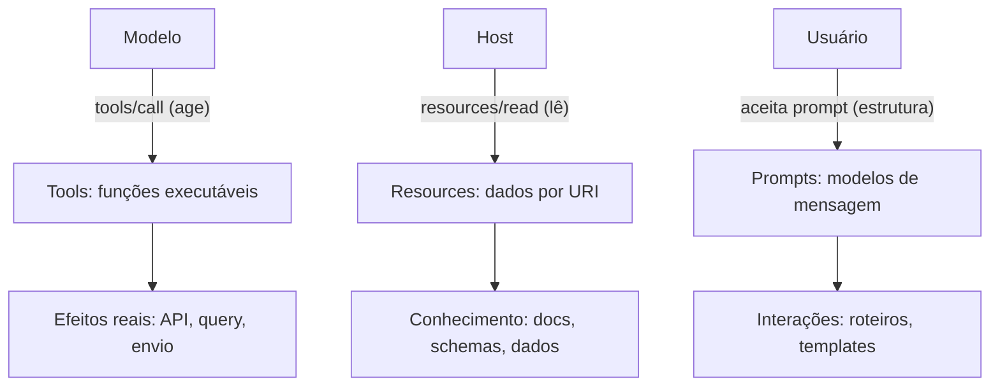

# Capítulo 4 — As três primitivas: tools, resources e prompts

## 1. Introdução

O Capítulo 2 apresentou a arquitetura host/client/server, e o Capítulo 3 mostrou como client e server se comunicam fisicamente [2][3]. Este capítulo desce ao conteúdo da comunicação: as três primitivas do MCP — tools, resources e prompts — que definem o que um server pode oferecer [2][4][5]. A tese é direta: o server expõe capacidades através de três tipos fundamentais, cada um com um contrato próprio e um papel distinto — tools são para o modelo agir, resources são para o host ler e prompts são para estruturar conversas [2][4][5]. A distinção operacional é o que separa um design MCP claro de um amontoado de capacidades [4][5]. O engenheiro que domina as primitivas sabe exatamente o que expor, como expor e com que contrato [4][5][6]. A especificação de 2026-07-28 consolidou as definições — e este capítulo as traduz em prática [4][5].

## 2. Explica

### 2.1 A Primeira Primitiva: Tools

As tools são funções executáveis que o modelo pode invocar [4]. Uma tool tem um nome, uma descrição e um schema de entrada — o modelo lê a descrição e decide quando chamá-la, com quais argumentos [4]. O resultado da execução retorna ao modelo como conteúdo [4]. As tools são o mecanismo pelo qual o agente age no mundo: consultar uma API, executar uma query, enviar uma mensagem, criar um arquivo [4]. A especificação define o contrato completo — a chamada (`tools/call`), a listagem (`tools/list`) e as notificações de mudança [4]. A tool é a primitiva mais poderosa — e a mais perigosa: toda execução é uma ação com efeitos reais [4][6][16].

### 2.2 A Segunda Primitiva: Resources

Os resources são dados endereçados por URI que o host pode ler [5]. Um resource tem um URI, um nome e um tipo de conteúdo [5]. O host lê um resource sob demanda — não é injetado no contexto automaticamente [5]. O model não chama um resource; o host o lê e decide se o inclui no contexto (Livro 3: Select) [2][5]. Exemplos de resources: um documento, um schema de banco, um arquivo de configuração, uma página de wiki [5]. A especificação define a leitura (`resources/read`), a listagem (`resources/list`) e as assinaturas de mudança (`resources/subscribe`) [5]. A resource é a primitiva do conhecimento: alimenta o contexto sem dar ação [5].

### 2.3 A Terceira Primitiva: Prompts

Os prompts são modelos de mensagem reutilizáveis que o server expõe [2]. Um prompt define uma estrutura de interação — por exemplo, um template de análise, uma sequência de perguntas, um roteiro de revisão [2]. O host apresenta o prompt ao usuário, que o aceita e o executa [2]. Os prompts são a primitiva da estrutura: padronizam como conversas começam e como tarefas são enquadradas [2]. A especificação define a listagem (`prompts/list`) e a obtenção (`prompts/get`) [2]. A distinção é sutil e decisiva: tools dão ação ao modelo; resources dão dados ao host; prompts dão estrutura à interação [2][4][5].

### 2.4 O Contrato de Cada Primitiva

Cada primitiva tem um contrato formal na especificação [4][5]. O contrato da tool define o schema de entrada (JSON Schema), o tipo de saída (texto, imagem, áudio, recursos embutidos) e o tratamento de erro [4]. O contrato do resource define o URI, o tipo MIME e o conteúdo [5]. O contrato do prompt define o template, os argumentos e a composição de mensagens [2]. Os contratos são o que permite a interoperabilidade: qualquer host compatível consome qualquer server que respeite os contratos [4][5]. O engenheiro MCP escreve contratos, não código — a qualidade da exposição decide a qualidade do uso [4][5][6].

### 2.5 A Relação com o Framework do Livro 3

O leitor do Livro 3 conhece o framework write/select/compress/isolate [2]. As primitivas MCP instrumentalizam o framework [2][4][5]. As tools são o mecanismo do Select aplicado à ação: o modelo seleciona a tool certa para a tarefa [4]. Os resources são o mecanismo do Select aplicado ao conhecimento: o host seleciona o resource que entra no contexto [5]. Os prompts são o mecanismo do Write: estruturas de interação reutilizáveis [2]. A ponte é direta: o que o Livro 3 tratava como operações mentais, o MCP materializa como primitivas [2][4][5].

### 2.6 A Granularidade da Exposição

A decisão central do design de servers é a granularidade [4][6]. Quantas tools expor? Com que escopo? Com que nível de detalhe nas descrições? [4][6]. A granularidade tem trade-offs [4]. Tools finas e numerosas dão flexibilidade, mas aumentam a superfície de ataque e o custo de decisão do modelo [4][16]. Tools grossas e poucas reduzem a superfície, mas limitam a utilidade [4][6]. O princípio do menor privilégio orienta a decisão: expor o menor conjunto de tools com os menores escopos necessários [6]. A granularidade é a primeira decisão de MCP Engineering — e o Capítulo 10 a desenvolve [15][6].

### 2.7 A Descrição como Interface

A descrição é a interface entre o modelo e a tool [4][16]. O modelo não lê o código da tool — lê a descrição e o schema [4]. A qualidade da descrição decide a qualidade do uso: descrições claras produzem chamadas corretas; descrições vagas produzem chamadas erradas ou nenhuma [4]. A descrição também é um vetor de ataque: o Capítulo 9 mostra o tool poisoning — instruções adversárias escondidas em descrições [16]. O engenheiro escreve descrições com a precisão de um contrato de API e a vigilância de um documento de segurança [4][6][16].

### 2.8 O Design da Superfície de Capacidades

As três primitivas juntas formam a superfície de capacidades do server [4][5]. O design da superfície é a arte de MCP Engineering [6][15]. Primeiro, o inventário: o que o domínio precisa — ações (tools), conhecimento (resources) ou estrutura (prompts)? [4][5]. Segundo, a granularidade: com que escopo cada primitiva é exposta [6]. Terceiro, o contrato: schemas claros e descrições precisas [4]. Quarto, a segurança: o menor privilégio aplicado a cada primitiva [6]. A superfície bem desenhada é o que transforma um server de risco em ativo [6][15].

## 3. Ilustra

### 3.1 A Analogia do Restaurante

A analogia do restaurante ilumina as três primitivas [2][4]. O menu é a lista de tools: o cliente (modelo) escolhe o prato (ferramenta) e faz o pedido (chamada) [4]. A despensa é a coleção de resources: o cozinheiro (host) pega os ingredientes (dados) que precisa, sem perguntar ao cliente [5]. O cardápio de combinações é a coleção de prompts: o restaurante oferece menus fixos (estruturas) que o cliente aceita como estão [2]. A analogia funciona em profundidade: o cliente escolhe do menu, mas não vasculha a despensa; o cozinheiro usa a despensa, mas não decide o cardápio [4][5][2].

### 3.2 O Diagrama das Três Primitivas

O diagrama abaixo representa as três primitivas e seus fluxos [2][4][5].



O diagrama mostra a separação de responsabilidades [2][4][5]. O modelo age via tools; o host lê via resources; o usuário estrutura via prompts [2][4][5]. Cada primitiva tem um ator e um efeito [4][5]. A superfície do server é a soma das três colunas [4][5].

### 3.3 O Antes e o Depois na Prática

A comparação concreta ajuda a fixar o conceito [4][5]. **Antes (monólito)**: o server expõe uma única tool gigante que faz tudo — com argumentos complexos e efeitos imprevisíveis [4]. **Depois (primitivas claras)**: tools finas com schemas precisos, resources para conhecimento e prompts para estrutura [4][5]. A diferença não está na funcionalidade — está na usabilidade, na segurança e na manutenção [4][5][6].

## 4. Técnica

### 4.1 Definindo Tools com Schema

O primeiro instrumento do engenheiro é definir tools com schemas precisos [4]. O código abaixo demonstra o contrato de uma tool com validação de entrada [4]:

```python
from dataclasses import dataclass, field


@dataclass
class ToolSpec:
    nome: str
    descricao: str
    parametros: dict  # JSON Schema do argumento
    fn: callable


class RegistryTools:
    """Registro de tools com validação de schema (JSON Schema-like)."""

    def __init__(self):
        self.tools = {}

    def registrar(self, spec: ToolSpec):
        self.tools[spec.nome] = spec

    def listar(self) -> list:
        return [
            {"name": s.nome, "description": s.descricao, "inputSchema": s.parametros}
            for s in self.tools.values()
        ]

    def chamar(self, nome: str, argumentos: dict):
        if nome not in self.tools:
            raise KeyError(f"Tool desconhecida: {nome}")
        spec = self.tools[nome]
        self._validar(spec.parametros, argumentos)
        return spec.fn(**argumentos)

    @staticmethod
    def _validar(schema: dict, argumentos: dict):
        obrigatorios = schema.get("required", [])
        faltando = [c for c in obrigatorios if c not in argumentos]
        if faltando:
            raise ValueError(f"Argumentos obrigatórios ausentes: {faltando}")
        props = schema.get("properties", {})
        for chave, valor in argumentos.items():
            tipo = props.get(chave, {}).get("type")
            if tipo == "string" and not isinstance(valor, str):
                raise ValueError(f"{chave} deve ser string")
            if tipo == "integer" and not isinstance(valor, int):
                raise ValueError(f"{chave} deve ser inteiro")


# Exemplo de uso
if __name__ == "__main__":
    reg = RegistryTools()
    reg.registrar(ToolSpec(
        nome="consultar_clima",
        descricao="Consulta a previsão do tempo para uma cidade.",
        parametros={
            "type": "object",
            "properties": {"cidade": {"type": "string"}},
            "required": ["cidade"],
        },
        fn=lambda cidade: f"Previsão para {cidade}: 24°C, ensolarado",
    ))
    print(reg.chamar("consultar_clima", {"cidade": "São Paulo"}))
    print(reg.listar())
```

O registro demonstra o contrato de uma tool: nome, descrição e schema de entrada [4]. A validação impede chamadas mal formadas [4]. A descrição clara é o que o modelo usa para decidir a chamada [4].

### 4.2 Definindo Resources com URI

O segundo instrumento é definir resources com URIs [5]. O código abaixo demonstra o contrato de resources [5]:

```python
@dataclass
class ResourceSpec:
    uri: str
    nome: str
    tipo_mime: str
    obter: callable


class RegistryResources:
    """Registro de resources endereçados por URI."""

    def __init__(self):
        self.resources = {}

    def registrar(self, spec: ResourceSpec):
        self.resources[spec.uri] = spec

    def listar(self) -> list:
        return [
            {"uri": s.uri, "name": s.nome, "mimeType": s.tipo_mime}
            for s in self.resources.values()
        ]

    def ler(self, uri: str) -> dict:
        if uri not in self.resources:
            raise KeyError(f"Resource desconhecido: {uri}")
        spec = self.resources[uri]
        return {
            "uri": spec.uri,
            "mimeType": spec.tipo_mime,
            "contents": spec.obter(),
        }


# Exemplo de uso
if __name__ == "__main__":
    reg = RegistryResources()
    reg.registrar(ResourceSpec(
        uri="docs://politicas/seguranca",
        nome="Políticas de segurança",
        tipo_mime="text/markdown",
        obter=lambda: "# Políticas\n- Acesso mínimo\n- Auditoria obrigatória",
    ))
    print(reg.ler("docs://politicas/seguranca"))
```

O registro demonstra o contrato de um resource: URI, nome e tipo MIME [5]. O host lê sob demanda — o conteúdo não é injetado automaticamente [5]. A leitura sob demanda é o mecanismo do Select do Livro 3 [2][5].

### 4.3 Definindo Prompts com Template

O terceiro instrumento é definir prompts com templates [2]. O código abaixo demonstra o contrato de prompts [2]:

```python
@dataclass
class PromptSpec:
    nome: str
    descricao: str
    template: str
    argumentos: list


class RegistryPrompts:
    """Registro de prompts (modelos de mensagem reutilizáveis)."""

    def __init__(self):
        self.prompts = {}

    def registrar(self, spec: PromptSpec):
        self.prompts[spec.nome] = spec

    def listar(self) -> list:
        return [
            {"name": s.nome, "description": s.descricao,
             "arguments": [{"name": a} for a in s.argumentos]}
            for s in self.prompts.values()
        ]

    def obter(self, nome: str, valores: dict) -> dict:
        if nome not in self.prompts:
            raise KeyError(f"Prompt desconhecido: {nome}")
        spec = self.prompts[nome]
        mensagem = spec.template.format(**valores)
        return {
            "description": spec.descricao,
            "messages": [{"role": "user", "content": {"type": "text", "text": mensagem}}],
        }


# Exemplo de uso
if __name__ == "__main__":
    reg = RegistryPrompts()
    reg.registrar(PromptSpec(
        nome="revisao_tecnica",
        descricao="Roteiro de revisão técnica de um trecho de código.",
        template="Revise o código abaixo com os critérios: corretude, segurança, clareza.\n\n{codigo}",
        argumentos=["codigo"],
    ))
    print(reg.obter("revisao_tecnica", {"codigo": "print('oi')"}))
```

O registro demonstra o contrato de um prompt: nome, template e argumentos [2]. O host apresenta a estrutura ao usuário, que a aceita [2]. Os prompts padronizam a forma como as interações começam [2].

## 5. Aplica

### 5.1 Onde Isso Vive no Mundo Real

As primitivas MCP estão em toda parte em 2026 [4][22]. Servers de repositório expõem tools para buscar arquivos e resources para ler código [14]. Servers de banco expõem tools para executar queries e resources para schemas [22]. Servers de produtividade expõem prompts para estruturar relatórios [22]. O registro oficial cataloga servers com as três primitivas em todas as combinações [12][14]. O design da superfície de capacidades é uma das decisões centrais de qualquer integração [4][5][6].

### 5.2 O Erro Comum do Iniciante

O erro mais comum de quem começa é confundir as primitivas [4][5]. O iniciante expõe como tool o que deveria ser resource — dando ao modelo o poder de executar onde deveria apenas ler [4][5][6]. Ou injeta resources no contexto automaticamente, ignorando o Select sob demanda [5][2]. Outro erro clássico: descrições vagas que fazem o modelo chamar tools erradas [4]. A lição é a mesma dos capítulos anteriores: o contrato certo para cada capacidade [4][5][6].

### 5.3 O Padrão Profissional em 2026

O padrão profissional em 2026 desenha a superfície com rigor [4][5][6]. Tools finas com schemas precisos e descrições claras [4]. Resources sob demanda, endereçados por URI, com tipos MIME [5]. Prompts para estruturar as interações recorrentes [2]. O menor privilégio aplicado a cada primitiva [6]. A auditoria de cada chamada e leitura [6][20]. O resultado é um server útil e seguro — a combinação que define o profissional [6][15].

### 5.4 Como Este Livro é Organizado

Este capítulo estabeleceu as primitivas; os próximos constroem sobre elas [4][5]. Os Capítulos 5 e 6 ensinam a construir servers com essas primitivas em TypeScript e Python [7][8]. O Capítulo 7 ensina a consumir servers existentes [22]. Os Capítulos 8 e 9 cobrem a segurança das primitivas — especialmente das tools [6][16]. O Capítulo 10 sintetiza o design da superfície como disciplina [15]. As primitivas são o vocabulário de toda a jornada [4][5].

### 5.5 Tools: O Poder com Contrato

O leitor que domina tools domina o poder do agente [4]. Uma tool bem desenhada tem três características [4]. Primeiro, **escopo único**: faz uma coisa e faz bem [4]. Segundo, **schema preciso**: valida a entrada antes de executar [4]. Terceiro, **descrição clara**: diz exatamente quando e como usar [4]. O padrão profissional versiona as tools como código com testes [4][7][8]. A revisão de uma tool é uma revisão de segurança — o Capítulo 9 mostra por quê [16].

A evolução das tools é contínua [4]. A especificação de 2026-07-28 consolidou o contrato [4]. Ferramentas com recursos embutidos retornam conteúdo estruturado [4]. O modelo pode auto-corrigir a partir do feedback de erro das tools [4]. O engenheiro que projeta para a auto-correção escreve tools com mensagens de erro acionáveis [4].

### 5.6 Resources: O Conhecimento sob Demanda

O leitor do Livro 3 entende por que resources são lidos sob demanda [2][5]. O contexto é curado, não coletado (Livro 3) — e os resources materializam a curadoria [2][5]. O host lê o resource quando a tarefa exige [5]. O design de resources tem camadas [5]. Primeiro, o **endereçamento**: URIs estáveis e significativos [5]. Segundo, a **tipagem**: MIME correto para cada conteúdo [5]. Terceiro, a **atualização**: notificações de mudança (`resources/subscribe`) para manter o cache fresco [5]. A proveniência dos resources — de onde vieram, quando foram lidos — alimenta a auditoria do Capítulo 8 [6][20].

A assinatura de mudanças é a evolução silenciosa do MCP [5]. O host assina um resource e recebe notificações quando ele muda [5]. O cache fica fresco sem releituras constantes [5]. O design da atualização é parte da disciplina de operação [5][15].

### 5.7 Prompts: A Estrutura da Interação

Os prompts são a primitiva mais subestimada [2]. O engenheiro que os domina padroniza a experiência [2]. Um prompt bem desenhado tem três características [2]. Primeiro, **reutilizabilidade**: aplica-se a muitas interações [2]. Segundo, **estrutura clara**: enquadra a tarefa sem engessá-la [2]. Terceiro, **argumentos explícitos**: a personalização acontece por parâmetros [2]. O padrão profissional mantém uma biblioteca de prompts versionada [2]. A biblioteca é o patrimônio de estrutura da organização [2][15].

### 5.8 O Roteiro de Design da Superfície

O design da superfície de capacidades é um processo em fases [4][5][6]. A primeira fase é o **inventário de domínio**: o que o sistema precisa — ações, conhecimento ou estrutura [4][5]. A segunda é a **classificação**: cada capacidade vira tool, resource ou prompt [4][5]. A terceira é a **contratação**: schemas, descrições e URIs [4][5]. A quarta é a **segurança**: o menor privilégio em cada primitiva [6]. A quinta é a **evolução**: revisar a superfície contra o uso real [6][15]. Cada fase tem entregável e critério de aceite [6].

### 5.9 As Primitivas e a Revisão Autônoma

A revisão autônoma entre harness depende das primitivas [1][2]. O revisor usa tools para consultar o que foi produzido e resources para ler os critérios [2][14]. Os prompts estruturam o roteiro de revisão [2]. O acesso padronizado permite que o revisor opere com as mesmas capacidades do executor [2][14]. As primitivas são a infraestrutura da revisão: cada verificação é uma tool, cada critério é um resource, cada roteiro é um prompt [1][2].

### 5.10 As Primitivas e a Governança Organizacional

As primitivas materializam a governança [6][15]. O inventário de tools é um inventário de poder — quem controla a lista controla o que o agente pode fazer [6][15]. Os resources são inventário de conhecimento — quem controla os URIs controla o que o agente vê [5][6]. Os prompts são inventário de estrutura — quem controla os templates controla as interações [2]. O CIS Companhion Guide aplica os controles de acesso ao inventário de capacidades [20]. A governança das primitivas é parte da disciplina de MCP Engineering [15][19].

### 5.11 O Caso da Tool Superexposta

Para fechar com uma aplicação concreta, este estudo de caso mostra a tool superexposta [6][16]. O cenário: uma equipe expõe uma tool de acesso ao banco com escopo amplo — sem granularidade [6]. O primeiro sintoma: o modelo usa a tool para consultas que a equipe não previu — leituras de tabelas sensíveis [6]. O segundo sintoma: a auditoria revela chamadas fora do escopo da tarefa [6][20]. O terceiro sintoma: uma descrição maliciosa externa induz o modelo a usar a tool para exfiltrar dados (tool poisoning — Capítulo 9) [16].

O diagnóstico correto: a granularidade ampla era a porta de entrada [6]. O tratamento: dividir a tool em tools finas com escopos mínimos e validar a entrada [6]. A lição do caso é a cascata: uma tool grossa criou poder excessivo; o poder excessivo causou uso fora de escopo; o uso fora de escopo ampliou o risco [6][16]. O caso demonstra o tema do capítulo: a superfície de capacidades é a superfície de risco [6][16].

### 5.12 As Primitivas e a Interface com os Modelos

As primitivas interagem com a diversidade de modelos [2][4]. A descrição da tool é o que qualquer modelo lê — a interface é universal [4]. O primeiro princípio é a **neutralidade**: o contrato não depende do modelo [4]. O segundo é a **revalidação**: ao trocar de modelo, o uso das tools muda — revalidar descrições e schemas [4]. O terceiro é a **observabilidade**: registrar qual modelo chamou qual tool [6][20]. A interface primitiva-modelo é o ponto onde o Livro 2 encontra o Livro 4 [2][4].

### 5.13 O Manual do Diagnóstico Rápido das Primitivas

O capítulo fecha com o manual do diagnóstico rápido das primitivas [4][5][6]. O primeiro item é a **classificação**: cada capacidade é tool, resource ou prompt no papel certo? [4][5]. O segundo é o **contrato**: schemas e descrições precisos? [4]. O terceiro é a **granularidade**: o menor privilégio aplicado? [6]. O quarto é a **sob demanda**: resources lidos apenas quando necessários? [5][2].

O quinto item é a **auditoria**: cada chamada e leitura é registrada? [6][20]. O sexto é a **proveniência**: cada resultado é rastreável à primitiva que o produziu? [6][20]. O sétimo é a **evolução**: a superfície é revisada contra o uso real? [6][15]. O manual é o resumo operacional das primitivas [4][5][6]. O engenheiro que percorre o manual em minutos evita dias de exposição errada [4][5][6].

### 5.14 As Primitivas e os Limites Éticos da Ação

As tools dão ação ao modelo — e ação cria responsabilidade [4][6]. O primeiro limite é o da **fronteira de ação**: nem toda tool que pode existir deve existir [6]. O segundo é o da **transparência**: o usuário sabe quais tools o agente usa [6]. O terceiro é o do **consentimento**: ações sensíveis exigem autorização explícita [6]. O quarto é o da **auditoria**: as ações são registradas [6][20]. Os resources e prompts também têm ética: o que se lê e como se estrutura define o que o agente vê e como responde [5][6]. A ética das primitivas é uma dimensão de cada decisão deste livro [6].

### 5.15 O Futuro das Primitivas

As primitivas MCP evoluem [4][5]. A especificação de 2026-07-28 consolidou o núcleo [4][5]. As tendências visíveis apontam a evolução [4]. A primeira é a **tools com recursos embutidos**: resultados estruturados [4]. A segunda é a **resources dinâmicos**: atualizados por assinatura [5]. A terceira é a **prompts parametrizados**: bibliotecas de estrutura reutilizáveis [2]. A quarta é a **segurança por contrato**: validação e auditoria no próprio contrato [6][20]. O engenheiro que domina os fundamentos não será surpreendido pelas tendências [4][5].

### 5.16 O Fechamento do Capítulo

O capítulo se encerra com a consolidação das primitivas [4][5]. Tools são o poder com contrato; resources são o conhecimento sob demanda; prompts são a estrutura da interação [2][4][5]. A distinção operacional é o que separa um design claro de um amontoado [4][5]. O próximo capítulo aplica as primitivas na construção: servidores MCP do zero em TypeScript [7][9].

### 5.17 O Design de Descrições como Engenharia

O design de descrições — a interface entre o modelo e a tool — é engenharia, não redação [4]. A descrição decide quando o modelo chama a tool, com quais argumentos e com que confiança [4]. O engenheiro trata a descrição como um contrato de API [4]. O padrão profissional escreve descrições com a precisão de um contrato [4]. Primeiro, o **quando**: a descrição declara as condições de uso [4]. Segundo, o **como**: a descrição declara os argumentos e os efeitos [4]. Terceiro, o **limite**: a descrição declara o que a tool não faz [4].

O design de descrições tem uma dimensão de segurança que o Capítulo 9 desenvolve [16][4]. A descrição é o vetor do tool poisoning [16]. Instruções maliciosas escondidas em descrições induzem o modelo a ações não autorizadas [16]. O engenheiro escreve descrições com a vigilância de um documento de segurança [4][16]. A revisão de descrições é parte da revisão de segurança [16][6].

O engenheiro que domina o design de descrições constrói tools que o modelo usa corretamente [4]. A descrição é a interface visível da tool para o modelo [4]. O teste da interface é o teste com o host real: o modelo recebe a descrição e decide [11][4]. O design de descrições é a ponte entre o Livro 2 (prompt engineering) e o Livro 4 [2][4].

### 5.18 O Design de Schemas e a Evolução do Contrato

O schema da tool é o contrato de entrada — e os contratos evoluem [4]. O design de schemas tem princípios [4]. Primeiro, a **estabilidade**: argumentos obrigatórios raramente mudam [4]. Segundo, a **compatibilidade**: argumentos novos são opcionais [4]. Terceiro, a **validação**: o schema rejeita entradas inválidas com mensagens acionáveis [4]. O engenheiro trata o schema como uma interface pública [4].

A evolução do contrato segue o padrão de versionamento [4]. Mudanças quebram compatibilidade? Nova versão da tool [4]. Adições são compatíveis? Evolução da mesma tool [4]. O padrão profissional documenta as mudanças de contrato [4]. O teste de contrato verifica a compatibilidade [4]. O engenheiro que domina a evolução de schemas constrói servers que evoluem sem quebrar os clientes [4].

O schema é também uma camada de segurança [4][6]. O schema valida a entrada antes da execução — impedindo argumentos maliciosos [4][6]. O schema documenta o escopo — o que a tool aceita e o que não aceita [4][6]. O engenheiro que desenha schemas rigorosos constrói a primeira linha de defesa da tool [4][6].

### 5.19 As Primitivas e o Design da Experiência do Modelo

As primitivas juntas desenham a experiência do modelo — o conjunto do que o modelo vê e pode fazer [2][4]. O design da experiência do modelo é a síntese das três primitivas [2][4][5]. As tools definem as ações possíveis [4]. Os resources definem o conhecimento acessível [5]. Os prompts definem as estruturas de interação [2]. O modelo opera dentro dessa experiência [2].

O design da experiência do modelo tem princípios [2][4]. Primeiro, a **clareza**: o modelo entende o que pode fazer [4]. Segundo, a **foco**: a superfície é mínima para a tarefa [6]. Terceiro, a **consistência**: as descrições usam o mesmo vocabulário [4]. Quarto, a **segurança**: o modelo não pode fazer o que não deve [6]. O engenheiro que desenha a experiência projeta a fronteira do agente [2][6].

A experiência do modelo é o ponto onde o Livro 3 encontra o Livro 4 [2]. O contexto do Livro 3 define o que o modelo vê; as primitivas do Livro 4 definem o que o modelo faz [2]. A síntese é o ambiente informacional com ação [2][4]. O engenheiro que domina as duas camadas projeta agentes completos [2][4].

### 5.20 O Design de Tools para o Raciocínio do Modelo

As tools interagem com o raciocínio do modelo de uma forma específica [4]. O modelo decide a chamada pela descrição e pelo schema — sem executar [4]. O design de tools para o raciocínio tem princípios [4]. Primeiro, a **intenção clara**: a descrição declara o objetivo da tool [4]. Segundo, a **entrada suficiente**: o schema entrega o que a decisão exige [4]. Terceiro, a **saída útil**: o resultado retorna o que a próxima decisão precisa [4]. O engenheiro desenha a tool para a sequência de decisões [4].

O design para o raciocínio inclui o feedback de erro [4]. O resultado de erro da tool é material de auto-correção do modelo [4]. Mensagens de erro acionáveis permitem que o modelo ajuste a próxima chamada [4]. O engenheiro escreve mensagens de erro que ensinam [4]. O feedback de erro é a interface do raciocínio [4].

O design para o raciocínio conecta o Livro 2 ao Livro 4 [2][4]. O Livro 2 ensinou a escrever prompts que guiam o raciocínio; o Livro 4 ensina a escrever tools que o abastecem [2][4]. A tool é um prompt executável [4]. O engenheiro que domina as duas camadas desenha o raciocínio completo [2][4].

### 5.21 O Design de Resources para o Contexto

Os resources interagem com o contexto do modelo de uma forma específica [2][5]. O resource alimenta o contexto sem dar ação [5]. O design de resources para o contexto tem princípios [5]. Primeiro, a **relevância**: o resource contém o que a tarefa precisa [5]. Segundo, a **frescura**: o resource está atualizado [5][2]. Terceiro, a **segurança**: o resource não carrega instruções maliciosas (Capítulo 9) [17][6]. O engenheiro desenha o resource como bloco de contexto curado [2][5].

O design de resources conecta o Livro 3 ao Livro 4 [2][5]. O Select do Livro 3 escolhe o que entra na janela; o resource MCP materializa a fonte [2][5]. O Compress do Livro 3 gerencia o histórico; a assinatura de mudança do MCP mantém a frescura [5][2]. O engenheiro que domina as duas camadas projeta o contexto com fonte viva [2][5].

O resource é a primitiva da confiança [5][6]. O que entra no contexto do modelo é o que o resource entrega [5]. O engenheiro trata o resource como o ponto de curadoria do conhecimento [5][6]. O design de resources é o design do que o modelo acredita [5][6].

### 5.22 As Primitivas e o Design da Segurança

As três primitivas têm perfis de risco diferentes — e o design da segurança as trata por perfil [4][5][6]. As tools têm o perfil mais alto: executam ações [4][6]. Os resources têm o perfil médio: alimentam o contexto [5][6]. Os prompts têm o perfil mais baixo: estruturam interações [2][6]. O engenheiro aplica a defesa proporcional ao perfil [6].

O design da segurança por primitiva tem práticas [4][5][6]. Nas tools: menor privilégio, validação de entrada e auditoria de chamada [4][6][20]. Nos resources: curadoria de conteúdo e auditoria de leitura [5][6][20]. Nos prompts: revisão dos templates [2][6]. O CIS Companhion Guide orienta os controles [20]. O engenheiro que desenha a segurança por primitiva constrói defesa proporcional [6].

O design da segurança por primitiva é parte do MCP Engineering (Capítulo 10) [6][15]. A superfície de risco é a soma dos perfis [6]. O inventário de capacidades registra os perfis [6][15]. O engenheiro que domina o design da segurança projeta a defesa da superfície inteira [6].

### 5.23 As Primitivas e o Teste do Contrato

O teste do contrato é a prática que verifica as primitivas [4][7]. O teste do contrato verifica que a tool aceita o que o schema declara e retorna o que a descrição promete [4]. O teste do contrato tem casos [4][7]. Os casos válidos: entradas aceitas, saídas esperadas [4]. Os casos inválidos: entradas rejeitadas com mensagem acionável [4][7]. Os casos de borda: limites do schema [4]. O engenheiro que testa o contrato constrói tools confiáveis [4][7].

O teste do contrato tem implicações para o modelo [4]. O modelo decide pela descrição — e o teste verifica que a descrição é verdadeira [4]. A tool que se comporta como documentada produz decisões corretas [4]. A tool que surpreende produz decisões erradas [4][6]. O teste do contrato é a ponte entre o design e o uso real [4][7].

O teste do contrato é parte do MCP Engineering (Capítulo 10) [4][6]. O teste automatizado no CI protege a evolução [4][7]. O engenheiro que domina o teste do contrato constrói superfícies verificáveis [4][6].

### 5.24 As Primitivas e a Composição do Contexto

As primitivas compõem o contexto do modelo — e a composição é uma arte [2][4][5]. A composição decide a ordem e a proporção [2]. O prompt de sistema (Livro 2) abre [2]. Os resources selecionados (Livro 3) preenchem [5][2]. As tools listadas definem a ação possível [4]. A composição é a materialização do Select do Livro 3 [2][5].

A composição do contexto tem princípios [2][4]. Primeiro, a **economia**: apenas o necessário entra [2]. Segundo, a **ordem**: o crítico vem primeiro [2][5]. Terceiro, a **separação**: estável e dinâmico não se misturam [2]. O engenheiro que compõe com método gerencia a janela do Livro 3 [2].

A composição conecta as primitivas ao contexto [2][4][5]. O Livro 3 arquitetou o ambiente informacional; o Livro 4 o abastece com primitivas [2]. O engenheiro que domina as duas camadas compõe o contexto com ação [2][4].

### 5.25 As Primitivas e a Experiência do Desenvolvedor

O design das primitivas molda a experiência do desenvolvedor que consome o server [4][7]. Um server com primitivas claras é prazeroso de consumir [4]. Um server com primitivas confusas é frustrante [4]. A experiência do desenvolvedor tem princípios [4][7]. Primeiro, a **descoberta**: o desenvolvedor entende as capacidades pela listagem [4][7]. Segundo, a **documentação**: as descrições explicam o uso [4]. Terceiro, a **previsibilidade**: as primitivas se comportam como declarado [4][6]. O engenheiro que desenha para a experiência constrói servers adotados [4][7].

A experiência do desenvolvedor interage com o modelo [4]. O que ajuda o desenvolvedor — clareza e previsibilidade — também ajuda o modelo [4]. O contrato que o humano lê é o que o modelo lê [4]. O engenheiro que desenha para os dois públicos constrói servidores melhores [4].

A experiência do desenvolvedor é parte do MCP Engineering (Capítulo 10) [4][6]. O server bem desenhado é um ativo de equipe [6]. O engenheiro que domina a experiência constrói servidores que os colegas adotam [4][7].

## 6. Conclusão

As três primitivas são o vocabulário da exposição MCP [4][5]. Este capítulo estabeleceu a distinção: tools para o modelo agir, resources para o host ler e prompts para estruturar conversas [2][4][5]. Os contratos formais de cada primitiva — schema, URI, template — são o que permite a interoperabilidade [4][5]. A granularidade e a descrição são as decisões que definem a qualidade e a segurança da exposição [4][6]. O próximo capítulo aplica as primitivas na construção prática: um servidor MCP do zero em TypeScript [7][9].

## 7. Referências

[1] ANTHROPIC. Introducing the Model Context Protocol. Anthropic News, 25 nov. 2024. Disponível em: https://www.anthropic.com/news/model-context-protocol. Acesso em: 5 ago. 2026.
[2] MODEL CONTEXT PROTOCOL. Architecture. MCP Specification 2025-11-25, 25 nov. 2025. Disponível em: https://modelcontextprotocol.io/specification/2025-11-25/architecture. Acesso em: 5 ago. 2026.
[3] MODEL CONTEXT PROTOCOL. Basic Specification: Transports. MCP Specification 2025-11-25, 2025. Disponível em: https://modelcontextprotocol.io/specification/2025-11-25/basic/transports. Acesso em: 5 ago. 2026.
[4] MODEL CONTEXT PROTOCOL. Specification 2026-07-28: Server Tools. MCP Specification, 28 jul. 2026. Disponível em: https://modelcontextprotocol.io/specification/2026-07-28/server/tools. Acesso em: 5 ago. 2026.
[5] MODEL CONTEXT PROTOCOL. Specification 2026-07-28: Server Resources. MCP Specification, 28 jul. 2026. Disponível em: https://modelcontextprotocol.io/specification/2026-07-28/server/resources. Acesso em: 5 ago. 2026.
[6] MODEL CONTEXT PROTOCOL. Security Best Practices (Draft). MCP Specification. Disponível em: https://modelcontextprotocol.io/specification/draft/basic/security_best_practices. Acesso em: 5 ago. 2026.
[7] MODEL CONTEXT PROTOCOL. TypeScript SDK. GitHub Repository, 2026. Disponível em: https://github.com/modelcontextprotocol/typescript-sdk. Acesso em: 5 ago. 2026.
[8] MODEL CONTEXT PROTOCOL. Python SDK. GitHub Repository, 2026. Disponível em: https://github.com/modelcontextprotocol/python-sdk. Acesso em: 5 ago. 2026.
[9] MODEL CONTEXT PROTOCOL. TypeScript SDK Documentation. MCP SDK Portal, 2026. Disponível em: https://ts.sdk.modelcontextprotocol.io/. Acesso em: 5 ago. 2026.
[10] MODEL CONTEXT PROTOCOL. Python SDK Documentation. MCP SDK Portal, 2026. Disponível em: https://py.sdk.modelcontextprotocol.io/. Acesso em: 5 ago. 2026.
[11] MODEL CONTEXT PROTOCOL. Quickstart Guide. MCP Documentation. Disponível em: https://modelcontextprotocol.io/docs/quickstart/quickstart. Acesso em: 5 ago. 2026.
[12] MODEL CONTEXT PROTOCOL. MCP Registry Preview. Official MCP Blog, 8 set. 2025. Disponível em: https://blog.modelcontextprotocol.io/posts/2025-09-08-mcp-registry-preview/. Acesso em: 5 ago. 2026.
[13] MODEL CONTEXT PROTOCOL. Registry Repository. GitHub Repository, 2025–2026. Disponível em: https://github.com/modelcontextprotocol/registry. Acesso em: 5 ago. 2026.
[14] GITHUB. GitHub MCP Registry: the fastest way to discover AI tools. GitHub Changelog, 16 set. 2025. Disponível em: https://github.blog/changelog/2025-09-16-github-mcp-registry-the-fastest-way-to-discover-ai-tools/. Acesso em: 5 ago. 2026.
[15] CLOUD SECURITY ALLIANCE. Agentic MCP Security Best Practices Guide v1. CSA Labs, 27 mar. 2026. Disponível em: https://labs.cloudsecurityalliance.org/agentic/agentic-mcp-security-best-practices-v1/. Acesso em: 5 ago. 2026.
[16] INVARIANT LABS. MCP Security Notification: Tool Poisoning Attacks. Invariant Labs Blog, 1 abr. 2025. Disponível em: https://invariantlabs.ai/blog/mcp-security-notification-tool-poisoning-attacks. Acesso em: 5 ago. 2026.
[17] WILLISON, Simon. Model Context Protocol has prompt injection security problems. Simon Willison's Weblog, 9 abr. 2025. Disponível em: https://simonwillison.net/2025/Apr/9/mcp-prompt-injection/. Acesso em: 5 ago. 2026.
[18] WANG, Zhen et al. (Tsinghua University & Ant Group). Systematic Analysis of MCP Security (MCPLib). arXiv:2508.12538, 18 ago. 2025. Disponível em: https://arxiv.org/html/2508.12538v1. Acesso em: 5 ago. 2026.
[19] CISA. Guide to Secure Adoption of Agentic AI. CISA News, 1 mai. 2026. Disponível em: https://www.cisa.gov/news-events/news/cisa-us-and-international-partners-release-guide-secure-adoption-agentic-ai. Acesso em: 5 ago. 2026.
[20] CENTER FOR INTERNET SECURITY (CIS). Model Context Protocol (MCP) Companion Guide — CIS Controls v8.1. CIS White Papers, 20 abr. 2026. Disponível em: https://www.cisecurity.org/insights/white-papers/controls-v8-1-model-context-protocol-companion-guide. Acesso em: 5 ago. 2026.
[21] NATIONAL SECURITY AGENCY (NSA). Security Design Considerations for AI-Driven Automation Leveraging the Model Context Protocol. NSA Press Release, 20 mai. 2026. Disponível em: https://www.nsa.gov/Press-Room/Press-Releases-Statements/Press-Release-View/Article/4496698/. Acesso em: 5 ago. 2026.
[22] PULSEMCP. MCP Server Directory. PulseMCP, 2025–2026. Disponível em: https://www.pulsemcp.com/servers. Acesso em: 5 ago. 2026.
