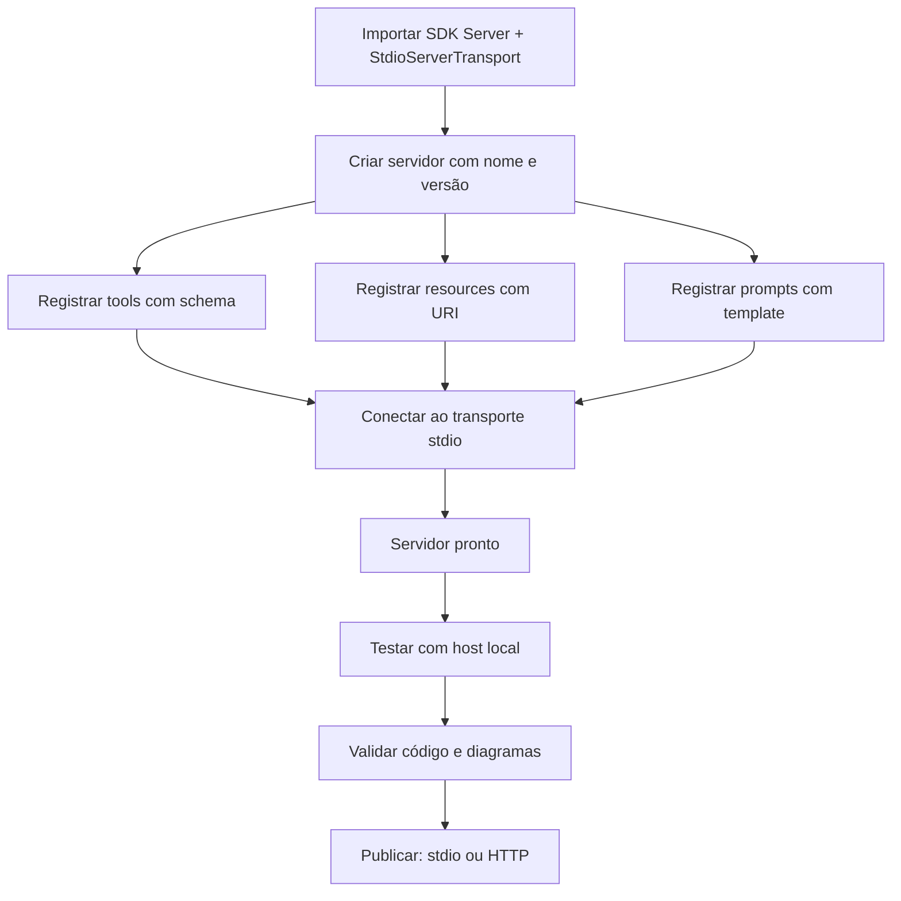

# Capítulo 5 — Construindo um servidor MCP do zero em TypeScript

## 1. Introdução

Os capítulos anteriores estabeleceram a teoria: a arquitetura host/client/server (Capítulo 2), os transportes (Capítulo 3) e as primitivas tools, resources e prompts (Capítulo 4) [2][3][4][5]. Este capítulo desce à prática — a construção de um servidor MCP do zero em TypeScript [7][9]. A tese é direta: o TypeScript é uma das duas linguagens de primeira classe do MCP — a Anthropic lançou o protocolo com SDKs oficiais em TypeScript e Python — e a tipagem forte do TypeScript é uma aliada natural do design por contratos que o Capítulo 4 estabeleceu [1][7][9]. O SDK oficial do TypeScript cuida do protocolo — handshake, transportes, mensagens — para que o desenvolvedor foque no que importa: as primitivas que o server expõe [7][9]. O engenheiro que domina a construção de servers não apenas conecta agentes — ele desenha as capacidades que definem o que o agente pode fazer [4][6][7]. O tutorial oficial do SDK TypeScript ensina o caminho em dez minutos; este capítulo ensina o caminho com profundidade [9].

## 2. Explica

### 2.1 Por Que TypeScript

O TypeScript é a linguagem de referência do ecossistema MCP [1][7]. A escolha da linguagem tem razões estruturais [1][7]. Primeiro, o **ecossistema**: grande parte dos hosts e ferramentas de IA é construída em JavaScript/TypeScript — do Node.js aos IDEs [1][14]. Segundo, a **tipagem**: o design por contratos do MCP (schemas de tools, URIs de resources, templates de prompts) se expressa com precisão em tipos [7][9]. Terceiro, o **SDK oficial**: o pacote `@modelcontextprotocol/sdk` mantém a implementação de referência [7][9]. O desenvolvedor que escolhe TypeScript escolhe o caminho de menor atrito com o ecossistema [1][7].

### 2.2 O Que o SDK Cuida e o Que Fica com Você

O SDK oficial separa o protocolo da aplicação [7][9]. O SDK cuida da mecânica: o handshake de inicialização, o transporte stdio, o roteamento de mensagens JSON-RPC e a serialização [7]. O desenvolvedor cuida do conteúdo: quais tools expor, quais resources servir, quais prompts oferecer [7][9]. A separação é a mesma do protocolo — mensagem separada do transporte (Capítulo 3) [3][7]. O engenheiro que entende o que o SDK faz por baixo (Capítulos 1-4) usa o SDK com consciência — e diagnostica quando algo falha [7].

### 2.3 A Estrutura de um Servidor TypeScript

Um servidor MCP em TypeScript tem uma estrutura padrão [7][9]. Primeiro, a **importação do SDK**: `Server` e `StdioServerTransport` [7]. Segundo, a **instanciação**: criar o servidor com nome e versão [7]. Terceiro, o **registro de capacidades**: declarar tools, resources e prompts [7][9]. Quarto, o **transporte**: conectar o servidor ao stdio [7]. A estrutura é sempre a mesma — o que muda é o conteúdo das capacidades [7]. O tutorial oficial do SDK TypeScript demonstra a estrutura completa do servidor de clima [9][11].

### 2.4 O Registro de Tools no TypeScript

O registro de tools no TypeScript segue o contrato do Capítulo 4 [4][7]. Cada tool tem nome, descrição e schema de entrada — o schema usa a sintaxe de JSON Schema que o SDK valida [4][7]. O handler da tool recebe os argumentos validados e retorna o resultado no formato do protocolo [7]. A tipagem do TypeScript valida os argumentos em tempo de compilação — o design por contratos em ação [7][9]. O padrão profissional registra tools com schemas precisos e descrições claras (Capítulo 4) [4][7].

### 2.5 O Registro de Resources e Prompts

Os resources e prompts seguem o mesmo padrão [5][7]. Resources são registrados com URIs e handlers de leitura — o SDK roteia `resources/read` para o handler certo [5][7]. Prompts são registrados com templates e handlers de obtenção [2][7]. A estrutura é uniforme: registrar a capacidade, implementar o handler, conectar ao servidor [7]. O engenheiro que domina o padrão expõe qualquer combinação de primitivas [7].

### 2.6 O Fluxo de Desenvolvimento

O fluxo de desenvolvimento de um server TypeScript é iterativo [9][11]. Primeiro, o **esqueleto**: servidor vazio conectado ao stdio [9]. Segundo, as **capacidades**: tools, resources e prompts registrados um a um [7]. Terceiro, o **teste**: conectar a um host local e verificar o comportamento [11]. Quarto, a **validação**: rodar o CI de código e a validação de diagramas (Capítulo do fluxo da fábrica) [7]. O ciclo curto — esqueleto, capacidade, teste — é o caminho do iniciante ao profissional [9][11].

### 2.7 O Deploy: Do stdio ao HTTP

O deploy de um server TypeScript segue a decisão de transporte do Capítulo 3 [3][7]. No desenvolvimento, o stdio basta [3][11]. Em produção remota, o servidor migra para Streamable HTTP [3][7]. O SDK oferece os dois transportes [7]. A migração é a prova da separação mensagem-transporte: a lógica de negócio não muda — apenas o canal [3][7]. O padrão profissional publica o server remoto com autenticação OAuth 2.1 e auditoria (Capítulos 3 e 8) [3][6][7].

### 2.8 O Servidor como Superfície de Capacidades

O server TypeScript é, em última análise, a superfície de capacidades que o Capítulo 4 definiu [4][7]. A qualidade do server é a qualidade da superfície [4][6][7]. Tools com schemas precisos e descrições claras [4][7]. Resources sob demanda com URIs estáveis [5][7]. Prompts com templates reutilizáveis [2][7]. O menor privilégio em cada primitiva [6]. O server bem construído é um ativo; o mal construído, um risco [6][7].

## 3. Ilustra

### 3.1 A Analogia do Restaurante com Cardápio Digital

A analogia do restaurante digital ilumina a construção de servers [4][7]. O server é o restaurante; as tools são os pratos do menu; os resources são a despensa; os prompts são os menus fixos [4][5][7]. O SDK é a cozinha industrial — a infraestrutura que prepara e serve [7]. O desenvolvedor é o chef que decide o cardápio [4][7]. A analogia funciona em profundidade: o chef não constrói a cozinha toda — usa a infraestrutura e foca no cardápio [7][9]. Da mesma forma, o desenvolvedor não implementa o protocolo — usa o SDK e foca nas capacidades [7][9].

### 3.2 O Diagrama do Fluxo de Construção

O diagrama abaixo representa o fluxo de construção de um server TypeScript [7][9].



O diagrama mostra o caminho do esqueleto ao deploy [7][9]. A estrutura é linear e previsível: importar, criar, registrar, conectar, testar, publicar [7]. A previsibilidade é a vantagem do SDK oficial [7].

### 3.3 O Antes e o Depois na Prática

A comparação concreta ajuda a fixar o conceito [7][11]. **Antes (implementação manual)**: o desenvolvedor escreve o roteamento JSON-RPC, o handshake e a serialização à mão — centenas de linhas de protocolo [3][7]. **Depois (SDK oficial)**: o SDK cuida do protocolo e o desenvolvedor escreve as capacidades — dezenas de linhas de negócio [7][9]. A diferença não está na qualidade — está na produtividade e na conformidade com a especificação [7].

## 4. Técnica

### 4.1 O Esqueleto do Servidor

O primeiro instrumento é o esqueleto do servidor [7]. O código abaixo demonstra a estrutura mínima com o SDK oficial [7]:

```typescript
import { Server } from "@modelcontextprotocol/sdk/server/index.js";
import { StdioServerTransport } from "@modelcontextprotocol/sdk/server/stdio.js";

// Cria o servidor com nome e versão
const server = new Server(
  {
    name: "meu-servidor",
    version: "1.0.0",
  },
  {
    capabilities: {
      tools: {},
      resources: {},
      prompts: {},
    },
  }
);

// Conecta ao transporte stdio
const transport = new StdioServerTransport();
await server.connect(transport);

console.error("Servidor MCP pronto no stdio");
```

O esqueleto demonstra a estrutura mínima: servidor com capacidades declaradas e transporte conectado [7]. O `console.error` envia logs ao stderr, separado do protocolo no stdout — a disciplina do Capítulo 3 [3][7].

### 4.2 Registrando Tools com Validação

O segundo instrumento é o registro de tools [7]. O código abaixo demonstra o contrato completo com schema [4][7]:

```typescript
server.setRequestHandler(ListToolsRequestSchema, async () => {
  return {
    tools: [
      {
        name: "consultar_clima",
        description: "Consulta a previsão do tempo para uma cidade.",
        inputSchema: {
          type: "object",
          properties: {
            cidade: { type: "string", description: "Nome da cidade" },
          },
          required: ["cidade"],
        },
      },
    ],
  };
});

server.setRequestHandler(CallToolRequestSchema, async (request) => {
  const { name, arguments: args } = request.params;
  if (name === "consultar_clima") {
    const cidade = args?.cidade as string;
    const previsao = await buscarPrevisao(cidade);
    return {
      content: [{ type: "text", text: `Previsão para ${cidade}: ${previsao}` }],
    };
  }
  throw new McpError(ErrorCode.MethodNotFound, `Tool desconhecida: ${name}`);
});
```

O registro demonstra o contrato do Capítulo 4 em TypeScript [4][7]. O `inputSchema` valida a entrada; a descrição guia o modelo; o handler executa [4][7]. O tratamento de erro usa o `McpError` do SDK — o contrato de erro do protocolo [7].

### 4.3 Registrando Resources e Prompts

O terceiro instrumento é o registro de resources e prompts [5][7]. O código abaixo demonstra o padrão uniforme [5][7]:

```typescript
// Resources: leitura sob demanda por URI
server.setRequestHandler(ListResourcesRequestSchema, async () => {
  return {
    resources: [
      {
        uri: "docs://politicas/seguranca",
        name: "Políticas de segurança",
        mimeType: "text/markdown",
      },
    ],
  };
});

server.setRequestHandler(ReadResourceRequestSchema, async (request) => {
  const uri = request.params.uri;
  if (uri === "docs://politicas/seguranca") {
    return {
      contents: [
        {
          uri,
          mimeType: "text/markdown",
          text: "# Políticas\n- Acesso mínimo\n- Auditoria obrigatória",
        },
      ],
    };
  }
  throw new McpError(ErrorCode.InvalidParams, `Resource desconhecido: ${uri}`);
});

// Prompts: estrutura de interação reutilizável
server.setRequestHandler(ListPromptsRequestSchema, async () => {
  return {
    prompts: [
      {
        name: "revisao_tecnica",
        description: "Roteiro de revisão técnica de código.",
        arguments: [{ name: "codigo", required: true }],
      },
    ],
  };
});

server.setRequestHandler(GetPromptRequestSchema, async (request) => {
  if (request.params.name === "revisao_tecnica") {
    const codigo = request.params.arguments?.codigo as string;
    return {
      messages: [
        {
          role: "user",
          content: {
            type: "text",
            text: `Revise o código: ${codigo}`,
          },
        },
      ],
    };
  }
  throw new McpError(ErrorCode.InvalidParams, `Prompt desconhecido`);
});
```

O código demonstra o padrão uniforme do SDK: listar e ler/servir cada primitiva [5][7]. O TypeScript valida os tipos em tempo de compilação [7][9]. O padrão é o mesmo para qualquer capacidade [7].

## 5. Aplica

### 5.1 Onde Isso Vive no Mundo Real

Servidores MCP em TypeScript estão em toda parte em 2026 [7][22]. Grandes provedores publicam servers TypeScript para seus serviços [14][22]. Ferramentas de desenvolvimento expõem servers de repositório e issue trackers [14]. Aplicações corporativas expõem servers de dados internos [22]. O registro oficial cataloga milhares de servers, muitos em TypeScript [12][14]. A linguagem é a espinha dorsal do ecossistema de servers [7][22].

### 5.2 O Erro Comum do Iniciante

O erro mais comum de quem começa é pular a teoria e escrever código sem entender o protocolo [3][7]. O iniciante copia um tutorial, registra tools e considera o trabalho feito — sem entender o handshake, o transporte e o contrato [3][7]. Quando o server não aparece no host, ou a tool falha com erro de schema, ele não tem o mapa para diagnosticar [7]. Outro erro clássico: esquecer a separação stderr/stdout — o log polui o protocolo e quebra a conexão [3][7]. A lição é a mesma dos capítulos anteriores: o instrumento é rápido de usar; o sistema é o que exige domínio [3][7].

### 5.3 O Padrão Profissional em 2026

O padrão profissional em 2026 constrói servers com disciplina [7][9]. O SDK oficial é a base [7]. As tools têm schemas precisos e descrições claras (Capítulo 4) [4][7]. Os resources são servidos sob demanda com URIs estáveis [5][7]. Os prompts estruturam as interações [2][7]. O menor privilégio é aplicado a cada primitiva [6]. O código passa por revisão de segurança [6][16]. Os testes cobrem as capacidades [7]. O resultado é um server pronto para produção [7].

### 5.4 Como Este Livro é Organizado

Este capítulo estabeleceu a construção em TypeScript; os próximos continuam a prática [7]. O Capítulo 6 faz o mesmo caminho em Python [8][10]. O Capítulo 7 ensina a consumir servers existentes em vez de construir [22]. Os Capítulos 8 e 9 cobrem a segurança dos servers [6][15][16]. O Capítulo 10 sintetiza a disciplina de MCP Engineering [15][19]. A construção deste capítulo é a base prática do livro [7].

### 5.5 O Desenvolvimento Orientado a Contratos

O leitor que domina o design por contratos (Capítulo 4) constrói servers superiores [4][7]. O contrato vem antes do código: o schema da tool, o URI do resource, o template do prompt são escritos e revisados antes da implementação [4][7]. O TypeScript reforça a disciplina: os tipos validam o contrato em tempo de compilação [7][9]. O padrão profissional versiona os contratos com o código [4][7]. A revisão de um contrato é a primeira linha de defesa — o Capítulo 9 mostra por quê [16].

A evolução do contrato é contínua [4][7]. Novas tools são adicionadas com revisão de escopo [6][7]. Schemas mudam com versionamento explícito [4][7]. O engenheiro que trata o contrato como interface pública — como uma API — constrói servers que evoluem sem quebrar os clientes [4][7].

### 5.6 O Teste do Servidor

O teste é parte da construção profissional [7][11]. O fluxo de teste começa no host local: conectar o server ao Claude Desktop ou a um host de teste e verificar as capacidades [11]. Depois, os testes automatizados: iniciar o server como subprocesso, chamar as tools e validar os resultados [7]. O padrão profissional adiciona testes de contrato: o schema declara o que a tool aceita, e o teste verifica [4][7]. A validação de código do pipeline da fábrica (CI de sintaxe) e a validação de diagramas complementam o ciclo [7].

### 5.7 O Deploy em Produção

O deploy de um server TypeScript segue a topologia do Capítulo 3 [3][7]. No desenvolvimento, stdio [3][11]. Em produção remota, Streamable HTTP com autenticação [3][6][7]. O padrão profissional adiciona ao deploy [6][7]: TLS, validação de origem, OAuth 2.1, sessão explícita e auditoria [3][6]. O CIS Companhion Guide aplica os controles de aplicação e rede ao deploy [20]. O deploy seguro é a ponte entre o servidor bem construído e o sistema em produção [6][7].

### 5.8 O Roteiro de Construção do Servidor

A construção de um servidor é um processo em fases [7][9]. A primeira fase é o **esqueleto**: servidor vazio conectado ao transporte [9]. A segunda é o **inventário**: definir as capacidades do domínio (Capítulo 4) [4][7]. A terceira é a **implementação**: registrar tools, resources e prompts com contratos [7]. A quarta é a **validação**: testar no host local e rodar o CI [7][11]. A quinta é a **publicação**: escolher o transporte e publicar com segurança [3][7]. Cada fase tem entregável e critério de aceite [7].

### 5.9 O Servidor e a Revisão Autônoma

A revisão autônoma entre harness depende de servers bem construídos [1][7]. O server de repositório expõe tools de consulta e resources de leitura que o revisor usa [14][7]. A qualidade da revisão depende da qualidade das capacidades [7]. Tools com descrições claras produzem revisões precisas [4][7]. Resources com URIs estáveis permitem leitura confiável [5][7]. O engenheiro que constrói servers para revisão constrói sistemas auto-auditáveis [1][7].

### 5.10 O Servidor e a Governança Organizacional

Os servers TypeScript materializam a governança [6][15]. O código do server é propriedade da organização — com revisão e versionamento [6][7]. O inventário de capacidades é documentado [4][6]. O menor privilégio é aplicado por política [6]. A auditoria registra cada chamada [6][20]. O CIS Companhion Guide aplica os controles de segurança de aplicação ao código do server [20]. A governança do server é parte da disciplina de MCP Engineering [15][19].

### 5.11 O Caso do Servidor sem Revisão de Segurança

Para fechar com uma aplicação concreta, este estudo de caso mostra o server sem revisão de segurança [6][16]. O cenário: uma equipe publica um server TypeScript com tools de acesso a dados — sem revisão de segurança e com descrições genéricas [6]. O primeiro sintoma: o modelo usa as tools de formas imprevistas — leituras fora do escopo da tarefa [6]. O segundo sintoma: uma descrição maliciosa em dados externos induz o modelo a chamar tools para exfiltrar dados (tool poisoning — Capítulo 9) [16]. O terceiro sintoma: a auditoria revela chamadas não autorizadas [6][20].

O diagnóstico correto: o server sem revisão de segurança era a porta de entrada [6]. O tratamento: revisar as capacidades, restringir escopos e adicionar auditoria [6]. A lição do caso é a cascata: um atalho de publicação criou exposição; a exposição causou uso malicioso; o uso malicioso ampliou o dano [6][16]. O caso demonstra o tema do capítulo: construir o server é metade do trabalho — a outra metade é a segurança [6][7].

### 5.12 O Servidor e a Interface com os Modelos

O server TypeScript interage com a diversidade de modelos [2][7]. O contrato das tools é o que qualquer modelo lê [4][7]. O primeiro princípio é a **neutralidade**: o server não depende do modelo [7]. O segundo é a **revalidação**: ao trocar de modelo, o uso das tools muda — revalidar descrições e schemas [4][7]. O terceiro é a **observabilidade**: registrar qual modelo chamou qual tool [6][20]. A interface server-modelo é o ponto onde o Livro 2 encontra o Livro 4 [2][4][7].

### 5.13 O Manual do Diagnóstico Rápido do Servidor

O capítulo fecha com o manual do diagnóstico rápido do server [7]. O primeiro item é a **conexão**: o server conecta ao transporte e aparece no host? [7][11]. O segundo é a **listagem**: as tools, resources e prompts aparecem? [4][5][7]. O terceiro é a **chamada**: as tools executam e retornam no formato do protocolo? [4][7]. O quarto é a **separação**: logs no stderr, protocolo no stdout? [3][7].

O quinto item é o **contrato**: schemas precisos e descrições claras? [4][7]. O sexto é o **escopo**: o menor privilégio aplicado? [6]. O sétimo é a **auditoria**: cada chamada é registrada? [6][20]. O oitavo é a **evolução**: o server é revisado contra o uso real? [6][7]. O manual é o resumo operacional da construção: cada item aponta o capítulo que o desenvolve [7]. O engenheiro que percorre o manual em minutos evita dias de depuração [7].

### 5.14 O Servidor e os Limites Éticos da Exposição

O server expõe capacidades — e exposição cria responsabilidade [4][6]. O primeiro limite é o da **fronteira de ação**: nem toda tool que pode existir deve existir [6]. O segundo é o da **transparência**: o usuário sabe quais capacidades o server expõe [6]. O terceiro é o do **consentimento**: ações sensíveis exigem autorização explícita [6]. O quarto é o da **auditoria**: as ações são registradas [6][20]. A ética da exposição é uma dimensão de cada decisão de construção [6].

### 5.15 O Futuro da Construção em TypeScript

A construção em TypeScript evolui com o ecossistema [7][9]. O SDK oficial mantém a paridade com a especificação [7]. As tendências visíveis apontam a evolução [7]. A primeira é o **SDK v2**: a linha estável alinhada à especificação 2026-07-28 [7][4]. A segunda são os **adaptadores finos**: `@modelcontextprotocol/express` e `@modelcontextprotocol/hono` para HTTP [7][9]. A terceira é a **geração de contratos**: ferramentas que geram schemas a partir de tipos [7]. O engenheiro que domina os fundamentos não será surpreendido pelas tendências [7].

### 5.16 O Fechamento do Capítulo

O capítulo se encerra com a consolidação da construção [7]. O SDK oficial cuida do protocolo; o desenvolvedor cuida das capacidades [7][9]. Tools com schemas, resources com URIs e prompts com templates formam a superfície [4][5][7]. O menor privilégio em cada primitiva [6]. O próximo capítulo faz o mesmo caminho em Python — a segunda linguagem de primeira classe do MCP [8][10].

### 5.17 O Padrão de Projeto do Servidor

A construção de servers TypeScript consolidou um padrão de projeto — a estrutura que todo server segue [7][9]. O padrão tem camadas [7]. A camada de **protocolo**: o SDK cuida do handshake, do transporte e das mensagens [7]. A camada de **capacidades**: o desenvolvedor registra tools, resources e prompts [7]. A camada de **domínio**: a lógica de negócio por trás das capacidades [7]. A separação das camadas é a chave [7][3].

O padrão de projeto resolve o problema recorrente da construção [7][9]. O desenvolvedor não reimplementa o protocolo em cada server [7]. O código de capacidades é declarativo — registra e delega [7]. A lógica de domínio é testável em isolamento [7]. O padrão é o que permite construir servers em horas, não em semanas [7][9]. O engenheiro que domina o padrão constrói com previsibilidade [7].

O padrão também estrutura a evolução [7][6]. A adição de uma capability nova segue o mesmo fluxo: registrar, implementar, testar [7]. A mudança de transporte muda a camada de protocolo, não a de domínio [3][7]. A revisão de segurança percorre as camadas [6][7]. O padrão de projeto é a materialização prática da arquitetura do Capítulo 2 [2][7].

### 5.18 O Teste de Integração do Servidor

O teste de integração do server é a etapa que separa o amador do profissional [7][11]. O teste de integração conecta o server real a um host real ou a um client de teste [7][11]. O fluxo verifica o contrato completo [7]. O handshake inicializa [7]. A listagem expõe as capacidades esperadas [7]. A chamada executa e retorna no formato do protocolo [4][7]. O teste de integração é o teste da superfície inteira [7].

O padrão profissional automatiza o teste de integração [7]. O server inicia como subprocesso nos testes [7]. Um client de teste envia as mensagens do protocolo [7]. As capacidades são verificadas uma a uma [7]. O CI roda o teste de integração em cada mudança [7]. O teste automatizado é a rede de segurança da evolução [7].

O teste de integração interage com a segurança [6][7]. O teste inclui casos negativos: chamadas não autorizadas, argumentos inválidos, schemas violados [4][6][7]. O teste de segurança verifica o menor privilégio [6][7]. O engenheiro que testa a superfície inteira — incluindo os caminhos de falha — constrói servers confiáveis [7][6].

### 5.19 O Servidor e o Monitoramento em Produção

O server em produção exige monitoramento — a observação contínua da saúde [3][7][20]. O monitoramento do server tem métricas próprias [3][20]. O handshake: a taxa de inicialização bem-sucedida [3]. A sessão: o ciclo de vida das conexões [3]. As chamadas: volume, latência e taxa de erro [3][20]. A segurança: chamadas negadas e falhas de autenticação [6][20]. O CIS Companhion Guide estabelece o monitoramento como controle [20].

O monitoramento alimenta o diagnóstico [7][20]. Quando a taxa de erro sobe, o engenheiro investiga [7]. Quando as negações sobem, o escopo está mal calibrado [6]. Quando a latência sobe, o domínio ou a rede degradaram [3]. O monitoramento transforma o server em um sistema conhecido [7][20].

O engenheiro que monitora em produção constrói a base do MCP Engineering (Capítulo 10) [6][7]. As métricas de produção alimentam as decisões de superfície [6]. O monitoramento é a ponte entre a construção (Capítulos 5-6) e a operação (Capítulo 10) [7][6]. O server não termina no deploy — começa [7][3].

### 5.20 O TypeScript e o Ecossistema de Ferramentas

O TypeScript se beneficia do ecossistema de ferramentas que o acompanha [7][9]. A construção de servers TypeScript usa as ferramentas consolidadas [7][9]. O TypeScript compila e valida tipos [9]. O ESLint verifica o estilo e os erros comuns [7]. O vitest ou o jest testam [7]. O npm gerencia dependências [7]. O engenheiro TypeScript constrói com a cadeia completa [7][9].

O ecossistema de ferramentas tem implicações para o MCP [7][9]. Primeiro, a **tipagem no build**: os erros de contrato aparecem em tempo de compilação [9]. Segundo, o **teste integrado**: o vitest roda os testes do server [7]. Terceiro, o **CI completo**: build, lint e teste no pipeline [7]. O engenheiro que usa a cadeia completa constrói servers com qualidade verificada [7][9].

O ecossistema de ferramentas também inclui os adaptadores HTTP (seção 5.15) [7][9]. O `@modelcontextprotocol/express` e o `@modelcontextprotocol/hono` simplificam o deploy remoto [7][9]. O engenheiro que conhece a cadeia escolhe as ferramentas certas [7][9].

### 5.21 O Server TypeScript e o Tratamento de Erros

O tratamento de erros no server TypeScript é uma disciplina [7][4]. Os erros no MCP têm classes [7]. Os erros de validação: entradas que violam o schema [4][7]. Os erros de execução: falhas no domínio [7]. Os erros de protocolo: mensagens desconhecidas [7]. O SDK oferece o `McpError` com códigos padronizados [7]. O engenheiro classifica e responde a cada classe [7].

O tratamento de erros tem práticas [7][4]. Primeiro, a **validação antes da execução**: o schema rejeita entradas ruins cedo [4][7]. Segundo, o **erro acionável**: a mensagem diz o que fazer [7][4]. Terceiro, a **separação de erros**: erros de domínio não viram erros de protocolo [7]. O engenheiro que trata os erros com método constrói servers que se comunicam [7][4].

O tratamento de erros interage com o feedback do modelo (seção 5.20 do Capítulo 4) [4][7]. O erro acionável permite a auto-correção [4][7]. O engenheiro que escreve erros que ensinam melhora o uso do modelo [4][7].

### 5.22 O Server TypeScript e a Revisão de Código

A revisão de código do server TypeScript é uma etapa de qualidade e segurança [6][7]. A revisão tem focos [6][7]. Primeiro, o **contrato**: os schemas e as descrições são precisos [4][7]. Segundo, o **escopo**: o menor privilégio em cada tool [6]. Terceiro, a **segurança**: a validação cobre os caminhos de ataque [6][16]. Quarto, o **domínio**: a lógica está correta [7]. O engenheiro revisa o server inteiro — não apenas o código [6][7].

A revisão de código tem práticas [6][7]. O pull request passa por revisão de segurança [6]. O checklist de revisão inclui os focos [6]. A revisão de descrições é revisão de segurança (Capítulo 9) [16][6]. O engenheiro que revisa com método constrói servers confiáveis [6][7].

A revisão de código é parte do MCP Engineering (Capítulo 10) [6][15]. O processo de revisão é a governança do código [6][15]. O engenheiro que domina a revisão transforma o servidor em ativo auditado [6][7].

### 5.23 O Server TypeScript e a Documentação Automática

A documentação automática é uma prática que acompanha a construção em TypeScript [7][9]. O SDK e as ferramentas geram documentação a partir do código [7][9]. Os schemas das tools são exportáveis [4][7]. As descrições viram documentação [4][7]. O engenheiro que automatiza a documentação mantém a superfície descrita [7][9].

A documentação automática tem implicações [4][7]. A documentação acompanha o código — sem divergência [7]. A documentação é consumível por humanos e modelos [4][7]. A revisão da documentação é parte da revisão (seção 5.22) [4][6]. O engenheiro que automatiza a documentação constrói servers compreensíveis [7].

A documentação automática interage com o contrato (seção 5.5) [4][7]. O contrato gera a documentação [4][7]. A documentação valida o contrato [4]. O engenheiro que domina o ciclo constrói superfícies auto-descritas [4][7].

### 5.24 O Server TypeScript e a Compatibilidade de Versões

A compatibilidade de versões é uma disciplina do server em produção [4][7]. A especificação MCP evoluiu (2024-11-05 → 2025-11-25 → 2026-07-28) [3][4]. O SDK acompanha as versões [7]. O server declara a versão do protocolo que suporta [2][7]. O engenheiro gerencia a compatibilidade [4][7].

A gestão da compatibilidade tem práticas [4][7]. Primeiro, a **declaração**: o server informa a versão no handshake [2][7]. Segundo, a **negociação**: o client e o server acordam a versão [2]. Terceiro, a **migração**: a atualização é testada antes do deploy [7]. O engenheiro que gerencia a compatibilidade evita quebras [4][7].

A compatibilidade de versões é parte da evolução do contrato (seção 5.18 do Capítulo 4) [4][7]. O contrato evolui com o protocolo [4]. O engenheiro que domina a compatibilidade constrói servers que sobrevivem à evolução [4][7].

### 5.25 O Server TypeScript e a Performance

A performance do server TypeScript é uma disciplina de produção [7][3][20]. A performance tem dimensões [3][7]. A latência de chamada: o tempo da tool [3]. O throughput: o número de chamadas por segundo [3]. O uso de recursos: memória e CPU [7]. O engenheiro que mede a performance gerencia a experiência [3][7].

A otimização de performance tem práticas [3][7]. Primeiro, a **medição**: os perfis de latência são coletados [3][20]. Segundo, a **identificação**: os gargalos são localizados [7]. Terceiro, a **otimização**: o domínio é otimizado — não o protocolo [3][7]. O engenheiro que otimiza com método evita a otimização prematura [7].

A performance interage com a experiência do modelo (Capítulo 4) [3][4]. A latência da tool é a latência percebida pelo agente [3][4]. O engenheiro que gerencia a performance constrói agentes responsivos [3][7].

### 5.26 O Server TypeScript e a Escalabilidade

A escalabilidade do server TypeScript segue a topologia do Capítulo 3 [3][7]. O server stdio escala por processo [3]. O server HTTP escala por serviço [3]. A escalabilidade tem estratégias [3][7]. Primeiro, o **stateless design**: o server sem estado interno escala horizontalmente [3]. Segundo, o **cache**: os resultados frequentes são cacheados [3]. Terceiro, a **fila**: as cargas pesadas são filas [3]. O engenheiro que projeta para a escala constrói servers que crescem [3][7].

A escalabilidade interage com a sessão (Capítulo 3) [3]. A sessão stateful limita a escala [3]. O balanceamento de sessões exige afinidade [3]. O engenheiro que entende o trade-off escolhe o design certo [3].

A escalabilidade é parte do MCP Engineering (Capítulo 10) [6][7]. O crescimento da demanda é planejado [6]. O engenheiro que domina a escalabilidade constrói servers prontos para o sucesso [3][7].

## 6. Conclusão

Construir um servidor MCP em TypeScript é a primeira aplicação prática das primitivas [7]. Este capítulo estabeleceu o caminho: o SDK oficial cuida do protocolo — handshake, transporte, mensagens — e o desenvolvedor foca nas capacidades [7][9]. Tools com schemas precisos, resources sob demanda e prompts estruturados formam a superfície de capacidades [4][5][7]. O menor privilégio em cada primitiva é a disciplina de segurança [6]. O próximo capítulo percorre o mesmo caminho em Python [8][10].

## 7. Referências

[1] ANTHROPIC. Introducing the Model Context Protocol. Anthropic News, 25 nov. 2024. Disponível em: https://www.anthropic.com/news/model-context-protocol. Acesso em: 5 ago. 2026.
[2] MODEL CONTEXT PROTOCOL. Architecture. MCP Specification 2025-11-25, 25 nov. 2025. Disponível em: https://modelcontextprotocol.io/specification/2025-11-25/architecture. Acesso em: 5 ago. 2026.
[3] MODEL CONTEXT PROTOCOL. Basic Specification: Transports. MCP Specification 2025-11-25, 2025. Disponível em: https://modelcontextprotocol.io/specification/2025-11-25/basic/transports. Acesso em: 5 ago. 2026.
[4] MODEL CONTEXT PROTOCOL. Specification 2026-07-28: Server Tools. MCP Specification, 28 jul. 2026. Disponível em: https://modelcontextprotocol.io/specification/2026-07-28/server/tools. Acesso em: 5 ago. 2026.
[5] MODEL CONTEXT PROTOCOL. Specification 2026-07-28: Server Resources. MCP Specification, 28 jul. 2026. Disponível em: https://modelcontextprotocol.io/specification/2026-07-28/server/resources. Acesso em: 5 ago. 2026.
[6] MODEL CONTEXT PROTOCOL. Security Best Practices (Draft). MCP Specification. Disponível em: https://modelcontextprotocol.io/specification/draft/basic/security_best_practices. Acesso em: 5 ago. 2026.
[7] MODEL CONTEXT PROTOCOL. TypeScript SDK. GitHub Repository, 2026. Disponível em: https://github.com/modelcontextprotocol/typescript-sdk. Acesso em: 5 ago. 2026.
[8] MODEL CONTEXT PROTOCOL. Python SDK. GitHub Repository, 2026. Disponível em: https://github.com/modelcontextprotocol/python-sdk. Acesso em: 5 ago. 2026.
[9] MODEL CONTEXT PROTOCOL. TypeScript SDK Documentation. MCP SDK Portal, 2026. Disponível em: https://ts.sdk.modelcontextprotocol.io/. Acesso em: 5 ago. 2026.
[10] MODEL CONTEXT PROTOCOL. Python SDK Documentation. MCP SDK Portal, 2026. Disponível em: https://py.sdk.modelcontextprotocol.io/. Acesso em: 5 ago. 2026.
[11] MODEL CONTEXT PROTOCOL. Quickstart Guide. MCP Documentation. Disponível em: https://modelcontextprotocol.io/docs/quickstart/quickstart. Acesso em: 5 ago. 2026.
[12] MODEL CONTEXT PROTOCOL. MCP Registry Preview. Official MCP Blog, 8 set. 2025. Disponível em: https://blog.modelcontextprotocol.io/posts/2025-09-08-mcp-registry-preview/. Acesso em: 5 ago. 2026.
[13] MODEL CONTEXT PROTOCOL. Registry Repository. GitHub Repository, 2025–2026. Disponível em: https://github.com/modelcontextprotocol/registry. Acesso em: 5 ago. 2026.
[14] GITHUB. GitHub MCP Registry: the fastest way to discover AI tools. GitHub Changelog, 16 set. 2025. Disponível em: https://github.blog/changelog/2025-09-16-github-mcp-registry-the-fastest-way-to-discover-ai-tools/. Acesso em: 5 ago. 2026.
[15] CLOUD SECURITY ALLIANCE. Agentic MCP Security Best Practices Guide v1. CSA Labs, 27 mar. 2026. Disponível em: https://labs.cloudsecurityalliance.org/agentic/agentic-mcp-security-best-practices-v1/. Acesso em: 5 ago. 2026.
[16] INVARIANT LABS. MCP Security Notification: Tool Poisoning Attacks. Invariant Labs Blog, 1 abr. 2025. Disponível em: https://invariantlabs.ai/blog/mcp-security-notification-tool-poisoning-attacks. Acesso em: 5 ago. 2026.
[17] WILLISON, Simon. Model Context Protocol has prompt injection security problems. Simon Willison's Weblog, 9 abr. 2025. Disponível em: https://simonwillison.net/2025/Apr/9/mcp-prompt-injection/. Acesso em: 5 ago. 2026.
[18] WANG, Zhen et al. (Tsinghua University & Ant Group). Systematic Analysis of MCP Security (MCPLib). arXiv:2508.12538, 18 ago. 2025. Disponível em: https://arxiv.org/html/2508.12538v1. Acesso em: 5 ago. 2026.
[19] CISA. Guide to Secure Adoption of Agentic AI. CISA News, 1 mai. 2026. Disponível em: https://www.cisa.gov/news-events/news/cisa-us-and-international-partners-release-guide-secure-adoption-agentic-ai. Acesso em: 5 ago. 2026.
[20] CENTER FOR INTERNET SECURITY (CIS). Model Context Protocol (MCP) Companion Guide — CIS Controls v8.1. CIS White Papers, 20 abr. 2026. Disponível em: https://www.cisecurity.org/insights/white-papers/controls-v8-1-model-context-protocol-companion-guide. Acesso em: 5 ago. 2026.
[21] NATIONAL SECURITY AGENCY (NSA). Security Design Considerations for AI-Driven Automation Leveraging the Model Context Protocol. NSA Press Release, 20 mai. 2026. Disponível em: https://www.nsa.gov/Press-Room/Press-Releases-Statements/Press-Release-View/Article/4496698/. Acesso em: 5 ago. 2026.
[22] PULSEMCP. MCP Server Directory. PulseMCP, 2025–2026. Disponível em: https://www.pulsemcp.com/servers. Acesso em: 5 ago. 2026.
