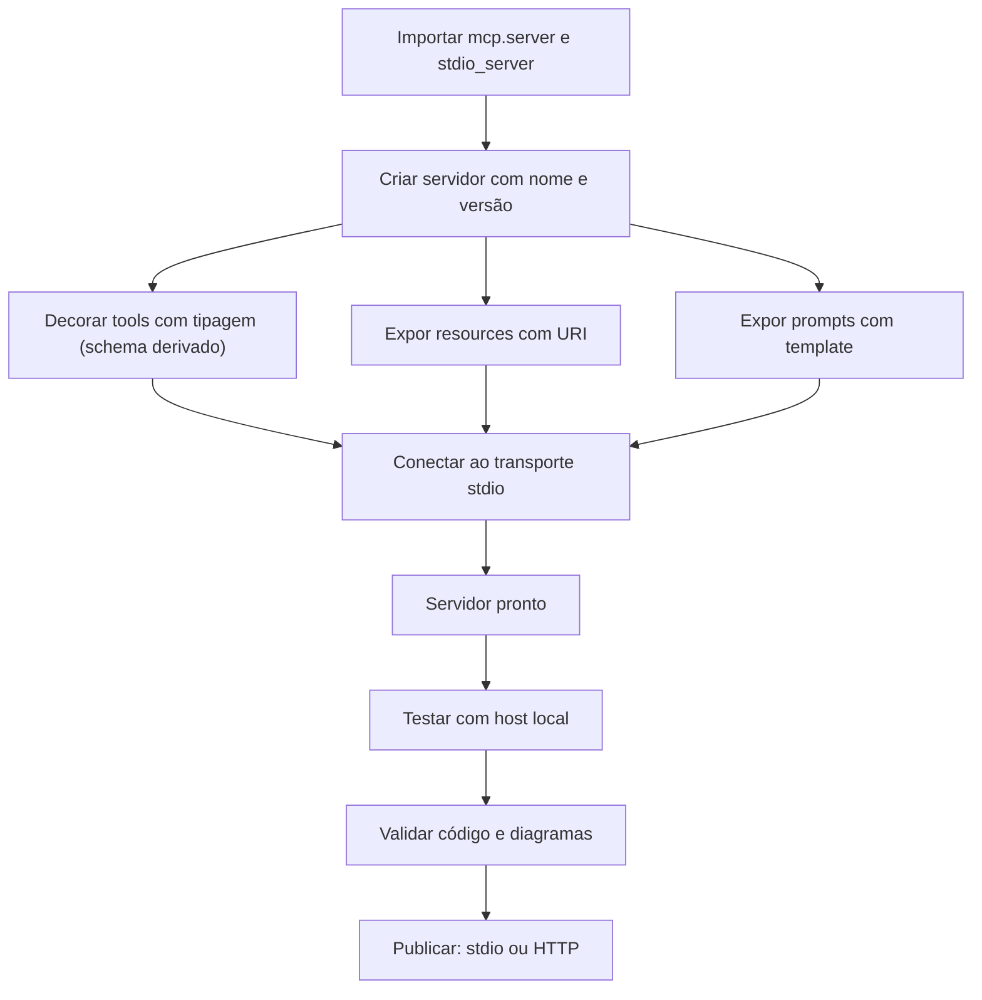

# Capítulo 6 — Servidores MCP em Python: da tipagem ao deploy

## 1. Introdução

O Capítulo 5 construiu um servidor MCP em TypeScript — a primeira das duas linguagens de primeira classe do protocolo [7]. Este capítulo percorre o mesmo caminho em Python, a segunda linguagem oficial [8]. A tese é direta: o SDK Python do MCP oferece uma experiência que aproveita a força da linguagem — as anotações de tipo do Python atuam diretamente como schemas de validação, eliminando o boilerplate de JSON Schema que o Capítulo 4 descreveu [8][10]. O desenvolvedor Python declara o contrato na própria assinatura da função, e o SDK cuida do resto [8][10]. O engenheiro que domina os dois caminhos — TypeScript e Python — escolhe a ferramenta certa para cada domínio: Python para dados e ciência, TypeScript para o ecossistema web [7][8]. Este capítulo ensina o caminho Python com a mesma profundidade do Capítulo 5 [8][10].

## 2. Explica

### 2.1 Por Que Python

O Python é a segunda linguagem de primeira classe do MCP [1][8]. A escolha tem razões estruturais [1][8]. Primeiro, o **domínio dos dados**: Python domina o ecossistema de dados e ciência — bancos, análise, machine learning — que os servers MCP frequentemente expõem [8][10]. Segundo, a **tipagem como schema**: o SDK Python usa as anotações de tipo como validação — uma inovação que o Capítulo 4 antecipou [8][10]. Terceiro, o **SDK oficial**: o pacote `mcp[cli]` mantém a implementação de referência [8][10]. O desenvolvedor que escolhe Python escolhe o caminho de menor atrito com o mundo dos dados [1][8].

### 2.2 A Tipagem como Schema: A Inovação do SDK Python

O SDK Python tem uma característica que o distingue [8][10]. As anotações de tipo do Python atuam como schemas de validação — a assinatura da função declara o contrato, e o SDK gera o JSON Schema a partir dela [8][10]. O desenvolvedor não escreve JSON Schema à mão (Capítulo 4); escreve tipos Python [8][10]. O resultado é duplo [8][10]. Primeiro, **produtividade**: o contrato é declarado uma única vez [10]. Segundo, **consistência**: o tipo que valida é o tipo que o compilador verifica [10]. A inovação é a materialização do design por contratos na linguagem [4][8][10].

### 2.3 A Estrutura de um Servidor Python

Um servidor MCP em Python tem uma estrutura padrão [8][10]. Primeiro, a **importação do SDK**: `from mcp.server import Server` e `from mcp.server.stdio import stdio_server` [8]. Segundo, a **instanciação**: criar o servidor com nome e versão [8]. Terceiro, o **registro de tools**: funções decoradas com tipagem [8][10]. Quarto, o **transporte**: conectar ao stdio [8]. A estrutura é análoga à do TypeScript — com a sintaxe mais concisa do Python [7][8]. O padrão é uniforme em qualquer capacidade [8].

### 2.4 O Registro de Tools com Tipagem

O registro de tools no Python usa decorators [8][10]. A função é anotada com tipos; o SDK gera o schema [8][10]. O handler recebe os argumentos validados e retorna o resultado [8]. A tipagem valida em tempo de execução — via o schema gerado — e em tempo de desenvolvimento — via o tipo [10]. O padrão profissional registra tools com docstrings claras — a descrição que o modelo lê (Capítulo 4) [4][8]. O contraste com o TypeScript é instrutivo: no TypeScript, o schema é explícito; no Python, o schema é derivado [7][8][10].

### 2.5 O Registro de Resources e Prompts

Os resources e prompts seguem o mesmo padrão decorado [8][10]. Resources são expostos com URIs e handlers de leitura [5][8]. Prompts são expostos com templates e handlers de obtenção [2][8]. A estrutura é uniforme: declarar, implementar, conectar [8]. O engenheiro que domina o padrão expõe qualquer combinação de primitivas [8].

### 2.6 O Fluxo de Desenvolvimento

O fluxo de desenvolvimento em Python é iterativo [10][11]. Primeiro, o **esqueleto**: servidor vazio conectado ao stdio [10]. Segundo, as **capacidades**: tools com tipagem registradas uma a uma [8]. Terceiro, o **teste**: conectar a um host local e verificar o comportamento [11]. Quarto, a **validação**: rodar o CI de código e a validação de diagramas [8]. O ciclo curto é o mesmo do TypeScript — com a sintaxe mais concisa [7][8][10].

### 2.7 O Deploy: Do stdio ao HTTP

O deploy em Python segue a decisão de transporte do Capítulo 3 [3][8]. No desenvolvimento, stdio [3][11]. Em produção remota, Streamable HTTP [3][8]. O SDK oferece os dois transportes [8]. A migração é a prova da separação mensagem-transporte: a lógica de negócio não muda — apenas o canal [3][8]. O padrão profissional publica o server remoto com autenticação OAuth 2.1 e auditoria [3][6][8].

### 2.8 O Python no Ecossistema MCP

O Python ocupa um lugar central no ecossistema MCP [8][22]. Servers de dados, bancos e ciência são tipicamente Python [8][22]. O registro oficial cataloga milhares de servers Python [12][22]. O desenvolvedor Python tem acesso ao mesmo ecossistema de hosts e clients [8]. O domínio das duas linguagens — TypeScript e Python — é o que separa o profissional completo do especialista parcial [7][8].

## 3. Ilustra

### 3.1 A Analogia do Formulário Automático

A analogia do formulário automático ilumina a tipagem como schema [8][10]. No TypeScript, o desenvolvedor preenche o formulário (JSON Schema) à mão e depois o valida [7][4]. No Python, o formulário é gerado automaticamente a partir das respostas (tipos) [8][10]. A analogia funciona em profundidade: o formulário gerado é sempre consistente com as respostas — não há divergência entre o que se declara e o que se valida [8][10]. O desenvolvedor escreve uma vez e o sistema deriva o resto [10].

### 3.2 O Diagrama do Fluxo de Construção Python

O diagrama abaixo representa o fluxo de construção em Python [8][10].



O diagrama mostra o caminho paralelo ao do TypeScript [7][8]. A diferença está no meio: o schema é derivado da tipagem, não declarado à mão [8][10]. A estrutura é linear e previsível [8].

### 3.3 O Antes e o Depois na Prática

A comparação concreta ajuda a fixar o conceito [8][10]. **Antes (schema manual)**: o desenvolvedor escreve o JSON Schema ao lado da função — duas fontes de verdade que podem divergir [4][8]. **Depois (tipagem como schema)**: a função declara o contrato e o SDK deriva o schema — uma única fonte de verdade [8][10]. A diferença não está na funcionalidade — está na consistência e na produtividade [8][10].

## 4. Técnica

### 4.1 O Esqueleto do Servidor

O primeiro instrumento é o esqueleto do servidor [8]. O código abaixo demonstra a estrutura mínima com o SDK Python [8][10]:

```python
from mcp.server import Server
from mcp.server.stdio import stdio_server

# Cria o servidor com nome e versão
servidor = Server("meu-servidor-python")


async def principal():
    async with stdio_server() as (entrada, saida):
        await servidor.run(entrada, saida)


if __name__ == "__main__":
    import asyncio
    asyncio.run(principal())
```

O esqueleto demonstra a estrutura mínima: servidor criado e conectado ao stdio [8][10]. O padrão `async` é a convenção do SDK Python [10]. A estrutura é análoga à do TypeScript — com a sintaxe mais concisa [7][8].

### 4.2 Registrando Tools com Tipagem

O segundo instrumento é o registro de tools com tipagem [8][10]. O código abaixo demonstra o contrato derivado [8][10]:

```python
from mcp.server import Server
from mcp.types import Tool, TextContent

servidor = Server("meu-servidor-python")


@servidor.list_tools()
async def listar_tools() -> list[Tool]:
    """Lista as ferramentas do servidor."""
    return [
        Tool(
            name="consultar_clima",
            description="Consulta a previsão do tempo para uma cidade.",
            inputSchema={
                "type": "object",
                "properties": {
                    "cidade": {"type": "string", "description": "Nome da cidade"},
                },
                "required": ["cidade"],
            },
        )
    ]


@servidor.call_tool()
async def chamar_tool(nome: str, argumentos: dict) -> list[TextContent]:
    """Executa uma ferramenta do servidor."""
    if nome == "consultar_clima":
        cidade = argumentos["cidade"]
        previsao = await buscar_previsao(cidade)
        return [TextContent(type="text", text=f"Previsão para {cidade}: {previsao}")]
    raise ValueError(f"Tool desconhecida: {nome}")
```

O registro demonstra o padrão decorado do SDK Python [8][10]. O `inputSchema` ainda é explícito no SDK atual — mas a linha v2 usa a tipagem como schema [8][10]. A docstring é a descrição que o modelo lê — a interface do Capítulo 4 [4][8].

### 4.3 O Padrão da Linha v2: Tipagem como Schema

O terceiro instrumento é o padrão da linha v2 do SDK [8][10]. O código abaixo demonstra a tipagem como schema [10]:

```python
from mcp.server.fastmcp import FastMCP

# Servidor com tipagem como schema
servidor = FastMCP("meu-servidor-v2")


@servidor.tool()
def consultar_clima(cidade: str) -> str:
    """Consulta a previsão do tempo para uma cidade.

    Args:
        cidade: Nome da cidade a consultar.
    """
    previsao = buscar_previsao(cidade)
    return f"Previsão para {cidade}: {previsao}"


@servidor.tool()
def somar(a: int, b: int) -> int:
    """Soma dois inteiros.

    Args:
        a: Primeiro número.
        b: Segundo número.
    """
    return a + b


if __name__ == "__main__":
    servidor.run()
```

O código demonstra a inovação do SDK v2: o tipo `cidade: str` e a docstring geram o schema [10]. O desenvolvedor declara o contrato na assinatura — a materialização do design por contratos [4][10]. A função é a tool; o tipo é o schema; a docstring é a descrição [10].

## 5. Aplica

### 5.1 Onde Isso Vive no Mundo Real

Servidores MCP em Python estão em toda parte em 2026 [8][22]. Servers de banco expõem queries via Python [8][22]. Servers de dados expõem análises e datasets [8][22]. Servers de machine learning expõem modelos e previsões [8][22]. O registro oficial cataloga milhares de servers Python [12][22]. O Python é a espinha dorsal dos servers de dados [8][22].

### 5.2 O Erro Comum do Iniciante

O erro mais comum de quem começa é ignorar a tipagem [8][10]. O iniciante escreve handlers sem tipos e sem docstrings — o modelo não tem descrição para decidir a chamada, e o schema não valida a entrada [4][8][10]. Outro erro clássico: misturar a lógica de negócio com o protocolo, dificultando o teste e a migração de transporte [3][8]. A lição é a mesma dos capítulos anteriores: o contrato — tipos, docstrings, escopo — é a qualidade do server [4][8][10].

### 5.3 O Padrão Profissional em 2026

O padrão profissional em 2026 constrói servers Python com disciplina [8][10]. O SDK oficial é a base [8]. As tools têm tipagem completa e docstrings claras [4][8][10]. Os resources são servidos sob demanda com URIs estáveis [5][8]. Os prompts estruturam as interações [2][8]. O menor privilégio é aplicado a cada primitiva [6]. O código passa por revisão de segurança [6][16]. O resultado é um server pronto para produção [8].

### 5.4 Como Este Livro é Organizado

Este capítulo estabeleceu a construção em Python; os próximos continuam a prática [8]. O Capítulo 7 ensina a consumir servers existentes em vez de construir [22]. Os Capítulos 8 e 9 cobrem a segurança dos servers [6][15][16]. O Capítulo 10 sintetiza a disciplina de MCP Engineering [15][19]. A construção deste capítulo, somada à do Capítulo 5, cobre as duas linguagens oficiais [7][8].

### 5.5 O Design por Contratos em Python

O leitor que domina o design por contratos (Capítulo 4) encontra no Python sua expressão natural [4][8][10]. O contrato é o tipo: a assinatura da função declara o que a tool aceita e retorna [8][10]. A docstring declara a descrição que o modelo lê [4][8]. A tipagem valida em tempo de desenvolvimento e o schema derivado valida em tempo de execução [10]. O padrão profissional versiona os contratos com o código [4][8]. A revisão de um contrato é a primeira linha de defesa — o Capítulo 9 mostra por quê [16].

A evolução do contrato é contínua [4][8]. Novas tools são adicionadas com revisão de escopo [6][8]. Tipos mudam com versionamento explícito [4][8]. O engenheiro que trata o contrato como interface pública constrói servers que evoluem sem quebrar os clientes [4][8].

### 5.6 O Teste do Servidor Python

O teste é parte da construção profissional [8][11]. O fluxo começa no host local: conectar o server ao Claude Desktop ou a um host de teste e verificar as capacidades [11]. Depois, os testes automatizados: iniciar o server como subprocesso, chamar as tools e validar os resultados [8]. O padrão profissional adiciona testes de contrato: a tipagem declara o que a tool aceita, e o teste verifica [4][8][10]. O ecossistema Python oferece pytest e ferramentas de teste robustas [8]. A validação de código do pipeline complementa o ciclo [8].

### 5.7 O Deploy em Produção

O deploy de um server Python segue a topologia do Capítulo 3 [3][8]. No desenvolvimento, stdio [3][11]. Em produção remota, Streamable HTTP com autenticação [3][6][8]. O padrão profissional adiciona ao deploy [6][8]: TLS, validação de origem, OAuth 2.1, sessão explícita e auditoria [3][6]. O CIS Companhion Guide aplica os controles de aplicação e rede ao deploy [20]. O deploy seguro é a ponte entre o server bem construído e o sistema em produção [6][8].

### 5.8 O Roteiro de Construção do Servidor Python

A construção em Python é um processo em fases [8][10]. A primeira fase é o **esqueleto**: servidor vazio conectado ao transporte [10]. A segunda é o **inventário**: definir as capacidades do domínio (Capítulo 4) [4][8]. A terceira é a **implementação**: registrar tools com tipagem, resources e prompts [8][10]. A quarta é a **validação**: testar no host local e rodar o CI [8][11]. A quinta é a **publicação**: escolher o transporte e publicar com segurança [3][8]. Cada fase tem entregável e critério de aceite [8].

### 5.9 O Servidor Python e a Revisão Autônoma

A revisão autônoma entre harness depende de servers bem construídos — em qualquer linguagem [1][8]. O server Python de dados expõe tools de consulta que o revisor usa [8][22]. A qualidade da revisão depende da qualidade das capacidades [8]. Tools com tipagem e docstrings claras produzem revisões precisas [4][8][10]. O engenheiro que constrói servers para revisão constrói sistemas auto-auditáveis [1][8].

### 5.10 O Servidor Python e a Governança Organizacional

Os servers Python materializam a governança [6][8]. O código é propriedade da organização — com revisão e versionamento [6][8]. O inventário de capacidades é documentado [4][6]. O menor privilégio é aplicado por política [6]. A auditoria registra cada chamada [6][20]. O CIS Companhion Guide aplica os controles de segurança de aplicação ao código [20]. A governança do server é parte da disciplina de MCP Engineering [15][19].

### 5.11 O Caso do Servidor de Dados Sem Contrato

Para fechar com uma aplicação concreta, este estudo de caso mostra o server Python sem contrato [4][6]. O cenário: uma equipe publica um server de dados com handlers sem tipagem e sem docstrings [4][8]. O primeiro sintoma: o modelo chama as tools com argumentos errados — sem validação, a falha aparece na execução [4][8]. O segundo sintoma: a descrição vaga faz o modelo usar a tool errada para tarefas parecidas [4]. O terceiro sintoma: uma descrição maliciosa em dados externos explora a falta de validação (tool poisoning — Capítulo 9) [16].

O diagnóstico correto: o server sem contrato era a porta de entrada [4]. O tratamento: adicionar tipagem, docstrings e validação a cada tool [4][8][10]. A lição do caso é a cascata: um atalho de implementação criou ambiguidade; a ambiguidade causou chamadas erradas; a falta de validação ampliou o risco [4][6]. O caso demonstra o tema do capítulo: em Python, o contrato é gratuito — ignorá-lo é escolher o risco [4][8][10].

### 5.12 O Servidor Python e a Interface com os Modelos

O server Python interage com a diversidade de modelos [2][8]. O contrato das tools é o que qualquer modelo lê [4][8]. O primeiro princípio é a **neutralidade**: o server não depende do modelo [8]. O segundo é a **revalidação**: ao trocar de modelo, o uso das tools muda — revalidar descrições e schemas [4][8]. O terceiro é a **observabilidade**: registrar qual modelo chamou qual tool [6][20]. A interface server-modelo é o ponto onde o Livro 2 encontra o Livro 4 [2][4][8].

### 5.13 O Manual do Diagnóstico Rápido do Servidor Python

O capítulo fecha com o manual do diagnóstico rápido do server Python [8]. O primeiro item é a **conexão**: o server conecta ao transporte e aparece no host? [8][11]. O segundo é a **listagem**: as tools, resources e prompts aparecem? [4][5][8]. O terceiro é a **chamada**: as tools executam e retornam no formato do protocolo? [4][8]. O quarto é a **tipagem**: os tipos validam a entrada? [8][10].

O quinto item é o **contrato**: docstrings claras e schemas derivados? [4][8][10]. O sexto é o **escopo**: o menor privilégio aplicado? [6]. O sétimo é a **auditoria**: cada chamada é registrada? [6][20]. O oitavo é a **evolução**: o server é revisado contra o uso real? [6][8]. O manual é o resumo operacional da construção: cada item aponta o capítulo que o desenvolve [8]. O engenheiro que percorre o manual em minutos evita dias de depuração [8].

### 5.14 O Servidor Python e os Limites Éticos da Exposição

O server expõe capacidades — e exposição cria responsabilidade [4][6]. O primeiro limite é o da **fronteira de ação**: nem toda tool que pode existir deve existir [6]. O segundo é o da **transparência**: o usuário sabe quais capacidades o server expõe [6]. O terceiro é o do **consentimento**: ações sensíveis exigem autorização explícita [6]. O quarto é o da **auditoria**: as ações são registradas [6][20]. A ética da exposição é uma dimensão de cada decisão de construção [6].

### 5.15 O Futuro da Construção em Python

A construção em Python evolui com o ecossistema [8][10]. O SDK v2 consolida a tipagem como schema [10]. As tendências visíveis apontam a evolução [8]. A primeira é o **FastMCP**: a interface de alto nível simplifica a construção [10]. A segunda é a **tipagem como schema**: o padrão da linha v2 [10]. A terceira é a **integração com o ecossistema de dados**: pandas, SQLAlchemy e afins expostos como tools [8][22]. O engenheiro que domina os fundamentos não será surpreendido pelas tendências [8][10].

### 5.16 O Fechamento do Capítulo

O capítulo se encerra com a consolidação da construção em Python [8]. O SDK oficial cuida do protocolo; o desenvolvedor cuida das capacidades [8][10]. A tipagem como schema é a inovação que materializa o design por contratos [4][8][10]. Tools, resources e prompts formam a superfície [4][5][8]. O menor privilégio em cada primitiva [6]. O próximo capítulo muda o foco: em vez de construir, consumir — o registro oficial e o ecossistema [12][22].

### 5.17 O Padrão de Projeto do Servidor Python

A construção de servers Python seguiu o mesmo padrão de projeto do TypeScript — com a expressão própria da linguagem [7][8]. O padrão tem as mesmas camadas [8]. A camada de **protocolo**: o SDK cuida do handshake, do transporte e das mensagens [8][10]. A camada de **capacidades**: tools decoradas, resources e prompts registrados [8]. A camada de **domínio**: a lógica de negócio [8]. A separação é a chave — e o Python a reforça com a tipagem [8][10].

O padrão Python tem uma particularidade: a tipagem como schema (seção 4.3) une a camada de capacidades à de contrato [10][8]. A função decorada declara o contrato na própria assinatura [10]. A lógica de domínio chama serviços externos [8]. O teste da lógica em isolamento é simples [8]. O engenheiro que domina o padrão constrói servers Python com previsibilidade [8][10].

O padrão também estrutura a evolução [8][6]. A adição de uma tool segue o mesmo fluxo: decorar, implementar, testar [8]. A mudança de transporte muda a camada de protocolo, não a de domínio [3][8]. A revisão de segurança percorre as camadas [6][8]. O padrão de projeto é a materialização da arquitetura do Capítulo 2 na linguagem de dados [2][8].

### 5.18 O Ecossistema Python de Servers

O Python tem um ecossistema próprio de servers MCP — a manifestação da escolha da linguagem [8][22]. Servers de banco expõem consultas [8][22]. Servers de dados expõem análises e datasets [22]. Servers de machine learning expõem modelos [22]. O FastMCP simplifica a construção [10]. O registro oficial cataloga servers Python para os mais variados domínios [12][22].

O ecossistema Python tem características próprias [8][22]. Primeiro, a **densidade de dados**: servers de dados e ciência dominam [8][22]. Segundo, a **integração com bibliotecas**: pandas, SQLAlchemy e afins viram tools [8][22]. Terceiro, a **simplicidade**: o FastMCP reduz o boilerplate [10]. O engenheiro Python tem um caminho de menor atrito para servers de dados [8][22].

O engenheiro que domina o ecossistema Python escolhe entre construir (Capítulo 6) e consumir (Capítulo 7) com critério [8][22]. Servers oficiais para serviços maduros [22]. Construção própria para domínios críticos [8]. O ecossistema é a segunda metade da decisão [8][22].

### 5.19 O Servidor Python e a Ciência de Dados

O servidor Python encontra na ciência de dados sua aplicação mais natural [8][22]. O cientista de dados constrói servers que expõem análises, modelos e datasets ao agente [8][22]. A ponte é direta [8]. O pandas transforma dados em resources [8]. O scikit-learn expõe modelos como tools [8][22]. O agente consulta e o server calcula [8].

A aplicação na ciência de dados tem implicações de segurança [6][8]. Servers de dados expõem informações sensíveis [6]. O menor privilégio define quais colunas e quais consultas [6]. O audit log registra quem consultou o quê [6][20]. A governança de dados (Capítulo 10) se aplica com força [6][15]. O engenheiro que constrói servers de dados projeta a fronteira do acesso [6][8].

O servidor Python de dados é a demonstração da tese do Capítulo 1 [1][8]. O agente isolado não consulta dados; o agente conectado consulta [1][8]. O server Python é a ponte [8]. O cientista de dados que domina o Capítulo 6 transforma análise em capacidade de agente [8][22].

### 5.20 O Ecossistema Python de Ferramentas

O Python tem um ecossistema de ferramentas que acompanha a construção de servers [8][10]. O pip e o uv gerenciam dependências [10]. O ruff e o mypy verificam o código [8][10]. O pytest testa [8]. O asyncio gerencia a concorrência [10]. O engenheiro Python constrói com a cadeia completa [8][10].

O ecossistema de ferramentas tem implicações para o MCP [8][10]. Primeiro, a **tipagem verificada**: o mypy valida os contratos [10]. Segundo, o **teste automatizado**: o pytest roda os testes do server [8]. Terceiro, o **CI completo**: lint, tipagem e teste no pipeline [8]. O engenheiro que usa a cadeia completa constrói servers com qualidade verificada [8][10].

O ecossistema também inclui o FastMCP (seção 4.3) [10]. O FastMCP simplifica a construção e mantém a tipagem [10]. O engenheiro que conhece a cadeia escolhe as ferramentas certas para cada etapa [8][10].

### 5.21 O Server Python e o Tratamento de Erros

O tratamento de erros no server Python é uma disciplina [8][4]. Os erros têm classes [8]. Os erros de validação: entradas que violam os tipos [4][8]. Os erros de execução: falhas no domínio [8]. Os erros de protocolo: mensagens desconhecidas [8]. O engenheiro classifica e responde a cada classe [8].

O tratamento de erros tem práticas [8][4]. Primeiro, a **validação pela tipagem**: os tipos rejeitam entradas ruins cedo [8][10]. Segundo, o **erro acionável**: a mensagem diz o que fazer [8][4]. Terceiro, a **separação de erros**: erros de domínio não viram erros de protocolo [8]. O engenheiro que trata os erros com método constrói servers que se comunicam [8][4].

O tratamento de erros interage com o feedback do modelo [4][8]. O erro acionável permite a auto-correção [4][8]. O engenheiro que escreve erros que ensinam melhora o uso do modelo [4][8].

### 5.22 O Server Python e a Revisão de Código

A revisão de código do server Python é uma etapa de qualidade e segurança [6][8]. A revisão tem focos [6][8]. Primeiro, o **contrato**: a tipagem e as docstrings são precisas [4][8]. Segundo, o **escopo**: o menor privilégio em cada tool [6]. Terceiro, a **segurança**: a validação cobre os caminhos de ataque [6][16]. Quarto, o **domínio**: a lógica está correta [8]. O engenheiro revisa o server inteiro [6][8].

A revisão de código tem práticas [6][8]. O pull request passa por revisão de segurança [6]. O checklist de revisão inclui os focos [6]. A revisão de docstrings é revisão de segurança (Capítulo 9) [16][6]. O engenheiro que revisa com método constrói servers confiáveis [6][8].

A revisão de código é parte do MCP Engineering (Capítulo 10) [6][15]. O processo de revisão é a governança do código [6][15]. O engenheiro que domina a revisão transforma o servidor em ativo auditado [6][8].

### 5.23 O Server Python e a Documentação Automática

A documentação automática acompanha a construção em Python [8][10]. O FastMCP e as ferramentas geram documentação a partir das docstrings e dos tipos [10]. Os schemas das tools são derivados da tipagem (seção 4.3) [8][10]. As docstrings viram descrições [4][8]. O engenheiro que automatiza a documentação mantém a superfície descrita [8][10].

A documentação automática tem implicações [4][8]. A documentação acompanha o código — sem divergência [8]. A documentação é consumível por humanos e modelos [4][8]. A revisão da documentação é parte da revisão (seção 5.22) [4][6]. O engenheiro que automatiza a documentação constrói servers compreensíveis [8].

A documentação automática interage com o contrato (seção 5.5) [4][8]. O tipo e a docstring geram a documentação [8][10]. A documentação valida o contrato [4][8]. O engenheiro que domina o ciclo constrói superfícies auto-descritas [4][8].

### 5.24 O Server Python e a Compatibilidade de Versões

A compatibilidade de versões é uma disciplina do server em produção [4][8]. A especificação MCP evoluiu [3][4]. O SDK Python acompanha as versões [8][10]. O server declara a versão do protocolo que suporta [2][8]. O engenheiro gerencia a compatibilidade [4][8].

A gestão da compatibilidade tem práticas [4][8]. Primeiro, a **declaração**: o server informa a versão no handshake [2][8]. Segundo, a **negociação**: o client e o server acordam a versão [2]. Terceiro, a **migração**: a atualização é testada antes do deploy [8]. O engenheiro que gerencia a compatibilidade evita quebras [4][8].

A compatibilidade de versões é parte da evolução do contrato [4][8]. O contrato evolui com o protocolo [4]. O engenheiro que domina a compatibilidade constrói servers que sobrevivem à evolução [4][8].

### 5.25 O Server Python e a Performance

A performance do server Python é uma disciplina de produção [8][3][20]. A performance tem dimensões [3][8]. A latência de chamada [3]. O throughput [3]. O uso de recursos [8]. O Python tem perfil próprio — a performance depende do domínio [8]. O engenheiro que mede a performance gerencia a experiência [3][8].

A otimização de performance tem práticas [3][8]. Primeiro, a **medição**: os perfis de latência são coletados [3][20]. Segundo, a **identificação**: os gargalos são localizados [8]. Terceiro, a **otimização**: o domínio é otimizado — bibliotecas nativas, cache, assincronia [8]. O engenheiro que otimiza com método evita a otimização prematura [8].

A performance interage com a experiência do modelo [3][4]. A latência da tool é a latência percebida pelo agente [3][4]. O engenheiro que gerencia a performance constrói agentes responsivos [3][8].

### 5.26 O Server Python e a Escalabilidade

A escalabilidade do server Python segue a topologia do Capítulo 3 [3][8]. O server stdio escala por processo [3]. O server HTTP escala por serviço [3]. A escalabilidade tem estratégias [3][8]. Primeiro, o **stateless design**: o server sem estado interno escala horizontalmente [3]. Segundo, o **cache**: os resultados frequentes são cacheados [3]. Terceiro, a **fila**: as cargas pesadas são filas [3]. O engenheiro que projeta para a escala constrói servers que crescem [3][8].

A escalabilidade interage com a sessão (Capítulo 3) [3]. A sessão stateful limita a escala [3]. O balanceamento de sessões exige afinidade [3]. O engenheiro que entende o trade-off escolhe o design certo [3][8].

A escalabilidade é parte do MCP Engineering (Capítulo 10) [6][8]. O crescimento da demanda é planejado [6]. O engenheiro que domina a escalabilidade constrói servers prontos para o sucesso [3][8].

### 5.27 O Server Python e o Ecossistema de Dados

O server Python encontra no ecossistema de dados a sua casa natural [8][22]. O pandas, o SQLAlchemy e o scikit-learn são os materiais do domínio [8][22]. O engenheiro que constrói servers de dados integra as bibliotecas às primitivas [8]. As consultas viram tools; os schemas viram resources; as análises viram prompts [4][5][2][8]. O server Python de dados é a ponte entre o agente e o dado [8][22].

O ecossistema de dados tem implicações de governança [6][8]. Os dados são o ativo mais sensível [6]. O menor privilégio define o acesso às colunas [6]. O audit log registra as consultas [6][20]. O engenheiro que constrói servers de dados aplica o Capítulo 8 com rigor [6][8].

O engenheiro que domina o ecossistema de dados constrói os servers mais valiosos da organização [8][22]. A ponte entre o agente e o dado é a aplicação central do MCP na empresa [1][8]. O Capítulo 6 ensinou o caminho; o Capítulo 10 governará o destino [6][8].

## 6. Conclusão

Construir um servidor MCP em Python é a segunda aplicação prática das primitivas [8]. Este capítulo estabeleceu o caminho: o SDK oficial cuida do protocolo — handshake, transporte, mensagens — e o desenvolvedor foca nas capacidades [8][10]. A tipagem como schema é a inovação que materializa o design por contratos do Capítulo 4 [4][8][10]. Tools com tipos e docstrings claras, resources sob demanda e prompts estruturados formam a superfície [4][5][8]. O menor privilégio em cada primitiva é a disciplina de segurança [6]. O próximo capítulo muda o foco: consumir o ecossistema existente [12][22].

## 7. Referências

[1] ANTHROPIC. Introducing the Model Context Protocol. Anthropic News, 25 nov. 2024. Disponível em: https://www.anthropic.com/news/model-context-protocol. Acesso em: 5 ago. 2026.
[2] MODEL CONTEXT PROTOCOL. Architecture. MCP Specification 2025-11-25, 25 nov. 2025. Disponível em: https://modelcontextprotocol.io/specification/2025-11-25/architecture. Acesso em: 5 ago. 2026.
[3] MODEL CONTEXT PROTOCOL. Basic Specification: Transports. MCP Specification 2025-11-25, 2025. Disponível em: https://modelcontextprotocol.io/specification/2025-11-25/basic/transports. Acesso em: 5 ago. 2026.
[4] MODEL CONTEXT PROTOCOL. Specification 2026-07-28: Server Tools. MCP Specification, 28 jul. 2026. Disponível em: https://modelcontextprotocol.io/specification/2026-07-28/server/tools. Acesso em: 5 ago. 2026.
[5] MODEL CONTEXT PROTOCOL. Specification 2026-07-28: Server Resources. MCP Specification, 28 jul. 2026. Disponível em: https://modelcontextprotocol.io/specification/2026-07-28/server/resources. Acesso em: 5 ago. 2026.
[6] MODEL CONTEXT PROTOCOL. Security Best Practices (Draft). MCP Specification. Disponível em: https://modelcontextprotocol.io/specification/draft/basic/security_best_practices. Acesso em: 5 ago. 2026.
[7] MODEL CONTEXT PROTOCOL. TypeScript SDK. GitHub Repository, 2026. Disponível em: https://github.com/modelcontextprotocol/typescript-sdk. Acesso em: 5 ago. 2026.
[8] MODEL CONTEXT PROTOCOL. Python SDK. GitHub Repository, 2026. Disponível em: https://github.com/modelcontextprotocol/python-sdk. Acesso em: 5 ago. 2026.
[9] MODEL CONTEXT PROTOCOL. TypeScript SDK Documentation. MCP SDK Portal, 2026. Disponível em: https://ts.sdk.modelcontextprotocol.io/. Acesso em: 5 ago. 2026.
[10] MODEL CONTEXT PROTOCOL. Python SDK Documentation. MCP SDK Portal, 2026. Disponível em: https://py.sdk.modelcontextprotocol.io/. Acesso em: 5 ago. 2026.
[11] MODEL CONTEXT PROTOCOL. Quickstart Guide. MCP Documentation. Disponível em: https://modelcontextprotocol.io/docs/quickstart/quickstart. Acesso em: 5 ago. 2026.
[12] MODEL CONTEXT PROTOCOL. MCP Registry Preview. Official MCP Blog, 8 set. 2025. Disponível em: https://blog.modelcontextprotocol.io/posts/2025-09-08-mcp-registry-preview/. Acesso em: 5 ago. 2026.
[13] MODEL CONTEXT PROTOCOL. Registry Repository. GitHub Repository, 2025–2026. Disponível em: https://github.com/modelcontextprotocol/registry. Acesso em: 5 ago. 2026.
[14] GITHUB. GitHub MCP Registry: the fastest way to discover AI tools. GitHub Changelog, 16 set. 2025. Disponível em: https://github.blog/changelog/2025-09-16-github-mcp-registry-the-fastest-way-to-discover-ai-tools/. Acesso em: 5 ago. 2026.
[15] CLOUD SECURITY ALLIANCE. Agentic MCP Security Best Practices Guide v1. CSA Labs, 27 mar. 2026. Disponível em: https://labs.cloudsecurityalliance.org/agentic/agentic-mcp-security-best-practices-v1/. Acesso em: 5 ago. 2026.
[16] INVARIANT LABS. MCP Security Notification: Tool Poisoning Attacks. Invariant Labs Blog, 1 abr. 2025. Disponível em: https://invariantlabs.ai/blog/mcp-security-notification-tool-poisoning-attacks. Acesso em: 5 ago. 2026.
[17] WILLISON, Simon. Model Context Protocol has prompt injection security problems. Simon Willison's Weblog, 9 abr. 2025. Disponível em: https://simonwillison.net/2025/Apr/9/mcp-prompt-injection/. Acesso em: 5 ago. 2026.
[18] WANG, Zhen et al. (Tsinghua University & Ant Group). Systematic Analysis of MCP Security (MCPLib). arXiv:2508.12538, 18 ago. 2025. Disponível em: https://arxiv.org/html/2508.12538v1. Acesso em: 5 ago. 2026.
[19] CISA. Guide to Secure Adoption of Agentic AI. CISA News, 1 mai. 2026. Disponível em: https://www.cisa.gov/news-events/news/cisa-us-and-international-partners-release-guide-secure-adoption-agentic-ai. Acesso em: 5 ago. 2026.
[20] CENTER FOR INTERNET SECURITY (CIS). Model Context Protocol (MCP) Companion Guide — CIS Controls v8.1. CIS White Papers, 20 abr. 2026. Disponível em: https://www.cisecurity.org/insights/white-papers/controls-v8-1-model-context-protocol-companion-guide. Acesso em: 5 ago. 2026.
[21] NATIONAL SECURITY AGENCY (NSA). Security Design Considerations for AI-Driven Automation Leveraging the Model Context Protocol. NSA Press Release, 20 mai. 2026. Disponível em: https://www.nsa.gov/Press-Room/Press-Releases-Statements/Press-Release-View/Article/4496698/. Acesso em: 5 ago. 2026.
[22] PULSEMCP. MCP Server Directory. PulseMCP, 2025–2026. Disponível em: https://www.pulsemcp.com/servers. Acesso em: 5 ago. 2026.
