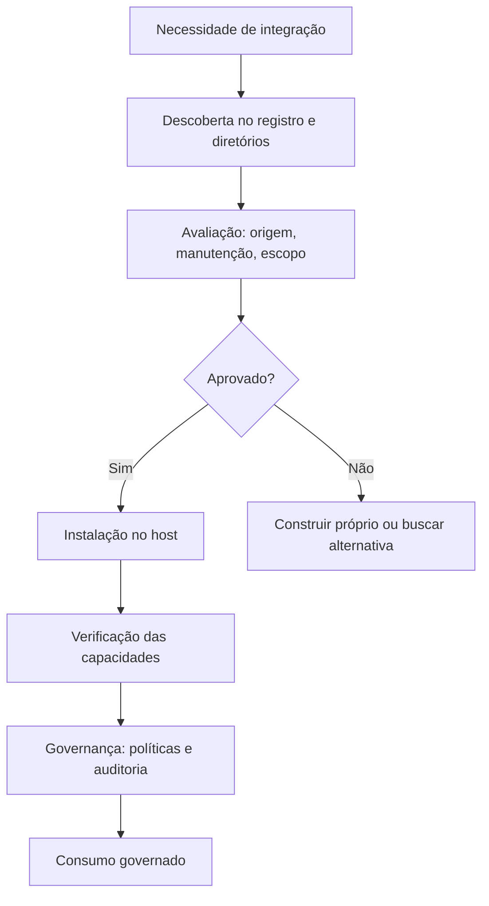

# Capítulo 7 — Consumindo servidores existentes: registro oficial e ecossistema

## 1. Introdução

Os Capítulos 5 e 6 ensinaram a construir servidores MCP do zero — em TypeScript e Python [7][8]. Este capítulo muda o foco: a maior parte da integração profissional não é construção, é consumo [22]. A tese é direta: o MCP criou um ecossistema de milhares de servidores prontos — catálogos como o registro oficial, o PulseMCP, o Glama e o MCP.so — e o engenheiro maduro sabe encontrar, avaliar, conectar e governar esses servidores com curadoria [12][22]. O registro oficial, lançado em preview em setembro de 2025 com apoio de Anthropic, GitHub, Microsoft e PulseMCP, é a fonte primária de verdade do ecossistema [12]. O consumo com curadoria é uma disciplina: nem todo servidor listado é seguro, nem toda integração pronta é adequada [6][12][22]. O engenheiro que domina o consumo conecta agentes ao mundo em minutos — e governa o acesso com o rigor do Capítulo 8 [6][22].

## 2. Explica

### 2.1 A Arquitetura do Ecossistema MCP

O ecossistema MCP tem camadas bem definidas [12][22]. Na base, o **registro oficial** (registry.modelcontextprotocol.io) — o catálogo upstream mantido pela comunidade e apoiado por Anthropic, GitHub, Microsoft e PulseMCP [12][13]. Sobre ele, os **diretórios comunitários** — PulseMCP, Glama, MCP.so e Smithery — que indexam, classificam e avaliam servidores [22]. No topo, os **mantenedores institucionais** — Anthropic, Google, AWS e GitHub publicam servidores oficiais para seus serviços [14][22]. O engenheiro usa o registro como fonte primária e os diretórios como camada de descoberta e avaliação [12][22]. A arquitetura do ecossistema é a materialização da economia do Capítulo 1: uma vez, um conector padrão; sempre, um consumidor padrão [1][12].

### 2.2 O Registro Oficial: A Fonte de Verdade

O registro oficial do MCP é o catálogo de referência [12][13]. O preview de setembro de 2025 estabeleceu o formato: metadados de servidores, endpoints e instruções de instalação [12]. O GitHub, como steward do registro, anunciou o GitHub MCP Registry em setembro de 2025 — o caminho mais rápido para descobrir ferramentas de IA [14]. O registro é o equivalente ao npm ou ao PyPI para o MCP: a fonte confiável de pacotes [12][14]. O engenheiro maduro consulta o registro antes de qualquer diretório [12][13].

### 2.3 Os Diretórios Comunitários: A Camada de Descoberta

Os diretórios comunitários complementam o registro [22]. O PulseMCP cataloga mais de 22.000 servidores — com avaliações, categorias e estatísticas de uso [22]. O Glama indexa servidores open-source [22]. O MCP.so oferece um marketplace com busca e avaliação [22]. O Smithery vai além: hospeda e faz deploy de servidores comunitários [22]. A camada de descoberta é rica — e perigosa: a abundância de opções exige curadoria [6][22]. O engenheiro usa os diretórios para descobrir e o registro para confirmar [12][22].

### 2.4 Os Servidores Oficiais dos Provedores

Os grandes provedores publicam servidores oficiais [14][22]. O GitHub mantém servidores para repositórios e issue trackers [14]. O Google Cloud oferece servidores para BigQuery e serviços de nuvem [22]. A AWS mantém servidores para documentação e serviços [22]. A Anthropic, criadora do protocolo, mantém os padrões e exemplos [1][12]. Os servidores oficiais são a opção mais confiável — mantidos pelo dono do serviço, com segurança e atualização contínuas [14][22]. O engenheiro maduro prefere o oficial ao comunitário quando existe [14][22].

### 2.5 O Fluxo de Consumo

O consumo de um servidor MCP segue um fluxo padrão [11][22]. Primeiro, a **descoberta**: encontrar o servidor no registro ou no diretório [12][22]. Segundo, a **avaliação**: revisar a origem, a manutenção e o escopo [6][22]. Terceiro, a **instalação**: configurar o servidor no host — comando, transporte e credenciais [11]. Quarto, a **verificação**: testar as capacidades no host [11]. Quinto, a **governança**: aplicar políticas de acesso e auditoria [6][15]. O fluxo é o caminho do consumo com curadoria [11][22].

### 2.6 A Avaliação de Servidores: O Checklist de Confiança

A avaliação é a etapa mais crítica do consumo [6][22]. O checklist de confiança tem critérios [6][22]. Primeiro, a **origem**: o servidor é oficial, do provedor, ou comunitário? [14][22]. Segundo, a **manutenção**: o repositório tem atividade recente e respondentes? [22]. Terceiro, o **código**: o código é revisável e auditável? [6]. Quarto, o **escopo**: as capacidades são mínimas e necessárias? [6]. Quinto, a **reputação**: avaliações, downloads e histórico de segurança [22]. O engenheiro que avalia com rigor conecta servidores confiáveis [6][22].

### 2.7 Os Riscos do Consumo Sem Curadoria

O consumo sem curadoria é o caminho dos riscos documentados do Capítulo 9 [6][16][22]. Servidores comunitários mal mantidos podem conter código malicioso [16]. Servidores com escopos amplos aumentam a superfície de ataque [6]. Servidores abandonados ficam desatualizados e vulneráveis [22]. O Capítulo 9 detalha os ataques — tool poisoning, prompt injection, SSRF [16][17][18]. A curadoria do consumo é a primeira linha de defesa [6][22].

### 2.8 O Consumo Como Disciplina

O consumo de servidores é uma disciplina — não uma conveniência [6][22]. A disciplina tem princípios [6]. Primeiro, a **preferência pelo oficial**: servidores mantidos pelo dono do serviço [14][22]. Segundo, a **avaliação sistemática**: o checklist de confiança em toda integração [6][22]. Terceiro, o **menor escopo**: integrar apenas o necessário [6]. Quarto, a **governança contínua**: revisar as integrações periodicamente [15][20]. O engenheiro que consome com disciplina constrói sistemas conectados e seguros [6][22].

## 3. Ilustra

### 3.1 A Analogia do Mercado de Aplicativos

A analogia do mercado de aplicativos ilumina o consumo [12][22]. O registro oficial é a loja oficial — curada e verificada [12]. Os diretórios são os marketplaces alternativos — abundantes, mas heterogêneos [22]. Os servidores são os aplicativos — com avaliações, manutenção e reputação [22]. A analogia funciona em profundidade: o usuário maduro não instala qualquer aplicativo — avalia a origem, as permissões e o histórico [6][22]. Da mesma forma, o engenheiro maduro não conecta qualquer servidor [6][22].

### 3.2 O Diagrama do Fluxo de Consumo

O diagrama abaixo representa o fluxo de consumo com curadoria [12][22].



O diagrama mostra o fluxo completo do consumo com curadoria [6][22]. A avaliação é o portão de decisão: aprovar e integrar, ou rejeitar e construir [6][22]. A governança é a etapa final que mantém o consumo seguro [15][20].

### 3.3 O Antes e o Depois na Prática

A comparação concreta ajuda a fixar o conceito [6][22]. **Antes (consumo impulsivo)**: o engenheiro conecta o primeiro servidor que encontra — sem avaliação, com escopos amplos [6]. **Depois (consumo curado)**: o engenheiro avalia a origem, o código e o escopo antes de conectar — e governa o acesso [6][22]. A diferença não está na velocidade — está na segurança [6][22].

## 4. Técnica

### 4.1 O Checklist de Avaliação em Código

O primeiro instrumento é o checklist de avaliação automatizado [6][22]. O código abaixo implementa a avaliação de servidores [6][22]:

```python
@dataclass
class AvaliacaoServidor:
    origem: str  # "oficial", "provedor", "comunitario"
    manutencao_ativa: bool
    codigo_revisado: bool
    escopo_minimo: bool
    reputacao: float  # 0.0 a 1.0


def avaliar_servidor(av: AvaliacaoServidor) -> dict:
    """Aplica o checklist de confiança e devolve a decisão."""
    criterios = {
        "origem_confiavel": av.origem in ("oficial", "provedor"),
        "manutencao_ativa": av.manutencao_ativa,
        "codigo_revisado": av.codigo_revisado,
        "escopo_minimo": av.escopo_minimo,
        "reputacao_adequada": av.reputacao >= 0.7,
    }
    aprovados = sum(criterios.values())
    total = len(criterios)
    if aprovados == total:
        decisao = "aprovar"
    elif aprovados >= total - 1 and av.origem in ("oficial", "provedor"):
        decisao = "aprovar_com_ressalvas"
    else:
        decisao = "rejeitar"
    return {"criterios": criterios, "aprovados": aprovados, "decisao": decisao}


if __name__ == "__main__":
    print(avaliar_servidor(AvaliacaoServidor(
        origem="comunitario", manutencao_ativa=False,
        codigo_revisado=False, escopo_minimo=False, reputacao=0.3,
    )))
    print(avaliar_servidor(AvaliacaoServidor(
        origem="oficial", manutencao_ativa=True,
        codigo_revisado=True, escopo_minimo=True, reputacao=0.9,
    )))
```

O checklist demonstra a avaliação sistemática [6][22]. A decisão é baseada em critérios explícitos — não em impressão [6]. O padrão profissional mantém o checklist versionado para cada integração [6][22].

### 4.2 O Registro de Integrações em Código

O segundo instrumento é o registro de integrações [6][15]. O código abaixo modela o inventário de servidores conectados [6][15]:

```python
@dataclass
class IntegracaoMCP:
    nome: str
    origem: str
    escopos: list
    dono: str
    revisada_em: str
    status: str  # "ativa", "revisao", "removida"


class RegistroIntegracoes:
    """Inventário de integrações MCP da organização."""

    def __init__(self):
        self.integracoes = {}

    def adicionar(self, integracao: IntegracaoMCP):
        self.integracoes[integracao.nome] = integracao

    def listar_ativas(self) -> list:
        return [i for i in self.integracoes.values() if i.status == "ativa"]

    def listar_para_revisao(self) -> list:
        return [i for i in self.integracoes.values() if i.status == "revisao"]

    def remover(self, nome: str):
        if nome in self.integracoes:
            self.integracoes[nome].status = "removida"

    def resumo(self) -> dict:
        ativas = len(self.listar_ativas())
        revisao = len(self.listar_para_revisao())
        escopos_totais = sum(len(i.escopos) for i in self.integracoes.values())
        return {"ativas": ativas, "em_revisao": revisao, "escopos_totais": escopos_totais}


if __name__ == "__main__":
    reg = RegistroIntegracoes()
    reg.adicionar(IntegracaoMCP("github-repo", "provedor", ["leitura"], "equipe-dev", "2026-07-01", "ativa"))
    reg.adicionar(IntegracaoMCP("bd-analytics", "comunitario", ["leitura", "escrita"], "dados", "2025-12-01", "revisao"))
    print(reg.resumo())
    print([i.nome for i in reg.listar_para_revisao()])
```

O registro demonstra a governança do consumo [6][15]. Cada integração tem origem, escopo, dono e status [6]. O inventário é a base da auditoria [6][20].

### 4.3 O Diagrama de Preferência de Origem

O terceiro instrumento concretiza a preferência de origem [14][22]. O código abaixo implementa a política de preferência [14][22]:

```python
def prioridade_origem(origem: str) -> int:
    """Prioridade de origem: quanto menor, melhor."""
    prioridades = {"oficial": 1, "provedor": 2, "comunitario_reputado": 3,
                   "comunitario": 4, "desconhecido": 5}
    return prioridades.get(origem, 5)


def escolher_entre(opcoes: list) -> dict:
    """Escolhe a opção de melhor origem com funcionalidade equivalente."""
    ordenadas = sorted(opcoes, key=lambda o: (prioridade_origem(o["origem"]), -o["reputacao"]))
    melhor = ordenadas[0]
    return {
        "escolhido": melhor["nome"],
        "origem": melhor["origem"],
        "justificativa": "Origem de maior confiança com reputação adequada",
    }


if __name__ == "__main__":
    print(escolher_entre([
        {"nome": "servidor-comunitario", "origem": "comunitario", "reputacao": 0.5},
        {"nome": "servidor-oficial", "origem": "oficial", "reputacao": 0.95},
    ]))
```

A política demonstra a preferência pelo oficial [14][22]. Entre opções equivalentes, a origem de maior confiança vence [14][22]. A política é a materialização do princípio do Capítulo 7 [14][22].

## 5. Aplica

### 5.1 Onde Isso Vive no Mundo Real

O consumo de servidores MCP está em toda parte em 2026 [22]. Desenvolvedores conectam servidores de repositórios e issue trackers aos seus IDEs [14]. Equipes de dados conectam servidores de bancos e data warehouses [22]. Organizações inteiras consomem servidores de produtividade e comunicação [22]. O registro oficial e os diretórios catalisam o consumo [12][22]. O engenheiro maduro navega esse oceano com curadoria [6][22].

### 5.2 O Erro Comum do Iniciante

O erro mais comum de quem começa é o consumo impulsivo [6]. O iniciante conecta o primeiro servidor que encontra — sem avaliar origem, código ou escopo [6]. Quando o comportamento estranho aparece — chamadas inesperadas, dados exfiltrados —, ele não sabe por onde começar o diagnóstico [16]. Outro erro clássico: conectar dezenas de servidores de uma vez, criando uma superfície de ataque enorme [6]. A lição é a mesma dos capítulos anteriores: consumir é fácil; consumir com curadoria é a disciplina [6][22].

### 5.3 O Padrão Profissional em 2026

O padrão profissional em 2026 consome com disciplina [6][22]. O registro oficial é a fonte primária [12]. O checklist de confiança é aplicado a toda integração [6][22]. O menor escopo é a regra [6]. O inventário de integrações é mantido e revisado [15][20]. O CIS Companhion Guide aplica os controles de identidade e acesso às integrações [20]. O resultado é um ecossistema conectado e governado [6][22].

### 5.4 Como Este Livro é Organizado

Este capítulo estabeleceu o consumo; os próximos completam a segurança [22]. Os Capítulos 8 e 9 cobrem a segurança e os riscos documentados — o que torna o consumo seguro [6][15][16]. O Capítulo 10 sintetiza a disciplina de MCP Engineering [15][19]. O consumo deste capítulo é a prática diária do engenheiro MCP [22].

### 5.5 O Registro Oficial na Prática Diária

O leitor que adota o registro oficial na prática diária constrói hábitos de curadoria [12][14]. O fluxo diário começa no registro: buscar o servidor, ler os metadados, verificar a manutenção [12]. O GitHub MCP Registry tornou o fluxo mais rápido — a descoberta integrada ao ecossistema de desenvolvimento [14]. O padrão profissional mantém uma lista de servidores aprovados — a whitelist da organização [6][15]. A whitelist acelera o consumo e reduz o risco [6][15].

### 5.6 Os Diretórios Comunitários com Critério

Os diretórios comunitários são ferramentas — não fontes de verdade [22]. O PulseMCP oferece descoberta massiva; o Glama, indexação de código aberto; o MCP.so, avaliação de mercado; o Smithery, deploy [22]. O engenheiro maduro usa cada diretório pelo que ele oferece [22]. E cruza com o registro: o diretório descobre; o registro confirma [12][22]. A reputação nos diretórios é um sinal — não uma garantia [22].

### 5.7 O Custo do Consumo: Quando Construir em Vez de Consumir

A decisão construir-versus-consumir tem uma economia [22]. Consumir é mais rápido — o servidor já existe [22]. Construir é mais controlado — o código é seu [7][8]. A regra de ouro: consumir o oficial sempre que existir; consumir o comunitário com avaliação rigorosa; construir quando o domínio é crítico e o ecossistema é imaturo [7][8][22]. O engenheiro que entende a economia projeta a mistura certa [22].

### 5.8 O Roteiro de Adoção do Ecossistema

A adoção do ecossistema é um processo em fases [6][22]. A primeira fase é o **inventário de necessidades**: que integrações o sistema precisa [6]. A segunda é a **descoberta**: buscar no registro e nos diretórios [12][22]. A terceira é a **avaliação**: aplicar o checklist de confiança [6][22]. A quarta é a **integração**: instalar, verificar e governar [11][15]. A quinta é a **revisão**: revisar as integrações periodicamente [15][20]. Cada fase tem entregável e critério de aceite [6].

### 5.9 O Consumo e a Revisão Autônoma

A revisão autônoma entre harness depende do consumo curado [1][6]. O revisor consulta servidores de repositórios e registros — escolhidos com curadoria [6][14]. A qualidade da revisão depende da confiabilidade das integrações [6]. Um servidor não avaliado pode comprometer a revisão — com dados errados ou ações inesperadas [6][16]. O engenheiro que consome com curadoria constrói revisões confiáveis [1][6].

### 5.10 O Consumo e a Governança Organizacional

O consumo de servidores exige governança [6][15]. O inventário de integrações é a base [6][15]. O checklist de confiança é o processo [6][22]. A whitelist de servidores aprovados é a política [6][15]. A revisão periódica é a manutenção [15][20]. O CIS Companhion Guide aplica os controles de aquisição e configuração às integrações [20]. A governança do consumo transforma o ecossistema em ativo controlado [15][20].

### 5.11 O Caso da Integração Impulsiva

Para fechar com uma aplicação concreta, este estudo de caso mostra a integração impulsiva [6][16]. O cenário: uma equipe conecta um servidor comunitário popular para acelerar um projeto — sem avaliar o código [6][22]. O primeiro sintoma: o agente executa ações inesperadas — chamadas a APIs que a equipe não autorizou [16]. O segundo sintoma: os logs revelam exfiltração de dados para um endpoint desconhecido [16]. O terceiro sintoma: a análise mostra instruções maliciosas embutidas nas descrições das tools (tool poisoning — Capítulo 9) [16].

O diagnóstico correto: a integração impulsiva era a porta de entrada [6]. O tratamento: remover o servidor, aplicar o checklist de confiança a todas as integrações e revisar o código de cada uma [6][22]. A lição do caso é a cascata: um atalho de conveniência criou exposição; a exposição causou exfiltração; a falta de curadoria ampliou o dano [6][16]. O caso demonstra o tema do capítulo: consumir é fácil; consumir com curadoria é a disciplina [6][22].

### 5.12 O Consumo e a Interface com os Modelos

O consumo interage com a diversidade de modelos [2][22]. O servidor conectado é consumido por qualquer modelo do host [2]. O primeiro princípio é a **neutralidade**: o servidor não depende do modelo [2]. O segundo é a **revalidação**: ao trocar de modelo, o uso das capacidades muda [4]. O terceiro é a **observabilidade**: registrar qual modelo usou qual integração [6][20]. A interface consumo-modelo é o ponto onde o Livro 2 encontra o Livro 4 [2][22].

### 5.13 O Manual do Diagnóstico Rápido do Consumo

O capítulo fecha com o manual do diagnóstico rápido do consumo [6][22]. O primeiro item é a **origem**: cada integração tem origem conhecida e confiável? [14][22]. O segundo é a **avaliação**: o checklist de confiança foi aplicado? [6][22]. O terceiro é o **escopo**: o menor privilégio em cada integração? [6]. O quarto é a **manutenção**: os servidores estão atualizados e ativos? [22].

O quinto item é a **auditoria**: o uso das integrações é registrado? [6][20]. O sexto é o **inventário**: as integrações estão documentadas com donos? [6][15]. O sétimo é a **revisão**: as integrações são revisadas periodicamente? [15][20]. O manual é o resumo operacional do consumo: cada item aponta o capítulo que o desenvolve [6][22]. O engenheiro que percorre o manual em minutos evita integrações perigosas [6].

### 5.14 O Consumo e os Limites Éticos da Conveniência

O consumo de servidores cria implicações éticas [6][22]. O primeiro limite é o da **responsabilidade**: conectar um servidor é endossar suas ações [6]. O segundo é o da **transparência**: o usuário sabe quais integrações o sistema usa [6]. O terceiro é o da **auditoria**: o uso é registrado para responsabilização [6][20]. O quarto é o da **fronteira de dados**: o servidor move dados — o engenheiro controla o que trafega [6]. A ética do consumo é uma dimensão de cada decisão deste livro [6].

### 5.15 O Futuro do Ecossistema

O ecossistema MCP evolui rapidamente [12][22]. O registro oficial amadurece [12][14]. As tendências visíveis apontam a evolução [12]. A primeira é a **curadoria automatizada**: avaliações e sinais de confiança em escala [22]. A segunda é a **certificação**: servidores verificados por entidades confiáveis [6][20]. A terceira é a **integração com provedores**: cada serviço com seu servidor oficial [14][22]. A quarta é a **segurança formalizada**: guias do CSA, CISA, NSA e CIS [15][19][21]. O engenheiro que domina os fundamentos não será surpreendido pelas tendências [6][22].

### 5.16 O Fechamento do Capítulo

O capítulo se encerra com a consolidação do consumo [22]. O registro oficial é a fonte primária; os diretórios, a camada de descoberta; os servidores oficiais, a opção preferida [12][14][22]. O checklist de confiança é o processo [6][22]. O inventário e a governança são a manutenção [6][15][20]. O próximo capítulo entra no coração da segurança: least-privilege, OAuth e capability tokens [6][15].

### 5.17 O Modelo de Confiança no Consumo

O consumo de servers opera sobre um modelo de confiança — e o modelo tem camadas [6][22]. A confiança na **origem**: de onde o server veio [22]. A confiança na **manutenção**: o server está vivo e atualizado [22]. A confiança no **código**: o código é revisável [6]. A confiança na **operação**: o server se comporta como declarado [6][20]. O modelo de confiança é a base do checklist da seção 2.6 [6][22].

O modelo de confiança tem um limite fundamental [6][22]. A confiança nunca é total [6]. O server pode mudar de comportamento (rug pull) [16]. O server pode conter código malicioso [16]. O server pode ser comprometido [18]. O engenheiro maduro consome com confiança limitada — verificando continuamente [6][22]. A confiança limitada é a postura profissional do Capítulo 7 [6].

O modelo de confiança orienta a arquitetura [6][15]. Servers críticos são auditados [6]. Servers comunitários são isolados [15]. O acesso é revogável [6]. O modelo de confiança é a ponte entre o consumo (Capítulo 7) e a segurança (Capítulo 8) [6]. O engenheiro que consome com modelo de confiança consome com segurança [6][22].

### 5.18 O Consumo e a Estratégia de Integração

O consumo de servers é parte de uma estratégia de integração — não uma coleção de atalhos [6][22]. A estratégia define os princípios [6]. Primeiro, a **padronização**: o mesmo processo para toda integração [6]. Segundo, a **centralização**: um inventário único de integrações [6][15]. Terceiro, a **evolução**: a estratégia revisada periodicamente [6][15]. O engenheiro maduro trata o consumo como estratégia, não como conveniência [6][22].

A estratégia de integração interage com a construção (Capítulos 5-6) [7][8][22]. A decisão construir-versus-consumir é parte da estratégia [22]. A regra de ouro: consumir o oficial, avaliar o comunitário, construir o crítico [7][8][22]. A estratégia documenta as decisões e os critérios [6][22].

A estratégia de integração é governança (Capítulo 10) [6][15]. O inventário de integrações é o ativo [6][15]. A revisão periódica é a manutenção [15][20]. O engenheiro que domina a estratégia constrói ecossistemas de integração coerentes [6][22].

### 5.19 O Consumo e a Observabilidade do Ecossistema

O consumo de servers exige observabilidade do ecossistema [3][6][20]. A observabilidade do consumo tem camadas [6][20]. Primeiro, a **saúde**: quais integrações estão ativas e respondendo [3][20]. Segundo, o **uso**: quais integrações são usadas e com que frequência [6][20]. Terceiro, a **segurança**: chamadas negadas e falhas de autenticação [6][20]. O CIS Companhion Guide estabelece o monitoramento [20].

A observabilidade alimenta as decisões de consumo [6][20]. Uma integração não usada é candidata à remoção [6]. Uma integração com muitas negações tem escopo mal calibrado [6]. Uma integração instável é candidata à substituição [6]. O engenheiro que observa o ecossistema governa com dados [6][20].

A observabilidade do ecossistema é parte do MCP Engineering (Capítulo 10) [6][15]. As métricas de consumo alimentam as políticas [6]. A revisão periódica usa os dados [6][15]. O consumo observado é o consumo governado [6][20].

### 5.20 O Registro e a Gestão de Ciclo de Vida

O registro oficial não é apenas um catálogo — é uma infraestrutura de ciclo de vida [12][13]. O ciclo de vida de um servidor no ecossistema tem fases [12][22]. A **publicação**: o mantenedor registra o servidor com metadados [12]. A **descoberta**: os consumidores encontram o servidor [12][22]. A **avaliação**: os consumidores avaliam a origem e o escopo [6][22]. A **manutenção**: o mantenedor atualiza o servidor [22]. A **remoção**: o servidor desatualizado é retirado [22].

A gestão de ciclo de vida tem implicações para o consumidor [12][22]. O consumidor verifica a fase do ciclo de vida [22]. Um servidor na fase de manutenção é confiável [22]. Um servidor sem manutenção é um risco [22][6]. O registro e os diretórios sinalizam a saúde [12][22]. O engenheiro que observa o ciclo de vida consome com ciência [6][22].

A gestão de ciclo de vida é parte da governança do Capítulo 10 [6][15]. O inventário da organização acompanha o ciclo de vida dos servers que consome [6][15]. A revisão periódica reavalia cada integração [15][20]. O engenheiro que gerencia o ciclo de vida evita a dependência de servers mortos [6][22].

### 5.21 O Consumo e o Design da Experiência do Desenvolvedor

O consumo de servers molda a experiência do desenvolvedor [11][22]. Uma integração bem escolhida acelera o projeto [22]. Uma integração mal escolhida consome dias [6][22]. O design da experiência do desenvolvedor no consumo tem princípios [11][22]. Primeiro, a **documentação**: o servidor tem documentação clara [22]. Segundo, a **configuração**: o servidor configura em minutos [11]. Terceiro, a **confiabilidade**: o servidor se comporta como declarado [22]. O engenheiro que escolhe pela experiência constrói projetos rápidos [22].

A experiência do desenvolvedor interage com o checklist de confiança (seção 2.6) [6][22]. A experiência não substitui a segurança [6]. Um servidor conveniente e inseguro é um risco [6]. O engenheiro equilibra os dois critérios [6][22]. A experiência do desenvolvedor é a usabilidade do consumo [22].

O design da experiência do desenvolvedor é parte da estratégia de integração (seção 5.18) [6][22]. A padronização do processo reduz o atrito [6]. O engenheiro que domina a experiência do consumo acelera a entrega sem comprometer a segurança [6][22].

### 5.22 O Consumo e a Transferência de Conhecimento

O consumo de servers transfere conhecimento — do mantenedor para o consumidor [22][12]. O conhecimento do servidor chega pela documentação, pelos exemplos e pela comunidade [22]. A transferência tem implicações [22]. O consumidor aprende o domínio pelo servidor [22]. O consumidor entende o protocolo pelos exemplos [22]. O consumo é uma forma de aprendizado [22].

A transferência de conhecimento tem práticas [22][12]. Primeiro, a **leitura da documentação**: o consumidor estuda o servidor antes de integrar [22]. Segundo, a **análise dos exemplos**: os exemplos oficiais ensinam o padrão [12][22]. Terceiro, a **participação na comunidade**: as discussões esclarecem os detalhes [22]. O engenheiro que consome com método aprende com cada integração [22].

A transferência de conhecimento alimenta a construção (Capítulos 5-6) [7][8][22]. O consumidor que aprende com os servidores existentes constrói melhores [7][22]. O engenheiro que domina o consumo transforma cada integração em aula [22].

### 5.23 O Consumo e a Gestão de Dependências

O consumo de servers introduz dependências — e a gestão de dependências é uma disciplina [6][22]. As dependências do MCP são integrações de runtime [6][22]. A gestão tem práticas [6][22]. Primeiro, o **inventário**: as dependências são registradas [6][15]. Segundo, a **versão**: as dependências são pinadas [6][22]. Terceiro, a **atualização**: as atualizações são testadas antes do deploy [6][22]. O engenheiro que gerencia as dependências com método constrói integrações estáveis [6][22].

A gestão de dependências interage com o supply chain (Capítulo 9) [6][18]. A dependência comprometida é o vetor do ataque [18]. A verificação de integridade protege [6][18]. O engenheiro que audita as dependências protege o sistema [6][18].

A gestão de dependências é parte da governança do Capítulo 10 [6][15]. O inventário de dependências é um ativo [6][15]. A revisão periódica das dependências é a manutenção [15][20]. O engenheiro que domina a gestão de dependências constrói ecossistemas estáveis [6][22].

### 5.24 O Consumo e o Design do Portfólio de Integrações

O consumo maduro desenha um portfólio de integrações — não uma coleção [6][22]. O portfólio tem princípios [6][22]. Primeiro, a **cobertura**: as integrações cobrem as necessidades do sistema [6]. Segundo, a **redundância mínima**: sem integrações duplicadas [6]. Terceiro, a **saúde**: o portfólio é revisado periodicamente [6][15]. O engenheiro que desenha o portfólio governa o consumo [6][22].

O design do portfólio tem implicações [6][15]. A superfície de risco é a soma das integrações [6]. A remoção de integrações não usadas reduz o risco [6]. A consolidação de integrações duplicadas simplifica [6]. O engenheiro que gerencia o portfólio controla a superfície [6][15].

O portfólio de integrações é a ponte entre o consumo (Capítulo 7) e o MCP Engineering (Capítulo 10) [6][15]. O inventário do Capítulo 7 vira o portfólio do Capítulo 10 [6][15]. O engenheiro que domina o portfólio constrói ecossistemas governados [6][22].

### 5.25 O Consumo e a Curva de Adoção

O consumo de servers segue uma curva de adoção [12][22]. A curva tem fases [12][22]. A adoção inicial: os primeiros servidores oficiais [12]. O crescimento: o registro e os diretórios se populam [12][22]. A maturidade: a curadoria e a governança se estabelecem [6][15]. O engenheiro que entende a curva posiciona a organização [6][22].

A curva de adoção tem implicações estratégicas [6][22]. Na adoção inicial, construir é necessário [7][8]. No crescimento, consumir domina [22]. Na maturidade, governar decide [6][15]. O engenheiro que alinha a estratégia à curva otimiza o esforço [6][22].

A curva de adoção é parte do MCP Engineering (Capítulo 10) [6][15]. A estratégia de integração acompanha a curva [6]. O engenheiro que domina a curva constrói adoção sustentável [6][22].

## 6. Conclusão

O consumo de servidores MCP é a prática diária do engenheiro [22]. Este capítulo estabeleceu o caminho: o registro oficial como fonte primária, os diretórios como camada de descoberta e os servidores oficiais como opção preferida [12][14][22]. O checklist de confiança — origem, manutenção, código, escopo e reputação — é o processo de avaliação [6][22]. O inventário e a governança mantêm o consumo seguro [6][15][20]. O próximo capítulo entra no coração da segurança: least-privilege, OAuth e capability tokens [6][15].

## 7. Referências

[1] ANTHROPIC. Introducing the Model Context Protocol. Anthropic News, 25 nov. 2024. Disponível em: https://www.anthropic.com/news/model-context-protocol. Acesso em: 5 ago. 2026.
[2] MODEL CONTEXT PROTOCOL. Architecture. MCP Specification 2025-11-25, 25 nov. 2025. Disponível em: https://modelcontextprotocol.io/specification/2025-11-25/architecture. Acesso em: 5 ago. 2026.
[3] MODEL CONTEXT PROTOCOL. Basic Specification: Transports. MCP Specification 2025-11-25, 2025. Disponível em: https://modelcontextprotocol.io/specification/2025-11-25/basic/transports. Acesso em: 5 ago. 2026.
[4] MODEL CONTEXT PROTOCOL. Specification 2026-07-28: Server Tools. MCP Specification, 28 jul. 2026. Disponível em: https://modelcontextprotocol.io/specification/2026-07-28/server/tools. Acesso em: 5 ago. 2026.
[5] MODEL CONTEXT PROTOCOL. Specification 2026-07-28: Server Resources. MCP Specification, 28 jul. 2026. Disponível em: https://modelcontextprotocol.io/specification/2026-07-28/server/resources. Acesso em: 5 ago. 2026.
[6] MODEL CONTEXT PROTOCOL. Security Best Practices (Draft). MCP Specification. Disponível em: https://modelcontextprotocol.io/specification/draft/basic/security_best_practices. Acesso em: 5 ago. 2026.
[7] MODEL CONTEXT PROTOCOL. TypeScript SDK. GitHub Repository, 2026. Disponível em: https://github.com/modelcontextprotocol/typescript-sdk. Acesso em: 5 ago. 2026.
[8] MODEL CONTEXT PROTOCOL. Python SDK. GitHub Repository, 2026. Disponível em: https://github.com/modelcontextprotocol/python-sdk. Acesso em: 5 ago. 2026.
[9] MODEL CONTEXT PROTOCOL. TypeScript SDK Documentation. MCP SDK Portal, 2026. Disponível em: https://ts.sdk.modelcontextprotocol.io/. Acesso em: 5 ago. 2026.
[10] MODEL CONTEXT PROTOCOL. Python SDK Documentation. MCP SDK Portal, 2026. Disponível em: https://py.sdk.modelcontextprotocol.io/. Acesso em: 5 ago. 2026.
[11] MODEL CONTEXT PROTOCOL. Quickstart Guide. MCP Documentation. Disponível em: https://modelcontextprotocol.io/docs/quickstart/quickstart. Acesso em: 5 ago. 2026.
[12] MODEL CONTEXT PROTOCOL. MCP Registry Preview. Official MCP Blog, 8 set. 2025. Disponível em: https://blog.modelcontextprotocol.io/posts/2025-09-08-mcp-registry-preview/. Acesso em: 5 ago. 2026.
[13] MODEL CONTEXT PROTOCOL. Registry Repository. GitHub Repository, 2025–2026. Disponível em: https://github.com/modelcontextprotocol/registry. Acesso em: 5 ago. 2026.
[14] GITHUB. GitHub MCP Registry: the fastest way to discover AI tools. GitHub Changelog, 16 set. 2025. Disponível em: https://github.blog/changelog/2025-09-16-github-mcp-registry-the-fastest-way-to-discover-ai-tools/. Acesso em: 5 ago. 2026.
[15] CLOUD SECURITY ALLIANCE. Agentic MCP Security Best Practices Guide v1. CSA Labs, 27 mar. 2026. Disponível em: https://labs.cloudsecurityalliance.org/agentic/agentic-mcp-security-best-practices-v1/. Acesso em: 5 ago. 2026.
[16] INVARIANT LABS. MCP Security Notification: Tool Poisoning Attacks. Invariant Labs Blog, 1 abr. 2025. Disponível em: https://invariantlabs.ai/blog/mcp-security-notification-tool-poisoning-attacks. Acesso em: 5 ago. 2026.
[17] WILLISON, Simon. Model Context Protocol has prompt injection security problems. Simon Willison's Weblog, 9 abr. 2025. Disponível em: https://simonwillison.net/2025/Apr/9/mcp-prompt-injection/. Acesso em: 5 ago. 2026.
[18] WANG, Zhen et al. (Tsinghua University & Ant Group). Systematic Analysis of MCP Security (MCPLib). arXiv:2508.12538, 18 ago. 2025. Disponível em: https://arxiv.org/html/2508.12538v1. Acesso em: 5 ago. 2026.
[19] CISA. Guide to Secure Adoption of Agentic AI. CISA News, 1 mai. 2026. Disponível em: https://www.cisa.gov/news-events/news/cisa-us-and-international-partners-release-guide-secure-adoption-agentic-ai. Acesso em: 5 ago. 2026.
[20] CENTER FOR INTERNET SECURITY (CIS). Model Context Protocol (MCP) Companion Guide — CIS Controls v8.1. CIS White Papers, 20 abr. 2026. Disponível em: https://www.cisecurity.org/insights/white-papers/controls-v8-1-model-context-protocol-companion-guide. Acesso em: 5 ago. 2026.
[21] NATIONAL SECURITY AGENCY (NSA). Security Design Considerations for AI-Driven Automation Leveraging the Model Context Protocol. NSA Press Release, 20 mai. 2026. Disponível em: https://www.nsa.gov/Press-Room/Press-Releases-Statements/Press-Release-View/Article/4496698/. Acesso em: 5 ago. 2026.
[22] PULSEMCP. MCP Server Directory. PulseMCP, 2025–2026. Disponível em: https://www.pulsemcp.com/servers. Acesso em: 5 ago. 2026.
