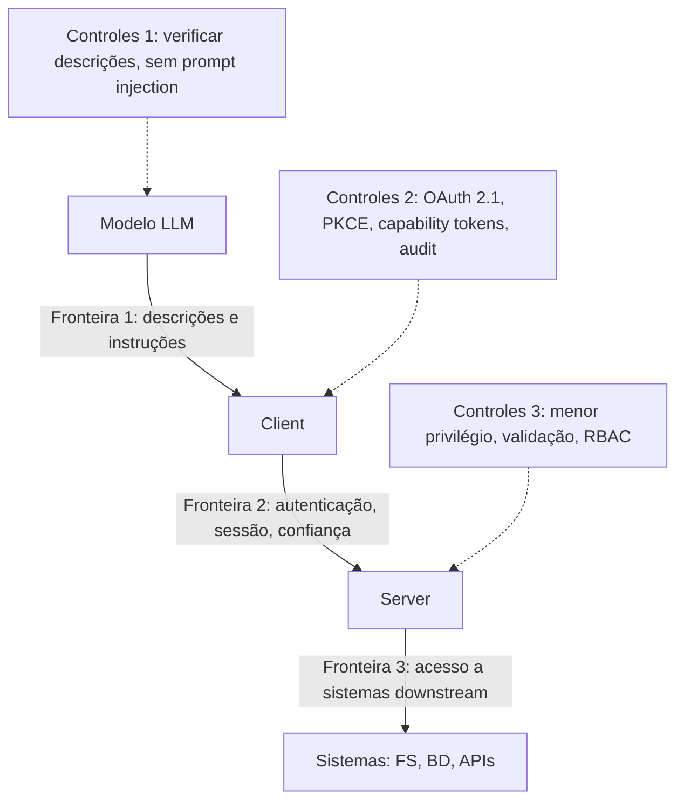

# Capítulo 8 — Segurança MCP: least-privilege, OAuth e capability tokens

## 1. Introdução

Os capítulos anteriores mostraram como conectar agentes ao mundo — construindo servidores (Capítulos 5-6) e consumindo o ecossistema (Capítulo 7) [7][8][22]. Este capítulo muda o registro: a segurança, a disciplina que decide se a conexão é um ativo ou um risco [6]. A tese é direta: o MCP formalizou um conjunto de práticas de segurança — least-privilege schemas, capability tokens, OAuth 2.1, audit logging e RBAC — e o engenheiro que as domina constrói sistemas conectados e governados [6][15]. O security best practices do MCP é o documento central da disciplina [6]. O Cloud Security Alliance (CSA) complementa com o guia de segurança agentica MCP [15]. A segurança não é uma camada — é uma dimensão de cada decisão deste livro [6][15]. O engenheiro que domina a segurança é o profissional que conecta agentes a bancos, APIs e ferramentas internas sem transformar a conexão em porta de entrada [6][15][16].

## 2. Explica

### 2.1 O Modelo de Segurança do MCP

A segurança MCP opera em três fronteiras de confiança — o modelo que o CSA documentou [15]. A primeira fronteira é **LLM ↔ Client**: descrições de ferramentas e instruções não verificadas [15][16]. A segunda é **Client ↔ Server**: autenticação, gerenciamento de sessão e confiança na execução [15]. A terceira é **Server ↔ Sistemas downstream**: acesso a sistemas de arquivos, bancos e APIs [15]. Cada fronteira tem controles próprios [15]. O engenheiro MCP trata as três fronteiras como camadas de defesa — a falha de uma não compromete as demais [15][6].

### 2.2 O Princípio do Menor Privilégio

O menor privilégio é o primeiro princípio da segurança MCP [6]. O princípio afirma: cada componente recebe o mínimo de privilégio necessário à sua função [6]. Na prática, o menor privilégio se materializa em três decisões [6]. Primeiro, **escopos mínimos**: o token e a tool têm o menor escopo possível [6]. Segundo, **granularidade**: as tools são finas o suficiente para permitir controle (Capítulo 4) [4][6]. Terceiro, **segmentação**: cada integração opera com credenciais próprias [6]. O menor privilégio é a defesa que limita o dano: se uma integração é comprometida, o escopo limitado contém o estrago [6][15].

### 2.3 O OAuth 2.1 com PKCE

A autorização de conexões remotas usa OAuth 2.1 com PKCE (Proof Key for Code Exchange) [6]. O OAuth 2.1 consolida as lições do OAuth 2.0 — e o PKCE protege o fluxo de autorização contra interceptação [6]. O fluxo é o padrão [6]. O host solicita autorização ao servidor de autorização do server [6]. O usuário consente com o escopo [6]. O server recebe o token de acesso com escopo limitado [6]. O token é usado na sessão MCP [6]. O OAuth é a fundação da autenticação remota — e o Capítulo 3 antecipou sua importância no transporte [3][6].

### 2.4 Os Capability Tokens

Os capability tokens são a materialização do menor privilégio na autorização [6]. Um capability token carrega as capacidades autorizadas — quais tools, quais recursos, quais escopos [6]. O token é emitido com escopo mínimo e validado em cada chamada [6]. A especificação proíbe o token passthrough: o server não pode aceitar tokens upstream e repassá-los a APIs de terceiros sem verificação de audiência e validação local [6]. O capability token é o instrumento que transforma a política em prática [6].

### 2.5 O Audit Logging

O audit logging é o registro sistemático das ações [6][20]. O MCP exige o registro de invocações de ferramentas, decisões de política e mudanças de contexto [6]. O registro permite a investigação de incidentes — o que aconteceu, quando, com qual escopo [6]. O CIS Companhion Guide estabelece a retenção de 90 dias como padrão empresarial [20]. O audit logging é a infraestrutura da responsabilização: sem registro, não há investigação [6][20].

### 2.6 O RBAC

O RBAC (Role-Based Access Control) organiza a autorização por papéis [6][20]. Cada papel tem um conjunto de capacidades autorizadas [6]. Cada usuário ou host recebe um papel [6]. O RBAC simplifica a gestão: em vez de permissões individuais, papéis padronizados [6][20]. O CIS Companhion Guide aplica os controles de acesso baseados em papel às integrações MCP [20]. O RBAC é a camada organizacional do menor privilégio [6][20].

### 2.7 A Proibição do Token Passthrough

A proibição do token passthrough é uma regra de segurança específica do MCP [6]. O server não pode aceitar tokens upstream — emitidos por outros serviços — e repassá-los a APIs de terceiros [6]. A regra impede a elevação de privilégio: um token com escopo amplo em um serviço não pode ser usado em outro [6]. A validação local é obrigatória: o server valida o token contra o seu próprio servidor de autorização [6]. A regra é uma das defesas mais importantes contra o abuso de confiança [6][15].

### 2.8 O Confused Deputy

O problema do confused deputy é um risco central da autorização MCP [6]. O cenário: um client malicioso explora a autorização de um client legítimo para executar ações não autorizadas [6]. As mitigações são explícitas [6]. Primeiro, a validação de consentimento por client: cada client confirma o seu consentimento [6]. Segundo, o redirect URI com match exato [6]. Terceiro, o parâmetro `state` criptograficamente seguro [6]. O confused deputy é o risco que o design cuidadoso da autorização previne [6].

## 3. Ilustra

### 3.1 A Analogia do Prédio com Salas

A analogia do prédio com salas ilumina a segurança em camadas [6][15]. O agente é um funcionário do prédio; cada server é uma sala; cada tool é um armário dentro da sala [6]. O menor privilégio é a chave certa para o armário certo — ninguém tem a chave-mestra [6]. O OAuth é o crachá de entrada — emitido com o nível de acesso certo [6]. O audit logging é a câmera de segurança — registra quem entrou, quando e o que fez [6]. O RBAC é o organograma — cada função tem o acesso da sua função [6]. A analogia funciona em profundidade: a segurança do prédio não depende de uma única fechadura — depende do sistema inteiro [6][15].

### 3.2 O Diagrama das Três Fronteiras de Confiança

O diagrama abaixo representa as três fronteiras de confiança e seus controles [15].



O diagrama mostra as três fronteiras do CSA e seus controles [15]. A Fronteira 1 protege contra injeção; a 2 protege contra abuso de autenticação; a 3 protege os sistemas [15][6]. O engenheiro que desenha os três conjuntos de controles constrói defesa em profundidade [15].

### 3.3 O Antes e o Depois na Prática

A comparação concreta ajuda a fixar o conceito [6]. **Antes (segurança pontual)**: o server confia no client, o token circula livremente e o registro não existe [6]. **Depois (segurança em camadas)**: OAuth com PKCE, capability tokens com escopo mínimo, validação local e audit logging [6]. A diferença não está na funcionalidade — está na capacidade de conter o dano [6][15].

## 4. Técnica

### 4.1 O Middleware de Autorização em Código

O primeiro instrumento é o middleware de autorização [6]. O código abaixo demonstra a verificação de capability tokens em cada chamada [6]:

```python
import time


class AutorizadorMCP:
    """Validação de capability tokens em cada chamada (menor privilégio)."""

    def __init__(self):
        self.tokens_validos = {}

    def emitir_token(self, client: str, capacidades: list, expira_em: int) -> str:
        token = f"cap_{client}_{int(time.time())}"
        self.tokens_validos[token] = {
            "client": client,
            "capacidades": set(capacidades),
            "expira_em": expira_em,
        }
        return token

    def validar(self, token: str, ferramenta: str) -> dict:
        registro = self.tokens_validos.get(token)
        if not registro:
            return {"permitido": False, "motivo": "token inválido"}
        if time.time() > registro["expira_em"]:
            return {"permitido": False, "motivo": "token expirado"}
        if ferramenta not in registro["capacidades"]:
            return {"permitido": False, "motivo": "fora das capacidades do token"}
        return {"permitido": True, "client": registro["client"]}


# Exemplo de uso
if __name__ == "__main__":
    autorizador = AutorizadorMCP()
    token = autorizador.emitir_token("app-financeiro", ["consultar_saldo"], time.time() + 3600)
    print(autorizador.validar(token, "consultar_saldo"))
    print(autorizador.validar(token, "transferir_dinheiro"))
```

O middleware demonstra o capability token em ação [6]. O token carrega as capacidades autorizadas; a validação verifica escopo e expiração em cada chamada [6]. O menor privilégio é a regra: o token de consulta não autoriza transferência [6].

### 4.2 O Fluxo OAuth com PKCE em Pseudocódigo

O segundo instrumento é o fluxo OAuth com PKCE [6]. O código abaixo demonstra o fluxo de autorização remota [6]:

```python
import hashlib
import secrets
import base64


def gerar_pkce() -> dict:
    """Gera o par verifier/challenge do PKCE (Proof Key for Code Exchange)."""
    verifier = secrets.token_urlsafe(64)
    digest = hashlib.sha256(verifier.encode()).digest()
    challenge = base64.urlsafe_b64encode(digest).rstrip(b"=").decode()
    return {"verifier": verifier, "challenge": challenge}


def fluxo_autorizacao_oauth(client_id, redirect_uri, escopos):
    """Fluxo OAuth 2.1 com PKCE para conexão remota MCP."""
    pkce = gerar_pkce()
    estado = secrets.token_urlsafe(32)  # estado criptograficamente seguro
    # 1. Host inicia a autorização no servidor de autorização do server
    url_autorizacao = (
        f"https://server.example.com/oauth/authorize"
        f"?client_id={client_id}"
        f"&redirect_uri={redirect_uri}"
        f"&scope={'+'.join(escopos)}"
        f"&code_challenge={pkce['challenge']}"
        f"&code_challenge_method=S256"
        f"&state={estado}"
    )
    # 2. (Fluxo humano) usuário consente e o servidor redireciona com code + state
    code = "código_de_autorização_recebido_no_redirect"
    estado_recebido = estado  # deve ser validado contra o estado enviado
    if estado_recebido != estado:
        raise ValueError("Estado inválido — possível ataque CSRF")
    # 3. Host troca o code pelo token, enviando o verifier
    troca = {
        "grant_type": "authorization_code",
        "code": code,
        "redirect_uri": redirect_uri,
        "client_id": client_id,
        "code_verifier": pkce["verifier"],
    }
    # 4. Server valida o verifier e emite o token com escopo mínimo
    token = {"access_token": "token_emitido", "scope": escopos}
    return {"url_autorizacao": url_autorizacao, "token": token}


if __name__ == "__main__":
    print(fluxo_autorizacao_oauth("meu-host", "https://host/callback", ["tools:ler"]))
```

O fluxo demonstra o OAuth 2.1 com PKCE [6]. O verifier/challenge protege a troca; o estado protege contra CSRF; o token nasce com escopo mínimo [6]. O padrão de produção usa as bibliotecas OAuth consolidadas [6].

### 4.3 O Diagrama do Audit Logging

O terceiro instrumento é o audit logging [6][20]. O código abaixo demonstra o registro de invocações [6][20]:

```python
from datetime import datetime, timezone


class AuditLogger:
    """Registro de invocações de ferramentas (audit logging)."""

    def __init__(self):
        self.registros = []

    def registrar(self, client, ferramenta, argumentos, resultado, politica):
        entrada = {
            "timestamp": datetime.now(timezone.utc).isoformat(),
            "client": client,
            "ferramenta": ferramenta,
            "argumentos": argumentos,
            "resultado": resultado,
            "politica": politica,
        }
        self.registros.append(entrada)
        return entrada

    def buscar_por_ferramenta(self, ferramenta):
        return [r for r in self.registros if r["ferramenta"] == ferramenta]

    def buscar_por_client(self, client):
        return [r for r in self.registros if r["client"] == client]


# Exemplo de uso
if __name__ == "__main__":
    log = AuditLogger()
    log.registrar("app-financeiro", "consultar_saldo", {"conta": "1234"}, "ok", "leitura")
    log.registrar("app-financeiro", "transferir_dinheiro", {"valor": 100}, "negado", "RBAC")
    print(len(log.buscar_por_ferramenta("transferir_dinheiro")))
    print(log.registros[-1]["politica"])
```

O audit logger demonstra o registro sistemático [6][20]. Cada invocação — autorizada ou negada — é registrada com timestamp, client, argumentos e política [6]. O registro é a base da investigação de incidentes [6][20].

## 5. Aplica

### 5.1 Onde Isso Vive no Mundo Real

A segurança MCP está em toda conexão de produção em 2026 [6][15]. Servers remotos usam OAuth 2.1 com PKCE [6]. Servers internos aplicam RBAC por equipe [6][20]. As organizações mantêm audit logs de todas as invocações [6][20]. O CIS Companhion Guide e o guia do CSA orientam as implantações [15][20]. A segurança MCP é a disciplina que separa a integração profissional da amadora [6][15].

### 5.2 O Erro Comum do Iniciante

O erro mais comum de quem começa é tratar a segurança como etapa final [6]. O iniciante constrói o server, conecta o host e só então pensa em segurança — quando as decisões de escopo já foram tomadas sem critério [6]. Outro erro clássico: tokens com escopo amplo, confiança cega no client e ausência de registro [6]. A lição é a mesma dos capítulos anteriores: a segurança é uma dimensão do design, não um anexo [6][15].

### 5.3 O Padrão Profissional em 2026

O padrão profissional em 2026 aplica a segurança em camadas [6][15]. O menor privilégio em cada tool e token [6]. O OAuth 2.1 com PKCE em conexões remotas [6]. O capability token com escopo mínimo [6]. O audit logging com retenção definida [6][20]. O RBAC por papel [6][20]. As três fronteiras de confiança mapeadas e controladas [15]. O resultado é um sistema conectado e governado [6][15].

### 5.4 Como Este Livro é Organizado

Este capítulo estabeleceu a segurança; o próximo documenta os riscos [6]. O Capítulo 9 detalha os ataques — prompt injection, tool poisoning e SSRF — e as defesas [16][17][18]. O Capítulo 10 sintetiza a disciplina de MCP Engineering, incluindo a segurança [15][19]. A segurança deste capítulo é a fundação da confiança do livro inteiro [6][15].

### 5.5 O Menor Privilégio na Prática Diária

O leitor que adota o menor privilégio na prática diária constrói hábitos de segurança [6]. O fluxo diário começa na decisão de escopo: cada nova tool nasce com o escopo mínimo [4][6]. O token é emitido com as capacidades exatas [6]. A revisão periódica reduz escopos que cresceram [6]. O padrão profissional usa a regra: se uma tool pode ser mais restrita, ela deve ser [6]. O menor privilégio é o hábito que previne a porta de entrada não revisada [6][16].

### 5.6 O RBAC na Organização

O RBAC organiza a autorização em escala [6][20]. Os papéis são definidos por função: leitura, escrita, administração [6][20]. Cada host e cada usuário recebem o papel da sua função [6]. A gestão de acesso simplifica: promover um usuário é trocar de papel [6]. O CIS Companhion Guide aplica os controles de acesso ao RBAC das integrações [20]. O RBAC é a camada organizacional do menor privilégio [6][20].

### 5.7 O Custo da Segurança: Quando o Controle Vale a Pena

A segurança tem custo — e o engenheiro maduro sabe quando vale a pena [6]. A validação em cada chamada tem overhead; o OAuth tem complexidade; o audit logging tem volume [6]. O custo se paga no incidente evitado [6]. A regra de ouro: o nível de controle proporcional ao risco — integrações críticas com controle total, integrações de baixo risco com controle proporcional [6][15]. O engenheiro que entende a economia projeta segurança na medida certa [6].

### 5.8 O Roteiro de Implementação da Segurança

A implementação da segurança é um processo em fases [6][15]. A primeira fase é o **mapeamento**: as três fronteiras de confiança e seus ativos [15]. A segunda é a **política**: menor privilégio, escopos e papéis [6]. A terceira é a **implementação**: OAuth, capability tokens e validação [6]. A quarta é a **observação**: audit logging e monitoramento [6][20]. A quinta é a **evolução**: revisão periódica e resposta a incidentes [6][15]. Cada fase tem entregável e critério de aceite [6].

### 5.9 A Segurança e a Revisão Autônoma

A revisão autônoma entre harness depende da segurança [1][6]. O revisor consulta o que foi produzido via servers — com acesso auditado [6]. A revisão confiável exige que o acesso do revisor seja verificável [6][20]. O audit logging registra o que a revisão consultou [6][20]. A segurança MCP é a infraestrutura que torna a revisão autônoma responsável [1][6].

### 5.10 A Segurança e a Governança Organizacional

A segurança MCP é governança organizacional [6][15]. As políticas de escopo são políticas de negócio [6]. Os papéis do RBAC são papéis da organização [6][20]. O audit logging alimenta a auditoria de conformidade [6][20]. O CIS Companhion Guide integra a segurança MCP aos controles CIS v8.1 [20]. A segurança transforma a disciplina individual em capacidade organizacional [15][20].

### 5.11 O Caso da Porta de Entrada Não Revisada

Para fechar com uma aplicação concreta, este estudo de caso mostra a porta de entrada não revisada [6][16]. O cenário: uma equipe conecta um server de dados com um token de escopo amplo e sem auditoria [6]. O primeiro sintoma: o agente acessa tabelas fora do escopo da tarefa — o token amplo permite [6]. O segundo sintoma: uma descrição maliciosa externa induz o modelo a usar a tool para exfiltrar dados (tool poisoning — Capítulo 9) [16]. O terceiro sintoma: a investigação não encontra registro — não há audit log [6][20].

O diagnóstico correto: a porta de entrada não revisada era o token amplo [6]. O tratamento: emitir capability tokens com escopo mínimo, aplicar RBAC e ativar o audit logging [6][20]. A lição do caso é a cascata: um token amplo criou acesso excessivo; o acesso excessivo permitiu a exfiltração; a ausência de registro impediu a investigação [6][16][20]. O caso demonstra o tema do capítulo: a segurança não é uma camada — é a diferença entre conexão e porta de entrada [6].

### 5.12 A Segurança e a Interface com os Modelos

A segurança interage com a diversidade de modelos [2][6]. A Fronteira 1 — descrições e instruções — é onde o modelo é explorado [15][16]. O primeiro princípio é a **desconfiança das descrições**: dados externos podem conter instruções maliciosas [16][17]. O segundo é a **validação de saída**: o que o modelo decide chamar é verificado [6]. O terceiro é a **observabilidade**: registrar qual modelo chamou qual tool [6][20]. A interface modelo-segurança é o ponto onde o Livro 2 encontra o Livro 4 [2][6].

### 5.13 O Manual do Diagnóstico Rápido da Segurança

O capítulo fecha com o manual do diagnóstico rápido da segurança [6][15]. O primeiro item é o **mapeamento**: as três fronteiras estão mapeadas? [15]. O segundo é o **escopo**: o menor privilégio em cada tool e token? [6]. O terceiro é a **autenticação**: OAuth 2.1 com PKCE nas conexões remotas? [6]. O quarto é a **validação**: cada chamada valida o token e o escopo? [6].

O quinto item é o **registro**: o audit logging captura invocações e decisões? [6][20]. O sexto é o **papel**: o RBAC está definido e aplicado? [6][20]. O sétimo é a **revisão**: os escopos são revisados periodicamente? [6][15]. O oitavo é a **resposta**: o plano de resposta a incidentes existe? [6][15]. O manual é o resumo operacional da segurança: cada item aponta o capítulo que o desenvolve [6]. O engenheiro que percorre o manual em minutos fecha as portas antes que se abram [6].

### 5.14 A Segurança e os Limites Éticos do Controle

A segurança cria uma estrutura de controle com implicações éticas [6]. O primeiro limite é o da **proporcionalidade**: o controle protege sem estrangular a função [6]. O segundo é o da **transparência**: os usuários sabem o que é monitorado [6][20]. O terceiro é o da **auditoria**: o controle é auditado [6][20]. O quarto é o do **limite do poder**: quem controla o acesso não pode abusar [6]. A ética da segurança é uma dimensão de cada decisão deste livro [6].

### 5.15 O Futuro da Segurança MCP

A segurança MCP evolui rapidamente [6][15]. As tendências visíveis apontam a evolução [6]. A primeira é a **formalização**: o security best practices do MCP amadurece [6]. A segunda é a **governança**: o CSA, o CIS e as agências governamentais estabelecem padrões [15][19][20][21]. A terceira é a **automação**: a análise de segurança de servers vira prática padrão [16]. A quarta é a **certificação**: servidores verificados por entidades confiáveis [6][20]. O engenheiro que domina os fundamentos não será surpreendido pelas tendências [6][15].

### 5.16 O Fechamento do Capítulo

O capítulo se encerra com a consolidação da segurança [6]. O menor privilégio em cada tool e token [6]. O OAuth 2.1 com PKCE nas conexões remotas [6]. O capability token com escopo mínimo [6]. O audit logging e o RBAC como infraestrutura de governança [6][20]. As três fronteiras de confiança como mapa [15]. O próximo capítulo documenta os riscos que esta segurança previne [16][17][18].

### 5.17 A Segurança e o Ciclo de Vida da Credencial

A gestão de credenciais é uma disciplina dentro da segurança MCP [6]. O ciclo de vida da credencial tem fases [6]. Primeiro, a **emissão**: o token nasce com escopo mínimo e expiração [6]. Segundo, a **distribuição**: o token chega ao componente certo pelo canal certo [6]. Terceiro, o **uso**: o token é validado em cada chamada [6]. Quarto, a **renovação**: o token expira e é renovado com revalidação de escopo [6]. Quinto, a **revogação**: o token é revogado quando o componente muda ou o risco aparece [6].

O ciclo de vida da credencial tem implicações práticas [6][20]. A expiração é o controle que limita o dano de um vazamento [6]. A rotação periódica é a higiene [6]. A revogação imediata é a resposta [6]. O CIS Companhion Guide estabelece a gestão de credenciais como controle [20]. O engenheiro que gerencia o ciclo de vida reduz a janela de risco [6][20].

O ciclo de vida interage com o OAuth do Capítulo 8 [6]. O token OAuth tem expiração e renovação [6]. O refresh token renova sem re-consentimento [6]. A revogação é centralizada no servidor de autorização [6]. O engenheiro que domina o ciclo de vida da credencial opera a segurança como processo — não como evento [6].

### 5.18 A Segurança e o Modelo de Ameaças

A segurança MCP madura começa pelo modelo de ameaças [6][15]. O modelo de ameaças responde a três perguntas [6]. O que proteger? [6]. Contra quem? [6]. Com quais consequências? [6]. O modelo mapeia os ativos, os atacantes e o impacto [6]. O CSA orienta o modelo de ameaças para as três fronteiras [15]. O MCPLib sistematiza as ameaças em 31 tipos (Capítulo 9) [18].

O modelo de ameaças orienta as decisões de segurança [6][15]. A defesa é proporcional à ameaça [6]. O ativo crítico recebe defesa profunda [6]. O ativo de baixo valor recebe defesa proporcional [6]. O modelo evita dois erros: a defesa insuficiente e o excesso de defesa [6]. O engenheiro que modela as ameaças projeta defesa racional [6][15].

O modelo de ameaças é revisitado periodicamente [6][15]. As ameaças evoluem — novos ataques, novos ativos, novos componentes [18]. A revisão do modelo é parte do MCP Engineering (Capítulo 10) [6][15]. O engenheiro que mantém o modelo atualizado projeta defesa viva [6].

### 5.19 A Segurança e a Resposta a Incidentes

A segurança MCP inclui a resposta a incidentes — o plano para quando a defesa falha [6][15]. O plano de resposta tem fases [6]. A **detecção**: o monitoramento e o audit log sinalizam o incidente [6][20]. A **contenção**: o acesso é revogado e o componente isolado [6]. A **investigação**: o audit log reconstitui o que aconteceu [6][20]. A **correção**: a vulnerabilidade é corrigida [6]. A **lição**: o incidente alimenta o modelo de ameaças [6][15].

A resposta a incidentes depende do audit logging (seção 2.5) [6][20]. Sem registro, não há investigação [6]. O registro de invocações, negações e decisões é o material da reconstituição [6][20]. O CIS Companhion Guide estabelece a retenção como controle [20]. O engenheiro que registra desde o início responde com dados [6][20].

A resposta a incidentes é parte da maturidade do MCP Engineering (Capítulo 10) [6][15]. O plano existe antes do incidente [6]. A equipe treina a resposta [6]. A lição vira defesa [6]. O engenheiro que domina a resposta transforma incidentes em aprendizado [6][15].

### 5.20 A Segurança e a Gestão de Configuração

A gestão de configuração é parte da segurança MCP [6][20]. As configurações dos servers — credenciais, endpoints, escopos — são ativos de segurança [6]. A gestão de configuração tem práticas [6][20]. Primeiro, a **configuração como código**: os servers são configurados por código versionado [6]. Segundo, o **segredo seguro**: as credenciais vêm de cofres, não de arquivos [6]. Terceiro, a **revisão de configuração**: as mudanças passam por revisão [6]. O CIS Companhion Guide estabelece a gestão de configuração como controle [20].

A gestão de configuração tem implicações [6][20]. A configuração como código permite auditoria [6]. O segredo seguro reduz o vazamento [6]. A revisão de configuração impede alterações maliciosas [6]. O engenheiro que gerencia a configuração com método constrói servers configurados com segurança [6][20].

A gestão de configuração interage com o ciclo de vida da credencial (seção 5.17) [6]. A configuração entrega as credenciais ao componente certo [6]. A rotação atualiza as credenciais na configuração [6]. O engenheiro que domina as duas disciplinas opera servidores seguros [6][20].

### 5.21 A Segurança e o Princípio da Menor Surpresa

O princípio da menor surpresa é uma diretriz de segurança MCP [6][15]. O princípio afirma: o sistema deve se comportar como o usuário espera [6]. A menor surpresa tem implicações [6][15]. Primeiro, a **transparência de escopo**: o usuário sabe o que cada integração pode fazer [6]. Segundo, a **consistência de comportamento**: o servidor se comporta como documentado [6]. Terceiro, a **auditoria visível**: o registro existe e é consultável [6][20]. O engenheiro que projeta para a menor surpresa constrói confiança [6].

A menor surpresa se aplica ao design das tools [6][4]. Uma tool que faz mais do que a descrição diz é uma surpresa [6][4]. Uma tool com efeitos ocultos é uma surpresa [6][16]. O design das tools segue o princípio: o efeito declarado é o efeito executado [4][6]. O Capítulo 9 mostra o custo da surpresa — o tool poisoning [16].

A menor surpresa é parte do MCP Engineering (Capítulo 10) [6][15]. A disciplina projeta sistemas previsíveis [6]. O engenheiro que domina o princípio constrói sistemas que não assustam [6][15].

### 5.22 A Segurança e a Auditoria Contínua

A auditoria contínua é a evolução do audit logging (seção 2.5) [6][20]. A auditoria contínua observa em tempo real [6][20]. A auditoria contínua tem camadas [6][20]. Primeiro, o **monitoramento**: as métricas de uso e segurança são coletadas continuamente [6][20]. Segundo, a **detecção**: anomalias são sinalizadas automaticamente [6]. Terceiro, a **revisão**: os registros são revisados periodicamente [6][20]. O CIS Companhion Guide orienta a auditoria contínua [20].

A auditoria contínua tem implicações práticas [6][20]. A detecção precoce reduz o dano [6]. A revisão periódica encontra problemas que o monitoramento perde [6][20]. O engenheiro que audita continuamente transforma a segurança em processo [6][20].

A auditoria contínua alimenta a resposta a incidentes (seção 5.19) [6][20]. O registro contínuo é o material da investigação [6][20]. A detecção dispara a resposta [6]. O engenheiro que domina a auditoria contínua constrói a segurança viva [6][20].

### 5.23 A Segurança e a Conscientização do Usuário

A segurança MCP inclui o usuário — e a conscientização é parte da defesa [6][20]. O usuário é a linha visível da autorização [6]. A conscientização tem conteúdos [6][20]. Primeiro, o **entendimento dos escopos**: o usuário sabe o que aprova [6]. Segundo, o **reconhecimento dos sinais**: o usuário percebe comportamento estranho [6][16]. Terceiro, o **fluxo de reporte**: o usuário sabe a quem avisar [6][20]. O engenheiro que conscientiza o usuário transforma-o em guardião [6][20].

A conscientização tem práticas [6][20]. A autorização clara no momento da ação [6]. Os avisos nas ações sensíveis [6]. O material de treinamento [6]. O CIS Companhion Guide aplica os controles de treinamento [20]. O engenheiro que investe na conscientização fortalece a primeira linha [6][20].

A conscientização interage com a transparência (seção 5.14) [6]. O usuário informado decide melhor [6]. O usuário ciente do risco aprova com critério [6]. O engenheiro que domina a conscientização constrói sistemas com humanos vigilantes [6].

### 5.24 A Segurança e a Revisão de Servidores

A revisão de servidores é a prática de inspecionar os servers antes e durante o uso [6][22]. A revisão tem focos [6][22]. Primeiro, o **código**: a lógica é auditável e segura [6][16]. Segundo, o **escopo**: as capacidades são mínimas [6]. Terceiro, a **configuração**: as credenciais e os endpoints são seguros [6][20]. Quarto, a **origem**: o server vem de fonte confiável [6][22]. A revisão é o processo do checklist de confiança do Capítulo 7 [6][22].

A revisão de servidores tem práticas [6][22]. A revisão antes da integração [6]. A re-revisão periódica [6][15]. A revisão pós-incidente [6]. O engenheiro que revisa com método consome com segurança [6][22].

A revisão de servidores é parte do MCP Engineering (Capítulo 10) [6][15]. A revisão é a governança do consumo [6][15]. O engenheiro que domina a revisão transforma o consumo em processo seguro [6][22].

## 6. Conclusão

A segurança MCP é a disciplina que decide se a conexão é um ativo ou um risco [6]. Este capítulo estabeleceu o arsenal: o menor privilégio em cada tool e token, o OAuth 2.1 com PKCE nas conexões remotas, o capability token com escopo mínimo, o audit logging e o RBAC [6][20]. As três fronteiras de confiança — LLM↔Client, Client↔Server e Server↔Sistemas — são o mapa da defesa [15]. A segurança não é uma camada — é uma dimensão de cada decisão [6][15]. O próximo capítulo documenta os riscos que esta segurança previne [16][17][18].

## 7. Referências

[1] ANTHROPIC. Introducing the Model Context Protocol. Anthropic News, 25 nov. 2024. Disponível em: https://www.anthropic.com/news/model-context-protocol. Acesso em: 5 ago. 2026.
[2] MODEL CONTEXT PROTOCOL. Architecture. MCP Specification 2025-11-25, 25 nov. 2025. Disponível em: https://modelcontextprotocol.io/specification/2025-11-25/architecture. Acesso em: 5 ago. 2026.
[3] MODEL CONTEXT PROTOCOL. Basic Specification: Transports. MCP Specification 2025-11-25, 2025. Disponível em: https://modelcontextprotocol.io/specification/2025-11-25/basic/transports. Acesso em: 5 ago. 2026.
[4] MODEL CONTEXT PROTOCOL. Specification 2026-07-28: Server Tools. MCP Specification, 28 jul. 2026. Disponível em: https://modelcontextprotocol.io/specification/2026-07-28/server/tools. Acesso em: 5 ago. 2026.
[5] MODEL CONTEXT PROTOCOL. Specification 2026-07-28: Server Resources. MCP Specification, 28 jul. 2026. Disponível em: https://modelcontextprotocol.io/specification/2026-07-28/server/resources. Acesso em: 5 ago. 2026.
[6] MODEL CONTEXT PROTOCOL. Security Best Practices (Draft). MCP Specification. Disponível em: https://modelcontextprotocol.io/specification/draft/basic/security_best_practices. Acesso em: 5 ago. 2026.
[7] MODEL CONTEXT PROTOCOL. TypeScript SDK. GitHub Repository, 2026. Disponível em: https://github.com/modelcontextprotocol/typescript-sdk. Acesso em: 5 ago. 2026.
[8] MODEL CONTEXT PROTOCOL. Python SDK. GitHub Repository, 2026. Disponível em: https://github.com/modelcontextprotocol/python-sdk. Acesso em: 5 ago. 2026.
[9] MODEL CONTEXT PROTOCOL. TypeScript SDK Documentation. MCP SDK Portal, 2026. Disponível em: https://ts.sdk.modelcontextprotocol.io/. Acesso em: 5 ago. 2026.
[10] MODEL CONTEXT PROTOCOL. Python SDK Documentation. MCP SDK Portal, 2026. Disponível em: https://py.sdk.modelcontextprotocol.io/. Acesso em: 5 ago. 2026.
[11] MODEL CONTEXT PROTOCOL. Quickstart Guide. MCP Documentation. Disponível em: https://modelcontextprotocol.io/docs/quickstart/quickstart. Acesso em: 5 ago. 2026.
[12] MODEL CONTEXT PROTOCOL. MCP Registry Preview. Official MCP Blog, 8 set. 2025. Disponível em: https://blog.modelcontextprotocol.io/posts/2025-09-08-mcp-registry-preview/. Acesso em: 5 ago. 2026.
[13] MODEL CONTEXT PROTOCOL. Registry Repository. GitHub Repository, 2025–2026. Disponível em: https://github.com/modelcontextprotocol/registry. Acesso em: 5 ago. 2026.
[14] GITHUB. GitHub MCP Registry: the fastest way to discover AI tools. GitHub Changelog, 16 set. 2025. Disponível em: https://github.blog/changelog/2025-09-16-github-mcp-registry-the-fastest-way-to-discover-ai-tools/. Acesso em: 5 ago. 2026.
[15] CLOUD SECURITY ALLIANCE. Agentic MCP Security Best Practices Guide v1. CSA Labs, 27 mar. 2026. Disponível em: https://labs.cloudsecurityalliance.org/agentic/agentic-mcp-security-best-practices-v1/. Acesso em: 5 ago. 2026.
[16] INVARIANT LABS. MCP Security Notification: Tool Poisoning Attacks. Invariant Labs Blog, 1 abr. 2025. Disponível em: https://invariantlabs.ai/blog/mcp-security-notification-tool-poisoning-attacks. Acesso em: 5 ago. 2026.
[17] WILLISON, Simon. Model Context Protocol has prompt injection security problems. Simon Willison's Weblog, 9 abr. 2025. Disponível em: https://simonwillison.net/2025/Apr/9/mcp-prompt-injection/. Acesso em: 5 ago. 2026.
[18] WANG, Zhen et al. (Tsinghua University & Ant Group). Systematic Analysis of MCP Security (MCPLib). arXiv:2508.12538, 18 ago. 2025. Disponível em: https://arxiv.org/html/2508.12538v1. Acesso em: 5 ago. 2026.
[19] CISA. Guide to Secure Adoption of Agentic AI. CISA News, 1 mai. 2026. Disponível em: https://www.cisa.gov/news-events/news/cisa-us-and-international-partners-release-guide-secure-adoption-agentic-ai. Acesso em: 5 ago. 2026.
[20] CENTER FOR INTERNET SECURITY (CIS). Model Context Protocol (MCP) Companion Guide — CIS Controls v8.1. CIS White Papers, 20 abr. 2026. Disponível em: https://www.cisecurity.org/insights/white-papers/controls-v8-1-model-context-protocol-companion-guide. Acesso em: 5 ago. 2026.
[21] NATIONAL SECURITY AGENCY (NSA). Security Design Considerations for AI-Driven Automation Leveraging the Model Context Protocol. NSA Press Release, 20 mai. 2026. Disponível em: https://www.nsa.gov/Press-Room/Press-Releases-Statements/Press-Release-View/Article/4496698/. Acesso em: 5 ago. 2026.
[22] PULSEMCP. MCP Server Directory. PulseMCP, 2025–2026. Disponível em: https://www.pulsemcp.com/servers. Acesso em: 5 ago. 2026.
