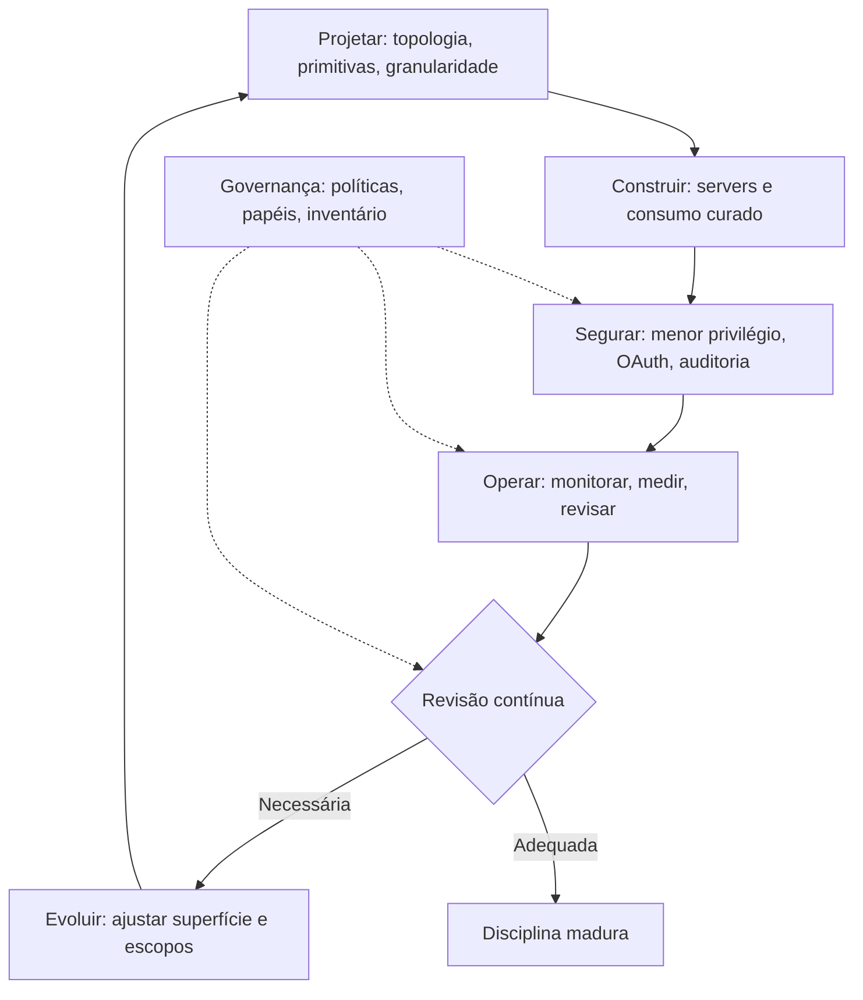

# Capítulo 10 — MCP Engineering: a disciplina de expor o mundo ao agente

## 1. Introdução

Os nove capítulos anteriores construíram a pilha completa do MCP: o porquê (Capítulo 1), a arquitetura (Capítulo 2), os transportes (Capítulo 3), as primitivas (Capítulo 4), a construção em TypeScript e Python (Capítulos 5-6), o consumo do ecossistema (Capítulo 7), a segurança (Capítulo 8) e os riscos documentados (Capítulo 9) [2][3][4][5][6][7][8][22]. Este capítulo final integra tudo em uma disciplina: o MCP Engineering [15][19]. A tese é direta: o MCP Engineering é a arte e a ciência de decidir o que expor ao agente, com que granularidade, com que controle de acesso e com que governança [6][15]. O engenheiro de MCP não apenas conecta — ele projeta a fronteira entre o agente e o mundo [6][15]. O Cloud Security Alliance, o CISA, a NSA e o CIS estabeleceram os padrões de implantação segura [15][19][20][21]. Este capítulo transforma os padrões em disciplina prática: o processo, as decisões, as métricas e a cultura do MCP Engineering [6][15].

## 2. Explica

### 2.1 A Definição de MCP Engineering

O MCP Engineering é a disciplina de projetar, construir, operar e governar a conexão entre agentes de IA e o mundo real [6][15]. A definição tem quatro verbos [6][15]. **Projetar**: decidir a topologia, as primitivas e a granularidade [2][4][6]. **Construir**: implementar servers com os SDKs e consumir o ecossistema com curadoria [7][8][22]. **Operar**: monitorar, revisar e evoluir as integrações [15][20]. **Governar**: aplicar políticas, papéis e auditoria [6][20]. O MCP Engineering não é uma especialidade isolada — é a interseção de engenharia de software, segurança e design de IA [1][6][15].

### 2.2 As Três Decisões Fundamentais

O MCP Engineering concentra-se em três decisões fundamentais [6][15]. A primeira: **o que expor** — quais capacidades o agente precisa, classificadas em tools, resources e prompts (Capítulo 4) [4][5][6]. A segunda: **com que granularidade** — quão finas são as tools, quão mínimos os escopos (Capítulo 4) [4][6]. A terceira: **com que controle de acesso** — quem autoriza, com que papéis, com que registro (Capítulo 8) [6][20]. As três decisões são interdependentes [6]. A granularidade decide o controle; o controle decide o risco; o risco decide o que expor [6][15]. O engenheiro maduro toma as três decisões juntas [6].

### 2.3 O Processo de Design da Superfície

O design da superfície de capacidades segue um processo [4][6]. O processo tem cinco etapas [4][6]. Primeiro, o **inventário de domínio**: o que o agente precisa alcançar [4]. Segundo, a **classificação**: cada capacidade vira tool, resource ou prompt [4][5]. Terceiro, a **contratação**: schemas, descrições e URIs (Capítulo 4) [4][5]. Quarto, a **segurança**: menor privilégio e auditoria (Capítulo 8) [6]. Quinto, a **evolução**: revisão contínua contra o uso real [6][15]. O processo é o ciclo de vida do design da superfície [4][6].

### 2.4 A Governança do Ecossistema

A governança do ecossistema é a camada organizacional do MCP Engineering [15][20]. O inventário de integrações (Capítulo 7) é o mapa [6][22]. O checklist de confiança é o processo de entrada [6][22]. A whitelist de servidores aprovados é a política [6][15]. A revisão periódica é a manutenção [15][20]. O CIS Companhion Guide integra o MCP aos controles CIS v8.1 [20]. A governança transforma o consumo individual em capacidade organizacional [15][20].

### 2.5 As Métricas do MCP Engineering

O MCP Engineering é mensurável [6][15][20]. As métricas se organizam em quatro grupos [6]. Primeiro, as **métricas de superfície**: quantas tools, quantos resources, quantos escopos — a superfície total de exposição [6]. Segundo, as **métricas de uso**: quais tools são chamadas, com que frequência, por qual modelo [6][20]. Terceiro, as **métricas de segurança**: quantas chamadas negadas, quantas avaliações pendentes, quantos incidentes [6][20]. Quarto, as **métricas de saúde**: latência, erros e disponibilidade das integrações [3][20]. O engenheiro que mede gerencia [6][15].

### 2.6 A Cultura do MCP Engineering

A disciplina tem uma cultura [6][15]. A cultura do MCP Engineering tem sinais reconhecíveis [6]. Primeiro, a **curadoria**: a avaliação sistemática antes da integração [6][22]. Segundo, a **desconfiança profissional**: descrições e servidores verificados com suspeita [6][16]. Terceiro, a **governança por padrão**: políticas, papéis e auditoria como norma [6][20]. Quarto, a **aprendizagem contínua**: os riscos documentados viram lições [6][16][18]. A cultura é o que sustenta a disciplina quando a pressão pela velocidade aumenta [6][15].

### 2.7 A Relação com as Demais Camadas da Pilha

O MCP Engineering se relaciona com todas as camadas da pilha [1][2]. Com o Context Engineering (Livro 3): as tools materializam o Select e os resources materializam o Write [2][4][5]. Com o Prompt Engineering (Livro 2): as descrições das tools são a interface que o modelo lê [2][4]. Com o Harness Engineering (Livros 6-9): o MCP é a ponte entre o harness e o mundo [1][2]. Com o Eval Engineering: as métricas de uso alimentam a avaliação [6][20]. A pilha se empilha — e o MCP Engineering é o conector [1][2].

### 2.8 O Futuro da Disciplina

O MCP Engineering é uma disciplina jovem [15][19]. As tendências de 2026 apontam a evolução [15]. A primeira é a **formalização**: o security best practices amadurece [6]. A segunda é a **governança institucional**: CSA, CIS, CISA e NSA estabelecem padrões [15][19][20][21]. A terceira é a **automação da segurança**: análise de servers e descrições vira prática padrão [16]. A quarta é a **certificação**: servidores verificados por entidades confiáveis [6][20]. O engenheiro que domina os fundamentos não será surpreendido pelas tendências [6][15].

## 3. Ilustra

### 3.1 A Analogia do Arquivo de Arquitetura

A analogia do arquivo de arquitetura ilumina a disciplina [6][15]. O MCP Engineering é o arquiteto que desenha o prédio do agente [6]. O arquivo contém as plantas (topologia), as especificações (contratos), os orçamentos (escopos) e os registros de manutenção (auditoria) [6][15]. O arquiteto não constrói cada parede — desenha o sistema e governa as mudanças [6]. A analogia funciona em profundidade: o prédio sem arquivo é uma favela que cresce sem plano; o prédio com arquivo é uma obra que evolui com controle [6][15]. O agente sem MCP Engineering é a favela; o agente com disciplina é a obra [6].

### 3.2 O Diagrama do Ciclo de Vida do MCP Engineering

O diagrama abaixo representa o ciclo de vida completo do MCP Engineering [6][15].



O diagrama mostra o ciclo de vida [6][15]. Projetar, construir, segurar, operar e evoluir — com a governança transversal [6][15]. O ciclo é contínuo: a superfície nunca está pronta [6]. A disciplina madura é a que roda o ciclo com rigor [6][15].

### 3.3 O Antes e o Depois na Prática

A comparação concreta ajuda a fixar o conceito [6][15]. **Antes (conexão impulsiva)**: servers conectados sem plano, escopos amplos, sem auditoria, sem inventário [6]. **Depois (MCP Engineering)**: superfície desenhada, escopos mínimos, auditoria total, inventário vivo [6][15]. A diferença não está na funcionalidade — está na governança [6][15].

## 4. Técnica

### 4.1 O Modelo de Governança em Código

O primeiro instrumento é o modelo de governança [6][15]. O código abaixo implementa o ciclo de vida da superfície [6][15]:

```python
from dataclasses import dataclass, field
from datetime import datetime


@dataclass
class Capacidade:
    nome: str
    tipo: str  # "tool", "resource", "prompt"
    escopo: str
    dono: str
    revisada_em: str
    status: str = "ativa"


@dataclass
class SuperficieMCP:
    nome: str
    capacidades: list = field(default_factory=list)

    def adicionar(self, cap: Capacidade):
        self.capacidades.append(cap)

    def superficie_total(self) -> dict:
        por_tipo = {}
        for c in self.capacidades:
            if c.status == "ativa":
                por_tipo[c.tipo] = por_tipo.get(c.tipo, 0) + 1
        return {"total": sum(por_tipo.values()), "por_tipo": por_tipo}

    def pendentes_de_revisao(self) -> list:
        limite = "2026-06-01"
        return [c for c in self.capacidades
                if c.status == "ativa" and c.revisada_em < limite]

    def reduzir_escopo(self, nome: str, novo_escopo: str):
        for c in self.capacidades:
            if c.nome == nome:
                c.escopo = novo_escopo
                c.revisada_em = datetime.now().strftime("%Y-%m-%d")


if __name__ == "__main__":
    sup = SuperficieMCP("agente-financeiro")
    sup.adicionar(Capacidade("consultar_saldo", "tool", "leitura", "fin", "2026-07-01"))
    sup.adicionar(Capacidade("transferir", "tool", "escrita", "fin", "2025-11-01"))
    print(sup.superficie_total())
    print([c.nome for c in sup.pendentes_de_revisao()])
```

O modelo demonstra a governança da superfície [6][15]. Cada capacidade tem tipo, escopo, dono e data de revisão [6]. A superfície total é mensurável; as pendências são identificáveis [6].

### 4.2 O Dashboard de Métricas em Código

O segundo instrumento é o dashboard de métricas [6][20]. O código abaixo agrega as métricas do MCP Engineering [6][20]:

```python
class MetricasMCP:
    """Métricas do MCP Engineering: superfície, uso, segurança e saúde."""

    def __init__(self):
        self.chamadas = []
        self.negacoes = []

    def registrar_chamada(self, tool, modelo, autorizada):
        if autorizada:
            self.chamadas.append({"tool": tool, "modelo": modelo})
        else:
            self.negacoes.append({"tool": tool, "modelo": modelo})

    def relatorio(self) -> dict:
        uso_por_tool = {}
        for c in self.chamadas:
            uso_por_tool[c["tool"]] = uso_por_tool.get(c["tool"], 0) + 1
        negacoes_por_tool = {}
        for n in self.negacoes:
            negacoes_por_tool[n["tool"]] = negacoes_por_tool.get(n["tool"], 0) + 1
        return {
            "uso_total": len(self.chamadas),
            "uso_por_tool": dict(sorted(uso_por_tool.items(), key=lambda x: -x[1])),
            "negacoes_total": len(self.negacoes),
            "negacoes_por_tool": negacoes_por_tool,
            "taxa_negacao_pct": round(100 * len(self.negacoes) /
                                      max(1, len(self.chamadas) + len(self.negacoes)), 2),
        }


if __name__ == "__main__":
    m = MetricasMCP()
    m.registrar_chamada("consultar_saldo", "modelo-a", True)
    m.registrar_chamada("transferir", "modelo-a", False)
    print(m.relatorio())
```

O dashboard demonstra as métricas de uso e segurança [6][20]. As negações — chamadas fora do escopo — são o sinal de configuração errada [6]. O engenheiro que mede as negações detecta escopos mal calibrados [6][20].

### 4.3 O Diagrama da Política de Revisão

O terceiro instrumento é a política de revisão automatizada [6][15]. O código abaixo implementa a revisão periódica da superfície [6][15]:

```python
def agendar_revisoes(superficie, frequencia_dias=90) -> list:
    """Agenda as revisões de capacidades vencidas."""
    de_revisao = []
    for cap in superficie.capacidades:
        if cap.status != "ativa":
            continue
        data_revisao = datetime.strptime(cap.revisada_em, "%Y-%m-%d")
        vencida = (datetime.now() - data_revisao).days > frequencia_dias
        if vencida:
            de_revisao.append({
                "capacidade": cap.nome,
                "dono": cap.dono,
                "ultima_revisao": cap.revisada_em,
                "dias_desde_revisao": (datetime.now() - data_revisao).days,
            })
    return de_revisao


def aplicar_reducao(superficie, alvo_pct=0.2) -> dict:
    """Identifica capacidades candidatas a redução de escopo."""
    ativas = [c for c in superficie.capacidades if c.status == "ativa"]
    candidatas = []
    for cap in ativas:
        # Capacidades antigas com escopo amplo são candidatas
        data = datetime.strptime(cap.revisada_em, "%Y-%m-%d")
        if (datetime.now() - data).days > 180 and cap.escopo in ("escrita", "ampla"):
            candidatas.append(cap.nome)
    return {"candidatas_reducao": candidatas,
            "alvo_pct": alvo_pct, "total_ativas": len(ativas)}


if __name__ == "__main__":
    sup = SuperficieMCP("agente")
    sup.adicionar(Capacidade("consultar", "tool", "leitura", "dados", "2026-07-01"))
    sup.adicionar(Capacidade("gravar", "tool", "escrita", "dados", "2025-01-01"))
    print(agendar_revisoes(sup))
    print(aplicar_reducao(sup))
```

A política demonstra a manutenção contínua [6][15]. Capacidades vencidas são agendadas para revisão [6]. Capacidades antigas com escopo amplo são candidatas à redução [6]. A disciplina é cíclica — não pontual [6][15].

## 5. Aplica

### 5.1 Onde Isso Vive no Mundo Real

O MCP Engineering está nas organizações que levam agentes a sério em 2026 [15][22]. Plataformas corporativas mantêm inventários de integrações e políticas de acesso [15][20]. Equipes de dados governam servers de bancos com RBAC [6][20]. Organizações inteiras adotam os guias do CSA, do CIS, do CISA e da NSA [15][19][20][21]. O MCP Engineering é a diferença entre conectar por impulso e conectar por projeto [6][15].

### 5.2 O Erro Comum do Iniciante

O erro mais comum de quem começa é tratar o MCP como ferramenta, não como disciplina [6]. O iniciante aprende a conectar um server e considera o trabalho feito — sem superfície desenhada, sem escopos, sem governança [6]. Quando o sistema cresce — dezenas de integrações, dezenas de models —, o caos aparece [6]. Outro erro clássico: achar que segurança e governança são etapas finais [6]. A lição é a mesma dos nove capítulos anteriores: o instrumento é fácil; a disciplina é o diferencial [6][15].

### 5.3 O Padrão Profissional em 2026

O padrão profissional em 2026 pratica o MCP Engineering com rigor [6][15]. A superfície é desenhada com inventário e contrato [4][6]. O consumo é curado com checklist de confiança [6][22]. A segurança é total — menor privilégio, OAuth, auditoria [6][20]. As métricas são medidas [6][20]. A revisão é contínua [6][15]. Os guias institucionais são seguidos [15][19][20][21]. O resultado é um sistema conectado, seguro e governado [6][15].

### 5.4 Como Este Livro Fecha a Jornada

Este capítulo integra os nove anteriores [6][15]. O Capítulo 1 deu o porquê [1]. O Capítulo 2 deu a arquitetura [2]. O Capítulo 3 deu os transportes [3]. O Capítulo 4 deu as primitivas [4][5]. Os Capítulos 5-6 deram a construção [7][8]. O Capítulo 7 deu o consumo [22]. O Capítulo 8 deu a segurança [6]. O Capítulo 9 deu os riscos [16][17][18]. Este capítulo dá a disciplina que integra tudo [6][15]. A jornada termina onde começou: o agente conectado ao mundo — agora com maestria [1][6].

### 5.5 O MCP Engineering na Prática Diária

O leitor que adota a disciplina na prática diária constrói hábitos de profissional [6]. O fluxo diário começa na superfície: o que o agente pode fazer hoje? [6]. As novas capacidades nascem com contrato e escopo [4][6]. O checklist de confiança roda antes de qualquer integração nova [6][22]. As métricas são consultadas [6][20]. As revisões são agendadas [6][15]. O hábito diário transforma a disciplina em segunda natureza [6][15].

### 5.6 O MCP Engineering e a Revisão Autônoma

O MCP Engineering é a infraestrutura da revisão autônoma [1][6]. O revisor consulta o que foi produzido via servers governados [6][14]. A confiança na revisão depende da confiança nas integrações [6]. O audit logging registra o que a revisão fez [6][20]. A revisão autônoma confiável é a que opera sobre uma superfície governada [1][6]. A série A Pilha Agêntica anuncia o método de revisão autônoma entre harness — e o MCP Engineering é o seu conector [1][6].

### 5.7 O Custo da Disciplina: Quando a Governança Vale a Pena

A disciplina tem custo — e o engenheiro maduro sabe quando vale a pena [6]. O design da superfície, o checklist e a auditoria consomem tempo [6]. O custo se paga no incidente evitado e na manutenibilidade [6]. A regra de ouro: a governança proporcional à escala — uma integração com política leve, um ecossistema com governança completa [6][15]. O engenheiro que entende a economia projeta governança na medida certa [6].

### 5.8 O Roteiro de Implantação do MCP Engineering

A implantação da disciplina é um processo em fases [6][15]. A primeira fase é a **conscientização**: a equipe conhece o protocolo e os riscos [6][16]. A segunda é a **fundação**: topologia, primitivas e contratos [2][4]. A terceira é a **construção**: servers e consumo com curadoria [7][8][22]. A quarta é a **segurança**: menor privilégio, OAuth e auditoria [6][20]. A quinta é a **governança**: inventário, políticas e revisão [15][20]. Cada fase tem entregável e critério de aceite [6]. O roteiro é o caminho da maestria [6][15].

### 5.9 O MCP Engineering e a Governança Organizacional

O MCP Engineering é governança organizacional [15][20]. O inventário de integrações é um ativo da organização [6][15]. As políticas de escopo são políticas de negócio [6]. Os papéis do RBAC são papéis da organização [6][20]. O CIS Companhion Guide integra a disciplina aos controles CIS v8.1 [20]. Os guias do CISA e da NSA orientam a implantação segura [19][21]. A governança transforma a disciplina individual em capacidade organizacional [15][20].

### 5.10 O MCP Engineering e o Método de Revisão entre Harness

A série anuncia o método de revisão autônoma entre harness — o MCP Engineering é sua infraestrutura [1][6]. O método exige que cada harness exponha o que produziu de forma verificável [1][6]. As tools de consulta e os resources de leitura são a interface da verificação [6][14]. A auditoria registra cada verificação [6][20]. O engenheiro que governa a superfície constrói a revisão autônoma confiável [1][6]. A conexão fecha a pilha: o Livro 4 é a ponte entre o contexto (Livro 3) e o harness (Livros 6-9) [1][2].

### 5.11 O Caso da Organização sem Disciplina

Para fechar com uma aplicação concreta, este estudo de caso mostra a organização sem disciplina [6]. O cenário: uma equipe conecta dezenas de servidores sem inventário, sem escopos e sem auditoria [6]. O primeiro sintoma: ninguém sabe quantas integrações existem [6]. O segundo sintoma: um incidente — exfiltração via tool poisoning — não pode ser investigado, porque não há registros [6][16][20]. O terceiro sintoma: a correção é impossível sem inventário — ninguém sabe o que remover [6].

O diagnóstico correto: a ausência de disciplina era a causa raiz [6]. O tratamento: implantar o MCP Engineering — inventário, checklist, escopos e auditoria [6][15]. A lição do caso é a cascata: a falta de disciplina criou o caos; o caos impediu a investigação; a impossibilidade de investigação ampliou o dano [6][20]. O caso demonstra o tema do capítulo: a disciplina não é burocracia — é a diferença entre caos e maestria [6][15].

### 5.12 O MCP Engineering e a Interface com os Modelos

O MCP Engineering interage com a diversidade de modelos [2][6]. A superfície é consumida por qualquer modelo [2]. O primeiro princípio é a **neutralidade**: o design não depende do modelo [6]. O segundo é a **revalidação**: ao trocar de modelo, revalidar descrições e uso [4][6]. O terceiro é a **observabilidade**: as métricas registram qual modelo fez o quê [6][20]. O MCP Engineering é o ponto onde todas as camadas da pilha se encontram [1][2][6].

### 5.13 O Manual do Diagnóstico Rápido do MCP Engineering

O capítulo fecha com o manual do diagnóstico rápido da disciplina [6][15]. O primeiro item é o **inventário**: a superfície está mapeada com tipos, escopos e donos? [4][6]. O segundo é o **contrato**: as capacidades têm schemas e descrições precisos? [4]. O terceiro é o **escopo**: o menor privilégio em cada capacidade? [6]. O quarto é a **segurança**: OAuth, validação e auditoria em cada conexão? [6][20].

O quinto item é a **curadoria**: o checklist de confiança roda antes de cada integração? [6][22]. O sexto é a **métrica**: uso, negações e saúde são medidos? [6][20]. O sétimo é a **revisão**: a superfície é revisada periodicamente? [6][15]. O oitavo é a **governança**: políticas, papéis e inventário estão vivos? [15][20]. O manual é o resumo operacional do livro inteiro: cada item aponta o capítulo que o desenvolve [6]. O engenheiro que percorre o manual em minutos sabe a saúde da disciplina [6][15].

### 5.14 O MCP Engineering e os Limites Éticos

O MCP Engineering cria responsabilidades éticas [6]. O primeiro limite é o da **fronteira de ação**: o que o agente pode fazer é uma decisão ética, não só técnica [6]. O segundo é o da **transparência**: os usuários sabem o que o agente acessa [6]. O terceiro é o do **consentimento**: ações sensíveis exigem autorização explícita [6]. O quarto é o da **auditoria**: o uso é registrado para responsabilização [6][20]. O quinto é o da **proporcionalidade**: a segurança protege sem estrangular [6]. A ética do MCP Engineering é a dimensão que completa a maestria [6].

### 5.15 O Futuro do MCP Engineering

O MCP Engineering é uma disciplina em formação [15][19]. As tendências de 2026 apontam a direção [6]. A primeira é a **governança institucional**: os guias do CSA, CIS, CISA e NSA viram padrão de mercado [15][19][20][21]. A segunda é a **automação**: análise de segurança e revisão de superfície automatizadas [6][16]. A terceira é a **certificação**: servidores e profissionais verificados [6][20]. A quarta é a **educação**: os 31 tipos de ataque do MCPLib viram currículo [18]. O engenheiro que domina os fundamentos não será surpreendido pelas tendências [6][15].

### 5.16 O Fechamento do Livro

O capítulo final se encerra com a consolidação da disciplina [6]. O MCP Engineering é a arte e a ciência de expor o mundo ao agente [6][15]. As três decisões — o que expor, com que granularidade, com que controle — são o coração [6]. O processo — projetar, construir, segurar, operar, evoluir — é o ciclo [6][15]. A governança — inventário, políticas, auditoria — é a estrutura [15][20]. O Livro 4 fechou a Parte II da série: o agente conectado ao mundo com segurança [1][6]. A Parte III — a camada de harness — construirá sobre esta ponte [1].

### 5.17 O MCP Engineering e o Design de Sistemas

O MCP Engineering é, antes de tudo, design de sistemas [6][15]. As decisões do MCP são decisões de arquitetura [6]. A topologia é um desenho [2]. A superfície é um contrato [4]. A segurança é uma fronteira [6]. O engenheiro MCP pensa em sistemas — não em integrações isoladas [6][15]. O design de sistemas orienta a disciplina [6].

O design de sistemas tem princípios aplicados ao MCP [2][6]. Primeiro, a **modularidade**: cada server é um módulo com contrato [2]. Segundo, a **separação de preocupações**: protocolo, capacidades e domínio separados (Capítulos 5-6) [7][8]. Terceiro, a **evolução**: o sistema muda por extensão, não por reescrita [2][6]. O engenheiro que projeta sistemas MCP constrói para o longo prazo [6].

O design de sistemas conecta o MCP às demais camadas da pilha [1][2]. O contexto (Livro 3), a comunicação (Livro 2) e o harness (Livros 6-9) são camadas de um sistema [1][2]. O MCP Engineering é o design da fronteira entre o agente e o mundo [6]. O engenheiro que domina o design de sistemas projeta a pilha inteira [1][6].

### 5.18 O MCP Engineering e a Gestão de Riscos

O MCP Engineering é gestão de riscos aplicada à conexão do agente [6][15]. O risco é a probabilidade e o impacto de um incidente [6]. A gestão de riscos tem etapas [6]. A **identificação**: o que pode dar errado (Capítulo 9) [16][18]. A **avaliação**: qual a probabilidade e o impacto [6]. A **mitigação**: o que reduz o risco (Capítulo 8) [6]. A **aceitação**: o risco residual é aceito com ciência [6]. O engenheiro MCP gerencia riscos com método [6][15].

A gestão de riscos orienta o orçamento de segurança [6][15]. O risco alto recebe defesa profunda [6]. O risco baixo recebe defesa proporcional [6]. O registro de riscos documenta as decisões [6]. O CIS Companhion Guide integra a gestão de riscos aos controles [20]. O engenheiro que gerencia riscos gasta defesa onde ela importa [6][15].

A gestão de riscos é revisitada [6][15]. Os riscos evoluem com o ecossistema [18]. A revisão periódica atualiza o registro [6][15]. O engenheiro que domina a gestão de riscos constrói sistemas que sobrevivem [6].

### 5.19 O Fechamento da Parte II e a Ponte para o Harness

O Livro 4 fecha a Parte II da série A Pilha Agêntica — e o MCP Engineering é a ponte para a Parte III [1][2]. A Parte II construiu as camadas de contexto: o Livro 3 arquitetou o que o modelo vê; o Livro 4 arquitetou o que o modelo faz [1][2]. A Parte III — a camada de harness — constrói a autonomia, a execução e a governança do agente inteiro [1]. O MCP é a infraestrutura que o harness usa para agir [1][2].

A ponte tem implicações para o leitor [1][6]. O engenheiro que domina o Livro 4 chega à Parte III com a superfície desenhada [6]. O harness governará um agente conectado — não isolado [1][2]. As tools, os resources e os escopos do Livro 4 são os ativos que o harness operará [2][6]. A segurança do Livro 4 é a fundação da governança do harness [1][6].

O fechamento da Parte II é também o fechamento de um arco [1][2]. Do prompt solto (Livro 2) ao ambiente informacional (Livro 3) e à conexão segura com o mundo (Livro 4) [1][2]. A pilha se empilhou — e o MCP Engineering é o conector [1][2][6]. O leitor que completou a Parte II está pronto para a maestria da Parte III [1].

### 5.20 O MCP Engineering e a Formação de Equipes

O MCP Engineering é uma competência de equipe — e a formação é parte da disciplina [6][15]. A formação tem fases [6]. Primeiro, a **alfabetização**: a equipe entende o protocolo e os riscos [6][16]. Segundo, a **prática**: a equipe constrói e consome com supervisão [7][22]. Terceiro, a **especialização**: membros dominam segurança e governança [6][15]. O engenheiro que forma a equipe multiplica a disciplina [6][15].

A formação de equipes tem práticas [6][15]. O onboarding inclui o MCP [6]. As revisões de código ensinam [6]. Os incidentes ensinam [6]. A documentação preserva [6][15]. O engenheiro que documenta e ensina constrói capacidade organizacional [6][15].

A formação interage com a cultura da disciplina (seção 2.6) [6][15]. A alfabetização cria a cultura [6]. A prática reforça a cultura [6]. O engenheiro que forma a equipe constrói a cultura do MCP Engineering [6][15].

### 5.21 O MCP Engineering e a Maturidade Organizacional

O MCP Engineering tem níveis de maturidade organizacional [6][15]. O nível inicial: integrações pontuais sem governança [6]. O nível intermediário: processo e checklist estabelecidos [6][22]. O nível avançado: superfície desenhada, métricas medidas e auditoria contínua [6][15][20]. O nível maduro: a disciplina é parte da cultura [6][15]. O engenheiro avalia a maturidade da organização [6].

A maturidade evolui por estágios [6][15]. O estágio inicial concentra-se em não quebrar [6]. O intermediário concentra-se em padronizar [6][22]. O avançado concentra-se em governar [6][15]. O maduro concentra-se em evoluir [6][15]. O engenheiro que reconhece o estágio projeta o próximo passo [6][15].

A maturidade organizacional é o alvo do MCP Engineering [6][15]. Os guias institucionais — CSA, CIS, CISA, NSA — descrevem o nível maduro [15][19][20][21]. O engenheiro que conduz a organização à maturidade transforma o MCP em ativo [6][15].

### 5.22 O Legado do Livro 4 na Série

O Livro 4 deixa um legado na série A Pilha Agêntica [1][2]. O legado é a ponte conectada [1][2]. O leitor que completa o Livro 4 não vê mais o agente isolado [1]. O leitor vê o agente com fronteira [1][6]. A fronteira é o resultado das decisões do MCP Engineering [6]. O legado é a capacidade de desenhar a fronteira [6].

O legado se manifesta na prática [1][6]. O leitor constrói servers com contrato e escopo [4][7]. O leitor consome o ecossistema com curadoria [6][22]. O leitor governa com inventário e auditoria [6][15]. O leitor conhece os riscos e projeta contra eles [6][16]. O leitor pratica o MCP Engineering [6].

O legado se estende aos próximos livros [1]. A Parte III — o harness — governará um agente conectado [1]. O Livro 4 é a ponte [1][2]. O engenheiro que completa o Livro 4 sobe à Parte III com a fundação pronta [1]. A série cumpre a promessa: da primeira linha de código à engenharia de sistemas autônomos [1][6].

### 5.23 O MCP Engineering e a Educação Contínua

O MCP Engineering exige educação contínua [6][15]. O ecossistema evolui rápido [12][22]. Os riscos evoluem [18]. As especificações mudam [3][4]. O engenheiro que para de estudar fica para trás [6]. A educação contínua tem frentes [6][15]. Primeiro, a **especificação**: as novas versões são estudadas [3][4]. Segundo, a **segurança**: os novos ataques são conhecidos [16][18]. Terceiro, o **ecossistema**: os novos servidores e padrões são mapeados [12][22].

A educação contínua tem práticas [6][15]. O acompanhamento dos blogs e guias institucionais [15][19][20][21]. A participação na comunidade [22]. Os experimentos controlados [6]. O engenheiro que estuda continuamente constrói relevância duradoura [6][15].

A educação contínua é o complemento da prática [6][15]. A prática consolida; o estudo atualiza [6]. O engenheiro que equilibra os dois domina a disciplina em evolução [6][15].

### 5.24 O MCP Engineering e o Profissional Completo

O MCP Engineering define o profissional completo da conexão de agentes [6][15]. O profissional completo combina competências [6]. O conhecimento do protocolo [2]. A habilidade de construção [7][8]. A curadoria do consumo [22]. A disciplina de segurança [6]. A visão de governança [15][20]. O conhecimento dos riscos [16][18]. O profissional que combina as competências é o engenheiro MCP [6].

O profissional completo tem hábitos [6][15]. Projeta a superfície antes de codificar [4][6]. Avalia antes de integrar [6][22]. Audita antes de confiar [6][20]. Revisa antes de crescer [6][15]. Os hábitos são a rotina da maestria [6].

O profissional completo é o destino da série A Pilha Agêntica [1][6]. O Livro 4 construiu a competência; o Capítulo 10 consolidou a identidade [6]. O engenheiro que completa o Livro 4 é o profissional que o mercado de 2026 procura [1][6][15].

### 5.25 O MCP Engineering e a Sustentabilidade do Conhecimento

O MCP Engineering preserva o conhecimento organizacional [6][15]. O conhecimento vive nos inventários, nas decisões documentadas e nos processos [6][15]. A sustentabilidade tem práticas [6][15]. Primeiro, a **documentação viva**: os inventários e as decisões são atualizados [6][15]. Segundo, a **transferência**: o conhecimento é ensinado (seção 5.20) [6]. Terceiro, a **memória organizacional**: os incidentes e as lições são preservados [6][20]. O engenheiro que preserva o conhecimento constrói organizações resilientes [6][15].

A sustentabilidade do conhecimento interage com a rotatividade [6][15]. O conhecimento que vive em uma pessoa se perde com ela [6]. O conhecimento que vive em processos permanece [6][15]. O engenheiro que documenta protege a organização [6][15].

A sustentabilidade é parte da maturidade (seção 5.21) [6][15]. A organização madura preserva o que aprende [6]. O engenheiro que domina a sustentabilidade constrói capacidade duradoura [6][15].

## 6. Conclusão

O MCP Engineering é a disciplina que integra os nove capítulos anteriores [6][15]. Este capítulo estabeleceu a síntese: o que expor, com que granularidade e com que controle de acesso são as três decisões fundamentais [6]. O processo — projetar, construir, segurar, operar e evoluir — é o ciclo de vida da superfície [6][15]. A governança — inventário, políticas, papéis e auditoria — é a estrutura que sustenta a disciplina [15][20]. Os guias institucionais — CSA, CIS, CISA e NSA — orientam o padrão de mercado [15][19][20][21]. O engenheiro que domina o MCP Engineering conecta agentes ao mundo real com segurança [6][15]. O Livro 4 fecha a Parte II da série — e a Parte III construirá o harness sobre esta ponte [1][2].

## 7. Referências

[1] ANTHROPIC. Introducing the Model Context Protocol. Anthropic News, 25 nov. 2024. Disponível em: https://www.anthropic.com/news/model-context-protocol. Acesso em: 5 ago. 2026.
[2] MODEL CONTEXT PROTOCOL. Architecture. MCP Specification 2025-11-25, 25 nov. 2025. Disponível em: https://modelcontextprotocol.io/specification/2025-11-25/architecture. Acesso em: 5 ago. 2026.
[3] MODEL CONTEXT PROTOCOL. Basic Specification: Transports. MCP Specification 2025-11-25, 2025. Disponível em: https://modelcontextprotocol.io/specification/2025-11-25/basic/transports. Acesso em: 5 ago. 2026.
[4] MODEL CONTEXT PROTOCOL. Specification 2026-07-28: Server Tools. MCP Specification, 28 jul. 2026. Disponível em: https://modelcontextprotocol.io/specification/2026-07-28/server/tools. Acesso em: 5 ago. 2026.
[5] MODEL CONTEXT PROTOCOL. Specification 2026-07-28: Server Resources. MCP Specification, 28 jul. 2026. Disponível em: https://modelcontextprotocol.io/specification/2026-07-28/server/resources. Acesso em: 5 ago. 2026.
[6] MODEL CONTEXT PROTOCOL. Security Best Practices (Draft). MCP Specification. Disponível em: https://modelcontextprotocol.io/specification/draft/basic/security_best_practices. Acesso em: 5 ago. 2026.
[7] MODEL CONTEXT PROTOCOL. TypeScript SDK. GitHub Repository, 2026. Disponível em: https://github.com/modelcontextprotocol/typescript-sdk. Acesso em: 5 ago. 2026.
[8] MODEL CONTEXT PROTOCOL. Python SDK. GitHub Repository, 2026. Disponível em: https://github.com/modelcontextprotocol/python-sdk. Acesso em: 5 ago. 2026.
[9] MODEL CONTEXT PROTOCOL. TypeScript SDK Documentation. MCP SDK Portal, 2026. Disponível em: https://ts.sdk.modelcontextprotocol.io/. Acesso em: 5 ago. 2026.
[10] MODEL CONTEXT PROTOCOL. Python SDK Documentation. MCP SDK Portal, 2026. Disponível em: https://py.sdk.modelcontextprotocol.io/. Acesso em: 5 ago. 2026.
[11] MODEL CONTEXT PROTOCOL. Quickstart Guide. MCP Documentation. Disponível em: https://modelcontextprotocol.io/docs/quickstart/quickstart. Acesso em: 5 ago. 2026.
[12] MODEL CONTEXT PROTOCOL. MCP Registry Preview. Official MCP Blog, 8 set. 2025. Disponível em: https://blog.modelcontextprotocol.io/posts/2025-09-08-mcp-registry-preview/. Acesso em: 5 ago. 2026.
[13] MODEL CONTEXT PROTOCOL. Registry Repository. GitHub Repository, 2025–2026. Disponível em: https://github.com/modelcontextprotocol/registry. Acesso em: 5 ago. 2026.
[14] GITHUB. GitHub MCP Registry: the fastest way to discover AI tools. GitHub Changelog, 16 set. 2025. Disponível em: https://github.blog/changelog/2025-09-16-github-mcp-registry-the-fastest-way-to-discover-ai-tools/. Acesso em: 5 ago. 2026.
[15] CLOUD SECURITY ALLIANCE. Agentic MCP Security Best Practices Guide v1. CSA Labs, 27 mar. 2026. Disponível em: https://labs.cloudsecurityalliance.org/agentic/agentic-mcp-security-best-practices-v1/. Acesso em: 5 ago. 2026.
[16] INVARIANT LABS. MCP Security Notification: Tool Poisoning Attacks. Invariant Labs Blog, 1 abr. 2025. Disponível em: https://invariantlabs.ai/blog/mcp-security-notification-tool-poisoning-attacks. Acesso em: 5 ago. 2026.
[17] WILLISON, Simon. Model Context Protocol has prompt injection security problems. Simon Willison's Weblog, 9 abr. 2025. Disponível em: https://simonwillison.net/2025/Apr/9/mcp-prompt-injection/. Acesso em: 5 ago. 2026.
[18] WANG, Zhen et al. (Tsinghua University & Ant Group). Systematic Analysis of MCP Security (MCPLib). arXiv:2508.12538, 18 ago. 2025. Disponível em: https://arxiv.org/html/2508.12538v1. Acesso em: 5 ago. 2026.
[19] CISA. Guide to Secure Adoption of Agentic AI. CISA News, 1 mai. 2026. Disponível em: https://www.cisa.gov/news-events/news/cisa-us-and-international-partners-release-guide-secure-adoption-agentic-ai. Acesso em: 5 ago. 2026.
[20] CENTER FOR INTERNET SECURITY (CIS). Model Context Protocol (MCP) Companion Guide — CIS Controls v8.1. CIS White Papers, 20 abr. 2026. Disponível em: https://www.cisecurity.org/insights/white-papers/controls-v8-1-model-context-protocol-companion-guide. Acesso em: 5 ago. 2026.
[21] NATIONAL SECURITY AGENCY (NSA). Security Design Considerations for AI-Driven Automation Leveraging the Model Context Protocol. NSA Press Release, 20 mai. 2026. Disponível em: https://www.nsa.gov/Press-Room/Press-Releases-Statements/Press-Release-View/Article/4496698/. Acesso em: 5 ago. 2026.
[22] PULSEMCP. MCP Server Directory. PulseMCP, 2025–2026. Disponível em: https://www.pulsemcp.com/servers. Acesso em: 5 ago. 2026.
