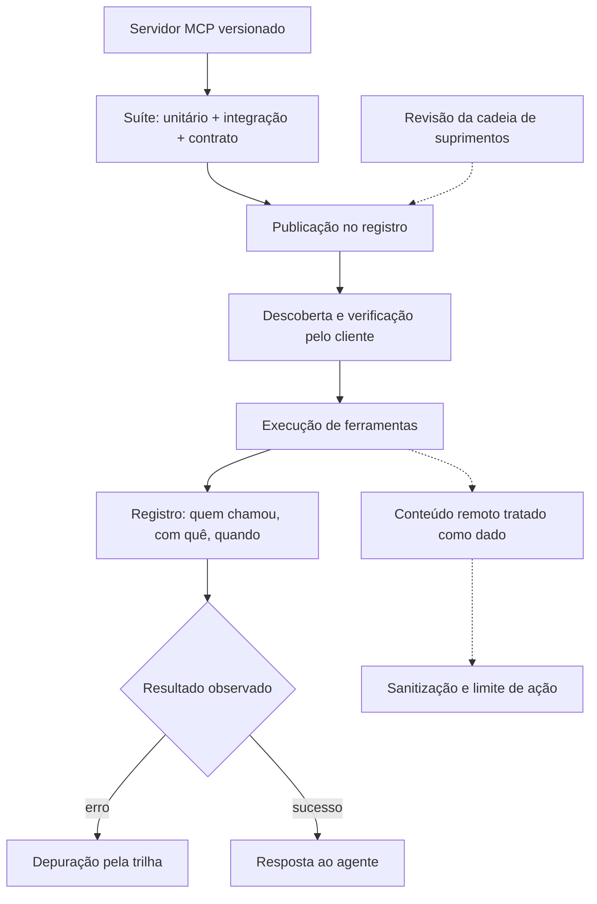

# Capítulo 11: MCP em produção: observabilidade, testes e confiabilidade de servidores

## 1. Introdução

No capítulo anterior, você construiu seu primeiro servidor MCP e o conectou ao mundo real [10]. Agora chegou a hora de levar essa integração para produção: observabilidade, testes e confiabilidade [1]. Um servidor que funciona na sua máquina é uma demonstração; um servidor que sobrevive a tráfego real, a falhas e a ataques é um produto [15].

Este capítulo tem três objetivos. Primeiro, entender o ciclo de vida de um servidor MCP em produção: versionamento, testes e deploy [3]. Segundo, dominar a observabilidade de integrações: registrar cada chamada de ferramenta, cada erro e cada atraso [1]. Terceiro, conhecer os riscos documentados do protocolo — envenenamento de ferramentas e injecão de prompt — e as defesas que a indústria recomenda [17][18].

## 2. Explica

### 2.1 O servidor MCP como serviço, não como script

Um servidor MCP é um serviço: tem ciclo de vida, versão e contrato [3]. A especificação define as ferramentas (operações executáveis) e os recursos (dados expostos) — e ambos precisam de governança de mudança [3][4]. A primeira disciplina de produção é tratar o servidor como código: repositório, CI, testes de contrato e versão semântica [3].

### 2.2 Testes de servidor: do unitário ao contrato

A suíte de um servidor MCP cobre três níveis: testes unitários de cada ferramenta com o SDK, testes de integração contra um cliente real e testes de contrato que validam o schema exposto [7]. Os SDKs oficiais — Python e TypeScript — fornecem os componentes para escrever essa suíte sem reinventar a roda [6][7][9]. O objetivo final: o servidor responde exatamente ao que a especificação promete [8].

### 2.3 Observabilidade: a trilha de cada chamada

Em produção, cada chamada de ferramenta precisa deixar rastro: quem chamou, com que argumentos, quanto tempo levou e qual o resultado [1]. Esse registro é o que permite auditar decisões autônomas e depurar falhas — a mesma disciplina que você viu no Livro 1 com a observabilidade de serviços [1]. A arquitetura do protocolo ajuda: a separação entre host, cliente e servidor define os pontos de instrumentação [1][2].

### 2.4 O registro e a descoberta de servidores

O ecossistema criou um caminho de descoberta: o registro oficial de servidores e o catálogo de mercado centralizam a oferta [11][12]. Para o operador, o registro é também um filtro de qualidade: servidores publicados passam por revisão de segurança e manutenção [11]. A prática profissional é dupla: publicar com padrão de qualidade e consumir com verificação [13].

### 2.5 Os riscos documentados: envenenamento de ferramentas

O envenenamento de ferramentas (tool poisoning) é o risco mais documentado do MCP: um servidor malicioso — ou comprometido — expõe ferramentas que parecem úteis e executam comandos danosos [15]. A indústria de segurança registrou ataques reais e publicou notificações específicas sobre o protocolo [15][16]. A defesa começa na cadeia de suprimentos: só conectar servidores de origem verificada, com revisão de código [18].

### 2.6 Injecão de prompt via MCP

O segundo risco é a injecão de prompt através do conteúdo servido pelo MCP: dados de uma ferramenta podem conter instruções que sequestram o comportamento do modelo [16]. A análise pública do protocolo documentou essa superfície e as mitigações: tratar todo conteúdo remoto como dado, sanitizar saídas e limitar as ferramentas que podem agir sobre ele [16][17]. O guia de segurança do protocolo e as melhores práticas da indústria convergem nas mesmas regras: privilégio mínimo, revisão e auditoria [5][14].

## 3. Ilustra

### 3.1 A analogia do portão de embarque do aeroporto

Pense em um aeroporto: cada passageiro (chamada de ferramenta) passa por um portão com documento, bagagem e destino verificados [15]. O portão não decide quem viaja — o sistema de segurança decide — mas sem ele, qualquer um entraria na pista [16]. O servidor MCP é o portão entre o agente e o mundo: cada ferramenta exposta é uma pista nova, e cada pista precisa de verificação antes de receber tráfego [5].



### 3.2 O portão que audita o próprio movimento

O desenho mostra o ciclo completo de confiabilidade: testar antes de publicar, verificar antes de conectar, registrar durante a execução e tratar conteúdo remoto como suspeito por padrão [14][18]. É a mesma combinação — testes, observabilidade e segurança — que transforma uma integração em um serviço de produção [1].

## 4. Técnica

### 4.1 Um teste de contrato para a ferramenta

O exemplo abaixo valida o schema de uma ferramenta MCP com o SDK Python — o teste que trava regressões de contrato [7]:

```python
from mcp.server.fastmcp import FastMCP

mcp = FastMCP("pedidos")


@mcp.tool()
def consultar_pedido(pedido_id: int) -> dict:
    '''Consulta o status de um pedido pelo identificador.'''
    return {"id": pedido_id, "status": "enviado"}


def testar_contrato():
    ferramentas = mcp.list_tools()
    nomes = {t.name for t in ferramentas}
    assert "consultar_pedido" in nomes
    schema = next(t for t in ferramentas if t.name == "consultar_pedido").inputSchema
    assert "pedido_id" in schema["properties"]
    print("contrato valido")
```

Se o schema da ferramenta mudar, o teste quebra — e o consumidor é avisado antes do deploy [3].

### 4.2 Registro de cada chamada de ferramenta

O trecho abaixo instrumenta a execução com registro estruturado — a trilha de auditoria de cada chamada [1]:

```python
import json
import time
from datetime import datetime, timezone


def registrar_chamada(nome, argumentos, resultado, inicio):
    entrada = {
        "evento": "tool_call",
        "ferramenta": nome,
        "argumentos": argumentos,
        "resultado_resumo": str(resultado)[:120],
        "duracao_ms": round((time.perf_counter() - inicio) * 1000, 1),
        "timestamp": datetime.now(timezone.utc).isoformat(),
    }
    print(json.dumps(entrada, ensure_ascii=False))
```

Com esse padrão, o painel responde perguntas de auditoria: quais ferramentas o agente chamou, com quais argumentos e com qual latência [1].

### 4.3 Sanitização de conteúdo remoto

Para fechar, a defesa contra injecão via conteúdo servido: tratar o texto remoto como dado, nunca como instrução [16]:

```python
def sanitizar_conteudo_remoto(texto: str) -> str:
    texto = texto.replace("</instrucao>", "&lt;/instrucao&gt;")
    texto = texto.replace("<sistema>", "&lt;sistema&gt;")
    return texto[:4000]


def montar_entrada_ferramenta(saida_ferramenta: str) -> str:
    conteudo = sanitizar_conteudo_remoto(saida_ferramenta)
    return f"[saida da ferramenta]\n{conteudo}\n[/saida da ferramenta]\n"
```

A sanitização não torna o conteúdo confiável — torna o conteúdo inofensivo [16].

## 5. Aplica

### 5.1 Onde isso vive no mundo real

Na prática, a confiabilidade de servidores MCP aparece em organizações que dependem de integrações agênticas: o servidor vive em um repositório com CI, o registro centraliza a publicação e os logs de chamada alimentam a auditoria [11][13]. As agências de segurança — da NSA ao CISA — já publicaram guias de adoção segura de agentes e do próprio MCP [18][20]. O padrão convergente: testar, verificar e registrar [5].

### 5.2 O erro comum do iniciante

O erro clássico é conectar qualquer servidor do catálogo sem revisão — a porta de entrada dos ataques de envenenamento de ferramentas [15]. O segundo erro é operar sem trilha: sem registro de chamadas, nenhum incidente é auditável [1]. O caminho profissional: contrato testado, origem verificada e log estruturado em cada execução [3][18].

## 6. Conclusão

Um servidor MCP em produção é um serviço — com teste, trilha e defesa [1]. Você aprendeu a suíte de três níveis, a observabilidade de chamadas e as defesas contra os dois riscos documentados do protocolo [3][15][16]. No próximo capítulo, essas práticas sobem de nível: padrões avançados para arquiteturas multi-agente e a governança completa do ecossistema [14].


## 7. Referências

[1] ANTHROPIC. Introducing the Model Context Protocol. Anthropic News, 25 nov. 2024. Disponível em: https://www.anthropic.com/news/model-context-protocol. Acesso em: 5 ago. 2026.
[2] MODEL CONTEXT PROTOCOL. Architecture. MCP Specification 2025-11-25, 25 nov. 2025. Disponível em: https://modelcontextprotocol.io/specification/2025-11-25/architecture. Acesso em: 5 ago. 2026.
[3] MODEL CONTEXT PROTOCOL. Basic Specification: Transports. MCP Specification 2025-11-25, 2025. Disponível em: https://modelcontextprotocol.io/specification/2025-11-25/basic/transports. Acesso em: 5 ago. 2026.
[4] MODEL CONTEXT PROTOCOL. Specification 2026-07-28: Server Tools. MCP Specification, 28 jul. 2026. Disponível em: https://modelcontextprotocol.io/specification/2026-07-28/server/tools. Acesso em: 5 ago. 2026.
[5] MODEL CONTEXT PROTOCOL. Specification 2026-07-28: Server Resources. MCP Specification, 28 jul. 2026. Disponível em: https://modelcontextprotocol.io/specification/2026-07-28/server/resources. Acesso em: 5 ago. 2026.
[6] MODEL CONTEXT PROTOCOL. TypeScript SDK. GitHub Repository, 2026. Disponível em: https://github.com/modelcontextprotocol/typescript-sdk. Acesso em: 5 ago. 2026.
[7] MODEL CONTEXT PROTOCOL. Python SDK. GitHub Repository, 2026. Disponível em: https://github.com/modelcontextprotocol/python-sdk. Acesso em: 5 ago. 2026.
[8] MODEL CONTEXT PROTOCOL. TypeScript SDK Documentation. MCP SDK Portal, 2026. Disponível em: https://ts.sdk.modelcontextprotocol.io/. Acesso em: 5 ago. 2026.
[9] MODEL CONTEXT PROTOCOL. Python SDK Documentation. MCP SDK Portal, 2026. Disponível em: https://py.sdk.modelcontextprotocol.io/. Acesso em: 5 ago. 2026.
[10] MODEL CONTEXT PROTOCOL. Quickstart Guide. MCP Documentation. Disponível em: https://modelcontextprotocol.io/docs/quickstart/quickstart. Acesso em: 5 ago. 2026.
[11] MODEL CONTEXT PROTOCOL. MCP Registry Preview. Official MCP Blog, 8 set. 2025. Disponível em: https://blog.modelcontextprotocol.io/posts/2025-09-08-mcp-registry-preview/. Acesso em: 5 ago. 2026.
[12] MODEL CONTEXT PROTOCOL. Registry Repository. GitHub Repository, 2025–2026. Disponível em: https://github.com/modelcontextprotocol/registry. Acesso em: 5 ago. 2026.
[13] GITHUB. GitHub MCP Registry: the fastest way to discover AI tools. GitHub Changelog, 16 set. 2025. Disponível em: https://github.blog/changelog/2025-09-16-github-mcp-registry-the-fastest-way-to-discover-ai-tools/. Acesso em: 5 ago. 2026.
[14] PULSEMCP. MCP Server Directory. PulseMCP, 2025–2026. Disponível em: https://www.pulsemcp.com/servers. Acesso em: 5 ago. 2026.
[15] MODEL CONTEXT PROTOCOL. Security Best Practices (Draft). MCP Specification. Disponível em: https://modelcontextprotocol.io/specification/draft/basic/security_best_practices. Acesso em: 5 ago. 2026.
[16] CLOUD SECURITY ALLIANCE. Agentic MCP Security Best Practices Guide v1. CSA Labs, 27 mar. 2026. Disponível em: https://labs.cloudsecurityalliance.org/agentic/agentic-mcp-security-best-practices-v1/. Acesso em: 5 ago. 2026.
[17] INVARIANT LABS. MCP Security Notification: Tool Poisoning Attacks. Invariant Labs Blog, 1 abr. 2025. Disponível em: https://invariantlabs.ai/blog/mcp-security-notification-tool-poisoning-attacks. Acesso em: 5 ago. 2026.
[18] WILLISON, Simon. Model Context Protocol has prompt injection security problems. Simon Willison's Weblog, 9 abr. 2025. Disponível em: https://simonwillison.net/2025/Apr/9/mcp-prompt-injection/. Acesso em: 5 ago. 2026.
[19] WANG, Zhen et al. (Tsinghua University & Ant Group). Systematic Analysis of MCP Security (MCPLib). arXiv:2508.12538, 18 ago. 2025. Disponível em: https://arxiv.org/html/2508.12538v1. Acesso em: 5 ago. 2026.
[20] CISA. Guide to Secure Adoption of Agentic AI. CISA News, 1 mai. 2026. Disponível em: https://www.cisa.gov/news-events/news/cisa-us-and-international-partners-release-guide-secure-adoption-agentic-ai. Acesso em: 5 ago. 2026.
