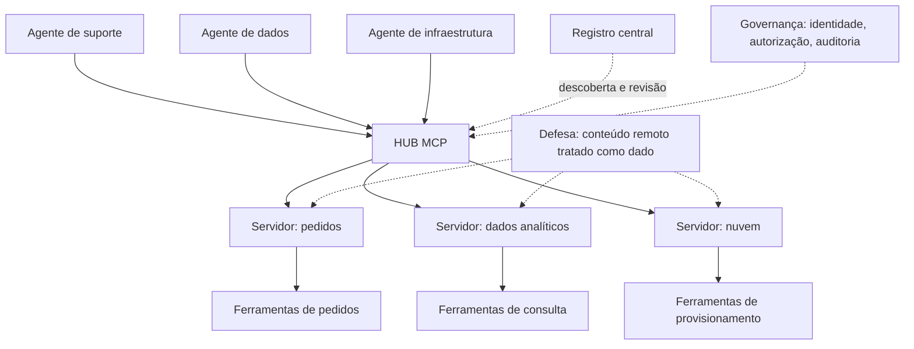

# Capítulo 12: Padrões avançados e governança de MCP: multi-agente, descoberta e segurança

## 1. Introdução

No capítulo anterior, você levou seu servidor MCP para produção: testes, observabilidade e defesas [1]. Este capítulo amplia o campo de visão: o MCP não é mais uma integração isolada — é o tecido que conecta múltiplos agentes a múltiplos sistemas [1]. A pergunta muda de "como exponho uma ferramenta" para "como governar um ecossistema de ferramentas e agentes" [5].

Este capítulo tem três objetivos. Primeiro, dominar os padrões avançados de arquitetura: MCP em cadeias multi-agente, descoberta dinâmica e composição de servidores [3]. Segundo, desenhar a governança completa: identidade, autorização e auditoria de todo o ecossistema [10]. Terceiro, posicionar o MCP no contexto de segurança institucional — das melhores práticas setoriais aos guias de adoção agêntica das agências de segurança [19][20].

## 2. Explica

### 2.1 O MCP como tecido de conexão multi-agente

Quando uma organização tem vários agentes — um para suporte, outro para dados, outro para infraestrutura — cada um precisa de ferramentas diferentes [1]. O MCP resolve a composição: servidores expõem ferramentas e recursos; agentes consomem o que precisam; e a camada de transporte padroniza a conversa [1][2]. O padrão de arquitetura resultante é o hub: um ponto central que descreve o catálogo e roteia o acesso [3].

### 2.2 Descoberta dinâmica: o catálogo vivo

Em vez de configurar cada integração na mão, a descoberta permite que agentes encontrem servidores no catálogo [11]. O registro central — e os agregadores de mercado — padronizam a descrição: nome, ferramentas, recursos, requisitos e nível de confiança [11][12]. A prática profissional trata o catálogo como inventário: o que está publicado, quem mantém, quando foi revisado [13].

### 2.3 A composição e o problema do acoplamento

A composição de servidores traz um problema clássico: o agente pode encadear ferramentas de servidores diferentes em uma única tarefa [3]. O padrão é definir o fluxo na camada de orquestração — o harness — e não dentro de cada servidor [3]. A regra de ouro: cada servidor expõe operações atômicas e verificáveis; a composição vive no agente [3][4].

### 2.4 Governança: identidade, autorização e auditoria

O ecossistema maduro separa três responsabilidades: identidade (quem é o cliente), autorização (o que ele pode chamar) e auditoria (o que ele chamou) [10]. As melhores práticas de segurança do protocolo convergem com as de nuvem: privilégio mínimo, credenciais de curta duração e revisão de acessos [5][10]. A auditoria de execução — você viu no capítulo anterior — vira a base de toda investigação de incidente [1].

### 2.5 A superfície de ataque ampliada

Mais servidores, mais agentes e mais composição ampliam a superfície de ataque [16]. Os incidentes documentados — envenenamento de ferramentas e injecão via conteúdo — ganham escala em ecossistemas: um servidor comprometido envenena todos os agentes que o consomem [15][16]. As análises sistemáticas da indústria e da academia mapearam as vulnerabilidades específicas do MCP e as mitigações correspondentes [17]. A resposta é a governança: verificação de origem, revisão de código e confiança mínima [18].

### 2.6 A institucionalização da segurança agêntica

O campo já produziu guias institucionais: as agências de segurança e os conselhos setoriais publicaram recomendações para adoção segura de agentes e do MCP [18][19]. O guia de segurança do protocolo e o catálogo de controles setoriais oferecem checklists acionáveis — e o operador profissional os usa como linha de base, não como teto [5][19]. A tendência é clara: o MCP está no centro das discussões regulatórias e de segurança de 2026 [20].

## 3. Ilustra

### 3.1 A analogia do metrô da cidade grande

Pense no metrô de uma cidade: cada linha (servidor) tem estações (ferramentas) e um mapa (schema) [3]. O passageiro (agente) troca de linha no centro (o hub) para chegar a destinos diferentes — mas ninguém precisa construir uma estação nova para cada combinação de viagens [3]. A governança é o sistema de bilhetes: quem pode entrar em cada linha, com que validade, e o registro de cada viagem (auditoria) [10]. E a segurança é o detector de bagagens na entrada de cada estação [16].



### 3.2 A cidade que aprendeu com os acidentes

O desenho resume a evolução: o metrô moderno não é mais rápido por acaso — é seguro porque aprendeu com cada incidente e institucionalizou as lições em guias [18][19]. O ecossistema MCP está exatamente nessa fase de maturidade [17].

## 4. Técnica

### 4.1 A descoberta de servidores no catálogo

O exemplo abaixo consulta o registro e avalia um servidor antes de conectar — o fluxo de verificação de origem [11]:

```python
def avaliar_servidor(catalogo, slug):
    servidor = catalogo.buscar(slug)
    if not servidor:
        return {"decisao": "recusar", "motivo": "nao catalogado"}
    criterios = {
        "origem_verificada": servidor.origem in ("oficial", "revisado"),
        "ultima_revisao_recente": servidor.revisado_em is not None,
        "documentacao_completa": bool(servidor.documentacao),
    }
    aprovado = all(criterios.values())
    return {"decisao": "aprovado" if aprovado else "recusar", "criterios": criterios}
```

A decisão de conectar é uma política — e políticas são código [13].

### 4.2 A lista de controle de acesso por agente

O trecho abaixo implementa o privilégio mínimo: cada agente vê apenas as ferramentas que precisa [5][10]:

```python
POLITICAS = {
    "agente_suporte": {"servidores": ["pedidos"], "acoes": ["consultar", "atualizar_status"]},
    "agente_dados": {"servidores": ["analitico"], "acoes": ["consultar"]},
    "agente_infra": {"servidores": ["nuvem"], "acoes": ["provisionar", "desligar"]},
}


def autorizar(agente, servidor, acao):
    politica = POLITICAS.get(agente, {})
    servidores = politica.get("servidores", [])
    acoes = politica.get("acoes", [])
    if servidor not in servidores or acao not in acoes:
        return False
    return True


assert autorizar("agente_suporte", "nuvem", "provisionar") is False
```

A matriz de autorização vira teste — e o teste trava a expansão silenciosa de privilégios [10].

### 4.3 A trilha de auditoria do ecossistema

Para fechar, a consolidação da trilha: um registro único para todo o ecossistema, pronto para investigação [1][10]:

```python
def registrar_execucao(agente, servidor, acao, argumentos, resultado):
    return {
        "agente": agente,
        "servidor": servidor,
        "acao": acao,
        "argumentos_resumo": str(argumentos)[:200],
        "resultado_status": resultado.status,
        "permitido": autorizar(agente, servidor, acao),
    }
```

Se o agente chamou algo que a política não permitia, o registro mostra — e o incidente vira melhoria de política [10].

## 5. Aplica

### 5.1 Onde isso vive no mundo real

Na prática, a governança de ecossistemas MCP aparece nas organizações que operam múltiplos agentes: o hub centraliza o catálogo, a política autoriza por papel e a trilha alimenta a auditoria [1][10]. Os guias institucionais de 2026 — das agências de segurança e dos conselhos de cibersegurança — elevam o MCP a componente crítico do inventário de risco [18][20]. E as análises acadêmicas e de mercado continuam mapeando o protocolo em busca de novas superfícies [17].

### 5.2 O erro comum do iniciante

O erro clássico é dar a todos os agentes acesso a todas as ferramentas — o privilégio máximo que transforma qualquer comprometimento em catástrofe [5][15]. O segundo erro é confiar no catálogo sem verificar: publicado não significa revisado [13]. O caminho profissional: hub com catálogo, autorização por papel, trilha única e conteúdo remoto tratado como dado [10][16].

## 6. Conclusão

O MCP deixou de ser um protocolo de integração e virou o tecido da arquitetura agêntica [1]. Você aprendeu a compor servidores em hubs, a governar com identidade e autorização e a institucionalizar a segurança seguindo os guias do campo [3][10][19]. Com isso, a camada de ferramentas da pilha está completa — e o próximo livro sobe para a memória e as regras: como o conhecimento da organização vira arquivo e política [17].


## 7. Referências

[1] ANTHROPIC. Introducing the Model Context Protocol. Anthropic News, 25 nov. 2024. Disponível em: https://www.anthropic.com/news/model-context-protocol. Acesso em: 5 ago. 2026.
[2] MODEL CONTEXT PROTOCOL. Architecture. MCP Specification 2025-11-25, 25 nov. 2025. Disponível em: https://modelcontextprotocol.io/specification/2025-11-25/architecture. Acesso em: 5 ago. 2026.
[3] MODEL CONTEXT PROTOCOL. Specification 2026-07-28: Server Tools. MCP Specification, 28 jul. 2026. Disponível em: https://modelcontextprotocol.io/specification/2026-07-28/server/tools. Acesso em: 5 ago. 2026.
[4] MODEL CONTEXT PROTOCOL. Specification 2026-07-28: Server Resources. MCP Specification, 28 jul. 2026. Disponível em: https://modelcontextprotocol.io/specification/2026-07-28/server/resources. Acesso em: 5 ago. 2026.
[5] MODEL CONTEXT PROTOCOL. Basic Specification: Transports. MCP Specification 2025-11-25, 2025. Disponível em: https://modelcontextprotocol.io/specification/2025-11-25/basic/transports. Acesso em: 5 ago. 2026.
[6] MODEL CONTEXT PROTOCOL. TypeScript SDK. GitHub Repository, 2026. Disponível em: https://github.com/modelcontextprotocol/typescript-sdk. Acesso em: 5 ago. 2026.
[7] MODEL CONTEXT PROTOCOL. Python SDK. GitHub Repository, 2026. Disponível em: https://github.com/modelcontextprotocol/python-sdk. Acesso em: 5 ago. 2026.
[8] MODEL CONTEXT PROTOCOL. Quickstart Guide. MCP Documentation. Disponível em: https://modelcontextprotocol.io/docs/quickstart/quickstart. Acesso em: 5 ago. 2026.
[9] MODEL CONTEXT PROTOCOL. Security Best Practices (Draft). MCP Specification. Disponível em: https://modelcontextprotocol.io/specification/draft/basic/security_best_practices. Acesso em: 5 ago. 2026.
[10] CLOUD SECURITY ALLIANCE. Agentic MCP Security Best Practices Guide v1. CSA Labs, 27 mar. 2026. Disponível em: https://labs.cloudsecurityalliance.org/agentic/agentic-mcp-security-best-practices-v1/. Acesso em: 5 ago. 2026.
[11] INVARIANT LABS. MCP Security Notification: Tool Poisoning Attacks. Invariant Labs Blog, 1 abr. 2025. Disponível em: https://invariantlabs.ai/blog/mcp-security-notification-tool-poisoning-attacks. Acesso em: 5 ago. 2026.
[12] WILLISON, Simon. Model Context Protocol has prompt injection security problems. Simon Willison's Weblog, 9 abr. 2025. Disponível em: https://simonwillison.net/2025/Apr/9/mcp-prompt-injection/. Acesso em: 5 ago. 2026.
[13] WANG, Zhen et al. (Tsinghua University & Ant Group). Systematic Analysis of MCP Security (MCPLib). arXiv:2508.12538, 18 ago. 2025. Disponível em: https://arxiv.org/html/2508.12538v1. Acesso em: 5 ago. 2026.
[14] CISA. Guide to Secure Adoption of Agentic AI. CISA News, 1 mai. 2026. Disponível em: https://www.cisa.gov/news-events/news/cisa-us-and-international-partners-release-guide-secure-adoption-agentic-ai. Acesso em: 5 ago. 2026.
[15] CENTER FOR INTERNET SECURITY (CIS). Model Context Protocol (MCP) Companion Guide — CIS Controls v8.1. CIS White Papers, 20 abr. 2026. Disponível em: https://www.cisecurity.org/insights/white-papers/controls-v8-1-model-context-protocol-companion-guide. Acesso em: 5 ago. 2026.
[16] NATIONAL SECURITY AGENCY (NSA). Security Design Considerations for AI-Driven Automation Leveraging the Model Context Protocol. NSA Press Release, 20 mai. 2026. Disponível em: https://www.nsa.gov/Press-Room/Press-Releases-Statements/Press-Release-View/Article/4496698/. Acesso em: 5 ago. 2026.
[17] MODEL CONTEXT PROTOCOL. MCP Registry Preview. Official MCP Blog, 8 set. 2025. Disponível em: https://blog.modelcontextprotocol.io/posts/2025-09-08-mcp-registry-preview/. Acesso em: 5 ago. 2026.
[18] MODEL CONTEXT PROTOCOL. Registry Repository. GitHub Repository, 2025–2026. Disponível em: https://github.com/modelcontextprotocol/registry. Acesso em: 5 ago. 2026.
[19] GITHUB. GitHub MCP Registry: the fastest way to discover AI tools. GitHub Changelog, 16 set. 2025. Disponível em: https://github.blog/changelog/2025-09-16-github-mcp-registry-the-fastest-way-to-discover-ai-tools/. Acesso em: 5 ago. 2026.
[20] PULSEMCP. MCP Server Directory. PulseMCP, 2025–2026. Disponível em: https://www.pulsemcp.com/servers. Acesso em: 5 ago. 2026.
