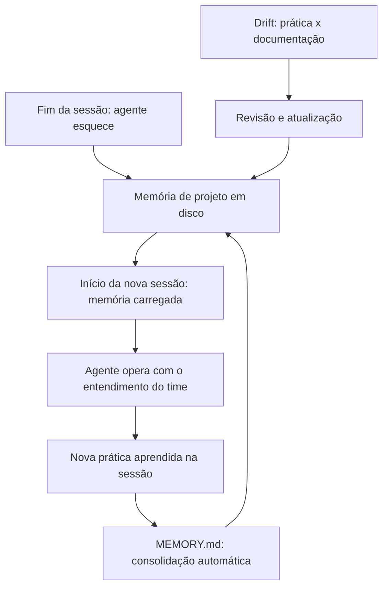

# Capítulo 1 — O agente que esquece: por que a memória de projeto importa

## 1. Introdução

Os quatro primeiros livros desta série construíram a fundação da pilha: o fundamento de software e modelos (Livro 1), a arte do prompt (Livro 2), a engenharia de contexto (Livro 3) e a conexão com o mundo via MCP (Livro 4) [1][14]. Em cada etapa, um tema recorrente ganhou força: o conhecimento que alimenta o agente precisa ser arquitetado — não apenas escrito [1][14]. Este capítulo abre a Parte II final da camada de contexto explorando a dimensão que decide se o conhecimento sobrevive: a memória de projeto [1]. A tese é direta: todo agente esquece ao fim da sessão — e a engenharia da memória de projeto materializa o conhecimento do time em arquivos concretos que sobrevivem entre sessões e são compartilhados por qualquer ferramenta [1][3]. A diferença entre um agente que precisa reaprender tudo e um que opera com o entendimento do time é a diferença entre um estagiário perdido e um membro veterano da equipe [1][6]. A memória de projeto é o que transforma o agente de ferramenta em colaborador [1][3].

## 2. Explica

### 2.1 O Agente que Esquece: A Natureza da Sessão

Um agente de IA que opera em sessões efêmeras esquece tudo ao final de cada conversa [1]. O modelo não tem memória persistente — cada sessão começa do zero [1][2]. A limitação é estrutural: o modelo processa o contexto da sessão atual e nada mais [14]. O agente que não recebe a memória do projeto a cada sessão precisa reaprender o que o time já sabe: comandos, arquitetura, convenções e limites [1]. O custo é triplo [1]. Primeiro, o custo de re-aprendizado: cada sessão consome tokens para redescobrir o óbvio [14]. Segundo, o custo de inconsistência: sessões diferentes produzem resultados diferentes porque o conhecimento varia [1]. Terceiro, o custo de risco: sem regras, o agente viola convenções e limites [1]. A memória de projeto resolve os três custos [1].

### 2.2 O Que é a Memória de Projeto

A memória de projeto é o conjunto de conhecimento explícito sobre o projeto que o agente carrega em cada sessão [1][3]. A memória inclui [1][3]: os comandos críticos (teste, lint, build), o mapa da arquitetura, as convenções de código, as regras duras e os limites de escopo [1]. A memória não é o código — é o conhecimento sobre o código [1]. A memória não é a documentação para humanos — é o contrato para agentes [1][3]. A Anthropic define o CLAUDE.md como um contrato comportamental escrito para o agente, não um README para humanos [1]. A memória de projeto é a materialização do Context Engineering do Livro 3: o que o modelo precisa saber antes de agir [1][14].

### 2.3 A Diferença entre README e Contrato Comportamental

A distinção entre README.md e CLAUDE.md é fundamental [1]. O README é documentação para humanos: explica o que o projeto faz e como usá-lo [1]. O CLAUDE.md é um contrato comportamental para agentes: governa convenções, fluxos de trabalho e restrições de segurança [1]. A diferença tem implicações de conteúdo [1]. O README explica; o contrato comanda [1]. O README descreve; o contrato prescreve [1]. O README é lido por humanos; o contrato é carregado pelo agente em toda sessão [1]. O engenheiro que confunde os dois escreve um README no lugar de um contrato — e o agente opera sem regras [1].

### 2.4 A Memória como Camada da Pilha

A série A Pilha Agêntica organiza as disciplinas em camadas [1][14]. A memória de projeto é a camada que materializa o Context Engineering do Livro 3 [1][14]. O Livro 3 arquitetou o ambiente informacional; o Livro 5 o materializa em arquivos concretos [1][14]. A conexão é direta [1]: o Write do Livro 3 (instruções em altitude ideal) torna-se o CLAUDE.md [1][14]. O Select torna-se a hierarquia de arquivos que o agente carrega [1][3]. O Compress torna-se o tamanho ideal e a memória automática [1]. O Isolate torna-se os arquivos de subagentes [1][13]. A memória de projeto é a forma física do ambiente informacional [1][14].

### 2.5 O Vocabulário da Camada

A memória de projeto introduz um vocabulário que atravessa todo o livro [1][3]. **CLAUDE.md**: o contrato comportamental do Claude Code [1]. **AGENTS.md**: o padrão neutro entre ferramentas [3]. **MEMORY.md**: o índice da memória automática [1]. **Instrução**: o comando que o agente segue [1]. **Regra**: a restrição ou convenção [1][8]. **Regra condicional**: a regra escopada por arquivo/diretório/linguagem [8]. **Monorepo**: o repositório com múltiplos projetos [3]. **Cascata**: a hierarquia de arquivos carregados [1][3]. **Drift**: a distância entre prática e documentação [6][18]. Cada termo será desenvolvido nos próximos capítulos [1][3].

### 2.6 A Relação com o MCP do Livro 4

O Livro 4 ensinou a conexão do agente com o mundo via MCP [15][16]. A memória de projeto é complementar [1][15]. O MCP conecta o agente a ferramentas e dados; a memória conecta o agente ao conhecimento do time [1][15]. A relação tem implicações [1][15]: os resources do MCP podem alimentar a memória (políticas, convenções, exemplos) [16][1]; os arquivos de instrução são resources privilegiados [1][16]; a memória de projeto usa a mesma arquitetura de contexto do Livro 3 [1][14]. O engenheiro que domina os dois livros conecta o agente ao mundo e ao conhecimento [1][15].

### 2.7 A Escala da Memória: Do Individual ao Organizacional

A memória de projeto opera em escalas [1][3]. Na escala individual: o desenvolvedor mantém a memória do seu projeto [1]. Na escala de equipe: a memória é compartilhada e governada [1][3]. Na escala organizacional: os padrões de memória são definidos e auditados [1][17]. A escala muda as exigências [1][3]: o individual exige simplicidade; a equipe exige consistência; a organização exige governança [1][17]. O engenheiro maduro projeta a memória na escala certa [1][3].

### 2.8 O que Este Livro Vai Ensinar

Este livro está organizado em cinco partes que sobem a escada da memória [1][3]. A Parte 1 (Capítulos 1-2) estabelece o problema e o contrato comportamental [1]. A Parte 2 (Capítulos 3-4) cobre o conteúdo e a memória automática [1]. A Parte 3 (Capítulos 5-7) ensina o padrão neutro, a governança e as regras condicionais [3][4][8]. A Parte 4 (Capítulos 8-9) cobre hierarquia, cascata e drift [3][6]. A Parte 5 (Capítulo 10) sintetiza a disciplina [1][3]. Ao final, o leitor estrutura a memória de projeto para qualquer agente de qualquer ferramenta [1][3].

## 3. Ilustra

### 3.1 A Analogia do Manual do Novo Funcionário

A analogia do manual do novo funcionário ilumina a memória de projeto [1]. Uma empresa que contrata um novo funcionário não o deixa adivinhar as regras — entrega um manual com comandos, arquitetura e limites [1]. O funcionário que recebe o manual opera certo desde o primeiro dia; o que não recebe erra e aprende por tentativa [1]. O CLAUDE.md é o manual do novo funcionário — para o agente [1]. A analogia funciona em profundidade [1]: o manual precisa ser atualizado quando a empresa muda (drift, Capítulo 9); o manual precisa ser lido em toda sessão; o manual vira o entendimento comum da equipe [1][6].

### 3.2 O Diagrama do Ciclo da Memória

O diagrama abaixo representa o ciclo da memória de projeto [1][14].



O ciclo é a essência da disciplina: a sessão esquece, a memória persiste, a memória realimenta a sessão e a prática realimenta a memória [1]. A consolidação automática (Capítulo 4) mantém a memória fresca [1]. A revisão de drift (Capítulo 9) mantém a memória fiel [1][6]. O ciclo é o que transforma a memória de arquivo morto em conhecimento vivo [1].

### 3.3 O Antes e o Depois na Prática

A comparação concreta ajuda a fixar o conceito [1]. **Antes (sem memória)**: o agente chega à sessão sem saber os comandos de teste, a arquitetura ou as convenções — pergunta, erra e consome tokens [1][14]. **Depois (com memória)**: o agente chega à sessão com o contrato do projeto — roda os comandos certos, respeita a arquitetura e segue as convenções [1]. A diferença não está na capacidade do modelo — está no conhecimento que o precede [1].

## 4. Técnica

### 4.1 Modelando o Ciclo da Memória em Código

O primeiro instrumento do engenheiro é modelar o ciclo da memória [1]. O código abaixo demonstra o fluxo de carregamento e consolidação [1]:

```python
from dataclasses import dataclass, field
from pathlib import Path


@dataclass
class MemoriaDeProjeto:
    """Modela o ciclo da memória de projeto entre sessões."""
    raiz: Path
    arquivos: list = field(default_factory=list)
    aprendizados: list = field(default_factory=list)

    def carregar(self) -> str:
        """Carrega a memória persistente para a sessão."""
        conteudo = []
        for arquivo in self.arquivos:
            caminho = self.raiz / arquivo
            if caminho.exists():
                conteudo.append(f"# {arquivo}\n{caminho.read_text(encoding='utf-8')}")
        return "\n\n".join(conteudo)

    def registrar_aprendizado(self, topico: str, aprendizado: str):
        """Registra um aprendizado da sessão para consolidação."""
        self.aprendizados.append({"topico": topico, "texto": aprendizado})

    def consolidar(self, arquivo_memoria: str) -> None:
        """Consolida os aprendizados no arquivo de memória (merge de duplicatas)."""
        caminho = self.raiz / arquivo_memoria
        existentes = []
        if caminho.exists():
            existentes = [linha for linha in
                          caminho.read_text(encoding='utf-8').splitlines()
                          if linha.startswith("- ")]
        vistos = set()
        unicas = []
        for item in existentes + [f"- {a['texto']}" for a in self.aprendizados]:
            if item not in vistos:
                vistos.add(item)
                unicas.append(item)
        caminho.write_text("\n".join(unicas), encoding='utf-8')


# Exemplo de uso
if __name__ == "__main__":
    mem = MemoriaDeProjeto(raiz=Path("."), arquivos=["CLAUDE.md"])
    print(mem.carregar()[:200])
    mem.registrar_aprendizado("testes", "rodar: pytest -x")
    mem.consolidar("MEMORY.md")
```

O modelo demonstra o ciclo completo: carregar a memória, operar, registrar aprendizados e consolidar [1]. A consolidação deduplica [1]. O ciclo é a base de toda a disciplina [1].

### 4.2 O Inventário da Memória de Projeto

O segundo instrumento é o inventário da memória [1][3]. O código abaixo modela o que a memória contém e seu custo [1]:

```python
@dataclass
class ComponenteMemoria:
    nome: str
    tipo: str  # "contrato", "indice", "regra_condicional"
    linhas_estimadas: int
    ferramenta: str  # "todas", "claude", "cursor"


INVENTARIO_MEMORIA = [
    ComponenteMemoria("CLAUDE.md", "contrato", 180, "claude"),
    ComponenteMemoria("AGENTS.md", "contrato", 120, "todas"),
    ComponenteMemoria("MEMORY.md", "indice", 200, "claude"),
    ComponenteMemoria(".cursor/rules/frontend.mdc", "regra_condicional", 60, "cursor"),
]


def custo_total_memoria(inventario: list) -> dict:
    por_tipo = {}
    total = 0
    for c in inventario:
        por_tipo[c.tipo] = por_tipo.get(c.tipo, 0) + c.linhas_estimadas
        total += c.linhas_estimadas
    return {"total_linhas": total, "por_tipo": por_tipo}


if __name__ == "__main__":
    print(custo_total_memoria(INVENTARIO_MEMORIA))
```

O inventário transforma a memória em disciplina mensurável [1]. Cada componente tem custo de contexto [14]. O total orienta o tamanho ideal (Capítulo 3) [1]. O inventário é a base do design da memória [1].

### 4.3 O Diagrama de Verificação de Carregamento

O terceiro instrumento concretiza a verificação da memória [1][18]. O código abaixo implementa o teste de carregamento do contexto [1][18]:

```python
def verificar_carregamento(regras_esperadas: list, resposta_agente: str) -> dict:
    """Verifica se o agente carregou as regras, pedindo que as cite."""
    carregadas = []
    ausentes = []
    for regra in regras_esperadas:
        if regra.lower() in resposta_agente.lower():
            carregadas.append(regra)
        else:
            ausentes.append(regra)
    return {
        "carregadas": carregadas,
        "ausentes": ausentes,
        "taxa_carregamento_pct": round(100 * len(carregadas) / len(regras_esperadas), 1),
    }


if __name__ == "__main__":
    regras = ["comando de teste: pytest -x", "nunca commitar .env"]
    resposta = "Os comandos de teste usam pytest -x e nunca devo commitar .env."
    print(verificar_carregamento(regras, resposta))
```

A verificação é a prática que o Cursor recomenda: pedir ao agente que cite restrições no início da sessão [1][18]. A taxa de carregamento mede se a hierarquia resolveu os arquivos certos [1][18].

## 5. Aplica

### 5.1 Onde Isso Vive no Mundo Real

A memória de projeto está em todo fluxo de desenvolvimento agêntico em 2026 [1][3]. Claude Code carrega o CLAUDE.md em toda sessão [1]. Cursor, Codex e Copilot leem AGENTS.md e regras [3][8][11]. Equipes mantêm a memória em monorepos com hierarquia [3]. A Agentic AI Foundation governa o padrão neutro [4][5]. A memória de projeto é a prática diária do desenvolvedor agêntico [1][3].

### 5.2 O Erro Comum do Iniciante

O erro mais comum de quem começa é tratar a memória como documentação opcional [1]. O iniciante escreve um README longo e acha que o agente o seguirá [1]. O agente não segue o README — segue o contrato carregado [1]. Outro erro clássico: escrever a memória uma vez e nunca atualizar — o drift cresce e o agente aplica regras obsoletas [6]. A lição é a mesma dos livros anteriores: a memória é uma disciplina — não um arquivo [1][6].

### 5.3 O Padrão Profissional em 2026

O padrão profissional em 2026 trata a memória como contrato versionado [1][3]. O CLAUDE.md é o contrato comportamental do Claude Code [1]. O AGENTS.md é o padrão neutro canônico [3]. O MEMORY.md é a memória automática consolidada [1]. As regras condicionais escopam por arquivo/diretório/linguagem [8]. A hierarquia é desenhada para monorepos [3]. O drift é medido e corrigido [6][18]. O resultado é um agente que opera com o entendimento do time [1][3].

### 5.4 Como Este Livro é Organizado

Este capítulo estabeleceu a fundação; os próximos constroem a estrutura [1]. O Capítulo 2 detalha o CLAUDE.md como contrato comportamental [1]. Os Capítulos 3 e 4 cobrem o conteúdo e a memória automática [1]. Os Capítulos 5 a 7 ensinam o padrão neutro, a governança e as regras condicionais [3][4][8]. Os Capítulos 8 e 9 cobrem hierarquia e drift [3][6]. O Capítulo 10 sintetiza a disciplina [1][3]. A jornada é a subida da pilha que a série prometeu [1][14].

### 5.5 O Papel do CLAUDE.md na Memória

O CLAUDE.md é a peça central da memória no ecossistema Anthropic [1]. O contrato tem três responsabilidades [1]. Primeiro, **comandos**: os comandos críticos que o agente deve usar [1]. Segundo, **arquitetura**: o mapa que orienta as edições [1]. Terceiro, **regras**: as convenções e os limites [1]. A Anthropic recomenda menos de 200 linhas por arquivo [1]. O engenheiro que escreve o CLAUDE.md escreve o contrato que o agente seguirá em toda sessão [1].

### 5.6 O Ecossistema de Memória: Do Pessoal ao Compartilhado

A memória de projeto vive em um ecossistema [1][3]. No nível pessoal, a memória automática do desenvolvedor em `~/.claude/projects/` [1]. No nível de projeto, o CLAUDE.md e o AGENTS.md versionados [1][3]. No nível de equipe, os padrões compartilhados e governados [1][17]. O engenheiro maduro projeta o ecossistema: o que é pessoal, o que é do projeto e o que é da organização [1][17].

### 5.7 O Custo da Memória: O Trade-off de Contexto

A memória de projeto tem custo de contexto — e o engenheiro gerencia o trade-off [1][14]. Cada linha de memória ocupa tokens em toda sessão [14]. A memória inchada degrada a adesão e aumenta o custo [1]. A memória enxuta preserva o contexto para o trabalho real [14]. A regra de ouro: menos de 200 linhas por CLAUDE.md, referências em vez de snippets, regras que o linter não enforce [1][6]. O engenheiro que gerencia o custo projeta memória eficiente [1][14].

### 5.8 O Roteiro de Implantação da Memória

A implantação da memória é um processo em fases [1][3]. A primeira fase é o **inventário**: o que o time sabe e o que o agente precisa saber [1]. A segunda é o **contrato**: o CLAUDE.md e o AGENTS.md com comandos, arquitetura e regras [1][3]. A terceira é a **memória automática**: o MEMORY.md e a consolidação [1]. A quarta é a **hierarquia**: a cascata para monorepos [3]. A quinta é a **manutenção**: a medição do drift [6][18]. Cada fase tem entregável e critério de aceite [1][3].

### 5.9 A Memória e a Revisão Autônoma

A série anuncia o método de revisão autônoma entre harness [1][14]. A memória de projeto é a infraestrutura da revisão [1]. O revisor precisa dos critérios e das convenções — que vivem na memória [1][3]. O revisor consulta a mesma memória que o executor [1]. A conexão tem implicações [1]: a memória carrega os critérios de aceite; a memória preserva o histórico das decisões; a memória isola a revisão da contaminação [1][14]. A revisão autônoma é, em última análise, uma aplicação de memória [1].

### 5.10 A Memória e a Governança Organizacional

A memória de projeto é governança [1][17]. O padrão neutro do AGENTS.md é governado pela Agentic AI Foundation [4][5][17]. A governança define o que entra na memória e quem aprova [1][17]. O CIS e os padrões institucionais orientam a segurança das instruções [1]. A governança transforma a memória individual em capacidade organizacional [1][17]. O engenheiro maduro projeta a governança junto com a memória [1][17].

### 5.11 O Caso da Memória Inexistente

Para fechar o capítulo com uma aplicação concreta, este estudo de caso mostra a memória inexistente [1]. O cenário: uma equipe usa agentes sem nenhum arquivo de memória [1]. O primeiro sintoma: o agente pergunta como rodar os testes em toda sessão [1]. O segundo sintoma: o agente viola convenções — formatação, nomenclatura, limites [1]. O terceiro sintoma: a inconsistência entre sessões gera retrabalho e conflitos [1].

O diagnóstico correto: a ausência de memória era a causa raiz [1]. O tratamento: criar o CLAUDE.md com comandos, arquitetura e regras [1]. A lição do caso é a cascata: a falta de memória criou re-aprendizado; o re-aprendizado consumiu tokens e tempo; a inconsistência ampliou o retrabalho [1][14]. O caso demonstra o tema do capítulo: a memória de projeto não é opcional — é a base do agente eficaz [1].

### 5.12 A Memória e a Interface com os Modelos

A memória de projeto interage com a diversidade de modelos e ferramentas [1][3]. O padrão neutro resolve a fragmentação [3]. O primeiro princípio é a **portabilidade**: a memória funciona em qualquer ferramenta [3]. O segundo é a **revalidação**: ao trocar de ferramenta, a memória é revalidada [1][3]. O terceiro é a **observabilidade**: o carregamento da memória é verificável [1][18]. A interface memória-ferramenta é o ponto onde o Livro 4 encontra o Livro 5 [1][3].

### 5.13 O Manual do Diagnóstico Rápido da Memória

O capítulo fecha com o manual do diagnóstico rápido da memória [1]. O primeiro item é a **existência**: a memória existe e é carregada? [1]. O segundo é o **conteúdo**: comandos, arquitetura e regras estão presentes? [1]. O terceiro é o **tamanho**: a memória é enxuta o suficiente? [1]. O quarto é a **atualidade**: a memória reflete a prática? [1][6].

O quinto item é a **portabilidade**: a memória funciona em outras ferramentas? [3]. O sexto é a **verificação**: o agente cita as regras quando pedido? [1][18]. O sétimo é a **governança**: a memória tem dono e processo de alteração? [1][17]. O manual é o resumo operacional do livro inteiro [1]. O engenheiro que percorre o manual em minutos sabe a saúde da memória [1].

### 5.14 A Memória e os Limites Éticos do Registro

A memória de projeto, ao persistir conhecimento, cria responsabilidades [1]. O primeiro limite é o da **retenção**: nem tudo que a sessão aprendeu deve ser lembrado [1]. O segundo é o da **transparência**: a equipe sabe o que a memória contém [1]. O terceiro é o do **controle**: a memória é revisável e apagável [1]. O quarto é o do **viés**: a memória reflete os vieses dos seus autores [1]. A ética da memória é uma dimensão de cada decisão deste livro [1].

### 5.15 O Futuro da Memória de Projeto

A memória de projeto é uma disciplina jovem [1][3]. As tendências visíveis apontam a evolução [1]. A primeira é a **padronização**: o AGENTS.md como padrão universal [3][4]. A segunda é a **automação**: a memória aprendida e consolidada automaticamente [1]. A terceira é a **governança**: a Agentic AI Foundation e os padrões institucionais [4][5]. A quarta é a **medição**: o drift medido como métrica [6][18]. O engenheiro que domina os fundamentos não será surpreendido pelas tendências [1][3].

### 5.16 O Fechamento do Capítulo

O capítulo de abertura se encerra com a consolidação da fundação [1]. O agente esquece ao fim da sessão; a memória de projeto materializa o conhecimento; e o contrato comportamental governa o agente [1][3]. O vocabulário da camada — CLAUDE.md, AGENTS.md, MEMORY.md, regra, cascata, drift — é o mapa da jornada [1][3]. O próximo capítulo desce ao contrato central: o CLAUDE.md [1].

### 5.17 O Custo Oculto da Memória Desorganizada

A memória de projeto tem um custo que poucos times calculam antes de pagá-lo: o custo de uma memória desorganizada [1][7]. A ausência de um `CLAUDE.md` bem estruturado não é neutra — ela cobra juros a cada sessão de agente, de três formas [1]. A primeira é a **repetição de contexto**: sem memória central, cada conversa recomeça do zero, e o humano gasta tempo reexplicando stack, convenções e armadilhas que já poderiam estar documentadas [1]. A segunda é a **inconsistência entre sessões**: dois agentes que trabalham no mesmo projeto em sessões diferentes chegam a conclusões diferentes sobre a mesma decisão — porque nenhum documento as alinhou [1][7]. A terceira é a **transferência imperfeita**: quando um membro da equipe sai, o conhecimento que ele carregava na cabeça sai com ele; sem memória materializada, a perda é definitiva [1][7].

A quantificação ajuda a tornar o problema visível [1]. Se cada sessão de agente economiza vinte minutos de recontextualização graças a uma boa memória, e a equipe roda vinte sessões por dia, a memória de projeto paga seu custo de manutenção em horas — não em semanas [1]. O inverso também é verdadeiro: a memória desorganizada que faz o agente ler 500 linhas de ruído para encontrar cinco regras relevantes cobra um imposto silencioso sobre cada chamada [1][6].

A lição operacional: **a memória de projeto é um investimento com retorno composto** [1][7]. Cada documento bem escrito economiza tempo em todas as sessões futuras; cada documento mal escrito desperdiça tempo em todas as sessões futuras. O retorno não é linear — é acumulativo, e a diferença entre as duas curvas cresce com o tamanho do time e o número de agentes [1][7].

### 5.18 A Memória como Ferramenta de Onboarding

Uma das aplicações mais tangíveis da memória de projeto é o **onboarding** — de humanos e de agentes [1][7]. O onboarding tradicional é um processo caro: semanas de mentoria, documentação espalhada, perguntas repetidas [1]. A memória de projeto comprime o processo ao transformar o conhecimento tácito do time em conhecimento explícito e consultável [1][7].

Para o **humano novo**, a memória de projeto bem escrita é o primeiro documento a ler: ela diz onde estão as coisas, como se constrói, o que não fazer [1]. O novo membro chega ao time com o mesmo entendimento que o veterano — não porque decorou tudo, mas porque o contrato está materializado [1][7].

Para o **agente novo**, a memória de projeto é o equivalente: um agente que inicia uma sessão lendo o `CLAUDE.md` e o `AGENTS.md` [1][7][9] entra na tarefa com o mesmo contexto que o humano veterano — stack, convenções, armadilhas, comandos [1][7][9]. O onboarding de agentes, que seria uma sessão de "treinamento" manual, vira leitura de contrato [1].

A convergência é elegante: **humanos e agentes fazem onboarding pelo mesmo documento** [1][7]. Isso reduz a duplicação de esforço (um contrato serve aos dois públicos), garante consistência (os dois públicos leem a mesma verdade) e simplifica a manutenção (uma única fonte a atualizar) [1][7]. É a materialização do princípio do Capítulo 5: o entendimento compartilhado como objetivo central da memória de projeto [7][9].

### 5.19 A Memória de Projeto e a Relação com o Prompt Engineering

A memória de projeto redefine a fronteira entre a engenharia de prompts (Livro 2) e a de contexto (Livro 3) [1][14]. O Livro 2 mostrou que prompts bem escritos não escalam sozinhos; o Livro 3 mostrou que o contexto arquitetado escala; este capítulo mostra que a memória de projeto é a **forma persistente** do contexto arquitetado [1][14].

A síntese [1][14]: o prompt é a unidade mais fina — uma mensagem; o contexto é o ambiente — tudo o que o modelo vê; a memória é o depósito — o que sobrevive entre sessões [1][14]. Um prompt excelente em uma sessão sem memória é um bom início que se perde; um prompt mediano com memória acumulada produz resultado superior — porque o agente parte do conhecimento do time, não do zero [1][14].

A lição para o engenheiro: **a qualidade da memória multiplica a qualidade do prompt** [1][14]. Investir na memória de projeto é investir em todos os prompts futuros de uma só vez [1][14].

### 5.20 A Memória de Projeto e a Observabilidade

A memória de projeto tem uma dimensão que os primeiros capítulos tocaram e que merece destaque: a **observabilidade** [1][18]. A pergunta operacional é simples — como saber se a memória foi carregada, entendida e seguida? [1][18]

As técnicas de observabilidade consolidadas [1][18]: **a verificação explícita** — pedir ao agente que cite as regras relevantes antes de agir, e comparar com o esperado (a prática do Capítulo 4 do Cursor); **o registro de sessão** — instrumentar o que o agente leu e como aplicou; e **o teste de comportamento** — tarefas-padrão (ex.: "rode os testes e explique a arquitetura") executadas em sessões novas, com a resposta comparada ao contrato [1][18].

O teste de comportamento é o mais revelador [1][18]: um agente que recebe a memória correta executa tarefas-padrão sem errar comandos e sem violar convenções; um agente com memória ausente ou errada comete os erros que o contrato deveria prevenir [1][18]. A observabilidade transforma a memória de projeto de crença em evidência [1][18].

### 5.21 A Memória de Projeto e o Custo de Sessão

A memória de projeto tem impacto direto no **custo de cada sessão de agente** — e o engenheiro maduro modela esse impacto [1][14]. O modelo mental [1][14]: o custo de uma sessão é a soma do contexto carregado (memória + arquivos relevantes) com o trabalho realizado; a memória boa reduz o trabalho (menos tentativa e erro) e mantém o contexto enxuto (Capítulo 3) [1][14].

A modelagem prática [1][14]: uma sessão sem memória gasta tokens em recontextualização (o agente pergunta o que o time já sabe), em erros evitáveis (o agente viola convenções) e em correções (o humano desfaz o erro). Uma sessão com memória gasta o mesmo contexto de memória todas as vezes — mas economiza nas três categorias de desperdício [1][14]. O ponto de equilíbrio: a memória paga seu custo quando a economia por sessão supera o custo do contexto de memória [1][14].

A lição operacional [1][14]: **a memória de projeto é um investimento com retorno por sessão, não por projeto**. Cada sessão futura colhe o benefício; o engenheiro que projeta a memória pensa em centenas de sessões, não em um documento [1][14].

### 5.22 A Memória de Projeto e a Qualidade das Decisões

A memória de projeto influencia não apenas a eficiência — influencia a **qualidade das decisões** do agente [1]. Um agente com a memória certa decide melhor por três mecanismos [1]: o **contexto de decisão** (as decisões arquiteturais passadas estão documentadas, e o agente não as contradiz por ignorância); a **evidência de armadilhas** (as falhas passadas registradas evitam repetição); e a **consistência de critérios** (os critérios de aceite documentados alinham a avaliação entre sessões) [1].

O contraste com a sessão sem memória é instrutivo [1]: o agente sem memória toma decisões **localmente ótimas** — corretas para a tarefa imediata, mas inconsistentes com o sistema — porque não vê o histórico [1]. O agente com memória toma decisões **globalmente consistentes** [1].

A lição do capítulo: a memória de projeto é o que aproxima o agente do comportamento de um engenheiro sênior — alguém que decide com base no histórico do sistema, não apenas no problema imediato [1].

### 5.23 A Memória de Projeto e a Velocidade de Entrega

A pergunta que a liderança faz é inevitável: a memória de projeto **acelera a entrega?** [1] A evidência prática diz que sim, por canais mensuráveis [1]: menos retrabalho (o agente erra menos), menos revisão (o código chega mais alinhado às convenções), e menos context switching (o agente não para para perguntar o óbvio) [1].

A ressalva honesta [1]: a memória de projeto não substitui a capacidade do modelo nem o julgamento humano; ela elimina **fricção** — e eliminar fricção é exatamente o que acelera fluxos de trabalho de alta repetição, como o desenvolvimento dirigido por agente [1].

A métrica para a liderança [1]: medir a taxa de correção por tarefa (Capítulo 9, Seção 9.8) antes e depois de implantar a memória; a queda da taxa é a evidência direta do ganho de velocidade [1].

### 5.24 A Memória de Projeto e a Contaminação entre Projetos

Um risco sutil da memória de projeto é a **contaminação entre projetos** [1][13]. O desenvolvedor que alterna entre múltiplos repositórios com memórias diferentes corre o risco de o agente aplicar as regras de um projeto no outro — o mesmo fenômeno de contaminação cruzada que o Livro 3 tratou com o isolamento de contexto [1][13][14].

O mecanismo da contaminação [1][13]: o agente acumula aprendizados da sessão anterior (via memória automática, Capítulo 4) e os aplica na sessão seguinte — incluindo convenções que não valem para o projeto atual [1][13]. O sintoma típico: o agente sugere a stack do projeto A enquanto trabalha no projeto B, ou aplica a convenção de nomenclatura errada [1][13].

Os controles recomendados [1][13]: **isolamento de memória por projeto** (a memória automática é separada por repositório); **declaração explícita de contexto** (o início de sessão declara o projeto e suas regras — o teste de citação do Capítulo 1, Seção 4.3); e **verificação de fronteira** (quando o agente propõe algo que não pertence ao projeto, a divergência é sinal de contaminação) [1][13].

A lição do capítulo: a memória de projeto resolve o esquecimento, mas introduz o risco inverso — a lembrança errada [1][13]. O engenheiro que isola a memória por projeto obtém os benefícios sem a contaminação [1][13][14].

### 5.25 A Memória de Projeto e o Trabalho Multimodal

A memória de projeto não cobre apenas código — cobre o **trabalho multimodal** do agente [1][14]: escrita, análise, revisão, pesquisa, documentação [1]. Cada modo de trabalho usa a memória de forma diferente [1][14]: o modo escrita precisa das convenções e do estilo; o modo análise precisa da arquitetura e dos critérios; o modo revisão precisa dos padrões e das proibições [1][14].

A prática recomendada [1][14]: o contrato declara as convenções **por modo de trabalho** — seções que o modo escrita consulta, seções que o modo revisão consulta — sem duplicar conteúdo (o dono único do Capítulo 8) [1][14]. A estruturação por modo aproxima a memória do design de um sistema: cada modo recebe o recorte de que precisa [1][14].

A lição do capítulo: a memória de projeto é a base de **todos** os modos de trabalho do agente, não apenas da escrita de código [1][14]. O contrato que cobre os modos multiplica a utilidade da memória [1][14].

### 5.26 A Memória de Projeto e a Continuidade entre Sessões

O benefício mais visível da memória de projeto é a **continuidade entre sessões** [1]. O cenário do mundo real [1]: o trabalho de sexta-feira continua na segunda-feira; o agente lembra o que foi decidido, o que foi tentado e o que ficou pendente [1]. A continuidade elimina a reinvenção: a sessão nova parte do ponto em que a anterior parou, não do zero [1].

A prática que sustenta a continuidade [1]: o registro de **estado da sessão** (o que foi feito, o que falta, o que ficou decidido) consolidado na memória automática (Capítulo 4); e o resumo de entrada (o agente inicia lendo o estado registrado) [1]. A continuidade é o que torna o agente uma ferramenta de longo prazo, e não um assistente descartável [1].

A lição do capítulo: a memória de projeto é o que transforma sessões isoladas em **trabalho contínuo** [1]. O engenheiro que projeta a continuidade obtém o valor composto da memória (Capítulo 1, Seção 5.17) [1].

### 5.27 A Memória de Projeto e o Rastreamento de Decisões

A memória de projeto funciona como **rastreador de decisões** — e o valor aparece quando o tempo passa [1]: a decisão tomada em janeiro, revisitada em agosto, encontra no contrato o contexto que a justifica [1]. O rastreador evita o custo mais caro do desenvolvimento: a **rediscussão** — a equipe que rediscute uma decisão sem registro repete o debate inteiro, sem os argumentos originais [1].

A prática recomendada [1][20]: cada decisão relevante é registrada no contrato com data, contexto e fundamento; a decisão revisada é atualizada no registro (não apagada); e o registro é consultado antes de qualquer mudança arquitetural [1][20]. O registro transforma a memória de projeto em **memória institucional** (Capítulo 2, Seção 5.23) [1][20].

A lição do capítulo: a memória que rastreia decisões converte o conhecimento individual em **patrimônio do time** [1][20]. O que não está registrado não existe — para o agente nem para a equipe futura [1][20].

### 5.28 A Memória de Projeto e a Comparação entre Ferramentas

A memória de projeto é o denominador comum que permite **comparar ferramentas** de agente em pé de igualdade [1][3][9]: a mesma tarefa, o mesmo contrato, ferramentas diferentes [1][3][9]. A comparação responde a perguntas de adoção [1][3][9]: qual ferramenta carrega melhor o contrato? Qual produz mais aderência? Qual exige mais correção humana? [1][3][9]

O método [1][3][9]: a bateria de tarefas-padrão (Capítulo 1, Seção 4.3) executada em cada ferramenta; os resultados comparados por métrica (aderência, correções, custo); e a decisão de adoção baseada em evidência, não em marketing [1][3][9].

A lição do capítulo: a memória de projeto é também um **instrumento de avaliação** — ela nivela o campo para comparar o que cada ferramenta faz com o mesmo conhecimento [1][3][9].

### 5.29 A Memória de Projeto e os Limites do Contrato

A memória de projeto tem **limites honestos** que o engenheiro precisa reconhecer [1][14]: o contrato não substitui a capacidade do modelo; não substitui o julgamento humano; e não cobre o que a equipe ainda não sabe [1][14]. A memória documenta conhecimento **estabelecido** — não descobre conhecimento novo (isso é função da exploração, não da memória) [1][14].

O reconhecimento dos limites protege contra o erro oposto ao esquecimento: a **superconfiança no contrato** [1][14]. O time que acredita que a memória resolve tudo deixa de revisar, de questionar e de explorar [1][14].

A lição final do capítulo: a memória de projeto é uma base, não um teto [1][14]. O engenheiro maduro a usa como fundação do trabalho agêntico — e continua exercendo o julgamento que o contrato não pode exercer [1][14].

### 5.30 A Memória de Projeto e a Resolução de Problemas

A memória de projeto acelera a **resolução de problemas** de forma concreta [1]: o diagnóstico de um bug começa pelo contrato — a arquitetura declarada, as armadilhas registradas, as convenções violadas [1]. O agente com memória pergunta "o que o contrato diz sobre este módulo?" antes de "o que este código faz?" — e o caminho para a causa raiz encurta [1].

A prática recomendada [1][20]: o contrato registra armadilhas conhecidas (Capítulo 3) com o sintoma e a causa — o debugger de amanhã encontra o caminho já mapeado; e a resolução de cada bug novo termina com a pergunta "isto merece uma entrada na memória?" (o registro vira prevenção) [1][20].

A lição do capítulo: a memória de projeto transforma o histórico de bugs em **mecanismo de prevenção** [1][20]. Cada problema resolvido e registrado reduz a probabilidade do próximo [1][20].

### 5.31 A Memória de Projeto e o Trabalho Assíncrono

A memória de projeto é o suporte do **trabalho assíncrono** [1]: quando o desenvolvedor entrega uma tarefa ao agente e volta depois, a memória é o que garante que o agente continuou com o contexto certo [1]. O cenário [1]: a sessão inicia com o contrato; o agente opera; o desenvolvedor retorna — e a continuidade (Capítulo 1, Seção 5.26) permite retomar sem recontextualizar [1].

A prática recomendada [1]: o registro de estado da sessão (o que foi feito, o que falta) consolida o trabalho assíncrono; e a verificação de carregamento (Capítulo 1, Seção 4.3) confirma que a sessão nova herdou o contexto [1].

A lição do capítulo: a memória de projeto habilita o desenvolvimento assíncrono com agentes — o mesmo valor que a memória dá a humanos que trabalham em turnos [1].

### 5.32 A Memória de Projeto e a Garantia de Qualidade

A memória de projeto é uma ferramenta de **garantia de qualidade** [1][18]: os critérios de aceite documentados são os que a revisão verifica (Capítulo 2, Seção 5.22); as convenções declaradas são as que os testes de adesão medem (Capítulo 1, Seção 4.3); e as armadilhas registradas são as que a auditoria confere [1][18]. A memória transforma a qualidade de intenção em critério verificável [1][18].

A prática recomendada [1][18]: a suíte de conformidade do contrato (Capítulo 2, Seção 5.26) roda no CI junto com os testes; e a falha de adesão é tratada como falha de qualidade — com a mesma seriedade de um teste vermelho [1][18].

A lição do capítulo: a memória de projeto é parte do sistema de qualidade — e o sistema de qualidade é parte da memória [1][18]. Os dois se reforçam no pipeline [1][18].

### 5.33 A Memória de Projeto e a Resiliência

A memória de projeto é a **resiliência** do conhecimento do time [1][7]: quando um membro sai, o conhecimento permanece no contrato; quando uma ferramenta muda, o conhecimento viaja no padrão neutro; quando uma sessão falha, o conhecimento está no arquivo — não na conversa perdida [1][7]. A memória de projeto é o que torna o time resistente à rotatividade e o agente resistente ao esquecimento [1][7].

A lição do capítulo: a resiliência é a medida final da memória [1][7]. O contrato que sobrevive a saídas, migrações e falhas é o contrato que cumpriu a promessa [1][7].

### 5.34 A Memória de Projeto e o Propósito Final

O propósito final da memória de projeto é simples de declarar e difícil de sustentar: **o conhecimento do time não deve morrer com a sessão** [1][7]. Toda técnica deste capítulo — o contrato, o ciclo, o inventário — serve a esse propósito [1][7]. Quando o propósito é claro, as decisões de design têm critério: cada linha da memória responde à pergunta "isto sobreviveria útil à sessão de amanhã?" [1][7].

### 5.35 A Memória e a Confiança

A memória de projeto constrói **confiança** em dois sentidos [1][7]: o time confia no agente (ele opera com o entendimento do time — Capítulo 1, Seção 2.1); e o agente confia no contrato (a instrução é verdadeira — Capítulo 9) [1][7]. A confiança dupla é o ativo intangível da disciplina [1][7].

### 5.36 A Memória e o Começo

A disciplina da memória de projeto começa com um primeiro passo: escrever o contrato do território mais próximo (Capítulo 10, Seção 10.12) [1][7]. O começo é simples; a continuidade é a disciplina [1][7].

### 5.37 O Fechamento da Fundação

A fundação da pilha está completa (Capítulo 10, Seção 10.20): o prompt, o contexto, o MCP e agora a memória [1][14]. O leitor que domina a fundação está pronto para a camada de harness [1][14].

### 5.38 A Síntese da Fundação

Os quatro primeiros livros — fundamentos, prompt, contexto, MCP — e este livro formam a fundação da pilha [1][14]. A memória é o elo que dá continuidade aos demais (Capítulo 1, Seção 2.4) [1][14].

### 5.39 O Encerramento

O capítulo de abertura encerra com a promessa cumprida: o problema (o agente que esquece) e a solução (a memória de projeto) estão definidos [1]. A jornada continua [1].

### 5.40 A Ponte

A memória de projeto é a ponte entre a sessão efêmera e o conhecimento durável [1]. O capítulo 1 abriu a jornada; os demais a constroem [1][3].

## 6. Conclusão

A memória de projeto é a resposta ao agente que esquece [1]. Este capítulo estabeleceu a tese: o agente efêmero precisa de conhecimento persistente; a memória de projeto materializa o conhecimento do time em arquivos concretos [1][3]. A distinção entre README e contrato comportamental é a base [1]. O ciclo da memória — sessão, persistência, realimentação — é a essência da disciplina [1]. O vocabulário da camada é o mapa da jornada [1][3]. O próximo capítulo desce ao contrato central: o CLAUDE.md e a sua anatomia [1].

## 7. Referências

[1] ANTHROPIC. Memory: how Claude remembers your project. Claude Code Documentation, 2025–2026. Disponível em: https://docs.anthropic.com/en/docs/claude-code/memory. Acesso em: 5 ago. 2026.
[2] ANTHROPIC. Overview: Claude Code. Claude Code Documentation, 2025–2026. Disponível em: https://docs.anthropic.com/en/docs/claude-code/overview. Acesso em: 5 ago. 2026.
[3] AGENTS.MD. AGENTS.md: the standard for AI agent instructions. Agentic AI Foundation / OpenAI, ago. 2025. Disponível em: https://agents.md/. Acesso em: 5 ago. 2026.
[4] LINUX FOUNDATION. Linux Foundation announces the formation of the Agentic AI Foundation. Linux Foundation Press Release, 9 dez. 2025. Disponível em: https://www.linuxfoundation.org/press/linux-foundation-announces-the-formation-of-the-agentic-ai-foundation. Acesso em: 5 ago. 2026.
[5] AGENTIC AI FOUNDATION. Agentic AI Foundation official portal. AAIF, 2025–2026. Disponível em: https://aaif.io/. Acesso em: 5 ago. 2026.
[6] OSMANI, Addy. 15 AGENTS.md — engineering guide to AGENTS.md. Addy Osmani, 2025–2026. Disponível em: https://addyosmani.com/agents/15-agents-md/. Acesso em: 5 ago. 2026.
[7] AUGMENT CODE. How to build AGENTS.md: construction guide. Augment Code Guides, 2025–2026. Disponível em: https://www.augmentcode.com/guides/how-to-build-agents-md. Acesso em: 5 ago. 2026.
[8] CURSOR. Rules: Cursor Documentation. Cursor / Anysphere, 2025–2026. Disponível em: https://cursor.com/docs/rules. Acesso em: 5 ago. 2026.
[9] AGYN. AGENTS.md vs CLAUDE.md: does Claude Code or Codex read both?. Agyn Blog, jun. 2026. Disponível em: https://agyn.io/blog/claude-md-agents-md-compatibility. Acesso em: 5 ago. 2026.
[10] OPENAI. Codex: AGENTS.md and coding agents. OpenAI Documentation, 2025–2026. Disponível em: https://openai.com/index/introducing-codex/. Acesso em: 5 ago. 2026.
[11] GITHUB. GitHub Copilot: repository instructions and AGENTS.md support. GitHub Documentation, 2025–2026. Disponível em: https://docs.github.com/en/copilot/customizing-copilot/adding-repository-custom-instructions. Acesso em: 5 ago. 2026.
[12] GITHUB. GitHub Copilot Coding Agent: reading repository instructions. GitHub Changelog, 2025–2026. Disponível em: https://github.blog/. Acesso em: 5 ago. 2026.
[13] ANTHROPIC. Writing tools for AI agents — using AI agents. Anthropic Engineering Blog, set. 2025. Disponível em: https://www.anthropic.com/engineering/writing-tools-for-agents. Acesso em: 5 ago. 2026.
[14] ANTHROPIC. Effective context engineering for AI agents. Anthropic Engineering Blog, set. 2025. Disponível em: https://www.anthropic.com/engineering/effective-context-engineering-for-ai-agents. Acesso em: 5 ago. 2026.
[15] ANTHROPIC. Introducing the Model Context Protocol. Anthropic News, 25 nov. 2024. Disponível em: https://www.anthropic.com/news/model-context-protocol. Acesso em: 5 ago. 2026.
[16] MODEL CONTEXT PROTOCOL. Architecture. MCP Specification 2025-11-25, 25 nov. 2025. Disponível em: https://modelcontextprotocol.io/specification/2025-11-25/architecture. Acesso em: 5 ago. 2026.
[17] LINUX FOUNDATION. Agentic AI Foundation: governance of foundational agentic infrastructure. Linux Foundation Blog, dez. 2025. Disponível em: https://www.linuxfoundation.org/blog/. Acesso em: 5 ago. 2026.
[18] CURSOR. Best practices for rules and context. Cursor Documentation, 2025–2026. Disponível em: https://cursor.com/docs/context/rules. Acesso em: 5 ago. 2026.
[19] AIDER. AGENTS.md support and multi-tool interoperability. Aider Documentation, 2025–2026. Disponível em: https://aider.chat/docs/repomap.html. Acesso em: 5 ago. 2026.
[20] ANTHROPIC. Claude Code best practices: memory and configuration. Anthropic Engineering Blog, 2025–2026. Disponível em: https://www.anthropic.com/engineering/claude-code-best-practices. Acesso em: 5 ago. 2026.
[21] CODEQL / GITHUB. Reproducible rules and configuration as code. GitHub Blog, 2025–2026. Disponível em: https://github.blog/. Acesso em: 5 ago. 2026.
[22] MODEL CONTEXT PROTOCOL. Registry Repository. GitHub Repository, 2025–2026. Disponível em: https://github.com/modelcontextprotocol/registry. Acesso em: 5 ago. 2026.
