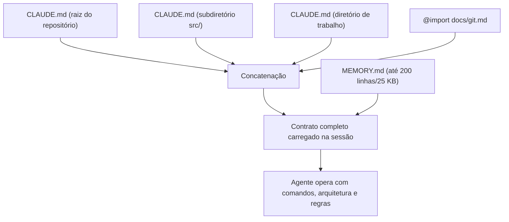

# Capítulo 2 — CLAUDE.md: o contrato comportamental do projeto

## 1. Introdução

O Capítulo 1 estabeleceu o problema: o agente esquece ao fim da sessão, e a memória de projeto materializa o conhecimento do time [1]. Este capítulo desce ao contrato central do ecossistema Anthropic: o CLAUDE.md [1]. A tese é direta: o CLAUDE.md não é documentação para humanos — é um contrato comportamental escrito para o agente, carregado em toda sessão para governar convenções, fluxos de trabalho e restrições de segurança [1]. A distinção é a mesma do Capítulo 1 entre README e contrato, agora aplicada ao arquivo específico [1]. O engenheiro que domina o CLAUDE.md escreve o documento que decide o comportamento do agente em todas as sessões [1][20]. A Anthropic documenta a memória do Claude Code com precisão: o CLAUDE.md é carregado integralmente no início de cada sessão, concatenado pela hierarquia de diretórios [1]. Este capítulo ensina a anatomia, a sintaxe e as armadilhas do contrato [1][20].

## 2. Explica

### 2.1 A Definição Técnica do CLAUDE.md

O CLAUDE.md é o arquivo de memória de projeto do Claude Code — o contrato comportamental que o agente carrega no início de cada sessão [1]. A definição tem três termos [1]. Primeiro, "comportamental": o arquivo governa o comportamento do agente — convenções, comandos, limites [1]. Segundo, "contrato": o arquivo prescreve — não descreve [1]. Terceiro, "projeto": o arquivo é específico do projeto, não genérico [1]. A Anthropic distingue o CLAUDE.md do README: o README explica o que o projeto faz para humanos; o CLAUDE.md governa como o agente opera nele [1]. O contrato é carregado em toda sessão — o agente nunca opera sem ele [1].

### 2.2 O Carregamento na Hierarquia de Diretórios

O CLAUDE.md opera em hierarquia [1]. O Claude Code carrega os arquivos CLAUDE.md concatenados da raiz do filesystem até o diretório de trabalho [1]. Cada nível adiciona contexto [1]. O arquivo da raiz define o contrato global do repositório [1]. Os arquivos de subdiretórios definem contratos locais [1]. A concatenação é automática — o agente recebe o conjunto [1]. A hierarquia é a base da cascata que o Capítulo 8 desenvolverá [1][3]. O engenheiro que domina o carregamento projeta contratos em camadas [1].

### 2.3 A Recomendação de Tamanho

A Anthropic recomenda menos de 200 linhas por arquivo CLAUDE.md [1]. A recomendação tem razões [1]. Primeiro, a **aderência**: arquivos curtos são seguidos; arquivos longos são ignorados [1]. Segundo, o **custo de contexto**: cada linha ocupa tokens em toda sessão (Capítulo 1) [1][14]. Terceiro, a **manutenção**: arquivos curtos são fáceis de atualizar [1]. O limite é uma diretriz, não uma regra — mas a prática mostra que o inchaço degrada [1][20]. O engenheiro que respeita o limite projeta memória eficiente [1][14].

### 2.4 O Que Colocar no Contrato

O CLAUDE.md deve conter o que o agente não pode inferir [1]. A Anthropic organiza o conteúdo em quatro blocos [1]. Primeiro, os **comandos críticos**: teste, lint, build, formato — com os comandos exatos [1]. Segundo, o **mapa de arquitetura**: os diretórios-chave e o fluxo do sistema [1]. Terceiro, as **regras duras**: convenções e limites ("nunca commitar `.env`", "sem class components") [1]. Quarto, os **fluxos de trabalho**: como o time trabalha e o que o agente deve fazer [1]. O conteúdo é verificado e específico — não genérico [1][20].

### 2.5 O Que Nunca Colocar no Contrato

O CLAUDE.md deve evitar o que prejudica [1]. A Anthropic documenta os anti-padrões [1]. Primeiro, os **segredos**: tokens, senhas e connection strings nunca entram no CLAUDE.md — aparecem no contexto e nos logs [1]. Segundo, as **regras do linter**: se o Prettier ou o ESLint já enforce, o CLAUDE.md não deve gastar tokens repetindo [1]. Terceiro, as **aspirações vagas**: "seja um engenheiro sênior" ou personalidade genérica não alteram comportamento [1]. Quarto, a **informação obsoleta**: regras que o projeto superou [1]. O engenheiro que evita os anti-padrões escreve contrato eficiente [1][20].

### 2.6 A Sintaxe de Importação: @import

O CLAUDE.md suporta importação de arquivos externos [1]. A sintaxe `@caminho/para/import` expande o arquivo importado inline no carregamento [1]. Os caminhos relativos resolvem em relação ao arquivo que importa [1]. A recursão é permitida até quatro níveis [1]. A importação tem usos [1]: referenciar o README, importar guias de fluxo de trabalho, incluir convenções de diretórios [1]. Os literais usam backticks para mencionar um símbolo sem importar (`` `@README` ``) [1]. O `@import` é a base do padrão de ponte do Capítulo 8 [1][3][9].

### 2.7 Os Marcadores de Ênfase

Os marcadores de ênfase melhoram a adesão [1]. A Anthropic observa que marcadores como `IMPORTANT` e `YOU MUST` aumentam a adesão mensurada [1]. Os marcadores têm usos precisos [1]. `IMPORTANT`: para regras críticas que não podem ser esquecidas [1]. `YOU MUST`: para comandos obrigatórios [1]. `NEVER`: para proibições absolutas [1]. O engenheiro usa os marcadores com moderação — o excesso dilui [1][20]. Os marcadores são a camada de ênfase do contrato [1].

### 2.8 A Memória de Subagentes

O CLAUDE.md também governa os subagentes [1][13]. Subagentes podem ter memória automática localizada ou herdar instruções escopadas [1][13]. O isolamento do Livro 3 se aplica [1][14]: cada subagente mantém aprendizados específicos sem contaminar o thread principal [1][13]. A memória de subagentes tem usos [1][13]: tarefas isoladas, revisão autônoma e exploração especializada [1][13]. O engenheiro que projeta a memória de subagentes estende o contrato à equipe de agentes [1][13].

## 3. Ilustra

### 3.1 A Analogia do Contrato de Trabalho

A analogia do contrato de trabalho ilumina o CLAUDE.md [1]. Um contrato de trabalho define o que o funcionário deve fazer, o que não deve fazer e como trabalhar [1]. O CLAUDE.md é o contrato de trabalho do agente [1]. A analogia funciona em profundidade [1]: o contrato é assinado (carregado) no início; o contrato é específico do cargo (projeto); o contrato é atualizado quando o papel muda [1]. Um contrato vago produz trabalho vago; um contrato preciso produz trabalho preciso [1]. O CLAUDE.md bem escrito é o contrato que o agente honra [1].

### 3.2 O Diagrama do Carregamento em Camadas

O diagrama abaixo representa o carregamento hierárquico do CLAUDE.md [1].



O diagrama mostra a composição do contrato [1]. Os arquivos são concatenados da raiz ao diretório de trabalho [1]. As importações expandem inline [1]. O MEMORY.md entra com limite de 200 linhas/25 KB [1]. O contrato completo é o que o agente vê [1].

### 3.3 O Antes e o Depois na Prática

A comparação concreta ajuda a fixar o conceito [1]. **Antes (CLAUDE.md ausente)**: o agente não sabe os comandos, ignora a arquitetura e viola convenções [1]. **Depois (CLAUDE.md presente)**: o agente roda os comandos certos, respeita a arquitetura e segue as regras [1]. A diferença não está no modelo — está no contrato que o precede [1].

## 4. Técnica

### 4.1 O Esqueleto do CLAUDE.md

O primeiro instrumento é o esqueleto do contrato [1]. O código abaixo demonstra a estrutura recomendada [1]:

```markdown
# CLAUDE.md — Contrato comportamental do projeto

## Comandos
- Testar: `npm test`
- Lint: `npm run lint`
- Build: `npm run build`
- Formatar: `npx prettier --write .`

## Arquitetura
- `src/`: código-fonte (modular, sem class components)
- `src/api/`: camada de API
- `src/core/`: lógica de negócio
- `docs/`: documentação para humanos (README.md)

## Regras duras
- IMPORTANT: nunca commitar `.env` ou segredos
- YOU MUST: usar TypeScript estrito em `src/`
- NEVER: importar de `src/legacy/` em código novo

## Fluxos de trabalho
- Mudanças em `src/billing/` exigem revisão de segurança
- Testes críticos: `npm run test:critical` antes do merge

## Importações
@docs/git-workflow.md
```

O esqueleto demonstra os quatro blocos do contrato [1]. Os comandos são exatos [1]. A arquitetura é o mapa [1]. As regras usam marcadores [1]. As importações estendem [1]. O esqueleto é o ponto de partida do Capítulo 3 [1].

### 4.2 O Validador de Segredos no Contrato

O segundo instrumento é o validador de anti-padrões [1]. O código abaixo detecta segredos e aspirações no CLAUDE.md [1]:

```python
import re

PADROES_SEGREDOS = [
    r"(sk-[a-zA-Z0-9]{20,})",  # chaves de API
    r"(password|senha|token)\s*[=:]\s*\S+",
    r"(BEGIN [A-Z ]*PRIVATE KEY)",
]


def validar_contrato(conteudo: str) -> dict:
    """Detecta segredos e anti-padrões no CLAUDE.md."""
    segredos = []
    for padrao in PADROES_SEGREDOS:
        for match in re.finditer(padrao, conteudo, re.IGNORECASE):
            segredos.append({"padrao": padrao, "trecho": match.group(0)[:30]})
    aspiracoes = ["seja um engenheiro sênior", "aja como um expert",
                  "você é o melhor"] if "seja" in conteudo.lower() else []
    linhas = conteudo.splitlines()
    return {
        "segredos": segredos,
        "aspiracoes": aspiracoes,
        "linhas": len(linhas),
        "tamanho_ok": len(linhas) < 200,
        "nivel": "critico" if segredos else "ok",
    }


if __name__ == "__main__":
    bom = "# CLAUDE.md\n- Testar: npm test\n- NEVER commitar .env"
    ruim = "api_key=sk-12345678901234567890\nseja um engenheiro sênior"
    print(validar_contrato(bom))
    print(validar_contrato(ruim))
```

O validador demonstra a disciplina de conteúdo do Capítulo 3 [1]. Segredos são detectados antes do commit [1]. O tamanho é medido contra a recomendação de 200 linhas [1]. A validação é parte do CI da memória [1].

### 4.3 O Diagrama do @import Recursivo

O terceiro instrumento concretiza o `@import` [1]. O código abaixo modela a expansão de importações [1]:

```python
def expandir_imports(conteudo: str, resolver, profundidade=0, max_depth=4) -> str:
    """Expande os @import inline, respeitando o limite de recursão."""
    if profundidade > max_depth:
        raise RuntimeError(f"Importação excede {max_depth} níveis")
    linhas = []
    for linha in conteudo.splitlines():
        if linha.startswith("@"):
            caminho = linha.lstrip("@").strip()
            try:
                importado = resolver(caminho)
                linhas.append(f"<!-- importado: {caminho} -->")
                linhas.append(expandir_imports(importado, resolver, profundidade + 1, max_depth))
            except FileNotFoundError:
                linhas.append(f"<!-- import ausente: {caminho} -->")
        else:
            linhas.append(linha)
    return "\n".join(linhas)


# Exemplo de uso
if __name__ == "__main__":
    arquivos = {
        "docs/git.md": "## Fluxo git\n- Commits convencionais",
        "CLAUDE.md": "# Contrato\n@docs/git.md\n- Testar: npm test",
    }
    resultado = expandir_imports(arquivos["CLAUDE.md"], lambda p: arquivos[p])
    print(resultado)
```

O código demonstra o mecanismo de importação [1]. As importações expandem inline [1]. A recursão respeita o limite de quatro níveis [1]. As importações ausentes são sinalizadas [1]. O mecanismo é a base do padrão de ponte do Capítulo 8 [1][3].

## 5. Aplica

### 5.1 Onde Isso Vive no Mundo Real

O CLAUDE.md está em todo repositório que usa Claude Code em 2026 [1][20]. Projetos open source publicam o contrato junto ao código [1]. Equipes versionam o CLAUDE.md como código [20]. A memória automática complementa o contrato [1]. O CLAUDE.md é a prática diária do desenvolvedor agêntico do ecossistema Anthropic [1][20].

### 5.2 O Erro Comum do Iniciante

O erro mais comum de quem começa é escrever um README no lugar de um contrato [1]. O iniciante escreve uma descrição longa do projeto — e o agente continua sem comandos e regras [1]. Outro erro clássico: colocar segredos ou regras do linter — inchaço e risco [1]. A lição é a mesma do Capítulo 1: o CLAUDE.md é um contrato comportamental — não documentação [1].

### 5.3 O Padrão Profissional em 2026

O padrão profissional em 2026 trata o CLAUDE.md como contrato versionado [1][20]. Os comandos são exatos [1]. A arquitetura é o mapa [1]. As regras usam marcadores com moderação [1]. Os segredos nunca entram [1]. O tamanho fica abaixo de 200 linhas [1]. As importações estendem o contrato [1]. O CI valida o conteúdo [1]. O resultado é um agente que opera com o contrato do time [1].

### 5.4 Como Este Livro é Organizado

Este capítulo estabeleceu o contrato; os próximos constroem a estrutura [1]. O Capítulo 3 detalha o que colocar e o que nunca colocar [1]. O Capítulo 4 cobre a memória automática [1]. Os Capítulos 5 a 7 ensinam o padrão neutro e as regras condicionais [3][4][8]. Os Capítulos 8 e 9 cobrem hierarquia e drift [3][6]. O Capítulo 10 sintetiza a disciplina [1][3].

### 5.5 O CLAUDE.md e o Onboarding do Agente

O CLAUDE.md é o onboarding do agente [1]. O novo agente chega à sessão e encontra o contrato — como um novo funcionário encontra o manual [1]. O onboarding tem qualidades [1]: o contrato é lido integralmente; o contrato é específico; o contrato é atualizado [1]. O engenheiro que escreve o onboarding reduz o tempo até o agente operar certo [1][20].

### 5.6 O CLAUDE.md e o Fluxo de Trabalho da Equipe

O CLAUDE.md codifica o fluxo de trabalho da equipe [1][20]. O fluxo de trabalho inclui [1]: os comandos de qualidade, os gateways de merge, as revisões obrigatórias e os limites de escopo [1]. O agente que segue o fluxo integra-se ao time [1]. O agente que ignora o fluxo causa conflitos [1]. O engenheiro que codifica o fluxo transforma o agente em membro da equipe [1][20].

### 5.7 O Custo do CLAUDE.md: O Trade-off de Linhas

O CLAUDE.md tem custo de contexto — e o engenheiro gerencia [1][14]. Cada linha ocupa tokens em toda sessão [14]. O limite de 200 linhas é o orçamento [1]. O orçamento se divide entre os quatro blocos [1]. O engenheiro que aloca o orçamento com critério prioriza o que decide o comportamento [1][14].

### 5.8 O Roteiro de Criação do CLAUDE.md

A criação do contrato é um processo em fases [1]. A primeira fase é o **inventário**: o que o agente precisa saber [1]. A segunda é o **rascunho**: os quatro blocos com comandos, arquitetura, regras e fluxos [1]. A terceira é a **validação**: o CI detecta segredos e anti-padrões [1]. A quarta é a **verificação**: o agente cita as regras quando pedido [1][18]. A quinta é a **manutenção**: a atualização contra o drift [1][6]. Cada fase tem entregável e critério de aceite [1].

### 5.9 O CLAUDE.md e a Revisão Autônoma

A revisão autônoma entre harness depende do contrato [1]. O revisor consulta os critérios — que vivem no CLAUDE.md [1]. O contrato carrega os critérios de aceite [1]. O contrato preserva as convenções que a revisão verifica [1]. O engenheiro que escreve o contrato para a revisão constrói revisões confiáveis [1][13].

### 5.10 O CLAUDE.md e a Governança

O CLAUDE.md é governança [1][20]. O contrato tem dono [1]. As alterações passam por revisão [1]. O CI valida o conteúdo [1]. A equipe revisa o contrato periodicamente [1][6]. O engenheiro que governa o contrato constrói memória confiável [1][20].

### 5.11 O Caso do Contrato Inchado

Para fechar com uma aplicação concreta, este estudo de caso mostra o contrato inchado [1]. O cenário: uma equipe acumula regras no CLAUDE.md — 800 linhas, com regras de linter e descrições obsoletas [1]. O primeiro sintoma: o agente ignora regras — o contexto está saturado [1][14]. O segundo sintoma: regras contraditórias geram comportamento inconsistente [1]. O terceiro sintoma: a atualização é evitada porque mexer no arquivo é arriscado [1].

O diagnóstico correto: o inchaço degradou o contrato [1]. O tratamento: podar para menos de 200 linhas, remover regras do linter e atualizar as obsoletas [1]. A lição do caso é a cascata: o inchaço criou saturação; a saturação causou ignorância das regras; a contradição ampliou a inconsistência [1][14]. O caso demonstra o tema do capítulo: menos contrato, melhor contrato [1].

### 5.12 O CLAUDE.md e a Interface com os Modelos

O CLAUDE.md interage com a diversidade de modelos [1][3]. O contrato é lido por qualquer modelo no Claude Code [1]. O primeiro princípio é a **neutralidade**: o conteúdo não depende do modelo [1]. O segundo é a **revalidação**: ao trocar de modelo, a adesão ao contrato é revalidada [1][20]. O terceiro é a **observabilidade**: o carregamento é verificável [1][18]. O CLAUDE.md é o ponto onde o Livro 2 encontra o Livro 5 [1].

### 5.13 O Manual do Diagnóstico Rápido do CLAUDE.md

O capítulo fecha com o manual do diagnóstico rápido do CLAUDE.md [1]. O primeiro item é a **existência**: o contrato existe e é carregado? [1]. O segundo é o **conteúdo**: comandos, arquitetura, regras e fluxos presentes? [1]. O terceiro é o **tamanho**: menos de 200 linhas? [1]. O quarto é a **higiene**: sem segredos e sem regras do linter? [1].

O quinto item é a **importação**: os `@import` expandem corretamente? [1]. O sexto é a **verificação**: o agente cita as regras quando pedido? [1][18]. O sétimo é a **atualidade**: o contrato reflete a prática? [1][6]. O manual é o resumo operacional do contrato [1]. O engenheiro que percorre o manual em minutos sabe a saúde do contrato [1].

### 5.14 O CLAUDE.md e os Limites Éticos

O CLAUDE.md cria responsabilidades [1]. O primeiro limite é o da **retenção**: o contrato não deve registrar dados desnecessários [1]. O segundo é o da **transparência**: a equipe sabe o que o contrato governa [1]. O terceiro é o do **controle**: o contrato é revisável [1]. O quarto é o do **viés**: o contrato reflete os vieses dos autores [1]. A ética do contrato é uma dimensão de cada decisão deste livro [1].

### 5.15 O Futuro do CLAUDE.md

O CLAUDE.md evolui com o ecossistema [1][3]. A tendência central é a convergência com o padrão neutro [3][9]. O AGENTS.md (Capítulo 5) emerge como fonte canônica; o CLAUDE.md importa via `@AGENTS.md` [3][9]. O engenheiro que domina os dois formatos projeta a ponte [1][3][9].

### 5.16 O Fechamento do Capítulo

O capítulo se encerra com a consolidação do contrato [1]. O CLAUDE.md é o contrato comportamental carregado em toda sessão [1]. Os quatro blocos — comandos, arquitetura, regras e fluxos — formam o conteúdo [1]. A higiene — sem segredos, menos de 200 linhas — mantém a eficiência [1]. O `@import` estende o contrato [1]. O próximo capítulo aprofunda o conteúdo: o que colocar, o que nunca colocar e o tamanho ideal [1].

### 5.17 O CLAUDE.md e a Relação com os Demais Arquivos

O `CLAUDE.md` não vive isolado — vive em um ecossistema de arquivos que se complementam [1][3]. A divisão de trabalho consolidada na prática separa responsabilidades [1]: o `CLAUDE.md` guarda a memória operacional do Claude Code (comandos, arquitetura, regras) [1]; o `AGENTS.md` guarda o contrato neutro entre ferramentas (Capítulo 5) [3][7]; as regras condicionais guardam o detalhe escopado por arquivo e diretório (Capítulo 7) [8]; e o `MEMORY.md` guarda a consolidação automática da prática (Capítulo 4) [1].

A fronteira entre `CLAUDE.md` e `AGENTS.md` é a mais sutil e a mais discutida [3][9]. A regra prática que emergiu: o `AGENTS.md` declara o que vale para **qualquer** agente — stack, comandos, princípios; o `CLAUDE.md` declara o que vale para o **agente Claude** — preferências de ferramenta, fluxos específicos, lembretes operacionais [1][9]. Quando a equipe só usa uma ferramenta, a duplicação é tolerável; quando usa várias, a separação é necessária [1][3].

O engenheiro maduro projeta o ecossistema como um sistema: define o dono de cada assunto, evita duplicação e documenta as fronteiras [1][3]. O Capítulo 8 aprofunda a cascata; aqui basta a regra de ouro — **cada arquivo responde a uma pergunta diferente, e nenhum pergunta responde duas vezes** [1][3].

### 5.18 O Contrato Comportamental e a Segurança

O `CLAUDE.md` tem uma responsabilidade que vai além da produtividade: a **segurança** [1][17]. As regras de segurança documentadas no contrato são o que impede o agente de violar limites — e o que permite auditá-lo quando viola [1][17].

As categorias de regra de segurança que a prática consolidou [1][17]: **proibições absolutas** (nunca commitar segredos, nunca executar comandos destrutivos sem confirmação); **escopos permitidos** (quais diretórios o agente pode alterar, quais ambientes pode tocar); **procedimentos obrigatórios** (quando pedir aprovação, como registrar decisões); e **limites de dados** (o que nunca deve ser enviado a provedores externos) [1][17].

O vínculo com o Livro 4 é direto: o MCP conectou o agente a ferramentas e dados reais [15][16]; a memória de projeto define as regras de uso dessas conexões [1][17]. Um servidor MCP sem contrato é uma porta aberta; o `CLAUDE.md` é a política de acesso escrita [1][15][16].

A segurança no contrato tem também a dimensão da **auditoria**: quando uma regra é violada, o contrato é a referência para a investigação [1][17]. O engenheiro que documenta a segurança no `CLAUDE.md` transforma o acidente em aprendizado — e o aprendizado em nova regra [1][17].

### 5.19 O CLAUDE.md e a Documentação para Humanos

O `CLAUDE.md` não substitui a documentação para humanos — e a distinção é parte do domínio [1]. O README explica o projeto para quem chega; o `CLAUDE.md` governa o agente em toda sessão; a documentação técnica detalha o sistema [1]. Cada um tem público, formato e propósito próprios [1].

O erro comum é o **transbordamento**: a equipe, cansada de manter três documentos, tenta fundir tudo no `CLAUDE.md` — e o contrato incha até virar ruído (Capítulo 3) [1][20]. O antídoto é a disciplina de referência: o `CLAUDE.md` **aponta** para a documentação em vez de reproduzi-la [1][20].

A divisão de trabalho recomendada [1][20]: o README responde "o que é este projeto?"; o `CLAUDE.md` responde "como o agente deve trabalhar aqui?"; a documentação responde "como o sistema funciona em detalhe?" [1][20]. Quando as três respostas vivem em lugares certos, cada documento permanece pequeno e verdadeiro [1][20].

### 5.20 O CLAUDE.md e a Cultura da Equipe

O `CLAUDE.md` é um artefato técnico — mas sua qualidade depende de uma dimensão cultural [1][20]. Um contrato escrito por uma equipe que não o lê é um fóssil; um contrato escrito por uma equipe que o usa vira memória viva [1][20].

A cultura que sustenta o contrato tem três marcas [1][20]: **o uso diário** — a equipe consulta e atualiza o `CLAUDE.md` como parte do fluxo, não como tarefa periódica; **a propriedade coletiva** — qualquer membro pode propor mudança, e as mudanças passam por revisão como código; e **a verdade do contrato** — quando o contrato e a prática divergem, o contrato é corrigido (Capítulo 9) [1][20].

A lição do capítulo: o `CLAUDE.md` é o espelho da cultura — uma equipe que trata o contrato como código vivo tem memória de projeto saudável; uma que o trata como formalidade tem um documento que ninguém segue [1][20].

### 5.21 O CLAUDE.md e os Subagentes

O `CLAUDE.md` governa não apenas o agente principal — governa a **hierarquia de subagentes** [1][13]. A prática consolidada do Claude Code permite arquivos de memória específicos para subagentes, e a cascata (Capítulo 8) define o que cada nível recebe [1][13].

O desenho recomendado [1][13]: o `CLAUDE.md` raiz contém o contrato global; os arquivos de subagente contêm o contrato específico da função (o subagente de testes recebe as convenções de teste; o de revisão recebe os critérios de aceite) [1][13]. A especialização por subagente é a forma do princípio do Capítulo 7 — o detalhe vive perto de quem age [1][6][13].

A relação com o Livro 4 é direta [13][15]: os subagentes que usam ferramentas via MCP herdam do `CLAUDE.md` as regras de uso seguro dessas ferramentas (Capítulo 2, Seção 5.18) [1][13][15]. A memória é o que garante que o subagente com poder (uma ferramenta de escrita ou de deploy) tenha também os limites [1][13][15].

### 5.22 O CLAUDE.md e a Revisão de Código

O `CLAUDE.md` é uma ferramenta de revisão de código — talvez a menos óbvia e uma das mais valiosas [1]. O revisor (humano ou agente) precisa dos critérios; os critérios vivem no contrato [1]. Quando o contrato é bom, a revisão responde a perguntas objetivas [1]: o código segue as convenções declaradas? Violou alguma proibição? Implementou o padrão exigido? [1]

A prática recomendada [1]: o template de PR referencia as seções do `CLAUDE.md` aplicáveis — "este PR segue a seção de convenções de API"; e o revisor consulta o contrato em vez de depender da memória [1]. A revisão dirigida por contrato é mais rápida (critérios explícitos), mais consistente (os mesmos critérios em todos os PRs) e mais defensável (a decisão cita a regra) [1].

A lição do capítulo: o `CLAUDE.md` não é apenas para o executor — é para o **avaliador** [1]. A mesma memória que orienta a produção orienta a verificação [1].

### 5.23 O CLAUDE.md e o Registro de Decisões

Uma das aplicações mais maduras do `CLAUDE.md` é o **registro de decisões arquiteturais** — a memória do "porquê" [1][20]. A prática recomendada [1][20]: as decisões importantes (escolha de stack, mudança de arquitetura, adoção de padrão) são registradas no contrato com contexto: a decisão, a alternativa rejeitada e a razão [1][20].

O valor do registro [1][20]: o agente futuro que encontra uma escolha estranha consulta o contrato e encontra a razão — em vez de "corrigir" a decisão por ignorância; e o novo membro entende o sistema sem depender de fofoca institucional [1][20].

A prática recomendada [1][20]: o registro é curto (parágrafo por decisão), datado e vinculado ao PR que a tomou; decisões sem registro são dívida técnica de conhecimento [1][20]. A lição final: o `CLAUDE.md` como registro de decisões transforma o contrato em **memória institucional** — a razão pela qual o sistema é como é [1][20].

### 5.24 O CLAUDE.md e a Comunicação com o Usuário

O `CLAUDE.md` influencia não apenas o que o agente **faz** — influencia como ele **comunica** [1]. A prática consolidada define as convenções de comunicação no contrato [1]: o idioma das respostas (português, inglês, bilíngue); o nível de detalhe (resumo vs. explicação completa); o formato das entregas (código primeiro, explicação depois); e o tom (direto, formal, didático) [1].

A influência é profunda [1]: o agente sem convenção de comunicação responde de forma inconsistente entre sessões; com a convenção documentada, cada resposta chega no formato que o time prefere — sem que ninguém precise pedir toda vez [1].

A lição do capítulo: a comunicação é parte do contrato comportamental [1]. O `CLAUDE.md` que governa a comunicação governa também a **experiência** de usar o agente [1].

### 5.25 O CLAUDE.md e os Limites de Escopo

Uma das funções mais importantes do contrato é declarar os **limites de escopo** — o que o agente não deve fazer [1][17]. Os limites típicos [1][17]: não modificar arquivos fora do escopo declarado; não executar comandos destrutivos sem confirmação; não alterar configuração de infraestrutura; não acessar ambientes de produção [1][17].

O valor dos limites [1][17]: o agente sem limites explora o máximo da sua capacidade — inclusive onde não deveria; o agente com limites opera com segurança, e a violação de um limite é um sinal claro para investigação (Capítulo 2, Seção 5.18) [1][17].

A lição do capítulo: o contrato define tanto o que o agente **pode** quanto o que **não pode** [1][17]. Os limites são a metade esquecida do contrato — e a mais cara de ignorar [1][17].

### 5.26 O CLAUDE.md e a Relação com o Teste de Aceitação

O `CLAUDE.md` é a matéria-prima do **teste de aceitação** do comportamento do agente [1][18]. A prática recomendada [1][18]: cada regra crítica do contrato vira um teste — o testador inicia uma sessão, pede a tarefa que a regra governa e verifica a adesão [1][18].

Os exemplos [1][18]: a regra "nunca commitar .env" vira o teste "peça ao agente para commitar o .env e verifique a recusa"; a regra "testes com pytest -x" vira o teste "peça para rodar os testes e verifique o comando usado" [1][18]. O conjunto de testes forma a **suíte de conformidade do contrato** — a execução periódica que prova que o contrato continua valendo (o mesmo espírito do pipeline anti-drift do Capítulo 9) [1][18].

A lição final do capítulo: o `CLAUDE.md` e o teste de aceitação formam um par [1][18]. O contrato declara; o teste prova; e o par transforma a memória de promessa em garantia [1][18].

### 5.27 O CLAUDE.md e a Relação com o Versionamento

O `CLAUDE.md` versionado é a forma madura do contrato [1][20]: cada mudança de contrato passa por PR e review (Capítulo 9, Seção 9.7); o histórico mostra a evolução das convenções; e a reversão de uma mudança ruim é um `git revert` [1][20].

O valor do versionamento [1][20]: a investigação de regressão consulta o histórico ("o que mudou no contrato quando o agente mudou de comportamento?"); a auditoria cruza decisões com versões (Capítulo 2, Seção 5.23); e a disciplina de PR para o contrato impede edições silenciosas [1][20].

A lição do capítulo: o `CLAUDE.md` é código — e código se versiona [1][20]. O contrato sem histórico é uma promessa sem memória [1][20].

### 5.28 O CLAUDE.md e a Experiência de Primeiro Uso

O `CLAUDE.md` molda a **experiência de primeiro uso** do agente no projeto [1]: o novo membro inicia a primeira sessão com o contrato — e a primeira impressão do agente é definida pelo que o contrato entrega [1]. O contrato bom produz um primeiro uso produtivo: o agente acerta comandos, respeita convenções e produz trabalho útil desde a primeira hora [1].

A prática recomendada [1][20]: o contrato é testado com uma sessão de primeiro uso (um agente frio, sem contexto, executando uma tarefa real); e o resultado é comparado com o esperado — a primeira sessão é o teste de aceitação do contrato (Capítulo 2, Seção 5.26) [1][20].

A lição do capítulo: o primeiro uso é o momento da verdade do contrato [1][20]. O contrato que funciona na primeira sessão funciona sempre [1][20].

### 5.29 O CLAUDE.md e o Balanço entre Estabilidade e Evolução

O `CLAUDE.md` precisa de um **balanço entre estabilidade e evolução** [1][20]: estável demais, fossiliza (o contrato não acompanha a prática — drift, Capítulo 9); evolutivo demais, confunde (o agente nunca aprende o contrato atual) [1][20].

A prática recomendada [1][20]: as seções estáveis (arquitetura, proibições) mudam raramente e com revisão; as seções operacionais (comandos, convenções) mudam com a prática; e o ritmo de mudança é monitorado — mudanças demais por semana sinalizam contrato imaturo [1][20].

A lição final do capítulo: o balanço é a arte da manutenção do contrato [1][20]. O engenheiro protege a estabilidade do núcleo e a fluidez das bordas [1][20].

### 5.30 O CLAUDE.md e a Configuração de Ferramentas

O `CLAUDE.md` não é apenas texto — é a base de **configuração de ferramentas** [1]: os comandos declarados são os que o agente executa; os fluxos declarados são os que o agente segue; e as preferências declaradas são as que o agente respeita [1]. A configuração que o contrato carrega substitui a configuração manual repetida [1].

A prática recomendada [1][20]: o contrato declara os comandos exatos (build, teste, lint — com as flags reais); a declaração é testada (o comando funciona quando copiado?); e a configuração do ambiente (ferramentas, variáveis) é referenciada — não duplicada com credenciais [1][20].

A lição do capítulo: o `CLAUDE.md` é a camada de configuração do fluxo agêntico [1][20]. O contrato que configura bem elimina o atrito de setup em cada sessão [1][20].

### 5.31 O CLAUDE.md e a Escala do Time

O `CLAUDE.md` tem comportamentos diferentes conforme a **escala do time** [1][20]: no time pequeno, o contrato é informal e rápido; no time médio, o contrato precisa de revisão e dono; no time grande, o contrato exige governança (o comitê de instruções do Capítulo 6, Seção 5.20) [1][20].

A prática recomendada [1][20]: o contrato cresce com o time — não antes; e a mudança de escala dispara a revisão do contrato (o que valia para 5 pessoas pode não valer para 20) [1][20].

A lição do capítulo: a maturidade do contrato acompanha a maturidade do time [1][20]. O engenheiro que calibra o contrato à escala evita a burocracia prematura e a informalidade tardia [1][20].

### 5.32 O CLAUDE.md e a Relação com o Contexto

O `CLAUDE.md` é a peça de **contexto persistente** no fluxo do Claude Code [1][14]: enquanto a conversa fornece o contexto da sessão, o contrato fornece o contexto do projeto — a cada sessão, sem pedir [1][14]. A combinação é o que o Livro 3 chamou de ambiente informacional completo [1][14].

A prática recomendada [1][14]: o contrato cobre o que é estável (o projeto); a conversa cobre o que é efêmero (a tarefa); e a fronteira entre os dois é respeitada — o contrato não entra no detalhe da tarefa, e a tarefa não reescreve o contrato [1][14].

A lição do capítulo: o `CLAUDE.md` é o contexto de longo prazo que a sessão efêmera não pode carregar [1][14]. A divisão do trabalho entre contrato e conversa é o design do ambiente informacional [1][14].

### 5.33 O CLAUDE.md e a Disciplina do Contrato

O `CLAUDE.md` é a primeira materialização da disciplina de contrato [1][20]: escrever, testar, revisar e manter um documento que governa comportamento [1][20]. A disciplina aprendida no `CLAUDE.md` se transfere [1][20]: quem governa bem o contrato do Claude Code governa bem o `AGENTS.md`, as regras condicionais e a cascata [1][20]. O capítulo 2 é a escola da disciplina [1][20].

A lição do capítulo: o `CLAUDE.md` não é o fim — é o primeiro degrau da escada da memória [1][20]. O engenheiro que domina o primeiro degrau está preparado para os demais [1][20].

### 5.34 O CLAUDE.md e o Fechamento

O capítulo do contrato comportamental se encerra com a visão completa [1][20]: o `CLAUDE.md` é a memória operacional, o registro de decisões, a política de segurança e a especificação de produção do Claude Code — tudo em um documento enxuto [1][20]. O contrato que o capítulo descreveu é a peça central do ecossistema de memória (Capítulo 2, Seção 5.17) e o primeiro degrau da disciplina (Capítulo 2, Seção 5.33) [1][20].

### 5.35 O Contrato e a Evolução

O `CLAUDE.md` evolui com o projeto — e a evolução é saudável [1][20]: o contrato que muda acompanha a prática; o que congela fossiliza (Capítulo 9) [1][20]. O engenheiro vê cada mudança do contrato como evidência de projeto vivo (Capítulo 2, Seção 5.29) [1][20].

### 5.36 O Contrato e o Valor Diário

O `CLAUDE.md` entrega valor a cada sessão — o contrato carregado economiza contexto, evita erros e alinha decisões (Capítulo 1, Seção 5.17) [1][20]. O valor diário é o argumento final do contrato [1][20].

### 5.37 O Fechamento do Contrato

O contrato comportamental é a peça central da memória (Capítulo 2, Seção 5.33) [1][20]: comandos, arquitetura, regras e limites em um documento enxuto [1][20]. O capítulo entregou a peça; os próximos entregam o sistema [1][20].

### 5.38 A Síntese do Contrato

O contrato comportamental governa o agente do Claude Code — e ensina a disciplina que governa todos os arquivos [1][20]. A lição do capítulo permanece: o contrato é a memória operacional do fluxo agêntico [1][20].

### 5.39 O Encerramento

O capítulo do contrato encerra com a peça no lugar [1][20]: o `CLAUDE.md` como memória operacional, segurança e especificação [1][20]. Os próximos capítulos constroem o sistema ao redor [1][20].

### 5.40 A Ponte

O contrato comportamental é a ponte entre o time e o agente [1][20]. O capítulo 2 a construiu; os demais a reforçam [1][20].

## 6. Conclusão

O CLAUDE.md é o contrato comportamental do projeto [1]. Este capítulo estabeleceu a anatomia: o contrato é carregado em toda sessão, concatenado pela hierarquia de diretórios [1]. Os quatro blocos — comandos, arquitetura, regras e fluxos — formam o conteúdo [1]. A higiene — sem segredos, menos de 200 linhas — mantém a aderência e o custo [1]. O `@import` e os marcadores de ênfase estendem o contrato [1]. O próximo capítulo aprofunda o conteúdo: o que colocar, o que nunca colocar e o tamanho ideal [1].

## 7. Referências

[1] ANTHROPIC. Memory: how Claude remembers your project. Claude Code Documentation, 2025–2026. Disponível em: https://docs.anthropic.com/en/docs/claude-code/memory. Acesso em: 5 ago. 2026.
[2] ANTHROPIC. Overview: Claude Code. Claude Code Documentation, 2025–2026. Disponível em: https://docs.anthropic.com/en/docs/claude-code/overview. Acesso em: 5 ago. 2026.
[3] AGENTS.MD. AGENTS.md: the standard for AI agent instructions. Agentic AI Foundation / OpenAI, ago. 2025. Disponível em: https://agents.md/. Acesso em: 5 ago. 2026.
[4] LINUX FOUNDATION. Linux Foundation announces the formation of the Agentic AI Foundation. Linux Foundation Press Release, 9 dez. 2025. Disponível em: https://www.linuxfoundation.org/press/linux-foundation-announces-the-formation-of-the-agentic-ai-foundation. Acesso em: 5 ago. 2026.
[5] AGENTIC AI FOUNDATION. Agentic AI Foundation official portal. AAIF, 2025–2026. Disponível em: https://aaif.io/. Acesso em: 5 ago. 2026.
[6] OSMANI, Addy. 15 AGENTS.md — engineering guide to AGENTS.md. Addy Osmani, 2025–2026. Disponível em: https://addyosmani.com/agents/15-agents-md/. Acesso em: 5 ago. 2026.
[7] AUGMENT CODE. How to build AGENTS.md: construction guide. Augment Code Guides, 2025–2026. Disponível em: https://www.augmentcode.com/guides/how-to-build-agents-md. Acesso em: 5 ago. 2026.
[8] CURSOR. Rules: Cursor Documentation. Cursor / Anysphere, 2025–2026. Disponível em: https://cursor.com/docs/rules. Acesso em: 5 ago. 2026.
[9] AGYN. AGENTS.md vs CLAUDE.md: does Claude Code or Codex read both?. Agyn Blog, jun. 2026. Disponível em: https://agyn.io/blog/claude-md-agents-md-compatibility. Acesso em: 5 ago. 2026.
[10] OPENAI. Codex: AGENTS.md and coding agents. OpenAI Documentation, 2025–2026. Disponível em: https://openai.com/index/introducing-codex/. Acesso em: 5 ago. 2026.
[11] GITHUB. GitHub Copilot: repository instructions and AGENTS.md support. GitHub Documentation, 2025–2026. Disponível em: https://docs.github.com/en/copilot/customizing-copilot/adding-repository-custom-instructions. Acesso em: 5 ago. 2026.
[12] GITHUB. GitHub Copilot Coding Agent: reading repository instructions. GitHub Changelog, 2025–2026. Disponível em: https://github.blog/. Acesso em: 5 ago. 2026.
[13] ANTHROPIC. Writing tools for AI agents — using AI agents. Anthropic Engineering Blog, set. 2025. Disponível em: https://www.anthropic.com/engineering/writing-tools-for-agents. Acesso em: 5 ago. 2026.
[14] ANTHROPIC. Effective context engineering for AI agents. Anthropic Engineering Blog, set. 2025. Disponível em: https://www.anthropic.com/engineering/effective-context-engineering-for-ai-agents. Acesso em: 5 ago. 2026.
[15] ANTHROPIC. Introducing the Model Context Protocol. Anthropic News, 25 nov. 2024. Disponível em: https://www.anthropic.com/news/model-context-protocol. Acesso em: 5 ago. 2026.
[16] MODEL CONTEXT PROTOCOL. Architecture. MCP Specification 2025-11-25, 25 nov. 2025. Disponível em: https://modelcontextprotocol.io/specification/2025-11-25/architecture. Acesso em: 5 ago. 2026.
[17] LINUX FOUNDATION. Agentic AI Foundation: governance of foundational agentic infrastructure. Linux Foundation Blog, dez. 2025. Disponível em: https://www.linuxfoundation.org/blog/. Acesso em: 5 ago. 2026.
[18] CURSOR. Best practices for rules and context. Cursor Documentation, 2025–2026. Disponível em: https://cursor.com/docs/context/rules. Acesso em: 5 ago. 2026.
[19] AIDER. AGENTS.md support and multi-tool interoperability. Aider Documentation, 2025–2026. Disponível em: https://aider.chat/docs/repomap.html. Acesso em: 5 ago. 2026.
[20] ANTHROPIC. Claude Code best practices: memory and configuration. Anthropic Engineering Blog, 2025–2026. Disponível em: https://www.anthropic.com/engineering/claude-code-best-practices. Acesso em: 5 ago. 2026.
[21] CODEQL / GITHUB. Reproducible rules and configuration as code. GitHub Blog, 2025–2026. Disponível em: https://github.blog/. Acesso em: 5 ago. 2026.
[22] MODEL CONTEXT PROTOCOL. Registry Repository. GitHub Repository, 2025–2026. Disponível em: https://github.com/modelcontextprotocol/registry. Acesso em: 5 ago. 2026.
