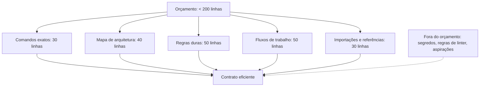

# Capítulo 3 — O que colocar, o que nunca colocar e o tamanho ideal

## 1. Introdução

O Capítulo 2 apresentou o CLAUDE.md como contrato comportamental [1]. Este capítulo desce ao conteúdo: o que colocar, o que nunca colocar e o tamanho ideal do contrato [1][20]. A tese é direta: a qualidade da memória não está no volume — está na seleção [1]. O contrato eficaz contém o que o agente não pode inferir e omite o que prejudica [1]. A Anthropic documenta o equilíbrio com precisão: menos de 200 linhas, comandos exatos, regras com marcadores, e a proibição absoluta de segredos e regras de linter [1]. O engenheiro que domina a seleção escreve contratos que o agente segue [1][20]. A disciplina do conteúdo é a mesma do Livro 3 — write/select/compress — aplicada à memória [1][14]. Este capítulo transforma a recomendação em prática verificável [1][20].

## 2. Explica

### 2.1 O Princípio da Seleção

O princípio central do conteúdo é a seleção [1][14]. O contrato não deve conter tudo — deve conter o que decide o comportamento [1]. O princípio tem três regras [1]. Primeiro, **o não-inferível**: o agente não deve inferir o que pode ser dito [1]. Segundo, **o crítico**: o que falha sem a regra entra [1]. Terceiro, **o atuável**: o que o agente pode executar [1]. A seleção é a aplicação do Select do Livro 3 à memória [1][14]. O engenheiro que seleciona com critério escreve contrato que o agente segue [1].

### 2.2 O Que Colocar: Comandos Exatos

Os comandos exatos são o primeiro bloco do conteúdo [1]. O contrato deve conter os comandos que o agente precisa rodar [1]. Os comandos têm qualidades [1]. Primeiro, a **exatidão**: o comando completo com flags — `npm test`, não "teste o projeto" [1]. Segundo, a **abrangência**: teste, lint, build e formato [1]. Terceiro, a **atualidade**: os comandos atuais, não os legados [1]. O comando exato elimina a adivinhação do agente [1]. O engenheiro que escreve comandos exatos reduz o erro e o retrabalho [1][20].

### 2.3 O Que Colocar: O Mapa de Arquitetura

O mapa de arquitetura é o segundo bloco [1]. O contrato deve conter o mapa que orienta as edições [1]. O mapa tem qualidades [1]. Primeiro, a **concisão**: os diretórios-chave, não a árvore completa [1]. Segundo, a **navegabilidade**: o que cada diretório contém [1]. Terceiro, a **orientação**: onde o agente deve procurar e onde não deve mexer [1]. O mapa transforma a arquitetura em conhecimento acionável [1]. O engenheiro que escreve o mapa reduz edições em lugares errados [1].

### 2.4 O Que Colocar: As Regras Duras e os Fluxos

As regras duras e os fluxos de trabalho são o terceiro e o quarto blocos [1]. As regras duras são as convenções e os limites [1]. Os fluxos de trabalho são os processos do time [1]. As regras têm qualidades [1]: específicas, verificáveis e com marcadores [1]. Os fluxos têm qualidades [1]: reais, atuais e acionáveis [1]. O engenheiro que escreve regras e fluxos transforma a cultura do time em conhecimento do agente [1][20].

### 2.5 O Que Nunca Colocar: Segredos

Os segredos são a proibição absoluta do contrato [1]. Tokens, senhas, connection strings e chaves de API nunca entram no CLAUDE.md [1]. A razão é dupla [1]. Primeiro, a **exposição**: o contrato aparece no contexto e nos logs [1]. Segundo, o **vazamento**: o contrato é versionado e compartilhado [1]. O segredo no contrato é um incidente de segurança em potencial [1]. O engenheiro que protege os segredos protege o projeto [1][20].

### 2.6 O Que Nunca Colocar: Regras do Linter

As regras do linter são a segunda proibição [1]. Se o Prettier ou o ESLint já enforce a regra, o contrato não deve gastar tokens repetindo [1]. A razão é a eficiência [1]. Primeiro, o **custo**: a regra duplicada ocupa tokens sem efeito [14]. Segundo, a **manutenção**: a regra duplicada pode divergir do linter [1]. Terceiro, a **prioridade**: o espaço é melhor usado em regras que o linter não cobre [1]. O engenheiro que evita a duplicação escreve contrato eficiente [1][14].

### 2.7 O Que Nunca Colocar: Aspirações e Personalidade

As aspirações vagas e a personalidade genérica são a terceira proibição [1]. "Seja um engenheiro sênior" ou "aja como um expert" não alteram comportamento [1]. A razão é a falta de efeito [1]. As aspirações não são acionáveis [1]. A personalidade genérica não decide comportamento [1]. O espaço é melhor usado em regras específicas [1]. O engenheiro que evita a vagueza escreve contrato que decide [1][20].

### 2.8 O Tamanho Ideal: O Limite de 200 Linhas

O tamanho ideal é a disciplina do orçamento [1]. A Anthropic recomenda menos de 200 linhas por arquivo CLAUDE.md [1]. O limite tem razões [1]. Primeiro, a **aderência**: contratos curtos são seguidos [1]. Segundo, o **custo**: cada linha ocupa tokens em toda sessão [14]. Terceiro, a **manutenção**: contratos curtos são fáceis de atualizar [1]. O limite é o orçamento da memória [1]. O engenheiro que respeita o orçamento projeta memória eficiente [1][14].

## 3. Ilustra

### 3.1 A Analogia da Mala de Viagem

A analogia da mala de viagem ilumina a seleção [1]. Quem viaja não leva tudo — leva o essencial [1]. A mala cheia demais custa caro e é difícil de carregar; a mala certa tem o que decide a viagem [1]. O CLAUDE.md é a mala do agente [1]. A analogia funciona em profundidade [1]: o excesso pesa (custo de tokens); o esquecimento prejudica (falta de regra); a seleção é a arte [1]. O engenheiro que empacota com critério escreve o contrato que viaja [1][14].

### 3.2 O Diagrama da Alocação do Orçamento

O diagrama abaixo representa a alocação do orçamento de 200 linhas [1].



O diagrama mostra a alocação do orçamento [1]. Os quatro blocos dividem as 200 linhas [1]. As importações estendem sem ocupar [1]. O que não decide o comportamento fica fora [1]. A alocação é a disciplina do Capítulo 3 [1].

### 3.3 O Antes e o Depois na Prática

A comparação concreta ajuda a fixar o conceito [1]. **Antes (contrato inchado)**: 800 linhas com segredos, regras de linter e aspirações — o agente ignora e o risco cresce [1]. **Depois (contrato selecionado)**: 180 linhas com comandos, arquitetura, regras e fluxos — o agente segue e o risco cai [1]. A diferença não está no volume — está na seleção [1].

## 4. Técnica

### 4.1 O Analisador de Contrato

O primeiro instrumento é o analisador de conteúdo [1]. O código abaixo avalia o contrato contra os princípios [1]:

```python
def analisar_contrato(conteudo: str) -> dict:
    """Avalia o CLAUDE.md contra os princípios de seleção."""
    linhas = conteudo.splitlines()
    blocos = {
        "comandos": [l for l in linhas if l.startswith("- ") and ("npm" in l or "pytest" in l or "run" in l.lower())],
        "arquitetura": [l for l in linhas if "src/" in l or "dir/" in l or "app/" in l],
        "regras": [l for l in linhas if "IMPORTANT" in l or "YOU MUST" in l or "NEVER" in l],
    }
    segredos = [l for l in linhas if "sk-" in l or "password" in l.lower() or "api_key" in l.lower()]
    aspiracoes = [l for l in linhas if "seja um" in l.lower() or "aja como" in l.lower()]
    return {
        "total_linhas": len(linhas),
        "tamanho_ok": len(linhas) < 200,
        "blocos": {k: len(v) for k, v in blocos.items()},
        "segredos": segredos,
        "aspiracoes": aspiracoes,
        "veredito": "ok" if len(linhas) < 200 and not segredos else "revisar",
    }


if __name__ == "__main__":
    print(analisar_contrato("# CLAUDE.md\n- Testar: npm test\n- IMPORTANT: never commit .env"))
    print(analisar_contrato("api_key=sk-123\nseja um engenheiro sênior\n" * 60))
```

O analisador demonstra a avaliação objetiva do contrato [1]. O tamanho é medido [1]. Os blocos são contados [1]. Os segredos e as aspirações são detectados [1]. A análise automatizada é parte do CI da memória [1].

### 4.2 O Planejador de Orçamento

O segundo instrumento é o planejador de orçamento [1]. O código abaixo aloca as 200 linhas [1]:

```python
def planejar_orcamento(necessidades: dict, orcamento=200) -> dict:
    """Aloca o orçamento de linhas entre os blocos do contrato."""
    total_necessidade = sum(necessidades.values())
    alocacao = {}
    for bloco, linhas in necessidades.items():
        alocacao[bloco] = round(orcamento * linhas / total_necessidade)
    usado = sum(alocacao.values())
    alocacao["reserva"] = orcamento - usado
    return {"orcamento": orcamento, "alocacao": alocacao, "usado": usado}


if __name__ == "__main__":
    print(planejar_orcamento({
        "comandos": 1, "arquitetura": 2, "regras": 2, "fluxos": 2, "importacoes": 1,
    }))
```

O planejador demonstra a alocação disciplinada [1]. O orçamento é distribuído pelos blocos [1]. A reserva absorve imprevistos [1]. O planejamento é a prática do Capítulo 3 [1].

### 4.3 O Diagrama da Fonte de Verdade Única

O terceiro instrumento concretiza a não-duplicação [1][6]. O código abaixo implementa a referência em vez do snippet [1][6]:

```python
def referenciar_em_vez_de_copiar(contrato: str, fonte_canonica: str) -> dict:
    """Detecta snippets copiados e sugere referências ao arquivo canônico."""
    # Trechos longos copiados do código no contrato são candidatos a referência
    trechos_longo = [l for l in contrato.splitlines() if len(l) > 80]
    return {
        "trechos_longos": len(trechos_longo),
        "sugestao": (
            f"Referencie {fonte_canonica} via @import em vez de copiar "
            f"{len(trechos_longo)} trechos longos"
        ),
    }


if __name__ == "__main__":
    contrato = "# CLAUDE.md\n" + ("linha_muito_longa_de_exemplo_que_poderia_ser_referencia_a_um_arquivo_canonico_para_evitar_drift\n" * 5)
    print(referenciar_em_vez_de_copiar(contrato, "src/styles/canonical.ts"))
```

O código demonstra a prática anti-drift do Capítulo 9 [6]. Referências em vez de snippets mantêm a memória fresca [6]. O drift desaparece porque a referência evolui com o código [6]. A prática é a ponte entre o Capítulo 3 e o Capítulo 9 [1][6].

## 5. Aplica

### 5.1 Onde Isso Vive no Mundo Real

A disciplina do conteúdo está em todo contrato profissional em 2026 [1][20]. Projetos mantêm contratos enxutos com comandos exatos [1]. Equipes validam os contratos no CI [1]. O AGENTS.md e as regras do Cursor seguem os mesmos princípios [3][8]. A disciplina do conteúdo é universal — o formato muda, os princípios permanecem [1][3].

### 5.2 O Erro Comum do Iniciante

O erro mais comum de quem começa é o excesso [1]. O iniciante quer documentar tudo — e o contrato incha [1]. Outro erro clássico: copiar regras de outros projetos sem adaptar [1]. A lição é a mesma dos capítulos anteriores: a seleção é a arte [1][14].

### 5.3 O Padrão Profissional em 2026

O padrão profissional em 2026 seleciona com critério [1][20]. Os comandos são exatos [1]. A arquitetura é o mapa [1]. As regras usam marcadores [1]. Os segredos nunca entram [1]. O linter não é duplicado [1]. O tamanho fica abaixo de 200 linhas [1]. O CI analisa o contrato [1]. O resultado é um contrato que o agente segue [1].

### 5.4 Como Este Livro é Organizado

Este capítulo estabeleceu o conteúdo; os próximos constroem a estrutura [1]. O Capítulo 4 cobre a memória automática [1]. Os Capítulos 5 a 7 ensinam o padrão neutro e as regras condicionais [3][4][8]. Os Capítulos 8 e 9 cobrem hierarquia e drift [3][6]. O Capítulo 10 sintetiza a disciplina [1][3].

### 5.5 O Conteúdo e o Onboarding do Agente

O conteúdo do contrato é o onboarding do agente [1]. O onboarding tem qualidades [1]: o essencial primeiro, o crítico destacado, o obsoleto ausente [1]. O engenheiro que escreve o onboarding certo reduz o tempo até o agente operar bem [1][20].

### 5.6 O Conteúdo e a Segurança

O conteúdo do contrato é segurança [1]. A proibição de segredos protege [1]. A regra de escopo limita [1]. O fluxo de segurança orienta [1]. O engenheiro que escreve o conteúdo com segurança transforma o contrato em defesa [1][20].

### 5.7 O Custo do Conteúdo: O Trade-off de Tokens

O conteúdo tem custo de tokens [1][14]. Cada linha selecionada custa em toda sessão [14]. O engenheiro que seleciona reduz o custo [1][14]. O trade-off é claro: o essencial custa o necessário; o supérfluo custa sem retorno [1][14].

### 5.8 O Roteiro de Escrita do Conteúdo

A escrita do conteúdo é um processo em fases [1]. A primeira fase é o **inventário**: o que o agente precisa saber [1]. A segunda é a **priorização**: o crítico primeiro [1]. A terceira é a **redação**: comandos, arquitetura, regras e fluxos [1]. A quarta é a **validação**: o CI analisa o contrato [1]. A quinta é a **manutenção**: a atualização contra o drift [1][6]. Cada fase tem entregável e critério de aceite [1].

### 5.9 O Conteúdo e a Revisão Autônoma

A revisão autônoma depende do conteúdo [1]. O revisor consulta os critérios do contrato [1]. O contrato carrega o que a revisão verifica [1]. O engenheiro que escreve o conteúdo para a revisão constrói revisões confiáveis [1][13].

### 5.10 O Conteúdo e a Governança

O conteúdo do contrato é governança [1][20]. O que entra é decidido com critério [1]. Quem altera passa por revisão [1]. O CI valida [1]. O engenheiro que governa o conteúdo constrói memória confiável [1][20].

### 5.11 O Caso do Segredo no Contrato

Para fechar com uma aplicação concreta, este estudo de caso mostra o segredo no contrato [1]. O cenário: uma equipe adiciona uma connection string ao CLAUDE.md por conveniência [1]. O primeiro sintoma: a string aparece nos logs das sessões [1]. O segundo sintoma: o repositório é compartilhado com um parceiro [1]. O terceiro sintoma: a string é rotacionada às pressas após o vazamento [1].

O diagnóstico correto: a conveniência violou a regra de segurança [1]. O tratamento: remover o segredo, rotacionar a string e adicionar o validador ao CI [1]. A lição do caso é a cascata: um atalho de conveniência criou exposição; a exposição causou o vazamento; a rotação às pressas ampliou o custo [1]. O caso demonstra o tema do capítulo: o que nunca colocar é tão importante quanto o que colocar [1].

### 5.12 O Conteúdo e a Interface com os Modelos

O conteúdo interage com a diversidade de modelos [1][3]. O contrato é lido por qualquer modelo [1]. O primeiro princípio é a **neutralidade**: o conteúdo não depende do modelo [1]. O segundo é a **revalidação**: a adesão é revalidada ao trocar de modelo [1][20]. O terceiro é a **observabilidade**: o carregamento é verificável [1][18].

### 5.13 O Manual do Diagnóstico Rápido do Conteúdo

O capítulo fecha com o manual do diagnóstico rápido do conteúdo [1]. O primeiro item é a **seleção**: o contrato contém só o não-inferível? [1]. O segundo é a **higiene**: sem segredos, sem linter, sem aspirações? [1]. O terceiro é o **tamanho**: menos de 200 linhas? [1]. O quarto é a **exatidão**: os comandos são exatos? [1].

O quinto item é a **atualidade**: o conteúdo reflete a prática? [1][6]. O sexto é a **verificação**: o agente cita as regras? [1][18]. O sétimo é a **governança**: o conteúdo tem dono e processo? [1][17]. O manual é o resumo operacional do conteúdo [1].

### 5.14 O Conteúdo e os Limites Éticos

O conteúdo cria responsabilidades [1]. O primeiro limite é o da **retenção**: o contrato não registra o desnecessário [1]. O segundo é o da **transparência**: a equipe sabe o que o contrato governa [1]. O terceiro é o do **viés**: o conteúdo reflete os vieses dos autores [1]. A ética do conteúdo é uma dimensão de cada decisão deste livro [1].

### 5.15 O Futuro do Conteúdo

O conteúdo da memória evolui [1][3]. A tendência é a convergência com o padrão neutro [3][9]. O AGENTS.md emerge como canônico; o CLAUDE.md importa [3][9]. Os princípios de seleção permanecem [1][3]. O engenheiro que domina os princípios projeta conteúdo para qualquer formato [1][3].

### 5.16 O Fechamento do Capítulo

O capítulo se encerra com a consolidação do conteúdo [1]. O que colocar: comandos exatos, arquitetura, regras e fluxos [1]. O que nunca colocar: segredos, linter e aspirações [1]. O tamanho ideal: menos de 200 linhas [1]. A seleção é a arte [1]. O próximo capítulo cobre a memória automática: o MEMORY.md e a consolidação [1].

### 5.17 O Tamanho Ideal em Diferentes Escalas de Projeto

O tamanho ideal do `CLAUDE.md` — menos de 200 linhas, conforme a recomendação oficial [1][20] — não é um número mágico: é uma consequência de trade-offs que mudam com a escala do projeto [1][20]. Em um projeto pequeno (um módulo, uma pessoa), o contrato pode caber em trinta linhas: comandos, arquitetura e três regras [1]. Em um projeto médio (alguns módulos, uma equipe), as duzentas linhas se justificam: stack, convenções por camada, fluxos de trabalho [1][20]. Em um monorepo grande, o `CLAUDE.md` raiz deve **encolher** — porque o detalhe migra para os arquivos aninhados e as regras condicionais (Capítulos 7 e 8) [1][3][8].

O sinal de que o contrato estourou o tamanho é comportamental, não numérico [1][20]: o agente começa a ignorar regras no meio do arquivo; as regras importantes se perdem entre as triviais; e o humano passa a corrigir o agente por regras que ele deveria ter seguido [1]. A correção é estrutural: não "resumir o arquivo", mas **redistribuir o conteúdo** — o detalhe desce para as camadas locais, e a raiz guarda apenas o essencial [1][3].

A regra de ouro que o engenheiro carrega: **o tamanho do contrato é inversamente proporcional ao tamanho do ecossistema** [1][3]. Quanto mais arquivos de instrução o projeto tem, menor deve ser o `CLAUDE.md` raiz — porque cada camada adicional redistribui o peso [1][3][8].

### 5.18 O Conteúdo que o Linter não Pega

Uma das justificativas mais fortes para o `CLAUDE.md` é a classe de informação que **nenhuma ferramenta de linting captura** [1][20]. O linter verifica sintaxe e estilo; o contrato verifica intenção e contexto [1][20].

As informações que só o contrato carrega [1][20]: a **razão de uma decisão** (por que usamos esta biblioteca e não aquela — o futuro agente precisa do contexto para não "corrigir" a decisão); a **armadilha conhecida** (este módulo quebra se receber X — o agente precisa saber antes de tocar); a **convenção de negócio** (o domínio chama isto de Y, não de Z — a terminologia importa); e o **limite implícito** (não refatore este trecho, ele é deliberadamente frágil) [1][20].

A distinção entre "o que o código expressa" e "o que só o humano sabe" é a essência da escrita do contrato [1][20]. O código expressa o **como**; o contrato expressa o **porquê** e o **por que não** [1][20]. Um `CLAUDE.md` que apenas repete o que o código já diz é ruído; um que registra decisões, armadilhas e convenções é o repositório do conhecimento tácito [1][20].

O teste prático para cada linha do contrato: **se um novo membro da equipe — ou um agente frio — cometer um erro evitável sem esta linha, ela pertence ao arquivo; caso contrário, é candidata a corte** [1][20]. O teste transforma a escrita de memória de arte em engenharia [1][20].

### 5.19 O Que Nunca Colocar: A Lista de Proibições Ampliada

O Capítulo 3 já listou o essencial do que não colocar; a prática amplia a lista com categorias que causam dano silencioso [1][20]:

**Informação volátil por natureza** — números de versão que mudam toda semana, URLs de ambientes que rodam, credenciais (absolutamente proibidas) [1][20]. O contrato que contém o volátil mente em semanas [1][20].

**Opinião genérica** — "escreva código limpo", "siga boas práticas". O agente já sabe; a linha ocupa contexto e não muda comportamento [1][20]. O teste: se a regra vale para qualquer projeto do planeta, ela não pertence ao contrato deste projeto [1][20].

**Duplicação do que o código expressa** — "a pasta api contém endpoints". O agente lê o código e vê; a linha é ruído (Capítulo 3) [1][20].

**Instrução contraditória com a prática** — a regra morta (Capítulo 9) [1][7]. É a mais cara: contamina a confiança em todas as outras regras [1][7].

A regra de ouro consolidada [1][20]: **quando em dúvida, deixe de fora**. O contrato enxuto é lido e obedecido; o contrato inchado é ignorado [1][20].

### 5.20 A Revisão Periódica do Conteúdo

O conteúdo do `CLAUDE.md` não é estático — exige revisão periódica, e a prática define o ritmo e o método [1][7][20]:

**O ritmo**: a cada mudança de stack ou arquitetura (eventual) e a cada trimestre (preventivo) [1][7][20].

**O método**: a revisão passa pelo teste das três perguntas — esta regra ainda é verdadeira? Esta regra ainda é relevante? Esta regra ainda é obedecida? [1][7][20] Cada resposta "não" produz uma ação: corrigir, remover ou reescrever [1][7][20].

**O registro**: a revisão deixa rastro — o histórico do git mostra quando e por que cada regra mudou [1][7][20]. O rastro é a base da auditoria (Capítulo 9) [1][7].

A lição do capítulo: o conteúdo do contrato é um organismo — nasce, cresce, precisa de poda [1][7][20]. A revisão periódica é a poda; sem ela, o contrato vira selva [1][7][20].

### 5.21 A Priorização do Conteúdo: o Teste da Regra Única

Quando o contrato está cheio e precisa de corte, a prática oferece um teste decisivo: o **teste da regra única** [1][20]. A pergunta: se o `CLAUDE.md` pudesse conter apenas uma regra sobre este assunto, qual seria? [1][20] A resposta é a regra que permanece; as demais são candidatas a corte ou a migração para camadas locais (Capítulo 8) [1][20].

O teste funciona porque revela a **hierarquia de importância** do conteúdo [1][20]: a regra de segurança absoluta sobrevive; a preferência de estilo opcional cai; a duplicação do que o código expressa é cortada sem dó [1][20]. A aplicação repetida do teste produz um contrato enxuto e hierarquizado [1][20].

A lição do capítulo: **conteúdo de memória é uma questão de seleção, não de acúmulo** [1][20]. O engenheiro que seleciona com o teste da regra única escreve menos e governa mais [1][20].

### 5.22 O Tamanho Ideal e os Limites da Ferramenta

O tamanho ideal do contrato interage com os **limites técnicos da ferramenta** — e o engenheiro precisa conhecê-los [1][20]. O Claude Code documenta limites de arquivos de memória e comportamento de truncamento; o engenheiro que os ignora escreve um contrato que é silenciosamente cortado [1][20].

A prática recomendada [1][20]: conhecer os limites documentados (tamanho, número de imports, comportamento com arquivos muito longos); manter o contrato **confortavelmente abaixo** do limite (a recomendação das ~200 linhas é um teto de segurança, não um alvo); e testar o carregamento real — o agente cita as regras do fim do arquivo? (Se não, o arquivo está além do que a ferramenta carrega com peso suficiente) [1][20].

A lição do capítulo: o tamanho ideal não é apenas estética de leitura — é **engenharia de limites** [1][20]. O contrato precisa caber, carregar e ser obedecido dentro das restrições reais da ferramenta [1][20].

### 5.23 O Conteúdo e a Relação com o Código Gerado

Uma dimensão final do conteúdo: o que o contrato diz sobre **código gerado por IA** [1][20]. Em 2026, boa parte do código é escrita por agentes — e o `CLAUDE.md` é a alavanca mais direta sobre essa produção [1][20].

As regras específicas que a prática adicionou [1][20]: padrão de código gerado (formato, estilo, documentação); limites de geração (o que o agente pode gerar automaticamente e o que exige revisão humana); e convenções de verificação (o código gerado deve passar pelos mesmos gates que o código humano — lint, testes, review) [1][20].

A lição final: quando a produção de código passa a ser majoritariamente agêntica, o contrato deixa de ser "memória auxiliar" e vira **especificação de produção** [1][20]. O `CLAUDE.md` que governa bem a geração é a peça mais valiosa do pipeline [1][20].

### 5.24 O Conteúdo e a Estrutura de Seções

A organização do `CLAUDE.md` em seções é parte do conteúdo — e a prática consolidada recomenda uma estrutura estável [1][20]: **Comandos** (o que o agente usa); **Arquitetura** (o mapa do sistema); **Convenções** (as regras de estilo e padrões); **Proibições** (os limites absolutos); **Armadilhas** (o que quebra e como evitar); e **Referências** (onde encontrar o detalhe) [1][20].

O valor da estrutura [1][20]: o agente encontra a regra que precisa sem varrer o arquivo inteiro; o humano mantém o arquivo com um mapa mental claro; e as seções mapeiam os modos de trabalho (Capítulo 1, Seção 5.25) [1][20]. A estrutura é o esqueleto do contrato [1][20].

A lição do capítulo: a organização do conteúdo é tão importante quanto a redação [1][20]. Um contrato bem estruturado é obedecido; um amontoado é varrido [1][20].

### 5.25 O Conteúdo e a Redação para o Modelo

A redação do contrato tem peculiaridades para o **consumo por modelo** [1][20]. As técnicas consolidadas [1][20]: **frases imperativas curtas** (o modelo obedece melhor a comandos diretos do que a descrições); **proibições explícitas** ("nunca", "não" — o modelo respeita limites nomeados); **exemplos concretos** (um exemplo vale mais que uma definição); e **negrito e marcadores** (o modelo pondera elementos destacados) [1][20].

O teste da redação [1][20]: o agente cita a regra corretamente? Aplica-a na tarefa certa? A redação que falha no teste é reescrita — não o modelo [1][20].

A lição do capítulo: escrever para o modelo é uma habilidade — e ela se aprende com o teste de comportamento [1][20]. O contrato é linguagem de máquina, não literatura [1][20].

### 5.26 O Conteúdo e a Portabilidade para o Padrão Neutro

O conteúdo do `CLAUDE.md` deve ser **portável** para o padrão neutro — e a prática recomenda desenhar o contrato desde o início com a portabilidade em mente [1][3][20]. A regra [1][3][20]: o que é informação do projeto (stack, comandos, convenções) escreva de forma neutra, pronta para migrar ao `AGENTS.md` (Capítulo 5); o que é específico da ferramenta (recursos do Claude Code) mantenha nas seções de ferramenta [1][3][20].

A vantagem [1][3][20]: quando a organização adota o padrão neutro, a migração é copiar e limpar, não reescrever [1][3][20]. O contrato desenhado com portabilidade vira ativo organizacional (Capítulo 10, Seção 10.7) [1][3][20].

A lição final do capítulo: o conteúdo do `CLAUDE.md` é o mesmo conteúdo que o padrão neutro precisa — a diferença é o invólucro [1][3][20]. Escreva o conteúdo com portabilidade e o invólucro será sempre barato de trocar [1][3][20].

### 5.27 O Conteúdo e a Abordagem por Camadas

O conteúdo do contrato se organiza por **camadas de importância** [1][20]: a camada 1 (regras críticas — segurança, proibições, comandos essenciais) fica no topo e nunca é cortada; a camada 2 (convenções importantes — estilo, padrões) preenche o meio; e a camada 3 (detalhe opcional — preferências, lembretes) fica na base e é a primeira a ser cortada quando o arquivo incha [1][20].

O valor da hierarquia [1][20]: quando o corte é necessário (Capítulo 3, Seção 5.21), a decisão é mecânica — corta-se de baixo para cima; e quando o agente pondera o contrato, as regras críticas têm o peso do destaque [1][20].

A lição do capítulo: a hierarquia do conteúdo é a gestão do risco do contrato [1][20]. O essencial nunca é sacrificado pelo supérfluo [1][20].

### 5.28 O Conteúdo e a Redação em Duas Línguas

A prática em equipes internacionais revela a questão da **redação bilíngue** [1][20]: o contrato em português ou inglês? [1][20] A recomendação prática [1][20]: o contrato segue a língua do código e dos artefatos (se o código e os comentários são em inglês, o contrato é em inglês); a língua da equipe local pode viver em seções específicas; e a mistura é evitada — contratos híbridos confundem o agente [1][20].

A implicação para o agente [1][20]: o modelo segue instruções na língua em que são escritas; um contrato consistente produz comportamento consistente [1][20].

A lição do capítulo: a língua do contrato é uma decisão de design — e a consistência vale mais que a preferência [1][20].

### 5.29 O Conteúdo e a Relação com os Exemplos Reais

O contrato se fortalece com **exemplos reais do próprio projeto** [1][20]: em vez de definir convenção abstrata, mostrar um trecho real do código que a exemplifica [1][20]. O exemplo real tem vantagens [1][20]: é verificável (o leitor confere no código); é específico (reflete o projeto, não um tutorial); e é auto-atualizável (quando o código muda, a revisão do contrato percebe) [1][20].

A prática recomendada [1][20]: cada convenção importante referencia o arquivo real que a exemplifica — o elo entre contrato e código [1][20]. O elo é também um teste de drift (Capítulo 9): se o arquivo referenciado muda e o contrato não, o sinal dispara [1][20].

A lição final do capítulo: os exemplos reais ancoram o contrato na realidade do projeto [1][20]. O contrato que referencia o código verdadeiro é difícil de mentir [1][20].

### 5.30 O Conteúdo e a Priorização por Risco

O conteúdo do contrato se ordena também por **risco** [1][20]: as regras cuja violação causa maior dano ficam no topo e em destaque [1][20]. A matriz de risco [1][20]: probabilidade de violação × impacto da violação — a regra de segurança (probabilidade média, impacto altíssimo) precede a convenção de estilo (probabilidade alta, impacto baixo) [1][20].

A prática recomendada [1][20]: a ordenação por risco guia a hierarquia do documento (Capítulo 3, Seção 5.27); e a regra de alto risco merece destaque adicional — negrito, exemplo de contraste (Capítulo 5, Seção 5.25) ou seção própria [1][20].

A lição do capítulo: o contrato é um sistema de gestão de risco — e a redação é a priorização [1][20]. O que importa mais aparece primeiro e pesado [1][20].

### 5.31 O Conteúdo e o Teste de Legibilidade

O contrato precisa ser **legível** — e a legibilidade é testável [1][20]: o teste de legibilidade pede que um leitor novo (humano ou agente) resuma o contrato após a leitura [1][20]. Se o resumo captura as regras críticas, o contrato é legível; se omite, a estrutura falhou [1][20].

A prática recomendada [1][20]: o teste de legibilidade roda no onboarding (Capítulo 1, Seção 5.18) e na revisão periódica (Capítulo 3, Seção 5.20); e o resultado alimenta a reestruturação — a seção que ninguém resume é a seção que ninguém lê [1][20].

A lição do capítulo: legibilidade é uma propriedade do contrato, não um gosto [1][20]. O teste de legibilidade transforma a propriedade em métrica [1][20].

### 5.32 O Conteúdo e a Relação com o Tamanho da Equipe

O conteúdo do contrato varia com o **tamanho da equipe** [1][20]: no time pequeno, o contrato registra o que o tácito não alcança (comandos, armadilhas); no time médio, registra também as convenções de colaboração (fluxos de PR, revisão); no time grande, registra as regras de governança (quem decide o quê) [1][20].

A prática recomendada [1][20]: o contrato cresce com a complexidade de coordenação — não com a vaidade; e a mudança de escala dispara a revisão de conteúdo (Capítulo 2, Seção 5.31) [1][20].

A lição do capítulo: o conteúdo do contrato é função da coordenação necessária [1][20]. A equipe que calibra o conteúdo à coordenação escreve exatamente o que precisa — nem mais, nem menos [1][20].

### 5.33 O Conteúdo e a Síntese do Capítulo

O capítulo do conteúdo se fecha com a síntese [1][20]: o conteúdo do contrato é seleção — o que colocar (comandos, arquitetura, convenções, armadilhas), o que nunca colocar (volátil, genérico, duplicado, credencial) e o tamanho ideal (o menor que governa) [1][20]. As técnicas de corte (o teste da regra única), de estrutura (camadas de importância) e de redação (para o modelo) completam a caixa de ferramentas [1][20].

A lição do capítulo: o conteúdo certo é a metade da eficácia do contrato — a outra metade é a manutenção (Capítulo 9) [1][20].

### 5.34 O Conteúdo e o Fechamento

O capítulo do conteúdo se encerra com a prática imediata [1][20]: o leitor que termina o capítulo pode, hoje, auditar o próprio `CLAUDE.md` — aplicar o teste da regra única (Seção 5.21), ordenar por risco (Seção 5.30) e verificar a legibilidade (Seção 5.31) [1][20]. A auditoria é o primeiro passo da disciplina [1][20].

### 5.35 O Conteúdo e o Equilíbrio

O conteúdo do contrato é equilíbrio [1][20]: completo sem ser inchado, específico sem ser prolixo, estável sem ser congelado [1][20]. O equilíbrio não é um estado — é uma prática contínua de seleção e corte (Seções 5.21, 5.30) [1][20].

### 5.36 O Conteúdo e a Prática

O conteúdo do contrato se aperfeiçoa com a prática: cada sessão revela uma regra ausente ou uma regra desnecessária (Capítulo 3, Seção 5.20) [1][20]. A prática é o laboratório do conteúdo [1][20].

### 5.37 O Fechamento do Conteúdo

O conteúdo do contrato está definido (Capítulo 3, Seção 5.33): o que colocar, o que nunca colocar, o tamanho ideal [1][20]. O próximo passo é a memória automática — o conteúdo que se renova [1][20].

### 5.38 A Síntese do Conteúdo

O conteúdo do contrato é a seleção consciente do que o agente precisa saber [1][20]. A disciplina de seleção — cortar, hierarquizar, redigir — é a habilidade central do capítulo [1][20].

### 5.39 O Encerramento

O capítulo do conteúdo encerra com a ferramenta pronta [1][20]: a seleção, a hierarquia e a redação para o modelo [1][20]. A prática do leitor começa na próxima sessão [1][20].

### 5.40 A Ponte

O conteúdo curado é a ponte entre o contrato e a adesão [1][20]. O capítulo 3 a construiu; a manutenção a preserva [1][20].

## 6. Conclusão

A disciplina do conteúdo é a seleção [1]. Este capítulo estabeleceu os três eixos: o que colocar — comandos exatos, arquitetura, regras e fluxos; o que nunca colocar — segredos, regras de linter e aspirações; e o tamanho ideal — menos de 200 linhas [1]. A seleção é a aplicação do write/select/compress do Livro 3 à memória [1][14]. O engenheiro que seleciona com critério escreve contratos que o agente segue [1][20]. O próximo capítulo cobre a memória automática entre sessões [1].

## 7. Referências

[1] ANTHROPIC. Memory: how Claude remembers your project. Claude Code Documentation, 2025–2026. Disponível em: https://docs.anthropic.com/en/docs/claude-code/memory. Acesso em: 5 ago. 2026.
[2] ANTHROPIC. Overview: Claude Code. Claude Code Documentation, 2025–2026. Disponível em: https://docs.anthropic.com/en/docs/claude-code/overview. Acesso em: 5 ago. 2026.
[3] AGENTS.MD. AGENTS.md: the standard for AI agent instructions. Agentic AI Foundation / OpenAI, ago. 2025. Disponível em: https://agents.md/. Acesso em: 5 ago. 2026.
[4] LINUX FOUNDATION. Linux Foundation announces the formation of the Agentic AI Foundation. Linux Foundation Press Release, 9 dez. 2025. Disponível em: https://www.linuxfoundation.org/press/linux-foundation-announces-the-formation-of-the-agentic-ai-foundation. Acesso em: 5 ago. 2026.
[5] AGENTIC AI FOUNDATION. Agentic AI Foundation official portal. AAIF, 2025–2026. Disponível em: https://aaif.io/. Acesso em: 5 ago. 2026.
[6] OSMANI, Addy. 15 AGENTS.md — engineering guide to AGENTS.md. Addy Osmani, 2025–2026. Disponível em: https://addyosmani.com/agents/15-agents-md/. Acesso em: 5 ago. 2026.
[7] AUGMENT CODE. How to build AGENTS.md: construction guide. Augment Code Guides, 2025–2026. Disponível em: https://www.augmentcode.com/guides/how-to-build-agents-md. Acesso em: 5 ago. 2026.
[8] CURSOR. Rules: Cursor Documentation. Cursor / Anysphere, 2025–2026. Disponível em: https://cursor.com/docs/rules. Acesso em: 5 ago. 2026.
[9] AGYN. AGENTS.md vs CLAUDE.md: does Claude Code or Codex read both?. Agyn Blog, jun. 2026. Disponível em: https://agyn.io/blog/claude-md-agents-md-compatibility. Acesso em: 5 ago. 2026.
[10] OPENAI. Codex: AGENTS.md and coding agents. OpenAI Documentation, 2025–2026. Disponível em: https://openai.com/index/introducing-codex/. Acesso em: 5 ago. 2026.
[11] GITHUB. GitHub Copilot: repository instructions and AGENTS.md support. GitHub Documentation, 2025–2026. Disponível em: https://docs.github.com/en/copilot/customizing-copilot/adding-repository-custom-instructions. Acesso em: 5 ago. 2026.
[12] GITHUB. GitHub Copilot Coding Agent: reading repository instructions. GitHub Changelog, 2025–2026. Disponível em: https://github.blog/. Acesso em: 5 ago. 2026.
[13] ANTHROPIC. Writing tools for AI agents — using AI agents. Anthropic Engineering Blog, set. 2025. Disponível em: https://www.anthropic.com/engineering/writing-tools-for-agents. Acesso em: 5 ago. 2026.
[14] ANTHROPIC. Effective context engineering for AI agents. Anthropic Engineering Blog, set. 2025. Disponível em: https://www.anthropic.com/engineering/effective-context-engineering-for-ai-agents. Acesso em: 5 ago. 2026.
[15] ANTHROPIC. Introducing the Model Context Protocol. Anthropic News, 25 nov. 2024. Disponível em: https://www.anthropic.com/news/model-context-protocol. Acesso em: 5 ago. 2026.
[16] MODEL CONTEXT PROTOCOL. Architecture. MCP Specification 2025-11-25, 25 nov. 2025. Disponível em: https://modelcontextprotocol.io/specification/2025-11-25/architecture. Acesso em: 5 ago. 2026.
[17] LINUX FOUNDATION. Agentic AI Foundation: governance of foundational agentic infrastructure. Linux Foundation Blog, dez. 2025. Disponível em: https://www.linuxfoundation.org/blog/. Acesso em: 5 ago. 2026.
[18] CURSOR. Best practices for rules and context. Cursor Documentation, 2025–2026. Disponível em: https://cursor.com/docs/context/rules. Acesso em: 5 ago. 2026.
[19] AIDER. AGENTS.md support and multi-tool interoperability. Aider Documentation, 2025–2026. Disponível em: https://aider.chat/docs/repomap.html. Acesso em: 5 ago. 2026.
[20] ANTHROPIC. Claude Code best practices: memory and configuration. Anthropic Engineering Blog, 2025–2026. Disponível em: https://www.anthropic.com/engineering/claude-code-best-practices. Acesso em: 5 ago. 2026.
[21] CODEQL / GITHUB. Reproducible rules and configuration as code. GitHub Blog, 2025–2026. Disponível em: https://github.blog/. Acesso em: 5 ago. 2026.
[22] MODEL CONTEXT PROTOCOL. Registry Repository. GitHub Repository, 2025–2026. Disponível em: https://github.com/modelcontextprotocol/registry. Acesso em: 5 ago. 2026.
