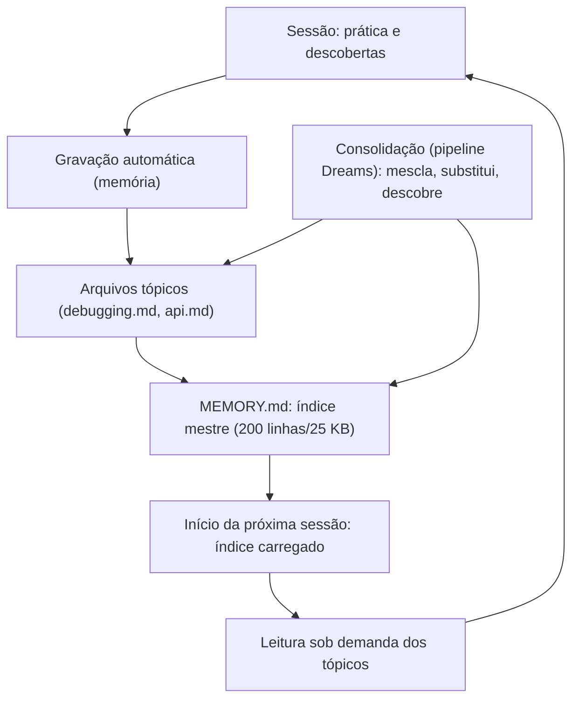

# Capítulo 4 — MEMORY.md e a memória automática entre sessões

## 1. Introdução

Os capítulos anteriores trataram da memória explícita — o contrato que o time escreve [1][3]. Este capítulo cobre a memória automática: o subsistema que aprende com as sessões e consolida o conhecimento sem intervenção manual [1]. A tese é direta: o Claude Code implementa uma memória automática que grava aprendizados sob `~/.claude/projects/<projeto>/memory/`, com o MEMORY.md como índice mestre carregado no início de cada sessão — até 200 linhas ou 25 KB [1]. A consolidação — baseada no pipeline Dreams da Anthropic — roda em períodos ociosos, mescla duplicatas, substitui entradas obsoletas e descobre novos insights dos transcripts [1]. O engenheiro que domina a memória automática não apenas escreve contratos — opera um sistema que aprende com o próprio trabalho [1][20]. A memória automática é a materialização do ciclo do Capítulo 1: a sessão produz prática, a prática vira memória, a memória realimenta a sessão [1].

## 2. Explica

### 2.1 A Arquitetura da Memória Automática

A memória automática do Claude Code tem uma arquitetura em camadas [1]. A base é o diretório de memória: `~/.claude/projects/<projeto>/memory/` [1]. O índice é o MEMORY.md: um arquivo conciso que lista os aprendizados [1]. Os arquivos tópico-específicos complementam: `debugging.md`, `api-conventions.md` — criados dinamicamente e lidos sob demanda [1]. A arquitetura separa o índice do conteúdo [1]. O índice é carregado sempre; o conteúdo é carregado quando relevante [1]. A separação é a aplicação do Select do Livro 3 à memória [1][14].

### 2.2 O MEMORY.md: O Índice Mestre

O MEMORY.md é o índice mestre da memória automática [1]. O arquivo tem um limite de carregamento preciso: as primeiras 200 linhas ou 25 KB, o que vier primeiro [1]. O limite tem razões [1]. Primeiro, o **custo de contexto**: o índice inteiro entra em toda sessão [1][14]. Segundo, a **eficiência**: o conteúdo além do limite fica em arquivos tópicos, lidos sob demanda [1]. O MEMORY.md é conciso por design [1]. O engenheiro que entende o limite projeta um índice que cabe [1].

### 2.3 A Gravação Automática de Aprendizados

A memória automática grava aprendizados das sessões [1]. O Claude Code registra insights, descobertas e preferências [1]. A gravação é automática — o agente decide o que vale a pena [1]. Os aprendizados têm qualidades [1]: específicos, acionáveis e verificáveis [1]. A gravação alimenta os arquivos tópicos [1]. O engenheiro que observa a memória automática vê o que o agente aprendeu [1][20].

### 2.4 A Consolidação: O Pipeline Dreams

A consolidação é o coração da memória automática [1]. Baseada no pipeline Dreams da Anthropic, a consolidação roda em períodos ociosos [1]. A consolidação tem três tarefas [1]. Primeiro, **mesclar duplicatas**: aprendizados repetidos viram um [1]. Segundo, **substituir obsoletos**: entradas contraditórias ou antigas são substituídas pelas recentes [1]. Terceiro, **descobrir insights**: os transcripts revelam novos padrões [1]. A consolidação mantém a memória fresca e limpa [1].

### 2.5 A Leitura Sob Demanda

A memória automática usa leitura sob demanda [1]. O MEMORY.md é carregado no início [1]. Os arquivos tópicos são lidos quando a tarefa os torna relevantes [1]. A leitura sob demanda tem benefícios [1][14]. Primeiro, o **custo**: o contexto não carrega o que não é usado [14]. Segundo, a **precisão**: o conhecimento certo chega na hora certa [1]. A leitura sob demanda é o Select do Livro 3 aplicado à memória [1][14].

### 2.6 A Relação com o Contrato Explícito

A memória automática complementa o contrato explícito [1]. O CLAUDE.md é o contrato que o time escreve [1]. A memória automática é o aprendizado que o agente acumula [1]. A relação tem divisão de trabalho [1]. O contrato governa o comportamento [1]. A memória automática registra a prática [1]. O contrato é versionado; a memória automática é pessoal [1]. O engenheiro que integra os dois constrói memória completa [1][20].

### 2.7 A Memória Automática de Subagentes

A memória automática também serve aos subagentes [1][13]. Subagentes mantêm memória localizada [1][13]. A memória localizada evita a contaminação do thread principal [1][13]. A memória de subagentes tem usos [1][13]: tarefas de exploração, revisão e investigação [1][13]. O engenheiro que projeta a memória de subagentes estende o aprendizado à equipe de agentes [1][13].

### 2.8 Os Limites da Memória Automática

A memória automática tem limites [1]. O primeiro é a **confiança**: o aprendizado automático pode estar errado [1]. O segundo é a **privacidade**: a memória persiste dados das sessões [1]. O terceiro é o **controle**: o engenheiro deve poder revisar e apagar [1]. O quarto é o **viés**: a memória reflete os padrões das sessões [1]. O engenheiro maduro conhece os limites e opera dentro deles [1].

## 3. Ilustra

### 3.1 A Analogia do Caderno do Aprendiz

A analogia do caderno do aprendiz ilumina a memória automática [1]. O aprendiz que anota o que aprende em cada tarefa constrói um caderno de conhecimento [1]. O caderno é o MEMORY.md [1]. As seções do caderno são os arquivos tópicos [1]. A revisão periódica do caderno é a consolidação [1]. A analogia funciona em profundidade [1]: o caderno sem revisão acumula contradições; o caderno revisado permanece útil [1]. O aprendiz que não anota esquece; o que anota evolui [1].

### 3.2 O Diagrama do Ciclo de Aprendizado

O diagrama abaixo representa o ciclo de aprendizado automático [1].



O ciclo mostra o aprendizado contínuo [1]. A sessão produz prática [1]. A gravação persiste [1]. A consolidação limpa [1]. A sessão seguinte herda [1]. O ciclo é o que transforma a memória em sistema vivo [1].

### 3.3 O Antes e o Depois na Prática

A comparação concreta ajuda a fixar o conceito [1]. **Antes (sem memória automática)**: cada sessão começa do zero — o que a anterior aprendeu se perde [1]. **Depois (com memória automática)**: a sessão herda os aprendizados — o conhecimento se acumula [1]. A diferença não está na capacidade — está na persistência do aprendizado [1].

## 4. Técnica

### 4.1 Modelando o MEMORY.md

O primeiro instrumento é o modelo do MEMORY.md [1]. O código abaixo implementa o índice com limite [1]:

```python
from dataclasses import dataclass, field


@dataclass
class MemoriaAutomatica:
    """Modela o MEMORY.md com limite de carregamento e consolidação."""
    indice: list = field(default_factory=list)
    topicos: dict = field(default_factory=dict)
    limite_linhas: int = 200
    limite_kb: int = 25

    def adicionar_aprendizado(self, topico: str, texto: str):
        self.topicos.setdefault(topico, []).append(texto)
        if texto not in self.indice:
            self.indice.append(f"- {topico}: {texto}")

    def carregar_indice(self) -> str:
        """Carrega o índice respeitando o limite de 200 linhas/25 KB."""
        linhas = self.indice[:self.limite_linhas]
        conteudo = "\n".join(linhas)
        if len(conteudo.encode("utf-8")) > self.limite_kb * 1024:
            # trunca para caber no limite de 25 KB
            conteudo = conteudo[:self.limite_kb * 1024]
        return conteudo

    def consolidar(self):
        """Consolida: mescla duplicatas e remove contradições (versão nova vence)."""
        vistos = {}
        for topico, itens in self.topicos.items():
            for item in reversed(itens):  # mais recente primeiro
                vistos[(topico, item)] = True
        self.indice = [f"- {t}: {i}" for (t, i) in vistos.keys()][:self.limite_linhas]


if __name__ == "__main__":
    mem = MemoriaAutomatica()
    mem.adicionar_aprendizado("testes", "rodar pytest -x")
    mem.adicionar_aprendizado("api", "usar /v2 para novas rotas")
    print(mem.carregar_indice())
```

O modelo demonstra o MEMORY.md [1]. O índice respeita o limite [1]. A consolidação deduplica [1]. O modelo é a base da memória automática [1].

### 4.2 O Detector de Contradições

O segundo instrumento é o detector de contradições [1]. O código abaixo sinaliza entradas conflitantes [1]:

```python
def detectar_contradicoes(entradas: list) -> list:
    """Detecta entradas contraditórias na memória (versão nova deve vencer)."""
    contradicoes = []
    for i in range(len(entradas)):
        for j in range(i + 1, len(entradas)):
            a, b = entradas[i], entradas[j]
            # Sinaliza pares sobre o mesmo tópico com instruções opostas
            topico_a = a.split(":", 1)[0]
            topico_b = b.split(":", 1)[0]
            if topico_a == topico_b and ("nunca" in a.lower()) != ("nunca" in b.lower()):
                contradicoes.append({"entre": (a, b), "sugestao": "manter a mais recente"})
    return contradicoes


if __name__ == "__main__":
    print(detectar_contradicoes([
        "- api: usar /v1", "- api: nunca usar /v1", "- testes: rodar pytest",
    ]))
```

O detector demonstra a tarefa de substituição da consolidação [1]. Contradições são sinalizadas [1]. A versão mais recente vence [1]. A detecção é parte do pipeline de consolidação [1].

### 4.3 O Diagrama da Consolidação

O terceiro instrumento concretiza a consolidação [1]. O código abaixo modela o pipeline Dreams simplificado [1]:

```python
def consolidar_memoria(transcripts: list) -> dict:
    """Pipeline de consolidação simplificado (mescla, substitui, descobre)."""
    duplicatas_removidas = []
    vistas = set()
    obsoletas_removidas = []
    insights_novos = []

    for transcript in transcripts:
        for frase in transcript:
            if frase in vistas:
                duplicatas_removidas.append(frase)
            vistas.add(frase)

    # Descobre insights: frases que mencionam padrões recorrentes
    padroes = ["sempre", "nunca", "falha", "otimizar"]
    for frase in vistas:
        if any(p in frase.lower() for p in padroes):
            insights_novos.append(frase)

    return {
        "duplicatas_removidas": len(duplicatas_removidas),
        "entradas_unicas": len(vistas),
        "insights_novos": insights_novos[:3],
    }


if __name__ == "__main__":
    print(consolidar_memoria([
        ["rodar pytest -x", "nunca usar /v1", "rodar pytest -x"],
        ["otimizar consultas com índices"],
    ]))
```

O código demonstra as três tarefas da consolidação [1]. A mescla remove duplicatas [1]. A descoberta identifica padrões [1]. O pipeline mantém a memória limpa [1].

## 5. Aplica

### 5.1 Onde Isso Vive no Mundo Real

A memória automática está em todo fluxo de Claude Code em 2026 [1][20]. A memória grava aprendizados de build, debugging e convenções [1]. A consolidação roda em períodos ociosos [1]. O MEMORY.md carrega o índice em toda sessão [1]. O engenheiro que opera a memória automática acumula conhecimento [1][20].

### 5.2 O Erro Comum do Iniciante

O erro mais comum de quem começa é ignorar a memória automática [1]. O iniciante depende só do contrato explícito e perde o aprendizado automático [1]. Outro erro clássico: confiar cegamente na memória automática sem revisar [1]. A lição é a mesma dos capítulos anteriores: a memória automática é uma ferramenta — a revisão é do engenheiro [1].

### 5.3 O Padrão Profissional em 2026

O padrão profissional em 2026 opera a memória automática com disciplina [1][20]. O índice é revisado [1]. As contradições são resolvidas [1]. A privacidade é respeitada [1]. A memória automática complementa o contrato [1]. O resultado é um sistema que aprende [1][20].

### 5.4 Como Este Livro é Organizado

Este capítulo estabeleceu a memória automática; os próximos constroem a estrutura [1]. Os Capítulos 5 a 7 ensinam o padrão neutro e as regras condicionais [3][4][8]. Os Capítulos 8 e 9 cobrem hierarquia e drift [3][6]. O Capítulo 10 sintetiza a disciplina [1][3].

### 5.5 A Memória Automática e o Contrato Explícito

O leitor que integra a memória automática ao contrato constrói memória completa [1]. O contrato governa [1]. A memória automática registra [1]. A integração tem práticas [1]: o contrato referencia o que a memória registra; a memória realimenta o contrato na revisão [1][6]. O engenheiro que integra os dois constrói o ciclo completo [1].

### 5.6 A Memória Automática e a Privacidade

A memória automática persiste dados — e a privacidade é uma disciplina [1]. A memória registra o que as sessões fizeram [1]. A privacidade tem práticas [1]: a revisão periódica do que está armazenado; a limpeza do que não deve persistir; o controle do que a memória pode registrar [1]. O engenheiro que respeita a privacidade opera a memória com responsabilidade [1].

### 5.7 O Custo da Memória Automática

A memória automática tem custo e benefício [1][14]. O benefício: o conhecimento acumula [1]. O custo: o índice ocupa contexto [14]. O limite de 200 linhas/25 KB gerencia o custo [1]. O engenheiro que entende o trade-off projeta a memória na medida certa [1][14].

### 5.8 O Roteiro de Implantação da Memória Automática

A implantação é um processo em fases [1]. A primeira fase é a **habilitação**: a memória automática ativa [1]. A segunda é a **observação**: o que a memória grava [1]. A terceira é a **curadoria**: a revisão do índice e a resolução de contradições [1]. A quarta é a **integração**: a memória realimenta o contrato [1][6]. A quinta é a **governança**: a política de retenção e privacidade [1]. Cada fase tem entregável e critério de aceite [1].

### 5.9 A Memória Automática e a Revisão Autônoma

A revisão autônoma depende da memória [1]. O revisor consulta os aprendizados [1]. A memória preserva o histórico das decisões [1]. O revisor usa a memória para verificar [1]. O engenheiro que projeta a memória para a revisão constrói revisões informadas [1][13].

### 5.10 A Memória Automática e a Governança

A memória automática exige governança [1]. A política de retenção define o que persiste [1]. A revisão periódica limpa o obsoleto [1]. A privacidade é protegida [1]. O engenheiro que governa a memória constrói memória confiável [1][20].

### 5.11 O Caso da Contradição Não Resolvida

Para fechar com uma aplicação concreta, este estudo de caso mostra a contradição não resolvida [1]. O cenário: a memória automática acumula duas entradas contraditórias sobre a API — uma diz "usar /v1", outra diz "nunca usar /v1" [1]. O primeiro sintoma: o agente alterna entre as versões conforme a sessão [1]. O segundo sintoma: o retrabalho cresce com a inconsistência [1]. O terceiro sintoma: a confiança na memória cai [1].

O diagnóstico correto: a consolidação não substituiu a entrada obsoleta [1]. O tratamento: resolver a contradição, manter a versão recente e adicionar a regra ao contrato explícito [1]. A lição do caso é a cascata: a contradição criou inconsistência; a inconsistência causou retrabalho; a falta de revisão ampliou o dano [1]. O caso demonstra o tema do capítulo: a memória automática precisa de curadoria [1].

### 5.12 A Memória Automática e a Interface com os Modelos

A memória automática interage com a diversidade de modelos [1][3]. O índice é carregado por qualquer modelo [1]. O primeiro princípio é a **neutralidade**: o conteúdo não depende do modelo [1]. O segundo é a **revalidação**: a memória é revalidada ao trocar de modelo [1]. O terceiro é a **observabilidade**: o carregamento é verificável [1][18].

### 5.13 O Manual do Diagnóstico Rápido da Memória Automática

O capítulo fecha com o manual do diagnóstico rápido [1]. O primeiro item é a **gravação**: a memória está gravando aprendizados? [1]. O segundo é o **índice**: o MEMORY.md é carregado e conciso? [1]. O terceiro é a **consolidação**: duplicatas e contradições são resolvidas? [1]. O quarto é a **leitura**: os tópicos são lidos sob demanda? [1].

O quinto item é a **privacidade**: o que está persistido é aceitável? [1]. O sexto é a **integração**: a memória realimenta o contrato? [1][6]. O sétimo é a **governança**: a política de retenção existe? [1]. O manual é o resumo operacional da memória automática [1].

### 5.14 A Memória Automática e os Limites Éticos

A memória automática cria responsabilidades [1]. O primeiro limite é o da **retenção**: nem todo aprendizado deve persistir [1]. O segundo é o da **transparência**: o engenheiro sabe o que a memória guarda [1]. O terceiro é o do **controle**: a memória é revisável e apagável [1]. O quarto é o do **viés**: a memória reflete os padrões das sessões [1]. A ética da memória é uma dimensão de cada decisão deste livro [1].

### 5.15 O Futuro da Memória Automática

A memória automática evolui [1][20]. A tendência é a sofisticação da consolidação [1]. O pipeline Dreams amadurece [1]. A integração com o padrão neutro cresce [3]. O engenheiro que domina os fundamentos não será surpreendido pelas tendências [1].

### 5.16 O Fechamento do Capítulo

O capítulo se encerra com a consolidação da memória automática [1]. O MEMORY.md é o índice mestre [1]. A consolidação mescla, substitui e descobre [1]. A leitura sob demanda gerencia o contexto [1]. A memória automática completa o contrato explícito [1]. O próximo capítulo sobe ao padrão neutro: o AGENTS.md [3].

### 5.17 A Consolidação Automática e a Qualidade da Memória

A memória automática resolve o problema da **frescor**, mas introduz o problema da **qualidade** [1]. Se tudo o que a sessão aprendeu é consolidado sem filtro, o `MEMORY.md` incha com ruído — e o ruído degrada a adesão (Capítulo 3) [1]. A prática consolidada define critérios de consolidação [1]: **relevância** (o aprendizado se aplica a sessões futuras?); **estabilidade** (a informação é durável ou um detalhe da sessão?); **unicidade** (já está na memória? — o merge deduplica); e **verificabilidade** (a afirmação pode ser checada contra o código?) [1].

O ciclo de qualidade da memória automática [1]: a sessão gera aprendizados; o mecanismo automático deduplica e consolida; o humano **revisa periodicamente** o `MEMORY.md` e poda o que não sobreviveu ao teste de relevância; e a poda realimenta o mecanismo (regras de filtro mais estritas) [1]. O humano não escreve cada linha, mas é o **árbitro final** do que permanece [1].

A lição operacional: a memória automática reduz o trabalho de escrita, mas não elimina o trabalho de **curadoria** [1]. O engenheiro maduro trata o `MEMORY.md` como um jardim: o crescimento é automático, mas a poda é humana [1].

### 5.18 A Memória Aprendida e a Privacidade

A memória automática — que registra o que a sessão fez e aprendeu — cria uma questão que a prática trata com seriedade: a **privacidade** [1]. O que a memória registra sobre o trabalho, sobre os dados e sobre o humano [1]?

As categorias de risco [1]: **dados sensíveis** — a sessão pode ter tocado credenciais, dados pessoais ou informações confidenciais, e a memória não deve consolidar seu conteúdo; **inferências sobre o humano** — padrões de comportamento registrados podem expor mais do que o usuário deseja; **retenção indefinida** — a memória que nunca expira acumula informação cuja necessidade já passou [1].

Os controles práticos [1]: a memória automática deve ter **mecanismo de exclusão** (o usuário pode limpar a memória por projeto); **política de retenção** (a memória expira ou é arquivada após um período); e **auditoria** (o usuário vê o que foi consolidado e pode remover itens) [1].

A lição do capítulo: a memória de projeto não é apenas uma ferramenta de produtividade — é um **repositório de dados** com responsabilidades legais e éticas [1]. O engenheiro que projeta a memória automática projeta também seus limites [1].

### 5.19 A Memória Automática e a Colaboração em Equipe

A memória automática não é apenas um mecanismo individual — é uma peça da **colaboração em equipe** [1]. Quando cada membro consolida aprendizados no mesmo `MEMORY.md`, o arquivo vira o diário coletivo da prática: o que o time descobriu, o que decidiu, o que aprendeu com os erros [1].

A colaboração tem vantagens e riscos [1]: a vantagem é a **memória ampliada** — um aprendizado de um membro beneficia todos os demais, inclusive os agentes; o risco é o **conflito de consolidação** — dois membros consolidam versões diferentes do mesmo assunto, e o merge precisa resolver [1].

A prática recomendada [1]: o `MEMORY.md` compartilhado passa por **revisão periódica humana** — a curadoria do Capítulo 5.17 — e as consolidações automáticas são tratadas como candidatas a entrada, não como verdade final [1]. O humano é o árbitro; o mecanismo é o escriba [1].

A lição do capítulo: a memória automática escala o aprendizado individual para o coletivo — desde que a curadoria humana acompanhe o ritmo [1].

### 5.20 A Memória Aprendida e o Fluxo de Trabalho Diário

A memória aprendida muda o fluxo de trabalho diário do desenvolvedor [1]. O cenário antes: cada sessão começa com recontextualização — o agente pergunta o que já foi decidido, o que já foi tentado, o que deu errado [1]. O cenário depois: o agente inicia com o `MEMORY.md` consolidado — e as perguntas viram consultas [1].

O impacto mensurável [1]: menos repetição de contexto (tokens economizados), menos erros repetidos (a memória registra o que falhou), e mais continuidade entre sessões (o trabalho de sexta continua na segunda) [1][14].

A prática do dia a dia [1]: o desenvolvedor registra aprendizados no fim de cada tarefa significativa — "isto funciona assim", "isto quebra se aquilo" — e o mecanismo automático consolida [1]. O hábito de registrar é o combustível da memória aprendida [1].

A lição final: a memória automática não é mágica — é o produto do hábito de registrar e do mecanismo de consolidar [1]. O engenheiro que cultiva os dois obtém um agente que melhora com o tempo, em vez de esquecer a cada sessão [1].

### 5.21 A Memória Automática e a Privacidade em Times Grandes

Em times grandes, a privacidade da memória automática ganha uma dimensão coletiva [1]. A questão: o que a memória compartilhada registra sobre o trabalho de cada membro? [1] O `MEMORY.md` consolidado pode expor aprendizados pessoais, decisões não aprovadas e até erros que o autor preferiria não eternizar [1].

Os controles recomendados pela prática [1]: **separação de escopo** — a memória automática pessoal não é consolidada automaticamente na memória compartilhada; a promoção é explícita; **revisão antes da promoção** — o aprendizado só sobe para o `MEMORY.md` compartilhado após curadoria (Capítulo 5.17); e **transparência** — cada membro sabe o que a memória compartilhada contém sobre seu trabalho [1].

A lição do capítulo: em times grandes, a memória automática precisa de **fronteiras explícitas** entre o pessoal e o coletivo [1]. Sem fronteiras, o mecanismo que deveria colaborar vira fonte de atrito [1].

### 5.22 A Consolidação e o Conflito de Fontes

A consolidação automática enfrenta um problema clássico: o **conflito de fontes** [1]. Duas sessões aprendem versões diferentes do mesmo fato — qual prevalece? [1] A prática consolidada define a política [1]: a fonte mais recente vence para fatos observáveis (comandos, comportamento); a fonte mais detalhada vence para conhecimento (o registro com contexto completo); e o conflito insolúvel é promovido a **questão aberta** — registrada na memória como pendência, não como fato [1].

O registro de questões abertas é a parte mais sutil [1]: a memória honesta reconhece o que não sabe, em vez de escolher um lado [1]. O agente que encontra uma questão aberta sabe que deve perguntar ao humano, não decidir por conta própria [1].

A lição do capítulo: a consolidação não é um merge cego — é um processo com **política de conflito** explícita [1]. O engenheiro que define a política evita a memória contraditória (Capítulo 9) [1][7].

### 5.23 A Memória Automática e o Teste de Valor

Como saber se a memória automática está funcionando? O **teste de valor** responde [1]: escolha um aprendizado consolidado e pergunte — ele evitou um erro em sessões posteriores? Ele economizou tokens? Ele mudou uma decisão? [1]

A prática recomendada [1]: o teste de valor roda periodicamente sobre o `MEMORY.md` — itens que não passam no teste são candidatos a poda (Capítulo 5.17); itens que passam são marcados como provados [1]. O teste transforma a memória automática de acúmulo em **evidência de utilidade** [1].

A lição final do capítulo: a memória automática sem teste de valor é um depósito; com teste, é um instrumento [1]. O engenheiro que mede o valor da memória sabe o que preservar e o que descartar [1].

### 5.24 A Memória Automática e a Revisão por Pares

A memória automática compartilhada beneficia-se da **revisão por pares** [1]. A prática recomendada [1]: quando um aprendizado é promovido ao `MEMORY.md` compartilhado, um par revisa — o mesmo fluxo da revisão de código [1]. O revisor verifica a veracidade (o aprendizado é observável no código?), a relevância (vale para o time?) e a redação (está claro?) [1].

O valor da revisão por pares [1]: evita que a memória compartilhada acumule opiniões individuais como se fossem fatos; e espalha o conhecimento — o revisor aprende ao revisar [1].

A lição do capítulo: a memória automática coletiva sem revisão vira fofoca; com revisão, vira conhecimento auditado [1]. O mesmo rigor que o time aplica ao código deve aplicar à memória [1].

### 5.25 A Consolidação e a Estrutura de Entradas

A qualidade da memória automática depende da **estrutura das entradas** [1]. A prática consolidada recomenda um formato fixo para aprendizados [1]: **contexto** (em que situação o aprendizado surgiu); **observação** (o que foi observado); **regra** (o que fazer daqui em diante); e **evidência** (onde verificar) [1].

O formato fixo tem vantagens [1]: a consolidação deduplica melhor (entradas comparáveis); o leitor (humano ou agente) entende cada entrada sem contexto externo; e o teste de valor (Capítulo 4, Seção 5.23) roda sobre entradas padronizadas [1].

A lição do capítulo: a memória automática é um banco de dados — e banco de dados precisa de esquema [1]. O formato fixo é o esquema [1].

### 5.26 A Memória Automática e a Interface com a Memória Manual

A memória automática não substitui a memória manual — ela a **complementa** [1]. A divisão de trabalho recomendada [1]: a memória manual (o `CLAUDE.md`, o `AGENTS.md`) declara o contrato estável — o que o time decidiu; a memória automática registra o aprendizado emergente — o que a prática revelou [1].

A fronteira entre as duas [1]: o aprendizado automático que se repete e se prova (Capítulo 4, Seção 5.23) é **promovido** ao contrato manual — vira regra estável; o que não se prova permanece na memória automática ou é podado [1]. A promoção é o elo do ciclo: a prática alimenta a memória automática, e a memória automática madura alimenta o contrato [1].

A lição final do capítulo: memória manual e automática são os dois andares do mesmo sistema — o contrato no topo, o aprendizado na base, e a promoção como escada [1]. O engenheiro que opera a escada mantém a memória viva e verdadeira [1][7].

### 5.27 A Memória Automática e a Escala de Dados

A memória automática tem um problema de **escala de dados** que o engenheiro precisa projetar [1]: em sessões longas e projetos grandes, o volume de aprendizados cresce — e o `MEMORY.md` incha [1]. O crescimento tem três custos [1]: o contexto (mais memória = mais tokens por sessão, Capítulo 3); a deduplicação (mais entradas = mais merges e conflitos, Capítulo 4, Seção 5.22); e a relevância (mais entradas antigas = menos sinal, o mesmo problema do contexto rot do Livro 3) [1][14].

A prática recomendada [1]: a política de retenção (quanto tempo cada entrada vive); a política de promoção (o que sobe para o contrato, Capítulo 4, Seção 5.26); e a política de arquivamento (o que sai do `MEMORY.md` ativo para o histórico) [1].

A lição do capítulo: a memória automática precisa de **gestão de ciclo de vida**, não só de consolidação [1]. O crescimento sem política degrada a memória que deveria ajudar [1][14].

### 5.28 A Consolidação e a Deduplicação Semântica

A deduplicação da consolidação tem dois níveis [1]: o **literal** (entradas idênticas — trivial de detectar) e o **semântico** (entradas diferentes que dizem a mesma coisa — exige interpretação) [1]. A deduplicação literal é mecânica; a semântica é o ponto onde a automação encontra o limite [1].

A prática recomendada [1]: a deduplicação literal é automática; a semântica é sinalizada para revisão humana — o mecanismo marca entradas suspeitas de duplicidade e o curador decide [1].

A lição do capítulo: a deduplicação perfeita é impossível — e o engenheiro projeta o mecanismo para errar para o lado da revisão, não do merge cego [1]. Duplicidade revisada é tolerável; merge errado corrompe a memória [1].

### 5.29 A Memória Automática e a Recuperação de Contexto

A memória automática bem consolidada é uma ferramenta de **recuperação de contexto** [1]: quando uma sessão nova precisa do que a anterior aprendeu, o `MEMORY.md` é a fonte [1]. A recuperação é eficaz quando [1]: o formato das entradas é estruturado (Capítulo 4, Seção 5.25); a relevância é sinalizada (entradas marcadas por domínio); e a busca é possível (o agente localiza a entrada pelo assunto) [1].

A lição final do capítulo: a memória automática só é útil se for **recuperável** — e a recuperabilidade é projetada no formato, não no conteúdo [1]. O engenheiro que estrutura para a busca constrói memória que o agente realmente usa [1].

### 5.30 A Memória Automática e a Consistência entre Membros

A memória automática compartilhada melhora a **consistência entre membros** da equipe [1]: quando dois desenvolvedores consolidam aprendizados no mesmo `MEMORY.md`, as duas sessões seguintes partem do mesmo conhecimento [1]. O efeito [1]: menos divergência de abordagem (os dois agentes sabem as mesmas coisas); menos rediscussão (o que um descobriu, o outro consulta); e mais padrão (as convenções emergentes são compartilhadas) [1].

A prática recomendada [1]: a consolidação compartilhada com revisão por pares (Capítulo 4, Seção 5.24) mantém a consistência sem abrir mão da qualidade [1].

A lição do capítulo: a memória automática é o mecanismo da consistência coletiva [1]. A mesma memória que dá continuidade ao indivíduo dá coerência ao time [1].

### 5.31 A Consolidação e a Interface com o Contrato

O elo mais importante da memória automática é a **interface com o contrato** [1]: o aprendizado que se prova é promovido ao `CLAUDE.md` ou ao `AGENTS.md` (Capítulo 4, Seção 5.26) [1]. A interface tem regras [1]: a promoção é explícita (nada sobe sem revisão); a promoção é rara (só o que se repete e se prova — Capítulo 4, Seção 5.23); e a promoção é registrada (o histórico do contrato mostra a origem do aprendizado) [1].

A lição do capítulo: a interface memória-contrato é a escada de maturidade do conhecimento [1]. O aprendizado sobe da prática para o contrato — e o contrato desce em forma de regra para a prática [1].

### 5.32 A Memória Automática e a Relação com o Contexto da Sessão

A memória automática interage com o **contexto da sessão** de forma sutil [1][14]: o aprendizado consolidado deve **enriquecer** a sessão futura — não poluí-la [1][14]. O risco [1][14]: a memória automática que consolida ruído (Capítulo 4, Seção 5.17) degrada o contexto das sessões seguintes — o mesmo efeito do contexto rot do Livro 3 [1][14].

A prática recomendada [1][14]: a consolidação segue os critérios de qualidade (relevância, estabilidade, unicidade, verificabilidade — Capítulo 4, Seção 5.17); e o teste de valor (Capítulo 4, Seção 5.23) é o filtro final [1][14].

A lição do capítulo: a memória automática é uma ferramenta de contexto — e a qualidade do contexto é a qualidade da ferramenta [1][14]. A consolidação ruim é pior que a ausência [1][14].

### 5.33 A Memória Automática e a Síntese do Capítulo

O capítulo da memória automática se fecha com a síntese [1]: a memória aprendida resolve a frescor (a memória não envelhece quando a prática a alimenta); a consolidação mantém a qualidade (critérios, deduplicação, revisão); e a promoção alimenta o contrato (o aprendizado provado sobe de andar) [1]. A memória automática é o complemento necessário da memória manual — o contrato declara, a prática atualiza [1].

A lição do capítulo: a memória de projeto só é viva com as duas metades — o contrato estável e o aprendizado contínuo [1].

### 5.34 A Memória Automática e o Fechamento

O capítulo da memória automática se encerra com a distinção final [1]: o contrato é o que o time **decide** saber; a memória automática é o que a prática **revela** [1]. As duas se alimentam — a revelação promove (Seção 5.26), e o contrato orienta (Seção 5.31) [1]. O engenheiro que opera as duas mantém a memória de projeto viva [1].

### 5.35 A Memória Automática e o Hábito

A memória automática depende de um hábito humano: registrar o aprendizado ao fim de cada tarefa significativa (Capítulo 4, Seção 5.20) [1]. O hábito é o combustível; o mecanismo é o motor [1]. O engenheiro que cultiva o hábito mantém a memória de projeto em movimento [1].

### 5.36 A Memória Automática e a Continuidade

A memória automática é o mecanismo da continuidade (Capítulo 1, Seção 5.26): o trabalho de hoje alimenta a sessão de amanhã [1]. O engenheiro que consolida bem constrói um agente que melhora com o tempo [1].

### 5.37 O Fechamento da Memória Aprendida

A memória aprendida está consolidada (Capítulo 4, Seção 5.33): a frescor resolvida, a qualidade mantida, a promoção ao contrato [1]. O próximo passo é o padrão neutro — a memória que viaja [1][3][7].

### 5.38 A Síntese da Memória Aprendida

A memória automática é o mecanismo que mantém a memória de projeto fresca e coletiva [1]. O capítulo entregou o mecanismo; o hábito do registro é a sua operação [1].

### 5.39 O Encerramento

O capítulo da memória aprendida encerra com o mecanismo em marcha [1]: a consolidação, a curadoria e a promoção [1]. O hábito humano é o combustível [1].

### 5.40 A Ponte

A memória aprendida é a ponte entre a prática e o contrato [1]. O capítulo 4 a construiu; a promoção a percorre [1].

## 6. Conclusão

A memória automática é o sistema que aprende com o trabalho [1]. Este capítulo estabeleceu a arquitetura: o MEMORY.md como índice mestre carregado no início da sessão, os arquivos tópicos lidos sob demanda e a consolidação baseada no pipeline Dreams [1]. A memória automática completa o contrato explícito — o contrato governa, a memória registra [1][20]. O engenheiro que opera a memória automática constrói um sistema que acumula conhecimento [1]. O próximo capítulo sobe ao padrão neutro: o AGENTS.md [3].

## 7. Referências

[1] ANTHROPIC. Memory: how Claude remembers your project. Claude Code Documentation, 2025–2026. Disponível em: https://docs.anthropic.com/en/docs/claude-code/memory. Acesso em: 5 ago. 2026.
[2] ANTHROPIC. Overview: Claude Code. Claude Code Documentation, 2025–2026. Disponível em: https://docs.anthropic.com/en/docs/claude-code/overview. Acesso em: 5 ago. 2026.
[3] AGENTS.MD. AGENTS.md: the standard for AI agent instructions. Agentic AI Foundation / OpenAI, ago. 2025. Disponível em: https://agents.md/. Acesso em: 5 ago. 2026.
[4] LINUX FOUNDATION. Linux Foundation announces the formation of the Agentic AI Foundation. Linux Foundation Press Release, 9 dez. 2025. Disponível em: https://www.linuxfoundation.org/press/linux-foundation-announces-the-formation-of-the-agentic-ai-foundation. Acesso em: 5 ago. 2026.
[5] AGENTIC AI FOUNDATION. Agentic AI Foundation official portal. AAIF, 2025–2026. Disponível em: https://aaif.io/. Acesso em: 5 ago. 2026.
[6] OSMANI, Addy. 15 AGENTS.md — engineering guide to AGENTS.md. Addy Osmani, 2025–2026. Disponível em: https://addyosmani.com/agents/15-agents-md/. Acesso em: 5 ago. 2026.
[7] AUGMENT CODE. How to build AGENTS.md: construction guide. Augment Code Guides, 2025–2026. Disponível em: https://www.augmentcode.com/guides/how-to-build-agents-md. Acesso em: 5 ago. 2026.
[8] CURSOR. Rules: Cursor Documentation. Cursor / Anysphere, 2025–2026. Disponível em: https://cursor.com/docs/rules. Acesso em: 5 ago. 2026.
[9] AGYN. AGENTS.md vs CLAUDE.md: does Claude Code or Codex read both?. Agyn Blog, jun. 2026. Disponível em: https://agyn.io/blog/claude-md-agents-md-compatibility. Acesso em: 5 ago. 2026.
[10] OPENAI. Codex: AGENTS.md and coding agents. OpenAI Documentation, 2025–2026. Disponível em: https://openai.com/index/introducing-codex/. Acesso em: 5 ago. 2026.
[11] GITHUB. GitHub Copilot: repository instructions and AGENTS.md support. GitHub Documentation, 2025–2026. Disponível em: https://docs.github.com/en/copilot/customizing-copilot/adding-repository-custom-instructions. Acesso em: 5 ago. 2026.
[12] GITHUB. GitHub Copilot Coding Agent: reading repository instructions. GitHub Changelog, 2025–2026. Disponível em: https://github.blog/. Acesso em: 5 ago. 2026.
[13] ANTHROPIC. Writing tools for AI agents — using AI agents. Anthropic Engineering Blog, set. 2025. Disponível em: https://www.anthropic.com/engineering/writing-tools-for-agents. Acesso em: 5 ago. 2026.
[14] ANTHROPIC. Effective context engineering for AI agents. Anthropic Engineering Blog, set. 2025. Disponível em: https://www.anthropic.com/engineering/effective-context-engineering-for-ai-agents. Acesso em: 5 ago. 2026.
[15] ANTHROPIC. Introducing the Model Context Protocol. Anthropic News, 25 nov. 2024. Disponível em: https://www.anthropic.com/news/model-context-protocol. Acesso em: 5 ago. 2026.
[16] MODEL CONTEXT PROTOCOL. Architecture. MCP Specification 2025-11-25, 25 nov. 2025. Disponível em: https://modelcontextprotocol.io/specification/2025-11-25/architecture. Acesso em: 5 ago. 2026.
[17] LINUX FOUNDATION. Agentic AI Foundation: governance of foundational agentic infrastructure. Linux Foundation Blog, dez. 2025. Disponível em: https://www.linuxfoundation.org/blog/. Acesso em: 5 ago. 2026.
[18] CURSOR. Best practices for rules and context. Cursor Documentation, 2025–2026. Disponível em: https://cursor.com/docs/context/rules. Acesso em: 5 ago. 2026.
[19] AIDER. AGENTS.md support and multi-tool interoperability. Aider Documentation, 2025–2026. Disponível em: https://aider.chat/docs/repomap.html. Acesso em: 5 ago. 2026.
[20] ANTHROPIC. Claude Code best practices: memory and configuration. Anthropic Engineering Blog, 2025–2026. Disponível em: https://www.anthropic.com/engineering/claude-code-best-practices. Acesso em: 5 ago. 2026.
[21] CODEQL / GITHUB. Reproducible rules and configuration as code. GitHub Blog, 2025–2026. Disponível em: https://github.blog/. Acesso em: 5 ago. 2026.
[22] MODEL CONTEXT PROTOCOL. Registry Repository. GitHub Repository, 2025–2026. Disponível em: https://github.com/modelcontextprotocol/registry. Acesso em: 5 ago. 2026.
