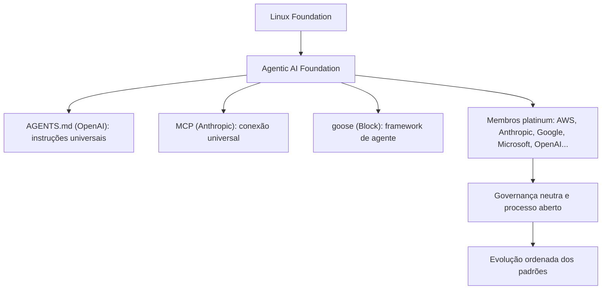

# Capítulo 6 — A governança da Agentic AI Foundation

## 1. Introdução

O Capítulo 5 apresentou o AGENTS.md como o padrão neutro entre ferramentas [3]. Este capítulo sobe à camada institucional: a governança do padrão pela Agentic AI Foundation (AAIF) [4][5]. A tese é direta: um padrão aberto sem governança é um padrão frágil — e a AAIF, anunciada pela Linux Foundation em 9 de dezembro de 2025, é a casa neutra que garante a evolução do AGENTS.md, do MCP e do goose [4][5][17]. A governança da AAIF tem implicações profundas para o engenheiro de memória [4]: o padrão que ele adota tem dono, processo e neutralidade garantidos [4][17]. A fundação reúne AWS, Anthropic, Bloomberg, Cloudflare, Google, Microsoft e OpenAI como membros platinum [4]. O engenheiro que entende a governança adota o padrão com confiança e participa da sua evolução [4][17].

## 2. Explica

### 2.1 O Que é a Agentic AI Foundation

A Agentic AI Foundation (AAIF) é a organização neutra que hospeda a infraestrutura agêntica fundamental [4][5]. A AAIF foi anunciada pela Linux Foundation em 9 de dezembro de 2025 [4]. A missão é prover uma casa aberta e neutra para padrões e projetos agênticos [4][17]. As contribuições fundacionais são três [4][5]: o AGENTS.md da OpenAI (instruções universais de agentes) [3][4]; o MCP da Anthropic (padrão universal de conexão de ferramentas/dados) [4][15]; e o goose da Block (framework de agente local-first open source) [4]. A AAIF é a resposta à necessidade de governança neutra [4][17].

### 2.2 A Necessidade de Governança Neutra

A governança neutra resolve um problema estrutural [4][17]. Padrões controlados por uma única empresa geram desconfiança [4]. Padrões sem dono estagnam [4]. A governança neutra equilibra [4][17]. Primeiro, a **neutralidade**: nenhum membro domina o padrão [4]. Segundo, o **processo**: a evolução segue processo aberto [4][17]. Terceiro, a **continuidade**: o padrão sobrevive a mudanças de mercado [4]. A AAIF materializa a governança neutra [4][17]. O engenheiro que adota um padrão governado adota com confiança [4].

### 2.3 A Estrutura de Membros

A AAIF tem uma estrutura de membros em camadas [4]. Os membros platinum incluem AWS, Anthropic, Bloomberg, Cloudflare, Google, Microsoft e OpenAI [4]. Os membros gold e silver completam o ecossistema empresarial [4]. A estrutura tem implicações [4]. Primeiro, a **representatividade**: os principais atores do mercado participam [4]. Segundo, a **neutralidade**: a diversidade impede o domínio [4]. Terceiro, a **sustentabilidade**: o financiamento dos membros sustenta a fundação [4][17]. A estrutura de membros é a base da governança [4].

### 2.4 As Contribuições Fundacionais

As contribuições fundacionais definem o escopo da AAIF [4][5]. O AGENTS.md é a primeira contribuição — as instruções universais de agentes [3][4]. O MCP é a segunda — o padrão de conexão [4][15]. O goose é a terceira — o framework de agente [4]. As três contribuições formam a base da infraestrutura agêntica [4][5]. O engenheiro que trabalha com qualquer uma delas opera dentro do ecossistema governado [4].

### 2.5 A Governança do AGENTS.md

O AGENTS.md é governado pela AAIF [4][5]. A governança define a evolução do padrão [4][17]. A evolução segue processo aberto [4]. As mudanças passam por revisão da comunidade [4][17]. A compatibilidade é preservada [3][4]. O engenheiro que contribui com o AGENTS.md participa da governança [4][17]. A governança do padrão é o tema do Capítulo 5 levado à escala institucional [3][4].

### 2.6 A Relação com o MCP

O MCP — o padrão do Livro 4 — também é governado pela AAIF [4][15]. A relação entre AGENTS.md e MCP é complementar [4][16]. O AGENTS.md define as instruções [3]. O MCP define a conexão [15][16]. Os dois padrões formam a base da infraestrutura agêntica [4]. O engenheiro que domina os dois (Livros 4 e 5) opera o núcleo do ecossistema governado [4][15].

### 2.7 A Implicação para o Engenheiro de Memória

A AAIF tem implicações para o engenheiro de memória [4][17]. Primeiro, a **confiança**: o padrão adotado tem governança [4]. Segundo, a **estabilidade**: a evolução é ordenada [4]. Terceiro, a **participação**: o engenheiro pode influenciar o padrão [4][17]. O engenheiro que entende a governança adota o padrão como investimento de longo prazo [4][17].

### 2.8 A Governança e a Padronização do Mercado

A AAIF acelera a padronização do mercado [4][17]. O AGENTS.md vira o padrão de fato [4]. O MCP consolida a conexão [4][15]. A padronização reduz a fragmentação [4]. O mercado converge [4]. O engenheiro que adota cedo colhe os benefícios da padronização [4].

## 3. Ilustra

### 3.1 A Analogia do Tratado Internacional

A analogia do tratado internacional ilumina a AAIF [4]. Um tratado define regras que muitos países assinam [4]. O tratado tem processo, ratificação e revisão [4]. A AAIF é o tratado da infraestrutura agêntica [4]. A analogia funciona em profundidade [4]: o tratado não elimina os países — coordena as regras [4]; o tratado sobrevive à troca de governos — a governança continua [4]. O AGENTS.md é uma cláusula do tratado [4]. O engenheiro que opera sob o tratado opera com regras estáveis [4].

### 3.2 O Diagrama da Estrutura da AAIF

O diagrama abaixo representa a estrutura da AAIF [4][5].



O diagrama mostra a estrutura [4][5]. A Linux Foundation hospeda a AAIF [4]. A AAIF governa as três contribuições [4][5]. Os membros platinum sustentam [4]. A governança neutra orienta a evolução [4][17]. A estrutura é a base da confiança [4].

### 3.3 O Antes e o Depois na Prática

A comparação concreta ajuda a fixar o conceito [4]. **Antes (padrões sem governança)**: cada padrão vive sob um fornecedor — o futuro é incerto [4]. **Depois (padrões governados)**: a AAIF garante a evolução ordenada [4]. A diferença não está na tecnologia — está na confiança [4].

## 4. Técnica

### 4.1 Modelando a Governança de Padrões

O primeiro instrumento é o modelo da governança [4][17]. O código abaixo demonstra o processo de evolução do padrão [4][17]:

```python
from dataclasses import dataclass, field
from datetime import datetime


@dataclass
class PropostaPadrao:
    titulo: str
    autor: str
    mudanca: str
    status: str = "proposta"
    revisoes: int = 0


@dataclass
class GovernancaPadrao:
    """Modela o processo aberto de evolução do padrão."""
    nome: str
    propostas: list = field(default_factory=list)

    def submeter(self, proposta: PropostaPadrao):
        self.propostas.append(proposta)

    def revisar(self, titulo: str, feedback: str):
        for p in self.propostas:
            if p.titulo == titulo:
                p.revisoes += 1
                p.mudanca += f"\n  revisão: {feedback}"

    def aprovar(self, titulo: str):
        for p in self.propostas:
            if p.titulo == titulo and p.revisoes >= 2:
                p.status = "aprovada"
                return {"aprovada": True, "titulo": titulo}
        return {"aprovada": False, "motivo": "revisões insuficientes"}

    def resumo(self):
        return [(p.titulo, p.status, p.revisoes) for p in self.propostas]


if __name__ == "__main__":
    gov = GovernancaPadrao("AGENTS.md")
    gov.submeter(PropostaPadrao("Tiers de permissão", "comunidade",
                                "Definir ✅ Always, ⚠️ Ask First, 🚫 Never"))
    gov.revisar("Tiers de permissão", "expandir exemplos")
    gov.revisar("Tiers de permissão", "definir precedência")
    print(gov.aprovar("Tiers de permissão"))
    print(gov.resumo())
```

O modelo demonstra o processo aberto [4][17]. A proposta passa por revisões [4]. A aprovação exige revisões suficientes [4]. O processo é transparente [4][17]. O modelo é a base da participação [4].

### 4.2 O Avaliador de Neutralidade

O segundo instrumento é o avaliador de neutralidade [4]. O código abaixo verifica a neutralidade de um padrão [4]:

```python
def avaliar_neutralidade(padrao: dict) -> dict:
    """Avalia a neutralidade de um padrão governado."""
    criterios = {
        "casa_neutra": padrao.get("casa") in ("linux_foundation", "aaif", "iso"),
        "membros_diversos": padrao.get("membros", 0) >= 5,
        "processo_aberto": padrao.get("processo_aberto", False),
        "documentacao_publica": padrao.get("documentacao_publica", False),
        "sem_dono_unico": not padrao.get("dono_unico", True),
    }
    aprovados = sum(criterios.values())
    return {
        "criterios": criterios,
        "aprovados": aprovados,
        "nivel": "neutro" if aprovados >= 4 else "parcial",
        "recomendacao": "adotar" if aprovados >= 4 else "avaliar",
    }


if __name__ == "__main__":
    print(avaliar_neutralidade({
        "casa": "aaif", "membros": 8, "processo_aberto": True,
        "documentacao_publica": True, "dono_unico": False,
    }))
```

O avaliador demonstra a avaliação da neutralidade [4]. Os critérios são explícitos [4]. A recomendação orienta a adoção [4]. O engenheiro avalia antes de adotar [4][17].

### 4.3 O Diagrama da Participação

O terceiro instrumento concretiza a participação [4][17]. O código abaixo modela os caminhos de participação [4][17]:

```python
def caminhos_participacao(membro: str) -> list:
    """Lista os caminhos de participação na governança do padrão."""
    caminhos = []
    if membro.lower() in ("membro", "contribuidor"):
        caminhos.append("submeter propostas de evolução")
    caminhos.append("revisar propostas da comunidade")
    caminhos.append("reportar problemas de compatibilidade")
    caminhos.append("implementar o padrão em ferramentas")
    caminhos.append("participar dos fóruns de discussão")
    return caminhos


if __name__ == "__main__":
    print(caminhos_participacao("contribuidor"))
```

O código demonstra os caminhos de participação [4][17]. O engenheiro pode contribuir em vários níveis [4]. A participação influencia a evolução [4][17]. O engajamento é a forma de moldar o padrão [4].

## 5. Aplica

### 5.1 Onde Isso Vive no Mundo Real

A governança da AAIF está em todo padrão agêntico em 2026 [4][5]. O AGENTS.md evolui sob a fundação [4]. O MCP consolida a conexão [4][15]. O goose amadurece como framework [4]. Os membros platinum implementam os padrões [4]. O engenheiro que adota os padrões governados opera com confiança [4][17].

### 5.2 O Erro Comum do Iniciante

O erro mais comum de quem começa é ignorar a governança [4]. O iniciante adota um padrão sem saber quem o governa [4]. Quando o padrão muda de direção, ele é pego de surpresa [4]. Outro erro clássico: confiar em padrões proprietários sem questionar [4]. A lição é a mesma dos capítulos anteriores: a governança decide o futuro do padrão [4][17].

### 5.3 O Padrão Profissional em 2026

O padrão profissional em 2026 adota padrões governados [4][17]. A neutralidade é avaliada [4]. O processo é entendido [4]. A participação é considerada [4]. O engenheiro que adota com critério opera com confiança [4][17].

### 5.4 Como Este Livro é Organizado

Este capítulo estabeleceu a governança; os próximos constroem a estrutura [4]. O Capítulo 7 cobre as regras condicionais do Cursor [8]. Os Capítulos 8 e 9 cobrem hierarquia e drift [3][6]. O Capítulo 10 sintetiza a disciplina [1][3].

### 5.5 A Governança e a Adoção na Organização

O leitor que adota padrões governados na organização constrói confiança [4][17]. A decisão de adoção considera a governança [4]. O processo de atualização segue o padrão [4]. A organização participa quando possível [4]. O engenheiro que lidera a adoção governada constrói infraestrutura estável [4][17].

### 5.6 A Governança e a Segurança

A governança da AAIF tem dimensão de segurança [4][17]. O processo aberto permite auditoria [4]. A comunidade revisa as mudanças [4]. A transparência reduz riscos [4][17]. O engenheiro que adota padrões governados herda o processo de segurança [4].

### 5.7 O Custo da Governança

A governança tem custo e benefício [4]. O benefício: a evolução ordenada [4]. O custo: o processo é mais lento que a decisão unilateral [4]. O trade-off favorece a governança para padrões de base [4][17]. O engenheiro que entende a economia adota com paciência [4].

### 5.8 O Roteiro de Avaliação de Padrões

A avaliação de padrões é um processo em fases [4][17]. A primeira fase é a **identificação**: o padrão candidato [4]. A segunda é a **avaliação**: a neutralidade e a governança [4]. A terceira é a **decisão**: adotar ou não [4]. A quarta é a **implementação**: integrar o padrão [3][9]. A quinta é a **participação**: acompanhar e contribuir [4][17]. Cada fase tem entregável e critério de aceite [4].

### 5.9 A Governança e a Revisão Autônoma

A revisão autônoma opera sob padrões governados [4][13]. O revisor usa o AGENTS.md governado [4]. O MCP conecta a revisão [4][15]. A governança garante a estabilidade [4]. O engenheiro que constrói a revisão sobre padrões governados constrói confiança [4][13].

### 5.10 A Governança e a Estratégia Organizacional

A governança de padrões é estratégia [4][17]. A organização que adota padrões governados reduz o risco de lock-in [4]. A organização que participa influencia a evolução [4][17]. O engenheiro que conecta a estratégia à governança constrói vantagem [4].

### 5.11 O Caso do Padrão Sem Dono

Para fechar com uma aplicação concreta, este estudo de caso mostra o padrão sem dono [4]. O cenário: uma equipe adota um formato de instrução criado por um projeto que parou [4]. O primeiro sintoma: o formato não evolui — bugs e lacunas permanecem [4]. O segundo sintoma: as ferramentas abandonam o suporte [4]. O terceiro sintoma: a equipe precisa migrar para outro formato — retrabalho total [4].

O diagnóstico correto: o padrão sem governança estagnou [4]. O tratamento: adotar o AGENTS.md governado pela AAIF e migrar [4][17]. A lição do caso é a cascata: a falta de dono criou estagnação; a estagnação causou abandono; o abandono ampliou o custo de migração [4]. O caso demonstra o tema do capítulo: a governança decide a sobrevivência do padrão [4].

### 5.12 A Governança e a Interface com os Modelos

A governança interage com a diversidade de modelos [4][3]. O padrão governado é neutro entre modelos [3][4]. O primeiro princípio é a **neutralidade**: nenhum fornecedor domina [4]. O segundo é a **compatibilidade**: a evolução preserva a compatibilidade [3][4]. O terceiro é a **observabilidade**: o processo é público [4][17].

### 5.13 O Manual do Diagnóstico Rápido da Governança

O capítulo fecha com o manual do diagnóstico rápido [4]. O primeiro item é a **casa**: o padrão tem casa neutra? [4]. O segundo é a **governança**: o processo é aberto? [4][17]. O terceiro é a **neutralidade**: nenhum membro domina? [4]. O quarto é a **evolução**: o padrão evolui de forma ordenada? [4].

O quinto item é a **compatibilidade**: a evolução preserva a compatibilidade? [3][4]. O sexto é a **participação**: a organização pode contribuir? [4][17]. O sétimo é a **sustentabilidade**: o financiamento é estável? [4]. O manual é o resumo operacional da governança [4].

### 5.14 A Governança e os Limites Éticos

A governança cria responsabilidades [4]. O primeiro limite é o da **transparência**: o processo é público [4]. O segundo é o da **representatividade**: a diversidade é garantida [4]. O terceiro é o da **responsabilidade**: os membros respondem pelas decisões [4]. A ética da governança é uma dimensão de cada decisão deste livro [4].

### 5.15 O Futuro da Governança

A governança da AAIF evolui [4][17]. As tendências apontam a expansão [4]. Novas contribuições entram na fundação [4]. O escopo da infraestrutura agêntica cresce [4]. O engenheiro que domina os fundamentos não será surpreendido pelas tendências [4][17].

### 5.16 O Fechamento do Capítulo

O capítulo se encerra com a consolidação da governança [4]. A AAIF é a casa neutra dos padrões agênticos [4][5]. A estrutura de membros garante a neutralidade [4]. As contribuições fundacionais definem o escopo [4][5]. O AGENTS.md evolui sob governança [4]. O próximo capítulo desce à prática das regras condicionais [8].

### 5.17 A Governança e a Segurança do Ecossistema

A Agentic AI Foundation governa o padrão neutro — e a governança tem uma dimensão de segurança que o engenheiro precisa incorporar [4][5][17]. O ecossistema de agentes é um novo vetor de ataque: instruções maliciosas podem ser injetadas via arquivos de regras, repositórios comprometidos ou conteúdo remoto [1][17].

As ameaças documentadas pela prática [1][17]: **prompt injection via repositório** (um arquivo de instrução adicionado por um PR malicioso sequestra o agente); **conteúdo remoto malicioso** (o agente lê instruções de uma URL ou pacote comprometido); e **exfiltração via ferramentas** (o agente, seguindo instruções, envia dados para um destino não autorizado — o mesmo vetor do Capítulo 9 do Livro 4) [1][15][16][17].

Os controles recomendados [1][17]: **revisão de instruções como código** (todo PR que toca `AGENTS.md`, `CLAUDE.md` ou regras passa por review humano); **assinatura/rastreabilidade** (as instruções têm histórico e autoria); **mínimo privilégio** (as ferramentas conectadas ao agente têm o menor escopo possível — o princípio do Livro 4 aplicado à memória); e **monitoramento** (o comportamento do agente é observável e auditável) [1][15][16][17].

A lição do capítulo: a governança do ecossistema não é burocracia — é **segurança operacional** [1][17]. O padrão neutro que qualquer ferramenta lê é também o alvo que qualquer atacante mira [1][17].

### 5.18 O Futuro da Governança: Padrões e Certificação

A governança do ecossistema de agentes está em evolução acelerada — e as tendências visíveis em 2026 definem o cenário profissional [4][5][17]. A primeira tendência é a **consolidação do padrão**: o `AGENTS.md` caminha para o status de padrão universal de instruções, com a Linux Foundation/AAIF como guardiã [4][5][17]. A segunda é a **certificação de conformidade**: organizações passam a auditar seus repositórios contra o padrão — o `AGENTS.md` correto, a cascata correta, as regras corretas [4][17]. A terceira é a **instrumentação de segurança**: ferramentas de varredura de instruções (que detectam prompt injection em arquivos de regras) tornam-se parte do pipeline de CI [1][17].

Para o engenheiro, as tendências significam duas coisas [1][4][17]: **o conhecimento deste livro se valoriza** — a capacidade de projetar, governar e auditar a memória de projeto é rara e crescente; e **a conformidade se automatiza** — o que hoje é revisão manual será verificação automática no pipeline [1][4][17].

A lição final: a governança do ecossistema é a fronteira onde a engenharia de instruções encontra a engenharia de segurança — e o engenheiro que domina as duas está à frente do mercado [1][4][17].

### 5.19 A Governança e o Ciclo de Vida do Padrão

A governança do `AGENTS.md` pela Agentic AI Foundation inclui o **ciclo de vida do padrão** — e o engenheiro precisa entender como o padrão evolui [4][5][17]. O ciclo típico [4][5]: a proposta (novas capacidades discutidas em aberto); a revisão (comunidade e membros fundadores avaliam); a versão estável (publicada e recomendada); e o legado (versões antigas suportadas por compatibilidade) [4][5].

A implicação prática [4][5][17]: o `AGENTS.md` que a equipe escreve hoje deve seguir a versão estável atual e ser **compatível para frente** — evitar recursos experimentais que podem mudar e estruturar o documento para que novas seções sejam aditivas, não destrutivas [4][5][17].

A lição do capítulo: o padrão neutro é um alvo móvel, e a governança é o que mantém o movimento ordenado [4][5][17]. O engenheiro que acompanha o ciclo de vida protege a memória de projeto contra a obsolescência [4][5][17].

### 5.20 A Governança na Prática: o Comitê de Instruções

A governança não é só da fundação — é também **local**, e a prática consolidada recomenda um órgão mínimo: o comitê de instruções [1][17]. O comitê não precisa ser formal — pode ser uma reunião mensal de trinta minutos com três responsabilidades [1][17]:

1. **Revisar as mudanças de contrato**: os PRs que tocam `AGENTS.md`, `CLAUDE.md` e regras passam por leitura coletiva [1][17].
2. **Decidir os conflitos**: quando dois territórios disputam uma regra comum, o comitê arbitra [1][17].
3. **Medir a saúde**: o painel de drift e as métricas do Capítulo 9 são lidos e ações são decididas [1][7][17].

A lição final: a governança da memória de projeto é uma função **distribuída** — a fundação define o padrão global, e o comitê local garante a verdade local [1][4][17]. O engenheiro que participa do comitê vê a disciplina por dentro: decisões, trade-offs e o custo real de cada regra [1][17].

### 5.21 A Governança e a Compatibilidade entre Versões

A governança do ecossistema inclui a **compatibilidade entre versões** do padrão [4][5]. Quando o `AGENTS.md` evolui (Capítulo 6, Seção 5.19), os repositórios existentes precisam migrar sem quebrar [4][5]. A prática consolidada [4][5]: o padrão define janelas de compatibilidade (a versão antiga continua válida por um período); a migração é **aditiva** (novas seções não invalidam as antigas); e as ferramentas sinalizam a versão suportada [4][5].

O engenheiro de memória acompanha a compatibilidade [4][5]: ao adotar uma versão nova, verifica se as seções usadas permanecem válidas; ao escrever novas seções, evita recursos que possam mudar na próxima versão [4][5].

A lição do capítulo: a compatibilidade entre versões é o que permite ao padrão evoluir sem fragmentar o ecossistema [4][5]. O engenheiro que migra com disciplina protege a memória de projeto da obsolescência (Capítulo 9) [4][5][7].

### 5.22 A Governança e a Diversidade de Ferramentas

A Agentic AI Foundation governa um ecossistema com **diversidade de ferramentas** — e a governança precisa acomodar a diversidade sem fragmentar o padrão [4][5][17]. O desafio: cada ferramenta (Claude Code, Cursor, Codex, Copilot) interpreta o `AGENTS.md` com suas próprias extensões [1][3][9][10][11] — e a governança define o núcleo comum que todas obedecem [4][5].

A arquitetura resultante [4][5][9]: o **núcleo do padrão** (o que toda ferramenta lê — seções, formato, cascata) é governado pela fundação; as **extensões** (recursos específicos de cada ferramenta) vivem fora do núcleo e não comprometem a portabilidade [1][4][5][9].

A lição do capítulo: a governança do padrão é o que mantém o equilíbrio entre padronização (portabilidade) e inovação (recursos específicos) [4][5][17]. O engenheiro que entende o equilíbrio escreve memória que viaja [4][5][9].

### 5.23 A Governança e a Certificação de Conformidade

A evolução da governança aponta para a **certificação de conformidade** [4][17]. A tendência observada em 2026 [4][17]: organizações auditam seus repositórios contra o padrão — o `AGENTS.md` correto, a cascata correta, as regras corretas — e as ferramentas oferecem verificadores de conformidade [4][17].

Para o engenheiro, a certificação significa [4][17]: a conformidade se torna um requisito de qualidade mensurável (como lint e testes); o pipeline anti-drift (Capítulo 9) é a base da certificação; e o conhecimento deste livro — design, cascata, governança — é o que a certificação avalia [4][17].

A lição final: a governança do ecossistema está caminhando de convenção para **norma auditável** [4][17]. O engenheiro que domina a disciplina está pronto para o padrão que o mercado está formalizando [4][17].

### 5.24 A Governança e a Participação da Comunidade

A governança da Agentic AI Foundation não é fechada — é **comunitária** [4][5]. A prática [4][5]: as propostas de mudança do padrão são públicas; a comunidade (ferramentas, organizações, engenheiros) comenta; e as decisões são documentadas com fundamentação [4][5].

O valor da governança aberta [4][5]: o padrão reflete as necessidades reais do ecossistema (não apenas de um fornecedor); a compatibilidade entre ferramentas é negociada em aberto; e o engenheiro pode participar — contribuir com propostas, relatar lacunas, revisar mudanças [4][5].

A lição do capítulo: a governança do padrão é um espaço de participação — e o engenheiro de memória maduro participa [4][5]. Contribuir com o padrão é a forma mais alta de dominar a disciplina (Capítulo 10, Seção 10.16) [4][5][17].

### 5.25 A Governança e a Neutralidade entre Fornecedores

Um princípio central da governança é a **neutralidade entre fornecedores** [4][5]. O padrão neutro não pode favorecer uma ferramenta — senão deixa de ser neutro [4][5]. A governança aplica a neutralidade na prática [4][5]: as decisões do padrão são tomadas por consenso entre os membros (Anthropic, OpenAI, Google, Cursor, Codex e demais); e os recursos específicos de uma ferramenta não entram no núcleo do padrão [4][5][9].

A implicação para o engenheiro [4][5]: a memória escrita no núcleo do padrão é **patrimônio neutro** — vale para qualquer ferramenta, hoje e amanhã [4][5][9]. A neutralidade é o que protege o investimento em memória de projeto da obsolescência por mudança de ferramenta [4][5][9].

A lição do capítulo: a neutralidade entre fornecedores é o que dá ao `AGENTS.md` a durabilidade que o `CLAUDE.md` não tem sozinho [4][5][9]. O engenheiro que escreve no núcleo neutro investe em memória que viaja [4][5][9].

### 5.26 A Governança e a Documentação Pública

A governança do ecossistema produz **documentação pública** — e o engenheiro a usa como recurso de aprendizado [4][5][7]. A prática [4][5]: a especificação do padrão é pública; os guias de implementação são públicos; e os casos de adoção são públicos [4][5][7].

O valor para o engenheiro [4][5][7]: a documentação pública é a fonte primária de verdade (o dossiê deste livro baseia-se nela); a comparação entre implementações (como cada ferramenta interpreta o padrão) revela as decisões de design; e a evolução da documentação acompanha a evolução do padrão (Capítulo 6, Seção 5.19) [4][5][7].

A lição final do capítulo: a governança pública transforma o aprendizado da disciplina em algo contínuo — o engenheiro acompanha a documentação como acompanha as releases de uma biblioteca [4][5][7].

### 5.27 A Governança e a Gestão de Mudanças

A governança do padrão exige **gestão de mudanças** — o processo de como o padrão muda sem quebrar o ecossistema [4][5]: a proposta (documentada e motivada); a consulta (comunidade e fornecedores avaliam o impacto); a decisão (consenso ou maioria qualificada); a publicação (com data e versão); e o período de transição (as ferramentas e os repositórios migram) [4][5].

O valor do processo [4][5]: mudanças do padrão não surpreendem — a comunidade sabe o que vem e quando; e o ecossistema migra coordenado — sem repositórios quebrados por mudança súbita [4][5].

A lição do capítulo: a governança é, na essência, **gestão de mudanças em escala** [4][5]. O engenheiro que entende o processo prevê o impacto das mudanças na própria memória [4][5].

### 5.28 A Governança e a Relação com a Padronização Industrial

A governança da Agentic AI Foundation insere-se na história mais ampla da **padronização industrial** [4][17]: como HTML, HTTP e TCP/IP, o padrão de instruções só se torna universal quando uma governança neutra o sustenta [4][17]. A comparação histórica ilumina [4][17]: o padrão aberto cresce quando o custo de adotá-lo é menor que o custo de fragmentação; e a governança neutra é o que mantém o custo de adoção baixo [4][17].

A lição do capítulo: o `AGENTS.md` caminha para o status de infraestrutura crítica do desenvolvimento — e a governança é a sua sustentação [4][17]. O engenheiro que participa da padronização participa da história da indústria [4][17].

### 5.29 A Governança e o Equilíbrio com a Inovação

O desafio permanente da governança é o **equilíbrio com a inovação** [4][5]: padrão demais, engessa (a inovação não encontra espaço); inovação demais, fragmenta (o padrão perde o sentido) [4][5]. A governança madura mantém o equilíbrio com regras claras [4][5]: o núcleo muda devagar e com consenso; as extensões mudam rápido e livremente; e a ponte entre núcleo e extensões é revista periodicamente (o que era extensão pode ser promovida ao núcleo) [4][5].

A lição final do capítulo: a governança do ecossistema é um **equilíbrio dinâmico** — e o engenheiro de memória projeta o próprio contrato com o mesmo princípio: núcleo estável, extensões flexíveis, promoção periódica (Capítulo 4, Seção 5.26) [4][5].

### 5.30 A Governança e a Transparência das Decisões

A governança do padrão é **transparente** — e a transparência é um valor operacional [4][5]: as decisões do padrão são publicadas com a fundamentação; as atas das reuniões de governança são públicas; e as divergências entre membros são documentadas [4][5].

O valor da transparência [4][5]: a comunidade confia no processo (mesmo discordando de uma decisão, conhece o porquê); e o ecossistema planeja com base em informação real (as direções futuras são visíveis) [4][5].

A lição do capítulo: a transparência é a moeda da confiança na governança [4][5]. O padrão governado em aberto é adotado em aberto [4][5].

### 5.31 A Governança e o Legado para a Indústria

A governança da Agentic AI Foundation constrói um **legado para a indústria** [4][17]: o padrão de instruções, sustentado por governança neutra, tem o potencial de ser tão ubíquo quanto os protocolos que definiram a web [4][17]. O legado é o contexto histórico do engenheiro de memória [4][17]: participar da construção de um padrão que pode durar décadas [4][17].

A lição do capítulo: a governança do ecossistema é a infraestrutura de longo prazo da engenharia de instruções [4][17]. O engenheiro que domina a disciplina hoje constrói sobre — e contribui para — a infraestrutura de amanhã [4][17].

### 5.32 A Governança e a Relação com a Adoção

A governança da Agentic AI Foundation influencia a **adoção do padrão** [4][5]: a governança neutra reduz o risco de adoção (a organização não fica refém de um fornecedor); a transparência (Capítulo 6, Seção 5.30) reduz a incerteza; e a compatibilidade (Capítulo 6, Seção 5.21) reduz o custo de migração [4][5].

A lição do capítulo: a governança é a máquina de adoção do padrão [4][5]. O engenheiro que entende a máquina prevê a evolução do ecossistema e posiciona a memória do projeto à frente [4][5].

### 5.33 A Governança e a Síntese do Capítulo

O capítulo da governança se fecha com a síntese [4][5][17]: a Agentic AI Foundation governa o padrão neutro com transparência, neutralidade e gestão de mudanças; a governança é o que sustenta a portabilidade do Capítulo 5; e a participação comunitária é o caminho da maturidade [4][5][17]. A governança transforma o padrão de moda em infraestrutura [4][5][17].

A lição do capítulo: a governança do ecossistema é o contexto de longo prazo de toda a memória de projeto [4][5][17].

### 5.34 A Governança e o Fechamento

O capítulo da governança se encerra com a perspectiva [4][5][17]: o leitor que acompanha a Agentic AI Foundation (Seções 5.19, 5.30) vê o padrão evoluir com antecedência e posiciona a memória do projeto à frente [4][5][17]. A governança é o radar do ecossistema [4][5][17].

### 5.35 A Governança e a Confiança

A governança do ecossistema constrói **confiança coletiva** [4][5]: a neutralidade (Seção 5.25) e a transparência (Seção 5.30) são o que fazem organizações adotarem o padrão [4][5]. A confiança no padrão é a base da confiança na memória que o usa [4][5].

### 5.36 A Governança e a Participação

A governança do ecossistema é participativa (Capítulo 6, Seção 5.24): o engenheiro que contribui com o padrão aprende e influencia [4][5]. A participação é o nível mais alto da disciplina [4][5].

### 5.37 O Fechamento da Governança

A governança do ecossistema está mapeada (Capítulo 6, Seção 5.33): neutralidade, transparência e gestão de mudanças [4][5][17]. O próximo passo são as regras condicionais — a legislação local [4][5][6][17].

### 5.38 A Síntese da Governança

A governança do ecossistema é a infraestrutura de longo prazo do padrão neutro [4][5][17]. O capítulo entregou o mapa; a participação comunitária é o caminho [4][5][17].

### 5.39 O Encerramento

O capítulo da governança encerra com a fundação do padrão garantida [4][5][17]: neutralidade, transparência e participação [4][5][17]. A infraestrutura está firme [4][5][17].

### 5.40 A Ponte

A governança é a ponte entre o padrão e a sua durabilidade [4][5][17]. O capítulo 6 a construiu; a comunidade a atravessa [4][5][17].

## 6. Conclusão

A governança da AAIF garante a evolução ordenada dos padrões agênticos [4]. Este capítulo estabeleceu a estrutura: a fundação hospedada pela Linux Foundation, os membros platinum, as contribuições fundacionais — AGENTS.md, MCP e goose — e o processo aberto de evolução [4][5]. A governança decide a sobrevivência do padrão [4][17]. O engenheiro que adota padrões governados opera com confiança [4]. O próximo capítulo desce à prática das regras condicionais no ecossistema Cursor [8].

## 7. Referências

[1] ANTHROPIC. Memory: how Claude remembers your project. Claude Code Documentation, 2025–2026. Disponível em: https://docs.anthropic.com/en/docs/claude-code/memory. Acesso em: 5 ago. 2026.
[2] ANTHROPIC. Overview: Claude Code. Claude Code Documentation, 2025–2026. Disponível em: https://docs.anthropic.com/en/docs/claude-code/overview. Acesso em: 5 ago. 2026.
[3] AGENTS.MD. AGENTS.md: the standard for AI agent instructions. Agentic AI Foundation / OpenAI, ago. 2025. Disponível em: https://agents.md/. Acesso em: 5 ago. 2026.
[4] LINUX FOUNDATION. Linux Foundation announces the formation of the Agentic AI Foundation. Linux Foundation Press Release, 9 dez. 2025. Disponível em: https://www.linuxfoundation.org/press/linux-foundation-announces-the-formation-of-the-agentic-ai-foundation. Acesso em: 5 ago. 2026.
[5] AGENTIC AI FOUNDATION. Agentic AI Foundation official portal. AAIF, 2025–2026. Disponível em: https://aaif.io/. Acesso em: 5 ago. 2026.
[6] OSMANI, Addy. 15 AGENTS.md — engineering guide to AGENTS.md. Addy Osmani, 2025–2026. Disponível em: https://addyosmani.com/agents/15-agents-md/. Acesso em: 5 ago. 2026.
[7] AUGMENT CODE. How to build AGENTS.md: construction guide. Augment Code Guides, 2025–2026. Disponível em: https://www.augmentcode.com/guides/how-to-build-agents-md. Acesso em: 5 ago. 2026.
[8] CURSOR. Rules: Cursor Documentation. Cursor / Anysphere, 2025–2026. Disponível em: https://cursor.com/docs/rules. Acesso em: 5 ago. 2026.
[9] AGYN. AGENTS.md vs CLAUDE.md: does Claude Code or Codex read both?. Agyn Blog, jun. 2026. Disponível em: https://agyn.io/blog/claude-md-agents-md-compatibility. Acesso em: 5 ago. 2026.
[10] OPENAI. Codex: AGENTS.md and coding agents. OpenAI Documentation, 2025–2026. Disponível em: https://openai.com/index/introducing-codex/. Acesso em: 5 ago. 2026.
[11] GITHUB. GitHub Copilot: repository instructions and AGENTS.md support. GitHub Documentation, 2025–2026. Disponível em: https://docs.github.com/en/copilot/customizing-copilot/adding-repository-custom-instructions. Acesso em: 5 ago. 2026.
[12] GITHUB. GitHub Copilot Coding Agent: reading repository instructions. GitHub Changelog, 2025–2026. Disponível em: https://github.blog/. Acesso em: 5 ago. 2026.
[13] ANTHROPIC. Writing tools for AI agents — using AI agents. Anthropic Engineering Blog, set. 2025. Disponível em: https://www.anthropic.com/engineering/writing-tools-for-agents. Acesso em: 5 ago. 2026.
[14] ANTHROPIC. Effective context engineering for AI agents. Anthropic Engineering Blog, set. 2025. Disponível em: https://www.anthropic.com/engineering/effective-context-engineering-for-ai-agents. Acesso em: 5 ago. 2026.
[15] ANTHROPIC. Introducing the Model Context Protocol. Anthropic News, 25 nov. 2024. Disponível em: https://www.anthropic.com/news/model-context-protocol. Acesso em: 5 ago. 2026.
[16] MODEL CONTEXT PROTOCOL. Architecture. MCP Specification 2025-11-25, 25 nov. 2025. Disponível em: https://modelcontextprotocol.io/specification/2025-11-25/architecture. Acesso em: 5 ago. 2026.
[17] LINUX FOUNDATION. Agentic AI Foundation: governance of foundational agentic infrastructure. Linux Foundation Blog, dez. 2025. Disponível em: https://www.linuxfoundation.org/blog/. Acesso em: 5 ago. 2026.
[18] CURSOR. Best practices for rules and context. Cursor Documentation, 2025–2026. Disponível em: https://cursor.com/docs/context/rules. Acesso em: 5 ago. 2026.
[19] AIDER. AGENTS.md support and multi-tool interoperability. Aider Documentation, 2025–2026. Disponível em: https://aider.chat/docs/repomap.html. Acesso em: 5 ago. 2026.
[20] ANTHROPIC. Claude Code best practices: memory and configuration. Anthropic Engineering Blog, 2025–2026. Disponível em: https://www.anthropic.com/engineering/claude-code-best-practices. Acesso em: 5 ago. 2026.
[21] CODEQL / GITHUB. Reproducible rules and configuration as code. GitHub Blog, 2025–2026. Disponível em: https://github.blog/. Acesso em: 5 ago. 2026.
[22] MODEL CONTEXT PROTOCOL. Registry Repository. GitHub Repository, 2025–2026. Disponível em: https://github.com/modelcontextprotocol/registry. Acesso em: 5 ago. 2026.
