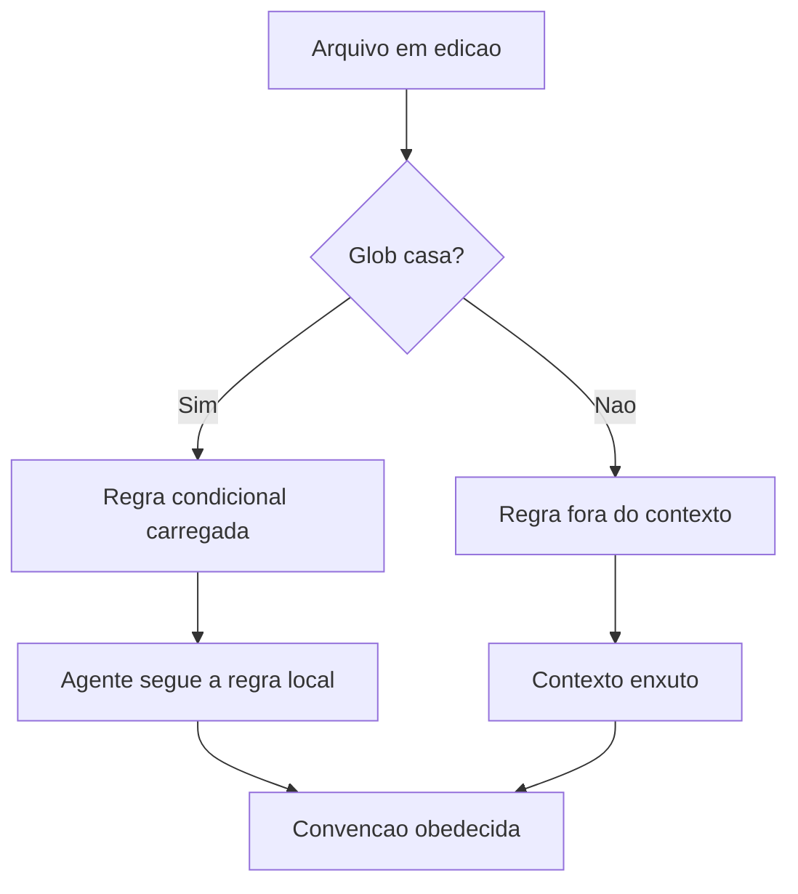

# 7. .cursorrules e .cursor/rules: regras condicionais escopadas por arquivo, diretório e linguagem

## 1. Introducao

> **Objetivo do capítulo**: dominar o sistema de regras do Cursor — o arquivo legado `.cursorrules` e o diretório moderno `.cursor/rules/` — mostrando como as regras condicionais, escopadas por glob de arquivo, diretório e linguagem, resolvem o problema que os arquivos monolíticos de instrução não resolvem: a aplicação cirúrgica de comportamento onde ele é necessário, e somente onde é necessário.

## 2. Explica

### 7.1 A terceira geração dos arquivos de regras

Os capítulos anteriores construíram uma linha evolutiva: o `CLAUDE.md` do Capítulo 2 materializou a memória do projeto; o `AGENTS.md` do Capítulo 5 neutralizou essa memória entre ferramentas. Este capítulo trata da **terceira geração**: os arquivos de regras condicionais, cujo representante mais difundido é o ecossistema do Cursor [1][6].

A terceira geração nasceu de uma limitação observável das duas primeiras. Um `CLAUDE.md` ou `AGENTS.md` aplica-se ao projeto inteiro, a todas as conversas, a todos os arquivos, sem distinção [1]. Para um projeto pequeno, isso é suficiente — e até desejável, porque a memória central deve ser estável. Mas o momento em que o projeto cresce, os problemas aparecem em cascata [6]:

- **O arquivo incha**: para cobrir as necessidades específicas de cada área, a equipe adiciona regras globais para casos de uso locais. O arquivo cresce até o ponto em que o modelo perde as regras importantes em meio às regras irrelevantes para a tarefa atual [1][6].
- **Regras conflitantes**: a regra de formatação da área de front-end entra em atrito com a regra da área de back-end, e ambas disputam espaço no mesmo documento [6].
- **O custo fixo é pago sempre**: cada chamada ao modelo paga o custo de tokens de todas as regras, mesmo quando apenas uma dúzia é relevante para o arquivo sendo editado [1][6].

A resposta da terceira geração é a **regra condicional**: uma regra que traz, embutida, a condição de quando deve ser aplicada. Em vez de "sempre siga estas regras", o novo paradigma é "siga estas regras **quando** a tarefa tocar estes arquivos" [6]. O Cursor foi o primeiro grande editor a popularizar esse padrão, e por isso é o objeto de estudo deste capítulo — mas o padrão em si, como o Capítulo 8 mostrará, espalhou-se para todas as ferramentas [1][6].

A metáfora que organiza o capítulo: se o `AGENTS.md` é a **constituição** do projeto (o documento supremo, estável, universal), as regras condicionais são a **legislação local** — as leis específicas de cada bairro, que valem apenas dentro de suas fronteiras. A constituição estabelece princípios; a legislação local traduz princípios em prática para cada contexto [6].

Para o leitor que vem do Livro 3 (engenharia de contexto), a conexão é imediata: regras condicionais são **engenharia de contexto aplicada a arquivos de instrução**. O framework *write / select / compress / isolate* [1] ganha, aqui, uma implementação concreta: em vez de o agente selecionar mentalmente as regras relevantes em um arquivo único, o próprio sistema de arquivos faz a seleção por ele, entregando ao contexto apenas o subconjunto aplicável [1][6].

### 7.2 A anatomia do .cursorrules: o arquivo legado

O `.cursorrules` é o arquivo de regras original do Cursor: um único arquivo Markdown na raiz do projeto, carregado em todas as conversas [6]. Sua sintaxe é deliberadamente simples — não há frontmatter, não há condições, não há globs: apenas Markdown livre que o Cursor injeta no contexto do modelo como instruções de sistema [6].

A simplicidade é a virtude e a limitação do formato. A virtude: qualquer pessoa da equipe pode escrever uma regra sem aprender sintaxe nova. A limitação: tudo é global, tudo é sempre aplicado, e o arquivo cresce sem estrutura de contenção [6].

Um `.cursorrules` típico, no formato que a documentação oficial recomenda, organiza o conteúdo por seções temáticas [6]:

```markdown
# Regras do projeto Acme

## Stack e convenções
- TypeScript estrito; sem `any` implícito.
- React 19 + Next.js 15; App Router.
- Testes com Vitest; TDD para lógica pura.

## Arquitetura
- Camadas: api / domain / infrastructure / presentation.
- Dependências apontam apenas para dentro: presentation → application → domain ← infrastructure.
- Proibido importar de 'api/' em 'presentation/'.

## Frontend
- Componentes em 'src/components/ui/' seguem shadcn/ui.
- Classes utilitárias via tailwind-merge; nunca concatenação de strings.

## Backend
- Tratamento de erros via Either (neverthrow); nunca exceções no domínio.
- Validação de entrada sempre em 'application/validators/'.

## Estilo de código
- Nomes de função em inglês; comentários e docs em português.
- Nenhuma função acima de 40 linhas; extrair para módulos.
```

Observem o que esse arquivo está fazendo: ele registra o **contrato comportamental** do projeto inteiro — stack, arquitetura, convenções por camada, estilo — em um único lugar que o agente lê no início de toda sessão [6]. É o equivalente em regras do que o `CLAUDE.md` faz em memória: criar um documento estável que o agente consulta antes de agir [1][6].

A documentação oficial do Cursor oferece orientação prática sobre o conteúdo [6]:

- **O que incluir**: convenções de código do projeto, stack e versões, padrões arquiteturais, comandos de build/teste/lint, preferências de estilo, armadilhas conhecidas da base de código.
- **O que evitar**: instruções que mudam toda semana (drift rápido), opiniões genéricas que valem para qualquer projeto (o agente já as conhece), credenciais e informações sensíveis, e regras que o time não segue na prática [6].

O `.cursorrules` cumpre seu papel em projetos pequenos e médios. Mas a história do formato é a história de um degrau evolutivo: quando o Cursor introduziu o diretório `.cursor/rules/`, em 2025, a recomendação oficial passou a ser migrar as regras para o novo formato — não por moda, mas porque o formato antigo não tinha como expressar a condicionalidade que o crescimento dos projetos exigia [6].

### 7.3 .cursor/rules: o diretório de regras condicionais

O `.cursor/rules/` é a segunda geração do sistema de regras do Cursor: um diretório de arquivos Markdown, cada um com um frontmatter YAML que declara **quando** a regra se aplica [6]. A mudança estrutural é profunda: a regra deixa de ser um texto global e passa a ser um **par (condição, ação)** — o mesmo formato que a engenharia de sistemas usa há décadas [6].

A estrutura de um arquivo de regra é [6]:

```markdown
---
description: Regras de componentes do design system
globs: src/components/ui/**/*.{ts,tsx}
alwaysApply: false
---

# Componentes UI

- Usar shadcn/ui como base; variantes via cva.
- Props de estilo aceitam className e são mescladas com tailwind-merge.
- Nenhum componente com lógica de estado global; usar hooks externos.
- Acessibilidade: aria-label obrigatório em botões de ícone.
```

O frontmatter é o coração do formato. Três campos controlam a aplicação [6]:

1. **`description`**: um resumo legível da regra, usado pelo Cursor para listar as regras disponíveis na interface e auxiliar o modelo a entender o propósito de cada arquivo.
2. **`globs`**: o campo que implementa a condicionalidade. Um ou mais padrões glob que definem quais arquivos acionam a regra. Quando o agente trabalha em um arquivo que casa com o glob, a regra é carregada; quando não casa, a regra fica de fora [6].
3. **`alwaysApply`**: o interruptor de escopo. `true` carrega a regra em todas as conversas, independentemente do glob (útil para regras transversais); `false` (padrão) restringe a aplicação ao escopo do glob [6].

A documentação oficial diferencia dois modos de anexação [6]:

- **Regras *always***: anexadas a todas as conversas, mesmo antes de o usuário escrever qualquer coisa. São o substituto natural do `.cursorrules` — regras que devem valer sempre [6].
- **Regras *auto-attached***: anexadas automaticamente quando o contexto da conversa corresponde ao glob. Um arquivo com `globs: "*.py"` é anexado quando o usuário abre ou menciona um arquivo Python [6].

O efeito combinado é a **seleção automática de contexto**: o modelo recebe apenas as regras relevantes para o arquivo em edição, e não o corpus inteiro de regras do projeto [6]. Isso reduz o custo de tokens por chamada, melhora a aderência (menos ruído = mais obediência) e elimina conflitos entre regras de áreas diferentes — porque elas raramente são carregadas juntas [6].

A hierarquia de precedência no Cursor, conforme a documentação, é [6]:

1. Regras de **usuário** (nível global, configuradas em Settings > Rules).
2. Regras do **projeto** (`.cursor/rules/` e `.cursorrules`).
3. **Diretivas do chat** (instruções dadas na conversa atual).

A precedência importa porque resolve conflitos: se uma regra global do usuário e uma regra do projeto disputam a mesma decisão, a regra do usuário vence — o que faz sentido, porque o usuário é a autoridade final sobre seu próprio ambiente [6]. As instruções do chat, por sua vez, vencem todas as regras, porque são a intenção mais recente e mais específica [6].

### 7.4 Escrevendo globs que funcionam

O campo `globs` é onde a engenharia de regras encontra a engenharia de arquivos. Um glob mal escrito produz dois desastres simétricos: **subaplicação** (a regra não dispara onde deveria, porque o padrão é restrito demais) e **sobreaplicação** (a regra dispara onde não deveria, porque o padrão é largo demais) [6].

Os padrões glob seguem a sintaxe de globs de arquivos, com os operadores familiares [6]:

- `*` — casa qualquer sequência de caracteres dentro de um segmento de caminho.
- `**` — casa qualquer número de diretórios (recursivo).
- `?` — casa um único caractere.
- `{a,b}` — alternativas: casa `a` ou `b`.
- `[abc]` — classe de caracteres: casa `a`, `b` ou `c`.

Exemplos práticos de escopo, derivados da documentação oficial [6]:

| Glob | Escopo efetivo |
|---|---|
| `*.py` | Arquivos Python na raiz (não recursivo). |
| `**/*.py` | Todos os arquivos Python em qualquer diretório. |
| `src/**/*.{ts,tsx}` | TypeScript/TSX dentro de `src/` (recursivo). |
| `**/tests/**` | Qualquer coisa sob um diretório `tests/` em qualquer nível. |
| `docs/**/*.md` | Markdown sob `docs/`. |
| `!**/*.generated.*` | Exclusão: tudo exceto arquivos gerados. |

A lição central da escrita de globs: **pense no glob como a fronteira de um território**. A regra é uma lei que vale dentro da fronteira; o glob define a fronteira com precisão cirúrgica [6]. Uma fronteira larga demais (usar `**/*.ts` quando a regra vale só para `src/components/ui/`) cria leis que se aplicam a cidadãos que nunca deveriam obedecê-las — e, pior, podem **conflitar** com outras leis de territórios vizinhos.

Um padrão recomendado pela prática da comunidade é começar com o glob mais estreito possível e alargar somente quando a evidência mostrar que a regra é útil além da fronteira inicial [6].

### 7.5 O frontmatter como contrato de metadados

O frontmatter YAML de `.cursor/rules/` é mais do que sintaxe — é um **contrato de metadados** que separa o *quando* (metadados) do *o quê* (conteúdo) [6]. Essa separação é a mesma que a engenharia de software aprendeu com as configurações declarativas: os dados de decisão ficam fora do corpo executável, para que possam ser lidos, indexados e modificados sem tocar no conteúdo [6].

Os campos adicionais que a documentação e a prática suportam incluem [6]:

- **`description`**: obrigatório na prática — é o que aparece nas listagens da UI e ajuda o modelo a distinguir regras.
- **`globs`**: pode ser string única ou lista de strings.
- **`alwaysApply`**: booleano; ausente equivale a `false`.
- **`version`**: controle de versão do arquivo de regra, útil em pipelines de revisão.

A recomendação de organização de diretório, segundo a prática consolidada, segue o princípio da *coesão por contexto*: um arquivo de regra por contexto coeso [6]. Exemplos:

```
.cursor/rules/
├── frontend-components.md        (globs: src/components/**)
├── api-contracts.md              (globs: src/api/**)
├── database-migrations.md        (globs: **/migrations/**)
├── testing.md                    (globs: **/*.test.*, **/tests/**)
├── docs-pt-br.md                 (globs: docs/**)
└── project-basics.md             (alwaysApply: true)
```

Note o último arquivo: `project-basics.md` com `alwaysApply: true` é o resíduo do `.cursorrules` — as regras que valem para tudo, agora isoladas em seu próprio arquivo em vez de disputarem espaço com as regras específicas [6]. Essa é a migração que a documentação oficial recomenda: transformar o `.cursorrules` monolítico em um conjunto de regras escopadas, mantendo apenas o núcleo transversal como `alwaysApply` [6].

### 7.6 Da regra global à regra condicional: o padrão que se espalhou

O Cursor popularizou o diretório de regras condicionais, mas o padrão não permaneceu exclusivo. O Capítulo 8 mostrará em detalhe a cascata completa; aqui, o ponto é que **a condicionalidade tornou-se o padrão de mercado** [1][6]:

- **Claude Code**: suporta regras condicionais por diretório e por subagente, além de hooks que disparam em eventos específicos (pré-commit, pós-edição) [1].
- **AGENTS.md (padrão aberto)**: a especificação previu desde o início a possibilidade de arquivos `AGENTS.md` aninhados por diretório, criando escopo condicional pela hierarquia de pastas — um mecanismo diferente do glob, mas com o mesmo objetivo: aplicar regras onde elas pertencem [7][9].
- **Copilot e Codex**: adotaram variações do padrão (arquivos de instruções por diretório, regras com escopo) [1][6].

A convergência revela a lição do capítulo: **o mercado inteiro chegou à mesma conclusão — regras globais não escalam; regras condicionais escalam** [1][6]. A forma exata da condição varia (glob, diretório, evento, subagente), mas o princípio é invariante: o agente deve receber no contexto apenas as regras relevantes para a tarefa atual [1][6].

Para o engenheiro de regras, isso significa que a habilidade central não é aprender a sintaxe de uma ferramenta específica, mas **modelar o território**: saber quebrar o projeto em contextos coesos, escrever a fronteira de cada contexto, e redigir a lei de cada fronteira [6]. A sintaxe é intercambiável; o modelamento é a disciplina [6].

### 7.7 Armadilhas comuns e como evitá-las

A prática acumulada de quem mantém regras condicionais em produção revela um conjunto recorrente de armadilhas — cada uma com seu antídoto [6]:

**Armadilha 1 — O glob generoso.** `globs: "**/*.{ts,tsx,js,jsx}"` em uma regra de componentes UI faz a regra disparar em módulos de infraestrutura, API e configuração. Antídoto: escopo estrito, `src/components/**`; alargue com evidência, nunca por preguiça [6].

**Armadilha 2 — Regras conflitantes em territórios sobrepostos.** Dois arquivos de regra com globs que se sobrepõem podem gerar instruções contraditórias. Antídoto: desenhe os globs como um **particionamento** (territórios que não se sobrepõem), e trate sobreposições como bugs a eliminar [6].

**Armadilha 3 — O sempreApply descontrolado.** Regras demais com `alwaysApply: true` recriam o problema do arquivo monolítico. Antídoto: o `alwaysApply` deve ser reservado para o punhado de regras verdadeiramente transversais (idioma, estilo de commit, proibições absolutas) [6].

**Armadilha 4 — Conteúdo que duplica o código.** Regras que descrevem o que o código já expressa (ex.: "a pasta api contém endpoints") viram ruído que o modelo ignora. Antídoto: regras devem conter informação que **não é óbvia a partir do código** — convenções, armadilhas, decisões arquiteturais tomadas [6].

**Armadilha 5 — Esquecer o `description`.** Arquivos sem descrição são difíceis de listar, revisar e entender. Antídoto: toda regra começa com uma descrição de uma linha que responda "para que serve esta regra?" [6].

**Armadilha 6 — O frontmatter inválido.** Um YAML mal formado silenciosamente desativa a regra. Antídoto: validação automática no CI (parse do frontmatter de todos os arquivos de regras) [6].

A armadilha 6 merece destaque por ser silenciosa: ao contrário de um erro de sintaxe em código, que quebra o build, um frontmatter inválido apenas faz a regra não carregar — e ninguém percebe até o comportamento errado aparecer em produção [6]. Por isso, projetos maduros versionam a validação de regras como parte do pipeline de qualidade.

### 7.8 Migrando do .cursorrules para .cursor/rules

A documentação oficial do Cursor recomenda a migração progressiva do arquivo legado para o diretório moderno [6]. O processo, na prática consolidada, segue cinco passos [6]:

1. **Inventarie**: leia o `.cursorrules` atual e liste cada regra individualmente, identificando seu escopo natural.
2. **Classifique**: separe as regras em transversais (valem para todo o projeto) e contextuais (valem para uma área específica).
3. **Crie o núcleo**: mova as regras transversais para um arquivo `project-basics.md` com `alwaysApply: true`.
4. **Fatia por contexto**: crie um arquivo por contexto coeso, com o glob correspondente (componentes, API, testes, docs).
5. **Valide e remova**: verifique que o comportamento não regrediu e remova o `.cursorrules` — ou mantenha-o apenas como documentação legada com um aviso.

O passo 5 merece nuance: manter o `.cursorrules` **em paralelo** com `.cursor/rules/` pode gerar duplicação e conflito, porque ambos são carregados [6]. A recomendação é a migração completa: um ou outro, não os dois.

A migração é também um momento de **auditoria**: ao inventariar as regras, a equipe frequentemente descobre regras mortas (que ninguém segue há meses) e regras contraditórias (que se anulam). O exercício de fatiar é, na prática, um exercício de higiene de regras [6].

### 7.9 Caso de estudo: o monorepo que fatiou suas regras

Considere um monorepo real típico, com front-end web, API, CLI, docs e ferramentas de dados. O `AGENTS.md` (Capítulo 5) declara a constituição: stack, comandos, convenções transversais [7]. Mas os detalhes de cada área são voláteis demais para a constituição — e é exatamente aí que as regras condicionais entram [6].

O time modelou o território assim:

```
.cursor/rules/
├── project-basics.md        (alwaysApply: true)  — idioma, estilo de commit, proibições
├── frontend-react.md        (globs: apps/web/**)
├── api-node.md              (globs: apps/api/**)
├── cli-go.md                (globs: apps/cli/**)
├── data-pipelines.md        (globs: apps/data/**)
├── tests.md                 (globs: **/*.test.*, **/spec/**)
└── docs.md                  (globs: docs/**)
```

O resultado observado, na experiência relatada pela comunidade [6]:

- **Aderência maior**: as regras de front-end eram obedecidas porque eram as únicas regras presentes quando o agente editava componentes.
- **Custo menor**: o contexto de cada chamada carregava 1-2 arquivos de regras em vez de um documento de 200 linhas.
- **Conflitos zerados**: as regras de front-end e de CLI nunca mais disputaram espaço no mesmo contexto.
- **Onboarding mais rápido**: um novo membro lê `project-basics.md` para o quadro geral e os arquivos da sua área para o detalhe.

O caso de estudo ilustra a tese central: **regras condicionais não são apenas um mecanismo técnico — são uma forma de organizar o conhecimento do projeto por território, reduzindo o ruído cognitivo de agentes e humanos igualmente** [6].

### 7.10 Regras condicionais e a engenharia de contexto

Fecha-se o capítulo conectando com o Livro 3: regras condicionais são engenharia de contexto aplicada a instruções [1][6]. O framework *write / select / compress / isolate* [1] encontra, aqui, implementação direta:

- **write**: escrever a regra certa para o contexto certo (este capítulo) [6].
- **select**: o mecanismo de globs **seleciona** automaticamente as regras relevantes, retirando do modelo o trabalho (e o risco de erro) de decidir o que se aplica [1][6].
- **compress**: como cada regra é escopada, o corpus total de regras pode ser maior sem que o contexto de cada chamada cresça — a compressão é estrutural, não editorial [1][6].
- **isolate**: o isolamento por glob impede contaminação cruzada — as regras de front-end não influenciam edições na API, e vice-versa [1][6].

A lição final: o sistema de arquivos como mecanismo de seleção de contexto. O engenheiro de regras não escreve instruções — **desenha o território onde as instruções valem**, e deixa o mecanismo entregar a instrução certa no momento certo [1][6]. Essa é a mentalidade que o Capítulo 8 amplia para a cascata completa de arquivos de instrução em monorepos.

### 7.11 A Verificação de Regras: o Teste de Adesão

Regras condicionais são código — e código precisa de teste [6]. A prática consolidada define o **teste de adesão**: um conjunto de verificações que responde à pergunta "o agente recebeu as regras certas para esta tarefa?" [6].

As técnicas concretas [6]: **o teste de carregamento** — pedir ao agente que cite as regras aplicáveis antes de agir (se ele não cita, a regra não carregou); **o teste de glob** — para cada arquivo representativo do projeto, verificar quais regras o glob seleciona (se uma regra de front-end dispara em um arquivo de API, o glob está errado); e **o teste de conflito** — rodar pares de regras que podem se sobrepor e verificar se produzem instruções compatíveis [6].

A ferramenta do teste de glob merece destaque: ela é o **linter das fronteiras** [6]. O engenheiro escreve os globs, e o teste verifica o território real que cada glob recorta — antes que o agente, em produção, obedeça a uma regra fora do seu território [6].

A lição do capítulo: regras condicionais reduzem o custo de contexto e aumentam a adesão — mas só quando são **verificadas como código** [6]. A regra sem teste é uma promessa; a regra com teste é um contrato [6].

### 7.12 O Caso de Estudo: a Regra que Salvou uma Refatoração

Para fechar o capítulo com uma aplicação concreta, considere o caso da refatoração que uma regra condicional evitou [6]. O cenário: um projeto com uma convenção crítica — o módulo de pagamentos não pode importar o módulo de UI [6]. A regra estava no `AGENTS.md` global, no meio de oitenta linhas de outras regras [6].

O problema: o agente, ao refatorar, lia o `AGENTS.md` inteiro e tratava as oitenta linhas como ruído uniforme — e a proibição crítica se perdia [1][6]. A correção: uma regra condicional dedicada, com `globs` apontando para os módulos de pagamentos e UI, e o texto da proibição em destaque [6].

O resultado observado [6]: a regra passou a carregar **exatamente** quando o agente tocava nos módulos relevantes; a taxa de violação caiu a zero; e o `AGENTS.md` global encolheu, ficando mais legível para humanos e agentes [1][6].

A lição do caso: a regra condicional não apenas reduz tokens — ela **eleva o sinal** da regra crítica ao removê-la do ruído [6]. A mesma proibição, em um arquivo de oitenta linhas, era ignorada; em uma regra dedicada, era obedecida [6].

### 7.13 Regras Condicionais e a Colaboração entre Desenvolvedores

As regras condicionais são, na prática, um mecanismo de **colaboração** — e o engenheiro maduro as projeta com isso em mente [6]. Quando cada área do projeto tem suas regras, os times podem evoluir suas convenções em paralelo, sem negociar um arquivo global a cada mudança [6].

A colaboração tem três benefícios observados [6]: **autonomia de território** — a área de front-end muda suas regras sem afetar a área de back-end; **revisão focalizada** — os PRs de regras tocam apenas os arquivos da área, facilitando o review; e **responsabilidade clara** — cada regra tem um dono implícito (a área que a escreveu) [6].

A prática recomendada [6]: as regras condicionais seguem o mesmo fluxo de revisão do código — PR, review e merge — e o `git blame` de uma regra aponta para a decisão e a pessoa que a tomou [6]. A rastreabilidade transforma regras em decisões auditáveis [6].

### 7.14 O Futuro das Regras: a Convergência com o Padrão Neutro

As regras condicionais evoluem em direção à convergência com o padrão neutro [3][6][7]. As tendências visíveis em 2026 [3][6][7]:

- **A gramática comum**: o `AGENTS.md` incorpora convenções de escopo por diretório (Capítulo 8), aproximando-se da condicionalidade do Cursor [3][7][9].
- **A interoperabilidade**: ferramentas passam a ler regras de outras ferramentas — o `.cursor/rules/` interpretado por outros agentes [1][6].
- **A validação**: linters de regras (frontmatter, globs, conflitos) tornam-se padrão no CI, independentemente da ferramenta [6].

Para o engenheiro, a convergência significa que a habilidade de escrever regras condicionais **aprecia em valor**: quem domina o padrão (glob, fronteira, escopo) domina todas as implementações [3][6][7]. A lição final do capítulo: aprenda o princípio — a condicionalidade — e a sintaxe será sempre um detalhe portátil [3][6][7].

### 7.15 A Manutenção do Diretório de Regras

O diretório `.cursor/rules/` cresce com o projeto — e a manutenção é parte da disciplina [6]. A prática consolidada define o ciclo [6]: **auditoria trimestral** (quais regras ainda disparam? quais globs ainda recortam o território real?); **teste de glob** (as fronteiras continuam corretas após as mudanças de diretório?); e **remoção de regras mortas** (a regra que não dispara há meses é candidata a corte — o mesmo critério do Capítulo 9 aplicado a regras) [6][7].

A ferramenta da manutenção [6]: o dashboard de regras — a lista de arquivos, globs, data da última alteração e frequência de disparo [6]. O dashboard transforma o diretório de regras de caixa-preta em sistema monitorado [6].

A lição do capítulo: regras condicionais são infraestrutura — e infraestrutura sem manutenção degrada [6][7]. O engenheiro que audita o diretório trimestralmente mantém a memória escopada fiel à prática [6][7].

### 7.16 O Caso de Estudo: a Migração Completa do Legado

Para fechar a aplicação do capítulo, o caso da migração completa de um projeto real [6]: o repositório tinha um `.cursorrules` de 300 linhas — e o time decidiu migrar para `.cursor/rules/` [6].

O processo seguiu o roteiro da Seção 7.8 [6]: inventário (48 regras individuais identificadas); classificação (7 transversais, 41 contextuais); criação do núcleo (`project-basics.md` com 7 regras, `alwaysApply: true`); fatiamento por contexto (41 regras distribuídas em 9 arquivos com globs); e validação (o teste de glob mostrou 3 fronteiras erradas, corrigidas antes do merge) [6].

O resultado observado [6]: o contexto por tarefa caiu de ~300 linhas para ~40; a aderência melhorou (as regras certas no momento certo); e a auditoria trimestral passou a ser rotina [6].

A lição final do capítulo: a migração do legado não é um projeto de fim de semana — é um exercício de **design de território** que, feito com método, transforma a memória do projeto [6].

### 7.17 As Regras e a Integração com o Pipeline de Qualidade

As regras condicionais se integram ao **pipeline de qualidade** do projeto [6]: o mesmo CI que roda lint e testes valida as regras [6]. As verificações [6]: o frontmatter parseia (YAML válido); os globs casam com diretórios existentes; o diretório de regras não tem arquivos órfãos; e o teste de adesão (Capítulo 7, Seção 7.11) roda em tarefas representativas [6].

O valor da integração [6]: a regra quebrada (frontmatter inválido, glob morto) falha o CI — em vez de falhar silenciosamente em produção (a Armadilha 6 da Seção 7.7); e o time adquire a disciplina de tratar regras como código [6].

A lição do capítulo: as regras condicionais são parte do sistema de qualidade — e o CI é o lugar onde elas são verificadas [6].

### 7.18 As Regras e a Relação com a Documentação

As regras condicionais e a documentação tradicional têm uma divisão de trabalho que o engenheiro precisa respeitar [6]: a documentação explica; a regra comanda [6]. A regra "componentes usam shadcn/ui" não substitui a documentação do design system — ela a referencia [6].

A prática recomendada [6]: a regra condicional aponta para a documentação detalhada (o link na regra); e a documentação não repete a regra (a regra é a fonte da convenção) [6]. A divisão evita a duplicação — e a duplicação evita o drift (Capítulo 9) [6][7].

A lição do capítulo: regra e documentação são complementares — a regra governa, a documentação explica [6]. O engenheiro que mantém a divisão mantém as duas verdadeiras [6][7].

### 7.19 As Regras e a Experiência do Desenvolvedor

As regras condicionais melhoram a **experiência do desenvolvedor** de formas mensuráveis [6]: o agente erra menos (as regras certas chegam no momento certo); as convenções são descobertas pelo agente (não impostas pelo desenvolvedor em cada review); e a revisão fica mais rápida (menos comentários de convenção — o agente já seguiu a regra) [6].

A contrapartida [6]: o desenvolvedor mantém as regras — e a manutenção é trabalho real (Capítulo 7, Seção 7.15) [6]. A experiência melhora quando a manutenção é distribuída: cada área mantém as suas regras [6].

A lição final do capítulo: as regras condicionais deslocam o trabalho do review para a autoria — o desenvolvedor escreve a convenção uma vez, em vez de repeti-la em cada review [6]. O deslocamento é o ganho de experiência [6].

### 7.20 As Regras e a Relação com o Código Gerado

As regras condicionais são a alavanca mais direta sobre o **código gerado por agente** em cada território [6]: a regra de componentes governa o código de componentes; a regra de API governa o código de API [6]. A especificidade da alavanca é a sua força [6]: enquanto o `AGENTS.md` governa o geral, a regra condicional governa o detalhe do território — e o detalhe é onde o código gerado mais precisa de direção [6].

A prática recomendada [6]: as regras de geração (formato, padrões, proibições de território) vivem nas regras condicionais; e o teste de adesão (Capítulo 7, Seção 7.11) inclui tarefas de geração — o agente gera código no território e a conformidade é verificada [6].

A lição do capítulo: quando a geração de código é majoritariamente agêntica, as regras condicionais são a **especificação de produção** do território [6]. O território sem regra é produção sem especificação [6].

### 7.21 As Regras e o Custo de Manutenção

O diretório de regras tem **custo de manutenção** — e o engenheiro o projeta conscientemente [6]: cada regra é código que precisa de revisão, teste e atualização [6]. A métrica de custo [6]: o número de regras por território, o ritmo de mudança das regras e o tempo de auditoria trimestral (Capítulo 7, Seção 7.15) [6].

A prática de contenção [6]: o número de regras cresce com a complexidade real, não com o entusiasmo; a regra nova exige justificativa (por que o `AGENTS.md` ou a regra existente não cobre?); e a regra que duplica outra é fundida ou removida [6].

A lição do capítulo: regras condicionais são uma troca — sinal no contexto, custo na manutenção [6]. O engenheiro que conta o custo escreve apenas as regras que pagam a manutenção [6].

### 7.22 As Regras e a Experiência de Aprendizado do Agente

As regras condicionais influenciam o **aprendizado do agente** dentro da sessão [6]: o agente que recebe a regra certa no momento certo produz resultado certo — e o resultado reforça o comportamento [6]. O efeito é mais forte com regras condicionais do que com regras globais [6]: a regra escopada chega com contexto (o arquivo em edição), e o contexto aumenta a adesão [6].

A lição final do capítulo: as regras condicionais são a interface entre o conhecimento do time e o comportamento do agente [6]. O design da interface — glob, fronteira, redação — determina a qualidade do comportamento [6].

### 7.23 As Regras e a Comparação com Outras Ferramentas

As regras condicionais do Cursor têm equivalentes em outras ferramentas — e a comparação ensina o princípio [1][6][8]: o Claude Code usa regras por diretório e subagente (Capítulo 8); o padrão `AGENTS.md` usa o aninhamento por diretório [3][9]; e outras ferramentas adotam variações do glob [1][6][8].

A leitura [1][6][8]: a condicionalidade é o princípio universal; o glob é uma implementação entre várias [1][6][8]. O engenheiro que aprende o princípio em uma ferramenta migra para qualquer outra [1][6][8].

A lição do capítulo: domine o princípio — a regra escopada — e a ferramenta será um detalhe [1][6][8]. A habilidade que vale é desenhar a fronteira, não digitar a sintaxe [1][6][8].

### 7.24 As Regras e o Futuro da Personalização

As tendências de 2026 apontam para a **personalização crescente** das regras [1][6]: regras geradas a partir da observação da prática (o drift reverso — a máquina sugere a regra que a prática demonstra); regras sugeridas por território (a ferramenta propõe o glob ao ver o padrão de edição); e a validação contínua (o teste de adesão em cada sessão) [1][6].

A lição final do capítulo: a autoria de regras se tornará mais assistida — mas o design da fronteira permanecerá humano [1][6]. O engenheiro que domina o design estará pronto para a assistência [1][6].

### 7.25 As Regras e a Relação com a Revisão de Código

As regras condicionais mudam a **revisão de código** (Capítulo 2, Seção 5.22) [6]: o revisor verifica a adesão às regras do território; e as violações recorrentes de uma regra sinalizam regra mal redigida ou mal escopada [6]. A regra é a especificação da revisão no território [6].

A lição do capítulo: a regra condicional e a revisão formam o ciclo de qualidade do território [6]. A regra governa a produção; a revisão verifica a adesão; e a violação alimenta a evolução da regra [6].

### 7.26 As Regras e a Síntese do Capítulo

O capítulo das regras condicionais se fecha com a síntese [6]: o `.cursorrules` legado deu lugar ao `.cursor/rules/` condicional; o frontmatter com globs e alwaysApply implementa o par (condição, ação); e o princípio — regras globais não escalam, regras condicionais escalam — transcende a ferramenta [1][6]. As armadilhas têm antídoto; a manutenção é rotina; e o teste de adesão é a garantia [6].

A lição do capítulo: a condicionalidade é o padrão de mercado da terceira geração de regras [1][6].

### 7.27 As Regras e o Fechamento

O capítulo das regras condicionais se encerra com o princípio que o atravessa [6]: a regra certa, no lugar certo, no momento certo [1][6]. O engenheiro que modela territórios, escreve globs precisos e testa a adesão governa o comportamento do agente onde ele mais importa — no detalhe do código [6].

### 7.28 As Regras e a Escala

As regras condicionais escalam com o projeto (Capítulo 7, Seção 7.4) [6]: território por território, glob por glob, o detalhe do código ganha direção [6]. O engenheiro que modela territórios constrói a memória escopada que o crescimento exige [6].

### 7.29 As Regras e o Próximo Passo

O próximo passo após as regras condicionais é a cascata (Capítulo 8): as regras escopadas ganham hierarquia [1][6]. A sequência é a escada da memória [1][6].

### 7.30 O Fechamento das Regras

As regras condicionais estão dominadas (Capítulo 7, Seção 7.26): a condicionalidade, os globs, a manutenção [6]. O próximo passo é a cascata — as regras em hierarquia [1][6].

### 7.31 A Síntese das Regras

As regras condicionais escalam com o projeto [6]. O capítulo entregou o mecanismo — globs, frontmatter, manutenção; a cascata (Capítulo 8) dá a hierarquia [1][6].

### 7.32 O Encerramento

O capítulo das regras encerra com a ferramenta de precisão entregue [6]: a regra certa, no lugar certo, no momento certo [1][6]. A cascata a escala [1][6].

### 7.33 A Ponte

As regras condicionais são a ponte entre a regra e o território [6]. O capítulo 7 a construiu; a cascata a escala [1][6].

## 3. Ilustra

### 3.1 A Analogia do Mapa do Bairro

A analogia do mapa do bairro ilumina as regras condicionais [6]. Um mapa da cidade inteira (o AGENTS.md global) e grande demais para carregar em todo passeio; o mapa do bairro (a regra condicional) e pequeno e cobre exatamente onde o viajante esta [6]. As regras condicionais sao os mapas de bairro: precisas, locais e carregadas apenas quando necessarias [6].



O diagrama mostra o mecanismo de selecao: o glob e o guardiao da fronteira [6].

## 4. Tecnica

### 4.1 Modelando o Escopo de uma Regra Condicional

O primeiro instrumento do engenheiro de regras e modelar o escopo [6]. O codigo abaixo demonstra o parse do frontmatter e a avaliacao do glob [6]:

```python
from dataclasses import dataclass, field
from fnmatch import fnmatch


@dataclass
class RegraCondicional:
    descricao: str
    globs: list = field(default_factory=list)
    always_apply: bool = False
    conteudo: str = ""

    def aplica_a(self, caminho: str) -> bool:
        if self.always_apply:
            return True
        return any(fnmatch(caminho, g) for g in self.globs)


REGRA_EXEMPLO = RegraCondicional(
    descricao="Regras de componentes do design system",
    globs=["src/components/ui/**/*.{ts,tsx}"],
    conteudo="Usar shadcn/ui como base; props mescladas com tailwind-merge.",
)


def regras_para_arquivo(regras: list, caminho: str) -> list:
    return [r for r in regras if r.aplica_a(caminho)]


if __name__ == "__main__":
    print(REGRA_EXEMPLO.aplica_a("src/components/ui/Button.tsx"))
    print(REGRA_EXEMPLO.aplica_a("src/api/routes.ts"))
```

O modelo demonstra o coracao do capitulo: o par (condicao, acao) [6].

## 5. Aplica

### 5.1 Onde Isso Vive no Mundo Real

As regras condicionais estao em todo fluxo de desenvolvimento agentico em 2026 [6]. Cursor carrega `.cursor/rules/` por glob [6]. Claude Code usa regras por diretorio e subagente [1]. O padrao AGENTS.md usa aninhamento por diretorio [3][9]. O engenheiro que domina o principio da condicionalidade migra entre todas as implementacoes [6].

### 5.2 O Erro Comum do Iniciante

O erro mais comum e o glob generoso [6]: `**/*.{ts,tsx,js,jsx}` em uma regra de componentes dispara em modulos de infraestrutura e API [6]. O antídoto e o escopo estrito: `src/components/**`, alargado apenas com evidencia [6]. Outro erro classico e o alwaysApply descontrolado, que recria o problema do arquivo monolitico [6].

### 5.3 O Padrao Profissional em 2026

O padrao profissional trata as regras como codigo [6]: frontmatter valido, globs testados, auditoria trimestral e teste de adesao no CI (Secao 7.11) [6]. O resultado e um diretorio de regras enxuto, escopado e fiel a pratica [6].

## 6. Conclusao

Este capítulo percorreu a evolução das regras do Cursor — do `.cursorrules` monolítico ao `.cursor/rules/` condicional — e extraiu o princípio que transcende a ferramenta: **regras globais não escalam; regras condicionais escalam** [6]. O frontmatter com `globs` e `alwaysApply` transforma o arquivo de regras em um par (condição, ação), e o sistema de arquivos passa a fazer a seleção de contexto que antes era responsabilidade do modelo [1][6]. As armadilhas — globs generosos, sobreposições, alwaysApply descontrolado, frontmatter inválido — têm antídotos concretos, e a migração do formato legado é um exercício de auditoria que melhora a higiene do projeto [6]. O Capítulo 8 eleva a escala: a hierarquia e a cascata de todos os arquivos de instrução em monorepos, do `CLAUDE.md` raiz ao `AGENTS.md` aninhado [1][7][9].

## 7. Referencias

[1] ANTHROPIC. **Memory: how Claude remembers your project**. Claude Code Documentation, 2025-2026. Disponivel em: https://docs.anthropic.com/en/docs/claude-code/memory. Acesso em: 5 ago. 2026.
[2] ANTHROPIC. **Overview: Claude Code**. Claude Code Documentation, 2025-2026. Disponivel em: https://docs.anthropic.com/en/docs/claude-code/overview. Acesso em: 5 ago. 2026.
[3] AGENTS.MD. **AGENTS.md: the standard for AI agent instructions**. Agentic AI Foundation / OpenAI, ago. 2025. Disponivel em: https://agents.md/. Acesso em: 5 ago. 2026.
[4] LINUX FOUNDATION. **Linux Foundation announces the formation of the Agentic AI Foundation**. Linux Foundation Press Release, 9 dez. 2025. Disponivel em: https://www.linuxfoundation.org/press/linux-foundation-announces-the-formation-of-the-agentic-ai-foundation. Acesso em: 5 ago. 2026.
[5] AGENTIC AI FOUNDATION. **Agentic AI Foundation official portal**. AAIF, 2025-2026. Disponivel em: https://aaif.io/. Acesso em: 5 ago. 2026.
[6] OSMANI, Addy. **15 AGENTS.md - engineering guide to AGENTS.md**. Addy Osmani, 2025-2026. Disponivel em: https://addyosmani.com/agents/15-agents-md/. Acesso em: 5 ago. 2026.
[7] AUGMENT CODE. **How to build AGENTS.md: construction guide**. Augment Code Guides, 2025-2026. Disponivel em: https://www.augmentcode.com/guides/how-to-build-agents-md. Acesso em: 5 ago. 2026.
[8] CURSOR. **Rules: Cursor Documentation**. Cursor / Anysphere, 2025-2026. Disponivel em: https://cursor.com/docs/rules. Acesso em: 5 ago. 2026.
[9] AGYN. **AGENTS.md vs CLAUDE.md: does Claude Code or Codex read both?**. Agyn Blog, jun. 2026. Disponivel em: https://agyn.io/blog/claude-md-agents-md-compatibility. Acesso em: 5 ago. 2026.
[10] OPENAI. **Codex: AGENTS.md and coding agents**. OpenAI Documentation, 2025-2026. Disponivel em: https://openai.com/index/introducing-codex/. Acesso em: 5 ago. 2026.
[11] GITHUB. **GitHub Copilot: repository instructions and AGENTS.md support**. GitHub Documentation, 2025-2026. Disponivel em: https://docs.github.com/en/copilot/customizing-copilot/adding-repository-custom-instructions. Acesso em: 5 ago. 2026.
[12] GITHUB. **GitHub Copilot Coding Agent: reading repository instructions**. GitHub Changelog, 2025-2026. Disponivel em: https://github.blog/. Acesso em: 5 ago. 2026.
[13] ANTHROPIC. **Writing tools for AI agents - using AI agents**. Anthropic Engineering Blog, set. 2025. Disponivel em: https://www.anthropic.com/engineering/writing-tools-for-agents. Acesso em: 5 ago. 2026.
[14] ANTHROPIC. **Effective context engineering for AI agents**. Anthropic Engineering Blog, set. 2025. Disponivel em: https://www.anthropic.com/engineering/effective-context-engineering-for-ai-agents. Acesso em: 5 ago. 2026.
[15] ANTHROPIC. **Introducing the Model Context Protocol**. Anthropic News, 25 nov. 2024. Disponivel em: https://www.anthropic.com/news/model-context-protocol. Acesso em: 5 ago. 2026.
[16] MODEL CONTEXT PROTOCOL. **Architecture**. MCP Specification 2025-11-25, 25 nov. 2025. Disponivel em: https://modelcontextprotocol.io/specification/2025-11-25/architecture. Acesso em: 5 ago. 2026.
[17] LINUX FOUNDATION. **Agentic AI Foundation: governance of foundational agentic infrastructure**. Linux Foundation Blog, dez. 2025. Disponivel em: https://www.linuxfoundation.org/blog/. Acesso em: 5 ago. 2026.
[18] CURSOR. **Best practices for rules and context**. Cursor Documentation, 2025-2026. Disponivel em: https://cursor.com/docs/context/rules. Acesso em: 5 ago. 2026.
[19] AIDER. **AGENTS.md support and multi-tool interoperability**. Aider Documentation, 2025-2026. Disponivel em: https://aider.chat/docs/repomap.html. Acesso em: 5 ago. 2026.
[20] ANTHROPIC. **Claude Code best practices: memory and configuration**. Anthropic Engineering Blog, 2025-2026. Disponivel em: https://www.anthropic.com/engineering/claude-code-best-practices. Acesso em: 5 ago. 2026.
