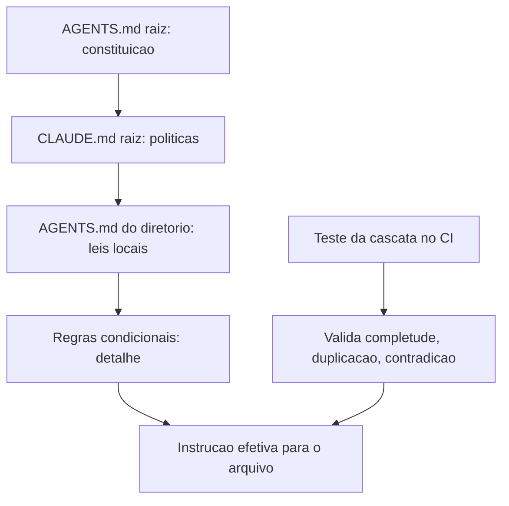

# 8. Hierarquia e cascata de arquivos de instrução em monorepos

## 1. Introducao

> **Objetivo do capítulo**: compreender como os múltiplos arquivos de instrução — `CLAUDE.md`, `AGENTS.md`, `.cursor/rules/`, arquivos por diretório — se organizam em hierarquia e cascata dentro de monorepos, e como projetar essa hierarquia para que cada agente, de qualquer ferramenta, receba o nível certo de instrução no momento certo.

## 2. Explica

### 8.1 O monorepo como território múltiplo

Os capítulos anteriores trataram dos arquivos de instrução individualmente: o `CLAUDE.md` como memória [1], o `AGENTS.md` como padrão neutro [7][9], as regras condicionais como legislação local [6]. Este capítulo trata do que acontece quando **todos eles coexistem** — e, pior, quando coexistem em múltiplos níveis de um monorepo com dezenas de diretórios, cada um com seu próprio contexto, stack e convenções [1][7][9].

O monorepo é o ambiente onde a engenharia de instruções mais se justifica — e onde mais erros são cometidos. Em um repositório único com front-end, back-end, CLI, docs, infraestrutura e pipelines, o agente precisa saber, para cada arquivo que toca, **qual conjunto de regras se aplica** [1][7][9]. Um arquivo `AGENTS.md` único na raiz é a constituição; mas a constituição não pode detalhar as leis de cada província — isso seria o inchaço que o Capítulo 7 denunciou [6].

A solução do mercado convergiu para a **hierarquia**: arquivos de instrução aninhados, onde cada diretório pode ter seu próprio arquivo, e o conteúdo efetivo é a **cascata** — a combinação do arquivo raiz com os arquivos dos diretórios no caminho [1][7][9].

A metáfora que estrutura o capítulo: o **sistema jurídico em camadas**. A constituição (AGENTS.md raiz) define os princípios; as leis federais (CLAUDE.md raiz) definem as políticas da ferramenta; as leis estaduais (AGENTS.md de um diretório) definem as convenções daquele território; as leis municipais (.cursor/rules/ ou CLAUDE.md aninhado) definem o detalhe local. O agente, ao trabalhar em um arquivo, "aplica o direito" daquele ponto específico — e o direito aplicável é a soma ordenada de todas as camadas acima dele [1][7][9].

### 8.2 O modelo de cascata: da raiz ao diretório

O princípio da cascata é simples e poderoso: **o conteúdo de instrução efetivo para um arquivo é a concatenação ordenada dos arquivos de instrução encontrados da raiz até o diretório do arquivo** [1][7][9].

Para o `AGENTS.md`, a especificação do padrão aberto define explicitamente: arquivos `AGENTS.md` podem existir em qualquer diretório, e as instruções de um arquivo mais profundo aplicam-se apenas ao subárvore sob ele [7][9]. Um agente que trabalha em `packages/api/src/routes/users.ts` lê o `AGENTS.md` da raiz, depois o `AGENTS.md` de `packages/`, depois o de `packages/api/` — e combina as instruções, com as camadas mais profundas adicionando detalhe às mais rasas [7][9].

O mesmo modelo vale para o `CLAUDE.md`: a documentação oficial do Claude Code confirma que o arquivo é procurado no diretório de trabalho atual e nos ancestrais, com o primeiro encontrado tomando precedência [1]. Em um monorepo, cada subprojeto pode ter seu próprio `CLAUDE.md`, e o Claude Code carrega o do diretório de trabalho — criando uma cascata natural por posição [1].

A formalização do modelo de cascata tem três propriedades que valem a pena explicitar [1][7][9]:

1. **Localidade**: quanto mais perto do arquivo em edição, mais específica e detalhada a instrução. A raiz fala de princípios; o diretório fala de convenções daquele módulo [7][9].
2. **Aditividade**: as camadas se somam — a instrução efetiva é a união do que todas as camadas declaram. A menos que uma camada declare conflito explícito, nada é descartado [7][9].
3. **Precedência**: quando há conflito, a camada mais próxima do arquivo vence — o detalhe local sobrepõe o princípio geral [1][7][9].

A propriedade 3 é a mais sutil e a mais importante. Sem ela, um `AGENTS.md` de um diretório não teria razão de existir: se a regra da raiz sempre vencesse, nenhum território poderia customizar seu comportamento [7][9]. Com ela, cada território é soberano sobre suas convenções locais — desde que não viole os princípios absolutos que a raiz marca como inegociáveis [7][9].

### 8.3 AGENTS.md aninhado: a governança por fronteira

A especificação do padrão aberto AGENTS.md [7][9] é explícita sobre o aninhamento: qualquer diretório pode conter um `AGENTS.md`, e as instruções valem para a subárvore [9]. Isso cria a **governança por fronteira**: cada fronteira de diretório declara suas leis, e o agente, ao cruzar a fronteira, passa a obedecer às leis daquele território [7][9].

Na prática, um monorepo bem projetado usa os `AGENTS.md` aninhados para isolar o conhecimento local [9]:

```
AGENTS.md                          # constituição: stack global, comandos, princípios
packages/
├── AGENTS.md                      # leis federais: o que vale para todos os pacotes
├── api/
│   └── AGENTS.md                  # leis estaduais: convenções da API, contratos
├── web/
│   └── AGENTS.md                  # leis estaduais: convenções de front-end
└── cli/
    └── AGENTS.md                  # leis estaduais: convenções da CLI
docs/
└── AGENTS.md                      # leis estaduais: estilo e estrutura de docs
```

A vantagem sobre um único arquivo gigante é dupla [7][9]:

- **Contexto enxuto**: o agente que trabalha em `packages/api/` não carrega as convenções de front-end — o que reduz tokens e ruído, a mesma lógica de seleção do Capítulo 7 [1][6][9].
- **Autonomia de território**: cada equipe dona do seu diretório pode atualizar suas convenções sem tocar na constituição global — e sem risco de quebrar o entendimento das outras equipes [9].

A especificação também alerta para o caso do **AGENTS.md no diretório de trabalho**: quando o agente é iniciado em um diretório que contém um `AGENTS.md`, ele é carregado preferencialmente — comportamento que permite a ferramentas serem "especializadas" por projeto sem configurar nada [9].

### 8.4 O CLAUDE.md por diretório e o @import

O Claude Code adiciona duas mecânicas de cascata próprias: o `CLAUDE.md` por diretório e a diretiva de importação [1].

**O CLAUDE.md por diretório**: a documentação oficial descreve que o Claude Code procura `CLAUDE.md` no diretório de trabalho atual e sobe pelos ancestrais até a raiz [1]. Isso significa que, em um monorepo, o engenheiro pode:

- Manter um `CLAUDE.md` raiz com a memória global do repositório [1].
- Adicionar `CLAUDE.md` específicos em diretórios de subprojetos, com a memória local daquele módulo [1].

O comportamento de busca ("primeiro encontrado ao subir") significa que, quando o desenvolvedor abre o Claude Code em `packages/api/`, o `CLAUDE.md` local é o principal — e o raiz só entra se não houver local [1].

**A diretiva @import**: o Claude Code permite que um `CLAUDE.md` importe outros arquivos com `@path/to/file` [1]. A importação resolve o problema do **conteúdo compartilhado**: em vez de duplicar a memória de segurança em dez `CLAUDE.md` de dez pacotes, cada um importa um arquivo comum [1].

```markdown
# CLAUDE.md — pacote api

Este pacote segue as convenções de segurança do repositório.

@../../docs/seguranca.md
@../AGENTS.md
```

O `@import` cria um **grafo de memória**: em vez de uma linha de cascata, o engenheiro projeta uma rede de dependências entre arquivos de instrução — com as mesmas vantagens e os mesmos riscos de qualquer grafo de dependências (ciclos, duplicação, conteúdo órfão) [1]. A prática recomendada é importar apenas o essencial e manter o grafo raso.

### 8.5 Ordem de precedência entre os formatos

Com a coexistência de formatos, a pergunta inevitável é: **quem vence quando AGENTS.md, CLAUDE.md e .cursor/rules disputam a mesma decisão?** A resposta honesta, derivada da documentação oficial das ferramentas, é que **cada ferramenta tem sua própria ordem** — mas os princípios subjacentes convergem [1][6][7][9].

Para o Claude Code, a hierarquia de fontes de instrução, conforme a documentação, é aproximadamente [1]:

1. **Instruções do sistema** (nível de sistema, raras).
2. **CLAUDE.md do diretório de trabalho** (e ancestrais).
3. **Arquivos de regras locais** (`@import`, `.claude/rules/` se configurado).
4. **Instruções do usuário na conversa** (precedência máxima entre as demais).

Para o Cursor [6]:

1. Regras do **usuário** (nível global).
2. Regras do **projeto** (`.cursor/rules/`, `.cursorrules`).
3. **Instruções do chat** (precedência máxima).

Para a especificação AGENTS.md [7][9]:

1. **AGENTS.md** do diretório (e ancestrais, em cascata).
2. Instruções da **conversa** (precedência máxima).

O padrão comum: **instruções da conversa sempre vencem** (a intenção mais recente do humano é a autoridade final), e **instruções mais locais vencem instruções mais globais** [1][6][9]. Esse duplo princípio — especificidade temporal e especificidade geográfica — é o que permite aos arquivos coexistir sem anarquia.

Na prática, porém, a recomendação de arquitetura para monorepos maduros é **evitar disputas**: em vez de depender de precedência para resolver conflitos, o projeto deveria ter uma **divisão de responsabilidades** clara entre os formatos [1][7][9]:

- **AGENTS.md (raiz)**: princípios neutros entre ferramentas — o "porquê" do projeto [7][9].
- **CLAUDE.md (raiz)**: memória operacional da ferramenta — o "como" para agentes Claude [1].
- **AGENTS.md aninhados**: convenções locais de cada território [9].
- **Regras condicionais (`.cursor/rules/`, `.claude/rules/`)**: detalhe escopado por glob [6].

Com essa divisão, os formatos se complementam em vez de competir: cada um responde a uma pergunta diferente, e a sobreposição — e portanto o conflito — é mínima [1][6][7][9].

### 8.6 Projetando a cascata de um monorepo real

A arquitetura da cascata não é um detalhe técnico — é uma **decisão de design** que determina como o conhecimento do projeto é organizado e consumido [1][7][9]. O processo de design segue cinco passos, na prática consolidada:

**Passo 1 — Mapeie os territórios.** Liste os diretórios do monorepo e identifique os territórios coesos: onde a stack muda, onde as convenções mudam, onde as equipes mudam. Cada território é candidato a um arquivo de instrução aninhado [9].

**Passo 2 — Defina a constituição.** Escreva o `AGENTS.md` raiz com o que vale para **todo** o repositório: linguagens principais, comandos de build/teste, princípios arquiteturais, proibições absolutas [7][9]. Se a constituição crescer além de ~100-150 linhas, o território está mal particionado — o detalhe deveria estar nas camadas locais [7][9].

**Passo 3 — Delegue o detalhe.** Para cada território, escreva o `AGENTS.md` (ou `CLAUDE.md`) local com o que é específico: convenções do módulo, armadilhas, padrões aceitos e rejeitados [1][9]. A regra de ouro: **se a informação é específica de um território, ela não pertence à constituição** [9].

**Passo 4 — Escope as regras condicionais.** Use o mecanismo de regras da ferramenta (glob ou diretório) para o detalhe mais fino: convenções de um subconjunto de arquivos, formatação, padrões de teste [6].

**Passo 5 — Valide com um teste de cenário.** Para cada tipo de tarefa representativa (editar um componente, adicionar uma rota, escrever um teste), simule o que o agente lê: a concatenação de todas as camadas. Se o conteúdo efetivo tiver duplicação ou contradição, ajuste [1][6][9].

O passo 5 é o mais negligenciado e o mais valioso. A cascata é um **sistema cujo comportamento é a composição das camadas** — e composições precisam ser testadas, não apenas projetadas [1][7][9].

### 8.7 Duplicação, contradição e a lei da proximidade

Os dois riscos estruturais de qualquer cascata são a duplicação e a contradição [1][7][9].

**Duplicação**: a mesma regra escrita em duas camadas. O problema não é o espaço (embora tokens importem), é o **drift silencioso**: a regra é atualizada em uma camada e esquecida na outra, e o agente passa a receber instruções divergentes [1][7][9]. O antídoto é a **canonização**: cada regra vive em exatamente uma camada, e as outras camadas referenciam (importam) em vez de repetir [1]. O `@import` do Claude Code [1] e a convenção de referência cruzada entre arquivos são as ferramentas da canonização.

**Contradição**: duas camadas declaram o mesmo assunto de formas incompatíveis. A cascata resolve pela **lei da proximidade**: a camada mais próxima do arquivo vence [1][7][9]. Mas depender da lei da proximidade para conflitos reais é frágil — o agente pode interpretar mal ou a ferramenta pode aplicar ordens diferentes. O antídoto é o **design de partição**: como no Capítulo 7, as camadas devem ser desenhadas para não se sobrepor — cada assunto pertence a uma única camada, e as fronteiras de assunto são tão explícitas quanto as fronteiras de diretório [1][6][9].

A prática que une os dois antídotos é a **regra do dono único**: para cada assunto do projeto (segurança, estilo, testes, convenções de commit), existe exatamente um arquivo dono, e todos os outros apenas referenciam [1][9]. Com o dono único, duplicação e contradição tornam-se impossíveis por construção.

### 8.8 O drift entre camadas e o teste da cascata

O drift — a distância entre o que está documentado e o que o time pratica — foi tratado no Capítulo 9 [6]; aqui ele ganha a dimensão da cascata: **cada camada pode driftar de forma independente** [1][7][9]. A constituição pode estar atualizada e as leis locais obsoletas; ou as leis locais precisas e a constituição mentindo sobre o projeto inteiro [9].

O instrumento de controle é o **teste da cascata**: um conjunto de verificações automáticas que roda no CI e responde à pergunta "o agente receberá instruções corretas para esta tarefa?" [1][6][9]:

1. **Teste de completude**: para cada diretório relevante, o caminho de cascata existe (nenhum território sem constituição).
2. **Teste de duplicação**: nenhuma regra aparece verbatim em duas camadas (heurística de similaridade).
3. **Teste de contradição**: pares de camadas não declaram valores conflitantes para os mesmos campos (heurística de pares chave-valor).
4. **Teste de frescor**: datas de atualização das camadas não divergem além de um limiar — se a raiz mudou e o diretório não, o alerta dispara.
5. **Teste de rastreabilidade**: toda regra de camada local referencia seu princípio na constituição (cada lei estadual cita o artigo da lei federal que a fundamenta).

O teste de rastreabilidade é o mais ambicioso e o que mais aproxima a cascata de um **sistema jurídico de verdade**: leis locais que citam seus fundamentos constitucionais. Quando o engenheiro escreve uma regra local sem fundamento na raiz, o teste falha — forçando a pergunta "este detalhe deveria estar na constituição, ou a constituição deveria ganhar um princípio?" [1][9].

### 8.9 Caso de estudo: a cascata do monorepo financeiro

Considere um monorepo de uma fintech, com os territórios: `apps/` (web, mobile, admin), `services/` (pagos, cobrança, antifraude), `libs/` (componentes, utilidades), `infra/` (IaC) e `docs/`. A cascata foi projetada assim [1][6][7][9]:

```
AGENTS.md                                    # constituição: stack, compliance, princípios
CLAUDE.md                                    # memória operacional: comandos, fluxos
apps/
├── AGENTS.md                                # leis de apps: padrões de UI/UX
├── web/
│   └── AGENTS.md                            # leis do web: rotas, estado, a11y
services/
├── AGENTS.md                                # leis de serviços: contratos, observabilidade
├── pagos/
│   ├── AGENTS.md                            # leis de pagos: domínio, eventos
│   └── .cursor/rules/pix-conventions.md     # regras condicionais do PIX
└── antifraude/
    └── AGENTS.md                            # leis de antifraude: regras de negócio
libs/
└── AGENTS.md                                # leis de libs: API pública, sem breaking
infra/
└── AGENTS.md                                # leis de infra: IaC, drift, secrets
```

O teste da cascata para a tarefa "adicionar um novo evento de domínio em `services/pagos/`" valida que o agente receberá: a constituição (compliance e princípios), as leis de serviços (contratos), as leis de pagos (domínio e eventos) — e nada das convenções de front-end [1][6][7][9]. Cada camada responde a uma pergunta, e nenhuma duplica a outra [9].

O resultado observado, na experiência relatada: onboarding de agentes em territórios novos sem sessões de "treinamento", regras locais atualizadas por equipes donas sem PR na raiz, e um teste da cascata que pega o drift antes que ele alcance produção [1][9].

### 8.10 A cascata como disciplina de engenharia

O capítulo fecha elevando a cascata a **disciplina**: projetar a hierarquia de instruções de um monorepo é engenharia no mesmo sentido de projetar a hierarquia de módulos de um sistema [1][7][9].

A engenharia de software aprendeu, há décadas, que **camadas mal particionadas degradam o sistema**: dependências emaranhadas, código duplicado, mudanças que quebram territórios distantes. A engenharia de instruções está aprendendo a mesma lição, em tempo real, com os arquivos de instrução [1][7][9].

Os princípios que o capítulo consolidou:

1. **Partição**: cada território com suas leis; cada assunto com um dono único [1][6][9].
2. **Localidade**: o detalhe vive o mais perto possível do código que governa [7][9].
3. **Aditividade com precedência**: as camadas somam; a mais próxima vence em conflito [1][7][9].
4. **Canonização**: referencie, não repita — import é melhor que duplicar [1].
5. **Teste**: a cascata é um sistema composto; sistemas compostos exigem validação contínua [1][6][9].

A habilidade central do engenheiro de instruções deixa de ser "escrever um bom CLAUDE.md" e passa a ser **"desenhar um sistema de instruções que permanece correto à medida que o projeto cresce"** [1][7][9]. O Capítulo 10 consolida essa habilidade em uma disciplina completa de memória de projeto.

### 8.11 A Cascata e o Custo de Contexto por Tarefa

A cascata resolve a organização — mas o engenheiro precisa medir seu custo [1][6]. Cada camada carregada ocupa tokens do contexto; a soma das camadas é o **custo de instrução por tarefa** [1][14]. O desenho da cascata é, em parte, um exercício de otimização: maximizar o sinal (regras relevantes) e minimizar o ruído (regras de outros territórios) [1][6][14].

A métrica prática [1][6]: para cada tipo de tarefa representativa (editar componente, adicionar rota, escrever teste), meça quantos caracteres de instrução o agente recebe. O alvo: a soma das camadas relevantes deve ser muito menor que o corpus total de regras do monorepo [1][6]. Se o custo por tarefa se aproxima do corpus total, a cascata não está particionando — está apenas reorganizando o monolito [1][6].

As alavancas de otimização [1][6]: **mais territórios** (camadas mais finas, carregadas seletivamente); **menos alwaysApply** (regras transversais que carregam sempre têm o maior custo fixo); e **referências em vez de duplicação** (o `@import` carrega o conteúdo de um arquivo comum sem copiá-lo) [1][6].

A lição do capítulo: a cascata bem projetada é **economia estrutural de contexto** — o ganho não vem de escrever menos regras, mas de carregar apenas as certas [1][6][14].

### 8.12 A Cascata e os Erros Comuns de Design

A prática acumulada revela erros recorrentes no desenho da cascata — cada um com seu antídoto [1][9]:

**Erro 1 — A constituição detalhista.** O `AGENTS.md` raiz tenta cobrir cada território e incha. Antídoto: a constituição declara princípios; o detalhe vive nos territórios (Capítulo 7) [6][9].

**Erro 2 — O território sem camada.** Um diretório com stack própria não tem `AGENTS.md` próprio, e o agente aplica as leis erradas. Antídoto: mapeie os territórios (Capítulo 8, Seção 8.6) e dê camada a cada um [9].

**Erro 3 — A duplicação silenciosa.** A mesma regra em duas camadas, com redações diferentes, driftando em direções opostas. Antídoto: dono único e referências cruzadas [1][9].

**Erro 4 — O conflito não resolvido.** Duas camadas declaram o mesmo assunto de formas incompatíveis, e a precedência da ferramenta decide por acaso. Antídoto: partição por assunto — cada assunto pertence a uma camada [1][6][9].

**Erro 5 — A cascata sem teste.** O design é revisado por humanos, mas nunca verificado por máquina. Antídoto: o teste da cascata no CI (Capítulo 8, Seção 8.8) [1][6][9].

A lição: os erros da cascata são erros de **arquitetura**, não de redação — e se corrigem com design e instrumentação, não com mais texto [1][9].

### 8.13 A Cascata e a Experiência do Desenvolvedor

A cascata de instruções não afeta apenas agentes — afeta a **experiência do desenvolvedor** [1][9]. O desenvolvedor que trabalha em um território governado por camadas bem desenhadas percebe três diferenças [1][9]: o agente erra menos (as regras certas chegam no momento certo); o agente explica melhor (a cascata contextualiza as decisões); e o desenvolvedor corrige menos (a consistência entre sessões reduz o retrabalho) [1][9].

O custo para o desenvolvedor também existe [1][9]: a manutenção da cascata é trabalho real — atualizar camadas, resolver conflitos, ler o painel de drift (Capítulo 9) [1][9]. O engenheiro maduro **orça** esse custo: a cascata é uma peça de infraestrutura, e infraestrutura precisa de dono e orçamento de manutenção [1][9].

A lição do capítulo: a cascata bem projetada paga sua manutenção em horas de desenvolvimento recuperadas — a medição dessa troca é o que justifica o investimento para a liderança técnica [1][9].

### 8.14 A Cascata e a Escala Organizacional

Quando a cascata sai do monorepo e alcança a organização, os princípios permanecem — mas a governança muda de escala [1][7][9]. Na escala organizacional [1][7][9]: o padrão central (Capítulo 10, Seção 10.7) torna-se a raiz da cascata de cada repositório; os territórios organizacionais (plataforma, produtos, infraestrutura) recebem camadas próprias; e a governança central arbitra conflitos entre repositórios [1][7][9].

A prática observada em organizações maduras [1][7][9]: o padrão central evolui em ritmo trimestral, com proposta e revisão; os repositórios adotam a nova versão em janela definida; e o pipeline anti-drift da organização varre os repositórios para medir a aderência ao padrão [1][7][9].

A lição final: a cascata é um padrão de design **escalável** — do diretório à organização, o mesmo modelo (constituição + leis locais + regras condicionais + teste) se repete em escala crescente [1][7][9]. O engenheiro que domina o padrão em um monorepo pode projetá-lo para uma organização inteira [1][7][9].

### 8.15 A Cascata e a Resolução de Conflitos entre Camadas

Quando duas camadas da cascata conflitam, a resolução não deve depender apenas da precedência automática da ferramenta [1][9]. A prática consolidada define um **fluxo de resolução de conflitos** [1][9]:

1. **Documente o conflito**: o teste da cascata (Capítulo 8, Seção 8.8) detecta e registra [1][9].
2. **Decida a camada dona**: o assunto pertence a qual camada? (o dono único do Capítulo 8, Seção 8.7) [1][9].
3. **Canonize**: a regra vive na camada dona; as demais referenciam [1][9].
4. **Verifique**: o teste da cascata confirma a resolução [1][9].

A lição do capítulo: o conflito entre camadas é um **defeito de design**, não um evento a tolerar [1][9]. O fluxo de resolução transforma o defeito em oportunidade de simplificação [1][9].

### 8.16 A Cascata e o Registro de Auditoria

A cascata bem instrumentada produz um **registro de auditoria** — o histórico de o que o agente leu e quando [1][9][18]. O registro responde a perguntas de investigação [1][9][18]: por que o agente agiu assim? (quais camadas ele carregou?); que regra ele seguiu? (qual arquivo declarou?); e houve violação? (qual regra foi ignorada e por quê?) [1][9][18].

A prática recomendada [1][9][18]: o registro é gerado automaticamente (o carregamento das camadas é observável) e consultado em investigações de incidentes e revisões de qualidade [1][9][18]. A observabilidade da cascata (Capítulo 8, Seção 8.13) é o fundamento do registro [1][9][18].

A lição do capítulo: a cascata não é apenas um mecanismo de entrega de instruções — é um **instrumento de governança** que registra o que foi entregue [1][9][18]. O registro é o que transforma a memória de projeto em evidência auditável [1][9][18].

### 8.17 A Cascata e o Futuro da Memória Distribuída

As tendências de 2026 apontam para a **memória distribuída** — e a cascata é a arquitetura que a comporta [1][3][7]. As direções visíveis [1][3][7]: a memória fragmentada por território com agregação dinâmica (o agente monta o contexto das camadas relevantes em tempo real); a memória versionada como artefato (as instruções com releases e changelog, como pacotes); e a memória federada (o padrão central organizacional com as variações por repositório) [1][3][7].

A lição final do capítulo: a cascata de hoje — diretórios e camadas — é o embrião da memória distribuída de amanhã [1][3][7]. O engenheiro que domina o princípio (partição, localidade, teste) estará pronto para a evolução [1][3][7].

### 8.18 A Cascata e a Hierarquia de Precedência na Prática

A precedência entre camadas (Capítulo 8, Seção 8.5) tem nuances práticas que o engenheiro precisa dominar [1][9]: a precedência **geográfica** (a camada mais próxima vence) e a precedência **temporal** (a instrução da conversa vence) interagem [1][9].

Os casos práticos [1][9]: a conversa manda o agente ignorar uma regra local — a instrução temporal vence, e o desvio é intencional; um PR altera uma regra da raiz que uma camada local referencia — a referência pode quebrar, e o teste da cascata (Seção 8.8) detecta [1][9]. O engenheiro projeta a cascata sabendo que precedência resolve conflitos **pontuais**, não estruturais — conflitos estruturais exigem redesenho (Seção 8.15) [1][9].

A lição do capítulo: a precedência é uma ferramenta de resolução, não uma muleta [1][9]. Use-a para o caso pontual; redesenhe para o estrutural [1][9].

### 8.19 A Cascata e o Versionamento de Instruções

As instruções da cascata são **versionadas como código** — e o versionamento é parte da disciplina [1][9]: cada camada tem histórico (git), cada mudança tem autor e revisão, e cada versão do contrato é recuperável [1][9].

O valor do versionamento [1][9]: a investigação de regressão ("o agente mudou de comportamento — o que mudou no contrato?") consulta o histórico; a auditoria (Capítulo 8, Seção 8.16) cruza decisões com versões; e a reversão de mudança ruim é um `git revert` [1][9].

A lição do capítulo: a cascata sem versionamento é conversa; com versionamento, é contrato auditável [1][9]. O git é o registro de nascimento de cada regra [1][9].

### 8.20 A Cascata e o Onboarding de Repositórios Novos

A cascata bem documentada acelera o **onboarding de repositórios novos** [1][9]: quando a organização cria um repositório novo, a cascata padrão é o ponto de partida — a constituição padrão, as seções padrão, os testes padrão [1][9].

A prática recomendada [1][9]: o template de repositório novo já nasce com a cascata base (o padrão central organizacional do Capítulo 10, Seção 10.7); o time do repositório personaliza as camadas locais; e a conformidade com o padrão é verificada no primeiro PR [1][9].

A lição final do capítulo: a cascata padrão transforma o onboarding de repositório de projeto em **configuração** — o novo território nasce governado [1][9]. O ganho composto da padronização aparece na escala organizacional [1][7][9].

### 8.21 A Cascata e a Relação com a Revisão de Código

A cascata de instruções e a **revisão de código** se reforçam mutuamente [1][9]: o revisor consulta as camadas para avaliar (Capítulo 2, Seção 5.22); e a revisão alimenta a cascata (as convenções descobertas na revisão viram regras) [1][9].

A prática recomendada [1][9]: a revisão cita a camada ("este código viola a regra X da camada Y"); e o acúmulo de violações da mesma camada dispara a revisão da camada (a regra está errada ou mal redigida?) [1][9]. O ciclo revisão-cascata é o mecanismo de aprendizado do contrato [1][9].

A lição do capítulo: a cascata é o vocabulário da revisão — e a revisão é a escola da cascata [1][9]. O engenheiro que conecta os dois mantém o contrato aprendendo [1][9].

### 8.22 A Cascata e a Medição de Complexidade

A cascata bem desenhada reduz a **complexidade percebida** do projeto [1][9]: o desenvolvedor que encontra a regra certa na camada certa entende o projeto mais rápido do que quem lê um documento monolítico [1][9]. A métrica [1][9]: o tempo para localizar a regra de um território (com cascata vs. com documento único) [1][9].

A lição do capítulo: a cascata é uma ferramenta de **gestão de complexidade** — a mesma informação, organizada em camadas, fica mais simples de consumir [1][9]. A complexidade não some; é distribuída em camadas navegáveis [1][9].

### 8.23 A Cascata e a Sustentabilidade do Conhecimento

O objetivo final da cascata é a **sustentabilidade do conhecimento** [1][7][9]: o conhecimento do projeto sobrevive à rotatividade, à mudança de ferramentas e à passagem do tempo [1][7][9]. A cascata sustenta o conhecimento porque [1][7][9]: cada camada é pequena o suficiente para ser mantida; o teste da cascata (Capítulo 8, Seção 8.8) detecta a degradação; e o design por território permite que camadas individuais evoluam sem reconstruir o todo [1][7][9].

A lição final do capítulo: a cascata transforma o conhecimento do projeto de vulnerabilidade (depende de pessoas) em **ativo** (depende de camadas mantidas) [1][7][9]. O ativo é o legado da disciplina (Capítulo 10, Seção 10.17) [1][7][9].

### 8.24 A Cascata e a Relação com a Memória Automática

A cascata e a memória automática (Capítulo 4) formam um par [1]: a cascata distribui o contrato pelas camadas; a memória automática consolida o aprendizado emergente [1]. A integração [1]: o aprendizado da sessão é consolidado na memória automática; a promoção (Capítulo 4, Seção 5.26) decide se o aprendizado sobe para uma camada da cascata; e a camada escolhida segue o design por território (Capítulo 8, Seção 8.6) [1].

A lição do capítulo: a cascata é o destino das promoções da memória automática [1]. A integração das duas é o ciclo completo do conhecimento do projeto [1].

### 8.25 A Cascata e a Experiência de Migração de Ferramenta

A cascata é o que torna a **migração de ferramenta** suave (Capítulo 5, Seção 5.17) [1][9]: quando a organização troca de ferramenta, o conhecimento não se perde — a cascata permanece, e apenas a camada de interpretação muda [1][9].

A prática recomendada [1][9]: a migração começa pelo teste de carregamento (a ferramenta nova lê a cascata?); segue pelo ajuste das camadas específicas; e termina pela verificação de aderência (Capítulo 5, Seção 5.23) [1][9].

A lição do capítulo: a cascata neutraliza o custo de troca de ferramenta [1][9]. A memória bem distribuída é o ativo que viaja [1][9].

### 8.26 A Cascata e a Relação com a Auditoria de Segurança

A cascata é também a base da **auditoria de segurança** [1][9][17]: o auditor consulta as camadas para verificar se as regras de segurança existem, estão corretas e são obedecidas [1][9][17]. A cascata dá à auditoria o que ela precisa [1][9][17]: a localização das regras (cada camada sabe onde está); o histórico (o git mostra as mudanças); e a evidência (o registro de auditoria do Capítulo 8, Seção 8.16) [1][9][17].

A lição do capítulo: a cascata bem mantida é o instrumento da auditoria de segurança [1][9][17]. A memória governada transforma a auditoria de arqueologia em verificação [1][9][17].

### 8.27 A Cascata e a Síntese do Capítulo

O capítulo da cascata se fecha com a síntese [1][7][9]: a hierarquia de instruções em monorepos segue o modelo jurídico — constituição, leis federais, leis estaduais, leis municipais; a precedência resolve por proximidade; e o teste da cascata garante a saúde [1][7][9]. A cascata é a arquitetura que torna a memória escalável [1][7][9].

A lição do capítulo: a cascata transforma o monorepo de desafio em caso de uso principal da memória [1][7][9].

### 8.28 A Cascata e o Fechamento

O capítulo da cascata se encerra com a escala [1][7][9]: o mesmo modelo — constituição, leis locais, regras condicionais, teste — funciona do diretório ao monorepo à organização (Seções 8.14, 8.20) [1][7][9]. O engenheiro que domina o modelo desenha a memória de qualquer tamanho [1][7][9].

### 8.29 A Cascata e a Simplicidade

A cascata bem desenhada é **simples** [1][9]: cada camada pequena, cada assunto com dono único, cada fronteira clara (Capítulo 8, Seção 8.10) [1][9]. A simplicidade é o critério de design — se a cascata confunde, ela falhou [1][9].

### 8.30 A Cascata e o Próximo Passo

O próximo passo após a cascata é o drift (Capítulo 9): a hierarquia precisa de medição [1][7][9]. A sequência completa o ciclo da disciplina [1][7][9].

### 8.31 O Fechamento da Cascata

A cascata está desenhada (Capítulo 8, Seção 8.27): constituição, leis locais, regras condicionais e teste [1][7][9]. O próximo passo é o drift — a saúde do sistema [1][7][9].

### 8.32 A Síntese da Cascata

A cascata transforma o monorepo em território governado [1][7][9]. O capítulo entregou o modelo; o drift (Capítulo 9) mede a sua saúde [1][7][9].

### 8.33 O Encerramento

O capítulo da cascata encerra com a arquitetura no lugar [1][7][9]: constituição, leis locais e teste [1][7][9]. O monorepo está governado [1][7][9].

### 8.34 A Ponte

A cascata é a ponte entre as camadas da memória [1][7][9]. O capítulo 8 a construiu; o drift a verifica [1][7][9].

## 3. Ilustra

### 3.1 A Analogia do Sistema Juridico em Camadas

A analogia do sistema juridico ilumina a cascata [1][9]. A constituicao (AGENTS.md raiz) define os principios; as leis federais (CLAUDE.md raiz) definem as politicas; as leis estaduais (AGENTS.md de um diretorio) definem as convencoes locais; e as leis municipais (regras condicionais) definem o detalhe [1][9].



O diagrama mostra a soma ordenada das camadas e o teste que a valida [1][9].

## 4. Tecnica

### 4.1 Modelando a Cascata de Instrucoes

O primeiro instrumento do engenheiro de cascata e modelar a soma das camadas [1][9]:

```python
from pathlib import Path


class Cascata:
    def __init__(self, raiz: Path):
        self.raiz = raiz

    def camadas_para(self, caminho: Path) -> list:
        camadas = []
        for pasta in list(caminho.parents)[::-1] + [self.raiz]:
            try:
                pasta.relative_to(self.raiz)
            except ValueError:
                continue
            agents = pasta / "AGENTS.md"
            claude = pasta / "CLAUDE.md"
            if agents.exists():
                camadas.append(agents)
            if claude.exists():
                camadas.append(claude)
        return camadas

    def instrucao_efetiva(self, caminho: Path) -> str:
        partes = []
        for arquivo in self.camadas_para(caminho):
            partes.append(f"# {arquivo}\n{arquivo.read_text(encoding='utf-8')}")
        return "\n\n".join(partes)


if __name__ == "__main__":
    c = Cascata(Path("."))
    print(len(c.camadas_para(Path("packages/api/src/routes/users.ts"))))
```

O modelo demonstra a localidade e a aditividade da cascata [1][9].

## 5. Aplica

### 5.1 Onde Isso Vive no Mundo Real

A cascata de instrucoes vive em todo monorepo maduro em 2026 [1][9]. O AGENTS.md aninhado governa por fronteira [3][9]. O CLAUDE.md por diretorio e o @import formam o grafo de memoria [1]. As regras condicionais escopam o detalhe [6]. A combinacao das camadas e a pratica diaria do engenheiro de memoria [1][9].

### 5.2 O Erro Comum do Iniciante

O erro mais comum e a constituicao detalhista [9]: o AGENTS.md raiz tenta cobrir cada territorio e incha [9]. O antidoto e a particao — cada territorio com suas leis locais e o detalhe fora da raiz (Secao 8.6) [1][9]. Outro erro classico e a duplicacao silenciosa entre camadas, que drift em direcoes opostas (Secao 8.7) [1][9].

### 5.3 O Padrao Profissional em 2026

O padrao profissional desenha a cascata como sistema [1][7][9]: constituicao curta, leis locais por territorio, dono unico por assunto e o teste da cascata no CI (Secao 8.8) [1][9]. O resultado e um monorepo onde qualquer agente recebe as instrucoes certas no momento certo [1][7][9].

## 6. Conclusao

Este capítulo mapeou a hierarquia e a cascata de arquivos de instrução em monorepos: o `AGENTS.md` aninhado como governança por fronteira [7][9], o `CLAUDE.md` por diretório e o `@import` como grafo de memória [1], a precedência entre formatos guiada pela especificidade temporal e geográfica [1][6][9], e o teste da cascata como instrumento de controle de drift entre camadas [1][6][9]. O monorepo deixou de ser um desafio e passou a ser o caso de uso principal da engenharia de memória — porque é nele que a partição de territórios produz o maior ganho de contexto [1][7][9]. O Capítulo 10 reúne todas as camadas em uma disciplina: a engenharia da memória de projeto.

## 7. Referencias

[1] ANTHROPIC. **Memory: how Claude remembers your project**. Claude Code Documentation, 2025-2026. Disponivel em: https://docs.anthropic.com/en/docs/claude-code/memory. Acesso em: 5 ago. 2026.
[2] ANTHROPIC. **Overview: Claude Code**. Claude Code Documentation, 2025-2026. Disponivel em: https://docs.anthropic.com/en/docs/claude-code/overview. Acesso em: 5 ago. 2026.
[3] AGENTS.MD. **AGENTS.md: the standard for AI agent instructions**. Agentic AI Foundation / OpenAI, ago. 2025. Disponivel em: https://agents.md/. Acesso em: 5 ago. 2026.
[4] LINUX FOUNDATION. **Linux Foundation announces the formation of the Agentic AI Foundation**. Linux Foundation Press Release, 9 dez. 2025. Disponivel em: https://www.linuxfoundation.org/press/linux-foundation-announces-the-formation-of-the-agentic-ai-foundation. Acesso em: 5 ago. 2026.
[5] AGENTIC AI FOUNDATION. **Agentic AI Foundation official portal**. AAIF, 2025-2026. Disponivel em: https://aaif.io/. Acesso em: 5 ago. 2026.
[6] OSMANI, Addy. **15 AGENTS.md - engineering guide to AGENTS.md**. Addy Osmani, 2025-2026. Disponivel em: https://addyosmani.com/agents/15-agents-md/. Acesso em: 5 ago. 2026.
[7] AUGMENT CODE. **How to build AGENTS.md: construction guide**. Augment Code Guides, 2025-2026. Disponivel em: https://www.augmentcode.com/guides/how-to-build-agents-md. Acesso em: 5 ago. 2026.
[8] CURSOR. **Rules: Cursor Documentation**. Cursor / Anysphere, 2025-2026. Disponivel em: https://cursor.com/docs/rules. Acesso em: 5 ago. 2026.
[9] AGYN. **AGENTS.md vs CLAUDE.md: does Claude Code or Codex read both?**. Agyn Blog, jun. 2026. Disponivel em: https://agyn.io/blog/claude-md-agents-md-compatibility. Acesso em: 5 ago. 2026.
[10] OPENAI. **Codex: AGENTS.md and coding agents**. OpenAI Documentation, 2025-2026. Disponivel em: https://openai.com/index/introducing-codex/. Acesso em: 5 ago. 2026.
[11] GITHUB. **GitHub Copilot: repository instructions and AGENTS.md support**. GitHub Documentation, 2025-2026. Disponivel em: https://docs.github.com/en/copilot/customizing-copilot/adding-repository-custom-instructions. Acesso em: 5 ago. 2026.
[12] GITHUB. **GitHub Copilot Coding Agent: reading repository instructions**. GitHub Changelog, 2025-2026. Disponivel em: https://github.blog/. Acesso em: 5 ago. 2026.
[13] ANTHROPIC. **Writing tools for AI agents - using AI agents**. Anthropic Engineering Blog, set. 2025. Disponivel em: https://www.anthropic.com/engineering/writing-tools-for-agents. Acesso em: 5 ago. 2026.
[14] ANTHROPIC. **Effective context engineering for AI agents**. Anthropic Engineering Blog, set. 2025. Disponivel em: https://www.anthropic.com/engineering/effective-context-engineering-for-ai-agents. Acesso em: 5 ago. 2026.
[15] ANTHROPIC. **Introducing the Model Context Protocol**. Anthropic News, 25 nov. 2024. Disponivel em: https://www.anthropic.com/news/model-context-protocol. Acesso em: 5 ago. 2026.
[16] MODEL CONTEXT PROTOCOL. **Architecture**. MCP Specification 2025-11-25, 25 nov. 2025. Disponivel em: https://modelcontextprotocol.io/specification/2025-11-25/architecture. Acesso em: 5 ago. 2026.
[17] LINUX FOUNDATION. **Agentic AI Foundation: governance of foundational agentic infrastructure**. Linux Foundation Blog, dez. 2025. Disponivel em: https://www.linuxfoundation.org/blog/. Acesso em: 5 ago. 2026.
[18] CURSOR. **Best practices for rules and context**. Cursor Documentation, 2025-2026. Disponivel em: https://cursor.com/docs/context/rules. Acesso em: 5 ago. 2026.
[19] AIDER. **AGENTS.md support and multi-tool interoperability**. Aider Documentation, 2025-2026. Disponivel em: https://aider.chat/docs/repomap.html. Acesso em: 5 ago. 2026.
[20] ANTHROPIC. **Claude Code best practices: memory and configuration**. Anthropic Engineering Blog, 2025-2026. Disponivel em: https://www.anthropic.com/engineering/claude-code-best-practices. Acesso em: 5 ago. 2026.
