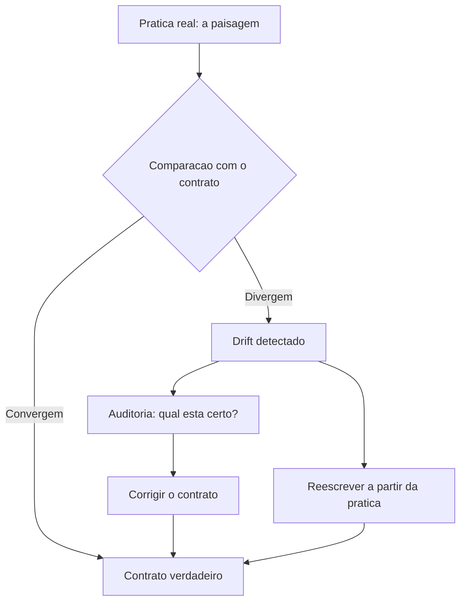

# 9. Drift: como medir e evitar a distância entre o que o time pratica e o que está documentado

## 1. Introducao

> **Objetivo do capítulo**: definir o drift — a distância entre as regras documentadas e a prática real da equipe —, ensinar a medi-lo com métodos concretos e a evitá-lo com mecanismos contínuos, para que a memória de projeto nunca minta sobre o comportamento do time.

## 2. Explica

### 9.1 O contrato que envelhece

Todo arquivo de instrução é, no fundo, um **contrato**: uma promessa de que o comportamento do projeto é o comportamento descrito [1][7]. O `CLAUDE.md` promete que a stack é X, que as convenções são Y, que as proibições são Z [1]. O `AGENTS.md` promete o mesmo para qualquer agente, de qualquer ferramenta [7][9]. As regras condicionais prometem que, naquele território, vale aquela lei [6].

Mas contratos envelhecem. A stack muda (a equipe adotou uma nova biblioteca e esqueceu de atualizar o arquivo), as convenções mudam (a equipe abandonou o padrão antigo sem remover a regra), as proibições mudam (a regra que proibia uma prática foi revogada na prática, mas não no documento) [1][6][7][9]. Quando o documento envelhece e a prática se distancia, instala-se o **drift**.

O drift é o inimigo silencioso da engenharia de instruções por três razões [1][7]:

1. **É gradual**: nenhuma atualização individual "quebra" o contrato; a distância cresce por acumulação de pequenas divergências [1][7].
2. **É invisível**: ninguém percebe que o documento está desatualizado — até que um agente obedece a uma regra morta e produz o comportamento errado [1][7].
3. **É contagioso**: uma regra morta que permanece no documento reduz a confiança do agente em todas as outras regras — o modelo aprende, na prática, que instruções são "sugestões opcionais" [1][7].

A tese deste capítulo: **drift não é um acidente — é o estado padrão de qualquer contrato não medido** [1][7]. A única forma de combatê-lo é tratá-lo como o que ele é: uma métrica de qualidade que precisa de instrumentação contínua, exatamente como a qualidade de código precisa de testes [1][6][9].

### 9.2 O que é drift, exatamente: três dimensões

Para medir drift, é preciso defini-lo com precisão. Três dimensões capturam o fenômeno [1][7][9]:

**Dimensão 1 — Drift de conteúdo (o que o documento diz vs. o que o código expressa).** O documento declara uma stack, uma arquitetura, uma convenção — e o código faz outra coisa. Medir: comparar declarações do documento com evidência do código [1][7]. Exemplo: o `CLAUDE.md` diz "usamos TypeScript estrito" e o `tsconfig.json` tem `strict: false` [1].

**Dimensão 2 — Drift de prática (o que o documento diz vs. o que o time faz).** O documento declara um processo — e o time não o segue. Medir: comparar declarações de processo com evidência do histórico [1][7]. Exemplo: o `AGENTS.md` diz "todo PR tem teste" e o histórico de PRs mostra 30% sem [9].

**Dimensão 3 — Drift de frescor (quanto tempo o documento está sem revisão).** O documento não mudou, mas o projeto mudou muito ao redor. Medir: idade do arquivo vs. taxa de mudança do código que ele governa [1][7][9]. Exemplo: o `CLAUDE.md` não é tocado há 8 meses, mas `src/` recebe 200 commits por mês [1].

As três dimensões são independentes: um documento pode estar fresco (mudou ontem) e errado (diz o oposto do código); ou velho e correto (nada mudou no projeto). O instrumento de medição precisa cobrir as três — e o Capítulo 8 já antecipou os testes da cascata, que são exatamente esse instrumento [1][6][9].

### 9.3 Por que o drift importa: o custo da regra morta

Para entender o preço do drift, é preciso entender o mecanismo da **regra morta** — a regra documentada que a prática abandonou [1][6][7].

O ciclo é vicioso [1][7]:

1. O time escreve uma regra: "Proibido usar biblioteca X; usamos Y".
2. Seis meses depois, o time adota X de volta, por necessidade — sem atualizar o documento.
3. O agente lê a regra antiga e obedece: rejeita X, força Y, ou fica paralisado entre a instrução e o contexto real.
4. O desenvolvedor contorna o agente (faz a edição manualmente ou anula a instrução no chat).
5. O agente aprende que instruções são opcionais. A obediência a **todas** as regras cai.
6. O documento inteiro perde valor — não por estar errado, mas por conter uma única regra morta que provou que instruções mentem.

O passo 5 é o mais caro: a regra morta **contamina o contrato inteiro** [1][7]. O modelo não distingue regra viva de regra morta; ele só percebe que "as instruções nem sempre são confiáveis" — e passa a pesar as instruções contra o código, gerando comportamento inconsistente entre sessões [1][7].

Há ainda o custo humano: o desenvolvedor que corrige o agente toda semana porque "o CLAUDE.md está desatualizado" acumula frustração com a própria ferramenta que deveria ajudá-lo [1]. O drift não degrada só o agente — degrada a confiança do time na engenharia de instruções como um todo [1][7].

### 9.4 Método 1: a auditoria declarativa (documento vs. código)

A primeira família de métodos mede o **drift de conteúdo**: comparar as declarações do documento com a evidência do código [1][7].

O processo é manual, mas sistemático [1][7]:

**Passo 1 — Extraia as declarações verificáveis.** Leia os arquivos de instrução e liste cada afirmação que pode ser checada contra o repositório [1][7]:

- "Usamos TypeScript" → checar `package.json` / extensões de arquivo [1].
- "Testes com Vitest" → checar devDependencies [1].
- "Sem `any` implícito" → checar `tsconfig.json` [1].
- "Camadas: api/domain/infrastructure" → checar a estrutura de diretórios [7].

**Passo 2 — Cheque cada declaração.** Para cada uma, o repositório confirma, contradiz ou não dá evidência [1][7]. Marque confirmada, contradita ou inconclusiva.

**Passo 3 — Calcule o índice de drift.** A métrica simples: `drift_de_conteudo = contraditas / verificáveis` [1][7]. Um índice acima de ~10% indica que o contrato está doente; acima de ~30%, o documento deve ser reescrito, não emendado [1][7].

A auditoria declarativa tem virtude e limite. Virtude: é simples, barata e produz evidência direta [1][7]. Limite: depende de julgamento humano para separar "declaração verificável" de "princípio" — e cobre apenas o que o documento **afirma**, não o que ele **omite** [1][7].

### 9.5 Método 2: a auditoria comportamental (documento vs. prática)

A segunda família mede o **drift de prática**: comparar as declarações de processo com a evidência do histórico de desenvolvimento [1][7][9].

As técnicas concretas [1][7][9]:

**Técnica A — Auditoria de PRs.** Se o documento diz "todo PR deve incluir teste", amostre os PRs dos últimos meses e meça a fração com testes [9]. Se diz "convenções de commit", meça a aderência ao formato [9].

**Técnica B — Auditoria de código novo.** Compare amostras de código recente com as convenções declaradas [1][7]. Se o documento proíbe um padrão e o código recente o usa, o drift é real — e o documento ou a prática precisam mudar [1][7].

**Técnica C — Auditoria de sessões.** Se a ferramenta registra sessões de agente, amostre as instruções que o humano precisou dar para **corrigir** o agente [1]. Correções recorrentes do mesmo tipo indicam regra morta ou regra ausente [1].

**Técnica D — O teste do novato.** Peça a um membro novo do time (ou a um agente "frio") para executar as instruções do documento literalmente [1][9]. Cada lugar onde a execução falha, trava ou contradiz a realidade é uma instância de drift [1][9].

A técnica D merece destaque: o novato não tem o conhecimento implícito que o veterano compensa automaticamente [9]. Se o documento diz "rode os testes com `npm test`" e o comando real é `pnpm vitest`, o veterano sabe; o novato e o agente não [1][9]. O teste do novato é o detector mais fiel de drift porque mede o **comportamento efetivo do contrato**, não a intenção [1][9].

### 9.6 Método 3: a medição de frescor (documento vs. tempo)

A terceira família mede o **drift de frescor**: a idade do documento vs. a taxa de mudança do território que ele governa [1][7].

O instrumento mais simples é o **dashboard de frescor** — uma tabela, gerada por script, com colunas [1][7]:

| Arquivo de instrução | Última edição | Commits no território (30d) | Risco |
|---|---|---|---|
| `AGENTS.md` (raiz) | 2026-05-10 | 412 | 🟡 |
| `CLAUDE.md` (raiz) | 2026-01-22 | 412 | 🔴 |
| `services/pagos/AGENTS.md` | 2026-07-28 | 89 | 🟢 |
| `apps/web/AGENTS.md` | 2026-04-15 | 156 | 🟡 |

A heurística de risco: um arquivo de instrução não editado há mais de N meses (limiar típico: 2-3) em um território com alta atividade é candidato a drift [1][7]. A regra não é automática — um território estável pode legitimamente ter instruções antigas — mas o dashboard transforma o drift de invisível em visível [1][7].

A medição de frescor é a mais barata das três (um script de git) e serve como **triagem**: o dashboard aponta onde as auditorias caras (declarativa e comportamental) devem ser feitas [1][7].

### 9.7 A prevenção: o fluxo de revisão de instruções

Medir é necessário; prevenir é melhor [1][7]. A prevenção do drift segue o mesmo princípio da prevenção de bugs: **processo contínuo em vez de auditoria periódica** [1][6][9].

O fluxo de revisão de instruções, na prática consolidada [1][7]:

1. **O PR que toca a instrução**: qualquer mudança de stack, arquitetura ou processo **exige** atualizar o arquivo de instrução correspondente no mesmo PR [1][7]. A regra de ouro: "quem muda o código, muda o contrato" [1].
2. **O checklist de instruções no template de PR**: o template pergunta explicitamente "este PR altera alguma convenção documentada no AGENTS.md / CLAUDE.md? Se sim, atualize-o" [1][7][9].
3. **A revisão de regras mensal**: uma reunião curta (ou um PR de revisão) dedicada a ler os arquivos de instrução contra a prática recente — o ritmo humano de "manutenção do contrato" [1][7].
4. **O commit de instruções versionado**: instruções são código — passam por review, recebem PR, têm histórico [1][7]. Um `AGENTS.md` editado direto na main, sem review, é um convite ao drift [1][7].

O ponto 4 é cultural e técnico ao mesmo tempo: muitas equipes tratam os arquivos de instrução como "anotações" fora do fluxo de revisão, e é exatamente isso que permite que regras contraditórias e mortas sobrevivam [1][7]. Tratar instruções como código (com review, teste e histórico) é o passo cultural mais importante da prevenção [1][7].

### 9.8 A detecção automática: o pipeline anti-drift

A prevenção humana é insuficiente sozinha — precisa da rede de segurança automática: o **pipeline anti-drift** no CI [1][6][9]. Os componentes, retomando e estendendo o teste da cascata do Capítulo 8 [1][6][9]:

**Componente 1 — Linter de instruções.** Parseia os arquivos de instrução e valida estrutura: frontmatter válido (regras condicionais), referências resolvíveis (`@import` aponta para arquivos existentes), sem duplicatas óbvias [1][6].

**Componente 2 — Verificador de declarações.** Para as declarações verificáveis por padrão (stack declarada em `package.json` vs. mencionada no documento), compara e reporta divergência [1][7].

**Componente 3 — Verificador de frescor.** O dashboard de frescor (Seção 9.6) roda no CI e falha (ou avisa) quando um território ativo tem instrução obsoleta [1][7].

**Componente 4 — Verificador de práticas.** Heurísticas sobre o histórico: aderência a convenções de commit declaradas, presença de testes quando declarada, comandos do documento que existem nos scripts do projeto [1][7][9].

**Componente 5 — Teste da cascata.** O teste composto do Capítulo 8: completude, duplicação, contradição, frescor e rastreabilidade entre camadas [1][6][9].

O pipeline anti-drift transforma a pergunta aberta "será que nossas instruções estão corretas?" em um sinal binário no CI [1][6][9]. E, como todo teste bom, ele muda o comportamento: o time passa a **saber** quando o contrato degrada, em vez de descobrir quando um agente obedece a uma regra morta [1][9].

### 9.9 O custo de oportunidade: quando reescrever em vez de emendar

Nem todo drift deve ser combatido com emendas [1][7]. Quando o índice de drift é alto (≥ ~30% nas três dimensões), o documento não está desatualizado — está **estruturalmente errado**: sua organização, seu escopo e seu nível de detalhe não servem mais [1][7]. Emendar um documento estruturalmente errado é caro e inútil: cada emenda convive com o esqueleto quebrado [1][7].

Os sinais de que a reescrita é o caminho [1][7]:

- O documento cresce a cada emenda e continua errado [1].
- As regras do documento são contornadas sistematicamente ("ninguém segue o AGENTS.md mesmo") [1][7].
- O território mudou de natureza (nova stack, novo domínio, novo formato de entrega) [7].
- O documento perdeu a confiança do time — o sintoma mais caro de todos [1].

A reescrita, quando indicada, deve seguir o mesmo processo de design da escrita original: partir da prática real (não da documentação anterior), mapear os territórios (Capítulo 8) e escrever a constituição a partir da observação do que o time **de fato** faz [1][7][9]. A lição de ouro: **a prática é a fonte da verdade; o documento é a sua fotografia** [1][7]. Quando a fotografia envelhece demais, não se retoca a foto — tira-se outra [1][7].

### 9.10 A cultura anti-drift: instruções como dívida técnica

O capítulo fecha com a dimensão cultural, porque nenhuma ferramenta sobrevive a uma cultura que negligencia o contrato [1][7].

A mentalidade que previne o drift, na prática das equipes maduras [1][7][9]:

**"Instruções são dívida técnica."** Como qualquer dívida, instruções desatualizadas acumulam juros: cada sessão de agente que obedece a regra morta cobra um pouco mais [1][7]. A diferença é que a dívida de instruções é **invisível até o desastre** — não quebra o build, não falha o teste; apenas degrada silenciosamente a qualidade de todo trabalho dirigido por agente [1][7].

**"O contrato é propriedade da equipe."** Não é do dono do repositório nem do "dono da IA" — é da equipe que o código governa [1][7]. Cada membro tem o dever de atualizar o contrato quando descobre divergência — e a autoridade para fazê-lo [1][7].

**"A regra morta é um bug."** Reportar uma regra morta é como reportar um bug de produção: merece um ticket, um fix e uma verificação [1][7]. A gravidade não está na regra em si, mas na contaminação de confiança que ela causa [1][7].

**"Medir é respeitar o agente."** O agente só pode obedecer ao que o contrato declara [1]. Manter o contrato verdadeiro é a forma mais concreta de respeito ao instrumento que a equipe decidiu usar [1].

A cultura anti-drift é a ponte para o Capítulo 10: a engenharia da memória de projeto como disciplina completa — não um arquivo a escrever, mas um sistema a operar, medir e melhorar continuamente [1][7][9].

### 9.10 O Drift e a Relação com a Revisão de Código

O drift da memória de projeto tem um ponto de interseção natural com a **revisão de código** — e a prática consolidada os conecta [1][7]: cada PR que muda o comportamento do projeto é também uma oportunidade de verificar o contrato [1][7].

A integração prática [1][7]: o template de PR ganha a seção "contrato" — o autor declara se o PR altera alguma convenção documentada; o revisor verifica a declaração; e o pipeline anti-drift confirma automaticamente (Capítulo 9, Seção 9.8) [1][7][9]. A revisão humana pega o drift semântico — a mudança que o linter não detecta porque não há regra declarada para ela; o pipeline pega o drift mecânico — a regra declarada que o código contradiz [1][7][9].

A lição do capítulo: a revisão de código é o **ponto de solda** entre a prática e o contrato [1][7]. É no momento da revisão que o time percebe "este PR faz algo que o `AGENTS.md` não prevê" — e decide entre atualizar o contrato ou questionar o PR [1][7].

### 9.11 O Caso de Estudo: a Regra Fantasma

Para fechar o capítulo com uma aplicação concreta, o caso da **regra fantasma** — a regra que continuava no documento muito depois de a prática a abandonar [1][7]. O cenário: o `CLAUDE.md` proibia uma biblioteca; a equipe a readotou silenciosamente; e o agente, obediente à regra morta, refutava a biblioteca em todo novo código — criando inconsistência entre o que o agente produzia e o que a equipe esperava [1][7].

O diagnóstico: o drift de conteúdo (Capítulo 9, Seção 9.4) detectou a contradição entre a regra declarada e o código real [1][7]. O tratamento: a regra foi removida do contrato e substituída pela convenção real; o dashboard de frescor passou a monitorar aquele arquivo [1][7].

A lição do caso: a regra fantasma não é um erro de redação — é um **erro de processo** [1][7]. Ela sobreviveu porque ninguém tinha a responsabilidade de manter o contrato fiel; o pipeline anti-drift criou a responsabilidade [1][7]. O caso demonstra a tese do capítulo: drift não é acidente, é estado padrão — e medir é o primeiro passo para corrigir [1][7].

### 9.12 O Drift e a Medição de Custo em Tokens

O drift tem um custo mensurável — e a métrica de tokens torna o problema visível para a liderança [1][14]. O cálculo da prática [1][14]: cada sessão de agente com memória driftada desperdiça tokens de duas formas — tokens gastos com regras mortas que o agente obedece e depois o humano desfaz, e tokens gastos em recontextualização porque a memória não diz a verdade atual [1][14].

O exercício de quantificação [1][14]: estime o custo médio por correção de agente (a edição que o humano faz porque o agente seguiu regra errada) e multiplique pela frequência semanal; compare com o custo da manutenção anti-drift (a revisão trimestral e o pipeline no CI) [1][14]. Na maioria dos cenários reais, a manutenção custa uma fração das correções que previne [1][14].

A lição do capítulo: o anti-drift não é um custo — é um **investimento com ROI mensurável** [1][14]. A métrica de tokens dá ao engenheiro a linguagem para defender o orçamento da memória de projeto [1][14].

### 9.13 A Cultura Anti-Drift e a Liderança

O drift não se combate apenas com pipelines — combate-se com **liderança** [1][7]. A prática consolidada identifica os comportamentos de liderança que sustentam a cultura anti-drift [1][7]:

1. **Dar o exemplo**: a liderança usa a memória de projeto, consulta o contrato e corrige-o quando encontra divergência [1][7].
2. **Proteger o tempo**: a revisão de instruções tem espaço no planejamento — não é sobra de tempo livre [1][7].
3. **Exigir a verdade**: quando o contrato e a prática divergem, a liderança pergunta "qual dos dois está certo?" — em vez de ignorar a divergência [1][7].
4. **Celebrar a correção**: atualizar o `AGENTS.md` não é burocracia — é manutenção de qualidade, e merece reconhecimento [1][7].

A lição final: a cultura anti-drift é a manifestação prática da disciplina — e ela começa na liderança, não no pipeline [1][7]. O pipeline detecta; a liderança sustenta [1][7].

### 9.14 O Drift e a Relação com a Dívida Técnica de Conhecimento

O drift da memória de projeto é uma espécie de **dívida técnica de conhecimento** — e a prática a trata como tal [1][7]. A dívida técnica clássica (código) tem juros mensuráveis: cada mudança fica mais cara sobre uma base degradada. A dívida de conhecimento tem o mesmo perfil [1][7]: cada sessão de agente sobre um contrato driftado fica mais cara (correções, retrabalho), e a base fica mais difícil de reparar (o contrato mente em múltiplas frentes) [1][7].

O tratamento recomendado [1][7]: a dívida de conhecimento entra no **backlog com prioridade** — não é tarefa de sobra; a reescrita (Capítulo 9, Seção 9.9) é planejada como refatoração; e a prevenção (o pipeline anti-drift) é a forma de não contrair dívida nova [1][7].

A lição do capítulo: tratar o drift como dívida dá ao problema a **linguagem da engenharia** — priorização, juros, pagamento — que a liderança técnica entende [1][7].

### 9.15 A Medição Contínua e o Ritmo de Revisão

O pipeline anti-drift detecta; a revisão humana corrige; mas o **ritmo** precisa ser definido [1][7][9]. A prática consolidada recomenda [1][7][9]: o pipeline roda no CI (contínuo, automático); o dashboard é lido semanalmente (triagem rápida); a revisão profunda (auditoria declarativa + comportamental) é trimestral; e a reescrita, quando indicada, é agendada como projeto [1][7][9].

A cadência tem uma justificativa [1][7][9]: o drift cresce com o ritmo de mudança do projeto — medir com a mesma frequência que se muda é o equilíbrio entre custo e proteção [1][7][9].

A lição do capítulo: a medição contínua sem ritmo de revisão é ruído; a revisão sem medição é cega [1][7][9]. O engenheiro que combina as duas mantém o contrato verdadeiro com custo mínimo [1][7][9].

### 9.16 O Drift e a Cultura de Transparência

O drift sobrevive em culturas que escondem divergências [1][7]. A prática consolidada recomenda a **cultura de transparência** [1][7]: quando o contrato e a prática divergem, a divergência é discutida em aberto — não escondida por constrangimento; o painel de drift é público para a equipe (não relatório para chefia); e a pergunta padrão nas revisões é "o contrato ainda diz a verdade?" [1][7].

A transparência tem um efeito de reforço [1][7]: quando a divergência é discutida, a correção vira prática normal; quando é escondida, o contrato morre em silêncio — e o agente obedece a regras mortas sem ninguém perceber [1][7].

A lição final do capítulo: o anti-drift é 20% ferramenta e 80% cultura [1][7]. O pipeline detecta; só a cultura corrige [1][7].

### 9.17 O Drift e a Medição de Cobertura

Uma dimensão do drift que a prática mede é a **cobertura** — a fração das regras documentadas que são verificáveis e verificadas [1][7]. A métrica [1][7]: das N regras do contrato, quantas têm evidência de uso no código ou no histórico? [1][7] A cobertura baixa tem dois significados possíveis [1][7]: regras mortas (o documento mente) ou regras que ainda não foram exercitadas (o documento é novo) [1][7].

A prática recomendada [1][7]: a cobertura entra no painel de drift (Capítulo 9, Seção 9.6) como métrica separada; a queda de cobertura dispara auditoria (Seção 9.4); e a cobertura alimenta a priorização da reescrita (Seção 9.9) [1][7].

A lição do capítulo: a cobertura é o termômetro da mentira do contrato [1][7]. Regra sem evidência é suspeita até prova em contrário [1][7].

### 9.18 O Drift e a Automatização da Correção

A correção do drift pode ser **parcialmente automatizada** [1][7]: o pipeline detecta a divergência (Seção 9.8) e propõe a correção [1][7]. Os tipos de correção automatizável [1][7]: a regra contradita pelo código pode ser marcada para revisão com a evidência anexada; o comando do documento que não existe nos scripts pode ser atualizado automaticamente; e a duplicação entre camadas pode ser sinalizada com a proposta de canonização (Capítulo 8, Seção 8.7) [1][7].

O limite da automação [1][7]: a correção **semântica** — decidir se a regra ou o código está errado — é humana [1][7]. A máquina apresenta o fato; o humano decide a verdade [1][7].

A lição do capítulo: a automação da correção reduz o custo do anti-drift, mas não substitui o julgamento [1][7]. O pipeline propõe; o humano dispõe [1][7].

### 9.19 O Drift e a Relação com a Escala do Time

O drift se comporta de forma diferente conforme a **escala do time** [1][7]: em time pequeno (2-5 pessoas), o conhecimento tácito cobre as lacunas — o drift é tolerável por um tempo; em time médio (6-20), o tácito não alcança todos — o drift começa a cobrar; em time grande (20+), o tácito é inútil — o contrato é a única memória, e o drift é custo puro [1][7].

A implicação prática [1][7]: o investimento em anti-drift deve crescer com o time; a equipe pequena pode começar com o pipeline mínimo (Seção 9.8, Componentes 1-3); e a equipe grande exige o pipeline completo mais a revisão trimestral (Seção 9.15) [1][7].

A lição final do capítulo: o anti-drift não é um tamanho único — é uma função da escala [1][7]. O engenheiro calibra a instrumentação ao tamanho do time e ao risco [1][7].

### 9.20 O Drift e a Relação com o Onboarding

O drift tem um efeito devastador no **onboarding** [1][7][9]: o novo membro lê o contrato como verdade — e o contrato driftado ensina o errado [1][7][9]. O novato que aprende convenção morta carrega o erro por meses; o agente novo que inicia com contrato driftado produz trabalho errado desde a primeira sessão [1][7][9].

A prática recomendada [1][7][9]: o onboarding (Capítulo 1, Seção 5.18) inclui a verificação de frescor do contrato (Capítulo 9, Seção 9.6); e a auditoria de onboarding roda o teste do novato (Capítulo 9, Seção 9.5, Técnica D) — se o novato falha onde o contrato deveria ajudar, o drift é a causa provável [1][7][9].

A lição do capítulo: o drift transforma o onboarding em doutrinação do erro [1][7][9]. A memória verdadeira é a base do aprendizado certo — para humanos e agentes [1][7][9].

### 9.21 O Drift e a Priorização da Correção

Quando o painel acusa múltiplas divergências, a correção precisa de **priorização** [1][7]: nem todo drift é igual [1][7]. Os critérios [1][7]: o **impacto** (qual divergência causa mais dano — uma regra de segurança morta pesa mais que uma preferência de estilo); a **frequência** (qual divergência o agente encontra com mais frequência); e o **custo** (qual correção é mais barata) [1][7].

A matriz de priorização [1][7]: impacto alto + frequência alta = correção imediata; impacto alto + frequência baixa = correção agendada; impacto baixo = correção na próxima revisão (Capítulo 9, Seção 9.15) [1][7].

A lição do capítulo: a correção do drift é uma fila — e a fila se ordena por risco [1][7]. O engenheiro que prioriza por impacto protege o que importa primeiro [1][7].

### 9.22 O Drift e o Ciclo de Melhoria Contínua

O anti-drift é a manifestação do **ciclo de melhoria contínua** na memória de projeto [1][7]: medir (o pipeline), analisar (o painel), corrigir (a revisão) e prevenir (a regra nova ou a reescrita) [1][7]. O ciclo é o mesmo do desenvolvimento de software — a memória de projeto é software, e o ciclo de melhoria é o seu processo [1][7].

A lição final do capítulo: o drift não é derrotado uma vez — é **gerido continuamente** [1][7]. O engenheiro que instala o ciclo transforma a manutenção da memória de fardo em rotina [1][7].

### 9.23 O Drift e a Relação com a Segurança

O drift tem uma dimensão de **segurança** que a prática trata com seriedade [1][7][17]: a regra de segurança morta é mais perigosa que a ausência — o agente acredita estar protegido por uma regra que não existe [1][7][17]. O contrato que ainda declara uma proibição abandonada dá ao time uma falsa sensação de cobertura [1][7][17].

A prática recomendada [1][7][17]: as regras de segurança são as primeiras da auditoria de drift (Capítulo 9, Seção 9.4); a revisão de segurança (Capítulo 9, Seção 9.21) prioriza o impacto na proteção; e a remoção de uma regra de segurança é tratada como mudança crítica — com revisão e registro [1][7][17].

A lição do capítulo: o drift de regras de segurança é um risco de compliance — e o anti-drift é um controle de segurança [1][7][17].

### 9.24 O Drift e o Encerramento do Capítulo

O capítulo do drift se encerra com a consolidação final [1][7]: o drift é o estado padrão de contratos não medidos; a medição tem três dimensões (conteúdo, prática, frescor); a prevenção combina processo e pipeline; e a cultura é o fator decisivo [1][7][9]. A mensagem que atravessa o capítulo: **a memória de projeto é uma promessa — e a promessa precisa de verificação contínua** [1][7][9].

### 9.25 O Drift e a Relação com a Documentação Técnica

O drift não atinge apenas os arquivos de instrução — atinge a **documentação técnica** como um todo [1][7]: a documentação driftada (que descreve o sistema antigo) e a memória driftada (que governa o comportamento antigo) são faces do mesmo problema [1][7]. A prática recomendada [1][7]: o anti-drift da memória (Capítulo 9, Seção 9.8) se estende à documentação crítica; e o teste do novato (Capítulo 9, Seção 9.5) cobre os dois [1][7].

A lição do capítulo: a memória de projeto é o coração da documentação — e o anti-drift do coração protege o corpo [1][7].

### 9.26 O Drift e a Síntese do Capítulo

O capítulo do drift se fecha com a síntese [1][7][9]: o drift é o estado padrão dos contratos não medidos; as três dimensões (conteúdo, prática, frescor) orientam a medição; a prevenção combina processo e pipeline; e a cultura decide [1][7][9]. A prática é a fonte da verdade; o documento é a fotografia — e a revelação é contínua [1][7].

A lição do capítulo: a memória de projeto é uma promessa — e o anti-drift é a verificação da promessa [1][7][9].

### 9.27 O Drift e o Fechamento

O capítulo do drift se encerra com o hábito [1][7]: a pergunta "o contrato ainda diz a verdade?" (Seção 9.16) tornada rotina [1][7]. O engenheiro que pergunta, mede e corrige mantém a memória fiel — e a fidelidade é o que sustenta a confiança do time na disciplina (Seções 9.3, 9.13) [1][7].

### 9.28 O Drift e a Prática

O combate ao drift é prática diária (Capítulo 9, Seções 9.7, 9.22) [1][7]: quem muda o código, muda o contrato; quem encontra divergência, corrige [1][7]. A prática pequena e contínua mantém a memória verdadeira — a condição de toda a disciplina [1][7].

### 9.29 O Drift e o Próximo Passo

O próximo passo após o drift é a disciplina completa (Capítulo 10): medição, cultura e governança se reúnem [1][7]. A sequência conclui a jornada da memória [1][7].

### 9.30 O Fechamento do Drift

O drift está controlado (Capítulo 9, Seção 9.26): a medição, a prevenção e a cultura [1][7][9]. O próximo passo é a disciplina — a síntese de tudo [1][7][9].

### 9.31 A Síntese do Drift

O anti-drift é a verificação contínua da promessa da memória [1][7][9]. O capítulo entregou o instrumento; a disciplina (Capítulo 10) reúne tudo [1][7][9].

### 9.32 O Encerramento

O capítulo do drift encerra com a verdade mantida [1][7]: a memória que não mente, porque é medida [1][7][9]. A disciplina a sustenta [1][7].

### 9.33 A Ponte

O anti-drift é a ponte entre a memória e a sua verdade [1][7]. O capítulo 9 a construiu; a disciplina a opera [1][7].

### 9.34 A Continuidade

A memória verdadeira é a base da continuidade — do agente, do time e da disciplina [1][7]. O capítulo 9 entregou a verdade; o capítulo 10 entrega a disciplina [1][7][9].

## 3. Ilustra

### 3.1 A Analogia da Fotografia e da Pratica

A analogia da fotografia ilumina o drift [1][7]. A pratica e a realidade; o documento e a fotografia da realidade [1][7]. Toda fotografia envelhece: a paisagem muda, e a foto mostra o passado [1][7]. O drift e a diferenca entre a paisagem atual e a fotografia [1][7].



O diagrama mostra o ciclo anti-drift: comparar, detectar, decidir e corrigir [1][7].

## 4. Tecnica

### 4.1 Modelando o Indice de Drift

O primeiro instrumento do engenheiro anti-drift e medir [1][7]:

```python
from dataclasses import dataclass


@dataclass
class Declaracao:
    texto: str
    verificavel: bool
    confirmada: bool = False


def indice_drift(declaracoes: list) -> dict:
    verificaveis = [d for d in declaracoes if d.verificavel]
    contraditas = [d for d in verificaveis if not d.confirmada]
    taxa = round(100 * len(contraditas) / max(len(verificaveis), 1), 1)
    return {
        "verificaveis": len(verificaveis),
        "contraditas": len(contraditas),
        "taxa_drift_pct": taxa,
        "saudavel": taxa <= 10,
    }


if __name__ == "__main__":
    decls = [
        Declaracao("Usamos TypeScript", True, True),
        Declaracao("Testes com Vitest", True, False),
        Declaracao("Sem any implicito", True, True),
    ]
    print(indice_drift(decls))
```

O modelo demonstra a medicao da Secao 9.4 [1][7].

## 5. Aplica

### 5.1 Onde Isso Vive no Mundo Real

O combate ao drift vive no pipeline de qualidade de times maduros [1][7]. O linter de instrucoes valida a estrutura (Secao 9.8); o dashboard de frescor tria os arquivos obsoletos (Secao 9.6); e a revisao trimestral faz a auditoria profunda (Secao 9.15) [1][7]. A combinacao e o pipeline anti-drift em producao [1][7].

### 5.2 O Erro Comum do Iniciante

O erro mais comum e medir sem corrigir [1][7]: o dashboard acusa o drift, mas ninguem prioriza a correcao [1][7]. O antídoto e a fila de priorizacao por impacto (Secao 9.21) [1][7]. Outro erro classico e tratar o anti-drift como campanha periodica em vez de ciclo continuo (Secao 9.22) [1][7].

### 5.3 O Padrao Profissional em 2026

O padrao profissional trata o drift como divida tecnica de conhecimento [1][7]: medida, priorizada e paga no backlog (Secao 9.14) [1][7]. A cultura de transparencia (Secao 9.16) sustenta a pratica, e o pipeline (Secao 9.8) detecta antes que a regra morta contamine a confianca no contrato (Secao 9.3) [1][7].

## 6. Conclusao

Este capítulo definiu o drift em três dimensões — conteúdo, prática e frescor [1][7] — e apresentou os métodos de medição correspondentes: a auditoria declarativa (documento vs. código), a comportamental (documento vs. histórico) e o dashboard de frescor (documento vs. tempo) [1][7][9]. A prevenção combina o fluxo de revisão de instruções (instruções como código) com o pipeline anti-drift no CI [1][6][9]. E quando o índice de drift é alto, a resposta é reescrever a partir da prática, não emendar a fotografia [1][7]. A regra que atravessa o capítulo: **a prática é a fonte da verdade; o documento é a fotografia — e toda fotografia precisa de revelação contínua** [1][7]. O Capítulo 10 consolida tudo na disciplina final da série: a engenharia da memória de projeto.

## 7. Referencias

[1] ANTHROPIC. **Memory: how Claude remembers your project**. Claude Code Documentation, 2025-2026. Disponivel em: https://docs.anthropic.com/en/docs/claude-code/memory. Acesso em: 5 ago. 2026.
[2] ANTHROPIC. **Overview: Claude Code**. Claude Code Documentation, 2025-2026. Disponivel em: https://docs.anthropic.com/en/docs/claude-code/overview. Acesso em: 5 ago. 2026.
[3] AGENTS.MD. **AGENTS.md: the standard for AI agent instructions**. Agentic AI Foundation / OpenAI, ago. 2025. Disponivel em: https://agents.md/. Acesso em: 5 ago. 2026.
[4] LINUX FOUNDATION. **Linux Foundation announces the formation of the Agentic AI Foundation**. Linux Foundation Press Release, 9 dez. 2025. Disponivel em: https://www.linuxfoundation.org/press/linux-foundation-announces-the-formation-of-the-agentic-ai-foundation. Acesso em: 5 ago. 2026.
[5] AGENTIC AI FOUNDATION. **Agentic AI Foundation official portal**. AAIF, 2025-2026. Disponivel em: https://aaif.io/. Acesso em: 5 ago. 2026.
[6] OSMANI, Addy. **15 AGENTS.md - engineering guide to AGENTS.md**. Addy Osmani, 2025-2026. Disponivel em: https://addyosmani.com/agents/15-agents-md/. Acesso em: 5 ago. 2026.
[7] AUGMENT CODE. **How to build AGENTS.md: construction guide**. Augment Code Guides, 2025-2026. Disponivel em: https://www.augmentcode.com/guides/how-to-build-agents-md. Acesso em: 5 ago. 2026.
[8] CURSOR. **Rules: Cursor Documentation**. Cursor / Anysphere, 2025-2026. Disponivel em: https://cursor.com/docs/rules. Acesso em: 5 ago. 2026.
[9] AGYN. **AGENTS.md vs CLAUDE.md: does Claude Code or Codex read both?**. Agyn Blog, jun. 2026. Disponivel em: https://agyn.io/blog/claude-md-agents-md-compatibility. Acesso em: 5 ago. 2026.
[10] OPENAI. **Codex: AGENTS.md and coding agents**. OpenAI Documentation, 2025-2026. Disponivel em: https://openai.com/index/introducing-codex/. Acesso em: 5 ago. 2026.
[11] GITHUB. **GitHub Copilot: repository instructions and AGENTS.md support**. GitHub Documentation, 2025-2026. Disponivel em: https://docs.github.com/en/copilot/customizing-copilot/adding-repository-custom-instructions. Acesso em: 5 ago. 2026.
[12] GITHUB. **GitHub Copilot Coding Agent: reading repository instructions**. GitHub Changelog, 2025-2026. Disponivel em: https://github.blog/. Acesso em: 5 ago. 2026.
[13] ANTHROPIC. **Writing tools for AI agents - using AI agents**. Anthropic Engineering Blog, set. 2025. Disponivel em: https://www.anthropic.com/engineering/writing-tools-for-agents. Acesso em: 5 ago. 2026.
[14] ANTHROPIC. **Effective context engineering for AI agents**. Anthropic Engineering Blog, set. 2025. Disponivel em: https://www.anthropic.com/engineering/effective-context-engineering-for-ai-agents. Acesso em: 5 ago. 2026.
[15] ANTHROPIC. **Introducing the Model Context Protocol**. Anthropic News, 25 nov. 2024. Disponivel em: https://www.anthropic.com/news/model-context-protocol. Acesso em: 5 ago. 2026.
[16] MODEL CONTEXT PROTOCOL. **Architecture**. MCP Specification 2025-11-25, 25 nov. 2025. Disponivel em: https://modelcontextprotocol.io/specification/2025-11-25/architecture. Acesso em: 5 ago. 2026.
[17] LINUX FOUNDATION. **Agentic AI Foundation: governance of foundational agentic infrastructure**. Linux Foundation Blog, dez. 2025. Disponivel em: https://www.linuxfoundation.org/blog/. Acesso em: 5 ago. 2026.
[18] CURSOR. **Best practices for rules and context**. Cursor Documentation, 2025-2026. Disponivel em: https://cursor.com/docs/context/rules. Acesso em: 5 ago. 2026.
[19] AIDER. **AGENTS.md support and multi-tool interoperability**. Aider Documentation, 2025-2026. Disponivel em: https://aider.chat/docs/repomap.html. Acesso em: 5 ago. 2026.
[20] ANTHROPIC. **Claude Code best practices: memory and configuration**. Anthropic Engineering Blog, 2025-2026. Disponivel em: https://www.anthropic.com/engineering/claude-code-best-practices. Acesso em: 5 ago. 2026.
