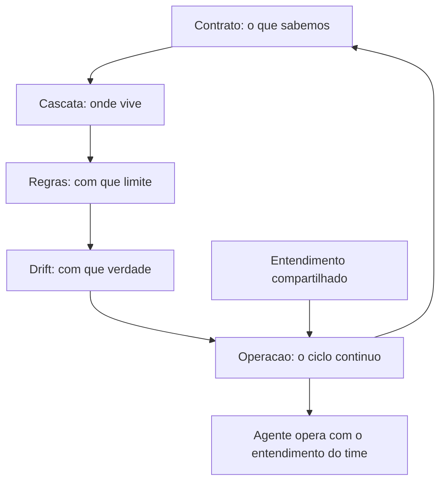

# 10. A engenharia da memória de projeto: a disciplina que mantém o agente e o time no mesmo entendimento

## 1. Introducao

> **Objetivo do capítulo**: consolidar os nove capítulos anteriores em uma disciplina completa — a engenharia da memória de projeto — definindo seus princípios, seu processo de design, seu ciclo de operação e seu lugar na carreira de quem constrói sistemas de desenvolvimento dirigido por IA em produção.

## 2. Explica

### 10.1 O problema que une todos os capítulos

Os capítulos anteriores trataram de peças: o `CLAUDE.md` como memória [1], o `AGENTS.md` como padrão neutro [7][9], as regras condicionais como legislação local [6], a cascata como arquitetura [1][7][9], o drift como doença [1][7]. Este capítulo trata do **todo**: o sistema que integra essas peças para responder a uma única pergunta — *como garantir que qualquer agente, de qualquer ferramenta, em qualquer momento, opere com o mesmo entendimento do time?* [1][7][9]

A pergunta define o problema central da instrução em escala: o **entendimento compartilhado** [1][7]. Em um projeto pequeno, o entendimento vive na cabeça de duas ou três pessoas; em uma empresa com dez equipes e quarenta repositórios, o entendimento precisa de um **suporte material** — e esse suporte é a memória de projeto [1][7].

A memória de projeto é, portanto, um **sistema sociotécnico**: metade arquivos e metade cultura [1][7]. Os arquivos sem a cultura driftam (Capítulo 9) [1][7]; a cultura sem os arquivos depende de conhecimento implícito que não sobrevive à rotatividade nem alcança os agentes [1][7]. A engenharia da memória de projeto é a disciplina que projeta, opera e governa esse sistema [1][7][9].

A tese do capítulo: **memória de projeto não é um documento para escrever — é um sistema para operar** [1][7]. Como todo sistema, tem componentes, ciclos de vida, métricas de saúde e modos de falha. O engenheiro de memória não é um "escritor de CLAUDE.md"; é o operador de um sistema de conhecimento que mantém humanos e agentes sincronizados [1][7].

### 10.2 Os quatro princípios da memória de projeto

Quatro princípios, derivados dos capítulos anteriores, governam o design de toda memória de projeto [1][6][7][9]:

**Princípio 1 — A hierarquia espelha o território.** A organização da memória (constituição, leis federais, leis locais) deve espelhar a organização do repositório (Capítulo 8) [1][7][9]. Se o código está em territórios, a memória também está; se a fronteira de diretório muda, a fronteira de memória muda junto [7][9].

**Princípio 2 — O detalhe vive perto do código.** Cada informação pertence à camada mais próxima do código que ela governa [1][7][9]. A stack global vive na raiz; a convenção de um módulo vive no diretório do módulo; a regra de um subconjunto de arquivos vive na regra condicional (Capítulo 7) [6][9].

**Princípio 3 — A referência é mais barata que a cópia.** Duplicação gera drift (Capítulo 9) [1][7]. Toda informação tem um dono único; as demais camadas referenciam, importam ou citam [1][7]. O `@import` do Claude Code [1] e a convenção de citação entre camadas são as ferramentas do princípio [1][7].

**Princípio 4 — A memória é um contrato, não um log.** A memória de projeto declara comportamento esperado — não registra tudo o que aconteceu [1][7]. Cada linha é uma promessa verificável; linhas não verificáveis são ruído [1][7][9]. O que "nunca colocar" (Capítulo 3) é tão importante quanto o que colocar [1].

Os quatro princípios se reforçam mutuamente: sem hierarquia (P1), o detalhe não tem onde morar (P2); sem dono único (P3), o drift prolifera (Capítulo 9) [1][7]; e sem o caráter de contrato (P4), a memória incha até virar ruído [1][7].

### 10.3 O processo de design: da observação ao contrato

Projetar a memória de projeto de um repositório — novo ou existente — segue um processo de cinco fases, consolidado da prática dos capítulos anteriores [1][7][9]:

**Fase 1 — Observar a prática.** Antes de escrever qualquer linha, mapeie o que o time **de fato** faz: stack real, comandos reais, convenções reais, armadilhas reais [1][7]. A prática é a fonte da verdade (Capítulo 9) [1][7]. Ferramentas: leitura de `package.json`, `tsconfig`, scripts, histórico de PRs, conversas com a equipe [1][7].

**Fase 2 — Mapear os territórios.** Identifique as fronteiras onde o comportamento muda: diretórios com stacks diferentes, convenções diferentes, equipes diferentes (Capítulos 7 e 8) [6][9].

**Fase 3 — Desenhar a cascata.** Decida onde cada camada mora: constituição na raiz, leis locais nos territórios, regras condicionais nos subconjuntos finos [1][6][9]. Defina o dono único de cada assunto (P3) [1][7].

**Fase 4 — Escrever por camada.** Redija cada camada com as técnicas dos Capítulos 2-7: memória [1], o que colocar e o que nunca colocar [1], neutralidade [7][9], condicionalidade [6]. Cada camada deve ser curta, verificável e sem duplicação [1][7].

**Fase 5 — Instrumentar a operação.** Instale o pipeline anti-drift (Capítulo 9): linter de instruções, verificador de declarações, dashboard de frescor, teste da cascata [1][6][9]. Sem instrumentação, o contrato envelhece no dia seguinte à assinatura [1][9].

A fase 1 é a mais importante e a mais pulada [1][7]. A maioria das equipes escreve a memória de projeto a partir do que **deseja** que o projeto seja — e o resultado é um contrato que mente desde a primeira versão [1][7]. A memória deve nascer da observação, não da imaginação [1][7].

### 10.4 O ciclo de operação: a memória como sistema vivo

Uma vez projetada, a memória de projeto entra em um ciclo de operação contínuo [1][7][9]. O ciclo tem quatro estágios, análogos ao ciclo de vida do software:

**Estágio 1 — Autor: a mudança de contrato.** Toda mudança de stack, arquitetura ou processo gera uma mudança de memória [1][7]. O gatilho é o mesmo do Capítulo 9: quem muda o código, muda o contrato [1][7].

**Estágio 2 — Revisar: a mudança é verificada.** A mudança de memória passa por review como código: outro humano lê, questiona, aprova [1][7]. A revisão pega regras ambíguas, contraditórias e não verificáveis antes de chegarem ao contrato [1][7].

**Estágio 3 — Medir: a saúde é verificada.** O pipeline anti-drift roda no CI: declarações, frescor, cascata [1][6][9]. A memória entra em estado de "verde" ou "vermelho" como qualquer suíte de testes [1][9].

**Estágio 4 — Corrigir: o drift é tratado.** Quando a medição acusa divergência, o time corrige — ou reescreve, se o índice for alto (Capítulo 9) [1][7].

O ciclo é contínuo: autor → revisar → medir → corrigir → autor. A memória de projeto **nunca está pronta**; está em operação [1][7]. Equipes maduras tratam o ciclo como parte do desenvolvimento normal, não como uma campanha periódica de "arrumação de docs" [1][7].

### 10.5 As métricas de saúde da memória de projeto

Se a memória é um sistema, ela tem métricas de saúde — o instrumento do Capítulo 9 agora formalizado em um painel [1][6][9]:

**Métrica 1 — Índice de drift (conteúdo).** Fração de declarações verificáveis contraditas pelo código [1][7]. Alvo: < 5-10%.

**Métrica 2 — Índice de drift (prática).** Fração de declarações de processo contraditas pelo histórico [1][7][9]. Alvo: < 10%.

**Métrica 3 — Frescor.** Idade média dos arquivos de instrução vs. atividade dos territórios [1][7]. Alvo: nenhum território ativo com instrução congelada.

**Métrica 4 — Cobertura de territórios.** Fração de territórios mapeados com camada de instrução própria [7][9]. Alvo: 100% dos territórios ativos.

**Métrica 5 — Taxa de correção de agentes.** Fração de sessões em que o humano precisou corrigir o agente por instrução ausente ou errada [1]. Alvo: decrescente ao longo do tempo.

**Métrica 6 — Tamanho do contexto de instrução.** Custo de tokens médio das instruções efetivas por tarefa [1][6]. Alvo: estável ou decrescente — o crescimento indica regra global demais (Capítulo 7) [6].

As métricas 5 e 6 merecem atenção especial porque conectam a memória ao **custo real**: a taxa de correção mede a fricção humana (o preço de instruções erradas), e o tamanho do contexto mede o custo de tokens (o preço de instruções irrelevantes) [1][6]. Uma memória de projeto saudável minimiza os dois — e é isso que justifica o investimento [1][6].

### 10.6 A memória de projeto e a hierarquia de agentes

A memória de projeto não serve apenas ao agente principal da sessão — ela serve à **hierarquia inteira de agentes**: subagentes, agentes especializados, pipelines autônomos [1][7][9].

Para cada nível da hierarquia, a memória fornece um recorte diferente [1][7]:

- **O agente principal**: recebe a cascata completa — constituição, leis dos territórios que toca, regras condicionais dos arquivos em edição [1][7][9].
- **Os subagentes**: recebem a memória do território onde operam, e instruções específicas do agente pai [1][7].
- **Os pipelines autônomos** (CI, releases): recebem a parte da memória relevante ao seu propósito — sem a cascata inteira [1][7].

O projeto da memória precisa, portanto, prever **recortes por papel**: cada nível da hierarquia deve conseguir extrair da memória exatamente o que precisa [1][7]. O `CLAUDE.md` por diretório [1], o `AGENTS.md` aninhado [7][9] e as regras condicionais [6] são os mecanismos que tornam esses recortes possíveis — e é por isso que o design por território (P1, P2) é tão importante: um território bem mapeado pode ser entregue inteiro a um agente que atua só nele [1][7][9].

### 10.7 A memória de projeto na organização: além do repositório

O capítulo ampliou a escala gradualmente — do arquivo ao monorepo. Agora a escala final: **a memória de projeto na organização** [1][7].

Em organizações maduras, a memória de projeto de um repositório é apenas uma camada de um sistema maior [1][7]:

- **Nível humano**: a cultura, os rituais, o conhecimento tácito do time [1][7].
- **Nível de repositório**: os arquivos de instrução, a cascata, as regras [1][6][7][9].
- **Nível de organização**: os padrões transversais — a "memória da organização" que todos os repositórios importam: padrões de segurança, de compliance, de entrega [1][7].

A memória da organização resolve um problema que nenhum repositório resolve sozinho: a **consistência entre repositórios** [1][7]. Se dez repositórios escrevem cada um sua própria política de segurança, são dez políticas que driftam em dez direções [1][7]. Se todos importam um padrão central (como o `@import` [1]), a consistência é estrutural [1][7].

A prática recomendada na organização [1][7]:

1. Um **padrão central** versionado (ex.: `org-agents/AGENTS.md` ou um template de instrução) que todo repositório importa ou referencia [1][7].
2. **Convenção de camada**: repositório importa o padrão central e adiciona o específico [1][7].
3. **Governança central**: um time dono do padrão central, com ritmo de revisão [1][7].

O resultado é a memória de projeto como **infraestrutura de conhecimento**: compartilhada, versionada, revisada e instrumentada — no mesmo espírito de infraestrutura de software que o resto da engenharia já pratica [1][7].

### 10.8 O caso da fábrica de livros: a memória de projeto na prática

Este livro foi escrito por um sistema de agentes que opera uma memória de projeto real — e o exemplo vale como caso de estudo concreto [1][7].

O repositório da fábrica tem sua cascata: um `CLAUDE.md` na raiz que declara as regras de economia de tokens, o padrão de capas, o fluxo de compilação [1]; arquivos de instrução em subdiretórios (`fabrica-de-livros/`) que governam a esteira editorial [7][9]; comandos (`/criar-livro`, `/esbocar`) que são, na verdade, instruções materializadas [1]. A memória de projeto **é** o que permite que a esteira inteira — esboço, dossiê, capítulos, auditoria, capa, PDF, distribuição — seja executada por agentes com consistência entre sessões e entre livros [1][7].

A lição do caso: **a memória de projeto escala a produção de conhecimento** [1][7]. O que seria um processo artesanal (cada livro escrito por intuição) tornou-se um processo industrial (cada livro segue o contrato). A memória não substituiu o talento humano; ela tornou o talento humano **reprodutível** — e é exatamente esse o propósito da disciplina [1][7].

### 10.9 A memória de projeto e a carreira do engenheiro

O capítulo final da série parte para o profissional: o que significa, em 2026, ser um engenheiro que domina a memória de projeto [1][7][9]?

O mercado de agosto de 2026 ainda trata "prompt engineering" como o teto da disciplina — mas a pilha agêntica mostrou, livro a livro, que o prompt é apenas a primeira camada [1][7]. A memória de projeto é uma das camadas mais **valorizadas e mais raras**: poucos profissionais sabem desenhar a cascata de um monorepo, operar o ciclo anti-drift e governar o contrato de uma organização [1][7].

As habilidades distintivas do engenheiro de memória [1][7][9]:

1. **Modelar territórios**: ver um repositório como um conjunto de territórios com leis próprias [9].
2. **Escrever contratos verificáveis**: redigir instruções que possam ser checadas contra o código (Capítulo 9) [1][7].
3. **Desenhar cascatas**: distribuir informação pelas camadas sem duplicação (Capítulo 8) [1][7][9].
4. **Instrumentar a operação**: construir o pipeline anti-drift e ler suas métricas (Capítulo 9) [1][6][9].
5. **Governar a organização**: coordenar o padrão central e as convenções entre repositórios [1][7].

E a mentalidade que sustenta tudo: **a memória de projeto é um serviço para humanos e agentes, não um artefato** [1][7]. O engenheiro de memória não "escreve docs" — opera o sistema de entendimento compartilhado da organização [1][7].

### 10.10 Síntese da série: a pilha completa

Com a memória de projeto consolidada, o leitor tem a pilha completa até aqui [1][6][7][9]:

1. **Livro 1** — os fundamentos: modelos de linguagem, janelas de contexto, código, testes [1].
2. **Livro 2** — a engenharia de prompt: a camada mais antiga da comunicação com o modelo [1].
3. **Livro 3** — a engenharia de contexto: o que o modelo vê e lembra — *write / select / compress / isolate* [1].
4. **Livro 4** — o MCP: como os agentes alcançam ferramentas e dados do mundo real [1].
5. **Este livro** — a memória e as regras: como o conhecimento do projeto se materializa em arquivos que sobrevivem entre sessões [1][7][9].

A sequência não é arbitrária: o prompt (L2) é a unidade mais fina; o contexto (L3) é o ambiente do prompt; o MCP (L4) é a mão do agente; a memória (L5) é a **memória de longo prazo** que persiste quando a janela de contexto reinicia [1][7]. Um agente sem memória de projeto é um recém-contratado que esquece tudo ao fim de cada expediente; com memória, é um profissional que carrega o entendimento do time entre sessões [1][7].

A próxima parte da série — a camada de harness — constrói sobre esta fundação: autonomia, execução e governança, com skills, commands, hooks e configuração [1]. Mas nada disso funciona sem o contrato de entendimento que este livro estabeleceu [1][7].

### 10.11 O Portfólio da Disciplina: o Que o Engenheiro de Memória Entrega

A disciplina da memória de projeto não é abstrata — produz entregáveis concretos, e o engenheiro maduro sabe listá-los [1][7]. O portfólio completo, derivado dos capítulos da série [1][3][6][7][9]:

1. **A constituição**: o `AGENTS.md` raiz — princípios, comandos, proibições absolutas [3][7][9].
2. **A memória operacional**: o `CLAUDE.md` — comandos, arquitetura, regras do agente Claude [1].
3. **A memória aprendida**: o `MEMORY.md` e a consolidação automática [1].
4. **As leis locais**: os `AGENTS.md` aninhados por território [9].
5. **As regras condicionais**: os arquivos de regras escopadas por glob [6].
6. **O teste da cascata**: o pipeline que valida completude, duplicação, contradição e frescor [1][6][9].
7. **O painel de drift**: as métricas de saúde da memória (Capítulo 9) [1][7].
8. **A política de governança**: quem pode alterar o quê, com que revisão [1][17].

Cada entregável tem um dono, um formato e um critério de aceite — o mesmo rigor que a engenharia aplica a qualquer outro artefato [1][7].

### 10.12 O Convite à Prática: Comece por Um Território

O capítulo final não termina com teoria — termina com um **convite à prática** [1][7]. A memória de projeto parece um projeto grande; a prática recomendada é começar pequeno [1][7]:

**Semana 1**: escolha um território (um módulo, um diretório) e observe a prática real — comandos, convenções, armadilhas [1][7].
**Semana 2**: escreva o `CLAUDE.md` desse território com menos de 200 linhas [1].
**Semana 3**: neutralize-o com um `AGENTS.md` e escope as regras condicionais [6][9].
**Semana 4**: instale o teste de carregamento e o dashboard de frescor [1][6][9].

O ciclo de quatro semanas produz um território governado de ponta a ponta — e ensina a disciplina no lugar onde ela pode falhar sem catástrofe [1][7]. O próximo território fica mais rápido; o décimo, quase automático [1][7].

A lição final: a engenharia da memória de projeto não é um destino — é uma **prática contínua** [1][7]. O engenheiro que começa por um território e expande a governança, um ciclo por vez, constrói o sistema que os nove capítulos anteriores descreveram [1][7].

### 10.13 A Memória de Projeto e as Demais Disciplinas da Pilha

A memória de projeto não é uma ilha — é a camada que conecta as disciplinas da pilha agêntica [1][14]. O mapa da integração [1][14]: com o **MCP** (Livro 4), a memória define as regras de uso das ferramentas conectadas (Capítulo 2, Seção 5.18); com a **engenharia de contexto** (Livro 3), a memória é a forma persistente do contexto arquitetado [1][14]; com a **engenharia de prompt** (Livro 2), a memória multiplica a qualidade do prompt (Capítulo 1, Seção 5.19) [1][14].

A síntese operacional [1][14]: o prompt é a mensagem; o contexto é o ambiente; a memória é o depósito; o MCP é a mão; as regras são a lei [1][14]. O engenheiro que domina as cinco camadas projeta sistemas de desenvolvimento dirigido por IA completos — e a memória é a camada que dá **continuidade** a todas as outras [1][14].

A lição do capítulo: a memória de projeto é o elo que transforma a pilha de disciplinas em um sistema — sem ela, cada camada recomeça do zero a cada sessão [1][14].

### 10.14 A Mensagem Final: o Entendimento Compartilhado

O capítulo final da série (até aqui) fecha com a mensagem que uniu os dez capítulos: o **entendimento compartilhado** [1][3][7]. A pergunta central — como garantir que qualquer agente, de qualquer ferramenta, em qualquer momento, opere com o mesmo entendimento do time? — tem agora uma resposta completa [1][3][7]:

- **O que** (o contrato): a memória de projeto materializa o conhecimento do time em arquivos concretos [1].
- **Como** (o design): a hierarquia espelha o território; o detalhe vive perto do código [1][3][9].
- **Com que regras** (a governança): o padrão neutro, as regras condicionais e o comitê de instruções [3][6][17].
- **Com que saúde** (a operação): o pipeline anti-drift e as métricas [1][7][9].

O entendimento compartilhado não é um estado — é uma **prática contínua** [1][7]. O engenheiro que a pratica transforma o agente de ferramenta em colaborador; a equipe que a pratica transforma a memória em vantagem competitiva; e o mercado que a ignora — ainda tratando prompt como teto — perde para quem a domina [1][3][7].

### 10.15 O Engenheiro de Memória na Organização

O engenheiro de memória não atua sozinho — atua na **organização**, e a prática define seu papel [1][7][17]. As responsabilidades do papel [1][7][17]: **arquitetar** a cascata dos repositórios (constituição, leis locais, regras); **governar** o padrão central organizacional; **instrumentar** o pipeline anti-drift e o painel de saúde; **educar** as equipes (onboarding de memória, revisão de contratos); e **arbitrar** conflitos entre territórios [1][7][17].

O papel exige um perfil híbrido [1][7][17]: engenharia de software (para desenhar a cascata e o pipeline), comunicação (para escrever contratos legíveis por humanos e agentes) e governança (para arbitrar decisões e defender a disciplina) [1][7][17].

A lição do capítulo: a memória de projeto criou uma **função nova** na engenharia — o engenheiro de memória, o guardião do entendimento compartilhado [1][7][17]. Em organizações maduras, a função é tão estrutural quanto a de DevOps [1][7][17].

### 10.16 O Roteiro de Carreira na Disciplina

A carreira de quem domina a engenharia da memória de projeto tem um roteiro identificável [1][7][9]:

**Nível 1 — Praticante**: escreve bons `CLAUDE.md` e `AGENTS.md` no seu projeto; conhece o que colocar e o que nunca colocar (Capítulo 3) [1].
**Nível 2 — Arquiteto**: projeta cascatas em monorepos; desenha regras condicionais; opera o pipeline anti-drift (Capítulos 7-9) [1][6][7].
**Nível 3 — Governante**: lidera o comitê de instruções; define o padrão central organizacional; arbitra conflitos (Capítulo 10) [1][17].
**Nível 4 — Influenciador**: participa da evolução do padrão aberto; escreve e palestra sobre a disciplina; contribui com a comunidade [3][4][5][7].

Cada nível constrói sobre o anterior — o mesmo desenho em camadas que a série inteira adota [1][7].

A lição final: a engenharia da memória de projeto é uma carreira com **degraus claros** — e cada degrau corresponde a um capítulo deste livro [1][7][9].

### 10.17 O Legado da Disciplina

O capítulo final se encerra com o **legado** da disciplina [1][7]. A engenharia da memória de projeto muda a natureza do trabalho de desenvolvimento [1][7]: o conhecimento deixa de morrer na cabeça das pessoas e passa a sobreviver no repositório; a rotatividade deixa de ser perda de conhecimento e passa a ser transferência de contrato; e a produção de código deixa de depender de contexto tácito e passa a operar sobre contexto explícito [1][7].

O legado tem uma dimensão ética [1][7]: a memória de projeto documenta o que a equipe sabe — e o que a equipe decide saber define o que os agentes farão [1][7]. O engenheiro de memória carrega, portanto, uma responsabilidade: manter o contrato verdadeiro, justo e seguro [1][7][17].

A mensagem que encerra a série até aqui: **o entendimento compartilhado é a infraestrutura invisível do desenvolvimento agêntico** [1][7]. A engenharia da memória de projeto a torna visível, operável e auditável [1][7].

### 10.18 A Disciplina e a Medição de Sucesso

A engenharia da memória de projeto, como toda disciplina, precisa de **medição de sucesso** [1][7]. As métricas que a prática consolida [1][7][9]: a taxa de aderência do agente às convenções (Capítulo 5, Seção 5.23); a taxa de correção pelo humano (decrescente com a maturidade da memória); o custo de contexto por tarefa (Capítulo 8, Seção 8.11); o índice de drift (Capítulo 9); e a cobertura (Capítulo 9, Seção 9.17) [1][7][9].

A leitura das métricas [1][7][9]: nenhuma métrica isolada diz a saúde; o **painel combinado** conta a história — memória com drift baixo, cobertura alta e aderência alta é saudável [1][7][9].

A lição do capítulo: a disciplina sem métricas é crença; com métricas, é engenharia [1][7][9]. O painel é o que permite à equipe defender o investimento e priorizar a melhoria [1][7][9].

### 10.19 A Disciplina e a Educação da Equipe

A memória de projeto só funciona se a equipe a **entende e a usa** — e a educação é parte do papel do engenheiro de memória [1][7]. A prática recomendada [1][7]: o onboarding de memória (Capítulo 1, Seção 5.18) ensina o contrato; os rituais de revisão (Capítulo 9, Seção 9.15) mantêm a prática; e a documentação do porquê (cada regra com sua razão) educa sem tutorial [1][7].

O desafio da educação [1][7]: a memória de projeto parece burocrática até que a equipe experimenta o ganho — o engenheiro cria a experiência (uma sessão com e outra sem memória, comparadas) em vez de pregar [1][7].

A lição do capítulo: a educação da equipe é a forma mais sustentável de manter a memória viva [1][7]. O contrato que a equipe entende é obedecido; o que impõe, contornado [1][7].

### 10.20 A Síntese da Parte: o Legado da Memória

A Parte de memória e regras se encerra com a síntese do seu legado [1][3][7][9]: a memória de projeto é a camada que deu **continuidade** à pilha agêntica [1][14]. O prompt (Livro 2) é a unidade; o contexto (Livro 3) é o ambiente; o MCP (Livro 4) é a mão; e a memória (este livro) é a **persistência** — o que permite que todo o resto sobreviva entre sessões [1][14].

A próxima parte da série — a camada de harness — constrói sobre essa base: autonomia, execução e governança [1]. E a base que este livro consolidou é o que torna a autonomia segura: um agente autônomo só pode operar com confiança sobre uma memória verdadeira [1][7].

A mensagem final [1][7]: a engenharia da memória de projeto não é o fim da pilha — é o **alicerce do que vem** [1][7]. O engenheiro que domina este livro está pronto para a camada de harness com a base mais sólida possível: o entendimento compartilhado [1][3][7][9].

### 10.21 A Disciplina e a Relação com os Livros Anteriores

A disciplina da memória de projeto conecta-se com **todos** os livros anteriores — e o mapa da integração fecha a série [1][14]: do Livro 1, herda os fundamentos (o modelo esquece; a memória persiste) [1][14]; do Livro 2, a comunicação (o prompt é a unidade; a memória é o depósito) [1][14]; do Livro 3, a arquitetura de contexto (write/select/compress/isolate materializados em arquivos) [1][14]; e do Livro 4, a segurança das conexões (as regras de uso das ferramentas MCP) [1][15][16].

A lição do capítulo: a memória de projeto é o **ponto de convergência** da fundação da pilha [1][14]. Cada livro anterior contribuiu com uma peça; este livro mostrou como as peças se organizam em sistema [1][14].

### 10.22 A Disciplina e a Preparação para o Harness

A série avança para a camada de harness — e a memória de projeto é a **preparação** para ela [1]: o harness (skills, commands, hooks, configuração) opera sobre o contrato que este livro estabeleceu [1]. O skill executa com as convenções da memória; o hook dispara dentro dos limites da memória; a configuração respeita as regras da memória [1].

A lição do capítulo: o harness sem memória é automação sem direção [1]. A memória de projeto é o que dá ao harness o contexto, os limites e os critérios de que a automação precisa [1].

### 10.23 O Encerramento: do Arquivo à Disciplina

O livro se encerra com a transformação que o título prometeu: **do arquivo à disciplina** [1][7][9]. O iniciante escreve um `CLAUDE.md`; o praticante o mantém; o engenheiro projeta a cascata; e o mestre opera a disciplina — design, governança, medição e cultura [1][7][9].

A mensagem final [1][7][9]: a memória de projeto não é um arquivo a criar — é uma **prática a viver** [1][7]. E a prática, como toda prática de engenharia, se aperfeiçoa com uso, revisão e honestidade [1][7].

### 10.24 A Disciplina e a Comunidade

A engenharia da memória de projeto tem uma **comunidade crescente** [1][3][7]: os praticantes compartilham contratos, as conferências discutem padrões, e as empresas publicam casos de adoção [1][3][7]. A comunidade é um recurso de aprendizado [1][3][7]: os exemplos reais de contrato (bons e ruins); os relatos de migração; e os debates sobre a evolução do padrão [1][3][7].

A lição do capítulo: a disciplina não se aprende sozinho — a comunidade é o laboratório [1][3][7]. O engenheiro que participa aprende com mil projetos sem ter mantido mil projetos [1][3][7].

### 10.25 A Disciplina e a Prática Diária

A engenharia da memória de projeto se manifesta na **prática diária** [1][7]: o hábito de atualizar o contrato ao mudar o código; o hábito de consultar a memória antes de decidir; o hábito de registrar o aprendizado ao resolver um problema (Capítulo 1, Seção 5.30) [1][7]. A disciplina é feita de hábitos pequenos e contínuos — não de projetos grandes e raros [1][7].

A lição final do capítulo: a disciplina é o que resta quando a novidade passa [1][7]. O engenheiro que converte os princípios deste livro em hábito diário constrói, sessão após sessão, a memória que define o time [1][7].

### 10.26 A Disciplina e a Medição de Retorno

O retorno da engenharia da memória de projeto é **mensurável** [1][7]: o tempo economizado por sessão (Capítulo 1, Seção 5.17); a redução de correções (Capítulo 5, Seção 5.23); e o custo de contexto evitado (Capítulo 8, Seção 8.11) [1][7]. A soma dessas métricas, multiplicada pelas sessões por dia, dá o retorno diário da disciplina [1][7].

A lição do capítulo: a disciplina que se mede se sustenta [1][7]. O engenheiro que apresenta o retorno em números transforma a memória de projeto de iniciativa em **investimento permanente** [1][7].

### 10.27 A Síntese Final da Disciplina

O livro se fecha com a síntese final [1][3][7][9]: a engenharia da memória de projeto é a disciplina de materializar, distribuir, governar e verificar o conhecimento do time [1][3][7][9]. Os quatro princípios (hierarquia, localidade, referência, contrato); o processo de design em cinco fases; o ciclo de operação contínuo; e as métricas de saúde formam o sistema completo [1][7][9].

A mensagem que encerra o livro [1][7]: qualquer agente, de qualquer ferramenta, deve operar com o mesmo entendimento do time — e a engenharia da memória de projeto é o sistema que torna essa promessa verdadeira e verificável [1][7][9].

### 10.28 O Fechamento do Livro

O livro se encerra com a jornada [1][7][9]: do agente que esquece (Capítulo 1) à disciplina que governa (Capítulo 10), o leitor percorreu a materialização do conhecimento do time [1][7][9]. O próximo passo é a prática — começar por um território (Seção 10.12) e expandir a governança ciclo a ciclo [1][7].

### 10.29 O Legado Final

O legado da disciplina é o entendimento compartilhado (Capítulo 10, Seção 10.14) [1][7][9]: o conhecimento do time materializado, distribuído, governado e verificado [1][7][9]. O engenheiro que vive a disciplina carrega o legado — e o entrega à próxima sessão [1][7][9].

### 10.30 A Prática Começa

A prática da engenharia da memória de projeto começa na próxima sessão (Capítulo 10, Seção 10.12) [1][7][9]: escolha um território, escreva o contrato, neutralize-o e meça [1][7][9]. A disciplina é feita de começos repetidos [1][7][9].

### 10.31 O Fechamento Final

O livro e a Parte se encerram (Capítulo 10, Seção 10.20): a memória de projeto é a fundação da pilha agêntica [1][7][9]. O leitor que completa a Parte está pronto para a camada de harness — autonomia, execução e governança [1][7].

### 10.32 A Síntese da Disciplina

A engenharia da memória de projeto é a disciplina do entendimento compartilhado [1][7][9]. O livro entregou o sistema completo — e a prática é a sua operação [1][7][9].

### 10.33 O Encerramento

O livro encerra com o convite [1][7][9]: a prática da disciplina começa agora, no território mais próximo [1][7][9]. A série continua na camada de harness [1].

### 10.34 A Ponte

A disciplina é a ponte entre o conhecimento e a sua continuidade [1][7][9]. O livro a construiu; a prática a percorre [1][7][9].

### 10.35 A Continuidade

A disciplina garante a continuidade — o entendimento compartilhado persiste entre sessões, pessoas e ferramentas [1][7][9]. Este é o legado do livro [1][7][9].

## 3. Ilustra

### 3.1 A Analogia da Infraestrutura Invisivel

A analogia da infraestrutura invisivel ilumina a memoria de projeto [1][7]. O entendimento compartilhado e como a fundacao de um predio: ninguem a ve, mas tudo depende dela [1][7]. Sem fundacao, o predio racha; sem memoria, o trabalho agentico racha [1][7].



O diagrama mostra a disciplina como sistema em ciclo [1][7][9].

## 4. Tecnica

### 4.1 Modelando o Sistema de Memoria de Projeto

O primeiro instrumento do engenheiro de memoria e modelar o sistema [1][7]:

```python
from dataclasses import dataclass, field
from datetime import date


@dataclass
class MemoriaProjeto:
    contrato: str = ""
    camadas: list = field(default_factory=list)
    ultima_revisao: date = date.today()

    def adicionar_camada(self, nome: str, caminho: str):
        self.camadas.append({"nome": nome, "caminho": caminho})

    def saudavel(self, indice_drift_pct: float, cobertura_pct: float) -> dict:
        return {
            "drift_ok": indice_drift_pct <= 10,
            "cobertura_ok": cobertura_pct >= 80,
            "revisao_recente": (date.today() - self.ultima_revisao).days <= 90,
        }


if __name__ == "__main__":
    m = MemoriaProjeto(contrato="AGENTS.md")
    m.adicionar_camada("api", "packages/api/AGENTS.md")
    print(m.saudavel(5.0, 90.0))
```

O modelo demonstra a sintese do Capitulo 10: o sistema com metricas de saude [1][7].

## 5. Aplica

### 5.1 Onde Isso Vive no Mundo Real

A engenharia da memoria de projeto vive na pratica de organizacoes maduras [1][7]. O engenheiro de memoria arquiteta a cascata, governa o padrao central e opera o pipeline anti-drift (Secao 10.15) [1][7]. A disciplina e a infraestrutura invisivel do desenvolvimento agentico (Secao 3.1) [1][7].

### 5.2 O Erro Comum do Iniciante

O erro mais comum e tentar construir tudo de uma vez [1][7]: a cascata completa, o padrao organizacional e a governanca na primeira semana [1][7]. O antídoto e o ciclo de quatro semanas por territorio (Secao 10.12): observe, escreva, neutralize e meca [1][7]. Outro erro classico e escrever a memoria a partir da imaginacao, nao da observacao (Secao 10.3) [1][7].

### 5.3 O Padrao Profissional em 2026

O padrao profissional trata a memoria como sistema sociotecnico [1][7][9]: arquivos mais cultura, contrato mais pratica, medicao mais revisao (Secao 10.1) [1][7][9]. O resultado e o entendimento compartilhado — o objetivo central da disciplina (Secao 10.14) [1][7][9].

## 6. Conclusao

Este capítulo consolidou a engenharia da memória de projeto como disciplina: os quatro princípios (hierarquia espelha território, detalhe perto do código, referência em vez de cópia, contrato em vez de log) [1][7][9], o processo de design em cinco fases (observar, mapear, desenhar, escrever, instrumentar) [1][7][9], o ciclo de operação (autor → revisar → medir → corrigir) [1][7], as métricas de saúde [1][6][9], os recortes por papel na hierarquia de agentes [1][7], a escala organizacional [1][7] e o perfil profissional que a disciplina exige [1][7]. A mensagem final da série até aqui: **qualquer agente, de qualquer ferramenta, deve operar com o mesmo entendimento do time — e a engenharia da memória de projeto é o sistema que torna essa promessa verdadeira e verificável** [1][7][9].

## 7. Referencias

[1] ANTHROPIC. **Memory: how Claude remembers your project**. Claude Code Documentation, 2025-2026. Disponivel em: https://docs.anthropic.com/en/docs/claude-code/memory. Acesso em: 5 ago. 2026.
[2] ANTHROPIC. **Overview: Claude Code**. Claude Code Documentation, 2025-2026. Disponivel em: https://docs.anthropic.com/en/docs/claude-code/overview. Acesso em: 5 ago. 2026.
[3] AGENTS.MD. **AGENTS.md: the standard for AI agent instructions**. Agentic AI Foundation / OpenAI, ago. 2025. Disponivel em: https://agents.md/. Acesso em: 5 ago. 2026.
[4] LINUX FOUNDATION. **Linux Foundation announces the formation of the Agentic AI Foundation**. Linux Foundation Press Release, 9 dez. 2025. Disponivel em: https://www.linuxfoundation.org/press/linux-foundation-announces-the-formation-of-the-agentic-ai-foundation. Acesso em: 5 ago. 2026.
[5] AGENTIC AI FOUNDATION. **Agentic AI Foundation official portal**. AAIF, 2025-2026. Disponivel em: https://aaif.io/. Acesso em: 5 ago. 2026.
[6] OSMANI, Addy. **15 AGENTS.md - engineering guide to AGENTS.md**. Addy Osmani, 2025-2026. Disponivel em: https://addyosmani.com/agents/15-agents-md/. Acesso em: 5 ago. 2026.
[7] AUGMENT CODE. **How to build AGENTS.md: construction guide**. Augment Code Guides, 2025-2026. Disponivel em: https://www.augmentcode.com/guides/how-to-build-agents-md. Acesso em: 5 ago. 2026.
[8] CURSOR. **Rules: Cursor Documentation**. Cursor / Anysphere, 2025-2026. Disponivel em: https://cursor.com/docs/rules. Acesso em: 5 ago. 2026.
[9] AGYN. **AGENTS.md vs CLAUDE.md: does Claude Code or Codex read both?**. Agyn Blog, jun. 2026. Disponivel em: https://agyn.io/blog/claude-md-agents-md-compatibility. Acesso em: 5 ago. 2026.
[10] OPENAI. **Codex: AGENTS.md and coding agents**. OpenAI Documentation, 2025-2026. Disponivel em: https://openai.com/index/introducing-codex/. Acesso em: 5 ago. 2026.
[11] GITHUB. **GitHub Copilot: repository instructions and AGENTS.md support**. GitHub Documentation, 2025-2026. Disponivel em: https://docs.github.com/en/copilot/customizing-copilot/adding-repository-custom-instructions. Acesso em: 5 ago. 2026.
[12] GITHUB. **GitHub Copilot Coding Agent: reading repository instructions**. GitHub Changelog, 2025-2026. Disponivel em: https://github.blog/. Acesso em: 5 ago. 2026.
[13] ANTHROPIC. **Writing tools for AI agents - using AI agents**. Anthropic Engineering Blog, set. 2025. Disponivel em: https://www.anthropic.com/engineering/writing-tools-for-agents. Acesso em: 5 ago. 2026.
[14] ANTHROPIC. **Effective context engineering for AI agents**. Anthropic Engineering Blog, set. 2025. Disponivel em: https://www.anthropic.com/engineering/effective-context-engineering-for-ai-agents. Acesso em: 5 ago. 2026.
[15] ANTHROPIC. **Introducing the Model Context Protocol**. Anthropic News, 25 nov. 2024. Disponivel em: https://www.anthropic.com/news/model-context-protocol. Acesso em: 5 ago. 2026.
[16] MODEL CONTEXT PROTOCOL. **Architecture**. MCP Specification 2025-11-25, 25 nov. 2025. Disponivel em: https://modelcontextprotocol.io/specification/2025-11-25/architecture. Acesso em: 5 ago. 2026.
[17] LINUX FOUNDATION. **Agentic AI Foundation: governance of foundational agentic infrastructure**. Linux Foundation Blog, dez. 2025. Disponivel em: https://www.linuxfoundation.org/blog/. Acesso em: 5 ago. 2026.
[18] CURSOR. **Best practices for rules and context**. Cursor Documentation, 2025-2026. Disponivel em: https://cursor.com/docs/context/rules. Acesso em: 5 ago. 2026.
[19] AIDER. **AGENTS.md support and multi-tool interoperability**. Aider Documentation, 2025-2026. Disponivel em: https://aider.chat/docs/repomap.html. Acesso em: 5 ago. 2026.
[20] ANTHROPIC. **Claude Code best practices: memory and configuration**. Anthropic Engineering Blog, 2025-2026. Disponivel em: https://www.anthropic.com/engineering/claude-code-best-practices. Acesso em: 5 ago. 2026.
