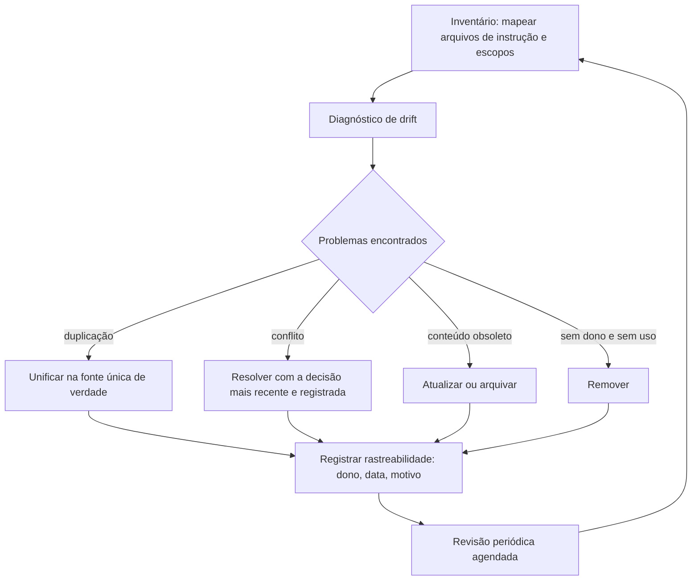

# Capítulo 11: Auditando a memória do projeto: drift, duplicação e poda

## 1. Introdução

No capítulo anterior, você aprendeu a materializar a memória do projeto em arquivos de instrução — e a compartilhá-los com toda a equipe [5]. Mas arquivos de instrução são como qualquer código: envelhecem, duplicam e mentem [1]. Este capítulo trata da disciplina que mantém essa memória viva: a auditoria — o inventário do que está escrito, o diagnóstico do que desviou e a poda do que envelheceu [1].

Este capítulo tem três objetivos. Primeiro, entender por que a memória do projeto entra em drift e como medir isso [8]. Segundo, dominar as técnicas de auditoria: inventário, duplicação, conflito e rastreabilidade [6]. Terceiro, estabelecer o ciclo de manutenção — revisão periódica, poda e arquivamento — que impede a memória de virar peso morto [1].

## 2. Explica

### 2.1 O drift da memória: por que os arquivos mentem

A memória do projeto é escrita em um momento e lida em outro — e entre os dois, o projeto muda [1]. O drift é o descompasso entre o que está documentado e o que a equipe pratica [8]. Os sintomas são clássicos: regras que ninguém segue, exemplos desatualizados e comandos que não funcionam mais [5]. A primeira constatação da auditoria: o drift é a norma, não a exceção — e precisa de um ciclo de revisão, não de um conserto único [1].

### 2.2 O inventário: o que está escrito e onde

A auditoria começa pelo inventário: quais arquivos de instrução existem, em quais diretórios e com qual escopo [5]. A documentação da plataforma descreve o mapa completo — memória, regras, contexto — e a hierarquia entre eles [1][1]. O inventário responde a primeira pergunta: a equipe sabe onde estão as regras? Se não sabe, o problema não é de conteúdo, é de estrutura [6].

### 2.3 Duplicação e conflito: os inimigos gêmeos

O segundo achado clássico é a duplicação: a mesma regra escrita em dois arquivos, com redações diferentes [6]. Quando a regra muda em um lugar e não no outro, nasce o conflito — e o agente que lê os dois arquivos recebe instruções contraditórias [8]. A auditoria mapeia as duplicatas por conteúdo semelhante e decide a fonte única de verdade [6].

### 2.4 A rastreabilidade: cada regra com dono e data

A memória madura tem rastreabilidade: cada regra identifica por que existe, quem a decidiu e quando [9]. Arquivos com histórico de revisão permitem responder "essa regra ainda faz sentido?" olhando para o contexto da decisão [9][10]. A prática recomendada pela comunidade é simples: data de criação, motivo e dono em cada seção relevante [5][6].

### 2.5 A poda: o que merece permanecer

A poda é o passo final da auditoria: classificar cada conteúdo como manter, atualizar, arquivar ou remover [1]. O critério é o uso: regra sem uso, sem dono e sem motivo documentado é candidata à remoção [1]. A poda não é perda — é a liberação de atenção do agente, que deixa de processar texto morto em toda sessão [13].

### 2.6 O ciclo de manutenção: auditoria como rotina

A auditoria não é um evento: é uma rotina com cadência [1]. A plataforma recomenda revisar a memória periodicamente, como se revisa o código [1]. O ciclo completo: inventário, diagnóstico, correção, poda e — o mais importante — registro do que foi decidido para a próxima rodada [5]. Times maduros colocam a revisão da memória no mesmo calendário da revisão de código [19].

## 3. Ilustra

### 3.1 A analogia do armário da garagem

Pense no armário de uma garagem: tudo o que foi útil um dia ficou lá dentro [1]. Depois de alguns anos, o armário está cheio — mas ninguém acha nada, porque o conteúdo nunca foi inventariado [5]. A auditoria é a tarde de organização: tirar tudo para fora, separar o que ainda serve, consertar o que está quebrado e doar o resto [1]. A regra do armário maduro: nada entra sem etiqueta (dono e data), e uma vez por trimestre, tudo é revisado [6].



### 3.2 O armário que se organiza sozinho

O ciclo mostra a diferença entre limpeza e disciplina: a limpeza organiza uma vez; a disciplina mantém organizado para sempre [1]. A memória do projeto só permanece confiável se a auditoria for rotina [1].

## 4. Técnica

### 4.1 O inventário automatizado

O exemplo abaixo varre o repositório e produz o inventário dos arquivos de instrução — o primeiro passo da auditoria [5]:

```python
from pathlib import Path

NOMES_INSTRUCAO = {"CLAUDE.md", "AGENTS.md", "MEMORY.md", "RULES.md"}


def inventariar_instrucoes(raiz: Path) -> list[dict]:
    achados = []
    for caminho in raiz.rglob("*"):
        if caminho.is_file() and caminho.name in NOMES_INSTRUCAO:
            texto = caminho.read_text(encoding="utf-8", errors="replace")
            achados.append({
                "caminho": str(caminho.relative_to(raiz)),
                "linhas": len(texto.splitlines()),
                "caracteres": len(texto),
            })
    return sorted(achados, key=lambda x: x["caminho"])


for item in inventariar_instrucoes(Path(".")):
    print(f"{item['caminho']}: {item['linhas']} linhas")
```

O inventário torna visível o que estava disperso — e a visibilidade é o pré-requisito do diagnóstico [6].

### 4.2 A detecção de duplicatas

O trecho abaixo encontra seções duplicadas entre arquivos de instrução, comparando a forma normalizada do texto [6]:

```python
import unicodedata


def normalizar(texto: str) -> str:
    texto = unicodedata.normalize("NFKD", texto)
    texto = "".join(c for c in texto if not unicodedata.combining(c))
    return " ".join(texto.lower().split())


def achar_duplicatas(arquivos: list[dict]) -> list[tuple[str, str]]:
    vistos, duplicatas = {}, []
    for arq in arquivos:
        chave = normalizar(arq["texto"])[:200]
        if chave in vistos:
            duplicatas.append((vistos[chave], arq["caminho"]))
        else:
            vistos[chave] = arq["caminho"]
    return duplicatas
```

Cada duplicata encontrada é uma decisão de unificação — e o objetivo é uma única fonte de verdade para cada regra [6].

### 4.3 O ciclo de revisão com cadência

Para fechar, a rotina que mantém a memória viva: revisão agendada com critérios objetivos de poda [1][19]:

```python
def revisar_memoria(secoes, meses_sem_uso=6):
    a_manter, a_podar = [], []
    for secao in secoes:
        tem_dono = bool(secao.get("dono"))
        tem_data = bool(secao.get("criada_em"))
        sem_uso_recente = secao.get("meses_sem_acesso", 99) > meses_sem_uso
        if tem_dono and tem_data and not sem_uso_recente:
            a_manter.append(secao)
        else:
            a_podar.append(secao)
    return a_manter, a_podar
```

O critério é objetivo: sem dono, sem data ou sem uso, a seção é candidata à poda [1].

## 5. Aplica

### 5.1 Onde isso vive no mundo real

Na prática, a auditoria de memória aparece em equipes que percebem o sintoma: o agente segue regras que a equipe já abandonou [8]. A documentação da plataforma e os guias da comunidade descrevem o mesmo remédio: inventário, diagnóstico e revisão periódica [1][5]. E a tendência é de institucionalização: com a memória virando ativo do time, a auditoria vira cargo e rotina — não mais um favor de fim de semana [6].

### 5.2 O erro comum do iniciante

O erro clássico é encher o CLAUDE.md de tudo o que já foi dito uma vez — transformando memória em diário [13]. O segundo erro é nunca revisar: a regra esquecida continua consumindo atenção do agente em todas as sessões [13]. O caminho profissional: inventário, duplicação zero, rastreabilidade e cadência de revisão [1][6].

## 6. Conclusão

A memória do projeto é um ativo que apodrece sem manutenção [1]. Você aprendeu a inventariar, diagnosticar, unificar e podar — e a transformar a auditoria em rotina [1][6]. No próximo capítulo, essa disciplina ganha escala: a cascata de instruções em monorepos reais, onde múltiplos arquivos e múltiplos níveis precisam conviver sem conflito [8].


## 7. Referências

[1] ANTHROPIC. Memory: how Claude remembers your project. Claude Code Documentation, 2025–2026. Disponível em: https://docs.anthropic.com/en/docs/claude-code/memory. Acesso em: 5 ago. 2026.
[2] ANTHROPIC. Overview: Claude Code. Claude Code Documentation, 2025–2026. Disponível em: https://docs.anthropic.com/en/docs/claude-code/overview. Acesso em: 5 ago. 2026.
[3] AGENTS.MD. AGENTS.md: the standard for AI agent instructions. Agentic AI Foundation / OpenAI, ago. 2025. Disponível em: https://agents.md/. Acesso em: 5 ago. 2026.
[4] LINUX FOUNDATION. Linux Foundation announces the formation of the Agentic AI Foundation. Linux Foundation Press Release, 9 dez. 2025. Disponível em: https://www.linuxfoundation.org/press/linux-foundation-announces-the-formation-of-the-agentic-ai-foundation. Acesso em: 5 ago. 2026.
[5] AGENTIC AI FOUNDATION. Agentic AI Foundation official portal. AAIF, 2025–2026. Disponível em: https://aaif.io/. Acesso em: 5 ago. 2026.
[6] OSMANI, Addy. 15 AGENTS.md — engineering guide to AGENTS.md. Addy Osmani, 2025–2026. Disponível em: https://addyosmani.com/agents/15-agents-md/. Acesso em: 5 ago. 2026.
[7] AUGMENT CODE. How to build AGENTS.md: construction guide. Augment Code Guides, 2025–2026. Disponível em: https://www.augmentcode.com/guides/how-to-build-agents-md. Acesso em: 5 ago. 2026.
[8] CURSOR. Rules: Cursor Documentation. Cursor / Anysphere, 2025–2026. Disponível em: https://cursor.com/docs/rules. Acesso em: 5 ago. 2026.
[9] AGYN. AGENTS.md vs CLAUDE.md: does Claude Code or Codex read both?. Agyn Blog, jun. 2026. Disponível em: https://agyn.io/blog/claude-md-agents-md-compatibility. Acesso em: 5 ago. 2026.
[10] OPENAI. Codex: AGENTS.md and coding agents. OpenAI Documentation, 2025–2026. Disponível em: https://openai.com/index/introducing-codex/. Acesso em: 5 ago. 2026.
[11] GITHUB. GitHub Copilot: repository instructions and AGENTS.md support. GitHub Documentation, 2025–2026. Disponível em: https://docs.github.com/en/copilot/customizing-copilot/adding-repository-custom-instructions. Acesso em: 5 ago. 2026.
[12] GITHUB. GitHub Copilot Coding Agent: reading repository instructions. GitHub Changelog, 2025–2026. Disponível em: https://github.blog/. Acesso em: 5 ago. 2026.
[13] ANTHROPIC. Writing tools for AI agents — using AI agents. Anthropic Engineering Blog, set. 2025. Disponível em: https://www.anthropic.com/engineering/writing-tools-for-agents. Acesso em: 5 ago. 2026.
[14] ANTHROPIC. Effective context engineering for AI agents. Anthropic Engineering Blog, set. 2025. Disponível em: https://www.anthropic.com/engineering/effective-context-engineering-for-ai-agents. Acesso em: 5 ago. 2026.
[15] ANTHROPIC. Introducing the Model Context Protocol. Anthropic News, 25 nov. 2024. Disponível em: https://www.anthropic.com/news/model-context-protocol. Acesso em: 5 ago. 2026.
[16] MODEL CONTEXT PROTOCOL. Architecture. MCP Specification 2025-11-25, 25 nov. 2025. Disponível em: https://modelcontextprotocol.io/specification/2025-11-25/architecture. Acesso em: 5 ago. 2026.
[17] LINUX FOUNDATION. Agentic AI Foundation: governance of foundational agentic infrastructure. Linux Foundation Blog, dez. 2025. Disponível em: https://www.linuxfoundation.org/blog/. Acesso em: 5 ago. 2026.
[18] CURSOR. Best practices for rules and context. Cursor Documentation, 2025–2026. Disponível em: https://cursor.com/docs/context/rules. Acesso em: 5 ago. 2026.
[19] AIDER. AGENTS.md support and multi-tool interoperability. Aider Documentation, 2025–2026. Disponível em: https://aider.chat/docs/repomap.html. Acesso em: 5 ago. 2026.
[20] ANTHROPIC. Claude Code best practices: memory and configuration. Anthropic Engineering Blog, 2025–2026. Disponível em: https://www.anthropic.com/engineering/claude-code-best-practices. Acesso em: 5 ago. 2026.
