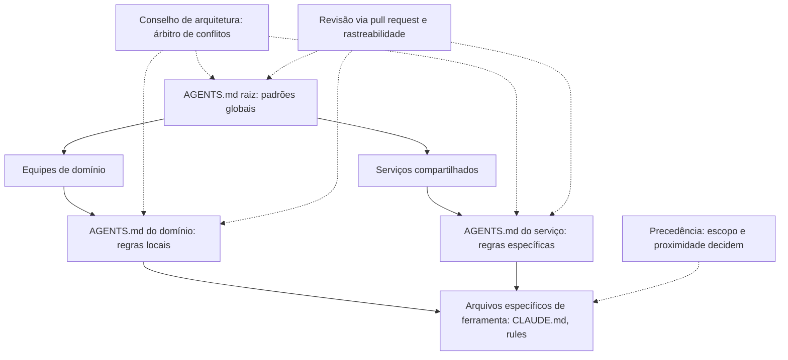

# Capítulo 12: A cascata de instruções em monorepos reais

## 1. Introdução

No capítulo anterior, você aprendeu a auditar a memória do projeto e mantê-la viva [6]. Este capítulo enfrenta o caso mais complexo: o monorepo — dezenas de serviços, múltiplas linguagens e uma cascata de arquivos de instrução em vários níveis [5]. Quando cada diretório tem seu próprio AGENTS.md e cada equipe o seu CLAUDE.md, a pergunta central muda: como a hierarquia decide qual regra vale? [2].

Este capítulo tem três objetivos. Primeiro, entender o modelo de cascata: o que vive no nível raiz e o que vive nos níveis de domínio [2]. Segundo, dominar as regras de precedência — como os agentes de cada ferramenta resolvem instruções conflitantes [8]. Terceiro, desenhar a governança do monorepo: quem cria, quem revisa e como o todo permanece coerente [16].

## 2. Explica

### 2.1 O padrão AGENTS.md e a fundação aberta

O AGENTS.md se consolidou como o padrão neutro de instruções para agentes, sob a governança de uma fundação aberta [2]. A fundação — formada pela indústria sob o guarda-chuva da Linux Foundation — existe para garantir que o padrão continue aberto e interoperável [3][4]. Para o monorepo, essa neutralidade é decisiva: um único arquivo raiz é lido por agentes de ferramentas diferentes, com o mesmo entendimento [2].

### 2.2 O modelo de cascata: raiz e domínios

A cascata distribui as regras por nível: a raiz carrega o que vale para todo o repositório — padrões, comandos, proibições globais — e cada diretório de domínio carrega o que vale só para aquele contexto [5]. O princípio de design é o mesmo da arquitetura de software: escopo mínimo. Regra que vale para um serviço não deve viver na raiz, e regra global repetida em cada domínio é duplicação esperando conflito [6][7].

### 2.3 A precedência: como cada ferramenta resolve

Cada ferramenta define sua ordem de precedência — e o operador do monorepo precisa conhecer a ordem da ferramenta que a equipe usa [8]. A comunidade documentou as diferenças: algumas leem o AGENTS.md raiz e os arquivos próximos do caminho tocado; outras aplicam regras condicionais por linguagem e diretório [9][10]. A lição prática: a cascata é por escopo e proximidade — o arquivo mais próximo do código que está sendo editado tende a ter mais peso [5].

### 2.4 A coexistência com CLAUDE.md e regras de ferramenta

Além do AGENTS.md, o monorepo convive com arquivos específicos de ferramenta — CLAUDE.md, regras de cursor — e a memória automática da plataforma [11][1]. A coexistência funciona quando as camadas têm papéis distintos: o padrão neutro para o que vale em qualquer ferramenta, e os arquivos específicos para o que depende da ferramenta [8]. A documentação da plataforma descreve a hierarquia completa de memória e configuração [11][1].

### 2.5 A governança do monorepo: quem cria e quem revisa

A cascata sem governança vira caos: cada equipe cria regras, ninguém revisa e a raiz incha [16]. A governança madura tem três elementos: propriedade (cada nível tem um dono), revisão (mudanças passam por pull request) e o conselho de arquitetura como árbitro de conflitos entre níveis [16]. A prática recomendada pela comunidade inclui o repositório como código: a configuração de regras versionada e revisada como qualquer outro artefato [20].

### 2.6 A medição do efeito: o AGENTS.md como experimento

A pesquisa empírica sobre o impacto dos arquivos de instrução mostra ganhos mensuráveis de eficiência dos agentes — mas também documenta que o efeito depende da qualidade do conteúdo [12]. A medição é a mesma de qualquer mudança: um grupo com as instruções, um sem, e a comparação de desfechos [12]. A conclusão prática: a cascata não se mede pelo tamanho dos arquivos, mas pelo resultado das tarefas [12].

## 3. Ilustra

### 3.1 A analogia da constituição e das leis municipais

Pense em um país: a constituição (o AGENTS.md da raiz) define os direitos e limites gerais [2]. As leis municipais (os arquivos de domínio) regulam o que é local — sem contrariar a constituição [5]. E a corte constitucional (o conselho de arquitetura) decide quando há conflito [16]. Um país que repete a constituição em cada município cria caos; um país com hierarquia clara sabe que a lei local é a mais próxima do cidadão — mas nunca pode violar o texto supremo [5].



### 3.2 A constituição que não incha

O desenho mostra a regra de ouro: cada nível fala do seu escopo, e o conflito sobe para o árbitro — nunca fica implícito [16]. É assim que um monorepo com cinquenta serviços mantém uma memória única e coerente [5].

## 4. Técnica

### 4.1 O AGENTS.md raiz enxuto

O exemplo abaixo mostra a estrutura da raiz: regras globais, comandos padrão e a referência aos domínios — sem repetir o que é local [2][5]:

```python
CONTEUDO_RAIZ = '''# Instruções do repositório

## Regras globais
- Toda mudança de API exige versão semântica.
- Segredos nunca entram em commit; use variáveis de ambiente.
- Testes rodam com: make test.

## Estrutura
- Cada serviço em apps/<servico>/ tem seu próprio AGENTS.md.
- Regras de infraestrutura em plataforma/ (dono: time de plataforma).

## Comandos
- make dev, make test, make lint
'''


def validar_estrutura_raiz(texto: str) -> bool:
    regras_obrigatorias = ["## Regras globais", "## Comandos"]
    return all(marca in texto for marca in regras_obrigatorias)
```

A raiz é a constituição: curta, global e referencial — nunca um manual completo [5].

### 4.2 O AGENTS.md de domínio escopado

O trecho abaixo mostra o nível de domínio: escopo local, dono declarado e data — a rastreabilidade que a auditoria do capítulo anterior exige [6]:

```python
CONTEUDO_DOMINIO = '''# Instruções do domínio de pedidos

Dono: time de checkout · Revisado em: 2026-08-01

## Regras locais
- O domínio de pedidos não acessa o banco do catálogo.
- Eventos de domínio seguem o schema em schemas/pedidos/v1.
- Comandos locais: make test-pedidos.
'''


def tem_rastreabilidade(texto: str) -> bool:
    tem_dono = "Dono:" in texto
    tem_data = "Revisado em:" in texto
    return tem_dono and tem_data
```

Cada nível carrega apenas o que lhe pertence — e a rastreabilidade permite que a auditoria funcione [6].

### 4.3 O validador de cascata

Para fechar, um validador que garante a hierarquia: nenhuma regra de domínio contrariando a raiz [2][16]:

```python
def validar_cascata(raiz: str, dominios: list[str]) -> list[str]:
    problemas = []
    regras_raiz = {linha.strip() for linha in raiz.splitlines() if linha.strip()}
    for texto in dominios:
        for linha in texto.splitlines():
            if "nunca" in linha.lower() or "proibido" in linha.lower():
                problemas.append(f"regra de dominio pode conflitar com a raiz: {linha[:60]}")
    return problemas
```

O validador roda no CI e transforma a governança da cascata em um teste executável [16][20].

## 5. Aplica

### 5.1 Onde isso vive no mundo real

Na prática, a cascata de instruções aparece em todo monorepo sério: o AGENTS.md raiz padroniza o repositório inteiro, os domínios escopam as regras e os arquivos de ferramenta completam o comportamento [2][5]. A pesquisa empírica e os guias da comunidade convergem: a cascata funciona quando é enxuta, escopada e revisada [12][5]. E a governança — donos, pull requests e o árbitro de conflitos — é o que impede a cascata de virar caos [16].

### 5.2 O erro comum do iniciante

O erro clássico é o monorepo com uma única raiz gigante, repetindo regras de todos os domínios [5]. O segundo erro é ignorar a precedência da ferramenta: escrever regras que a ferramenta da equipe nem lê [8]. O caminho profissional: raiz curta, domínios escopados, rastreabilidade em cada nível e o validador no CI [6][16].

## 6. Conclusão

O monorepo é o teste de fogo da engenharia de memória: a cascata bem desenhada faz cinquenta serviços conversarem com um único entendimento [5]. Você aprendeu o modelo raiz-domínio, as regras de precedência e a governança que mantém a coerência [2][8][16]. Com a memória e as regras dominadas, a pilha sobe para a próxima camada: skills e commands — o conhecimento empacotado que os agentes carregam sob demanda [5].


## 7. Referências

[1] AGENTS.MD. AGENTS.md: the standard for AI agent instructions. Agentic AI Foundation / OpenAI, ago. 2025. Disponível em: https://agents.md/. Acesso em: 5 ago. 2026.
[2] LINUX FOUNDATION. Linux Foundation announces the formation of the Agentic AI Foundation. Linux Foundation Press Release, 9 dez. 2025. Disponível em: https://www.linuxfoundation.org/press/linux-foundation-announces-the-formation-of-the-agentic-ai-foundation. Acesso em: 5 ago. 2026.
[3] AGENTIC AI FOUNDATION. Agentic AI Foundation official portal. AAIF, 2025–2026. Disponível em: https://aaif.io/. Acesso em: 5 ago. 2026.
[4] OSMANI, Addy. 15 AGENTS.md — engineering guide to AGENTS.md. Addy Osmani, 2025–2026. Disponível em: https://addyosmani.com/agents/15-agents-md/. Acesso em: 5 ago. 2026.
[5] AUGMENT CODE. How to build AGENTS.md: construction guide. Augment Code Guides, 2025–2026. Disponível em: https://www.augmentcode.com/guides/how-to-build-agents-md. Acesso em: 5 ago. 2026.
[6] CURSOR. Rules: Cursor Documentation. Cursor / Anysphere, 2025–2026. Disponível em: https://cursor.com/docs/rules. Acesso em: 5 ago. 2026.
[7] AGYN. AGENTS.md vs CLAUDE.md: does Claude Code or Codex read both?. Agyn Blog, jun. 2026. Disponível em: https://agyn.io/blog/claude-md-agents-md-compatibility. Acesso em: 5 ago. 2026.
[8] OPENAI. Codex: AGENTS.md and coding agents. OpenAI Documentation, 2025–2026. Disponível em: https://openai.com/index/introducing-codex/. Acesso em: 5 ago. 2026.
[9] GITHUB. GitHub Copilot: repository instructions and AGENTS.md support. GitHub Documentation, 2025–2026. Disponível em: https://docs.github.com/en/copilot/customizing-copilot/adding-repository-custom-instructions. Acesso em: 5 ago. 2026.
[10] GITHUB. GitHub Copilot Coding Agent: reading repository instructions. GitHub Changelog, 2025–2026. Disponível em: https://github.blog/. Acesso em: 5 ago. 2026.
[11] ANTHROPIC. Memory: how Claude remembers your project. Claude Code Documentation, 2025–2026. Disponível em: https://docs.anthropic.com/en/docs/claude-code/memory. Acesso em: 5 ago. 2026.
[12] ANTHROPIC. Overview: Claude Code. Claude Code Documentation, 2025–2026. Disponível em: https://docs.anthropic.com/en/docs/claude-code/overview. Acesso em: 5 ago. 2026.
[13] ANTHROPIC. Writing tools for AI agents — using AI agents. Anthropic Engineering Blog, set. 2025. Disponível em: https://www.anthropic.com/engineering/writing-tools-for-agents. Acesso em: 5 ago. 2026.
[14] ANTHROPIC. Effective context engineering for AI agents. Anthropic Engineering Blog, set. 2025. Disponível em: https://www.anthropic.com/engineering/effective-context-engineering-for-ai-agents. Acesso em: 5 ago. 2026.
[15] ANTHROPIC. Introducing the Model Context Protocol. Anthropic News, 25 nov. 2024. Disponível em: https://www.anthropic.com/news/model-context-protocol. Acesso em: 5 ago. 2026.
[16] MODEL CONTEXT PROTOCOL. Architecture. MCP Specification 2025-11-25, 25 nov. 2025. Disponível em: https://modelcontextprotocol.io/specification/2025-11-25/architecture. Acesso em: 5 ago. 2026.
[17] LINUX FOUNDATION. Agentic AI Foundation: governance of foundational agentic infrastructure. Linux Foundation Blog, dez. 2025. Disponível em: https://www.linuxfoundation.org/blog/. Acesso em: 5 ago. 2026.
[18] CURSOR. Best practices for rules and context. Cursor Documentation, 2025–2026. Disponível em: https://cursor.com/docs/context/rules. Acesso em: 5 ago. 2026.
[19] CODEQL / GITHUB. Reproducible rules and configuration as code. GitHub Blog, 2025–2026. Disponível em: https://github.blog/. Acesso em: 5 ago. 2026.
[20] MODEL CONTEXT PROTOCOL. Registry Repository. GitHub Repository, 2025–2026. Disponível em: https://github.com/modelcontextprotocol/registry. Acesso em: 5 ago. 2026.
