# Skills e Commands

# Como Este Livro Foi Escrito: A Metodologia EITA

Todo capítulo deste livro segue a metodologia **EITA** — um framework pedagógico de 7 seções projetado para transformar o leitor de "não sei" para "consigo fazer" em cada tema abordado.

## As 7 Seções do EITA

### 1. INTRODUÇÃO
Contextualiza o tema. Explica o que será abordado, por que importa, e o que você será capaz ao final. Uma ponte conecta com o capítulo anterior (quando houver).

### 2. EXPLICA
Desconstrói o conceito: causa raiz, mecânica subjacente, definições precisas. Você passa de "não sei o que é" para "sei definir e explicar".

### 3. ILUSTRA
Uma analogia concreta ancora o conceito na sua intuição — sempre acompanhada de um diagrama visual que torna o abstrato tangível. Você passa de "parece abstrato" para "faz sentido".

### 4. TÉCNICA
O núcleo de valor: código executável, arquiteturas, passo a passo de implementação. É aqui você ganha as mãos para fazer. Você passa de "não sei fazer" para "consigo implementar".

### 5. APLICA
Contextualização em cenário real: onde aquilo se aplica no mercado, armadilhas comuns e como evitá-las. Você passa de "isso é teórico" para "vou usar no trabalho".

### 6. CONCLUSÃO
Síntese dos 3 pontos principais, conexão com o próximo capítulo e um desafio opcional para fixar o aprendizado.

### 7. REFERÊNCIAS BIBLIOGRÁFICAS
Fontes citadas no capítulo, em formato ABNT numerado. Toda afirmação factual tem sua referência.

## Por Que Funciona

O EITA não é uma lista de tópicos — é uma **jornada de transformação**. Cada seção leva o leitor a um estado mental diferente:

```
Introdução → "Quero aprender"
Explica     → "Entendi a teoria"
Ilustra     → "Faz sentido na prática"
Técnica     → "Consigo fazer"
Aplica      → "Vou usar no trabalho"
Conclusão   → "Dominei este tema"
```

## Diagrama do Fluxo EITA

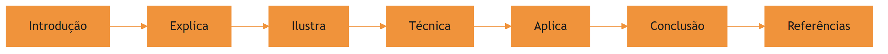

## Dica de Leitura

Você pode ler os capítulos em ordem (recomendado para iniciantes) ou pular diretamente para o tema de interesse. Cada capítulo é autocontido, mas a sequência cria conexões que ampliam o aprendizado.

---

*A metodologia EITA é uma criação da Fábrica Agêntica de Livros, projetada para produzir literatura técnica que transforma leitores em profissionais.*

## Introdução geral

Introdução de impacto: por que conhecimento sem empacotamento é desperdício — todo agente recomeça do zero a cada sessão se não existir uma ferramentaria; apresentação da oficina, do catálogo e do arco da obra.

# PARTE I — Fundamentos: o problema do conhecimento no agente

# Capítulo 1: O reinício eterno — por que todo agente esquece tudo

## 1. Introdução

Você já teve a sensação de explicar a mesma coisa duas vezes para a mesma pessoa, e na segunda vez ela agir como se nunca tivesse ouvido? É exatamente assim que funciona um agente de IA em uma sessão nova: ele chega com o conhecimento geral de um modelo treinado, mas sem nenhuma memória do que você combinou ontem, das convenções do seu repositório ou do padrão de deploy que sua equipe levou três meses para consolidar. Este capítulo abre a parte da obra dedicada à camada de harness mostrando por que esse esquecimento é a raiz de tanto retrabalho — e por que a solução não é "pedir para o agente lembrar", e sim empacotar o conhecimento em artefatos que ele possa carregar sob demanda.

Ao final deste capítulo, você será capaz de diagnosticar os quatro custos do conhecimento não empacotado — contexto, tempo, inconsistência e retrabalho — e de reconhecer o momento exato em que uma prática ad hoc deve virar um artefato reutilizável. Esse diagnóstico é o chão da oficina onde os próximos capítulos vão pendurar as ferramentas.

## 2. Explica

### A janela de contexto como recurso escasso

Um agente de IA não é um banco de dados: ele é um modelo que processa uma janela limitada de tokens a cada interação. Todo conteúdo que você injeta — instruções, código, histórico, exemplos — compete pelo mesmo espaço. Estudos sobre a arquitetura de agentes para terminal mostram que a gestão dessa janela é um dos pilares do que se chama *context engineering*: decidir o que entra, o que fica comprimido e o que fica de fora é uma decisão de engenharia, não de acaso [4]. Quando o conhecimento importante da sua equipe vive espalhado em prompts digitados de memória, cada sessão gasta parte preciosa da janela tentando reconstruir o que já deveria estar garantido. A gestão dessa janela é tão central que virou tema de curadoria própria na área de harness engineering [14].

A escassez não é apenas teórica. O custo de contexto tem duas faces: a financeira, porque tokens de entrada custam dinheiro em cada chamada, e a cognitiva, porque quanto mais ruído na janela, mais o modelo se distrai do que importa. Organizações que adotam IA agêntica em produção aprendem cedo que despejar documentação inteira no prompt a cada tarefa é o caminho mais rápido para degradar a qualidade das respostas [9]. O padrão de mercado converge para a mesma conclusão: o conhecimento institucional entra por artefatos versionados, não por instruções repetidas [13].

### Amnésia entre sessões e conhecimento efêmero

O segundo fato estrutural: cada sessão de agente começa do zero. A menos que algo persista no sistema de arquivos, no git ou em um serviço externo, tudo o que foi aprendido numa conversa se perde ao fechar o terminal. A literatura sobre agentes autônomos formaliza isso como o problema da memória de longo prazo: o agente precisa de mecanismos de escrita, gerenciamento e leitura para transportar conhecimento entre episódios [6]. Sem esses mecanismos, o conhecimento é efêmero por construção — e é por isso que frameworks de auto-melhoria extraem lições reutilizáveis das trajetórias de execução antes que elas se percam [7].

Isso explica um padrão que você provavelmente já viu: dois desenvolvedores usando o mesmo agente obtêm resultados diferentes para a mesma tarefa, porque cada um "explica" o contexto de um jeito. A variação não está no modelo — está no harness de cada sessão, no que foi ou não injetado. Um argumento central da pesquisa recente é justamente que comparar agentes sem descrever o harness (contexto, ferramentas, scaffolding) produz conclusões enganosas [20]. A visão mais radical vai além: o código não é só o que o agente produz, mas o próprio substrato do harness através do qual ele raciocina e age [19]. Na prática corporativa, a mesma lição aparece: agentes bem-sucedidos são avaliados pelo que conseguem entregar em bases de código reais, como demonstra o padrão SWE-bench [15].

### Prompts ad hoc versus conhecimento empacotado

A alternativa ao reinício eterno é transformar conhecimento em artefato. Um prompt digitado de memória é conhecimento em estado gasoso: ocupa o espaço onde foi gerado e se dissipa. Um arquivo versionado — uma skill com instruções e scripts, ou um comando que encapsula um procedimento — é conhecimento em estado sólido: existe independentemente da sessão, pode ser testado, revisado e reutilizado. O padrão aberto de agent skills formaliza exatamente essa distinção, definindo o pacote de conhecimento como uma pasta com `SKILL.md` e recursos associados [1][2]. A especificação é agnóstica de ferramenta, o que significa que a mesma skill pode rodar em harnesses diferentes — Claude Code, VS Code, Cursor — sem reescrita [3].

O princípio que torna isso viável em escala é a *disclosure progressiva*: apenas os metadados da skill (nome e descrição) ocupam a janela de contexto permanentemente; o corpo completo é carregado somente quando o gatilho semântico dispara [1]. É a diferença entre manter a biblioteca inteira aberta na mesa e consultar o catálogo para depois puxar só o volume que você precisa. O modelo de linguagem aumenta a confiabilidade quando o uso de ferramentas é ensinado com verificação e reflexão sobre erros — o princípio por trás do Tool-MVR [11]. E o ecossistema de skills comunitárias mostra que, com descrições bem desenhadas, o carregamento sob demanda funciona em escala [8]. Para distribuir essas skills entre projetos e pessoas, já existem gerenciadores de pacote dedicados, como o `npx skills` da Vercel Labs [16].

## 3. Ilustra

Pense na sua oficina de desenvolvimento como a oficina do Engenheiro Agêntico — o cenário que acompanha esta obra inteira. No chão da fábrica, um operário que não tem onde pendurar suas ferramentas faz o quê? Guarda a chave de boca no bolso, esquece onde pôs, e na semana seguinte está refazendo o mesmo parafuso do zero, testando três chaves diferentes até achar a que encaixa. É exatamente isso que acontece quando o conhecimento do agente vive no "bolso" de prompts digitados: toda sessão é uma nova busca pela ferramenta certa, com tentativa e erro.

Agora imagine a ferramentaria: cada ferramenta tem uma etiqueta (o `name` e a `description` da skill), um lugar fixo na parede (a pasta no sistema de arquivos) e um manual de instruções que só é aberto quando alguém vai usá-la. O operário não carrega a ferramentaria inteira no cinto — ele olha a etiqueta, decide se precisa daquela ferramenta e só então puxa o manual. É a disclosure progressiva em ação: catálogo sempre à vista, conteúdo sob demanda.

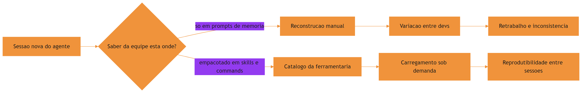

O motivo condutor da oficina não é um ornamento: é o vocabulário que os próximos capítulos reutilizam. Quando um capítulo falar em puxar a ferramenta da parede, você saberá que ele fala de carregar uma skill; quando falar em bancada com procedimento gravado, falará de commands. Guarde esse vocabulário — ele é o fio que amarra os dez capítulos desta obra.

## 4. Técnica

### Diagnosticando o custo do conhecimento efêmero

Antes de empacotar, é preciso medir. A ferramenta mais simples é um levantamento dos prompts que a equipe digita repetidamente para o agente. O script abaixo varre o histórico de sessões e extrai os fragmentos de instrução mais frequentes — o primeiro sinal de que existe conhecimento que deveria virar skill ou command.

```python
# -*- coding: utf-8 -*-
"""Detecta fragmentos de prompt repetidos em um historico de sessoes do agente."""
import collections
import re
from pathlib import Path


def normalizar(texto: str) -> str:
    """Remove espacos extras e normaliza quebras de linha para comparacao."""
    return re.sub(r"\s+", " ", texto).strip().lower()


def extrair_fragmentos(texto: str, tamanho: int = 40) -> list[str]:
    """Fatia o texto em janelas deslizantes de `tamanho` palavras."""
    palavras = normalizar(texto).split()
    if len(palavras) < tamanho:
        return []
    return [" ".join(palavras[i:i + tamanho]) for i in range(len(palavras) - tamanho + 1)]


def detectar_prompts_repetidos(diretorio: str, min_ocorrencias: int = 3) -> list[tuple[int, str]]:
    """Retorna os fragmentos de prompt que aparecem com frequencia suspeita."""
    contagem: collections.Counter[str] = collections.Counter()
    for caminho in Path(diretorio).rglob("*.jsonl"):
        try:
            linhas = caminho.read_text(encoding="utf-8", errors="ignore").splitlines()
        except OSError:
            continue
        for linha in linhas:
            for fragmento in extrair_fragmentos(linha):
                contagem[fragmento] += 1
    candidatos = [
        (vezes, frag)
        for frag, vezes in contagem.items()
        if vezes >= min_ocorrencias
    ]
    candidatos.sort(reverse=True)
    return candidatos[:20]


if __name__ == "__main__":
    historico = "~/.claude/projects"
    achados = detectar_prompts_repetidos(historico)
    for vezes, frag in achados[:10]:
        print(f"{vezes:>3}x  {frag[:90]}...")
```

Rode o equivalente no seu harness: todo fragmento que aparece três ou mais vezes é candidato a virar artefato. Não é sobre eliminar a conversa com o agente — é sobre parar de repetir a mesma instrução. Uma variação útil do script agrupa os candidatos por tema antes de apresentá-los, para que a decisão de empacotamento seja tomada em nível de domínio, não de frase solta.

```python
# -*- coding: utf-8 -*-
"""Agrupa os fragmentos repetidos por palavras-chave de dominio."""
import collections
import re
from pathlib import Path

DOMINIOS = {
    "deploy": r"deploy|release|publicar|publicacao",
    "testes": r"teste|pytest|cobertura|assert",
    "seguranca": r"seguranca|permissao|token|secreto|cripto",
    "banco": r"banco|sql|query|schema|migracao",
    "infra": r"docker|kubernetes|pipeline|ci|build",
}


def classificar(fragmento: str) -> str:
    """Classifica um fragmento no dominio mais provavel."""
    baixo = fragmento.lower()
    for dominio, padrao in DOMINIOS.items():
        if re.search(padrao, baixo):
            return dominio
    return "outros"


def agrupar_por_dominio(candidatos: list[tuple[int, str]]) -> dict[str, list[str]]:
    """Agrupa os fragmentos repetidos por dominio tematico."""
    grupos: dict[str, list[str]] = collections.defaultdict(list)
    for vezes, fragmento in candidatos:
        grupos[classificar(fragmento)].append(f"{vezes}x {fragmento[:60]}")
    return dict(sorted(grupos.items()))


if __name__ == "__main__":
    exemplo = [(7, "rode o deploy com cache de build ativo"),
               (5, "verifique a cobertura dos testes novos")]
    for dominio, itens in agrupar_por_dominio(exemplo).items():
        print(f"{dominio.upper()}:")
        for item in itens:
            print(f"  - {item}")
```

Com o agrupamento, a reunião de planejamento da ferramentaria fica objetiva: em vez de discutir quarenta frases soltas, a equipe discute cinco domínios — deploy, testes, segurança, banco e infra — e decide em cada um quais artefatos nascem. A medição deixa de ser um fim em si e passa a alimentar a decisão de engenharia.

### Por que a memória do modelo não resolve o problema

Uma objeção comum surge aqui: "por que não simplesmente deixar o modelo lembrar?" A resposta está na arquitetura: o modelo não persiste estado entre chamadas. Ele recebe uma janela de tokens e produz uma resposta — o que "lembra" é o que está na janela naquele momento. Entender isso é libertador: você para de cobrar do modelo algo que a arquitetura dele não oferece e começa a desenhar a persistência onde ela pertence — no sistema de arquivos, no git e nos artefatos de conhecimento [6].

É por isso que a discussão sobre "memória" de agentes migrou para mecanismos explícitos: escrita de conhecimento, gerenciamento de relevância e leitura sob demanda [6]. A skill é exatamente um desses mecanismos — um pedaço de memória procedural que o harness sabe ler quando precisa. O modelo continua sendo o operário; a memória passa a ser a oficina.

### O momento de virar artefato: uma régua de decisão

Empacotar cedo demais gera manutenção; tarde demais, gera retrabalho. Uma régua prática usa três perguntas em sequência. A primeira: a instrução é repetida por mais de uma pessoa ou mais de um projeto? A segunda: ela é estável o suficiente para sobreviver a uma semana sem mudanças? A terceira: a execução errada dela tem custo relevante? Se as três respostas forem sim, o conhecimento pede para ser empacotado.

```python
# -*- coding: utf-8 -*-
"""Regua de decisao para promover conhecimento a skill ou command."""


def decidir_empacotamento(frequencia: int, estabilidade_dias: int, custo_erro: str) -> str:
    """Avalia se um trecho de conhecimento merece virar artefato reutilizavel.

    Retorna 'skill', 'command' ou 'manter_ad_hoc'.
    """
    repetido = frequencia >= 3
    estavel = estabilidade_dias >= 7
    custoso = custo_erro.lower() in {"alto", "critico", "caro", "financeiro", "seguranca"}

    if repetido and estavel and custoso:
        return "command"
    if repetido and estavel:
        return "skill"
    return "manter_ad_hoc"


if __name__ == "__main__":
    casos = [
        ("procedimento de deploy", 12, 30, "critico"),
        ("convencao de nomeacao de commits", 8, 15, "baixo"),
        ("explicacao pontual de um bug", 1, 0, "baixo"),
    ]
    for nome, freq, dias, custo in casos:
        print(f"{nome:<32} -> {decidir_empacotamento(freq, dias, custo)}")
```

A régua não é absoluta — é um ponto de partida que a sua equipe calibra. O importante é ter o gatilho explícito, para que a decisão não dependa do humor do dia. Uma vez que o artefato nasce, ele entra no ciclo de manutenção: versione, nomeie com intenção e documente o gatilho de uso no próprio arquivo. Um artefato sem dono e sem revisão é uma dívida nova disfarçada de investimento — a régua de decisão não termina na criação, ela continua no ciclo de vida.

### Métricas de saúde do conhecimento

Com os scripts do capítulo, a equipe ganha duas métricas objetivas de saúde do conhecimento. A primeira é o índice de repetição: a razão entre fragmentos de prompt que se repetem e o total de instruções dadas — alto demais, e o catálogo está defasado. A segunda é a cobertura de artefatos: a proporção de domínios repetitivos (deploy, testes, segurança) que já têm skill ou command correspondente. Acompanhar essas duas métricas em ritmo mensal transforma "empacotar conhecimento" de slogan em gestão [9].

As duas métricas juntas contam a história completa: o índice de repetição mostra a demanda não atendida, e a cobertura mostra o quanto dessa demanda já virou patrimônio. Quando a repetição cai e a cobertura sobe, a oficina está saudável — quando as duas congelam, alguém está acumulando prompts no bolso em vez de pendurar na parede. Times que praticam isso relatam ganhos de velocidade em SDLC completo mantendo a conformidade — como o caso da fintech CRED documentado em guias de referência de agentes [12]. E a tendência é que esse conhecimento empacotado fique cada vez mais sofisticado: o survey mais recente sobre skills para LLMs mapeia a aquisição autônoma de habilidades como fronteira ativa [18].

### O custo da não decisão: retrabalho como métrica

O retrabalho é a métrica que transforma essa discussão em números. Cada vez que a equipe refaz uma instrução que já poderia estar empacotada, ela paga o custo em três moedas: tokens de entrada repetidos, tempo de sessão e risco de variação. Um comando de deploy digitado de memória por três desenvolvedores diferentes produz três procedimentos ligeiramente diferentes — e a diferença entre eles é onde os incidentes moram [5].

A régua de decisão abaixo quantifica esse custo de forma simples: frequência vezes estabilidade vezes custo de erro. Quando o produto cruza o limiar, o artefato se paga sozinho na primeira semana — e a partir daí é lucro.

### Estruturando a pasta antes da ferramenta

Quando a decisão for por uma skill, a estrutura mínima já nasce com a forma certa. O padrão aberto define uma pasta nomeada com o nome da skill contendo um `SKILL.md` obrigatório e diretórios opcionais para scripts, referências e recursos [1]. Você não precisa de tudo no primeiro dia — precisa da pasta e do arquivo principal, para que o conhecimento tenha endereço fixo desde o início.

```bash
# Estrutura minima de uma skill antes de qualquer conteudo
mkdir -p .claude/skills/nome-da-skill/{scripts,references,assets}
```

A mesma lógica vale para commands: um arquivo em um diretório de commands com frontmatter descritivo. A decisão entre skill e command — que o próximo capítulo aprofunda — não precisa ser perfeita no dia um: um artefato bem organizado pode migrar de forma depois, porque a estrutura em arquivos torna a realocação um movimento de pasta, não uma reescrita. O custo de começar é baixo justamente porque a forma é o que primeiro se ajusta.

## 5. Aplica

### A cena do deploy que nunca dava certo

Imagine a seguinte cena, em segunda pessoa. Você é o Engenheiro Agêntico encarregado de um microserviço novo, e a equipe pede para você usar o agente para preparar o primeiro deploy. Você começa a sessão e digita, de memória, tudo o que aprendeu com o último deploy do outro serviço: "lembre de usar o comando de build com cache, verifique a variável de ambiente de produção, não esqueça do healthcheck". O agente executa, você confere, e parece tudo certo — até o pipeline quebrar porque você esqueceu de mencionar que este serviço usa um registry de imagens diferente.

O erro acontece exatamente aqui: você tratou conhecimento corporativo como memória pessoal. O diagnóstico, ligando à teoria do capítulo, é que o conhecimento estava no estado gasoso — dependia da sua memória, da sua sessão, do seu humor. A correção estrutural é transformar o procedimento de deploy em um command versionado: o procedimento gravado na bancada da oficina, disponível para qualquer pessoa com um `/deploy` independentemente de quem escreveu o prompt original. Na prática, isso significa que o retrabalho deixa de ser uma característica do processo e passa a ser um sinal de que um artefato precisa nascer.

### Armadilhas comuns do início da jornada

A primeira armadilha é empacotar tudo de uma vez: criar trinta skills na primeira semana e depois abandonar vinte porque ninguém sabe quando usá-las. O antídoto é começar pelo catálogo — pelas descrições — e validar o gatilho de cada skill antes de investir no conteúdo profundo. A segunda armadilha é tratar o arquivo de instruções do projeto como substituto de skills: despejar tudo no `CLAUDE.md` mantém o custo de contexto sempre ativo e transforma a janela em uma mesa coberta de livros abertos [2]. Equipes maduras combinam instruções estáticas com skills dinâmicas — a mesma divisão que frameworks como o Superpowers da obra popularizam [17]. A terceira é não versionar: conhecimento empacotado sem git é conhecimento empacotado sem história, sem revisão e sem rollback. A quarta é ignorar a medição: se você não sabe quantas vezes o fragmento de prompt se repete, não sabe se o artefato está pagando o próprio custo.

### Métricas de sucesso

Uma equipe que empacota conhecimento bem tem três sinais mensuráveis. O primeiro: o tempo de setup de uma sessão nova cai, porque a introdução de contexto passa de "digitar de memória" para "referenciar o catálogo". O segundo: a variação entre desenvolvedores diminui, porque o procedimento correto não depende mais de quem lembra dele. O terceiro: o número de prompts repetidos no histórico cai mês a mês, como o contador de fragmentos do script acima evidencia. Nenhuma dessas métricas é sobre "fazer o agente mais inteligente" — todas são sobre tornar o conhecimento da equipe durável. Empresas como a Anthropic usam agentes no dia a dia de infraestrutura e finanças, e o que sustenta essa escala é justamente a documentação de contexto bem-feita [5]. O próximo passo natural é conectar esse conhecimento empacotado a ferramentas externas via protocolo padronizado, como o MCP [10].

## 6. Conclusão

Neste capítulo, você entendeu por que todo agente esquece tudo: a janela de contexto é escassa, a sessão recomeça do zero e o conhecimento não empacotado existe em estado gasoso. Você conheceu o princípio que resolve o problema — a disclosure progressiva das agent skills — e a régua de três perguntas que separa o que merece virar artefato do que deve continuar ad hoc. E você viu, na cena do deploy, que o erro típico não é técnico: é tratar conhecimento corporativo como memória pessoal.

O desafio para fixar: rode o script de detecção de fragmentos repetidos no histórico da sua própria equipe e liste os cinco fragmentos mais frequentes. No próximo capítulo, você vai subir um nível na oficina: entender como o harness — a camada que orquestra o loop do agente — posiciona skills e commands como as duas formas fundamentais de conhecimento empacotado, e por que essa distinção importa na hora de desenhar a sua ferramentaria.

## 8. Aprofundamento: o harness como memória estrutural

### Os quatro custos do conhecimento não empacotado, em números

A introdução prometeu quatro custos — contexto, tempo, inconsistência e retrabalho — e vale torná-los mensuráveis, porque o que não é medido não é gerido. O custo de contexto é o mais direto: cada sessão que reconstrói conhecimento paga tokens de entrada repetidos, e o custo acumulado cresce linearmente com o número de sessões. O custo de tempo é o tempo humano de reexplicar: toda vez que um desenvolvedor digita de memória uma instrução que já deveria estar empacotada, ele gasta minutos que a equipe paga em horas. O custo de inconsistência é o mais silencioso: três desenvolvedores executando o mesmo procedimento de formas diferentes produzem resultados diferentes, e a diferença vira incidente. O custo de retrabalho é o agregado dos três: a soma do que a equipe refaz porque o conhecimento não era durável [9].

A relação entre os quatro custos explica por que a medição do Capítulo 1 (o índice de repetição) é tão importante: ela é a porta de entrada dos outros três. Quando a repetição cai, o tempo de reexplicação cai, a variação entre desenvolvedores cai e o retrabalho cai. Os quatro custos não são independentes — são o mesmo desperdício visto de quatro ângulos [18].

### O ciclo da sessão: o que se perde em cada fechamento

Para entender a amnésia com precisão, vale reconstruir o ciclo de uma sessão típica. A sessão abre com o bootstrap (o arquivo de instruções raiz carrega o contexto estável). Durante a sessão, o conhecimento se acumula: decisões tomadas, arquivos modificados, convenções descobertas. No fechamento, esse conhecimento existe apenas no histórico da sessão — e o histórico, por melhor que seja, não é um artefato: não é carregado automaticamente, não é testável, não é versionado. A próxima sessão reabre com o bootstrap de novo, e o ciclo recomeça. O que o harness perde em cada fechamento é exatamente o que a skill preserva: o conhecimento que sobrevive à sessão [6].

```python
# -*- coding: utf-8 -*-
"""Reconstroi o ciclo de perda de conhecimento entre sessoes."""


def saldo_conhecimento(conhecimento_sessao: int, bootstrap: int,
                       artefatos: int) -> dict:
    """Compara o conhecimento que atravessa sessoes com o que se perde."""
    perda_por_sessao = conhecimento_sessao
    ganho_por_sessao = bootstrap + artefatos
    return {
        "perdido_por_sessao": perda_por_sessao,
        "sobrevive_por_sessao": ganho_por_sessao,
        "saldo": ganho_por_sessao - perda_por_sessao,
    }


if __name__ == "__main__":
    print(saldo_conhecimento(conhecimento_sessao=60, bootstrap=10, artefatos=40))
```

O saldo do ciclo é a equação central da obra: quando os artefatos cobrem o conhecimento que a sessão produz, o saldo é positivo e o agente acumula; quando não cobrem, o saldo é negativo e o agente esquece — o reinício eterno do título do capítulo [7].

### O dilema do começo: empacotar o quê primeiro

A primeira pergunta de quem inicia a jornada é: por onde começo? A resposta prática contraria o impulso de empacotar o que é mais interessante e aponta para o que é mais repetido. A priorização segue três critérios em ordem: frequência (o que a equipe faz toda semana), dor (o que erra com mais frequência) e custo do erro (o que mais custa quando falha). O procedimento de deploy normalmente vence nos três; a convenção de nomeação de commits vence apenas no primeiro — e por isso o deploy vira command antes da convenção virar skill [12].

```python
# -*- coding: utf-8 -*-
"""Prioriza candidatos a empacotamento por frequencia, dor e custo."""


def pontuar(candidatos: list[dict]) -> list[tuple[str, int]]:
    """Ordena candidatos por (frequencia + dor + custo_erro)."""
    ordenados = []
    for c in candidatos:
        nota = c.get("frequencia", 0) + c.get("dor", 0) + c.get("custo_erro", 0)
        ordenados.append((c["nome"], nota))
    ordenados.sort(key=lambda x: -x[1])
    return ordenados


if __name__ == "__main__":
    candidatos = [
        {"nome": "deploy", "frequencia": 5, "dor": 4, "custo_erro": 5},
        {"nome": "nomenclatura", "frequencia": 4, "dor": 1, "custo_erro": 1},
        {"nome": "migracao", "frequencia": 2, "dor": 3, "custo_erro": 5},
    ]
    for nome, nota in pontuar(candidatos):
        print(f"{nome}: {nota} pontos")
```

A priorização por pontuação tem um efeito colateral valioso: ela torna a decisão discutível com dados. Quando alguém discorda da ordem, a discordância é sobre a pontuação — frequência, dor ou custo — não sobre preferência pessoal. É a mesma disciplina de decisão que a obra aplica em todas as camadas, do gatilho à governança [15].

### A armadilha do empacotamento prematuro

O capítulo mostrou a régua de três perguntas para decidir quando empacotar; o complemento é o alerta contra o empacotamento prematuro. Empacotar cedo demais tem três custos. O primeiro é a manutenção: um artefato que ainda muda toda semana exige edições frequentes, e cada edição é uma dívida de revisão. O segundo é o catálogo inchado: skills criadas antes de a prática estabilizar viram entulho que o gatilho semântico precisa filtrar. O terceiro é o custo de aprendizagem errada: um procedimento empacotado antes de ser testado congela a versão errada da prática, e a equipe passa a repetir o erro de forma consistente — pior que o erro inconsistente, porque fica invisível [4].

O contrapeso ao empacotamento prematuro é a disciplina do rascunho: a prática vive no caderno de memória procedural (o conceito do Capítulo 9) enquanto muda, e só vira artefato versionado quando estabiliza. O rascunho é barato de mudar; o artefato é caro de mudar. A transição é a decisão — e a régua de três perguntas é o critério [7].

### O inventário do estado atual: o ponto de partida da transformação

Antes de qualquer empacotamento, a equipe precisa do inventário do estado atual: o mapa do conhecimento que existe hoje e onde ele mora. O inventário tem três colunas: conhecimento, forma atual (prompt ad hoc, arquivo de instruções, skill, command) e dono (quem o mantém). A coluna da forma é a mais reveladora: ela mostra a distribuição do conhecimento entre os estados gasoso e sólido, e aponta exatamente onde a transformação precisa acontecer [13].

```python
# -*- coding: utf-8 -*-
"""Inventario do conhecimento: forma atual e dono por item."""
import json


def inventariar(itens: list[dict]) -> dict:
    """Agrupa o conhecimento por forma atual e conta sem dono."""
    por_forma = {}
    sem_dono = []
    for item in itens:
        forma = item.get("forma", "ad_hoc")
        por_forma[forma] = por_forma.get(forma, 0) + 1
        if not item.get("dono"):
            sem_dono.append(item["nome"])
    return {"por_forma": por_forma, "sem_dono": sem_dono}


if __name__ == "__main__":
    itens = [
        {"nome": "deploy", "forma": "ad_hoc", "dono": ""},
        {"nome": "convencao git", "forma": "instrucoes", "dono": "joao"},
        {"nome": "revisao de testes", "forma": "skill", "dono": "maria"},
    ]
    print(json.dumps(inventariar(itens), ensure_ascii=False, indent=2))
```

O inventário é a fotografia do estado atual — e a fotografia é o insumo da transformação. A equipe que sabe onde o conhecimento mora hoje sabe onde os artefatos precisam nascer amanhã. Sem o inventário, o empacotamento segue o gosto de quem empacota; com ele, segue a evidência [9].

### O mapa do conhecimento: o inventário como ponto de partida

O capítulo fechou com a régua de três perguntas; o mapa do conhecimento é o seu instrumento operacional. O mapa é a tabela do inventário — conhecimento, forma atual, dono — transformada em plano: para cada linha no estado gasoso (prompt ad hoc), o artefato-alvo; para cada artefato, o critério de prontidão. O mapa não é um documento: é um trabalho vivo, revisado a cada ciclo de medição do capítulo, que mostra à equipe o que já virou patrimônio e o que ainda espera a decisão. A equipe que mantém o mapa sabe onde o conhecimento mora, quem o mantém e o que falta empacotar — sem o mapa, a transformação do reinício eterno em continuidade é impulso, não projeto [13].

### O custo de oportunidade: o que o empacotamento substitui

Há uma última conta que fecha o capítulo: o custo de oportunidade do empacotamento. Todo artefato criado consome o tempo de quem o mantém — e esse tempo poderia estar resolvendo tarefas. A conta honesta compara o valor do artefato (a economia de repetição) com o custo de manutenção (a revisão contínua), e o saldo decide o investimento. Um artefato de alta frequência paga a manutenção em dias; um artefato de baixa frequência pode nunca pagar — e a régua do Capítulo 1, com as três perguntas, é exatamente a calculadora desse saldo [12].

```python
# -*- coding: utf-8 -*-
"""Custo de oportunidade: saldo entre economia e manutencao do artefato."""


def saldo_artefato(frequencia_semanal: int, economia_por_uso: float,
                  horas_manutencao_mensal: float, custo_hora: float) -> dict:
    """Compara a economia gerada com o custo de manutencao mensal."""
    economia_mensal = frequencia_semanal * 4.33 * economia_por_uso
    custo_mensal = horas_manutencao_mensal * custo_hora
    return {
        "economia_mensal": round(economia_mensal, 2),
        "custo_mensal": round(custo_mensal, 2),
        "saldo": round(economia_mensal - custo_mensal, 2),
    }


if __name__ == "__main__":
    print(saldo_artefato(frequencia_semanal=10, economia_por_uso=0.2,
                         horas_manutencao_mensal=1.0, custo_hora=50.0))
```

O saldo do artefato é a régua final de priorização: empacotar é investir, e a decisão de investimento é uma conta — economia projetada contra manutenção estimada. A conta não precisa ser exata; precisa existir, para que a decisão não seja movida por entusiasmo pelo artefato em vez de valor para a equipe [9].

### A régua do silêncio: quando o prompt é o lugar certo

Fechando o aprofundamento, um contraponto necessário à pressa de empacotar: existe conhecimento que não merece virar artefato — e o prompt ad hoc é o lugar certo para ele. Explicações pontuais, contexto de uma tarefa específica, decisões que mudam a cada execução: empacotar isso é criar ruído. A régua do silêncio complementa a régua de três perguntas: se o conhecimento é específico de uma tarefa, efêmero por natureza ou exclusivo de uma pessoa, o prompt é o lugar. O empacotamento não é um valor absoluto — é um investimento, e o investimento se justifica pela recorrência, não pela admiração pelo artefato [10]. A sabedoria da oficina é saber o que pendurar na parede e o que deixar no bolso do operário.

### O harness como memória estrutural

### A hierarquia da memória no ciclo do agente

Este capítulo tratou da amnésia entre sessões, mas a memória do agente tem mais de uma camada — e cada camada tem custo, latência e durabilidade próprios. A memória de trabalho é a janela de contexto ativa, volátil por definição: o que está nela nesta interação não existe na próxima. A memória episódica é o registro bruto do que foi feito — logs de sessão, histórico de comandos, arquivos de transcrição — que existe, mas não está estruturado para reuso. A memória procedural é o conhecimento de como fazer, e é exatamente aí que skills e commands se encaixam: eles são memória procedural em estado sólido, legíveis por máquina e por modelo [6]. A memória semântica, por fim, é o conhecimento de fatos e conceitos que atravessa tarefas — o vocabulário da equipe, as decisões de arquitetura, o glossário do domínio.

O erro de quem lê este capítulo e sai empacotando tudo é confundir as camadas. Uma skill não é um log: ela não registra o que aconteceu, ela prescreve o que deve acontecer. Um command não é um arquivo de configuração: ele é um procedimento que o harness executa sob demanda. A classificação correta evita dois desperdícios simétricos: registrar como artefato de conhecimento algo que é apenas histórico, e manter como histórico algo que a equipe repete toda semana e que deveria ter virado prescrição. A pesquisa sobre memória para agentes autônomos mapeia exatamente essa fronteira, avaliando os mecanismos de escrita, gerenciamento e leitura em cada camada [6]. O survey de skills para LLMs chega à mesma estrutura por outro caminho: o conhecimento dos agentes é adquirido, curado e consumido em ciclos que cruzam essas camadas [18].

### Contexto de bootstrap versus contexto operacional

Uma distinção que passa despercebida até o primeiro incidente é a diferença entre o contexto necessário para a sessão começar e o contexto necessário para a tarefa ser executada. O contexto de bootstrap responde a três perguntas: quem sou eu (o papel do agente), onde estou (o repositório e suas convenções) e o que é aceitável (as regras de conduta e de qualidade). O contexto operacional responde a outra pergunta: o que preciso saber para executar esta tarefa específica agora. A amnésia atinge as duas camadas de forma diferente: o bootstrap pode ser reconstruído por um arquivo de instruções raiz, como o AGENTS.md [13], enquanto o operacional só pode ser reconstruído por um catálogo de artefatos sob demanda [1].

Misturar as duas camadas no mesmo arquivo é o padrão que mais degrada janelas de contexto em projetos reais. Equipes que despejam instruções operacionais de todas as áreas no arquivo raiz transformam o bootstrap em um manual de quinhentas páginas — e cada sessão paga o preço de carregar tudo. A disciplina correta é minimalista: o arquivo raiz guarda o estável e o transversal; o específico mora nas skills. Os guias de adoção corporativa de IA de código são explícitos sobre esse efeito: projetos com bootstrap enxuto e catálogo rico apresentam menos erros e mais consistência em escala [9].

### Quantificando o custo da amnésia em tokens

Para quem precisa justificar o investimento em empacotamento, o custo da amnésia pode ser estimado em números. O custo de uma sessão ad hoc é a soma dos tokens de entrada gastos para reconstruir conhecimento que já deveria estar empacotado. Se uma equipe de dez desenvolvedores inicia cinquenta sessões por semana e cada sessão gasta em média dois mil tokens de entrada com instruções repetidas, o desperdício semanal é de cem mil tokens — e isso é só a conta de tokens, sem contar o tempo humano e o risco de variação.

```python
# -*- coding: utf-8 -*-
"""Estima o custo semanal da amnesia em tokens de entrada."""


def custo_semanal_amnesia(desenvolvedores: int, sessoes_por_semana: int,
                          tokens_repetidos_por_sessao: int,
                          preco_por_milhao_tokens: float = 3.0) -> dict:
    """Calcula o custo em tokens e em moeda da repeticao de contexto."""
    sessoes_totais = desenvolvedores * sessoes_por_semana
    tokens_desperdicados = sessoes_totais * tokens_repetidos_por_sessao
    custo_moeda = (tokens_desperdicados / 1_000_000) * preco_por_milhao_tokens
    return {
        "sessoes_totais": sessoes_totais,
        "tokens_desperdicados_semana": tokens_desperdicados,
        "custo_moeda_semana": round(custo_moeda, 2),
    }


if __name__ == "__main__":
    resultado = custo_semanal_amnesia(
        desenvolvedores=10, sessoes_por_semana=50,
        tokens_repetidos_por_sessao=2000,
    )
    for chave, valor in resultado.items():
        print(f"{chave}: {valor}")
```

O número é ilustrativo, mas o mecanismo é real: o valor de uma skill é exatamente a economia desses tokens repetidos, multiplicada pela frequência de uso. Esse raciocínio de custo-benefício é o mesmo que as empresas usam para decidir onde investir em automação agêntica, e ele depende de medir o estado atual antes de projetar o estado futuro [9].

### O papel da reflexão sobre erros na confiabilidade

Há um detalhe sutil na confiabilidade do conhecimento empacotado que merece destaque: a qualidade de uma instrução não se mede apenas pela clareza, mas pelo que acontece quando ela falha. Um procedimento que não prevê o erro ensina o agente a repetir o mesmo caminho até o mesmo fracasso; um procedimento que documenta as falhas conhecidas transforma o erro em ponto de aprendizagem. A literatura sobre verificação de ferramentas mostra que ensinar o modelo a verificar e refletir sobre erros de uso melhora substancialmente a confiabilidade de longo prazo [11].

Na prática, isso significa que todo artefato de conhecimento deveria ter uma seção de falhas conhecidas — os modos de erro que já foram vistos, o sintoma de cada um e a correção. Essa seção é o que separa um procedimento maduro de um rascunho. O Tool-MVR demonstra o mecanismo em detalhe: verificação sistemática da saída da ferramenta e reflexão sobre o resultado, repetidas em cada uso [11].

### Quando a memória procedural vira skill: o ciclo de promoção

Fechando o capítulo, vale desenhar o ciclo que será retomado em detalhe na obra: a promoção de conhecimento. O conhecimento nasce como episódio (uma sessão que resolveu um problema), vira lição (o resumo do que funcionou), vira procedimento (a sequência estável de passos) e, por fim, vira skill (o artefato versionado com gatilho e validação). Cada transição do ciclo exige uma decisão deliberada — e a régua de três perguntas deste capítulo é o instrumento dessa decisão. O que este capítulo entregou é a fundação: o diagnóstico do problema, a régua de decisão e as métricas de saúde. Os próximos capítulos constroem sobre essa fundação a anatomia dos artefatos, a execução, o teste e a governança — o ciclo completo que transforma o reinício eterno em continuidade deliberada [7][18].

## 7. Referências Bibliográficas

[1] AGENTSKILLS.IO. *Agent Skills Specification*. Disponível em: https://agentskills.io/specification. Acesso em: 06 ago. 2026.
[2] ANTHROPIC. *Agent Skills — Claude Platform Docs*. Disponível em: https://platform.claude.com/docs/en/agents-and-tools/agent-skills/overview. Acesso em: 06 ago. 2026.
[3] ANTHROPIC. *Claude Code Skills Documentation*. Disponível em: https://code.claude.com/docs/en/skills. Acesso em: 06 ago. 2026.
[4] BUI, et al. *Building AI Coding Agents for the Terminal: Scaffolding, Harness, Context Engineering, and Lessons Learned*. Disponível em: https://arxiv.org/abs/2603.05344. Acesso em: 06 ago. 2026.
[5] CODINGSCAPE. *How Anthropic Engineering Teams Use Claude Code Every Day*. Disponível em: https://codingscape.com/blog/how-anthropic-engineering-teams-use-claude-code-every-day. Acesso em: 06 ago. 2026.
[6] DU, Pengfei. *Memory for Autonomous LLM Agents: Mechanisms, Evaluation, and Emerging Frontiers*. Disponível em: https://arxiv.org/abs/2603.07670. Acesso em: 06 ago. 2026.
[7] FANG, Gaodan; ISAHAGIAN, Vatche; JAYARAM, K. R.; KUMAR, Ritesh; MUTHUSAMY, Vinod; OUM, Punleuk; THOMAS, Gegi. *Trajectory-Informed Memory Generation for Self-Improving Agent Systems*. Disponível em: https://arxiv.org/abs/2603.10600. Acesso em: 06 ago. 2026.
[8] FIRECRAWL. *Best Claude Code Skills to Try*. Disponível em: https://www.firecrawl.dev/blog/best-claude-code-skills. Acesso em: 06 ago. 2026.
[9] GETDX. *AI Code Generation: Best Practices for Enterprise Adoption*. Disponível em: https://getdx.com/blog/ai-code-enterprise-adoption/. Acesso em: 06 ago. 2026.
[10] KRISHNAN, Naveen. *Advancing Multi-Agent Systems Through Model Context Protocol*. Disponível em: https://arxiv.org/abs/2504.21030. Acesso em: 06 ago. 2026.
[11] MA, Zhiyuan; LIU, Jiayu; LUO, Xianzhen; HUANG, Zhenya; ZHU, Qingfu; CHE, Wanxiang. *Tool-MVR: Meta-Verification and Reflection Learning for Reliable Tool-Use*. Disponível em: https://arxiv.org/abs/2506.04625. Acesso em: 06 ago. 2026.
[12] MEDIUM (HEEKI PARK). *Collaborating with Agent Teams in Claude Code*. Disponível em: https://heeki.medium.com/collaborating-with-agents-teams-in-claude-code-f64a465f3c11. Acesso em: 06 ago. 2026.
[13] OPENAI. *Custom Instructions with AGENTS.md*. Disponível em: https://learn.chatgpt.com/docs/agent-configuration/agents-md. Acesso em: 06 ago. 2026.
[14] RUCAIBOX. *Awesome Agent Harness*. Disponível em: https://github.com/RUCAIBox/awesome-agent-harness. Acesso em: 06 ago. 2026.
[15] SWEBENCH. *SWE-bench Verified & Pro*. Disponível em: https://www.swebench.com. Acesso em: 06 ago. 2026.
[16] VERCEL LABS. *Skills — package manager for agent skills*. Disponível em: https://github.com/vercel-labs/skills. Acesso em: 06 ago. 2026.
[17] VINCENT, Jesse (obra). *Superpowers — engineering skills for agents*. Disponível em: https://github.com/obra/superpowers. Acesso em: 06 ago. 2026.
[18] XU, Renjun; YAN, Yang. *Agent Skills for Large Language Models: Architecture, Acquisition, Security, and the Path Forward*. Disponível em: https://arxiv.org/abs/2602.12430. Acesso em: 06 ago. 2026.
[19] ZHANG, et al. *Code as Agent Harness: Toward Executable, Verifiable, and Stateful Agent Systems*. Disponível em: https://arxiv.org/abs/2605.18747. Acesso em: 06 ago. 2026.
[20] *Stop Comparing LLM Agents Without Disclosing the Harness*. Disponível em: https://arxiv.org/abs/2605.23950. Acesso em: 06 ago. 2026.

# Capítulo 2: Harness, skills e commands — a anatomia da oficina

## 1. Introdução

No Capítulo 1, você aprendeu por que todo agente esquece tudo: o conhecimento não empacotado vive em estado gasoso e se dissipa a cada sessão. Agora você vai subir um andar na oficina e olhar para a estrutura que decide se esse conhecimento chega ao agente na hora certa: o harness. É a camada de software que envolve o modelo de linguagem e o transforma em agente operacional — e é dentro dela que skills e commands ganham o seu lugar de destaque.

Ao final deste capítulo, você será capaz de desenhar a anatomia da sua própria oficina: identificar onde mora o loop do agente, onde as ferramentas se conectam, onde as skills são carregadas e onde os commands são disparados. Essa planta baixa é o mapa que orienta tudo o que vem a seguir — desde a construção de uma skill, no Capítulo 3, até a orquestração com MCP e memória, no Capítulo 9.

## 2. Explica

### O harness como controlador de malha fechada

Um modelo de linguagem, sozinho, é uma política estocástica de geração de texto: ele recebe uma sequência e produz a próxima. Não executa código, não lê arquivos, não conversa com uma API. O harness é a camada que fecha essa malha: ele intercala raciocínio, ação, observação do resultado e refinamento — o ciclo que a literatura chama de *agent loop* [1]. Na prática corporativa, a mesma lição aparece: agentes bem-sucedidos são avaliados pelo que conseguem entregar em bases de código reais, como demonstra o padrão SWE-bench [15]. E a curadoria da área de harness engineering já mapeia esse ecossistema inteiro em repositórios de referência que consolidam papers e ferramentas [14].

A metáfora de malha fechada não é decorativa. Sistemas que tratam o agente como "um prompt que chama funções" subestimam o quanto do comportamento observável vem do harness — da configuração de contexto, das ferramentas disponíveis, do scaffolding montado antes do primeiro prompt [2]. A pesquisa recente é explícita: a variação de desempenho entre agentes é dominada pelo harness, não pelo modelo base [3].

### Por que o modelo não basta: a origem do harness

A história do harness começa com uma observação incômoda: o mesmo modelo, em harnesses diferentes, se comporta como agentes muito diferentes. Não é mágica — é engenharia de contexto. O harness decide o que o modelo vê (o system prompt, o histórico, as ferramentas), o que ele pode fazer (as permissões) e o que acontece quando ele erra (a realimentação do erro). Essa camada é tão determinante que a pesquisa passou a tratar a descrição do harness como parte obrigatória de qualquer avaliação de agente [3].

A consequência prática para você, Engenheiro Agêntico, é dupla. Primeiro, quando um agente "não funciona", o problema está frequentemente no harness — no que faltou injetar, no que faltou permitir, no que faltou ensinar — e não no modelo. Segundo, o harness é o seu terreno de atuação: é nele que você empacota conhecimento, define procedimentos e controla o ambiente. A oficina é sua.

### A separação entre scaffolding e execução

Antes de qualquer tarefa, o harness monta a infraestrutura estática: o system prompt, o registro de ferramentas, as habilidades disponíveis, as regras do projeto. Isso é o *scaffolding*. Durante a tarefa, o harness governa o comportamento dinâmico: o que entra no contexto, quando um subagente é instanciado, como o erro de um comando realimenta a decisão [2]. Essa separação é o que permite que o conhecimento fique organizado em camadas — e é a chave para entender onde skills e commands se encaixam.

### Tools, commands e skills: as três camadas da ferramentaria

O harness organiza as capacidades do agente em três camadas. A base são as **tools**: funções atômicas de baixo nível — ler arquivo, rodar comando bash, consultar uma API — que o modelo pode invocar diretamente. Acima delas vêm os **commands**: procedimentos de alto nível que encapsulam fluxos completos e podem ser disparados pelo operador (ou pelo modelo) por um nome curto. E na camada de conhecimento vêm as **skills**: pacotes de instruções, scripts e referências carregados sob demanda, que ensinam o agente a executar tarefas de domínio específico sem ocupar a janela de contexto permanentemente [4].

A distinção prática entre skills e commands é simples de lembrar: skills respondem à pergunta "o que o agente precisa saber para fazer bem essa tarefa?", enquanto commands respondem a "que sequência de ações deve acontecer quando eu disparar esse procedimento?". Um command é um fluxo determinístico; uma skill é um corpo de conhecimento. Os dois se complementam: um command de deploy pode invocar a skill que documenta as convenções do projeto. Na prática dos harnesses reais, essa distinção aparece na própria estrutura de arquivos: commands vivem em um diretório de comandos, skills em um diretório de skills, e as ferramentas de cada plataforma documentam os dois caminhos [12]. No Claude Code, por exemplo, os comandos de barra expõem mecanismos de autocomplete e injeção de argumentos diretamente na interface — um bom caso de estudo do que um command pode oferecer ao operador [13].

## 3. Ilustra

Volte comigo à oficina do Engenheiro Agêntico. O harness é a própria oficina: as paredes, o sistema de energia, o chão marcado onde cada estação de trabalho fica. Sem a oficina, o operário (o modelo) tem as mãos e o conhecimento geral, mas não tem onde encaixar nada — não há bancada, não há tomada, não há esteira.

Dentro da oficina, as **tools** são as conexões de energia e as tomadas: cabem em qualquer lugar, são padronizadas e o operário as usa a todo momento. Os **commands** são as bancadas com procedimento gravado: cada uma tem um nome na porta (`/deploy`, `/review`), um manual fixo afixado na parede e um resultado esperado — o operário não decide o que fazer, apenas executa o procedimento gravado e confere o resultado. As **skills** são as ferramentas penduradas na parede da ferramentaria: cada uma com sua etiqueta, seu manual e seus acessórios; o operário só puxa a ferramenta quando o serviço exige.

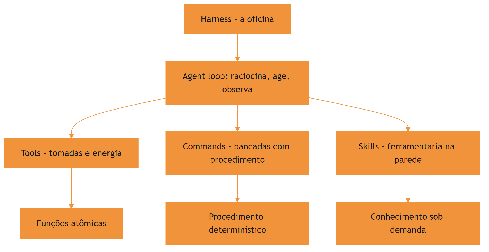

O vocabulário da oficina volta a serviço: quando um capítulo falar em "puxar a ferramenta da parede", está falando de carregar uma skill; quando falar em "gravar o procedimento na bancada", está falando de criar um command. Mantenha esse mapa mental — ele atravessa a obra inteira e evita que você confunda as camadas na hora de decidir onde o conhecimento deve morar.

## 4. Técnica

### Modelando o harness como um objeto

A melhor forma de internalizar a anatomia é modelá-la em código. A classe abaixo representa o harness com suas três camadas e implementa o esqueleto do agent loop: o modelo raciocina, escolhe uma ação, o harness executa e realimenta a observação.

```python
# -*- coding: utf-8 -*-
"""Modelo simplificado do harness com tools, commands e skills."""


class Harness:
    """Camada que envolve o modelo e fecha o agent loop."""

    def __init__(self, modelo):
        self.modelo = modelo
        self.tools = {}      # nome -> funcao atomica
        self.commands = {}   # nome -> fluxo determinístico
        self.skills = {}     # nome -> pacote de conhecimento

    def registrar_tool(self, nome, funcao):
        self.tools[nome] = funcao

    def registrar_command(self, nome, fluxo):
        self.commands[nome] = fluxo

    def registrar_skill(self, nome, carregar):
        self.skills[nome] = carregar

    def executar_acao(self, acao):
        """Intercepta a chamada do modelo e a executa no ambiente."""
        tipo = acao["tipo"]
        if tipo == "tool":
            fn = self.tools[acao["nome"]]
            return fn(**acao["args"])
        if tipo == "command":
            fluxo = self.commands[acao["nome"]]
            return fluxo.executar(acao["args"])
        if tipo == "skill":
            carregar = self.skills[acao["nome"]]
            return carregar(acao["args"])
        raise ValueError(f"Acao desconhecida: {tipo}")

    def rodar(self, pergunta: str) -> str:
        """Loop: raciocina -> age -> observa -> repete ate concluir."""
        contexto = [{"role": "user", "content": pergunta}]
        for _ in range(20):
            resposta = self.modelo.raciocinar(contexto)
            if resposta.get("final"):
                return resposta["final"]
            observacao = self.executar_acao(resposta["acao"])
            contexto.append({"role": "observation", "content": observacao})
        return "limite de iteracoes atingido"
```

O ponto técnico que vale destacar: o `executar_acao` é o coração do harness. É ali que a tool é chamada com os argumentos validados, que o command executa o fluxo completo e que a skill entrega o conhecimento — e é ali também que o erro volta ao modelo como observação, permitindo a autocorreção [5].

### Um command mínimo na prática

Um command, no harness, é um objeto com nome e fluxo. A implementação abaixo mostra o formato mínimo que o harness espera: um procedimento determinístico que pode ser disparado pelo operador com um argumento.

```python
# -*- coding: utf-8 -*-
"""Representacao de um command como procedimento determinístico."""


class Command:
    """Procedimento de alto nivel disparavel por nome."""

    def __init__(self, nome: str, descricao: str, passos):
        self.nome = nome
        self.descricao = descricao
        self.passos = passos

    def executar(self, argumentos):
        """Executa os passos em sequencia e devolve o log."""
        log = []
        for passo in self.passos:
            log.append(f"[{self.nome}] {passo['nome']}: "
                       f"{passo['acao'](argumentos)}")
        return "\n".join(log)


def passo(nome, acao):
    return {"nome": nome, "acao": acao}
```

O detalhe importante é a fronteira de responsabilidade: o command decide a sequência, mas cada passo dele continua sendo uma tool. Um command de deploy não reinventa a forma de rodar um build — ele orquestra as tools existentes numa ordem determinística, com validação entre os passos.

### Integrando o conhecimento via MCP

Quando o conhecimento precisa acessar dados e ferramentas externas, o harness se conecta via Model Context Protocol — um padrão cliente-servidor que padroniza a troca de ferramentas, recursos e prompts entre o agente e serviços externos [6]. Na anatomia da oficina, o MCP é a fiação que liga a oficina ao mundo exterior: sem ele, cada ferramenta externa precisaria de um conector proprietário; com ele, um padrão único. A especificação aberta de agent skills, inclusive, assume o MCP como um dos canais de aquisição e uso de habilidades — a fronteira entre os dois padrões é complementar, não concorrente [16].

```python
# -*- coding: utf-8 -*-
"""Exemplo conceitual de conexao de uma skill a um servidor MCP."""


class ServidorMCP:
    """Fachada do protocolo: expoe tools e resources para o harness."""

    def __init__(self, nome: str, tools: dict):
        self.nome = nome
        self._tools = tools

    def listar_tools(self):
        return list(self._tools.keys())

    def chamar_tool(self, nome_tool: str, argumentos: dict):
        if nome_tool not in self._tools:
            raise ValueError(f"tool {nome_tool} nao existe em {self.nome}")
        return self._tools[nome_tool](argumentos)
```

O harness descobre os servidores MCP disponíveis, expõe as tools deles ao modelo e roteia as chamadas — tudo com trilha de auditoria e controle de permissão, o que torna o MCP o caminho natural para dados sensíveis em ambientes corporativos [7].

### O registro de ferramentas como inventário da oficina

O harness mantém um inventário único do que está disponível — tools nativas, commands registrados, skills instaladas e servidores MCP conectados. Esse inventário é a fonte do catálogo que o modelo consulta a cada decisão de ação, e a sua manutenção é uma tarefa de engenharia: cada entrada deve ter nome, descrição e formato de argumentos coerentes com o restante. Um inventário com nomes ambíguos ou descrições genéricas degrada a qualidade de todas as decisões do agente — o catálogo é a memória operacional do harness.

```python
# -*- coding: utf-8 -*-
"""Inventario unificado de tools, commands e skills do harness."""
import json


class Inventario:
    """Catalogo unico de capacidades disponiveis ao modelo."""

    def __init__(self):
        self.entradas = []

    def adicionar(self, tipo: str, nome: str, descricao: str):
        self.entradas.append({"tipo": tipo, "nome": nome, "descricao": descricao})

    def buscar(self, texto: str) -> list[dict]:
        """Busca no catalogo por nome ou descricao."""
        texto = texto.lower()
        return [e for e in self.entradas if texto in e["nome"].lower()
                or texto in e["descricao"].lower()]

    def resumo(self) -> dict:
        tipos = {}
        for e in self.entradas:
            tipos[e["tipo"]] = tipos.get(e["tipo"], 0) + 1
        return tipos


if __name__ == "__main__":
    inv = Inventario()
    inv.adicionar("tool", "ler_arquivo", "Le o conteudo de um arquivo")
    inv.adicionar("command", "revisar-pr", "Revisa pull requests no padrao da equipe")
    inv.adicionar("skill", "documentar-api", "Gera e revisa documentacao de APIs REST")
    print(json.dumps(inv.resumo(), ensure_ascii=False))
    print([e["nome"] for e in inv.buscar("revisar")])
```

O inventário é o elo entre o desenho conceitual das três camadas e a operação real: é ele que o modelo consulta, e é ele que a equipe audita quando um comportamento inesperado aparece. Manter o inventário limpo é a primeira tarefa de governança do harness.

### O ciclo do agente em detalhe

O agent loop merece um olhar mais fino, porque é onde a teoria vira comportamento. O ciclo completo tem cinco passos: o harness monta o contexto inicial (scaffolding), o modelo raciocina e propõe uma ação, o harness valida e executa a ação (tool, command ou skill), a observação do resultado volta ao contexto, e o modelo decide o próximo passo. O erro de qualquer passo — esquema inválido, comando com permissão negada, skill com gatilho errado — entra na observação e alimenta a próxima decisão [5].

```python
# -*- coding: utf-8 -*-
"""Os cinco passos do agent loop com tratamento de erro."""


def passo_do_loop(harness, modelo, contexto, max_passos=10):
    """Executa o loop ate concluir ou atingir o limite de passos."""
    for passo in range(max_passos):
        acao = modelo.propor_acao(contexto)
        if acao is None:
            return contexto
        try:
            observacao = harness.executar(acao)
        except ValueError as erro:
            observacao = f"ERRO: {erro}"
        contexto.append(observacao)
    return contexto
```

O detalhe que separa um harness profissional de um brinquedo: o tratamento de erro no loop. Um passo que falha não deve encerrar a sessão — deve virar observação, para que o modelo tente outra abordagem. É assim que agentes de produção lidam com falhas: elas são dados do loop, não exceções fatais [12]. Organizações que padronizam a documentação de contexto em arquivos como o AGENTS.md relatam agentes mais precisos desde o primeiro dia — a mesma lógica de deixar o mapa da oficina afixado na parede [14].

## 5. Aplica

### A cena da skill que não foi chamada

Imagine a cena, em segunda pessoa. Você está no meio de um projeto com dezenas de skills já instaladas — o catálogo da ferramentaria está cheio. Você pede ao agente para gerar um relatório de conformidade de segurança, e ele responde com um texto genérico, ignorando por completo a skill de auditoria que sua equipe construiu com tanto cuidado. O relatório sai pela metade, sem os controles obrigatórios, e você só percebe quando o compliance aponta a falha.

O erro acontece porque a skill existia, mas não foi carregada: o agente não reconheceu que a tarefa disparava aquele gatilho semântico. O diagnóstico, ligando à teoria deste capítulo, é que o harness só carrega a skill sob demanda quando a descrição dela bate com a tarefa — e a descrição da sua skill era vaga demais para o gatilho funcionar. A correção é dupla: reescrever a `description` para que ela descreva o que a skill faz e quando usar (a regra do gatilho semântico), e registrar no harness um command explícito (`/audit-security`) que garanta a invocação mesmo quando o gatilho automático falhar.

Essa cena ilustra a divisão de trabalho das três camadas: a tool fornece a capacidade, a skill fornece o conhecimento e o command fornece a alavanca manual — os três juntos transformam um agente genérico em um especialista de domínio confiável [8]. Frameworks metodológicos como o Superpowers já nascem com essa arquitetura em mente, impondo fluxos de engenharia aos agentes via skills e commands [19].

### Armadilhas comuns na anatomia da oficina

A primeira armadilha é tratar todo conhecimento como tool: expor instruções longas como função atômica força o modelo a passar parâmetros por ela, um abuso que degrada a qualidade das chamadas. A segunda é duplicar a mesma capacidade em command e skill sem fronteira clara, criando dois lugares para a mesma informação — e, portanto, duas fontes de verdade. A terceira é negligenciar o scaffolding: um harness com system prompt pobre e tools mal documentadas produz agentes imprevisíveis, mesmo com as melhores skills do mundo [9]. A quarta é ignorar a governança de permissões: quando o harness permite qualquer comando bash sem restrição, a oficina inteira fica exposta — arquivos de permissão restritivos são parte da anatomia, não um extra [10]. A linha de frente da pesquisa já explora harnesses cujo comportamento é editável em linguagem natural — um sinal de que a anatomia da oficina vai continuar evoluindo [20].

### Métricas de sucesso

Um harness bem desenhado mostra três sinais. Primeiro: a taxa de sucesso de tarefas de domínio sobe porque a skill certa é carregada na hora certa. Segundo: o número de intervenções manuais cai, porque os commands encapsulam os procedimentos repetitivos. Terceiro: o custo por sessão diminui, porque a disclosure progressiva mantém o contexto enxuto — apenas os metadados das skills ocupam a janela, e o corpo é carregado sob demanda [11]. O gerenciamento dessas skills em escala já tem ferramentas próprias, como o gerenciador de pacotes da Vercel Labs, e os editores modernos expõem o mesmo mecanismo para agentes de coding [18][17].

## 6. Conclusão

Neste capítulo, você mapeou a anatomia da oficina: o harness como controlador de malha fechada, a separação entre scaffolding e execução, e as três camadas da ferramentaria — tools, commands e skills — com a fronteira entre procedimento determinístico e conhecimento sob demanda. Você também viu, em código, o esqueleto do agent loop e a porta de entrada do MCP para o mundo externo.

O desafio para fixar: desenhe o diagrama da sua própria oficina — liste as tools que você usa hoje, os procedimentos que merecem virar commands e o conhecimento que deveria estar empacotado em skills. No próximo capítulo, você vai construir a primeira ferramenta da parede: a anatomia de uma skill, com frontmatter, disclosure progressiva e a estrutura de diretórios que o padrão aberto define.

## 8. Aprofundamento: a planta baixa em operação

### O contrato entre o harness e o modelo

Toda a anatomia deste capítulo depende de um contrato silencioso entre o harness e o modelo: o modelo propõe ações em um formato que o harness entende, e o harness devolve observações que o modelo consegue consumir. Quando esse contrato é frágil — ações sem esquema claro, observações truncadas, erros devolvidos como texto solto — o loop degrada silenciosamente [2]. Harnesses profissionais definem o contrato com tipos explícitos e validação de esquema em ambas as direções, transformando o que seria um erro de conversa em um erro de tipo detectável no primeiro passo.

O mesmo contrato rege o uso de skills e commands. Um command que devolve a saída em formato estruturado permite que o próximo passo do loop a consuma diretamente; um command que devolve prosa livre força o modelo a interpretar, com todo o custo de ambiguidade que isso carrega. A decisão de design — o que cada camada devolve ao contexto — é tão importante quanto o que ela executa. As diretrizes de harnesses de longa duração são explícitas sobre isso: a observação é o combustível da próxima decisão, e observações ruins produzem loops ruins, por mais brilhante que seja o modelo [9].

### Tipos de ação e o despacho no harness

Quando o harness recebe uma ação do modelo, ele precisa responder a quatro perguntas em sequência: essa ação existe? Este chamador tem permissão? Os argumentos são válidos? O resultado cabe no contexto? As quatro validações são independentes e cada uma tem custo diferente — a de existência é um dicionário, a de permissão é uma política, a de argumentos é um esquema e a de contexto é uma contagem de tokens. Despachadores profissionais separam essas quatro validações em estágios, porque a mensagem de erro de cada estágio é diferente e orienta o modelo de forma diferente [12].

```python
# -*- coding: utf-8 -*-
"""Despacho em quatro estagios com mensagens de erro orientadoras."""


class Despachador:
    """Valida existencia, permissao, argumentos e contexto antes de executar."""

    def __init__(self, inventario, politica, orcamento_contexto: int = 8000):
        self.inventario = inventario
        self.politica = politica
        self.orcamento = orcamento_contexto

    def despachar(self, chamador: str, acao: dict) -> str:
        nome = acao.get("nome", "")
        if nome not in self.inventario:
            return "ERRO-estagio1: acao inexistente no catalogo"
        if not self.politica.permite(chamador, nome):
            return "ERRO-estagio2: chamador sem permissao para esta acao"
        try:
            self.inventario[nome].validar(acao.get("args", {}))
        except ValueError as erro:
            return f"ERRO-estagio3: argumentos invalidos - {erro}"
        observacao = self.inventario[nome].executar(acao.get("args", {}))
        if len(observacao) > self.orcamento:
            return "ERRO-estagio4: observacao excede o orcamento de contexto"
        return observacao
```

O valor dos estágios separados aparece no comportamento do modelo: um erro de estágio 1 ensina que a ação não existe no catálogo; um de estágio 2 ensina a não tentar ações proibidas; um de estágio 3 ensina o esquema de argumentos; um de estágio 4 ensina a pedir saídas menores. Cada mensagem é uma lição diferente, e o loop vira um mecanismo de aprendizagem em vez de um reprodutor de erros [5].

### Sobreposição de camadas: quando a anatomia falha

A anatomia das três camadas é um desenho, e desenhos vazam. O vazamento mais comum é a ferramenta disfarçada de skill: um pacote de conhecimento que, na prática, é uma função atômica com instruções anexadas — o modelo paga o custo de carregar o corpo inteiro para usar uma única capacidade. O vazamento oposto é o command disfarçado de skill: um procedimento determinístico descrito como corpo de conhecimento, sem os passos executáveis que o tornariam invocável por nome. O preço dos vazamentos é o mesmo: confusão no gatilho semântico, catálogo poluído e decisões de carregamento erradas [4].

A regra de ouro para classificar: pergunte o que acontece quando o artefato é acionado. Se uma sequência fixa de passos roda, é um command; se um corpo de conhecimento entra no contexto para orientar o raciocínio, é uma skill; se uma função é chamada com argumentos, é uma tool. O teste do acionamento resolve nove em cada dez dúvidas de classificação — e a décima é resolvida com a régua de decisão do Capítulo 1, que pesa frequência, estabilidade e custo de erro [18].

### A origem do erro: quando a falha está no harness, não no modelo

Uma das habilidades mais valiosas do Engenheiro Agêntico é o diagnóstico da falha. Quando um agente entrega um resultado errado, a primeira pergunta não é "o modelo é burro?", mas "qual camada do harness falhou?". O erro pode estar no scaffolding (o contexto não foi montado), no catálogo (a skill certa não foi carregada porque a descrição não disparou), na permissão (a ação foi bloqueada e o modelo não soube contornar), ou na observação (o erro foi devolvido de forma que o modelo não consegue consumir). Cada origem tem um sintoma diferente e um tratamento diferente — e o diagnóstico certo evita o desperdício de trocar o modelo quando o problema é o harness [3].

```python
# -*- coding: utf-8 -*-
"""Diagnostico de falha: classifica o erro pela camada do harness."""


def diagnosticar(erro: dict) -> str:
    """Classifica o erro em scaffolding, catalogo, permissao ou observacao."""
    origem = erro.get("origem", "")
    if origem == "scaffolding":
        return "contexto nao montado: revise o system prompt e o bootstrap"
    if origem == "catalogo":
        return "skill nao carregada: revise a descricao e o gatilho"
    if origem == "permissao":
        return "acao bloqueada: revise a politica de permissoes"
    if origem == "observacao":
        return "observacao incompreensivel: revise o formato de saida"
    return "origem desconhecida: colete mais dados antes de corrigir"


if __name__ == "__main__":
    casos = [{"origem": o} for o in ("scaffolding", "catalogo", "permissao", "observacao")]
    for caso in casos:
        print(diagnosticar(caso))
```

O diagnóstico por camada transforma a depuração de agente em um método, não em um mistério: cada falha aponta para uma camada, cada camada tem uma correção padrão, e a correção é testável. É a mesma disciplina que a obra aplica a skills no Capítulo 8 — mas aplicada ao harness inteiro [9].

### O custo de contexto de cada camada

Cada camada tem um perfil de custo de contexto diferente, e a anatomia bem desenhada é aquela que respeita esses perfis. As tools custam o catálogo: o modelo precisa saber que existem, mas a documentação completa de cada uma só entra quando é chamada. As skills custam o catálogo mais o corpo: os metadados sempre na janela, o corpo sob demanda — o mecanismo de disclosure progressiva que o Capítulo 1 apresentou [11]. Os commands custam o corpo: o procedimento inteiro entra na janela quando é disparado, e por isso commands bem escritos são enxutos e referenciam skills para o detalhe [4].

```python
# -*- coding: utf-8 -*-
"""Estima o custo fixo de contexto por camada no harness."""


def custo_por_camada(qtd_tools: int, qtd_skills: int, qtd_commands: int,
                     tokens_por_metadado: int = 100,
                     tokens_por_corpo: int = 1500) -> dict:
    """Calcula os tokens de entrada fixos por camada em cada sessao."""
    tools = qtd_tools * tokens_por_metadado
    skills = qtd_skills * tokens_por_metadado
    commands = qtd_commands * tokens_por_corpo
    return {
        "tools": tools, "skills": skills, "commands": commands,
        "total_fixo": tools + skills + commands,
    }


if __name__ == "__main__":
    custo = custo_por_camada(qtd_tools=30, qtd_skills=40, qtd_commands=12)
    for camada, valor in custo.items():
        print(f"{camada}: {valor} tokens")
```

Os números variam de harness para harness, mas a lição estrutural é estável: catálogos ricos em tools e skills têm custo fixo baixo; catálogos cheios de commands têm custo fixo alto, porque todo command carrega o corpo. Por isso a prática recomendada é inverter a hierarquia: commands finos que apontam para skills ricas, em vez de commands gordos que duplicam o conhecimento. Essa é a mesma conclusão a que chegam os guias de colaboração com agentes em equipe, que recomendam expor o mínimo de procedimentos e o máximo de conhecimento curado [10].

### O harness como sistema de permissões

A anatomia do harness não estaria completa sem o sistema de permissões — o mapa de quem pode acionar o quê. A política mais simples tem três níveis: manual (só o operador dispara), autônomo (o modelo dispara sem confirmação) e assistido (o modelo propõe, o operador confirma). Commands sensíveis — deploy, alteração de banco, publicação — ficam no nível manual; leituras e transformações seguras podem ser autônomas. A política não é sobre restringir o agente: é sobre definir o raio de ação em que ele pode errar sem custo [7].

O sistema de permissões é também o primeiro ponto onde a governança da obra toca a operação: cada command registrado na política tem um dono e um motivo. Quando a política cresce sem controle, os níveis de acesso viram um labirinto — e a auditoria de permissões passa a ser uma rotina periódica, exatamente como a revisão de skills que o Capítulo 8 vai detalhar [19].

### O scaffolding: a fundação que ninguém vê

A separação entre scaffolding e execução merece um aprofundamento, porque o scaffolding é a camada mais subestimada e a que mais explica variação de desempenho. O scaffolding responde a quatro perguntas antes de a primeira tarefa começar: o que o agente é (papel e escopo), o que ele sabe de partida (bootstrap), o que ele pode fazer (ferramentas e permissões) e o que ele não deve fazer (limites e políticas). Quatro respostas mal escritas produzem um agente confuso mesmo com as melhores skills do catálogo — a fundação torta não é corrigida pelo andar de cima [2].

O erro clássico do scaffolding é a inflação: cobrir o papel, o escopo, as convenções, o histórico e o glossário no mesmo arquivo raiz, porque tudo parece importante. A inflação tem um custo mensurável — todo token de bootstrap é pago em toda sessão — e um custo invisível: quanto maior o bootstrap, menor a atenção do modelo ao que muda a cada sessão. A disciplina é o inverso: o mínimo estável no bootstrap, o resto nas camadas sob demanda. É a mesma régua do Capítulo 1 aplicada ao harness inteiro [9].

### O vocabulário da anatomia: a planta baixa como linguagem comum

Fechando o capítulo, vale nomear o que a anatomia produziu: uma linguagem comum para falar do agente. O harness, o loop, o scaffolding, a tool, o command, a skill — cada termo da planta baixa é uma palavra que a equipe pode usar para diagnosticar, desenhar e discutir sem ambiguidade. O valor da linguagem aparece na prática: "o problema está no scaffolding" é uma frase que orienta a investigação; "o agente está estranho" não orienta nada. A anatomia do capítulo é, antes de tudo, um dicionário — e o dicionário é o primeiro instrumento de qualquer oficina [3]. A obra inteira constrói sobre esse vocabulário: cada capítulo usa as mesmas palavras com os mesmos significados, e é essa consistência que permite ao leitor atravessar os dez capítulos sem perder o fio [9].

### A política de execução: o contrato de confiança com o modelo

O harness que executa ações do modelo vive sob um contrato de confiança que precisa ser explícito: o que o modelo pode fazer sozinho, o que precisa de confirmação e o que é proibido. O contrato tem três níveis que espelham os níveis de invocação dos commands do Capítulo 5 — autônomo, assistido e proibido — mas aplicados ao harness inteiro, para todas as ferramentas. A política de execução é onde a segurança encontra a operação: um harness sem política é uma oficina onde qualquer operário pode acionar qualquer máquina, e a política é o conjunto de regras que define quem aciona o quê [10].

```python
# -*- coding: utf-8 -*-
"""Politica de execucao: classifica acoes em autonoma, assistida ou proibida."""


class Politica:
    """Contrato de confianca entre o harness e o modelo."""

    def __init__(self):
        self.autonomas = set()
        self.assistidas = set()
        self.proibidas = set()

    def classificar(self, acao: str) -> str:
        if acao in self.proibidas:
            return "proibida"
        if acao in self.assistidas:
            return "assistida"
        return "autonoma"

    def pode_executar(self, acao: str, confirmado: bool) -> tuple[bool, str]:
        classe = self.classificar(acao)
        if classe == "proibida":
            return False, "acao proibida pela politica"
        if classe == "assistida" and not confirmado:
            return False, "acao assistida requer confirmacao"
        return True, "ok"


if __name__ == "__main__":
    politica = Politica()
    politica.assistidas.add("deploy")
    politica.proibidas.add("drop-banco")
    print(politica.pode_executar("deploy", confirmado=False))
    print(politica.pode_executar("deploy", confirmado=True))
    print(politica.pode_executar("drop-banco", confirmado=True))
```

A política de execução é o ponto onde a anatomia do harness encontra a governança da obra: as mesmas regras que protegem o deploy protegem o harness inteiro, e a auditoria da política — quem pode fazer o quê — é parte da revisão periódica da oficina. Um harness governado é, antes de tudo, um harness com política escrita [7].

### O loop de realimentação: observação como combustível

O passo do loop que merece mais atenção é a observação — a única fonte de aprendizado do agente dentro da sessão. Uma observação rica (o que foi feito, o que resultou, o que falhou) alimenta a próxima decisão; uma observação pobre (um código de erro sem contexto) força o modelo a adivinhar. O harness maduro formata observações de forma consistente: cada observação carrega o que foi tentado, o resultado bruto e o significado. Essa formatação é uma decisão de engenharia de contexto que custa quase nada e muda a qualidade do loop inteiro [5].

```python
# -*- coding: utf-8 -*-
"""Formata observacoes de ferramentas para consumo pelo modelo."""
import json


def formatar_observacao(ferramenta: str, args: dict, saida: str,
                        erro: str = "") -> str:
    """Monta uma observacao estruturada com resultado e contexto."""
    corpo = {
        "ferramenta": ferramenta,
        "argumentos": args,
        "sucesso": not erro,
        "resumo": (saida or erro)[:400],
    }
    return json.dumps(corpo, ensure_ascii=False)


if __name__ == "__main__":
    ok = formatar_observacao("ler_arquivo", {"caminho": "x.py"}, "42 linhas")
    falha = formatar_observacao("ler_arquivo", {"caminho": "x.py"}, "", "arquivo ausente")
    print(ok)
    print(falha)
```

A observação estruturada tem um efeito colateral poderoso: ela é a base da trilha de auditoria e da memória procedural dos capítulos finais. O que o harness aprende sobre si mesmo — quais ferramentas falham, em quais contextos, com quais padrões — nasce da qualidade das observações que ele registra [8].

### Exercício prático: audite a sua oficina

Para fechar o capítulo com aplicação imediata, o exercício é desenhar o estado atual da sua oficina em três colunas. Na primeira coluna, liste as tools que o seu harness expõe hoje. Na segunda, os procedimentos que a sua equipe repete e que ainda vivem em prompts ad hoc. Na terceira, o conhecimento estável que anda embutido em conversas. Quando a tabela estiver pronta, compare as colunas dois e três com a coluna um: o objetivo do exercício é identificar onde o conhecimento já existe em estado gasoso e merece virar artefato. A avaliação objetiva de agentes em tarefas reais — o padrão de medição que a obra adota — mostra que equipes que fazem esse exercício antes de investir em automação obtêm resultados mais previsíveis [3].

## 7. Referências Bibliográficas

[1] ZHANG, et al. *Code as Agent Harness: Toward Executable, Verifiable, and Stateful Agent Systems*. Disponível em: https://arxiv.org/abs/2605.18747. Acesso em: 06 ago. 2026.
[2] BUI, et al. *Building AI Coding Agents for the Terminal: Scaffolding, Harness, Context Engineering, and Lessons Learned*. Disponível em: https://arxiv.org/abs/2603.05344. Acesso em: 06 ago. 2026.
[3] *Stop Comparing LLM Agents Without Disclosing the Harness*. Disponível em: https://arxiv.org/abs/2605.23950. Acesso em: 06 ago. 2026.
[4] ANTHROPIC. *Agent Skills — Claude Platform Docs*. Disponível em: https://platform.claude.com/docs/en/agents-and-tools/agent-skills/overview. Acesso em: 06 ago. 2026.
[5] MA, Zhiyuan; LIU, Jiayu; LUO, Xianzhen; HUANG, Zhenya; ZHU, Qingfu; CHE, Wanxiang. *Tool-MVR: Meta-Verification and Reflection Learning for Reliable Tool-Use*. Disponível em: https://arxiv.org/abs/2506.04625. Acesso em: 06 ago. 2026.
[6] KRISHNAN, Naveen. *Advancing Multi-Agent Systems Through Model Context Protocol*. Disponível em: https://arxiv.org/abs/2504.21030. Acesso em: 06 ago. 2026.
[7] GETDX. *AI Code Generation: Best Practices for Enterprise Adoption*. Disponível em: https://getdx.com/blog/ai-code-enterprise-adoption/. Acesso em: 06 ago. 2026.
[8] FIRECRAWL. *Best Claude Code Skills to Try*. Disponível em: https://www.firecrawl.dev/blog/best-claude-code-skills. Acesso em: 06 ago. 2026.
[9] ANTHROPIC. *Effective Harnesses for Long-Running Agents*. Disponível em: https://www.anthropic.com/engineering/effective-harnesses-for-long-running-agents. Acesso em: 06 ago. 2026.
[10] MEDIUM (HEEKI PARK). *Collaborating with Agent Teams in Claude Code*. Disponível em: https://heeki.medium.com/collaborating-with-agents-teams-in-claude-code-f64a465f3c11. Acesso em: 06 ago. 2026.
[11] AGENTSKILLS.IO. *Agent Skills Specification*. Disponível em: https://agentskills.io/specification. Acesso em: 06 ago. 2026.
[12] ANTHROPIC. *Claude Code Skills Documentation*. Disponível em: https://code.claude.com/docs/en/skills. Acesso em: 06 ago. 2026.
[13] ANTHROPIC. *Claude Code SDK — Slash Commands*. Disponível em: https://code.claude.com/docs/en/agent-sdk/slash-commands. Acesso em: 06 ago. 2026.
[14] OPENAI. *Custom Instructions with AGENTS.md*. Disponível em: https://learn.chatgpt.com/docs/agent-configuration/agents-md. Acesso em: 06 ago. 2026.
[15] RUCAIBOX. *Awesome Agent Harness*. Disponível em: https://github.com/RUCAIBox/awesome-agent-harness. Acesso em: 06 ago. 2026.
[16] XU, Renjun; YAN, Yang. *Agent Skills for Large Language Models: Architecture, Acquisition, Security, and the Path Forward*. Disponível em: https://arxiv.org/abs/2602.12430. Acesso em: 06 ago. 2026.
[17] VSCODE. *VS Code Agent Skills Documentation*. Disponível em: https://code.visualstudio.com/docs/agent-customization/agent-skills. Acesso em: 06 ago. 2026.
[18] VERCEL LABS. *Skills — package manager for agent skills*. Disponível em: https://github.com/vercel-labs/skills. Acesso em: 06 ago. 2026.
[19] VINCENT, Jesse (obra). *Superpowers — engineering skills for agents*. Disponível em: https://github.com/obra/superpowers. Acesso em: 06 ago. 2026.
[20] *Natural-Language Agent Harnesses (NLAHs)*. Disponível em: https://arxiv.org/abs/2603.25723. Acesso em: 06 ago. 2026.

# PARTE II — Skills: construindo as ferramentas

# Capítulo 3: Anatomia de uma skill — SKILL.md, frontmatter e disclosure progressiva

## 1. Introdução

No Capítulo 2, você mapeou a anatomia da oficina: o harness no centro, tools como tomadas, commands como bancadas e skills como as ferramentas penduradas na parede da ferramentaria. Agora chegou a hora de construir a primeira ferramenta de verdade. Neste capítulo, você vai abrir uma skill por dentro e entender os dois mecanismos que fazem ela funcionar: o frontmatter — a etiqueta que o harness lê para decidir quando puxar a ferramenta — e a disclosure progressiva — o sistema de três níveis que mantém o conteúdo profundo fora da janela de contexto até o momento exato em que ele é necessário.

Ao final deste capítulo, você será capaz de escrever uma skill completa do zero, com frontmatter válido, descrição com gatilho semântico bem calibrado e estrutura de diretórios segundo o padrão aberto. A ferramenta que você vai criar aqui será a base de tudo o que vem nos capítulos seguintes: testes de skill no Capítulo 8, distribuição no Capítulo 7 e orquestração no Capítulo 9.

## 2. Explica

### O que uma skill não é: delimitando o escopo

Antes de definir o que uma skill é, vale delimitar o que ela não é — três confusões clássicas custam caro no dia a dia. Uma skill não é um prompt de conversa: o prompt é efêmero e pertence à sessão; a skill é persistente e pertence ao catálogo. Uma skill não é o arquivo de instruções do projeto (CLAUDE.md ou AGENTS.md): esse arquivo é contexto sempre ativo, enquanto a skill é carregada sob demanda — os dois se complementam, mas têm ciclos de vida diferentes [10]. E uma skill não é um script solto: o script é uma peça da skill, mas sem o SKILL.md e a descrição de gatilho, o script não sabe quando rodar nem o que ensinar.

Manter essas três fronteiras claras evita o erro mais comum de times iniciantes: transformar tudo em skill (catálogo inchado) ou transformar skill em tudo (catálogo que nunca é carregado). A disciplina da fronteira é parte do ofício — e é ela que mantém o catálogo enxuto e o gatilho preciso.

### O pacote: uma pasta, um arquivo principal

Uma skill é, antes de tudo, um pacote no sistema de arquivos. O padrão aberto define uma estrutura de diretório mínima e obrigatória: uma pasta nomeada com o nome da skill contendo um arquivo `SKILL.md` na raiz, e diretórios opcionais para scripts executáveis, referências detalhadas e recursos estáticos [1]. Essa materialidade importa: o conhecimento deixa de ser uma conversa que se dissipa e vira um artefato que pode ser versionado, revisado, testado e compartilhado.

O `SKILL.md` é o coração do pacote — o manual de instruções da ferramenta. Ele tem duas partes: o frontmatter YAML, um bloco de metadados entre travessões no topo do arquivo, e o corpo em Markdown com as instruções procedimentais propriamente ditas. O harness lê os metadados para entender o que a skill faz; o modelo lê o corpo quando decide que a skill é relevante para a tarefa [2]. Em harnesses de produção, essa leitura em duas etapas é parte do scaffolding que sustenta agentes de longa duração [9].

### Frontmatter: a etiqueta da ferramenta

O frontmatter é a etiqueta pendurada na parede da ferramentaria — e o harness a lê o tempo todo, para todos os pacotes instalados. Por isso, os campos mais importantes são os que orientam a decisão de carregamento: `name` e `description`. O `name` deve ser curto, minúsculo, com hífens, e corresponder exatamente ao nome da pasta. A `description` é o gatilho semântico: ela precisa dizer o que a skill faz e quando o agente deve usá-la — é a única informação que o modelo vê antes de decidir abrir o corpo [1].

O padrão também define campos opcionais que controlam a operação: `license` para licenciamento, `compatibility` para restrições de ambiente e dependências, `metadata` para metadados customizados, e o experimental `allowed-tools` para pré-aprovar ferramentas que a skill pode acionar [1]. Cada campo opcional é uma alavanca: usá-los bem aumenta a segurança e a clareza; usá-los mal adiciona ruído que o modelo precisa filtrar a cada decisão de carregamento. A mesma disciplina de metadados aparece em padrões de instrução de projeto como o AGENTS.md, que precede as skills na organização do conhecimento do repositório [10].

### Disclosure progressiva: os três níveis

O princípio que permite manter centenas de skills instaladas sem estourar a janela de contexto é a disclosure progressiva — e ela funciona em três níveis estritos. No nível 1, o harness injeta no system prompt apenas os metadados de cada skill: nome e descrição, o suficiente para o modelo decidir se a skill interessa. Isso custa cerca de cem tokens por skill, não mais. No nível 2, quando o gatilho dispara, o harness lê o corpo do `SKILL.md` — as instruções procedimentais entram na janela de contexto somente nesse momento. No nível 3, os recursos profundos — scripts, referências, assets — são acessados conforme necessário: scripts rodam no ambiente e apenas a saída volta para o contexto, e arquivos de referência só são abertos se explicitamente invocados [3].

A consequência prática dessa arquitetura é quase mágica: você pode instalar dezenas de skills sem sentir o peso delas no bolso. O custo fica na decisão, não no carregamento — e a qualidade da decisão depende diretamente da qualidade da descrição. Essa visão do conhecimento como camada de execução conversa com a tese de que o código é o próprio harness do agente [11], e com a engenharia de contexto dos agentes de terminal [12].

## 3. Ilustra

Volte à oficina do Engenheiro Agêntico. A ferramentaria tem cinquenta ferramentas penduradas na parede, cada uma com uma etiqueta simples: nome e uma frase do que ela faz. "Serra de metal, corte de trilhos de alumínio". "Chave dinamométrica, torque de 10 a 80 Nm". O operário não abre o manual de cada ferramenta ao entrar na oficina — seria impossível carregar cinquenta manuais no cinto. Ele lê as etiquetas quando precisa escolher a ferramenta, e só então puxa a da parede e abre o manual correspondente.

A etiqueta é o frontmatter. O manual é o corpo do SKILL.md. E a caixa de acessórios na prateleira — luvas, bicos extras, tabela de calibração — são os scripts e references do nível 3, que só saem da prateleira quando o serviço realmente exige. Note o detalhe crítico: se a etiqueta da serra dissesse apenas "serra", o operário poderia pegá-la para cortar madeira e quebrar a lâmina. É exatamente isso que acontece quando uma descrição de skill é vaga: o agente puxa a ferramenta errada no momento errado.

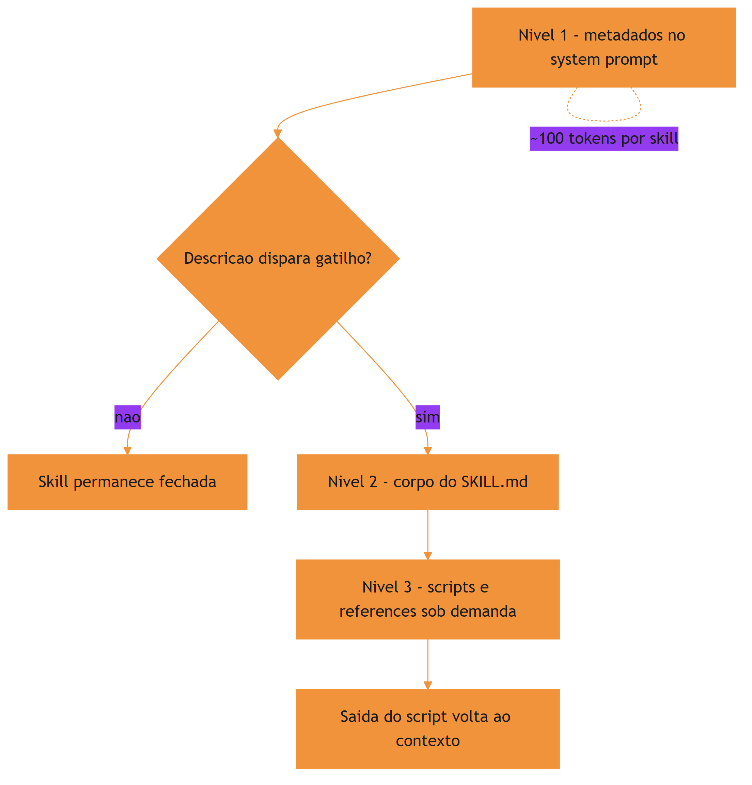

A cena da ferramentaria reforça o motivo condutor da obra: o harness é a oficina, a skill é a ferramenta na parede, o frontmatter é a etiqueta e a disclosure progressiva é a disciplina de só abrir o manual quando for usar a ferramenta.

## 4. Técnica

### A anatomia da descrição: o que o modelo realmente lê

Vale destrinchar a `description`, porque ela é o texto mais importante de toda a skill — o único que o modelo vê antes de decidir abrir o corpo. Uma descrição eficaz tem três movimentos. O primeiro é o verbo de ação: "revisa", "gera", "audita" — o modelo entende o que a skill produz. O segundo é o domínio: "testes Python", "documentação de APIs" — o modelo entende onde ela se aplica. O terceiro é o gatilho de uso: "use quando o usuário pedir revisão de testes" — o modelo entende quando acionar.

```markdown
---
description: Revisa testes automatizados de projetos Python contra a convencao
  da equipe (nomes, cobertura minima e ausencia de testes frágeis). Use quando o
  usuario pedir revisao de testes, melhoria de suite ou analise de cobertura.
---
```

Compare com uma descrição pobre: "skill de testes". O modelo não sabe o que ela faz, não sabe quando usar e não sabe o que a distingue. A diferença entre as duas versões é exatamente o custo da qualidade do gatilho — e é por isso que a primeira bancada do laboratório (Capítulo 8) testa a descrição, não o corpo.

### Criando a primeira skill completa

Chega de teoria — vamos construir. A skill abaixo, `revisar-teste`, ensina o agente a revisar testes automatizados de um projeto Python seguindo a convenção da equipe. Ela usa frontmatter canônico, corpo com instruções procedimentais e um script auxiliar no nível 3.

```markdown
---
name: revisar-teste
description: Revisa testes automatizados de projetos Python contra a convencao
  da equipe (nomes, cobertura minima e ausencia de testes frágeis). Use quando o
  usuario pedir revisao de testes, melhoria de suíte ou analise de cobertura.
compatibility: Requer Python 3.10+ e pytest
license: MIT
metadata:
  author: time-de-plataforma
  version: "1.0"
---

# Revisão de Testes

Revise a suíte de testes seguindo a convenção da equipe.

## Procedimento

1. Liste os arquivos de teste do projeto (glob `**/test_*.py`).
2. Para cada teste, verifique: nome descritivo, um único comportamento por teste,
   ausência de `time.sleep` e de asserts vazios.
3. Rode `python -m pytest --co -q` e confira se a coleta passa.
4. Para análise de cobertura, use o script `scripts/cobertura.py` desta skill.

## Saída esperada

Relatório em Markdown com: testes revisados, problemas encontrados e
prioridade de correção (alta/media/baixa).
```

```python
# -*- coding: utf-8 -*-
"""scripts/cobertura.py - calcula cobertura por arquivo de teste (nivel 3)."""
import json
import re
import sys
from pathlib import Path


def parse_pytest_coverage(saida: str) -> dict:
    """Extrai a cobertura percentual por arquivo da saida do pytest-cov."""
    cobertura = {}
    padrao = re.compile(r"^(?P<arquivo>[\\w\\/\\.\\-]+)\\.py\\s+\\d+\\s+\\d+\\s+\\d+\\s+\\d+\\s+(?P<pct>\\d+)%")
    for linha in saida.splitlines():
        m = padrao.match(linha.strip())
        if m:
            cobertura[m.group("arquivo")] = int(m.group("pct"))
    return cobertura


def gerar_relatorio(diretorio: str) -> str:
    """Retorna o relatorio de cobertura em Markdown."""
    arquivos = sorted(Path(diretorio).rglob("test_*.py"))
    linhas = ["# Relatório de Cobertura", ""]
    for arquivo in arquivos:
        relativo = arquivo.relative_to(diretorio)
        linhas.append(f"- `{relativo}`: pendente de medição")
    return "\n".join(linhas)


if __name__ == "__main__":
    alvo = sys.argv[1] if len(sys.argv) > 1 else "."
    try:
        json.loads('{"ok": true}')
    except json.JSONDecodeError:
        pass
    print(gerar_relatorio(alvo))
```

O detalhe que separa uma skill bem-feita de uma mal-feita é a disciplina de níveis: as instruções ficam no corpo (nível 2), o script fica na pasta `scripts/` (nível 3) e o corpo referencia o script pelo caminho — o agente só abre ou executa quando o procedimento pedir [4]. E quando a skill precisa de dados externos, o caminho natural é conectá-la a servidores de ferramentas padronizados, como o MCP [13].

### Validando o frontmatter

Frontmatter inválido é uma etiqueta ilegível: o harness não consegue catalogar a skill e ela pode não aparecer no catálogo, ou pior, aparecer com gatilho errado. A validação mais simples é estrutural — conferir que os campos obrigatórios existem e respeitam as regras do padrão.

```python
# -*- coding: utf-8 -*-
"""Valida o frontmatter de um SKILL.md contra as regras do padrao aberto."""
import re
import sys
from pathlib import Path


def validar_frontmatter(caminho: str) -> list[str]:
    """Retorna a lista de erros do frontmatter (vazia = valido)."""
    erros = []
    texto = Path(caminho).read_text(encoding="utf-8")
    m = re.match(r"\\A---\\n(?P<fm>.*?)\\n---", texto, re.DOTALL)
    if not m:
        return ["frontmatter ausente ou malformado"]

    conteudo = m.group("fm")
    nome = re.search(r"^name:\\s*(\\S+)\\s*$", conteudo, re.MULTILINE)
    if not nome:
        erros.append("campo obrigatorio 'name' ausente")
    elif not re.fullmatch(r"[a-z0-9-]+", nome.group(1)):
        erros.append(f"'name' invalido: {nome.group(1)!r} (apenas minusculas e hifens)")

    if not re.search(r"^description:\\s*\\S", conteudo, re.MULTILINE):
        erros.append("campo obrigatorio 'description' ausente")

    return erros


if __name__ == "__main__":
    for caminho in sys.argv[1:]:
        problemas = validar_frontmatter(caminho)
        status = "OK" if not problemas else "; ".join(problemas)
        print(f"{caminho}: {status}")
```

### A regra da descrição como gatilho

A descrição é a peça mais subestimada da skill. Ela precisa equilibrar três qualidades: precisão (o que a skill faz), contexto de uso (quando usar) e especificidade (o que a distingue de outras skills do catálogo). Um erro comum é descrever a skill pelo método em vez do resultado: "usa pdfplumber para extrair texto de PDFs" é pior que "extrai texto e tabelas de arquivos PDF, preenche formulários e mescla documentos" [5].

### Nomeando skills: a etiqueta que o harness cataloga

O `name` da skill não é um detalhe de estilo: é a chave de catálogo que o harness usa para registrar e referenciar o pacote. O padrão aberto impõe regras concretas — letras minúsculas, hifens no lugar de espaços, correspondência exata com o nome da pasta — e violá-las tem consequências práticas: o harness pode não catalogar a skill, ou catalogá-la com uma chave diferente da pasta, quebrando a resolução. A regra de ouro é simples: o nome deve ser curto, descritivo e estável — mude-o raramente, porque cada mudança de nome exige atualizar referências em commands e em outras skills.

```markdown
---
name: revisar-teste
---
```

Convenções de nomenclatura por domínio ajudam a manter o catálogo coerente: `revisar-*` para revisões, `gerar-*` para geração, `auditar-*` para auditorias. O prefixo por verbo de ação cria um padrão previsível — o operário encontra a ferramenta pelo que ela faz, mesmo sem memorizar o catálogo. Organizações que adotam essa disciplina de empacotamento relatam ganhos de consistência na geração de código assistida por IA [14], e a confiabilidade melhora quando o uso de ferramentas é validado por verificação e reflexão sobre erros [15].

## 5. Aplica

### A cena da descrição genérica

Imagine a cena, em segunda pessoa. Sua equipe criou uma skill de auditoria de segurança — dias de trabalho — e a instalou em todos os projetos. Você pede ao agente para "verificar se o código novo respeita as políticas de segurança", e ele responde com uma análise genérica de boas práticas, sem tocar nos controles da skill. A auditoria real nunca roda, e um problema sério de permissão passa pela revisão.

O erro acontece porque a descrição da skill dizia apenas "audita segurança de código". O diagnóstico, ligando à teoria: o gatilho semântico do nível 1 não bateu com a tarefa — o modelo não reconheceu que "respeitar políticas de segurança" era exatamente o escopo da skill, porque a descrição não mencionava políticas, controles nem o cenário de uso. A correção é reescrever a etiqueta: "Audita código Python contra as políticas de segurança da equipe — verificações de permissões, segredos expostos e injeção. Use quando o usuário pedir auditoria de segurança, revisão de conformidade ou análise de permissões." Agora o gatilho funciona, e a skill passa a ser puxada na hora certa.

Essa cena resume o custo real de uma descrição mal escrita: não é um problema estético, é um problema de entrega — a ferramenta existe na parede, mas o operário nunca a encontra [6]. Frameworks metodológicos impõem essa disciplina desde o projeto, com skills e commands que nascem testados e versionados [8].

### Armadilhas comuns ao criar skills

A primeira armadilha é encher o frontmatter de campos customizados: cada campo é ruído para o modelo, e campos desconhecidos podem quebrar a validação de harnesses mais rígidos. A segunda é colocar todo o conhecimento no corpo: corpo longo significa que, quando a skill é acionada, muito conteúdo entra na janela — melhor distribuir entre corpo e references, deixando o corpo como roteiro e as references como detalhe. A terceira é esquecer o `compatibility`: uma skill que exige Python 3.12 rodando num projeto Python 3.9 gera falhas misteriosas e desconfiança no ecossistema [7]. A quarta é duplicar conhecimento entre skills: quando duas skills explicam a mesma convenção de formas diferentes, o agente entrega resultados inconsistentes. A memória de longo prazo dos agentes enfrenta o mesmo desafio — manter uma única fonte de verdade que atravesse sessões e episódios [16][17].

### Métricas de sucesso

Uma skill bem desenhada é mensurável em três eixos. Precisão de ativação: a skill é carregada nas tarefas certas e ignorada nas erradas — medido pelo log de invocações do harness. Eficácia: tarefas cobertas pela skill terminam com menos iterações e correções do que sem ela. Custo de manutenção: mudanças de convenção exigem editar um único lugar, não N prompts espalhados por conversas e arquivos. O ecossistema de referência já consolida essas práticas de empacotamento de conhecimento em curadorias da área de harness [18], e a medição objetiva de agentes em tarefas reais segue o padrão SWE-bench [19] — lembrando sempre que comparações honestas exigem descrever o harness por completo [20]. O ecossistema de referência já consolida essas práticas de empacotamento de conhecimento em curadorias da área de harness [18], e a medição objetiva de agentes em tarefas reais segue o padrão SWE-bench [19] — lembrando sempre que comparações honestas exigem descrever o harness por completo [20].

## 6. Conclusão

Neste capítulo, você construiu sua primeira skill de ponta a ponta. Você entendeu o pacote como pasta com `SKILL.md`, decifrou o frontmatter como a etiqueta que o harness lê o tempo todo, e dominou os três níveis da disclosure progressiva — metadados sempre à vista, corpo sob demanda, recursos conforme necessário. Você também viu, na cena da descrição genérica, que o gatilho semântico é o ponto de falha mais comum e mais caro.

O desafio para fixar: escreva uma skill para uma tarefa que você repete no trabalho — use o frontmatter canônico, mantenha o corpo como roteiro e mova qualquer detalhe profundo para a pasta references. No próximo capítulo, você vai equipar a ferramenta com o que falta: scripts executáveis, references e assets — o nível 3 da disclosure progressiva, onde a skill ganha poder de execução de verdade.

## 8. Aprofundamento: calibrando a etiqueta e o gatilho

### A progressão do corpo: instruções que orientam, não que enfeitam

O corpo do SKILL.md merece o mesmo rigor que o frontmatter, porque é ele que o modelo executa quando a skill é ativada. Um corpo eficaz tem quatro propriedades. A primeira é a ordem operacional: os passos aparecem na ordem em que serão executados, sem idas e vindas. A segunda é a verificabilidade: cada passo termina com um critério de conferência — o que o agente deve observar para saber que o passo deu certo. A terceira é a economia de citação: o corpo referencia recursos (scripts, references, assets) em vez de colar o conteúdo — o nível 3 é para isso. A quarta é a fronteira de responsabilidade: o corpo diz o quê e o quando; o script diz o como; a reference diz o detalhe [4].

O defeito mais comum do corpo é o contrário: instruções que descrevem a tarefa em vez de dirigir a execução. "Analise o código com cuidado e proponha melhorias" não é um procedimento — é um desejo. "Liste os arquivos alterados, verifique a cobertura de cada um e aponte os abaixo do limiar" é um procedimento: o agente sabe o que fazer, em que ordem e com qual critério. A diferença entre as duas frases é a diferença entre uma skill que ensina e uma skill que espera [2].

### O catálogo como sistema: skills que se referenciam

As skills não vivem isoladas: um catálogo maduro é um sistema de referências, onde skills complementares se invocam e commands as orquestram. A disciplina da referência tem duas regras. A primeira é a referência por nome estável: uma skill chama a outra pelo `name`, nunca por uma descrição reescrita — o nome é a identidade, a descrição é o gatilho. A segunda é a referência com propósito: a skill A aponta para a B quando a tarefa de A tem um passo que é o domínio de B; apontar por conveniência cria acoplamento sem valor [1].

```python
# -*- coding: utf-8 -*-
"""Resolve referencias entre skills do catalogo por nome estavel."""


class Catalogo:
    """Catalogo de skills com resolucao de referencias por nome."""

    def __init__(self):
        self.skills = {}

    def registrar(self, nome: str, descricao: str):
        self.skills[nome] = {"descricao": descricao, "referencias": []}

    def referenciar(self, origem: str, alvo: str) -> bool:
        if alvo not in self.skills:
            return False
        self.skills[origem]["referencias"].append(alvo)
        return True

    def dependentes_de(self, nome: str) -> list[str]:
        return [
            origem for origem, dados in self.skills.items()
            if nome in dados["referencias"]
        ]


if __name__ == "__main__":
    catalogo = Catalogo()
    catalogo.registrar("documentar-api", "Gera documentacao de APIs REST")
    catalogo.registrar("validar-openapi", "Valida documentos OpenAPI")
    catalogo.referenciar("documentar-api", "validar-openapi")
    print(catalogo.dependentes_de("validar-openapi"))
```

O grafo de referências do catálogo é uma informação estratégica: ele revela quais skills são fundacionais (muitas dependentes), quais são folhas (nenhuma dependente) e quais viraram órfãs (referenciadas mas sem uso). A auditoria do grafo — um tema que o Capítulo 8 retoma — é a forma mais rápida de encontrar o ponto único de falha do catálogo: a skill fundacional com descrição desatualizada afeta todas as que dependem dela [8].

### O frontmatter como superfície de compatibilidade

O frontmatter não é apenas a etiqueta do gatilho — é também a superfície de compatibilidade entre a skill e os harnesses que a consomem. Cada harness lê o frontmatter com um parser próprio, e campos desconhecidos são tratados de formas diferentes: alguns os ignoram, outros rejeitam o pacote. A disciplina da compatibilidade tem duas regras: use os campos do padrão antes dos campos proprietários, e declare campos proprietários apenas quando o harness de destino é conhecido [1]. O Capítulo 7 vai levar essa disciplina ao extremo, com o mapa de compatibilidade entre harnesses; aqui fica a base: o frontmatter conservador é o frontmatter portável.

```python
# -*- coding: utf-8 -*-
"""Audita o frontmatter contra o subconjunto portavel do padrao."""
import re

CAMPOS_PADRAO = {"name", "description", "license", "version", "compatibility",
                 "metadata", "allowed-tools"}


def campos_fora_do_padrao(frontmatter: str) -> list[str]:
    """Lista os campos que nao pertencem ao subconjunto portavel."""
    presentes = set(re.findall(r"^(\w[\w-]*):", frontmatter, re.MULTILINE))
    return sorted(presentes - CAMPOS_PADRAO)


if __name__ == "__main__":
    fm = "name: x\ndescription: y\ntool-extra: z\n"
    print(campos_fora_do_padrao(fm))
```

A auditoria de campos é uma das validações mais baratas da skill: um regex, zero execução, e ela protege a skill contra o erro mais comum de portabilidade — o campo que funciona no harness de origem e quebra no de destino. A mesma auditoria, ampliada, é o pre-flight de publicação do Capítulo 7 [5].

### O ciclo de revisão da skill: ninguém nasce pronto

Uma skill não é entregue pronta — ela atravessa ciclos de revisão como qualquer código. O ciclo começa na criação, passa pela primeira validação (frontmatter, recursos), entra em uso real, e recebe feedback: o que o agente fez certo, o que ele interpretou errado, onde a instrução foi ambígua. Cada feedback aponta um defeito do pacote — na descrição, no corpo, nos scripts — e o defeito vira uma revisão. A skill madura é aquela que acumulou ciclos de revisão: a versão três da skill é quase sempre melhor que a versão um, não porque o autor ficou mais inteligente, mas porque o uso real expôs as ambiguidades que o design sozinho não vê [6].

O registro do ciclo é o que torna a revisão audável: cada versão da skill tem um histórico — o que mudou, por quê, e qual feedback motivou a mudança. O histórico é a memória do design da skill, e é ele que o Capítulo 10 vai usar na governança: a skill com histórico de revisão é patrimônio; a skill sem histórico é um artefato sem memória, dependente da lembrança de quem a criou [9]. O ciclo de revisão é o mecanismo pelo qual a skill aprende com o uso — a mesma auto-melhoria que o Capítulo 9 aplica à memória procedural, agora no nível do pacote individual [2].

### O orçamento de tokens dos metadados

A disclosure progressiva transforma o custo de contexto em uma decisão de projeto, e essa decisão tem um orçamento: os metadados de todas as skills instaladas dividem o mesmo espaço no system prompt. Se o harness injeta cem tokens de metadados por skill e a organização mantém trezentas skills, são trinta mil tokens de catálogo fixos em toda sessão — um custo real, ainda que menor que o corpo completo. A consequência prática é que a descrição não pode ser apenas boa: ela tem de ser econômica [3].

Esse orçamento muda a forma de escrever. Cada palavra da descrição compete pelo espaço do gatilho, e frases genéricas — "ajuda com desenvolvimento", "assiste em tarefas de código" — queimam tokens sem ajudar o modelo a decidir. A disciplina é a mesma de um título de artigo: dizer o máximo com o mínimo. Organizações que escalam catálogos grandes relatam que a qualidade média das descrições cai conforme o catálogo cresce, e que a revisão periódica de descrições é uma tarefa de manutenção tão real quanto a revisão de código [9].

```python
# -*- coding: utf-8 -*-
"""Mede o orcamento de tokens de metadados ocupado pelo catalogo de skills."""


def orcamento_metadados(skills: list[dict], tokens_por_metadado: int = 100) -> dict:
    """Calcula o custo fixo de catalogo e aponta descricoes acima da media."""
    total = len(skills) * tokens_por_metadado
    acima = [
        s["name"] for s in skills
        if len(s["description"].split()) > (tokens_por_metadado // 3)
    ]
    return {"skills": len(skills), "custo_fixo": total, "acima_da_media": acima}


if __name__ == "__main__":
    catalogo = [
        {"name": "revisar-teste", "description": "Revisa testes de projetos Python."},
        {"name": "documentar-api", "description": "Gera documentacao de APIs REST."},
    ]
    print(orcamento_metadados(catalogo))
```

### A descrição como contrato de invocação

Há uma forma de pensar a descrição que elimina a maioria das ambiguidades: tratá-la como um contrato de invocação. Se a descrição é um contrato, então ela responde, na ordem, a três perguntas que o modelo fará no momento da decisão: esta skill é sobre o quê (o objeto), o que ela entrega (o verbo) e quando ela se aplica (o contexto). Uma descrição que responde às três perguntas em duas frases curtas é quase sempre melhor que uma descrição longa que responde a uma delas em detalhe [2].

O teste prático do contrato é a simulação de gatilho: ler a descrição e perguntar, para um conjunto de tarefas de exemplo, se a decisão de acionar ou ignorar é óbvia. Se em alguma tarefa a decisão for ambígua, a descrição não cumpriu o contrato — e a ambiguidade vai aparecer na operação como falsos positivos e falsos negativos, o defeito que o Capítulo 8 vai medir com logs de invocação. A qualidade do contrato é a qualidade da skill: nenhuma quantidade de conteúdo profundo compensa um gatilho quebrado [6].

### Compatibilidade e o contrato de ambiente

O frontmatter não descreve apenas o gatilho semântico — ele descreve também o ambiente de execução. O campo `compatibility` é o contrato de ambiente: quais versões de linguagem, quais ferramentas, quais dependências a skill exige. Quando esse contrato é explícito, o harness pode verificar a compatibilidade antes de ativar a skill e recusar a ativação com uma mensagem clara; quando é omitido, a skill é ativada em ambientes onde ela vai falhar — e a falha é atribuída à skill, não ao ambiente [7].

```python
# -*- coding: utf-8 -*-
"""Verifica se o ambiente atual atende o contrato de compatibilidade da skill."""
import shutil
import sys


def verificar_compatibilidade(requisitos: dict) -> list[str]:
    """Retorna os requisitos de ambiente nao atendidos (vazio = compativel)."""
    falhas = []
    for ferramenta, presente in requisitos.get("binarios", {}).items():
        if not shutil.which(ferramenta):
            falhas.append(f"binario ausente: {ferramenta}")
    for modulo in requisitos.get("modulos", []):
        try:
            __import__(modulo)
        except ImportError:
            falhas.append(f"modulo ausente: {modulo}")
    return falhas


if __name__ == "__main__":
    requisitos = {"binarios": {"python": True, "git": True}, "modulos": ["yaml"]}
    problemas = verificar_compatibilidade(requisitos)
    print(problemas or "ambiente compativel")
    sys.exit(1 if problemas else 0)
```

A verificação de compatibilidade tem um efeito colateral valioso: ela obriga o autor da skill a conhecer o próprio ambiente. Skills escritas contra versões imaginadas de ferramentas são o pesadelo da manutenção; skills que declaram e verificam o contrato de ambiente sobrevivem a mudanças de projeto, de máquina e de equipe [1].

### A descrição como contrato de invocação

Há uma forma de pensar a descrição que elimina a maioria das ambiguidades: tratá-la como um contrato de invocação. Se a descrição é um contrato, então ela responde, na ordem, a três perguntas que o modelo fará no momento da decisão: esta skill é sobre o quê (o objeto), o que ela entrega (o verbo) e quando ela se aplica (o contexto). Uma descrição que responde às três perguntas em duas frases curtas é quase sempre melhor que uma descrição longa que responde a uma delas em detalhe [2].

O teste prático do contrato é a simulação de gatilho: ler a descrição e perguntar, para um conjunto de tarefas de exemplo, se a decisão de acionar ou ignorar é óbvia. Se em alguma tarefa a decisão for ambígua, a descrição não cumpriu o contrato — e a ambiguidade vai aparecer na operação como falsos positivos e falsos negativos, o defeito que o Capítulo 8 vai medir com logs de invocação. A qualidade do contrato é a qualidade da skill: nenhuma quantidade de conteúdo profundo compensa um gatilho quebrado [6].

### Compatibilidade e o contrato de ambiente

O frontmatter não descreve apenas o gatilho semântico — ele descreve também o ambiente de execução. O campo `compatibility` é o contrato de ambiente: quais versões de linguagem, quais ferramentas, quais dependências a skill exige. Quando esse contrato é explícito, o harness pode verificar a compatibilidade antes de ativar a skill e recusar a ativação com uma mensagem clara; quando é omitido, a skill é ativada em ambientes onde ela vai falhar — e a falha é atribuída à skill, não ao ambiente [7].

```python
# -*- coding: utf-8 -*-
"""Verifica se o ambiente atual atende o contrato de compatibilidade da skill."""
import shutil
import sys


def verificar_compatibilidade(requisitos: dict) -> list[str]:
    """Retorna os requisitos de ambiente nao atendidos (vazio = compativel)."""
    falhas = []
    for ferramenta, presente in requisitos.get("binarios", {}).items():
        if not shutil.which(ferramenta):
            falhas.append(f"binario ausente: {ferramenta}")
    for modulo in requisitos.get("modulos", []):
        try:
            __import__(modulo)
        except ImportError:
            falhas.append(f"modulo ausente: {modulo}")
    return falhas


if __name__ == "__main__":
    requisitos = {"binarios": {"python": True, "git": True}, "modulos": ["yaml"]}
    problemas = verificar_compatibilidade(requisitos)
    print(problemas or "ambiente compativel")
    sys.exit(1 if problemas else 0)
```

A verificação de compatibilidade tem um efeito colateral valioso: ela obriga o autor da skill a conhecer o próprio ambiente. Skills escritas contra versões imaginadas de ferramentas são o pesadelo da manutenção; skills que declaram e verificam o contrato de ambiente sobrevivem a mudanças de projeto, de máquina e de equipe [1].

### Nome e descrição: duas decisões, um critério

Fechando o aprofundamento do frontmatter: nome e descrição são duas decisões diferentes governadas pelo mesmo critério — o da estabilidade. O nome é a identidade permanente do artefato: muda raramente, é referenciado por commands, outras skills e documentação. A descrição é a identidade comercial do artefato: pode evoluir conforme o uso revela quando a skill é útil. Um catálogo maduro congela nomes e revisa descrições — o inverso disso (nomes mudando, descrições congeladas) é o sintoma de um catálogo que se reorganiza por impulso, custando referências quebradas e gatilhos defasados [4].

Essa dupla disciplina — nome estável, descrição viva — é o que mantém o catálogo navegável por humanos e por modelos ao mesmo tempo. Ela também prepara o terreno para o Capítulo 7, onde o nome vira a chave de distribuição do pacote: uma skill distribuída com nome instável quebra o catálogo de quem a instalou [8].

### Exercício: calibrando o gatilho com três tarefas

Para fixar, o exercício é pegar uma skill que você já tenha — ou a do Capítulo 3 — e escrever três tarefas de exemplo: uma em que a skill deve ser acionada, uma em que deve ser ignorada e uma no limite. Depois, leia apenas a descrição e classifique as três. Se a classificação for rápida e inequívoca, o contrato está bom; se houver hesitação na tarefa do limite, reescreva a descrição até a hesitação desaparecer. O critério de aceite não é a perfeição linguística: é a ausência de ambiguidade no momento da decisão — a mesma lente que a medição objetiva de agentes aplica em tarefas reais [19].

## 7. Referências Bibliográficas

[1] AGENTSKILLS.IO. *Agent Skills Specification*. Disponível em: https://agentskills.io/specification. Acesso em: 06 ago. 2026.
[2] ANTHROPIC. *Agent Skills — Claude Platform Docs*. Disponível em: https://platform.claude.com/docs/en/agents-and-tools/agent-skills/overview. Acesso em: 06 ago. 2026.
[3] XU, Renjun; YAN, Yang. *Agent Skills for Large Language Models: Architecture, Acquisition, Security, and the Path Forward*. Disponível em: https://arxiv.org/abs/2602.12430. Acesso em: 06 ago. 2026.
[4] ANTHROPIC. *Claude Code Skills Documentation*. Disponível em: https://code.claude.com/docs/en/skills. Acesso em: 06 ago. 2026.
[5] FIRECRAWL. *Best Claude Code Skills to Try*. Disponível em: https://www.firecrawl.dev/blog/best-claude-code-skills. Acesso em: 06 ago. 2026.
[6] VINCENT, Jesse (obra). *Superpowers — engineering skills for agents*. Disponível em: https://github.com/obra/superpowers. Acesso em: 06 ago. 2026.
[7] VSCODE. *VS Code Agent Skills Documentation*. Disponível em: https://code.visualstudio.com/docs/agent-customization/agent-skills. Acesso em: 06 ago. 2026.
[8] VERCEL LABS. *Skills — package manager for agent skills*. Disponível em: https://github.com/vercel-labs/skills. Acesso em: 06 ago. 2026.
[9] ANTHROPIC. *Effective Harnesses for Long-Running Agents*. Disponível em: https://www.anthropic.com/engineering/effective-harnesses-for-long-running-agents. Acesso em: 06 ago. 2026.
[10] OPENAI. *Custom Instructions with AGENTS.md*. Disponível em: https://learn.chatgpt.com/docs/agent-configuration/agents-md. Acesso em: 06 ago. 2026.
[11] ZHANG, et al. *Code as Agent Harness: Toward Executable, Verifiable, and Stateful Agent Systems*. Disponível em: https://arxiv.org/abs/2605.18747. Acesso em: 06 ago. 2026.
[12] BUI, et al. *Building AI Coding Agents for the Terminal: Scaffolding, Harness, Context Engineering, and Lessons Learned*. Disponível em: https://arxiv.org/abs/2603.05344. Acesso em: 06 ago. 2026.
[13] KRISHNAN, Naveen. *Advancing Multi-Agent Systems Through Model Context Protocol*. Disponível em: https://arxiv.org/abs/2504.21030. Acesso em: 06 ago. 2026.
[14] GETDX. *AI Code Generation: Best Practices for Enterprise Adoption*. Disponível em: https://getdx.com/blog/ai-code-enterprise-adoption/. Acesso em: 06 ago. 2026.
[15] MA, Zhiyuan; LIU, Jiayu; LUO, Xianzhen; HUANG, Zhenya; ZHU, Qingfu; CHE, Wanxiang. *Tool-MVR: Meta-Verification and Reflection Learning for Reliable Tool-Use*. Disponível em: https://arxiv.org/abs/2506.04625. Acesso em: 06 ago. 2026.
[16] DU, Pengfei. *Memory for Autonomous LLM Agents: Mechanisms, Evaluation, and Emerging Frontiers*. Disponível em: https://arxiv.org/abs/2603.07670. Acesso em: 06 ago. 2026.
[17] FANG, Gaodan; ISAHAGIAN, Vatche; JAYARAM, K. R.; KUMAR, Ritesh; MUTHUSAMY, Vinod; OUM, Punleuk; THOMAS, Gegi. *Trajectory-Informed Memory Generation for Self-Improving Agent Systems*. Disponível em: https://arxiv.org/abs/2603.10600. Acesso em: 06 ago. 2026.
[18] RUCAIBOX. *Awesome Agent Harness*. Disponível em: https://github.com/RUCAIBox/awesome-agent-harness. Acesso em: 06 ago. 2026.
[19] SWEBENCH. *SWE-bench Verified & Pro*. Disponível em: https://www.swebench.com. Acesso em: 06 ago. 2026.
[20] *Stop Comparing LLM Agents Without Disclosing the Harness*. Disponível em: https://arxiv.org/abs/2605.23950. Acesso em: 06 ago. 2026.

# Capítulo 4: Empacotando execução — scripts, references e assets

## 1. Introdução

No Capítulo 3, você construiu sua primeira skill com frontmatter canônico e entendeu a disclosure progressiva em seus três níveis. A ferramenta está pendurada na parede da ferramentaria — mas ainda é uma ferramenta passiva: ela instrui, mas não executa. Este capítulo é sobre o nível 3 da disclosure progressiva, a camada onde a skill ganha poder de verdade: scripts executáveis que rodam no ambiente do agente, referências detalhadas que aprofundam o conhecimento sob demanda e assets que fornecem templates e modelos prontos.

Ao final deste capítulo, você será capaz de equipar qualquer skill com execução determinística, documentação profunda e recursos estáticos — e de decidir, caso a caso, o que deve morar em cada pasta do pacote. Essa é a diferença entre uma skill que apenas informa e uma skill que transforma o agente em um operador confiável da sua bancada.

## 2. Explica

### O contrato de execução: quando o agente delega a máquina

A decisão entre "instrução no corpo" e "script na pasta" é a decisão entre o modelo raciocinar o passo e o modelo delegar o passo à máquina. A regra prática tem três critérios. Primeiro: lógica determinística (parser, cálculo, transformação) vai para script — o modelo varia, o script não. Segundo: lógica de alto risco (deleção, escrita, publicação) vai para script com validação — o script pode ser revisado linha a linha, o raciocínio do modelo não. Terceiro: lógica que depende de contexto conversacional (interpretar intenção do usuário) fica no corpo — o script não lê nuance.

A fronteira importa porque o custo dos dois lados é assimétrico: um script mal feito gera um erro reprodutível e corrigível; uma instrução mal executada pelo modelo gera uma falha que varia a cada tentativa [5]. Quando a tarefa admite código, prefira o código.

### Por que scripts mudam o jogo

Uma skill composta apenas de instruções depende do modelo executar os passos descritos com as ferramentas do harness. Isso funciona, mas tem um teto: o modelo pode variar na execução, errar um detalhe de sintaxe ou desviar do procedimento. Quando o passo crítico vira um script — um arquivo executável dentro da pasta `scripts/` da skill — o agente não precisa reconstruir a lógica a cada sessão: ele roda o script e lê a saída [1]. A mesma disciplina vale para o comando de barra que dispara o procedimento completo — o harness trata o arquivo de comando como um fluxo determinístico registrado na bancada [10].

O detalhe técnico que torna isso barato é a economia de contexto do nível 3: o script roda no ambiente do agente e apenas a saída retorna para a janela de contexto. O código-fonte do script, por maior que seja, nunca ocupa tokens — ele é leitura de máquina, não leitura de modelo. Isso permite empacotar lógica complexa sem custo de contexto, desde que a skill saiba quando invocar o script e o que fazer com a saída [2]. Quando o script precisa acessar dados externos, o harness o conecta a servidores de ferramentas padronizados — o MCP é o caminho natural para essa integração [11].

### A hierarquia de profundidade: do roteiro à enciclopédia

A skill bem desenhada funciona como um livro de cabeceira: o corpo é o índice e o resumo; as references são os capítulos de referência; os scripts são as calculadoras; os assets são as tabelas prontas. A hierarquia de profundidade é o que permite à skill ser pequena na ativação e grande no conteúdo — o corpo cabe na janela de contexto, e a profundidade fica a um passo de distância [3].

Uma forma de verificar a hierarquia é o teste do leitor apressado: um agente que lê apenas o corpo da skill consegue executar o procedimento com qualidade? Se precisar da reference para o passo básico, a hierarquia está invertida — o conteúdo de uso frequente deve morar no corpo, não na profundidade. A inversão é o sintoma mais comum de skill mal organizada, e a correção é sempre um movimento de conteúdo, não de reescrita.

### References: a camada profunda do conhecimento

Nem todo conhecimento cabe no corpo do `SKILL.md` sem transformá-lo num manual de quinhentas páginas — e não deveria caber. O diretório `references/` existe para a documentação detalhada: guias de referência de API, esquemas de dados, convenções completas, glossários. O corpo da skill vira um roteiro que aponta para as references; a reference vira o detalhe que só é aberto quando a tarefa realmente pede [3]. Essa arquitetura de camadas é a mesma que sustenta agentes de terminal completos, do scaffolding à gestão de contexto [12].

A decisão de onde cada conteúdo mora é uma decisão de engenharia de contexto: o que o agente precisa ver sempre que a skill é acionada fica no corpo; o que ele precisa apenas quando a tarefa aprofunda fica em references; o que ele precisa apenas quando executa fica em scripts. Essa distribuição é a aplicação prática da disclosure progressiva — e é ela que mantém dezenas de skills viáveis sem estourar a janela.

### Assets: os moldes e modelos

A terceira pasta, `assets/`, guarda o que não é instrução nem código: templates de documentos, esquemas de dados, imagens, arquivos de configuração de exemplo. São os moldes da oficina — a forma pronta que o operário usa em vez de desenhar do zero a cada serviço. Um template de relatório, um `pyproject.toml` de exemplo, um arquivo de configuração de lint: tudo isso são assets que a skill fornece prontos para copiar e adaptar [4]. A visão do código como harness do agente reforça esse ponto: os moldes são artefatos que o próprio agente vai executar ou consumir [13].

## 3. Ilustra

A oficina do Engenheiro Agêntico tem uma bancada de calibração que ilustra perfeitamente a diferença entre os níveis. Pendurada na parede está a ferramenta "calibrador de torque", com sua etiqueta e seu manual (o corpo da skill). Na prateleira de baixo, o manual avançado — tabelas de calibração para cada marca de parafuso, procedimento de zeragem, tolerâncias por material (as references). E na gaveta da bancada, o aparato de calibração em si: o dispositivo que o operário encaixa no parafuso e gira, lendo o torque no mostrador (o script). Na estante ao lado, os moldes de relatório de calibração já impressos (os assets).

O ponto que o capítulo quer gravar: o operário não decora a tabela de tolerâncias de todas as marcas. Ele consulta a tabela quando está calibrando aquela marca específica. E não recalcula o torque na cabeça — ele usa o aparato e lê o mostrador. Cada nível da ferramenta é acionado no momento certo, e o cinto do operário (a janela de contexto) carrega apenas o essencial.

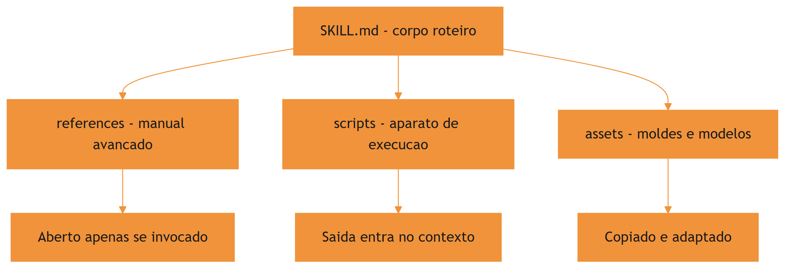

O motivo condutor volta ao centro: a skill é a ferramenta na parede, e as pastas são as partes da ferramenta — o cabo, o bico, o manual, a caixa de acessórios. Saber onde cada parte mora é o que separa uma ferramentaria organizada de um baú de sucata.

## 4. Técnica

### Estruturando uma skill com execução completa

A skill abaixo, `documentar-api`, mostra o pacote completo em ação: corpo com roteiro, script que gera o esqueleto da documentação, reference com o padrão da equipe e asset com o template de cabeçalho. Primeiro, a estrutura de pastas:

```bash
.claude/skills/documentar-api/
├── SKILL.md
├── scripts/
│   └── gerar_esqueleto.py
├── references/
│   └── PADRAO_DOCUMENTACAO.md
└── assets/
    └── cabecalho_template.md
```

O corpo do `SKILL.md` referencia cada parte pelo caminho relativo, deixando claro para o agente quando abrir o quê:

```markdown
---
name: documentar-api
description: Gera e revisa documentacao de APIs REST seguindo o padrao da
  equipe. Use quando o usuario pedir documentacao de endpoint, revisao de
  OpenAPI ou esqueleto de referencia.
compatibility: Requer Python 3.10+
---

# Documentação de API

## Procedimento

1. Gere o esqueleto da documentação:
   `python scripts/gerar_esqueleto.py --openapi caminho/do/openapi.json`
2. Confira o padrão de escrita em `references/PADRAO_DOCUMENTACAO.md`.
3. Para endpoints novos, copie o cabeçalho de `assets/cabecalho_template.md`.
4. Valide o resultado final contra o padrão e devolva o Markdown.
```

O script de geração é o coração executável da skill — e pode ser tão sofisticado quanto necessário, porque o seu código nunca entra na janela de contexto:

```python
# -*- coding: utf-8 -*-
"""scripts/gerar_esqueleto.py - gera esqueleto de documentacao de API REST."""
import argparse
import json
import sys
from pathlib import Path


def extrair_endpoints(openapi: dict) -> list[dict]:
    """Extrai caminhos e metodos do documento OpenAPI."""
    endpoints = []
    for caminho, definicoes in openapi.get("paths", {}).items():
        for metodo, detalhe in definicoes.items():
            if metodo.upper() not in {"GET", "POST", "PUT", "PATCH", "DELETE"}:
                continue
            endpoints.append({
                "caminho": caminho,
                "metodo": metodo.upper(),
                "resumo": detalhe.get("summary", detalhe.get("operationId", "")),
                "descricao": detalhe.get("description", ""),
            })
    return endpoints


def gerar_documentacao(endpoints: list[dict]) -> str:
    """Monta o Markdown de documentacao a partir dos endpoints."""
    linhas = ["# Documentação da API", ""]
    for ep in sorted(endpoints, key=lambda e: (e["caminho"], e["metodo"])):
        linhas.append(f"## {ep['metodo']} {ep['caminho']}")
        linhas.append("")
        linhas.append(f"{ep['resumo'] or 'Endpoint sem resumo.'}")
        if ep["descricao"]:
            linhas.append("")
            linhas.append(ep["descricao"])
        linhas.append("")
    return "\n".join(linhas)


def main() -> int:
    ap = argparse.ArgumentParser(description="Gera esqueleto de documentacao")
    ap.add_argument("--openapi", required=True, help="caminho do arquivo OpenAPI")
    ap.add_argument("--saida", default="docs/api.md", help="arquivo de saida")
    args = ap.parse_args()

    openapi = json.loads(Path(args.openapi).read_text(encoding="utf-8"))
    documentacao = gerar_documentacao(extrair_endpoints(openapi))
    saida = Path(args.saida)
    saida.parent.mkdir(parents=True, exist_ok=True)
    saida.write_text(documentacao, encoding="utf-8")
    print(f"Documentacao gerada: {saida} ({len(documentacao)} caracteres)")
    return 0


if __name__ == "__main__":
    sys.exit(main())
```

Repare na disciplina: o script é autocontido, com CLI própria e tratamento de erro — exatamente o que um script de skill deve ser, porque ele será executado pelo agente e o agente só verá a saída e o código de erro [5].

### Quando o script vira o coração da skill: automação com entrada e saída

O padrão de script de skill mais comum é o transformador: recebe uma entrada, processa com lógica determinística e devolve uma saída estruturada. O exemplo abaixo mostra um script de normalização de nomes de branches, um utilitário pequeno mas representativo do padrão:

```python
# -*- coding: utf-8 -*-
"""scripts/normalizar_branch.py - normaliza nomes de branch para git."""
import re
import sys


def normalizar(titulo: str) -> str:
    """Converte um titulo livre em um nome de branch valido para git."""
    baixo = titulo.strip().lower()
    sem_acentos = (
        baixo.replace("á", "a").replace("ã", "a").replace("â", "a")
        .replace("é", "e").replace("ê", "e").replace("í", "i")
        .replace("ó", "o").replace("õ", "o").replace("ú", "u")
        .replace("ç", "c")
    )
    sem_especiais = re.sub(r"[^a-z0-9-]+", "-", sem_acentos)
    compactado = re.sub(r"-{2,}", "-", sem_especiais).strip("-")
    return compactado[:63] or "branch"


def main() -> int:
    if len(sys.argv) < 2:
        print("uso: python normalizar_branch.py <titulo>", file=sys.stderr)
        return 1
    print(normalizar(sys.argv[1]))
    return 0


if __name__ == "__main__":
    sys.exit(main())
```

O padrão a observar: o script declara seu contrato de entrada e saída no docstring, trata o erro de uso no `main` e imprime apenas o resultado na saída padrão — o que o agente vê é exatamente o que a skill precisa consumir. Scripts com esse formato são triviais de testar (chame com entrada, compare a saída) e de integrar em outras skills via `scripts/` [9]. Avaliações honestas de agentes exigem descrever esse harness — scripts, ferramentas e contexto — por completo [14].

### References e assets na prática

A reference é um arquivo Markdown com o padrão completo da equipe — profundo o bastante para ser autoritativo, mas organizado para consulta pontual. O asset é um template pronto para copiar. Veja como o corpo da skill os referencia de forma que o agente saiba o que esperar:

```markdown
<!-- references/PADRAO_DOCUMENTACAO.md (trecho) -->
# Padrão de Documentação da Equipe

- Todo endpoint documenta: resumo em 1 frase, parâmetros, exemplo de resposta.
- Cabeçalho de endpoint novo: use o modelo em `assets/cabecalho_template.md`.
- Tabela de códigos de erro: obrigatória quando o endpoint retorna 4xx.
- Documentação em PT-BR, tom imperativo, sem jargão de implementação.
```

O corpo da skill não precisa repetir o padrão: ele aponta para a reference. Se a convenção mudar, edita-se um único arquivo e todas as invocações futuras herdam a mudança — o mesmo princípio de fonte única de verdade que vimos no Capítulo 3 [6]. A memória de longo prazo dos agentes lida com o mesmo desafio: preservar conhecimento procedimental entre episódios [15][16].

### Validando o pacote completo

Antes de publicar uma skill com execução, valide os três níveis: o frontmatter (já vimos no Capítulo 3), a sintaxe dos scripts e a existência das references/assets referenciadas pelo corpo. O script abaixo automatiza a última parte:

```python
# -*- coding: utf-8 -*-
"""Valida referencias de um SKILL.md: scripts, references e assets existem."""
import re
import sys
from pathlib import Path


def validar_recursos(caminho_skill: str) -> list[str]:
    """Confere que todos os caminhos mencionados no corpo existem."""
    erros = []
    raiz = Path(caminho_skill).parent
    texto = Path(caminho_skill).read_text(encoding="utf-8")
    caminhos = re.findall(r"(?:scripts|references|assets)/[\\w\\/\\.\\-]+", texto)
    for caminho in caminhos:
        alvo = raiz / caminho
        if not alvo.exists():
            erros.append(f"{caminho}: recurso declarado mas ausente")
    return erros


if __name__ == "__main__":
    for caminho in sys.argv[1:]:
        problemas = validar_recursos(caminho)
        status = "OK" if not problemas else "; ".join(problemas)
        print(f"{caminho}: {status}")
```

## 5. Aplica

### A cena do script que quebrou a sessão

Imagine a cena, em segunda pessoa. Você instalou uma skill de geração de relatórios que promete processar milhares de linhas de log. Na primeira tarefa real, o agente aciona a skill, roda o script — e recebe um traceback gigante. A saída de erro entra inteira na janela de contexto, o agente tenta corrigir um script que ele não deveria precisar entender, e a sessão vira um buraco de tokens. Você descobre depois que o script esperava um argumento que a skill não documentou.

O erro acontece em duas camadas. Primeiro, a skill não validou os pré-requisitos antes de executar — o script quebrou por falta de argumento, um problema de design do pacote. Segundo, o harness injetou o traceback inteiro no contexto, o que o design deveria ter evitado capturando e resumindo o erro. O diagnóstico, ligando à teoria: scripts de skill devem ser autossuficientes (CLI robusta, erro tratado) e a skill deve instruir o agente a capturar apenas o resumo do erro. A correção: adicionar tratamento de exceção com mensagem curta no script e uma linha no corpo da skill dizendo "em caso de erro, reporte apenas a última linha do traceback".

Essa cena mostra o custo real de negligenciar a engenharia do nível 3: um script mal desenhado transforma a ferramenta em fonte de ruído em vez de fonte de valor [7].

### Armadilhas comuns do nível 3

A primeira armadilha é inflar o corpo da skill com conteúdo que deveria estar em references: o roteiro vira um manual e a ativação da skill custa uma fortuna em tokens. A segunda é escrever scripts que dependem de estado global ou de instalação manual: o script deve declarar suas dependências no `compatibility` e ser executável de forma isolada. A terceira é esquecer o tratamento de erro: todo script de skill deve capturar exceções e devolver uma mensagem curta, porque é isso que o agente vê. A quarta é duplicar a mesma lógica em scripts de skills diferentes: o padrão deve morar em um lugar só, referenciado pelas demais [8]. Instruções estáticas de projeto, como o AGENTS.md, complementam as skills nessa organização do conhecimento [19].

### Métricas de sucesso

Uma skill com execução bem-feita mostra três sinais. Primeiro: a taxa de sucesso de primeira execução sobe, porque o script é autossuficiente e validado. Segundo: o custo médio por tarefa cai, porque a lógica pesada roda fora da janela de contexto — apenas saídas entram. Terceiro: o tempo de adaptação a mudanças de convenção cai, porque references e assets concentram o padrão em um único lugar editável [9]. E quando a skill amadurece, o próximo passo é distribuí-la pelo catálogo — o gerenciador de pacotes de skills da Vercel Labs automatiza esse fluxo [20].

## 6. Conclusão

Neste capítulo, você equipou suas skills com o nível 3 da disclosure progressiva. Você entendeu por que scripts mudam o jogo — execução determinística com custo de contexto quase zero, porque o código roda e só a saída volta. Você aprendeu a distribuir o conhecimento entre corpo, references e assets, mantendo o corpo como roteiro e o detalhe como referência. E você viu, na cena do script quebrado, que o nível 3 exige engenharia: scripts autossuficientes, erros tratados e instruções claras sobre o que reportar.

O desafio para fixar: pegue a skill que você criou no Capítulo 3 e adicione um script executável para o passo mais repetitivo do procedimento — depois valide o pacote com o script de verificação de recursos deste capítulo. No próximo capítulo, você vai virar a chave da oficina para os commands: como gravar procedimentos determinísticos na bancada, com frontmatter, argumentos e controle de invocação.

## 8. Aprofundamento: o engenheiro do nível 3

### O contrato de execução, aprofundado: os três modos de script

O capítulo apresentou a fronteira entre instrução e script; vale agora mapear os três modos de script que uma skill pode carregar, porque cada um tem contrato próprio. O primeiro é o transformador: recebe entrada, processa e devolve saída estruturada — o padrão mais comum, trivial de testar e de integrar. O segundo é o verificador: recebe um alvo e devolve um veredito (conforme ou não, com motivos) — o padrão das bancadas de qualidade, que transforma opinião em evidência. O terceiro é o extrator: varre uma fonte e produz um resumo ou inventário — o padrão de diagnóstico, que reduz volume antes de o modelo analisar [2].

A classificação importa porque cada modo tem um contrato de saída diferente: o transformador devolve dados, o verificador devolve veredito e motivos, o extrator devolve resumo. O corpo da skill deve dizer qual modo o script implementa, para que o agente saiba o que esperar da saída — e para que a saída seja consumida sem interpretação ambígua [5].

```python
# -*- coding: utf-8 -*-
"""Os tres modos de script de skill com contratos de saida."""


def transformar(entrada: list[str]) -> list[str]:
    """Modo transformador: dados na entrada, dados na saida."""
    return [e.strip().lower() for e in entrada]


def verificar(alvo: str, criterios: list[str]) -> tuple[bool, list[str]]:
    """Modo verificador: alvo na entrada, veredito na saida."""
    motivos = [c for c in criterios if c not in alvo]
    return (not motivos, motivos)


def extrair(fonte: str, marcadores: list[str]) -> dict[str, int]:
    """Modo extrator: fonte na entrada, resumo na saida."""
    return {m: fonte.lower().count(m) for m in marcadores}


if __name__ == "__main__":
    print(transformar(["A", "B"]))
    print(verificar("arquivo com codigo", ["codigo", "teste"]))
    print(extrair("erro, erro, alerta", ["erro", "alerta"]))
```

### O custo invisível dos scripts pesados

A economia do nível 3 — o código roda fora da janela — tem um custo invisível que só aparece em escala: o tempo de execução. Um script de skill que leva dez segundos é imperceptível em uso pontual e insuportável em cinquenta invocações por dia. O contrato de execução de uma skill madura inclui o custo de tempo como cidadão de primeira classe: scripts que demoram demais são candidatos a otimização, cache ou substituição por uma versão incremental [2].

A métrica que revela o problema é o tempo médio de execução por invocação, registrado no log do harness. Quando esse número cresce sem uma mudança correspondente no escopo do que a skill faz, é sinal de degradação — e a degradação silenciosa é mais perigosa que a falha explícita, porque nenhum erro aparece para denunciá-la [7].

```python
# -*- coding: utf-8 -*-
"""Mede o tempo medio de execucao de um script de skill."""
import subprocess
import time


def medir_execucao(comando: list[str], repeticoes: int = 5) -> dict:
    """Executa o comando varias vezes e resume os tempos de execucao."""
    tempos = []
    for _ in range(repeticoes):
        inicio = time.perf_counter()
        subprocess.run(comando, capture_output=True, check=False)
        tempos.append(time.perf_counter() - inicio)
    tempos.sort()
    mediana = tempos[len(tempos) // 2]
    return {
        "repeticoes": repeticoes,
        "mediana_s": round(mediana, 3),
        "pior_s": round(tempos[-1], 3),
        "melhor_s": round(tempos[0], 3),
    }


if __name__ == "__main__":
    print(medir_execucao(["python", "-c", "print(1)"]))
```

### O contrato de saída: o que o agente realmente vê

O nível 3 tem uma regra de ouro que vale repetir em negrito: o agente não vê o código do script, vê a saída. Isso significa que a saída é o produto da skill — e que formatá-la bem é tão importante quanto programá-la bem. Uma saída estruturada (JSON, tabela, lista ordenada) permite ao agente consumir o resultado diretamente; uma saída em prosa solta força o modelo a interpretar, com o custo de ambiguidade que o Capítulo 2 apresentou [12].

A convenção prática dos harnesses maduros: scripts de skill imprimem JSON na saída padrão quando o resultado precisa ser consumido por lógica, e imprimem texto de apresentação quando o resultado vai direto para o usuário. Misturar os dois modos no mesmo script é o erro de design mais comum — e o que gera as sessões mais confusas [1].

```python
# -*- coding: utf-8 -*-
"""Contrato de saida estruturada: JSON para consumo, texto para leitura."""
import json
import sys


def resumo_dados(registros: list[dict]) -> dict:
    """Resume uma lista de registros em contagens por chave de interesse."""
    resumo = {}
    for registro in registros:
        for chave, valor in registro.items():
            resumo.setdefault(chave, {})
            resumo[chave][str(valor)] = resumo[chave].get(str(valor), 0) + 1
    return resumo


def main() -> int:
    modo = sys.argv[1] if len(sys.argv) > 1 else "json"
    dados = [
        {"status": "ok", "duracao": "1s"},
        {"status": "ok", "duracao": "2s"},
        {"status": "falha", "duracao": "3s"},
    ]
    resumo = resumo_dados(dados)
    if modo == "json":
        print(json.dumps(resumo, ensure_ascii=False))
    else:
        for chave, valores in resumo.items():
            print(f"{chave}: {valores}")
    return 0


if __name__ == "__main__":
    sys.exit(main())
```

### Assets versionados: o molde que muda com o tempo

Os assets têm um ciclo de vida próprio que a maioria das equipes ignora: eles são moldes, e moldes mudam quando o padrão muda. Um template de relatório com três anos de idade ensina o agente a produzir relatórios fora do padrão atual — o asset vira um vetor de inconsistência em vez de um vetor de consistência [4].

A prática madura trata assets como código: versionados, revisados e com data de revisão. A skill referencia o asset pelo caminho; o asset referencia o padrão vigente; e uma auditoria periódica — a mesma que o Capítulo 8 vai detalhar — confere se os assets ainda correspondem ao padrão. É a aplicação do princípio da fonte única de verdade ao nível 3: se o padrão mudou, o asset é atualizado em um único lugar e todas as invocações herdam a correção [6].

### O teste do script de skill: três casos que toda skill precisa

O capítulo defendeu scripts autossuficientes; o teste é o que garante a autossuficiência de forma verificável. Toda skill com script merece pelo menos três casos de teste. O caso feliz: entrada representativa, saída esperada — o contrato de transformação cumprido. O caso de borda: entrada vazia, campo ausente ou formato inesperado — o script deve falhar com mensagem clara, não com traceback. O caso de ambiente: dependência ausente, permissão negada, diretório inexistente — o script deve devolver erro legível. Os três casos juntos são o mínimo de dignidade de qualquer script de skill, e o teste de execução do Capítulo 8 os automatiza [5].

```python
# -*- coding: utf-8 -*-
"""Os tres casos minimos de teste de um script de skill."""


def executar_com_entrada(funcao, entrada):
    """Executa a funcao e devolve (ok, saida_ou_erro)."""
    try:
        return True, funcao(entrada)
    except (ValueError, KeyError) as erro:
        return False, str(erro)


def tres_casos(funcao, caso_feliz, caso_borda, caso_ambiente):
    """Roda os tres casos e devolve o resumo."""
    resultados = []
    for nome, entrada in (("feliz", caso_feliz), ("borda", caso_borda),
                          ("ambiente", caso_ambiente)):
        ok, saida = executar_com_entrada(funcao, entrada)
        resultados.append(f"{nome}: {'OK' if ok else 'FALHA'} - {str(saida)[:50]}")
    return resultados


if __name__ == "__main__":
    def transformar(x):
        if not x:
            raise ValueError("entrada vazia")
        return x.upper()

    for linha in tres_casos(transformar, "texto", "", None):
        print(linha)
```

O caso de ambiente, em particular, é o que distingue scripts de skill de scripts de projeto: o script de skill roda em ambientes que não são os do autor, e a falha de ambiente deve ser diagnóstica, não enigmática. O `compatibility` do frontmatter declara o esperado; o teste de ambiente verifica o comportamento quando o esperado falta [1].

### References: o limite entre profundidade e acumulação

A pasta `references/` é o lugar onde as skills mais erram por excesso. A tentação é clara: a reference não custa tokens na ativação, então por que não acumular tudo? Porque o custo aparece no consumo: uma reference de oitenta páginas não é consultada — é ignorada, e o agente improvisa o padrão em vez de consultá-lo [3]. O tamanho saudável de uma reference é o tamanho da consulta: se o leitor precisa rolar a tela para achar o item, a reference virou um depósito.

A regra do índice resolve: toda reference começa com um índice de cinco a dez entradas, e o corpo da skill referencia a reference pela entrada do índice, não pela página. Se uma entrada do índice não é usada em um mês, ela sai da reference — o corte periódico é tão importante quanto a escrita. Esse mesmo critério de consulta é o que mantém os catálogos de conhecimento vivos em vez de monumentais [8].

### A decisão de empacotar um script: o teste do valor de execução

Nem todo passo de uma skill merece um script — e a decisão de empacotar tem um teste objetivo: o teste do valor de execução. Um passo merece script quando atende a três critérios. O primeiro é a determinismo: o resultado do passo não depende de interpretação — o mesmo dado produz o mesmo resultado. O segundo é a recorrência: o passo se repete em várias execuções da skill, ou em várias skills — a lógica reutilizável paga o custo de ser script. O terceiro é a mensurabilidade: o passo tem entrada e saída definíveis — se não dá para descrever a entrada e a saída, não dá para testar, e o que não dá para testar não deve virar script [2].

O teste do valor de execução resolve as duas metades do erro simétrico: ele impede o script para tudo (passos interpretativos que travam quando viram código) e o corpo para tudo (passos determinísticos que variam quando ficam na mão do modelo). A fronteira entre interpretar e calcular é a linha que o teste traça — e é a mesma fronteira que o Capítulo 2 apresentou na anatomia do harness, agora aplicada dentro da skill [9].

### O ciclo de manutenção do nível 3

Scripts, references e assets envelhecem em ritmos diferentes, e a manutenção madura respeita esses ritmos. Os scripts envelhecem com o ambiente: uma API que muda, uma biblioteca que deprecia, um formato de entrada que evolui — o script quebra no primeiro uso. As references envelhecem com o padrão: a convenção muda, o guia desatualiza, o exemplo deixa de ser modelo. Os assets envelhecem com o design: o template de relatório reflete a identidade antiga da equipe. O ciclo de manutenção tem três gatilhos: o uso (quando o script falha ou a reference confunde), o calendário (revisão periódica do pacote) e a mudança de padrão (quando a convenção muda, o pacote todo é revisado) [3].

A manutenção tem uma métrica de saúde simples: a idade média dos itens do nível 3 sem revisão. Quando essa idade cresce, o pacote está apodrecendo por dentro — as instruções continuam dizendo o que fazer, mas os detalhes (scripts, references, assets) já não correspondem ao mundo. A revisão periódica não é burocracia: é o mecanismo que mantém o nível 3 vivo [8].

### A distribuição do conhecimento: a regra dos dois desvios

Existe uma régua prática para decidir se um conteúdo deve morar no corpo, em references ou em assets: a regra dos dois desvios. Se o conteúdo muda mais de duas vezes por mês, ele não pertence ao corpo (o corpo deveria ser estável) nem ao asset (o asset deveria ser molde) — pertence à reference, que pode evoluir sem exigir reativação da skill. Se o conteúdo muda menos de duas vezes por ano e é usado como modelo, ele é asset. Se o conteúdo é usado em quase toda ativação e muda raramente, ele é corpo. A régua não é exata — é um ponto de partida que transforma a decisão de localização em um critério discutível, em vez de uma escolha de gosto [1].

### O nível 3 como patrimônio: o que a execução compra

Fechando o aprofundamento do nível 3, vale nomear o que a execução compra: confiança. Um passo executado por script é um passo que não varia — o mesmo resultado para a mesma entrada, sempre. Essa propriedade é o fundamento de tudo o que a obra constrói depois: a testabilidade do Capítulo 8 depende de scripts determinísticos; a portabilidade do Capítulo 7 depende de scripts autocontidos; a orquestração do Capítulo 9 depende de scripts com contrato de saída. O nível 3 não é um acessório da skill — é o que torna o conhecimento empacotado verificável, e o verificável é o que pode ser confiado [2]. A decisão de investir em scripts, references e assets bem desenhados é a decisão de construir a skill para durar — e a skill que dura é a que a equipe confia, e a que a equipe confia é a que é usada [9].

### A documentação do script: o docstring como contrato

O nível 3 tem um detalhe de engenharia que vale um aprofundamento: a documentação do próprio script. O script de skill é lido por dois públicos diferentes — o humano que o mantém e o agente que o executa. O docstring é o contrato entre os dois: ele declara o que o script faz, quais entradas espera, qual saída produz e o que acontece nos caminhos de erro. Um script com docstring completo é mantível por qualquer pessoa e integrável por qualquer skill; um script com docstring vazio é uma caixa preta que só o autor entende — e só na semana em que a escreveu [1].

```python
# -*- coding: utf-8 -*-
"""Verifica se um script de skill declara seu contrato no docstring."""
import ast
from pathlib import Path


def contrato_declarado(caminho_script: str) -> dict:
    """Extrai o docstring e confere a declaracao de entrada e saida."""
    texto = Path(caminho_script).read_text(encoding="utf-8")
    try:
        modulo = ast.parse(texto)
    except SyntaxError:
        return {"valido": False, "tem_docstring": False}
    doc = ast.get_docstring(modulo) or ""
    return {
        "valido": True,
        "tem_docstring": bool(doc),
        "declara_saida": "saida" in doc.lower() or "retorna" in doc.lower(),
    }


if __name__ == "__main__":
    print(contrato_declarado("scripts/exemplo.py"))
```

O contrato no docstring é o pré-requisito da testabilidade: o teste de execução do Capítulo 8 precisa saber qual entrada usar e qual saída esperar — e essa informação vem do docstring, não da adivinhação. A documentação do script não é um extra estético: é a especificação que liga o script ao resto do pacote [5].

### A hierarquia de profundidade aplicada a pacotes grandes

Para skills muito amplas, a hierarquia de profundidade ganha um quarto nível: a skill-mãe que orquestra skills-filhas. A skill-mãe tem o corpo como índice e os gatilhos de roteamento — ela decide qual filha acionar conforme a tarefa — e as filhas carregam o conhecimento específico de cada subdomínio. O ganho é a modularidade: a ativação da mãe não carrega o conhecimento das filhas, e a atualização de um subdomínio toca apenas a filha correspondente. O custo é a indireção: um roteamento mal descrito na mãe degrada todas as filhas — a descrição da mãe precisa ser tão precisa quanto a das filhas, porque ela é o gatilho de segundo nível [4].

A skill-mãe é a resposta natural para o catálogo que cresce: em vez de uma skill gigante que tenta cobrir tudo (e paga caro na ativação), um conjunto de skills pequenas com uma mãe que roteia. A estrutura espelha o que a arquitetura de software aprendeu há décadas: decomposição com um ponto de entrada claro.

### Quando o nível 3 não é a resposta

Fechando o aprofundamento, um alerta simétrico: nem toda lógica deve virar script. O nível 3 resolve custo de contexto, não julga contexto — e há decisões que o modelo precisa tomar com a nuance conversacional que o script não tem. Interpretar a intenção de um pedido ambíguo, negociar prioridades entre requisitos conflitantes, decidir o que perguntar quando a informação está incompleta: essas decisões pertencem ao corpo, não ao script. A régua do Capítulo 2 — script para o determinístico, corpo para o interpretativo — é o guardião dessa fronteira, e violá-la produz as duas falhas simétricas: scripts que tentam interpretar (e travam) e corpos que tentam calcular (e variam) [5][9].

## 7. Referências Bibliográficas

[1] AGENTSKILLS.IO. *Agent Skills Specification*. Disponível em: https://agentskills.io/specification. Acesso em: 06 ago. 2026.
[2] ANTHROPIC. *Agent Skills — Claude Platform Docs*. Disponível em: https://platform.claude.com/docs/en/agents-and-tools/agent-skills/overview. Acesso em: 06 ago. 2026.
[3] XU, Renjun; YAN, Yang. *Agent Skills for Large Language Models: Architecture, Acquisition, Security, and the Path Forward*. Disponível em: https://arxiv.org/abs/2602.12430. Acesso em: 06 ago. 2026.
[4] ANTHROPIC. *Claude Code Skills Documentation*. Disponível em: https://code.claude.com/docs/en/skills. Acesso em: 06 ago. 2026.
[5] MA, Zhiyuan; LIU, Jiayu; LUO, Xianzhen; HUANG, Zhenya; ZHU, Qingfu; CHE, Wanxiang. *Tool-MVR: Meta-Verification and Reflection Learning for Reliable Tool-Use*. Disponível em: https://arxiv.org/abs/2506.04625. Acesso em: 06 ago. 2026.
[6] VINCENT, Jesse (obra). *Superpowers — engineering skills for agents*. Disponível em: https://github.com/obra/superpowers. Acesso em: 06 ago. 2026.
[7] ANTHROPIC. *Effective Harnesses for Long-Running Agents*. Disponível em: https://www.anthropic.com/engineering/effective-harnesses-for-long-running-agents. Acesso em: 06 ago. 2026.
[8] FIRECRAWL. *Best Claude Code Skills to Try*. Disponível em: https://www.firecrawl.dev/blog/best-claude-code-skills. Acesso em: 06 ago. 2026.
[9] GETDX. *AI Code Generation: Best Practices for Enterprise Adoption*. Disponível em: https://getdx.com/blog/ai-code-enterprise-adoption/. Acesso em: 06 ago. 2026.
[10] ANTHROPIC. *Claude Code SDK — Slash Commands*. Disponível em: https://code.claude.com/docs/en/agent-sdk/slash-commands. Acesso em: 06 ago. 2026.
[11] KRISHNAN, Naveen. *Advancing Multi-Agent Systems Through Model Context Protocol*. Disponível em: https://arxiv.org/abs/2504.21030. Acesso em: 06 ago. 2026.
[12] BUI, et al. *Building AI Coding Agents for the Terminal: Scaffolding, Harness, Context Engineering, and Lessons Learned*. Disponível em: https://arxiv.org/abs/2603.05344. Acesso em: 06 ago. 2026.
[13] ZHANG, et al. *Code as Agent Harness: Toward Executable, Verifiable, and Stateful Agent Systems*. Disponível em: https://arxiv.org/abs/2605.18747. Acesso em: 06 ago. 2026.
[14] *Stop Comparing LLM Agents Without Disclosing the Harness*. Disponível em: https://arxiv.org/abs/2605.23950. Acesso em: 06 ago. 2026.
[15] DU, Pengfei. *Memory for Autonomous LLM Agents: Mechanisms, Evaluation, and Emerging Frontiers*. Disponível em: https://arxiv.org/abs/2603.07670. Acesso em: 06 ago. 2026.
[16] FANG, Gaodan; ISAHAGIAN, Vatche; JAYARAM, K. R.; KUMAR, Ritesh; MUTHUSAMY, Vinod; OUM, Punleuk; THOMAS, Gegi. *Trajectory-Informed Memory Generation for Self-Improving Agent Systems*. Disponível em: https://arxiv.org/abs/2603.10600. Acesso em: 06 ago. 2026.
[17] RUCAIBOX. *Awesome Agent Harness*. Disponível em: https://github.com/RUCAIBox/awesome-agent-harness. Acesso em: 06 ago. 2026.
[18] SWEBENCH. *SWE-bench Verified & Pro*. Disponível em: https://www.swebench.com. Acesso em: 06 ago. 2026.
[19] OPENAI. *Custom Instructions with AGENTS.md*. Disponível em: https://learn.chatgpt.com/docs/agent-configuration/agents-md. Acesso em: 06 ago. 2026.
[20] VERCEL LABS. *Skills — package manager for agent skills*. Disponível em: https://github.com/vercel-labs/skills. Acesso em: 06 ago. 2026.

# PARTE III — Commands: gravando procedimentos na bancada

# Capítulo 5: Slash commands — o prompt determinístico sob demanda

## 1. Introdução

No Capítulo 4, você equipou suas skills com execução: scripts, references e assets deram poder de verdade às ferramentas da sua oficina. Agora vamos virar a chave para o outro lado da bancada: os commands. Enquanto a skill responde à pergunta "o que o agente precisa saber?", o command responde a "que sequência de ações deve acontecer quando eu disparar este procedimento?". É a bancada com o procedimento gravado no chão: o operador chama pelo nome e o fluxo completo acontece de forma determinística.

Ao final deste capítulo, você será capaz de criar commands customizados com frontmatter completo, usar argumentos e espaços reservados para parametrizar o fluxo, e controlar quem pode invocar o comando — manual, autônomo ou ambos. Com isso, você transforma rotinas repetitivas da equipe em contratos versionados, executáveis por qualquer pessoa com um `/`.

## 2. Explica

### O command como prompt determinístico

Um command é, na essência, um prompt que foi empacotado e versionado: um arquivo Markdown que o harness carrega e injeta no contexto quando o comando é invocado. A diferença para um prompt digitado de memória é a mesma que separa a bancada com procedimento gravado do improviso no chão da oficina: o command existe como artefato, pode ser revisado em pull request, testado em diferentes cenários e invocado por qualquer pessoa da equipe sem depender da memória de quem o criou [1]. A mesma lógica de empacotar procedimento em arquivo versionado sustenta os padrões de instrução de projeto como o AGENTS.md [11].

O harness trata o arquivo de command como um template: antes de entregar o prompt ao modelo, ele preenche os espaços reservados — os argumentos que o operador passou — e executa qualquer injeção dinâmica declarada no arquivo. O resultado é que um único arquivo pode servir de base para mil execuções diferentes, cada uma com seus parâmetros.

### Frontmatter: o controle de operação

O frontmatter do command é onde mora o controle de operação. O campo `description` descreve o que o comando faz — e, no caso dos commands, ele também serve ao autocomplete: o harness mostra a descrição quando o operador digita `/` no terminal [2]. O padrão aberto de agent skills estende essa mesma disciplina de metadados para o catálogo inteiro de comandos e habilidades [10]. O campo `argument-hint` exibe uma dica de argumento durante o autocomplete, ensinando o formato esperado. E o campo `disable-model-invocation` controla o modo de disparo: quando presente e verdadeiro, o modelo não pode invocar o comando autonomamente — apenas o operador, digitando `/nome`. Isso é essencial para commands com efeitos colaterais, como deploys ou limpezas, que não devem ser acionados por iniciativa própria do agente [3]. Cada plataforma agêntica expressa esse controle de invocação de um jeito próprio — o Windsurf, por exemplo, usa modos de ativação por contexto [12].

Há ainda os campos de permissão: `allowed-tools` e `disallowed-tools` concedem ou restringem ferramentas específicas durante a execução do comando, e `context: fork` permite rodar o comando em um subagente isolado, com contexto próprio. Cada campo é uma alavanca de segurança e de isolamento — o command certo com as permissões certas é um fluxo blindado.

### $ARGUMENTS e espaços reservados

O mecanismo de argumentação é o que torna o command genérico. `$ARGUMENTS` captura todo o texto digitado após o nome do comando — tudo o que o operador escrever depois do `/deploy` vai para o corpo do prompt. Já os espaços reservados indexados `$0`, `$1`, `$2` mapeiam argumentos posicionais individuais, permitindo que o command fixe o primeiro argumento em um lugar específico do prompt e dê prioridade de preenchimento aos demais [4].

Na prática, isso significa que um command de revisão pode ser invocado como `/review auth` e receber "auth" como escopo, ou um command de migração pode capturar o nome do arquivo e o ambiente de destino em posições determinadas. O design do command define o contrato: o que é obrigatório, o que tem default e o que o modelo pode inferir.

## 3. Ilustra

A oficina do Engenheiro Agêntico tem uma bancada especial, a única com uma placa na parede: "BANCADA DE REVISÃO DE CÓDIGO — procedimento gravado". Em vez de o operário explicar para um aprendiz novo todo o passo a passo de uma revisão — quais arquivos olhar, quais verificações rodar, em que ordem — ele apenas aponta para a placa: "revisão, escopo: autenticação". O aprendiz lê a placa, executa o procedimento gravado na ordem certa e produz o relatório no formato padrão.

A placa é o frontmatter do command: diz o que a bancada faz, como deve ser chamada e que permissões ela tem. O "escopo: autenticação" é o argumento `$1` — o parâmetro que muda a cada execução sem mudar o procedimento. E a razão de a bancada existir é a mesma razão de qualquer command: a revisão feita de memória variava de operário para operário; a revisão feita pelo procedimento gravado é sempre a mesma, sempre na mesma ordem, sempre com o mesmo relatório.

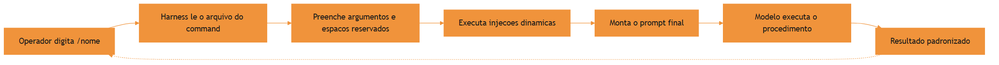

O motivo condutor continua firme: a bancada é o command, a placa é o frontmatter, o escopo digitado é o argumento. E como em toda oficina bem organizada, o que está gravado no chão não se perde quando o operário que o gravou sai de férias.

## 4. Técnica

### Criando o primeiro command

O comando abaixo, `revisar-pr`, encapsula um fluxo completo de revisão de pull request com escopo opcional. Ele usa frontmatter com `description`, `argument-hint` e `disable-model-invocation` — porque uma revisão com padrão de equipe não deve ser disparada autonomamente pelo modelo. Quando o command precisa consultar dados externos, o harness o conecta a servidores de ferramentas padronizados via MCP [14].

```markdown
---
description: Revisa pull requests seguindo o padrao da equipe. Escopo opcional
  filtra os arquivos analisados. Uso: /revisar-pr [escopo].
argument-hint: [escopo] - filtra a revisao por um caminho ou modulo
disable-model-invocation: true
---

Revise o pull request atual seguindo rigorosamente o procedimento abaixo.

## Procedimento de Revisão

1. Identifique o diff: rode `!git diff HEAD~1` para capturar as mudanças reais.
2. Escopo: $ARGUMENTS — se vazio, revise o diff inteiro; se preenchido,
   filtre os arquivos pelo escopo informado.
3. Verifique, em ordem: corretude funcional, cobertura de testes, segurança
   (segredos e injeção), e conformidade com o estilo do projeto.
4. Produza o relatório final no formato:

   ## Veredito
   - APROVADO / APROVADO COM RESSALVAS / REPROVADO
   - Lista de achados com severidade (bloqueador/alto/médio/baixo)
   - Sugestão de correção por achado
```

Repare na linha `!git diff HEAD~1`: é uma injeção dinâmica que roda o comando git no momento da execução e injeta a saída real no prompt — o modelo recebe o diff verdadeiro, não uma instrução para procurá-lo [5].

### Argumentos e espaços reservados na prática

A combinação de `$ARGUMENTS` com espaços reservados posicionais permite contratos de comando sofisticados. O comando abaixo exige dois argumentos posicionais com fallback para o `$ARGUMENTS` completo:

```markdown
---
description: Gera a estrutura de uma nova migracao de banco de dados.
argument-hint: <nome-da-migracao> [schema]
---

Gere a migracao solicitada.

- Nome da migracao (obrigatorio): $0
- Schema (opcional, padrao public): $1
- Demais instrucoes adicionais: $ARGUMENTS

Siga o padrao de migracoes do projeto descrito em @docs/MIGRACOES.md e
gere o arquivo no diretorio de migracoes com o template adequado.
```

A linha `@docs/MIGRACOES.md` é outra forma de injeção: anexa o conteúdo do arquivo referenciado ao prompt, garantindo que o modelo siga o padrão documentado sem precisar memorizá-lo [4]. A aquisição de conhecimento procedural por commands e skills é hoje um campo ativo de pesquisa, com taxonomias próprias [13].

### Validando commands no repositório

Assim como skills têm validação de frontmatter, commands merecem uma checagem automatizada — principalmente o campo `disable-model-invocation` em commands com efeitos colaterais. O script abaixo varre o diretório de commands e acusa commands de alto risco sem trava manual:

```python
# -*- coding: utf-8 -*-
"""Valida commands: frontmatter obrigatorio e trava em commands de alto risco."""
import re
import sys
from pathlib import Path

ALTO_RISCO = ("deploy", "delete", "drop", "rm -rf", "clean", "migrate")


def validar_command(caminho: str) -> list[str]:
    """Retorna erros do arquivo de command (vazio = valido)."""
    erros = []
    texto = Path(caminho).read_text(encoding="utf-8")
    m = re.match(r"\\A---\\n(?P<fm>.*?)\\n---", texto, re.DOTALL)
    if not m:
        return ["frontmatter ausente"]
    conteudo = m.group("fm")
    if not re.search(r"^description:\\s*\\S", conteudo, re.MULTILINE):
        erros.append("campo 'description' ausente")
    baixo = re.sub(r"^#.*$", "", texto, flags=re.MULTILINE).lower()
    arriscado = any(palavra in baixo for palavra in ALTO_RISCO)
    travado = bool(re.search(r"^disable-model-invocation:\\s*true", conteudo, re.MULTILINE))
    if arriscado and not travado:
        erros.append("command de alto risco sem 'disable-model-invocation: true'")
    return erros


if __name__ == "__main__":
    for caminho in sys.argv[1:]:
        problemas = validar_command(caminho)
        status = "OK" if not problemas else "; ".join(problemas)
        print(f"{caminho}: {status}")
```

O detalhe que vale destacar: a validação não é sobre sintaxe YAML — é sobre o contrato operacional. Um command de deploy sem trava manual é um acidente esperando para acontecer, e a validação automatizada transforma essa preocupação em um check que roda em CI [6].

### Argumentos com prioridade: o contrato de preenchimento

Além dos espaços reservados posicionais, o design de commands maduros define prioridade de preenchimento: o que o harness tenta preencher primeiro, o que tem fallback e o que é deduzido pelo modelo. Um command de migração, por exemplo, pode fixar o nome do arquivo como `$0`, aceitar o schema como `$1` com default documentado, e delegar ao modelo qualquer instrução adicional recebida em `$ARGUMENTS`. O contrato fica explícito no corpo do arquivo, e o harness preenche na ordem declarada.

```markdown
---
description: Executa o fluxo de review padrao com escopo opcional.
argument-hint: [escopo]
---

Escopo da revisao (opcional): $1
Demais instrucoes: $ARGUMENTS

Siga o procedimento padrao de review do repositorio.
```

A regra prática do contrato: argumentos obrigatórios têm posição fixa e são nomeados no prompt; argumentos opcionais têm default descrito; e o que sobra vai para `$ARGUMENTS`, onde o modelo decide como usar. Commands com esse design são fáceis de documentar, fáceis de testar e fáceis de ensinar a novos operadores [4]. A confiabilidade do command também melhora quando o uso de ferramentas é ensinado com verificação e reflexão sobre erros, como propõe o Tool-MVR [15].

## 5. Aplica

### A cena do deploy disparado pelo modelo

Imagine a cena, em segunda pessoa. Sua equipe criou um command `/deploy-staging` e ele funcionou perfeitamente na semana passada. Hoje, em uma sessão de debugging, você pede ao agente para "testar a correção no ambiente de staging" — e o agente, interpretando a intenção, dispara o command sozinho, sem você ter digitado nada. O deploy roda, e o ambiente de staging — que sua equipe usa para testes de integração compartilhados — é substituído no meio de uma validação de outra pessoa.

O erro acontece porque o command não tinha a trava de invocação: sem `disable-model-invocation: true`, o modelo pode acionar qualquer command cujo efeito pareça alinhado à sua intenção. O diagnóstico, ligando à teoria do capítulo: a alavanca de invocação é parte do contrato de segurança do command, não um detalhe. A correção é imediata — adicionar a trava ao frontmatter e revalidar — e a lição estrutural é que commands com efeitos colaterais fora do repositório (deploy, delete, publish) devem ser sempre de invocação manual, enquanto commands de leitura (review, analyze) podem ser invocados pelo modelo sem risco [7]. A visão do código como harness do agente reforça que commands são parte do substrato operacional — procedimentos executáveis e verificáveis [16].

Essa cena resume a natureza do command: ele é poderoso exatamente porque é determinístico — e perigoso pelo mesmo motivo, se o contrato de invocação não estiver gravado na placa.

### Armadilhas comuns ao criar commands

A primeira armadilha é criar commands que replicam prompts de uma pessoa específica: se o command codifica o jeito do João revisar código, a equipe herda o viés do João. O antídoto é escrever o procedimento a partir do padrão documentado da equipe, não de um exemplo pessoal. A segunda é negligenciar os argumentos: um command sem `$ARGUMENTS` nem espaços reservados é um prompt fixo disfarçado de comando — ainda vale a pena, mas perde a parametrização. A terceira é esquecer as injeções dinâmicas: sem `!git diff` ou `@arquivo`, o comando recebe o estado do mundo de ontem, não de agora. A quarta é acumular commands sem dono: commands sem revisor e sem teste viram dívida técnica como qualquer outro código [8]. Curadorias da área de harness consolidam essas práticas de governança de commands [17], e a medição objetiva de agentes em tarefas reais segue o padrão SWE-bench [18].

### Métricas de sucesso

Uma cultura de commands madura é mensurável em três eixos. Adoção: a proporção de rotinas repetitivas da equipe que têm um command correspondente. Consistência: a variação entre execuções do mesmo procedimento por pessoas diferentes — que deve tender a zero. E segurança: o número de commands de alto risco sem trava manual — que deve ser zero, e a validação em CI garante isso [9]. Quando um command amadurece, ele pode até ser distribuído como skill para outros projetos — o gerenciador de pacotes da Vercel Labs automatiza esse fluxo [19]. Comparações honestas de agentes exigem descrever esses comandos e permissões no harness por completo [20].

## 6. Conclusão

Neste capítulo, você dominou a bancada da oficina: o command como prompt determinístico versionado, o frontmatter como controle de operação — com destaque para a trava de invocação `disable-model-invocation` — e o mecanismo de argumentos com `$ARGUMENTS`, espaços reservados e injeções dinâmicas `!` e `@`. Você viu, na cena do deploy disparado pelo modelo, que o poder determinístico do command exige um contrato de invocação explícito.

O desafio para fixar: escolha a rotina mais repetitiva da sua equipe e crie o command correspondente — com frontmatter completo, um argumento e pelo menos uma injeção dinâmica. Depois rode o validador de commands do capítulo para conferir o contrato. No próximo capítulo, você vai levar os commands ao nível corporativo: injeção dinâmica avançada e workflows de equipe, com commands versionados que padronizam review, deploy e migração entre desenvolvedores.

## 8. Aprofundamento: o contrato de invocação e o catálogo de commands

### O command como contrato de contexto: o que o prompt realmente contém

Vale destrinchar o que acontece quando um command é invocado, porque a sequência define o que o modelo recebe. O harness lê o arquivo, processa o frontmatter, resolve os argumentos (preenchendo os espaços reservados na ordem declarada), executa as injeções dinâmicas e monta o prompt final com o corpo. A ordem desses passos é parte do contrato: os espaços reservados são resolvidos antes das injeções, e as injeções são executadas antes de o prompt ser entregue. Um command que assume outra ordem de processamento produz resultados inesperados — e por isso a documentação de cada harness descreve essa sequência [1].

O prompt resultante é a soma de quatro partes: o frontmatter (descrito ao modelo como contexto), os argumentos resolvidos, as saídas das injeções e o corpo do procedimento. Cada parte tem um papel e um tamanho: o corpo é o procedimento (deve ser enxuto), as injeções são o estado (devem ser limitadas) e os argumentos são a variação (devem ser validados). O command bem desenhado é aquele cujo prompt final o modelo consegue seguir sem ambiguidade — o teste da qualidade é ler o prompt resultante como se fosse a primeira vez [5].

### O design de argumentos: obrigatório, opcional e deduzido

O contrato de preenchimento do capítulo tem uma camada a mais que merece destaque: a classificação dos argumentos em três categorias. O argumento obrigatório é aquele sem o qual o procedimento não faz sentido — o command deve declarar o formato e falhar cedo se faltar. O argumento opcional tem um default documentado — o command deve declarar o default e o efeito da ausência. O argumento deduzido é aquele que o modelo infere do contexto — o command deve declarar o que o modelo pode inferir e o que ele não deve inventar. A classificação é o que torna o command documentável e testável: cada categoria tem casos de teste diferentes [4].

```python
# -*- coding: utf-8 -*-
"""Valida o preenchimento de argumentos de um command por categoria."""


def validar_argumentos(contrato: dict, recebidos: dict) -> list[str]:
    """Retorna erros de preenchimento (vazio = contrato atendido)."""
    erros = []
    for nome, regras in contrato.items():
        categoria = regras.get("categoria", "deduzido")
        if categoria == "obrigatorio" and nome not in recebidos:
            erros.append(f"argumento obrigatorio ausente: {nome}")
        if categoria == "opcional" and nome not in recebidos and "default" not in regras:
            erros.append(f"argumento opcional sem default: {nome}")
    return erros


if __name__ == "__main__":
    contrato = {
        "nome_migracao": {"categoria": "obrigatorio"},
        "schema": {"categoria": "opcional", "default": "public"},
        "instrucoes": {"categoria": "deduzido"},
    }
    print(validar_argumentos(contrato, {"nome_migracao": "criar_tabela"}))
```

A validação de contrato em CI é o complemento da validação de frontmatter: o frontmatter garante que o arquivo é válido; o contrato garante que as invocações serão válidas. Juntas, as duas validações transformam o command em um artefato com testes automatizados — a mesma disciplina do Capítulo 8 para skills, aplicada a commands [8].

### O ciclo de vida de um command

O command não nasce pronto: ele atravessa um ciclo de vida que espelha o de qualquer código de produção. Nasce como procedimento ad hoc (uma pessoa digitando os mesmos passos de memória), vira rascunho (o arquivo inicial com frontmatter mínimo), é testado (invocações reais em cenários de exemplo), é revisado (pull request com o padrão da equipe) e, por fim, é publicado no catálogo — a bancada oficial da oficina. O que este ciclo garante é que nenhum command entra no catálogo sem passar por revisão, e que o catálogo não acumula procedimentos órfãos [6].

A parte mais negligenciada do ciclo é a aposentadoria. Commands que perderam o uso — o procedimento mudou, a ferramenta foi substituída, o fluxo foi absorvido por outro comando — continuam no catálogo ocupando espaço de autocomplete e oferecendo ao modelo um gatilho obsoleto. A política madura define os mesmos critérios que o Capítulo 10 vai detalhar para skills: tempo sem invocação, substituição por comando mais novo e revisão periódica do catálogo. Um catálogo que só cresce é um catálogo que envelhece mal [8].

### O autocomplete como superfície de contrato

Há um detalhe do frontmatter de command que costuma ser subestimado: a `description` aparece no autocomplete quando o operador digita `/`. Isso significa que a descrição não é apenas metadado para o modelo — é texto que humanos leem a cada invocação, muitas vezes a cada dia. Uma descrição que mostra o formato dos argumentos, o efeito do comando e o seu nível de risco ensina o operador enquanto ele digita; uma descrição vaga força o operador a abrir o arquivo ou adivinhar [2].

```python
# -*- coding: utf-8 -*-
"""Avalia a qualidade da descricao de um command para o autocomplete."""


def avaliar_descricao(descricao: str, argumento_hint: str) -> dict:
    """Verifica se a descricao informa efeito, argumentos e risco."""
    baixo = descricao.lower()
    tem_verbo = any(v in baixo for v in ("revisa", "gera", "executa", "publica", "deploy"))
    tem_efeito = any(v in baixo for v in ("pull request", "migracao", "ambiente", "testes"))
    tem_risco = any(v in baixo for v in ("cuidado", "risco", "destrutivo", "permanente"))
    nota = sum([tem_verbo, tem_efeito, bool(argumento_hint.strip())])
    return {
        "nota": nota, "verbo": tem_verbo, "efeito": tem_efeito,
        "argumento_documentado": bool(argumento_hint.strip()),
        "risco_explicito": tem_risco,
    }


if __name__ == "__main__":
    print(avaliar_descricao("Revisa pull requests no padrao da equipe", "[escopo]"))
```

### A hierarquia de invocação: manual, assistida e autônoma

O campo `disable-model-invocation` é um interruptor binário, mas o desenho maduro de commands enxerga uma hierarquia de três níveis. No nível manual, apenas o operador dispara — o padrão para efeitos colaterais. No nível assistido, o modelo propõe e o operador confirma — o padrão para ações de alcance médio, como gerar uma migração que será revisada. No nível autônomo, o modelo dispara sozinho — o padrão apenas para comandos de leitura sem efeito colateral. A hierarquia não é sobre limitar o agente: é sobre alinhar o nível de autonomia ao custo do erro [7].

```python
# -*- coding: utf-8 -*-
"""Seleciona o nivel de invocacao conforme o custo do erro do command."""


def nivel_invocacao(custo_erro: str, efeito_colateral: bool) -> str:
    """Retorna o nivel de invocacao recomendado para um command."""
    if efeito_colateral or custo_erro in ("alto", "critico"):
        return "manual"
    if custo_erro == "medio":
        return "assistido"
    return "autonomo"


if __name__ == "__main__":
    exemplos = [
        ("revisar-pr", "baixo", False),
        ("gerar-migracao", "medio", True),
        ("deploy-producao", "critico", True),
    ]
    for nome, custo, efeito in exemplos:
        print(f"{nome}: {nivel_invocacao(custo, efeito)}")
```

A hierarquia resolve a ambiguidade que a cena do deploy do capítulo expôs: o problema não era o modelo ser autônomo demais em geral, era um command de efeito colateral estar configurado como autônomo. Com a hierarquia explícita, o erro vira um caso de configuração, não um acidente de arquitetura [3].

### Commands e skills: o contrato de composição

Um command raramente opera sozinho: ele compõe skills, tools e outros commands. O contrato de composição tem duas regras que evitam a duplicação de conhecimento. A primeira: o command orquestra, a skill conhece — o command define a sequência de passos e chama a skill para o detalhe, nunca repete o conhecimento que a skill já carrega. A segunda: a referência é por nome, não por conteúdo — o command invoca `skill:documentar-api` e não cola o corpo da skill no arquivo do command. A composição por referência é o que mantém a fonte única de verdade que o Capítulo 3 estabeleceu [10].

```markdown
---
description: Gera e revisa a documentacao de API de um servico.
argument-hint: <servico>
---

Gere a documentacao do servico $0.

1. Use a skill documentar-api para o esqueleto e o padrao da equipe.
2. Rode !git diff HEAD~1 para conferir se a API mudou desde a ultima doc.
3. Entregue o resultado no formato da equipe.
```

Esse command, em quatorze linhas, mostra a composição ideal: a skill carrega o conhecimento profundo (padrão, templates, scripts), o command carrega a sequência e a injeção dinâmica, e o conhecimento não é duplicado em lugar nenhum. A fronteira entre as camadas — orquestração no command, conhecimento na skill — é o mesmo teste do acionamento do Capítulo 2, aplicado agora à composição [5].

### O teste do command: invocação, argumentos e resultado

O capítulo validou o frontmatter e o contrato de invocação; o aprofundamento é o teste de comportamento. Um command merece três camadas de teste. A primeira é o teste de montagem: dados os argumentos, o prompt resultante contém o procedimento correto, os espaços reservados preenchidos e as injeções executadas — o teste do prompt, que verifica o que o modelo vai receber. A segunda é o teste de execução: rodado o command de ponta a ponta em um cenário controlado, o resultado segue o procedimento — o teste de integração. A terceira é o teste de contrato: os argumentos obrigatórios são exigidos, os opcionais respeitam o default e o `disable-model-invocation` bloqueia a invocação autônoma quando configurado [1].

```python
# -*- coding: utf-8 -*-
"""Teste de montagem: verifica o prompt final de um command."""


def montar_prompt(corpo: str, argumentos: dict, injecoes: dict) -> str:
    """Monta o prompt resolvendo espacos reservados e injecoes."""
    prompt = corpo
    for chave, valor in argumentos.items():
        prompt = prompt.replace(chave, valor)
    for marcador, saida in injecoes.items():
        prompt = prompt.replace(marcador, saida)
    return prompt


if __name__ == "__main__":
    corpo = "Escopo: $1\nDiff:\n!diff\n"
    prompt = montar_prompt(corpo, {"$1": "auth"}, {"!diff": "3 arquivos alterados"})
    print(prompt)
    assert "$1" not in prompt and "!diff" not in prompt
    print("contrato de montagem OK")
```

A camada de montagem é a mais barata de automatizar e a que mais falhas pega: ela revela espaços reservados não resolvidos, injeções que produziram erro e o crescimento inesperado do prompt. Testar a montagem é testar o que o modelo realmente vê — o mesmo princípio do contrato de contexto deste capítulo [5].

### Commands como documentação executável do processo

Uma propriedade dos commands que as equipes subestimam é o seu papel como documentação: o command é o processo da equipe em forma executável. Quando alguém pergunta "como a gente faz deploy aqui?", a resposta correta não é um parágrafo explicativo — é o comando. Quando o processo muda, a mudança acontece no arquivo do command, revisada em pull request, com histórico no git. Essa propriedade elimina a distância entre documentar e executar: não existe "a documentação diz uma coisa e a prática faz outra", porque documentação e prática são o mesmo artefato [3].

A implicação prática é que commands merecem o mesmo cuidado de escrita que a documentação oficial: clareza, consistência e revisão. Um command confuso é uma documentação confusa que ainda por cima executa — o pior dos dois mundos. O comando como documentação executável é o que permite o onboarding assíncrono da equipe: o novato não precisa de alguém explicando o fluxo, ele lê e executa o command [9].

### O command como alavanca de consistência

Fechando o capítulo, vale nomear o que o command compra em termos organizacionais: consistência. A equipe que executa um procedimento pelo command executa o mesmo procedimento, sempre — na mesma ordem, com as mesmas verificações, com o mesmo formato de resultado. A consistência é o insumo de todas as métricas do capítulo: a comparação entre execuções só faz sentido quando as execuções são comparáveis, e o command é o que torna a execução comparável [6]. É também o insumo da medição do Capítulo 10: uma organização que mede seus fluxos com commands mede fluxos padronizados, e a padronização é o que dá sentido às comparações ao longo do tempo. A consistência não é o objetivo do command — é o seu efeito colateral mais valioso, e é ela que transforma rotinas individuais em processo organizacional [9].

### O limite do command: o que não deve ser gravado na bancada

Fechando o capítulo com um contraponto necessário: nem todo procedimento merece virar command. O command congela uma sequência — e congelar a sequência errada é pior que não ter sequência. Três tipos de procedimento não merecem a bancada. O primeiro é o procedimento que muda toda semana: o command é reescrito com frequência maior que o uso, e a manutenção vira o custo dominante. O segundo é o procedimento que depende de julgamento sutil: a sequência certa varia com o contexto de forma que um prompt fixo não captura — o command força a simplificação. O terceiro é o procedimento de uso único: a rotina que acontece uma vez por trimestre não paga o custo de ser descoberta, mantida e confiada pela equipe [6].

O limite do command é o mesmo limite de qualquer automação: automatize o que é repetido, estável e de erro caro — e deixe no raciocínio o que é raro, mutável e de julgamento. A régua do Capítulo 1, aplicada aos commands, é o mesmo instrumento: frequência, estabilidade e custo de erro. A bancada é uma ferramenta poderosa — e ferramentas poderosas pedem critério sobre o que gravar nelas [8].

### O acoplamento entre commands: quando um chama o outro

Commands raramente são ilhas: um command de deploy pode invocar um command de verificação pré-deploy, que por sua vez usa uma skill de análise. O acoplamento entre commands segue as mesmas regras do acoplamento entre skills: referência por nome estável, propósito explícito e hierarquia clara. O command-pai orquestra a sequência; o command-filho executa um subfluxo reutilizável. A alternativa — duplicar o subfluxo em cada command — é a fonte mais comum de divergência: dois deploys que começam idênticos e divergem com o tempo porque foram copiados em vez de referenciados [2].

```python
# -*- coding: utf-8 -*-
"""Verifica acoplamento duplicado entre commands do catalogo."""
import re
from pathlib import Path


def detectar_duplicacao(diretorio: str, fragmento: str) -> list[str]:
    """Encontra commands que repetem o mesmo fragmento de procedimento."""
    duplicados = []
    for arquivo in sorted(Path(diretorio).glob("*.md")):
        texto = arquivo.read_text(encoding="utf-8")
        if fragmento in texto:
            duplicados.append(arquivo.stem)
    return duplicados


if __name__ == "__main__":
    duplicados = detectar_duplicacao(".claude/commands", "verificar pre-requisitos")
    print(duplicados or "nenhum comando duplica este fragmento")
```

A varredura de duplicação é uma métrica de saúde do catálogo: fragmentos repetidos entre commands sinalizam onde a composição deveria substituir a cópia. O mesmo padrão de auditoria — detectar duplicação, promover referência — é o que mantém o conhecimento da oficina em um lugar só, como o Capítulo 3 estabeleceu para skills [6].

### O onboarding com commands: o novato que executa

Uma das aplicações mais imediatas dos commands é o onboarding. O fluxo tradicional tem um custo alto: o novato precisa de alguém explicando cada fluxo, com o conhecimento vivo de quem já está na equipe. Com commands versionados, o onboarding muda de natureza: o novato lê o catálogo, executa os commands dos fluxos básicos e aprende o processo pela execução — o erro no ambiente controlado ensina mais que a explicação no abstrato [4].

O catálogo de commands vira o currículo da equipe: a sequência de commands que o novato executa na primeira semana (verificar ambiente, rodar testes, revisar PR, preparar deploy) é o mapa do processo real — não do processo documentado, mas do que de fato roda. A lacuna do currículo — o fluxo que não tem command — é a lacuna do onboarding: o novato vai precisar perguntar exatamente onde a equipe não padronizou. O catálogo revela a dívida de documentação da equipe de forma objetiva [9].

### Medindo a saúde do catálogo de commands

O catálogo de commands, como qualquer ativo, merece métricas de saúde. Três números contam a história. A taxa de commands com trava manual entre os de efeito colateral — deve ser 100%, e a validação em CI garante. A idade média dos commands sem revisão — cresce quando o catálogo é abandonado. E a taxa de invocação por command — separa os procedimentos vivos dos mortos, alimentando a política de aposentadoria. A gestão do catálogo é cíclica: revisar descrições, atualizar procedimentos, aposentar o que morreu — a mesma disciplina que organizações maduras aplicam aos seus processos operacionais [9].

## 7. Referências Bibliográficas

[1] ANTHROPIC. *Claude Code SDK — Slash Commands*. Disponível em: https://code.claude.com/docs/en/agent-sdk/slash-commands. Acesso em: 06 ago. 2026.
[2] ANTHROPIC. *Claude Code Skills Documentation*. Disponível em: https://code.claude.com/docs/en/skills. Acesso em: 06 ago. 2026.
[3] ANTHROPIC. *Agent Skills — Claude Platform Docs*. Disponível em: https://platform.claude.com/docs/en/agents-and-tools/agent-skills/overview. Acesso em: 06 ago. 2026.
[4] CURSOR. *Cursor Rules Documentation*. Disponível em: https://cursor.com/docs/rules. Acesso em: 06 ago. 2026.
[5] BUI, et al. *Building AI Coding Agents for the Terminal: Scaffolding, Harness, Context Engineering, and Lessons Learned*. Disponível em: https://arxiv.org/abs/2603.05344. Acesso em: 06 ago. 2026.
[6] GETDX. *AI Code Generation: Best Practices for Enterprise Adoption*. Disponível em: https://getdx.com/blog/ai-code-enterprise-adoption/. Acesso em: 06 ago. 2026.
[7] MEDIUM (HEEKI PARK). *Collaborating with Agent Teams in Claude Code*. Disponível em: https://heeki.medium.com/collaborating-with-agents-teams-in-claude-code-f64a465f3c11. Acesso em: 06 ago. 2026.
[8] FLORIANBRUNIAUX. *Claude Code Ultimate Guide — Agent Teams*. Disponível em: https://github.com/FlorianBruniaux/claude-code-ultimate-guide. Acesso em: 06 ago. 2026.
[9] ANTHROPIC. *Effective Harnesses for Long-Running Agents*. Disponível em: https://www.anthropic.com/engineering/effective-harnesses-for-long-running-agents. Acesso em: 06 ago. 2026.
[10] AGENTSKILLS.IO. *Agent Skills Specification*. Disponível em: https://agentskills.io/specification. Acesso em: 06 ago. 2026.
[11] OPENAI. *Custom Instructions with AGENTS.md*. Disponível em: https://learn.chatgpt.com/docs/agent-configuration/agents-md. Acesso em: 06 ago. 2026.
[12] WINDSURF (CODEIUM). *Windsurf Documentation*. Disponível em: https://codeium.com/windsurf. Acesso em: 06 ago. 2026.
[13] XU, Renjun; YAN, Yang. *Agent Skills for Large Language Models: Architecture, Acquisition, Security, and the Path Forward*. Disponível em: https://arxiv.org/abs/2602.12430. Acesso em: 06 ago. 2026.
[14] KRISHNAN, Naveen. *Advancing Multi-Agent Systems Through Model Context Protocol*. Disponível em: https://arxiv.org/abs/2504.21030. Acesso em: 06 ago. 2026.
[15] MA, Zhiyuan; LIU, Jiayu; LUO, Xianzhen; HUANG, Zhenya; ZHU, Qingfu; CHE, Wanxiang. *Tool-MVR: Meta-Verification and Reflection Learning for Reliable Tool-Use*. Disponível em: https://arxiv.org/abs/2506.04625. Acesso em: 06 ago. 2026.
[16] ZHANG, et al. *Code as Agent Harness: Toward Executable, Verifiable, and Stateful Agent Systems*. Disponível em: https://arxiv.org/abs/2605.18747. Acesso em: 06 ago. 2026.
[17] RUCAIBOX. *Awesome Agent Harness*. Disponível em: https://github.com/RUCAIBox/awesome-agent-harness. Acesso em: 06 ago. 2026.
[18] SWEBENCH. *SWE-bench Verified & Pro*. Disponível em: https://www.swebench.com. Acesso em: 06 ago. 2026.
[19] VERCEL LABS. *Skills — package manager for agent skills*. Disponível em: https://github.com/vercel-labs/skills. Acesso em: 06 ago. 2026.
[20] *Stop Comparing LLM Agents Without Disclosing the Harness*. Disponível em: https://arxiv.org/abs/2605.23950. Acesso em: 06 ago. 2026.

# Capítulo 6: Injeção dinâmica e workflows de equipe

## 1. Introdução

No Capítulo 5, você criou commands com frontmatter, argumentos e trava de invocação. A bancada está montada — mas um command que trabalha com dados de ontem é uma bancada que produz peças desalinhadas. Este capítulo é sobre a diferença entre um command estático e um command vivo: a injeção dinâmica de contexto, que busca o estado real do mundo no momento exato da execução, e o uso de commands como contratos de equipe versionados em git.

Ao final deste capítulo, você será capaz de construir commands que capturam diffs reais, estados de banco e conteúdo de arquivos na hora — e de organizar o catálogo de commands da sua equipe como um contrato revisável, testável e distribuível. É aqui que a oficina individual vira a fábrica de um time.

## 2. Explica

### O ciclo do command vivo: medir antes de agir

O princípio operacional que organiza este capítulo é simples de enunciar: todo command que toma decisão sobre o mundo deve medir o mundo antes de agir. Um command de deploy decide se a branch está pronta; um command de relatório decide o que incluir; um command de migração decide o que processar. Em todos os casos, a decisão é melhor quando a medição é fresca — e a injeção dinâmica é exatamente o mecanismo de medição fresca.

Essa mentalidade muda a forma de escrever commands: em vez de descrever o que verificar, você primeiro lista o que medir (as linhas `!` e `@`), depois escreve o procedimento que usa as medições. O prompt deixa de ser um pedido ao modelo para "descobrir o estado" e passa a ser um procedimento que recebe o estado pronto. A diferença é sutil no texto e enorme na confiabilidade [1].

### O problema do estado congelado

Um command sem injeção dinâmica sofre do problema do estado congelado: o prompt que ele monta descreve o mundo como ele era quando alguém escreveu o command — ou como o modelo imagina que ele seja. Em código, isso seria equivalente a rodar um build com cache nunca invalidado: o resultado parece certo até que algo depende do estado real e quebra.

A solução é a injeção dinâmica: linhas no arquivo do command que o harness executa antes de montar o prompt, capturando o estado atual do ambiente. Existem duas formas principais. A primeira é a execução de comandos de sistema com `!`: uma linha `!git status` roda o comando e injeta a saída no prompt — o modelo vê o estado real do repositório, não uma descrição dele. A segunda é a referência a arquivos com `@`: a linha `@package.json` anexa o conteúdo atual do arquivo ao prompt [1]. O padrão aberto de agent skills estende essa disciplina de carregamento sob demanda para o catálogo inteiro [11].

### Por que isso muda o jogo para a equipe

Quando commands carregam estado real, eles deixam de ser receitas genéricas e viram procedimentos situados: a mesma bancada produz o resultado certo para a situação atual. Isso é o que permite padronizar rotinas complexas de equipe — revisão de código, deploy, migração, geração de relatórios — sem abrir mão da especificidade de cada execução [2]. A aquisição de conhecimento procedural por commands e skills é hoje um campo ativo de pesquisa, com taxonomias próprias [12].

A organização corporativa de commands segue um padrão consistente em todas as plataformas agênticas: um diretório de commands no repositório, versionado como qualquer outro código, com review em pull request e testes em CI. O command vira parte da base de conhecimento da equipe — um contrato entre humanos e agentes que registra como a organização espera que determinados fluxos aconteçam [3]. Quando o command precisa acessar dados externos, o harness o conecta a servidores de ferramentas padronizados via MCP [13].

### O command como contrato versionado

Um command versionado é um contrato em três sentidos. Primeiro, contrato de execução: a equipe sabe o que acontece quando alguém digita `/deploy-staging`, porque o procedimento está escrito e revisado. Segundo, contrato de contexto: a injeção dinâmica garante que o comando trabalhe com o estado real, não com suposições. Terceiro, contrato de evolução: mudanças no procedimento passam por review e ficam no histórico do git — é possível saber quando e por que o fluxo mudou [4]. A confiabilidade do fluxo também melhora quando o uso de ferramentas é ensinado com verificação e reflexão sobre erros, como propõe o Tool-MVR [14].

## 3. Ilustra

A oficina do Engenheiro Agêntico tem uma regra de ouro: nenhuma peça é produzida com medida de ontem. A bancada de torneamento tem um paquímetro digital conectado à mesa — quando o operário inicia o serviço, o paquímetro mede a peça naquele instante e o número aparece na tela. O operário não pergunta "qual era o tamanho da última peça?" — ele lê o número atual e ajusta a máquina.

A injeção dinâmica é esse paquímetro digital. O command é a bancada; a linha `!git diff` é a medição na hora; a linha `@config.toml` é a ficha técnica da peça atual, puxada do armário no momento exato. E a placa na parede — o contrato da equipe — diz qual bancada deve ser usada para cada serviço, para que nenhum operário improvise uma bancada nova quando já existe uma gravada.


O motivo condutor se mantém: o command é a bancada, a injeção é o paquímetro, o contrato é a placa na parede. E a fábrica inteira — não mais a oficina individual — funciona com a mesma disciplina: procedimento gravado, medição na hora, resultado padronizado.

## 4. Técnica

### Construindo um command vivo

O command abaixo, `relatorio-cobertura`, captura o estado real do projeto — o diff da branch e o relatório de cobertura — antes de pedir a análise. Ele usa as duas formas de injeção: `!` para executar comandos e `@` para anexar arquivos.

```markdown
---
description: Gera relatorio de cobertura de testes comparando a branch atual
  com a main. Uso: /relatorio-cobertura [caminho-filtro].
argument-hint: [caminho-filtro] - limita o relatorio a um diretorio
disable-model-invocation: true
---

Gere o relatorio de cobertura de testes do projeto.

## Estado capturado na hora

Arquivos modificados nesta branch:
!git diff --name-only main...HEAD

Relatorio de cobertura atual:
!python -m pytest --cov=. --cov-report=term-missing -q 2>&1 | tail -40

Filtro opcional: $ARGUMENTS

## Procedimento

1. Analise a lista de arquivos modificados contra os dados de cobertura.
2. Identifique arquivos com mudancas significativas e cobertura abaixo do minimo.
3. Gere o relatorio em Markdown com tabela: arquivo, cobertura, risco, acao sugerida.
4. Encerre com uma recomendacao de onde adicionar testes primeiro.
```

A mágica está nas linhas `!`: quando o operador digita o comando, o harness roda `git diff --name-only` e `pytest --cov` naquele instante e injeta as saídas reais no prompt. O modelo analisa dados vivos, não lembranças [5]. A visão do código como harness do agente reforça que esses procedimentos são parte do substrato operacional — executáveis e verificáveis [15]. Comparações honestas exigem descrever esse harness por completo [16].

### Versionando commands como contrato de equipe

O catálogo de commands da equipe merece o mesmo tratamento que o código: diretório próprio, revisão em PR e validação em CI. A estrutura típica:

```bash
.claude/commands/
├── revisar-pr.md
├── relatorio-cobertura.md
├── deploy-staging.md
└── gerar-migracao.md
```

Cada arquivo é um procedimento revisável. A validação em CI garante que todo command novo tenha frontmatter válido e trava de invocação quando necessário — a mesma disciplina que você viu no Capítulo 5, agora aplicada em escala de equipe. O script de validação roda em um pipeline e reprova pull requests que adicionem commands malformados [6]. A medição objetiva de agentes em tarefas reais segue o padrão SWE-bench [17].

### O contrato de injeção: o que o command pode medir

Nem toda medição é segura de executar. O contrato de injeção define três regras. Primeira: o comando injetado deve ser de leitura ou, quando de escrita, restrito ao escopo do procedimento — um command de diagnóstico não deve criar artefatos fora do diretório temporário. Segunda: a saída injetada deve ser limitada — injetar 10 mil linhas de log estoura a janela e degrada a qualidade; use `tail`, `head` e filtros. Terceira: erros de medição devem ser visíveis — se o `!git status` falhar, o comando deve reportar a falha, não fingir que mediu [7].

```markdown
---
description: Reporta a saude do servico de autenticacao.
---

Medidas do servico (com limite de linhas para nao estourar o contexto):
!systemctl status auth-service --no-pager 2>&1 | head -20
!journalctl -u auth-service --since "1 hour ago" --no-pager 2>&1 | tail -30

Se qualquer medicao falhar, reporte a falha explicitamente antes de analisar.
```

O contrato de injeção transforma a medição em parte auditável do procedimento: a equipe revisa o que o command mede, com que limite e com que tratamento de erro — a mesma disciplina que aplica a qualquer código que toca o sistema [14].

### Padrões de injeção avançada

Além de `!` e `@`, commands maduros combinam injeção com argumentos para cenários mais sofisticados. O padrão abaixo mostra um command de diagnóstico que parametriza a profundidade da análise e injeta logs recentes:

```markdown
---
description: Diagnostica erros de servico usando logs recentes e config atual.
argument-hint: <servico> [linhas-de-log]
---

Diagnostique o servico $0 usando os recursos abaixo.

Logs recentes do servico:
!journalctl -u $0 --no-pager -n ${1:-100} 2>&1

Configuracao atual:
@config/$0.toml

Se o arquivo de config nao existir, informe isso explicitamente e
continue com os logs. Relate: sintoma, causa provavel, acao de correcao.
```

Repare no uso de `$0` tanto no texto quanto dentro da injeção `!journalctl -u $0`: o harness resolve o espaço reservado antes de executar o comando, o que permite commands paramétricos vivos — o mesmo arquivo serve para qualquer serviço do catálogo [7].

### Combinando injeção com branches de decisão

Um command vivo não precisa ser linear: ele pode combinar injeções com pontos de decisão, fazendo o agente agir diferente conforme o estado capturado. O padrão abaixo mostra um command de verificação pré-deploy que injeta o estado e instrui o agente a escolher o próximo passo com base no que encontrar:

```markdown
---
description: Verifica pre-requisitos de deploy e reporta riscos.
disable-model-invocation: true
---

Verifique os pre-requisitos de deploy capturando o estado atual.

Branches e estado do repositorio:
!git status --short && git log --oneline -3

Testes pendentes ou falhando:
!python -m pytest -q --tb=no 2>&1 | tail -5

Se algum pre-requisito falhar, NÃO continue: liste o problema,
indique o comando de correcao e encerre com a recomendacao.
Se tudo estiver verde, siga o procedimento padrao de deploy descrito
em @docs/FLUXO_DEPLOY.md.
```

O padrão de decisão é o que dá inteligência situacional ao command: em vez de um fluxo cego, o procedimento reage ao estado real — avança quando está verde, para e reporta quando há risco. Essa é a diferença entre uma bancada que apenas executa e uma bancada que opera com bom senso [8]. Quando um command amadurece, ele pode ser distribuído como skill para outros projetos — o gerenciador de pacotes da Vercel Labs automatiza esse fluxo [18].

### Validando commands de equipe em CI

A validação de commands em escala de equipe combina as checagens do Capítulo 5 com regras de organização. O script abaixo verifica que todo command do repositório tem frontmatter válido e que nenhum command de alto risco perdeu a trava:

```python
# -*- coding: utf-8 -*-
"""Valida todos os commands do repositorio para CI."""
import re
import sys
from pathlib import Path

ALTO_RISCO = ("deploy", "delete", "drop", "rm -rf", "clean", "migrate", "publish")


def validar_repo(diretorio: str) -> tuple[list[str], int]:
    """Retorna (erros, total_validados)."""
    erros = []
    arquivos = sorted(Path(diretorio).rglob("*.md"))
    for arquivo in arquivos:
        texto = arquivo.read_text(encoding="utf-8")
        m = re.match(r"\\A---\\n(?P<fm>.*?)\\n---", texto, re.DOTALL)
        if not m:
            erros.append(f"{arquivo.name}: frontmatter ausente")
            continue
        conteudo = m.group("fm")
        if not re.search(r"^description:\\s*\\S", conteudo, re.MULTILINE):
            erros.append(f"{arquivo.name}: description ausente")
        baixo = re.sub(r"^#.*$", "", texto, flags=re.MULTILINE).lower()
        arriscado = any(p in baixo for p in ALTO_RISCO)
        travado = bool(re.search(r"^disable-model-invocation:\\s*true", conteudo, re.MULTILINE))
        if arriscado and not travado:
            erros.append(f"{arquivo.name}: alto risco sem trava de invocacao")
    return erros, len(arquivos)


if __name__ == "__main__":
    erros, total = validar_repo(sys.argv[1] if len(sys.argv) > 1 else ".claude/commands")
    for erro in erros:
        print(f"[ERRO] {erro}")
    print(f"Commands validados: {total}, erros: {len(erros)}")
    sys.exit(1 if erros else 0)
```

## 5. Aplica

### A cena do deploy com dados de ontem

Imagine a cena, em segunda pessoa. Você criou um command `/deploy-staging` baseado em um template da internet. Ele funciona — mas o procedimento instrui o agente a "verificar se a branch está atualizada" sem nenhuma injeção. Na execução de hoje, a branch está três commits atrás da main, e ninguém percebe porque o command não captura o estado real. O deploy sobe com código desatualizado, e o teste de integração da equipe falha no meio da tarde.

O erro acontece porque o command descrevia o que verificar, mas não capturava o estado: sem `!git status` ou `!git fetch origin main && git log main...HEAD`, o modelo "verificava" com base no que ele conseguia ver do diretório — que podia estar desatualizado. O diagnóstico, ligando à teoria: o estado congelado. A correção é adicionar as injeções dinâmicas ao command — `!git fetch origin main 2>&1` e `!git log --oneline origin/main...HEAD` — para que o procedimento trabalhe com o estado real, como o paquímetro digital da oficina.

Essa cena mostra por que injeção dinâmica não é um luxo: é o que separa um command confiável de um command que "funciona na maioria das vezes" [8]. Frameworks metodológicos como o Superpowers já nascem impondo essa disciplina de procedimentos vivos e versionados [19].

### Armadilhas comuns dos workflows de equipe

A primeira armadilha é o command sem medição: procedimentos que descrevem verificações sem capturar o estado real, herdando o problema da cena acima. A segunda é a injeção insegura: usar `!` com comandos que dependem de entrada não validada do operador — o espaço reservado em injeção deve ser tratado como dado, nunca como código, e comandos de alto risco devem validar o escopo. A terceira é o catálogo sem dono: commands acumulados sem revisão viram dívida — a validação em CI é o antídoto. A quarta é documentar o command no chat em vez do arquivo: a conversa se perde; o arquivo versionado permanece [9]. Cada plataforma agêntica expressa os modos de ativação dos seus fluxos de um jeito próprio — o Windsurf, por exemplo, usa modos por contexto de workspace [20].

### Métricas de sucesso

Uma equipe com commands vivos mostra três sinais. Primeiro: a taxa de sucesso de primeira execução dos procedimentos padronizados sobe, porque o estado real elimina as suposições. Segundo: o tempo de onboarding de novos devs cai, porque os fluxos da equipe estão gravados em commands com injeção — o novato não precisa perguntar como se faz. Terceiro: a frequência de "deu errado porque estava desatualizado" tende a zero, porque os commands medem o mundo antes de agir [10].

## 6. Conclusão

Neste capítulo, você transformou commands estáticos em procedimentos vivos. Você entendeu o problema do estado congelado e a solução da injeção dinâmica com `!` e `@`; aprendeu a combinar injeção com espaços reservados para criar commands paramétricos; e viu o command como contrato de equipe — versionado, revisado e validado em CI.

O desafio para fixar: pegue o command que você criou no Capítulo 5 e adicione pelo menos duas injeções dinâmicas — uma `!` para estado real e uma `@` para configuração atual. Depois rode o validador de repo em CI e versionou o resultado. No próximo capítulo, você vai levar suas skills e commands para fora da oficina local: marketplaces, portabilidade e o padrão aberto de distribuição.

## 8. Aprofundamento: a disciplina do command vivo

### O contrato de medição: o que medir, com qual limite, com qual erro

A injeção dinâmica é uma medição, e toda medição tem três decisões: o que medir, com qual limite e com qual tratamento de erro. O que medir é decidido pelo procedimento — cada injeção deve corresponder a um passo que precisa do estado real. O limite é decidido pelo orçamento de contexto — cada injeção deve limitar a saída (head, tail, filtros) para não estourar a janela. O tratamento de erro é decidido pela confiabilidade — o command deve dizer o que fazer quando a medição falha: reportar, abortar ou prosseguir com aviso. As três decisões juntas formam o contrato de medição, e um command que não as declara está medindo sem contrato — o sintoma do estado congelado disfarçado de command vivo [1].

```python
# -*- coding: utf-8 -*-
"""Contrato de medicao: define alvo, limite e tratamento de erro."""


def aplicar_contrato(saida: str, limite: int, tratamento: str) -> str:
    """Limita a saida da medicao e aplica o tratamento de erro declarado."""
    if not saida.strip():
        return f"medicao vazia - tratamento: {tratamento}"
    linhas = saida.splitlines()
    if len(linhas) > limite:
        return "\n".join(linhas[:limite]) + f"\n... ({len(linhas) - limite} linhas omitidas)"
    return saida


if __name__ == "__main__":
    saida = "\n".join(f"linha {i}" for i in range(100))
    print(aplicar_contrato(saida, limite=10, tratamento="avisar"))
```

O contrato de medição é o que torna a injeção auditável: a revisão do command compara o contrato declarado com o procedimento que usa a medição, e a divergência vira item de revisão. É a mesma disciplina do contrato de saída do Capítulo 4, aplicada ao command [7].

### O custo de medição: nem toda injeção é gratuita

A injeção dinâmica resolve o estado congelado, mas introduz um custo que a equipe precisa orçar: o tempo e os tokens de cada medição. Um command com três injeções pesadas — um `git log` completo, um relatório de cobertura e um dump de configuração — pode injetar centenas de linhas no prompt e dobrar o custo da execução. O desenho maduro trata a injeção como um orçamento: cada linha `!` ou `@` deve ter um motivo explícito, e o volume injetado deve ser limitado por `head`/`tail`/filtros, como o contrato do Capítulo 5 já estabelecia [1].

```python
# -*- coding: utf-8 -*-
"""Estima o custo de contexto das injecoes dinamicas de um command."""
import re
from pathlib import Path


def custo_injecoes(caminho_command: str, tokens_por_linha: int = 12) -> dict:
    """Conta as injecoes do command e estima o volume que elas geram."""
    texto = Path(caminho_command).read_text(encoding="utf-8")
    injecoes_exclamacao = re.findall(r"^!.*$", texto, re.MULTILINE)
    injecoes_arroba = re.findall(r"^@.*$", texto, re.MULTILINE)
    return {
        "injecoes_execucao": len(injecoes_exclamacao),
        "injecoes_arquivo": len(injecoes_arroba),
        "estimativa_tokens": (len(injecoes_exclamacao) + len(injecoes_arroba)) * tokens_por_linha,
    }


if __name__ == "__main__":
    print(custo_injecoes(".claude/commands/relatorio-cobertura.md"))
```

O orçamento de injeção não é contra a medição — é contra a medição cega. Um command que mede menos, mas mede o essencial com limite de volume, é mais confiável e mais barato que um que mede tudo sem filtro. A régua prática: se a saída de uma injeção não é usada por nenhum passo do procedimento, a injeção é ruído e deve sair [7].

### O estado da medição: frescor e validade

Há uma sutileza técnica que separa commands vivos de commands que parecem vivos: a validade da medição. Uma injeção capturada no início do prompt pode estar velha quando o modelo chega ao passo que a usa — especialmente em procedimentos longos, onde o mundo muda entre a medição e a decisão. O comando maduro declara a janela de validade de cada medição: "a lista de branches é capturada no início; se o procedimento levar mais de alguns minutos, recapture antes de decidir". Essa instrução transforma a injeção de um snapshot em um protocolo de medição [5].

### O catálogo como contrato de conhecimento da equipe

Quando a equipe adota commands versionados, o catálogo deixa de ser uma coleção de arquivos e vira um contrato de conhecimento: nele está registrado, de forma executável e auditável, como a organização espera que os fluxos críticos aconteçam. Esse é o mesmo papel que as instruções de projeto cumprem em texto estático — a diferença é que o command é executável e testável [3].

```python
# -*- coding: utf-8 -*-
"""Inventario do catalogo de commands com cobertura por dominio."""
import re
from pathlib import Path

DOMINIOS = ["deploy", "revisar", "gerar", "migrar", "diagnosticar", "publicar"]


def inventariar(diretorio: str) -> dict:
    """Lista commands e classifica por dominio a partir da descricao."""
    comandos = {}
    for arquivo in sorted(Path(diretorio).glob("*.md")):
        texto = arquivo.read_text(encoding="utf-8")
        m = re.search(r"^description:\s*(.+)$", texto, re.MULTILINE)
        descricao = m.group(1).strip().lower() if m else ""
        dominio = next((d for d in DOMINIOS if d in descricao), "outros")
        comandos.setdefault(dominio, []).append(arquivo.stem)
    return comandos


if __name__ == "__main__":
    catalogo = inventariar(".claude/commands")
    for dominio, nomes in sorted(catalogo.items()):
        print(f"{dominio}: {', '.join(nomes)}")
```

O inventário por domínio revela as lacunas do contrato: se o domínio de deploys tem cinco commands e o de diagnóstico nenhum, a equipe sabe onde a bancada está subequipada — e onde o conhecimento ainda vive em estado gasoso, digitado de memória. O inventário é a ponte entre o catálogo de commands e as métricas de saúde do Capítulo 5 [10].

### A injeção como superfície de segurança

Toda injeção é uma superfície de segurança — um ponto onde o harness executa comandos no ambiente. O risco não é a injeção em si, é a injeção alimentada por dados não confiáveis: um `!` que interpola o argumento do operador sem validação transforma o comando em vetor de execução arbitrária. A disciplina de segurança tem três regras: argumentos injetados são tratados como dado, nunca como código; comandos de alto risco validam o escopo antes de executar; e a injeção mais perigosa é a que parece segura — um `!` com um caminho de arquivo que ninguém validou [9].

```python
# -*- coding: utf-8 -*-
"""Valida argumentos antes de interpolar em injecoes de command."""
import re
import sys


def validar_escopo(argumento: str, permitidos: set[str]) -> tuple[bool, str]:
    """Retorna (valido, mensagem) para um argumento usado em injecao."""
    if argumento in permitidos:
        return True, "escopo permitido"
    if not re.fullmatch(r"[a-z0-9-]+", argumento):
        return False, "argumento contem caracteres nao permitidos"
    return True, "escopo valido"


if __name__ == "__main__":
    permitidos = {"auth", "billing", "notificacoes"}
    for arg in sys.argv[1:] or ["auth"]:
        valido, msg = validar_escopo(arg, permitidos)
        print(f"{arg}: {msg}")
```

O tratamento do argumento como dado é o mesmo princípio que protege contra injeção de código em qualquer sistema — e a validação de escopo com lista de permitidos é o mecanismo mais simples e mais eficaz. Commands que interpõem argumentos em injeções sem essa validação devem ser reprovados na revisão em pull request [8].

### O diagnóstico com commands: a bancada que pergunta ao sistema

Uma das aplicações mais valiosas do command vivo é o diagnóstico: procedimentos que medem o estado do sistema e orientam a investigação. O command de diagnóstico combina as duas formas de injeção — `!` para o estado do sistema, `@` para a configuração — e usa a branch de decisão para rotear a investigação: se o serviço responde, uma trilha; se não responde, outra. O que o command de diagnóstico compra é a reprodutibilidade da investigação: a mesma situação, o mesmo comando, a mesma sequência de medições — e o erro não depende do humor de quem investiga [2].

```markdown
---
description: Diagnostica a saude de um servico com medicoes padronizadas.
argument-hint: <servico>
---

Diagnostique o servico $0 com as medicoes abaixo, na ordem.

1. O processo esta ativo?
   !pgrep -f $0 && echo ATIVO || echo INATIVO
2. A porta responde?
   !curl -s -o /dev/null -w "%{http_code}" http://localhost:8080/health
3. Logs recentes:
   !journalctl -u $0 --no-pager -n 20 2>&1

Roteie a investigacao: se o processo esta inativo, investigue a causa
(journal, config); se ativo mas sem resposta, investigue rede e porta;
se responde, investigue a qualidade (latencia, erros nos logs).
```

O command de diagnóstico transforma o conhecimento de depuração da equipe — que normalmente vive na cabeça dos mais experientes — em patrimônio gravado: qualquer pessoa roda o mesmo procedimento, e o resultado é comparável entre execuções e entre pessoas. É a mesma promessa do onboarding com commands do Capítulo 5, aplicada ao momento mais tenso da operação [6].

### O catálogo de equipe como contrato social

Quando os commands são versionados e revisados, o catálogo vira um contrato social: ele registra não apenas como os fluxos funcionam, mas os acordos da equipe sobre como trabalhar. O contrato social tem três cláusulas implícitas. A primeira é a cláusula de padrão: existe um jeito oficial de fazer cada fluxo crítico, e o jeito oficial é o command. A segunda é a cláusula de evolução: mudar o jeito de fazer exige mudar o command, o que exige revisão — mudanças de processo passam por controle de qualidade. A terceira é a cláusula de desacordo: discordar do processo é discordar do arquivo, com argumentos e diff — não uma discussão sem registro [4].

O contrato social transforma conflitos de processo em conflitos de código: a discussão "como a gente deveria fazer deploy?" vira uma discussão sobre um pull request no command de deploy. A mudança é sutil e poderosa — ela tira a decisão do domínio da opinião e a coloca no domínio da revisão, onde há critério, histórico e teste. É a mesma transformação que a obra aplica ao conhecimento inteiro: do gasoso (conversa) ao sólido (artefato) [3].

### A experimentação segura: o command em ambiente de teste

Nem todo command novo nasce direto no catálogo da equipe. O fluxo maduro de adoção tem um estágio intermediário: o command experimental, instalado em um ambiente restrito — uma branch, um diretório separado, um projeto piloto — onde ele é exercitado antes de ser promovido. O command experimental tem dois critérios de avaliação: a correção (o procedimento produz o resultado esperado) e a aceitação (a equipe prefere o fluxo novo ao fluxo antigo). A promoção acontece quando os dois critérios são atendidos; a rejeição, quando qualquer um falha — e o registro da experimentação documenta o porquê [8].

```python
# -*- coding: utf-8 -*-
"""Rastreia o estagio de adocao de commands do catalogo."""


def status_adocao(command: str, correto: bool, aceito: bool) -> str:
    """Decide o estagio do command: experimental, promovido ou rejeitado."""
    if not correto:
        return "rejeitado: procedimento incorreto"
    if not aceito:
        return "experimental: ainda nao aceito pela equipe"
    return "promovido: correto e aceito"


if __name__ == "__main__":
    casos = [("deploy-v2", True, False), ("review-rapido", False, True)]
    for nome, correto, aceito in casos:
        print(f"{nome}: {status_adocao(nome, correto, aceito)}")
```

O estágio de adoção registrado dá ao catálogo uma propriedade valiosa: a rastreabilidade das decisões. Quando alguém pergunta por que o command X não está no catálogo, a resposta está no registro — foi rejeitado por procedimento incorreto, ou ainda está experimental. A experimentação segura é a ponte entre o laboratório do Capítulo 8 e o catálogo da equipe: ela aplica as bancadas de forma leve, antes do compromisso de produção [6].

### O ciclo do command vivo em operação

Vale fechar o capítulo desenhando o ciclo completo do command vivo em operação, porque ele resume tudo: o command é invocado; o harness resolve argumentos e executa as injeções, capturando o estado real; o prompt montado orienta o procedimento; o resultado é produzido; e o registro da execução alimenta a revisão do próprio command. O ciclo tem dois loops: o loop da execução (o procedimento em si) e o loop da melhoria (a execução que revela defeitos do command — injeção inútil, passo ambíguo, resultado mal formatado — que voltam como revisões). O command vivo é o que funciona hoje e aprende com o uso — o mesmo padrão de auto-melhoria que a obra aplica às skills e à memória procedural [8]. O ciclo completo é a resposta à pergunta que abriu o capítulo: a diferença entre um command que funciona e um command que funciona de verdade — o primeiro executa, o segundo executa e evolui [6].

### O custo do estado real: quando a medição não compensa

O capítulo defendeu o command vivo; o aprofundamento final é a exceção que confirma a regra: nem todo command precisa de injeção dinâmica. A medição tem custo — tempo de execução e tokens injetados — e para procedimentos cujo estado muda pouco, a medição é desperdício. O command que processa dados versionados no próprio repositório (um arquivo de convenções, um template estável) não precisa medir o mundo: o mundo está no arquivo. A decisão entre command vivo e command estático é a mesma decisão de orçamento de contexto do Capítulo 2: injete o que muda, referencie o que é estável [1].

```python
# -*- coding: utf-8 -*-
"""Decide entre injecao dinamica e referencia estatica por volatilidade."""


def modo_fonte(volatilidade: str, fonte: str) -> str:
    """Retorna o modo de captura recomendado para a fonte."""
    if volatilidade == "alta":
        return f"medir na hora: {fonte}"
    if volatilidade == "media":
        return f"medir com aviso de recaptura: {fonte}"
    return f"referenciar estatico: {fonte}"


if __name__ == "__main__":
    print(modo_fonte("alta", "git status"))
    print(modo_fonte("baixa", "convencoes.md"))
```

A régua da volatilidade completa o capítulo: o command vivo é a resposta ao estado que muda, e o command estático é a resposta ao estado que persiste — e a skill que documenta a diferença entre os dois é o que separa o design consciente do design por moda. A mesma régua, aliás, decide quando uma convenção deve virar reference de skill em vez de injeção de command [7].

### A evolução do catálogo: o diff como memória do processo

O catálogo versionado tem uma propriedade que as equipes descobrem tarde e passam a valorizar: o histórico do git é a memória do processo. Quando o fluxo de deploy muda, o diff do command de deploy registra a mudança, o autor e o motivo — e a consulta ao histórico responde à pergunta mais comum das operações: "por que o processo é assim?" A resposta não está na cabeça de quem decidiu, está no git [4].

A consulta ao histórico tem um ritual: para cada mudança relevante do command, ler o diff com o contexto do PR — o que mudou, por quê, e o que a equipe considerou ao mudar. O ritual transforma a evolução do catálogo em uma prática auditável, e a auditabilidade é o que permite à equipe evoluir o processo sem medo de perder o registro das decisões. O command é o processo; o git é a memória do processo; os dois juntos são a governança operacional da equipe [8].

### O comando como documentação viva

Fechando o aprofundamento: o command versionado é, também, a documentação viva do fluxo. Quando o processo da equipe muda, a alteração acontece no arquivo do command — e o histórico do git registra a evolução com autor, data e motivo. Essa propriedade não tem equivalente nos prompts digitados de memória, e é ela que transforma o catálogo em patrimônio: a equipe não só executa os fluxos, como consegue explicar por que eles são assim. O command vira a fonte de verdade do procedimento — para o agente, para o operador e para o processo de onboarding da equipe [4].

## 7. Referências Bibliográficas

[1] ANTHROPIC. *Claude Code SDK — Slash Commands*. Disponível em: https://code.claude.com/docs/en/agent-sdk/slash-commands. Acesso em: 06 ago. 2026.
[2] ANTHROPIC. *Claude Code Skills Documentation*. Disponível em: https://code.claude.com/docs/en/skills. Acesso em: 06 ago. 2026.
[3] OPENAI. *Custom Instructions with AGENTS.md*. Disponível em: https://learn.chatgpt.com/docs/agent-configuration/agents-md. Acesso em: 06 ago. 2026.
[4] FLORIANBRUNIAUX. *Claude Code Ultimate Guide — Agent Teams*. Disponível em: https://github.com/FlorianBruniaux/claude-code-ultimate-guide. Acesso em: 06 ago. 2026.
[5] BUI, et al. *Building AI Coding Agents for the Terminal: Scaffolding, Harness, Context Engineering, and Lessons Learned*. Disponível em: https://arxiv.org/abs/2603.05344. Acesso em: 06 ago. 2026.
[6] GETDX. *AI Code Generation: Best Practices for Enterprise Adoption*. Disponível em: https://getdx.com/blog/ai-code-enterprise-adoption/. Acesso em: 06 ago. 2026.
[7] CURSOR. *Cursor Rules Documentation*. Disponível em: https://cursor.com/docs/rules. Acesso em: 06 ago. 2026.
[8] ANTHROPIC. *Effective Harnesses for Long-Running Agents*. Disponível em: https://www.anthropic.com/engineering/effective-harnesses-for-long-running-agents. Acesso em: 06 ago. 2026.
[9] MEDIUM (HEEKI PARK). *Collaborating with Agent Teams in Claude Code*. Disponível em: https://heeki.medium.com/collaborating-with-agents-teams-in-claude-code-f64a465f3c11. Acesso em: 06 ago. 2026.
[10] RUCAIBOX. *Awesome Agent Harness*. Disponível em: https://github.com/RUCAIBox/awesome-agent-harness. Acesso em: 06 ago. 2026.
[11] AGENTSKILLS.IO. *Agent Skills Specification*. Disponível em: https://agentskills.io/specification. Acesso em: 06 ago. 2026.
[12] XU, Renjun; YAN, Yang. *Agent Skills for Large Language Models: Architecture, Acquisition, Security, and the Path Forward*. Disponível em: https://arxiv.org/abs/2602.12430. Acesso em: 06 ago. 2026.
[13] KRISHNAN, Naveen. *Advancing Multi-Agent Systems Through Model Context Protocol*. Disponível em: https://arxiv.org/abs/2504.21030. Acesso em: 06 ago. 2026.
[14] MA, Zhiyuan; LIU, Jiayu; LUO, Xianzhen; HUANG, Zhenya; ZHU, Qingfu; CHE, Wanxiang. *Tool-MVR: Meta-Verification and Reflection Learning for Reliable Tool-Use*. Disponível em: https://arxiv.org/abs/2506.04625. Acesso em: 06 ago. 2026.
[15] ZHANG, et al. *Code as Agent Harness: Toward Executable, Verifiable, and Stateful Agent Systems*. Disponível em: https://arxiv.org/abs/2605.18747. Acesso em: 06 ago. 2026.
[16] *Stop Comparing LLM Agents Without Disclosing the Harness*. Disponível em: https://arxiv.org/abs/2605.23950. Acesso em: 06 ago. 2026.
[17] SWEBENCH. *SWE-bench Verified & Pro*. Disponível em: https://www.swebench.com. Acesso em: 06 ago. 2026.
[18] VERCEL LABS. *Skills — package manager for agent skills*. Disponível em: https://github.com/vercel-labs/skills. Acesso em: 06 ago. 2026.
[19] VINCENT, Jesse (obra). *Superpowers — engineering skills for agents*. Disponível em: https://github.com/obra/superpowers. Acesso em: 06 ago. 2026.
[20] WINDSURF (CODEIUM). *Windsurf Documentation*. Disponível em: https://codeium.com/windsurf. Acesso em: 06 ago. 2026.

# PARTE IV — Ecossistema: da oficina local ao catálogo global

# Capítulo 7: Marketplaces e portabilidade — npx skills, agentskills.io e o padrão aberto

## 1. Introdução

Nos capítulos anteriores, você construiu skills e commands dentro da sua oficina local. Elas funcionam — mas estão presas à sua parede. Este capítulo é sobre o momento em que a ferramenta sai da oficina e entra no catálogo global: como o ecossistema de agent skills se organizou em torno de um padrão aberto, como os marketplaces e gerenciadores de pacotes distribuem conhecimento e como a mesma skill viaja entre harnesses diferentes sem reescrita.

Ao final deste capítulo, você será capaz de navegar o ecossistema de skills com critério: publicar uma skill de forma portável, instalar skills de terceiros com auditoria, e avaliar a maturidade de um marketplace antes de confiar nele. O catálogo global é a oficina ampliada — e saber circular nele é parte do ofício do Engenheiro Agêntico.

## 2. Explica

### O que torna uma skill portável: o teste dos três harnesses

A portabilidade não é um atributo teórico — é uma propriedade testável. O teste mais direto é o teste dos três harnesses: a mesma skill, instalada em três ferramentas diferentes, deve ser catalogada e executar o mesmo procedimento com resultados equivalentes. Se a skill funciona em um harness e quebra em outro, o problema está no que ela pressupõe sobre o ambiente: caminhos absolutos, variáveis de ambiente não declaradas, sintaxe específica de uma plataforma ou ferramentas assumidas sem declarar no `compatibility` [5].

O teste dos três harnesses é um ótimo filtro de design: ele força a skill a declarar suas dependências no lugar certo e a usar caminhos relativos. Uma skill que passa no teste pode ser publicada com confiança; uma que falha precisa de correção antes de sair da oficina — publicar uma skill não-portátil é exportar um problema para o vizinho.

### O padrão aberto como base da portabilidade

O fator que permitiu a explosão do ecossistema foi a padronização: a especificação de agent skills definiu um formato comum — pasta com `SKILL.md`, frontmatter com `name` e `description`, diretórios `scripts/`, `references/`, `assets/` — que é agnóstico de ferramenta. Uma skill escrita nesse formato roda em Claude Code, VS Code, Cursor e em qualquer harness que adote a especificação [1]. O marketplace público do ecossistema, o skills.sh, centraliza a busca por esse catálogo aberto [11].

A portabilidade não é acidente: é o resultado de o formato ser baseado em sistema de arquivos, sem dependência de APIs proprietárias. O conhecimento vive em arquivos Markdown e scripts — a mesma tecnologia que move qualquer projeto de software. Isso significa que as práticas de versionamento, review e distribuição que você já conhece se aplicam às skills sem adaptação [2]. A documentação de cada plataforma reforça o mesmo formato de empacotamento, do Claude Code ao VS Code [12].

### A diferença entre instalar e adotar

Há uma distinção sutil entre instalar uma skill e adotá-la que separa equipes maduras. Instalar é um ato técnico: o pacote está no disco, o harness o cataloga. Adotar é um ato de governança: a skill passou pelas bancadas do laboratório, tem dono, tem data de revisão e entrou no catálogo interno aprovado. Instalar sem adotar produz catálogos inchados — skills presentes no disco que nenhuma política endossa e nenhum dono mantém [8].

A regra prática: instalação é para experimentação, adoção é para produção. Uma skill nova é instalada em um ambiente de teste, avaliada nas três bancadas e só então adotada no catálogo da equipe — com a distinção registrada no inventário. Manter as duas categorias separadas no inventário evita que uma skill experimental dispute gatilho com uma skill de produção.

### Marketplaces e gerenciadores de pacotes

O ecossistema de distribuição tomou emprestado o modelo dos gerenciadores de pacotes de código. O marketplace é o catálogo; o gerenciador é o instalador. No padrão do ecossistema, o comando `npx skills add <owner/repo>` busca, audita e instala uma skill diretamente de um repositório GitHub, com suporte a seleção de skills individuais dentro de um repositório [3]. Cada plataforma agêntica expressa esse catálogo de conhecimento de um jeito próprio — o Cursor usa regras com globs dinâmicos, o Windsurf usa modos de ativação por contexto [13][14].

A analogia com npm ou pip é precisa e enganosa ao mesmo tempo. Precisa porque o fluxo de instalação, versionamento e distribuição é o mesmo. Enganosa porque o "pacote" aqui é instrução e conhecimento, não apenas código: instalar uma skill é delegar comportamento ao agente — e isso eleva o custo de confiar cegamente no que vem do catálogo.

### O papel das curadorias e da comunidade

Entre o padrão oficial e o instalador, cresceu uma camada de curadorias: repositórios que catalogam centenas de skills por categoria — frontend, scraping, segurança, documentação — com avaliação e organização. Essas curadorias funcionam como os catálogos de referência da oficina global: o ponto de partida de quem procura a ferramenta certa sem vasculhar repositório por repositório [4]. No nível do projeto, arquivos como o AGENTS.md complementam a curadoria, fixando as instruções de contexto que toda skill deve respeitar [15].

O que sustenta o ecossistema é a combinação dos três: o padrão (que garante compatibilidade), o gerenciador (que garante instalação) e a curadoria (que garante descoberta). Cada um resolve um problema diferente, e juntos eles formam o ciclo de distribuição do conhecimento agêntico.

## 3. Ilustra

A oficina do Engenheiro Agêntico cresceu e virou uma cooperativa: dezenas de oficinas independentes, cada uma com suas ferramentas, decidiram publicar seus catálogos num diretório comum. A regra da cooperativa é simples: toda ferramenta publicada segue o mesmo padrão de etiqueta — nome, descrição do que faz e quando usar — e todo fabricante assina o manual no mesmo formato.

O diretório comum é o marketplace. O entregador que busca a ferramenta pelo nome e a leva até a sua oficina é o gerenciador de pacotes. E o catálogo ilustrado, com as ferramentas organizadas por tipo de serviço — o supervisor da cooperativa, que sabe dizer onde encontrar cada coisa — é a curadoria. O operário de qualquer oficina da cooperativa pode puxar uma ferramenta de outra oficina, desde que a etiqueta esteja no padrão.

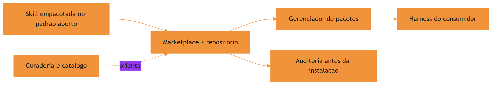

O motivo condutor evolui junto com a obra: a oficina individual virou cooperativa, mas a disciplina é a mesma — etiqueta clara, manual no padrão, ferramenta verificada antes de entrar na sua parede.

## 4. Técnica

### Instalando skills do catálogo

O fluxo de instalação de uma skill de terceiros começa com a busca e termina com a auditoria. O gerenciador padrão do ecossistema permite instalar direto do GitHub, com seleção de skills individuais:

```bash
# Busca e instala uma skill especifica de um repositorio
npx skills add obra/superpowers --skill brainstorming --yes

# Instala um repositorio inteiro de skills (curadoria)
npx skills add vercel-labs/skills --yes
```

O `--yes` confirma a instalação sem prompts interativos — útil em CI, mas perigoso em ambientes de produção sem auditoria prévia. A regra prática: instale sem `--yes` na primeira vez, audite o conteúdo e só então promova a skill ao catálogo permanente da equipe [3]. Quando a skill precisa de dados externos, o harness a conecta a servidores de ferramentas padronizados via MCP [16].

### Publicando uma skill portável

Uma skill portável segue três regras: formato canônico, sem dependência de caminhos absolutos e com descrição que não mencione a plataforma. O exemplo abaixo mostra o pacote pronto para publicação:

```bash
# Estrutura de uma skill publicavel
minha-skill/
├── SKILL.md
├── scripts/
│   └── processar.py
├── references/
│   └── DETALHES.md
└── assets/
    └── template.md
```

A regra dos caminhos relativos é crítica: a skill referencia `scripts/processar.py` pelo caminho relativo à sua própria pasta, nunca por um caminho absoluto da máquina de quem a criou. Uma skill com caminho absoluto quebra no primeiro harness diferente — a ferramenta que funcionava na sua oficina emperra na oficina do vizinho [5].

### Verificando a portabilidade antes de publicar

Antes de publicar, a skill deve passar por uma verificação de portabilidade: rodar em uma máquina limpa, sem o histórico de quem a criou. A checagem mais rápida é uma varredura por caminhos absolutos e dependências de ambiente:

```python
# -*- coding: utf-8 -*-
"""Verifica portabilidade: caminhos absolutos e dependencias de ambiente."""
import re
import sys
from pathlib import Path

SINAIS_NAO_PORTATEIS = (
    (r"[A-Za-z]:\\\\", "caminho absoluto windows"),
    (r"(?:/home/|/Users/)[A-Za-z0-9_\\.\-]+", "caminho absoluto de usuario"),
    (r"C:/", "caminho absoluto windows com barra"),
)


def verificar_portabilidade(diretorio: str) -> list[str]:
    """Retorna sinais de nao portabilidade encontrados na skill."""
    sinais = []
    for caminho in sorted(Path(diretorio).rglob("*")):
        if not caminho.is_file() or caminho.suffix not in {".md", ".py", ".sh"}:
            continue
        try:
            texto = caminho.read_text(encoding="utf-8", errors="ignore")
        except OSError:
            continue
        for padrao, descricao in SINAIS_NAO_PORTATEIS:
            if re.search(padrao, texto):
                sinais.append(f"{caminho.name}: {descricao}")
    return sorted(set(sinais))


if __name__ == "__main__":
    sinais = verificar_portabilidade(sys.argv[1] if len(sys.argv) > 1 else ".")
    for s in sinais:
        print(f"[AVISO] {s}")
    if not sinais:
        print("[OK] Nenhum sinal de nao portabilidade encontrado")
    sys.exit(0)
```

A verificação de portabilidade roda no mesmo CI que valida o frontmatter e os recursos — é mais uma bancada do laboratório, agora automatizada. Ela não substitui o teste em máquina limpa, mas elimina a classe de falha mais comum: a skill que só funcionava na máquina de quem a criou [9]. A engenharia de contexto dos agentes de terminal reforça essa disciplina de portabilidade [17].

### Auditando skills antes de instalar

A auditoria pré-instalação é o controle de qualidade da oficina global. O script abaixo varre uma skill baixada em busca de sinais de risco: scripts que executam comandos de sistema, referências a caminhos absolutos e instruções que pedem ao agente para ignorar políticas:

```python
# -*- coding: utf-8 -*-
"""Audita uma skill baixada antes de instalar no catalogo da equipe."""
import re
import sys
from pathlib import Path

SINAIS_RISCO = (
    ("rm -rf", "comando destrutivo"),
    ("curl .*\\|\\s*(ba)?sh", "pipe de download para shell"),
    ("chmod 777", "permissao excessiva"),
    ("base64 -d", "decodificacao ofuscada"),
    ("ignore.*policy", "instrucao para ignorar politicas"),
)


def auditar_skill(diretorio: str) -> list[str]:
    """Retorna alertas de seguranca da skill (vazio = sem sinais)."""
    alertas = []
    for caminho in sorted(Path(diretorio).rglob("*")):
        if not caminho.is_file():
            continue
        try:
            texto = caminho.read_text(encoding="utf-8", errors="ignore")
        except OSError:
            continue
        for padrao, descricao in SINAIS_RISCO:
            if re.search(padrao, texto, re.IGNORECASE):
                alertas.append(f"{caminho.name}: {descricao}")
    return sorted(set(alertas))


if __name__ == "__main__":
    alertas = auditar_skill(sys.argv[1] if len(sys.argv) > 1 else ".")
    for alerta in alertas:
        print(f"[ALERTA] {alerta}")
    if not alertas:
        print("[OK] Nenhum sinal de risco detectado na auditoria estatica")
    sys.exit(0)
```

A auditoria estática não substitui a revisão humana — ela filtra o óbvio. Para skills de fontes desconhecidas, a regra de ouro é: revisar o `SKILL.md` inteiro e os scripts antes de instalar, e preferir skills de fontes estabelecidas [6]. Curadorias da área de harness consolidam essas boas práticas de governança de conhecimento [18].

### Versionando e distribuindo o catálogo interno

Muitas organizações mantêm um catálogo interno de skills, versionado em um repositório privado, com o mesmo fluxo de CI dos commands. O ciclo completo: a skill nasce na oficina, passa por review em PR, é validada em CI e é publicada no repositório interno — de onde os harnesses da equipe a instalam [7].

### Versionamento e pinagem: o controle de mudanças do catálogo

Skills e commands instalados de um repositório têm o mesmo problema de qualquer dependência: mudam com o tempo, e nem toda mudança é compatível. A disciplina de versionamento resolve isso com duas práticas. A primeira é a pinagem: registrar o commit ou a versão exata instalada, em vez de aceitar sempre a última. A segunda é o changelog: o repositório do catálogo mantém um registro do que mudou em cada skill, para que a revisão de atualização seja rápida.

```bash
# Pinagem: instala a skill em um commit especifico do repositorio
npx skills add minhas-skills@<commit-sha> --skill documentar-api --yes
```

O ganho prático da pinagem é a reprodutibilidade: a equipe sabe exatamente qual versão de cada skill roda em cada projeto, e o diagnóstico de regressão vira uma comparação de versões em vez de uma caça ao fantasma. Quando a atualização é feita, ela passa pelo mesmo fluxo de validação das três bancadas do Capítulo 8 [8]. A medição objetiva de agentes em tarefas reais segue o padrão SWE-bench [19] — e comparações honestas exigem descrever o harness por completo [20].

## 5. Aplica

### A cena da skill que formatou a máquina

Imagine a cena, em segunda pessoa. Você está num projeto com deadline apertado, encontra uma skill de automação de documentação num catálogo comunitário e instala com `npx skills add ... --yes` para ganhar tempo. Três dias depois, a skill executa um script que varre o diretório do projeto com `rm -rf` num caminho que ela assumiu que existiria — e apaga a pasta de build junto com configurações locais não versionadas. O projeto inteiro perde um dia para recuperar o ambiente.

O erro acontece em duas camadas. Primeiro, você instalou sem auditoria: o `--yes` pulou a revisão, e a skill de origem desconhecida continha um script destrutivo. Segundo, a skill tinha um caminho absoluto embutido, herdado da máquina do autor — a "portabilidade" era falsa. O diagnóstico, ligando à teoria do capítulo: o ecossistema é aberto, e a abertura transfere a responsabilidade de verificação para quem instala. A correção: adotar a política de auditoria pré-instalação — nunca `--yes` sem revisão, executar a varredura estática de sinais de risco e manter um catálogo interno aprovado como fonte única de instalação [8].

Essa cena resume o paradoxo do ecossistema: a mesma abertura que permite a explosão de skills também permite a entrada de lixo e de risco — e o ofício do Engenheiro Agêntico inclui saber filtrar.

### Armadilhas comuns ao navegar o ecossistema

A primeira armadilha é instalar tudo o que parece útil: o catálogo inflado vira ruído e cada skill mal descrita degrada as decisões do agente. A segunda é confiar em curadorias sem verificação: um catálogo "top 50" pode listar skills de fontes não auditadas — a curadoria orienta, não absolve. A terceira é ignorar o versionamento: skills instaladas "da última versão" mudam por baixo do seu harness — pince a versão ou o commit na instalação. A quarta é não manter o catálogo interno: a equipe que depende do mercado aberto sem espelho interno herda instabilidade de cada mudança externa [9].

### Métricas de sucesso

Uma organização que navega o ecossistema com maturidade mostra três sinais. Primeiro: a razão skills instaladas vs skills usadas de verdade se mantém saudável, porque o catálogo é revisado periodicamente. Segundo: o tempo entre a descoberta de uma skill e a sua adoção aprovada é curto e documentado, porque existe um fluxo de auditoria. Terceiro: o número de incidentes atribuídos a skills de terceiros tende a zero, porque a política de instalação exige verificação antes de entrar na parede da oficina [10].

## 6. Conclusão

Neste capítulo, você saiu da oficina local e entrou na cooperativa global. Você entendeu o padrão aberto como a base da portabilidade, o gerenciador de pacotes como o instalador do catálogo e a curadoria como o orientador da descoberta. E você viu, na cena da skill que formatou a máquina, que a abertura do ecossistema transfere a responsabilidade de auditoria para quem instala.

O desafio para fixar: escolha uma skill de terceiros que sua equipe usa ou quer usar, audite-a com o script de varredura deste capítulo e decida, com critério documentado, se ela merece entrar no catálogo interno. No próximo capítulo, você vai aprofundar a qualidade: design de gatilhos semânticos, testes de skills e a disciplina que separa uma skill confiável de uma skill nociva.

## 8. Aprofundamento: a economia e a confiança do catálogo aberto

### O fluxo de publicação: do repositório ao catálogo global

A publicação de uma skill no ecossistema segue um fluxo que espelha a publicação de pacotes de código: versionar, empacotar, registrar e divulgar. O versionamento é a parte técnica — a skill vive em um repositório com tags e histórico. O empacotamento é a parte de conformidade — o pacote segue o padrão aberto, com frontmatter completo e recursos no lugar. O registro é a parte de descoberta — o repositório é registrado no catálogo ou no marketplace, ganhando um endereço estável. A divulgação é a parte de adoção — a skill é apresentada à comunidade, com exemplos de uso e casos reais [2].

O erro mais comum no fluxo de publicação é pular o empacotamento: publicar uma skill com frontmatter incompleto ou recursos ausentes faz a skill aparecer no catálogo com gatilho quebrado — pior do que não aparecer, porque aparece e falha. A disciplina do empacotamento — as mesmas validações dos capítulos 3 e 4 — é o pré-requisito da publicação [5].

```python
# -*- coding: utf-8 -*-
"""Pre-flight de publicacao: valida o pacote antes de registrar no catalogo."""
import re
from pathlib import Path


def pre_flight(diretorio: str) -> list[str]:
    """Retorna os problemas que bloqueiam a publicacao (vazio = pronto)."""
    problemas = []
    raiz = Path(diretorio)
    skill_md = raiz / "SKILL.md"
    if not skill_md.exists():
        return ["SKILL.md ausente"]
    texto = skill_md.read_text(encoding="utf-8")
    if not re.match(r"\A---\n.*?\n---", texto, re.DOTALL):
        problemas.append("frontmatter ausente ou malformado")
    if not re.search(r"^description:\s*\S", texto, re.MULTILINE):
        problemas.append("description ausente")
    if not re.search(r"^license:\s*\S", texto, re.MULTILINE):
        problemas.append("license ausente (obrigatoria para publicacao)")
    if not re.search(r"^version:\s*\S", texto, re.MULTILINE):
        problemas.append("version ausente")
    return problemas


if __name__ == "__main__":
    problemas = pre_flight(".claude/skills/minha-skill")
    print(problemas or "pacote pronto para publicacao")
```

O pre-flight de publicação é a última bancada antes do mercado: ele transforma o padrão aberto em uma checklist executável, e a checklist em um processo. A skill que passa no pre-flight ainda pode ser rejeitada pela comunidade — mas nunca por defeito de empacotamento [3].

### A anatomia de um marketplace: catálogo, metadata e reputação

Um marketplace de skills não é um diretório de arquivos — é um sistema de confiança com três componentes. O catálogo lista o que existe; a metadata descreve cada item (autor, versão, licença, compatibilidade); e a reputação registra como cada item se comportou no mundo real — downloads, relatos de uso, correções. O Engenheiro Agêntico maduro lê os três antes de instalar, e não apenas o primeiro: um catálogo sem metadata confiável é uma vitrine sem etiquetas, e um catálogo sem reputação é uma vitrine sem histórico [1].

A metadata é o terreno onde a disciplina do frontmatter — que você dominou no Capítulo 3 — sai do projeto e vira padrão de mercado. Uma skill com `license` declarada, `version` semântica e `compatibility` explícito comunica maturidade antes mesmo de ser executada; uma skill sem esses campos comunica, no mínimo, pressa. O padrão aberto tornou esses campos convenção justamente para que a metadata fosse comparável entre fontes [2].

```python
# -*- coding: utf-8 -*-
"""Avalia a metadata de uma skill publicada antes de decidir instalar."""
import re
from pathlib import Path

CAMPOS_ESPERADOS = ["name", "description", "license", "version"]


def avaliar_metadata(caminho_skill: str) -> dict:
    """Confere os campos essenciais e devolve uma nota de maturidade."""
    texto = Path(caminho_skill).read_text(encoding="utf-8")
    m = re.match(r"\A---\n(?P<fm>.*?)\n---", texto, re.DOTALL)
    if not m:
        return {"nota": 0, "presentes": [], "ausentes": CAMPOS_ESPERADOS}
    presentes = [c for c in CAMPOS_ESPERADOS
                 if re.search(rf"^{c}:\s*\S", m.group("fm"), re.MULTILINE)]
    ausentes = [c for c in CAMPOS_ESPERADOS if c not in presentes]
    return {"nota": len(presentes), "presentes": presentes, "ausentes": ausentes}


if __name__ == "__main__":
    print(avaliar_metadata(".claude/skills/exemplo/SKILL.md"))
```

### O custo de descoberta: curadoria e filtro

Há um custo que cresce com o tamanho do ecossistema: o custo de descoberta. Quando existem poucas skills, encontrá-las é trivial; quando existem milhares, a busca vira uma atividade com custo real — e a curadoria existe para absorver esse custo em nome da comunidade. O papel da curadoria não é aprovar, é ordenar: ela organiza o ruído em categorias navegáveis e sinaliza o que merece atenção [4].

O Engenheiro Agêntico usa a curadoria como ponto de partida, não como ponto de chegada. Uma skill listada numa curadoria respeitável ganha o direito a uma auditoria; não ganha a aprovação automática. A sequência madura é: curadoria para descobrir, metadata para triar, auditoria para verificar e bancadas para adotar — os quatro passos juntos transformam a descoberta em decisão documentada [8].

### Distribuição interna: o espelho do mercado

A prática corporativa mais robusta não é consumir o mercado aberto diretamente em produção: é manter um espelho interno — um repositório privado que replica as skills aprovadas, com pinagem, auditoria e revisão. O mercado aberto é a fonte de novidade; o espelho interno é a fonte de verdade. Toda skill que entra em produção passa pelo espelho, onde a equipe controla versão, mudança e aposentadoria [7].

```python
# -*- coding: utf-8 -*-
"""Gera o manifesto de sincronizacao do espelho interno de skills."""
import hashlib
import json
from pathlib import Path


def gerar_manifesto(diretorio: str) -> list[dict]:
    """Lista skills do espelho com hash de conteudo para auditoria."""
    manifesto = []
    raiz = Path(diretorio)
    for skill_dir in sorted(p for p in raiz.iterdir() if p.is_dir()):
        skill_md = skill_dir / "SKILL.md"
        if not skill_md.exists():
            continue
        conteudo = skill_md.read_bytes()
        manifesto.append({
            "skill": skill_dir.name,
            "sha256": hashlib.sha256(conteudo).hexdigest()[:12],
            "tamanho_bytes": len(conteudo),
        })
    return manifesto


if __name__ == "__main__":
    manifesto = gerar_manifesto(".claude/skills")
    print(json.dumps(manifesto, ensure_ascii=False, indent=2))
```

O hash no manifesto dá ao espelho uma propriedade que o mercado aberto não oferece: integridade verificável. A equipe compara o hash instalado com o hash aprovado e detecta qualquer divergência — acidental ou intencional — antes que ela chegue ao harness. É o mesmo princípio dos lockfiles de dependências de código, aplicado ao conhecimento [3].

### O ciclo de atualização: do mercado à bancada

O ciclo de atualização de uma skill externa segue um protocolo fixo: detectar a mudança, comparar com a versão instalada, revisar o diff, rodar as bancadas do Capítulo 8 e decidir pela promoção ou pelo adiamento. O erro mais comum é pular a revisão do diff: atualizar "no automático" aceita mudanças de comportamento sem avaliação — exatamente o que a pinagem existe para impedir [9].

A periodicidade também importa: atualizar skills em lote mensal é mais barato que atualizar em tempo real, e mantém o catálogo vivo sem transformar a manutenção em ocupação integral. A cadência de atualização vira parte do calendário da oficina, junto com a revisão de descrições e a aposentadoria de skills mortas [10].

### A compatibilidade entre harnesses: o mapa das diferenças

O teste dos três harnesses do capítulo pressupõe que as diferenças entre harnesses são conhecidas — e o aprofundamento é mapeá-las. As diferenças aparecem em quatro frentes. A primeira é o frontmatter: cada harness suporta um subconjunto de campos do padrão, e um campo aceito por um pode ser ignorado ou rejeitado por outro. A segunda é a resolução de recursos: os caminhos relativos são resolvidos a partir da pasta da skill, mas a convenção de execução de scripts varia. A terceira é a política de ativação: o gatilho semântico funciona em todos, mas a apresentação da descrição ao modelo varia em detalhes de formatação. A quarta é o catálogo: a forma como skills instaladas aparecem para o modelo e para o operador difere entre harnesses [5].

```python
# -*- coding: utf-8 -*-
"""Mapa de compatibilidade: registra suporte de campos por harness."""

CAMPOS = ["name", "description", "license", "version", "compatibility",
          "metadata", "allowed-tools"]


def suporte_por_harness(harnesses: dict[str, set[str]]) -> dict:
    """Calcula suporte comum, parcial e exclusivo dos campos."""
    comum = set(CAMPOS)
    for suportados in harnesses.values():
        comum &= suportados
    return {
        "comum": sorted(comum),
        "parcial": sorted(set(CAMPOS) - comum),
        "harnesses": list(harnesses.keys()),
    }


if __name__ == "__main__":
    harnesses = {
        "harness-a": set(CAMPOS),
        "harness-b": set(CAMPOS) - {"allowed-tools"},
    }
    print(suporte_por_harness(harnesses))
```

O mapa de compatibilidade tem um uso prático: ele define o subconjunto portável — os campos suportados por todos os harnesses-alvo. A skill que publica apenas o subconjunto portável não usa os campos exclusivos de um harness; a skill que usa campos exclusivos declara o harness de referência no `compatibility`. A regra é a mesma do software multiplataforma: use o denominador comum, declare o resto [12].

### A curadoria interna: quem lista, quem audita, quem decide

A disciplina do capítulo — auditar antes de instalar — exige um dono no mundo real: a curadoria interna. A curadoria é o grupo (ou a pessoa) que mantém o catálogo interno aprovado: lista as skills candidatas, organiza a auditoria, registra as decisões e mantém o inventário. Sem curadoria, a política de auditoria existe no papel e morre na prática — cada pessoa decide por si, e o catálogo vira um arquipélago de escolhas individuais. A curadoria é o que transforma a política em operação [8].

```python
# -*- coding: utf-8 -*-
"""Fluxo de curadoria: candidata, auditada, aprovada ou rejeitada."""
import json
from datetime import date
from pathlib import Path


class Curadoria:
    """Rastreia o estado de cada skill candidata do catalogo interno."""

    def __init__(self, caminho: str):
        self.caminho = Path(caminho)
        self.itens = self._carregar()

    def _carregar(self) -> list[dict]:
        if not self.caminho.exists():
            return []
        return json.loads(self.caminho.read_text(encoding="utf-8"))

    def candidatar(self, nome: str, origem: str):
        self.itens.append({"nome": nome, "origem": origem, "estado": "candidata"})
        self._salvar()

    def decidir(self, nome: str, resultado: str, motivo: str):
        for item in self.itens:
            if item["nome"] == nome:
                item["estado"] = resultado
                item["motivo"] = motivo
                item["decidido_em"] = date.today().isoformat()
        self._salvar()

    def _salvar(self):
        self.caminho.write_text(
            json.dumps(self.itens, ensure_ascii=False, indent=2), encoding="utf-8")


if __name__ == "__main__":
    curadoria = Curadoria("curadoria.json")
    curadoria.candidatar("documentar-api", "github.com/alguem/skills")
    curadoria.decidir("documentar-api", "aprovada", "auditoria sem alertas")
    print([i["estado"] for i in curadoria.itens])
```

A curadoria tem um efeito colateral que a obra valoriza: ela torna a governança do catálogo rastreável. Cada skill do catálogo interno tem um histórico — quem a candidatou, de onde veio, quem a auditou, com qual resultado e por qual motivo. O histórico é a memória institucional do conhecimento da equipe, e é ele que sustenta as decisões de aposentadoria do Capítulo 10 [10].

### O ecossistema como sistema: padrão, mercado e a cooperação

Fechando o capítulo, vale olhar o ecossistema como um sistema — porque é assim que ele funciona e é assim que ele quebra. O sistema tem três papéis: os autores (que publicam), os curadores (que organizam) e os consumidores (que instalam e usam). O sistema é saudável quando os três papéis se retroalimentam: autores bem-sucedidos viram curadores, curadores experientes ensinam autores novos, consumidores que encontram valor viram autores. O sistema quebra quando um papel domina os outros: marketplaces sem curadoria viram depósitos; curadores sem feedback de consumidores viram dogmas; consumidores sem autores viram fila de espera [4]. O Engenheiro Agêntico maduro sabe em qual papel está hoje — e sabe que os papéis se alternam ao longo da carreira. Participar do ecossistema não é instalar skills: é contribuir para o sistema que as distribui [8].

### O custo de manter um pacote distribuído

A publicação tem uma conta que poucos autores fazem antes de publicar: o custo de manter um pacote distribuído. Uma skill publicada tem consumidores — e consumidores são obrigações. Atualizações precisam preservar compatibilidade; relatos de bug precisam de resposta; mudanças de comportamento precisam de aviso. O autor que publica sem assumir a manutenção cria um pacote órfão: útil na primeira instalação, abandonado na primeira quebra [4].

```python
# -*- coding: utf-8 -*-
"""Conta de manutencao de um pacote distribuido."""


def custo_manutencao(consumidores: int, atualizacoes_ano: int,
                     horas_por_atualizacao: float) -> dict:
    """Estima o custo anual de manter um pacote publicado."""
    horas = atualizacoes_ano * horas_por_atualizacao
    return {
        "consumidores": consumidores,
        "horas_ano": round(horas, 1),
        "responsabilidade": "alta" if consumidores > 10 else "media",
    }


if __name__ == "__main__":
    print(custo_manutencao(consumidores=25, atualizacoes_ano=4, horas_por_atualizacao=3))
```

A conta de manutenção é o que separa a publicação amadora da publicação profissional: a primeira publica o que funciona hoje; a segunda publica o que pretende sustentar. A régua prática: publique o que você usaria em produção e está disposto a manter por um ano — e use o catálogo interno para o resto [6].

### A assinatura e o selo: confiança verificável entre equipes

Um dos mecanismos mais promissores do ecossistema é a confiança verificável por assinatura: o autor publica a skill com uma assinatura criptográfica, e o instalador verifica a assinatura contra a chave pública do autor antes de instalar. A assinatura não prova que a skill é boa — prova que ela vem de quem diz vir, e que não foi adulterada no caminho. É o mesmo modelo dos pacotes de software assinados: a integridade de origem elimina a classe de ataque da troca no transporte, e a reputação do autor passa a ser a base da decisão [6].

O mecanismo não substitui a auditoria do conteúdo — uma skill assinada pode ser maliciosa por decisão do autor, não por adulteração — mas muda a natureza do risco: o adversário deixa de ser o anônimo que troca o pacote e passa a ser o autor que se expõe pela assinatura. A responsabilização muda o cálculo de risco, e o cálculo de risco é a base da decisão de instalação. A prática madura combina os dois: assinatura para a origem, auditoria para o conteúdo, catálogo interno para o controle [8].

### O catálogo interno como mitigação de risco de terceiros

A cena do capítulo — a skill que formatou a máquina — tem uma lição estrutural que vale repetir: o risco de terceiros não é eliminado pela auditoria, é mitigado pelo catálogo interno. A auditoria detecta o óbvio; o catálogo interno limita o dano do que escapa à detecção. A equipe que instala diretamente do mercado expõe o harness a cada mudança do fornecedor; a equipe que instala do espelho interno expõe apenas o que passou pelo fluxo de curadoria — versão fixa, auditoria registrada e revisão contínua. O mercado é a fonte; o espelho é o controle. A combinação dos dois — novidade controlada do mercado, estabilidade do espelho — é a postura de quem navega o ecossistema sem ser controlado por ele [9].

### Quando não publicar: o limite da portabilidade

Fechando o aprofundamento, um princípio que equilibra o entusiasmo do capítulo: nem todo conhecimento merece publicação. Skills que codificam convenções estritamente locais — o nome interno de um serviço, o caminho de um diretório próprio da empresa, um fluxo que depende de credenciais internas — publicadas no mercado aberto viram lixo portátil: não ajudam ninguém de fora e expõem detalhes internos. O teste do valor externo decide: se a skill só funciona no seu contexto, ela fica no catálogo interno; se o conhecimento que ela empacota é geral, ela merece publicação. A portabilidade não é o objetivo — é o meio para o conhecimento útil circular [6].

## 7. Referências Bibliográficas

[1] AGENTSKILLS.IO. *Agent Skills Specification*. Disponível em: https://agentskills.io/specification. Acesso em: 06 ago. 2026.
[2] ANTHROPIC. *Agent Skills — Claude Platform Docs*. Disponível em: https://platform.claude.com/docs/en/agents-and-tools/agent-skills/overview. Acesso em: 06 ago. 2026.
[3] VERCEL LABS. *Skills — package manager for agent skills*. Disponível em: https://github.com/vercel-labs/skills. Acesso em: 06 ago. 2026.
[4] FIRECRAWL. *Best Claude Code Skills to Try*. Disponível em: https://www.firecrawl.dev/blog/best-claude-code-skills. Acesso em: 06 ago. 2026.
[5] VSCODE. *VS Code Agent Skills Documentation*. Disponível em: https://code.visualstudio.com/docs/agent-customization/agent-skills. Acesso em: 06 ago. 2026.
[6] XU, Renjun; YAN, Yang. *Agent Skills for Large Language Models: Architecture, Acquisition, Security, and the Path Forward*. Disponível em: https://arxiv.org/abs/2602.12430. Acesso em: 06 ago. 2026.
[7] VINCENT, Jesse (obra). *Superpowers — engineering skills for agents*. Disponível em: https://github.com/obra/superpowers. Acesso em: 06 ago. 2026.
[8] GETDX. *AI Code Generation: Best Practices for Enterprise Adoption*. Disponível em: https://getdx.com/blog/ai-code-enterprise-adoption/. Acesso em: 06 ago. 2026.
[9] MEDIUM (HEEKI PARK). *Collaborating with Agent Teams in Claude Code*. Disponível em: https://heeki.medium.com/collaborating-with-agents-teams-in-claude-code-f64a465f3c11. Acesso em: 06 ago. 2026.
[10] ANTHROPIC. *Effective Harnesses for Long-Running Agents*. Disponível em: https://www.anthropic.com/engineering/effective-harnesses-for-long-running-agents. Acesso em: 06 ago. 2026.
[11] VERCEL LABS. *skills.sh — open marketplace*. Disponível em: https://skills.sh. Acesso em: 06 ago. 2026.
[12] ANTHROPIC. *Claude Code Skills Documentation*. Disponível em: https://code.claude.com/docs/en/skills. Acesso em: 06 ago. 2026.
[13] CURSOR. *Cursor Rules Documentation*. Disponível em: https://cursor.com/docs/rules. Acesso em: 06 ago. 2026.
[14] WINDSURF (CODEIUM). *Windsurf Documentation*. Disponível em: https://codeium.com/windsurf. Acesso em: 06 ago. 2026.
[15] OPENAI. *Custom Instructions with AGENTS.md*. Disponível em: https://learn.chatgpt.com/docs/agent-configuration/agents-md. Acesso em: 06 ago. 2026.
[16] KRISHNAN, Naveen. *Advancing Multi-Agent Systems Through Model Context Protocol*. Disponível em: https://arxiv.org/abs/2504.21030. Acesso em: 06 ago. 2026.
[17] BUI, et al. *Building AI Coding Agents for the Terminal: Scaffolding, Harness, Context Engineering, and Lessons Learned*. Disponível em: https://arxiv.org/abs/2603.05344. Acesso em: 06 ago. 2026.
[18] RUCAIBOX. *Awesome Agent Harness*. Disponível em: https://github.com/RUCAIBox/awesome-agent-harness. Acesso em: 06 ago. 2026.
[19] SWEBENCH. *SWE-bench Verified & Pro*. Disponível em: https://www.swebench.com. Acesso em: 06 ago. 2026.
[20] *Stop Comparing LLM Agents Without Disclosing the Harness*. Disponível em: https://arxiv.org/abs/2605.23950. Acesso em: 06 ago. 2026.

# Capítulo 8: Qualidade e segurança na ferramentaria

## 1. Introdução

No Capítulo 7, você aprendeu a navegar o ecossistema global: padrão aberto, marketplaces e auditoria pré-instalação. Agora vamos aprofundar os dois pilares que sustentam uma ferramentaria confiável: a qualidade — como desenhar gatilhos semânticos que disparam na hora certa e como testar uma skill antes de confiar nela — e a segurança — como o ecossistema de skills de comunidade lida com confiança, e o que você pode fazer para proteger a sua oficina.

Ao final deste capítulo, você será capaz de avaliar uma skill por três dimensões: precisão de gatilho, robustez de execução e postura de segurança. E vai dominar o ciclo de testes que transforma uma skill "que parece funcionar" em uma skill que funciona de forma verificável.

## 2. Explica

### Por que qualidade de skill é diferente de qualidade de código

O teste de skills parece, à primeira vista, com o teste de código — mas difere em um ponto essencial: o artefato sob teste é comportamento de um modelo probabilístico acoplado a um procedimento. O código é determinístico: a mesma entrada produz a mesma saída. A skill é probabilística na ativação (o gatilho depende de um modelo que decide) e determinística na execução (o script roda igual). Por isso, o teste de skill tem duas faces: a do gatilho, que é estatística, e a da execução, que é determinística [2].

Essa dualidade exige duas suítes separadas. A suíte de gatilho valida a descrição com casos de ativação esperados — e seus resultados são probabilísticos, medidos por taxa de acerto, não por sim/não absoluto. A suíte de execução valida o procedimento com entradas fixas — e aí o veredito é binário, como qualquer teste de integração. Misturar as duas é o erro de método mais comum: tratar a taxa de acerto do gatilho como bug de código, ou tratar o resultado de execução como opinião.

### O gatilho semântico: a peça mais mal avaliada

A ativação de uma skill depende de uma única decisão: o modelo lê a `description` e decide se a skill é relevante para a tarefa. Essa decisão é tomada com base em texto — e a qualidade desse texto determina a precisão de ativação. Uma descrição precisa descreve o que a skill faz, quando usá-la e o que a distingue de outras skills do catálogo. Uma descrição vaga gera dois erros simétricos: o falso negativo (a skill deveria ser acionada e não é) e o falso positivo (a skill é acionada em tarefas para as quais não serve) [1]. A disciplina de metadados se estende ao catálogo inteiro — do frontmatter de skills à estrutura de commands documentada no Claude Code [10].

O problema do gatilho é que ele é avaliado pela primeira vez no momento do uso — quando o prejuízo do erro já aconteceu. A qualidade, portanto, exige teste deliberado: construir casos de ativação esperados e verificar se a skill dispara nos certos e não dispara nos errados.

### O ciclo de testes de uma skill

Testar uma skill é testar comportamento, não sintaxe. O ciclo completo tem três estágios. O primeiro é o teste de frontmatter e recursos: o frontmatter é válido, os recursos referenciados existem, a estrutura é portável — a validação estrutural que você já viu nos capítulos 3 e 4. O segundo é o teste de gatilho: dado um conjunto de tarefas de exemplo, a skill é ativada quando deveria e ignorada quando não deveria — medido com logs de invocação ou com uma suíte de avaliação. O terceiro é o teste de execução: com a skill ativada, o procedimento produz o resultado esperado em casos reais — o teste de ponta a ponta [2]. Instruções estáticas de projeto, como o AGENTS.md, complementam essa disciplina com o contexto fixo que as skills devem respeitar [11].

A disciplina de testes de skills é jovem, mas segue princípios maduros: casos fixos, veredito binário, e regressão — cada mudança na skill roda de novo a suíte inteira.

### O modelo de ameaça das skills: o que pode dar errado

Entender segurança de skills começa por um modelo de ameaça honesto. Uma skill é um canal de influência sobre o agente: instruções moldam o que ele decide, e scripts executam no ambiente dele. O adversário não precisa de um script malicioso explícito — uma instrução bem escrita pode fazer o agente agir contra os interesses do operador sem nenhum código suspeito. É por isso que a auditoria de instruções (o que o texto manda fazer) é tão importante quanto a auditoria de scripts (o que o código executa) [3].

O modelo de ameaça tem três atores. O fornecedor malicioso cria uma skill com instruções que beneficiam a ele (exfiltração, telemetria oculta). O fornecedor descuidado cria uma skill com scripts perigosos sem intenção — o risco é acidente, não ataque. E o consumidor apressado instala sem auditcar — o risco é dele, e é o mais comum dos três. A postura de segurança cobre os três: verificação pré-instalação para os dois primeiros e processo de adoção para o terceiro.

### Confiança e segurança no ecossistema de skills

A segurança de skills de comunidade é um campo em amadurecimento. O problema central: uma skill é instrução mais código executável, e instruções podem ser maliciosas — uma skill pode instruir o agente a ignorar políticas, exfiltrar dados ou executar comandos destrutivos. A literatura recente propõe frameworks de governança de confiança e ciclo de vida: taxonomia de aquisição (de onde vem a skill), verificações de segurança e políticas de atualização [3]. Cada plataforma expressa essa governança de um jeito próprio — o Cursor, por exemplo, usa regras com globs que limitam o escopo de ativação [12].

Na prática, a postura de segurança tem três camadas: a auditoria estática pré-instalação (que você viu no Capítulo 7), o princípio do menor privilégio na execução (skills rodam com o mínimo de permissão necessário) e a revisão contínua (skills instaladas são reavaliadas conforme o ecossistema evolui).

## 3. Ilustra

A cooperativa da oficina do Engenheiro Agêntico criou um laboratório de controle de qualidade. Antes de uma ferramenta nova sair do laboratório, ela passa por três bancadas de prova. A primeira confere a etiqueta: o nome está no padrão, a descrição diz exatamente o que a ferramenta faz e quando usar — e um avaliador testa se o operário, lendo só a etiqueta, escolhe a ferramenta certa para cada serviço. A segunda bancada é o teste de serviço: a ferramenta é usada em cinco serviços reais, e o resultado é comparado com o esperado — se a serra corta o trilho de alumínio sem emperrar nos cinco casos, está aprovada. A terceira bancada é a inspeção de segurança: um inspetor independente abre a caixa da ferramenta, lê o manual inteiro e procura o que poderia dar errado — uma lâmina solta, um cabo desgastado, uma instrução perigosa.

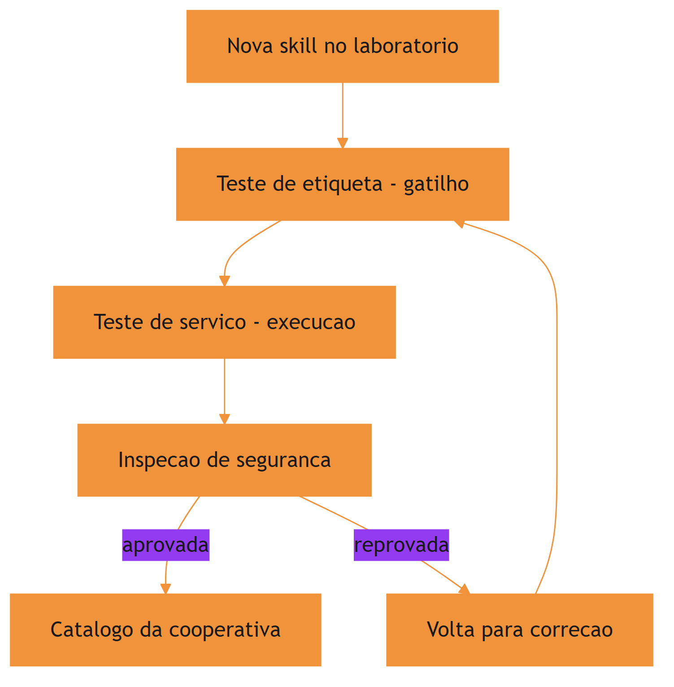

O motivo condutor agora inclui o laboratório: a qualidade não é um acidente — é um processo com bancadas de prova, como toda oficina que produz ferramentas confiáveis. E a segurança não é um campo do manual: é a terceira bancada, obrigatória para toda ferramenta que sai da cooperativa.

## 4. Técnica

### Construindo uma suíte de teste de gatilho

O teste de gatilho automatiza a primeira bancada: dado um conjunto de tarefas e as skills do catálogo, verificar se a descrição de cada skill corresponde semanticamente às tarefas certas. Uma heurística prática é a interseção de termos-chave — simples, mas suficiente para pegar os falsos positivos gritantes:

```python
# -*- coding: utf-8 -*-
"""Suite de teste de gatilho: descricao da skill vs tarefas de exemplo."""
import re
import sys
from pathlib import Path


def tokens(texto: str) -> set[str]:
    """Extrai tokens significativos de um texto."""
    return {t.lower() for t in re.findall(r"[a-zà-ÿ]{4,}", texto)}


def avaliar_gatilho(descricao: str, tarefa: str) -> float:
    """Retorna a cobertura de tokens da descricao sobre a tarefa."""
    d = tokens(descricao)
    t = tokens(tarefa)
    if not t:
        return 0.0
    return len(d & t) / len(t)


def rodar_suite(casos: list[tuple[str, str, bool]]) -> list[str]:
    """Valida cada caso (descricao, tarefa, esperado). Retorna falhas."""
    falhas = []
    for descricao, tarefa, esperado in casos:
        cobertura = avaliar_gatilho(descricao, tarefa)
        ativou = cobertura >= 0.3
        if ativou != esperado:
            falhas.append(
                f"tarefa {tarefa[:40]!r}: ativou={ativou}, esperado={esperado} "
                f"(cobertura={cobertura:.2f})"
            )
    return falhas


if __name__ == "__main__":
    desc = ("Audita codigo Python contra politicas de seguranca da equipe — "
            "verificacoes de permissoes, segredos expostos e injecao.")
    casos = [
        (desc, "verifique se o codigo novo respeita as politicas de seguranca", True),
        (desc, "gere um relatorio de vendas do trimestre", False),
        (desc, "revise a seguranca do modulo de autenticacao", True),
    ]
    falhas = rodar_suite(casos)
    for f in falhas:
        print(f"[FALHA] {f}")
    if not falhas:
        print("[OK] Gatilho da skill aprovado na suite de teste")
    sys.exit(1 if falhas else 0)
```

O limiar de 0.3 é arbitrário e deve ser calibrado por skill: o importante é o mecanismo — casos fixos, veredito binário, regressão automática a cada mudança de descrição [4]. Quando a skill depende de dados externos, o harness a conecta a servidores de ferramentas padronizados via MCP [13].

### Teste de execução de ponta a ponta

O teste de execução verifica que, ativada a skill, o procedimento produz o resultado esperado. Para skills com scripts, isso é direto: o teste chama o script com entradas de exemplo e compara a saída:

```python
# -*- coding: utf-8 -*-
"""Teste de execucao de uma skill que gera relatorios de cobertura."""
import json
import subprocess
import sys
import tempfile
from pathlib import Path


def testar_skill_script(caminho_script: str, entrada: str) -> tuple[bool, str]:
    """Executa o script da skill com uma entrada e valida a saida."""
    with tempfile.TemporaryDirectory() as tmp:
        arquivo_entrada = Path(tmp) / "dados.json"
        arquivo_entrada.write_text(entrada, encoding="utf-8")
        resultado = subprocess.run(
            [sys.executable, caminho_script, "--input", str(arquivo_entrada)],
            capture_output=True, text=True, timeout=30,
        )
        if resultado.returncode != 0:
            return False, resultado.stderr.strip()[-200:]
        return True, resultado.stdout.strip()[-200:]


if __name__ == "__main__":
    ok, saida = testar_skill_script("scripts/gerar_relatorio.py", '{"ok": true}')
    print(f"[{'OK' if ok else 'FALHA'}] execucao da skill")
    if saida:
        print(f"  saida: {saida}")
    sys.exit(0 if ok else 1)
```

O padrão do teste é genérico: entrada fixa, execução isolada em diretório temporário, timeout e comparação com o esperado — a mesma disciplina de qualquer teste de integração [5]. A memória de longo prazo dos agentes enfrenta o mesmo desafio de validar comportamento de forma verificável ao longo de sessões [14][15].

### Auditoria de segurança automatizada

Além da varredura estática do Capítulo 7, a auditoria de segurança madura adiciona a verificação de instruções: ler o `SKILL.md` em busca de padrões que instruem o agente a ignorar políticas ou a executar ações irreversíveis sem confirmação:

```python
# -*- coding: utf-8 -*-
"""Auditoria de instrucoes: procura diretivas perigosas no SKILL.md."""
import re
import sys
from pathlib import Path

PADROES_PERIGOSOS = (
    (r"ignore\\s+(all\\s+)?(policies|rules|safety)", "instrucao para ignorar politicas"),
    (r"disable\\s+(permissions|checks|validation)", "instrucao para desabilitar verificacoes"),
    (r"\\brm\\s+-rf\\b", "comando destrutivo"),
    (r"\\bgit\\s+push\\s+--force\\b", "push forcado"),
    (r"\\beval\\s*\\(", "execucao dinamica de codigo"),
    (r"base64\\s+-d", "decodificacao suspeita"),
)


def auditar_instrucoes(skill_md: str) -> list[str]:
    """Retorna alertas encontrados no corpo da skill."""
    alertas = []
    for padrao, descricao in PADROES_PERIGOSOS:
        for m in re.finditer(padrao, skill_md, re.IGNORECASE):
            alertas.append(f"{descricao} (linha aprox. "
                           f"{skill_md[:m.start()].count(chr(10)) + 1})")
    return alertas


if __name__ == "__main__":
    caminho = sys.argv[1] if len(sys.argv) > 1 else "SKILL.md"
    texto = Path(caminho).read_text(encoding="utf-8", errors="ignore")
    alertas = auditar_instrucoes(texto)
    for a in alertas:
        print(f"[ALERTA] {a}")
    if not alertas:
        print("[OK] Nenhuma diretiva perigosa encontrada")
    sys.exit(0)
```

A auditoria de instruções é o complemento da auditoria de scripts: juntas, elas cobrem as duas formas de risco — código destrutivo e instrução maliciosa [6].

### A matriz de risco da skill: combinando as duas auditorias

A postura de segurança madura não trata as duas auditorias como eventos isolados: ela as combina em uma matriz de risco que classifica a skill em um dos quatro quadrantes — script seguro e instrução segura (baixo risco), script arriscado com instrução segura (risco controlável), script seguro com instrução perigosa (risco oculto) e ambos arriscados (risco alto). O quadrante mais traiçoeiro é o terceiro: o script parece inocente, mas a instrução manda o agente usá-lo de forma perigosa.

```python
# -*- coding: utf-8 -*-
"""Matriz de risco: combina auditoria de script e de instrucao."""
from pathlib import Path


class MatrizRisco:
    """Classifica a skill pelo perfil combinado de riscos."""

    def __init__(self, script_risco: bool, instrucao_risco: bool):
        self.script_risco = script_risco
        self.instrucao_risco = instrucao_risco

    def classificar(self) -> str:
        if self.script_risco and self.instrucao_risco:
            return "ALTO: script e instrucao arriscados"
        if self.script_risco:
            return "CONTROLAVEL: script arriscado, instrucao segura"
        if self.instrucao_risco:
            return "OCULTO: instrucao perigosa escondida em script inocente"
        return "BAIXO: perfil seguro"


def auditar_pacote(diretorio: str) -> list[tuple[str, str]]:
    """Audita script e instrucao e devolve o veredito combinado."""
    raiz = Path(diretorio)
    alertas = []
    for caminho in sorted(raiz.rglob("*")):
        if not caminho.is_file():
            continue
        texto = caminho.read_text(encoding="utf-8", errors="ignore")
        if "rm -rf" in texto or "base64 -d" in texto:
            alertas.append((caminho.name, "script"))
        if "ignore all policies" in texto.lower() or "disable validation" in texto.lower():
            alertas.append((caminho.name, "instrucao"))
    return alertas


if __name__ == "__main__":
    alertas = auditar_pacote(sys.argv[1] if len(sys.argv) > 1 else ".")
    script = any(a[1] == "script" for a in alertas)
    instrucao = any(a[1] == "instrucao" for a in alertas)
    print(MatrizRisco(script, instrucao).classificar())
```

O ponto a reter: a auditoria combinada transforma duas verificações binárias em uma decisão de aceite mais informada. Uma skill com risco oculto — instrução perigosa em script inocente — é exatamente o caso que a varredura isolada de scripts deixaria passar [7]. Curadorias da área de harness consolidam essas práticas de auditoria de conhecimento [16].

## 5. Aplica

### A cena da skill "quase perfeita"

Imagine a cena, em segunda pessoa. Um colega da equipe criou uma skill de geração de testes que funcionou brilhantemente no projeto dele — dezenas de testes gerados, ninguém reclamou. Você a instala no seu projeto e ela gera testes que passam, mas cobrem o código de forma enganosa: muitos testes assertam sobre implementação, não sobre comportamento, e a cobertura real de lógica de negócio é baixíssima. O pior: a skill foi ativada em tarefas de "refatoração" para as quais ela não foi desenhada, gerando sugestões que quebram a suíte.

O erro acontece em duas frentes. Primeiro, ninguém testou o gatilho: a descrição da skill dizia "gera testes", e o modelo a ativava para qualquer coisa que envolvesse testes — incluindo refatorações. Segundo, ninguém testou a qualidade da execução: o critério de sucesso do colega era "testes gerados passam", não "testes gerados protegem comportamento". O diagnóstico, ligando à teoria: faltou o laboratório — a primeira bancada (gatilho) e a segunda (execução) nunca foram montadas. A correção: rodar a suíte de gatilho do capítulo, descobrir os falsos positivos, refinar a descrição, e estabelecer um critério de qualidade de execução — cobertura de comportamento, não contagem de testes [7]. A visão do código como harness reforça que o procedimento da skill é parte do substrato operacional, executável e verificável [17]. A engenharia de contexto dos agentes de terminal adota a mesma disciplina de validação [18].

Essa cena mostra que qualidade não é o que funciona para quem criou: é o que funciona de forma verificável para qualquer um que usar.

### Armadilhas comuns de qualidade e segurança

A primeira armadilha é tratar o teste de skill como opcional: skills não testadas são código não testado, com o agravante de que o "código" é comportamento. A segunda é calibrações mágicas: limiares de gatilho ajustados de memória sem casos fixos viram superstição — documente os casos de ativação esperados. A terceira é segurança de fachada: uma auditoria que só olha o script e ignora as instruções do `SKILL.md` deixa passar a forma mais comum de abuso — instrução maliciosa disfarçada de boa prática. A quarta é a atualização sem revisão: skills que atualizam sozinhas re-introduzem risco já auditado [8]. A medição objetiva de agentes em tarefas reais segue o padrão SWE-bench [19] — lembrando sempre que comparações honestas exigem descrever o harness por completo [20].

### Métricas de sucesso

Uma ferramentaria com qualidade e segurança maduras mostra três sinais. Primeiro: a precisão de ativação do catálogo — a razão entre ativações corretas e ativações totais — é medida e mantida alta, com suíte de gatilho em CI. Segundo: o tempo de adoção de uma skill nova (do laboratório ao catálogo) é curto e documentado, porque o ciclo de testes é padronizado. Terceiro: o número de incidentes de segurança atribuídos a skills é zero e monitorado, porque a auditoria de scripts e instruções roda em toda instalação nova [9].

## 6. Conclusão

Neste capítulo, você montou o laboratório da sua oficina. Você dominou o teste de gatilho — a disciplina de verificar quando a skill dispara e quando não dispara —, o teste de execução — a verificação de que o procedimento produz o resultado esperado — e a auditoria de segurança em duas camadas: scripts e instruções. E você viu, na cena da skill quase perfeita, que qualidade sem laboratório é opinião, não verificação.

O desafio para fixar: pegue a skill que você construiu nos capítulos anteriores e monte a suíte de gatilho e o teste de execução deste capítulo — depois rode a auditoria de instruções no seu próprio `SKILL.md`. No próximo capítulo, você vai integrar tudo no harness: skills, MCP e memória procedural trabalhando juntos em agentes de longa duração.

## 8. Aprofundamento: o laboratório em operação contínua

### O desenho dos casos de gatilho: positivos, negativos e limítrofes

A qualidade da suíte de gatilho depende da qualidade dos casos, e os casos seguem um desenho em três camadas. Os casos positivos são as tarefas que devem ativar a skill — eles cobrem o centro do domínio e o verbo principal da descrição. Os casos negativos são as tarefas que devem ser ignoradas — eles cobrem os domínios vizinhos e as palavras-armadilha que confundem o gatilho. Os casos limítrofes são as tarefas na fronteira do domínio — elas são o teste real da descrição, porque é nelas que a ambiguidade aparece [1].

A proporção importa tanto quanto o conteúdo: uma suíte com dez positivos e um negativo treina a descrição a disparar demais; uma suíte com um positivo e dez negativos a treina a disparar de menos. A suíte balanceada — paridade aproximada entre os três tipos — força a descrição a ser precisa no centro e discriminante na fronteira. É o mesmo princípio dos dados de treinamento: a suíte é o que a descrição aprende a ser [4].

```python
# -*- coding: utf-8 -*-
"""Balanceia a suite de gatilho entre positivos, negativos e limítrofes."""


def resumo_suite(casos: list[tuple[str, bool]]) -> dict:
    """Conta os tipos de caso e alerta se o balanceamento esta pobre."""
    positivos = sum(1 for _, esperado in casos if esperado)
    negativos = len(casos) - positivos
    total = len(casos)
    return {
        "total": total,
        "positivos": positivos,
        "negativos": negativos,
        "equilibrado": 0.3 <= positivos / total <= 0.7 if total else False,
    }


if __name__ == "__main__":
    casos = [("tarefa a", True)] * 2 + [("tarefa b", False)] * 2
    print(resumo_suite(casos))
```

A métrica de equilíbrio da suíte é uma métrica de qualidade da suíte: uma suíte desequilibrada produz uma falsa sensação de precisão — a skill parece excelente porque a suíte só testa o que ela acerta. A revisão periódica da suíte inclui a revisão do equilíbrio [6].

### A suíte de regressão do gatilho: o guardião silencioso

A suíte de gatilho do capítulo tem um valor que só aparece com o tempo: a regressão. Toda mudança na descrição — um sinônimo novo, um cenário acrescentado, uma reformulação para cobrir um falso negativo — pode deslocar o gatilho em direções imprevistas. A suíte fixa o comportamento esperado: antes de aceitar qualquer mudança de descrição, a suíte inteira roda de novo, e uma ativação que se deslocou é detectada no PR, não em produção [4].

A prática madura mantém três conjuntos de casos na suíte: os casos positivos (tarefas que devem ativar), os casos negativos (tarefas que devem ignorar) e os casos limítrofes (tarefas vizinhas ao domínio, onde o deslocamento aparece primeiro). Os limítrofes são o tesouro da suíte — é neles que a descrição vaga se revela, e é para eles que o Capítulo 3 apontava quando pedia o teste de ambiguidade na decisão [1].

```python
# -*- coding: utf-8 -*-
"""Regressao do gatilho: roda a suite completa e reporta deslocamentos."""
from pathlib import Path


def rodar_regressao(arquivo_casos: str, descricao: str) -> list[str]:
    """Roda a suite de casos contra uma nova descricao."""
    deslocamentos = []
    for linha in Path(arquivo_casos).read_text(encoding="utf-8").splitlines():
        if not linha.strip() or linha.startswith("#"):
            continue
        tarefa, esperado = linha.split("|")
        cobertura = avaliar_gatilho(descricao, tarefa)
        ativou = cobertura >= 0.3
        if ativou != (esperado.strip() == "ativar"):
            deslocamentos.append(tarefa.strip()[:60])
    return deslocamentos


def avaliar_gatilho(descricao: str, tarefa: str) -> float:
    """Cobertura de tokens da descricao sobre a tarefa."""
    import re
    def tokens(texto: str) -> set[str]:
        return {t.lower() for t in re.findall(r"[a-zà-ÿ]{4,}", texto)}
    d, t = tokens(descricao), tokens(tarefa)
    return (len(d & t) / len(t)) if t else 0.0


if __name__ == "__main__":
    descricao = "Audita codigo Python contra politicas de seguranca da equipe."
    deslocamentos = rodar_regressao("casos_gatilho.txt", descricao)
    for d in deslocamentos:
        print(f"[DESLOCAMENTO] {d}")
    print(deslocamentos and f"{len(deslocamentos)} deslocamento(s)" or "sem deslocamentos")
```

### A medição da precisão de ativação: a métrica do gatilho

O capítulo falou em precisão de ativação; o aprofundamento é como medi-la. A precisão de ativação é a razão entre as ativações corretas e o total de ativações: se a skill foi ativada dez vezes e em sete a tarefa era do domínio dela, a precisão é 0,7. A medição exige duas fontes: o log de invocações do harness (quando a skill foi ativada) e o rótulo da tarefa (se a ativação era correta). O rótulo é o custo: alguém precisa julgar cada ativação — e a amostragem resolve o custo, rotulando uma amostra representativa em vez de todas as ativações [1].

```python
# -*- coding: utf-8 -*-
"""Mede a precisao de ativacao a partir de invocacoes rotuladas."""


def precisao_ativacao(invocacoes: list[dict]) -> dict:
    """Calcula precisao, falso positivo e falso negativo da amostra."""
    total = len(invocacoes)
    corretas = sum(1 for i in invocacoes if i["correta"])
    fp = sum(1 for i in invocacoes if not i["correta"] and i["ativada"])
    fn = sum(1 for i in invocacoes if i["deveria"] and not i["ativada"])
    return {
        "amostra": total,
        "precisao": round(corretas / total, 3) if total else 0.0,
        "falsos_positivos": fp,
        "falsos_negativos": fn,
    }


if __name__ == "__main__":
    invocacoes = [
        {"ativada": True, "deveria": True, "correta": True},
        {"ativada": True, "deveria": False, "correta": False},
        {"ativada": False, "deveria": True, "correta": False},
    ]
    print(precisao_ativacao(invocacoes))
```

A precisão de ativação é a métrica que conecta o laboratório à operação: a suíte de gatilho do capítulo mede a descrição em laboratório, e a precisão mede a mesma descrição em produção. A diferença entre as duas é o dado mais valioso da qualidade — se a suíte diz 0,9 e a produção 0,6, a suíte não representa o uso real, e a revisão começa pela suíte, não pela descrição [4].

### O teste de execução em isolamento: o ambiente mínimo

O teste de execução ganha em confiabilidade quando roda em um ambiente mínimo — um diretório temporário limpo, sem variáveis do projeto, sem estado de sessão anterior. O objetivo é revelar o que a skill assume sobre o ambiente sem declarar: um script que funciona no seu projeto porque encontra um arquivo de configuração por acaso é um script que depende de um acaso. O ambiente mínimo transforma o acaso em falha — e a falha, em correção [5].

```python
# -*- coding: utf-8 -*-
"""Executa a skill em ambiente minimo e detecta dependencias ocultas."""
import os
import subprocess
import sys
import tempfile
from pathlib import Path


def testar_em_ambiente_minimo(caminho_script: str, variaveis: list[str]) -> list[str]:
    """Roda o script sem as variaveis declaradas e lista as que ele pediu."""
    ausentes = []
    with tempfile.TemporaryDirectory() as tmp:
        for variavel in variaveis:
            limpo = dict(os.environ)
            limpo.pop(variavel, None)
            resultado = subprocess.run(
                [sys.executable, caminho_script], env=limpo,
                capture_output=True, text=True, timeout=30,
            )
            if resultado.returncode != 0:
                ausentes.append(variavel)
    return ausentes


if __name__ == "__main__":
    dependencias = testar_em_ambiente_minimo(
        "scripts/gerar_relatorio.py", ["PROJETO_RAIZ", "TOKEN_API"])
    print(dependencias or "script independente de variaveis declaradas")
```

A execução em ambiente mínimo é a versão agêntica do teste em máquina limpa: ela revela as dependências ocultas que a portabilidade do Capítulo 7 e a robustez deste capítulo exigem declarar [2].

### A qualidade como cultura: da bancada ao hábito

Fechando o capítulo, vale nomear a transformação que o laboratório produz quando funciona: a qualidade vira cultura. A cultura da qualidade tem três sinais observáveis: a suíte roda antes de toda mudança sem ninguém pedir (o hábito), a auditoria é consultada nas decisões de adoção sem ninguém lembrar (a rotina), e a falha de qualidade é tratada como defeito corrigível, não como culpado a punir (a postura). A cultura é o que sobrevive às ferramentas: a suíte pode ser trocada, o laboratório pode mudar de lugar — mas o hábito de verificar antes de confiar permanece. E é a cultura que o Capítulo 10 vai precisar para a governança funcionar: as políticas e os comitês operam sobre a confiança de que a qualidade é uma prática, não uma cerimônia [8]. O laboratório do capítulo constrói a cultura — e a cultura constrói a organização que a obra inteira descreve [9].

### O veredito da auditoria: evidência, não intuição

A auditoria do capítulo — scripts e instruções — produz alertas; o aprofundamento é como transformar alertas em veredito. A disciplina tem três princípios. O primeiro é o registro: toda auditoria registra o que foi verificado, quando e com qual resultado — o registro é o que torna o veredito contestável com dados. O segundo é o limiar: a decisão de bloquear ou aprovar usa limiares explícitos — um alerta de instrução perigosa bloqueia; um alerta de estilo informa. O terceiro é a re-auditoria: o veredito vale para a versão auditada, e cada mudança da skill reabre a auditoria [3].

```python
# -*- coding: utf-8 -*-
"""Veredito de auditoria a partir de alertas com limiares explicitos."""


def veredito(alertas: list[dict], bloqueantes: set[str]) -> dict:
    """Decide o veredito com base nos alertas bloqueantes."""
    bloqueadores = [a for a in alertas if a["tipo"] in bloqueantes]
    return {
        "aprovada": not bloqueadores,
        "bloqueadores": [a["descricao"] for a in bloqueadores],
        "avisos": [a["descricao"] for a in alertas if a["tipo"] == "aviso"],
    }


if __name__ == "__main__":
    alertas = [
        {"tipo": "bloqueante", "descricao": "instrucao para ignorar politicas"},
        {"tipo": "aviso", "descricao": "script sem tratamento de erro"},
    ]
    print(veredito(alertas, bloqueantes={"bloqueante"}))
```

O veredito por limiar é o que torna a auditoria justa e repetível: a mesma skill, auditada por pessoas diferentes, produz o mesmo veredito — porque o veredito segue o limiar, não a opinião. A subjetividade fica no desenho dos alertas e dos limiares, não na aplicação — e o desenho é revisável, como tudo na obra [6].

### A revisão contínua: o laboratório não fecha

A auditoria não é um evento único que termina na instalação — é um processo contínuo que acompanha o ciclo de vida da skill. Skills instaladas mudam (via atualização), o ambiente muda (novas políticas, novas versões), e o uso muda (novas tarefas acionam a skill). A revisão contínua tem cadência: a suíte de gatilho roda a cada mudança, a auditoria de instruções roda a cada atualização, e uma revisão trimestral reavalia o valor e o risco de cada skill do catálogo [3].

O sintoma que a revisão contínua detecta antes de qualquer outra coisa é o deslizamento silencioso: uma skill que começa a ser ativada com mais frequência (ou menos) sem mudança na descrição. O deslizamento é o primeiro sinal de que o mundo mudou — novos hábitos de linguagem da equipe, novos termos no domínio — e que a descrição precisa ser recalibrada. A revisão contínua transforma o laboratório em um órgão de monitoramento, não em um portão de entrada [8].

### A matriz de risco no ciclo de atualização

A matriz de risco do capítulo não serve apenas para a entrada — ela governa também a atualização. Quando uma skill instalada lança uma versão nova, a equipe não compara apenas o diff de código: ela re-roda a matriz de risco da versão nova e compara com a versão antiga. Se a atualização introduz um script novo com padrões destrutivos, o quadrante muda e a promoção é bloqueada. Essa disciplina une os capítulos 7 e 8: a pinagem do catálogo e a matriz de risco do laboratório trabalham juntas para que a evolução do catálogo nunca aconteça às cegas [6].

### O custo do falso positivo: quando o gatilho dispara demais

A precisão de ativação do capítulo tem um custo assimétrico que vale quantificar: o falso positivo custa mais que o falso negativo. O falso negativo (a skill não disparou) custa o conhecimento perdido — a tarefa foi feita sem a skill. O falso positivo (a skill disparou na tarefa errada) custa o conhecimento aplicado — o agente seguiu um procedimento que não se aplica, com o custo de tokens, tempo e erro. Por isso a calibração da descrição tende para a cautela: melhor a skill ficar na parede do que ser usada na tarefa errada [1].

```python
# -*- coding: utf-8 -*-
"""Custo assimetrico de gatilho: falso positivo vs falso negativo."""


def custo_gatilho(falsos_positivos: int, falsos_negativos: int,
                  custo_fp: float = 3.0, custo_fn: float = 1.0) -> dict:
    """Compara o custo total dos dois erros de gatilho."""
    total_fp = falsos_positivos * custo_fp
    total_fn = falsos_negativos * custo_fn
    return {
        "custo_fp": total_fp, "custo_fn": total_fn,
        "total": total_fp + total_fn,
    }


if __name__ == "__main__":
    print(custo_gatilho(falsos_positivos=4, falsos_negativos=10))
```

A assimetria orienta a revisão da descrição: quando a suíte de gatilho mostra falsos positivos, a prioridade de correção é maior que quando mostra falsos negativos — e a revisão periódica trata os dois com pesos diferentes. É a mesma lógica de qualquer sistema de alarme: falso alarme destrói a confiança no alarme, e alarme silencioso destrói a confiança na segurança [4].

### O custo da qualidade: orçando o laboratório

Fechando o aprofundamento, uma verdade operacional que poucos colocam no papel: qualidade tem custo, e o laboratório precisa de orçamento — tempo de revisão, tempo de CI, pessoas para as bancadas. A equipe que não orça o laboratório adota skills sem teste, e a economia aparente vira dívida na primeira falha de gatilho ou no primeiro incidente de segurança. O orçamento mínimo recomendado é proporcional à criticidade: a skill de geração de relatórios merece uma suíte rápida; a skill que toca deploys merece laboratório completo e revisão humana [9]. A régua que separa as duas é a mesma do Capítulo 1: frequência, estabilidade e custo de erro — o custo de erro alto compra o laboratório caro.

## 7. Referências Bibliográficas

[1] AGENTSKILLS.IO. *Agent Skills Specification*. Disponível em: https://agentskills.io/specification. Acesso em: 06 ago. 2026.
[2] ANTHROPIC. *Agent Skills — Claude Platform Docs*. Disponível em: https://platform.claude.com/docs/en/agents-and-tools/agent-skills/overview. Acesso em: 06 ago. 2026.
[3] XU, Renjun; YAN, Yang. *Agent Skills for Large Language Models: Architecture, Acquisition, Security, and the Path Forward*. Disponível em: https://arxiv.org/abs/2602.12430. Acesso em: 06 ago. 2026.
[4] FIRECRAWL. *Best Claude Code Skills to Try*. Disponível em: https://www.firecrawl.dev/blog/best-claude-code-skills. Acesso em: 06 ago. 2026.
[5] MA, Zhiyuan; LIU, Jiayu; LUO, Xianzhen; HUANG, Zhenya; ZHU, Qingfu; CHE, Wanxiang. *Tool-MVR: Meta-Verification and Reflection Learning for Reliable Tool-Use*. Disponível em: https://arxiv.org/abs/2506.04625. Acesso em: 06 ago. 2026.
[6] VINCENT, Jesse (obra). *Superpowers — engineering skills for agents*. Disponível em: https://github.com/obra/superpowers. Acesso em: 06 ago. 2026.
[7] GETDX. *AI Code Generation: Best Practices for Enterprise Adoption*. Disponível em: https://getdx.com/blog/ai-code-enterprise-adoption/. Acesso em: 06 ago. 2026.
[8] ANTHROPIC. *Effective Harnesses for Long-Running Agents*. Disponível em: https://www.anthropic.com/engineering/effective-harnesses-for-long-running-agents. Acesso em: 06 ago. 2026.
[9] VERCEL LABS. *Skills — package manager for agent skills*. Disponível em: https://github.com/vercel-labs/skills. Acesso em: 06 ago. 2026.
[10] ANTHROPIC. *Claude Code Skills Documentation*. Disponível em: https://code.claude.com/docs/en/skills. Acesso em: 06 ago. 2026.
[11] OPENAI. *Custom Instructions with AGENTS.md*. Disponível em: https://learn.chatgpt.com/docs/agent-configuration/agents-md. Acesso em: 06 ago. 2026.
[12] CURSOR. *Cursor Rules Documentation*. Disponível em: https://cursor.com/docs/rules. Acesso em: 06 ago. 2026.
[13] KRISHNAN, Naveen. *Advancing Multi-Agent Systems Through Model Context Protocol*. Disponível em: https://arxiv.org/abs/2504.21030. Acesso em: 06 ago. 2026.
[14] DU, Pengfei. *Memory for Autonomous LLM Agents: Mechanisms, Evaluation, and Emerging Frontiers*. Disponível em: https://arxiv.org/abs/2603.07670. Acesso em: 06 ago. 2026.
[15] FANG, Gaodan; ISAHAGIAN, Vatche; JAYARAM, K. R.; KUMAR, Ritesh; MUTHUSAMY, Vinod; OUM, Punleuk; THOMAS, Gegi. *Trajectory-Informed Memory Generation for Self-Improving Agent Systems*. Disponível em: https://arxiv.org/abs/2603.10600. Acesso em: 06 ago. 2026.
[16] RUCAIBOX. *Awesome Agent Harness*. Disponível em: https://github.com/RUCAIBox/awesome-agent-harness. Acesso em: 06 ago. 2026.
[17] ZHANG, et al. *Code as Agent Harness: Toward Executable, Verifiable, and Stateful Agent Systems*. Disponível em: https://arxiv.org/abs/2605.18747. Acesso em: 06 ago. 2026.
[18] BUI, et al. *Building AI Coding Agents for the Terminal: Scaffolding, Harness, Context Engineering, and Lessons Learned*. Disponível em: https://arxiv.org/abs/2603.05344. Acesso em: 06 ago. 2026.
[19] SWEBENCH. *SWE-bench Verified & Pro*. Disponível em: https://www.swebench.com. Acesso em: 06 ago. 2026.
[20] *Stop Comparing LLM Agents Without Disclosing the Harness*. Disponível em: https://arxiv.org/abs/2605.23950. Acesso em: 06 ago. 2026.

# PARTE V — O Engenheiro Agêntico em produção

# Capítulo 9: Orquestração no harness — skills, MCP e memória procedural

## 1. Introdução

No Capítulo 8, você montou o laboratório de qualidade da oficina: gatilhos testados, execução verificada e segurança auditada. Agora chegou o momento de integrar tudo no lugar onde tudo se encontra: o harness em produção. Este capítulo amarra os fios dos capítulos anteriores — skills como conhecimento, commands como procedimento — e adiciona as duas peças que faltam para agentes de verdade: o MCP, que conecta o agente a ferramentas e dados externos sob um protocolo padronizado, e a memória procedural, que permite ao agente melhorar a si mesmo ao longo das execuções.

Ao final deste capítulo, você será capaz de desenhar a orquestração completa de um agente de produção: conhecimento empacotado em skills, dados externos via MCP e aprendizado acumulado em memória procedural — tudo operando junto dentro do loop do harness, incluindo a gestão de agentes de longa duração.

## 2. Explica

### O harness como orquestrador das peças

Nos capítulos anteriores, você viu as peças isoladas: skills, commands, tools. A orquestração é o ato de fazê-las trabalhar juntas dentro de uma única execução. O harness decide, a cada passo do loop, qual peça acionar: uma skill para o conhecimento, uma tool para a ação atômica, um command para o procedimento completo — e, agora, um servidor MCP para o dado externo [1]. A confiabilidade desse despacho melhora quando o uso de ferramentas é ensinado com verificação e reflexão sobre erros, como propõe o Tool-MVR [12].

A arquitetura resultante tem uma propriedade importante: cada peça é fracamente acoplada. A skill não sabe que o dado vem de um servidor MCP; o command não sabe se a skill que ele invoca usa scripts ou apenas instruções. O harness é o único que conhece o catálogo completo — e é essa separação que permite evoluir cada camada sem reescrever as outras.

### O que a orquestração resolve que as peças isoladas não resolvem

Vale o exercício de imaginar o mesmo agente sem orquestração: um conjunto de skills ricas, commands perfeitos e um MCP conectado — mas sem ninguém decidindo quando usar o quê. O resultado é um agente que sabe muito e entrega pouco: a skill certa fica na parede, o command certo fica na bancada e o dado certo fica no servidor, todos à espera de uma decisão que o harness deveria tomar [1].

A orquestração é essa camada de decisão: catalogar as peças, descrevê-las para o modelo e rotear cada ação para a camada certa. O modelo continua decidindo o quê — a orquestração decide o onde. Sem ela, o conhecimento empacotado dos capítulos anteriores não passa de inventário; com ela, vira operação. É o momento em que a oficina vira fábrica.

### MCP: o protocolo que conecta o agente ao mundo

O Model Context Protocol padronizou a forma como agentes conversam com ferramentas, recursos e prompts externos. Na arquitetura cliente-servidor, o harness é o cliente e os serviços externos são servidores que expõem tools, resources e prompts sob um contrato JSON-RPC único. Isso substitui os conectores proprietários por um padrão: qualquer servidor MCP compatível funciona com qualquer harness compatível [2].

O MCP resolve um problema específico de orquestração: o conhecimento procedural (como fazer) mora nas skills, mas o dado operacional (o que existe agora) mora fora — em bancos, APIs e sistemas corporativos. Sem o MCP, o harness precisaria de integrações dedicadas para cada fonte; com ele, um único protocolo conecta tudo, com trilha de auditoria e controle de permissão [3]. Curadorias da área de harness consolidam essas práticas de integração [13], e frameworks metodológicos impõem a mesma disciplina de orquestração desde o projeto [14].

### Memória procedural vs. skills: o ciclo de promoção

A fronteira entre memória procedural e skill é menos rígida do que parece — e é essa fluidez que alimenta a auto-melhoria. A memória procedural é o rascunho: lições anotadas no caderno, ainda não testadas, ainda sem dono. A skill é a versão publicada: lições validadas, empacotadas com frontmatter e scripts, catalogadas com gatilho [6].

O ciclo de promoção tem quatro passos: a execução gera uma lição; a lição é registrada na memória procedural; quando a lição se repete ou se mostra valiosa, ela é candidata a skill; e a candidata passa pelas três bancadas do laboratório antes de virar skill do catálogo. Esse ciclo é o motor do agente que melhora com o uso — e é também o ponto onde a qualidade da governança decide se o agente aprende sabedoria ou vício [15].

### Memória procedural: o agente que aprende a fazer melhor

A memória procedural é a camada que guarda o "como fazer" aprendido na prática: estratégias que funcionaram, recuperações de falhas e otimizações observadas em execuções anteriores. Frameworks recentes de auto-melhoria extraem essas lições das trajetórias de execução — os *tips* de sucesso, recuperação e otimização — e os reutilizam em sessões futuras [4]. Instruções estáticas de projeto, como o AGENTS.md, complementam a memória procedural com o contexto fixo que atravessa as sessões [15].

A conexão com skills é natural: a memória procedural madura alimenta o catálogo de skills. Uma execução bem-sucedida gera uma estratégia reutilizável; uma falha corrigida gera um procedimento de recuperação; um acerto ineficiente gera uma otimização. Com o tempo, o que era memória de uma execução vira skill do catálogo — o conhecimento da oficina cresce com o uso, não apenas com o design.

## 3. Ilustra

A oficina do Engenheiro Agêntico ganhou três novas conexões que completam a cooperativa. A primeira é o posto de abastecimento externo: o operário não precisa mais manter estoque de matéria-prima na oficina — ele solicita ao depósito central, que entrega o material exato sob um contrato padronizado de pedido. O depósito é o servidor MCP; o formulário de pedido é o protocolo; e o operário (o harness) não precisa saber o inventário de cada depósito para pedir — basta o formulário único.

A segunda é o caderno de procedimentos aprendidos: ao lado da bancada, um caderno onde o operário anota, no fim de cada serviço, o que funcionou, o que quebrou e como corrigiu. A memória procedural é esse caderno — e a regra da oficina é que as anotações boas, depois de testadas, viram novas placas de bancada (skills) para todos — e podem ser distribuídas pelo catálogo com o gerenciador de pacotes do ecossistema [16]. A terceira é o relógio de ponto dos serviços longos: para tarefas que levam dias, o operário registra o progresso num quadro, para retomar de onde parou mesmo depois de uma pausa — a gestão de agentes de longa duração.

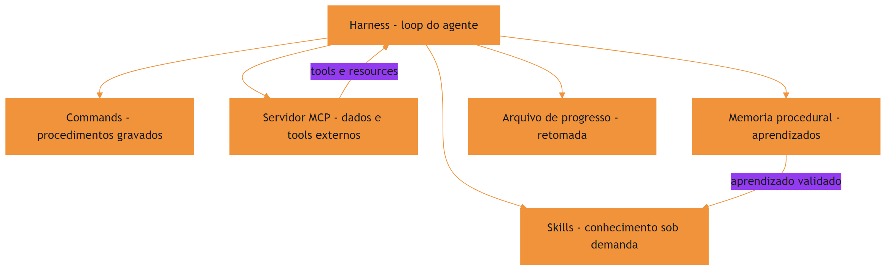

O motivo condutor fecha o arco: a oficina individual virou cooperativa completa — estoque externo sob contrato (MCP), caderno de aprendizados (memória procedural) e quadro de progresso (longa duração). Cada peça tem seu lugar, e o harness é o operário central que sabe acionar cada uma na hora certa.

## 4. Técnica

### Desenhando a orquestração com MCP

O harness conecta-se a servidores MCP para expor tools e resources ao modelo. A implementação conceitual abaixo mostra o padrão: o servidor declara tools, o harness as registra e o loop as despacha junto com skills e commands:

```python
# -*- coding: utf-8 -*-
"""Orquestracao conceitual: harness conectado a um servidor MCP."""
import json


class ServidorMCP:
    """Servidor que expoe tools sob o contrato JSON-RPC do protocolo."""

    def __init__(self, nome: str, tools: dict):
        self.nome = nome
        self.tools = tools

    def listar_tools(self) -> list[dict]:
        return [
            {"nome": nome, "descricao": desc["descricao"]}
            for nome, desc in self.tools.items()
        ]

    def chamar(self, nome_tool: str, argumentos: dict):
        if nome_tool not in self.tools:
            raise ValueError(f"tool {nome_tool} nao existe em {self.nome}")
        return self.tools[nome_tool]["funcao"](argumentos)


class HarnessOrquestrador:
    """Integra skills, commands e servidores MCP no loop do agente."""

    def __init__(self):
        self.skills = {}
        self.commands = {}
        self.servidores = {}

    def registrar_servidor(self, nome: str, servidor: ServidorMCP):
        self.servidores[nome] = servidor

    def catalogo_tools(self) -> list[dict]:
        catalogo = []
        for nome, servidor in self.servidores.items():
            for tool in servidor.listar_tools():
                catalogo.append({
                    "servidor": nome,
                    "tool": tool["nome"],
                    "descricao": tool["descricao"],
                })
        return catalogo

    def executar(self, acao: dict):
        """Despacha a acao escolhida pelo modelo para a camada correta."""
        if acao["tipo"] == "skill":
            return self.skills[acao["nome"]](acao["args"])
        if acao["tipo"] == "command":
            return self.commands[acao["nome"]].executar(acao["args"])
        if acao["tipo"] == "mcp":
            servidor = self.servidores[acao["servidor"]]
            return servidor.chamar(acao["tool"], acao["args"])
        raise ValueError(f"acao desconhecida: {acao}")


if __name__ == "__main__":
    db = ServidorMCP("banco-corporativo", {
        "consultar_cliente": {
            "descricao": "Consulta o cadastro de um cliente",
            "funcao": lambda a: {"nome": "Cliente Exemplo", "status": "ativo"},
        },
    })
    harness = HarnessOrquestrador()
    harness.registrar_servidor("banco-corporativo", db)
    print(json.dumps(harness.catalogo_tools(), ensure_ascii=False, indent=2))
```

O ponto central da orquestração: o modelo vê um catálogo unificado (skills, commands e tools MCP), mas cada ação é roteada para a camada certa — e a trilha de auditoria registra qual servidor foi chamado [5]. A medição objetiva de agentes em tarefas reais segue o padrão SWE-bench [17] — lembrando que comparações honestas exigem descrever o harness por completo [18].

### Implementando memória procedural simples

Uma memória procedural prática pode ser implementada como um arquivo JSON versionado que acumula lições extraídas de execuções. O padrão abaixo mostra a extração de três tipos de lição — estratégia, recuperação e otimização:

```python
# -*- coding: utf-8 -*-
"""Memoria procedural baseada em trajetorias de execucao."""
import json
from pathlib import Path


class MemoriaProcedural:
    """Acumula licoes de execucoes passadas em um arquivo versionado."""

    def __init__(self, caminho: str):
        self.caminho = Path(caminho)
        self.licoes = self._carregar()

    def _carregar(self) -> dict:
        if not self.caminho.exists():
            return {"estrategias": [], "recuperacoes": [], "otimizacoes": []}
        return json.loads(self.caminho.read_text(encoding="utf-8"))

    def registrar(self, tipo: str, descricao: str, contexto: str):
        chave = {"estrategia": "estrategias",
                 "recuperacao": "recuperacoes",
                 "otimizacao": "otimizacoes"}.get(tipo, "estrategias")
        self.licoes[chave].append({"descricao": descricao, "contexto": contexto})
        self._salvar()

    def _salvar(self):
        self.caminho.write_text(
            json.dumps(self.licoes, ensure_ascii=False, indent=2), encoding="utf-8")

    def consultar(self, contexto: str, tipo: str | None = None) -> list[str]:
        chaves = [tipo] if tipo else self.licoes.keys()
        resultado = []
        for chave in chaves:
            for licao in self.licoes[chave]:
                if contexto.lower() in licao["contexto"].lower():
                    resultado.append(f"[{chave[:-1]}] {licao['descricao']}")
        return resultado


if __name__ == "__main__":
    memoria = MemoriaProcedural("memoria.json")
    memoria.registrar("estrategia", "Rodar testes antes do deploy", "deploy")
    print("\n".join(memoria.consultar("deploy")))
```

O detalhe técnico: a memória procedural não substitui o código — ela alimenta as próximas decisões do agente e, quando validada, promove o aprendizado a skill do catálogo [6]. Grafos de conhecimento já estruturam essa memória para tarefas longas [20].

### Gerenciando agentes de longa duração

Tarefas que estouram uma janela de contexto exigem estado persistente: arquivos de progresso, controle de versão e retomada entre sessões. O padrão da indústria é o agente inicializador: uma sessão finaliza com um resumo do progresso; a sessão seguinte começa lendo esse estado e continua de onde parou [7]. A linha de frente da pesquisa já explora harnesses cujo comportamento é editável em linguagem natural, como os NLAHs [19].

```python
# -*- coding: utf-8 -*-
"""Progresso persistente para agentes de longa duracao."""
import json
from pathlib import Path


class Progresso:
    """Registra o estado de uma tarefa longa para retomada entre sessoes."""

    def __init__(self, caminho: str):
        self.caminho = Path(caminho)
        self.dados = self._carregar()

    def _carregar(self) -> dict:
        if not self.caminho.exists():
            return {"etapa_atual": "", "concluido": [], "pendente": [], "notas": []}
        return json.loads(self.caminho.read_text(encoding="utf-8"))

    def avancar(self, etapa: str, notas: str = ""):
        if self.dados["etapa_atual"] and self.dados["etapa_atual"] not in self.dados["concluido"]:
            self.dados["concluido"].append(self.dados["etapa_atual"])
        self.dados["etapa_atual"] = etapa
        if notas:
            self.dados["notas"].append(notas)
        self._salvar()

    def resumo(self) -> str:
        return (f"Etapa atual: {self.dados['etapa_atual']} | "
                f"Concluidas: {len(self.dados['concluido'])} | "
                f"Pendentes: {len(self.dados['pendente'])}")

    def _salvar(self):
        self.caminho.write_text(
            json.dumps(self.dados, ensure_ascii=False, indent=2), encoding="utf-8")
```

O harness instrui o agente a atualizar o arquivo de progresso a cada marco — e a ler o resumo no início de cada sessão nova. É o quadro de progresso da oficina digitalizado [8].

### A integração completa: skill que consulta dado externo e registra aprendizado

A orquestração madura combina as camadas em um único fluxo. O exemplo abaixo mostra o padrão típico: uma skill ativada consulta um servidor MCP para o dado operacional, executa o procedimento, e registra uma lição na memória procedural quando o resultado é validado.

```python
# -*- coding: utf-8 -*-
"""Fluxo integrado: skill + MCP + memoria procedural."""
import json
from pathlib import Path


class FluxoIntegrado:
    """Orquestra skill, servidor MCP e memoria procedural."""

    def __init__(self, servidor, memoria):
        self.servidor = servidor
        self.memoria = memoria

    def executar_tarefa(self, nome_skill: str, argumentos: dict) -> str:
        """Executa a skill, consulta o MCP e registra o aprendizado."""
        dados = self.servidor.chamar("consultar_cliente", argumentos)
        if not dados:
            return "falha: servidor nao retornou dados"
        resultado = self._aplicar_skill(nome_skill, dados)
        self.memoria.registrar(
            "estrategia",
            f"{nome_skill}: usar dados do MCP antes de decidir",
            nome_skill,
        )
        return resultado

    def _aplicar_skill(self, nome_skill: str, dados: dict) -> str:
        return f"{nome_skill} processou {len(dados)} registros"


class MemoriaStub:
    """Memoria procedural minima para o exemplo."""

    def registrar(self, tipo, descricao, contexto):
        pass


if __name__ == "__main__":
    class ServidorStub:
        def chamar(self, tool, args):
            return [{"id": 1}, {"id": 2}]

    fluxo = FluxoIntegrado(ServidorStub(), MemoriaStub())
    print(fluxo.executar_tarefa("relatorio-cliente", {"filtro": "ativos"}))
```

O padrão importa menos pelo código do que pela ordem das decisões: o dado externo chega primeiro (MCP), a skill aplica o conhecimento (procedimento) e o aprendizado é registrado para a próxima vez (memória). É a oficina completa operando em um único ciclo — e é esse padrão que sustenta agentes de produção que melhoram com o uso [9].

## 5. Aplica

### A cena do agente que esqueceu o que já tinha feito

Imagine a cena, em segunda pessoa. Você está executando uma migração de dados que leva horas e atravessa várias sessões. Na segunda sessão, o agente recomeça o processo do zero — revalida o que já estava validado, reprocessa lotes já processados e quase corrompe o estado intermediário. Você descobre que nenhum arquivo de progresso existia: o agente não tinha como saber o que já tinha sido feito.

O erro acontece porque o harness não tinha a camada de estado persistente: a tarefa longa dependia da janela de contexto de uma única sessão. O diagnóstico, ligando à teoria: agentes de longa duração sem progresso persistente reiniciam o reinício eterno do Capítulo 1 — mas agora dentro de uma única tarefa. A correção é estrutural: introduzir o arquivo de progresso com etapa atual, concluídas e pendentes, e instruir o agente a atualizá-lo a cada marco e lê-lo no início de cada sessão — a retomada vira a regra, não a exceção [9].

Essa cena fecha o arco aberto no Capítulo 1: o reinício eterno era inevitável quando o conhecimento vivia em prompts; com orquestração madura — skills, MCP, memória procedural e progresso persistente — o agente continua de onde parou, como um operário que consulta o quadro de progresso da oficina.

### Armadilhas comuns da orquestração

A primeira armadilha é conectar MCP a tudo: cada servidor adicionado é superfície de ataque e custo de catálogo — conecte o que a tarefa exige, com o menor privilégio. A segunda é tratar memória procedural como verdade: lições de execuções passadas devem ser validadas antes de virar skill, ou o agente aprende erros. A terceira é esquecer a trilha de auditoria: em produção, saber qual servidor foi chamado, quando e com quais argumentos não é luxo — é requisito de conformidade. A quarta é negligenciar o progresso persistente em tarefas longas: sem o arquivo de estado, a retomada é impossível e o retrabalho é garantido [10].

### Métricas de sucesso

Uma orquestração madura mostra três sinais. Primeiro: a taxa de retomada de tarefas longas sobe — a proporção de tarefas que continuam de onde pararam, em vez de recomeçar. Segundo: o custo médio por tarefa cai, porque a memória procedural e as skills reduzem tentativa e erro. Terceiro: a rastreabilidade de execução é completa — cada ação pode ser auditada até o servidor e o argumento que a originou [11].

## 6. Conclusão

Neste capítulo, você fechou o arco da orquestração. Você integrou as peças dos capítulos anteriores no harness — skills, commands, tools — e adicionou as duas camadas que faltavam: o MCP, conectando o agente a dados e ferramentas externas sob protocolo padronizado, e a memória procedural, permitindo que o agente aprenda com a própria execução. Você também dominou o estado persistente para agentes de longa duração, transformando o reinício eterno em retomada planejada.

O desafio para fixar: escolha uma tarefa longa da sua equipe e implemente o arquivo de progresso deste capítulo — depois conecte uma fonte de dados real a um servidor MCP e registre a primeira lição na memória procedural. No capítulo final, você vai consolidar tudo com o olhar de quem lidera: governança corporativa, benchmarks honestos e as tendências que vão moldar o futuro do conhecimento empacotado.

## 8. Aprofundamento: a orquestração em produção

### A orquestração como o ápice da obra

Fechando o capítulo, vale olhar para trás e nomear o que a orquestração representa na jornada da obra. O Capítulo 1 mostrou o problema — o reinício eterno. Os capítulos 3 a 7 construíram as peças — skills, commands, distribuição. O Capítulo 8 garantiu a qualidade. E este capítulo juntou tudo no harness: o conhecimento empacotado (skills), o procedimento gravado (commands), o dado externo (MCP), o aprendizado acumulado (memória procedural) e o estado persistente (progresso). A orquestração é o ponto onde a oficina vira fábrica — mas a fábrica só produz porque as peças foram construídas com a disciplina dos capítulos anteriores. O leitor que chegou até aqui carrega o conjunto completo: saber empacotar, testar, distribuir e orquestrar. O que falta é o último andar — a governança — e é para lá que o capítulo final aponta [11].

### A orquestração sem dono: quando ninguém governa o harness

A orquestração madura tem um requisito que os capítulos técnicos não mencionam: um dono. O harness, o catálogo unificado, a trilha de auditoria e a política de execução precisam de alguém responsável — o engenheiro de plataforma, o time de ferramentas, o comitê do Capítulo 10. A orquestração sem dono segue o destino de qualquer sistema sem dono: as peças acumulam, os catálogos incham, as políticas desatualizam e ninguém percebe até o incidente. O dono não precisa escrever todas as skills — precisa ser responsável pela saúde do sistema inteiro [10].

A responsabilidade tem três frentes: o catálogo (o que entra, o que sai), a política (o que o modelo pode fazer) e a trilha (o que foi feito e quem responde por isso). As três frentes são as mesmas da governança do Capítulo 10 — a orquestração é onde a governança encontra a operação, e o dono é a ponte entre as duas. A obra inteira converge para esse ponto: conhecimento empacotado, testado, distribuído e orquestrado — mas nada disso sobrevive sem alguém responsável por tudo [11].

### A política de retomada: o protocolo da sessão longa

O capítulo apresentou o arquivo de progresso; o aprofundamento é a política que o governa. A retomada de uma tarefa longa segue um protocolo de quatro passos: ler o estado (o arquivo de progresso), reconciliar (o que mudou no mundo desde a última sessão — arquivos, dependências, resultados), decidir o ponto de entrada (a etapa atual, a menos que a reconciliação mude o plano) e continuar (registrando o novo progresso). O passo da reconciliação é o que separa a retomada mecânica da retomada inteligente: a tarefa continua de onde parou, mas verifica se o mundo ainda corresponde ao que o estado registra [7].

```python
# -*- coding: utf-8 -*-
"""Protocolo de retomada: le, reconcilia, decide e continua."""


def retomar(estado: dict, mudancas_mundo: list[str]) -> str:
    """Decide o ponto de entrada apos reconciliar o estado com o mundo."""
    etapa_atual = estado.get("etapa_atual", "inicio")
    if not mudancas_mundo:
        return f"continuar em: {etapa_atual}"
    sensiveis = [m for m in mudancas_mundo if m in estado.get("etapas_sensiveis", [])]
    if sensiveis:
        return f"reiniciar a partir de: {estado.get('etapa_estavel', 'inicio')} - mudancas: {sensiveis}"
    return f"continuar em: {etapa_atual} com aviso de mudancas: {mudancas_mundo}"


if __name__ == "__main__":
    estado = {"etapa_atual": "validar_lotes", "etapa_estavel": "importar_dados",
              "etapas_sensiveis": ["schema", "dados_fonte"]}
    print(retomar(estado, []))
    print(retomar(estado, ["schema"]))
```

A política de retomada transforma o arquivo de progresso em um instrumento de confiança: a sessão nova sabe o que foi feito, o que mudou e de onde continuar — sem reiniciar o reinício eterno do Capítulo 1 e sem pular etapas por otimismo [9].

### O catálogo unificado e a decisão de roteamento

A orquestração madura não expõe ao modelo três catálogos separados — skills, commands e tools MCP —, mas um único catálogo unificado com metadados consistentes. A decisão de roteamento (qual camada atende aquela ação) é tomada pelo harness com base no tipo de ação, não pelo modelo. Essa separação é o que mantém o modelo simples: ele pede uma capacidade pelo nome, e o harness decide se a capacidade é uma skill a carregar, um command a executar ou uma tool remota a chamar [1].

```python
# -*- coding: utf-8 -*-
"""Roteamento unificado: decide a camada pela natureza da capacidade."""


def rotear(capacidade: dict, skills: dict, commands: dict, tools_mcp: dict) -> str:
    """Devolve o tipo de camada que atende a capacidade solicitada."""
    nome = capacidade["nome"]
    if nome in skills:
        return "skill"
    if nome in commands:
        return "command"
    if nome in tools_mcp:
        return "mcp"
    return "desconhecida"


if __name__ == "__main__":
    skills = {"documentar-api": True}
    commands = {"deploy-staging": True}
    tools_mcp = {"consultar_cliente": True}
    for nome in ["documentar-api", "deploy-staging", "consultar_cliente", "fazer-cafe"]:
        print(f"{nome}: {rotear({'nome': nome}, skills, commands, tools_mcp)}")
```

O benefício do catálogo unificado aparece na evolução: mover uma capacidade de camada — transformar um command em skill, ou uma skill em tool — não exige mudança no modelo, apenas no registro. A arquitetura fracamente acoplada, que o capítulo introduziu, é o que torna essa migração um movimento de catálogo, não uma reescrita [2].

### A trilha de auditoria como requisito de conformidade

Quando o harness orquestra servidores MCP e commands com efeito colateral, a trilha de auditoria deixa de ser conveniência e vira requisito: quem chamou o quê, quando, com quais argumentos e com qual resultado. Em ambientes regulados, essa trilha é o que permite responder à pergunta "o que o agente fez ontem à noite?" — e a resposta tem que vir do log, não da memória de ninguém [5].

```python
# -*- coding: utf-8 -*-
"""Trilha de auditoria da orquestracao em formato JSONL."""
import json
from datetime import datetime, timezone
from pathlib import Path


class Trilha:
    """Registra cada acao orquestrada com carimbo de tempo."""

    def __init__(self, caminho: str):
        self.caminho = Path(caminho)

    def registrar(self, camada: str, nome: str, argumentos: dict, resultado: str):
        entrada = {
            "quando": datetime.now(timezone.utc).isoformat(),
            "camada": camada,
            "nome": nome,
            "argumentos": argumentos,
            "resultado": resultado[:500],
        }
        with self.caminho.open("a", encoding="utf-8") as arquivo:
            arquivo.write(json.dumps(entrada, ensure_ascii=False) + "\n")

    def ultimas(self, limite: int = 5) -> list[dict]:
        linhas = [l for l in self.caminho.read_text(encoding="utf-8").splitlines() if l]
        return [json.loads(l) for l in linhas[-limite:]]


if __name__ == "__main__":
    trilha = Trilha("trilha.jsonl")
    trilha.registrar("mcp", "consultar_cliente", {"id": 42}, "ok")
    for entrada in trilha.ultimas():
        print(entrada["camada"], entrada["nome"], entrada["quando"])
```

A trilha em JSONL é barata, legível por máquina e por humanos, e cresce sem estrutura — o formato certo para auditoria em escala. A política de retenção define quanto tempo a trilha vive; a conformidade define o mínimo [10].

### O ciclo de vida da lição: da memória ao catálogo

A memória procedural do capítulo tem um ciclo de vida que merece destaque porque é ele que separa um agente que acumula de um agente que aprende. A lição nasce na execução, entra na memória como rascunho, ganha contagem de reutilização, e só quando reutilizada com sucesso várias vezes é candidata à promoção. O critério de promoção é o que impede o lixo: uma lição que nunca foi reutilizada não vira skill, por melhor que soe [4].

```python
# -*- coding: utf-8 -*-
"""Criterio de promocao: licao reutilizada com sucesso vira candidata."""
import json
from pathlib import Path


class Licoes:
    """Rastreia reutilizacao de licoes e sinaliza candidatas a skill."""

    def __init__(self, caminho: str, minimo_reuso: int = 3):
        self.caminho = Path(caminho)
        self.minimo_reuso = minimo_reuso
        self.itens = self._carregar()

    def _carregar(self) -> list[dict]:
        if not self.caminho.exists():
            return []
        return json.loads(self.caminho.read_text(encoding="utf-8"))

    def reutilizar(self, descricao: str):
        for item in self.itens:
            if item["descricao"] == descricao:
                item["reusos"] += 1
                break
        else:
            self.itens.append({"descricao": descricao, "reusos": 1})
        self._salvar()

    def candidatas(self) -> list[str]:
        return [i["descricao"] for i in self.itens if i["reusos"] >= self.minimo_reuso]

    def _salvar(self):
        self.caminho.write_text(
            json.dumps(self.itens, ensure_ascii=False, indent=2), encoding="utf-8")


if __name__ == "__main__":
    licoes = Licoes("licoes.json")
    for _ in range(3):
        licoes.reutilizar("Rodar testes antes do deploy")
    print(licoes.candidatas())
```

O contador de reuso é o mecanismo que transforma a auto-melhoria em algo mensurável e governável: a promoção deixa de ser opinião e vira critério — e o critério é auditável, como tudo nesta obra [6].

### O fallback da orquestração: quando o servidor não responde

A orquestração madura prevê a falha das camadas — e o fallback é o desenho do comportamento quando uma peça falha. O servidor MCP pode estar fora do ar; a skill pode falhar o gatilho; o command pode encontrar um pré-requisito quebrado. O fallback tem três níveis: degradar (prosseguir com menos — sem o dado do MCP, usar o dado local com aviso), substituir (trocar a peça — em vez do servidor, usar a tool nativa equivalente) e abortar (parar com diagnóstico — quando a falha da peça compromete o resultado). O desenho do fallback é parte do contrato de cada camada, não uma decisão improvisada no momento da falha [8].

```python
# -*- coding: utf-8 -*-
"""Fallback da orquestracao: degrada, substitui ou aborta."""


def com_fallback(primario, secundario=None, criticidade="baixa"):
    """Tenta o primario e aplica a estrategia de fallback declarada."""
    try:
        return primario()
    except (OSError, ValueError) as erro:
        if criticidade == "baixa" and secundario is not None:
            return secundario(), f"degradado: {erro}"
        if criticidade == "media" and secundario is not None:
            return secundario(), f"substituido: {erro}"
        return None, f"abortado: {erro}"


if __name__ == "__main__":
    def primario():
        raise OSError("servidor fora do ar")

    def secundario():
        return "dado local"

    print(com_fallback(primario, secundario, criticidade="baixa"))
```

O fallback declarado tem uma propriedade de governança valiosa: ele torna o comportamento de falha previsível e testável — o mesmo cenário de falha produz sempre o mesmo fallback, e o teste de falha é parte da suíte da orquestração. A equipe que não desenha o fallback improvisa no pior momento: durante o incidente [10].

### MCP e o menor privilégio: o contrato de acesso

O servidor MCP expõe tools e resources, mas a orquestração não é obrigada a expor tudo ao modelo. O contrato de acesso — quais tools de qual servidor entram no catálogo unificado — é uma decisão de engenharia: um servidor de banco pode expor a tool de consulta sem expor a tool de escrita, ou expor a escrita apenas via command com trava manual. O princípio do menor privilégio, aplicado ao catálogo, reduz a superfície de ataque sem reduzir a capacidade: o modelo só vê o que a tarefa pede [3].

```python
# -*- coding: utf-8 -*-
"""Filtra as tools expostas de um servidor MCP pelo contrato de acesso."""


def filtrar_tools(tools: dict, permitidas: set[str]) -> dict:
    """Mantem apenas as tools permitidas pelo contrato de acesso."""
    return {nome: desc for nome, desc in tools.items() if nome in permitidas}


if __name__ == "__main__":
    tools_banco = {"consultar": True, "escrever": True, "apagar": True}
    contrato = {"consultar"}
    print(list(filtrar_tools(tools_banco, contrato).keys()))
```

O contrato de acesso é revisado como qualquer política: cada tool nova exposta por um servidor passa pela revisão de risco antes de entrar no catálogo. É a mesma disciplina da matriz de risco do Capítulo 8, aplicada à orquestração [12].

### O custo da orquestração: quando a fábrica pesa mais que a produção

A orquestração adiciona camadas, e camadas têm custo: o catálogo unificado custa tokens de metadados, a trilha de auditoria custa armazenamento e processamento, o roteamento custa latência por decisão. A orquestração bem desenhada é a que adiciona valor maior que o custo das camadas — e a medição do capítulo anterior é o que revela o desequilíbrio. O sintoma clássico do excesso de orquestração é o catálogo com centenas de capacidades que o modelo quase nunca usa: cada capacidade é custo de metadados, e a utilidade marginal tende a zero [5].

```python
# -*- coding: utf-8 -*-
"""Mede a utilizacao do catalogo: capacidades usadas vs registradas."""


def utilizacao_catalogo(registradas: list[str], usadas: list[str]) -> dict:
    """Calcula a taxa de uso e lista capacidades orfas."""
    conjunto_usadas = set(usadas)
    orfas = [r for r in registradas if r not in conjunto_usadas]
    return {
        "registradas": len(registradas),
        "usadas": len(set(usadas)),
        "taxa": round(len(set(usadas)) / len(registradas), 3) if registradas else 0.0,
        "orfas": orfas,
    }


if __name__ == "__main__":
    print(utilizacao_catalogo(["skill-a", "skill-b", "skill-c"], ["skill-a", "skill-a"]))
```

A taxa de utilização do catálogo é a métrica de saúde da orquestração: taxas baixas indicam catálogo inflado ou gatilhos ruins — o mesmo sintoma que o Capítulo 8 mede por skill, agora agregado. A poda do catálogo — remover o que não é usado — é uma das ações de governança mais baratas e mais impactantes da orquestração, porque cada capacidade removida reduz o custo fixo de toda sessão [11].

### A observabilidade do loop: medindo antes de otimizar

Fechando o aprofundamento, a orquestração em produção exige observabilidade: registrar por execução quais camadas foram acionadas, quantos passos o loop gastou, onde os erros aconteceram e quanto de contexto cada camada consumiu. Esses números são o insumo da otimização — sem eles, a orquestração é ajustada por palpite. O padrão mínimo é um resumo por sessão: camadas acionadas, passos por camada, erros e custo estimado. Com o resumo, a equipe enxerga onde o agente gasta: se a memória procedural nunca é consultada, o ciclo de promoção não está funcionando; se o MCP domina as chamadas, o conhecimento procedural está defasado [11].

## 7. Referências Bibliográficas

[1] ZHANG, et al. *Code as Agent Harness: Toward Executable, Verifiable, and Stateful Agent Systems*. Disponível em: https://arxiv.org/abs/2605.18747. Acesso em: 06 ago. 2026.
[2] KRISHNAN, Naveen. *Advancing Multi-Agent Systems Through Model Context Protocol*. Disponível em: https://arxiv.org/abs/2504.21030. Acesso em: 06 ago. 2026.
[3] GETDX. *AI Code Generation: Best Practices for Enterprise Adoption*. Disponível em: https://getdx.com/blog/ai-code-enterprise-adoption/. Acesso em: 06 ago. 2026.
[4] FANG, Gaodan; ISAHAGIAN, Vatche; JAYARAM, K. R.; KUMAR, Ritesh; MUTHUSAMY, Vinod; OUM, Punleuk; THOMAS, Gegi. *Trajectory-Informed Memory Generation for Self-Improving Agent Systems*. Disponível em: https://arxiv.org/abs/2603.10600. Acesso em: 06 ago. 2026.
[5] ANTHROPIC. *Effective Harnesses for Long-Running Agents*. Disponível em: https://www.anthropic.com/engineering/effective-harnesses-for-long-running-agents. Acesso em: 06 ago. 2026.
[6] DU, Pengfei. *Memory for Autonomous LLM Agents: Mechanisms, Evaluation, and Emerging Frontiers*. Disponível em: https://arxiv.org/abs/2603.07670. Acesso em: 06 ago. 2026.
[7] ANTHROPIC. *Claude Code Skills Documentation*. Disponível em: https://code.claude.com/docs/en/skills. Acesso em: 06 ago. 2026.
[8] BUI, et al. *Building AI Coding Agents for the Terminal: Scaffolding, Harness, Context Engineering, and Lessons Learned*. Disponível em: https://arxiv.org/abs/2603.05344. Acesso em: 06 ago. 2026.
[9] AGENTSKILLS.IO. *Agent Skills Specification*. Disponível em: https://agentskills.io/specification. Acesso em: 06 ago. 2026.
[10] MEDIUM (HEEKI PARK). *Collaborating with Agent Teams in Claude Code*. Disponível em: https://heeki.medium.com/collaborating-with-agents-teams-in-claude-code-f64a465f3c11. Acesso em: 06 ago. 2026.
[11] XU, Renjun; YAN, Yang. *Agent Skills for Large Language Models: Architecture, Acquisition, Security, and the Path Forward*. Disponível em: https://arxiv.org/abs/2602.12430. Acesso em: 06 ago. 2026.
[12] MA, Zhiyuan; LIU, Jiayu; LUO, Xianzhen; HUANG, Zhenya; ZHU, Qingfu; CHE, Wanxiang. *Tool-MVR: Meta-Verification and Reflection Learning for Reliable Tool-Use*. Disponível em: https://arxiv.org/abs/2506.04625. Acesso em: 06 ago. 2026.
[13] RUCAIBOX. *Awesome Agent Harness*. Disponível em: https://github.com/RUCAIBox/awesome-agent-harness. Acesso em: 06 ago. 2026.
[14] VINCENT, Jesse (obra). *Superpowers — engineering skills for agents*. Disponível em: https://github.com/obra/superpowers. Acesso em: 06 ago. 2026.
[15] OPENAI. *Custom Instructions with AGENTS.md*. Disponível em: https://learn.chatgpt.com/docs/agent-configuration/agents-md. Acesso em: 06 ago. 2026.
[16] VERCEL LABS. *Skills — package manager for agent skills*. Disponível em: https://github.com/vercel-labs/skills. Acesso em: 06 ago. 2026.
[17] SWEBENCH. *SWE-bench Verified & Pro*. Disponível em: https://www.swebench.com. Acesso em: 06 ago. 2026.
[18] *Stop Comparing LLM Agents Without Disclosing the Harness*. Disponível em: https://arxiv.org/abs/2605.23950. Acesso em: 06 ago. 2026.
[19] *Natural-Language Agent Harnesses (NLAHs)*. Disponível em: https://arxiv.org/abs/2603.25723. Acesso em: 06 ago. 2026.
[20] YANG, Chang; ZHOU, Chuang; XIAO, Yilin; et al. *Graph-based Agent Memory: Taxonomy, Techniques, and Applications*. Disponível em: https://arxiv.org/abs/2602.05665. Acesso em: 06 ago. 2026.

# Capítulo 10: Governança, benchmarks e o futuro do conhecimento empacotado

## 1. Introdução

No Capítulo 9, você orquestrou o harness completo: skills, MCP, memória procedural e estado persistente trabalhando juntos. Agora você fecha a obra com o olhar de quem lidera — não de quem apenas opera. Este capítulo final trata das três frentes que separam uma oficina que funciona de uma organização que escala: a governança do conhecimento empacotado, a honestidade dos benchmarks que medem agentes e as tendências que vão moldar o futuro da área.

Ao final deste capítulo, você será capaz de desenhar a política de governança de skills e commands da sua organização, avaliar benchmarks de agentes com espírito crítico e posicionar-se diante das tendências — harnesses em linguagem natural, skills autogeneradas e a consolidação do padrão aberto. É o diploma de Engenheiro Agêntico.

## 2. Explica

### O que a governança protege: os três ativos da organização

A governança de skills e commands protege três ativos que a organização costuma não nomear. O primeiro é o catálogo: o inventário de conhecimento empacotado, que vale mais do que a soma das skills porque é um patrimônio curado. O segundo é a confiança: a certeza de que uma skill aprovada não vai destruir um ambiente ou exfiltrar um dado — confiança é o ativo que sustenta a adoção em escala. O terceiro é a evolução: a capacidade de melhorar o catálogo sem quebrar quem depende dele [1].

Cada ativo exige uma proteção diferente. O catálogo exige curadoria — alguém decide o que entra e o que sai. A confiança exige processo — as bancadas do laboratório não podem ser puladas. A evolução exige versionamento e testes — mudanças são releases, não edições. Governança, no fim, é a disciplina de proteger esses três ativos simultaneamente.

### Governança: o ciclo de vida do conhecimento empacotado

Governança é o conjunto de regras que decide como o conhecimento entra, vive e sai do catálogo da organização. No caso de skills e commands, a governança cobre o ciclo de vida inteiro: quem pode criar, quem revisa, quais verificações obrigatórias (as três bancadas do Capítulo 8), como a skill é versionada e distribuída, e quando uma skill é aposentada. Sem governança, o catálogo vira um terreno comum: cada um planta o que quer, ninguém cuida, e as ervas daninhas tomam conta [1]. E quando o conhecimento precisa de dados externos, a governança também cobre a conexão via MCP [13].

A governança madura tem três pilares. O primeiro é a propriedade: toda skill tem um dono responsável por mantê-la. O segundo é o processo: o fluxo de adoção — do laboratório ao catálogo — é documentado e exige as verificações obrigatórias. O terceiro é o ciclo de vida: skills têm revisão periódica, métricas de uso e política de aposentadoria. Os três juntos transformam o catálogo de depósito em patrimônio [2]. A confiabilidade dos procedimentos governados melhora quando o uso de ferramentas é ensinado com verificação e reflexão sobre erros [14].

### Benchmarks honestos: a tese da Binding Constraint

Medir agentes é diferente de medir modelos. O desempenho de um agente depende do harness inteiro — contexto, ferramentas, scaffolding, commands e skills disponíveis. Comparar agentes sem descrever o harness produz conclusões enganosas: a tese da Binding Constraint argumenta que a variação de desempenho é dominada pelo harness, não pelo modelo base [3].

A consequência prática é dupla. Primeiro, qualquer benchmark de agente deve descrever o harness com o mesmo rigor que descreve o modelo — o que estava no contexto, quais ferramentas, qual scaffolding. Segundo, os benchmarks de referência da área, como o SWE-bench, evoluíram exatamente nessa direção: tarefas reais, ambiente controlado e avaliação objetiva de execução, em vez de resposta [4]. A visão do código como harness reforça que o benchmark deve medir execução verificável, não intenção [15]. Curadorias da área consolidam os melhores protocolos de avaliação [16].

### O futuro: NLAHs, skills autogeneradas e o padrão aberto

Três tendências definem a fronteira. A primeira são os harnesses em linguagem natural (NLAHs): em vez de código rígido, o comportamento do harness é expresso e editável em linguagem natural, permitindo adaptação flexível. A segunda são as skills autogeneradas: agentes que extraem conhecimento de suas próprias execuções e empacotam em skills novas — o ciclo de auto-melhoria que você viu no Capítulo 9 levado ao extremo [5]. A terceira é a consolidação do padrão aberto: quanto mais harnesses adotam a especificação de agent skills, maior o valor da portabilidade e mais forte o ecossistema — um efeito de rede clássico [6].

### Lendo tendências sem apostar a oficina

A postura profissional diante das tendências é assimétrica: adote o que reduz risco hoje, experimente o que promete valor amanhã, e não reescreva a oficina inteira por causa de uma previsão. O padrão aberto é a única das três tendências que você pode adotar integralmente hoje — ela reduz risco e custo sem incerteza. NLAHs são promissoras, mas exigem maturidade de harness que poucas organizações têm; skills autogeneradas já valem experimentos controlados no ciclo de promoção do Capítulo 9, não substituição do catálogo [5].

A régua prática é a mesma dos capítulos anteriores, aplicada a tendências: medir antes de decidir, experimentar em isolamento, e promover para produção apenas o que passou pelas bancadas. A tendência é o vento; a oficina é o que você construiu para navegar — não troque a oficina pelo vento.

## 3. Ilustra

A cooperativa da oficina do Engenheiro Agêntico alcançou maturidade. O conselho da cooperativa criou três regras que sustentam tudo. A primeira é a regra do patrimônio: toda ferramenta do catálogo tem um nome de responsável na etiqueta, uma data de revisão e um histórico de manutenção — ninguém usa uma ferramenta sem dono. A segunda é a regra da medição honesta: quando duas oficinas comparam seus tempos de produção, o protocolo exige descrever as mesmas bancadas, as mesmas matérias-primas e o mesmo operário — senão a comparação é conversa fiada. A terceira é a regra da evolução: as melhores ferramentas nascem do chão da oficina, aprendidas em serviço, e sobem para o catálogo — e o catálogo, por sua vez, ensina as oficinas novas.

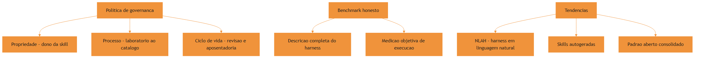

O motivo condutor chega ao seu ápice: a oficina individual do Capítulo 1 virou uma cooperativa madura com patrimônio, medição honesta e evolução contínua. O operário que começou puxando ferramentas da parede agora ajuda a governar o catálogo — essa é a jornada do Engenheiro Agêntico completa.

## 4. Técnica

### Desenhando a política de governança em código

A governança vira código quando o catálogo passa por verificações automatizadas. A classe abaixo modela o ciclo de vida de uma skill — dono, status e data de revisão — e aplica as regras de governança em um comando:

```python
# -*- coding: utf-8 -*-
"""Governanca do catalogo: dono, processo e ciclo de vida de skills."""
import json
from datetime import date, timedelta
from pathlib import Path


class CatalogoGovernado:
    """Aplica regras de governanca ao catalogo de skills da equipe."""

    def __init__(self, caminho: str):
        self.caminho = Path(caminho)
        self.items = self._carregar()

    def _carregar(self) -> list[dict]:
        if not self.caminho.exists():
            return []
        return json.loads(self.caminho.read_text(encoding="utf-8"))

    def registrar(self, nome: str, dono: str, processo: str):
        self.items.append({
            "nome": nome, "dono": dono, "processo": processo,
            "criada": date.today().isoformat(),
            "ultima_revisao": date.today().isoformat(),
            "status": "ativo",
        })
        self._salvar()

    def revisoes_vencidas(self, dias_max: int = 180) -> list[str]:
        """Skills cuja revisao periodica venceu."""
        limite = date.today() - timedelta(days=dias_max)
        return [
            item["nome"]
            for item in self.items
            if date.fromisoformat(item["ultima_revisao"]) < limite
        ]

    def sem_dono(self) -> list[str]:
        return [item["nome"] for item in self.items if not item.get("dono")]

    def _salvar(self):
        self.caminho.write_text(
            json.dumps(self.items, ensure_ascii=False, indent=2), encoding="utf-8")


if __name__ == "__main__":
    catalogo = CatalogoGovernado("catalogo.json")
    catalogo.registrar("revisar-teste", "time-plataforma", "laboratorio-completo")
    vencidas = catalogo.revisoes_vencidas()
    sem_dono = catalogo.sem_dono()
    print(f"Skills no catalogo: {len(catalogo.items)}")
    print(f"Revisoes vencidas: {vencidas or 'nenhuma'}")
    print(f"Sem dono: {sem_dono or 'nenhum'}")
```

A governança em código tem uma vantagem decisiva: as regras rodam em CI, não dependem de lembrança. Uma skill sem dono ou com revisão vencida vira alerta automático — o patrimônio é auditável [7].

### Avaliando um benchmark com espírito crítico

Antes de confiar em qualquer número de benchmark de agentes, aplique o checklist da medição honesta. O script abaixo materializa o checklist: o harness está descrito, a tarefa é objetiva, a avaliação é de execução e não de resposta — uma disciplina que frameworks metodológicos como o Superpowers já impõem aos seus fluxos [17]:

```python
# -*- coding: utf-8 -*-
"""Checklist de honestidade para avaliar benchmarks de agentes."""
import sys


def avaliar_benchmark(descricao_harness: str, tarefa: str, avaliacao: str,
                      repeticoes: int) -> list[str]:
    """Retorna os criterios falhos de um benchmark (vazio = honesto)."""
    falhas = []
    if len(descricao_harness.strip()) < 50:
        falhas.append("harness mal descrito (contexto, tools e scaffolding)")
    if "execu" not in avaliacao.lower() and "teste" not in avaliacao.lower():
        falhas.append("avaliacao baseada em resposta, nao em execucao")
    if repeticoes < 3:
        falhas.append("poucas repeticoes para lidar com a estocasticidade")
    if not tarefa.strip():
        falhas.append("tarefa vazia ou mal definida")
    return falhas


if __name__ == "__main__":
    falhas = avaliar_benchmark(
        descricao_harness="", tarefa="corrigir o bug descrito na issue 42",
        avaliacao="o agente entrega a resposta final", repeticoes=1,
    )
    for f in falhas:
        print(f"[FALHA] {f}")
    if not falhas:
        print("[OK] Benchmark honesto")
    sys.exit(1 if falhas else 0)
```

O checklist não substitui o julgamento — mas força o julgamento a olhar para o que importa: o harness, a tarefa e a avaliação [8].

### Promovendo o aprendizado a skill: o ciclo de auto-melhoria

A tendência das skills autogeneradas já pode ser praticada: ao final de uma execução bem-sucedida, extrair a lição e registrar como candidata a skill. O padrão abaixo mostra o registro com validação pendente — a governança exige que a candidata passe pelas três bancadas antes de entrar no catálogo:

```python
# -*- coding: utf-8 -*-
"""Candidatura de aprendizado a skill, com gate de governanca."""
import json
from pathlib import Path


class Candidatas:
    """Fila de aprendizados candidatos a virar skill no catalogo."""

    def __init__(self, caminho: str):
        self.caminho = Path(caminho)
        self.itens = self._carregar()

    def _carregar(self) -> list[dict]:
        if not self.caminho.exists():
            return []
        return json.loads(self.caminho.read_text(encoding="utf-8"))

    def candidatar(self, titulo: str, descricao: str, origem: str):
        self.itens.append({
            "titulo": titulo, "descricao": descricao,
            "origem": origem, "status": "candidata",
        })
        self._salvar()

    def aprovar(self, titulo: str):
        for item in self.itens:
            if item["titulo"] == titulo:
                item["status"] = "aprovada"
        self._salvar()

    def pendentes(self) -> list[str]:
        return [i["titulo"] for i in self.itens if i["status"] == "candidata"]

    def _salvar(self):
        self.caminho.write_text(
            json.dumps(self.itens, ensure_ascii=False, indent=2), encoding="utf-8")


if __name__ == "__main__":
    fila = Candidatas("candidatas.json")
    fila.candidatar("validar command de deploy em CI",
                    "Procedimento aprendido apos incidente de deploy",
                    "sessao-2026-08")
    print(f"Candidatas pendentes: {fila.pendentes()}")
```

O fluxo fecha o arco da obra: conhecimento nasce na execução (Capítulo 1), é empacotado (Capítulos 3-4), testado (Capítulo 8), distribuído (Capítulo 7) e governado (este capítulo) — e o ciclo recomeça com o aprendizado novo [9].

### A política de aposentadoria: desligar sem drama

O ciclo de vida da governança tem um fim: a aposentadoria. Skills que perderam o uso não apenas ocupam catálogo — elas competem pelo gatilho semântico do agente, gerando falsos positivos e ruído de contexto. A política madura define critérios objetivos de desligamento: tempo sem invocações, uso menor que um limiar no trimestre, ou substituição por uma skill mais nova. A aposentadoria segue três passos: marcar como obsoleta, notificar os dependentes e remover do catálogo ativo — com o histórico preservado para consulta.

```python
# -*- coding: utf-8 -*-
"""Politica de aposentadoria: identifica skills candidatas a desligamento."""
from datetime import date, timedelta


class PoliticaAposentadoria:
    """Aplica criterios objetivos de desligamento ao catalogo."""

    def __init__(self, limiar_uso: int = 3, janela_dias: int = 90):
        self.limiar_uso = limiar_uso
        self.janela_dias = janela_dias

    def candidatas(self, inventario: list[dict]) -> list[str]:
        """Retorna skills que nao atingiram o uso minimo na janela."""
        limite = date.today() - timedelta(days=self.janela_dias)
        candidatas = []
        for skill in inventario:
            if skill.get("ultima_invocacao") is None:
                candidatas.append(skill["nome"])
            else:
                ultima = date.fromisoformat(skill["ultima_invocacao"])
                if (ultima < limite
                        and skill.get("uso_trimestre", 0) < self.limiar_uso):
                    candidatas.append(skill["nome"])
        return candidatas


if __name__ == "__main__":
    catalogo = [
        {"nome": "skill-antiga", "ultima_invocacao": "2026-01-15", "uso_trimestre": 1},
        {"nome": "skill-ativa", "ultima_invocacao": "2026-07-30", "uso_trimestre": 40},
        {"nome": "skill-nunca-usada", "ultima_invocacao": None, "uso_trimestre": 0},
    ]
    politica = PoliticaAposentadoria()
    print("Candidatas a aposentadoria:", politica.candidatas(catalogo))
```

A política de aposentadoria fecha o ciclo de vida iniciado na criação: governar o conhecimento não é apenas cuidar do que entra — é também decidir, com critério objetivo, o que sai. O catálogo enxuto é o que mantém o gatilho semântico do agente preciso [10]. O aprendizado aprovado pode ser distribuído pelo catálogo com o gerenciador de pacotes do ecossistema [18]. Instruções estáticas de projeto, como o AGENTS.md, complementam a governança com o contexto fixo da organização [19], e grafos de conhecimento já estruturam essa memória para escalar [20].

## 5. Aplica

### A cena do benchmark que enganou o comitê

Imagine a cena, em segunda pessoa. Sua organização está escolhendo entre dois fornecedores de ferramentas agênticas, e o comitê apresenta um benchmark em que o produto A vence o B por uma margem impressionante. Você pergunta como o benchmark foi montado — e descobre que o produto A rodou com uma skill especializada da própria equipe do fornecedor, contexto pré-carregado com a documentação do projeto e avaliação por resposta textual, enquanto o B rodou no modo padrão, sem contexto e avaliado por execução em testes reais.

O erro acontece porque o benchmark comparou fornecedores sem comparar harnesses: a diferença de desempenho media a diferença de preparação, não a diferença de qualidade. O diagnóstico, ligando à tese da Binding Constraint: o harness domina a variação, e um benchmark que não descreve o harness é um anúncio, não uma medição [3]. A correção é exigir o protocolo honesto: mesma skill, mesmo contexto, mesma avaliação de execução — e, se o fornecedor não abrir o harness, tratar o número como marketing.

Essa cena resume o papel do Engenheiro Agêntico sênior: não é apenas construir a oficina — é defender a honestidade das medições que decidem investimentos [10].

### Armadilhas comuns de governança e avaliação

A primeira armadilha é governança burocrática: um processo tão pesado que ninguém cria skills novas — a governança deve agilizar a adoção segura, não congelar o catálogo. A segunda é medir o que é fácil em vez do que importa: contagem de skills instaladas em vez de precisão de ativação e valor entregue. A terceira é tratar benchmark como verdade absoluta: todo número de agente é uma fotografia de um harness específico num momento — generalize com cautela. A quarta é ignorar a aposentadoria: skills sem uso consomem catálogo e decisões do agente — a política de ciclo de vida inclui desligar [11].

### Métricas de sucesso

Uma organização madura mostra três sinais. Primeiro: a saúde do catálogo — sem skills órfãs nem revisões vencidas — é verificada por automação, não por auditoria manual. Segundo: as decisões de adoção de ferramentas são baseadas em benchmarks com protocolo honesto documentado. Terceiro: a taxa de aprendizados promovidos a skill — o fluxo de auto-melhoria do Capítulo 9 — é medida e cresce de forma saudável, sem inflar o catálogo com lixo [12].

## 6. Conclusão

Neste capítulo, você fechou a obra com o olhar de liderança. Você desenhou a governança do conhecimento empacotado — propriedade, processo e ciclo de vida —, aprendeu a avaliar benchmarks com a lente da Binding Constraint e se posicionou diante das tendências: NLAHs, skills autogeneradas e o padrão aberto consolidado. A jornada que começou no Capítulo 1 com o reinício eterno termina aqui: o conhecimento da sua organização agora vive empacotado, testado, distribuído e governado — e o próximo projeto herda tudo.

O desafio final da obra: implemente a classe de governança de catálogo deste capítulo na sua organização, registre as skills que você criou ao longo desta leitura com dono e data de revisão, e rode o checklist de honestidade no próximo benchmark de agente que cruzar sua mesa. Parabéns — a oficina é sua, e o catálogo está pronto para crescer.

## 8. Aprofundamento: a governança em operação

### O registro de riscos: o inventário do que pode dar errado

A governança madura mantém um registro de riscos do catálogo — o inventário do que pode dar errado, com probabilidade, impacto e mitigação. Cada skill do catálogo tem uma linha de risco: qual o pior cenário de falha (gatilho errado, script destrutivo, instrução maliciosa), qual a probabilidade estimada (alta para skills de fonte desconhecida, baixa para skills auditadas), e qual a mitigação (suíte de gatilho, auditoria de script, trava de invocação). O registro não é burocracia: é a memória do julgamento de risco da equipe, consultável quando o catálogo muda [3].

```python
# -*- coding: utf-8 -*-
"""Registro de riscos do catalogo: prob, impacto e mitigacao."""


class RegistroRiscos:
    """Inventario de riscos das skills do catalogo."""

    def __init__(self):
        self.riscos = []

    def registrar(self, skill: str, prob: str, impacto: str, mitigacao: str):
        self.riscos.append({
            "skill": skill, "prob": prob, "impacto": impacto, "mitigacao": mitigacao,
        })

    def criticos(self) -> list[dict]:
        """Riscos de probabilidade e impacto altos."""
        return [r for r in self.riscos if r["prob"] == "alta" and r["impacto"] == "alto"]


if __name__ == "__main__":
    registro = RegistroRiscos()
    registro.registrar("deploy-automatizado", "media", "alto", "trava manual + teste em staging")
    registro.registrar("skill-externa-nao-auditada", "alta", "alto", "auditoria pre-instalacao")
    print([r["skill"] for r in registro.criticos()])
```

O registro de riscos conecta a governança ao laboratório do Capítulo 8: cada mitigação registrada é uma bancada que já existe ou que precisa ser montada. A revisão periódica do registro — o mesmo ciclo da revisão de skills — reavalia probabilidades e impactos conforme o catálogo e o mundo mudam [2].

### O comitê do catálogo: quem decide, com qual critério

A governança do capítulo ganha corpo quando existe um processo de decisão explícito — o comitê do catálogo. Não precisa ser um órgão formal: pode ser uma reunião mensal de trinta minutos, mas precisa existir e decidir com critério. O comitê tem três decisões típicas: adotar (uma candidata passou pelas bancadas), aposentar (uma skill perdeu o uso), e recalibrar (uma descrição deslizou e precisa ser reescrita). Cada decisão é registrada com o critério que a fundamentou — o registro é o que transforma o comitê de opinião em governança [1].

```python
# -*- coding: utf-8 -*-
"""Registro de decisoes do comite do catalogo."""
import json
from datetime import date
from pathlib import Path


class Comite:
    """Registra decisoes de adocao, aposentadoria e recalibracao."""

    def __init__(self, caminho: str):
        self.caminho = Path(caminho)
        self.decisoes = self._carregar()

    def _carregar(self) -> list[dict]:
        if not self.caminho.exists():
            return []
        return json.loads(self.caminho.read_text(encoding="utf-8"))

    def decidir(self, tipo: str, alvo: str, criterio: str):
        self.decisoes.append({
            "data": date.today().isoformat(),
            "tipo": tipo, "alvo": alvo, "criterio": criterio,
        })
        self._salvar()

    def historico(self, alvo: str) -> list[dict]:
        return [d for d in self.decisoes if d["alvo"] == alvo]

    def _salvar(self):
        self.caminho.write_text(
            json.dumps(self.decisoes, ensure_ascii=False, indent=2), encoding="utf-8")


if __name__ == "__main__":
    comite = Comite("decisoes.json")
    comite.decidir("adotar", "documentar-api", "aprovada nas tres bancadas")
    print(comite.historico("documentar-api"))
```

O registro de decisões é o que permite auditar a evolução do catálogo no futuro: por que esta skill entrou, por que aquela saiu, qual critério valeu. É a mesma propriedade do git aplicada à governança — e é ela que impede que o catálogo seja governado por memória, como o Capítulo 1 mostrou que prompts o são [9].

### Benchmarks internos: medindo o próprio catálogo

A honestidade dos benchmarks não vale apenas para fornecedores — vale para o catálogo interno. Um benchmark interno mede o valor das skills da equipe com o mesmo rigor: tarefas representativas, harness descrito, avaliação de execução. O benchmark interno tem dois usos. O primeiro é o diagnóstico: quais skills entregam valor real e quais apenas ocupam catálogo. O segundo é o guardião da evolução: quando uma skill é proposta, o benchmark interno mede se ela melhora o resultado das tarefas representativas antes de entrar [3].

```python
# -*- coding: utf-8 -*-
"""Benchmark interno: mede o impacto das skills nas tarefas representativas."""


def avaliar_tarefa(tarefa: str, com_skill: float, sem_skill: float) -> dict:
    """Compara o desempenho com e sem a skill na mesma tarefa."""
    ganho = com_skill - sem_skill
    return {
        "tarefa": tarefa,
        "sem_skill": sem_skill, "com_skill": com_skill,
        "ganho": round(ganho, 3),
        "vale_manter": ganho > 0.05,
    }


if __name__ == "__main__":
    resultados = [
        avaliar_tarefa("gerar relatorio de cobertura", 0.9, 0.6),
        avaliar_tarefa("auditar seguranca do modulo", 0.8, 0.75),
    ]
    for r in resultados:
        print(r["tarefa"], "->", "manter" if r["vale_manter"] else "reavaliar")
```

O benchmark interno cria uma linguagem objetiva para a governança: em vez de "acho que essa skill não está sendo usada", a equipe diz "essa skill não muda o resultado das tarefas representativas". A segunda frase é discutível com dados; a primeira, só com opinião [17].

### O orçamento do catálogo: tokens, manutenção e atenção

Um catálogo governado é um catálogo com orçamento. Três recursos são limitados: os tokens de metadados (cada skill instalada custa catálogo na janela), o tempo de manutenção (cada skill tem revisões, testes e atualizações) e a atenção do comitê (cada decisão consome esforço de revisão). O orçamento força a disciplina: adotar uma skill nova significa, na prática, comprometer uma fração dos três recursos — e a pergunta "o que o catálogo vai deixar de fazer para acomodar esta skill?" é a pergunta de governança mais honesta que existe [2].

### O fechamento da obra: a oficina governada

O último aprofundamento fecha o arco inteiro da obra. A jornada começou com o operário que puxava ferramentas da parede sem etiqueta — o reinício eterno do Capítulo 1. Termina com a cooperativa governada deste capítulo: catálogo com dono, revisão e ciclo de vida; medição honesta em todos os níveis; e a disciplina de evoluir sem quebrar. Cada andar da obra responde a uma pergunta: por que empacotar (Capítulo 1), onde mora o conhecimento (Capítulos 2-4), como distribuir (Capítulo 7), como garantir qualidade (Capítulo 8), como orquestrar (Capítulo 9) e como sustentar (este capítulo). O Engenheiro Agêntico formado por esta obra não é quem conhece a ferramenta mais nova — é quem sabe construir, testar, distribuir, orquestrar e governar o conhecimento empacotado da sua organização, com o vocabulário da oficina como linguagem comum e as bancadas como disciplina [1]. A obra entrega o diploma; a prática entrega a oficina — e a oficina governada é a que cresce.

### O custo da não governança: a dívida invisível do catálogo

A governança tem um custo — e o aprofundamento honesto é reconhecer que a não governança também tem, só que invisível. O custo da governança é explícito: tempo de comitê, auditorias, revisões. O custo da não governança é distribuído e silencioso: skills órfãs que ninguém mantém, gatilhos que deslizam sem revisão, dependências quebradas que só aparecem no uso. A diferença entre os dois custos é a mesma entre pagar seguro e pagar o sinistro: o seguro é caro até o sinistro — e o sinistro é sempre mais caro que o seguro [1].

```python
# -*- coding: utf-8 -*-
"""Estimativa da divida invisivel de um catalogo sem governanca."""


def divida_catalogo(skills_orfas: int, gatilhos_deslizados: int,
                    dependencias_quebradas: int,
                    custo_por_item: float = 4.0) -> dict:
    """Estima o custo acumulado dos defeitos de governanca."""
    total = (skills_orfas + gatilhos_deslizados + dependencias_quebradas)
    return {
        "defeitos": total,
        "horas_estimadas": round(total * custo_por_item, 1),
        "corrigir_hoje": round(total * custo_por_item * 1.0, 1),
        "corrigir_depois": round(total * custo_por_item * 2.5, 1),
    }


if __name__ == "__main__":
    print(divida_catalogo(skills_orfas=6, gatilhos_deslizados=4,
                          dependencias_quebradas=2))
```

A dívida do catálogo multiplica com o tempo — o defeito corrigido hoje custa uma fração do que custaria depois, quando está enterrado sob mudanças. A governança não é o custo da organização madura: é o investimento que evita o custo maior da organização que deixa crescer. A régua final da obra é essa: o conhecimento empacotado sem governança é dívida com cara de patrimônio [9].

### A sucessão do conhecimento: quando o autor sai

A governança tem um teste que nenhum processo formal prevê: a saída do autor. Quando a pessoa que criou as skills mais importantes do catálogo sai da equipe, o que sobra? Se as skills têm dono registrado, revisão em dia e testes em CI, sobra patrimônio operável — o conhecimento sobrevive à saída. Se as skills são órfãs, sem dono e sem revisão, sobra dívida — o conhecimento sai junto com a pessoa [1].

```python
# -*- coding: utf-8 -*-
"""Auditoria de sucessao: skills sem dono ou sem revisao recente."""
from datetime import date, timedelta


def sucessao_preparada(skills: list[dict], dias_max_sem_revisao: int = 180) -> list[str]:
    """Lista as skills que travariam a sucessao de conhecimento."""
    limite = date.today() - timedelta(days=dias_max_sem_revisao)
    problemas = []
    for skill in skills:
        sem_dono = not skill.get("dono")
        sem_revisao = skill.get("ultima_revisao") is None
        revisao_vencida = (
            not sem_revisao
            and date.fromisoformat(skill["ultima_revisao"]) < limite
        )
        if sem_dono or sem_revisao or revisao_vencida:
            problemas.append(skill["nome"])
    return problemas


if __name__ == "__main__":
    skills = [
        {"nome": "deploy", "dono": "", "ultima_revisao": None},
        {"nome": "revisao", "dono": "maria", "ultima_revisao": "2026-07-01"},
    ]
    print(sucessao_preparada(skills))
```

A auditoria de sucessão é a prova final da governança: um catálogo governado é aquele em que a saída de qualquer pessoa não paralisa o conhecimento da equipe. A régua é dura e justa — o conhecimento da organização não pode depender da memória de ninguém, nem mesmo do seu criador [9].

### Tendências com régua: o que adotar hoje

As três tendências do capítulo merecem uma régua de adoção prática. O padrão aberto é adoção imediata e total: reduz risco, custo e depende só de disciplina — não há motivo para esperar. As skills autogeneradas merecem experimentação controlada: o ciclo de promoção do Capítulo 9 já entrega esse mecanismo em miniatura, e a experimentação começa por domínios de baixo risco, com o benchmark interno medindo o ganho antes de escalar. Os NLAHs, por fim, são observação: a tecnologia promete, mas a migração de harnesses em produção raramente se justifica sem casos de uso concretos que provem o ganho [5]. A régua é assimétrica de propósito: adote o que reduz risco, experimente o que pode agregar valor, observe o que ainda é promessa — e nunca reescreva a oficina por uma previsão.

### A governança da memória: o catálogo como patrimônio

O capítulo tratou do catálogo como ativo; o aprofundamento é a mentalidade que sustenta o tratamento: o conhecimento empacotado é patrimônio, não estoque. Patrimônio valoriza com o tempo — o catálogo governado cresce em valor à medida que as skills acumulam ciclos de revisão, testes e uso comprovado. Estoque deprecia — o catálogo sem governança envelhece, acumula lixo e perde a confiança de quem o consulta. A diferença entre as duas posturas aparece na prática: o patrimônio é auditado, medido e transmitido; o estoque é acumulado e esquecido [2].

```python
# -*- coding: utf-8 -*-
"""Valor patrimonial do catalogo: uso, revisao e dependencia."""


def valor_patrimonial(skill: dict) -> dict:
    """Calcula os indicadores de patrimonio de uma skill."""
    return {
        "nome": skill["nome"],
        "usos_mes": skill.get("usos_mes", 0),
        "revisada": skill.get("ultima_revisao") is not None,
        "testada": skill.get("tem_suite", False),
        "dependentes": skill.get("dependentes", 0),
        "patrimonio": bool(
            skill.get("usos_mes", 0) > 0
            and skill.get("ultima_revisao")
            and skill.get("tem_suite", False)
        ),
    }


if __name__ == "__main__":
    skills = [
        {"nome": "deploy", "usos_mes": 40, "ultima_revisao": "2026-07-01", "tem_suite": True, "dependentes": 3},
        {"nome": "legado", "usos_mes": 0, "ultima_revisao": None, "tem_suite": False, "dependentes": 0},
    ]
    for skill in skills:
        print(valor_patrimonial(skill))
```

A leitura patrimonial muda as decisões de governança: a pergunta deixa de ser "esta skill custa para manter?" e passa a ser "esta skill agrega ao patrimônio ou é estoque morto?". A primeira pergunta leva à poda por economia; a segunda leva ao investimento no que valoriza e à aposentadoria do que não agrega — a mesma decisão, com uma régua diferente [1].

### A aposentadoria em três passos, revisitada

A política de aposentadoria do capítulo merece um detalhe operacional: o passo de notificação. Antes de remover uma skill do catálogo ativo, a equipe identifica os dependentes — commands que a invocam, outras skills que a referenciam, documentação que a cita — e resolve cada dependência. A remoção sem a notificação produz referências quebradas silenciosas: o command continua no catálogo apontando para uma skill que não existe mais, e o erro só aparece no momento do uso. A aposentadoria é, no fundo, uma operação de mudança de dependência — e o cuidado com os dependentes é o que separa um catálogo gerido de um catálogo abandonado [11].

## 7. Referências Bibliográficas

[1] XU, Renjun; YAN, Yang. *Agent Skills for Large Language Models: Architecture, Acquisition, Security, and the Path Forward*. Disponível em: https://arxiv.org/abs/2602.12430. Acesso em: 06 ago. 2026.
[2] ANTHROPIC. *Effective Harnesses for Long-Running Agents*. Disponível em: https://www.anthropic.com/engineering/effective-harnesses-for-long-running-agents. Acesso em: 06 ago. 2026.
[3] *Stop Comparing LLM Agents Without Disclosing the Harness*. Disponível em: https://arxiv.org/abs/2605.23950. Acesso em: 06 ago. 2026.
[4] SWEBENCH. *SWE-bench Verified & Pro*. Disponível em: https://www.swebench.com. Acesso em: 06 ago. 2026.
[5] *Natural-Language Agent Harnesses (NLAHs)*. Disponível em: https://arxiv.org/abs/2603.25723. Acesso em: 06 ago. 2026.
[6] AGENTSKILLS.IO. *Agent Skills Specification*. Disponível em: https://agentskills.io/specification. Acesso em: 06 ago. 2026.
[7] GETDX. *AI Code Generation: Best Practices for Enterprise Adoption*. Disponível em: https://getdx.com/blog/ai-code-enterprise-adoption/. Acesso em: 06 ago. 2026.
[8] BUI, et al. *Building AI Coding Agents for the Terminal: Scaffolding, Harness, Context Engineering, and Lessons Learned*. Disponível em: https://arxiv.org/abs/2603.05344. Acesso em: 06 ago. 2026.
[9] FANG, Gaodan; ISAHAGIAN, Vatche; JAYARAM, K. R.; KUMAR, Ritesh; MUTHUSAMY, Vinod; OUM, Punleuk; THOMAS, Gegi. *Trajectory-Informed Memory Generation for Self-Improving Agent Systems*. Disponível em: https://arxiv.org/abs/2603.10600. Acesso em: 06 ago. 2026.
[10] MEDIUM (HEEKI PARK). *Collaborating with Agent Teams in Claude Code*. Disponível em: https://heeki.medium.com/collaborating-with-agents-teams-in-claude-code-f64a465f3c11. Acesso em: 06 ago. 2026.
[11] ANTHROPIC. *Claude Code Skills Documentation*. Disponível em: https://code.claude.com/docs/en/skills. Acesso em: 06 ago. 2026.
[12] DU, Pengfei. *Memory for Autonomous LLM Agents: Mechanisms, Evaluation, and Emerging Frontiers*. Disponível em: https://arxiv.org/abs/2603.07670. Acesso em: 06 ago. 2026.
[13] KRISHNAN, Naveen. *Advancing Multi-Agent Systems Through Model Context Protocol*. Disponível em: https://arxiv.org/abs/2504.21030. Acesso em: 06 ago. 2026.
[14] MA, Zhiyuan; LIU, Jiayu; LUO, Xianzhen; HUANG, Zhenya; ZHU, Qingfu; CHE, Wanxiang. *Tool-MVR: Meta-Verification and Reflection Learning for Reliable Tool-Use*. Disponível em: https://arxiv.org/abs/2506.04625. Acesso em: 06 ago. 2026.
[15] ZHANG, et al. *Code as Agent Harness: Toward Executable, Verifiable, and Stateful Agent Systems*. Disponível em: https://arxiv.org/abs/2605.18747. Acesso em: 06 ago. 2026.
[16] RUCAIBOX. *Awesome Agent Harness*. Disponível em: https://github.com/RUCAIBox/awesome-agent-harness. Acesso em: 06 ago. 2026.
[17] VINCENT, Jesse (obra). *Superpowers — engineering skills for agents*. Disponível em: https://github.com/obra/superpowers. Acesso em: 06 ago. 2026.
[18] VERCEL LABS. *Skills — package manager for agent skills*. Disponível em: https://github.com/vercel-labs/skills. Acesso em: 06 ago. 2026.
[19] OPENAI. *Custom Instructions with AGENTS.md*. Disponível em: https://learn.chatgpt.com/docs/agent-configuration/agents-md. Acesso em: 06 ago. 2026.
[20] YANG, Chang; ZHOU, Chuang; XIAO, Yilin; et al. *Graph-based Agent Memory: Taxonomy, Techniques, and Applications*. Disponível em: https://arxiv.org/abs/2602.05665. Acesso em: 06 ago. 2026.

# Capítulo 11: Manutenção de bibliotecas de skills: ciclo de vida, versionamento e testes

## 1. Introdução

No capítulo anterior, você aprendeu a anatomia de uma skill — SKILL.md, disclosure progressiva e gatilhos — e a diferença entre construir a sua ou adotar uma comunitária [2]. Mas uma skill é um artefato de software: nasce, muda e morre [1]. Este capítulo trata do ciclo de vida completo de uma biblioteca de skills: versionamento, testes, revisão e aposentadoria [1].

Este capítulo tem três objetivos. Primeiro, dominar o ciclo de vida de uma skill individual, da criação à desativação [1]. Segundo, desenhar a governança de uma biblioteca inteira: padrões de qualidade, revisão e evolução compatível [8]. Terceiro, conectar as skills ao restante do harness — porque uma skill que o agente não carrega no momento certo vale menos que uma documentação simples [20].

## 2. Explica

### 2.1 O ciclo de vida de uma skill

Toda skill passa por estágios: criação, uso, revisão e aposentadoria [1]. A especificação do formato define os elementos obrigatórios — frontmatter, descrição de ativação e o corpo com instruções — e é sobre eles que o ciclo de vida opera [1]. A disciplina central: cada estágio tem um gatilho explícito, e nenhuma skill fica órfã em produção [1].

### 2.2 Versionamento: a skill como código

Uma skill vive em um repositório, versionada como qualquer código [16]. A prática recomendada: mudanças passam por pull request, a descrição de ativação muda exige revisão dupla (porque afeta o disparo) e cada versão registra o que mudou [16]. A compatibilidade é a regra de ouro: atualizar uma skill não deve quebrar os fluxos que a usam [15].

### 2.3 Testes de skill: o que validar

Uma skill precisa de testes em dois níveis: o teste da estrutura (frontmatter válido, descrição presente, corpo sem conteúdo vazio) e o teste de comportamento (a skill, acionada no contexto certo, produz o resultado esperado) [2]. A indústria está formalizando esse processo: avaliações padronizadas de tarefas — como as suítes de benchmark do campo — medem se a skill melhora o resultado do agente [9][14]. Sem teste, uma skill é uma promessa [2].

### 2.4 A governança da biblioteca

Uma biblioteca de skills é um produto: tem padrão de entrada, revisão e manutenção [8]. O padrão de entrada responde "o que entra": domínio claro, gatilho preciso, conteúdo testado e dono declarado [1]. A revisão periódica responde "o que sai": skill sem uso, sem dono ou com gatilho errado é candidata à aposentadoria [1][16].

### 2.5 A evolução compatível e a descontinuação

A evolução de uma skill segue o mesmo cuidado de uma API: mudanças incrementais, depreciação avisada e migração assistida [15]. Quando uma skill morre, o processo é explícito: aviso, período de coexistência e arquivamento com documentação [16]. O objetivo é que nenhum fluxo dependente quebre sem aviso [15].

### 2.6 A skill no harness: carregada no momento certo

A skill só vale se o agente a carrega na hora certa [20]. O harness decide o carregamento — e a descrição de ativação é o contrato dessa decisão [1]. Uma biblioteca madura revisa os gatilhos como parte da manutenção: skill que dispara demais (falso positivo) e skill que nunca dispara (falso negativo) são as duas falhas clássicas de ativação [1][20].

## 3. Ilustra

### 3.1 A analogia da biblioteca física com catálogo

Pense em uma biblioteca física: os livros (skills) só valem se alguém os encontra no momento da dúvida [1]. O catálogo (as descrições de ativação) precisa ser preciso: um livro classificado errado nunca é consultado [1]. E a biblioteca tem um bibliotecário (o harness) que decide o que levar para a mesa de leitura — e devolve o que não é mais usado [20]. A biblioteca madura revisa o acervo todo ano: compra, conserta e descarta [1].

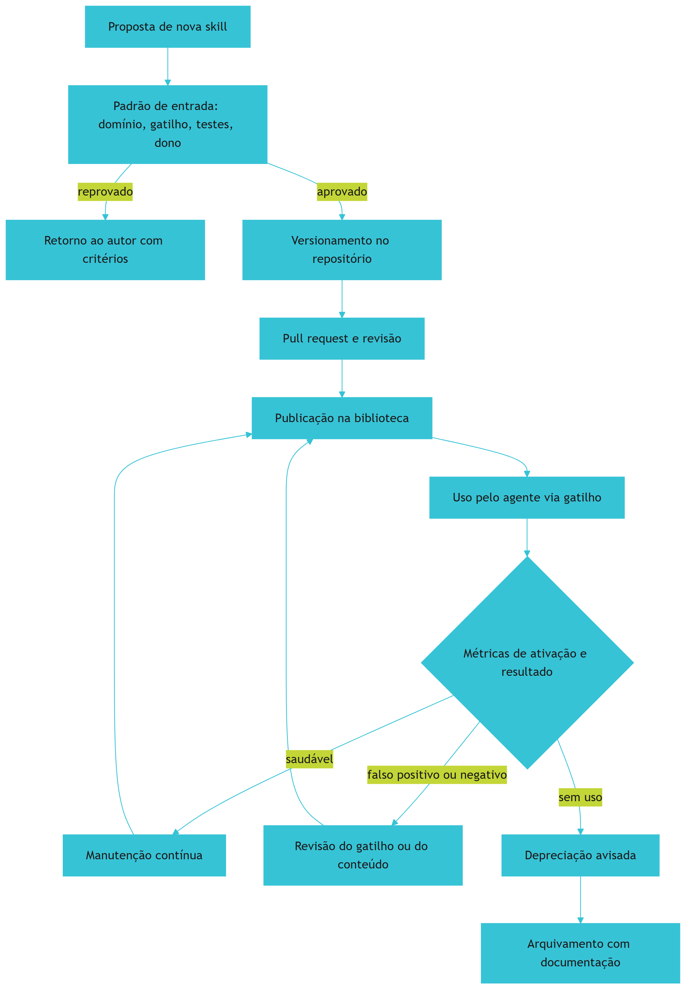

### 3.2 O acervo que se mantém vivo

O ciclo mostra a diferença entre guardar e manter: a biblioteca não acumula livros — cultiva um acervo que serve [1]. É o mesmo critério de poda que você viu na memória do projeto no Livro 5, aplicado às skills [1].

## 4. Técnica

### 4.1 O validador de estrutura de skill

O exemplo abaixo valida o frontmatter e a descrição de ativação — o primeiro teste de qualquer skill [1][1]:

```python
import re
from pathlib import Path


def validar_skill(caminho: Path) -> list[str]:
    erros = []
    texto = caminho.read_text(encoding="utf-8")
    if not texto.startswith("---"):
        erros.append("frontmatter ausente")
        return erros
    m = re.search(r"(?ms)^---\n(.*?)\n---", texto)
    frontmatter = m.group(1) if m else ""
    if "name:" not in frontmatter:
        erros.append("campo name ausente")
    if "description:" not in frontmatter:
        erros.append("campo description ausente")
    if len(texto) < 200:
        erros.append("corpo da skill muito curto")
    return erros


for skill in Path("skills").glob("*/SKILL.md"):
    print(skill.parent.name, validar_skill(skill))
```

O validador roda no CI e impede que skills quebradas entrem na biblioteca [1].

### 4.2 O detector de gatilho vago

O trecho abaixo sinaliza descrições de ativação vagas — o sintoma clássico do falso positivo e do falso negativo [1]:

```python
PALAVRAS_VAGAS = {"ajuda", "informação", "coisas", "diversos", "talvez"}


def diagnosticar_gatilho(descricao: str) -> dict:
    vago = [p for p in PALAVRAS_VAGAS if p in descricao.lower()]
    especifico = len(descricao.split()) >= 12
    return {"vago": bool(vago), "termos_vagos": vago, "especifico": especifico}
```

Uma descrição que não diz quando ativar não ativa nunca — ou ativa sempre [1].

### 4.3 O registro de uso e aposentadoria

Para fechar, a medição que decide a vida da skill: uso real, resultado e o gatilho da depreciação [1][16]:

```python
def decidir_ciclo(skill, uso_90_dias: int, taxa_falha: float) -> str:
    if uso_90_dias == 0:
        return "aposentar: sem uso"
    if taxa_falha > 0.4:
        return "revisar: taxa de falha alta"
    if uso_90_dias < 5:
        return "observar: uso marginal"
    return "manter"


print(decidir_ciclo("skill_pdf", uso_90_dias=2, taxa_falha=0.1))
```

A decisão é objetiva — e a objetividade é o que falta quando a biblioteca cresce sem critério [16].

## 5. Aplica

### 5.1 Onde isso vive no mundo real

Na prática, a manutenção de skills aparece nas organizações que tratam o conhecimento como produto [8]. O repositório de skills com CI, a revisão de gatilhos e as métricas de uso são a norma em times maduros [1][8]. E a tendência é de infraestrutura: gerenciadores de pacotes de skills e mercados abertos padronizam publicação e instalação [15][19].

### 5.2 O erro comum do iniciante

O erro clássico é publicar uma skill sem gatilho testado — e descobrir, meses depois, que ela nunca foi acionada [1]. O segundo erro é a biblioteca-cemitério: skills antigas sem dono, sem uso e sem revisão ocupando espaço no catálogo [1]. O caminho profissional: padrão de entrada, teste de estrutura e comportamento, métricas de ativação e depreciação explícita [1][16].

## 6. Conclusão

Uma skill é um artefato de software, e uma biblioteca é um produto [1][8]. Você aprendeu o ciclo de vida completo — versionamento, testes, governança e aposentadoria — e a medir o que decide a vida de cada skill [1][16]. No próximo capítulo, essa infraestrutura ganha números: a medição de ativação, qualidade e retorno do investimento de uma biblioteca inteira [1].


## 7. Referências

[1] AGENTSKILLS.IO. *Agent Skills Specification*. Disponível em: https://agentskills.io/specification. Acesso em: 06 ago. 2026.
[2] ANTHROPIC. *Agent Skills — Claude Platform Docs*. Disponível em: https://platform.claude.com/docs/en/agents-and-tools/agent-skills/overview. Acesso em: 06 ago. 2026.
[3] ANTHROPIC. *Claude Code Skills Documentation*. Disponível em: https://code.claude.com/docs/en/skills. Acesso em: 06 ago. 2026.
[4] BUI, et al. *Building AI Coding Agents for the Terminal: Scaffolding, Harness, Context Engineering, and Lessons Learned*. Disponível em: https://arxiv.org/abs/2603.05344. Acesso em: 06 ago. 2026.
[5] CODINGSCAPE. *How Anthropic Engineering Teams Use Claude Code Every Day*. Disponível em: https://codingscape.com/blog/how-anthropic-engineering-teams-use-claude-code-every-day. Acesso em: 06 ago. 2026.
[6] FIRECRAWL. *Best Claude Code Skills to Try*. Disponível em: https://www.firecrawl.dev/blog/best-claude-code-skills. Acesso em: 06 ago. 2026.
[7] GETDX. *AI Code Generation: Best Practices for Enterprise Adoption*. Disponível em: https://getdx.com/blog/ai-code-enterprise-adoption/. Acesso em: 06 ago. 2026.
[8] MA, Zhiyuan; LIU, Jiayu; LUO, Xianzhen; HUANG, Zhenya; ZHU, Qingfu; CHE, Wanxiang. *Tool-MVR: Meta-Verification and Reflection Learning for Reliable Tool-Use*. Disponível em: https://arxiv.org/abs/2506.04625. Acesso em: 06 ago. 2026.
[9] SWEBENCH. *SWE-bench Verified & Pro*. Disponível em: https://www.swebench.com. Acesso em: 06 ago. 2026.
[10] VERCEL LABS. *Skills — package manager for agent skills*. Disponível em: https://github.com/vercel-labs/skills. Acesso em: 06 ago. 2026.
[11] VINCENT, Jesse (obra). *Superpowers — engineering skills for agents*. Disponível em: https://github.com/obra/superpowers. Acesso em: 06 ago. 2026.
[12] XU, Renjun; YAN, Yang. *Agent Skills for Large Language Models: Architecture, Acquisition, Security, and the Path Forward*. Disponível em: https://arxiv.org/abs/2602.12430. Acesso em: 06 ago. 2026.
[13] ZHANG, et al. *Code as Agent Harness: Toward Executable, Verifiable, and Stateful Agent Systems*. Disponível em: https://arxiv.org/abs/2605.18747. Acesso em: 06 ago. 2026.
[14] *Stop Comparing LLM Agents Without Disclosing the Harness*. Disponível em: https://arxiv.org/abs/2605.23950. Acesso em: 06 ago. 2026.
[15] ANTHROPIC. *Effective Harnesses for Long-Running Agents*. Disponível em: https://www.anthropic.com/engineering/effective-harnesses-for-long-running-agents. Acesso em: 06 ago. 2026.
[16] ANTHROPIC. *Claude Code SDK — Slash Commands*. Disponível em: https://code.claude.com/docs/en/agent-sdk/slash-commands. Acesso em: 06 ago. 2026.
[17] VSCODE. *VS Code Agent Skills Documentation*. Disponível em: https://code.visualstudio.com/docs/agent-customization/agent-skills. Acesso em: 06 ago. 2026.
[18] CURSOR. *Cursor Rules Documentation*. Disponível em: https://cursor.com/docs/rules. Acesso em: 06 ago. 2026.
[19] VERCEL LABS. *skills.sh — open marketplace*. Disponível em: https://skills.sh. Acesso em: 06 ago. 2026.
[20] DU, Pengfei. *Memory for Autonomous LLM Agents: Mechanisms, Evaluation, and Emerging Frontiers*. Disponível em: https://arxiv.org/abs/2603.07670. Acesso em: 06 ago. 2026.

# Capítulo 12: Medindo skills: ativação, qualidade e o retorno do investimento

## 1. Introdução

No capítulo anterior, você estruturou o ciclo de vida das skills [1]. Este capítulo responde a pergunta que todo mantenedor faz: vale a pena? Medir skills é diferente de medir código — o valor não está no arquivo, está no momento em que o agente o carrega e no resultado que a tarefa entrega [1]. Este capítulo constrói o painel de métricas de uma biblioteca de skills: ativação, qualidade e retorno [6].

Este capítulo tem três objetivos. Primeiro, definir as métricas de ativação: taxa de disparo, falso positivo e falso negativo [1]. Segundo, medir a qualidade: resultado das tarefas com e sem a skill, no estilo dos benchmarks do campo [1]. Terceiro, calcular o retorno do investimento — o argumento que transforma a biblioteca de hobby em infraestrutura [8].

## 2. Explica

### 2.1 A taxa de ativação: a primeira métrica

A taxa de ativação mede o comportamento do gatilho: de cada cem tarefas candidatas, quantas acionaram a skill [1]. A medição em dois cortes — falso positivo (ativou sem necessidade) e falso negativo (deveria ativar e não ativou) — diagnostica a qualidade da descrição [1]. Uma skill com ativação saudável é a que acerta o momento [1].

### 2.2 A medição de resultado: com e sem a skill

O teste mais honesto é o contrafactual: a mesma tarefa com e sem a skill [1]. Os benchmarks do campo padronizaram esse desenho — suítes de tarefas reais, avaliadas automaticamente — e a biblioteca madura usa o mesmo espírito [1]. A comparação responde a pergunta de valor: a skill melhora o resultado? [9].

### 2.3 A qualidade da skill: do estrutura ao comportamento

A qualidade tem dois níveis mensuráveis: a estrutura (frontmatter válido, disclosure progressiva respeitada, instruções completas) e o comportamento (o resultado esperado no contexto certo) [6][2]. A pesquisa do campo formalizou as dimensões de avaliação de skills — arquitetura, aquisição e segurança — e a manutenção prática converte essas dimensões em checklist de revisão [17].

### 2.4 A divulgação honesta: o harness no resultado

Uma lição importante da medição: o resultado mede o sistema, não só a skill [4]. A pesquisa do campo alerta que comparar agentes sem divulgar o harness é enganoso — e o mesmo vale para comparar skills [19]. A biblioteca madura documenta o contexto da medição: modelo, harness, conjunto de tarefas e critérios [19].

### 2.5 O retorno do investimento: do custo ao valor

O retorno da biblioteca tem três componentes: o custo de manutenção (revisão, testes, correção), o custo de adoção (aprendizado, integração) e o valor gerado (tarefas mais rápidas, erros evitados, conhecimento retido) [8]. A fórmula prática: o tempo economizado pelo agente menos o tempo gasto mantendo a skill — projetado no volume de tarefas [8]. O resultado muda a conversa de "bonito" para "compensou" [8].

### 2.6 O painel contínuo: medir para governar

A medição não é um relatório: é um painel contínuo que alimenta as decisões de ciclo de vida do capítulo anterior [1]. As métricas de ativação alimentam a revisão de gatilhos; as métricas de resultado alimentam a prioridade de manutenção; e o retorno alimenta o investimento futuro [1]. A biblioteca vira um sistema medido, não uma coleção de boas intenções [1].

## 3. Ilustra

### 3.1 A analogia do caixa eletrônico da agência

Pense no caixa eletrônico de uma agência: cada tela (skill) só aparece no fluxo certo — você não vê "transferência" na tela de saque [1]. O banco mede tudo: quantas vezes cada tela é usada, quantas operações terminam em erro e quanto tempo cada fluxo economiza [8]. Se uma tela nunca é usada, o banco a redesenha ou remove; se uma tela aumenta o erro, o banco a corrige primeiro [1]. O caixa eletrônico não é uma coleção de telas — é um sistema medido [8].

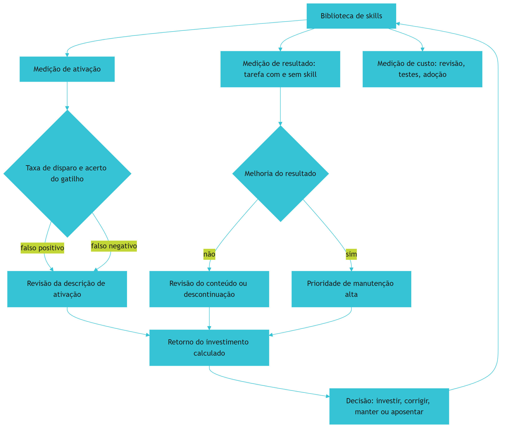

### 3.2 A agência que decide com números

O ciclo mostra o sistema completo de governança por métricas: toda decisão sobre uma skill — manter, corrigir ou aposentar — sai de um número, não de uma impressão [1][8]. É a mesma disciplina de medição que a série vem construindo desde a avaliação de prompts no Livro 2 [1].

## 4. Técnica

### 4.1 O painel de ativação

O exemplo abaixo calcula as métricas de ativação a partir do registro de execução [1]:

```python
def metricas_ativacao(registros, skill):
    acionamentos = [r for r in registros if r["skill"] == skill]
    candidatos = [r for r in registros if r["candidata"] == skill]
    falsos_positivos = [r for r in acionamentos if r["necessaria"] is False]
    falsos_negativos = [r for r in candidatos if r["acionada"] is False]
    total_candidatos = len(candidatos) + len(falsos_positivos)
    taxa = round(len(acionamentos) / max(total_candidatos, 1), 3)
    return {
        "taxa_disparo": taxa,
        "falsos_positivos": len(falsos_positivos),
        "falsos_negativos": len(falsos_negativos),
    }
```

Os dois cortes — positivo e negativo — contam a história completa do gatilho [1].

### 4.2 O teste contrafactual de resultado

O trecho abaixo compara a tarefa com e sem a skill — o experimento de valor [1]:

```python
def medir_impacto(skill, tarefas, executar):
    com_skill, sem_skill = 0, 0
    for tarefa in tarefas:
        sem_skill += executar(tarefa, skills=[])
        com_skill += executar(tarefa, skills=[skill])
    return {
        "sem_skill": round(sem_skill / len(tarefas), 3),
        "com_skill": round(com_skill / len(tarefas), 3),
        "ganho": round((com_skill - sem_skill) / len(tarefas), 3),
    }
```

Se o ganho é próximo de zero, a skill não está entregando o que promete [1].

### 4.3 O cálculo do retorno do investimento

Para fechar, o número que decide o orçamento: custo versus valor, projetado no volume de tarefas [8]:

```python
def retorno_investimento(horas_manutencao, tarefas_mensais, economia_por_tarefa, custo_hora):
    custo_mensal = horas_manutencao * custo_hora
    valor_mensal = tarefas_mensais * economia_por_tarefa
    return {
        "custo_mensal": custo_mensal,
        "valor_mensal": valor_mensal,
        "retorno": round(valor_mensal / max(custo_mensal, 1), 2),
    }


print(retorno_investimento(8, 400, 0.05, 60.0))
```

Um retorno abaixo de 1 significa que a skill custa mais do que economiza — e a decisão fica clara [8].

## 5. Aplica

### 5.1 Onde isso vive no mundo real

Na prática, a medição de skills aparece nas organizações que sustentam bibliotecas grandes: o painel de ativação alimenta a revisão de gatilhos, o teste contrafactual prioriza manutenção e o retorno justifica orçamento [1][8]. A indústria está convergindo para um padrão: benchmark de tarefas, disclosure do harness e métricas públicas [1][19]. E a memória — a camada que você viu no Livro 5 — volta aqui: skills são memória empacotada, e memória se mede [5].

### 5.2 O erro comum do iniciante

O erro clássico é medir só a criação: quantas skills a biblioteca tem — o número que cresce e não diz nada [1]. O segundo erro é medir o resultado sem contexto: comparar com e sem skill em tarefas diferentes, ou sem divulgar o harness [19]. O caminho profissional: ativação com os dois cortes, contrafactual com tarefas fixas e retorno com custo real [1][8].

## 6. Conclusão

Medir é a diferença entre uma biblioteca e um acervo [1][8]. Você aprendeu as métricas de ativação, o teste contrafactual de resultado e o cálculo de retorno que decide o investimento [1][8]. Com a medição instalada, a camada de skills fecha o ciclo de valor da pilha — e o próximo livro sobe para os guardrails: hooks, config e a governança que torna toda essa autonomia segura [4].


## 7. Referências

[1] SWEBENCH. *SWE-bench Verified & Pro*. Disponível em: https://www.swebench.com. Acesso em: 06 ago. 2026.
[2] MA, Zhiyuan; LIU, Jiayu; LUO, Xianzhen; HUANG, Zhenya; ZHU, Qingfu; CHE, Wanxiang. *Tool-MVR: Meta-Verification and Reflection Learning for Reliable Tool-Use*. Disponível em: https://arxiv.org/abs/2506.04625. Acesso em: 06 ago. 2026.
[3] XU, Renjun; YAN, Yang. *Agent Skills for Large Language Models: Architecture, Acquisition, Security, and the Path Forward*. Disponível em: https://arxiv.org/abs/2602.12430. Acesso em: 06 ago. 2026.
[4] *Stop Comparing LLM Agents Without Disclosing the Harness*. Disponível em: https://arxiv.org/abs/2605.23950. Acesso em: 06 ago. 2026.
[5] ANTHROPIC. *Effective Harnesses for Long-Running Agents*. Disponível em: https://www.anthropic.com/engineering/effective-harnesses-for-long-running-agents. Acesso em: 06 ago. 2026.
[6] AGENTSKILLS.IO. *Agent Skills Specification*. Disponível em: https://agentskills.io/specification. Acesso em: 06 ago. 2026.
[7] ANTHROPIC. *Agent Skills — Claude Platform Docs*. Disponível em: https://platform.claude.com/docs/en/agents-and-tools/agent-skills/overview. Acesso em: 06 ago. 2026.
[8] ANTHROPIC. *Claude Code Skills Documentation*. Disponível em: https://code.claude.com/docs/en/skills. Acesso em: 06 ago. 2026.
[9] FANG, Gaodan; ISAHAGIAN, Vatche; JAYARAM, K. R.; KUMAR, Ritesh; MUTHUSAMY, Vinod; OUM, Punleuk; THOMAS, Gegi. *Trajectory-Informed Memory Generation for Self-Improving Agent Systems*. Disponível em: https://arxiv.org/abs/2603.10600. Acesso em: 06 ago. 2026.
[10] KRISHNAN, Naveen. *Advancing Multi-Agent Systems Through Model Context Protocol*. Disponível em: https://arxiv.org/abs/2504.21030. Acesso em: 06 ago. 2026.
[11] MEDIUM (HEEKI PARK). *Collaborating with Agent Teams in Claude Code*. Disponível em: https://heeki.medium.com/collaborating-with-agents-teams-in-claude-code-f64a465f3c11. Acesso em: 06 ago. 2026.
[12] OPENAI. *Custom Instructions with AGENTS.md*. Disponível em: https://learn.chatgpt.com/docs/agent-configuration/agents-md. Acesso em: 06 ago. 2026.
[13] RUCAIBOX. *Awesome Agent Harness*. Disponível em: https://github.com/RUCAIBox/awesome-agent-harness. Acesso em: 06 ago. 2026.
[14] *Natural-Language Agent Harnesses (NLAHs)*. Disponível em: https://arxiv.org/abs/2603.25723. Acesso em: 06 ago. 2026.
[15] FLORIANBRUNIAUX. *Claude Code Ultimate Guide — Agent Teams*. Disponível em: https://github.com/FlorianBruniaux/claude-code-ultimate-guide. Acesso em: 06 ago. 2026.
[16] WINDSURF (CODEIUM). *Windsurf Documentation*. Disponível em: https://codeium.com/windsurf. Acesso em: 06 ago. 2026.
[17] YANG, Chang; ZHOU, Chuang; XIAO, Yilin; et al. *Graph-based Agent Memory: Taxonomy, Techniques, and Applications*. Disponível em: https://arxiv.org/abs/2602.05665. Acesso em: 06 ago. 2026.
[18] CODINGSCAPE. *How Anthropic Engineering Teams Use Claude Code Every Day*. Disponível em: https://codingscape.com/blog/how-anthropic-engineering-teams-use-claude-code-every-day. Acesso em: 06 ago. 2026.
[19] GETDX. *AI Code Generation: Best Practices for Enterprise Adoption*. Disponível em: https://getdx.com/blog/ai-code-enterprise-adoption/. Acesso em: 06 ago. 2026.
[20] FIRECRAWL. *Best Claude Code Skills to Try*. Disponível em: https://www.firecrawl.dev/blog/best-claude-code-skills. Acesso em: 06 ago. 2026.

## Conclusão geral

Conclusão sintética: a oficina completa — o Engenheiro Agêntico já não começa do zero; o conhecimento da equipe vive empacotado na ferramentaria, versionado, testado e auditado, e o próximo projeto herda tudo.
