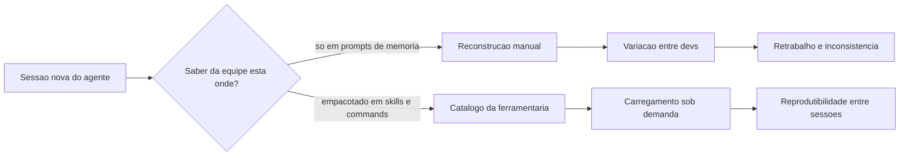

# Capítulo 1: O reinício eterno — por que todo agente esquece tudo

## 1. Introdução

Você já teve a sensação de explicar a mesma coisa duas vezes para a mesma pessoa, e na segunda vez ela agir como se nunca tivesse ouvido? É exatamente assim que funciona um agente de IA em uma sessão nova: ele chega com o conhecimento geral de um modelo treinado, mas sem nenhuma memória do que você combinou ontem, das convenções do seu repositório ou do padrão de deploy que sua equipe levou três meses para consolidar. Este capítulo abre a parte da obra dedicada à camada de harness mostrando por que esse esquecimento é a raiz de tanto retrabalho — e por que a solução não é "pedir para o agente lembrar", e sim empacotar o conhecimento em artefatos que ele possa carregar sob demanda.

Ao final deste capítulo, você será capaz de diagnosticar os quatro custos do conhecimento não empacotado — contexto, tempo, inconsistência e retrabalho — e de reconhecer o momento exato em que uma prática ad hoc deve virar um artefato reutilizável. Esse diagnóstico é o chão da oficina onde os próximos capítulos vão pendurar as ferramentas.

## 2. Explica

### A janela de contexto como recurso escasso

Um agente de IA não é um banco de dados: ele é um modelo que processa uma janela limitada de tokens a cada interação. Todo conteúdo que você injeta — instruções, código, histórico, exemplos — compete pelo mesmo espaço. Estudos sobre a arquitetura de agentes para terminal mostram que a gestão dessa janela é um dos pilares do que se chama *context engineering*: decidir o que entra, o que fica comprimido e o que fica de fora é uma decisão de engenharia, não de acaso [4]. Quando o conhecimento importante da sua equipe vive espalhado em prompts digitados de memória, cada sessão gasta parte preciosa da janela tentando reconstruir o que já deveria estar garantido. A gestão dessa janela é tão central que virou tema de curadoria própria na área de harness engineering [14].

A escassez não é apenas teórica. O custo de contexto tem duas faces: a financeira, porque tokens de entrada custam dinheiro em cada chamada, e a cognitiva, porque quanto mais ruído na janela, mais o modelo se distrai do que importa. Organizações que adotam IA agêntica em produção aprendem cedo que despejar documentação inteira no prompt a cada tarefa é o caminho mais rápido para degradar a qualidade das respostas [9]. O padrão de mercado converge para a mesma conclusão: o conhecimento institucional entra por artefatos versionados, não por instruções repetidas [13].

### Amnésia entre sessões e conhecimento efêmero

O segundo fato estrutural: cada sessão de agente começa do zero. A menos que algo persista no sistema de arquivos, no git ou em um serviço externo, tudo o que foi aprendido numa conversa se perde ao fechar o terminal. A literatura sobre agentes autônomos formaliza isso como o problema da memória de longo prazo: o agente precisa de mecanismos de escrita, gerenciamento e leitura para transportar conhecimento entre episódios [6]. Sem esses mecanismos, o conhecimento é efêmero por construção — e é por isso que frameworks de auto-melhoria extraem lições reutilizáveis das trajetórias de execução antes que elas se percam [7].

Isso explica um padrão que você provavelmente já viu: dois desenvolvedores usando o mesmo agente obtêm resultados diferentes para a mesma tarefa, porque cada um "explica" o contexto de um jeito. A variação não está no modelo — está no harness de cada sessão, no que foi ou não injetado. Um argumento central da pesquisa recente é justamente que comparar agentes sem descrever o harness (contexto, ferramentas, scaffolding) produz conclusões enganosas [20]. A visão mais radical vai além: o código não é só o que o agente produz, mas o próprio substrato do harness através do qual ele raciocina e age [19]. Na prática corporativa, a mesma lição aparece: agentes bem-sucedidos são avaliados pelo que conseguem entregar em bases de código reais, como demonstra o padrão SWE-bench [15].

### Prompts ad hoc versus conhecimento empacotado

A alternativa ao reinício eterno é transformar conhecimento em artefato. Um prompt digitado de memória é conhecimento em estado gasoso: ocupa o espaço onde foi gerado e se dissipa. Um arquivo versionado — uma skill com instruções e scripts, ou um comando que encapsula um procedimento — é conhecimento em estado sólido: existe independentemente da sessão, pode ser testado, revisado e reutilizado. O padrão aberto de agent skills formaliza exatamente essa distinção, definindo o pacote de conhecimento como uma pasta com `SKILL.md` e recursos associados [1][2]. A especificação é agnóstica de ferramenta, o que significa que a mesma skill pode rodar em harnesses diferentes — Claude Code, VS Code, Cursor — sem reescrita [3].

O princípio que torna isso viável em escala é a *disclosure progressiva*: apenas os metadados da skill (nome e descrição) ocupam a janela de contexto permanentemente; o corpo completo é carregado somente quando o gatilho semântico dispara [1]. É a diferença entre manter a biblioteca inteira aberta na mesa e consultar o catálogo para depois puxar só o volume que você precisa. O modelo de linguagem aumenta a confiabilidade quando o uso de ferramentas é ensinado com verificação e reflexão sobre erros — o princípio por trás do Tool-MVR [11]. E o ecossistema de skills comunitárias mostra que, com descrições bem desenhadas, o carregamento sob demanda funciona em escala [8]. Para distribuir essas skills entre projetos e pessoas, já existem gerenciadores de pacote dedicados, como o `npx skills` da Vercel Labs [16].

## 3. Ilustra

Pense na sua oficina de desenvolvimento como a oficina do Engenheiro Agêntico — o cenário que acompanha esta obra inteira. No chão da fábrica, um operário que não tem onde pendurar suas ferramentas faz o quê? Guarda a chave de boca no bolso, esquece onde pôs, e na semana seguinte está refazendo o mesmo parafuso do zero, testando três chaves diferentes até achar a que encaixa. É exatamente isso que acontece quando o conhecimento do agente vive no "bolso" de prompts digitados: toda sessão é uma nova busca pela ferramenta certa, com tentativa e erro.

Agora imagine a ferramentaria: cada ferramenta tem uma etiqueta (o `name` e a `description` da skill), um lugar fixo na parede (a pasta no sistema de arquivos) e um manual de instruções que só é aberto quando alguém vai usá-la. O operário não carrega a ferramentaria inteira no cinto — ele olha a etiqueta, decide se precisa daquela ferramenta e só então puxa o manual. É a disclosure progressiva em ação: catálogo sempre à vista, conteúdo sob demanda.



O motivo condutor da oficina não é um ornamento: é o vocabulário que os próximos capítulos reutilizam. Quando um capítulo falar em puxar a ferramenta da parede, você saberá que ele fala de carregar uma skill; quando falar em bancada com procedimento gravado, falará de commands. Guarde esse vocabulário — ele é o fio que amarra os dez capítulos desta obra.

## 4. Técnica

### Diagnosticando o custo do conhecimento efêmero

Antes de empacotar, é preciso medir. A ferramenta mais simples é um levantamento dos prompts que a equipe digita repetidamente para o agente. O script abaixo varre o histórico de sessões e extrai os fragmentos de instrução mais frequentes — o primeiro sinal de que existe conhecimento que deveria virar skill ou command.

```python
# -*- coding: utf-8 -*-
"""Detecta fragmentos de prompt repetidos em um historico de sessoes do agente."""
import collections
import re
from pathlib import Path


def normalizar(texto: str) -> str:
    """Remove espacos extras e normaliza quebras de linha para comparacao."""
    return re.sub(r"\s+", " ", texto).strip().lower()


def extrair_fragmentos(texto: str, tamanho: int = 40) -> list[str]:
    """Fatia o texto em janelas deslizantes de `tamanho` palavras."""
    palavras = normalizar(texto).split()
    if len(palavras) < tamanho:
        return []
    return [" ".join(palavras[i:i + tamanho]) for i in range(len(palavras) - tamanho + 1)]


def detectar_prompts_repetidos(diretorio: str, min_ocorrencias: int = 3) -> list[tuple[int, str]]:
    """Retorna os fragmentos de prompt que aparecem com frequencia suspeita."""
    contagem: collections.Counter[str] = collections.Counter()
    for caminho in Path(diretorio).rglob("*.jsonl"):
        try:
            linhas = caminho.read_text(encoding="utf-8", errors="ignore").splitlines()
        except OSError:
            continue
        for linha in linhas:
            for fragmento in extrair_fragmentos(linha):
                contagem[fragmento] += 1
    candidatos = [
        (vezes, frag)
        for frag, vezes in contagem.items()
        if vezes >= min_ocorrencias
    ]
    candidatos.sort(reverse=True)
    return candidatos[:20]


if __name__ == "__main__":
    historico = "~/.claude/projects"
    achados = detectar_prompts_repetidos(historico)
    for vezes, frag in achados[:10]:
        print(f"{vezes:>3}x  {frag[:90]}...")
```

Rode o equivalente no seu harness: todo fragmento que aparece três ou mais vezes é candidato a virar artefato. Não é sobre eliminar a conversa com o agente — é sobre parar de repetir a mesma instrução. Uma variação útil do script agrupa os candidatos por tema antes de apresentá-los, para que a decisão de empacotamento seja tomada em nível de domínio, não de frase solta.

```python
# -*- coding: utf-8 -*-
"""Agrupa os fragmentos repetidos por palavras-chave de dominio."""
import collections
import re
from pathlib import Path

DOMINIOS = {
    "deploy": r"deploy|release|publicar|publicacao",
    "testes": r"teste|pytest|cobertura|assert",
    "seguranca": r"seguranca|permissao|token|secreto|cripto",
    "banco": r"banco|sql|query|schema|migracao",
    "infra": r"docker|kubernetes|pipeline|ci|build",
}


def classificar(fragmento: str) -> str:
    """Classifica um fragmento no dominio mais provavel."""
    baixo = fragmento.lower()
    for dominio, padrao in DOMINIOS.items():
        if re.search(padrao, baixo):
            return dominio
    return "outros"


def agrupar_por_dominio(candidatos: list[tuple[int, str]]) -> dict[str, list[str]]:
    """Agrupa os fragmentos repetidos por dominio tematico."""
    grupos: dict[str, list[str]] = collections.defaultdict(list)
    for vezes, fragmento in candidatos:
        grupos[classificar(fragmento)].append(f"{vezes}x {fragmento[:60]}")
    return dict(sorted(grupos.items()))


if __name__ == "__main__":
    exemplo = [(7, "rode o deploy com cache de build ativo"),
               (5, "verifique a cobertura dos testes novos")]
    for dominio, itens in agrupar_por_dominio(exemplo).items():
        print(f"{dominio.upper()}:")
        for item in itens:
            print(f"  - {item}")
```

Com o agrupamento, a reunião de planejamento da ferramentaria fica objetiva: em vez de discutir quarenta frases soltas, a equipe discute cinco domínios — deploy, testes, segurança, banco e infra — e decide em cada um quais artefatos nascem. A medição deixa de ser um fim em si e passa a alimentar a decisão de engenharia.

### Por que a memória do modelo não resolve o problema

Uma objeção comum surge aqui: "por que não simplesmente deixar o modelo lembrar?" A resposta está na arquitetura: o modelo não persiste estado entre chamadas. Ele recebe uma janela de tokens e produz uma resposta — o que "lembra" é o que está na janela naquele momento. Entender isso é libertador: você para de cobrar do modelo algo que a arquitetura dele não oferece e começa a desenhar a persistência onde ela pertence — no sistema de arquivos, no git e nos artefatos de conhecimento [6].

É por isso que a discussão sobre "memória" de agentes migrou para mecanismos explícitos: escrita de conhecimento, gerenciamento de relevância e leitura sob demanda [6]. A skill é exatamente um desses mecanismos — um pedaço de memória procedural que o harness sabe ler quando precisa. O modelo continua sendo o operário; a memória passa a ser a oficina.

### O momento de virar artefato: uma régua de decisão

Empacotar cedo demais gera manutenção; tarde demais, gera retrabalho. Uma régua prática usa três perguntas em sequência. A primeira: a instrução é repetida por mais de uma pessoa ou mais de um projeto? A segunda: ela é estável o suficiente para sobreviver a uma semana sem mudanças? A terceira: a execução errada dela tem custo relevante? Se as três respostas forem sim, o conhecimento pede para ser empacotado.

```python
# -*- coding: utf-8 -*-
"""Regua de decisao para promover conhecimento a skill ou command."""


def decidir_empacotamento(frequencia: int, estabilidade_dias: int, custo_erro: str) -> str:
    """Avalia se um trecho de conhecimento merece virar artefato reutilizavel.

    Retorna 'skill', 'command' ou 'manter_ad_hoc'.
    """
    repetido = frequencia >= 3
    estavel = estabilidade_dias >= 7
    custoso = custo_erro.lower() in {"alto", "critico", "caro", "financeiro", "seguranca"}

    if repetido and estavel and custoso:
        return "command"
    if repetido and estavel:
        return "skill"
    return "manter_ad_hoc"


if __name__ == "__main__":
    casos = [
        ("procedimento de deploy", 12, 30, "critico"),
        ("convencao de nomeacao de commits", 8, 15, "baixo"),
        ("explicacao pontual de um bug", 1, 0, "baixo"),
    ]
    for nome, freq, dias, custo in casos:
        print(f"{nome:<32} -> {decidir_empacotamento(freq, dias, custo)}")
```

A régua não é absoluta — é um ponto de partida que a sua equipe calibra. O importante é ter o gatilho explícito, para que a decisão não dependa do humor do dia. Uma vez que o artefato nasce, ele entra no ciclo de manutenção: versione, nomeie com intenção e documente o gatilho de uso no próprio arquivo. Um artefato sem dono e sem revisão é uma dívida nova disfarçada de investimento — a régua de decisão não termina na criação, ela continua no ciclo de vida.

### Métricas de saúde do conhecimento

Com os scripts do capítulo, a equipe ganha duas métricas objetivas de saúde do conhecimento. A primeira é o índice de repetição: a razão entre fragmentos de prompt que se repetem e o total de instruções dadas — alto demais, e o catálogo está defasado. A segunda é a cobertura de artefatos: a proporção de domínios repetitivos (deploy, testes, segurança) que já têm skill ou command correspondente. Acompanhar essas duas métricas em ritmo mensal transforma "empacotar conhecimento" de slogan em gestão [9].

As duas métricas juntas contam a história completa: o índice de repetição mostra a demanda não atendida, e a cobertura mostra o quanto dessa demanda já virou patrimônio. Quando a repetição cai e a cobertura sobe, a oficina está saudável — quando as duas congelam, alguém está acumulando prompts no bolso em vez de pendurar na parede. Times que praticam isso relatam ganhos de velocidade em SDLC completo mantendo a conformidade — como o caso da fintech CRED documentado em guias de referência de agentes [12]. E a tendência é que esse conhecimento empacotado fique cada vez mais sofisticado: o survey mais recente sobre skills para LLMs mapeia a aquisição autônoma de habilidades como fronteira ativa [18].

### O custo da não decisão: retrabalho como métrica

O retrabalho é a métrica que transforma essa discussão em números. Cada vez que a equipe refaz uma instrução que já poderia estar empacotada, ela paga o custo em três moedas: tokens de entrada repetidos, tempo de sessão e risco de variação. Um comando de deploy digitado de memória por três desenvolvedores diferentes produz três procedimentos ligeiramente diferentes — e a diferença entre eles é onde os incidentes moram [5].

A régua de decisão abaixo quantifica esse custo de forma simples: frequência vezes estabilidade vezes custo de erro. Quando o produto cruza o limiar, o artefato se paga sozinho na primeira semana — e a partir daí é lucro.

### Estruturando a pasta antes da ferramenta

Quando a decisão for por uma skill, a estrutura mínima já nasce com a forma certa. O padrão aberto define uma pasta nomeada com o nome da skill contendo um `SKILL.md` obrigatório e diretórios opcionais para scripts, referências e recursos [1]. Você não precisa de tudo no primeiro dia — precisa da pasta e do arquivo principal, para que o conhecimento tenha endereço fixo desde o início.

```bash
# Estrutura minima de uma skill antes de qualquer conteudo
mkdir -p .claude/skills/nome-da-skill/{scripts,references,assets}
```

A mesma lógica vale para commands: um arquivo em um diretório de commands com frontmatter descritivo. A decisão entre skill e command — que o próximo capítulo aprofunda — não precisa ser perfeita no dia um: um artefato bem organizado pode migrar de forma depois, porque a estrutura em arquivos torna a realocação um movimento de pasta, não uma reescrita. O custo de começar é baixo justamente porque a forma é o que primeiro se ajusta.

## 5. Aplica

### A cena do deploy que nunca dava certo

Imagine a seguinte cena, em segunda pessoa. Você é o Engenheiro Agêntico encarregado de um microserviço novo, e a equipe pede para você usar o agente para preparar o primeiro deploy. Você começa a sessão e digita, de memória, tudo o que aprendeu com o último deploy do outro serviço: "lembre de usar o comando de build com cache, verifique a variável de ambiente de produção, não esqueça do healthcheck". O agente executa, você confere, e parece tudo certo — até o pipeline quebrar porque você esqueceu de mencionar que este serviço usa um registry de imagens diferente.

O erro acontece exatamente aqui: você tratou conhecimento corporativo como memória pessoal. O diagnóstico, ligando à teoria do capítulo, é que o conhecimento estava no estado gasoso — dependia da sua memória, da sua sessão, do seu humor. A correção estrutural é transformar o procedimento de deploy em um command versionado: o procedimento gravado na bancada da oficina, disponível para qualquer pessoa com um `/deploy` independentemente de quem escreveu o prompt original. Na prática, isso significa que o retrabalho deixa de ser uma característica do processo e passa a ser um sinal de que um artefato precisa nascer.

### Armadilhas comuns do início da jornada

A primeira armadilha é empacotar tudo de uma vez: criar trinta skills na primeira semana e depois abandonar vinte porque ninguém sabe quando usá-las. O antídoto é começar pelo catálogo — pelas descrições — e validar o gatilho de cada skill antes de investir no conteúdo profundo. A segunda armadilha é tratar o arquivo de instruções do projeto como substituto de skills: despejar tudo no `CLAUDE.md` mantém o custo de contexto sempre ativo e transforma a janela em uma mesa coberta de livros abertos [2]. Equipes maduras combinam instruções estáticas com skills dinâmicas — a mesma divisão que frameworks como o Superpowers da obra popularizam [17]. A terceira é não versionar: conhecimento empacotado sem git é conhecimento empacotado sem história, sem revisão e sem rollback. A quarta é ignorar a medição: se você não sabe quantas vezes o fragmento de prompt se repete, não sabe se o artefato está pagando o próprio custo.

### Métricas de sucesso

Uma equipe que empacota conhecimento bem tem três sinais mensuráveis. O primeiro: o tempo de setup de uma sessão nova cai, porque a introdução de contexto passa de "digitar de memória" para "referenciar o catálogo". O segundo: a variação entre desenvolvedores diminui, porque o procedimento correto não depende mais de quem lembra dele. O terceiro: o número de prompts repetidos no histórico cai mês a mês, como o contador de fragmentos do script acima evidencia. Nenhuma dessas métricas é sobre "fazer o agente mais inteligente" — todas são sobre tornar o conhecimento da equipe durável. Empresas como a Anthropic usam agentes no dia a dia de infraestrutura e finanças, e o que sustenta essa escala é justamente a documentação de contexto bem-feita [5]. O próximo passo natural é conectar esse conhecimento empacotado a ferramentas externas via protocolo padronizado, como o MCP [10].

## 6. Conclusão

Neste capítulo, você entendeu por que todo agente esquece tudo: a janela de contexto é escassa, a sessão recomeça do zero e o conhecimento não empacotado existe em estado gasoso. Você conheceu o princípio que resolve o problema — a disclosure progressiva das agent skills — e a régua de três perguntas que separa o que merece virar artefato do que deve continuar ad hoc. E você viu, na cena do deploy, que o erro típico não é técnico: é tratar conhecimento corporativo como memória pessoal.

O desafio para fixar: rode o script de detecção de fragmentos repetidos no histórico da sua própria equipe e liste os cinco fragmentos mais frequentes. No próximo capítulo, você vai subir um nível na oficina: entender como o harness — a camada que orquestra o loop do agente — posiciona skills e commands como as duas formas fundamentais de conhecimento empacotado, e por que essa distinção importa na hora de desenhar a sua ferramentaria.

## 8. Aprofundamento: o harness como memória estrutural

### Os quatro custos do conhecimento não empacotado, em números

A introdução prometeu quatro custos — contexto, tempo, inconsistência e retrabalho — e vale torná-los mensuráveis, porque o que não é medido não é gerido. O custo de contexto é o mais direto: cada sessão que reconstrói conhecimento paga tokens de entrada repetidos, e o custo acumulado cresce linearmente com o número de sessões. O custo de tempo é o tempo humano de reexplicar: toda vez que um desenvolvedor digita de memória uma instrução que já deveria estar empacotada, ele gasta minutos que a equipe paga em horas. O custo de inconsistência é o mais silencioso: três desenvolvedores executando o mesmo procedimento de formas diferentes produzem resultados diferentes, e a diferença vira incidente. O custo de retrabalho é o agregado dos três: a soma do que a equipe refaz porque o conhecimento não era durável [9].

A relação entre os quatro custos explica por que a medição do Capítulo 1 (o índice de repetição) é tão importante: ela é a porta de entrada dos outros três. Quando a repetição cai, o tempo de reexplicação cai, a variação entre desenvolvedores cai e o retrabalho cai. Os quatro custos não são independentes — são o mesmo desperdício visto de quatro ângulos [18].

### O ciclo da sessão: o que se perde em cada fechamento

Para entender a amnésia com precisão, vale reconstruir o ciclo de uma sessão típica. A sessão abre com o bootstrap (o arquivo de instruções raiz carrega o contexto estável). Durante a sessão, o conhecimento se acumula: decisões tomadas, arquivos modificados, convenções descobertas. No fechamento, esse conhecimento existe apenas no histórico da sessão — e o histórico, por melhor que seja, não é um artefato: não é carregado automaticamente, não é testável, não é versionado. A próxima sessão reabre com o bootstrap de novo, e o ciclo recomeça. O que o harness perde em cada fechamento é exatamente o que a skill preserva: o conhecimento que sobrevive à sessão [6].

```python
# -*- coding: utf-8 -*-
"""Reconstroi o ciclo de perda de conhecimento entre sessoes."""


def saldo_conhecimento(conhecimento_sessao: int, bootstrap: int,
                       artefatos: int) -> dict:
    """Compara o conhecimento que atravessa sessoes com o que se perde."""
    perda_por_sessao = conhecimento_sessao
    ganho_por_sessao = bootstrap + artefatos
    return {
        "perdido_por_sessao": perda_por_sessao,
        "sobrevive_por_sessao": ganho_por_sessao,
        "saldo": ganho_por_sessao - perda_por_sessao,
    }


if __name__ == "__main__":
    print(saldo_conhecimento(conhecimento_sessao=60, bootstrap=10, artefatos=40))
```

O saldo do ciclo é a equação central da obra: quando os artefatos cobrem o conhecimento que a sessão produz, o saldo é positivo e o agente acumula; quando não cobrem, o saldo é negativo e o agente esquece — o reinício eterno do título do capítulo [7].

### O dilema do começo: empacotar o quê primeiro

A primeira pergunta de quem inicia a jornada é: por onde começo? A resposta prática contraria o impulso de empacotar o que é mais interessante e aponta para o que é mais repetido. A priorização segue três critérios em ordem: frequência (o que a equipe faz toda semana), dor (o que erra com mais frequência) e custo do erro (o que mais custa quando falha). O procedimento de deploy normalmente vence nos três; a convenção de nomeação de commits vence apenas no primeiro — e por isso o deploy vira command antes da convenção virar skill [12].

```python
# -*- coding: utf-8 -*-
"""Prioriza candidatos a empacotamento por frequencia, dor e custo."""


def pontuar(candidatos: list[dict]) -> list[tuple[str, int]]:
    """Ordena candidatos por (frequencia + dor + custo_erro)."""
    ordenados = []
    for c in candidatos:
        nota = c.get("frequencia", 0) + c.get("dor", 0) + c.get("custo_erro", 0)
        ordenados.append((c["nome"], nota))
    ordenados.sort(key=lambda x: -x[1])
    return ordenados


if __name__ == "__main__":
    candidatos = [
        {"nome": "deploy", "frequencia": 5, "dor": 4, "custo_erro": 5},
        {"nome": "nomenclatura", "frequencia": 4, "dor": 1, "custo_erro": 1},
        {"nome": "migracao", "frequencia": 2, "dor": 3, "custo_erro": 5},
    ]
    for nome, nota in pontuar(candidatos):
        print(f"{nome}: {nota} pontos")
```

A priorização por pontuação tem um efeito colateral valioso: ela torna a decisão discutível com dados. Quando alguém discorda da ordem, a discordância é sobre a pontuação — frequência, dor ou custo — não sobre preferência pessoal. É a mesma disciplina de decisão que a obra aplica em todas as camadas, do gatilho à governança [15].

### A armadilha do empacotamento prematuro

O capítulo mostrou a régua de três perguntas para decidir quando empacotar; o complemento é o alerta contra o empacotamento prematuro. Empacotar cedo demais tem três custos. O primeiro é a manutenção: um artefato que ainda muda toda semana exige edições frequentes, e cada edição é uma dívida de revisão. O segundo é o catálogo inchado: skills criadas antes de a prática estabilizar viram entulho que o gatilho semântico precisa filtrar. O terceiro é o custo de aprendizagem errada: um procedimento empacotado antes de ser testado congela a versão errada da prática, e a equipe passa a repetir o erro de forma consistente — pior que o erro inconsistente, porque fica invisível [4].

O contrapeso ao empacotamento prematuro é a disciplina do rascunho: a prática vive no caderno de memória procedural (o conceito do Capítulo 9) enquanto muda, e só vira artefato versionado quando estabiliza. O rascunho é barato de mudar; o artefato é caro de mudar. A transição é a decisão — e a régua de três perguntas é o critério [7].

### O inventário do estado atual: o ponto de partida da transformação

Antes de qualquer empacotamento, a equipe precisa do inventário do estado atual: o mapa do conhecimento que existe hoje e onde ele mora. O inventário tem três colunas: conhecimento, forma atual (prompt ad hoc, arquivo de instruções, skill, command) e dono (quem o mantém). A coluna da forma é a mais reveladora: ela mostra a distribuição do conhecimento entre os estados gasoso e sólido, e aponta exatamente onde a transformação precisa acontecer [13].

```python
# -*- coding: utf-8 -*-
"""Inventario do conhecimento: forma atual e dono por item."""
import json


def inventariar(itens: list[dict]) -> dict:
    """Agrupa o conhecimento por forma atual e conta sem dono."""
    por_forma = {}
    sem_dono = []
    for item in itens:
        forma = item.get("forma", "ad_hoc")
        por_forma[forma] = por_forma.get(forma, 0) + 1
        if not item.get("dono"):
            sem_dono.append(item["nome"])
    return {"por_forma": por_forma, "sem_dono": sem_dono}


if __name__ == "__main__":
    itens = [
        {"nome": "deploy", "forma": "ad_hoc", "dono": ""},
        {"nome": "convencao git", "forma": "instrucoes", "dono": "joao"},
        {"nome": "revisao de testes", "forma": "skill", "dono": "maria"},
    ]
    print(json.dumps(inventariar(itens), ensure_ascii=False, indent=2))
```

O inventário é a fotografia do estado atual — e a fotografia é o insumo da transformação. A equipe que sabe onde o conhecimento mora hoje sabe onde os artefatos precisam nascer amanhã. Sem o inventário, o empacotamento segue o gosto de quem empacota; com ele, segue a evidência [9].

### O mapa do conhecimento: o inventário como ponto de partida

O capítulo fechou com a régua de três perguntas; o mapa do conhecimento é o seu instrumento operacional. O mapa é a tabela do inventário — conhecimento, forma atual, dono — transformada em plano: para cada linha no estado gasoso (prompt ad hoc), o artefato-alvo; para cada artefato, o critério de prontidão. O mapa não é um documento: é um trabalho vivo, revisado a cada ciclo de medição do capítulo, que mostra à equipe o que já virou patrimônio e o que ainda espera a decisão. A equipe que mantém o mapa sabe onde o conhecimento mora, quem o mantém e o que falta empacotar — sem o mapa, a transformação do reinício eterno em continuidade é impulso, não projeto [13].

### O custo de oportunidade: o que o empacotamento substitui

Há uma última conta que fecha o capítulo: o custo de oportunidade do empacotamento. Todo artefato criado consome o tempo de quem o mantém — e esse tempo poderia estar resolvendo tarefas. A conta honesta compara o valor do artefato (a economia de repetição) com o custo de manutenção (a revisão contínua), e o saldo decide o investimento. Um artefato de alta frequência paga a manutenção em dias; um artefato de baixa frequência pode nunca pagar — e a régua do Capítulo 1, com as três perguntas, é exatamente a calculadora desse saldo [12].

```python
# -*- coding: utf-8 -*-
"""Custo de oportunidade: saldo entre economia e manutencao do artefato."""


def saldo_artefato(frequencia_semanal: int, economia_por_uso: float,
                  horas_manutencao_mensal: float, custo_hora: float) -> dict:
    """Compara a economia gerada com o custo de manutencao mensal."""
    economia_mensal = frequencia_semanal * 4.33 * economia_por_uso
    custo_mensal = horas_manutencao_mensal * custo_hora
    return {
        "economia_mensal": round(economia_mensal, 2),
        "custo_mensal": round(custo_mensal, 2),
        "saldo": round(economia_mensal - custo_mensal, 2),
    }


if __name__ == "__main__":
    print(saldo_artefato(frequencia_semanal=10, economia_por_uso=0.2,
                         horas_manutencao_mensal=1.0, custo_hora=50.0))
```

O saldo do artefato é a régua final de priorização: empacotar é investir, e a decisão de investimento é uma conta — economia projetada contra manutenção estimada. A conta não precisa ser exata; precisa existir, para que a decisão não seja movida por entusiasmo pelo artefato em vez de valor para a equipe [9].

### A régua do silêncio: quando o prompt é o lugar certo

Fechando o aprofundamento, um contraponto necessário à pressa de empacotar: existe conhecimento que não merece virar artefato — e o prompt ad hoc é o lugar certo para ele. Explicações pontuais, contexto de uma tarefa específica, decisões que mudam a cada execução: empacotar isso é criar ruído. A régua do silêncio complementa a régua de três perguntas: se o conhecimento é específico de uma tarefa, efêmero por natureza ou exclusivo de uma pessoa, o prompt é o lugar. O empacotamento não é um valor absoluto — é um investimento, e o investimento se justifica pela recorrência, não pela admiração pelo artefato [10]. A sabedoria da oficina é saber o que pendurar na parede e o que deixar no bolso do operário.

### O harness como memória estrutural

### A hierarquia da memória no ciclo do agente

Este capítulo tratou da amnésia entre sessões, mas a memória do agente tem mais de uma camada — e cada camada tem custo, latência e durabilidade próprios. A memória de trabalho é a janela de contexto ativa, volátil por definição: o que está nela nesta interação não existe na próxima. A memória episódica é o registro bruto do que foi feito — logs de sessão, histórico de comandos, arquivos de transcrição — que existe, mas não está estruturado para reuso. A memória procedural é o conhecimento de como fazer, e é exatamente aí que skills e commands se encaixam: eles são memória procedural em estado sólido, legíveis por máquina e por modelo [6]. A memória semântica, por fim, é o conhecimento de fatos e conceitos que atravessa tarefas — o vocabulário da equipe, as decisões de arquitetura, o glossário do domínio.

O erro de quem lê este capítulo e sai empacotando tudo é confundir as camadas. Uma skill não é um log: ela não registra o que aconteceu, ela prescreve o que deve acontecer. Um command não é um arquivo de configuração: ele é um procedimento que o harness executa sob demanda. A classificação correta evita dois desperdícios simétricos: registrar como artefato de conhecimento algo que é apenas histórico, e manter como histórico algo que a equipe repete toda semana e que deveria ter virado prescrição. A pesquisa sobre memória para agentes autônomos mapeia exatamente essa fronteira, avaliando os mecanismos de escrita, gerenciamento e leitura em cada camada [6]. O survey de skills para LLMs chega à mesma estrutura por outro caminho: o conhecimento dos agentes é adquirido, curado e consumido em ciclos que cruzam essas camadas [18].

### Contexto de bootstrap versus contexto operacional

Uma distinção que passa despercebida até o primeiro incidente é a diferença entre o contexto necessário para a sessão começar e o contexto necessário para a tarefa ser executada. O contexto de bootstrap responde a três perguntas: quem sou eu (o papel do agente), onde estou (o repositório e suas convenções) e o que é aceitável (as regras de conduta e de qualidade). O contexto operacional responde a outra pergunta: o que preciso saber para executar esta tarefa específica agora. A amnésia atinge as duas camadas de forma diferente: o bootstrap pode ser reconstruído por um arquivo de instruções raiz, como o AGENTS.md [13], enquanto o operacional só pode ser reconstruído por um catálogo de artefatos sob demanda [1].

Misturar as duas camadas no mesmo arquivo é o padrão que mais degrada janelas de contexto em projetos reais. Equipes que despejam instruções operacionais de todas as áreas no arquivo raiz transformam o bootstrap em um manual de quinhentas páginas — e cada sessão paga o preço de carregar tudo. A disciplina correta é minimalista: o arquivo raiz guarda o estável e o transversal; o específico mora nas skills. Os guias de adoção corporativa de IA de código são explícitos sobre esse efeito: projetos com bootstrap enxuto e catálogo rico apresentam menos erros e mais consistência em escala [9].

### Quantificando o custo da amnésia em tokens

Para quem precisa justificar o investimento em empacotamento, o custo da amnésia pode ser estimado em números. O custo de uma sessão ad hoc é a soma dos tokens de entrada gastos para reconstruir conhecimento que já deveria estar empacotado. Se uma equipe de dez desenvolvedores inicia cinquenta sessões por semana e cada sessão gasta em média dois mil tokens de entrada com instruções repetidas, o desperdício semanal é de cem mil tokens — e isso é só a conta de tokens, sem contar o tempo humano e o risco de variação.

```python
# -*- coding: utf-8 -*-
"""Estima o custo semanal da amnesia em tokens de entrada."""


def custo_semanal_amnesia(desenvolvedores: int, sessoes_por_semana: int,
                          tokens_repetidos_por_sessao: int,
                          preco_por_milhao_tokens: float = 3.0) -> dict:
    """Calcula o custo em tokens e em moeda da repeticao de contexto."""
    sessoes_totais = desenvolvedores * sessoes_por_semana
    tokens_desperdicados = sessoes_totais * tokens_repetidos_por_sessao
    custo_moeda = (tokens_desperdicados / 1_000_000) * preco_por_milhao_tokens
    return {
        "sessoes_totais": sessoes_totais,
        "tokens_desperdicados_semana": tokens_desperdicados,
        "custo_moeda_semana": round(custo_moeda, 2),
    }


if __name__ == "__main__":
    resultado = custo_semanal_amnesia(
        desenvolvedores=10, sessoes_por_semana=50,
        tokens_repetidos_por_sessao=2000,
    )
    for chave, valor in resultado.items():
        print(f"{chave}: {valor}")
```

O número é ilustrativo, mas o mecanismo é real: o valor de uma skill é exatamente a economia desses tokens repetidos, multiplicada pela frequência de uso. Esse raciocínio de custo-benefício é o mesmo que as empresas usam para decidir onde investir em automação agêntica, e ele depende de medir o estado atual antes de projetar o estado futuro [9].

### O papel da reflexão sobre erros na confiabilidade

Há um detalhe sutil na confiabilidade do conhecimento empacotado que merece destaque: a qualidade de uma instrução não se mede apenas pela clareza, mas pelo que acontece quando ela falha. Um procedimento que não prevê o erro ensina o agente a repetir o mesmo caminho até o mesmo fracasso; um procedimento que documenta as falhas conhecidas transforma o erro em ponto de aprendizagem. A literatura sobre verificação de ferramentas mostra que ensinar o modelo a verificar e refletir sobre erros de uso melhora substancialmente a confiabilidade de longo prazo [11].

Na prática, isso significa que todo artefato de conhecimento deveria ter uma seção de falhas conhecidas — os modos de erro que já foram vistos, o sintoma de cada um e a correção. Essa seção é o que separa um procedimento maduro de um rascunho. O Tool-MVR demonstra o mecanismo em detalhe: verificação sistemática da saída da ferramenta e reflexão sobre o resultado, repetidas em cada uso [11].

### Quando a memória procedural vira skill: o ciclo de promoção

Fechando o capítulo, vale desenhar o ciclo que será retomado em detalhe na obra: a promoção de conhecimento. O conhecimento nasce como episódio (uma sessão que resolveu um problema), vira lição (o resumo do que funcionou), vira procedimento (a sequência estável de passos) e, por fim, vira skill (o artefato versionado com gatilho e validação). Cada transição do ciclo exige uma decisão deliberada — e a régua de três perguntas deste capítulo é o instrumento dessa decisão. O que este capítulo entregou é a fundação: o diagnóstico do problema, a régua de decisão e as métricas de saúde. Os próximos capítulos constroem sobre essa fundação a anatomia dos artefatos, a execução, o teste e a governança — o ciclo completo que transforma o reinício eterno em continuidade deliberada [7][18].

## 7. Referências Bibliográficas

[1] AGENTSKILLS.IO. *Agent Skills Specification*. Disponível em: https://agentskills.io/specification. Acesso em: 06 ago. 2026.
[2] ANTHROPIC. *Agent Skills — Claude Platform Docs*. Disponível em: https://platform.claude.com/docs/en/agents-and-tools/agent-skills/overview. Acesso em: 06 ago. 2026.
[3] ANTHROPIC. *Claude Code Skills Documentation*. Disponível em: https://code.claude.com/docs/en/skills. Acesso em: 06 ago. 2026.
[4] BUI, et al. *Building AI Coding Agents for the Terminal: Scaffolding, Harness, Context Engineering, and Lessons Learned*. Disponível em: https://arxiv.org/abs/2603.05344. Acesso em: 06 ago. 2026.
[5] CODINGSCAPE. *How Anthropic Engineering Teams Use Claude Code Every Day*. Disponível em: https://codingscape.com/blog/how-anthropic-engineering-teams-use-claude-code-every-day. Acesso em: 06 ago. 2026.
[6] DU, Pengfei. *Memory for Autonomous LLM Agents: Mechanisms, Evaluation, and Emerging Frontiers*. Disponível em: https://arxiv.org/abs/2603.07670. Acesso em: 06 ago. 2026.
[7] FANG, Gaodan; ISAHAGIAN, Vatche; JAYARAM, K. R.; KUMAR, Ritesh; MUTHUSAMY, Vinod; OUM, Punleuk; THOMAS, Gegi. *Trajectory-Informed Memory Generation for Self-Improving Agent Systems*. Disponível em: https://arxiv.org/abs/2603.10600. Acesso em: 06 ago. 2026.
[8] FIRECRAWL. *Best Claude Code Skills to Try*. Disponível em: https://www.firecrawl.dev/blog/best-claude-code-skills. Acesso em: 06 ago. 2026.
[9] GETDX. *AI Code Generation: Best Practices for Enterprise Adoption*. Disponível em: https://getdx.com/blog/ai-code-enterprise-adoption/. Acesso em: 06 ago. 2026.
[10] KRISHNAN, Naveen. *Advancing Multi-Agent Systems Through Model Context Protocol*. Disponível em: https://arxiv.org/abs/2504.21030. Acesso em: 06 ago. 2026.
[11] MA, Zhiyuan; LIU, Jiayu; LUO, Xianzhen; HUANG, Zhenya; ZHU, Qingfu; CHE, Wanxiang. *Tool-MVR: Meta-Verification and Reflection Learning for Reliable Tool-Use*. Disponível em: https://arxiv.org/abs/2506.04625. Acesso em: 06 ago. 2026.
[12] MEDIUM (HEEKI PARK). *Collaborating with Agent Teams in Claude Code*. Disponível em: https://heeki.medium.com/collaborating-with-agents-teams-in-claude-code-f64a465f3c11. Acesso em: 06 ago. 2026.
[13] OPENAI. *Custom Instructions with AGENTS.md*. Disponível em: https://learn.chatgpt.com/docs/agent-configuration/agents-md. Acesso em: 06 ago. 2026.
[14] RUCAIBOX. *Awesome Agent Harness*. Disponível em: https://github.com/RUCAIBox/awesome-agent-harness. Acesso em: 06 ago. 2026.
[15] SWEBENCH. *SWE-bench Verified & Pro*. Disponível em: https://www.swebench.com. Acesso em: 06 ago. 2026.
[16] VERCEL LABS. *Skills — package manager for agent skills*. Disponível em: https://github.com/vercel-labs/skills. Acesso em: 06 ago. 2026.
[17] VINCENT, Jesse (obra). *Superpowers — engineering skills for agents*. Disponível em: https://github.com/obra/superpowers. Acesso em: 06 ago. 2026.
[18] XU, Renjun; YAN, Yang. *Agent Skills for Large Language Models: Architecture, Acquisition, Security, and the Path Forward*. Disponível em: https://arxiv.org/abs/2602.12430. Acesso em: 06 ago. 2026.
[19] ZHANG, et al. *Code as Agent Harness: Toward Executable, Verifiable, and Stateful Agent Systems*. Disponível em: https://arxiv.org/abs/2605.18747. Acesso em: 06 ago. 2026.
[20] *Stop Comparing LLM Agents Without Disclosing the Harness*. Disponível em: https://arxiv.org/abs/2605.23950. Acesso em: 06 ago. 2026.
