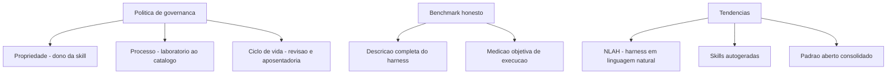

# Capítulo 10: Governança, benchmarks e o futuro do conhecimento empacotado

## 1. Introdução

No Capítulo 9, você orquestrou o harness completo: skills, MCP, memória procedural e estado persistente trabalhando juntos. Agora você fecha a obra com o olhar de quem lidera — não de quem apenas opera. Este capítulo final trata das três frentes que separam uma oficina que funciona de uma organização que escala: a governança do conhecimento empacotado, a honestidade dos benchmarks que medem agentes e as tendências que vão moldar o futuro da área.

Ao final deste capítulo, você será capaz de desenhar a política de governança de skills e commands da sua organização, avaliar benchmarks de agentes com espírito crítico e posicionar-se diante das tendências — harnesses em linguagem natural, skills autogeneradas e a consolidação do padrão aberto. É o diploma de Engenheiro Agêntico.

## 2. Explica

### O que a governança protege: os três ativos da organização

A governança de skills e commands protege três ativos que a organização costuma não nomear. O primeiro é o catálogo: o inventário de conhecimento empacotado, que vale mais do que a soma das skills porque é um patrimônio curado. O segundo é a confiança: a certeza de que uma skill aprovada não vai destruir um ambiente ou exfiltrar um dado — confiança é o ativo que sustenta a adoção em escala. O terceiro é a evolução: a capacidade de melhorar o catálogo sem quebrar quem depende dele [1].

Cada ativo exige uma proteção diferente. O catálogo exige curadoria — alguém decide o que entra e o que sai. A confiança exige processo — as bancadas do laboratório não podem ser puladas. A evolução exige versionamento e testes — mudanças são releases, não edições. Governança, no fim, é a disciplina de proteger esses três ativos simultaneamente.

### Governança: o ciclo de vida do conhecimento empacotado

Governança é o conjunto de regras que decide como o conhecimento entra, vive e sai do catálogo da organização. No caso de skills e commands, a governança cobre o ciclo de vida inteiro: quem pode criar, quem revisa, quais verificações obrigatórias (as três bancadas do Capítulo 8), como a skill é versionada e distribuída, e quando uma skill é aposentada. Sem governança, o catálogo vira um terreno comum: cada um planta o que quer, ninguém cuida, e as ervas daninhas tomam conta [1]. E quando o conhecimento precisa de dados externos, a governança também cobre a conexão via MCP [13].

A governança madura tem três pilares. O primeiro é a propriedade: toda skill tem um dono responsável por mantê-la. O segundo é o processo: o fluxo de adoção — do laboratório ao catálogo — é documentado e exige as verificações obrigatórias. O terceiro é o ciclo de vida: skills têm revisão periódica, métricas de uso e política de aposentadoria. Os três juntos transformam o catálogo de depósito em patrimônio [2]. A confiabilidade dos procedimentos governados melhora quando o uso de ferramentas é ensinado com verificação e reflexão sobre erros [14].

### Benchmarks honestos: a tese da Binding Constraint

Medir agentes é diferente de medir modelos. O desempenho de um agente depende do harness inteiro — contexto, ferramentas, scaffolding, commands e skills disponíveis. Comparar agentes sem descrever o harness produz conclusões enganosas: a tese da Binding Constraint argumenta que a variação de desempenho é dominada pelo harness, não pelo modelo base [3].

A consequência prática é dupla. Primeiro, qualquer benchmark de agente deve descrever o harness com o mesmo rigor que descreve o modelo — o que estava no contexto, quais ferramentas, qual scaffolding. Segundo, os benchmarks de referência da área, como o SWE-bench, evoluíram exatamente nessa direção: tarefas reais, ambiente controlado e avaliação objetiva de execução, em vez de resposta [4]. A visão do código como harness reforça que o benchmark deve medir execução verificável, não intenção [15]. Curadorias da área consolidam os melhores protocolos de avaliação [16].

### O futuro: NLAHs, skills autogeneradas e o padrão aberto

Três tendências definem a fronteira. A primeira são os harnesses em linguagem natural (NLAHs): em vez de código rígido, o comportamento do harness é expresso e editável em linguagem natural, permitindo adaptação flexível. A segunda são as skills autogeneradas: agentes que extraem conhecimento de suas próprias execuções e empacotam em skills novas — o ciclo de auto-melhoria que você viu no Capítulo 9 levado ao extremo [5]. A terceira é a consolidação do padrão aberto: quanto mais harnesses adotam a especificação de agent skills, maior o valor da portabilidade e mais forte o ecossistema — um efeito de rede clássico [6].

### Lendo tendências sem apostar a oficina

A postura profissional diante das tendências é assimétrica: adote o que reduz risco hoje, experimente o que promete valor amanhã, e não reescreva a oficina inteira por causa de uma previsão. O padrão aberto é a única das três tendências que você pode adotar integralmente hoje — ela reduz risco e custo sem incerteza. NLAHs são promissoras, mas exigem maturidade de harness que poucas organizações têm; skills autogeneradas já valem experimentos controlados no ciclo de promoção do Capítulo 9, não substituição do catálogo [5].

A régua prática é a mesma dos capítulos anteriores, aplicada a tendências: medir antes de decidir, experimentar em isolamento, e promover para produção apenas o que passou pelas bancadas. A tendência é o vento; a oficina é o que você construiu para navegar — não troque a oficina pelo vento.

## 3. Ilustra

A cooperativa da oficina do Engenheiro Agêntico alcançou maturidade. O conselho da cooperativa criou três regras que sustentam tudo. A primeira é a regra do patrimônio: toda ferramenta do catálogo tem um nome de responsável na etiqueta, uma data de revisão e um histórico de manutenção — ninguém usa uma ferramenta sem dono. A segunda é a regra da medição honesta: quando duas oficinas comparam seus tempos de produção, o protocolo exige descrever as mesmas bancadas, as mesmas matérias-primas e o mesmo operário — senão a comparação é conversa fiada. A terceira é a regra da evolução: as melhores ferramentas nascem do chão da oficina, aprendidas em serviço, e sobem para o catálogo — e o catálogo, por sua vez, ensina as oficinas novas.



O motivo condutor chega ao seu ápice: a oficina individual do Capítulo 1 virou uma cooperativa madura com patrimônio, medição honesta e evolução contínua. O operário que começou puxando ferramentas da parede agora ajuda a governar o catálogo — essa é a jornada do Engenheiro Agêntico completa.

## 4. Técnica

### Desenhando a política de governança em código

A governança vira código quando o catálogo passa por verificações automatizadas. A classe abaixo modela o ciclo de vida de uma skill — dono, status e data de revisão — e aplica as regras de governança em um comando:

```python
# -*- coding: utf-8 -*-
"""Governanca do catalogo: dono, processo e ciclo de vida de skills."""
import json
from datetime import date, timedelta
from pathlib import Path


class CatalogoGovernado:
    """Aplica regras de governanca ao catalogo de skills da equipe."""

    def __init__(self, caminho: str):
        self.caminho = Path(caminho)
        self.items = self._carregar()

    def _carregar(self) -> list[dict]:
        if not self.caminho.exists():
            return []
        return json.loads(self.caminho.read_text(encoding="utf-8"))

    def registrar(self, nome: str, dono: str, processo: str):
        self.items.append({
            "nome": nome, "dono": dono, "processo": processo,
            "criada": date.today().isoformat(),
            "ultima_revisao": date.today().isoformat(),
            "status": "ativo",
        })
        self._salvar()

    def revisoes_vencidas(self, dias_max: int = 180) -> list[str]:
        """Skills cuja revisao periodica venceu."""
        limite = date.today() - timedelta(days=dias_max)
        return [
            item["nome"]
            for item in self.items
            if date.fromisoformat(item["ultima_revisao"]) < limite
        ]

    def sem_dono(self) -> list[str]:
        return [item["nome"] for item in self.items if not item.get("dono")]

    def _salvar(self):
        self.caminho.write_text(
            json.dumps(self.items, ensure_ascii=False, indent=2), encoding="utf-8")


if __name__ == "__main__":
    catalogo = CatalogoGovernado("catalogo.json")
    catalogo.registrar("revisar-teste", "time-plataforma", "laboratorio-completo")
    vencidas = catalogo.revisoes_vencidas()
    sem_dono = catalogo.sem_dono()
    print(f"Skills no catalogo: {len(catalogo.items)}")
    print(f"Revisoes vencidas: {vencidas or 'nenhuma'}")
    print(f"Sem dono: {sem_dono or 'nenhum'}")
```

A governança em código tem uma vantagem decisiva: as regras rodam em CI, não dependem de lembrança. Uma skill sem dono ou com revisão vencida vira alerta automático — o patrimônio é auditável [7].

### Avaliando um benchmark com espírito crítico

Antes de confiar em qualquer número de benchmark de agentes, aplique o checklist da medição honesta. O script abaixo materializa o checklist: o harness está descrito, a tarefa é objetiva, a avaliação é de execução e não de resposta — uma disciplina que frameworks metodológicos como o Superpowers já impõem aos seus fluxos [17]:

```python
# -*- coding: utf-8 -*-
"""Checklist de honestidade para avaliar benchmarks de agentes."""
import sys


def avaliar_benchmark(descricao_harness: str, tarefa: str, avaliacao: str,
                      repeticoes: int) -> list[str]:
    """Retorna os criterios falhos de um benchmark (vazio = honesto)."""
    falhas = []
    if len(descricao_harness.strip()) < 50:
        falhas.append("harness mal descrito (contexto, tools e scaffolding)")
    if "execu" not in avaliacao.lower() and "teste" not in avaliacao.lower():
        falhas.append("avaliacao baseada em resposta, nao em execucao")
    if repeticoes < 3:
        falhas.append("poucas repeticoes para lidar com a estocasticidade")
    if not tarefa.strip():
        falhas.append("tarefa vazia ou mal definida")
    return falhas


if __name__ == "__main__":
    falhas = avaliar_benchmark(
        descricao_harness="", tarefa="corrigir o bug descrito na issue 42",
        avaliacao="o agente entrega a resposta final", repeticoes=1,
    )
    for f in falhas:
        print(f"[FALHA] {f}")
    if not falhas:
        print("[OK] Benchmark honesto")
    sys.exit(1 if falhas else 0)
```

O checklist não substitui o julgamento — mas força o julgamento a olhar para o que importa: o harness, a tarefa e a avaliação [8].

### Promovendo o aprendizado a skill: o ciclo de auto-melhoria

A tendência das skills autogeneradas já pode ser praticada: ao final de uma execução bem-sucedida, extrair a lição e registrar como candidata a skill. O padrão abaixo mostra o registro com validação pendente — a governança exige que a candidata passe pelas três bancadas antes de entrar no catálogo:

```python
# -*- coding: utf-8 -*-
"""Candidatura de aprendizado a skill, com gate de governanca."""
import json
from pathlib import Path


class Candidatas:
    """Fila de aprendizados candidatos a virar skill no catalogo."""

    def __init__(self, caminho: str):
        self.caminho = Path(caminho)
        self.itens = self._carregar()

    def _carregar(self) -> list[dict]:
        if not self.caminho.exists():
            return []
        return json.loads(self.caminho.read_text(encoding="utf-8"))

    def candidatar(self, titulo: str, descricao: str, origem: str):
        self.itens.append({
            "titulo": titulo, "descricao": descricao,
            "origem": origem, "status": "candidata",
        })
        self._salvar()

    def aprovar(self, titulo: str):
        for item in self.itens:
            if item["titulo"] == titulo:
                item["status"] = "aprovada"
        self._salvar()

    def pendentes(self) -> list[str]:
        return [i["titulo"] for i in self.itens if i["status"] == "candidata"]

    def _salvar(self):
        self.caminho.write_text(
            json.dumps(self.itens, ensure_ascii=False, indent=2), encoding="utf-8")


if __name__ == "__main__":
    fila = Candidatas("candidatas.json")
    fila.candidatar("validar command de deploy em CI",
                    "Procedimento aprendido apos incidente de deploy",
                    "sessao-2026-08")
    print(f"Candidatas pendentes: {fila.pendentes()}")
```

O fluxo fecha o arco da obra: conhecimento nasce na execução (Capítulo 1), é empacotado (Capítulos 3-4), testado (Capítulo 8), distribuído (Capítulo 7) e governado (este capítulo) — e o ciclo recomeça com o aprendizado novo [9].

### A política de aposentadoria: desligar sem drama

O ciclo de vida da governança tem um fim: a aposentadoria. Skills que perderam o uso não apenas ocupam catálogo — elas competem pelo gatilho semântico do agente, gerando falsos positivos e ruído de contexto. A política madura define critérios objetivos de desligamento: tempo sem invocações, uso menor que um limiar no trimestre, ou substituição por uma skill mais nova. A aposentadoria segue três passos: marcar como obsoleta, notificar os dependentes e remover do catálogo ativo — com o histórico preservado para consulta.

```python
# -*- coding: utf-8 -*-
"""Politica de aposentadoria: identifica skills candidatas a desligamento."""
from datetime import date, timedelta


class PoliticaAposentadoria:
    """Aplica criterios objetivos de desligamento ao catalogo."""

    def __init__(self, limiar_uso: int = 3, janela_dias: int = 90):
        self.limiar_uso = limiar_uso
        self.janela_dias = janela_dias

    def candidatas(self, inventario: list[dict]) -> list[str]:
        """Retorna skills que nao atingiram o uso minimo na janela."""
        limite = date.today() - timedelta(days=self.janela_dias)
        candidatas = []
        for skill in inventario:
            if skill.get("ultima_invocacao") is None:
                candidatas.append(skill["nome"])
            else:
                ultima = date.fromisoformat(skill["ultima_invocacao"])
                if (ultima < limite
                        and skill.get("uso_trimestre", 0) < self.limiar_uso):
                    candidatas.append(skill["nome"])
        return candidatas


if __name__ == "__main__":
    catalogo = [
        {"nome": "skill-antiga", "ultima_invocacao": "2026-01-15", "uso_trimestre": 1},
        {"nome": "skill-ativa", "ultima_invocacao": "2026-07-30", "uso_trimestre": 40},
        {"nome": "skill-nunca-usada", "ultima_invocacao": None, "uso_trimestre": 0},
    ]
    politica = PoliticaAposentadoria()
    print("Candidatas a aposentadoria:", politica.candidatas(catalogo))
```

A política de aposentadoria fecha o ciclo de vida iniciado na criação: governar o conhecimento não é apenas cuidar do que entra — é também decidir, com critério objetivo, o que sai. O catálogo enxuto é o que mantém o gatilho semântico do agente preciso [10]. O aprendizado aprovado pode ser distribuído pelo catálogo com o gerenciador de pacotes do ecossistema [18]. Instruções estáticas de projeto, como o AGENTS.md, complementam a governança com o contexto fixo da organização [19], e grafos de conhecimento já estruturam essa memória para escalar [20].

## 5. Aplica

### A cena do benchmark que enganou o comitê

Imagine a cena, em segunda pessoa. Sua organização está escolhendo entre dois fornecedores de ferramentas agênticas, e o comitê apresenta um benchmark em que o produto A vence o B por uma margem impressionante. Você pergunta como o benchmark foi montado — e descobre que o produto A rodou com uma skill especializada da própria equipe do fornecedor, contexto pré-carregado com a documentação do projeto e avaliação por resposta textual, enquanto o B rodou no modo padrão, sem contexto e avaliado por execução em testes reais.

O erro acontece porque o benchmark comparou fornecedores sem comparar harnesses: a diferença de desempenho media a diferença de preparação, não a diferença de qualidade. O diagnóstico, ligando à tese da Binding Constraint: o harness domina a variação, e um benchmark que não descreve o harness é um anúncio, não uma medição [3]. A correção é exigir o protocolo honesto: mesma skill, mesmo contexto, mesma avaliação de execução — e, se o fornecedor não abrir o harness, tratar o número como marketing.

Essa cena resume o papel do Engenheiro Agêntico sênior: não é apenas construir a oficina — é defender a honestidade das medições que decidem investimentos [10].

### Armadilhas comuns de governança e avaliação

A primeira armadilha é governança burocrática: um processo tão pesado que ninguém cria skills novas — a governança deve agilizar a adoção segura, não congelar o catálogo. A segunda é medir o que é fácil em vez do que importa: contagem de skills instaladas em vez de precisão de ativação e valor entregue. A terceira é tratar benchmark como verdade absoluta: todo número de agente é uma fotografia de um harness específico num momento — generalize com cautela. A quarta é ignorar a aposentadoria: skills sem uso consomem catálogo e decisões do agente — a política de ciclo de vida inclui desligar [11].

### Métricas de sucesso

Uma organização madura mostra três sinais. Primeiro: a saúde do catálogo — sem skills órfãs nem revisões vencidas — é verificada por automação, não por auditoria manual. Segundo: as decisões de adoção de ferramentas são baseadas em benchmarks com protocolo honesto documentado. Terceiro: a taxa de aprendizados promovidos a skill — o fluxo de auto-melhoria do Capítulo 9 — é medida e cresce de forma saudável, sem inflar o catálogo com lixo [12].

## 6. Conclusão

Neste capítulo, você fechou a obra com o olhar de liderança. Você desenhou a governança do conhecimento empacotado — propriedade, processo e ciclo de vida —, aprendeu a avaliar benchmarks com a lente da Binding Constraint e se posicionou diante das tendências: NLAHs, skills autogeneradas e o padrão aberto consolidado. A jornada que começou no Capítulo 1 com o reinício eterno termina aqui: o conhecimento da sua organização agora vive empacotado, testado, distribuído e governado — e o próximo projeto herda tudo.

O desafio final da obra: implemente a classe de governança de catálogo deste capítulo na sua organização, registre as skills que você criou ao longo desta leitura com dono e data de revisão, e rode o checklist de honestidade no próximo benchmark de agente que cruzar sua mesa. Parabéns — a oficina é sua, e o catálogo está pronto para crescer.

## 8. Aprofundamento: a governança em operação

### O registro de riscos: o inventário do que pode dar errado

A governança madura mantém um registro de riscos do catálogo — o inventário do que pode dar errado, com probabilidade, impacto e mitigação. Cada skill do catálogo tem uma linha de risco: qual o pior cenário de falha (gatilho errado, script destrutivo, instrução maliciosa), qual a probabilidade estimada (alta para skills de fonte desconhecida, baixa para skills auditadas), e qual a mitigação (suíte de gatilho, auditoria de script, trava de invocação). O registro não é burocracia: é a memória do julgamento de risco da equipe, consultável quando o catálogo muda [3].

```python
# -*- coding: utf-8 -*-
"""Registro de riscos do catalogo: prob, impacto e mitigacao."""


class RegistroRiscos:
    """Inventario de riscos das skills do catalogo."""

    def __init__(self):
        self.riscos = []

    def registrar(self, skill: str, prob: str, impacto: str, mitigacao: str):
        self.riscos.append({
            "skill": skill, "prob": prob, "impacto": impacto, "mitigacao": mitigacao,
        })

    def criticos(self) -> list[dict]:
        """Riscos de probabilidade e impacto altos."""
        return [r for r in self.riscos if r["prob"] == "alta" and r["impacto"] == "alto"]


if __name__ == "__main__":
    registro = RegistroRiscos()
    registro.registrar("deploy-automatizado", "media", "alto", "trava manual + teste em staging")
    registro.registrar("skill-externa-nao-auditada", "alta", "alto", "auditoria pre-instalacao")
    print([r["skill"] for r in registro.criticos()])
```

O registro de riscos conecta a governança ao laboratório do Capítulo 8: cada mitigação registrada é uma bancada que já existe ou que precisa ser montada. A revisão periódica do registro — o mesmo ciclo da revisão de skills — reavalia probabilidades e impactos conforme o catálogo e o mundo mudam [2].

### O comitê do catálogo: quem decide, com qual critério

A governança do capítulo ganha corpo quando existe um processo de decisão explícito — o comitê do catálogo. Não precisa ser um órgão formal: pode ser uma reunião mensal de trinta minutos, mas precisa existir e decidir com critério. O comitê tem três decisões típicas: adotar (uma candidata passou pelas bancadas), aposentar (uma skill perdeu o uso), e recalibrar (uma descrição deslizou e precisa ser reescrita). Cada decisão é registrada com o critério que a fundamentou — o registro é o que transforma o comitê de opinião em governança [1].

```python
# -*- coding: utf-8 -*-
"""Registro de decisoes do comite do catalogo."""
import json
from datetime import date
from pathlib import Path


class Comite:
    """Registra decisoes de adocao, aposentadoria e recalibracao."""

    def __init__(self, caminho: str):
        self.caminho = Path(caminho)
        self.decisoes = self._carregar()

    def _carregar(self) -> list[dict]:
        if not self.caminho.exists():
            return []
        return json.loads(self.caminho.read_text(encoding="utf-8"))

    def decidir(self, tipo: str, alvo: str, criterio: str):
        self.decisoes.append({
            "data": date.today().isoformat(),
            "tipo": tipo, "alvo": alvo, "criterio": criterio,
        })
        self._salvar()

    def historico(self, alvo: str) -> list[dict]:
        return [d for d in self.decisoes if d["alvo"] == alvo]

    def _salvar(self):
        self.caminho.write_text(
            json.dumps(self.decisoes, ensure_ascii=False, indent=2), encoding="utf-8")


if __name__ == "__main__":
    comite = Comite("decisoes.json")
    comite.decidir("adotar", "documentar-api", "aprovada nas tres bancadas")
    print(comite.historico("documentar-api"))
```

O registro de decisões é o que permite auditar a evolução do catálogo no futuro: por que esta skill entrou, por que aquela saiu, qual critério valeu. É a mesma propriedade do git aplicada à governança — e é ela que impede que o catálogo seja governado por memória, como o Capítulo 1 mostrou que prompts o são [9].

### Benchmarks internos: medindo o próprio catálogo

A honestidade dos benchmarks não vale apenas para fornecedores — vale para o catálogo interno. Um benchmark interno mede o valor das skills da equipe com o mesmo rigor: tarefas representativas, harness descrito, avaliação de execução. O benchmark interno tem dois usos. O primeiro é o diagnóstico: quais skills entregam valor real e quais apenas ocupam catálogo. O segundo é o guardião da evolução: quando uma skill é proposta, o benchmark interno mede se ela melhora o resultado das tarefas representativas antes de entrar [3].

```python
# -*- coding: utf-8 -*-
"""Benchmark interno: mede o impacto das skills nas tarefas representativas."""


def avaliar_tarefa(tarefa: str, com_skill: float, sem_skill: float) -> dict:
    """Compara o desempenho com e sem a skill na mesma tarefa."""
    ganho = com_skill - sem_skill
    return {
        "tarefa": tarefa,
        "sem_skill": sem_skill, "com_skill": com_skill,
        "ganho": round(ganho, 3),
        "vale_manter": ganho > 0.05,
    }


if __name__ == "__main__":
    resultados = [
        avaliar_tarefa("gerar relatorio de cobertura", 0.9, 0.6),
        avaliar_tarefa("auditar seguranca do modulo", 0.8, 0.75),
    ]
    for r in resultados:
        print(r["tarefa"], "->", "manter" if r["vale_manter"] else "reavaliar")
```

O benchmark interno cria uma linguagem objetiva para a governança: em vez de "acho que essa skill não está sendo usada", a equipe diz "essa skill não muda o resultado das tarefas representativas". A segunda frase é discutível com dados; a primeira, só com opinião [17].

### O orçamento do catálogo: tokens, manutenção e atenção

Um catálogo governado é um catálogo com orçamento. Três recursos são limitados: os tokens de metadados (cada skill instalada custa catálogo na janela), o tempo de manutenção (cada skill tem revisões, testes e atualizações) e a atenção do comitê (cada decisão consome esforço de revisão). O orçamento força a disciplina: adotar uma skill nova significa, na prática, comprometer uma fração dos três recursos — e a pergunta "o que o catálogo vai deixar de fazer para acomodar esta skill?" é a pergunta de governança mais honesta que existe [2].

### O fechamento da obra: a oficina governada

O último aprofundamento fecha o arco inteiro da obra. A jornada começou com o operário que puxava ferramentas da parede sem etiqueta — o reinício eterno do Capítulo 1. Termina com a cooperativa governada deste capítulo: catálogo com dono, revisão e ciclo de vida; medição honesta em todos os níveis; e a disciplina de evoluir sem quebrar. Cada andar da obra responde a uma pergunta: por que empacotar (Capítulo 1), onde mora o conhecimento (Capítulos 2-4), como distribuir (Capítulo 7), como garantir qualidade (Capítulo 8), como orquestrar (Capítulo 9) e como sustentar (este capítulo). O Engenheiro Agêntico formado por esta obra não é quem conhece a ferramenta mais nova — é quem sabe construir, testar, distribuir, orquestrar e governar o conhecimento empacotado da sua organização, com o vocabulário da oficina como linguagem comum e as bancadas como disciplina [1]. A obra entrega o diploma; a prática entrega a oficina — e a oficina governada é a que cresce.

### O custo da não governança: a dívida invisível do catálogo

A governança tem um custo — e o aprofundamento honesto é reconhecer que a não governança também tem, só que invisível. O custo da governança é explícito: tempo de comitê, auditorias, revisões. O custo da não governança é distribuído e silencioso: skills órfãs que ninguém mantém, gatilhos que deslizam sem revisão, dependências quebradas que só aparecem no uso. A diferença entre os dois custos é a mesma entre pagar seguro e pagar o sinistro: o seguro é caro até o sinistro — e o sinistro é sempre mais caro que o seguro [1].

```python
# -*- coding: utf-8 -*-
"""Estimativa da divida invisivel de um catalogo sem governanca."""


def divida_catalogo(skills_orfas: int, gatilhos_deslizados: int,
                    dependencias_quebradas: int,
                    custo_por_item: float = 4.0) -> dict:
    """Estima o custo acumulado dos defeitos de governanca."""
    total = (skills_orfas + gatilhos_deslizados + dependencias_quebradas)
    return {
        "defeitos": total,
        "horas_estimadas": round(total * custo_por_item, 1),
        "corrigir_hoje": round(total * custo_por_item * 1.0, 1),
        "corrigir_depois": round(total * custo_por_item * 2.5, 1),
    }


if __name__ == "__main__":
    print(divida_catalogo(skills_orfas=6, gatilhos_deslizados=4,
                          dependencias_quebradas=2))
```

A dívida do catálogo multiplica com o tempo — o defeito corrigido hoje custa uma fração do que custaria depois, quando está enterrado sob mudanças. A governança não é o custo da organização madura: é o investimento que evita o custo maior da organização que deixa crescer. A régua final da obra é essa: o conhecimento empacotado sem governança é dívida com cara de patrimônio [9].

### A sucessão do conhecimento: quando o autor sai

A governança tem um teste que nenhum processo formal prevê: a saída do autor. Quando a pessoa que criou as skills mais importantes do catálogo sai da equipe, o que sobra? Se as skills têm dono registrado, revisão em dia e testes em CI, sobra patrimônio operável — o conhecimento sobrevive à saída. Se as skills são órfãs, sem dono e sem revisão, sobra dívida — o conhecimento sai junto com a pessoa [1].

```python
# -*- coding: utf-8 -*-
"""Auditoria de sucessao: skills sem dono ou sem revisao recente."""
from datetime import date, timedelta


def sucessao_preparada(skills: list[dict], dias_max_sem_revisao: int = 180) -> list[str]:
    """Lista as skills que travariam a sucessao de conhecimento."""
    limite = date.today() - timedelta(days=dias_max_sem_revisao)
    problemas = []
    for skill in skills:
        sem_dono = not skill.get("dono")
        sem_revisao = skill.get("ultima_revisao") is None
        revisao_vencida = (
            not sem_revisao
            and date.fromisoformat(skill["ultima_revisao"]) < limite
        )
        if sem_dono or sem_revisao or revisao_vencida:
            problemas.append(skill["nome"])
    return problemas


if __name__ == "__main__":
    skills = [
        {"nome": "deploy", "dono": "", "ultima_revisao": None},
        {"nome": "revisao", "dono": "maria", "ultima_revisao": "2026-07-01"},
    ]
    print(sucessao_preparada(skills))
```

A auditoria de sucessão é a prova final da governança: um catálogo governado é aquele em que a saída de qualquer pessoa não paralisa o conhecimento da equipe. A régua é dura e justa — o conhecimento da organização não pode depender da memória de ninguém, nem mesmo do seu criador [9].

### Tendências com régua: o que adotar hoje

As três tendências do capítulo merecem uma régua de adoção prática. O padrão aberto é adoção imediata e total: reduz risco, custo e depende só de disciplina — não há motivo para esperar. As skills autogeneradas merecem experimentação controlada: o ciclo de promoção do Capítulo 9 já entrega esse mecanismo em miniatura, e a experimentação começa por domínios de baixo risco, com o benchmark interno medindo o ganho antes de escalar. Os NLAHs, por fim, são observação: a tecnologia promete, mas a migração de harnesses em produção raramente se justifica sem casos de uso concretos que provem o ganho [5]. A régua é assimétrica de propósito: adote o que reduz risco, experimente o que pode agregar valor, observe o que ainda é promessa — e nunca reescreva a oficina por uma previsão.

### A governança da memória: o catálogo como patrimônio

O capítulo tratou do catálogo como ativo; o aprofundamento é a mentalidade que sustenta o tratamento: o conhecimento empacotado é patrimônio, não estoque. Patrimônio valoriza com o tempo — o catálogo governado cresce em valor à medida que as skills acumulam ciclos de revisão, testes e uso comprovado. Estoque deprecia — o catálogo sem governança envelhece, acumula lixo e perde a confiança de quem o consulta. A diferença entre as duas posturas aparece na prática: o patrimônio é auditado, medido e transmitido; o estoque é acumulado e esquecido [2].

```python
# -*- coding: utf-8 -*-
"""Valor patrimonial do catalogo: uso, revisao e dependencia."""


def valor_patrimonial(skill: dict) -> dict:
    """Calcula os indicadores de patrimonio de uma skill."""
    return {
        "nome": skill["nome"],
        "usos_mes": skill.get("usos_mes", 0),
        "revisada": skill.get("ultima_revisao") is not None,
        "testada": skill.get("tem_suite", False),
        "dependentes": skill.get("dependentes", 0),
        "patrimonio": bool(
            skill.get("usos_mes", 0) > 0
            and skill.get("ultima_revisao")
            and skill.get("tem_suite", False)
        ),
    }


if __name__ == "__main__":
    skills = [
        {"nome": "deploy", "usos_mes": 40, "ultima_revisao": "2026-07-01", "tem_suite": True, "dependentes": 3},
        {"nome": "legado", "usos_mes": 0, "ultima_revisao": None, "tem_suite": False, "dependentes": 0},
    ]
    for skill in skills:
        print(valor_patrimonial(skill))
```

A leitura patrimonial muda as decisões de governança: a pergunta deixa de ser "esta skill custa para manter?" e passa a ser "esta skill agrega ao patrimônio ou é estoque morto?". A primeira pergunta leva à poda por economia; a segunda leva ao investimento no que valoriza e à aposentadoria do que não agrega — a mesma decisão, com uma régua diferente [1].

### A aposentadoria em três passos, revisitada

A política de aposentadoria do capítulo merece um detalhe operacional: o passo de notificação. Antes de remover uma skill do catálogo ativo, a equipe identifica os dependentes — commands que a invocam, outras skills que a referenciam, documentação que a cita — e resolve cada dependência. A remoção sem a notificação produz referências quebradas silenciosas: o command continua no catálogo apontando para uma skill que não existe mais, e o erro só aparece no momento do uso. A aposentadoria é, no fundo, uma operação de mudança de dependência — e o cuidado com os dependentes é o que separa um catálogo gerido de um catálogo abandonado [11].

## 7. Referências Bibliográficas

[1] XU, Renjun; YAN, Yang. *Agent Skills for Large Language Models: Architecture, Acquisition, Security, and the Path Forward*. Disponível em: https://arxiv.org/abs/2602.12430. Acesso em: 06 ago. 2026.
[2] ANTHROPIC. *Effective Harnesses for Long-Running Agents*. Disponível em: https://www.anthropic.com/engineering/effective-harnesses-for-long-running-agents. Acesso em: 06 ago. 2026.
[3] *Stop Comparing LLM Agents Without Disclosing the Harness*. Disponível em: https://arxiv.org/abs/2605.23950. Acesso em: 06 ago. 2026.
[4] SWEBENCH. *SWE-bench Verified & Pro*. Disponível em: https://www.swebench.com. Acesso em: 06 ago. 2026.
[5] *Natural-Language Agent Harnesses (NLAHs)*. Disponível em: https://arxiv.org/abs/2603.25723. Acesso em: 06 ago. 2026.
[6] AGENTSKILLS.IO. *Agent Skills Specification*. Disponível em: https://agentskills.io/specification. Acesso em: 06 ago. 2026.
[7] GETDX. *AI Code Generation: Best Practices for Enterprise Adoption*. Disponível em: https://getdx.com/blog/ai-code-enterprise-adoption/. Acesso em: 06 ago. 2026.
[8] BUI, et al. *Building AI Coding Agents for the Terminal: Scaffolding, Harness, Context Engineering, and Lessons Learned*. Disponível em: https://arxiv.org/abs/2603.05344. Acesso em: 06 ago. 2026.
[9] FANG, Gaodan; ISAHAGIAN, Vatche; JAYARAM, K. R.; KUMAR, Ritesh; MUTHUSAMY, Vinod; OUM, Punleuk; THOMAS, Gegi. *Trajectory-Informed Memory Generation for Self-Improving Agent Systems*. Disponível em: https://arxiv.org/abs/2603.10600. Acesso em: 06 ago. 2026.
[10] MEDIUM (HEEKI PARK). *Collaborating with Agent Teams in Claude Code*. Disponível em: https://heeki.medium.com/collaborating-with-agents-teams-in-claude-code-f64a465f3c11. Acesso em: 06 ago. 2026.
[11] ANTHROPIC. *Claude Code Skills Documentation*. Disponível em: https://code.claude.com/docs/en/skills. Acesso em: 06 ago. 2026.
[12] DU, Pengfei. *Memory for Autonomous LLM Agents: Mechanisms, Evaluation, and Emerging Frontiers*. Disponível em: https://arxiv.org/abs/2603.07670. Acesso em: 06 ago. 2026.
[13] KRISHNAN, Naveen. *Advancing Multi-Agent Systems Through Model Context Protocol*. Disponível em: https://arxiv.org/abs/2504.21030. Acesso em: 06 ago. 2026.
[14] MA, Zhiyuan; LIU, Jiayu; LUO, Xianzhen; HUANG, Zhenya; ZHU, Qingfu; CHE, Wanxiang. *Tool-MVR: Meta-Verification and Reflection Learning for Reliable Tool-Use*. Disponível em: https://arxiv.org/abs/2506.04625. Acesso em: 06 ago. 2026.
[15] ZHANG, et al. *Code as Agent Harness: Toward Executable, Verifiable, and Stateful Agent Systems*. Disponível em: https://arxiv.org/abs/2605.18747. Acesso em: 06 ago. 2026.
[16] RUCAIBOX. *Awesome Agent Harness*. Disponível em: https://github.com/RUCAIBox/awesome-agent-harness. Acesso em: 06 ago. 2026.
[17] VINCENT, Jesse (obra). *Superpowers — engineering skills for agents*. Disponível em: https://github.com/obra/superpowers. Acesso em: 06 ago. 2026.
[18] VERCEL LABS. *Skills — package manager for agent skills*. Disponível em: https://github.com/vercel-labs/skills. Acesso em: 06 ago. 2026.
[19] OPENAI. *Custom Instructions with AGENTS.md*. Disponível em: https://learn.chatgpt.com/docs/agent-configuration/agents-md. Acesso em: 06 ago. 2026.
[20] YANG, Chang; ZHOU, Chuang; XIAO, Yilin; et al. *Graph-based Agent Memory: Taxonomy, Techniques, and Applications*. Disponível em: https://arxiv.org/abs/2602.05665. Acesso em: 06 ago. 2026.
