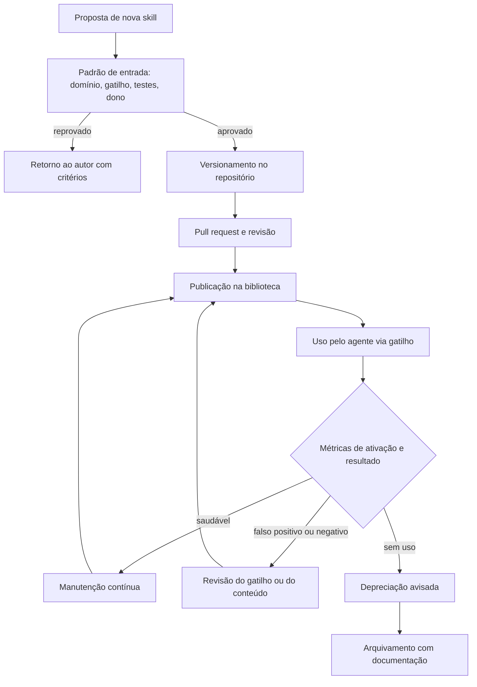

# Capítulo 11: Manutenção de bibliotecas de skills: ciclo de vida, versionamento e testes

## 1. Introdução

No capítulo anterior, você aprendeu a anatomia de uma skill — SKILL.md, disclosure progressiva e gatilhos — e a diferença entre construir a sua ou adotar uma comunitária [2]. Mas uma skill é um artefato de software: nasce, muda e morre [1]. Este capítulo trata do ciclo de vida completo de uma biblioteca de skills: versionamento, testes, revisão e aposentadoria [1].

Este capítulo tem três objetivos. Primeiro, dominar o ciclo de vida de uma skill individual, da criação à desativação [1]. Segundo, desenhar a governança de uma biblioteca inteira: padrões de qualidade, revisão e evolução compatível [8]. Terceiro, conectar as skills ao restante do harness — porque uma skill que o agente não carrega no momento certo vale menos que uma documentação simples [20].

## 2. Explica

### 2.1 O ciclo de vida de uma skill

Toda skill passa por estágios: criação, uso, revisão e aposentadoria [1]. A especificação do formato define os elementos obrigatórios — frontmatter, descrição de ativação e o corpo com instruções — e é sobre eles que o ciclo de vida opera [1]. A disciplina central: cada estágio tem um gatilho explícito, e nenhuma skill fica órfã em produção [1].

### 2.2 Versionamento: a skill como código

Uma skill vive em um repositório, versionada como qualquer código [16]. A prática recomendada: mudanças passam por pull request, a descrição de ativação muda exige revisão dupla (porque afeta o disparo) e cada versão registra o que mudou [16]. A compatibilidade é a regra de ouro: atualizar uma skill não deve quebrar os fluxos que a usam [15].

### 2.3 Testes de skill: o que validar

Uma skill precisa de testes em dois níveis: o teste da estrutura (frontmatter válido, descrição presente, corpo sem conteúdo vazio) e o teste de comportamento (a skill, acionada no contexto certo, produz o resultado esperado) [2]. A indústria está formalizando esse processo: avaliações padronizadas de tarefas — como as suítes de benchmark do campo — medem se a skill melhora o resultado do agente [9][14]. Sem teste, uma skill é uma promessa [2].

### 2.4 A governança da biblioteca

Uma biblioteca de skills é um produto: tem padrão de entrada, revisão e manutenção [8]. O padrão de entrada responde "o que entra": domínio claro, gatilho preciso, conteúdo testado e dono declarado [1]. A revisão periódica responde "o que sai": skill sem uso, sem dono ou com gatilho errado é candidata à aposentadoria [1][16].

### 2.5 A evolução compatível e a descontinuação

A evolução de uma skill segue o mesmo cuidado de uma API: mudanças incrementais, depreciação avisada e migração assistida [15]. Quando uma skill morre, o processo é explícito: aviso, período de coexistência e arquivamento com documentação [16]. O objetivo é que nenhum fluxo dependente quebre sem aviso [15].

### 2.6 A skill no harness: carregada no momento certo

A skill só vale se o agente a carrega na hora certa [20]. O harness decide o carregamento — e a descrição de ativação é o contrato dessa decisão [1]. Uma biblioteca madura revisa os gatilhos como parte da manutenção: skill que dispara demais (falso positivo) e skill que nunca dispara (falso negativo) são as duas falhas clássicas de ativação [1][20].

## 3. Ilustra

### 3.1 A analogia da biblioteca física com catálogo

Pense em uma biblioteca física: os livros (skills) só valem se alguém os encontra no momento da dúvida [1]. O catálogo (as descrições de ativação) precisa ser preciso: um livro classificado errado nunca é consultado [1]. E a biblioteca tem um bibliotecário (o harness) que decide o que levar para a mesa de leitura — e devolve o que não é mais usado [20]. A biblioteca madura revisa o acervo todo ano: compra, conserta e descarta [1].



### 3.2 O acervo que se mantém vivo

O ciclo mostra a diferença entre guardar e manter: a biblioteca não acumula livros — cultiva um acervo que serve [1]. É o mesmo critério de poda que você viu na memória do projeto no Livro 5, aplicado às skills [1].

## 4. Técnica

### 4.1 O validador de estrutura de skill

O exemplo abaixo valida o frontmatter e a descrição de ativação — o primeiro teste de qualquer skill [1][1]:

```python
import re
from pathlib import Path


def validar_skill(caminho: Path) -> list[str]:
    erros = []
    texto = caminho.read_text(encoding="utf-8")
    if not texto.startswith("---"):
        erros.append("frontmatter ausente")
        return erros
    m = re.search(r"(?ms)^---\n(.*?)\n---", texto)
    frontmatter = m.group(1) if m else ""
    if "name:" not in frontmatter:
        erros.append("campo name ausente")
    if "description:" not in frontmatter:
        erros.append("campo description ausente")
    if len(texto) < 200:
        erros.append("corpo da skill muito curto")
    return erros


for skill in Path("skills").glob("*/SKILL.md"):
    print(skill.parent.name, validar_skill(skill))
```

O validador roda no CI e impede que skills quebradas entrem na biblioteca [1].

### 4.2 O detector de gatilho vago

O trecho abaixo sinaliza descrições de ativação vagas — o sintoma clássico do falso positivo e do falso negativo [1]:

```python
PALAVRAS_VAGAS = {"ajuda", "informação", "coisas", "diversos", "talvez"}


def diagnosticar_gatilho(descricao: str) -> dict:
    vago = [p for p in PALAVRAS_VAGAS if p in descricao.lower()]
    especifico = len(descricao.split()) >= 12
    return {"vago": bool(vago), "termos_vagos": vago, "especifico": especifico}
```

Uma descrição que não diz quando ativar não ativa nunca — ou ativa sempre [1].

### 4.3 O registro de uso e aposentadoria

Para fechar, a medição que decide a vida da skill: uso real, resultado e o gatilho da depreciação [1][16]:

```python
def decidir_ciclo(skill, uso_90_dias: int, taxa_falha: float) -> str:
    if uso_90_dias == 0:
        return "aposentar: sem uso"
    if taxa_falha > 0.4:
        return "revisar: taxa de falha alta"
    if uso_90_dias < 5:
        return "observar: uso marginal"
    return "manter"


print(decidir_ciclo("skill_pdf", uso_90_dias=2, taxa_falha=0.1))
```

A decisão é objetiva — e a objetividade é o que falta quando a biblioteca cresce sem critério [16].

## 5. Aplica

### 5.1 Onde isso vive no mundo real

Na prática, a manutenção de skills aparece nas organizações que tratam o conhecimento como produto [8]. O repositório de skills com CI, a revisão de gatilhos e as métricas de uso são a norma em times maduros [1][8]. E a tendência é de infraestrutura: gerenciadores de pacotes de skills e mercados abertos padronizam publicação e instalação [15][19].

### 5.2 O erro comum do iniciante

O erro clássico é publicar uma skill sem gatilho testado — e descobrir, meses depois, que ela nunca foi acionada [1]. O segundo erro é a biblioteca-cemitério: skills antigas sem dono, sem uso e sem revisão ocupando espaço no catálogo [1]. O caminho profissional: padrão de entrada, teste de estrutura e comportamento, métricas de ativação e depreciação explícita [1][16].

## 6. Conclusão

Uma skill é um artefato de software, e uma biblioteca é um produto [1][8]. Você aprendeu o ciclo de vida completo — versionamento, testes, governança e aposentadoria — e a medir o que decide a vida de cada skill [1][16]. No próximo capítulo, essa infraestrutura ganha números: a medição de ativação, qualidade e retorno do investimento de uma biblioteca inteira [1].


## 7. Referências

[1] AGENTSKILLS.IO. *Agent Skills Specification*. Disponível em: https://agentskills.io/specification. Acesso em: 06 ago. 2026.
[2] ANTHROPIC. *Agent Skills — Claude Platform Docs*. Disponível em: https://platform.claude.com/docs/en/agents-and-tools/agent-skills/overview. Acesso em: 06 ago. 2026.
[3] ANTHROPIC. *Claude Code Skills Documentation*. Disponível em: https://code.claude.com/docs/en/skills. Acesso em: 06 ago. 2026.
[4] BUI, et al. *Building AI Coding Agents for the Terminal: Scaffolding, Harness, Context Engineering, and Lessons Learned*. Disponível em: https://arxiv.org/abs/2603.05344. Acesso em: 06 ago. 2026.
[5] CODINGSCAPE. *How Anthropic Engineering Teams Use Claude Code Every Day*. Disponível em: https://codingscape.com/blog/how-anthropic-engineering-teams-use-claude-code-every-day. Acesso em: 06 ago. 2026.
[6] FIRECRAWL. *Best Claude Code Skills to Try*. Disponível em: https://www.firecrawl.dev/blog/best-claude-code-skills. Acesso em: 06 ago. 2026.
[7] GETDX. *AI Code Generation: Best Practices for Enterprise Adoption*. Disponível em: https://getdx.com/blog/ai-code-enterprise-adoption/. Acesso em: 06 ago. 2026.
[8] MA, Zhiyuan; LIU, Jiayu; LUO, Xianzhen; HUANG, Zhenya; ZHU, Qingfu; CHE, Wanxiang. *Tool-MVR: Meta-Verification and Reflection Learning for Reliable Tool-Use*. Disponível em: https://arxiv.org/abs/2506.04625. Acesso em: 06 ago. 2026.
[9] SWEBENCH. *SWE-bench Verified & Pro*. Disponível em: https://www.swebench.com. Acesso em: 06 ago. 2026.
[10] VERCEL LABS. *Skills — package manager for agent skills*. Disponível em: https://github.com/vercel-labs/skills. Acesso em: 06 ago. 2026.
[11] VINCENT, Jesse (obra). *Superpowers — engineering skills for agents*. Disponível em: https://github.com/obra/superpowers. Acesso em: 06 ago. 2026.
[12] XU, Renjun; YAN, Yang. *Agent Skills for Large Language Models: Architecture, Acquisition, Security, and the Path Forward*. Disponível em: https://arxiv.org/abs/2602.12430. Acesso em: 06 ago. 2026.
[13] ZHANG, et al. *Code as Agent Harness: Toward Executable, Verifiable, and Stateful Agent Systems*. Disponível em: https://arxiv.org/abs/2605.18747. Acesso em: 06 ago. 2026.
[14] *Stop Comparing LLM Agents Without Disclosing the Harness*. Disponível em: https://arxiv.org/abs/2605.23950. Acesso em: 06 ago. 2026.
[15] ANTHROPIC. *Effective Harnesses for Long-Running Agents*. Disponível em: https://www.anthropic.com/engineering/effective-harnesses-for-long-running-agents. Acesso em: 06 ago. 2026.
[16] ANTHROPIC. *Claude Code SDK — Slash Commands*. Disponível em: https://code.claude.com/docs/en/agent-sdk/slash-commands. Acesso em: 06 ago. 2026.
[17] VSCODE. *VS Code Agent Skills Documentation*. Disponível em: https://code.visualstudio.com/docs/agent-customization/agent-skills. Acesso em: 06 ago. 2026.
[18] CURSOR. *Cursor Rules Documentation*. Disponível em: https://cursor.com/docs/rules. Acesso em: 06 ago. 2026.
[19] VERCEL LABS. *skills.sh — open marketplace*. Disponível em: https://skills.sh. Acesso em: 06 ago. 2026.
[20] DU, Pengfei. *Memory for Autonomous LLM Agents: Mechanisms, Evaluation, and Emerging Frontiers*. Disponível em: https://arxiv.org/abs/2603.07670. Acesso em: 06 ago. 2026.
