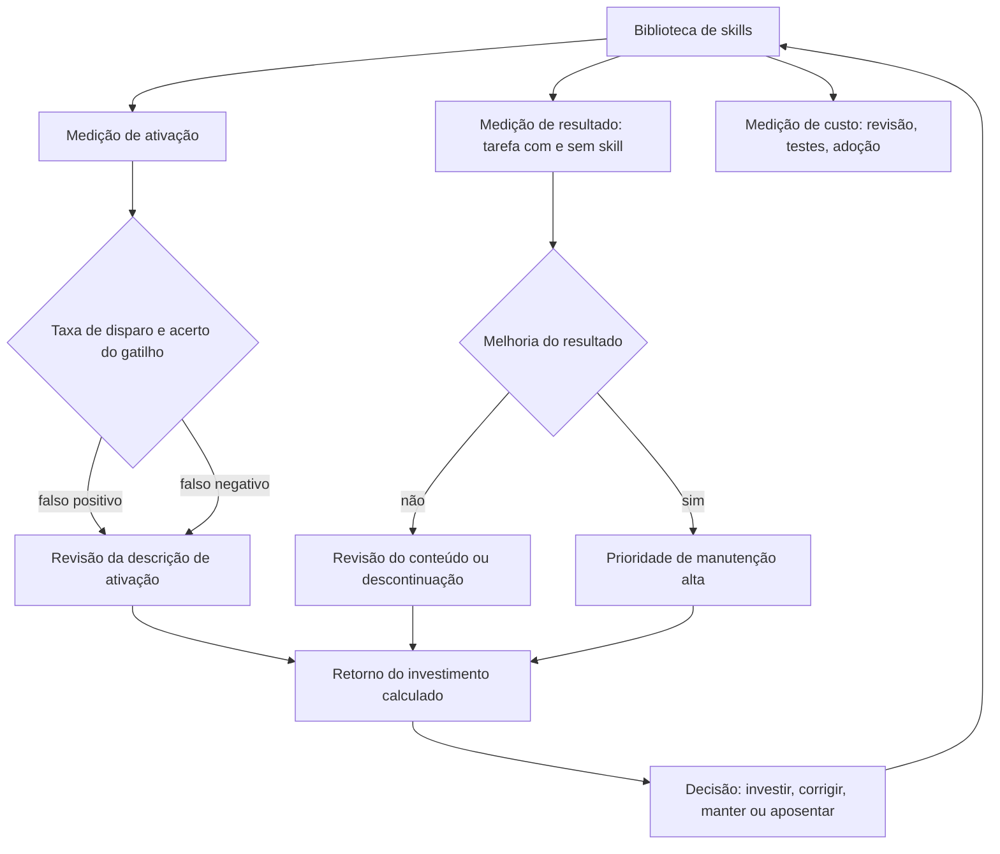

# Capítulo 12: Medindo skills: ativação, qualidade e o retorno do investimento

## 1. Introdução

No capítulo anterior, você estruturou o ciclo de vida das skills [1]. Este capítulo responde a pergunta que todo mantenedor faz: vale a pena? Medir skills é diferente de medir código — o valor não está no arquivo, está no momento em que o agente o carrega e no resultado que a tarefa entrega [1]. Este capítulo constrói o painel de métricas de uma biblioteca de skills: ativação, qualidade e retorno [6].

Este capítulo tem três objetivos. Primeiro, definir as métricas de ativação: taxa de disparo, falso positivo e falso negativo [1]. Segundo, medir a qualidade: resultado das tarefas com e sem a skill, no estilo dos benchmarks do campo [1]. Terceiro, calcular o retorno do investimento — o argumento que transforma a biblioteca de hobby em infraestrutura [8].

## 2. Explica

### 2.1 A taxa de ativação: a primeira métrica

A taxa de ativação mede o comportamento do gatilho: de cada cem tarefas candidatas, quantas acionaram a skill [1]. A medição em dois cortes — falso positivo (ativou sem necessidade) e falso negativo (deveria ativar e não ativou) — diagnostica a qualidade da descrição [1]. Uma skill com ativação saudável é a que acerta o momento [1].

### 2.2 A medição de resultado: com e sem a skill

O teste mais honesto é o contrafactual: a mesma tarefa com e sem a skill [1]. Os benchmarks do campo padronizaram esse desenho — suítes de tarefas reais, avaliadas automaticamente — e a biblioteca madura usa o mesmo espírito [1]. A comparação responde a pergunta de valor: a skill melhora o resultado? [9].

### 2.3 A qualidade da skill: do estrutura ao comportamento

A qualidade tem dois níveis mensuráveis: a estrutura (frontmatter válido, disclosure progressiva respeitada, instruções completas) e o comportamento (o resultado esperado no contexto certo) [6][2]. A pesquisa do campo formalizou as dimensões de avaliação de skills — arquitetura, aquisição e segurança — e a manutenção prática converte essas dimensões em checklist de revisão [17].

### 2.4 A divulgação honesta: o harness no resultado

Uma lição importante da medição: o resultado mede o sistema, não só a skill [4]. A pesquisa do campo alerta que comparar agentes sem divulgar o harness é enganoso — e o mesmo vale para comparar skills [19]. A biblioteca madura documenta o contexto da medição: modelo, harness, conjunto de tarefas e critérios [19].

### 2.5 O retorno do investimento: do custo ao valor

O retorno da biblioteca tem três componentes: o custo de manutenção (revisão, testes, correção), o custo de adoção (aprendizado, integração) e o valor gerado (tarefas mais rápidas, erros evitados, conhecimento retido) [8]. A fórmula prática: o tempo economizado pelo agente menos o tempo gasto mantendo a skill — projetado no volume de tarefas [8]. O resultado muda a conversa de "bonito" para "compensou" [8].

### 2.6 O painel contínuo: medir para governar

A medição não é um relatório: é um painel contínuo que alimenta as decisões de ciclo de vida do capítulo anterior [1]. As métricas de ativação alimentam a revisão de gatilhos; as métricas de resultado alimentam a prioridade de manutenção; e o retorno alimenta o investimento futuro [1]. A biblioteca vira um sistema medido, não uma coleção de boas intenções [1].

## 3. Ilustra

### 3.1 A analogia do caixa eletrônico da agência

Pense no caixa eletrônico de uma agência: cada tela (skill) só aparece no fluxo certo — você não vê "transferência" na tela de saque [1]. O banco mede tudo: quantas vezes cada tela é usada, quantas operações terminam em erro e quanto tempo cada fluxo economiza [8]. Se uma tela nunca é usada, o banco a redesenha ou remove; se uma tela aumenta o erro, o banco a corrige primeiro [1]. O caixa eletrônico não é uma coleção de telas — é um sistema medido [8].



### 3.2 A agência que decide com números

O ciclo mostra o sistema completo de governança por métricas: toda decisão sobre uma skill — manter, corrigir ou aposentar — sai de um número, não de uma impressão [1][8]. É a mesma disciplina de medição que a série vem construindo desde a avaliação de prompts no Livro 2 [1].

## 4. Técnica

### 4.1 O painel de ativação

O exemplo abaixo calcula as métricas de ativação a partir do registro de execução [1]:

```python
def metricas_ativacao(registros, skill):
    acionamentos = [r for r in registros if r["skill"] == skill]
    candidatos = [r for r in registros if r["candidata"] == skill]
    falsos_positivos = [r for r in acionamentos if r["necessaria"] is False]
    falsos_negativos = [r for r in candidatos if r["acionada"] is False]
    total_candidatos = len(candidatos) + len(falsos_positivos)
    taxa = round(len(acionamentos) / max(total_candidatos, 1), 3)
    return {
        "taxa_disparo": taxa,
        "falsos_positivos": len(falsos_positivos),
        "falsos_negativos": len(falsos_negativos),
    }
```

Os dois cortes — positivo e negativo — contam a história completa do gatilho [1].

### 4.2 O teste contrafactual de resultado

O trecho abaixo compara a tarefa com e sem a skill — o experimento de valor [1]:

```python
def medir_impacto(skill, tarefas, executar):
    com_skill, sem_skill = 0, 0
    for tarefa in tarefas:
        sem_skill += executar(tarefa, skills=[])
        com_skill += executar(tarefa, skills=[skill])
    return {
        "sem_skill": round(sem_skill / len(tarefas), 3),
        "com_skill": round(com_skill / len(tarefas), 3),
        "ganho": round((com_skill - sem_skill) / len(tarefas), 3),
    }
```

Se o ganho é próximo de zero, a skill não está entregando o que promete [1].

### 4.3 O cálculo do retorno do investimento

Para fechar, o número que decide o orçamento: custo versus valor, projetado no volume de tarefas [8]:

```python
def retorno_investimento(horas_manutencao, tarefas_mensais, economia_por_tarefa, custo_hora):
    custo_mensal = horas_manutencao * custo_hora
    valor_mensal = tarefas_mensais * economia_por_tarefa
    return {
        "custo_mensal": custo_mensal,
        "valor_mensal": valor_mensal,
        "retorno": round(valor_mensal / max(custo_mensal, 1), 2),
    }


print(retorno_investimento(8, 400, 0.05, 60.0))
```

Um retorno abaixo de 1 significa que a skill custa mais do que economiza — e a decisão fica clara [8].

## 5. Aplica

### 5.1 Onde isso vive no mundo real

Na prática, a medição de skills aparece nas organizações que sustentam bibliotecas grandes: o painel de ativação alimenta a revisão de gatilhos, o teste contrafactual prioriza manutenção e o retorno justifica orçamento [1][8]. A indústria está convergindo para um padrão: benchmark de tarefas, disclosure do harness e métricas públicas [1][19]. E a memória — a camada que você viu no Livro 5 — volta aqui: skills são memória empacotada, e memória se mede [5].

### 5.2 O erro comum do iniciante

O erro clássico é medir só a criação: quantas skills a biblioteca tem — o número que cresce e não diz nada [1]. O segundo erro é medir o resultado sem contexto: comparar com e sem skill em tarefas diferentes, ou sem divulgar o harness [19]. O caminho profissional: ativação com os dois cortes, contrafactual com tarefas fixas e retorno com custo real [1][8].

## 6. Conclusão

Medir é a diferença entre uma biblioteca e um acervo [1][8]. Você aprendeu as métricas de ativação, o teste contrafactual de resultado e o cálculo de retorno que decide o investimento [1][8]. Com a medição instalada, a camada de skills fecha o ciclo de valor da pilha — e o próximo livro sobe para os guardrails: hooks, config e a governança que torna toda essa autonomia segura [4].


## 7. Referências

[1] SWEBENCH. *SWE-bench Verified & Pro*. Disponível em: https://www.swebench.com. Acesso em: 06 ago. 2026.
[2] MA, Zhiyuan; LIU, Jiayu; LUO, Xianzhen; HUANG, Zhenya; ZHU, Qingfu; CHE, Wanxiang. *Tool-MVR: Meta-Verification and Reflection Learning for Reliable Tool-Use*. Disponível em: https://arxiv.org/abs/2506.04625. Acesso em: 06 ago. 2026.
[3] XU, Renjun; YAN, Yang. *Agent Skills for Large Language Models: Architecture, Acquisition, Security, and the Path Forward*. Disponível em: https://arxiv.org/abs/2602.12430. Acesso em: 06 ago. 2026.
[4] *Stop Comparing LLM Agents Without Disclosing the Harness*. Disponível em: https://arxiv.org/abs/2605.23950. Acesso em: 06 ago. 2026.
[5] ANTHROPIC. *Effective Harnesses for Long-Running Agents*. Disponível em: https://www.anthropic.com/engineering/effective-harnesses-for-long-running-agents. Acesso em: 06 ago. 2026.
[6] AGENTSKILLS.IO. *Agent Skills Specification*. Disponível em: https://agentskills.io/specification. Acesso em: 06 ago. 2026.
[7] ANTHROPIC. *Agent Skills — Claude Platform Docs*. Disponível em: https://platform.claude.com/docs/en/agents-and-tools/agent-skills/overview. Acesso em: 06 ago. 2026.
[8] ANTHROPIC. *Claude Code Skills Documentation*. Disponível em: https://code.claude.com/docs/en/skills. Acesso em: 06 ago. 2026.
[9] FANG, Gaodan; ISAHAGIAN, Vatche; JAYARAM, K. R.; KUMAR, Ritesh; MUTHUSAMY, Vinod; OUM, Punleuk; THOMAS, Gegi. *Trajectory-Informed Memory Generation for Self-Improving Agent Systems*. Disponível em: https://arxiv.org/abs/2603.10600. Acesso em: 06 ago. 2026.
[10] KRISHNAN, Naveen. *Advancing Multi-Agent Systems Through Model Context Protocol*. Disponível em: https://arxiv.org/abs/2504.21030. Acesso em: 06 ago. 2026.
[11] MEDIUM (HEEKI PARK). *Collaborating with Agent Teams in Claude Code*. Disponível em: https://heeki.medium.com/collaborating-with-agents-teams-in-claude-code-f64a465f3c11. Acesso em: 06 ago. 2026.
[12] OPENAI. *Custom Instructions with AGENTS.md*. Disponível em: https://learn.chatgpt.com/docs/agent-configuration/agents-md. Acesso em: 06 ago. 2026.
[13] RUCAIBOX. *Awesome Agent Harness*. Disponível em: https://github.com/RUCAIBox/awesome-agent-harness. Acesso em: 06 ago. 2026.
[14] *Natural-Language Agent Harnesses (NLAHs)*. Disponível em: https://arxiv.org/abs/2603.25723. Acesso em: 06 ago. 2026.
[15] FLORIANBRUNIAUX. *Claude Code Ultimate Guide — Agent Teams*. Disponível em: https://github.com/FlorianBruniaux/claude-code-ultimate-guide. Acesso em: 06 ago. 2026.
[16] WINDSURF (CODEIUM). *Windsurf Documentation*. Disponível em: https://codeium.com/windsurf. Acesso em: 06 ago. 2026.
[17] YANG, Chang; ZHOU, Chuang; XIAO, Yilin; et al. *Graph-based Agent Memory: Taxonomy, Techniques, and Applications*. Disponível em: https://arxiv.org/abs/2602.05665. Acesso em: 06 ago. 2026.
[18] CODINGSCAPE. *How Anthropic Engineering Teams Use Claude Code Every Day*. Disponível em: https://codingscape.com/blog/how-anthropic-engineering-teams-use-claude-code-every-day. Acesso em: 06 ago. 2026.
[19] GETDX. *AI Code Generation: Best Practices for Enterprise Adoption*. Disponível em: https://getdx.com/blog/ai-code-enterprise-adoption/. Acesso em: 06 ago. 2026.
[20] FIRECRAWL. *Best Claude Code Skills to Try*. Disponível em: https://www.firecrawl.dev/blog/best-claude-code-skills. Acesso em: 06 ago. 2026.
