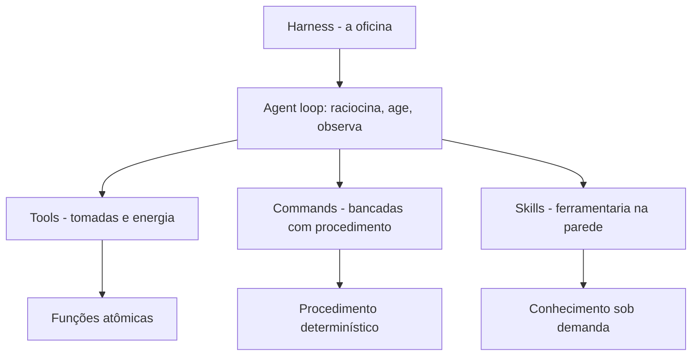

# Capítulo 2: Harness, skills e commands — a anatomia da oficina

## 1. Introdução

No Capítulo 1, você aprendeu por que todo agente esquece tudo: o conhecimento não empacotado vive em estado gasoso e se dissipa a cada sessão. Agora você vai subir um andar na oficina e olhar para a estrutura que decide se esse conhecimento chega ao agente na hora certa: o harness. É a camada de software que envolve o modelo de linguagem e o transforma em agente operacional — e é dentro dela que skills e commands ganham o seu lugar de destaque.

Ao final deste capítulo, você será capaz de desenhar a anatomia da sua própria oficina: identificar onde mora o loop do agente, onde as ferramentas se conectam, onde as skills são carregadas e onde os commands são disparados. Essa planta baixa é o mapa que orienta tudo o que vem a seguir — desde a construção de uma skill, no Capítulo 3, até a orquestração com MCP e memória, no Capítulo 9.

## 2. Explica

### O harness como controlador de malha fechada

Um modelo de linguagem, sozinho, é uma política estocástica de geração de texto: ele recebe uma sequência e produz a próxima. Não executa código, não lê arquivos, não conversa com uma API. O harness é a camada que fecha essa malha: ele intercala raciocínio, ação, observação do resultado e refinamento — o ciclo que a literatura chama de *agent loop* [1]. Na prática corporativa, a mesma lição aparece: agentes bem-sucedidos são avaliados pelo que conseguem entregar em bases de código reais, como demonstra o padrão SWE-bench [15]. E a curadoria da área de harness engineering já mapeia esse ecossistema inteiro em repositórios de referência que consolidam papers e ferramentas [14].

A metáfora de malha fechada não é decorativa. Sistemas que tratam o agente como "um prompt que chama funções" subestimam o quanto do comportamento observável vem do harness — da configuração de contexto, das ferramentas disponíveis, do scaffolding montado antes do primeiro prompt [2]. A pesquisa recente é explícita: a variação de desempenho entre agentes é dominada pelo harness, não pelo modelo base [3].

### Por que o modelo não basta: a origem do harness

A história do harness começa com uma observação incômoda: o mesmo modelo, em harnesses diferentes, se comporta como agentes muito diferentes. Não é mágica — é engenharia de contexto. O harness decide o que o modelo vê (o system prompt, o histórico, as ferramentas), o que ele pode fazer (as permissões) e o que acontece quando ele erra (a realimentação do erro). Essa camada é tão determinante que a pesquisa passou a tratar a descrição do harness como parte obrigatória de qualquer avaliação de agente [3].

A consequência prática para você, Engenheiro Agêntico, é dupla. Primeiro, quando um agente "não funciona", o problema está frequentemente no harness — no que faltou injetar, no que faltou permitir, no que faltou ensinar — e não no modelo. Segundo, o harness é o seu terreno de atuação: é nele que você empacota conhecimento, define procedimentos e controla o ambiente. A oficina é sua.

### A separação entre scaffolding e execução

Antes de qualquer tarefa, o harness monta a infraestrutura estática: o system prompt, o registro de ferramentas, as habilidades disponíveis, as regras do projeto. Isso é o *scaffolding*. Durante a tarefa, o harness governa o comportamento dinâmico: o que entra no contexto, quando um subagente é instanciado, como o erro de um comando realimenta a decisão [2]. Essa separação é o que permite que o conhecimento fique organizado em camadas — e é a chave para entender onde skills e commands se encaixam.

### Tools, commands e skills: as três camadas da ferramentaria

O harness organiza as capacidades do agente em três camadas. A base são as **tools**: funções atômicas de baixo nível — ler arquivo, rodar comando bash, consultar uma API — que o modelo pode invocar diretamente. Acima delas vêm os **commands**: procedimentos de alto nível que encapsulam fluxos completos e podem ser disparados pelo operador (ou pelo modelo) por um nome curto. E na camada de conhecimento vêm as **skills**: pacotes de instruções, scripts e referências carregados sob demanda, que ensinam o agente a executar tarefas de domínio específico sem ocupar a janela de contexto permanentemente [4].

A distinção prática entre skills e commands é simples de lembrar: skills respondem à pergunta "o que o agente precisa saber para fazer bem essa tarefa?", enquanto commands respondem a "que sequência de ações deve acontecer quando eu disparar esse procedimento?". Um command é um fluxo determinístico; uma skill é um corpo de conhecimento. Os dois se complementam: um command de deploy pode invocar a skill que documenta as convenções do projeto. Na prática dos harnesses reais, essa distinção aparece na própria estrutura de arquivos: commands vivem em um diretório de comandos, skills em um diretório de skills, e as ferramentas de cada plataforma documentam os dois caminhos [12]. No Claude Code, por exemplo, os comandos de barra expõem mecanismos de autocomplete e injeção de argumentos diretamente na interface — um bom caso de estudo do que um command pode oferecer ao operador [13].

## 3. Ilustra

Volte comigo à oficina do Engenheiro Agêntico. O harness é a própria oficina: as paredes, o sistema de energia, o chão marcado onde cada estação de trabalho fica. Sem a oficina, o operário (o modelo) tem as mãos e o conhecimento geral, mas não tem onde encaixar nada — não há bancada, não há tomada, não há esteira.

Dentro da oficina, as **tools** são as conexões de energia e as tomadas: cabem em qualquer lugar, são padronizadas e o operário as usa a todo momento. Os **commands** são as bancadas com procedimento gravado: cada uma tem um nome na porta (`/deploy`, `/review`), um manual fixo afixado na parede e um resultado esperado — o operário não decide o que fazer, apenas executa o procedimento gravado e confere o resultado. As **skills** são as ferramentas penduradas na parede da ferramentaria: cada uma com sua etiqueta, seu manual e seus acessórios; o operário só puxa a ferramenta quando o serviço exige.



O vocabulário da oficina volta a serviço: quando um capítulo falar em "puxar a ferramenta da parede", está falando de carregar uma skill; quando falar em "gravar o procedimento na bancada", está falando de criar um command. Mantenha esse mapa mental — ele atravessa a obra inteira e evita que você confunda as camadas na hora de decidir onde o conhecimento deve morar.

## 4. Técnica

### Modelando o harness como um objeto

A melhor forma de internalizar a anatomia é modelá-la em código. A classe abaixo representa o harness com suas três camadas e implementa o esqueleto do agent loop: o modelo raciocina, escolhe uma ação, o harness executa e realimenta a observação.

```python
# -*- coding: utf-8 -*-
"""Modelo simplificado do harness com tools, commands e skills."""


class Harness:
    """Camada que envolve o modelo e fecha o agent loop."""

    def __init__(self, modelo):
        self.modelo = modelo
        self.tools = {}      # nome -> funcao atomica
        self.commands = {}   # nome -> fluxo determinístico
        self.skills = {}     # nome -> pacote de conhecimento

    def registrar_tool(self, nome, funcao):
        self.tools[nome] = funcao

    def registrar_command(self, nome, fluxo):
        self.commands[nome] = fluxo

    def registrar_skill(self, nome, carregar):
        self.skills[nome] = carregar

    def executar_acao(self, acao):
        """Intercepta a chamada do modelo e a executa no ambiente."""
        tipo = acao["tipo"]
        if tipo == "tool":
            fn = self.tools[acao["nome"]]
            return fn(**acao["args"])
        if tipo == "command":
            fluxo = self.commands[acao["nome"]]
            return fluxo.executar(acao["args"])
        if tipo == "skill":
            carregar = self.skills[acao["nome"]]
            return carregar(acao["args"])
        raise ValueError(f"Acao desconhecida: {tipo}")

    def rodar(self, pergunta: str) -> str:
        """Loop: raciocina -> age -> observa -> repete ate concluir."""
        contexto = [{"role": "user", "content": pergunta}]
        for _ in range(20):
            resposta = self.modelo.raciocinar(contexto)
            if resposta.get("final"):
                return resposta["final"]
            observacao = self.executar_acao(resposta["acao"])
            contexto.append({"role": "observation", "content": observacao})
        return "limite de iteracoes atingido"
```

O ponto técnico que vale destacar: o `executar_acao` é o coração do harness. É ali que a tool é chamada com os argumentos validados, que o command executa o fluxo completo e que a skill entrega o conhecimento — e é ali também que o erro volta ao modelo como observação, permitindo a autocorreção [5].

### Um command mínimo na prática

Um command, no harness, é um objeto com nome e fluxo. A implementação abaixo mostra o formato mínimo que o harness espera: um procedimento determinístico que pode ser disparado pelo operador com um argumento.

```python
# -*- coding: utf-8 -*-
"""Representacao de um command como procedimento determinístico."""


class Command:
    """Procedimento de alto nivel disparavel por nome."""

    def __init__(self, nome: str, descricao: str, passos):
        self.nome = nome
        self.descricao = descricao
        self.passos = passos

    def executar(self, argumentos):
        """Executa os passos em sequencia e devolve o log."""
        log = []
        for passo in self.passos:
            log.append(f"[{self.nome}] {passo['nome']}: "
                       f"{passo['acao'](argumentos)}")
        return "\n".join(log)


def passo(nome, acao):
    return {"nome": nome, "acao": acao}
```

O detalhe importante é a fronteira de responsabilidade: o command decide a sequência, mas cada passo dele continua sendo uma tool. Um command de deploy não reinventa a forma de rodar um build — ele orquestra as tools existentes numa ordem determinística, com validação entre os passos.

### Integrando o conhecimento via MCP

Quando o conhecimento precisa acessar dados e ferramentas externas, o harness se conecta via Model Context Protocol — um padrão cliente-servidor que padroniza a troca de ferramentas, recursos e prompts entre o agente e serviços externos [6]. Na anatomia da oficina, o MCP é a fiação que liga a oficina ao mundo exterior: sem ele, cada ferramenta externa precisaria de um conector proprietário; com ele, um padrão único. A especificação aberta de agent skills, inclusive, assume o MCP como um dos canais de aquisição e uso de habilidades — a fronteira entre os dois padrões é complementar, não concorrente [16].

```python
# -*- coding: utf-8 -*-
"""Exemplo conceitual de conexao de uma skill a um servidor MCP."""


class ServidorMCP:
    """Fachada do protocolo: expoe tools e resources para o harness."""

    def __init__(self, nome: str, tools: dict):
        self.nome = nome
        self._tools = tools

    def listar_tools(self):
        return list(self._tools.keys())

    def chamar_tool(self, nome_tool: str, argumentos: dict):
        if nome_tool not in self._tools:
            raise ValueError(f"tool {nome_tool} nao existe em {self.nome}")
        return self._tools[nome_tool](argumentos)
```

O harness descobre os servidores MCP disponíveis, expõe as tools deles ao modelo e roteia as chamadas — tudo com trilha de auditoria e controle de permissão, o que torna o MCP o caminho natural para dados sensíveis em ambientes corporativos [7].

### O registro de ferramentas como inventário da oficina

O harness mantém um inventário único do que está disponível — tools nativas, commands registrados, skills instaladas e servidores MCP conectados. Esse inventário é a fonte do catálogo que o modelo consulta a cada decisão de ação, e a sua manutenção é uma tarefa de engenharia: cada entrada deve ter nome, descrição e formato de argumentos coerentes com o restante. Um inventário com nomes ambíguos ou descrições genéricas degrada a qualidade de todas as decisões do agente — o catálogo é a memória operacional do harness.

```python
# -*- coding: utf-8 -*-
"""Inventario unificado de tools, commands e skills do harness."""
import json


class Inventario:
    """Catalogo unico de capacidades disponiveis ao modelo."""

    def __init__(self):
        self.entradas = []

    def adicionar(self, tipo: str, nome: str, descricao: str):
        self.entradas.append({"tipo": tipo, "nome": nome, "descricao": descricao})

    def buscar(self, texto: str) -> list[dict]:
        """Busca no catalogo por nome ou descricao."""
        texto = texto.lower()
        return [e for e in self.entradas if texto in e["nome"].lower()
                or texto in e["descricao"].lower()]

    def resumo(self) -> dict:
        tipos = {}
        for e in self.entradas:
            tipos[e["tipo"]] = tipos.get(e["tipo"], 0) + 1
        return tipos


if __name__ == "__main__":
    inv = Inventario()
    inv.adicionar("tool", "ler_arquivo", "Le o conteudo de um arquivo")
    inv.adicionar("command", "revisar-pr", "Revisa pull requests no padrao da equipe")
    inv.adicionar("skill", "documentar-api", "Gera e revisa documentacao de APIs REST")
    print(json.dumps(inv.resumo(), ensure_ascii=False))
    print([e["nome"] for e in inv.buscar("revisar")])
```

O inventário é o elo entre o desenho conceitual das três camadas e a operação real: é ele que o modelo consulta, e é ele que a equipe audita quando um comportamento inesperado aparece. Manter o inventário limpo é a primeira tarefa de governança do harness.

### O ciclo do agente em detalhe

O agent loop merece um olhar mais fino, porque é onde a teoria vira comportamento. O ciclo completo tem cinco passos: o harness monta o contexto inicial (scaffolding), o modelo raciocina e propõe uma ação, o harness valida e executa a ação (tool, command ou skill), a observação do resultado volta ao contexto, e o modelo decide o próximo passo. O erro de qualquer passo — esquema inválido, comando com permissão negada, skill com gatilho errado — entra na observação e alimenta a próxima decisão [5].

```python
# -*- coding: utf-8 -*-
"""Os cinco passos do agent loop com tratamento de erro."""


def passo_do_loop(harness, modelo, contexto, max_passos=10):
    """Executa o loop ate concluir ou atingir o limite de passos."""
    for passo in range(max_passos):
        acao = modelo.propor_acao(contexto)
        if acao is None:
            return contexto
        try:
            observacao = harness.executar(acao)
        except ValueError as erro:
            observacao = f"ERRO: {erro}"
        contexto.append(observacao)
    return contexto
```

O detalhe que separa um harness profissional de um brinquedo: o tratamento de erro no loop. Um passo que falha não deve encerrar a sessão — deve virar observação, para que o modelo tente outra abordagem. É assim que agentes de produção lidam com falhas: elas são dados do loop, não exceções fatais [12]. Organizações que padronizam a documentação de contexto em arquivos como o AGENTS.md relatam agentes mais precisos desde o primeiro dia — a mesma lógica de deixar o mapa da oficina afixado na parede [14].

## 5. Aplica

### A cena da skill que não foi chamada

Imagine a cena, em segunda pessoa. Você está no meio de um projeto com dezenas de skills já instaladas — o catálogo da ferramentaria está cheio. Você pede ao agente para gerar um relatório de conformidade de segurança, e ele responde com um texto genérico, ignorando por completo a skill de auditoria que sua equipe construiu com tanto cuidado. O relatório sai pela metade, sem os controles obrigatórios, e você só percebe quando o compliance aponta a falha.

O erro acontece porque a skill existia, mas não foi carregada: o agente não reconheceu que a tarefa disparava aquele gatilho semântico. O diagnóstico, ligando à teoria deste capítulo, é que o harness só carrega a skill sob demanda quando a descrição dela bate com a tarefa — e a descrição da sua skill era vaga demais para o gatilho funcionar. A correção é dupla: reescrever a `description` para que ela descreva o que a skill faz e quando usar (a regra do gatilho semântico), e registrar no harness um command explícito (`/audit-security`) que garanta a invocação mesmo quando o gatilho automático falhar.

Essa cena ilustra a divisão de trabalho das três camadas: a tool fornece a capacidade, a skill fornece o conhecimento e o command fornece a alavanca manual — os três juntos transformam um agente genérico em um especialista de domínio confiável [8]. Frameworks metodológicos como o Superpowers já nascem com essa arquitetura em mente, impondo fluxos de engenharia aos agentes via skills e commands [19].

### Armadilhas comuns na anatomia da oficina

A primeira armadilha é tratar todo conhecimento como tool: expor instruções longas como função atômica força o modelo a passar parâmetros por ela, um abuso que degrada a qualidade das chamadas. A segunda é duplicar a mesma capacidade em command e skill sem fronteira clara, criando dois lugares para a mesma informação — e, portanto, duas fontes de verdade. A terceira é negligenciar o scaffolding: um harness com system prompt pobre e tools mal documentadas produz agentes imprevisíveis, mesmo com as melhores skills do mundo [9]. A quarta é ignorar a governança de permissões: quando o harness permite qualquer comando bash sem restrição, a oficina inteira fica exposta — arquivos de permissão restritivos são parte da anatomia, não um extra [10]. A linha de frente da pesquisa já explora harnesses cujo comportamento é editável em linguagem natural — um sinal de que a anatomia da oficina vai continuar evoluindo [20].

### Métricas de sucesso

Um harness bem desenhado mostra três sinais. Primeiro: a taxa de sucesso de tarefas de domínio sobe porque a skill certa é carregada na hora certa. Segundo: o número de intervenções manuais cai, porque os commands encapsulam os procedimentos repetitivos. Terceiro: o custo por sessão diminui, porque a disclosure progressiva mantém o contexto enxuto — apenas os metadados das skills ocupam a janela, e o corpo é carregado sob demanda [11]. O gerenciamento dessas skills em escala já tem ferramentas próprias, como o gerenciador de pacotes da Vercel Labs, e os editores modernos expõem o mesmo mecanismo para agentes de coding [18][17].

## 6. Conclusão

Neste capítulo, você mapeou a anatomia da oficina: o harness como controlador de malha fechada, a separação entre scaffolding e execução, e as três camadas da ferramentaria — tools, commands e skills — com a fronteira entre procedimento determinístico e conhecimento sob demanda. Você também viu, em código, o esqueleto do agent loop e a porta de entrada do MCP para o mundo externo.

O desafio para fixar: desenhe o diagrama da sua própria oficina — liste as tools que você usa hoje, os procedimentos que merecem virar commands e o conhecimento que deveria estar empacotado em skills. No próximo capítulo, você vai construir a primeira ferramenta da parede: a anatomia de uma skill, com frontmatter, disclosure progressiva e a estrutura de diretórios que o padrão aberto define.

## 8. Aprofundamento: a planta baixa em operação

### O contrato entre o harness e o modelo

Toda a anatomia deste capítulo depende de um contrato silencioso entre o harness e o modelo: o modelo propõe ações em um formato que o harness entende, e o harness devolve observações que o modelo consegue consumir. Quando esse contrato é frágil — ações sem esquema claro, observações truncadas, erros devolvidos como texto solto — o loop degrada silenciosamente [2]. Harnesses profissionais definem o contrato com tipos explícitos e validação de esquema em ambas as direções, transformando o que seria um erro de conversa em um erro de tipo detectável no primeiro passo.

O mesmo contrato rege o uso de skills e commands. Um command que devolve a saída em formato estruturado permite que o próximo passo do loop a consuma diretamente; um command que devolve prosa livre força o modelo a interpretar, com todo o custo de ambiguidade que isso carrega. A decisão de design — o que cada camada devolve ao contexto — é tão importante quanto o que ela executa. As diretrizes de harnesses de longa duração são explícitas sobre isso: a observação é o combustível da próxima decisão, e observações ruins produzem loops ruins, por mais brilhante que seja o modelo [9].

### Tipos de ação e o despacho no harness

Quando o harness recebe uma ação do modelo, ele precisa responder a quatro perguntas em sequência: essa ação existe? Este chamador tem permissão? Os argumentos são válidos? O resultado cabe no contexto? As quatro validações são independentes e cada uma tem custo diferente — a de existência é um dicionário, a de permissão é uma política, a de argumentos é um esquema e a de contexto é uma contagem de tokens. Despachadores profissionais separam essas quatro validações em estágios, porque a mensagem de erro de cada estágio é diferente e orienta o modelo de forma diferente [12].

```python
# -*- coding: utf-8 -*-
"""Despacho em quatro estagios com mensagens de erro orientadoras."""


class Despachador:
    """Valida existencia, permissao, argumentos e contexto antes de executar."""

    def __init__(self, inventario, politica, orcamento_contexto: int = 8000):
        self.inventario = inventario
        self.politica = politica
        self.orcamento = orcamento_contexto

    def despachar(self, chamador: str, acao: dict) -> str:
        nome = acao.get("nome", "")
        if nome not in self.inventario:
            return "ERRO-estagio1: acao inexistente no catalogo"
        if not self.politica.permite(chamador, nome):
            return "ERRO-estagio2: chamador sem permissao para esta acao"
        try:
            self.inventario[nome].validar(acao.get("args", {}))
        except ValueError as erro:
            return f"ERRO-estagio3: argumentos invalidos - {erro}"
        observacao = self.inventario[nome].executar(acao.get("args", {}))
        if len(observacao) > self.orcamento:
            return "ERRO-estagio4: observacao excede o orcamento de contexto"
        return observacao
```

O valor dos estágios separados aparece no comportamento do modelo: um erro de estágio 1 ensina que a ação não existe no catálogo; um de estágio 2 ensina a não tentar ações proibidas; um de estágio 3 ensina o esquema de argumentos; um de estágio 4 ensina a pedir saídas menores. Cada mensagem é uma lição diferente, e o loop vira um mecanismo de aprendizagem em vez de um reprodutor de erros [5].

### Sobreposição de camadas: quando a anatomia falha

A anatomia das três camadas é um desenho, e desenhos vazam. O vazamento mais comum é a ferramenta disfarçada de skill: um pacote de conhecimento que, na prática, é uma função atômica com instruções anexadas — o modelo paga o custo de carregar o corpo inteiro para usar uma única capacidade. O vazamento oposto é o command disfarçado de skill: um procedimento determinístico descrito como corpo de conhecimento, sem os passos executáveis que o tornariam invocável por nome. O preço dos vazamentos é o mesmo: confusão no gatilho semântico, catálogo poluído e decisões de carregamento erradas [4].

A regra de ouro para classificar: pergunte o que acontece quando o artefato é acionado. Se uma sequência fixa de passos roda, é um command; se um corpo de conhecimento entra no contexto para orientar o raciocínio, é uma skill; se uma função é chamada com argumentos, é uma tool. O teste do acionamento resolve nove em cada dez dúvidas de classificação — e a décima é resolvida com a régua de decisão do Capítulo 1, que pesa frequência, estabilidade e custo de erro [18].

### A origem do erro: quando a falha está no harness, não no modelo

Uma das habilidades mais valiosas do Engenheiro Agêntico é o diagnóstico da falha. Quando um agente entrega um resultado errado, a primeira pergunta não é "o modelo é burro?", mas "qual camada do harness falhou?". O erro pode estar no scaffolding (o contexto não foi montado), no catálogo (a skill certa não foi carregada porque a descrição não disparou), na permissão (a ação foi bloqueada e o modelo não soube contornar), ou na observação (o erro foi devolvido de forma que o modelo não consegue consumir). Cada origem tem um sintoma diferente e um tratamento diferente — e o diagnóstico certo evita o desperdício de trocar o modelo quando o problema é o harness [3].

```python
# -*- coding: utf-8 -*-
"""Diagnostico de falha: classifica o erro pela camada do harness."""


def diagnosticar(erro: dict) -> str:
    """Classifica o erro em scaffolding, catalogo, permissao ou observacao."""
    origem = erro.get("origem", "")
    if origem == "scaffolding":
        return "contexto nao montado: revise o system prompt e o bootstrap"
    if origem == "catalogo":
        return "skill nao carregada: revise a descricao e o gatilho"
    if origem == "permissao":
        return "acao bloqueada: revise a politica de permissoes"
    if origem == "observacao":
        return "observacao incompreensivel: revise o formato de saida"
    return "origem desconhecida: colete mais dados antes de corrigir"


if __name__ == "__main__":
    casos = [{"origem": o} for o in ("scaffolding", "catalogo", "permissao", "observacao")]
    for caso in casos:
        print(diagnosticar(caso))
```

O diagnóstico por camada transforma a depuração de agente em um método, não em um mistério: cada falha aponta para uma camada, cada camada tem uma correção padrão, e a correção é testável. É a mesma disciplina que a obra aplica a skills no Capítulo 8 — mas aplicada ao harness inteiro [9].

### O custo de contexto de cada camada

Cada camada tem um perfil de custo de contexto diferente, e a anatomia bem desenhada é aquela que respeita esses perfis. As tools custam o catálogo: o modelo precisa saber que existem, mas a documentação completa de cada uma só entra quando é chamada. As skills custam o catálogo mais o corpo: os metadados sempre na janela, o corpo sob demanda — o mecanismo de disclosure progressiva que o Capítulo 1 apresentou [11]. Os commands custam o corpo: o procedimento inteiro entra na janela quando é disparado, e por isso commands bem escritos são enxutos e referenciam skills para o detalhe [4].

```python
# -*- coding: utf-8 -*-
"""Estima o custo fixo de contexto por camada no harness."""


def custo_por_camada(qtd_tools: int, qtd_skills: int, qtd_commands: int,
                     tokens_por_metadado: int = 100,
                     tokens_por_corpo: int = 1500) -> dict:
    """Calcula os tokens de entrada fixos por camada em cada sessao."""
    tools = qtd_tools * tokens_por_metadado
    skills = qtd_skills * tokens_por_metadado
    commands = qtd_commands * tokens_por_corpo
    return {
        "tools": tools, "skills": skills, "commands": commands,
        "total_fixo": tools + skills + commands,
    }


if __name__ == "__main__":
    custo = custo_por_camada(qtd_tools=30, qtd_skills=40, qtd_commands=12)
    for camada, valor in custo.items():
        print(f"{camada}: {valor} tokens")
```

Os números variam de harness para harness, mas a lição estrutural é estável: catálogos ricos em tools e skills têm custo fixo baixo; catálogos cheios de commands têm custo fixo alto, porque todo command carrega o corpo. Por isso a prática recomendada é inverter a hierarquia: commands finos que apontam para skills ricas, em vez de commands gordos que duplicam o conhecimento. Essa é a mesma conclusão a que chegam os guias de colaboração com agentes em equipe, que recomendam expor o mínimo de procedimentos e o máximo de conhecimento curado [10].

### O harness como sistema de permissões

A anatomia do harness não estaria completa sem o sistema de permissões — o mapa de quem pode acionar o quê. A política mais simples tem três níveis: manual (só o operador dispara), autônomo (o modelo dispara sem confirmação) e assistido (o modelo propõe, o operador confirma). Commands sensíveis — deploy, alteração de banco, publicação — ficam no nível manual; leituras e transformações seguras podem ser autônomas. A política não é sobre restringir o agente: é sobre definir o raio de ação em que ele pode errar sem custo [7].

O sistema de permissões é também o primeiro ponto onde a governança da obra toca a operação: cada command registrado na política tem um dono e um motivo. Quando a política cresce sem controle, os níveis de acesso viram um labirinto — e a auditoria de permissões passa a ser uma rotina periódica, exatamente como a revisão de skills que o Capítulo 8 vai detalhar [19].

### O scaffolding: a fundação que ninguém vê

A separação entre scaffolding e execução merece um aprofundamento, porque o scaffolding é a camada mais subestimada e a que mais explica variação de desempenho. O scaffolding responde a quatro perguntas antes de a primeira tarefa começar: o que o agente é (papel e escopo), o que ele sabe de partida (bootstrap), o que ele pode fazer (ferramentas e permissões) e o que ele não deve fazer (limites e políticas). Quatro respostas mal escritas produzem um agente confuso mesmo com as melhores skills do catálogo — a fundação torta não é corrigida pelo andar de cima [2].

O erro clássico do scaffolding é a inflação: cobrir o papel, o escopo, as convenções, o histórico e o glossário no mesmo arquivo raiz, porque tudo parece importante. A inflação tem um custo mensurável — todo token de bootstrap é pago em toda sessão — e um custo invisível: quanto maior o bootstrap, menor a atenção do modelo ao que muda a cada sessão. A disciplina é o inverso: o mínimo estável no bootstrap, o resto nas camadas sob demanda. É a mesma régua do Capítulo 1 aplicada ao harness inteiro [9].

### O vocabulário da anatomia: a planta baixa como linguagem comum

Fechando o capítulo, vale nomear o que a anatomia produziu: uma linguagem comum para falar do agente. O harness, o loop, o scaffolding, a tool, o command, a skill — cada termo da planta baixa é uma palavra que a equipe pode usar para diagnosticar, desenhar e discutir sem ambiguidade. O valor da linguagem aparece na prática: "o problema está no scaffolding" é uma frase que orienta a investigação; "o agente está estranho" não orienta nada. A anatomia do capítulo é, antes de tudo, um dicionário — e o dicionário é o primeiro instrumento de qualquer oficina [3]. A obra inteira constrói sobre esse vocabulário: cada capítulo usa as mesmas palavras com os mesmos significados, e é essa consistência que permite ao leitor atravessar os dez capítulos sem perder o fio [9].

### A política de execução: o contrato de confiança com o modelo

O harness que executa ações do modelo vive sob um contrato de confiança que precisa ser explícito: o que o modelo pode fazer sozinho, o que precisa de confirmação e o que é proibido. O contrato tem três níveis que espelham os níveis de invocação dos commands do Capítulo 5 — autônomo, assistido e proibido — mas aplicados ao harness inteiro, para todas as ferramentas. A política de execução é onde a segurança encontra a operação: um harness sem política é uma oficina onde qualquer operário pode acionar qualquer máquina, e a política é o conjunto de regras que define quem aciona o quê [10].

```python
# -*- coding: utf-8 -*-
"""Politica de execucao: classifica acoes em autonoma, assistida ou proibida."""


class Politica:
    """Contrato de confianca entre o harness e o modelo."""

    def __init__(self):
        self.autonomas = set()
        self.assistidas = set()
        self.proibidas = set()

    def classificar(self, acao: str) -> str:
        if acao in self.proibidas:
            return "proibida"
        if acao in self.assistidas:
            return "assistida"
        return "autonoma"

    def pode_executar(self, acao: str, confirmado: bool) -> tuple[bool, str]:
        classe = self.classificar(acao)
        if classe == "proibida":
            return False, "acao proibida pela politica"
        if classe == "assistida" and not confirmado:
            return False, "acao assistida requer confirmacao"
        return True, "ok"


if __name__ == "__main__":
    politica = Politica()
    politica.assistidas.add("deploy")
    politica.proibidas.add("drop-banco")
    print(politica.pode_executar("deploy", confirmado=False))
    print(politica.pode_executar("deploy", confirmado=True))
    print(politica.pode_executar("drop-banco", confirmado=True))
```

A política de execução é o ponto onde a anatomia do harness encontra a governança da obra: as mesmas regras que protegem o deploy protegem o harness inteiro, e a auditoria da política — quem pode fazer o quê — é parte da revisão periódica da oficina. Um harness governado é, antes de tudo, um harness com política escrita [7].

### O loop de realimentação: observação como combustível

O passo do loop que merece mais atenção é a observação — a única fonte de aprendizado do agente dentro da sessão. Uma observação rica (o que foi feito, o que resultou, o que falhou) alimenta a próxima decisão; uma observação pobre (um código de erro sem contexto) força o modelo a adivinhar. O harness maduro formata observações de forma consistente: cada observação carrega o que foi tentado, o resultado bruto e o significado. Essa formatação é uma decisão de engenharia de contexto que custa quase nada e muda a qualidade do loop inteiro [5].

```python
# -*- coding: utf-8 -*-
"""Formata observacoes de ferramentas para consumo pelo modelo."""
import json


def formatar_observacao(ferramenta: str, args: dict, saida: str,
                        erro: str = "") -> str:
    """Monta uma observacao estruturada com resultado e contexto."""
    corpo = {
        "ferramenta": ferramenta,
        "argumentos": args,
        "sucesso": not erro,
        "resumo": (saida or erro)[:400],
    }
    return json.dumps(corpo, ensure_ascii=False)


if __name__ == "__main__":
    ok = formatar_observacao("ler_arquivo", {"caminho": "x.py"}, "42 linhas")
    falha = formatar_observacao("ler_arquivo", {"caminho": "x.py"}, "", "arquivo ausente")
    print(ok)
    print(falha)
```

A observação estruturada tem um efeito colateral poderoso: ela é a base da trilha de auditoria e da memória procedural dos capítulos finais. O que o harness aprende sobre si mesmo — quais ferramentas falham, em quais contextos, com quais padrões — nasce da qualidade das observações que ele registra [8].

### Exercício prático: audite a sua oficina

Para fechar o capítulo com aplicação imediata, o exercício é desenhar o estado atual da sua oficina em três colunas. Na primeira coluna, liste as tools que o seu harness expõe hoje. Na segunda, os procedimentos que a sua equipe repete e que ainda vivem em prompts ad hoc. Na terceira, o conhecimento estável que anda embutido em conversas. Quando a tabela estiver pronta, compare as colunas dois e três com a coluna um: o objetivo do exercício é identificar onde o conhecimento já existe em estado gasoso e merece virar artefato. A avaliação objetiva de agentes em tarefas reais — o padrão de medição que a obra adota — mostra que equipes que fazem esse exercício antes de investir em automação obtêm resultados mais previsíveis [3].

## 7. Referências Bibliográficas

[1] ZHANG, et al. *Code as Agent Harness: Toward Executable, Verifiable, and Stateful Agent Systems*. Disponível em: https://arxiv.org/abs/2605.18747. Acesso em: 06 ago. 2026.
[2] BUI, et al. *Building AI Coding Agents for the Terminal: Scaffolding, Harness, Context Engineering, and Lessons Learned*. Disponível em: https://arxiv.org/abs/2603.05344. Acesso em: 06 ago. 2026.
[3] *Stop Comparing LLM Agents Without Disclosing the Harness*. Disponível em: https://arxiv.org/abs/2605.23950. Acesso em: 06 ago. 2026.
[4] ANTHROPIC. *Agent Skills — Claude Platform Docs*. Disponível em: https://platform.claude.com/docs/en/agents-and-tools/agent-skills/overview. Acesso em: 06 ago. 2026.
[5] MA, Zhiyuan; LIU, Jiayu; LUO, Xianzhen; HUANG, Zhenya; ZHU, Qingfu; CHE, Wanxiang. *Tool-MVR: Meta-Verification and Reflection Learning for Reliable Tool-Use*. Disponível em: https://arxiv.org/abs/2506.04625. Acesso em: 06 ago. 2026.
[6] KRISHNAN, Naveen. *Advancing Multi-Agent Systems Through Model Context Protocol*. Disponível em: https://arxiv.org/abs/2504.21030. Acesso em: 06 ago. 2026.
[7] GETDX. *AI Code Generation: Best Practices for Enterprise Adoption*. Disponível em: https://getdx.com/blog/ai-code-enterprise-adoption/. Acesso em: 06 ago. 2026.
[8] FIRECRAWL. *Best Claude Code Skills to Try*. Disponível em: https://www.firecrawl.dev/blog/best-claude-code-skills. Acesso em: 06 ago. 2026.
[9] ANTHROPIC. *Effective Harnesses for Long-Running Agents*. Disponível em: https://www.anthropic.com/engineering/effective-harnesses-for-long-running-agents. Acesso em: 06 ago. 2026.
[10] MEDIUM (HEEKI PARK). *Collaborating with Agent Teams in Claude Code*. Disponível em: https://heeki.medium.com/collaborating-with-agents-teams-in-claude-code-f64a465f3c11. Acesso em: 06 ago. 2026.
[11] AGENTSKILLS.IO. *Agent Skills Specification*. Disponível em: https://agentskills.io/specification. Acesso em: 06 ago. 2026.
[12] ANTHROPIC. *Claude Code Skills Documentation*. Disponível em: https://code.claude.com/docs/en/skills. Acesso em: 06 ago. 2026.
[13] ANTHROPIC. *Claude Code SDK — Slash Commands*. Disponível em: https://code.claude.com/docs/en/agent-sdk/slash-commands. Acesso em: 06 ago. 2026.
[14] OPENAI. *Custom Instructions with AGENTS.md*. Disponível em: https://learn.chatgpt.com/docs/agent-configuration/agents-md. Acesso em: 06 ago. 2026.
[15] RUCAIBOX. *Awesome Agent Harness*. Disponível em: https://github.com/RUCAIBox/awesome-agent-harness. Acesso em: 06 ago. 2026.
[16] XU, Renjun; YAN, Yang. *Agent Skills for Large Language Models: Architecture, Acquisition, Security, and the Path Forward*. Disponível em: https://arxiv.org/abs/2602.12430. Acesso em: 06 ago. 2026.
[17] VSCODE. *VS Code Agent Skills Documentation*. Disponível em: https://code.visualstudio.com/docs/agent-customization/agent-skills. Acesso em: 06 ago. 2026.
[18] VERCEL LABS. *Skills — package manager for agent skills*. Disponível em: https://github.com/vercel-labs/skills. Acesso em: 06 ago. 2026.
[19] VINCENT, Jesse (obra). *Superpowers — engineering skills for agents*. Disponível em: https://github.com/obra/superpowers. Acesso em: 06 ago. 2026.
[20] *Natural-Language Agent Harnesses (NLAHs)*. Disponível em: https://arxiv.org/abs/2603.25723. Acesso em: 06 ago. 2026.
