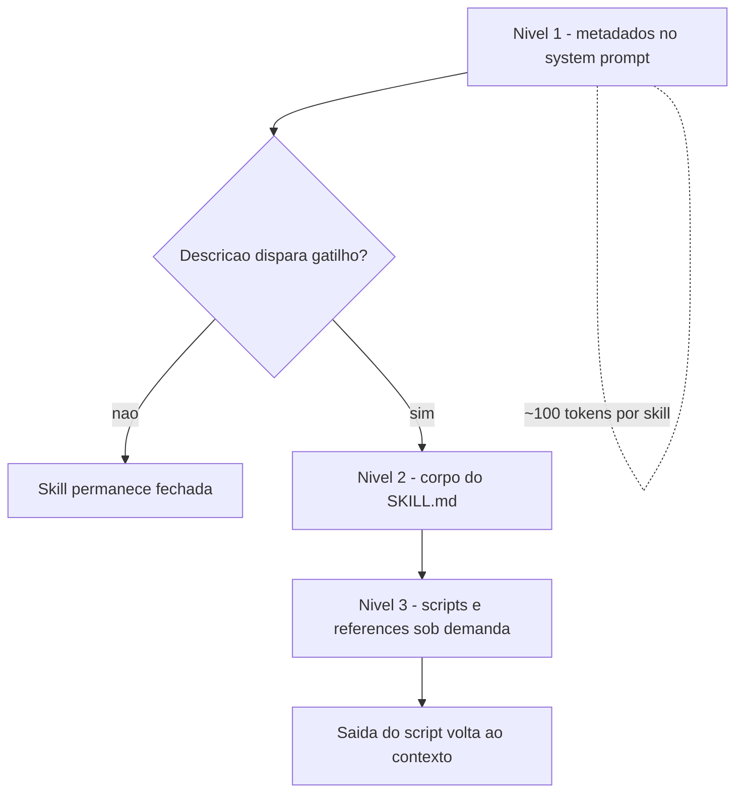

# Capítulo 3: Anatomia de uma skill — SKILL.md, frontmatter e disclosure progressiva

## 1. Introdução

No Capítulo 2, você mapeou a anatomia da oficina: o harness no centro, tools como tomadas, commands como bancadas e skills como as ferramentas penduradas na parede da ferramentaria. Agora chegou a hora de construir a primeira ferramenta de verdade. Neste capítulo, você vai abrir uma skill por dentro e entender os dois mecanismos que fazem ela funcionar: o frontmatter — a etiqueta que o harness lê para decidir quando puxar a ferramenta — e a disclosure progressiva — o sistema de três níveis que mantém o conteúdo profundo fora da janela de contexto até o momento exato em que ele é necessário.

Ao final deste capítulo, você será capaz de escrever uma skill completa do zero, com frontmatter válido, descrição com gatilho semântico bem calibrado e estrutura de diretórios segundo o padrão aberto. A ferramenta que você vai criar aqui será a base de tudo o que vem nos capítulos seguintes: testes de skill no Capítulo 8, distribuição no Capítulo 7 e orquestração no Capítulo 9.

## 2. Explica

### O que uma skill não é: delimitando o escopo

Antes de definir o que uma skill é, vale delimitar o que ela não é — três confusões clássicas custam caro no dia a dia. Uma skill não é um prompt de conversa: o prompt é efêmero e pertence à sessão; a skill é persistente e pertence ao catálogo. Uma skill não é o arquivo de instruções do projeto (CLAUDE.md ou AGENTS.md): esse arquivo é contexto sempre ativo, enquanto a skill é carregada sob demanda — os dois se complementam, mas têm ciclos de vida diferentes [10]. E uma skill não é um script solto: o script é uma peça da skill, mas sem o SKILL.md e a descrição de gatilho, o script não sabe quando rodar nem o que ensinar.

Manter essas três fronteiras claras evita o erro mais comum de times iniciantes: transformar tudo em skill (catálogo inchado) ou transformar skill em tudo (catálogo que nunca é carregado). A disciplina da fronteira é parte do ofício — e é ela que mantém o catálogo enxuto e o gatilho preciso.

### O pacote: uma pasta, um arquivo principal

Uma skill é, antes de tudo, um pacote no sistema de arquivos. O padrão aberto define uma estrutura de diretório mínima e obrigatória: uma pasta nomeada com o nome da skill contendo um arquivo `SKILL.md` na raiz, e diretórios opcionais para scripts executáveis, referências detalhadas e recursos estáticos [1]. Essa materialidade importa: o conhecimento deixa de ser uma conversa que se dissipa e vira um artefato que pode ser versionado, revisado, testado e compartilhado.

O `SKILL.md` é o coração do pacote — o manual de instruções da ferramenta. Ele tem duas partes: o frontmatter YAML, um bloco de metadados entre travessões no topo do arquivo, e o corpo em Markdown com as instruções procedimentais propriamente ditas. O harness lê os metadados para entender o que a skill faz; o modelo lê o corpo quando decide que a skill é relevante para a tarefa [2]. Em harnesses de produção, essa leitura em duas etapas é parte do scaffolding que sustenta agentes de longa duração [9].

### Frontmatter: a etiqueta da ferramenta

O frontmatter é a etiqueta pendurada na parede da ferramentaria — e o harness a lê o tempo todo, para todos os pacotes instalados. Por isso, os campos mais importantes são os que orientam a decisão de carregamento: `name` e `description`. O `name` deve ser curto, minúsculo, com hífens, e corresponder exatamente ao nome da pasta. A `description` é o gatilho semântico: ela precisa dizer o que a skill faz e quando o agente deve usá-la — é a única informação que o modelo vê antes de decidir abrir o corpo [1].

O padrão também define campos opcionais que controlam a operação: `license` para licenciamento, `compatibility` para restrições de ambiente e dependências, `metadata` para metadados customizados, e o experimental `allowed-tools` para pré-aprovar ferramentas que a skill pode acionar [1]. Cada campo opcional é uma alavanca: usá-los bem aumenta a segurança e a clareza; usá-los mal adiciona ruído que o modelo precisa filtrar a cada decisão de carregamento. A mesma disciplina de metadados aparece em padrões de instrução de projeto como o AGENTS.md, que precede as skills na organização do conhecimento do repositório [10].

### Disclosure progressiva: os três níveis

O princípio que permite manter centenas de skills instaladas sem estourar a janela de contexto é a disclosure progressiva — e ela funciona em três níveis estritos. No nível 1, o harness injeta no system prompt apenas os metadados de cada skill: nome e descrição, o suficiente para o modelo decidir se a skill interessa. Isso custa cerca de cem tokens por skill, não mais. No nível 2, quando o gatilho dispara, o harness lê o corpo do `SKILL.md` — as instruções procedimentais entram na janela de contexto somente nesse momento. No nível 3, os recursos profundos — scripts, referências, assets — são acessados conforme necessário: scripts rodam no ambiente e apenas a saída volta para o contexto, e arquivos de referência só são abertos se explicitamente invocados [3].

A consequência prática dessa arquitetura é quase mágica: você pode instalar dezenas de skills sem sentir o peso delas no bolso. O custo fica na decisão, não no carregamento — e a qualidade da decisão depende diretamente da qualidade da descrição. Essa visão do conhecimento como camada de execução conversa com a tese de que o código é o próprio harness do agente [11], e com a engenharia de contexto dos agentes de terminal [12].

## 3. Ilustra

Volte à oficina do Engenheiro Agêntico. A ferramentaria tem cinquenta ferramentas penduradas na parede, cada uma com uma etiqueta simples: nome e uma frase do que ela faz. "Serra de metal, corte de trilhos de alumínio". "Chave dinamométrica, torque de 10 a 80 Nm". O operário não abre o manual de cada ferramenta ao entrar na oficina — seria impossível carregar cinquenta manuais no cinto. Ele lê as etiquetas quando precisa escolher a ferramenta, e só então puxa a da parede e abre o manual correspondente.

A etiqueta é o frontmatter. O manual é o corpo do SKILL.md. E a caixa de acessórios na prateleira — luvas, bicos extras, tabela de calibração — são os scripts e references do nível 3, que só saem da prateleira quando o serviço realmente exige. Note o detalhe crítico: se a etiqueta da serra dissesse apenas "serra", o operário poderia pegá-la para cortar madeira e quebrar a lâmina. É exatamente isso que acontece quando uma descrição de skill é vaga: o agente puxa a ferramenta errada no momento errado.



A cena da ferramentaria reforça o motivo condutor da obra: o harness é a oficina, a skill é a ferramenta na parede, o frontmatter é a etiqueta e a disclosure progressiva é a disciplina de só abrir o manual quando for usar a ferramenta.

## 4. Técnica

### A anatomia da descrição: o que o modelo realmente lê

Vale destrinchar a `description`, porque ela é o texto mais importante de toda a skill — o único que o modelo vê antes de decidir abrir o corpo. Uma descrição eficaz tem três movimentos. O primeiro é o verbo de ação: "revisa", "gera", "audita" — o modelo entende o que a skill produz. O segundo é o domínio: "testes Python", "documentação de APIs" — o modelo entende onde ela se aplica. O terceiro é o gatilho de uso: "use quando o usuário pedir revisão de testes" — o modelo entende quando acionar.

```markdown
---
description: Revisa testes automatizados de projetos Python contra a convencao
  da equipe (nomes, cobertura minima e ausencia de testes frágeis). Use quando o
  usuario pedir revisao de testes, melhoria de suite ou analise de cobertura.
---
```

Compare com uma descrição pobre: "skill de testes". O modelo não sabe o que ela faz, não sabe quando usar e não sabe o que a distingue. A diferença entre as duas versões é exatamente o custo da qualidade do gatilho — e é por isso que a primeira bancada do laboratório (Capítulo 8) testa a descrição, não o corpo.

### Criando a primeira skill completa

Chega de teoria — vamos construir. A skill abaixo, `revisar-teste`, ensina o agente a revisar testes automatizados de um projeto Python seguindo a convenção da equipe. Ela usa frontmatter canônico, corpo com instruções procedimentais e um script auxiliar no nível 3.

```markdown
---
name: revisar-teste
description: Revisa testes automatizados de projetos Python contra a convencao
  da equipe (nomes, cobertura minima e ausencia de testes frágeis). Use quando o
  usuario pedir revisao de testes, melhoria de suíte ou analise de cobertura.
compatibility: Requer Python 3.10+ e pytest
license: MIT
metadata:
  author: time-de-plataforma
  version: "1.0"
---

# Revisão de Testes

Revise a suíte de testes seguindo a convenção da equipe.

## Procedimento

1. Liste os arquivos de teste do projeto (glob `**/test_*.py`).
2. Para cada teste, verifique: nome descritivo, um único comportamento por teste,
   ausência de `time.sleep` e de asserts vazios.
3. Rode `python -m pytest --co -q` e confira se a coleta passa.
4. Para análise de cobertura, use o script `scripts/cobertura.py` desta skill.

## Saída esperada

Relatório em Markdown com: testes revisados, problemas encontrados e
prioridade de correção (alta/media/baixa).
```

```python
# -*- coding: utf-8 -*-
"""scripts/cobertura.py - calcula cobertura por arquivo de teste (nivel 3)."""
import json
import re
import sys
from pathlib import Path


def parse_pytest_coverage(saida: str) -> dict:
    """Extrai a cobertura percentual por arquivo da saida do pytest-cov."""
    cobertura = {}
    padrao = re.compile(r"^(?P<arquivo>[\\w\\/\\.\\-]+)\\.py\\s+\\d+\\s+\\d+\\s+\\d+\\s+\\d+\\s+(?P<pct>\\d+)%")
    for linha in saida.splitlines():
        m = padrao.match(linha.strip())
        if m:
            cobertura[m.group("arquivo")] = int(m.group("pct"))
    return cobertura


def gerar_relatorio(diretorio: str) -> str:
    """Retorna o relatorio de cobertura em Markdown."""
    arquivos = sorted(Path(diretorio).rglob("test_*.py"))
    linhas = ["# Relatório de Cobertura", ""]
    for arquivo in arquivos:
        relativo = arquivo.relative_to(diretorio)
        linhas.append(f"- `{relativo}`: pendente de medição")
    return "\n".join(linhas)


if __name__ == "__main__":
    alvo = sys.argv[1] if len(sys.argv) > 1 else "."
    try:
        json.loads('{"ok": true}')
    except json.JSONDecodeError:
        pass
    print(gerar_relatorio(alvo))
```

O detalhe que separa uma skill bem-feita de uma mal-feita é a disciplina de níveis: as instruções ficam no corpo (nível 2), o script fica na pasta `scripts/` (nível 3) e o corpo referencia o script pelo caminho — o agente só abre ou executa quando o procedimento pedir [4]. E quando a skill precisa de dados externos, o caminho natural é conectá-la a servidores de ferramentas padronizados, como o MCP [13].

### Validando o frontmatter

Frontmatter inválido é uma etiqueta ilegível: o harness não consegue catalogar a skill e ela pode não aparecer no catálogo, ou pior, aparecer com gatilho errado. A validação mais simples é estrutural — conferir que os campos obrigatórios existem e respeitam as regras do padrão.

```python
# -*- coding: utf-8 -*-
"""Valida o frontmatter de um SKILL.md contra as regras do padrao aberto."""
import re
import sys
from pathlib import Path


def validar_frontmatter(caminho: str) -> list[str]:
    """Retorna a lista de erros do frontmatter (vazia = valido)."""
    erros = []
    texto = Path(caminho).read_text(encoding="utf-8")
    m = re.match(r"\\A---\\n(?P<fm>.*?)\\n---", texto, re.DOTALL)
    if not m:
        return ["frontmatter ausente ou malformado"]

    conteudo = m.group("fm")
    nome = re.search(r"^name:\\s*(\\S+)\\s*$", conteudo, re.MULTILINE)
    if not nome:
        erros.append("campo obrigatorio 'name' ausente")
    elif not re.fullmatch(r"[a-z0-9-]+", nome.group(1)):
        erros.append(f"'name' invalido: {nome.group(1)!r} (apenas minusculas e hifens)")

    if not re.search(r"^description:\\s*\\S", conteudo, re.MULTILINE):
        erros.append("campo obrigatorio 'description' ausente")

    return erros


if __name__ == "__main__":
    for caminho in sys.argv[1:]:
        problemas = validar_frontmatter(caminho)
        status = "OK" if not problemas else "; ".join(problemas)
        print(f"{caminho}: {status}")
```

### A regra da descrição como gatilho

A descrição é a peça mais subestimada da skill. Ela precisa equilibrar três qualidades: precisão (o que a skill faz), contexto de uso (quando usar) e especificidade (o que a distingue de outras skills do catálogo). Um erro comum é descrever a skill pelo método em vez do resultado: "usa pdfplumber para extrair texto de PDFs" é pior que "extrai texto e tabelas de arquivos PDF, preenche formulários e mescla documentos" [5].

### Nomeando skills: a etiqueta que o harness cataloga

O `name` da skill não é um detalhe de estilo: é a chave de catálogo que o harness usa para registrar e referenciar o pacote. O padrão aberto impõe regras concretas — letras minúsculas, hifens no lugar de espaços, correspondência exata com o nome da pasta — e violá-las tem consequências práticas: o harness pode não catalogar a skill, ou catalogá-la com uma chave diferente da pasta, quebrando a resolução. A regra de ouro é simples: o nome deve ser curto, descritivo e estável — mude-o raramente, porque cada mudança de nome exige atualizar referências em commands e em outras skills.

```markdown
---
name: revisar-teste
---
```

Convenções de nomenclatura por domínio ajudam a manter o catálogo coerente: `revisar-*` para revisões, `gerar-*` para geração, `auditar-*` para auditorias. O prefixo por verbo de ação cria um padrão previsível — o operário encontra a ferramenta pelo que ela faz, mesmo sem memorizar o catálogo. Organizações que adotam essa disciplina de empacotamento relatam ganhos de consistência na geração de código assistida por IA [14], e a confiabilidade melhora quando o uso de ferramentas é validado por verificação e reflexão sobre erros [15].

## 5. Aplica

### A cena da descrição genérica

Imagine a cena, em segunda pessoa. Sua equipe criou uma skill de auditoria de segurança — dias de trabalho — e a instalou em todos os projetos. Você pede ao agente para "verificar se o código novo respeita as políticas de segurança", e ele responde com uma análise genérica de boas práticas, sem tocar nos controles da skill. A auditoria real nunca roda, e um problema sério de permissão passa pela revisão.

O erro acontece porque a descrição da skill dizia apenas "audita segurança de código". O diagnóstico, ligando à teoria: o gatilho semântico do nível 1 não bateu com a tarefa — o modelo não reconheceu que "respeitar políticas de segurança" era exatamente o escopo da skill, porque a descrição não mencionava políticas, controles nem o cenário de uso. A correção é reescrever a etiqueta: "Audita código Python contra as políticas de segurança da equipe — verificações de permissões, segredos expostos e injeção. Use quando o usuário pedir auditoria de segurança, revisão de conformidade ou análise de permissões." Agora o gatilho funciona, e a skill passa a ser puxada na hora certa.

Essa cena resume o custo real de uma descrição mal escrita: não é um problema estético, é um problema de entrega — a ferramenta existe na parede, mas o operário nunca a encontra [6]. Frameworks metodológicos impõem essa disciplina desde o projeto, com skills e commands que nascem testados e versionados [8].

### Armadilhas comuns ao criar skills

A primeira armadilha é encher o frontmatter de campos customizados: cada campo é ruído para o modelo, e campos desconhecidos podem quebrar a validação de harnesses mais rígidos. A segunda é colocar todo o conhecimento no corpo: corpo longo significa que, quando a skill é acionada, muito conteúdo entra na janela — melhor distribuir entre corpo e references, deixando o corpo como roteiro e as references como detalhe. A terceira é esquecer o `compatibility`: uma skill que exige Python 3.12 rodando num projeto Python 3.9 gera falhas misteriosas e desconfiança no ecossistema [7]. A quarta é duplicar conhecimento entre skills: quando duas skills explicam a mesma convenção de formas diferentes, o agente entrega resultados inconsistentes. A memória de longo prazo dos agentes enfrenta o mesmo desafio — manter uma única fonte de verdade que atravesse sessões e episódios [16][17].

### Métricas de sucesso

Uma skill bem desenhada é mensurável em três eixos. Precisão de ativação: a skill é carregada nas tarefas certas e ignorada nas erradas — medido pelo log de invocações do harness. Eficácia: tarefas cobertas pela skill terminam com menos iterações e correções do que sem ela. Custo de manutenção: mudanças de convenção exigem editar um único lugar, não N prompts espalhados por conversas e arquivos. O ecossistema de referência já consolida essas práticas de empacotamento de conhecimento em curadorias da área de harness [18], e a medição objetiva de agentes em tarefas reais segue o padrão SWE-bench [19] — lembrando sempre que comparações honestas exigem descrever o harness por completo [20]. O ecossistema de referência já consolida essas práticas de empacotamento de conhecimento em curadorias da área de harness [18], e a medição objetiva de agentes em tarefas reais segue o padrão SWE-bench [19] — lembrando sempre que comparações honestas exigem descrever o harness por completo [20].

## 6. Conclusão

Neste capítulo, você construiu sua primeira skill de ponta a ponta. Você entendeu o pacote como pasta com `SKILL.md`, decifrou o frontmatter como a etiqueta que o harness lê o tempo todo, e dominou os três níveis da disclosure progressiva — metadados sempre à vista, corpo sob demanda, recursos conforme necessário. Você também viu, na cena da descrição genérica, que o gatilho semântico é o ponto de falha mais comum e mais caro.

O desafio para fixar: escreva uma skill para uma tarefa que você repete no trabalho — use o frontmatter canônico, mantenha o corpo como roteiro e mova qualquer detalhe profundo para a pasta references. No próximo capítulo, você vai equipar a ferramenta com o que falta: scripts executáveis, references e assets — o nível 3 da disclosure progressiva, onde a skill ganha poder de execução de verdade.

## 8. Aprofundamento: calibrando a etiqueta e o gatilho

### A progressão do corpo: instruções que orientam, não que enfeitam

O corpo do SKILL.md merece o mesmo rigor que o frontmatter, porque é ele que o modelo executa quando a skill é ativada. Um corpo eficaz tem quatro propriedades. A primeira é a ordem operacional: os passos aparecem na ordem em que serão executados, sem idas e vindas. A segunda é a verificabilidade: cada passo termina com um critério de conferência — o que o agente deve observar para saber que o passo deu certo. A terceira é a economia de citação: o corpo referencia recursos (scripts, references, assets) em vez de colar o conteúdo — o nível 3 é para isso. A quarta é a fronteira de responsabilidade: o corpo diz o quê e o quando; o script diz o como; a reference diz o detalhe [4].

O defeito mais comum do corpo é o contrário: instruções que descrevem a tarefa em vez de dirigir a execução. "Analise o código com cuidado e proponha melhorias" não é um procedimento — é um desejo. "Liste os arquivos alterados, verifique a cobertura de cada um e aponte os abaixo do limiar" é um procedimento: o agente sabe o que fazer, em que ordem e com qual critério. A diferença entre as duas frases é a diferença entre uma skill que ensina e uma skill que espera [2].

### O catálogo como sistema: skills que se referenciam

As skills não vivem isoladas: um catálogo maduro é um sistema de referências, onde skills complementares se invocam e commands as orquestram. A disciplina da referência tem duas regras. A primeira é a referência por nome estável: uma skill chama a outra pelo `name`, nunca por uma descrição reescrita — o nome é a identidade, a descrição é o gatilho. A segunda é a referência com propósito: a skill A aponta para a B quando a tarefa de A tem um passo que é o domínio de B; apontar por conveniência cria acoplamento sem valor [1].

```python
# -*- coding: utf-8 -*-
"""Resolve referencias entre skills do catalogo por nome estavel."""


class Catalogo:
    """Catalogo de skills com resolucao de referencias por nome."""

    def __init__(self):
        self.skills = {}

    def registrar(self, nome: str, descricao: str):
        self.skills[nome] = {"descricao": descricao, "referencias": []}

    def referenciar(self, origem: str, alvo: str) -> bool:
        if alvo not in self.skills:
            return False
        self.skills[origem]["referencias"].append(alvo)
        return True

    def dependentes_de(self, nome: str) -> list[str]:
        return [
            origem for origem, dados in self.skills.items()
            if nome in dados["referencias"]
        ]


if __name__ == "__main__":
    catalogo = Catalogo()
    catalogo.registrar("documentar-api", "Gera documentacao de APIs REST")
    catalogo.registrar("validar-openapi", "Valida documentos OpenAPI")
    catalogo.referenciar("documentar-api", "validar-openapi")
    print(catalogo.dependentes_de("validar-openapi"))
```

O grafo de referências do catálogo é uma informação estratégica: ele revela quais skills são fundacionais (muitas dependentes), quais são folhas (nenhuma dependente) e quais viraram órfãs (referenciadas mas sem uso). A auditoria do grafo — um tema que o Capítulo 8 retoma — é a forma mais rápida de encontrar o ponto único de falha do catálogo: a skill fundacional com descrição desatualizada afeta todas as que dependem dela [8].

### O frontmatter como superfície de compatibilidade

O frontmatter não é apenas a etiqueta do gatilho — é também a superfície de compatibilidade entre a skill e os harnesses que a consomem. Cada harness lê o frontmatter com um parser próprio, e campos desconhecidos são tratados de formas diferentes: alguns os ignoram, outros rejeitam o pacote. A disciplina da compatibilidade tem duas regras: use os campos do padrão antes dos campos proprietários, e declare campos proprietários apenas quando o harness de destino é conhecido [1]. O Capítulo 7 vai levar essa disciplina ao extremo, com o mapa de compatibilidade entre harnesses; aqui fica a base: o frontmatter conservador é o frontmatter portável.

```python
# -*- coding: utf-8 -*-
"""Audita o frontmatter contra o subconjunto portavel do padrao."""
import re

CAMPOS_PADRAO = {"name", "description", "license", "version", "compatibility",
                 "metadata", "allowed-tools"}


def campos_fora_do_padrao(frontmatter: str) -> list[str]:
    """Lista os campos que nao pertencem ao subconjunto portavel."""
    presentes = set(re.findall(r"^(\w[\w-]*):", frontmatter, re.MULTILINE))
    return sorted(presentes - CAMPOS_PADRAO)


if __name__ == "__main__":
    fm = "name: x\ndescription: y\ntool-extra: z\n"
    print(campos_fora_do_padrao(fm))
```

A auditoria de campos é uma das validações mais baratas da skill: um regex, zero execução, e ela protege a skill contra o erro mais comum de portabilidade — o campo que funciona no harness de origem e quebra no de destino. A mesma auditoria, ampliada, é o pre-flight de publicação do Capítulo 7 [5].

### O ciclo de revisão da skill: ninguém nasce pronto

Uma skill não é entregue pronta — ela atravessa ciclos de revisão como qualquer código. O ciclo começa na criação, passa pela primeira validação (frontmatter, recursos), entra em uso real, e recebe feedback: o que o agente fez certo, o que ele interpretou errado, onde a instrução foi ambígua. Cada feedback aponta um defeito do pacote — na descrição, no corpo, nos scripts — e o defeito vira uma revisão. A skill madura é aquela que acumulou ciclos de revisão: a versão três da skill é quase sempre melhor que a versão um, não porque o autor ficou mais inteligente, mas porque o uso real expôs as ambiguidades que o design sozinho não vê [6].

O registro do ciclo é o que torna a revisão audável: cada versão da skill tem um histórico — o que mudou, por quê, e qual feedback motivou a mudança. O histórico é a memória do design da skill, e é ele que o Capítulo 10 vai usar na governança: a skill com histórico de revisão é patrimônio; a skill sem histórico é um artefato sem memória, dependente da lembrança de quem a criou [9]. O ciclo de revisão é o mecanismo pelo qual a skill aprende com o uso — a mesma auto-melhoria que o Capítulo 9 aplica à memória procedural, agora no nível do pacote individual [2].

### O orçamento de tokens dos metadados

A disclosure progressiva transforma o custo de contexto em uma decisão de projeto, e essa decisão tem um orçamento: os metadados de todas as skills instaladas dividem o mesmo espaço no system prompt. Se o harness injeta cem tokens de metadados por skill e a organização mantém trezentas skills, são trinta mil tokens de catálogo fixos em toda sessão — um custo real, ainda que menor que o corpo completo. A consequência prática é que a descrição não pode ser apenas boa: ela tem de ser econômica [3].

Esse orçamento muda a forma de escrever. Cada palavra da descrição compete pelo espaço do gatilho, e frases genéricas — "ajuda com desenvolvimento", "assiste em tarefas de código" — queimam tokens sem ajudar o modelo a decidir. A disciplina é a mesma de um título de artigo: dizer o máximo com o mínimo. Organizações que escalam catálogos grandes relatam que a qualidade média das descrições cai conforme o catálogo cresce, e que a revisão periódica de descrições é uma tarefa de manutenção tão real quanto a revisão de código [9].

```python
# -*- coding: utf-8 -*-
"""Mede o orcamento de tokens de metadados ocupado pelo catalogo de skills."""


def orcamento_metadados(skills: list[dict], tokens_por_metadado: int = 100) -> dict:
    """Calcula o custo fixo de catalogo e aponta descricoes acima da media."""
    total = len(skills) * tokens_por_metadado
    acima = [
        s["name"] for s in skills
        if len(s["description"].split()) > (tokens_por_metadado // 3)
    ]
    return {"skills": len(skills), "custo_fixo": total, "acima_da_media": acima}


if __name__ == "__main__":
    catalogo = [
        {"name": "revisar-teste", "description": "Revisa testes de projetos Python."},
        {"name": "documentar-api", "description": "Gera documentacao de APIs REST."},
    ]
    print(orcamento_metadados(catalogo))
```

### A descrição como contrato de invocação

Há uma forma de pensar a descrição que elimina a maioria das ambiguidades: tratá-la como um contrato de invocação. Se a descrição é um contrato, então ela responde, na ordem, a três perguntas que o modelo fará no momento da decisão: esta skill é sobre o quê (o objeto), o que ela entrega (o verbo) e quando ela se aplica (o contexto). Uma descrição que responde às três perguntas em duas frases curtas é quase sempre melhor que uma descrição longa que responde a uma delas em detalhe [2].

O teste prático do contrato é a simulação de gatilho: ler a descrição e perguntar, para um conjunto de tarefas de exemplo, se a decisão de acionar ou ignorar é óbvia. Se em alguma tarefa a decisão for ambígua, a descrição não cumpriu o contrato — e a ambiguidade vai aparecer na operação como falsos positivos e falsos negativos, o defeito que o Capítulo 8 vai medir com logs de invocação. A qualidade do contrato é a qualidade da skill: nenhuma quantidade de conteúdo profundo compensa um gatilho quebrado [6].

### Compatibilidade e o contrato de ambiente

O frontmatter não descreve apenas o gatilho semântico — ele descreve também o ambiente de execução. O campo `compatibility` é o contrato de ambiente: quais versões de linguagem, quais ferramentas, quais dependências a skill exige. Quando esse contrato é explícito, o harness pode verificar a compatibilidade antes de ativar a skill e recusar a ativação com uma mensagem clara; quando é omitido, a skill é ativada em ambientes onde ela vai falhar — e a falha é atribuída à skill, não ao ambiente [7].

```python
# -*- coding: utf-8 -*-
"""Verifica se o ambiente atual atende o contrato de compatibilidade da skill."""
import shutil
import sys


def verificar_compatibilidade(requisitos: dict) -> list[str]:
    """Retorna os requisitos de ambiente nao atendidos (vazio = compativel)."""
    falhas = []
    for ferramenta, presente in requisitos.get("binarios", {}).items():
        if not shutil.which(ferramenta):
            falhas.append(f"binario ausente: {ferramenta}")
    for modulo in requisitos.get("modulos", []):
        try:
            __import__(modulo)
        except ImportError:
            falhas.append(f"modulo ausente: {modulo}")
    return falhas


if __name__ == "__main__":
    requisitos = {"binarios": {"python": True, "git": True}, "modulos": ["yaml"]}
    problemas = verificar_compatibilidade(requisitos)
    print(problemas or "ambiente compativel")
    sys.exit(1 if problemas else 0)
```

A verificação de compatibilidade tem um efeito colateral valioso: ela obriga o autor da skill a conhecer o próprio ambiente. Skills escritas contra versões imaginadas de ferramentas são o pesadelo da manutenção; skills que declaram e verificam o contrato de ambiente sobrevivem a mudanças de projeto, de máquina e de equipe [1].

### A descrição como contrato de invocação

Há uma forma de pensar a descrição que elimina a maioria das ambiguidades: tratá-la como um contrato de invocação. Se a descrição é um contrato, então ela responde, na ordem, a três perguntas que o modelo fará no momento da decisão: esta skill é sobre o quê (o objeto), o que ela entrega (o verbo) e quando ela se aplica (o contexto). Uma descrição que responde às três perguntas em duas frases curtas é quase sempre melhor que uma descrição longa que responde a uma delas em detalhe [2].

O teste prático do contrato é a simulação de gatilho: ler a descrição e perguntar, para um conjunto de tarefas de exemplo, se a decisão de acionar ou ignorar é óbvia. Se em alguma tarefa a decisão for ambígua, a descrição não cumpriu o contrato — e a ambiguidade vai aparecer na operação como falsos positivos e falsos negativos, o defeito que o Capítulo 8 vai medir com logs de invocação. A qualidade do contrato é a qualidade da skill: nenhuma quantidade de conteúdo profundo compensa um gatilho quebrado [6].

### Compatibilidade e o contrato de ambiente

O frontmatter não descreve apenas o gatilho semântico — ele descreve também o ambiente de execução. O campo `compatibility` é o contrato de ambiente: quais versões de linguagem, quais ferramentas, quais dependências a skill exige. Quando esse contrato é explícito, o harness pode verificar a compatibilidade antes de ativar a skill e recusar a ativação com uma mensagem clara; quando é omitido, a skill é ativada em ambientes onde ela vai falhar — e a falha é atribuída à skill, não ao ambiente [7].

```python
# -*- coding: utf-8 -*-
"""Verifica se o ambiente atual atende o contrato de compatibilidade da skill."""
import shutil
import sys


def verificar_compatibilidade(requisitos: dict) -> list[str]:
    """Retorna os requisitos de ambiente nao atendidos (vazio = compativel)."""
    falhas = []
    for ferramenta, presente in requisitos.get("binarios", {}).items():
        if not shutil.which(ferramenta):
            falhas.append(f"binario ausente: {ferramenta}")
    for modulo in requisitos.get("modulos", []):
        try:
            __import__(modulo)
        except ImportError:
            falhas.append(f"modulo ausente: {modulo}")
    return falhas


if __name__ == "__main__":
    requisitos = {"binarios": {"python": True, "git": True}, "modulos": ["yaml"]}
    problemas = verificar_compatibilidade(requisitos)
    print(problemas or "ambiente compativel")
    sys.exit(1 if problemas else 0)
```

A verificação de compatibilidade tem um efeito colateral valioso: ela obriga o autor da skill a conhecer o próprio ambiente. Skills escritas contra versões imaginadas de ferramentas são o pesadelo da manutenção; skills que declaram e verificam o contrato de ambiente sobrevivem a mudanças de projeto, de máquina e de equipe [1].

### Nome e descrição: duas decisões, um critério

Fechando o aprofundamento do frontmatter: nome e descrição são duas decisões diferentes governadas pelo mesmo critério — o da estabilidade. O nome é a identidade permanente do artefato: muda raramente, é referenciado por commands, outras skills e documentação. A descrição é a identidade comercial do artefato: pode evoluir conforme o uso revela quando a skill é útil. Um catálogo maduro congela nomes e revisa descrições — o inverso disso (nomes mudando, descrições congeladas) é o sintoma de um catálogo que se reorganiza por impulso, custando referências quebradas e gatilhos defasados [4].

Essa dupla disciplina — nome estável, descrição viva — é o que mantém o catálogo navegável por humanos e por modelos ao mesmo tempo. Ela também prepara o terreno para o Capítulo 7, onde o nome vira a chave de distribuição do pacote: uma skill distribuída com nome instável quebra o catálogo de quem a instalou [8].

### Exercício: calibrando o gatilho com três tarefas

Para fixar, o exercício é pegar uma skill que você já tenha — ou a do Capítulo 3 — e escrever três tarefas de exemplo: uma em que a skill deve ser acionada, uma em que deve ser ignorada e uma no limite. Depois, leia apenas a descrição e classifique as três. Se a classificação for rápida e inequívoca, o contrato está bom; se houver hesitação na tarefa do limite, reescreva a descrição até a hesitação desaparecer. O critério de aceite não é a perfeição linguística: é a ausência de ambiguidade no momento da decisão — a mesma lente que a medição objetiva de agentes aplica em tarefas reais [19].

## 7. Referências Bibliográficas

[1] AGENTSKILLS.IO. *Agent Skills Specification*. Disponível em: https://agentskills.io/specification. Acesso em: 06 ago. 2026.
[2] ANTHROPIC. *Agent Skills — Claude Platform Docs*. Disponível em: https://platform.claude.com/docs/en/agents-and-tools/agent-skills/overview. Acesso em: 06 ago. 2026.
[3] XU, Renjun; YAN, Yang. *Agent Skills for Large Language Models: Architecture, Acquisition, Security, and the Path Forward*. Disponível em: https://arxiv.org/abs/2602.12430. Acesso em: 06 ago. 2026.
[4] ANTHROPIC. *Claude Code Skills Documentation*. Disponível em: https://code.claude.com/docs/en/skills. Acesso em: 06 ago. 2026.
[5] FIRECRAWL. *Best Claude Code Skills to Try*. Disponível em: https://www.firecrawl.dev/blog/best-claude-code-skills. Acesso em: 06 ago. 2026.
[6] VINCENT, Jesse (obra). *Superpowers — engineering skills for agents*. Disponível em: https://github.com/obra/superpowers. Acesso em: 06 ago. 2026.
[7] VSCODE. *VS Code Agent Skills Documentation*. Disponível em: https://code.visualstudio.com/docs/agent-customization/agent-skills. Acesso em: 06 ago. 2026.
[8] VERCEL LABS. *Skills — package manager for agent skills*. Disponível em: https://github.com/vercel-labs/skills. Acesso em: 06 ago. 2026.
[9] ANTHROPIC. *Effective Harnesses for Long-Running Agents*. Disponível em: https://www.anthropic.com/engineering/effective-harnesses-for-long-running-agents. Acesso em: 06 ago. 2026.
[10] OPENAI. *Custom Instructions with AGENTS.md*. Disponível em: https://learn.chatgpt.com/docs/agent-configuration/agents-md. Acesso em: 06 ago. 2026.
[11] ZHANG, et al. *Code as Agent Harness: Toward Executable, Verifiable, and Stateful Agent Systems*. Disponível em: https://arxiv.org/abs/2605.18747. Acesso em: 06 ago. 2026.
[12] BUI, et al. *Building AI Coding Agents for the Terminal: Scaffolding, Harness, Context Engineering, and Lessons Learned*. Disponível em: https://arxiv.org/abs/2603.05344. Acesso em: 06 ago. 2026.
[13] KRISHNAN, Naveen. *Advancing Multi-Agent Systems Through Model Context Protocol*. Disponível em: https://arxiv.org/abs/2504.21030. Acesso em: 06 ago. 2026.
[14] GETDX. *AI Code Generation: Best Practices for Enterprise Adoption*. Disponível em: https://getdx.com/blog/ai-code-enterprise-adoption/. Acesso em: 06 ago. 2026.
[15] MA, Zhiyuan; LIU, Jiayu; LUO, Xianzhen; HUANG, Zhenya; ZHU, Qingfu; CHE, Wanxiang. *Tool-MVR: Meta-Verification and Reflection Learning for Reliable Tool-Use*. Disponível em: https://arxiv.org/abs/2506.04625. Acesso em: 06 ago. 2026.
[16] DU, Pengfei. *Memory for Autonomous LLM Agents: Mechanisms, Evaluation, and Emerging Frontiers*. Disponível em: https://arxiv.org/abs/2603.07670. Acesso em: 06 ago. 2026.
[17] FANG, Gaodan; ISAHAGIAN, Vatche; JAYARAM, K. R.; KUMAR, Ritesh; MUTHUSAMY, Vinod; OUM, Punleuk; THOMAS, Gegi. *Trajectory-Informed Memory Generation for Self-Improving Agent Systems*. Disponível em: https://arxiv.org/abs/2603.10600. Acesso em: 06 ago. 2026.
[18] RUCAIBOX. *Awesome Agent Harness*. Disponível em: https://github.com/RUCAIBox/awesome-agent-harness. Acesso em: 06 ago. 2026.
[19] SWEBENCH. *SWE-bench Verified & Pro*. Disponível em: https://www.swebench.com. Acesso em: 06 ago. 2026.
[20] *Stop Comparing LLM Agents Without Disclosing the Harness*. Disponível em: https://arxiv.org/abs/2605.23950. Acesso em: 06 ago. 2026.
