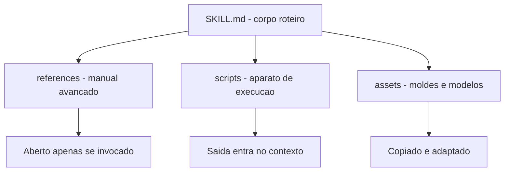

# Capítulo 4: Empacotando execução — scripts, references e assets

## 1. Introdução

No Capítulo 3, você construiu sua primeira skill com frontmatter canônico e entendeu a disclosure progressiva em seus três níveis. A ferramenta está pendurada na parede da ferramentaria — mas ainda é uma ferramenta passiva: ela instrui, mas não executa. Este capítulo é sobre o nível 3 da disclosure progressiva, a camada onde a skill ganha poder de verdade: scripts executáveis que rodam no ambiente do agente, referências detalhadas que aprofundam o conhecimento sob demanda e assets que fornecem templates e modelos prontos.

Ao final deste capítulo, você será capaz de equipar qualquer skill com execução determinística, documentação profunda e recursos estáticos — e de decidir, caso a caso, o que deve morar em cada pasta do pacote. Essa é a diferença entre uma skill que apenas informa e uma skill que transforma o agente em um operador confiável da sua bancada.

## 2. Explica

### O contrato de execução: quando o agente delega a máquina

A decisão entre "instrução no corpo" e "script na pasta" é a decisão entre o modelo raciocinar o passo e o modelo delegar o passo à máquina. A regra prática tem três critérios. Primeiro: lógica determinística (parser, cálculo, transformação) vai para script — o modelo varia, o script não. Segundo: lógica de alto risco (deleção, escrita, publicação) vai para script com validação — o script pode ser revisado linha a linha, o raciocínio do modelo não. Terceiro: lógica que depende de contexto conversacional (interpretar intenção do usuário) fica no corpo — o script não lê nuance.

A fronteira importa porque o custo dos dois lados é assimétrico: um script mal feito gera um erro reprodutível e corrigível; uma instrução mal executada pelo modelo gera uma falha que varia a cada tentativa [5]. Quando a tarefa admite código, prefira o código.

### Por que scripts mudam o jogo

Uma skill composta apenas de instruções depende do modelo executar os passos descritos com as ferramentas do harness. Isso funciona, mas tem um teto: o modelo pode variar na execução, errar um detalhe de sintaxe ou desviar do procedimento. Quando o passo crítico vira um script — um arquivo executável dentro da pasta `scripts/` da skill — o agente não precisa reconstruir a lógica a cada sessão: ele roda o script e lê a saída [1]. A mesma disciplina vale para o comando de barra que dispara o procedimento completo — o harness trata o arquivo de comando como um fluxo determinístico registrado na bancada [10].

O detalhe técnico que torna isso barato é a economia de contexto do nível 3: o script roda no ambiente do agente e apenas a saída retorna para a janela de contexto. O código-fonte do script, por maior que seja, nunca ocupa tokens — ele é leitura de máquina, não leitura de modelo. Isso permite empacotar lógica complexa sem custo de contexto, desde que a skill saiba quando invocar o script e o que fazer com a saída [2]. Quando o script precisa acessar dados externos, o harness o conecta a servidores de ferramentas padronizados — o MCP é o caminho natural para essa integração [11].

### A hierarquia de profundidade: do roteiro à enciclopédia

A skill bem desenhada funciona como um livro de cabeceira: o corpo é o índice e o resumo; as references são os capítulos de referência; os scripts são as calculadoras; os assets são as tabelas prontas. A hierarquia de profundidade é o que permite à skill ser pequena na ativação e grande no conteúdo — o corpo cabe na janela de contexto, e a profundidade fica a um passo de distância [3].

Uma forma de verificar a hierarquia é o teste do leitor apressado: um agente que lê apenas o corpo da skill consegue executar o procedimento com qualidade? Se precisar da reference para o passo básico, a hierarquia está invertida — o conteúdo de uso frequente deve morar no corpo, não na profundidade. A inversão é o sintoma mais comum de skill mal organizada, e a correção é sempre um movimento de conteúdo, não de reescrita.

### References: a camada profunda do conhecimento

Nem todo conhecimento cabe no corpo do `SKILL.md` sem transformá-lo num manual de quinhentas páginas — e não deveria caber. O diretório `references/` existe para a documentação detalhada: guias de referência de API, esquemas de dados, convenções completas, glossários. O corpo da skill vira um roteiro que aponta para as references; a reference vira o detalhe que só é aberto quando a tarefa realmente pede [3]. Essa arquitetura de camadas é a mesma que sustenta agentes de terminal completos, do scaffolding à gestão de contexto [12].

A decisão de onde cada conteúdo mora é uma decisão de engenharia de contexto: o que o agente precisa ver sempre que a skill é acionada fica no corpo; o que ele precisa apenas quando a tarefa aprofunda fica em references; o que ele precisa apenas quando executa fica em scripts. Essa distribuição é a aplicação prática da disclosure progressiva — e é ela que mantém dezenas de skills viáveis sem estourar a janela.

### Assets: os moldes e modelos

A terceira pasta, `assets/`, guarda o que não é instrução nem código: templates de documentos, esquemas de dados, imagens, arquivos de configuração de exemplo. São os moldes da oficina — a forma pronta que o operário usa em vez de desenhar do zero a cada serviço. Um template de relatório, um `pyproject.toml` de exemplo, um arquivo de configuração de lint: tudo isso são assets que a skill fornece prontos para copiar e adaptar [4]. A visão do código como harness do agente reforça esse ponto: os moldes são artefatos que o próprio agente vai executar ou consumir [13].

## 3. Ilustra

A oficina do Engenheiro Agêntico tem uma bancada de calibração que ilustra perfeitamente a diferença entre os níveis. Pendurada na parede está a ferramenta "calibrador de torque", com sua etiqueta e seu manual (o corpo da skill). Na prateleira de baixo, o manual avançado — tabelas de calibração para cada marca de parafuso, procedimento de zeragem, tolerâncias por material (as references). E na gaveta da bancada, o aparato de calibração em si: o dispositivo que o operário encaixa no parafuso e gira, lendo o torque no mostrador (o script). Na estante ao lado, os moldes de relatório de calibração já impressos (os assets).

O ponto que o capítulo quer gravar: o operário não decora a tabela de tolerâncias de todas as marcas. Ele consulta a tabela quando está calibrando aquela marca específica. E não recalcula o torque na cabeça — ele usa o aparato e lê o mostrador. Cada nível da ferramenta é acionado no momento certo, e o cinto do operário (a janela de contexto) carrega apenas o essencial.



O motivo condutor volta ao centro: a skill é a ferramenta na parede, e as pastas são as partes da ferramenta — o cabo, o bico, o manual, a caixa de acessórios. Saber onde cada parte mora é o que separa uma ferramentaria organizada de um baú de sucata.

## 4. Técnica

### Estruturando uma skill com execução completa

A skill abaixo, `documentar-api`, mostra o pacote completo em ação: corpo com roteiro, script que gera o esqueleto da documentação, reference com o padrão da equipe e asset com o template de cabeçalho. Primeiro, a estrutura de pastas:

```bash
.claude/skills/documentar-api/
├── SKILL.md
├── scripts/
│   └── gerar_esqueleto.py
├── references/
│   └── PADRAO_DOCUMENTACAO.md
└── assets/
    └── cabecalho_template.md
```

O corpo do `SKILL.md` referencia cada parte pelo caminho relativo, deixando claro para o agente quando abrir o quê:

```markdown
---
name: documentar-api
description: Gera e revisa documentacao de APIs REST seguindo o padrao da
  equipe. Use quando o usuario pedir documentacao de endpoint, revisao de
  OpenAPI ou esqueleto de referencia.
compatibility: Requer Python 3.10+
---

# Documentação de API

## Procedimento

1. Gere o esqueleto da documentação:
   `python scripts/gerar_esqueleto.py --openapi caminho/do/openapi.json`
2. Confira o padrão de escrita em `references/PADRAO_DOCUMENTACAO.md`.
3. Para endpoints novos, copie o cabeçalho de `assets/cabecalho_template.md`.
4. Valide o resultado final contra o padrão e devolva o Markdown.
```

O script de geração é o coração executável da skill — e pode ser tão sofisticado quanto necessário, porque o seu código nunca entra na janela de contexto:

```python
# -*- coding: utf-8 -*-
"""scripts/gerar_esqueleto.py - gera esqueleto de documentacao de API REST."""
import argparse
import json
import sys
from pathlib import Path


def extrair_endpoints(openapi: dict) -> list[dict]:
    """Extrai caminhos e metodos do documento OpenAPI."""
    endpoints = []
    for caminho, definicoes in openapi.get("paths", {}).items():
        for metodo, detalhe in definicoes.items():
            if metodo.upper() not in {"GET", "POST", "PUT", "PATCH", "DELETE"}:
                continue
            endpoints.append({
                "caminho": caminho,
                "metodo": metodo.upper(),
                "resumo": detalhe.get("summary", detalhe.get("operationId", "")),
                "descricao": detalhe.get("description", ""),
            })
    return endpoints


def gerar_documentacao(endpoints: list[dict]) -> str:
    """Monta o Markdown de documentacao a partir dos endpoints."""
    linhas = ["# Documentação da API", ""]
    for ep in sorted(endpoints, key=lambda e: (e["caminho"], e["metodo"])):
        linhas.append(f"## {ep['metodo']} {ep['caminho']}")
        linhas.append("")
        linhas.append(f"{ep['resumo'] or 'Endpoint sem resumo.'}")
        if ep["descricao"]:
            linhas.append("")
            linhas.append(ep["descricao"])
        linhas.append("")
    return "\n".join(linhas)


def main() -> int:
    ap = argparse.ArgumentParser(description="Gera esqueleto de documentacao")
    ap.add_argument("--openapi", required=True, help="caminho do arquivo OpenAPI")
    ap.add_argument("--saida", default="docs/api.md", help="arquivo de saida")
    args = ap.parse_args()

    openapi = json.loads(Path(args.openapi).read_text(encoding="utf-8"))
    documentacao = gerar_documentacao(extrair_endpoints(openapi))
    saida = Path(args.saida)
    saida.parent.mkdir(parents=True, exist_ok=True)
    saida.write_text(documentacao, encoding="utf-8")
    print(f"Documentacao gerada: {saida} ({len(documentacao)} caracteres)")
    return 0


if __name__ == "__main__":
    sys.exit(main())
```

Repare na disciplina: o script é autocontido, com CLI própria e tratamento de erro — exatamente o que um script de skill deve ser, porque ele será executado pelo agente e o agente só verá a saída e o código de erro [5].

### Quando o script vira o coração da skill: automação com entrada e saída

O padrão de script de skill mais comum é o transformador: recebe uma entrada, processa com lógica determinística e devolve uma saída estruturada. O exemplo abaixo mostra um script de normalização de nomes de branches, um utilitário pequeno mas representativo do padrão:

```python
# -*- coding: utf-8 -*-
"""scripts/normalizar_branch.py - normaliza nomes de branch para git."""
import re
import sys


def normalizar(titulo: str) -> str:
    """Converte um titulo livre em um nome de branch valido para git."""
    baixo = titulo.strip().lower()
    sem_acentos = (
        baixo.replace("á", "a").replace("ã", "a").replace("â", "a")
        .replace("é", "e").replace("ê", "e").replace("í", "i")
        .replace("ó", "o").replace("õ", "o").replace("ú", "u")
        .replace("ç", "c")
    )
    sem_especiais = re.sub(r"[^a-z0-9-]+", "-", sem_acentos)
    compactado = re.sub(r"-{2,}", "-", sem_especiais).strip("-")
    return compactado[:63] or "branch"


def main() -> int:
    if len(sys.argv) < 2:
        print("uso: python normalizar_branch.py <titulo>", file=sys.stderr)
        return 1
    print(normalizar(sys.argv[1]))
    return 0


if __name__ == "__main__":
    sys.exit(main())
```

O padrão a observar: o script declara seu contrato de entrada e saída no docstring, trata o erro de uso no `main` e imprime apenas o resultado na saída padrão — o que o agente vê é exatamente o que a skill precisa consumir. Scripts com esse formato são triviais de testar (chame com entrada, compare a saída) e de integrar em outras skills via `scripts/` [9]. Avaliações honestas de agentes exigem descrever esse harness — scripts, ferramentas e contexto — por completo [14].

### References e assets na prática

A reference é um arquivo Markdown com o padrão completo da equipe — profundo o bastante para ser autoritativo, mas organizado para consulta pontual. O asset é um template pronto para copiar. Veja como o corpo da skill os referencia de forma que o agente saiba o que esperar:

```markdown
<!-- references/PADRAO_DOCUMENTACAO.md (trecho) -->
# Padrão de Documentação da Equipe

- Todo endpoint documenta: resumo em 1 frase, parâmetros, exemplo de resposta.
- Cabeçalho de endpoint novo: use o modelo em `assets/cabecalho_template.md`.
- Tabela de códigos de erro: obrigatória quando o endpoint retorna 4xx.
- Documentação em PT-BR, tom imperativo, sem jargão de implementação.
```

O corpo da skill não precisa repetir o padrão: ele aponta para a reference. Se a convenção mudar, edita-se um único arquivo e todas as invocações futuras herdam a mudança — o mesmo princípio de fonte única de verdade que vimos no Capítulo 3 [6]. A memória de longo prazo dos agentes lida com o mesmo desafio: preservar conhecimento procedimental entre episódios [15][16].

### Validando o pacote completo

Antes de publicar uma skill com execução, valide os três níveis: o frontmatter (já vimos no Capítulo 3), a sintaxe dos scripts e a existência das references/assets referenciadas pelo corpo. O script abaixo automatiza a última parte:

```python
# -*- coding: utf-8 -*-
"""Valida referencias de um SKILL.md: scripts, references e assets existem."""
import re
import sys
from pathlib import Path


def validar_recursos(caminho_skill: str) -> list[str]:
    """Confere que todos os caminhos mencionados no corpo existem."""
    erros = []
    raiz = Path(caminho_skill).parent
    texto = Path(caminho_skill).read_text(encoding="utf-8")
    caminhos = re.findall(r"(?:scripts|references|assets)/[\\w\\/\\.\\-]+", texto)
    for caminho in caminhos:
        alvo = raiz / caminho
        if not alvo.exists():
            erros.append(f"{caminho}: recurso declarado mas ausente")
    return erros


if __name__ == "__main__":
    for caminho in sys.argv[1:]:
        problemas = validar_recursos(caminho)
        status = "OK" if not problemas else "; ".join(problemas)
        print(f"{caminho}: {status}")
```

## 5. Aplica

### A cena do script que quebrou a sessão

Imagine a cena, em segunda pessoa. Você instalou uma skill de geração de relatórios que promete processar milhares de linhas de log. Na primeira tarefa real, o agente aciona a skill, roda o script — e recebe um traceback gigante. A saída de erro entra inteira na janela de contexto, o agente tenta corrigir um script que ele não deveria precisar entender, e a sessão vira um buraco de tokens. Você descobre depois que o script esperava um argumento que a skill não documentou.

O erro acontece em duas camadas. Primeiro, a skill não validou os pré-requisitos antes de executar — o script quebrou por falta de argumento, um problema de design do pacote. Segundo, o harness injetou o traceback inteiro no contexto, o que o design deveria ter evitado capturando e resumindo o erro. O diagnóstico, ligando à teoria: scripts de skill devem ser autossuficientes (CLI robusta, erro tratado) e a skill deve instruir o agente a capturar apenas o resumo do erro. A correção: adicionar tratamento de exceção com mensagem curta no script e uma linha no corpo da skill dizendo "em caso de erro, reporte apenas a última linha do traceback".

Essa cena mostra o custo real de negligenciar a engenharia do nível 3: um script mal desenhado transforma a ferramenta em fonte de ruído em vez de fonte de valor [7].

### Armadilhas comuns do nível 3

A primeira armadilha é inflar o corpo da skill com conteúdo que deveria estar em references: o roteiro vira um manual e a ativação da skill custa uma fortuna em tokens. A segunda é escrever scripts que dependem de estado global ou de instalação manual: o script deve declarar suas dependências no `compatibility` e ser executável de forma isolada. A terceira é esquecer o tratamento de erro: todo script de skill deve capturar exceções e devolver uma mensagem curta, porque é isso que o agente vê. A quarta é duplicar a mesma lógica em scripts de skills diferentes: o padrão deve morar em um lugar só, referenciado pelas demais [8]. Instruções estáticas de projeto, como o AGENTS.md, complementam as skills nessa organização do conhecimento [19].

### Métricas de sucesso

Uma skill com execução bem-feita mostra três sinais. Primeiro: a taxa de sucesso de primeira execução sobe, porque o script é autossuficiente e validado. Segundo: o custo médio por tarefa cai, porque a lógica pesada roda fora da janela de contexto — apenas saídas entram. Terceiro: o tempo de adaptação a mudanças de convenção cai, porque references e assets concentram o padrão em um único lugar editável [9]. E quando a skill amadurece, o próximo passo é distribuí-la pelo catálogo — o gerenciador de pacotes de skills da Vercel Labs automatiza esse fluxo [20].

## 6. Conclusão

Neste capítulo, você equipou suas skills com o nível 3 da disclosure progressiva. Você entendeu por que scripts mudam o jogo — execução determinística com custo de contexto quase zero, porque o código roda e só a saída volta. Você aprendeu a distribuir o conhecimento entre corpo, references e assets, mantendo o corpo como roteiro e o detalhe como referência. E você viu, na cena do script quebrado, que o nível 3 exige engenharia: scripts autossuficientes, erros tratados e instruções claras sobre o que reportar.

O desafio para fixar: pegue a skill que você criou no Capítulo 3 e adicione um script executável para o passo mais repetitivo do procedimento — depois valide o pacote com o script de verificação de recursos deste capítulo. No próximo capítulo, você vai virar a chave da oficina para os commands: como gravar procedimentos determinísticos na bancada, com frontmatter, argumentos e controle de invocação.

## 8. Aprofundamento: o engenheiro do nível 3

### O contrato de execução, aprofundado: os três modos de script

O capítulo apresentou a fronteira entre instrução e script; vale agora mapear os três modos de script que uma skill pode carregar, porque cada um tem contrato próprio. O primeiro é o transformador: recebe entrada, processa e devolve saída estruturada — o padrão mais comum, trivial de testar e de integrar. O segundo é o verificador: recebe um alvo e devolve um veredito (conforme ou não, com motivos) — o padrão das bancadas de qualidade, que transforma opinião em evidência. O terceiro é o extrator: varre uma fonte e produz um resumo ou inventário — o padrão de diagnóstico, que reduz volume antes de o modelo analisar [2].

A classificação importa porque cada modo tem um contrato de saída diferente: o transformador devolve dados, o verificador devolve veredito e motivos, o extrator devolve resumo. O corpo da skill deve dizer qual modo o script implementa, para que o agente saiba o que esperar da saída — e para que a saída seja consumida sem interpretação ambígua [5].

```python
# -*- coding: utf-8 -*-
"""Os tres modos de script de skill com contratos de saida."""


def transformar(entrada: list[str]) -> list[str]:
    """Modo transformador: dados na entrada, dados na saida."""
    return [e.strip().lower() for e in entrada]


def verificar(alvo: str, criterios: list[str]) -> tuple[bool, list[str]]:
    """Modo verificador: alvo na entrada, veredito na saida."""
    motivos = [c for c in criterios if c not in alvo]
    return (not motivos, motivos)


def extrair(fonte: str, marcadores: list[str]) -> dict[str, int]:
    """Modo extrator: fonte na entrada, resumo na saida."""
    return {m: fonte.lower().count(m) for m in marcadores}


if __name__ == "__main__":
    print(transformar(["A", "B"]))
    print(verificar("arquivo com codigo", ["codigo", "teste"]))
    print(extrair("erro, erro, alerta", ["erro", "alerta"]))
```

### O custo invisível dos scripts pesados

A economia do nível 3 — o código roda fora da janela — tem um custo invisível que só aparece em escala: o tempo de execução. Um script de skill que leva dez segundos é imperceptível em uso pontual e insuportável em cinquenta invocações por dia. O contrato de execução de uma skill madura inclui o custo de tempo como cidadão de primeira classe: scripts que demoram demais são candidatos a otimização, cache ou substituição por uma versão incremental [2].

A métrica que revela o problema é o tempo médio de execução por invocação, registrado no log do harness. Quando esse número cresce sem uma mudança correspondente no escopo do que a skill faz, é sinal de degradação — e a degradação silenciosa é mais perigosa que a falha explícita, porque nenhum erro aparece para denunciá-la [7].

```python
# -*- coding: utf-8 -*-
"""Mede o tempo medio de execucao de um script de skill."""
import subprocess
import time


def medir_execucao(comando: list[str], repeticoes: int = 5) -> dict:
    """Executa o comando varias vezes e resume os tempos de execucao."""
    tempos = []
    for _ in range(repeticoes):
        inicio = time.perf_counter()
        subprocess.run(comando, capture_output=True, check=False)
        tempos.append(time.perf_counter() - inicio)
    tempos.sort()
    mediana = tempos[len(tempos) // 2]
    return {
        "repeticoes": repeticoes,
        "mediana_s": round(mediana, 3),
        "pior_s": round(tempos[-1], 3),
        "melhor_s": round(tempos[0], 3),
    }


if __name__ == "__main__":
    print(medir_execucao(["python", "-c", "print(1)"]))
```

### O contrato de saída: o que o agente realmente vê

O nível 3 tem uma regra de ouro que vale repetir em negrito: o agente não vê o código do script, vê a saída. Isso significa que a saída é o produto da skill — e que formatá-la bem é tão importante quanto programá-la bem. Uma saída estruturada (JSON, tabela, lista ordenada) permite ao agente consumir o resultado diretamente; uma saída em prosa solta força o modelo a interpretar, com o custo de ambiguidade que o Capítulo 2 apresentou [12].

A convenção prática dos harnesses maduros: scripts de skill imprimem JSON na saída padrão quando o resultado precisa ser consumido por lógica, e imprimem texto de apresentação quando o resultado vai direto para o usuário. Misturar os dois modos no mesmo script é o erro de design mais comum — e o que gera as sessões mais confusas [1].

```python
# -*- coding: utf-8 -*-
"""Contrato de saida estruturada: JSON para consumo, texto para leitura."""
import json
import sys


def resumo_dados(registros: list[dict]) -> dict:
    """Resume uma lista de registros em contagens por chave de interesse."""
    resumo = {}
    for registro in registros:
        for chave, valor in registro.items():
            resumo.setdefault(chave, {})
            resumo[chave][str(valor)] = resumo[chave].get(str(valor), 0) + 1
    return resumo


def main() -> int:
    modo = sys.argv[1] if len(sys.argv) > 1 else "json"
    dados = [
        {"status": "ok", "duracao": "1s"},
        {"status": "ok", "duracao": "2s"},
        {"status": "falha", "duracao": "3s"},
    ]
    resumo = resumo_dados(dados)
    if modo == "json":
        print(json.dumps(resumo, ensure_ascii=False))
    else:
        for chave, valores in resumo.items():
            print(f"{chave}: {valores}")
    return 0


if __name__ == "__main__":
    sys.exit(main())
```

### Assets versionados: o molde que muda com o tempo

Os assets têm um ciclo de vida próprio que a maioria das equipes ignora: eles são moldes, e moldes mudam quando o padrão muda. Um template de relatório com três anos de idade ensina o agente a produzir relatórios fora do padrão atual — o asset vira um vetor de inconsistência em vez de um vetor de consistência [4].

A prática madura trata assets como código: versionados, revisados e com data de revisão. A skill referencia o asset pelo caminho; o asset referencia o padrão vigente; e uma auditoria periódica — a mesma que o Capítulo 8 vai detalhar — confere se os assets ainda correspondem ao padrão. É a aplicação do princípio da fonte única de verdade ao nível 3: se o padrão mudou, o asset é atualizado em um único lugar e todas as invocações herdam a correção [6].

### O teste do script de skill: três casos que toda skill precisa

O capítulo defendeu scripts autossuficientes; o teste é o que garante a autossuficiência de forma verificável. Toda skill com script merece pelo menos três casos de teste. O caso feliz: entrada representativa, saída esperada — o contrato de transformação cumprido. O caso de borda: entrada vazia, campo ausente ou formato inesperado — o script deve falhar com mensagem clara, não com traceback. O caso de ambiente: dependência ausente, permissão negada, diretório inexistente — o script deve devolver erro legível. Os três casos juntos são o mínimo de dignidade de qualquer script de skill, e o teste de execução do Capítulo 8 os automatiza [5].

```python
# -*- coding: utf-8 -*-
"""Os tres casos minimos de teste de um script de skill."""


def executar_com_entrada(funcao, entrada):
    """Executa a funcao e devolve (ok, saida_ou_erro)."""
    try:
        return True, funcao(entrada)
    except (ValueError, KeyError) as erro:
        return False, str(erro)


def tres_casos(funcao, caso_feliz, caso_borda, caso_ambiente):
    """Roda os tres casos e devolve o resumo."""
    resultados = []
    for nome, entrada in (("feliz", caso_feliz), ("borda", caso_borda),
                          ("ambiente", caso_ambiente)):
        ok, saida = executar_com_entrada(funcao, entrada)
        resultados.append(f"{nome}: {'OK' if ok else 'FALHA'} - {str(saida)[:50]}")
    return resultados


if __name__ == "__main__":
    def transformar(x):
        if not x:
            raise ValueError("entrada vazia")
        return x.upper()

    for linha in tres_casos(transformar, "texto", "", None):
        print(linha)
```

O caso de ambiente, em particular, é o que distingue scripts de skill de scripts de projeto: o script de skill roda em ambientes que não são os do autor, e a falha de ambiente deve ser diagnóstica, não enigmática. O `compatibility` do frontmatter declara o esperado; o teste de ambiente verifica o comportamento quando o esperado falta [1].

### References: o limite entre profundidade e acumulação

A pasta `references/` é o lugar onde as skills mais erram por excesso. A tentação é clara: a reference não custa tokens na ativação, então por que não acumular tudo? Porque o custo aparece no consumo: uma reference de oitenta páginas não é consultada — é ignorada, e o agente improvisa o padrão em vez de consultá-lo [3]. O tamanho saudável de uma reference é o tamanho da consulta: se o leitor precisa rolar a tela para achar o item, a reference virou um depósito.

A regra do índice resolve: toda reference começa com um índice de cinco a dez entradas, e o corpo da skill referencia a reference pela entrada do índice, não pela página. Se uma entrada do índice não é usada em um mês, ela sai da reference — o corte periódico é tão importante quanto a escrita. Esse mesmo critério de consulta é o que mantém os catálogos de conhecimento vivos em vez de monumentais [8].

### A decisão de empacotar um script: o teste do valor de execução

Nem todo passo de uma skill merece um script — e a decisão de empacotar tem um teste objetivo: o teste do valor de execução. Um passo merece script quando atende a três critérios. O primeiro é a determinismo: o resultado do passo não depende de interpretação — o mesmo dado produz o mesmo resultado. O segundo é a recorrência: o passo se repete em várias execuções da skill, ou em várias skills — a lógica reutilizável paga o custo de ser script. O terceiro é a mensurabilidade: o passo tem entrada e saída definíveis — se não dá para descrever a entrada e a saída, não dá para testar, e o que não dá para testar não deve virar script [2].

O teste do valor de execução resolve as duas metades do erro simétrico: ele impede o script para tudo (passos interpretativos que travam quando viram código) e o corpo para tudo (passos determinísticos que variam quando ficam na mão do modelo). A fronteira entre interpretar e calcular é a linha que o teste traça — e é a mesma fronteira que o Capítulo 2 apresentou na anatomia do harness, agora aplicada dentro da skill [9].

### O ciclo de manutenção do nível 3

Scripts, references e assets envelhecem em ritmos diferentes, e a manutenção madura respeita esses ritmos. Os scripts envelhecem com o ambiente: uma API que muda, uma biblioteca que deprecia, um formato de entrada que evolui — o script quebra no primeiro uso. As references envelhecem com o padrão: a convenção muda, o guia desatualiza, o exemplo deixa de ser modelo. Os assets envelhecem com o design: o template de relatório reflete a identidade antiga da equipe. O ciclo de manutenção tem três gatilhos: o uso (quando o script falha ou a reference confunde), o calendário (revisão periódica do pacote) e a mudança de padrão (quando a convenção muda, o pacote todo é revisado) [3].

A manutenção tem uma métrica de saúde simples: a idade média dos itens do nível 3 sem revisão. Quando essa idade cresce, o pacote está apodrecendo por dentro — as instruções continuam dizendo o que fazer, mas os detalhes (scripts, references, assets) já não correspondem ao mundo. A revisão periódica não é burocracia: é o mecanismo que mantém o nível 3 vivo [8].

### A distribuição do conhecimento: a regra dos dois desvios

Existe uma régua prática para decidir se um conteúdo deve morar no corpo, em references ou em assets: a regra dos dois desvios. Se o conteúdo muda mais de duas vezes por mês, ele não pertence ao corpo (o corpo deveria ser estável) nem ao asset (o asset deveria ser molde) — pertence à reference, que pode evoluir sem exigir reativação da skill. Se o conteúdo muda menos de duas vezes por ano e é usado como modelo, ele é asset. Se o conteúdo é usado em quase toda ativação e muda raramente, ele é corpo. A régua não é exata — é um ponto de partida que transforma a decisão de localização em um critério discutível, em vez de uma escolha de gosto [1].

### O nível 3 como patrimônio: o que a execução compra

Fechando o aprofundamento do nível 3, vale nomear o que a execução compra: confiança. Um passo executado por script é um passo que não varia — o mesmo resultado para a mesma entrada, sempre. Essa propriedade é o fundamento de tudo o que a obra constrói depois: a testabilidade do Capítulo 8 depende de scripts determinísticos; a portabilidade do Capítulo 7 depende de scripts autocontidos; a orquestração do Capítulo 9 depende de scripts com contrato de saída. O nível 3 não é um acessório da skill — é o que torna o conhecimento empacotado verificável, e o verificável é o que pode ser confiado [2]. A decisão de investir em scripts, references e assets bem desenhados é a decisão de construir a skill para durar — e a skill que dura é a que a equipe confia, e a que a equipe confia é a que é usada [9].

### A documentação do script: o docstring como contrato

O nível 3 tem um detalhe de engenharia que vale um aprofundamento: a documentação do próprio script. O script de skill é lido por dois públicos diferentes — o humano que o mantém e o agente que o executa. O docstring é o contrato entre os dois: ele declara o que o script faz, quais entradas espera, qual saída produz e o que acontece nos caminhos de erro. Um script com docstring completo é mantível por qualquer pessoa e integrável por qualquer skill; um script com docstring vazio é uma caixa preta que só o autor entende — e só na semana em que a escreveu [1].

```python
# -*- coding: utf-8 -*-
"""Verifica se um script de skill declara seu contrato no docstring."""
import ast
from pathlib import Path


def contrato_declarado(caminho_script: str) -> dict:
    """Extrai o docstring e confere a declaracao de entrada e saida."""
    texto = Path(caminho_script).read_text(encoding="utf-8")
    try:
        modulo = ast.parse(texto)
    except SyntaxError:
        return {"valido": False, "tem_docstring": False}
    doc = ast.get_docstring(modulo) or ""
    return {
        "valido": True,
        "tem_docstring": bool(doc),
        "declara_saida": "saida" in doc.lower() or "retorna" in doc.lower(),
    }


if __name__ == "__main__":
    print(contrato_declarado("scripts/exemplo.py"))
```

O contrato no docstring é o pré-requisito da testabilidade: o teste de execução do Capítulo 8 precisa saber qual entrada usar e qual saída esperar — e essa informação vem do docstring, não da adivinhação. A documentação do script não é um extra estético: é a especificação que liga o script ao resto do pacote [5].

### A hierarquia de profundidade aplicada a pacotes grandes

Para skills muito amplas, a hierarquia de profundidade ganha um quarto nível: a skill-mãe que orquestra skills-filhas. A skill-mãe tem o corpo como índice e os gatilhos de roteamento — ela decide qual filha acionar conforme a tarefa — e as filhas carregam o conhecimento específico de cada subdomínio. O ganho é a modularidade: a ativação da mãe não carrega o conhecimento das filhas, e a atualização de um subdomínio toca apenas a filha correspondente. O custo é a indireção: um roteamento mal descrito na mãe degrada todas as filhas — a descrição da mãe precisa ser tão precisa quanto a das filhas, porque ela é o gatilho de segundo nível [4].

A skill-mãe é a resposta natural para o catálogo que cresce: em vez de uma skill gigante que tenta cobrir tudo (e paga caro na ativação), um conjunto de skills pequenas com uma mãe que roteia. A estrutura espelha o que a arquitetura de software aprendeu há décadas: decomposição com um ponto de entrada claro.

### Quando o nível 3 não é a resposta

Fechando o aprofundamento, um alerta simétrico: nem toda lógica deve virar script. O nível 3 resolve custo de contexto, não julga contexto — e há decisões que o modelo precisa tomar com a nuance conversacional que o script não tem. Interpretar a intenção de um pedido ambíguo, negociar prioridades entre requisitos conflitantes, decidir o que perguntar quando a informação está incompleta: essas decisões pertencem ao corpo, não ao script. A régua do Capítulo 2 — script para o determinístico, corpo para o interpretativo — é o guardião dessa fronteira, e violá-la produz as duas falhas simétricas: scripts que tentam interpretar (e travam) e corpos que tentam calcular (e variam) [5][9].

## 7. Referências Bibliográficas

[1] AGENTSKILLS.IO. *Agent Skills Specification*. Disponível em: https://agentskills.io/specification. Acesso em: 06 ago. 2026.
[2] ANTHROPIC. *Agent Skills — Claude Platform Docs*. Disponível em: https://platform.claude.com/docs/en/agents-and-tools/agent-skills/overview. Acesso em: 06 ago. 2026.
[3] XU, Renjun; YAN, Yang. *Agent Skills for Large Language Models: Architecture, Acquisition, Security, and the Path Forward*. Disponível em: https://arxiv.org/abs/2602.12430. Acesso em: 06 ago. 2026.
[4] ANTHROPIC. *Claude Code Skills Documentation*. Disponível em: https://code.claude.com/docs/en/skills. Acesso em: 06 ago. 2026.
[5] MA, Zhiyuan; LIU, Jiayu; LUO, Xianzhen; HUANG, Zhenya; ZHU, Qingfu; CHE, Wanxiang. *Tool-MVR: Meta-Verification and Reflection Learning for Reliable Tool-Use*. Disponível em: https://arxiv.org/abs/2506.04625. Acesso em: 06 ago. 2026.
[6] VINCENT, Jesse (obra). *Superpowers — engineering skills for agents*. Disponível em: https://github.com/obra/superpowers. Acesso em: 06 ago. 2026.
[7] ANTHROPIC. *Effective Harnesses for Long-Running Agents*. Disponível em: https://www.anthropic.com/engineering/effective-harnesses-for-long-running-agents. Acesso em: 06 ago. 2026.
[8] FIRECRAWL. *Best Claude Code Skills to Try*. Disponível em: https://www.firecrawl.dev/blog/best-claude-code-skills. Acesso em: 06 ago. 2026.
[9] GETDX. *AI Code Generation: Best Practices for Enterprise Adoption*. Disponível em: https://getdx.com/blog/ai-code-enterprise-adoption/. Acesso em: 06 ago. 2026.
[10] ANTHROPIC. *Claude Code SDK — Slash Commands*. Disponível em: https://code.claude.com/docs/en/agent-sdk/slash-commands. Acesso em: 06 ago. 2026.
[11] KRISHNAN, Naveen. *Advancing Multi-Agent Systems Through Model Context Protocol*. Disponível em: https://arxiv.org/abs/2504.21030. Acesso em: 06 ago. 2026.
[12] BUI, et al. *Building AI Coding Agents for the Terminal: Scaffolding, Harness, Context Engineering, and Lessons Learned*. Disponível em: https://arxiv.org/abs/2603.05344. Acesso em: 06 ago. 2026.
[13] ZHANG, et al. *Code as Agent Harness: Toward Executable, Verifiable, and Stateful Agent Systems*. Disponível em: https://arxiv.org/abs/2605.18747. Acesso em: 06 ago. 2026.
[14] *Stop Comparing LLM Agents Without Disclosing the Harness*. Disponível em: https://arxiv.org/abs/2605.23950. Acesso em: 06 ago. 2026.
[15] DU, Pengfei. *Memory for Autonomous LLM Agents: Mechanisms, Evaluation, and Emerging Frontiers*. Disponível em: https://arxiv.org/abs/2603.07670. Acesso em: 06 ago. 2026.
[16] FANG, Gaodan; ISAHAGIAN, Vatche; JAYARAM, K. R.; KUMAR, Ritesh; MUTHUSAMY, Vinod; OUM, Punleuk; THOMAS, Gegi. *Trajectory-Informed Memory Generation for Self-Improving Agent Systems*. Disponível em: https://arxiv.org/abs/2603.10600. Acesso em: 06 ago. 2026.
[17] RUCAIBOX. *Awesome Agent Harness*. Disponível em: https://github.com/RUCAIBox/awesome-agent-harness. Acesso em: 06 ago. 2026.
[18] SWEBENCH. *SWE-bench Verified & Pro*. Disponível em: https://www.swebench.com. Acesso em: 06 ago. 2026.
[19] OPENAI. *Custom Instructions with AGENTS.md*. Disponível em: https://learn.chatgpt.com/docs/agent-configuration/agents-md. Acesso em: 06 ago. 2026.
[20] VERCEL LABS. *Skills — package manager for agent skills*. Disponível em: https://github.com/vercel-labs/skills. Acesso em: 06 ago. 2026.
