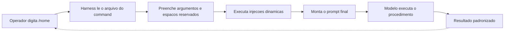

# Capítulo 5: Slash commands — o prompt determinístico sob demanda

## 1. Introdução

No Capítulo 4, você equipou suas skills com execução: scripts, references e assets deram poder de verdade às ferramentas da sua oficina. Agora vamos virar a chave para o outro lado da bancada: os commands. Enquanto a skill responde à pergunta "o que o agente precisa saber?", o command responde a "que sequência de ações deve acontecer quando eu disparar este procedimento?". É a bancada com o procedimento gravado no chão: o operador chama pelo nome e o fluxo completo acontece de forma determinística.

Ao final deste capítulo, você será capaz de criar commands customizados com frontmatter completo, usar argumentos e espaços reservados para parametrizar o fluxo, e controlar quem pode invocar o comando — manual, autônomo ou ambos. Com isso, você transforma rotinas repetitivas da equipe em contratos versionados, executáveis por qualquer pessoa com um `/`.

## 2. Explica

### O command como prompt determinístico

Um command é, na essência, um prompt que foi empacotado e versionado: um arquivo Markdown que o harness carrega e injeta no contexto quando o comando é invocado. A diferença para um prompt digitado de memória é a mesma que separa a bancada com procedimento gravado do improviso no chão da oficina: o command existe como artefato, pode ser revisado em pull request, testado em diferentes cenários e invocado por qualquer pessoa da equipe sem depender da memória de quem o criou [1]. A mesma lógica de empacotar procedimento em arquivo versionado sustenta os padrões de instrução de projeto como o AGENTS.md [11].

O harness trata o arquivo de command como um template: antes de entregar o prompt ao modelo, ele preenche os espaços reservados — os argumentos que o operador passou — e executa qualquer injeção dinâmica declarada no arquivo. O resultado é que um único arquivo pode servir de base para mil execuções diferentes, cada uma com seus parâmetros.

### Frontmatter: o controle de operação

O frontmatter do command é onde mora o controle de operação. O campo `description` descreve o que o comando faz — e, no caso dos commands, ele também serve ao autocomplete: o harness mostra a descrição quando o operador digita `/` no terminal [2]. O padrão aberto de agent skills estende essa mesma disciplina de metadados para o catálogo inteiro de comandos e habilidades [10]. O campo `argument-hint` exibe uma dica de argumento durante o autocomplete, ensinando o formato esperado. E o campo `disable-model-invocation` controla o modo de disparo: quando presente e verdadeiro, o modelo não pode invocar o comando autonomamente — apenas o operador, digitando `/nome`. Isso é essencial para commands com efeitos colaterais, como deploys ou limpezas, que não devem ser acionados por iniciativa própria do agente [3]. Cada plataforma agêntica expressa esse controle de invocação de um jeito próprio — o Windsurf, por exemplo, usa modos de ativação por contexto [12].

Há ainda os campos de permissão: `allowed-tools` e `disallowed-tools` concedem ou restringem ferramentas específicas durante a execução do comando, e `context: fork` permite rodar o comando em um subagente isolado, com contexto próprio. Cada campo é uma alavanca de segurança e de isolamento — o command certo com as permissões certas é um fluxo blindado.

### $ARGUMENTS e espaços reservados

O mecanismo de argumentação é o que torna o command genérico. `$ARGUMENTS` captura todo o texto digitado após o nome do comando — tudo o que o operador escrever depois do `/deploy` vai para o corpo do prompt. Já os espaços reservados indexados `$0`, `$1`, `$2` mapeiam argumentos posicionais individuais, permitindo que o command fixe o primeiro argumento em um lugar específico do prompt e dê prioridade de preenchimento aos demais [4].

Na prática, isso significa que um command de revisão pode ser invocado como `/review auth` e receber "auth" como escopo, ou um command de migração pode capturar o nome do arquivo e o ambiente de destino em posições determinadas. O design do command define o contrato: o que é obrigatório, o que tem default e o que o modelo pode inferir.

## 3. Ilustra

A oficina do Engenheiro Agêntico tem uma bancada especial, a única com uma placa na parede: "BANCADA DE REVISÃO DE CÓDIGO — procedimento gravado". Em vez de o operário explicar para um aprendiz novo todo o passo a passo de uma revisão — quais arquivos olhar, quais verificações rodar, em que ordem — ele apenas aponta para a placa: "revisão, escopo: autenticação". O aprendiz lê a placa, executa o procedimento gravado na ordem certa e produz o relatório no formato padrão.

A placa é o frontmatter do command: diz o que a bancada faz, como deve ser chamada e que permissões ela tem. O "escopo: autenticação" é o argumento `$1` — o parâmetro que muda a cada execução sem mudar o procedimento. E a razão de a bancada existir é a mesma razão de qualquer command: a revisão feita de memória variava de operário para operário; a revisão feita pelo procedimento gravado é sempre a mesma, sempre na mesma ordem, sempre com o mesmo relatório.



O motivo condutor continua firme: a bancada é o command, a placa é o frontmatter, o escopo digitado é o argumento. E como em toda oficina bem organizada, o que está gravado no chão não se perde quando o operário que o gravou sai de férias.

## 4. Técnica

### Criando o primeiro command

O comando abaixo, `revisar-pr`, encapsula um fluxo completo de revisão de pull request com escopo opcional. Ele usa frontmatter com `description`, `argument-hint` e `disable-model-invocation` — porque uma revisão com padrão de equipe não deve ser disparada autonomamente pelo modelo. Quando o command precisa consultar dados externos, o harness o conecta a servidores de ferramentas padronizados via MCP [14].

```markdown
---
description: Revisa pull requests seguindo o padrao da equipe. Escopo opcional
  filtra os arquivos analisados. Uso: /revisar-pr [escopo].
argument-hint: [escopo] - filtra a revisao por um caminho ou modulo
disable-model-invocation: true
---

Revise o pull request atual seguindo rigorosamente o procedimento abaixo.

## Procedimento de Revisão

1. Identifique o diff: rode `!git diff HEAD~1` para capturar as mudanças reais.
2. Escopo: $ARGUMENTS — se vazio, revise o diff inteiro; se preenchido,
   filtre os arquivos pelo escopo informado.
3. Verifique, em ordem: corretude funcional, cobertura de testes, segurança
   (segredos e injeção), e conformidade com o estilo do projeto.
4. Produza o relatório final no formato:

   ## Veredito
   - APROVADO / APROVADO COM RESSALVAS / REPROVADO
   - Lista de achados com severidade (bloqueador/alto/médio/baixo)
   - Sugestão de correção por achado
```

Repare na linha `!git diff HEAD~1`: é uma injeção dinâmica que roda o comando git no momento da execução e injeta a saída real no prompt — o modelo recebe o diff verdadeiro, não uma instrução para procurá-lo [5].

### Argumentos e espaços reservados na prática

A combinação de `$ARGUMENTS` com espaços reservados posicionais permite contratos de comando sofisticados. O comando abaixo exige dois argumentos posicionais com fallback para o `$ARGUMENTS` completo:

```markdown
---
description: Gera a estrutura de uma nova migracao de banco de dados.
argument-hint: <nome-da-migracao> [schema]
---

Gere a migracao solicitada.

- Nome da migracao (obrigatorio): $0
- Schema (opcional, padrao public): $1
- Demais instrucoes adicionais: $ARGUMENTS

Siga o padrao de migracoes do projeto descrito em @docs/MIGRACOES.md e
gere o arquivo no diretorio de migracoes com o template adequado.
```

A linha `@docs/MIGRACOES.md` é outra forma de injeção: anexa o conteúdo do arquivo referenciado ao prompt, garantindo que o modelo siga o padrão documentado sem precisar memorizá-lo [4]. A aquisição de conhecimento procedural por commands e skills é hoje um campo ativo de pesquisa, com taxonomias próprias [13].

### Validando commands no repositório

Assim como skills têm validação de frontmatter, commands merecem uma checagem automatizada — principalmente o campo `disable-model-invocation` em commands com efeitos colaterais. O script abaixo varre o diretório de commands e acusa commands de alto risco sem trava manual:

```python
# -*- coding: utf-8 -*-
"""Valida commands: frontmatter obrigatorio e trava em commands de alto risco."""
import re
import sys
from pathlib import Path

ALTO_RISCO = ("deploy", "delete", "drop", "rm -rf", "clean", "migrate")


def validar_command(caminho: str) -> list[str]:
    """Retorna erros do arquivo de command (vazio = valido)."""
    erros = []
    texto = Path(caminho).read_text(encoding="utf-8")
    m = re.match(r"\\A---\\n(?P<fm>.*?)\\n---", texto, re.DOTALL)
    if not m:
        return ["frontmatter ausente"]
    conteudo = m.group("fm")
    if not re.search(r"^description:\\s*\\S", conteudo, re.MULTILINE):
        erros.append("campo 'description' ausente")
    baixo = re.sub(r"^#.*$", "", texto, flags=re.MULTILINE).lower()
    arriscado = any(palavra in baixo for palavra in ALTO_RISCO)
    travado = bool(re.search(r"^disable-model-invocation:\\s*true", conteudo, re.MULTILINE))
    if arriscado and not travado:
        erros.append("command de alto risco sem 'disable-model-invocation: true'")
    return erros


if __name__ == "__main__":
    for caminho in sys.argv[1:]:
        problemas = validar_command(caminho)
        status = "OK" if not problemas else "; ".join(problemas)
        print(f"{caminho}: {status}")
```

O detalhe que vale destacar: a validação não é sobre sintaxe YAML — é sobre o contrato operacional. Um command de deploy sem trava manual é um acidente esperando para acontecer, e a validação automatizada transforma essa preocupação em um check que roda em CI [6].

### Argumentos com prioridade: o contrato de preenchimento

Além dos espaços reservados posicionais, o design de commands maduros define prioridade de preenchimento: o que o harness tenta preencher primeiro, o que tem fallback e o que é deduzido pelo modelo. Um command de migração, por exemplo, pode fixar o nome do arquivo como `$0`, aceitar o schema como `$1` com default documentado, e delegar ao modelo qualquer instrução adicional recebida em `$ARGUMENTS`. O contrato fica explícito no corpo do arquivo, e o harness preenche na ordem declarada.

```markdown
---
description: Executa o fluxo de review padrao com escopo opcional.
argument-hint: [escopo]
---

Escopo da revisao (opcional): $1
Demais instrucoes: $ARGUMENTS

Siga o procedimento padrao de review do repositorio.
```

A regra prática do contrato: argumentos obrigatórios têm posição fixa e são nomeados no prompt; argumentos opcionais têm default descrito; e o que sobra vai para `$ARGUMENTS`, onde o modelo decide como usar. Commands com esse design são fáceis de documentar, fáceis de testar e fáceis de ensinar a novos operadores [4]. A confiabilidade do command também melhora quando o uso de ferramentas é ensinado com verificação e reflexão sobre erros, como propõe o Tool-MVR [15].

## 5. Aplica

### A cena do deploy disparado pelo modelo

Imagine a cena, em segunda pessoa. Sua equipe criou um command `/deploy-staging` e ele funcionou perfeitamente na semana passada. Hoje, em uma sessão de debugging, você pede ao agente para "testar a correção no ambiente de staging" — e o agente, interpretando a intenção, dispara o command sozinho, sem você ter digitado nada. O deploy roda, e o ambiente de staging — que sua equipe usa para testes de integração compartilhados — é substituído no meio de uma validação de outra pessoa.

O erro acontece porque o command não tinha a trava de invocação: sem `disable-model-invocation: true`, o modelo pode acionar qualquer command cujo efeito pareça alinhado à sua intenção. O diagnóstico, ligando à teoria do capítulo: a alavanca de invocação é parte do contrato de segurança do command, não um detalhe. A correção é imediata — adicionar a trava ao frontmatter e revalidar — e a lição estrutural é que commands com efeitos colaterais fora do repositório (deploy, delete, publish) devem ser sempre de invocação manual, enquanto commands de leitura (review, analyze) podem ser invocados pelo modelo sem risco [7]. A visão do código como harness do agente reforça que commands são parte do substrato operacional — procedimentos executáveis e verificáveis [16].

Essa cena resume a natureza do command: ele é poderoso exatamente porque é determinístico — e perigoso pelo mesmo motivo, se o contrato de invocação não estiver gravado na placa.

### Armadilhas comuns ao criar commands

A primeira armadilha é criar commands que replicam prompts de uma pessoa específica: se o command codifica o jeito do João revisar código, a equipe herda o viés do João. O antídoto é escrever o procedimento a partir do padrão documentado da equipe, não de um exemplo pessoal. A segunda é negligenciar os argumentos: um command sem `$ARGUMENTS` nem espaços reservados é um prompt fixo disfarçado de comando — ainda vale a pena, mas perde a parametrização. A terceira é esquecer as injeções dinâmicas: sem `!git diff` ou `@arquivo`, o comando recebe o estado do mundo de ontem, não de agora. A quarta é acumular commands sem dono: commands sem revisor e sem teste viram dívida técnica como qualquer outro código [8]. Curadorias da área de harness consolidam essas práticas de governança de commands [17], e a medição objetiva de agentes em tarefas reais segue o padrão SWE-bench [18].

### Métricas de sucesso

Uma cultura de commands madura é mensurável em três eixos. Adoção: a proporção de rotinas repetitivas da equipe que têm um command correspondente. Consistência: a variação entre execuções do mesmo procedimento por pessoas diferentes — que deve tender a zero. E segurança: o número de commands de alto risco sem trava manual — que deve ser zero, e a validação em CI garante isso [9]. Quando um command amadurece, ele pode até ser distribuído como skill para outros projetos — o gerenciador de pacotes da Vercel Labs automatiza esse fluxo [19]. Comparações honestas de agentes exigem descrever esses comandos e permissões no harness por completo [20].

## 6. Conclusão

Neste capítulo, você dominou a bancada da oficina: o command como prompt determinístico versionado, o frontmatter como controle de operação — com destaque para a trava de invocação `disable-model-invocation` — e o mecanismo de argumentos com `$ARGUMENTS`, espaços reservados e injeções dinâmicas `!` e `@`. Você viu, na cena do deploy disparado pelo modelo, que o poder determinístico do command exige um contrato de invocação explícito.

O desafio para fixar: escolha a rotina mais repetitiva da sua equipe e crie o command correspondente — com frontmatter completo, um argumento e pelo menos uma injeção dinâmica. Depois rode o validador de commands do capítulo para conferir o contrato. No próximo capítulo, você vai levar os commands ao nível corporativo: injeção dinâmica avançada e workflows de equipe, com commands versionados que padronizam review, deploy e migração entre desenvolvedores.

## 8. Aprofundamento: o contrato de invocação e o catálogo de commands

### O command como contrato de contexto: o que o prompt realmente contém

Vale destrinchar o que acontece quando um command é invocado, porque a sequência define o que o modelo recebe. O harness lê o arquivo, processa o frontmatter, resolve os argumentos (preenchendo os espaços reservados na ordem declarada), executa as injeções dinâmicas e monta o prompt final com o corpo. A ordem desses passos é parte do contrato: os espaços reservados são resolvidos antes das injeções, e as injeções são executadas antes de o prompt ser entregue. Um command que assume outra ordem de processamento produz resultados inesperados — e por isso a documentação de cada harness descreve essa sequência [1].

O prompt resultante é a soma de quatro partes: o frontmatter (descrito ao modelo como contexto), os argumentos resolvidos, as saídas das injeções e o corpo do procedimento. Cada parte tem um papel e um tamanho: o corpo é o procedimento (deve ser enxuto), as injeções são o estado (devem ser limitadas) e os argumentos são a variação (devem ser validados). O command bem desenhado é aquele cujo prompt final o modelo consegue seguir sem ambiguidade — o teste da qualidade é ler o prompt resultante como se fosse a primeira vez [5].

### O design de argumentos: obrigatório, opcional e deduzido

O contrato de preenchimento do capítulo tem uma camada a mais que merece destaque: a classificação dos argumentos em três categorias. O argumento obrigatório é aquele sem o qual o procedimento não faz sentido — o command deve declarar o formato e falhar cedo se faltar. O argumento opcional tem um default documentado — o command deve declarar o default e o efeito da ausência. O argumento deduzido é aquele que o modelo infere do contexto — o command deve declarar o que o modelo pode inferir e o que ele não deve inventar. A classificação é o que torna o command documentável e testável: cada categoria tem casos de teste diferentes [4].

```python
# -*- coding: utf-8 -*-
"""Valida o preenchimento de argumentos de um command por categoria."""


def validar_argumentos(contrato: dict, recebidos: dict) -> list[str]:
    """Retorna erros de preenchimento (vazio = contrato atendido)."""
    erros = []
    for nome, regras in contrato.items():
        categoria = regras.get("categoria", "deduzido")
        if categoria == "obrigatorio" and nome not in recebidos:
            erros.append(f"argumento obrigatorio ausente: {nome}")
        if categoria == "opcional" and nome not in recebidos and "default" not in regras:
            erros.append(f"argumento opcional sem default: {nome}")
    return erros


if __name__ == "__main__":
    contrato = {
        "nome_migracao": {"categoria": "obrigatorio"},
        "schema": {"categoria": "opcional", "default": "public"},
        "instrucoes": {"categoria": "deduzido"},
    }
    print(validar_argumentos(contrato, {"nome_migracao": "criar_tabela"}))
```

A validação de contrato em CI é o complemento da validação de frontmatter: o frontmatter garante que o arquivo é válido; o contrato garante que as invocações serão válidas. Juntas, as duas validações transformam o command em um artefato com testes automatizados — a mesma disciplina do Capítulo 8 para skills, aplicada a commands [8].

### O ciclo de vida de um command

O command não nasce pronto: ele atravessa um ciclo de vida que espelha o de qualquer código de produção. Nasce como procedimento ad hoc (uma pessoa digitando os mesmos passos de memória), vira rascunho (o arquivo inicial com frontmatter mínimo), é testado (invocações reais em cenários de exemplo), é revisado (pull request com o padrão da equipe) e, por fim, é publicado no catálogo — a bancada oficial da oficina. O que este ciclo garante é que nenhum command entra no catálogo sem passar por revisão, e que o catálogo não acumula procedimentos órfãos [6].

A parte mais negligenciada do ciclo é a aposentadoria. Commands que perderam o uso — o procedimento mudou, a ferramenta foi substituída, o fluxo foi absorvido por outro comando — continuam no catálogo ocupando espaço de autocomplete e oferecendo ao modelo um gatilho obsoleto. A política madura define os mesmos critérios que o Capítulo 10 vai detalhar para skills: tempo sem invocação, substituição por comando mais novo e revisão periódica do catálogo. Um catálogo que só cresce é um catálogo que envelhece mal [8].

### O autocomplete como superfície de contrato

Há um detalhe do frontmatter de command que costuma ser subestimado: a `description` aparece no autocomplete quando o operador digita `/`. Isso significa que a descrição não é apenas metadado para o modelo — é texto que humanos leem a cada invocação, muitas vezes a cada dia. Uma descrição que mostra o formato dos argumentos, o efeito do comando e o seu nível de risco ensina o operador enquanto ele digita; uma descrição vaga força o operador a abrir o arquivo ou adivinhar [2].

```python
# -*- coding: utf-8 -*-
"""Avalia a qualidade da descricao de um command para o autocomplete."""


def avaliar_descricao(descricao: str, argumento_hint: str) -> dict:
    """Verifica se a descricao informa efeito, argumentos e risco."""
    baixo = descricao.lower()
    tem_verbo = any(v in baixo for v in ("revisa", "gera", "executa", "publica", "deploy"))
    tem_efeito = any(v in baixo for v in ("pull request", "migracao", "ambiente", "testes"))
    tem_risco = any(v in baixo for v in ("cuidado", "risco", "destrutivo", "permanente"))
    nota = sum([tem_verbo, tem_efeito, bool(argumento_hint.strip())])
    return {
        "nota": nota, "verbo": tem_verbo, "efeito": tem_efeito,
        "argumento_documentado": bool(argumento_hint.strip()),
        "risco_explicito": tem_risco,
    }


if __name__ == "__main__":
    print(avaliar_descricao("Revisa pull requests no padrao da equipe", "[escopo]"))
```

### A hierarquia de invocação: manual, assistida e autônoma

O campo `disable-model-invocation` é um interruptor binário, mas o desenho maduro de commands enxerga uma hierarquia de três níveis. No nível manual, apenas o operador dispara — o padrão para efeitos colaterais. No nível assistido, o modelo propõe e o operador confirma — o padrão para ações de alcance médio, como gerar uma migração que será revisada. No nível autônomo, o modelo dispara sozinho — o padrão apenas para comandos de leitura sem efeito colateral. A hierarquia não é sobre limitar o agente: é sobre alinhar o nível de autonomia ao custo do erro [7].

```python
# -*- coding: utf-8 -*-
"""Seleciona o nivel de invocacao conforme o custo do erro do command."""


def nivel_invocacao(custo_erro: str, efeito_colateral: bool) -> str:
    """Retorna o nivel de invocacao recomendado para um command."""
    if efeito_colateral or custo_erro in ("alto", "critico"):
        return "manual"
    if custo_erro == "medio":
        return "assistido"
    return "autonomo"


if __name__ == "__main__":
    exemplos = [
        ("revisar-pr", "baixo", False),
        ("gerar-migracao", "medio", True),
        ("deploy-producao", "critico", True),
    ]
    for nome, custo, efeito in exemplos:
        print(f"{nome}: {nivel_invocacao(custo, efeito)}")
```

A hierarquia resolve a ambiguidade que a cena do deploy do capítulo expôs: o problema não era o modelo ser autônomo demais em geral, era um command de efeito colateral estar configurado como autônomo. Com a hierarquia explícita, o erro vira um caso de configuração, não um acidente de arquitetura [3].

### Commands e skills: o contrato de composição

Um command raramente opera sozinho: ele compõe skills, tools e outros commands. O contrato de composição tem duas regras que evitam a duplicação de conhecimento. A primeira: o command orquestra, a skill conhece — o command define a sequência de passos e chama a skill para o detalhe, nunca repete o conhecimento que a skill já carrega. A segunda: a referência é por nome, não por conteúdo — o command invoca `skill:documentar-api` e não cola o corpo da skill no arquivo do command. A composição por referência é o que mantém a fonte única de verdade que o Capítulo 3 estabeleceu [10].

```markdown
---
description: Gera e revisa a documentacao de API de um servico.
argument-hint: <servico>
---

Gere a documentacao do servico $0.

1. Use a skill documentar-api para o esqueleto e o padrao da equipe.
2. Rode !git diff HEAD~1 para conferir se a API mudou desde a ultima doc.
3. Entregue o resultado no formato da equipe.
```

Esse command, em quatorze linhas, mostra a composição ideal: a skill carrega o conhecimento profundo (padrão, templates, scripts), o command carrega a sequência e a injeção dinâmica, e o conhecimento não é duplicado em lugar nenhum. A fronteira entre as camadas — orquestração no command, conhecimento na skill — é o mesmo teste do acionamento do Capítulo 2, aplicado agora à composição [5].

### O teste do command: invocação, argumentos e resultado

O capítulo validou o frontmatter e o contrato de invocação; o aprofundamento é o teste de comportamento. Um command merece três camadas de teste. A primeira é o teste de montagem: dados os argumentos, o prompt resultante contém o procedimento correto, os espaços reservados preenchidos e as injeções executadas — o teste do prompt, que verifica o que o modelo vai receber. A segunda é o teste de execução: rodado o command de ponta a ponta em um cenário controlado, o resultado segue o procedimento — o teste de integração. A terceira é o teste de contrato: os argumentos obrigatórios são exigidos, os opcionais respeitam o default e o `disable-model-invocation` bloqueia a invocação autônoma quando configurado [1].

```python
# -*- coding: utf-8 -*-
"""Teste de montagem: verifica o prompt final de um command."""


def montar_prompt(corpo: str, argumentos: dict, injecoes: dict) -> str:
    """Monta o prompt resolvendo espacos reservados e injecoes."""
    prompt = corpo
    for chave, valor in argumentos.items():
        prompt = prompt.replace(chave, valor)
    for marcador, saida in injecoes.items():
        prompt = prompt.replace(marcador, saida)
    return prompt


if __name__ == "__main__":
    corpo = "Escopo: $1\nDiff:\n!diff\n"
    prompt = montar_prompt(corpo, {"$1": "auth"}, {"!diff": "3 arquivos alterados"})
    print(prompt)
    assert "$1" not in prompt and "!diff" not in prompt
    print("contrato de montagem OK")
```

A camada de montagem é a mais barata de automatizar e a que mais falhas pega: ela revela espaços reservados não resolvidos, injeções que produziram erro e o crescimento inesperado do prompt. Testar a montagem é testar o que o modelo realmente vê — o mesmo princípio do contrato de contexto deste capítulo [5].

### Commands como documentação executável do processo

Uma propriedade dos commands que as equipes subestimam é o seu papel como documentação: o command é o processo da equipe em forma executável. Quando alguém pergunta "como a gente faz deploy aqui?", a resposta correta não é um parágrafo explicativo — é o comando. Quando o processo muda, a mudança acontece no arquivo do command, revisada em pull request, com histórico no git. Essa propriedade elimina a distância entre documentar e executar: não existe "a documentação diz uma coisa e a prática faz outra", porque documentação e prática são o mesmo artefato [3].

A implicação prática é que commands merecem o mesmo cuidado de escrita que a documentação oficial: clareza, consistência e revisão. Um command confuso é uma documentação confusa que ainda por cima executa — o pior dos dois mundos. O comando como documentação executável é o que permite o onboarding assíncrono da equipe: o novato não precisa de alguém explicando o fluxo, ele lê e executa o command [9].

### O command como alavanca de consistência

Fechando o capítulo, vale nomear o que o command compra em termos organizacionais: consistência. A equipe que executa um procedimento pelo command executa o mesmo procedimento, sempre — na mesma ordem, com as mesmas verificações, com o mesmo formato de resultado. A consistência é o insumo de todas as métricas do capítulo: a comparação entre execuções só faz sentido quando as execuções são comparáveis, e o command é o que torna a execução comparável [6]. É também o insumo da medição do Capítulo 10: uma organização que mede seus fluxos com commands mede fluxos padronizados, e a padronização é o que dá sentido às comparações ao longo do tempo. A consistência não é o objetivo do command — é o seu efeito colateral mais valioso, e é ela que transforma rotinas individuais em processo organizacional [9].

### O limite do command: o que não deve ser gravado na bancada

Fechando o capítulo com um contraponto necessário: nem todo procedimento merece virar command. O command congela uma sequência — e congelar a sequência errada é pior que não ter sequência. Três tipos de procedimento não merecem a bancada. O primeiro é o procedimento que muda toda semana: o command é reescrito com frequência maior que o uso, e a manutenção vira o custo dominante. O segundo é o procedimento que depende de julgamento sutil: a sequência certa varia com o contexto de forma que um prompt fixo não captura — o command força a simplificação. O terceiro é o procedimento de uso único: a rotina que acontece uma vez por trimestre não paga o custo de ser descoberta, mantida e confiada pela equipe [6].

O limite do command é o mesmo limite de qualquer automação: automatize o que é repetido, estável e de erro caro — e deixe no raciocínio o que é raro, mutável e de julgamento. A régua do Capítulo 1, aplicada aos commands, é o mesmo instrumento: frequência, estabilidade e custo de erro. A bancada é uma ferramenta poderosa — e ferramentas poderosas pedem critério sobre o que gravar nelas [8].

### O acoplamento entre commands: quando um chama o outro

Commands raramente são ilhas: um command de deploy pode invocar um command de verificação pré-deploy, que por sua vez usa uma skill de análise. O acoplamento entre commands segue as mesmas regras do acoplamento entre skills: referência por nome estável, propósito explícito e hierarquia clara. O command-pai orquestra a sequência; o command-filho executa um subfluxo reutilizável. A alternativa — duplicar o subfluxo em cada command — é a fonte mais comum de divergência: dois deploys que começam idênticos e divergem com o tempo porque foram copiados em vez de referenciados [2].

```python
# -*- coding: utf-8 -*-
"""Verifica acoplamento duplicado entre commands do catalogo."""
import re
from pathlib import Path


def detectar_duplicacao(diretorio: str, fragmento: str) -> list[str]:
    """Encontra commands que repetem o mesmo fragmento de procedimento."""
    duplicados = []
    for arquivo in sorted(Path(diretorio).glob("*.md")):
        texto = arquivo.read_text(encoding="utf-8")
        if fragmento in texto:
            duplicados.append(arquivo.stem)
    return duplicados


if __name__ == "__main__":
    duplicados = detectar_duplicacao(".claude/commands", "verificar pre-requisitos")
    print(duplicados or "nenhum comando duplica este fragmento")
```

A varredura de duplicação é uma métrica de saúde do catálogo: fragmentos repetidos entre commands sinalizam onde a composição deveria substituir a cópia. O mesmo padrão de auditoria — detectar duplicação, promover referência — é o que mantém o conhecimento da oficina em um lugar só, como o Capítulo 3 estabeleceu para skills [6].

### O onboarding com commands: o novato que executa

Uma das aplicações mais imediatas dos commands é o onboarding. O fluxo tradicional tem um custo alto: o novato precisa de alguém explicando cada fluxo, com o conhecimento vivo de quem já está na equipe. Com commands versionados, o onboarding muda de natureza: o novato lê o catálogo, executa os commands dos fluxos básicos e aprende o processo pela execução — o erro no ambiente controlado ensina mais que a explicação no abstrato [4].

O catálogo de commands vira o currículo da equipe: a sequência de commands que o novato executa na primeira semana (verificar ambiente, rodar testes, revisar PR, preparar deploy) é o mapa do processo real — não do processo documentado, mas do que de fato roda. A lacuna do currículo — o fluxo que não tem command — é a lacuna do onboarding: o novato vai precisar perguntar exatamente onde a equipe não padronizou. O catálogo revela a dívida de documentação da equipe de forma objetiva [9].

### Medindo a saúde do catálogo de commands

O catálogo de commands, como qualquer ativo, merece métricas de saúde. Três números contam a história. A taxa de commands com trava manual entre os de efeito colateral — deve ser 100%, e a validação em CI garante. A idade média dos commands sem revisão — cresce quando o catálogo é abandonado. E a taxa de invocação por command — separa os procedimentos vivos dos mortos, alimentando a política de aposentadoria. A gestão do catálogo é cíclica: revisar descrições, atualizar procedimentos, aposentar o que morreu — a mesma disciplina que organizações maduras aplicam aos seus processos operacionais [9].

## 7. Referências Bibliográficas

[1] ANTHROPIC. *Claude Code SDK — Slash Commands*. Disponível em: https://code.claude.com/docs/en/agent-sdk/slash-commands. Acesso em: 06 ago. 2026.
[2] ANTHROPIC. *Claude Code Skills Documentation*. Disponível em: https://code.claude.com/docs/en/skills. Acesso em: 06 ago. 2026.
[3] ANTHROPIC. *Agent Skills — Claude Platform Docs*. Disponível em: https://platform.claude.com/docs/en/agents-and-tools/agent-skills/overview. Acesso em: 06 ago. 2026.
[4] CURSOR. *Cursor Rules Documentation*. Disponível em: https://cursor.com/docs/rules. Acesso em: 06 ago. 2026.
[5] BUI, et al. *Building AI Coding Agents for the Terminal: Scaffolding, Harness, Context Engineering, and Lessons Learned*. Disponível em: https://arxiv.org/abs/2603.05344. Acesso em: 06 ago. 2026.
[6] GETDX. *AI Code Generation: Best Practices for Enterprise Adoption*. Disponível em: https://getdx.com/blog/ai-code-enterprise-adoption/. Acesso em: 06 ago. 2026.
[7] MEDIUM (HEEKI PARK). *Collaborating with Agent Teams in Claude Code*. Disponível em: https://heeki.medium.com/collaborating-with-agents-teams-in-claude-code-f64a465f3c11. Acesso em: 06 ago. 2026.
[8] FLORIANBRUNIAUX. *Claude Code Ultimate Guide — Agent Teams*. Disponível em: https://github.com/FlorianBruniaux/claude-code-ultimate-guide. Acesso em: 06 ago. 2026.
[9] ANTHROPIC. *Effective Harnesses for Long-Running Agents*. Disponível em: https://www.anthropic.com/engineering/effective-harnesses-for-long-running-agents. Acesso em: 06 ago. 2026.
[10] AGENTSKILLS.IO. *Agent Skills Specification*. Disponível em: https://agentskills.io/specification. Acesso em: 06 ago. 2026.
[11] OPENAI. *Custom Instructions with AGENTS.md*. Disponível em: https://learn.chatgpt.com/docs/agent-configuration/agents-md. Acesso em: 06 ago. 2026.
[12] WINDSURF (CODEIUM). *Windsurf Documentation*. Disponível em: https://codeium.com/windsurf. Acesso em: 06 ago. 2026.
[13] XU, Renjun; YAN, Yang. *Agent Skills for Large Language Models: Architecture, Acquisition, Security, and the Path Forward*. Disponível em: https://arxiv.org/abs/2602.12430. Acesso em: 06 ago. 2026.
[14] KRISHNAN, Naveen. *Advancing Multi-Agent Systems Through Model Context Protocol*. Disponível em: https://arxiv.org/abs/2504.21030. Acesso em: 06 ago. 2026.
[15] MA, Zhiyuan; LIU, Jiayu; LUO, Xianzhen; HUANG, Zhenya; ZHU, Qingfu; CHE, Wanxiang. *Tool-MVR: Meta-Verification and Reflection Learning for Reliable Tool-Use*. Disponível em: https://arxiv.org/abs/2506.04625. Acesso em: 06 ago. 2026.
[16] ZHANG, et al. *Code as Agent Harness: Toward Executable, Verifiable, and Stateful Agent Systems*. Disponível em: https://arxiv.org/abs/2605.18747. Acesso em: 06 ago. 2026.
[17] RUCAIBOX. *Awesome Agent Harness*. Disponível em: https://github.com/RUCAIBox/awesome-agent-harness. Acesso em: 06 ago. 2026.
[18] SWEBENCH. *SWE-bench Verified & Pro*. Disponível em: https://www.swebench.com. Acesso em: 06 ago. 2026.
[19] VERCEL LABS. *Skills — package manager for agent skills*. Disponível em: https://github.com/vercel-labs/skills. Acesso em: 06 ago. 2026.
[20] *Stop Comparing LLM Agents Without Disclosing the Harness*. Disponível em: https://arxiv.org/abs/2605.23950. Acesso em: 06 ago. 2026.
