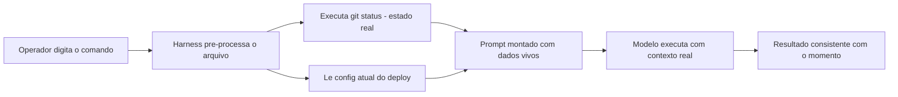

# Capítulo 6: Injeção dinâmica e workflows de equipe

## 1. Introdução

No Capítulo 5, você criou commands com frontmatter, argumentos e trava de invocação. A bancada está montada — mas um command que trabalha com dados de ontem é uma bancada que produz peças desalinhadas. Este capítulo é sobre a diferença entre um command estático e um command vivo: a injeção dinâmica de contexto, que busca o estado real do mundo no momento exato da execução, e o uso de commands como contratos de equipe versionados em git.

Ao final deste capítulo, você será capaz de construir commands que capturam diffs reais, estados de banco e conteúdo de arquivos na hora — e de organizar o catálogo de commands da sua equipe como um contrato revisável, testável e distribuível. É aqui que a oficina individual vira a fábrica de um time.

## 2. Explica

### O ciclo do command vivo: medir antes de agir

O princípio operacional que organiza este capítulo é simples de enunciar: todo command que toma decisão sobre o mundo deve medir o mundo antes de agir. Um command de deploy decide se a branch está pronta; um command de relatório decide o que incluir; um command de migração decide o que processar. Em todos os casos, a decisão é melhor quando a medição é fresca — e a injeção dinâmica é exatamente o mecanismo de medição fresca.

Essa mentalidade muda a forma de escrever commands: em vez de descrever o que verificar, você primeiro lista o que medir (as linhas `!` e `@`), depois escreve o procedimento que usa as medições. O prompt deixa de ser um pedido ao modelo para "descobrir o estado" e passa a ser um procedimento que recebe o estado pronto. A diferença é sutil no texto e enorme na confiabilidade [1].

### O problema do estado congelado

Um command sem injeção dinâmica sofre do problema do estado congelado: o prompt que ele monta descreve o mundo como ele era quando alguém escreveu o command — ou como o modelo imagina que ele seja. Em código, isso seria equivalente a rodar um build com cache nunca invalidado: o resultado parece certo até que algo depende do estado real e quebra.

A solução é a injeção dinâmica: linhas no arquivo do command que o harness executa antes de montar o prompt, capturando o estado atual do ambiente. Existem duas formas principais. A primeira é a execução de comandos de sistema com `!`: uma linha `!git status` roda o comando e injeta a saída no prompt — o modelo vê o estado real do repositório, não uma descrição dele. A segunda é a referência a arquivos com `@`: a linha `@package.json` anexa o conteúdo atual do arquivo ao prompt [1]. O padrão aberto de agent skills estende essa disciplina de carregamento sob demanda para o catálogo inteiro [11].

### Por que isso muda o jogo para a equipe

Quando commands carregam estado real, eles deixam de ser receitas genéricas e viram procedimentos situados: a mesma bancada produz o resultado certo para a situação atual. Isso é o que permite padronizar rotinas complexas de equipe — revisão de código, deploy, migração, geração de relatórios — sem abrir mão da especificidade de cada execução [2]. A aquisição de conhecimento procedural por commands e skills é hoje um campo ativo de pesquisa, com taxonomias próprias [12].

A organização corporativa de commands segue um padrão consistente em todas as plataformas agênticas: um diretório de commands no repositório, versionado como qualquer outro código, com review em pull request e testes em CI. O command vira parte da base de conhecimento da equipe — um contrato entre humanos e agentes que registra como a organização espera que determinados fluxos aconteçam [3]. Quando o command precisa acessar dados externos, o harness o conecta a servidores de ferramentas padronizados via MCP [13].

### O command como contrato versionado

Um command versionado é um contrato em três sentidos. Primeiro, contrato de execução: a equipe sabe o que acontece quando alguém digita `/deploy-staging`, porque o procedimento está escrito e revisado. Segundo, contrato de contexto: a injeção dinâmica garante que o comando trabalhe com o estado real, não com suposições. Terceiro, contrato de evolução: mudanças no procedimento passam por review e ficam no histórico do git — é possível saber quando e por que o fluxo mudou [4]. A confiabilidade do fluxo também melhora quando o uso de ferramentas é ensinado com verificação e reflexão sobre erros, como propõe o Tool-MVR [14].

## 3. Ilustra

A oficina do Engenheiro Agêntico tem uma regra de ouro: nenhuma peça é produzida com medida de ontem. A bancada de torneamento tem um paquímetro digital conectado à mesa — quando o operário inicia o serviço, o paquímetro mede a peça naquele instante e o número aparece na tela. O operário não pergunta "qual era o tamanho da última peça?" — ele lê o número atual e ajusta a máquina.

A injeção dinâmica é esse paquímetro digital. O command é a bancada; a linha `!git diff` é a medição na hora; a linha `@config.toml` é a ficha técnica da peça atual, puxada do armário no momento exato. E a placa na parede — o contrato da equipe — diz qual bancada deve ser usada para cada serviço, para que nenhum operário improvise uma bancada nova quando já existe uma gravada.



O motivo condutor se mantém: o command é a bancada, a injeção é o paquímetro, o contrato é a placa na parede. E a fábrica inteira — não mais a oficina individual — funciona com a mesma disciplina: procedimento gravado, medição na hora, resultado padronizado.

## 4. Técnica

### Construindo um command vivo

O command abaixo, `relatorio-cobertura`, captura o estado real do projeto — o diff da branch e o relatório de cobertura — antes de pedir a análise. Ele usa as duas formas de injeção: `!` para executar comandos e `@` para anexar arquivos.

```markdown
---
description: Gera relatorio de cobertura de testes comparando a branch atual
  com a main. Uso: /relatorio-cobertura [caminho-filtro].
argument-hint: [caminho-filtro] - limita o relatorio a um diretorio
disable-model-invocation: true
---

Gere o relatorio de cobertura de testes do projeto.

## Estado capturado na hora

Arquivos modificados nesta branch:
!git diff --name-only main...HEAD

Relatorio de cobertura atual:
!python -m pytest --cov=. --cov-report=term-missing -q 2>&1 | tail -40

Filtro opcional: $ARGUMENTS

## Procedimento

1. Analise a lista de arquivos modificados contra os dados de cobertura.
2. Identifique arquivos com mudancas significativas e cobertura abaixo do minimo.
3. Gere o relatorio em Markdown com tabela: arquivo, cobertura, risco, acao sugerida.
4. Encerre com uma recomendacao de onde adicionar testes primeiro.
```

A mágica está nas linhas `!`: quando o operador digita o comando, o harness roda `git diff --name-only` e `pytest --cov` naquele instante e injeta as saídas reais no prompt. O modelo analisa dados vivos, não lembranças [5]. A visão do código como harness do agente reforça que esses procedimentos são parte do substrato operacional — executáveis e verificáveis [15]. Comparações honestas exigem descrever esse harness por completo [16].

### Versionando commands como contrato de equipe

O catálogo de commands da equipe merece o mesmo tratamento que o código: diretório próprio, revisão em PR e validação em CI. A estrutura típica:

```bash
.claude/commands/
├── revisar-pr.md
├── relatorio-cobertura.md
├── deploy-staging.md
└── gerar-migracao.md
```

Cada arquivo é um procedimento revisável. A validação em CI garante que todo command novo tenha frontmatter válido e trava de invocação quando necessário — a mesma disciplina que você viu no Capítulo 5, agora aplicada em escala de equipe. O script de validação roda em um pipeline e reprova pull requests que adicionem commands malformados [6]. A medição objetiva de agentes em tarefas reais segue o padrão SWE-bench [17].

### O contrato de injeção: o que o command pode medir

Nem toda medição é segura de executar. O contrato de injeção define três regras. Primeira: o comando injetado deve ser de leitura ou, quando de escrita, restrito ao escopo do procedimento — um command de diagnóstico não deve criar artefatos fora do diretório temporário. Segunda: a saída injetada deve ser limitada — injetar 10 mil linhas de log estoura a janela e degrada a qualidade; use `tail`, `head` e filtros. Terceira: erros de medição devem ser visíveis — se o `!git status` falhar, o comando deve reportar a falha, não fingir que mediu [7].

```markdown
---
description: Reporta a saude do servico de autenticacao.
---

Medidas do servico (com limite de linhas para nao estourar o contexto):
!systemctl status auth-service --no-pager 2>&1 | head -20
!journalctl -u auth-service --since "1 hour ago" --no-pager 2>&1 | tail -30

Se qualquer medicao falhar, reporte a falha explicitamente antes de analisar.
```

O contrato de injeção transforma a medição em parte auditável do procedimento: a equipe revisa o que o command mede, com que limite e com que tratamento de erro — a mesma disciplina que aplica a qualquer código que toca o sistema [14].

### Padrões de injeção avançada

Além de `!` e `@`, commands maduros combinam injeção com argumentos para cenários mais sofisticados. O padrão abaixo mostra um command de diagnóstico que parametriza a profundidade da análise e injeta logs recentes:

```markdown
---
description: Diagnostica erros de servico usando logs recentes e config atual.
argument-hint: <servico> [linhas-de-log]
---

Diagnostique o servico $0 usando os recursos abaixo.

Logs recentes do servico:
!journalctl -u $0 --no-pager -n ${1:-100} 2>&1

Configuracao atual:
@config/$0.toml

Se o arquivo de config nao existir, informe isso explicitamente e
continue com os logs. Relate: sintoma, causa provavel, acao de correcao.
```

Repare no uso de `$0` tanto no texto quanto dentro da injeção `!journalctl -u $0`: o harness resolve o espaço reservado antes de executar o comando, o que permite commands paramétricos vivos — o mesmo arquivo serve para qualquer serviço do catálogo [7].

### Combinando injeção com branches de decisão

Um command vivo não precisa ser linear: ele pode combinar injeções com pontos de decisão, fazendo o agente agir diferente conforme o estado capturado. O padrão abaixo mostra um command de verificação pré-deploy que injeta o estado e instrui o agente a escolher o próximo passo com base no que encontrar:

```markdown
---
description: Verifica pre-requisitos de deploy e reporta riscos.
disable-model-invocation: true
---

Verifique os pre-requisitos de deploy capturando o estado atual.

Branches e estado do repositorio:
!git status --short && git log --oneline -3

Testes pendentes ou falhando:
!python -m pytest -q --tb=no 2>&1 | tail -5

Se algum pre-requisito falhar, NÃO continue: liste o problema,
indique o comando de correcao e encerre com a recomendacao.
Se tudo estiver verde, siga o procedimento padrao de deploy descrito
em @docs/FLUXO_DEPLOY.md.
```

O padrão de decisão é o que dá inteligência situacional ao command: em vez de um fluxo cego, o procedimento reage ao estado real — avança quando está verde, para e reporta quando há risco. Essa é a diferença entre uma bancada que apenas executa e uma bancada que opera com bom senso [8]. Quando um command amadurece, ele pode ser distribuído como skill para outros projetos — o gerenciador de pacotes da Vercel Labs automatiza esse fluxo [18].

### Validando commands de equipe em CI

A validação de commands em escala de equipe combina as checagens do Capítulo 5 com regras de organização. O script abaixo verifica que todo command do repositório tem frontmatter válido e que nenhum command de alto risco perdeu a trava:

```python
# -*- coding: utf-8 -*-
"""Valida todos os commands do repositorio para CI."""
import re
import sys
from pathlib import Path

ALTO_RISCO = ("deploy", "delete", "drop", "rm -rf", "clean", "migrate", "publish")


def validar_repo(diretorio: str) -> tuple[list[str], int]:
    """Retorna (erros, total_validados)."""
    erros = []
    arquivos = sorted(Path(diretorio).rglob("*.md"))
    for arquivo in arquivos:
        texto = arquivo.read_text(encoding="utf-8")
        m = re.match(r"\\A---\\n(?P<fm>.*?)\\n---", texto, re.DOTALL)
        if not m:
            erros.append(f"{arquivo.name}: frontmatter ausente")
            continue
        conteudo = m.group("fm")
        if not re.search(r"^description:\\s*\\S", conteudo, re.MULTILINE):
            erros.append(f"{arquivo.name}: description ausente")
        baixo = re.sub(r"^#.*$", "", texto, flags=re.MULTILINE).lower()
        arriscado = any(p in baixo for p in ALTO_RISCO)
        travado = bool(re.search(r"^disable-model-invocation:\\s*true", conteudo, re.MULTILINE))
        if arriscado and not travado:
            erros.append(f"{arquivo.name}: alto risco sem trava de invocacao")
    return erros, len(arquivos)


if __name__ == "__main__":
    erros, total = validar_repo(sys.argv[1] if len(sys.argv) > 1 else ".claude/commands")
    for erro in erros:
        print(f"[ERRO] {erro}")
    print(f"Commands validados: {total}, erros: {len(erros)}")
    sys.exit(1 if erros else 0)
```

## 5. Aplica

### A cena do deploy com dados de ontem

Imagine a cena, em segunda pessoa. Você criou um command `/deploy-staging` baseado em um template da internet. Ele funciona — mas o procedimento instrui o agente a "verificar se a branch está atualizada" sem nenhuma injeção. Na execução de hoje, a branch está três commits atrás da main, e ninguém percebe porque o command não captura o estado real. O deploy sobe com código desatualizado, e o teste de integração da equipe falha no meio da tarde.

O erro acontece porque o command descrevia o que verificar, mas não capturava o estado: sem `!git status` ou `!git fetch origin main && git log main...HEAD`, o modelo "verificava" com base no que ele conseguia ver do diretório — que podia estar desatualizado. O diagnóstico, ligando à teoria: o estado congelado. A correção é adicionar as injeções dinâmicas ao command — `!git fetch origin main 2>&1` e `!git log --oneline origin/main...HEAD` — para que o procedimento trabalhe com o estado real, como o paquímetro digital da oficina.

Essa cena mostra por que injeção dinâmica não é um luxo: é o que separa um command confiável de um command que "funciona na maioria das vezes" [8]. Frameworks metodológicos como o Superpowers já nascem impondo essa disciplina de procedimentos vivos e versionados [19].

### Armadilhas comuns dos workflows de equipe

A primeira armadilha é o command sem medição: procedimentos que descrevem verificações sem capturar o estado real, herdando o problema da cena acima. A segunda é a injeção insegura: usar `!` com comandos que dependem de entrada não validada do operador — o espaço reservado em injeção deve ser tratado como dado, nunca como código, e comandos de alto risco devem validar o escopo. A terceira é o catálogo sem dono: commands acumulados sem revisão viram dívida — a validação em CI é o antídoto. A quarta é documentar o command no chat em vez do arquivo: a conversa se perde; o arquivo versionado permanece [9]. Cada plataforma agêntica expressa os modos de ativação dos seus fluxos de um jeito próprio — o Windsurf, por exemplo, usa modos por contexto de workspace [20].

### Métricas de sucesso

Uma equipe com commands vivos mostra três sinais. Primeiro: a taxa de sucesso de primeira execução dos procedimentos padronizados sobe, porque o estado real elimina as suposições. Segundo: o tempo de onboarding de novos devs cai, porque os fluxos da equipe estão gravados em commands com injeção — o novato não precisa perguntar como se faz. Terceiro: a frequência de "deu errado porque estava desatualizado" tende a zero, porque os commands medem o mundo antes de agir [10].

## 6. Conclusão

Neste capítulo, você transformou commands estáticos em procedimentos vivos. Você entendeu o problema do estado congelado e a solução da injeção dinâmica com `!` e `@`; aprendeu a combinar injeção com espaços reservados para criar commands paramétricos; e viu o command como contrato de equipe — versionado, revisado e validado em CI.

O desafio para fixar: pegue o command que você criou no Capítulo 5 e adicione pelo menos duas injeções dinâmicas — uma `!` para estado real e uma `@` para configuração atual. Depois rode o validador de repo em CI e versionou o resultado. No próximo capítulo, você vai levar suas skills e commands para fora da oficina local: marketplaces, portabilidade e o padrão aberto de distribuição.

## 8. Aprofundamento: a disciplina do command vivo

### O contrato de medição: o que medir, com qual limite, com qual erro

A injeção dinâmica é uma medição, e toda medição tem três decisões: o que medir, com qual limite e com qual tratamento de erro. O que medir é decidido pelo procedimento — cada injeção deve corresponder a um passo que precisa do estado real. O limite é decidido pelo orçamento de contexto — cada injeção deve limitar a saída (head, tail, filtros) para não estourar a janela. O tratamento de erro é decidido pela confiabilidade — o command deve dizer o que fazer quando a medição falha: reportar, abortar ou prosseguir com aviso. As três decisões juntas formam o contrato de medição, e um command que não as declara está medindo sem contrato — o sintoma do estado congelado disfarçado de command vivo [1].

```python
# -*- coding: utf-8 -*-
"""Contrato de medicao: define alvo, limite e tratamento de erro."""


def aplicar_contrato(saida: str, limite: int, tratamento: str) -> str:
    """Limita a saida da medicao e aplica o tratamento de erro declarado."""
    if not saida.strip():
        return f"medicao vazia - tratamento: {tratamento}"
    linhas = saida.splitlines()
    if len(linhas) > limite:
        return "\n".join(linhas[:limite]) + f"\n... ({len(linhas) - limite} linhas omitidas)"
    return saida


if __name__ == "__main__":
    saida = "\n".join(f"linha {i}" for i in range(100))
    print(aplicar_contrato(saida, limite=10, tratamento="avisar"))
```

O contrato de medição é o que torna a injeção auditável: a revisão do command compara o contrato declarado com o procedimento que usa a medição, e a divergência vira item de revisão. É a mesma disciplina do contrato de saída do Capítulo 4, aplicada ao command [7].

### O custo de medição: nem toda injeção é gratuita

A injeção dinâmica resolve o estado congelado, mas introduz um custo que a equipe precisa orçar: o tempo e os tokens de cada medição. Um command com três injeções pesadas — um `git log` completo, um relatório de cobertura e um dump de configuração — pode injetar centenas de linhas no prompt e dobrar o custo da execução. O desenho maduro trata a injeção como um orçamento: cada linha `!` ou `@` deve ter um motivo explícito, e o volume injetado deve ser limitado por `head`/`tail`/filtros, como o contrato do Capítulo 5 já estabelecia [1].

```python
# -*- coding: utf-8 -*-
"""Estima o custo de contexto das injecoes dinamicas de um command."""
import re
from pathlib import Path


def custo_injecoes(caminho_command: str, tokens_por_linha: int = 12) -> dict:
    """Conta as injecoes do command e estima o volume que elas geram."""
    texto = Path(caminho_command).read_text(encoding="utf-8")
    injecoes_exclamacao = re.findall(r"^!.*$", texto, re.MULTILINE)
    injecoes_arroba = re.findall(r"^@.*$", texto, re.MULTILINE)
    return {
        "injecoes_execucao": len(injecoes_exclamacao),
        "injecoes_arquivo": len(injecoes_arroba),
        "estimativa_tokens": (len(injecoes_exclamacao) + len(injecoes_arroba)) * tokens_por_linha,
    }


if __name__ == "__main__":
    print(custo_injecoes(".claude/commands/relatorio-cobertura.md"))
```

O orçamento de injeção não é contra a medição — é contra a medição cega. Um command que mede menos, mas mede o essencial com limite de volume, é mais confiável e mais barato que um que mede tudo sem filtro. A régua prática: se a saída de uma injeção não é usada por nenhum passo do procedimento, a injeção é ruído e deve sair [7].

### O estado da medição: frescor e validade

Há uma sutileza técnica que separa commands vivos de commands que parecem vivos: a validade da medição. Uma injeção capturada no início do prompt pode estar velha quando o modelo chega ao passo que a usa — especialmente em procedimentos longos, onde o mundo muda entre a medição e a decisão. O comando maduro declara a janela de validade de cada medição: "a lista de branches é capturada no início; se o procedimento levar mais de alguns minutos, recapture antes de decidir". Essa instrução transforma a injeção de um snapshot em um protocolo de medição [5].

### O catálogo como contrato de conhecimento da equipe

Quando a equipe adota commands versionados, o catálogo deixa de ser uma coleção de arquivos e vira um contrato de conhecimento: nele está registrado, de forma executável e auditável, como a organização espera que os fluxos críticos aconteçam. Esse é o mesmo papel que as instruções de projeto cumprem em texto estático — a diferença é que o command é executável e testável [3].

```python
# -*- coding: utf-8 -*-
"""Inventario do catalogo de commands com cobertura por dominio."""
import re
from pathlib import Path

DOMINIOS = ["deploy", "revisar", "gerar", "migrar", "diagnosticar", "publicar"]


def inventariar(diretorio: str) -> dict:
    """Lista commands e classifica por dominio a partir da descricao."""
    comandos = {}
    for arquivo in sorted(Path(diretorio).glob("*.md")):
        texto = arquivo.read_text(encoding="utf-8")
        m = re.search(r"^description:\s*(.+)$", texto, re.MULTILINE)
        descricao = m.group(1).strip().lower() if m else ""
        dominio = next((d for d in DOMINIOS if d in descricao), "outros")
        comandos.setdefault(dominio, []).append(arquivo.stem)
    return comandos


if __name__ == "__main__":
    catalogo = inventariar(".claude/commands")
    for dominio, nomes in sorted(catalogo.items()):
        print(f"{dominio}: {', '.join(nomes)}")
```

O inventário por domínio revela as lacunas do contrato: se o domínio de deploys tem cinco commands e o de diagnóstico nenhum, a equipe sabe onde a bancada está subequipada — e onde o conhecimento ainda vive em estado gasoso, digitado de memória. O inventário é a ponte entre o catálogo de commands e as métricas de saúde do Capítulo 5 [10].

### A injeção como superfície de segurança

Toda injeção é uma superfície de segurança — um ponto onde o harness executa comandos no ambiente. O risco não é a injeção em si, é a injeção alimentada por dados não confiáveis: um `!` que interpola o argumento do operador sem validação transforma o comando em vetor de execução arbitrária. A disciplina de segurança tem três regras: argumentos injetados são tratados como dado, nunca como código; comandos de alto risco validam o escopo antes de executar; e a injeção mais perigosa é a que parece segura — um `!` com um caminho de arquivo que ninguém validou [9].

```python
# -*- coding: utf-8 -*-
"""Valida argumentos antes de interpolar em injecoes de command."""
import re
import sys


def validar_escopo(argumento: str, permitidos: set[str]) -> tuple[bool, str]:
    """Retorna (valido, mensagem) para um argumento usado em injecao."""
    if argumento in permitidos:
        return True, "escopo permitido"
    if not re.fullmatch(r"[a-z0-9-]+", argumento):
        return False, "argumento contem caracteres nao permitidos"
    return True, "escopo valido"


if __name__ == "__main__":
    permitidos = {"auth", "billing", "notificacoes"}
    for arg in sys.argv[1:] or ["auth"]:
        valido, msg = validar_escopo(arg, permitidos)
        print(f"{arg}: {msg}")
```

O tratamento do argumento como dado é o mesmo princípio que protege contra injeção de código em qualquer sistema — e a validação de escopo com lista de permitidos é o mecanismo mais simples e mais eficaz. Commands que interpõem argumentos em injeções sem essa validação devem ser reprovados na revisão em pull request [8].

### O diagnóstico com commands: a bancada que pergunta ao sistema

Uma das aplicações mais valiosas do command vivo é o diagnóstico: procedimentos que medem o estado do sistema e orientam a investigação. O command de diagnóstico combina as duas formas de injeção — `!` para o estado do sistema, `@` para a configuração — e usa a branch de decisão para rotear a investigação: se o serviço responde, uma trilha; se não responde, outra. O que o command de diagnóstico compra é a reprodutibilidade da investigação: a mesma situação, o mesmo comando, a mesma sequência de medições — e o erro não depende do humor de quem investiga [2].

```markdown
---
description: Diagnostica a saude de um servico com medicoes padronizadas.
argument-hint: <servico>
---

Diagnostique o servico $0 com as medicoes abaixo, na ordem.

1. O processo esta ativo?
   !pgrep -f $0 && echo ATIVO || echo INATIVO
2. A porta responde?
   !curl -s -o /dev/null -w "%{http_code}" http://localhost:8080/health
3. Logs recentes:
   !journalctl -u $0 --no-pager -n 20 2>&1

Roteie a investigacao: se o processo esta inativo, investigue a causa
(journal, config); se ativo mas sem resposta, investigue rede e porta;
se responde, investigue a qualidade (latencia, erros nos logs).
```

O command de diagnóstico transforma o conhecimento de depuração da equipe — que normalmente vive na cabeça dos mais experientes — em patrimônio gravado: qualquer pessoa roda o mesmo procedimento, e o resultado é comparável entre execuções e entre pessoas. É a mesma promessa do onboarding com commands do Capítulo 5, aplicada ao momento mais tenso da operação [6].

### O catálogo de equipe como contrato social

Quando os commands são versionados e revisados, o catálogo vira um contrato social: ele registra não apenas como os fluxos funcionam, mas os acordos da equipe sobre como trabalhar. O contrato social tem três cláusulas implícitas. A primeira é a cláusula de padrão: existe um jeito oficial de fazer cada fluxo crítico, e o jeito oficial é o command. A segunda é a cláusula de evolução: mudar o jeito de fazer exige mudar o command, o que exige revisão — mudanças de processo passam por controle de qualidade. A terceira é a cláusula de desacordo: discordar do processo é discordar do arquivo, com argumentos e diff — não uma discussão sem registro [4].

O contrato social transforma conflitos de processo em conflitos de código: a discussão "como a gente deveria fazer deploy?" vira uma discussão sobre um pull request no command de deploy. A mudança é sutil e poderosa — ela tira a decisão do domínio da opinião e a coloca no domínio da revisão, onde há critério, histórico e teste. É a mesma transformação que a obra aplica ao conhecimento inteiro: do gasoso (conversa) ao sólido (artefato) [3].

### A experimentação segura: o command em ambiente de teste

Nem todo command novo nasce direto no catálogo da equipe. O fluxo maduro de adoção tem um estágio intermediário: o command experimental, instalado em um ambiente restrito — uma branch, um diretório separado, um projeto piloto — onde ele é exercitado antes de ser promovido. O command experimental tem dois critérios de avaliação: a correção (o procedimento produz o resultado esperado) e a aceitação (a equipe prefere o fluxo novo ao fluxo antigo). A promoção acontece quando os dois critérios são atendidos; a rejeição, quando qualquer um falha — e o registro da experimentação documenta o porquê [8].

```python
# -*- coding: utf-8 -*-
"""Rastreia o estagio de adocao de commands do catalogo."""


def status_adocao(command: str, correto: bool, aceito: bool) -> str:
    """Decide o estagio do command: experimental, promovido ou rejeitado."""
    if not correto:
        return "rejeitado: procedimento incorreto"
    if not aceito:
        return "experimental: ainda nao aceito pela equipe"
    return "promovido: correto e aceito"


if __name__ == "__main__":
    casos = [("deploy-v2", True, False), ("review-rapido", False, True)]
    for nome, correto, aceito in casos:
        print(f"{nome}: {status_adocao(nome, correto, aceito)}")
```

O estágio de adoção registrado dá ao catálogo uma propriedade valiosa: a rastreabilidade das decisões. Quando alguém pergunta por que o command X não está no catálogo, a resposta está no registro — foi rejeitado por procedimento incorreto, ou ainda está experimental. A experimentação segura é a ponte entre o laboratório do Capítulo 8 e o catálogo da equipe: ela aplica as bancadas de forma leve, antes do compromisso de produção [6].

### O ciclo do command vivo em operação

Vale fechar o capítulo desenhando o ciclo completo do command vivo em operação, porque ele resume tudo: o command é invocado; o harness resolve argumentos e executa as injeções, capturando o estado real; o prompt montado orienta o procedimento; o resultado é produzido; e o registro da execução alimenta a revisão do próprio command. O ciclo tem dois loops: o loop da execução (o procedimento em si) e o loop da melhoria (a execução que revela defeitos do command — injeção inútil, passo ambíguo, resultado mal formatado — que voltam como revisões). O command vivo é o que funciona hoje e aprende com o uso — o mesmo padrão de auto-melhoria que a obra aplica às skills e à memória procedural [8]. O ciclo completo é a resposta à pergunta que abriu o capítulo: a diferença entre um command que funciona e um command que funciona de verdade — o primeiro executa, o segundo executa e evolui [6].

### O custo do estado real: quando a medição não compensa

O capítulo defendeu o command vivo; o aprofundamento final é a exceção que confirma a regra: nem todo command precisa de injeção dinâmica. A medição tem custo — tempo de execução e tokens injetados — e para procedimentos cujo estado muda pouco, a medição é desperdício. O command que processa dados versionados no próprio repositório (um arquivo de convenções, um template estável) não precisa medir o mundo: o mundo está no arquivo. A decisão entre command vivo e command estático é a mesma decisão de orçamento de contexto do Capítulo 2: injete o que muda, referencie o que é estável [1].

```python
# -*- coding: utf-8 -*-
"""Decide entre injecao dinamica e referencia estatica por volatilidade."""


def modo_fonte(volatilidade: str, fonte: str) -> str:
    """Retorna o modo de captura recomendado para a fonte."""
    if volatilidade == "alta":
        return f"medir na hora: {fonte}"
    if volatilidade == "media":
        return f"medir com aviso de recaptura: {fonte}"
    return f"referenciar estatico: {fonte}"


if __name__ == "__main__":
    print(modo_fonte("alta", "git status"))
    print(modo_fonte("baixa", "convencoes.md"))
```

A régua da volatilidade completa o capítulo: o command vivo é a resposta ao estado que muda, e o command estático é a resposta ao estado que persiste — e a skill que documenta a diferença entre os dois é o que separa o design consciente do design por moda. A mesma régua, aliás, decide quando uma convenção deve virar reference de skill em vez de injeção de command [7].

### A evolução do catálogo: o diff como memória do processo

O catálogo versionado tem uma propriedade que as equipes descobrem tarde e passam a valorizar: o histórico do git é a memória do processo. Quando o fluxo de deploy muda, o diff do command de deploy registra a mudança, o autor e o motivo — e a consulta ao histórico responde à pergunta mais comum das operações: "por que o processo é assim?" A resposta não está na cabeça de quem decidiu, está no git [4].

A consulta ao histórico tem um ritual: para cada mudança relevante do command, ler o diff com o contexto do PR — o que mudou, por quê, e o que a equipe considerou ao mudar. O ritual transforma a evolução do catálogo em uma prática auditável, e a auditabilidade é o que permite à equipe evoluir o processo sem medo de perder o registro das decisões. O command é o processo; o git é a memória do processo; os dois juntos são a governança operacional da equipe [8].

### O comando como documentação viva

Fechando o aprofundamento: o command versionado é, também, a documentação viva do fluxo. Quando o processo da equipe muda, a alteração acontece no arquivo do command — e o histórico do git registra a evolução com autor, data e motivo. Essa propriedade não tem equivalente nos prompts digitados de memória, e é ela que transforma o catálogo em patrimônio: a equipe não só executa os fluxos, como consegue explicar por que eles são assim. O command vira a fonte de verdade do procedimento — para o agente, para o operador e para o processo de onboarding da equipe [4].

## 7. Referências Bibliográficas

[1] ANTHROPIC. *Claude Code SDK — Slash Commands*. Disponível em: https://code.claude.com/docs/en/agent-sdk/slash-commands. Acesso em: 06 ago. 2026.
[2] ANTHROPIC. *Claude Code Skills Documentation*. Disponível em: https://code.claude.com/docs/en/skills. Acesso em: 06 ago. 2026.
[3] OPENAI. *Custom Instructions with AGENTS.md*. Disponível em: https://learn.chatgpt.com/docs/agent-configuration/agents-md. Acesso em: 06 ago. 2026.
[4] FLORIANBRUNIAUX. *Claude Code Ultimate Guide — Agent Teams*. Disponível em: https://github.com/FlorianBruniaux/claude-code-ultimate-guide. Acesso em: 06 ago. 2026.
[5] BUI, et al. *Building AI Coding Agents for the Terminal: Scaffolding, Harness, Context Engineering, and Lessons Learned*. Disponível em: https://arxiv.org/abs/2603.05344. Acesso em: 06 ago. 2026.
[6] GETDX. *AI Code Generation: Best Practices for Enterprise Adoption*. Disponível em: https://getdx.com/blog/ai-code-enterprise-adoption/. Acesso em: 06 ago. 2026.
[7] CURSOR. *Cursor Rules Documentation*. Disponível em: https://cursor.com/docs/rules. Acesso em: 06 ago. 2026.
[8] ANTHROPIC. *Effective Harnesses for Long-Running Agents*. Disponível em: https://www.anthropic.com/engineering/effective-harnesses-for-long-running-agents. Acesso em: 06 ago. 2026.
[9] MEDIUM (HEEKI PARK). *Collaborating with Agent Teams in Claude Code*. Disponível em: https://heeki.medium.com/collaborating-with-agents-teams-in-claude-code-f64a465f3c11. Acesso em: 06 ago. 2026.
[10] RUCAIBOX. *Awesome Agent Harness*. Disponível em: https://github.com/RUCAIBox/awesome-agent-harness. Acesso em: 06 ago. 2026.
[11] AGENTSKILLS.IO. *Agent Skills Specification*. Disponível em: https://agentskills.io/specification. Acesso em: 06 ago. 2026.
[12] XU, Renjun; YAN, Yang. *Agent Skills for Large Language Models: Architecture, Acquisition, Security, and the Path Forward*. Disponível em: https://arxiv.org/abs/2602.12430. Acesso em: 06 ago. 2026.
[13] KRISHNAN, Naveen. *Advancing Multi-Agent Systems Through Model Context Protocol*. Disponível em: https://arxiv.org/abs/2504.21030. Acesso em: 06 ago. 2026.
[14] MA, Zhiyuan; LIU, Jiayu; LUO, Xianzhen; HUANG, Zhenya; ZHU, Qingfu; CHE, Wanxiang. *Tool-MVR: Meta-Verification and Reflection Learning for Reliable Tool-Use*. Disponível em: https://arxiv.org/abs/2506.04625. Acesso em: 06 ago. 2026.
[15] ZHANG, et al. *Code as Agent Harness: Toward Executable, Verifiable, and Stateful Agent Systems*. Disponível em: https://arxiv.org/abs/2605.18747. Acesso em: 06 ago. 2026.
[16] *Stop Comparing LLM Agents Without Disclosing the Harness*. Disponível em: https://arxiv.org/abs/2605.23950. Acesso em: 06 ago. 2026.
[17] SWEBENCH. *SWE-bench Verified & Pro*. Disponível em: https://www.swebench.com. Acesso em: 06 ago. 2026.
[18] VERCEL LABS. *Skills — package manager for agent skills*. Disponível em: https://github.com/vercel-labs/skills. Acesso em: 06 ago. 2026.
[19] VINCENT, Jesse (obra). *Superpowers — engineering skills for agents*. Disponível em: https://github.com/obra/superpowers. Acesso em: 06 ago. 2026.
[20] WINDSURF (CODEIUM). *Windsurf Documentation*. Disponível em: https://codeium.com/windsurf. Acesso em: 06 ago. 2026.
