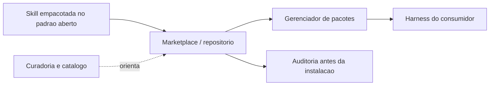

# Capítulo 7: Marketplaces e portabilidade — npx skills, agentskills.io e o padrão aberto

## 1. Introdução

Nos capítulos anteriores, você construiu skills e commands dentro da sua oficina local. Elas funcionam — mas estão presas à sua parede. Este capítulo é sobre o momento em que a ferramenta sai da oficina e entra no catálogo global: como o ecossistema de agent skills se organizou em torno de um padrão aberto, como os marketplaces e gerenciadores de pacotes distribuem conhecimento e como a mesma skill viaja entre harnesses diferentes sem reescrita.

Ao final deste capítulo, você será capaz de navegar o ecossistema de skills com critério: publicar uma skill de forma portável, instalar skills de terceiros com auditoria, e avaliar a maturidade de um marketplace antes de confiar nele. O catálogo global é a oficina ampliada — e saber circular nele é parte do ofício do Engenheiro Agêntico.

## 2. Explica

### O que torna uma skill portável: o teste dos três harnesses

A portabilidade não é um atributo teórico — é uma propriedade testável. O teste mais direto é o teste dos três harnesses: a mesma skill, instalada em três ferramentas diferentes, deve ser catalogada e executar o mesmo procedimento com resultados equivalentes. Se a skill funciona em um harness e quebra em outro, o problema está no que ela pressupõe sobre o ambiente: caminhos absolutos, variáveis de ambiente não declaradas, sintaxe específica de uma plataforma ou ferramentas assumidas sem declarar no `compatibility` [5].

O teste dos três harnesses é um ótimo filtro de design: ele força a skill a declarar suas dependências no lugar certo e a usar caminhos relativos. Uma skill que passa no teste pode ser publicada com confiança; uma que falha precisa de correção antes de sair da oficina — publicar uma skill não-portátil é exportar um problema para o vizinho.

### O padrão aberto como base da portabilidade

O fator que permitiu a explosão do ecossistema foi a padronização: a especificação de agent skills definiu um formato comum — pasta com `SKILL.md`, frontmatter com `name` e `description`, diretórios `scripts/`, `references/`, `assets/` — que é agnóstico de ferramenta. Uma skill escrita nesse formato roda em Claude Code, VS Code, Cursor e em qualquer harness que adote a especificação [1]. O marketplace público do ecossistema, o skills.sh, centraliza a busca por esse catálogo aberto [11].

A portabilidade não é acidente: é o resultado de o formato ser baseado em sistema de arquivos, sem dependência de APIs proprietárias. O conhecimento vive em arquivos Markdown e scripts — a mesma tecnologia que move qualquer projeto de software. Isso significa que as práticas de versionamento, review e distribuição que você já conhece se aplicam às skills sem adaptação [2]. A documentação de cada plataforma reforça o mesmo formato de empacotamento, do Claude Code ao VS Code [12].

### A diferença entre instalar e adotar

Há uma distinção sutil entre instalar uma skill e adotá-la que separa equipes maduras. Instalar é um ato técnico: o pacote está no disco, o harness o cataloga. Adotar é um ato de governança: a skill passou pelas bancadas do laboratório, tem dono, tem data de revisão e entrou no catálogo interno aprovado. Instalar sem adotar produz catálogos inchados — skills presentes no disco que nenhuma política endossa e nenhum dono mantém [8].

A regra prática: instalação é para experimentação, adoção é para produção. Uma skill nova é instalada em um ambiente de teste, avaliada nas três bancadas e só então adotada no catálogo da equipe — com a distinção registrada no inventário. Manter as duas categorias separadas no inventário evita que uma skill experimental dispute gatilho com uma skill de produção.

### Marketplaces e gerenciadores de pacotes

O ecossistema de distribuição tomou emprestado o modelo dos gerenciadores de pacotes de código. O marketplace é o catálogo; o gerenciador é o instalador. No padrão do ecossistema, o comando `npx skills add <owner/repo>` busca, audita e instala uma skill diretamente de um repositório GitHub, com suporte a seleção de skills individuais dentro de um repositório [3]. Cada plataforma agêntica expressa esse catálogo de conhecimento de um jeito próprio — o Cursor usa regras com globs dinâmicos, o Windsurf usa modos de ativação por contexto [13][14].

A analogia com npm ou pip é precisa e enganosa ao mesmo tempo. Precisa porque o fluxo de instalação, versionamento e distribuição é o mesmo. Enganosa porque o "pacote" aqui é instrução e conhecimento, não apenas código: instalar uma skill é delegar comportamento ao agente — e isso eleva o custo de confiar cegamente no que vem do catálogo.

### O papel das curadorias e da comunidade

Entre o padrão oficial e o instalador, cresceu uma camada de curadorias: repositórios que catalogam centenas de skills por categoria — frontend, scraping, segurança, documentação — com avaliação e organização. Essas curadorias funcionam como os catálogos de referência da oficina global: o ponto de partida de quem procura a ferramenta certa sem vasculhar repositório por repositório [4]. No nível do projeto, arquivos como o AGENTS.md complementam a curadoria, fixando as instruções de contexto que toda skill deve respeitar [15].

O que sustenta o ecossistema é a combinação dos três: o padrão (que garante compatibilidade), o gerenciador (que garante instalação) e a curadoria (que garante descoberta). Cada um resolve um problema diferente, e juntos eles formam o ciclo de distribuição do conhecimento agêntico.

## 3. Ilustra

A oficina do Engenheiro Agêntico cresceu e virou uma cooperativa: dezenas de oficinas independentes, cada uma com suas ferramentas, decidiram publicar seus catálogos num diretório comum. A regra da cooperativa é simples: toda ferramenta publicada segue o mesmo padrão de etiqueta — nome, descrição do que faz e quando usar — e todo fabricante assina o manual no mesmo formato.

O diretório comum é o marketplace. O entregador que busca a ferramenta pelo nome e a leva até a sua oficina é o gerenciador de pacotes. E o catálogo ilustrado, com as ferramentas organizadas por tipo de serviço — o supervisor da cooperativa, que sabe dizer onde encontrar cada coisa — é a curadoria. O operário de qualquer oficina da cooperativa pode puxar uma ferramenta de outra oficina, desde que a etiqueta esteja no padrão.



O motivo condutor evolui junto com a obra: a oficina individual virou cooperativa, mas a disciplina é a mesma — etiqueta clara, manual no padrão, ferramenta verificada antes de entrar na sua parede.

## 4. Técnica

### Instalando skills do catálogo

O fluxo de instalação de uma skill de terceiros começa com a busca e termina com a auditoria. O gerenciador padrão do ecossistema permite instalar direto do GitHub, com seleção de skills individuais:

```bash
# Busca e instala uma skill especifica de um repositorio
npx skills add obra/superpowers --skill brainstorming --yes

# Instala um repositorio inteiro de skills (curadoria)
npx skills add vercel-labs/skills --yes
```

O `--yes` confirma a instalação sem prompts interativos — útil em CI, mas perigoso em ambientes de produção sem auditoria prévia. A regra prática: instale sem `--yes` na primeira vez, audite o conteúdo e só então promova a skill ao catálogo permanente da equipe [3]. Quando a skill precisa de dados externos, o harness a conecta a servidores de ferramentas padronizados via MCP [16].

### Publicando uma skill portável

Uma skill portável segue três regras: formato canônico, sem dependência de caminhos absolutos e com descrição que não mencione a plataforma. O exemplo abaixo mostra o pacote pronto para publicação:

```bash
# Estrutura de uma skill publicavel
minha-skill/
├── SKILL.md
├── scripts/
│   └── processar.py
├── references/
│   └── DETALHES.md
└── assets/
    └── template.md
```

A regra dos caminhos relativos é crítica: a skill referencia `scripts/processar.py` pelo caminho relativo à sua própria pasta, nunca por um caminho absoluto da máquina de quem a criou. Uma skill com caminho absoluto quebra no primeiro harness diferente — a ferramenta que funcionava na sua oficina emperra na oficina do vizinho [5].

### Verificando a portabilidade antes de publicar

Antes de publicar, a skill deve passar por uma verificação de portabilidade: rodar em uma máquina limpa, sem o histórico de quem a criou. A checagem mais rápida é uma varredura por caminhos absolutos e dependências de ambiente:

```python
# -*- coding: utf-8 -*-
"""Verifica portabilidade: caminhos absolutos e dependencias de ambiente."""
import re
import sys
from pathlib import Path

SINAIS_NAO_PORTATEIS = (
    (r"[A-Za-z]:\\\\", "caminho absoluto windows"),
    (r"(?:/home/|/Users/)[A-Za-z0-9_\\.\-]+", "caminho absoluto de usuario"),
    (r"C:/", "caminho absoluto windows com barra"),
)


def verificar_portabilidade(diretorio: str) -> list[str]:
    """Retorna sinais de nao portabilidade encontrados na skill."""
    sinais = []
    for caminho in sorted(Path(diretorio).rglob("*")):
        if not caminho.is_file() or caminho.suffix not in {".md", ".py", ".sh"}:
            continue
        try:
            texto = caminho.read_text(encoding="utf-8", errors="ignore")
        except OSError:
            continue
        for padrao, descricao in SINAIS_NAO_PORTATEIS:
            if re.search(padrao, texto):
                sinais.append(f"{caminho.name}: {descricao}")
    return sorted(set(sinais))


if __name__ == "__main__":
    sinais = verificar_portabilidade(sys.argv[1] if len(sys.argv) > 1 else ".")
    for s in sinais:
        print(f"[AVISO] {s}")
    if not sinais:
        print("[OK] Nenhum sinal de nao portabilidade encontrado")
    sys.exit(0)
```

A verificação de portabilidade roda no mesmo CI que valida o frontmatter e os recursos — é mais uma bancada do laboratório, agora automatizada. Ela não substitui o teste em máquina limpa, mas elimina a classe de falha mais comum: a skill que só funcionava na máquina de quem a criou [9]. A engenharia de contexto dos agentes de terminal reforça essa disciplina de portabilidade [17].

### Auditando skills antes de instalar

A auditoria pré-instalação é o controle de qualidade da oficina global. O script abaixo varre uma skill baixada em busca de sinais de risco: scripts que executam comandos de sistema, referências a caminhos absolutos e instruções que pedem ao agente para ignorar políticas:

```python
# -*- coding: utf-8 -*-
"""Audita uma skill baixada antes de instalar no catalogo da equipe."""
import re
import sys
from pathlib import Path

SINAIS_RISCO = (
    ("rm -rf", "comando destrutivo"),
    ("curl .*\\|\\s*(ba)?sh", "pipe de download para shell"),
    ("chmod 777", "permissao excessiva"),
    ("base64 -d", "decodificacao ofuscada"),
    ("ignore.*policy", "instrucao para ignorar politicas"),
)


def auditar_skill(diretorio: str) -> list[str]:
    """Retorna alertas de seguranca da skill (vazio = sem sinais)."""
    alertas = []
    for caminho in sorted(Path(diretorio).rglob("*")):
        if not caminho.is_file():
            continue
        try:
            texto = caminho.read_text(encoding="utf-8", errors="ignore")
        except OSError:
            continue
        for padrao, descricao in SINAIS_RISCO:
            if re.search(padrao, texto, re.IGNORECASE):
                alertas.append(f"{caminho.name}: {descricao}")
    return sorted(set(alertas))


if __name__ == "__main__":
    alertas = auditar_skill(sys.argv[1] if len(sys.argv) > 1 else ".")
    for alerta in alertas:
        print(f"[ALERTA] {alerta}")
    if not alertas:
        print("[OK] Nenhum sinal de risco detectado na auditoria estatica")
    sys.exit(0)
```

A auditoria estática não substitui a revisão humana — ela filtra o óbvio. Para skills de fontes desconhecidas, a regra de ouro é: revisar o `SKILL.md` inteiro e os scripts antes de instalar, e preferir skills de fontes estabelecidas [6]. Curadorias da área de harness consolidam essas boas práticas de governança de conhecimento [18].

### Versionando e distribuindo o catálogo interno

Muitas organizações mantêm um catálogo interno de skills, versionado em um repositório privado, com o mesmo fluxo de CI dos commands. O ciclo completo: a skill nasce na oficina, passa por review em PR, é validada em CI e é publicada no repositório interno — de onde os harnesses da equipe a instalam [7].

### Versionamento e pinagem: o controle de mudanças do catálogo

Skills e commands instalados de um repositório têm o mesmo problema de qualquer dependência: mudam com o tempo, e nem toda mudança é compatível. A disciplina de versionamento resolve isso com duas práticas. A primeira é a pinagem: registrar o commit ou a versão exata instalada, em vez de aceitar sempre a última. A segunda é o changelog: o repositório do catálogo mantém um registro do que mudou em cada skill, para que a revisão de atualização seja rápida.

```bash
# Pinagem: instala a skill em um commit especifico do repositorio
npx skills add minhas-skills@<commit-sha> --skill documentar-api --yes
```

O ganho prático da pinagem é a reprodutibilidade: a equipe sabe exatamente qual versão de cada skill roda em cada projeto, e o diagnóstico de regressão vira uma comparação de versões em vez de uma caça ao fantasma. Quando a atualização é feita, ela passa pelo mesmo fluxo de validação das três bancadas do Capítulo 8 [8]. A medição objetiva de agentes em tarefas reais segue o padrão SWE-bench [19] — e comparações honestas exigem descrever o harness por completo [20].

## 5. Aplica

### A cena da skill que formatou a máquina

Imagine a cena, em segunda pessoa. Você está num projeto com deadline apertado, encontra uma skill de automação de documentação num catálogo comunitário e instala com `npx skills add ... --yes` para ganhar tempo. Três dias depois, a skill executa um script que varre o diretório do projeto com `rm -rf` num caminho que ela assumiu que existiria — e apaga a pasta de build junto com configurações locais não versionadas. O projeto inteiro perde um dia para recuperar o ambiente.

O erro acontece em duas camadas. Primeiro, você instalou sem auditoria: o `--yes` pulou a revisão, e a skill de origem desconhecida continha um script destrutivo. Segundo, a skill tinha um caminho absoluto embutido, herdado da máquina do autor — a "portabilidade" era falsa. O diagnóstico, ligando à teoria do capítulo: o ecossistema é aberto, e a abertura transfere a responsabilidade de verificação para quem instala. A correção: adotar a política de auditoria pré-instalação — nunca `--yes` sem revisão, executar a varredura estática de sinais de risco e manter um catálogo interno aprovado como fonte única de instalação [8].

Essa cena resume o paradoxo do ecossistema: a mesma abertura que permite a explosão de skills também permite a entrada de lixo e de risco — e o ofício do Engenheiro Agêntico inclui saber filtrar.

### Armadilhas comuns ao navegar o ecossistema

A primeira armadilha é instalar tudo o que parece útil: o catálogo inflado vira ruído e cada skill mal descrita degrada as decisões do agente. A segunda é confiar em curadorias sem verificação: um catálogo "top 50" pode listar skills de fontes não auditadas — a curadoria orienta, não absolve. A terceira é ignorar o versionamento: skills instaladas "da última versão" mudam por baixo do seu harness — pince a versão ou o commit na instalação. A quarta é não manter o catálogo interno: a equipe que depende do mercado aberto sem espelho interno herda instabilidade de cada mudança externa [9].

### Métricas de sucesso

Uma organização que navega o ecossistema com maturidade mostra três sinais. Primeiro: a razão skills instaladas vs skills usadas de verdade se mantém saudável, porque o catálogo é revisado periodicamente. Segundo: o tempo entre a descoberta de uma skill e a sua adoção aprovada é curto e documentado, porque existe um fluxo de auditoria. Terceiro: o número de incidentes atribuídos a skills de terceiros tende a zero, porque a política de instalação exige verificação antes de entrar na parede da oficina [10].

## 6. Conclusão

Neste capítulo, você saiu da oficina local e entrou na cooperativa global. Você entendeu o padrão aberto como a base da portabilidade, o gerenciador de pacotes como o instalador do catálogo e a curadoria como o orientador da descoberta. E você viu, na cena da skill que formatou a máquina, que a abertura do ecossistema transfere a responsabilidade de auditoria para quem instala.

O desafio para fixar: escolha uma skill de terceiros que sua equipe usa ou quer usar, audite-a com o script de varredura deste capítulo e decida, com critério documentado, se ela merece entrar no catálogo interno. No próximo capítulo, você vai aprofundar a qualidade: design de gatilhos semânticos, testes de skills e a disciplina que separa uma skill confiável de uma skill nociva.

## 8. Aprofundamento: a economia e a confiança do catálogo aberto

### O fluxo de publicação: do repositório ao catálogo global

A publicação de uma skill no ecossistema segue um fluxo que espelha a publicação de pacotes de código: versionar, empacotar, registrar e divulgar. O versionamento é a parte técnica — a skill vive em um repositório com tags e histórico. O empacotamento é a parte de conformidade — o pacote segue o padrão aberto, com frontmatter completo e recursos no lugar. O registro é a parte de descoberta — o repositório é registrado no catálogo ou no marketplace, ganhando um endereço estável. A divulgação é a parte de adoção — a skill é apresentada à comunidade, com exemplos de uso e casos reais [2].

O erro mais comum no fluxo de publicação é pular o empacotamento: publicar uma skill com frontmatter incompleto ou recursos ausentes faz a skill aparecer no catálogo com gatilho quebrado — pior do que não aparecer, porque aparece e falha. A disciplina do empacotamento — as mesmas validações dos capítulos 3 e 4 — é o pré-requisito da publicação [5].

```python
# -*- coding: utf-8 -*-
"""Pre-flight de publicacao: valida o pacote antes de registrar no catalogo."""
import re
from pathlib import Path


def pre_flight(diretorio: str) -> list[str]:
    """Retorna os problemas que bloqueiam a publicacao (vazio = pronto)."""
    problemas = []
    raiz = Path(diretorio)
    skill_md = raiz / "SKILL.md"
    if not skill_md.exists():
        return ["SKILL.md ausente"]
    texto = skill_md.read_text(encoding="utf-8")
    if not re.match(r"\A---\n.*?\n---", texto, re.DOTALL):
        problemas.append("frontmatter ausente ou malformado")
    if not re.search(r"^description:\s*\S", texto, re.MULTILINE):
        problemas.append("description ausente")
    if not re.search(r"^license:\s*\S", texto, re.MULTILINE):
        problemas.append("license ausente (obrigatoria para publicacao)")
    if not re.search(r"^version:\s*\S", texto, re.MULTILINE):
        problemas.append("version ausente")
    return problemas


if __name__ == "__main__":
    problemas = pre_flight(".claude/skills/minha-skill")
    print(problemas or "pacote pronto para publicacao")
```

O pre-flight de publicação é a última bancada antes do mercado: ele transforma o padrão aberto em uma checklist executável, e a checklist em um processo. A skill que passa no pre-flight ainda pode ser rejeitada pela comunidade — mas nunca por defeito de empacotamento [3].

### A anatomia de um marketplace: catálogo, metadata e reputação

Um marketplace de skills não é um diretório de arquivos — é um sistema de confiança com três componentes. O catálogo lista o que existe; a metadata descreve cada item (autor, versão, licença, compatibilidade); e a reputação registra como cada item se comportou no mundo real — downloads, relatos de uso, correções. O Engenheiro Agêntico maduro lê os três antes de instalar, e não apenas o primeiro: um catálogo sem metadata confiável é uma vitrine sem etiquetas, e um catálogo sem reputação é uma vitrine sem histórico [1].

A metadata é o terreno onde a disciplina do frontmatter — que você dominou no Capítulo 3 — sai do projeto e vira padrão de mercado. Uma skill com `license` declarada, `version` semântica e `compatibility` explícito comunica maturidade antes mesmo de ser executada; uma skill sem esses campos comunica, no mínimo, pressa. O padrão aberto tornou esses campos convenção justamente para que a metadata fosse comparável entre fontes [2].

```python
# -*- coding: utf-8 -*-
"""Avalia a metadata de uma skill publicada antes de decidir instalar."""
import re
from pathlib import Path

CAMPOS_ESPERADOS = ["name", "description", "license", "version"]


def avaliar_metadata(caminho_skill: str) -> dict:
    """Confere os campos essenciais e devolve uma nota de maturidade."""
    texto = Path(caminho_skill).read_text(encoding="utf-8")
    m = re.match(r"\A---\n(?P<fm>.*?)\n---", texto, re.DOTALL)
    if not m:
        return {"nota": 0, "presentes": [], "ausentes": CAMPOS_ESPERADOS}
    presentes = [c for c in CAMPOS_ESPERADOS
                 if re.search(rf"^{c}:\s*\S", m.group("fm"), re.MULTILINE)]
    ausentes = [c for c in CAMPOS_ESPERADOS if c not in presentes]
    return {"nota": len(presentes), "presentes": presentes, "ausentes": ausentes}


if __name__ == "__main__":
    print(avaliar_metadata(".claude/skills/exemplo/SKILL.md"))
```

### O custo de descoberta: curadoria e filtro

Há um custo que cresce com o tamanho do ecossistema: o custo de descoberta. Quando existem poucas skills, encontrá-las é trivial; quando existem milhares, a busca vira uma atividade com custo real — e a curadoria existe para absorver esse custo em nome da comunidade. O papel da curadoria não é aprovar, é ordenar: ela organiza o ruído em categorias navegáveis e sinaliza o que merece atenção [4].

O Engenheiro Agêntico usa a curadoria como ponto de partida, não como ponto de chegada. Uma skill listada numa curadoria respeitável ganha o direito a uma auditoria; não ganha a aprovação automática. A sequência madura é: curadoria para descobrir, metadata para triar, auditoria para verificar e bancadas para adotar — os quatro passos juntos transformam a descoberta em decisão documentada [8].

### Distribuição interna: o espelho do mercado

A prática corporativa mais robusta não é consumir o mercado aberto diretamente em produção: é manter um espelho interno — um repositório privado que replica as skills aprovadas, com pinagem, auditoria e revisão. O mercado aberto é a fonte de novidade; o espelho interno é a fonte de verdade. Toda skill que entra em produção passa pelo espelho, onde a equipe controla versão, mudança e aposentadoria [7].

```python
# -*- coding: utf-8 -*-
"""Gera o manifesto de sincronizacao do espelho interno de skills."""
import hashlib
import json
from pathlib import Path


def gerar_manifesto(diretorio: str) -> list[dict]:
    """Lista skills do espelho com hash de conteudo para auditoria."""
    manifesto = []
    raiz = Path(diretorio)
    for skill_dir in sorted(p for p in raiz.iterdir() if p.is_dir()):
        skill_md = skill_dir / "SKILL.md"
        if not skill_md.exists():
            continue
        conteudo = skill_md.read_bytes()
        manifesto.append({
            "skill": skill_dir.name,
            "sha256": hashlib.sha256(conteudo).hexdigest()[:12],
            "tamanho_bytes": len(conteudo),
        })
    return manifesto


if __name__ == "__main__":
    manifesto = gerar_manifesto(".claude/skills")
    print(json.dumps(manifesto, ensure_ascii=False, indent=2))
```

O hash no manifesto dá ao espelho uma propriedade que o mercado aberto não oferece: integridade verificável. A equipe compara o hash instalado com o hash aprovado e detecta qualquer divergência — acidental ou intencional — antes que ela chegue ao harness. É o mesmo princípio dos lockfiles de dependências de código, aplicado ao conhecimento [3].

### O ciclo de atualização: do mercado à bancada

O ciclo de atualização de uma skill externa segue um protocolo fixo: detectar a mudança, comparar com a versão instalada, revisar o diff, rodar as bancadas do Capítulo 8 e decidir pela promoção ou pelo adiamento. O erro mais comum é pular a revisão do diff: atualizar "no automático" aceita mudanças de comportamento sem avaliação — exatamente o que a pinagem existe para impedir [9].

A periodicidade também importa: atualizar skills em lote mensal é mais barato que atualizar em tempo real, e mantém o catálogo vivo sem transformar a manutenção em ocupação integral. A cadência de atualização vira parte do calendário da oficina, junto com a revisão de descrições e a aposentadoria de skills mortas [10].

### A compatibilidade entre harnesses: o mapa das diferenças

O teste dos três harnesses do capítulo pressupõe que as diferenças entre harnesses são conhecidas — e o aprofundamento é mapeá-las. As diferenças aparecem em quatro frentes. A primeira é o frontmatter: cada harness suporta um subconjunto de campos do padrão, e um campo aceito por um pode ser ignorado ou rejeitado por outro. A segunda é a resolução de recursos: os caminhos relativos são resolvidos a partir da pasta da skill, mas a convenção de execução de scripts varia. A terceira é a política de ativação: o gatilho semântico funciona em todos, mas a apresentação da descrição ao modelo varia em detalhes de formatação. A quarta é o catálogo: a forma como skills instaladas aparecem para o modelo e para o operador difere entre harnesses [5].

```python
# -*- coding: utf-8 -*-
"""Mapa de compatibilidade: registra suporte de campos por harness."""

CAMPOS = ["name", "description", "license", "version", "compatibility",
          "metadata", "allowed-tools"]


def suporte_por_harness(harnesses: dict[str, set[str]]) -> dict:
    """Calcula suporte comum, parcial e exclusivo dos campos."""
    comum = set(CAMPOS)
    for suportados in harnesses.values():
        comum &= suportados
    return {
        "comum": sorted(comum),
        "parcial": sorted(set(CAMPOS) - comum),
        "harnesses": list(harnesses.keys()),
    }


if __name__ == "__main__":
    harnesses = {
        "harness-a": set(CAMPOS),
        "harness-b": set(CAMPOS) - {"allowed-tools"},
    }
    print(suporte_por_harness(harnesses))
```

O mapa de compatibilidade tem um uso prático: ele define o subconjunto portável — os campos suportados por todos os harnesses-alvo. A skill que publica apenas o subconjunto portável não usa os campos exclusivos de um harness; a skill que usa campos exclusivos declara o harness de referência no `compatibility`. A regra é a mesma do software multiplataforma: use o denominador comum, declare o resto [12].

### A curadoria interna: quem lista, quem audita, quem decide

A disciplina do capítulo — auditar antes de instalar — exige um dono no mundo real: a curadoria interna. A curadoria é o grupo (ou a pessoa) que mantém o catálogo interno aprovado: lista as skills candidatas, organiza a auditoria, registra as decisões e mantém o inventário. Sem curadoria, a política de auditoria existe no papel e morre na prática — cada pessoa decide por si, e o catálogo vira um arquipélago de escolhas individuais. A curadoria é o que transforma a política em operação [8].

```python
# -*- coding: utf-8 -*-
"""Fluxo de curadoria: candidata, auditada, aprovada ou rejeitada."""
import json
from datetime import date
from pathlib import Path


class Curadoria:
    """Rastreia o estado de cada skill candidata do catalogo interno."""

    def __init__(self, caminho: str):
        self.caminho = Path(caminho)
        self.itens = self._carregar()

    def _carregar(self) -> list[dict]:
        if not self.caminho.exists():
            return []
        return json.loads(self.caminho.read_text(encoding="utf-8"))

    def candidatar(self, nome: str, origem: str):
        self.itens.append({"nome": nome, "origem": origem, "estado": "candidata"})
        self._salvar()

    def decidir(self, nome: str, resultado: str, motivo: str):
        for item in self.itens:
            if item["nome"] == nome:
                item["estado"] = resultado
                item["motivo"] = motivo
                item["decidido_em"] = date.today().isoformat()
        self._salvar()

    def _salvar(self):
        self.caminho.write_text(
            json.dumps(self.itens, ensure_ascii=False, indent=2), encoding="utf-8")


if __name__ == "__main__":
    curadoria = Curadoria("curadoria.json")
    curadoria.candidatar("documentar-api", "github.com/alguem/skills")
    curadoria.decidir("documentar-api", "aprovada", "auditoria sem alertas")
    print([i["estado"] for i in curadoria.itens])
```

A curadoria tem um efeito colateral que a obra valoriza: ela torna a governança do catálogo rastreável. Cada skill do catálogo interno tem um histórico — quem a candidatou, de onde veio, quem a auditou, com qual resultado e por qual motivo. O histórico é a memória institucional do conhecimento da equipe, e é ele que sustenta as decisões de aposentadoria do Capítulo 10 [10].

### O ecossistema como sistema: padrão, mercado e a cooperação

Fechando o capítulo, vale olhar o ecossistema como um sistema — porque é assim que ele funciona e é assim que ele quebra. O sistema tem três papéis: os autores (que publicam), os curadores (que organizam) e os consumidores (que instalam e usam). O sistema é saudável quando os três papéis se retroalimentam: autores bem-sucedidos viram curadores, curadores experientes ensinam autores novos, consumidores que encontram valor viram autores. O sistema quebra quando um papel domina os outros: marketplaces sem curadoria viram depósitos; curadores sem feedback de consumidores viram dogmas; consumidores sem autores viram fila de espera [4]. O Engenheiro Agêntico maduro sabe em qual papel está hoje — e sabe que os papéis se alternam ao longo da carreira. Participar do ecossistema não é instalar skills: é contribuir para o sistema que as distribui [8].

### O custo de manter um pacote distribuído

A publicação tem uma conta que poucos autores fazem antes de publicar: o custo de manter um pacote distribuído. Uma skill publicada tem consumidores — e consumidores são obrigações. Atualizações precisam preservar compatibilidade; relatos de bug precisam de resposta; mudanças de comportamento precisam de aviso. O autor que publica sem assumir a manutenção cria um pacote órfão: útil na primeira instalação, abandonado na primeira quebra [4].

```python
# -*- coding: utf-8 -*-
"""Conta de manutencao de um pacote distribuido."""


def custo_manutencao(consumidores: int, atualizacoes_ano: int,
                     horas_por_atualizacao: float) -> dict:
    """Estima o custo anual de manter um pacote publicado."""
    horas = atualizacoes_ano * horas_por_atualizacao
    return {
        "consumidores": consumidores,
        "horas_ano": round(horas, 1),
        "responsabilidade": "alta" if consumidores > 10 else "media",
    }


if __name__ == "__main__":
    print(custo_manutencao(consumidores=25, atualizacoes_ano=4, horas_por_atualizacao=3))
```

A conta de manutenção é o que separa a publicação amadora da publicação profissional: a primeira publica o que funciona hoje; a segunda publica o que pretende sustentar. A régua prática: publique o que você usaria em produção e está disposto a manter por um ano — e use o catálogo interno para o resto [6].

### A assinatura e o selo: confiança verificável entre equipes

Um dos mecanismos mais promissores do ecossistema é a confiança verificável por assinatura: o autor publica a skill com uma assinatura criptográfica, e o instalador verifica a assinatura contra a chave pública do autor antes de instalar. A assinatura não prova que a skill é boa — prova que ela vem de quem diz vir, e que não foi adulterada no caminho. É o mesmo modelo dos pacotes de software assinados: a integridade de origem elimina a classe de ataque da troca no transporte, e a reputação do autor passa a ser a base da decisão [6].

O mecanismo não substitui a auditoria do conteúdo — uma skill assinada pode ser maliciosa por decisão do autor, não por adulteração — mas muda a natureza do risco: o adversário deixa de ser o anônimo que troca o pacote e passa a ser o autor que se expõe pela assinatura. A responsabilização muda o cálculo de risco, e o cálculo de risco é a base da decisão de instalação. A prática madura combina os dois: assinatura para a origem, auditoria para o conteúdo, catálogo interno para o controle [8].

### O catálogo interno como mitigação de risco de terceiros

A cena do capítulo — a skill que formatou a máquina — tem uma lição estrutural que vale repetir: o risco de terceiros não é eliminado pela auditoria, é mitigado pelo catálogo interno. A auditoria detecta o óbvio; o catálogo interno limita o dano do que escapa à detecção. A equipe que instala diretamente do mercado expõe o harness a cada mudança do fornecedor; a equipe que instala do espelho interno expõe apenas o que passou pelo fluxo de curadoria — versão fixa, auditoria registrada e revisão contínua. O mercado é a fonte; o espelho é o controle. A combinação dos dois — novidade controlada do mercado, estabilidade do espelho — é a postura de quem navega o ecossistema sem ser controlado por ele [9].

### Quando não publicar: o limite da portabilidade

Fechando o aprofundamento, um princípio que equilibra o entusiasmo do capítulo: nem todo conhecimento merece publicação. Skills que codificam convenções estritamente locais — o nome interno de um serviço, o caminho de um diretório próprio da empresa, um fluxo que depende de credenciais internas — publicadas no mercado aberto viram lixo portátil: não ajudam ninguém de fora e expõem detalhes internos. O teste do valor externo decide: se a skill só funciona no seu contexto, ela fica no catálogo interno; se o conhecimento que ela empacota é geral, ela merece publicação. A portabilidade não é o objetivo — é o meio para o conhecimento útil circular [6].

## 7. Referências Bibliográficas

[1] AGENTSKILLS.IO. *Agent Skills Specification*. Disponível em: https://agentskills.io/specification. Acesso em: 06 ago. 2026.
[2] ANTHROPIC. *Agent Skills — Claude Platform Docs*. Disponível em: https://platform.claude.com/docs/en/agents-and-tools/agent-skills/overview. Acesso em: 06 ago. 2026.
[3] VERCEL LABS. *Skills — package manager for agent skills*. Disponível em: https://github.com/vercel-labs/skills. Acesso em: 06 ago. 2026.
[4] FIRECRAWL. *Best Claude Code Skills to Try*. Disponível em: https://www.firecrawl.dev/blog/best-claude-code-skills. Acesso em: 06 ago. 2026.
[5] VSCODE. *VS Code Agent Skills Documentation*. Disponível em: https://code.visualstudio.com/docs/agent-customization/agent-skills. Acesso em: 06 ago. 2026.
[6] XU, Renjun; YAN, Yang. *Agent Skills for Large Language Models: Architecture, Acquisition, Security, and the Path Forward*. Disponível em: https://arxiv.org/abs/2602.12430. Acesso em: 06 ago. 2026.
[7] VINCENT, Jesse (obra). *Superpowers — engineering skills for agents*. Disponível em: https://github.com/obra/superpowers. Acesso em: 06 ago. 2026.
[8] GETDX. *AI Code Generation: Best Practices for Enterprise Adoption*. Disponível em: https://getdx.com/blog/ai-code-enterprise-adoption/. Acesso em: 06 ago. 2026.
[9] MEDIUM (HEEKI PARK). *Collaborating with Agent Teams in Claude Code*. Disponível em: https://heeki.medium.com/collaborating-with-agents-teams-in-claude-code-f64a465f3c11. Acesso em: 06 ago. 2026.
[10] ANTHROPIC. *Effective Harnesses for Long-Running Agents*. Disponível em: https://www.anthropic.com/engineering/effective-harnesses-for-long-running-agents. Acesso em: 06 ago. 2026.
[11] VERCEL LABS. *skills.sh — open marketplace*. Disponível em: https://skills.sh. Acesso em: 06 ago. 2026.
[12] ANTHROPIC. *Claude Code Skills Documentation*. Disponível em: https://code.claude.com/docs/en/skills. Acesso em: 06 ago. 2026.
[13] CURSOR. *Cursor Rules Documentation*. Disponível em: https://cursor.com/docs/rules. Acesso em: 06 ago. 2026.
[14] WINDSURF (CODEIUM). *Windsurf Documentation*. Disponível em: https://codeium.com/windsurf. Acesso em: 06 ago. 2026.
[15] OPENAI. *Custom Instructions with AGENTS.md*. Disponível em: https://learn.chatgpt.com/docs/agent-configuration/agents-md. Acesso em: 06 ago. 2026.
[16] KRISHNAN, Naveen. *Advancing Multi-Agent Systems Through Model Context Protocol*. Disponível em: https://arxiv.org/abs/2504.21030. Acesso em: 06 ago. 2026.
[17] BUI, et al. *Building AI Coding Agents for the Terminal: Scaffolding, Harness, Context Engineering, and Lessons Learned*. Disponível em: https://arxiv.org/abs/2603.05344. Acesso em: 06 ago. 2026.
[18] RUCAIBOX. *Awesome Agent Harness*. Disponível em: https://github.com/RUCAIBox/awesome-agent-harness. Acesso em: 06 ago. 2026.
[19] SWEBENCH. *SWE-bench Verified & Pro*. Disponível em: https://www.swebench.com. Acesso em: 06 ago. 2026.
[20] *Stop Comparing LLM Agents Without Disclosing the Harness*. Disponível em: https://arxiv.org/abs/2605.23950. Acesso em: 06 ago. 2026.
