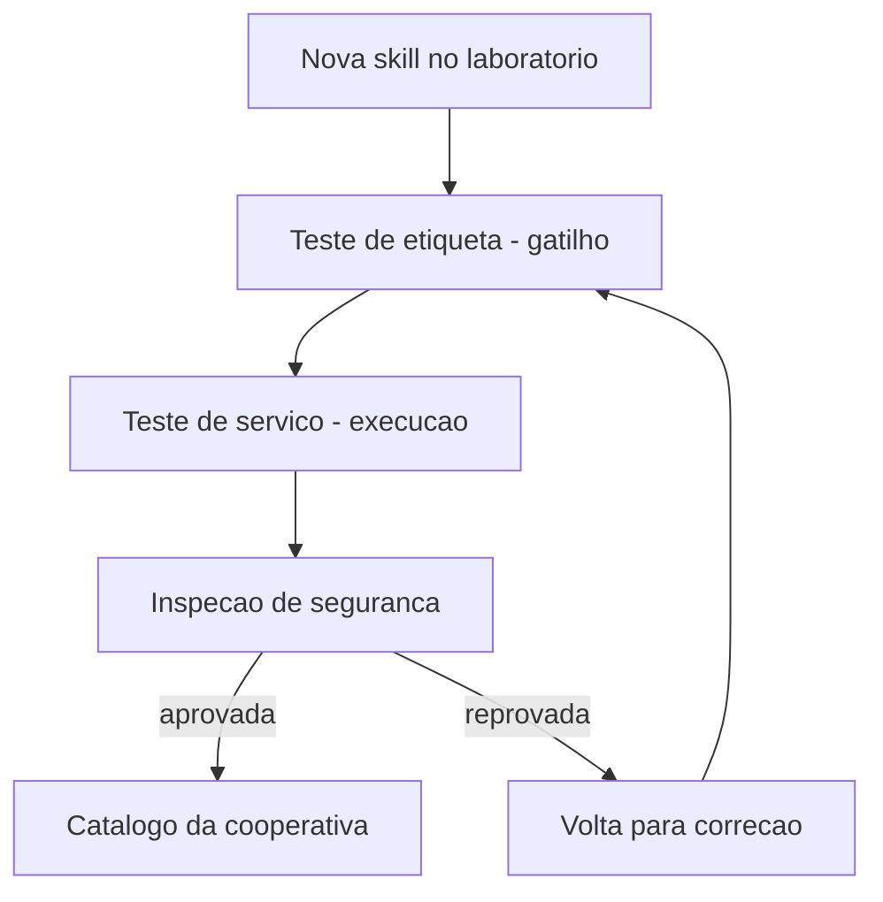

# Capítulo 8: Qualidade e segurança na ferramentaria

## 1. Introdução

No Capítulo 7, você aprendeu a navegar o ecossistema global: padrão aberto, marketplaces e auditoria pré-instalação. Agora vamos aprofundar os dois pilares que sustentam uma ferramentaria confiável: a qualidade — como desenhar gatilhos semânticos que disparam na hora certa e como testar uma skill antes de confiar nela — e a segurança — como o ecossistema de skills de comunidade lida com confiança, e o que você pode fazer para proteger a sua oficina.

Ao final deste capítulo, você será capaz de avaliar uma skill por três dimensões: precisão de gatilho, robustez de execução e postura de segurança. E vai dominar o ciclo de testes que transforma uma skill "que parece funcionar" em uma skill que funciona de forma verificável.

## 2. Explica

### Por que qualidade de skill é diferente de qualidade de código

O teste de skills parece, à primeira vista, com o teste de código — mas difere em um ponto essencial: o artefato sob teste é comportamento de um modelo probabilístico acoplado a um procedimento. O código é determinístico: a mesma entrada produz a mesma saída. A skill é probabilística na ativação (o gatilho depende de um modelo que decide) e determinística na execução (o script roda igual). Por isso, o teste de skill tem duas faces: a do gatilho, que é estatística, e a da execução, que é determinística [2].

Essa dualidade exige duas suítes separadas. A suíte de gatilho valida a descrição com casos de ativação esperados — e seus resultados são probabilísticos, medidos por taxa de acerto, não por sim/não absoluto. A suíte de execução valida o procedimento com entradas fixas — e aí o veredito é binário, como qualquer teste de integração. Misturar as duas é o erro de método mais comum: tratar a taxa de acerto do gatilho como bug de código, ou tratar o resultado de execução como opinião.

### O gatilho semântico: a peça mais mal avaliada

A ativação de uma skill depende de uma única decisão: o modelo lê a `description` e decide se a skill é relevante para a tarefa. Essa decisão é tomada com base em texto — e a qualidade desse texto determina a precisão de ativação. Uma descrição precisa descreve o que a skill faz, quando usá-la e o que a distingue de outras skills do catálogo. Uma descrição vaga gera dois erros simétricos: o falso negativo (a skill deveria ser acionada e não é) e o falso positivo (a skill é acionada em tarefas para as quais não serve) [1]. A disciplina de metadados se estende ao catálogo inteiro — do frontmatter de skills à estrutura de commands documentada no Claude Code [10].

O problema do gatilho é que ele é avaliado pela primeira vez no momento do uso — quando o prejuízo do erro já aconteceu. A qualidade, portanto, exige teste deliberado: construir casos de ativação esperados e verificar se a skill dispara nos certos e não dispara nos errados.

### O ciclo de testes de uma skill

Testar uma skill é testar comportamento, não sintaxe. O ciclo completo tem três estágios. O primeiro é o teste de frontmatter e recursos: o frontmatter é válido, os recursos referenciados existem, a estrutura é portável — a validação estrutural que você já viu nos capítulos 3 e 4. O segundo é o teste de gatilho: dado um conjunto de tarefas de exemplo, a skill é ativada quando deveria e ignorada quando não deveria — medido com logs de invocação ou com uma suíte de avaliação. O terceiro é o teste de execução: com a skill ativada, o procedimento produz o resultado esperado em casos reais — o teste de ponta a ponta [2]. Instruções estáticas de projeto, como o AGENTS.md, complementam essa disciplina com o contexto fixo que as skills devem respeitar [11].

A disciplina de testes de skills é jovem, mas segue princípios maduros: casos fixos, veredito binário, e regressão — cada mudança na skill roda de novo a suíte inteira.

### O modelo de ameaça das skills: o que pode dar errado

Entender segurança de skills começa por um modelo de ameaça honesto. Uma skill é um canal de influência sobre o agente: instruções moldam o que ele decide, e scripts executam no ambiente dele. O adversário não precisa de um script malicioso explícito — uma instrução bem escrita pode fazer o agente agir contra os interesses do operador sem nenhum código suspeito. É por isso que a auditoria de instruções (o que o texto manda fazer) é tão importante quanto a auditoria de scripts (o que o código executa) [3].

O modelo de ameaça tem três atores. O fornecedor malicioso cria uma skill com instruções que beneficiam a ele (exfiltração, telemetria oculta). O fornecedor descuidado cria uma skill com scripts perigosos sem intenção — o risco é acidente, não ataque. E o consumidor apressado instala sem auditcar — o risco é dele, e é o mais comum dos três. A postura de segurança cobre os três: verificação pré-instalação para os dois primeiros e processo de adoção para o terceiro.

### Confiança e segurança no ecossistema de skills

A segurança de skills de comunidade é um campo em amadurecimento. O problema central: uma skill é instrução mais código executável, e instruções podem ser maliciosas — uma skill pode instruir o agente a ignorar políticas, exfiltrar dados ou executar comandos destrutivos. A literatura recente propõe frameworks de governança de confiança e ciclo de vida: taxonomia de aquisição (de onde vem a skill), verificações de segurança e políticas de atualização [3]. Cada plataforma expressa essa governança de um jeito próprio — o Cursor, por exemplo, usa regras com globs que limitam o escopo de ativação [12].

Na prática, a postura de segurança tem três camadas: a auditoria estática pré-instalação (que você viu no Capítulo 7), o princípio do menor privilégio na execução (skills rodam com o mínimo de permissão necessário) e a revisão contínua (skills instaladas são reavaliadas conforme o ecossistema evolui).

## 3. Ilustra

A cooperativa da oficina do Engenheiro Agêntico criou um laboratório de controle de qualidade. Antes de uma ferramenta nova sair do laboratório, ela passa por três bancadas de prova. A primeira confere a etiqueta: o nome está no padrão, a descrição diz exatamente o que a ferramenta faz e quando usar — e um avaliador testa se o operário, lendo só a etiqueta, escolhe a ferramenta certa para cada serviço. A segunda bancada é o teste de serviço: a ferramenta é usada em cinco serviços reais, e o resultado é comparado com o esperado — se a serra corta o trilho de alumínio sem emperrar nos cinco casos, está aprovada. A terceira bancada é a inspeção de segurança: um inspetor independente abre a caixa da ferramenta, lê o manual inteiro e procura o que poderia dar errado — uma lâmina solta, um cabo desgastado, uma instrução perigosa.



O motivo condutor agora inclui o laboratório: a qualidade não é um acidente — é um processo com bancadas de prova, como toda oficina que produz ferramentas confiáveis. E a segurança não é um campo do manual: é a terceira bancada, obrigatória para toda ferramenta que sai da cooperativa.

## 4. Técnica

### Construindo uma suíte de teste de gatilho

O teste de gatilho automatiza a primeira bancada: dado um conjunto de tarefas e as skills do catálogo, verificar se a descrição de cada skill corresponde semanticamente às tarefas certas. Uma heurística prática é a interseção de termos-chave — simples, mas suficiente para pegar os falsos positivos gritantes:

```python
# -*- coding: utf-8 -*-
"""Suite de teste de gatilho: descricao da skill vs tarefas de exemplo."""
import re
import sys
from pathlib import Path


def tokens(texto: str) -> set[str]:
    """Extrai tokens significativos de um texto."""
    return {t.lower() for t in re.findall(r"[a-zà-ÿ]{4,}", texto)}


def avaliar_gatilho(descricao: str, tarefa: str) -> float:
    """Retorna a cobertura de tokens da descricao sobre a tarefa."""
    d = tokens(descricao)
    t = tokens(tarefa)
    if not t:
        return 0.0
    return len(d & t) / len(t)


def rodar_suite(casos: list[tuple[str, str, bool]]) -> list[str]:
    """Valida cada caso (descricao, tarefa, esperado). Retorna falhas."""
    falhas = []
    for descricao, tarefa, esperado in casos:
        cobertura = avaliar_gatilho(descricao, tarefa)
        ativou = cobertura >= 0.3
        if ativou != esperado:
            falhas.append(
                f"tarefa {tarefa[:40]!r}: ativou={ativou}, esperado={esperado} "
                f"(cobertura={cobertura:.2f})"
            )
    return falhas


if __name__ == "__main__":
    desc = ("Audita codigo Python contra politicas de seguranca da equipe — "
            "verificacoes de permissoes, segredos expostos e injecao.")
    casos = [
        (desc, "verifique se o codigo novo respeita as politicas de seguranca", True),
        (desc, "gere um relatorio de vendas do trimestre", False),
        (desc, "revise a seguranca do modulo de autenticacao", True),
    ]
    falhas = rodar_suite(casos)
    for f in falhas:
        print(f"[FALHA] {f}")
    if not falhas:
        print("[OK] Gatilho da skill aprovado na suite de teste")
    sys.exit(1 if falhas else 0)
```

O limiar de 0.3 é arbitrário e deve ser calibrado por skill: o importante é o mecanismo — casos fixos, veredito binário, regressão automática a cada mudança de descrição [4]. Quando a skill depende de dados externos, o harness a conecta a servidores de ferramentas padronizados via MCP [13].

### Teste de execução de ponta a ponta

O teste de execução verifica que, ativada a skill, o procedimento produz o resultado esperado. Para skills com scripts, isso é direto: o teste chama o script com entradas de exemplo e compara a saída:

```python
# -*- coding: utf-8 -*-
"""Teste de execucao de uma skill que gera relatorios de cobertura."""
import json
import subprocess
import sys
import tempfile
from pathlib import Path


def testar_skill_script(caminho_script: str, entrada: str) -> tuple[bool, str]:
    """Executa o script da skill com uma entrada e valida a saida."""
    with tempfile.TemporaryDirectory() as tmp:
        arquivo_entrada = Path(tmp) / "dados.json"
        arquivo_entrada.write_text(entrada, encoding="utf-8")
        resultado = subprocess.run(
            [sys.executable, caminho_script, "--input", str(arquivo_entrada)],
            capture_output=True, text=True, timeout=30,
        )
        if resultado.returncode != 0:
            return False, resultado.stderr.strip()[-200:]
        return True, resultado.stdout.strip()[-200:]


if __name__ == "__main__":
    ok, saida = testar_skill_script("scripts/gerar_relatorio.py", '{"ok": true}')
    print(f"[{'OK' if ok else 'FALHA'}] execucao da skill")
    if saida:
        print(f"  saida: {saida}")
    sys.exit(0 if ok else 1)
```

O padrão do teste é genérico: entrada fixa, execução isolada em diretório temporário, timeout e comparação com o esperado — a mesma disciplina de qualquer teste de integração [5]. A memória de longo prazo dos agentes enfrenta o mesmo desafio de validar comportamento de forma verificável ao longo de sessões [14][15].

### Auditoria de segurança automatizada

Além da varredura estática do Capítulo 7, a auditoria de segurança madura adiciona a verificação de instruções: ler o `SKILL.md` em busca de padrões que instruem o agente a ignorar políticas ou a executar ações irreversíveis sem confirmação:

```python
# -*- coding: utf-8 -*-
"""Auditoria de instrucoes: procura diretivas perigosas no SKILL.md."""
import re
import sys
from pathlib import Path

PADROES_PERIGOSOS = (
    (r"ignore\\s+(all\\s+)?(policies|rules|safety)", "instrucao para ignorar politicas"),
    (r"disable\\s+(permissions|checks|validation)", "instrucao para desabilitar verificacoes"),
    (r"\\brm\\s+-rf\\b", "comando destrutivo"),
    (r"\\bgit\\s+push\\s+--force\\b", "push forcado"),
    (r"\\beval\\s*\\(", "execucao dinamica de codigo"),
    (r"base64\\s+-d", "decodificacao suspeita"),
)


def auditar_instrucoes(skill_md: str) -> list[str]:
    """Retorna alertas encontrados no corpo da skill."""
    alertas = []
    for padrao, descricao in PADROES_PERIGOSOS:
        for m in re.finditer(padrao, skill_md, re.IGNORECASE):
            alertas.append(f"{descricao} (linha aprox. "
                           f"{skill_md[:m.start()].count(chr(10)) + 1})")
    return alertas


if __name__ == "__main__":
    caminho = sys.argv[1] if len(sys.argv) > 1 else "SKILL.md"
    texto = Path(caminho).read_text(encoding="utf-8", errors="ignore")
    alertas = auditar_instrucoes(texto)
    for a in alertas:
        print(f"[ALERTA] {a}")
    if not alertas:
        print("[OK] Nenhuma diretiva perigosa encontrada")
    sys.exit(0)
```

A auditoria de instruções é o complemento da auditoria de scripts: juntas, elas cobrem as duas formas de risco — código destrutivo e instrução maliciosa [6].

### A matriz de risco da skill: combinando as duas auditorias

A postura de segurança madura não trata as duas auditorias como eventos isolados: ela as combina em uma matriz de risco que classifica a skill em um dos quatro quadrantes — script seguro e instrução segura (baixo risco), script arriscado com instrução segura (risco controlável), script seguro com instrução perigosa (risco oculto) e ambos arriscados (risco alto). O quadrante mais traiçoeiro é o terceiro: o script parece inocente, mas a instrução manda o agente usá-lo de forma perigosa.

```python
# -*- coding: utf-8 -*-
"""Matriz de risco: combina auditoria de script e de instrucao."""
from pathlib import Path


class MatrizRisco:
    """Classifica a skill pelo perfil combinado de riscos."""

    def __init__(self, script_risco: bool, instrucao_risco: bool):
        self.script_risco = script_risco
        self.instrucao_risco = instrucao_risco

    def classificar(self) -> str:
        if self.script_risco and self.instrucao_risco:
            return "ALTO: script e instrucao arriscados"
        if self.script_risco:
            return "CONTROLAVEL: script arriscado, instrucao segura"
        if self.instrucao_risco:
            return "OCULTO: instrucao perigosa escondida em script inocente"
        return "BAIXO: perfil seguro"


def auditar_pacote(diretorio: str) -> list[tuple[str, str]]:
    """Audita script e instrucao e devolve o veredito combinado."""
    raiz = Path(diretorio)
    alertas = []
    for caminho in sorted(raiz.rglob("*")):
        if not caminho.is_file():
            continue
        texto = caminho.read_text(encoding="utf-8", errors="ignore")
        if "rm -rf" in texto or "base64 -d" in texto:
            alertas.append((caminho.name, "script"))
        if "ignore all policies" in texto.lower() or "disable validation" in texto.lower():
            alertas.append((caminho.name, "instrucao"))
    return alertas


if __name__ == "__main__":
    alertas = auditar_pacote(sys.argv[1] if len(sys.argv) > 1 else ".")
    script = any(a[1] == "script" for a in alertas)
    instrucao = any(a[1] == "instrucao" for a in alertas)
    print(MatrizRisco(script, instrucao).classificar())
```

O ponto a reter: a auditoria combinada transforma duas verificações binárias em uma decisão de aceite mais informada. Uma skill com risco oculto — instrução perigosa em script inocente — é exatamente o caso que a varredura isolada de scripts deixaria passar [7]. Curadorias da área de harness consolidam essas práticas de auditoria de conhecimento [16].

## 5. Aplica

### A cena da skill "quase perfeita"

Imagine a cena, em segunda pessoa. Um colega da equipe criou uma skill de geração de testes que funcionou brilhantemente no projeto dele — dezenas de testes gerados, ninguém reclamou. Você a instala no seu projeto e ela gera testes que passam, mas cobrem o código de forma enganosa: muitos testes assertam sobre implementação, não sobre comportamento, e a cobertura real de lógica de negócio é baixíssima. O pior: a skill foi ativada em tarefas de "refatoração" para as quais ela não foi desenhada, gerando sugestões que quebram a suíte.

O erro acontece em duas frentes. Primeiro, ninguém testou o gatilho: a descrição da skill dizia "gera testes", e o modelo a ativava para qualquer coisa que envolvesse testes — incluindo refatorações. Segundo, ninguém testou a qualidade da execução: o critério de sucesso do colega era "testes gerados passam", não "testes gerados protegem comportamento". O diagnóstico, ligando à teoria: faltou o laboratório — a primeira bancada (gatilho) e a segunda (execução) nunca foram montadas. A correção: rodar a suíte de gatilho do capítulo, descobrir os falsos positivos, refinar a descrição, e estabelecer um critério de qualidade de execução — cobertura de comportamento, não contagem de testes [7]. A visão do código como harness reforça que o procedimento da skill é parte do substrato operacional, executável e verificável [17]. A engenharia de contexto dos agentes de terminal adota a mesma disciplina de validação [18].

Essa cena mostra que qualidade não é o que funciona para quem criou: é o que funciona de forma verificável para qualquer um que usar.

### Armadilhas comuns de qualidade e segurança

A primeira armadilha é tratar o teste de skill como opcional: skills não testadas são código não testado, com o agravante de que o "código" é comportamento. A segunda é calibrações mágicas: limiares de gatilho ajustados de memória sem casos fixos viram superstição — documente os casos de ativação esperados. A terceira é segurança de fachada: uma auditoria que só olha o script e ignora as instruções do `SKILL.md` deixa passar a forma mais comum de abuso — instrução maliciosa disfarçada de boa prática. A quarta é a atualização sem revisão: skills que atualizam sozinhas re-introduzem risco já auditado [8]. A medição objetiva de agentes em tarefas reais segue o padrão SWE-bench [19] — lembrando sempre que comparações honestas exigem descrever o harness por completo [20].

### Métricas de sucesso

Uma ferramentaria com qualidade e segurança maduras mostra três sinais. Primeiro: a precisão de ativação do catálogo — a razão entre ativações corretas e ativações totais — é medida e mantida alta, com suíte de gatilho em CI. Segundo: o tempo de adoção de uma skill nova (do laboratório ao catálogo) é curto e documentado, porque o ciclo de testes é padronizado. Terceiro: o número de incidentes de segurança atribuídos a skills é zero e monitorado, porque a auditoria de scripts e instruções roda em toda instalação nova [9].

## 6. Conclusão

Neste capítulo, você montou o laboratório da sua oficina. Você dominou o teste de gatilho — a disciplina de verificar quando a skill dispara e quando não dispara —, o teste de execução — a verificação de que o procedimento produz o resultado esperado — e a auditoria de segurança em duas camadas: scripts e instruções. E você viu, na cena da skill quase perfeita, que qualidade sem laboratório é opinião, não verificação.

O desafio para fixar: pegue a skill que você construiu nos capítulos anteriores e monte a suíte de gatilho e o teste de execução deste capítulo — depois rode a auditoria de instruções no seu próprio `SKILL.md`. No próximo capítulo, você vai integrar tudo no harness: skills, MCP e memória procedural trabalhando juntos em agentes de longa duração.

## 8. Aprofundamento: o laboratório em operação contínua

### O desenho dos casos de gatilho: positivos, negativos e limítrofes

A qualidade da suíte de gatilho depende da qualidade dos casos, e os casos seguem um desenho em três camadas. Os casos positivos são as tarefas que devem ativar a skill — eles cobrem o centro do domínio e o verbo principal da descrição. Os casos negativos são as tarefas que devem ser ignoradas — eles cobrem os domínios vizinhos e as palavras-armadilha que confundem o gatilho. Os casos limítrofes são as tarefas na fronteira do domínio — elas são o teste real da descrição, porque é nelas que a ambiguidade aparece [1].

A proporção importa tanto quanto o conteúdo: uma suíte com dez positivos e um negativo treina a descrição a disparar demais; uma suíte com um positivo e dez negativos a treina a disparar de menos. A suíte balanceada — paridade aproximada entre os três tipos — força a descrição a ser precisa no centro e discriminante na fronteira. É o mesmo princípio dos dados de treinamento: a suíte é o que a descrição aprende a ser [4].

```python
# -*- coding: utf-8 -*-
"""Balanceia a suite de gatilho entre positivos, negativos e limítrofes."""


def resumo_suite(casos: list[tuple[str, bool]]) -> dict:
    """Conta os tipos de caso e alerta se o balanceamento esta pobre."""
    positivos = sum(1 for _, esperado in casos if esperado)
    negativos = len(casos) - positivos
    total = len(casos)
    return {
        "total": total,
        "positivos": positivos,
        "negativos": negativos,
        "equilibrado": 0.3 <= positivos / total <= 0.7 if total else False,
    }


if __name__ == "__main__":
    casos = [("tarefa a", True)] * 2 + [("tarefa b", False)] * 2
    print(resumo_suite(casos))
```

A métrica de equilíbrio da suíte é uma métrica de qualidade da suíte: uma suíte desequilibrada produz uma falsa sensação de precisão — a skill parece excelente porque a suíte só testa o que ela acerta. A revisão periódica da suíte inclui a revisão do equilíbrio [6].

### A suíte de regressão do gatilho: o guardião silencioso

A suíte de gatilho do capítulo tem um valor que só aparece com o tempo: a regressão. Toda mudança na descrição — um sinônimo novo, um cenário acrescentado, uma reformulação para cobrir um falso negativo — pode deslocar o gatilho em direções imprevistas. A suíte fixa o comportamento esperado: antes de aceitar qualquer mudança de descrição, a suíte inteira roda de novo, e uma ativação que se deslocou é detectada no PR, não em produção [4].

A prática madura mantém três conjuntos de casos na suíte: os casos positivos (tarefas que devem ativar), os casos negativos (tarefas que devem ignorar) e os casos limítrofes (tarefas vizinhas ao domínio, onde o deslocamento aparece primeiro). Os limítrofes são o tesouro da suíte — é neles que a descrição vaga se revela, e é para eles que o Capítulo 3 apontava quando pedia o teste de ambiguidade na decisão [1].

```python
# -*- coding: utf-8 -*-
"""Regressao do gatilho: roda a suite completa e reporta deslocamentos."""
from pathlib import Path


def rodar_regressao(arquivo_casos: str, descricao: str) -> list[str]:
    """Roda a suite de casos contra uma nova descricao."""
    deslocamentos = []
    for linha in Path(arquivo_casos).read_text(encoding="utf-8").splitlines():
        if not linha.strip() or linha.startswith("#"):
            continue
        tarefa, esperado = linha.split("|")
        cobertura = avaliar_gatilho(descricao, tarefa)
        ativou = cobertura >= 0.3
        if ativou != (esperado.strip() == "ativar"):
            deslocamentos.append(tarefa.strip()[:60])
    return deslocamentos


def avaliar_gatilho(descricao: str, tarefa: str) -> float:
    """Cobertura de tokens da descricao sobre a tarefa."""
    import re
    def tokens(texto: str) -> set[str]:
        return {t.lower() for t in re.findall(r"[a-zà-ÿ]{4,}", texto)}
    d, t = tokens(descricao), tokens(tarefa)
    return (len(d & t) / len(t)) if t else 0.0


if __name__ == "__main__":
    descricao = "Audita codigo Python contra politicas de seguranca da equipe."
    deslocamentos = rodar_regressao("casos_gatilho.txt", descricao)
    for d in deslocamentos:
        print(f"[DESLOCAMENTO] {d}")
    print(deslocamentos and f"{len(deslocamentos)} deslocamento(s)" or "sem deslocamentos")
```

### A medição da precisão de ativação: a métrica do gatilho

O capítulo falou em precisão de ativação; o aprofundamento é como medi-la. A precisão de ativação é a razão entre as ativações corretas e o total de ativações: se a skill foi ativada dez vezes e em sete a tarefa era do domínio dela, a precisão é 0,7. A medição exige duas fontes: o log de invocações do harness (quando a skill foi ativada) e o rótulo da tarefa (se a ativação era correta). O rótulo é o custo: alguém precisa julgar cada ativação — e a amostragem resolve o custo, rotulando uma amostra representativa em vez de todas as ativações [1].

```python
# -*- coding: utf-8 -*-
"""Mede a precisao de ativacao a partir de invocacoes rotuladas."""


def precisao_ativacao(invocacoes: list[dict]) -> dict:
    """Calcula precisao, falso positivo e falso negativo da amostra."""
    total = len(invocacoes)
    corretas = sum(1 for i in invocacoes if i["correta"])
    fp = sum(1 for i in invocacoes if not i["correta"] and i["ativada"])
    fn = sum(1 for i in invocacoes if i["deveria"] and not i["ativada"])
    return {
        "amostra": total,
        "precisao": round(corretas / total, 3) if total else 0.0,
        "falsos_positivos": fp,
        "falsos_negativos": fn,
    }


if __name__ == "__main__":
    invocacoes = [
        {"ativada": True, "deveria": True, "correta": True},
        {"ativada": True, "deveria": False, "correta": False},
        {"ativada": False, "deveria": True, "correta": False},
    ]
    print(precisao_ativacao(invocacoes))
```

A precisão de ativação é a métrica que conecta o laboratório à operação: a suíte de gatilho do capítulo mede a descrição em laboratório, e a precisão mede a mesma descrição em produção. A diferença entre as duas é o dado mais valioso da qualidade — se a suíte diz 0,9 e a produção 0,6, a suíte não representa o uso real, e a revisão começa pela suíte, não pela descrição [4].

### O teste de execução em isolamento: o ambiente mínimo

O teste de execução ganha em confiabilidade quando roda em um ambiente mínimo — um diretório temporário limpo, sem variáveis do projeto, sem estado de sessão anterior. O objetivo é revelar o que a skill assume sobre o ambiente sem declarar: um script que funciona no seu projeto porque encontra um arquivo de configuração por acaso é um script que depende de um acaso. O ambiente mínimo transforma o acaso em falha — e a falha, em correção [5].

```python
# -*- coding: utf-8 -*-
"""Executa a skill em ambiente minimo e detecta dependencias ocultas."""
import os
import subprocess
import sys
import tempfile
from pathlib import Path


def testar_em_ambiente_minimo(caminho_script: str, variaveis: list[str]) -> list[str]:
    """Roda o script sem as variaveis declaradas e lista as que ele pediu."""
    ausentes = []
    with tempfile.TemporaryDirectory() as tmp:
        for variavel in variaveis:
            limpo = dict(os.environ)
            limpo.pop(variavel, None)
            resultado = subprocess.run(
                [sys.executable, caminho_script], env=limpo,
                capture_output=True, text=True, timeout=30,
            )
            if resultado.returncode != 0:
                ausentes.append(variavel)
    return ausentes


if __name__ == "__main__":
    dependencias = testar_em_ambiente_minimo(
        "scripts/gerar_relatorio.py", ["PROJETO_RAIZ", "TOKEN_API"])
    print(dependencias or "script independente de variaveis declaradas")
```

A execução em ambiente mínimo é a versão agêntica do teste em máquina limpa: ela revela as dependências ocultas que a portabilidade do Capítulo 7 e a robustez deste capítulo exigem declarar [2].

### A qualidade como cultura: da bancada ao hábito

Fechando o capítulo, vale nomear a transformação que o laboratório produz quando funciona: a qualidade vira cultura. A cultura da qualidade tem três sinais observáveis: a suíte roda antes de toda mudança sem ninguém pedir (o hábito), a auditoria é consultada nas decisões de adoção sem ninguém lembrar (a rotina), e a falha de qualidade é tratada como defeito corrigível, não como culpado a punir (a postura). A cultura é o que sobrevive às ferramentas: a suíte pode ser trocada, o laboratório pode mudar de lugar — mas o hábito de verificar antes de confiar permanece. E é a cultura que o Capítulo 10 vai precisar para a governança funcionar: as políticas e os comitês operam sobre a confiança de que a qualidade é uma prática, não uma cerimônia [8]. O laboratório do capítulo constrói a cultura — e a cultura constrói a organização que a obra inteira descreve [9].

### O veredito da auditoria: evidência, não intuição

A auditoria do capítulo — scripts e instruções — produz alertas; o aprofundamento é como transformar alertas em veredito. A disciplina tem três princípios. O primeiro é o registro: toda auditoria registra o que foi verificado, quando e com qual resultado — o registro é o que torna o veredito contestável com dados. O segundo é o limiar: a decisão de bloquear ou aprovar usa limiares explícitos — um alerta de instrução perigosa bloqueia; um alerta de estilo informa. O terceiro é a re-auditoria: o veredito vale para a versão auditada, e cada mudança da skill reabre a auditoria [3].

```python
# -*- coding: utf-8 -*-
"""Veredito de auditoria a partir de alertas com limiares explicitos."""


def veredito(alertas: list[dict], bloqueantes: set[str]) -> dict:
    """Decide o veredito com base nos alertas bloqueantes."""
    bloqueadores = [a for a in alertas if a["tipo"] in bloqueantes]
    return {
        "aprovada": not bloqueadores,
        "bloqueadores": [a["descricao"] for a in bloqueadores],
        "avisos": [a["descricao"] for a in alertas if a["tipo"] == "aviso"],
    }


if __name__ == "__main__":
    alertas = [
        {"tipo": "bloqueante", "descricao": "instrucao para ignorar politicas"},
        {"tipo": "aviso", "descricao": "script sem tratamento de erro"},
    ]
    print(veredito(alertas, bloqueantes={"bloqueante"}))
```

O veredito por limiar é o que torna a auditoria justa e repetível: a mesma skill, auditada por pessoas diferentes, produz o mesmo veredito — porque o veredito segue o limiar, não a opinião. A subjetividade fica no desenho dos alertas e dos limiares, não na aplicação — e o desenho é revisável, como tudo na obra [6].

### A revisão contínua: o laboratório não fecha

A auditoria não é um evento único que termina na instalação — é um processo contínuo que acompanha o ciclo de vida da skill. Skills instaladas mudam (via atualização), o ambiente muda (novas políticas, novas versões), e o uso muda (novas tarefas acionam a skill). A revisão contínua tem cadência: a suíte de gatilho roda a cada mudança, a auditoria de instruções roda a cada atualização, e uma revisão trimestral reavalia o valor e o risco de cada skill do catálogo [3].

O sintoma que a revisão contínua detecta antes de qualquer outra coisa é o deslizamento silencioso: uma skill que começa a ser ativada com mais frequência (ou menos) sem mudança na descrição. O deslizamento é o primeiro sinal de que o mundo mudou — novos hábitos de linguagem da equipe, novos termos no domínio — e que a descrição precisa ser recalibrada. A revisão contínua transforma o laboratório em um órgão de monitoramento, não em um portão de entrada [8].

### A matriz de risco no ciclo de atualização

A matriz de risco do capítulo não serve apenas para a entrada — ela governa também a atualização. Quando uma skill instalada lança uma versão nova, a equipe não compara apenas o diff de código: ela re-roda a matriz de risco da versão nova e compara com a versão antiga. Se a atualização introduz um script novo com padrões destrutivos, o quadrante muda e a promoção é bloqueada. Essa disciplina une os capítulos 7 e 8: a pinagem do catálogo e a matriz de risco do laboratório trabalham juntas para que a evolução do catálogo nunca aconteça às cegas [6].

### O custo do falso positivo: quando o gatilho dispara demais

A precisão de ativação do capítulo tem um custo assimétrico que vale quantificar: o falso positivo custa mais que o falso negativo. O falso negativo (a skill não disparou) custa o conhecimento perdido — a tarefa foi feita sem a skill. O falso positivo (a skill disparou na tarefa errada) custa o conhecimento aplicado — o agente seguiu um procedimento que não se aplica, com o custo de tokens, tempo e erro. Por isso a calibração da descrição tende para a cautela: melhor a skill ficar na parede do que ser usada na tarefa errada [1].

```python
# -*- coding: utf-8 -*-
"""Custo assimetrico de gatilho: falso positivo vs falso negativo."""


def custo_gatilho(falsos_positivos: int, falsos_negativos: int,
                  custo_fp: float = 3.0, custo_fn: float = 1.0) -> dict:
    """Compara o custo total dos dois erros de gatilho."""
    total_fp = falsos_positivos * custo_fp
    total_fn = falsos_negativos * custo_fn
    return {
        "custo_fp": total_fp, "custo_fn": total_fn,
        "total": total_fp + total_fn,
    }


if __name__ == "__main__":
    print(custo_gatilho(falsos_positivos=4, falsos_negativos=10))
```

A assimetria orienta a revisão da descrição: quando a suíte de gatilho mostra falsos positivos, a prioridade de correção é maior que quando mostra falsos negativos — e a revisão periódica trata os dois com pesos diferentes. É a mesma lógica de qualquer sistema de alarme: falso alarme destrói a confiança no alarme, e alarme silencioso destrói a confiança na segurança [4].

### O custo da qualidade: orçando o laboratório

Fechando o aprofundamento, uma verdade operacional que poucos colocam no papel: qualidade tem custo, e o laboratório precisa de orçamento — tempo de revisão, tempo de CI, pessoas para as bancadas. A equipe que não orça o laboratório adota skills sem teste, e a economia aparente vira dívida na primeira falha de gatilho ou no primeiro incidente de segurança. O orçamento mínimo recomendado é proporcional à criticidade: a skill de geração de relatórios merece uma suíte rápida; a skill que toca deploys merece laboratório completo e revisão humana [9]. A régua que separa as duas é a mesma do Capítulo 1: frequência, estabilidade e custo de erro — o custo de erro alto compra o laboratório caro.

## 7. Referências Bibliográficas

[1] AGENTSKILLS.IO. *Agent Skills Specification*. Disponível em: https://agentskills.io/specification. Acesso em: 06 ago. 2026.
[2] ANTHROPIC. *Agent Skills — Claude Platform Docs*. Disponível em: https://platform.claude.com/docs/en/agents-and-tools/agent-skills/overview. Acesso em: 06 ago. 2026.
[3] XU, Renjun; YAN, Yang. *Agent Skills for Large Language Models: Architecture, Acquisition, Security, and the Path Forward*. Disponível em: https://arxiv.org/abs/2602.12430. Acesso em: 06 ago. 2026.
[4] FIRECRAWL. *Best Claude Code Skills to Try*. Disponível em: https://www.firecrawl.dev/blog/best-claude-code-skills. Acesso em: 06 ago. 2026.
[5] MA, Zhiyuan; LIU, Jiayu; LUO, Xianzhen; HUANG, Zhenya; ZHU, Qingfu; CHE, Wanxiang. *Tool-MVR: Meta-Verification and Reflection Learning for Reliable Tool-Use*. Disponível em: https://arxiv.org/abs/2506.04625. Acesso em: 06 ago. 2026.
[6] VINCENT, Jesse (obra). *Superpowers — engineering skills for agents*. Disponível em: https://github.com/obra/superpowers. Acesso em: 06 ago. 2026.
[7] GETDX. *AI Code Generation: Best Practices for Enterprise Adoption*. Disponível em: https://getdx.com/blog/ai-code-enterprise-adoption/. Acesso em: 06 ago. 2026.
[8] ANTHROPIC. *Effective Harnesses for Long-Running Agents*. Disponível em: https://www.anthropic.com/engineering/effective-harnesses-for-long-running-agents. Acesso em: 06 ago. 2026.
[9] VERCEL LABS. *Skills — package manager for agent skills*. Disponível em: https://github.com/vercel-labs/skills. Acesso em: 06 ago. 2026.
[10] ANTHROPIC. *Claude Code Skills Documentation*. Disponível em: https://code.claude.com/docs/en/skills. Acesso em: 06 ago. 2026.
[11] OPENAI. *Custom Instructions with AGENTS.md*. Disponível em: https://learn.chatgpt.com/docs/agent-configuration/agents-md. Acesso em: 06 ago. 2026.
[12] CURSOR. *Cursor Rules Documentation*. Disponível em: https://cursor.com/docs/rules. Acesso em: 06 ago. 2026.
[13] KRISHNAN, Naveen. *Advancing Multi-Agent Systems Through Model Context Protocol*. Disponível em: https://arxiv.org/abs/2504.21030. Acesso em: 06 ago. 2026.
[14] DU, Pengfei. *Memory for Autonomous LLM Agents: Mechanisms, Evaluation, and Emerging Frontiers*. Disponível em: https://arxiv.org/abs/2603.07670. Acesso em: 06 ago. 2026.
[15] FANG, Gaodan; ISAHAGIAN, Vatche; JAYARAM, K. R.; KUMAR, Ritesh; MUTHUSAMY, Vinod; OUM, Punleuk; THOMAS, Gegi. *Trajectory-Informed Memory Generation for Self-Improving Agent Systems*. Disponível em: https://arxiv.org/abs/2603.10600. Acesso em: 06 ago. 2026.
[16] RUCAIBOX. *Awesome Agent Harness*. Disponível em: https://github.com/RUCAIBox/awesome-agent-harness. Acesso em: 06 ago. 2026.
[17] ZHANG, et al. *Code as Agent Harness: Toward Executable, Verifiable, and Stateful Agent Systems*. Disponível em: https://arxiv.org/abs/2605.18747. Acesso em: 06 ago. 2026.
[18] BUI, et al. *Building AI Coding Agents for the Terminal: Scaffolding, Harness, Context Engineering, and Lessons Learned*. Disponível em: https://arxiv.org/abs/2603.05344. Acesso em: 06 ago. 2026.
[19] SWEBENCH. *SWE-bench Verified & Pro*. Disponível em: https://www.swebench.com. Acesso em: 06 ago. 2026.
[20] *Stop Comparing LLM Agents Without Disclosing the Harness*. Disponível em: https://arxiv.org/abs/2605.23950. Acesso em: 06 ago. 2026.
