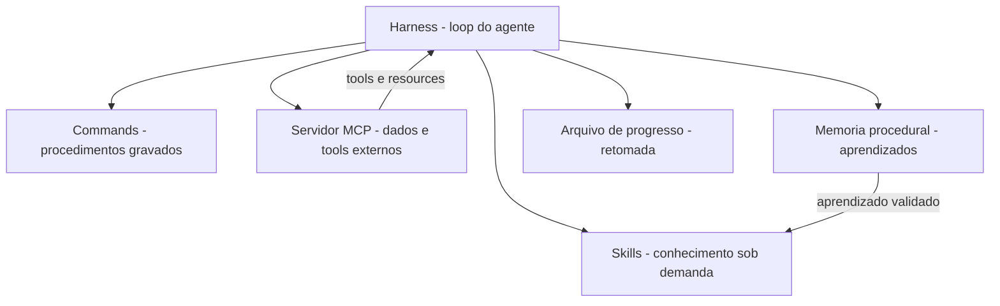

# Capítulo 9: Orquestração no harness — skills, MCP e memória procedural

## 1. Introdução

No Capítulo 8, você montou o laboratório de qualidade da oficina: gatilhos testados, execução verificada e segurança auditada. Agora chegou o momento de integrar tudo no lugar onde tudo se encontra: o harness em produção. Este capítulo amarra os fios dos capítulos anteriores — skills como conhecimento, commands como procedimento — e adiciona as duas peças que faltam para agentes de verdade: o MCP, que conecta o agente a ferramentas e dados externos sob um protocolo padronizado, e a memória procedural, que permite ao agente melhorar a si mesmo ao longo das execuções.

Ao final deste capítulo, você será capaz de desenhar a orquestração completa de um agente de produção: conhecimento empacotado em skills, dados externos via MCP e aprendizado acumulado em memória procedural — tudo operando junto dentro do loop do harness, incluindo a gestão de agentes de longa duração.

## 2. Explica

### O harness como orquestrador das peças

Nos capítulos anteriores, você viu as peças isoladas: skills, commands, tools. A orquestração é o ato de fazê-las trabalhar juntas dentro de uma única execução. O harness decide, a cada passo do loop, qual peça acionar: uma skill para o conhecimento, uma tool para a ação atômica, um command para o procedimento completo — e, agora, um servidor MCP para o dado externo [1]. A confiabilidade desse despacho melhora quando o uso de ferramentas é ensinado com verificação e reflexão sobre erros, como propõe o Tool-MVR [12].

A arquitetura resultante tem uma propriedade importante: cada peça é fracamente acoplada. A skill não sabe que o dado vem de um servidor MCP; o command não sabe se a skill que ele invoca usa scripts ou apenas instruções. O harness é o único que conhece o catálogo completo — e é essa separação que permite evoluir cada camada sem reescrever as outras.

### O que a orquestração resolve que as peças isoladas não resolvem

Vale o exercício de imaginar o mesmo agente sem orquestração: um conjunto de skills ricas, commands perfeitos e um MCP conectado — mas sem ninguém decidindo quando usar o quê. O resultado é um agente que sabe muito e entrega pouco: a skill certa fica na parede, o command certo fica na bancada e o dado certo fica no servidor, todos à espera de uma decisão que o harness deveria tomar [1].

A orquestração é essa camada de decisão: catalogar as peças, descrevê-las para o modelo e rotear cada ação para a camada certa. O modelo continua decidindo o quê — a orquestração decide o onde. Sem ela, o conhecimento empacotado dos capítulos anteriores não passa de inventário; com ela, vira operação. É o momento em que a oficina vira fábrica.

### MCP: o protocolo que conecta o agente ao mundo

O Model Context Protocol padronizou a forma como agentes conversam com ferramentas, recursos e prompts externos. Na arquitetura cliente-servidor, o harness é o cliente e os serviços externos são servidores que expõem tools, resources e prompts sob um contrato JSON-RPC único. Isso substitui os conectores proprietários por um padrão: qualquer servidor MCP compatível funciona com qualquer harness compatível [2].

O MCP resolve um problema específico de orquestração: o conhecimento procedural (como fazer) mora nas skills, mas o dado operacional (o que existe agora) mora fora — em bancos, APIs e sistemas corporativos. Sem o MCP, o harness precisaria de integrações dedicadas para cada fonte; com ele, um único protocolo conecta tudo, com trilha de auditoria e controle de permissão [3]. Curadorias da área de harness consolidam essas práticas de integração [13], e frameworks metodológicos impõem a mesma disciplina de orquestração desde o projeto [14].

### Memória procedural vs. skills: o ciclo de promoção

A fronteira entre memória procedural e skill é menos rígida do que parece — e é essa fluidez que alimenta a auto-melhoria. A memória procedural é o rascunho: lições anotadas no caderno, ainda não testadas, ainda sem dono. A skill é a versão publicada: lições validadas, empacotadas com frontmatter e scripts, catalogadas com gatilho [6].

O ciclo de promoção tem quatro passos: a execução gera uma lição; a lição é registrada na memória procedural; quando a lição se repete ou se mostra valiosa, ela é candidata a skill; e a candidata passa pelas três bancadas do laboratório antes de virar skill do catálogo. Esse ciclo é o motor do agente que melhora com o uso — e é também o ponto onde a qualidade da governança decide se o agente aprende sabedoria ou vício [15].

### Memória procedural: o agente que aprende a fazer melhor

A memória procedural é a camada que guarda o "como fazer" aprendido na prática: estratégias que funcionaram, recuperações de falhas e otimizações observadas em execuções anteriores. Frameworks recentes de auto-melhoria extraem essas lições das trajetórias de execução — os *tips* de sucesso, recuperação e otimização — e os reutilizam em sessões futuras [4]. Instruções estáticas de projeto, como o AGENTS.md, complementam a memória procedural com o contexto fixo que atravessa as sessões [15].

A conexão com skills é natural: a memória procedural madura alimenta o catálogo de skills. Uma execução bem-sucedida gera uma estratégia reutilizável; uma falha corrigida gera um procedimento de recuperação; um acerto ineficiente gera uma otimização. Com o tempo, o que era memória de uma execução vira skill do catálogo — o conhecimento da oficina cresce com o uso, não apenas com o design.

## 3. Ilustra

A oficina do Engenheiro Agêntico ganhou três novas conexões que completam a cooperativa. A primeira é o posto de abastecimento externo: o operário não precisa mais manter estoque de matéria-prima na oficina — ele solicita ao depósito central, que entrega o material exato sob um contrato padronizado de pedido. O depósito é o servidor MCP; o formulário de pedido é o protocolo; e o operário (o harness) não precisa saber o inventário de cada depósito para pedir — basta o formulário único.

A segunda é o caderno de procedimentos aprendidos: ao lado da bancada, um caderno onde o operário anota, no fim de cada serviço, o que funcionou, o que quebrou e como corrigiu. A memória procedural é esse caderno — e a regra da oficina é que as anotações boas, depois de testadas, viram novas placas de bancada (skills) para todos — e podem ser distribuídas pelo catálogo com o gerenciador de pacotes do ecossistema [16]. A terceira é o relógio de ponto dos serviços longos: para tarefas que levam dias, o operário registra o progresso num quadro, para retomar de onde parou mesmo depois de uma pausa — a gestão de agentes de longa duração.



O motivo condutor fecha o arco: a oficina individual virou cooperativa completa — estoque externo sob contrato (MCP), caderno de aprendizados (memória procedural) e quadro de progresso (longa duração). Cada peça tem seu lugar, e o harness é o operário central que sabe acionar cada uma na hora certa.

## 4. Técnica

### Desenhando a orquestração com MCP

O harness conecta-se a servidores MCP para expor tools e resources ao modelo. A implementação conceitual abaixo mostra o padrão: o servidor declara tools, o harness as registra e o loop as despacha junto com skills e commands:

```python
# -*- coding: utf-8 -*-
"""Orquestracao conceitual: harness conectado a um servidor MCP."""
import json


class ServidorMCP:
    """Servidor que expoe tools sob o contrato JSON-RPC do protocolo."""

    def __init__(self, nome: str, tools: dict):
        self.nome = nome
        self.tools = tools

    def listar_tools(self) -> list[dict]:
        return [
            {"nome": nome, "descricao": desc["descricao"]}
            for nome, desc in self.tools.items()
        ]

    def chamar(self, nome_tool: str, argumentos: dict):
        if nome_tool not in self.tools:
            raise ValueError(f"tool {nome_tool} nao existe em {self.nome}")
        return self.tools[nome_tool]["funcao"](argumentos)


class HarnessOrquestrador:
    """Integra skills, commands e servidores MCP no loop do agente."""

    def __init__(self):
        self.skills = {}
        self.commands = {}
        self.servidores = {}

    def registrar_servidor(self, nome: str, servidor: ServidorMCP):
        self.servidores[nome] = servidor

    def catalogo_tools(self) -> list[dict]:
        catalogo = []
        for nome, servidor in self.servidores.items():
            for tool in servidor.listar_tools():
                catalogo.append({
                    "servidor": nome,
                    "tool": tool["nome"],
                    "descricao": tool["descricao"],
                })
        return catalogo

    def executar(self, acao: dict):
        """Despacha a acao escolhida pelo modelo para a camada correta."""
        if acao["tipo"] == "skill":
            return self.skills[acao["nome"]](acao["args"])
        if acao["tipo"] == "command":
            return self.commands[acao["nome"]].executar(acao["args"])
        if acao["tipo"] == "mcp":
            servidor = self.servidores[acao["servidor"]]
            return servidor.chamar(acao["tool"], acao["args"])
        raise ValueError(f"acao desconhecida: {acao}")


if __name__ == "__main__":
    db = ServidorMCP("banco-corporativo", {
        "consultar_cliente": {
            "descricao": "Consulta o cadastro de um cliente",
            "funcao": lambda a: {"nome": "Cliente Exemplo", "status": "ativo"},
        },
    })
    harness = HarnessOrquestrador()
    harness.registrar_servidor("banco-corporativo", db)
    print(json.dumps(harness.catalogo_tools(), ensure_ascii=False, indent=2))
```

O ponto central da orquestração: o modelo vê um catálogo unificado (skills, commands e tools MCP), mas cada ação é roteada para a camada certa — e a trilha de auditoria registra qual servidor foi chamado [5]. A medição objetiva de agentes em tarefas reais segue o padrão SWE-bench [17] — lembrando que comparações honestas exigem descrever o harness por completo [18].

### Implementando memória procedural simples

Uma memória procedural prática pode ser implementada como um arquivo JSON versionado que acumula lições extraídas de execuções. O padrão abaixo mostra a extração de três tipos de lição — estratégia, recuperação e otimização:

```python
# -*- coding: utf-8 -*-
"""Memoria procedural baseada em trajetorias de execucao."""
import json
from pathlib import Path


class MemoriaProcedural:
    """Acumula licoes de execucoes passadas em um arquivo versionado."""

    def __init__(self, caminho: str):
        self.caminho = Path(caminho)
        self.licoes = self._carregar()

    def _carregar(self) -> dict:
        if not self.caminho.exists():
            return {"estrategias": [], "recuperacoes": [], "otimizacoes": []}
        return json.loads(self.caminho.read_text(encoding="utf-8"))

    def registrar(self, tipo: str, descricao: str, contexto: str):
        chave = {"estrategia": "estrategias",
                 "recuperacao": "recuperacoes",
                 "otimizacao": "otimizacoes"}.get(tipo, "estrategias")
        self.licoes[chave].append({"descricao": descricao, "contexto": contexto})
        self._salvar()

    def _salvar(self):
        self.caminho.write_text(
            json.dumps(self.licoes, ensure_ascii=False, indent=2), encoding="utf-8")

    def consultar(self, contexto: str, tipo: str | None = None) -> list[str]:
        chaves = [tipo] if tipo else self.licoes.keys()
        resultado = []
        for chave in chaves:
            for licao in self.licoes[chave]:
                if contexto.lower() in licao["contexto"].lower():
                    resultado.append(f"[{chave[:-1]}] {licao['descricao']}")
        return resultado


if __name__ == "__main__":
    memoria = MemoriaProcedural("memoria.json")
    memoria.registrar("estrategia", "Rodar testes antes do deploy", "deploy")
    print("\n".join(memoria.consultar("deploy")))
```

O detalhe técnico: a memória procedural não substitui o código — ela alimenta as próximas decisões do agente e, quando validada, promove o aprendizado a skill do catálogo [6]. Grafos de conhecimento já estruturam essa memória para tarefas longas [20].

### Gerenciando agentes de longa duração

Tarefas que estouram uma janela de contexto exigem estado persistente: arquivos de progresso, controle de versão e retomada entre sessões. O padrão da indústria é o agente inicializador: uma sessão finaliza com um resumo do progresso; a sessão seguinte começa lendo esse estado e continua de onde parou [7]. A linha de frente da pesquisa já explora harnesses cujo comportamento é editável em linguagem natural, como os NLAHs [19].

```python
# -*- coding: utf-8 -*-
"""Progresso persistente para agentes de longa duracao."""
import json
from pathlib import Path


class Progresso:
    """Registra o estado de uma tarefa longa para retomada entre sessoes."""

    def __init__(self, caminho: str):
        self.caminho = Path(caminho)
        self.dados = self._carregar()

    def _carregar(self) -> dict:
        if not self.caminho.exists():
            return {"etapa_atual": "", "concluido": [], "pendente": [], "notas": []}
        return json.loads(self.caminho.read_text(encoding="utf-8"))

    def avancar(self, etapa: str, notas: str = ""):
        if self.dados["etapa_atual"] and self.dados["etapa_atual"] not in self.dados["concluido"]:
            self.dados["concluido"].append(self.dados["etapa_atual"])
        self.dados["etapa_atual"] = etapa
        if notas:
            self.dados["notas"].append(notas)
        self._salvar()

    def resumo(self) -> str:
        return (f"Etapa atual: {self.dados['etapa_atual']} | "
                f"Concluidas: {len(self.dados['concluido'])} | "
                f"Pendentes: {len(self.dados['pendente'])}")

    def _salvar(self):
        self.caminho.write_text(
            json.dumps(self.dados, ensure_ascii=False, indent=2), encoding="utf-8")
```

O harness instrui o agente a atualizar o arquivo de progresso a cada marco — e a ler o resumo no início de cada sessão nova. É o quadro de progresso da oficina digitalizado [8].

### A integração completa: skill que consulta dado externo e registra aprendizado

A orquestração madura combina as camadas em um único fluxo. O exemplo abaixo mostra o padrão típico: uma skill ativada consulta um servidor MCP para o dado operacional, executa o procedimento, e registra uma lição na memória procedural quando o resultado é validado.

```python
# -*- coding: utf-8 -*-
"""Fluxo integrado: skill + MCP + memoria procedural."""
import json
from pathlib import Path


class FluxoIntegrado:
    """Orquestra skill, servidor MCP e memoria procedural."""

    def __init__(self, servidor, memoria):
        self.servidor = servidor
        self.memoria = memoria

    def executar_tarefa(self, nome_skill: str, argumentos: dict) -> str:
        """Executa a skill, consulta o MCP e registra o aprendizado."""
        dados = self.servidor.chamar("consultar_cliente", argumentos)
        if not dados:
            return "falha: servidor nao retornou dados"
        resultado = self._aplicar_skill(nome_skill, dados)
        self.memoria.registrar(
            "estrategia",
            f"{nome_skill}: usar dados do MCP antes de decidir",
            nome_skill,
        )
        return resultado

    def _aplicar_skill(self, nome_skill: str, dados: dict) -> str:
        return f"{nome_skill} processou {len(dados)} registros"


class MemoriaStub:
    """Memoria procedural minima para o exemplo."""

    def registrar(self, tipo, descricao, contexto):
        pass


if __name__ == "__main__":
    class ServidorStub:
        def chamar(self, tool, args):
            return [{"id": 1}, {"id": 2}]

    fluxo = FluxoIntegrado(ServidorStub(), MemoriaStub())
    print(fluxo.executar_tarefa("relatorio-cliente", {"filtro": "ativos"}))
```

O padrão importa menos pelo código do que pela ordem das decisões: o dado externo chega primeiro (MCP), a skill aplica o conhecimento (procedimento) e o aprendizado é registrado para a próxima vez (memória). É a oficina completa operando em um único ciclo — e é esse padrão que sustenta agentes de produção que melhoram com o uso [9].

## 5. Aplica

### A cena do agente que esqueceu o que já tinha feito

Imagine a cena, em segunda pessoa. Você está executando uma migração de dados que leva horas e atravessa várias sessões. Na segunda sessão, o agente recomeça o processo do zero — revalida o que já estava validado, reprocessa lotes já processados e quase corrompe o estado intermediário. Você descobre que nenhum arquivo de progresso existia: o agente não tinha como saber o que já tinha sido feito.

O erro acontece porque o harness não tinha a camada de estado persistente: a tarefa longa dependia da janela de contexto de uma única sessão. O diagnóstico, ligando à teoria: agentes de longa duração sem progresso persistente reiniciam o reinício eterno do Capítulo 1 — mas agora dentro de uma única tarefa. A correção é estrutural: introduzir o arquivo de progresso com etapa atual, concluídas e pendentes, e instruir o agente a atualizá-lo a cada marco e lê-lo no início de cada sessão — a retomada vira a regra, não a exceção [9].

Essa cena fecha o arco aberto no Capítulo 1: o reinício eterno era inevitável quando o conhecimento vivia em prompts; com orquestração madura — skills, MCP, memória procedural e progresso persistente — o agente continua de onde parou, como um operário que consulta o quadro de progresso da oficina.

### Armadilhas comuns da orquestração

A primeira armadilha é conectar MCP a tudo: cada servidor adicionado é superfície de ataque e custo de catálogo — conecte o que a tarefa exige, com o menor privilégio. A segunda é tratar memória procedural como verdade: lições de execuções passadas devem ser validadas antes de virar skill, ou o agente aprende erros. A terceira é esquecer a trilha de auditoria: em produção, saber qual servidor foi chamado, quando e com quais argumentos não é luxo — é requisito de conformidade. A quarta é negligenciar o progresso persistente em tarefas longas: sem o arquivo de estado, a retomada é impossível e o retrabalho é garantido [10].

### Métricas de sucesso

Uma orquestração madura mostra três sinais. Primeiro: a taxa de retomada de tarefas longas sobe — a proporção de tarefas que continuam de onde pararam, em vez de recomeçar. Segundo: o custo médio por tarefa cai, porque a memória procedural e as skills reduzem tentativa e erro. Terceiro: a rastreabilidade de execução é completa — cada ação pode ser auditada até o servidor e o argumento que a originou [11].

## 6. Conclusão

Neste capítulo, você fechou o arco da orquestração. Você integrou as peças dos capítulos anteriores no harness — skills, commands, tools — e adicionou as duas camadas que faltavam: o MCP, conectando o agente a dados e ferramentas externas sob protocolo padronizado, e a memória procedural, permitindo que o agente aprenda com a própria execução. Você também dominou o estado persistente para agentes de longa duração, transformando o reinício eterno em retomada planejada.

O desafio para fixar: escolha uma tarefa longa da sua equipe e implemente o arquivo de progresso deste capítulo — depois conecte uma fonte de dados real a um servidor MCP e registre a primeira lição na memória procedural. No capítulo final, você vai consolidar tudo com o olhar de quem lidera: governança corporativa, benchmarks honestos e as tendências que vão moldar o futuro do conhecimento empacotado.

## 8. Aprofundamento: a orquestração em produção

### A orquestração como o ápice da obra

Fechando o capítulo, vale olhar para trás e nomear o que a orquestração representa na jornada da obra. O Capítulo 1 mostrou o problema — o reinício eterno. Os capítulos 3 a 7 construíram as peças — skills, commands, distribuição. O Capítulo 8 garantiu a qualidade. E este capítulo juntou tudo no harness: o conhecimento empacotado (skills), o procedimento gravado (commands), o dado externo (MCP), o aprendizado acumulado (memória procedural) e o estado persistente (progresso). A orquestração é o ponto onde a oficina vira fábrica — mas a fábrica só produz porque as peças foram construídas com a disciplina dos capítulos anteriores. O leitor que chegou até aqui carrega o conjunto completo: saber empacotar, testar, distribuir e orquestrar. O que falta é o último andar — a governança — e é para lá que o capítulo final aponta [11].

### A orquestração sem dono: quando ninguém governa o harness

A orquestração madura tem um requisito que os capítulos técnicos não mencionam: um dono. O harness, o catálogo unificado, a trilha de auditoria e a política de execução precisam de alguém responsável — o engenheiro de plataforma, o time de ferramentas, o comitê do Capítulo 10. A orquestração sem dono segue o destino de qualquer sistema sem dono: as peças acumulam, os catálogos incham, as políticas desatualizam e ninguém percebe até o incidente. O dono não precisa escrever todas as skills — precisa ser responsável pela saúde do sistema inteiro [10].

A responsabilidade tem três frentes: o catálogo (o que entra, o que sai), a política (o que o modelo pode fazer) e a trilha (o que foi feito e quem responde por isso). As três frentes são as mesmas da governança do Capítulo 10 — a orquestração é onde a governança encontra a operação, e o dono é a ponte entre as duas. A obra inteira converge para esse ponto: conhecimento empacotado, testado, distribuído e orquestrado — mas nada disso sobrevive sem alguém responsável por tudo [11].

### A política de retomada: o protocolo da sessão longa

O capítulo apresentou o arquivo de progresso; o aprofundamento é a política que o governa. A retomada de uma tarefa longa segue um protocolo de quatro passos: ler o estado (o arquivo de progresso), reconciliar (o que mudou no mundo desde a última sessão — arquivos, dependências, resultados), decidir o ponto de entrada (a etapa atual, a menos que a reconciliação mude o plano) e continuar (registrando o novo progresso). O passo da reconciliação é o que separa a retomada mecânica da retomada inteligente: a tarefa continua de onde parou, mas verifica se o mundo ainda corresponde ao que o estado registra [7].

```python
# -*- coding: utf-8 -*-
"""Protocolo de retomada: le, reconcilia, decide e continua."""


def retomar(estado: dict, mudancas_mundo: list[str]) -> str:
    """Decide o ponto de entrada apos reconciliar o estado com o mundo."""
    etapa_atual = estado.get("etapa_atual", "inicio")
    if not mudancas_mundo:
        return f"continuar em: {etapa_atual}"
    sensiveis = [m for m in mudancas_mundo if m in estado.get("etapas_sensiveis", [])]
    if sensiveis:
        return f"reiniciar a partir de: {estado.get('etapa_estavel', 'inicio')} - mudancas: {sensiveis}"
    return f"continuar em: {etapa_atual} com aviso de mudancas: {mudancas_mundo}"


if __name__ == "__main__":
    estado = {"etapa_atual": "validar_lotes", "etapa_estavel": "importar_dados",
              "etapas_sensiveis": ["schema", "dados_fonte"]}
    print(retomar(estado, []))
    print(retomar(estado, ["schema"]))
```

A política de retomada transforma o arquivo de progresso em um instrumento de confiança: a sessão nova sabe o que foi feito, o que mudou e de onde continuar — sem reiniciar o reinício eterno do Capítulo 1 e sem pular etapas por otimismo [9].

### O catálogo unificado e a decisão de roteamento

A orquestração madura não expõe ao modelo três catálogos separados — skills, commands e tools MCP —, mas um único catálogo unificado com metadados consistentes. A decisão de roteamento (qual camada atende aquela ação) é tomada pelo harness com base no tipo de ação, não pelo modelo. Essa separação é o que mantém o modelo simples: ele pede uma capacidade pelo nome, e o harness decide se a capacidade é uma skill a carregar, um command a executar ou uma tool remota a chamar [1].

```python
# -*- coding: utf-8 -*-
"""Roteamento unificado: decide a camada pela natureza da capacidade."""


def rotear(capacidade: dict, skills: dict, commands: dict, tools_mcp: dict) -> str:
    """Devolve o tipo de camada que atende a capacidade solicitada."""
    nome = capacidade["nome"]
    if nome in skills:
        return "skill"
    if nome in commands:
        return "command"
    if nome in tools_mcp:
        return "mcp"
    return "desconhecida"


if __name__ == "__main__":
    skills = {"documentar-api": True}
    commands = {"deploy-staging": True}
    tools_mcp = {"consultar_cliente": True}
    for nome in ["documentar-api", "deploy-staging", "consultar_cliente", "fazer-cafe"]:
        print(f"{nome}: {rotear({'nome': nome}, skills, commands, tools_mcp)}")
```

O benefício do catálogo unificado aparece na evolução: mover uma capacidade de camada — transformar um command em skill, ou uma skill em tool — não exige mudança no modelo, apenas no registro. A arquitetura fracamente acoplada, que o capítulo introduziu, é o que torna essa migração um movimento de catálogo, não uma reescrita [2].

### A trilha de auditoria como requisito de conformidade

Quando o harness orquestra servidores MCP e commands com efeito colateral, a trilha de auditoria deixa de ser conveniência e vira requisito: quem chamou o quê, quando, com quais argumentos e com qual resultado. Em ambientes regulados, essa trilha é o que permite responder à pergunta "o que o agente fez ontem à noite?" — e a resposta tem que vir do log, não da memória de ninguém [5].

```python
# -*- coding: utf-8 -*-
"""Trilha de auditoria da orquestracao em formato JSONL."""
import json
from datetime import datetime, timezone
from pathlib import Path


class Trilha:
    """Registra cada acao orquestrada com carimbo de tempo."""

    def __init__(self, caminho: str):
        self.caminho = Path(caminho)

    def registrar(self, camada: str, nome: str, argumentos: dict, resultado: str):
        entrada = {
            "quando": datetime.now(timezone.utc).isoformat(),
            "camada": camada,
            "nome": nome,
            "argumentos": argumentos,
            "resultado": resultado[:500],
        }
        with self.caminho.open("a", encoding="utf-8") as arquivo:
            arquivo.write(json.dumps(entrada, ensure_ascii=False) + "\n")

    def ultimas(self, limite: int = 5) -> list[dict]:
        linhas = [l for l in self.caminho.read_text(encoding="utf-8").splitlines() if l]
        return [json.loads(l) for l in linhas[-limite:]]


if __name__ == "__main__":
    trilha = Trilha("trilha.jsonl")
    trilha.registrar("mcp", "consultar_cliente", {"id": 42}, "ok")
    for entrada in trilha.ultimas():
        print(entrada["camada"], entrada["nome"], entrada["quando"])
```

A trilha em JSONL é barata, legível por máquina e por humanos, e cresce sem estrutura — o formato certo para auditoria em escala. A política de retenção define quanto tempo a trilha vive; a conformidade define o mínimo [10].

### O ciclo de vida da lição: da memória ao catálogo

A memória procedural do capítulo tem um ciclo de vida que merece destaque porque é ele que separa um agente que acumula de um agente que aprende. A lição nasce na execução, entra na memória como rascunho, ganha contagem de reutilização, e só quando reutilizada com sucesso várias vezes é candidata à promoção. O critério de promoção é o que impede o lixo: uma lição que nunca foi reutilizada não vira skill, por melhor que soe [4].

```python
# -*- coding: utf-8 -*-
"""Criterio de promocao: licao reutilizada com sucesso vira candidata."""
import json
from pathlib import Path


class Licoes:
    """Rastreia reutilizacao de licoes e sinaliza candidatas a skill."""

    def __init__(self, caminho: str, minimo_reuso: int = 3):
        self.caminho = Path(caminho)
        self.minimo_reuso = minimo_reuso
        self.itens = self._carregar()

    def _carregar(self) -> list[dict]:
        if not self.caminho.exists():
            return []
        return json.loads(self.caminho.read_text(encoding="utf-8"))

    def reutilizar(self, descricao: str):
        for item in self.itens:
            if item["descricao"] == descricao:
                item["reusos"] += 1
                break
        else:
            self.itens.append({"descricao": descricao, "reusos": 1})
        self._salvar()

    def candidatas(self) -> list[str]:
        return [i["descricao"] for i in self.itens if i["reusos"] >= self.minimo_reuso]

    def _salvar(self):
        self.caminho.write_text(
            json.dumps(self.itens, ensure_ascii=False, indent=2), encoding="utf-8")


if __name__ == "__main__":
    licoes = Licoes("licoes.json")
    for _ in range(3):
        licoes.reutilizar("Rodar testes antes do deploy")
    print(licoes.candidatas())
```

O contador de reuso é o mecanismo que transforma a auto-melhoria em algo mensurável e governável: a promoção deixa de ser opinião e vira critério — e o critério é auditável, como tudo nesta obra [6].

### O fallback da orquestração: quando o servidor não responde

A orquestração madura prevê a falha das camadas — e o fallback é o desenho do comportamento quando uma peça falha. O servidor MCP pode estar fora do ar; a skill pode falhar o gatilho; o command pode encontrar um pré-requisito quebrado. O fallback tem três níveis: degradar (prosseguir com menos — sem o dado do MCP, usar o dado local com aviso), substituir (trocar a peça — em vez do servidor, usar a tool nativa equivalente) e abortar (parar com diagnóstico — quando a falha da peça compromete o resultado). O desenho do fallback é parte do contrato de cada camada, não uma decisão improvisada no momento da falha [8].

```python
# -*- coding: utf-8 -*-
"""Fallback da orquestracao: degrada, substitui ou aborta."""


def com_fallback(primario, secundario=None, criticidade="baixa"):
    """Tenta o primario e aplica a estrategia de fallback declarada."""
    try:
        return primario()
    except (OSError, ValueError) as erro:
        if criticidade == "baixa" and secundario is not None:
            return secundario(), f"degradado: {erro}"
        if criticidade == "media" and secundario is not None:
            return secundario(), f"substituido: {erro}"
        return None, f"abortado: {erro}"


if __name__ == "__main__":
    def primario():
        raise OSError("servidor fora do ar")

    def secundario():
        return "dado local"

    print(com_fallback(primario, secundario, criticidade="baixa"))
```

O fallback declarado tem uma propriedade de governança valiosa: ele torna o comportamento de falha previsível e testável — o mesmo cenário de falha produz sempre o mesmo fallback, e o teste de falha é parte da suíte da orquestração. A equipe que não desenha o fallback improvisa no pior momento: durante o incidente [10].

### MCP e o menor privilégio: o contrato de acesso

O servidor MCP expõe tools e resources, mas a orquestração não é obrigada a expor tudo ao modelo. O contrato de acesso — quais tools de qual servidor entram no catálogo unificado — é uma decisão de engenharia: um servidor de banco pode expor a tool de consulta sem expor a tool de escrita, ou expor a escrita apenas via command com trava manual. O princípio do menor privilégio, aplicado ao catálogo, reduz a superfície de ataque sem reduzir a capacidade: o modelo só vê o que a tarefa pede [3].

```python
# -*- coding: utf-8 -*-
"""Filtra as tools expostas de um servidor MCP pelo contrato de acesso."""


def filtrar_tools(tools: dict, permitidas: set[str]) -> dict:
    """Mantem apenas as tools permitidas pelo contrato de acesso."""
    return {nome: desc for nome, desc in tools.items() if nome in permitidas}


if __name__ == "__main__":
    tools_banco = {"consultar": True, "escrever": True, "apagar": True}
    contrato = {"consultar"}
    print(list(filtrar_tools(tools_banco, contrato).keys()))
```

O contrato de acesso é revisado como qualquer política: cada tool nova exposta por um servidor passa pela revisão de risco antes de entrar no catálogo. É a mesma disciplina da matriz de risco do Capítulo 8, aplicada à orquestração [12].

### O custo da orquestração: quando a fábrica pesa mais que a produção

A orquestração adiciona camadas, e camadas têm custo: o catálogo unificado custa tokens de metadados, a trilha de auditoria custa armazenamento e processamento, o roteamento custa latência por decisão. A orquestração bem desenhada é a que adiciona valor maior que o custo das camadas — e a medição do capítulo anterior é o que revela o desequilíbrio. O sintoma clássico do excesso de orquestração é o catálogo com centenas de capacidades que o modelo quase nunca usa: cada capacidade é custo de metadados, e a utilidade marginal tende a zero [5].

```python
# -*- coding: utf-8 -*-
"""Mede a utilizacao do catalogo: capacidades usadas vs registradas."""


def utilizacao_catalogo(registradas: list[str], usadas: list[str]) -> dict:
    """Calcula a taxa de uso e lista capacidades orfas."""
    conjunto_usadas = set(usadas)
    orfas = [r for r in registradas if r not in conjunto_usadas]
    return {
        "registradas": len(registradas),
        "usadas": len(set(usadas)),
        "taxa": round(len(set(usadas)) / len(registradas), 3) if registradas else 0.0,
        "orfas": orfas,
    }


if __name__ == "__main__":
    print(utilizacao_catalogo(["skill-a", "skill-b", "skill-c"], ["skill-a", "skill-a"]))
```

A taxa de utilização do catálogo é a métrica de saúde da orquestração: taxas baixas indicam catálogo inflado ou gatilhos ruins — o mesmo sintoma que o Capítulo 8 mede por skill, agora agregado. A poda do catálogo — remover o que não é usado — é uma das ações de governança mais baratas e mais impactantes da orquestração, porque cada capacidade removida reduz o custo fixo de toda sessão [11].

### A observabilidade do loop: medindo antes de otimizar

Fechando o aprofundamento, a orquestração em produção exige observabilidade: registrar por execução quais camadas foram acionadas, quantos passos o loop gastou, onde os erros aconteceram e quanto de contexto cada camada consumiu. Esses números são o insumo da otimização — sem eles, a orquestração é ajustada por palpite. O padrão mínimo é um resumo por sessão: camadas acionadas, passos por camada, erros e custo estimado. Com o resumo, a equipe enxerga onde o agente gasta: se a memória procedural nunca é consultada, o ciclo de promoção não está funcionando; se o MCP domina as chamadas, o conhecimento procedural está defasado [11].

## 7. Referências Bibliográficas

[1] ZHANG, et al. *Code as Agent Harness: Toward Executable, Verifiable, and Stateful Agent Systems*. Disponível em: https://arxiv.org/abs/2605.18747. Acesso em: 06 ago. 2026.
[2] KRISHNAN, Naveen. *Advancing Multi-Agent Systems Through Model Context Protocol*. Disponível em: https://arxiv.org/abs/2504.21030. Acesso em: 06 ago. 2026.
[3] GETDX. *AI Code Generation: Best Practices for Enterprise Adoption*. Disponível em: https://getdx.com/blog/ai-code-enterprise-adoption/. Acesso em: 06 ago. 2026.
[4] FANG, Gaodan; ISAHAGIAN, Vatche; JAYARAM, K. R.; KUMAR, Ritesh; MUTHUSAMY, Vinod; OUM, Punleuk; THOMAS, Gegi. *Trajectory-Informed Memory Generation for Self-Improving Agent Systems*. Disponível em: https://arxiv.org/abs/2603.10600. Acesso em: 06 ago. 2026.
[5] ANTHROPIC. *Effective Harnesses for Long-Running Agents*. Disponível em: https://www.anthropic.com/engineering/effective-harnesses-for-long-running-agents. Acesso em: 06 ago. 2026.
[6] DU, Pengfei. *Memory for Autonomous LLM Agents: Mechanisms, Evaluation, and Emerging Frontiers*. Disponível em: https://arxiv.org/abs/2603.07670. Acesso em: 06 ago. 2026.
[7] ANTHROPIC. *Claude Code Skills Documentation*. Disponível em: https://code.claude.com/docs/en/skills. Acesso em: 06 ago. 2026.
[8] BUI, et al. *Building AI Coding Agents for the Terminal: Scaffolding, Harness, Context Engineering, and Lessons Learned*. Disponível em: https://arxiv.org/abs/2603.05344. Acesso em: 06 ago. 2026.
[9] AGENTSKILLS.IO. *Agent Skills Specification*. Disponível em: https://agentskills.io/specification. Acesso em: 06 ago. 2026.
[10] MEDIUM (HEEKI PARK). *Collaborating with Agent Teams in Claude Code*. Disponível em: https://heeki.medium.com/collaborating-with-agents-teams-in-claude-code-f64a465f3c11. Acesso em: 06 ago. 2026.
[11] XU, Renjun; YAN, Yang. *Agent Skills for Large Language Models: Architecture, Acquisition, Security, and the Path Forward*. Disponível em: https://arxiv.org/abs/2602.12430. Acesso em: 06 ago. 2026.
[12] MA, Zhiyuan; LIU, Jiayu; LUO, Xianzhen; HUANG, Zhenya; ZHU, Qingfu; CHE, Wanxiang. *Tool-MVR: Meta-Verification and Reflection Learning for Reliable Tool-Use*. Disponível em: https://arxiv.org/abs/2506.04625. Acesso em: 06 ago. 2026.
[13] RUCAIBOX. *Awesome Agent Harness*. Disponível em: https://github.com/RUCAIBox/awesome-agent-harness. Acesso em: 06 ago. 2026.
[14] VINCENT, Jesse (obra). *Superpowers — engineering skills for agents*. Disponível em: https://github.com/obra/superpowers. Acesso em: 06 ago. 2026.
[15] OPENAI. *Custom Instructions with AGENTS.md*. Disponível em: https://learn.chatgpt.com/docs/agent-configuration/agents-md. Acesso em: 06 ago. 2026.
[16] VERCEL LABS. *Skills — package manager for agent skills*. Disponível em: https://github.com/vercel-labs/skills. Acesso em: 06 ago. 2026.
[17] SWEBENCH. *SWE-bench Verified & Pro*. Disponível em: https://www.swebench.com. Acesso em: 06 ago. 2026.
[18] *Stop Comparing LLM Agents Without Disclosing the Harness*. Disponível em: https://arxiv.org/abs/2605.23950. Acesso em: 06 ago. 2026.
[19] *Natural-Language Agent Harnesses (NLAHs)*. Disponível em: https://arxiv.org/abs/2603.25723. Acesso em: 06 ago. 2026.
[20] YANG, Chang; ZHOU, Chuang; XIAO, Yilin; et al. *Graph-based Agent Memory: Taxonomy, Techniques, and Applications*. Disponível em: https://arxiv.org/abs/2602.05665. Acesso em: 06 ago. 2026.
